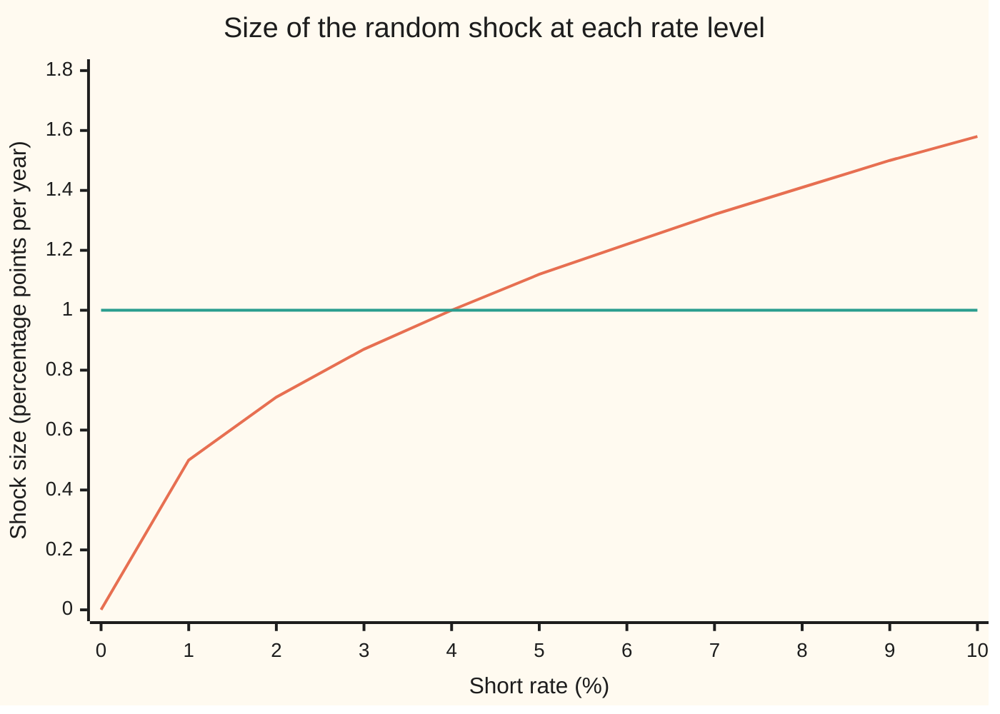
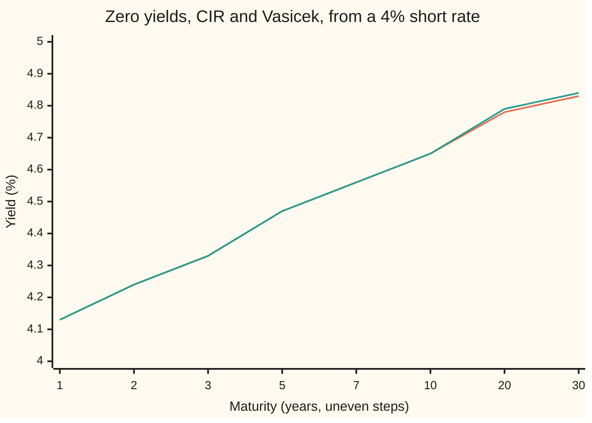

# Cox-Ingersoll-Ross: square-root noise that keeps the rate positive

[Syllabus](../../../SYLLABUS.md) → [Financial mathematics](../README.md) → [Short-Rate Models](../README.md#s30) → Cox-Ingersoll-Ross

---

## General Overview

A government bond pays $100 in five years and nothing before. That is a **zero**: a zero-coupon bond, one payment at the end. What it costs today depends on the interest rates of the next five years, and nobody knows those.

The shelf's house market starts the overnight rate at 4 percent. The rate is pulled toward 5 percent at speed 0.3 a year and jostled by random shocks of about 1 percentage point a year. The [Vasicek](02-vasicek-model.md) card prices this five-year zero with shocks of a fixed size. Fixed shocks have a flaw: at a rate of 0.5 percent, a 1-point shock still arrives at full strength and can push the rate below zero.

In 1985 John Cox, Jonathan Ingersoll and Stephen Ross changed one thing. The shock is scaled by the square root of the rate itself. At 4 percent the shock is the same 1 point as before. At 1 percent it is half a point. At zero it vanishes, and the pull toward 5 percent lifts the rate away. The model is called CIR after them.

This card prices the same five-year zero under CIR. The answer is **$79.99**, the same to the cent as the Vasicek price. The formula stays in closed form: a known function of today's rate, no simulation needed. And a single inequality, the **Feller condition**, says when the rate can never touch zero at all.

**CIR is Vasicek with the shock size scaled by the square root of the rate: the bond price keeps the form "a number times e to the minus (a number times today's rate)", and the rate stays positive whenever twice the pull times the target exceeds the squared noise.**

**What kind of fact this is:** a model: an assumption about how the rate moves that fits markets well enough, not a law. Inside the model, the bond formula is a theorem, proved on this card in Why it works; the Feller condition is a theorem whose key direction is proved in a folded callout there.

### The picture: shock size against the rate

Shock size here means the standard deviation of one year's random move in the rate, in percentage points.



Orange curve: CIR, shock size 0.05 times the square root of the rate. Green line: Vasicek, a flat 1 point. They cross at 4 percent, today's rate, by design. Below it CIR's shocks shrink to nothing; above it they grow.

---

## The formula

Notation first, in words. The short rate $r$ is the interest rate for the next instant, continuously compounded. A small letter d in front of a quantity means its change over a tiny time step. $W$ is Brownian motion: a random walk whose change $dW$ over a step of length dt is a bell-curve draw with spread the square root of dt. Three settings drive the rate: $\kappa$ (kappa), the pull speed; $\theta$ (theta), the target; $\sigma$ (sigma), the noise per square root of the rate. The model says how $r$ moves:

$$dr = \kappa\,(\theta - r)\,dt + \sigma\sqrt{r}\,dW$$

**Read it aloud:** each instant, the rate moves a fraction of the way toward its target, plus a random shock whose size is proportional to the square root of the rate.

The price of a zero paying 1 at maturity, with $\tau$ (tau) years left and today's rate $r_0$, is

$$P(\tau) = A(\tau)\,e^{-B(\tau)\,r_0}$$

with a helper number $\gamma = \sqrt{\kappa^2 + 2\sigma^2}$ and

$$B(\tau) = \frac{2\,(e^{\gamma\tau} - 1)}{(\gamma+\kappa)(e^{\gamma\tau}-1) + 2\gamma}, \qquad A(\tau) = \left[\frac{2\gamma\,e^{(\gamma+\kappa)\tau/2}}{(\gamma+\kappa)(e^{\gamma\tau}-1) + 2\gamma}\right]^{\nu}, \qquad \nu = \frac{2\kappa\theta}{\sigma^2}.$$

**Read it aloud:** the bond price is a level factor, set by the model's settings and the time left, times e to the minus (a sensitivity times today's rate).

| Symbol | Plain meaning | In the example | Push it up and the bond price… |
| --- | --- | --- | --- |
| $r$, $r_0$ | the short rate; $r_0$ is its value today | 4% today | falls: money earns more elsewhere |
| $\kappa$ | pull speed: the fraction of the gap to the target closed per year. Say "kappa". | 0.3 | falls here, since the rate is pulled up faster |
| $\theta$ | the target the rate is pulled toward. Say "theta". | 5% | falls |
| $\sigma$ | noise per square root of rate: shock size is $\sigma$ times the square root of $r$ | 0.05, so 1 point at 4% | rises a little: averaging discounts over wider paths |
| $W$, $dW$ | Brownian motion and its change over one step | a random draw each step | — |
| $t$, $T$, $\tau$ | time now, maturity, and years left, $\tau = T - t$ | 0, 5, 5 | falls: longer wait |
| $P$, $P_r$, $P_{rr}$ | today's price of 1 paid at maturity; $P_r$ and $P_{rr}$ are its first and second rates of change as the rate moves | 0.799904 | — |
| $B$ | sensitivity: how much the log price falls per unit of today's rate | 2.576655 | — |
| $A$ | level factor: the price if today's rate were zero | 0.886745 | — |
| $\gamma$ | helper number $\sqrt{\kappa^2 + 2\sigma^2}$. Say "gamma". | 0.308221 | — |
| $\nu$ | Feller ratio $2\kappa\theta/\sigma^2$: pull power over noise power. Say "nu". | 12 | — |
| $R$ | yield: the flat rate that reproduces the price, $R = -\ln P/\tau$ | 4.47% | — |

Two companion facts come with the model. The expected rate after $t$ years is $\theta + (r_0 - \theta)\,e^{-\kappa t}$, the same curve as Vasicek, since the pull term is the same. And the long yield, the yield of a very long zero, settles at $2\kappa\theta/(\gamma + \kappa)$, a little below the target.

The **Feller condition**, $2\kappa\theta \ge \sigma^2$, which is $\nu \ge 1$, is the line between a rate that never reaches zero and one that can.

### When it holds

- **One random driver.** Every maturity's yield moves with the single number $r$. Real curves also twist, with short and long yields moving opposite ways; a single factor cannot produce that, and [Beyond one factor](07-two-factor-and-lognormal-short-rate-models.md) adds a second.
- **Constant settings.** Three numbers cannot match every bond price on today's screen. Off-model bonds are mispriced by the fitting error; [Hull-White](04-hull-white-model.md) lets the target move with time to fit the curve exactly.
- **Pricing settings, not history.** Pull speed and target are fitted to prices, in the pricing world where every asset earns the short rate on average. Taking them from a history of rates prices bonds with a risk premium left in.
- **Rates that stay at or above zero.** Euro rates sat below zero from 2014 to 2022. CIR cannot put the rate there at all; a desk that needs it adds a fixed shift to the rate.
- **Feller for strict positivity only.** The bond formula holds whether or not Feller holds. If Feller fails, paths touch zero and bounce off: at noise 0.2 in this market, 804 of 2,000 simulated paths touch zero within five years.

---

## Why it works

### Step 0: the price is an average of discounts along paths

Hold a dollar in an account that earns the short rate as it moves. After five years it has grown by e to the power of the rate added up over the five years. So 1 paid in five years is worth, today, e to the minus that sum, averaged over every path the rate can take in the pricing world:

$$P = \mathrm{E}\!\left[e^{-\int_0^T r(s)\,ds}\right].$$

$\mathrm{E}$ is the expectation (probability-weighted average) and $\int_0^T r(s)\,ds$ is the rate added up continuously from now to maturity.

That average obeys a partial differential equation, the [A short-rate model](01-the-term-structure-equation.md) card's result. With $P$ as a function of the time left and today's rate, and subscripts marking a derivative (rate of change) in that variable:

$$P_\tau = \kappa(\theta - r)\,P_r + \tfrac12\sigma^2 r\,P_{rr} - r\,P, \qquad P(0, r) = 1.$$

Each term has a job. The first carries the pull. The second is the noise; its coefficient is half the squared shock size, $\tfrac12\sigma^2 r$ for CIR. The last is discounting. At maturity the bond pays 1 whatever the rate.

### Step 1: guess the shape and split the equation in two

Every coefficient in that equation is **affine** in $r$: a constant plus a constant times $r$. The drift $\kappa\theta - \kappa r$ is affine. The squared noise $\sigma^2 r$ is affine. That suggests trying

$$P = A(\tau)\,e^{-B(\tau)\,r}.$$

Then $P_r = -B\,P$, $P_{rr} = B^2 P$, and $P_\tau = (A'/A - B'\,r)\,P$, a prime marking a derivative in $\tau$. Put them in and divide by $P$:

$$\frac{A'}{A} - B'\,r = -\kappa\theta B + \kappa B\,r + \tfrac12\sigma^2 B^2\,r - r.$$

Both sides are a constant plus a multiple of $r$. For that to hold at every rate, the constants must match and the multiples must match:

$$B' = 1 - \kappa B - \tfrac12\sigma^2 B^2, \qquad \frac{A'}{A} = -\kappa\theta B, \qquad B(0) = 0,\; A(0) = 1.$$

A partial differential equation has become two ordinary ones, in time only. The first is a **Riccati equation**: a rate of change that is a quadratic in the unknown.

### Step 2: solve the Riccati equation, which is where $\gamma$ comes from

The right side of the $B$ equation is zero where $\tfrac12\sigma^2 B^2 + \kappa B - 1 = 0$. The quadratic formula gives roots $(-\kappa \pm \gamma)/\sigma^2$, and its discriminant is $\kappa^2 + 2\sigma^2$: that is $\gamma^2$. So $B$ starts at 0, rises with slope 1, and levels off at the positive root, $2/(\gamma + \kappa)$. Separating variables and splitting into partial fractions gives the closed form for $B$.

<details>
<summary>Detailed proof: solving for B</summary>

Write the positive root $b_+ = (\gamma - \kappa)/\sigma^2$ and the negative root $b_- = -(\gamma + \kappa)/\sigma^2$. The equation is $B' = -\tfrac12\sigma^2 (B - b_+)(B - b_-)$. Their difference is $b_+ - b_- = 2\gamma/\sigma^2$, so partial fractions give
$$\frac{\sigma^2}{2\gamma}\,\ln\left|\frac{B - b_+}{B - b_-}\right| = -\tfrac12\sigma^2\,\tau + c,$$
that is $(B - b_+)/(B - b_-) = C\,e^{-\gamma\tau}$. At $\tau = 0$, $B = 0$ fixes $C = b_+/b_- = -(\gamma - \kappa)/(\gamma + \kappa)$. Solve for $B$:
$$B = \frac{(\gamma-\kappa)(\gamma+\kappa)\,(1 - e^{-\gamma\tau})}{\sigma^2\,[(\gamma+\kappa) + (\gamma-\kappa)\,e^{-\gamma\tau}]}.$$
Since $(\gamma - \kappa)(\gamma + \kappa) = \gamma^2 - \kappa^2 = 2\sigma^2$, the $\sigma^2$ cancels to leave a 2. Multiply top and bottom by $e^{\gamma\tau}$ and write $\gamma - \kappa = 2\gamma - (\gamma + \kappa)$: the bottom becomes $(\gamma+\kappa)(e^{\gamma\tau} - 1) + 2\gamma$, the formula on this card.

</details>

### Step 3: integrate for A

The second equation says the log of $A$ falls at rate $\kappa\theta B$. So $\ln A(\tau) = -\kappa\theta \int_0^\tau B(s)\,ds$. That integral has a closed form, and raising e to it gives the bracket to the power $\nu$.

<details>
<summary>Detailed proof: the level factor</summary>

Write the denominator as $D(\tau) = (\gamma+\kappa)(e^{\gamma\tau} - 1) + 2\gamma$, so $D' = \gamma(\gamma+\kappa)e^{\gamma\tau}$ and $D(0) = 2\gamma$. Claim: $\int_0^\tau B = \frac{2}{\sigma^2}\left[\ln\frac{D}{2\gamma} - \frac{(\gamma+\kappa)\tau}{2}\right]$. At $\tau = 0$ both sides are 0. The derivative of the right side is
$$\frac{2}{\sigma^2}\left[\frac{D'}{D} - \frac{\gamma+\kappa}{2}\right] = \frac{(\gamma+\kappa)\left[2\gamma e^{\gamma\tau} - D\right]}{\sigma^2 D} = \frac{(\gamma+\kappa)(\gamma-\kappa)(e^{\gamma\tau} - 1)}{\sigma^2 D} = \frac{2(e^{\gamma\tau}-1)}{D} = B.$$
Multiply by $-\kappa\theta$: $\ln A = \frac{2\kappa\theta}{\sigma^2}\left[\ln 2\gamma + \frac{(\gamma+\kappa)\tau}{2} - \ln D\right]$, which is $\nu$ times the log of the bracket.

</details>

### Step 4: why the square root keeps the rate positive

Watch the rate as it falls toward zero. The pull is $\kappa(\theta - r)$; at zero it is $\kappa\theta$, a steady push upward that does not shrink. The shock is $\sigma\sqrt{r}$; at zero it is gone. Near zero the rate is a steady upward push plus a whisper of noise.

Whether the whisper can still reach zero is a contest between two numbers with the same units: the pull power $2\kappa\theta$ and the noise power $\sigma^2$. Feller showed in 1951 that zero is never reached when $2\kappa\theta \ge \sigma^2$, and is reached with positive probability when $2\kappa\theta < \sigma^2$. In this market $0.03$ beats $0.0025$ twelve times over.

<details>
<summary>Detailed proof: zero is never reached when the Feller ratio is at least 1</summary>

The tool is the **scale function**: a change of ruler under which the rate has no drift, so the chance of hitting one level before another becomes a ratio of distances. For a motion with pull $\mu(x)$ and squared shock $s^2(x)$, the ruler's slope at level x is $\exp\left(-\int 2\mu/s^2\right)$. For CIR, $2\mu/s^2 = \nu/x - 2\kappa/\sigma^2$, so the slope is $x^{-\nu}\,e^{2\kappa x/\sigma^2}$.

Start at $r_0$ and pick a low level a and a high level b around it. On the new ruler, the chance of hitting a before b is (distance from $r_0$ up to b) divided by (distance from a up to b). Near zero the slope behaves like $x^{-\nu}$. When $\nu \ge 1$, the integral of $x^{-\nu}$ down to zero is infinite, so the distance from a up to b grows without bound as a shrinks to zero, and the chance of reaching a first shrinks to zero. For every high level b, the rate hits b before 0 with certainty, so it never reaches zero. When $\nu < 1$ the integral is finite and this argument fails; that zero is then actually reached takes a second ingredient, the speed of the motion near zero, and is Feller's 1951 result, cited rather than proved here.

</details>

### Step 5: what changes from Vasicek, and what does not

The pull term is identical (the Vasicek card writes its speed as a), so the expected rate path is identical: from 4 percent, 4.776870 percent expected after five years in both models. The noise differs. Vasicek's squared shock is a constant, so in Step 1 it lands in the constant part and adds a $B^2$ term to $A$; its $B$ is the plain $(1 - e^{-\kappa\tau})/\kappa$. CIR's squared shock is proportional to $r$, so it lands in the $r$ part and bends $B$ itself, through the $\tfrac12\sigma^2 B^2$ in the Riccati equation. Both are affine: [Vasicek](02-vasicek-model.md) and CIR are the two classic members of the family whose bond prices are e to an affine function of the rate.

Matched at today's shock size, the two price the five-year zero almost identically, 0.799904 against 0.799856. They part company in the tails. After five years the CIR rate has spread 1.354680 points against Vasicek's 1.258447, because it spends more time above 4 percent where its shocks are larger. And on the same random draws, 6 Vasicek paths went below zero; no CIR path did.

The other door: skip the guess entirely. Solve the equation of Step 0 on a grid of rates and times, or simulate the rate and average the discounts. The code below does both, and both land on the formula.

---

## Worked numbers, by hand

CIR: pull speed $\kappa = 0.3$, target $\theta = 5\%$, noise $\sigma = 0.05$, today's rate $r_0 = 4\%$, five years.

| Step | Arithmetic | Value |
| --- | --- | --- |
| pull power $2\kappa\theta$ | 2 × 0.3 × 0.05 | 0.03 |
| noise power $\sigma^2$ | 0.05 × 0.05 | 0.0025 |
| Feller ratio $\nu$ | 0.03 / 0.0025 | 12: holds |
| $\gamma$ | square root of 0.09 + 0.005 | 0.308221 |
| $e^{\gamma T}$ | e to the 5 × 0.308221 | 4.669740 |
| denominator | 0.608221 × 3.669740 + 2 × 0.308221 | 2.848454 |
| $B(5)$ | 2 × 3.669740 / 2.848454 | 2.576655 |
| bracket in $A$ | 2 × 0.308221 × e to the 2.5 × 0.608221, over 2.848454 | 0.990034 |
| $A(5)$ | 0.990034 to the power 12 | 0.886745 |
| rate factor | e to the minus 2.576655 × 0.04 | 0.902067 |
| **price per 1 of face** | 0.886745 × 0.902067 | **0.799904** |
| yield | minus the log of 0.799904, over 5 | 4.465281% |
| Vasicek, same market | the [Vasicek](02-vasicek-model.md) formula | 0.799856 |

The $100 zero costs **$79.99** under CIR, and $79.99 under Vasicek: the gap is 0.000048 per dollar of face value. The five-year yield, 4.47 percent, sits above today's 4 percent because the rate is expected to climb toward 5.

### What breaks if you drop a piece

Correct price 0.799904.

| Mistake | Comes out at | What went wrong |
| --- | --- | --- |
| Feed Vasicek's noise 0.01 into CIR's $\sigma$ | 0.799259 | CIR's $\sigma$ multiplies the square root of the rate: at 4 percent that is a fifth of the intended shock |
| Drop the power $\nu$ on $A$ | 0.893077 | Power 1 instead of 12: the level factor acts as if the target were 0.42 percent, not 5 |
| Write $\gamma$ with $\sigma^2$ instead of $2\sigma^2$ | 0.849164 | The Riccati roots move, so both $A$ and $B$ are wrong |
| Discount flat at today's 4 percent | 0.818731 | Ignores the pull to 5 percent: $e^{-0.04 \times 5}$ |

### Both curves, maturity by maturity



Orange: CIR. Green: Vasicek. They agree to the hundredth of a percent out to ten years. Past twenty years CIR sits a hundredth lower, and its long yield settles at 4.932420 percent against Vasicek's 4.944444. Both stay below the 5 percent target: e to the minus a sum is a curved function, so averaging it over spread-out paths gives more than discounting at the average rate, and a higher price is a lower yield. CIR has slightly more spread above 4 percent, so slightly more of that effect.

---

## Code, from first principles, and it actually runs

The code prices the five-year zero four independent ways. Road 1 is the closed form. Road 2 solves the two Riccati equations numerically with fourth-order Runge-Kutta (a standard stepping rule for ordinary differential equations), never using their solution. Road 3 solves the partial differential equation of Step 0 on a grid of 200 steps in the rate and 5,000 steps in time, never guessing the affine shape. Road 4 simulates 5,000 pairs of rate paths straight from the model, each pair a path and its mirror image, and averages the discounts. The same random draws drive a Vasicek simulation beside it, and a second run at noise 0.2 breaks Feller on purpose. Random numbers come from a hand-written generator; nothing imported knows the answer.

### Python

```python
# Cox-Ingersoll-Ross: the 5-year zero four ways, and the same bond under Vasicek.
# Standard library only. Random numbers, ODE solver and PDE grid are written here.
from math import exp, log, sqrt, cos, sin, pi

K, TH, SIG, R0, T = 0.3, 0.05, 0.05, 0.04, 5.0    # CIR: pull, target, noise per root-rate
SIG_V = 0.01                                      # Vasicek noise: the shelf's house example

def cir_AB(tau, k=K, th=TH, s=SIG, two=2.0):     # road 1: the closed form
    g = sqrt(k * k + two * s * s)
    e = exp(g * tau); den = (g + k) * (e - 1.0) + 2.0 * g
    B = 2.0 * (e - 1.0) / den
    A = exp(2.0 * k * th / (s * s) * log(2.0 * g * exp((g + k) * tau / 2.0) / den))
    return A, B, g

def cir_P(tau, r=R0, k=K, th=TH, s=SIG):
    A, B, _ = cir_AB(tau, k, th, s)
    return A * exp(-B * r)

def vas_P(tau, r=R0):
    B = (1.0 - exp(-K * tau)) / K
    lnA = (TH - SIG_V ** 2 / (2 * K * K)) * (B - tau) - SIG_V ** 2 * B * B / (4 * K)
    return exp(lnA - B * r), B

def riccati_P(tau, n=500):                        # road 2: B' = 1 - kB - s^2 B^2/2, (lnA)' = -k th B
    f = lambda b: 1.0 - K * b - 0.5 * SIG * SIG * b * b
    h, b, lnA = tau / n, 0.0, 0.0
    for _ in range(n):
        k1 = f(b); k2 = f(b + h * k1 / 2); k3 = f(b + h * k2 / 2); k4 = f(b + h * k3)
        b1, b2, b3 = b + h * k1 / 2, b + h * k2 / 2, b + h * k3
        lnA -= K * TH * h * (b + 2 * b1 + 2 * b2 + b3) / 6
        b += h * (k1 + 2 * k2 + 2 * k3 + k4) / 6
    return exp(lnA - b * R0)

def pde_P(tau, rmax=0.4, m=200, dt=0.001):       # road 3: P_tau = k(th-r)P_r + s^2 r P_rr/2 - rP
    hr = rmax / m
    u = [1.0] * (m + 1)
    for _ in range(round(tau / dt)):
        v = u[:]
        for i in range(m + 1):
            r = i * hr; mu = K * (TH - r); D = 0.5 * SIG * SIG * r
            if i == 0:   ur, urr = (u[1] - u[0]) / hr, 0.0
            elif i == m: ur, urr = (u[m] - u[m - 1]) / hr, 0.0
            elif abs(mu) * hr <= 2 * D:
                ur, urr = (u[i + 1] - u[i - 1]) / (2 * hr), (u[i + 1] - 2 * u[i] + u[i - 1]) / hr ** 2
            else:
                ur = (u[i + 1] - u[i]) / hr if mu > 0 else (u[i] - u[i - 1]) / hr
                urr = (u[i + 1] - 2 * u[i] + u[i - 1]) / hr ** 2
            v[i] = u[i] + dt * (mu * ur + D * urr - r * u[i])
        u = v
    return u[round(R0 / hr)]

class Rng:                                        # splitmix64 + Box-Muller
    def __init__(self, seed): self.s = seed
    def u(self):
        self.s = (self.s + 0x9E3779B97F4A7C15) & 0xFFFFFFFFFFFFFFFF
        z = self.s
        z = ((z ^ (z >> 30)) * 0xBF58476D1CE4E5B9) & 0xFFFFFFFFFFFFFFFF
        z = ((z ^ (z >> 27)) * 0x94D049BB133111EB) & 0xFFFFFFFFFFFFFFFF
        return ((z ^ (z >> 31)) >> 11) * 2.0 ** -53
    def pair(self):
        a, b = 1.0 - self.u(), self.u()
        rad = sqrt(-2.0 * log(a))
        return rad * cos(2 * pi * b), rad * sin(2 * pi * b)

def simulate(s, pairs=5000, steps=250, seed=20260928):   # road 4: paths straight from the SDE
    rng, dt = Rng(seed), T / steps
    out = {"c": [], "v": [], "rT": [], "c0": 0, "v0": 0}
    for _ in range(pairs):
        zs = []
        for _ in range(steps // 2): zs.extend(rng.pair())
        for sign in (1.0, -1.0):                      # antithetic twin: same draws, flipped
            rc = rv = R0; ic = iv = 0.0; hitc = hitv = False
            for z in zs:
                dw = sign * z * sqrt(dt)
                nc = rc + K * (TH - rc) * dt + s * sqrt(max(rc, 0.0)) * dw
                nv = rv + K * (TH - rv) * dt + SIG_V * dw
                ic += 0.5 * (rc + max(nc, 0.0)) * dt; iv += 0.5 * (rv + nv) * dt
                hitc = hitc or nc <= 0.0; hitv = hitv or nv < 0.0
                rc, rv = max(nc, 0.0), nv
            out["c"].append(exp(-ic)); out["v"].append(exp(-iv)); out["rT"].append(rc)
            out["c0"] += hitc; out["v0"] += hitv
    return out

def tot(xs):                                      # plain left-to-right sum, as in the Rust twin
    s = 0.0
    for x in xs: s += x
    return s

def mean_se(xs):                                  # antithetic pairs averaged first, then the spread
    ps = [(xs[i] + xs[i + 1]) / 2 for i in range(0, len(xs), 2)]
    m = tot(ps) / len(ps)
    return m, sqrt(tot((p - m) ** 2 for p in ps) / (len(ps) - 1) / len(ps))

A5, B5, G = cir_AB(T)
den5 = (G + K) * (exp(G * T) - 1) + 2 * G; base5 = 2 * G * exp((G + K) * T / 2) / den5
P1, P2, P3 = cir_P(T), riccati_P(T), pde_P(T)
sim = simulate(SIG)
P4, se4 = mean_se(sim["c"]); PV4, seV = mean_se(sim["v"])
mT = tot(sim["rT"]) / len(sim["rT"]); sdT = sqrt(tot((x - mT) ** 2 for x in sim["rT"]) / (len(sim["rT"]) - 1))
PV, BV = vas_P(T)
e = exp(-K * T)
mean_f = TH + (R0 - TH) * e
sd_c = sqrt(R0 * SIG ** 2 / K * (e - e * e) + TH * SIG ** 2 / (2 * K) * (1 - e) ** 2)
sd_v = sqrt(SIG_V ** 2 / (2 * K) * (1 - e * e))
yld = lambda p, t: -log(p) / t * 100
fail = simulate(0.2, pairs=1000)
rows = [("Feller 2*kappa*theta", 2 * K * TH), ("Feller sigma^2", SIG * SIG), ("gamma", G), ("e^(gamma T)", exp(G * T)),
        ("D = (g+k)(e^(gT)-1) + 2g", den5), ("power 2*kappa*theta/sigma^2", 2 * K * TH / (SIG * SIG)),
        ("A base 2g e^((g+k)T/2) / D", base5), ("e^(-B(5) r0)", exp(-B5 * R0)), ("B(5)", B5), ("A(5)", A5), ("1 closed form P(5)", P1), ("2 Riccati by RK4 P(5)", P2),
        ("3 PDE grid P(5)", P3), ("4 Monte Carlo P(5)", P4), ("  Monte Carlo std error", se4),
        ("CIR 5y yield %", yld(P1, T)), ("Vasicek B(5)", BV), ("Vasicek P(5) formula", PV),
        ("Vasicek P(5) Monte Carlo", PV4), ("Vasicek 5y yield %", yld(PV, T)), ("CIR minus Vasicek P(5)", P1 - PV), ("e^(-kappa T)", e),
        ("CIR long yield %", 200 * K * TH / (G + K)), ("Vasicek long yield %", 100 * (TH - SIG_V ** 2 / (2 * K * K))),
        ("mean r(5) formula %", 100 * mean_f), ("mean r(5) CIR sim %", 100 * mT),
        ("sd r(5) CIR formula %", 100 * sd_c), ("sd r(5) CIR sim %", 100 * sdT), ("sd r(5) Vasicek %", 100 * sd_v),
        ("paths below zero, CIR", sim["c0"]), ("paths below zero, Vasicek", sim["v0"]),
        ("wrong: Vasicek sigma 0.01 in CIR", cir_P(T, s=0.01)),
        ("wrong: A without its power", exp(log(base5) - B5 * R0)),
        ("wrong: gamma without the 2", cir_AB(T, two=1.0)[0] * exp(-cir_AB(T, two=1.0)[1] * R0)),
        ("wrong: flat e^(-r0 T)", exp(-R0 * T)),
        ("try: sigma 0.2 P(5)", cir_P(T, s=0.2)), ("try: sigma 0.2 paths touching 0 of 2000", fail["c0"]),
        ("try: r0 0.01 P(5)", cir_P(T, r=0.01)), ("try: kappa 1.0 P(5)", cir_P(T, k=1.0))]
for name, v in rows:
    print(f"{name:<40} {v:>12.6f}" if isinstance(v, float) else f"{name:<40} {v:>12d}")
mats = (1, 2, 3, 5, 7, 10, 20, 30)
print("chart maturity    " + " ".join(f"{t:5d}" for t in mats))
print("chart CIR %       " + " ".join(f"{yld(cir_P(t), t):5.2f}" for t in mats))
print("chart Vasicek %   " + " ".join(f"{yld(vas_P(t)[0], t):5.2f}" for t in mats))
print("chart rate %      " + " ".join(f"{i:5d}" for i in range(11)))
print("chart CIR noise % " + " ".join(f"{100 * SIG * sqrt(i / 100):5.2f}" for i in range(11)))
assert abs(P2 - P1) < 1e-10, "RK4 on the Riccati pair must land on the closed form"
assert abs(P3 - P1) < 2e-5, "PDE grid, which never guesses the affine shape, must agree"
assert abs(P4 - P1) < 4 * se4, "Monte Carlo from the SDE within four standard errors"
assert abs(PV4 - PV) < 4 * seV, "Vasicek on the same draws within four standard errors"
assert abs(mT - mean_f) < 4 * mean_se(sim["rT"])[1], "simulated mean rate vs the transition law"
assert sim["c0"] == 0, "Feller holds: no CIR path touches zero"
assert fail["c0"] > 0, "Feller broken (sigma 0.2): some paths do touch zero"
print("ALL CHECKS PASS")
```

**Ran 2026-09-28 on macOS, Python 3.14.6, standard library only. All checks passed. Output, pasted from the run:**

```
Feller 2*kappa*theta                         0.030000
Feller sigma^2                               0.002500
gamma                                        0.308221
e^(gamma T)                                  4.669740
D = (g+k)(e^(gT)-1) + 2g                     2.848454
power 2*kappa*theta/sigma^2                 12.000000
A base 2g e^((g+k)T/2) / D                   0.990034
e^(-B(5) r0)                                 0.902067
B(5)                                         2.576655
A(5)                                         0.886745
1 closed form P(5)                           0.799904
2 Riccati by RK4 P(5)                        0.799904
3 PDE grid P(5)                              0.799900
4 Monte Carlo P(5)                           0.799864
  Monte Carlo std error                      0.000038
CIR 5y yield %                               4.465281
Vasicek B(5)                                 2.589566
Vasicek P(5) formula                         0.799856
Vasicek P(5) Monte Carlo                     0.799819
Vasicek 5y yield %                           4.466481
CIR minus Vasicek P(5)                       0.000048
e^(-kappa T)                                 0.223130
CIR long yield %                             4.932420
Vasicek long yield %                         4.944444
mean r(5) formula %                          4.776870
mean r(5) CIR sim %                          4.777633
sd r(5) CIR formula %                        1.354680
sd r(5) CIR sim %                            1.355511
sd r(5) Vasicek %                            1.258447
paths below zero, CIR                               0
paths below zero, Vasicek                           6
wrong: Vasicek sigma 0.01 in CIR             0.799259
wrong: A without its power                   0.893077
wrong: gamma without the 2                   0.849164
wrong: flat e^(-r0 T)                        0.818731
try: sigma 0.2 P(5)                          0.809155
try: sigma 0.2 paths touching 0 of 2000           804
try: r0 0.01 P(5)                            0.864188
try: kappa 1.0 P(5)                          0.786738
chart maturity        1     2     3     5     7    10    20    30
chart CIR %        4.13  4.24  4.33  4.47  4.56  4.65  4.78  4.83
chart Vasicek %    4.13  4.24  4.33  4.47  4.56  4.65  4.79  4.84
chart rate %          0     1     2     3     4     5     6     7     8     9    10
chart CIR noise %  0.00  0.50  0.71  0.87  1.00  1.12  1.22  1.32  1.41  1.50  1.58
ALL CHECKS PASS
```

### Rust

```rust
// Cox-Ingersoll-Ross: the 5-year zero four ways, and the same bond under Vasicek.
// std only. Random numbers, ODE solver and PDE grid are written here.
use std::f64::consts::PI;

const K: f64 = 0.3; const TH: f64 = 0.05; const SIG: f64 = 0.05; const R0: f64 = 0.04; const T: f64 = 5.0;
const SIG_V: f64 = 0.01; // Vasicek noise: the shelf's house example

fn sq(x: f64) -> f64 { x.powf(2.0) }

// road 1: the closed form; returns (A, B, gamma)
fn cir_ab(tau: f64, k: f64, th: f64, s: f64, two: f64) -> (f64, f64, f64) {
    let g = (k * k + two * s * s).sqrt();
    let e = (g * tau).exp(); let den = (g + k) * (e - 1.0) + 2.0 * g;
    let b = 2.0 * (e - 1.0) / den;
    let a = (2.0 * k * th / (s * s) * (2.0 * g * ((g + k) * tau / 2.0).exp() / den).ln()).exp();
    (a, b, g)
}

fn cir_p(tau: f64, r: f64, k: f64, th: f64, s: f64) -> f64 { let (a, b, _) = cir_ab(tau, k, th, s, 2.0); a * (-b * r).exp() }

fn vas_p(tau: f64, r: f64) -> (f64, f64) {
    let b = (1.0 - (-K * tau).exp()) / K;
    let ln_a = (TH - sq(SIG_V) / (2.0 * K * K)) * (b - tau) - sq(SIG_V) * b * b / (4.0 * K);
    ((ln_a - b * r).exp(), b)
}

// road 2: B' = 1 - kB - s^2 B^2/2, (lnA)' = -k th B, by RK4
fn riccati_p(tau: f64, n: usize) -> f64 {
    let f = |b: f64| 1.0 - K * b - 0.5 * SIG * SIG * b * b;
    let h = tau / n as f64;
    let (mut b, mut ln_a) = (0.0, 0.0);
    for _ in 0..n {
        let k1 = f(b); let k2 = f(b + h * k1 / 2.0); let k3 = f(b + h * k2 / 2.0); let k4 = f(b + h * k3);
        let (b1, b2, b3) = (b + h * k1 / 2.0, b + h * k2 / 2.0, b + h * k3);
        ln_a -= K * TH * h * (b + 2.0 * b1 + 2.0 * b2 + b3) / 6.0;
        b += h * (k1 + 2.0 * k2 + 2.0 * k3 + k4) / 6.0;
    }
    (ln_a - b * R0).exp()
}

// road 3: explicit grid for P_tau = k(th-r)P_r + s^2 r P_rr/2 - rP
fn pde_p(tau: f64, rmax: f64, m: usize, dt: f64) -> f64 {
    let hr = rmax / m as f64;
    let mut u = vec![1.0f64; m + 1];
    for _ in 0..(tau / dt).round() as usize {
        let mut v = u.clone();
        for i in 0..=m {
            let r = i as f64 * hr; let mu = K * (TH - r); let d = 0.5 * SIG * SIG * r;
            let (ur, urr);
            if i == 0 { ur = (u[1] - u[0]) / hr; urr = 0.0; }
            else if i == m { ur = (u[m] - u[m - 1]) / hr; urr = 0.0; }
            else if mu.abs() * hr <= 2.0 * d {
                ur = (u[i + 1] - u[i - 1]) / (2.0 * hr); urr = (u[i + 1] - 2.0 * u[i] + u[i - 1]) / sq(hr);
            } else {
                ur = if mu > 0.0 { (u[i + 1] - u[i]) / hr } else { (u[i] - u[i - 1]) / hr };
                urr = (u[i + 1] - 2.0 * u[i] + u[i - 1]) / sq(hr);
            }
            v[i] = u[i] + dt * (mu * ur + d * urr - r * u[i]);
        }
        u = v;
    }
    u[(R0 / hr).round() as usize]
}

struct Rng(u64); // splitmix64 + Box-Muller
impl Rng {
    fn u(&mut self) -> f64 {
        self.0 = self.0.wrapping_add(0x9E3779B97F4A7C15);
        let mut z = self.0;
        z = (z ^ (z >> 30)).wrapping_mul(0xBF58476D1CE4E5B9);
        z = (z ^ (z >> 27)).wrapping_mul(0x94D049BB133111EB);
        ((z ^ (z >> 31)) >> 11) as f64 * (1.0 / 9007199254740992.0)
    }
    fn pair(&mut self) -> (f64, f64) {
        let a = 1.0 - self.u(); let b = self.u(); let rad = (-2.0 * a.ln()).sqrt();
        (rad * (2.0 * PI * b).cos(), rad * (2.0 * PI * b).sin())
    }
}

struct Sim { c: Vec<f64>, v: Vec<f64>, rt: Vec<f64>, c0: i64, v0: i64 }

// road 4: paths straight from the SDE, each with an antithetic twin
fn simulate(s: f64, pairs: usize, steps: usize, seed: u64) -> Sim {
    let mut rng = Rng(seed); let dt = T / steps as f64;
    let mut out = Sim { c: vec![], v: vec![], rt: vec![], c0: 0, v0: 0 };
    for _ in 0..pairs {
        let mut zs = Vec::with_capacity(steps);
        for _ in 0..steps / 2 { let (x, y) = rng.pair(); zs.push(x); zs.push(y); }
        for sign in [1.0, -1.0] {
            let (mut rc, mut rv, mut ic, mut iv) = (R0, R0, 0.0, 0.0);
            let (mut hitc, mut hitv) = (false, false);
            for &z in &zs {
                let dw = sign * z * dt.sqrt();
                let nc = rc + K * (TH - rc) * dt + s * rc.max(0.0).sqrt() * dw;
                let nv = rv + K * (TH - rv) * dt + SIG_V * dw;
                ic += 0.5 * (rc + nc.max(0.0)) * dt; iv += 0.5 * (rv + nv) * dt;
                hitc = hitc || nc <= 0.0; hitv = hitv || nv < 0.0;
                rc = nc.max(0.0); rv = nv;
            }
            out.c.push((-ic).exp()); out.v.push((-iv).exp()); out.rt.push(rc);
            out.c0 += hitc as i64; out.v0 += hitv as i64;
        }
    }
    out
}

fn tot(xs: &[f64]) -> f64 { let mut s = 0.0; for &x in xs { s += x; } s }

fn mean_se(xs: &[f64]) -> (f64, f64) {
    let ps: Vec<f64> = xs.chunks(2).map(|p| (p[0] + p[1]) / 2.0).collect();
    let n = ps.len() as f64; let m = tot(&ps) / n;
    let d: Vec<f64> = ps.iter().map(|p| sq(p - m)).collect();
    (m, (tot(&d) / (n - 1.0) / n).sqrt())
}

fn yld(p: f64, t: f64) -> f64 { -p.ln() / t * 100.0 }

fn main() {
    let (a5, b5, g) = cir_ab(T, K, TH, SIG, 2.0);
    let (p1, p2, p3) = (cir_p(T, R0, K, TH, SIG), riccati_p(T, 500), pde_p(T, 0.4, 200, 0.001));
    let sim = simulate(SIG, 5000, 250, 20260928);
    let (p4, se4) = mean_se(&sim.c); let (pv4, sev) = mean_se(&sim.v); let nt = sim.rt.len() as f64; let mt = tot(&sim.rt) / nt;
    let dev: Vec<f64> = sim.rt.iter().map(|x| sq(x - mt)).collect();
    let sdt = (tot(&dev) / (nt - 1.0)).sqrt(); let (pv, bv) = vas_p(T, R0);
    let e = (-K * T).exp();
    let mean_f = TH + (R0 - TH) * e;
    let sd_c = (R0 * sq(SIG) / K * (e - e * e) + TH * sq(SIG) / (2.0 * K) * sq(1.0 - e)).sqrt();
    let sd_v = (sq(SIG_V) / (2.0 * K) * (1.0 - e * e)).sqrt();
    let fail = simulate(0.2, 1000, 250, 20260928);
    let (ag, bg, _) = cir_ab(T, K, TH, SIG, 1.0);
    let den5 = (g + K) * ((g * T).exp() - 1.0) + 2.0 * g; let base5 = 2.0 * g * ((g + K) * T / 2.0).exp() / den5;
    let rows: Vec<(&str, f64)> = vec![
        ("Feller 2*kappa*theta", 2.0 * K * TH), ("Feller sigma^2", SIG * SIG), ("gamma", g), ("e^(gamma T)", (g * T).exp()),
        ("D = (g+k)(e^(gT)-1) + 2g", den5), ("power 2*kappa*theta/sigma^2", 2.0 * K * TH / (SIG * SIG)),
        ("A base 2g e^((g+k)T/2) / D", base5), ("e^(-B(5) r0)", (-b5 * R0).exp()), ("B(5)", b5), ("A(5)", a5), ("1 closed form P(5)", p1), ("2 Riccati by RK4 P(5)", p2),
        ("3 PDE grid P(5)", p3), ("4 Monte Carlo P(5)", p4), ("  Monte Carlo std error", se4),
        ("CIR 5y yield %", yld(p1, T)), ("Vasicek B(5)", bv), ("Vasicek P(5) formula", pv),
        ("Vasicek P(5) Monte Carlo", pv4), ("Vasicek 5y yield %", yld(pv, T)), ("CIR minus Vasicek P(5)", p1 - pv), ("e^(-kappa T)", e),
        ("CIR long yield %", 200.0 * K * TH / (g + K)), ("Vasicek long yield %", 100.0 * (TH - sq(SIG_V) / (2.0 * K * K))),
        ("mean r(5) formula %", 100.0 * mean_f), ("mean r(5) CIR sim %", 100.0 * mt),
        ("sd r(5) CIR formula %", 100.0 * sd_c), ("sd r(5) CIR sim %", 100.0 * sdt), ("sd r(5) Vasicek %", 100.0 * sd_v),
        ("paths below zero, CIR", sim.c0 as f64), ("paths below zero, Vasicek", sim.v0 as f64),
        ("wrong: Vasicek sigma 0.01 in CIR", cir_p(T, R0, K, TH, 0.01)),
        ("wrong: A without its power", (base5.ln() - b5 * R0).exp()),
        ("wrong: gamma without the 2", ag * (-bg * R0).exp()),
        ("wrong: flat e^(-r0 T)", (-R0 * T).exp()),
        ("try: sigma 0.2 P(5)", cir_p(T, R0, K, TH, 0.2)), ("try: sigma 0.2 paths touching 0 of 2000", fail.c0 as f64),
        ("try: r0 0.01 P(5)", cir_p(T, 0.01, K, TH, SIG)), ("try: kappa 1.0 P(5)", cir_p(T, R0, 1.0, TH, SIG))];
    for (name, v) in &rows {
        if name.contains("paths") { println!("{:<40} {:>12}", name, *v as i64) } else { println!("{:<40} {:>12.6}", name, v) }
    }
    let mats = [1.0, 2.0, 3.0, 5.0, 7.0, 10.0, 20.0, 30.0];
    let line = |xs: Vec<String>| xs.join(" ");
    println!("chart maturity    {}", line(mats.iter().map(|t| format!("{:5}", *t as i64)).collect()));
    println!("chart CIR %       {}", line(mats.iter().map(|&t| format!("{:5.2}", yld(cir_p(t, R0, K, TH, SIG), t))).collect()));
    println!("chart Vasicek %   {}", line(mats.iter().map(|&t| format!("{:5.2}", yld(vas_p(t, R0).0, t))).collect()));
    println!("chart rate %      {}", line((0..11).map(|i| format!("{:5}", i)).collect()));
    println!("chart CIR noise % {}", line((0..11).map(|i| format!("{:5.2}", 100.0 * SIG * (i as f64 / 100.0).sqrt())).collect()));
    assert!((p2 - p1).abs() < 1e-10, "RK4 on the Riccati pair must land on the closed form");
    assert!((p3 - p1).abs() < 2e-5, "PDE grid, which never guesses the affine shape, must agree");
    assert!((p4 - p1).abs() < 4.0 * se4, "Monte Carlo from the SDE within four standard errors");
    assert!((pv4 - pv).abs() < 4.0 * sev, "Vasicek on the same draws within four standard errors");
    assert!((mt - mean_f).abs() < 4.0 * mean_se(&sim.rt).1, "simulated mean rate vs the transition law");
    assert!(sim.c0 == 0, "Feller holds: no CIR path touches zero");
    assert!(fail.c0 > 0, "Feller broken (sigma 0.2): some paths do touch zero");
    println!("ALL CHECKS PASS");
}
```

**Ran 2026-09-28 on macOS, rustc 1.98.1, no crates. All checks passed. Output, pasted from the run:**

```
Feller 2*kappa*theta                         0.030000
Feller sigma^2                               0.002500
gamma                                        0.308221
e^(gamma T)                                  4.669740
D = (g+k)(e^(gT)-1) + 2g                     2.848454
power 2*kappa*theta/sigma^2                 12.000000
A base 2g e^((g+k)T/2) / D                   0.990034
e^(-B(5) r0)                                 0.902067
B(5)                                         2.576655
A(5)                                         0.886745
1 closed form P(5)                           0.799904
2 Riccati by RK4 P(5)                        0.799904
3 PDE grid P(5)                              0.799900
4 Monte Carlo P(5)                           0.799864
  Monte Carlo std error                      0.000038
CIR 5y yield %                               4.465281
Vasicek B(5)                                 2.589566
Vasicek P(5) formula                         0.799856
Vasicek P(5) Monte Carlo                     0.799819
Vasicek 5y yield %                           4.466481
CIR minus Vasicek P(5)                       0.000048
e^(-kappa T)                                 0.223130
CIR long yield %                             4.932420
Vasicek long yield %                         4.944444
mean r(5) formula %                          4.776870
mean r(5) CIR sim %                          4.777633
sd r(5) CIR formula %                        1.354680
sd r(5) CIR sim %                            1.355511
sd r(5) Vasicek %                            1.258447
paths below zero, CIR                               0
paths below zero, Vasicek                           6
wrong: Vasicek sigma 0.01 in CIR             0.799259
wrong: A without its power                   0.893077
wrong: gamma without the 2                   0.849164
wrong: flat e^(-r0 T)                        0.818731
try: sigma 0.2 P(5)                          0.809155
try: sigma 0.2 paths touching 0 of 2000           804
try: r0 0.01 P(5)                            0.864188
try: kappa 1.0 P(5)                          0.786738
chart maturity        1     2     3     5     7    10    20    30
chart CIR %        4.13  4.24  4.33  4.47  4.56  4.65  4.78  4.83
chart Vasicek %    4.13  4.24  4.33  4.47  4.56  4.65  4.79  4.84
chart rate %          0     1     2     3     4     5     6     7     8     9    10
chart CIR noise %  0.00  0.50  0.71  0.87  1.00  1.12  1.22  1.32  1.41  1.50  1.58
ALL CHECKS PASS
```

The two outputs match line for line: both programs use the same generator, the same order of arithmetic and the same system maths library.

> [!TIP]
> **Try changing**
> Guess the direction first. Then run it.
> - **Break Feller.** Set the noise to 0.2, so the noise power, 0.2 squared, beats the pull power 0.03. The price moves only to 0.809155, but 804 of 2,000 paths now touch zero within five years. The formula survives; positivity does not.
> - **Start near zero.** Set today's rate to 1 percent. The zero rises to 0.864188. The rate still climbs toward 5 percent, so the price is well below the flat-1-percent value.
> - **Pull harder.** Set the pull speed to 1.0. The rate reaches 5 percent sooner, and the price falls to 0.786738.

---

## The usual mistake

> [!warning]
> **Reading CIR's $\sigma$ as a rate volatility.** In Vasicek, noise 0.01 means shocks of 1 point a year. In CIR the shock is $\sigma$ times the square root of the rate, so $\sigma$ is in different units. The CIR number that gives a 1-point shock at 4 percent is 0.05. Putting 0.01 in gives 0.799259 instead of 0.799904, and far too narrow a spread of future rates.
>
> - **Treating Feller as the condition for the bond formula.** The formula holds for any positive settings. Feller decides only whether the rate path can touch zero.
> - **Expecting the square root to reshape the curve.** Matched at today's shock size, CIR and Vasicek price this zero 0.000048 apart. The square root changes the tails and the behaviour near zero, not the middle of the curve.
> - **Flat discounting.** Five years at today's 4 percent gives 0.818731, not 0.799904. The expected climb toward 5 percent is the bigger effect.
> - **Simulating the rate without a floor.** A stepped simulation can overshoot below zero where the square root is undefined. The check takes the square root of the larger of the rate and zero; skipping that crashes the run or produces nonsense.

---

## Where you meet it in real life

- **Credit risk.** A company's default hazard (its instantaneous chance of default per year) must stay positive, and it is often modelled as a CIR process: [A random hazard](../44-Reduced-Form%20Models%20-%20Risky%20Bonds%2C%20Spreads%20and%20Random%20Hazards/03-stochastic-hazard-cox-process.md).
- **Stochastic volatility.** The Heston model lets a stock's variance wander as a CIR process, for the same reason: a variance below zero is meaningless.
- **Bond options.** CIR bond options have closed forms, and a coupon bond option splits into zero options by [Bond options](05-bond-options-and-jamshidians-trick.md).
- **Insurers and pension funds.** Long-horizon scenario generators use CIR-style rates so that no scenario runs a negative rate for decades.
- **Negative-rate years.** When euro and yen rates went below zero, plain CIR could not fit them; desks moved to shifted versions or to [Hull-White](04-hull-white-model.md), fitted as in [Calibrating Hull-White](08-calibrating-a-short-rate-model.md) and built on a lattice as in [The Hull-White tree](06-hull-white-trinomial-tree.md).

> **Say it back**
> CIR moves the short rate toward a target, with shocks sized by the square root of the rate. Because the drift and the squared shock are both a constant plus a constant times the rate, the bond price is a level factor times e to the minus a sensitivity times today's rate, and the two factors solve ordinary equations with closed forms. The rate never touches zero when twice the pull times the target is at least the squared noise. Matched to Vasicek at today's shock size, the five-year zero costs $79.99 in both. The models differ in the tails: CIR's rate cannot go negative, Vasicek's can.

---

## What this builds on

- [Vasicek](02-vasicek-model.md): the same pull toward a target, with shocks of fixed size, and the house example this card prices again.
- [A short-rate model](01-the-term-structure-equation.md): the equation every short-rate bond price obeys, used in Step 0.
- Ito's lemma and Brownian motion, from wing 11: the rules for random shocks that turn the average of Step 0 into that equation.

---

## Where this goes next

- [A random hazard](../44-Reduced-Form%20Models%20-%20Risky%20Bonds%2C%20Spreads%20and%20Random%20Hazards/03-stochastic-hazard-cox-process.md): the same square-root process, driving a company's chance of default instead of the interest rate.
- [Hull-White](04-hull-white-model.md): Vasicek's shape with a target that moves with time, so the model matches today's curve exactly.

CIR fits positivity but not today's curve with three fixed numbers; what a default-risky bond is worth when the hazard itself follows this process is the question [A random hazard](../44-Reduced-Form%20Models%20-%20Risky%20Bonds%2C%20Spreads%20and%20Random%20Hazards/03-stochastic-hazard-cox-process.md) answers.

---

## Sources

Verified 2026-09-28: every link below resolves to the publisher's page.

- Cox, John C., Jonathan E. Ingersoll, and Stephen A. Ross. "A Theory of the Term Structure of Interest Rates." *Econometrica* 53, no. 2 (1985): 385–407. [doi:10.2307/1911242](https://doi.org/10.2307/1911242). The model and its bond formula.
- Feller, William. "Two Singular Diffusion Problems." *Annals of Mathematics* 54, no. 1 (1951): 173–182. [doi:10.2307/1969318](https://doi.org/10.2307/1969318). The square-root process and when it reaches zero.
- Vasicek, Oldrich. "An Equilibrium Characterization of the Term Structure." *Journal of Financial Economics* 5, no. 2 (1977): 177–188. [doi:10.1016/0304-405X(77)90016-2](https://doi.org/10.1016/0304-405X(77)90016-2). The fixed-noise model this card compares against.
- Brigo, Damiano, and Fabio Mercurio. *Interest Rate Models — Theory and Practice*, 2nd ed. Springer, 2006. [Publisher page](https://doi.org/10.1007/978-3-540-34604-3). CIR, its shifted extension and bond options, in the chapter on one-factor short-rate models.
