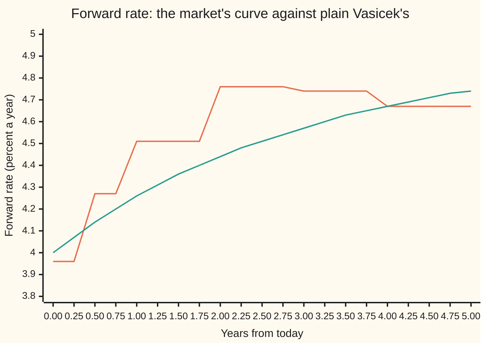

# Hull-White: Vasicek with a time-dependent drift that fits today's curve exactly

[Syllabus](../../../SYLLABUS.md) → [Financial mathematics](../../../SYLLABUS.md#w12) → [Short-Rate Models](../../../SYLLABUS.md#w12-s30) → Hull-White

---

## General Overview

One morning a screen carries six quotes: two deposits and four par swaps, from six months out to five years. The ladder on [Bootstrapping](../02-Curves/04-bootstrapping-the-discount-curve.md) turns them into six prices of a future dollar. A dollar due in five years costs 0.79621728 dollars that morning. Every bond and swap on the desk is valued off those six numbers.

Now the desk sells an option on a bond. The option pays off only if rates move, so its price needs a model of how the overnight rate wanders. The shelf's model is Vasicek ([Vasicek](02-vasicek-model.md)): the rate is pulled toward 5 percent at speed 0.3 a year, shaken with volatility 1 percent a year, and starts at 4 percent. It prices every bond in closed form. It prices the five-year dollar at 0.79985563. On a 10,000,000 dollar payment that is 36,383.48 dollars too much.

That miss is fatal. An option hedged with bonds the model misprices is priced off the wrong bonds.

John Hull and Alan White fixed this in 1990 with one change. Vasicek pulls toward a fixed level. Hull and White let the level move with the calendar, and set its path so that every model bond price equals the market's. The model carries that path as the **drift term** θ(t) (theta), a known function of time; the moving level is θ(t) divided by the pull speed. Theta is not a forecast. It is the curve, rewritten as a push on the rate.

**Hull-White keeps Vasicek's pull and noise but moves the pull's target through time, and for each choice of pull speed and noise exactly one path of target makes every zero-coupon price match today's curve.**

**What kind of fact this is:** a model (an assumption about how rates move, which fits markets well enough, not a law), with a theorem inside it: given the speed and the noise, the fitting drift exists, is unique, and is derived on this card in Why it works.

### The picture: the curve Vasicek cannot draw

A **forward rate** is the rate the curve charges for borrowing over one instant at a future date, locked today. Between two quoted dates the six quotes pin only an average, so this card holds the forward flat in each gap: the simplest rule on [Between the pillars](../02-Curves/05-curve-interpolation-and-shape.md).



Orange: the market's forward curve, flat inside each gap and stepping at each quoted date; it rises to 4.76 percent in the third year and then falls. Green: plain Vasicek's forward curve, one smooth rise from 4.00 to 4.74 percent. Its three numbers allow only a few shapes, and a hump that turns down after three years is not one of them. Hull-White's forward curve is the orange line exactly.

---

## The formula

Notation first, in words. The **short rate** $r(t)$ is the rate for borrowing over one instant at time $t$, in years from today. $dr$ is its change over the next instant, $dt$ is that instant's length, and $dW$ is a random kick with mean zero and variance $dt$: the Brownian step of [Mean reversion](../../11-Stochastic%20processes%20and%20calculus/06-Ito%20Calculus/05-ornstein-uhlenbeck-and-cir-processes.md). $D(T)$ is the discount factor: today's price of a dollar due at time $T$. $f(0,t)$ is today's forward rate for the instant at $t$, and $f'(0,t)$ is its slope, how fast it changes with the date. They are tied by $D(T) = e^{-\int_0^T f(0,s)\,ds}$: a future dollar is discounted at the forward rate of every instant on the way. $a$ is the pull speed and $\sigma$ the noise size, Vasicek's two constants. $\theta(t)$ is the drift term.

The model:

$$dr \;=\; \bigl(\theta(t) - a\,r\bigr)\,dt \;+\; \sigma\,dW$$

The drift that fits the curve:

$$\boxed{\;\theta(t) \;=\; f'(0,t) \;+\; a\,f(0,t) \;+\; \frac{\sigma^2}{2a}\bigl(1 - e^{-2at}\bigr)\;}$$

**Read it aloud:** the push at each date is the forward curve's slope, plus the pull speed times the forward level, plus a small lift that pays for the noise.

Once theta is set, a zero-coupon bond (one dollar at $T$, nothing before) is worth, at a later date $t$ with the short rate at $r(t)$:

$$P(t,T) \;=\; \frac{D(T)}{D(t)}\,\exp\!\Bigl(B\,f(0,t) \;-\; \frac{\sigma^2}{4a}\bigl(1 - e^{-2at}\bigr)B^2 \;-\; B\,r(t)\Bigr), \qquad B = B(t,T) = \frac{1 - e^{-a(T-t)}}{a}$$

Everything in front of $e^{-B\,r(t)}$ is called $A(t,T)$. At $t = 0$ with the rate starting at the curve's own front end, $r(0) = f(0,0)$, this is $D(T)$ for every $T$. That is the fit, by construction.

| Symbol | Plain meaning | In our example | Push it up and the answer… |
| --- | --- | --- | --- |
| $r(t)$, $r$ | the short rate: borrowing for one instant at time $t$ | starts at 3.9605 percent, the first forward | every bond falls; its logarithm by $B$ per unit of rate |
| $t$, $T$ | today-to-date in years; $T$ a bond's payment date | 0 to 5 | a later $T$ is discounted longer |
| $a$ | the pull speed: how hard the rate is drawn to its target | 0.3 a year, half-life 2.31 years | the noise fades faster; the lift shrinks |
| $\sigma$ | the noise size, per year | 1 percent | the lift grows; zero prices stay fixed, theta rises |
| $dW$, $dt$, $dr$ | a random kick with variance $dt$; one instant of time; the rate's change over it | — | — |
| $\theta(t)$ | the drift: the push toward the moving target | 1.4400 percent a year at 2.5 years | the rate's mean path rises; bonds fall |
| $f(0,t)$, $f'(0,t)$ | today's forward rate at $t$; its slope | 4.7569 percent in the third year; slope 0 inside a gap | theta rises with either |
| $D(T)$ | today's price of a dollar due at $T$: the curve | 0.79621728 at five years | — |
| $P(t,T)$ | the model's price at $t$ of a dollar due at $T$ | 0.848232 at 1.5 years, if the rate sits at its expected 4.5134 percent | — |
| $B(t,T)$, $A$ | $B$: the bond's exposure to the rate, in years of the rate's memory left; $A$: everything in front of $e^{-B r}$ | $B$ = 2.589566 for $t = 0$, $T = 5$ | the bond swings more per unit of rate |
| $x(t)$, $\varphi(t)$ | the rate's noise part, pulled to zero and starting there; its known part, the expected path | $\varphi$ = 4.5134 percent at 1.5 years | — |
| $V(T)$ | the variance of the total rate paid from today to $T$ | 0.001561 at five years | the price lift from averaging grows |

Two helper pieces, used in Why it works. The **lift** is how far the rate's expected path sits above the forward curve:

$$\text{lift}(t) \;=\; \frac{\sigma^2}{2a^2}\bigl(1 - e^{-at}\bigr)^2$$

It is 0.0335 percent at five years. The variance of the rate paid over the whole life is

$$V(T) \;=\; \frac{\sigma^2}{a^2}\Bigl(T - 2B(0,T) + \frac{1 - e^{-2aT}}{2a}\Bigr)$$

**Existence, uniqueness and the edges.** For fixed $a$ and $\sigma$, theta exists wherever the forward curve has a slope, and it is unique: the curve fixes it with no freedom left. Where the forward jumps, as it does at each quoted date on this curve, the slope is a one-off step and theta carries a **kick**: at that instant the rate is lifted by the size of the jump. As $a$ falls to zero the formula tends to $f'(0,t) + \sigma^2 t$, the Ho-Lee model's drift, with no pull at all. As $\sigma$ falls to zero the lift vanishes and the rate simply walks along the forward curve.

### When it holds

- **Rates are normally distributed.** The noise is added, not multiplied, so the rate can go below zero. Here the five-year rate has mean 4.7077 percent and spread 1.2584 percent, and the chance it sits below zero is 0.000092. Products that break at a negative rate need [Cox-Ingersoll-Ross](03-cox-ingersoll-ross-model.md) or a lognormal cousin.
- **One source of noise.** Every maturity is driven by the same kick, so long and short rates always move the same way. Products that pay on the curve's shape are mispriced; [Beyond one factor](07-two-factor-and-lognormal-short-rate-models.md) adds a second.
- **Speed and noise are constants.** Two numbers cannot match every option quote across expiries; which quotes pin them is [Calibrating Hull-White](08-calibrating-a-short-rate-model.md).
- **The curve is filled between its quotes.** Theta needs a forward at every date. The quoted prices are matched whatever the fill; the prices between them, and theta's kicks, belong to the interpolation rule, not the market.
- **Today only.** Tomorrow's curve needs a new theta, so model prices move when the curve moves, not only when the rate does.

---

## Why it works

### Step 0: a bond price depends on the rate's average path and its spread, and only the drift touches the average

A zero-coupon bond pays one dollar at $T$. Its price today is the average, over every path the rate might take (weighted the pricing way, not by real-world odds), of the discount $e^{-\int_0^T r\,dt}$ ([A short-rate model](01-the-term-structure-equation.md)). In a Vasicek-type model the total rate paid, $\int_0^T r\,dt$, is normally distributed. So the price depends on two things only: the total's mean and its variance. The noise sets the variance, and the drift cannot change it. The drift sets the mean. A moving target can steer the mean path one date at a time, and a curve is one condition per date. That match of freedom to conditions is the whole idea.

### Step 1: split the rate into a known path and pure noise

Write the rate as $r(t) = \varphi(t) + x(t)$. Here $\varphi(t)$ (phi) is a path known today, the rate's expected path. $x(t)$ is the noise part: it obeys $dx = -a\,x\,dt + \sigma\,dW$ and starts at zero. That is an Ornstein-Uhlenbeck process, pulled toward zero ([Mean reversion](../../11-Stochastic%20processes%20and%20calculus/06-Ito%20Calculus/05-ornstein-uhlenbeck-and-cir-processes.md)). Adding the two equations shows the split works whenever

$$\theta(t) \;=\; \varphi'(t) + a\,\varphi(t)$$

So choosing theta and choosing the mean path are the same choice.

### Step 2: price the bond with the path and the noise separated

The known path comes out of the average untouched:

$$P(0,T) \;=\; e^{-\int_0^T \varphi(t)\,dt}\;\cdot\;\text{average of } e^{-\int_0^T x\,dt}$$

The total noise $\int_0^T x\,dt$ is normal with mean zero and variance $V(T)$. For a normal quantity with mean zero and variance $V$, the average of its negative exponential is $e^{V/2}$: the exponential weighs low values more than it discounts high ones, so averaging lifts the price. Hence

$$P(0,T) \;=\; \exp\Bigl(-\int_0^T \varphi(t)\,dt \;+\; \tfrac12 V(T)\Bigr)$$

The Monte Carlo road in the code measures that lift directly. At five years it finds 1.00078107, with standard error 0.00000781; the formula says 1.00078061.

### Step 3: force every price onto the curve

The market says $P(0,T) = D(T) = e^{-\int_0^T f(0,s)\,ds}$ for every $T$. Setting the two exponents equal:

$$\int_0^T \varphi(t)\,dt \;=\; \int_0^T f(0,t)\,dt \;+\; \tfrac12 V(T) \quad\text{for every } T$$

Two quantities equal for every $T$ have equal slopes in $T$. The slope of $V$ is $(\sigma^2/a^2)(1 - e^{-aT})^2$. So

$$\varphi(t) \;=\; f(0,t) \;+\; \frac{\sigma^2}{2a^2}\bigl(1 - e^{-at}\bigr)^2 \;=\; f(0,t) + \text{lift}(t)$$

The expected rate must sit above the forward curve by exactly the lift. The lift adds up over the life to exactly half the variance, and that cancels the averaging bonus of Step 2. At five years both come to 0.000780.

### Step 4: read the drift off the mean path

Put this $\varphi(t)$ into Step 1's rule, $\theta = \varphi' + a\varphi$:

$$\theta(t) \;=\; f'(0,t) + a\,f(0,t) + \frac{\sigma^2}{a}\bigl(1 - e^{-at}\bigr)e^{-at} + \frac{\sigma^2}{2a}\bigl(1 - e^{-at}\bigr)^2$$

The last two terms share the factor $1 - e^{-at}$; the bracket left over is $2e^{-at} + 1 - e^{-at} = 1 + e^{-at}$, and $(1 - e^{-at})(1 + e^{-at}) = 1 - e^{-2at}$. That is the boxed formula.

Uniqueness comes from the same chain run backwards. The curve fixes $\int_0^T \varphi$ for every $T$, so it fixes $\varphi$, so it fixes theta. Nothing was chosen along the way except $a$ and $\sigma$.

### Step 5: the fit holds by construction, and at later dates too

At $t = 0$, $B(0,T)$ multiplies $f(0,0) - r(0)$, which is zero, and the other correction has the factor $1 - e^{0} = 0$. The price formula returns $D(T)$ exactly. At a later date, the same split gives the price in terms of the noise part $x(t)$. Substituting $x(t) = r(t) - f(0,t) - \text{lift}(t)$ turns it into the $A$, $B$ form in The formula.

<details>
<summary>Detailed proof: the bond price at a later date</summary>

Fix $t < T$ and condition on the noise part $x(t)$. From $t$ on, $x$ decays as $x(t)e^{-a(u-t)}$ plus fresh noise, so $\int_t^T x\,du$ is normal with mean $B(t,T)\,x(t)$ and variance $V(T - t)$, the same formula as $V$ with the clock restarted.

The known path contributes $\int_t^T \varphi = \int_t^T f(0,u)\,du + \tfrac12\bigl(V(T) - V(t)\bigr)$, by Step 3 at two dates. And $e^{-\int_t^T f(0,u)\,du} = D(T)/D(t)$. So

$$P(t,T) = \frac{D(T)}{D(t)}\exp\Bigl(-\tfrac12\bigl[V(T) - V(t) - V(T-t)\bigr] - B\,x(t)\Bigr)$$

Write $E = e^{-at}$ and $F = e^{-a(T-t)}$, so $e^{-aT} = EF$ and $aB = 1 - F$. Expanding the three $V$ terms, the plain time terms cancel and

$$\tfrac12\bigl[V(T) - V(t) - V(T-t)\bigr] = \frac{\sigma^2}{2a^3}\Bigl[2(1-E)(1-F) - \tfrac12(1-E^2)(1-F^2)\Bigr]$$

Put $1 - F = aB$ and $1 - F^2 = aB(2 - aB)$. The bracket becomes $aB\bigl[(1-E)^2 + \tfrac12(1-E^2)\,aB\bigr]$,
so the whole term equals $\frac{\sigma^2}{2a^2}(1-E)^2 B + \frac{\sigma^2}{4a}(1-E^2)B^2$, that is, $B\cdot\text{lift}(t) + \frac{\sigma^2}{4a}(1 - e^{-2at})B^2$. Substituting $x(t) = r(t) - f(0,t) - \text{lift}(t)$ cancels the $B\cdot\text{lift}(t)$ term and leaves the $A$, $B$ formula. The fourth road in the code tests the result independently: it simulates the rate to 1.5 years, prices the remaining bond with the formula, discounts along each path, and averages back to 0.79621618 against the market's 0.79621728, well inside the standard error of 0.00000337.

</details>

The same drift falls out of a different road. [Heath-Jarrow-Morton](../31-Forward-Rate%20Models/01-hjm-framework-and-the-drift-condition.md) models the whole forward curve, lets no-arbitrage fix its drift, and recovers Hull-White when each forward's volatility fades as $\sigma e^{-a(T-t)}$. [The Hull-White tree](06-hull-white-trinomial-tree.md) finds theta numerically instead, one tree step at a time.

---

## Worked numbers, by hand

The curve first: the six discount factors and the forward in each gap, from the slice E ladder.

| Gap, years | $D$ at the gap's end | Forward in the gap, percent | Kick at the gap's end, percentage points |
| --- | --- | --- | --- |
| 0 to 0.5 | 0.98039216 | 3.9605 | +0.3073 |
| 0.5 to 1 | 0.95969290 | 4.2679 | +0.2383 |
| 1 to 2 | 0.91740758 | 4.5061 | +0.2508 |
| 2 to 3 | 0.87478903 | 4.7569 | −0.0200 |
| 3 to 4 | 0.83431725 | 4.7369 | −0.0627 |
| 4 to 5 | 0.79621728 | 4.6742 | none |

Inside each gap the forward is flat, so its slope is zero and theta is $a f + $ the noise term. Theta across each gap, in percent a year: 1.1882 to 1.1925, 1.2847 to 1.2879, 1.3594 to 1.3635, 1.4387 to 1.4410, 1.4350 to 1.4362, 1.4174 to 1.4181. The kicks carry the slope.

Theta at 2.5 years, and the five-year zero rebuilt from it:

| Step | Arithmetic | Value |
| --- | --- | --- |
| forward at 2.5 years | the 2-to-3 gap | 4.7569 percent |
| pull times forward | 0.3 × 4.7569 | 1.4271 percent |
| noise term | $\frac{0.01^2}{0.6}(1 - e^{-1.5})$ | 0.0129 percent |
| **theta at 2.5 years** | 1.4271 + 0.0129 | **1.4400 percent a year** |
| the target it pulls toward | theta ÷ 0.3 | 4.8001 percent |
| forward rate paid, 0 to 5 years | $-\ln D(5)$, the gaps' forwards times their lengths | 0.227883 |
| lift paid, 0 to 5 years | integral of the lift | 0.000780 |
| half the variance | $\tfrac12 V(5)$, with $B(0,5) = 2.589566$ | 0.000780 |
| **five-year zero** | $e^{-0.227883 - 0.000780 + 0.000780}$ | **0.79621728** |

The expected rate pays a little more than the forward curve, and the spread of outcomes hands exactly that back.

A second case, at a later date. At 1.5 years the rate's expected level is 4.5134 percent, and there the bond maturing at five years is worth 0.848232. If the rate has climbed to 6 percent instead, it is worth 0.821345.

### What breaks if you drop a piece

The five-year zero, rebuilt from a damaged theta, against the market's 0.79621728; dollar errors on 10,000,000.

| Mistake | Comes out at | What went wrong |
| --- | --- | --- |
| Drop the noise term from theta | 0.79683882, 6,215.38 too much | The expected rate sits on the forward curve, and averaging over the spread lifts the price |
| Drop the kicks at the quoted dates | 0.81007656, 138,592.78 too much | The slope term is gone, so the rate never climbs the curve's steps |
| Start the rate at 4 percent, not the curve's 3.9605 | 0.79540379, 8,134.93 too little | The fit needs $r(0) = f(0,0)$; the gap fades only at the pull speed, worth $B(0,5) = 2.59$ years of it |
| Plain Vasicek, fixed target 5 percent | 0.79985563, 36,383.48 too much | Three numbers cannot draw this curve |

Vasicek's miss is not one number. It changes sign along the curve.

```
Vasicek's price minus the market's, on 10,000,000.00 dollars due at each date (█ = $2,000)
0.5 y  ███                      −$5,414.59
1 y    █                        −$1,969.80
2 y    ██████                   +$12,210.86
3 y    █████████████████        +$33,263.01
4 y    █████████████████████    +$41,074.62
5 y    ██████████████████       +$36,383.48
```

Hull-White draws no bar: its prices equal the market's to eight decimals.

---

## Code, from first principles, and it actually runs

Both programs build the slice E curve with the bootstrap ladder, then reach the fit by five roads. Road 1 is the closed form, which matches by construction. Road 2 feeds theta, kicks included, into the equation for the rate's mean path, solves it step by step (fourth-order Runge-Kutta, 400 steps a year), and prices each quoted date from the result; it never uses the lift formula. Road 3 simulates the noise part with exact pull-to-zero steps, 50 a year, 20,000 paths each paired with its mirror image, and measures the averaging lift. Road 4 simulates to 1.5 years, prices the remaining bond with the $A$, $B$ formula, and discounts back. Road 5 hands theta's formula plain Vasicek's own curve, differentiated numerically, and must get back Vasicek's fixed push, 0.3 × 5 percent = 0.01500000. The random numbers are a 64-bit linear congruential generator and Box-Muller, written out; the normal CDF is Simpson's rule.

### Python

```python
# Hull-White check: Vasicek's spring with a moving anchor theta(t), fitted to the slice E
# curve.  Standard library only; nothing imported that already knows an answer.  Roads:
# (1) the A, B closed form; (2) theta(t) fed into the mean-rate equation, integrated by
# RK4, kicks at the pillars; (3) Monte Carlo of the spring noise, own random numbers;
# (4) Monte Carlo of a discounted bond price 18 months out; (5) theta read off plain
# Vasicek's own curve by numerical differentiation, which must come out flat at a*b.
from math import exp, log, sqrt, cos, pi

DEPOSITS = ((0.5, 0.0400), (1.0, 0.0420))            # (years, simple rate)
SWAPS = ((2, 0.0440), (3, 0.0455), (4, 0.0462), (5, 0.0465))   # (years, par rate)
A, SIG = 0.3, 0.01                    # reversion speed and volatility: the shelf's house pair
VB, VR0 = 0.05, 0.04                  # plain Vasicek: fixed anchor and starting rate
LOAN = 10_000_000.0

D = {0.0: 1.0}                        # the bootstrap ladder, as on the slice E card
for T, r in DEPOSITS: D[T] = 1.0 / (1.0 + T * r)
for n, S in SWAPS: D[float(n)] = (1.0 - S * sum(D[float(j)] for j in range(1, n))) / (1.0 + S)
PIL = sorted(D)                                       # 0, 0.5, 1, 2, 3, 4, 5
FW = [log(D[PIL[i]] / D[PIL[i + 1]]) / (PIL[i + 1] - PIL[i]) for i in range(6)]

def gap(t): return min(sum(1 for p in PIL[1:] if t >= p), 5)   # which gap t sits in
def f0(t): return FW[gap(t)]                          # forward rate f(0,t), flat in each gap
def Dt(t): i = gap(t); return D[PIL[i]] * exp(-FW[i] * (t - PIL[i]))
def Bf(t, T): return (1.0 - exp(-A * (T - t))) / A
def V(T): return SIG**2 / A**2 * (T - 2.0 * Bf(0.0, T) + (1.0 - exp(-2.0 * A * T)) / (2.0 * A))
def lift(t): return SIG**2 / (2.0 * A**2) * (1.0 - exp(-A * t))**2   # mean rate minus forward
def conv(t): return SIG**2 / (2.0 * A) * (1.0 - exp(-2.0 * A * t))
def closed(t, T, r):                                  # road 1: P(t,T) = A(t,T) exp(-B r)
    B = Bf(t, T)
    return Dt(T) / Dt(t) * exp(B * f0(t) - SIG**2 / (4.0 * A) * (1.0 - exp(-2.0 * A * t)) * B * B - B * r)

def road2(r0, use_conv=True, kicks=True):             # dm/dt = theta - a m, dI/dt = m
    m, I, out = r0, 0.0, {}
    for i in range(6):
        t0, n = PIL[i], int(400 * (PIL[i + 1] - PIL[i])); h = (PIL[i + 1] - t0) / n
        th = lambda t: A * FW[i] + (conv(t) if use_conv else 0.0)  # f' = 0 inside a gap
        for k in range(n):
            t = t0 + k * h
            k1 = th(t) - A * m;                 j1 = m
            k2 = th(t + h / 2) - A * (m + h / 2 * k1); j2 = m + h / 2 * k1
            k3 = th(t + h / 2) - A * (m + h / 2 * k2); j3 = m + h / 2 * k2
            k4 = th(t + h) - A * (m + h * k3);  j4 = m + h * k3
            m += h / 6 * (k1 + 2 * k2 + 2 * k3 + k4); I += h / 6 * (j1 + 2 * j2 + 2 * j3 + j4)
        out[PIL[i + 1]] = exp(-I + 0.5 * V(PIL[i + 1]))
        if kicks and i < 5: m += FW[i + 1] - FW[i]      # f' at a pillar: the rate steps
    return out

def simpson(g, a, b, n=200):
    h = (b - a) / n
    return h / 3 * (g(a) + g(b) + sum((4 if k % 2 else 2) * g(a + k * h) for k in range(1, n)))
def ncdf(x): return 0.5 + (1 if x > 0 else -1) * simpson(lambda u: exp(-u * u / 2) / sqrt(2 * pi), 0.0, abs(x), 2000)

state = 20260928                                      # 64-bit LCG, then Box-Muller
def unif():
    global state
    state = (state * 6364136223846793005 + 1442695040888963407) % 2**64
    return ((state >> 11) + 0.5) / 2**53
def gauss(): u1 = unif(); u2 = unif(); return sqrt(-2.0 * log(u1)) * cos(2.0 * pi * u2)

NP, STEPS, TS = 20000, 50, 1.5                        # antithetic pairs, steps a year, scenario date
dt = 1.0 / STEPS; ea = exp(-A * dt); sd = SIG * sqrt((1.0 - exp(-2.0 * A * dt)) / (2.0 * A))
iphi = {T: -log(Dt(T)) + simpson(lift, 0.0, T) for T in (1.0, TS, 5.0)}   # integral of the mean path
stats = {1.0: [0.0, 0.0], 5.0: [0.0, 0.0], TS: [0.0, 0.0]}
for _ in range(NP):
    x = I = 0.0
    for k in range(1, 5 * STEPS + 1):
        nx = x * ea + sd * gauss(); I += 0.5 * dt * (x + nx); x = nx   # exact spring step
        if k in (STEPS, 5 * STEPS):
            v = 0.5 * (exp(-I) + exp(I)); s = stats[k / STEPS]; s[0] += v; s[1] += v * v
        if k == int(TS * STEPS):                      # road 4: discount, then price the bond
            rp = f0(TS) + lift(TS)
            v = 0.5 * (exp(-iphi[TS] - I) * closed(TS, 5.0, rp + x) + exp(-iphi[TS] + I) * closed(TS, 5.0, rp - x))
            s = stats[TS]; s[0] += v; s[1] += v * v
def mc(T): s = stats[T]; mu = s[0] / NP; return mu, sqrt((s[1] / NP - mu * mu) / NP)

def lnDV(T): B = Bf(0.0, T); return (VB - SIG**2 / (2 * A**2)) * (B - T) - SIG**2 * B * B / (4 * A) - B * VR0
def vas_theta(t, h=1e-3):                             # road 5: theta from Vasicek's own curve
    f = -(lnDV(t + h) - lnDV(t - h)) / (2 * h); fp = -(lnDV(t + h) - 2 * lnDV(t) + lnDV(t - h)) / (h * h)
    return fp + A * f + conv(t)

R2 = road2(FW[0])
print("the slice E curve: pillar, D(T), forward % in the gap ending there")
for i, T in enumerate(PIL[1:]): print(f"  {T:3.1f}  {D[T]:.8f}  {100 * FW[i]:.4f}")
print("theta % a year: gap, at its start, at its end, kick at its end")
for i in range(6):
    kick = f"{100 * (FW[i + 1] - FW[i]):+.4f}" if i < 5 else "  none"
    print(f"  {PIL[i]:3.1f}-{PIL[i + 1]:3.1f}  {100 * (A * FW[i] + conv(PIL[i])):.4f}  {100 * (A * FW[i] + conv(PIL[i + 1])):.4f}  {kick}")
print(f"theta at 2.5 y %: a f {100 * A * f0(2.5):.4f} + convexity {100 * conv(2.5):.4f} = {100 * (A * f0(2.5) + conv(2.5)):.4f}; "
      f"anchor theta/a {100 * (f0(2.5) + conv(2.5) / A):.4f}")
print(f"pieces: half-life {log(2) / A:.2f} y; B(0,5) {Bf(0.0, 5.0):.6f}; V(5) {V(5.0):.6f}; lift(5) % {100 * lift(5.0):.4f}")
il = simpson(lift, 0.0, 5.0)
print("5-year zero, by hand: integral of forward, integral of lift, half variance, price")
print(f"  {-log(D[5.0]):.6f}  {il:.6f}  {0.5 * V(5.0):.6f}  {exp(log(D[5.0]) - il + 0.5 * V(5.0)):.8f}")
print("pillar: market, road 1 closed form, road 2 theta integrated, Vasicek; Vasicek miss $ on 10m")
for T in PIL[1:]:
    dv = exp(lnDV(T))
    print(f"  {T:3.1f}  {D[T]:.8f}  {closed(0.0, T, FW[0]):.8f}  {R2[T]:.8f}  {dv:.8f}  {LOAN * (dv - D[T]):.2f}")
for T in (1.0, 5.0):
    mu, se = mc(T)
    print(f"road 3, {T:.0f} y: E[exp(-int x)] {mu:.8f} se {se:.8f}; exp(V/2) {exp(0.5 * V(T)):.8f}; "
          f"price {exp(-iphi[T]) * mu:.8f}")
mu4, se4 = mc(TS)
print(f"road 4: E[discount to 1.5 y x P(1.5,5)] {mu4:.8f} se {se4:.8f}; market D(5) {D[5.0]:.8f}")
rs = f0(TS) + lift(TS)
print(f"at 1.5 y: expected rate % {100 * rs:.4f}; P(1.5,5) there {closed(TS, 5.0, rs):.6f}; at 6% {closed(TS, 5.0, 0.06):.6f}")
th5 = [vas_theta(t) for t in (1.0, 2.5, 4.0)]
print("road 5, theta from Vasicek's curve at 1, 2.5, 4 y: " + " ".join(f"{v:.8f}" for v in th5) + f"; a*b {A * VB:.8f}")
m5, s5 = f0(5.0) + lift(5.0), sqrt(conv(5.0))
print(f"r(5): mean % {100 * m5:.4f}, sd % {100 * s5:.4f}, chance below zero {ncdf(-m5 / s5):.6f}")
print("what breaks, 5-year price and $ error on 10m:")
for lab, p in (("no convexity term", road2(FW[0], use_conv=False)[5.0]), ("no kicks", road2(FW[0], kicks=False)[5.0]),
               ("start at 4%", road2(VR0)[5.0]), ("plain Vasicek", exp(lnDV(5.0)))):
    print(f"  {lab:<18} {p:.8f}  {LOAN * (p - D[5.0]):.2f}")
tg = [0.25 * k for k in range(21)]
print("chart, years      " + " ".join(f"{t:5.2f}" for t in tg))
print("chart, market f % " + " ".join(f"{100 * f0(t):5.2f}" for t in tg))
print("chart, Vasicek f %" + " ".join(f"{100 * (VR0 * exp(-A * t) + VB * (1 - exp(-A * t)) - lift(t)):5.2f}" for t in tg))

assert all(abs(R2[T] / D[T] - 1.0) < 1e-9 for T in PIL[1:]), "theta integrated must land on every pillar"
for T in (1.0, 5.0):
    mu, se = mc(T); assert abs(mu - exp(0.5 * V(T))) < 4 * se, "spring noise must lift the price by exp(V/2)"
assert abs(mu4 - D[5.0]) < 4 * se4, "discounted bond price must average back to today's price"
assert all(abs(v - A * VB) < 1e-7 for v in th5), "Vasicek's own curve must return its constant anchor"
print("ALL CHECKS PASS")
```

**Ran 2026-09-28 on macOS, Python 3.14.6, standard library only. All checks passed. Output, pasted from the run:**

```
the slice E curve: pillar, D(T), forward % in the gap ending there
  0.5  0.98039216  3.9605
  1.0  0.95969290  4.2679
  2.0  0.91740758  4.5061
  3.0  0.87478903  4.7569
  4.0  0.83431725  4.7369
  5.0  0.79621728  4.6742
theta % a year: gap, at its start, at its end, kick at its end
  0.0-0.5  1.1882  1.1925  +0.3073
  0.5-1.0  1.2847  1.2879  +0.2383
  1.0-2.0  1.3594  1.3635  +0.2508
  2.0-3.0  1.4387  1.4410  -0.0200
  3.0-4.0  1.4350  1.4362  -0.0627
  4.0-5.0  1.4174  1.4181    none
theta at 2.5 y %: a f 1.4271 + convexity 0.0129 = 1.4400; anchor theta/a 4.8001
pieces: half-life 2.31 y; B(0,5) 2.589566; V(5) 0.001561; lift(5) % 0.0335
5-year zero, by hand: integral of forward, integral of lift, half variance, price
  0.227883  0.000780  0.000780  0.79621728
pillar: market, road 1 closed form, road 2 theta integrated, Vasicek; Vasicek miss $ on 10m
  0.5  0.98039216  0.98039216  0.98039216  0.97985070  -5414.59
  1.0  0.95969290  0.95969290  0.95969290  0.95949592  -1969.80
  2.0  0.91740758  0.91740758  0.91740758  0.91862867  12210.86
  3.0  0.87478903  0.87478903  0.87478903  0.87811533  33263.01
  4.0  0.83431725  0.83431725  0.83431725  0.83842471  41074.62
  5.0  0.79621728  0.79621728  0.79621728  0.79985563  36383.48
road 3, 1 y: E[exp(-int x)] 1.00001320 se 0.00000013; exp(V/2) 1.00001339; price 0.95969271
road 3, 5 y: E[exp(-int x)] 1.00078107 se 0.00000781; exp(V/2) 1.00078061; price 0.79621764
road 4: E[discount to 1.5 y x P(1.5,5)] 0.79621618 se 0.00000337; market D(5) 0.79621728
at 1.5 y: expected rate % 4.5134; P(1.5,5) there 0.848232; at 6% 0.821345
road 5, theta from Vasicek's curve at 1, 2.5, 4 y: 0.01500000 0.01500000 0.01500000; a*b 0.01500000
r(5): mean % 4.7077, sd % 1.2584, chance below zero 0.000092
what breaks, 5-year price and $ error on 10m:
  no convexity term  0.79683882  6215.38
  no kicks           0.81007656  138592.78
  start at 4%        0.79540379  -8134.93
  plain Vasicek      0.79985563  36383.48
chart, years       0.00  0.25  0.50  0.75  1.00  1.25  1.50  1.75  2.00  2.25  2.50  2.75  3.00  3.25  3.50  3.75  4.00  4.25  4.50  4.75  5.00
chart, market f %  3.96  3.96  4.27  4.27  4.51  4.51  4.51  4.51  4.76  4.76  4.76  4.76  4.74  4.74  4.74  4.74  4.67  4.67  4.67  4.67  4.67
chart, Vasicek f % 4.00  4.07  4.14  4.20  4.26  4.31  4.36  4.40  4.44  4.48  4.51  4.54  4.57  4.60  4.63  4.65  4.67  4.69  4.71  4.73  4.74
ALL CHECKS PASS
```

### Rust

```rust
// Hull-White check: Vasicek's spring with a moving anchor theta(t), fitted to the slice E
// curve.  Rust std only; nothing used that already knows an answer.  Roads: (1) the A, B
// closed form; (2) theta(t) fed into the mean-rate equation, integrated by RK4, kicks at
// the pillars; (3) Monte Carlo of the spring noise, own random numbers; (4) Monte Carlo
// of a discounted bond price 18 months out; (5) theta read off plain Vasicek's own curve
// by numerical differentiation, which must come out flat at a*b.
use std::f64::consts::PI;

const A: f64 = 0.3; // reversion speed and volatility: the shelf's house pair
const SIG: f64 = 0.01;
const VB: f64 = 0.05; // plain Vasicek: fixed anchor and starting rate
const VR0: f64 = 0.04;
const LOAN: f64 = 10_000_000.0;
const PIL: [f64; 7] = [0.0, 0.5, 1.0, 2.0, 3.0, 4.0, 5.0];

struct Curve { d: [f64; 7], fw: [f64; 6] }
impl Curve {
    fn gap(&self, t: f64) -> usize { PIL[1..].iter().filter(|&&p| t >= p).count().min(5) }
    fn f0(&self, t: f64) -> f64 { self.fw[self.gap(t)] } // forward rate f(0,t), flat in each gap
    fn dt(&self, t: f64) -> f64 { let i = self.gap(t); self.d[i] * (-self.fw[i] * (t - PIL[i])).exp() }
    fn closed(&self, t: f64, tt: f64, r: f64) -> f64 { // road 1: P(t,T) = A(t,T) exp(-B r)
        let b = bf(t, tt);
        self.dt(tt) / self.dt(t) * (b * self.f0(t) - SIG.powi(2) / (4.0 * A) * (1.0 - (-2.0 * A * t).exp()) * b * b - b * r).exp()
    }
    fn road2(&self, r0: f64, use_conv: bool, kicks: bool) -> [f64; 7] { // dm/dt = theta - a m, dI/dt = m
        let (mut m, mut int, mut out) = (r0, 0.0, [1.0; 7]);
        for i in 0..6 {
            let t0 = PIL[i];
            let n = (400.0 * (PIL[i + 1] - PIL[i])) as usize;
            let h = (PIL[i + 1] - t0) / n as f64;
            let th = |t: f64| A * self.fw[i] + if use_conv { conv(t) } else { 0.0 }; // f' = 0 inside a gap
            for k in 0..n {
                let t = t0 + k as f64 * h;
                let k1 = th(t) - A * m; let j1 = m;
                let k2 = th(t + h / 2.0) - A * (m + h / 2.0 * k1); let j2 = m + h / 2.0 * k1;
                let k3 = th(t + h / 2.0) - A * (m + h / 2.0 * k2); let j3 = m + h / 2.0 * k2;
                let k4 = th(t + h) - A * (m + h * k3); let j4 = m + h * k3;
                m += h / 6.0 * (k1 + 2.0 * k2 + 2.0 * k3 + k4);
                int += h / 6.0 * (j1 + 2.0 * j2 + 2.0 * j3 + j4);
            }
            out[i + 1] = (-int + 0.5 * v(PIL[i + 1])).exp();
            if kicks && i < 5 { m += self.fw[i + 1] - self.fw[i]; } // f' at a pillar: the rate steps
        }
        out
    }
}
fn bf(t: f64, tt: f64) -> f64 { (1.0 - (-A * (tt - t)).exp()) / A }
fn v(tt: f64) -> f64 { SIG.powi(2) / A.powi(2) * (tt - 2.0 * bf(0.0, tt) + (1.0 - (-2.0 * A * tt).exp()) / (2.0 * A)) }
fn lift(t: f64) -> f64 { SIG.powi(2) / (2.0 * A.powi(2)) * (1.0 - (-A * t).exp()).powi(2) } // mean rate minus forward
fn conv(t: f64) -> f64 { SIG.powi(2) / (2.0 * A) * (1.0 - (-2.0 * A * t).exp()) }
fn simpson(g: &dyn Fn(f64) -> f64, a: f64, b: f64, n: usize) -> f64 {
    let h = (b - a) / n as f64;
    let mut s = 0.0;
    for k in 1..n { s += (if k % 2 == 1 { 4.0 } else { 2.0 }) * g(a + k as f64 * h); }
    h / 3.0 * (g(a) + g(b) + s)
}
fn ncdf(x: f64) -> f64 {
    let sgn = if x > 0.0 { 1.0 } else { -1.0 };
    0.5 + sgn * simpson(&|u: f64| (-u * u / 2.0).exp() / (2.0 * PI).sqrt(), 0.0, x.abs(), 2000)
}
struct Rng(u64); // 64-bit LCG, then Box-Muller
impl Rng {
    fn unif(&mut self) -> f64 {
        self.0 = self.0.wrapping_mul(6364136223846793005).wrapping_add(1442695040888963407);
        ((self.0 >> 11) as f64 + 0.5) / 9007199254740992.0
    }
    fn gauss(&mut self) -> f64 { let u1 = self.unif(); let u2 = self.unif(); (-2.0 * u1.ln()).sqrt() * (2.0 * PI * u2).cos() }
}
fn ln_dv(tt: f64) -> f64 { let b = bf(0.0, tt); (VB - SIG.powi(2) / (2.0 * A.powi(2))) * (b - tt) - SIG.powi(2) * b * b / (4.0 * A) - b * VR0 }
fn vas_theta(t: f64) -> f64 { // road 5: theta from Vasicek's own curve
    let h = 1e-3;
    let f = -(ln_dv(t + h) - ln_dv(t - h)) / (2.0 * h);
    let fp = -(ln_dv(t + h) - 2.0 * ln_dv(t) + ln_dv(t - h)) / (h * h);
    fp + A * f + conv(t)
}

fn main() {
    let mut d = [1.0f64; 7]; // the bootstrap ladder, as on the slice E card
    d[1] = 1.0 / (1.0 + 0.5 * 0.0400);
    d[2] = 1.0 / (1.0 + 1.0 * 0.0420);
    for (n, s) in [(2usize, 0.0440), (3, 0.0455), (4, 0.0462), (5, 0.0465)] {
        let mut b = 0.0;
        for j in 1..n { b += d[j + 1]; }
        d[n + 1] = (1.0 - s * b) / (1.0 + s);
    }
    let mut fw = [0.0f64; 6];
    for i in 0..6 { fw[i] = (d[i] / d[i + 1]).ln() / (PIL[i + 1] - PIL[i]); }
    let c = Curve { d, fw };
    let (np, steps, ts) = (20000usize, 50usize, 1.5);
    let dt = 1.0 / steps as f64;
    let ea = (-A * dt).exp();
    let sd = SIG * ((1.0 - (-2.0 * A * dt).exp()) / (2.0 * A)).sqrt();
    let iphi = |t: f64| -c.dt(t).ln() + simpson(&lift, 0.0, t, 200); // integral of the mean path
    let (ip1, ip5, ips) = (iphi(1.0), iphi(5.0), iphi(ts));
    let mut st = [[0.0f64; 2]; 3]; // 1 y, 5 y, road 4
    let mut rng = Rng(20260928);
    for _ in 0..np {
        let (mut x, mut int) = (0.0f64, 0.0f64);
        for k in 1..=5 * steps {
            let nx = x * ea + sd * rng.gauss(); int += 0.5 * dt * (x + nx); x = nx; // exact spring step
            if k == steps || k == 5 * steps {
                let val = 0.5 * ((-int).exp() + int.exp());
                let s = &mut st[if k == steps { 0 } else { 1 }]; s[0] += val; s[1] += val * val;
            }
            if k == (ts * steps as f64) as usize { // road 4: discount, then price the bond
                let rp = c.f0(ts) + lift(ts);
                let val = 0.5 * ((-ips - int).exp() * c.closed(ts, 5.0, rp + x) + (-ips + int).exp() * c.closed(ts, 5.0, rp - x));
                st[2][0] += val; st[2][1] += val * val;
            }
        }
    }
    let mc = |j: usize| { let mu = st[j][0] / np as f64; (mu, ((st[j][1] / np as f64 - mu * mu) / np as f64).sqrt()) };
    let r2 = c.road2(fw[0], true, true);
    println!("the slice E curve: pillar, D(T), forward % in the gap ending there");
    for i in 0..6 { println!("  {:3.1}  {:.8}  {:.4}", PIL[i + 1], d[i + 1], 100.0 * fw[i]); }
    println!("theta % a year: gap, at its start, at its end, kick at its end");
    for i in 0..6 {
        let kick = if i < 5 { format!("{:+.4}", 100.0 * (fw[i + 1] - fw[i])) } else { "  none".to_string() };
        println!("  {:3.1}-{:3.1}  {:.4}  {:.4}  {}", PIL[i], PIL[i + 1], 100.0 * (A * fw[i] + conv(PIL[i])), 100.0 * (A * fw[i] + conv(PIL[i + 1])), kick);
    }
    println!("theta at 2.5 y %: a f {:.4} + convexity {:.4} = {:.4}; anchor theta/a {:.4}", 100.0 * A * c.f0(2.5), 100.0 * conv(2.5),
             100.0 * (A * c.f0(2.5) + conv(2.5)), 100.0 * (c.f0(2.5) + conv(2.5) / A));
    println!("pieces: half-life {:.2} y; B(0,5) {:.6}; V(5) {:.6}; lift(5) % {:.4}", 2f64.ln() / A, bf(0.0, 5.0), v(5.0), 100.0 * lift(5.0));
    let il = simpson(&lift, 0.0, 5.0, 200);
    println!("5-year zero, by hand: integral of forward, integral of lift, half variance, price");
    println!("  {:.6}  {:.6}  {:.6}  {:.8}", -d[6].ln(), il, 0.5 * v(5.0), (d[6].ln() - il + 0.5 * v(5.0)).exp());
    println!("pillar: market, road 1 closed form, road 2 theta integrated, Vasicek; Vasicek miss $ on 10m");
    for i in 1..7 {
        let dv = ln_dv(PIL[i]).exp();
        println!("  {:3.1}  {:.8}  {:.8}  {:.8}  {:.8}  {:.2}", PIL[i], d[i], c.closed(0.0, PIL[i], fw[0]), r2[i], dv, LOAN * (dv - d[i]));
    }
    for (j, tt, ip) in [(0usize, 1.0, ip1), (1, 5.0, ip5)] {
        let (mu, se) = mc(j);
        println!("road 3, {:.0} y: E[exp(-int x)] {:.8} se {:.8}; exp(V/2) {:.8}; price {:.8}", tt, mu, se, (0.5 * v(tt)).exp(), (-ip).exp() * mu);
    }
    let (mu4, se4) = mc(2);
    println!("road 4: E[discount to 1.5 y x P(1.5,5)] {:.8} se {:.8}; market D(5) {:.8}", mu4, se4, d[6]);
    let rs = c.f0(ts) + lift(ts);
    println!("at 1.5 y: expected rate % {:.4}; P(1.5,5) there {:.6}; at 6% {:.6}", 100.0 * rs, c.closed(ts, 5.0, rs), c.closed(ts, 5.0, 0.06));
    let th5 = [vas_theta(1.0), vas_theta(2.5), vas_theta(4.0)];
    println!("road 5, theta from Vasicek's curve at 1, 2.5, 4 y: {:.8} {:.8} {:.8}; a*b {:.8}", th5[0], th5[1], th5[2], A * VB);
    let (m5, s5) = (c.f0(5.0) + lift(5.0), conv(5.0).sqrt());
    println!("r(5): mean % {:.4}, sd % {:.4}, chance below zero {:.6}", 100.0 * m5, 100.0 * s5, ncdf(-m5 / s5));
    println!("what breaks, 5-year price and $ error on 10m:");
    for (lab, p) in [("no convexity term", c.road2(fw[0], false, true)[6]), ("no kicks", c.road2(fw[0], true, false)[6]),
                     ("start at 4%", c.road2(VR0, true, true)[6]), ("plain Vasicek", ln_dv(5.0).exp())] {
        println!("  {:<18} {:.8}  {:.2}", lab, p, LOAN * (p - d[6]));
    }
    let tg: Vec<f64> = (0..21).map(|k| 0.25 * k as f64).collect();
    let row = |g: &dyn Fn(f64) -> f64| tg.iter().map(|&t| format!("{:5.2}", g(t))).collect::<Vec<_>>().join(" ");
    println!("chart, years      {}", row(&|t| t));
    println!("chart, market f % {}", row(&|t| 100.0 * c.f0(t)));
    println!("chart, Vasicek f %{}", row(&|t| 100.0 * (VR0 * (-A * t).exp() + VB * (1.0 - (-A * t).exp()) - lift(t))));

    assert!((1..7).all(|i| (r2[i] / d[i] - 1.0).abs() < 1e-9), "theta integrated must land on every pillar");
    for (j, tt) in [(0usize, 1.0), (1, 5.0)] {
        let (mu, se) = mc(j); assert!((mu - (0.5 * v(tt)).exp()).abs() < 4.0 * se, "spring noise must lift the price by exp(V/2)");
    }
    assert!((mu4 - d[6]).abs() < 4.0 * se4, "discounted bond price must average back to today's price");
    assert!(th5.iter().all(|&x| (x - A * VB).abs() < 1e-7), "Vasicek's own curve must return its constant anchor");
    println!("ALL CHECKS PASS");
}
```

**Ran 2026-09-28 on macOS, rustc 1.98.1, no crates. All checks passed. Output, pasted from the run:**

```
the slice E curve: pillar, D(T), forward % in the gap ending there
  0.5  0.98039216  3.9605
  1.0  0.95969290  4.2679
  2.0  0.91740758  4.5061
  3.0  0.87478903  4.7569
  4.0  0.83431725  4.7369
  5.0  0.79621728  4.6742
theta % a year: gap, at its start, at its end, kick at its end
  0.0-0.5  1.1882  1.1925  +0.3073
  0.5-1.0  1.2847  1.2879  +0.2383
  1.0-2.0  1.3594  1.3635  +0.2508
  2.0-3.0  1.4387  1.4410  -0.0200
  3.0-4.0  1.4350  1.4362  -0.0627
  4.0-5.0  1.4174  1.4181    none
theta at 2.5 y %: a f 1.4271 + convexity 0.0129 = 1.4400; anchor theta/a 4.8001
pieces: half-life 2.31 y; B(0,5) 2.589566; V(5) 0.001561; lift(5) % 0.0335
5-year zero, by hand: integral of forward, integral of lift, half variance, price
  0.227883  0.000780  0.000780  0.79621728
pillar: market, road 1 closed form, road 2 theta integrated, Vasicek; Vasicek miss $ on 10m
  0.5  0.98039216  0.98039216  0.98039216  0.97985070  -5414.59
  1.0  0.95969290  0.95969290  0.95969290  0.95949592  -1969.80
  2.0  0.91740758  0.91740758  0.91740758  0.91862867  12210.86
  3.0  0.87478903  0.87478903  0.87478903  0.87811533  33263.01
  4.0  0.83431725  0.83431725  0.83431725  0.83842471  41074.62
  5.0  0.79621728  0.79621728  0.79621728  0.79985563  36383.48
road 3, 1 y: E[exp(-int x)] 1.00001320 se 0.00000013; exp(V/2) 1.00001339; price 0.95969271
road 3, 5 y: E[exp(-int x)] 1.00078107 se 0.00000781; exp(V/2) 1.00078061; price 0.79621764
road 4: E[discount to 1.5 y x P(1.5,5)] 0.79621618 se 0.00000337; market D(5) 0.79621728
at 1.5 y: expected rate % 4.5134; P(1.5,5) there 0.848232; at 6% 0.821345
road 5, theta from Vasicek's curve at 1, 2.5, 4 y: 0.01500000 0.01500000 0.01500000; a*b 0.01500000
r(5): mean % 4.7077, sd % 1.2584, chance below zero 0.000092
what breaks, 5-year price and $ error on 10m:
  no convexity term  0.79683882  6215.38
  no kicks           0.81007656  138592.78
  start at 4%        0.79540379  -8134.93
  plain Vasicek      0.79985563  36383.48
chart, years       0.00  0.25  0.50  0.75  1.00  1.25  1.50  1.75  2.00  2.25  2.50  2.75  3.00  3.25  3.50  3.75  4.00  4.25  4.50  4.75  5.00
chart, market f %  3.96  3.96  4.27  4.27  4.51  4.51  4.51  4.51  4.76  4.76  4.76  4.76  4.74  4.74  4.74  4.74  4.67  4.67  4.67  4.67  4.67
chart, Vasicek f % 4.00  4.07  4.14  4.20  4.26  4.31  4.36  4.40  4.44  4.48  4.51  4.54  4.57  4.60  4.63  4.65  4.67  4.69  4.71  4.73  4.74
ALL CHECKS PASS
```

The two outputs are identical, digit for digit, including the Monte Carlo lines: the same generator, seed and arithmetic order run in both.

> [!TIP]
> **Try changing**
> - **Double the noise.** Guess first: does the five-year price move? Set `SIG` to `0.02`. Road 2 still lands on 0.79621728 and every assert passes. The noise term in theta grows fourfold instead.
> - **Move a quote.** Guess first: which road breaks? Set the five-year swap to `0.0480`. None does. The last forward jumps and Vasicek's miss at five years grows; Hull-White still matches every date, because theta is rebuilt from the new curve.
> - **Forget the kicks.** Guess first: how far off? In road 2 call `road2(FW[0], kicks=False)` for `R2`. The first assert stops the run; the five-year price is the 0.81007656 in the what-breaks table.
> - **Start Vasicek higher.** Guess first: does road 5 notice? Set `VR0` to `0.06`. Vasicek's curve now falls, its miss at five years turns into a shortfall, and road 5 still returns 0.01500000 at every date. A Vasicek curve always hands back a flat theta; this curve's theta moves, so no Vasicek curve with this pull and noise can draw it.

---

## The usual mistake

> [!warning]
> **Reading theta as a forecast of rates.** Theta is the curve rewritten as a push. It holds no view on where rates are going; it holds whatever the six quotes said this morning, plus a noise term. Only $a$ and $\sigma$ are the model's own, and they are fitted to option prices, never to the curve.
>
> - **Reading theta as the target level.** The target is theta ÷ $a$: 4.8001 percent at 2.5 years, not theta's 1.4400.
> - **Starting the rate anywhere but the curve's front end.** The fit needs $r(0) = f(0,0)$, here 3.9605 percent. Starting at a round 4 percent makes the five-year zero 0.79540379, 8,134.93 dollars short on 10,000,000.
> - **Dropping the slope term.** Writing theta as $a f + \dots$ without $f'$ leaves the rate unable to follow a rising curve: 138,592.78 dollars too much at five years here.
> - **Dropping the noise term.** It is small, 0.0129 percent a year at 2.5 years, and without it the five-year zero is 6,215.38 dollars too dear.
> - **Believing the prices between quotes.** The model matches whatever curve it is given. Between the quoted dates that curve is an interpolation rule, and theta's kicks are the rule's steps, not the market's.

---

## Where you meet it in real life

- **Rates option desks.** The one-factor Hull-White model is a standard engine for Bermudan swaptions and callable bonds: fit the curve with theta, fit $a$ and $\sigma$ to swaption quotes, price on a tree. The tree is [The Hull-White tree](06-hull-white-trinomial-tree.md).
- **Bond and cap options in closed form.** Because the rate stays normal, an option on a zero-coupon bond has a Black-type formula, and a caplet is a put on a zero. That is [Bond options](05-bond-options-and-jamshidians-trick.md).
- **Futures convexity.** The gap between a rate future and the matching forward rate agreement is a Hull-White calculation on most desks: [Futures against forwards](../32-Convexity%20and%20Exotics/01-futures-forward-convexity.md).
- **Risk and valuation adjustments.** Exposure simulations need thousands of future curves consistent with today's; each is the $A$, $B$ formula at one simulated rate.
- **Negative rates.** Euro, Swiss franc and yen rates went below zero from 2014 onward; a normal model allowed that, positive-rate models did not.

> **Say it back**
> Vasicek pulls the rate toward a fixed level, so it draws only a few curves; here it misprices the five-year dollar by 36,383.48 on 10,000,000. Hull-White lets the level move. The noise sets the spread of the rate's paths; the drift sets their average at the forward curve plus a small lift that pays for the spread. That drift is the forward's slope plus the pull times the forward plus a noise term, and for fixed pull and noise it is the only one that fits. Every zero price then matches the curve by construction.

---

## What this builds on

- [Vasicek](02-vasicek-model.md): the pull, the noise, the normal rate and the closed-form bond; this card changes only the target.

---

## Where this goes next

- [Bond options](05-bond-options-and-jamshidians-trick.md): numbered next on this shelf. It prices an option on a zero with the $A$, $B$ formula, and an option on a coupon bond as a bundle of them.
- [The Hull-White tree](06-hull-white-trinomial-tree.md): theta found numerically on a lattice, for payoffs with early exercise.
- [Beyond one factor](07-two-factor-and-lognormal-short-rate-models.md): a second noise so the curve can twist, and lognormal models that keep rates positive.
- [Heath-Jarrow-Morton](../31-Forward-Rate%20Models/01-hjm-framework-and-the-drift-condition.md): the same fit seen from the forward curve, where no-arbitrage fixes the drift of every maturity at once.
- [Futures against forwards](../32-Convexity%20and%20Exotics/01-futures-forward-convexity.md): the model's first everyday job, the gap between a rate future and a forward.

The curve fixes theta but leaves $a$ and $\sigma$ open, and they decide every option price.

---

## Sources

Verified 2026-09-28: every DOI below resolves to the publisher's page, and its Crossref record names the work.

- Hull, J. and White, A. (1990). "Pricing Interest-Rate-Derivative Securities." *The Review of Financial Studies* 3(4), 573–592. [doi:10.1093/rfs/3.4.573](https://doi.org/10.1093/rfs/3.4.573). The model: Vasicek with a time-dependent drift fitted to the initial curve, and its bond and bond-option prices.
- Vasicek, O. (1977). "An Equilibrium Characterization of the Term Structure." *Journal of Financial Economics* 5(2), 177–188. [doi:10.1016/0304-405X(77)90016-2](https://doi.org/10.1016/0304-405X(77)90016-2). The mean-reverting normal rate this card extends.
- Brigo, D. and Mercurio, F. (2006). *Interest Rate Models — Theory and Practice*, 2nd edition. Springer. [doi:10.1007/978-3-540-34604-3](https://doi.org/10.1007/978-3-540-34604-3). The chapter on one-factor short-rate models: the split of the rate into a known path plus noise used in Why it works.
- Heath, D., Jarrow, R. and Morton, A. (1992). "Bond Pricing and the Term Structure of Interest Rates: A New Methodology for Contingent Claims Valuation." *Econometrica* 60(1), 77–105. [doi:10.2307/2951677](https://doi.org/10.2307/2951677). The forward-curve road to the same drift.
