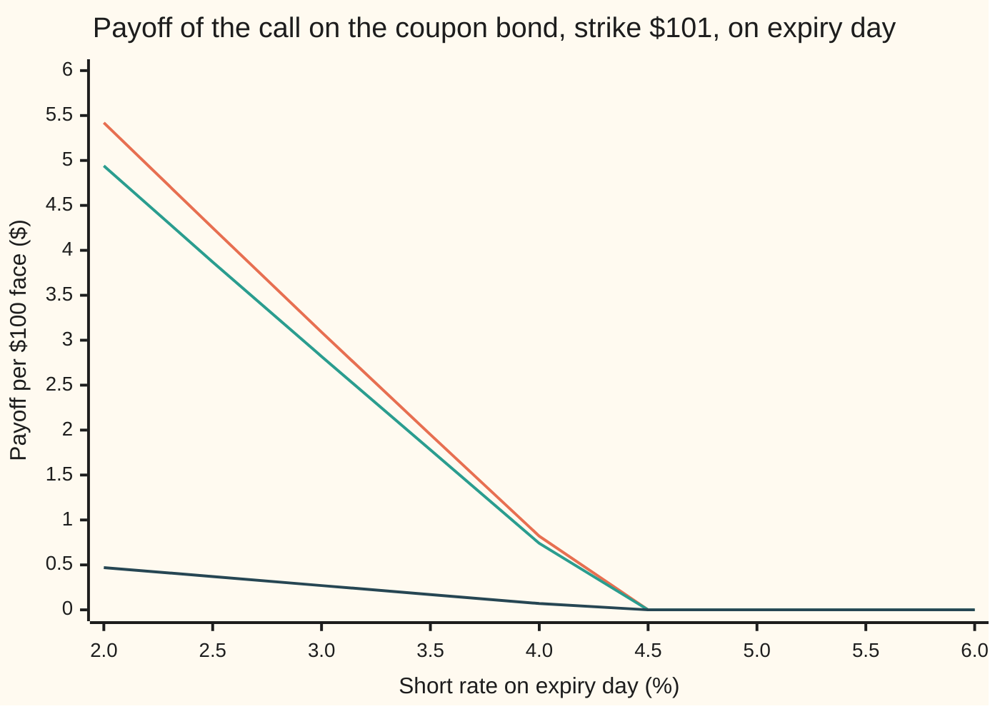
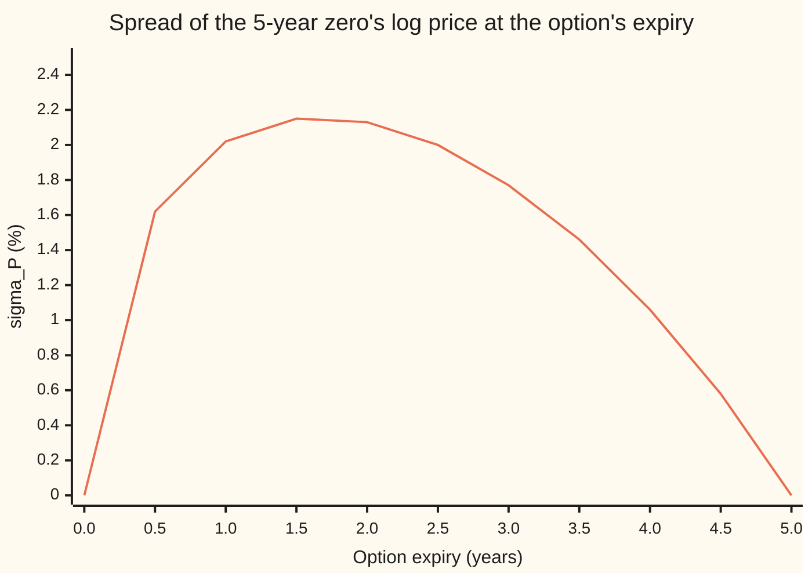

# Bond options: a call on a zero in closed form, and a coupon-bond option as a portfolio of them

Financial mathematics → Short-Rate Models → Options on bonds in Hull-White → Bond options

---

## General Overview

A government bond has five years to run. It pays $5 at the end of each year and hands back its $100 face value with the last coupon. A pension fund buys, today, the right to buy that bond in one year's time for $101. The year-1 coupon goes to whoever holds the bond before then, so on the option's expiry day the bond still owes $5 at years 2, 3 and 4, and $105 at year 5. That right is a **bond option**: here a call, struck at $101, expiring in one year.

What the bond is worth in a year depends on one thing: where interest rates stand then. Low rates make its remaining payments valuable; high rates make them cheap. So the option is a bet on rates, and pricing it needs a model of how rates move. This card uses the shelf's model, Hull-White, fitted to the shelf's curve: a short rate (the rate on overnight borrowing) of 4 percent today, pulled toward 5 percent at speed 0.3 a year, jostled with a volatility of 1 percent a year.

The card takes two steps. First the simplest bond there is, a **zero**: one payment of $100 at year 5 and nothing before. A one-year call on it, struck at $83, has a closed form: Black-76 with a volatility the model supplies, $0.83 per $100 face. Then the coupon bond. Farshid Jamshidian showed in 1989 that its option is exactly a bundle of options on zeros, one per payment, each with its own strike. The bundle costs $0.87.

**In Hull-White a zero's price on the option's expiry day is lognormal, so a call on it is Black-76 with a volatility the model hands over; and because every bond price falls when the one short rate rises, a call on a coupon bond splits exactly into calls on its zeros, each struck at that zero's price at the one rate where the whole bond is worth the strike.**

**What kind of fact this is:** a model, Hull-White, which is an assumption about rates, not a law; and inside it two theorems, the zero-bond option formula and Jamshidian's decomposition, both proved on this card in Why it works.

### The picture: one payoff, split into legs that switch off together



Top line (orange): the option's payoff, the bond's price minus $101 or nothing. Middle line (green): the leg on the final $105 payment. Bottom line (dark blue): the three $5 coupon legs together. Green plus dark blue equals orange at every rate; the check prints the sum of the four legs on its own row, and it matches the payoff to the cent. All three lines hit zero at the same rate, 4.3644 percent. That shared switch-off point is the whole trick.

---

## The formula

Notation first, in words. $P(t,u)$ is the price at time $t$ of a zero that pays $1 at time $u$, so $P(0,5)$ is today's price of $1 due in five years. $B(\tau)$ (tau, a length of time) is the Hull-White **rate sensitivity**: how much a zero with $\tau$ years left loses, in log terms, per unit rise in the short rate. $N(x)$ is the bell-curve area to the left of $x$. $a$ is the reversion speed, 0.3 a year, and $\sigma$ the short rate's volatility, 1 percent.

The call on the zero, expiring at $T$, on a zero maturing at $S$, strike $K$ per $1 of face:

$$\mathrm{ZBC} = P(0,S)\,N(h) \;-\; K\,P(0,T)\,N(h - \sigma_P)$$

**Read it aloud:** the zero you might receive, minus the strike you might pay, each weighted by its own chance, each already in today's money through today's curve.

The two helpers:

$$\sigma_P = \sigma\,B(S-T)\,\sqrt{\frac{1 - e^{-2aT}}{2a}}, \qquad h = \frac{1}{\sigma_P}\ln\frac{P(0,S)}{K\,P(0,T)} + \frac{\sigma_P}{2}, \qquad B(\tau) = \frac{1 - e^{-a\tau}}{a}$$

$\sigma_P$ is the spread of the log of the zero's price on expiry day: the rate's spread, times the zero's sensitivity to the rate. $h$ is the forward bond price's lead over the strike, counted in those spreads, plus half a spread.

The call on the coupon bond, paying $c_i$ at times $T_i$, strike $X$:

$$\mathrm{CBC} = \sum_i c_i\,\mathrm{ZBC}(T, T_i, K_i), \qquad K_i = P(T, T_i;\, r^*), \qquad \sum_i c_i\,P(T, T_i;\, r^*) = X$$

**Read it aloud:** find the one short rate $r^*$ at which the bond would be worth exactly the strike on expiry day; strike each zero at its own price at that rate; the coupon-bond call is the bundle of those zero calls.

| Symbol | Plain meaning | In our example | Push it up and the answer… |
| --- | --- | --- | --- |
| $r$ | the short rate, overnight borrowing, the model's one random number | 4 percent today | falls: bonds cheaper |
| $a$ | reversion speed: how fast the rate is pulled back to its level | 0.3 a year | falls: rate moves die out sooner |
| $\sigma$ | the short rate's volatility, in rate points per root-year | 1 percent | rises: more room to move |
| $\theta(t)$ | Hull-White's drift, chosen so the model reprices today's curve | 0.015 at every date here | — (fixed by the curve) |
| $P(t,u)$, $t$, $F$ | price at time $t$ of $1 due at $u$; $F$, a forward price, is a ratio of two of them | $P(0,1) = 0.959496$, $P(0,5) = 0.799856$ | — |
| $T$, $S$ | option expiry; the zero's maturity | 1 year; 5 years | — |
| $K$, $X$ | strikes: on the zero per $1 face; on the coupon bond per $100 | 0.83; $101 | falls: more to pay |
| $B(\tau)$, $\tau$, $A$ | rate sensitivity of a zero with $\tau$ years left; $A$ is the rest of its price formula, free of the rate | $B(4) = 2.329353$ | — |
| $\sigma_P$ | spread of the log zero price on expiry day | 0.020199 | rises: like any option's volatility |
| $h$, $d_1$, $N(x)$ | lead over the strike in spreads, plus half (Black-76 calls it $d_1$); bell-curve area | $h = 0.225590$ | — |
| $c_i$, $T_i$ | the bond's payments and their dates, after expiry | $5 at 2, 3, 4; $105 at 5 | — |
| $r^*$, $K_i$ | the rate where the bond is worth $X$; each zero's price there | 4.3644 percent; 95.648004 … per $100 | — |

### When it holds

- **One random driver.** Every rate on the curve moves because the one short rate moved, so all zero prices rise and fall together. With two drivers, long and short rates can move apart, the zeros stop switching off at one shared rate, and Jamshidian's split becomes an approximation: [two-factor-and-lognormal-short-rate-models](07-two-factor-and-lognormal-short-rate-models.md).
- **A normal short rate with fixed $a$ and $\sigma$.** That makes the log zero price normal, which is what makes Black-76 exact. The same normality lets the rate go below zero; here that chance is about 5 in 10 million. If the market's option prices imply a different volatility pattern, the fit is redone: [calibrating-a-short-rate-model](08-calibrating-a-short-rate-model.md).
- **Every payment positive.** Positive payments are what make the bond's price fall steadily as the rate rises. A bond with a negative cash flow, a short position in one zero, can cross the strike twice, and the split fails.
- **Exercise on one date.** An option exercisable on several dates, like most callable bonds, has no closed form; it needs [hull-white-trinomial-tree](06-hull-white-trinomial-tree.md).
- **Strike in cash, on the bond's full price.** The formula compares the strike with the bond's full cash price, accrued interest included. Exchange and dealer quotes usually strike on the clean price, which leaves out the accrued interest; convert first or the strike is off by the accrued coupon. Here expiry falls on a coupon date, so the two coincide. Conventions verified 2026-09-28.
- **Today's curve taken as given.** Hull-White reads $P(0,T)$ and $P(0,S)$ straight from the market. A wrong curve gives a wrong forward, and the price inherits the error one for one.

---

## Why it works

### Step 0: one number sets the whole curve

In Hull-White, knowing the short rate on a future date fixes every bond price on that date. Each zero's price is an exponential of a straight line in the rate: $P(T,u) = A \, e^{-B(u-T)\,r}$, with a number $A$ that depends on the dates and today's curve but not on the rate ([hull-white-model](04-hull-white-model.md)). Two consequences carry the card. The log of a zero's price is a straight line in the rate, so if the rate is bell-shaped the zero's price is lognormal. And every zero's price falls as the rate rises, all at once.

The check confirms the fitted model is the one this shelf has been using. Reading Hull-White's drift off today's curve gives 0.015000 at half a year and at three years, which is 0.3 times 5 percent: a Vasicek model ([vasicek-model](02-vasicek-model.md)). The fitted Hull-White price of the 5-year zero in a year, at a 5 percent rate, is 0.819121, and Vasicek's own formula gives 0.819121.

### Step 1: the zero's price on expiry day is lognormal, with a known spread

The short rate in one year is bell-shaped. Its spread is not $\sigma\sqrt{T}$, as it would be for a rate left to wander. The pull back toward 5 percent erases part of every old shock, so the variance after $T$ years is $\sigma^2(1 - e^{-2aT})/(2a)$. Its square root at one year is $\sigma$ times 0.867168: the **damping** factor.

The log of the zero's price moves $B(4) = 2.329353$ times as far as the rate, opposite way. So its spread is

$$\sigma_P = 0.01 \times 2.329353 \times 0.867168 = 0.020199.$$

About 2 percent of the bond's price. That is the volatility Black-76 needs, and nobody has to guess it: the rate model hands it over.

This volatility has a shape across expiries, drawn below for options on the same 5-year zero.



The one line is $\sigma_P$ for expiries from today to year 5. It rises at first, because a longer wait lets the rate move further. It peaks at 2.15 percent at 1.5 years and falls to zero at year 5, because a bond near maturity is worth nearly its face whatever the rate: its sensitivity $B$ shrinks to nothing. This **pull to par** is why a single volatility for "the bond" makes no sense.

### Step 2: price in units of the expiry-date zero, and Black-76 falls out

Measure every price in units of the zero that matures on expiry day, $P(t,T)$, rather than in dollars. This change of yardstick ([change-of-numeraire-in-pricing](../05-Black-Scholes%20from%20the%20Ground%20Up/05-change-of-numeraire-in-pricing.md)) has two useful properties. The option's value becomes $P(0,T)$ times a plain average of its payoff, because the yardstick is worth exactly 1 on expiry day. And any traded price divided by the yardstick is a **forward price** that drifts nowhere on average.

The forward price of the 5-year zero for delivery at year 1 is $P(0,5)/P(0,1)$: 83.362067 per $100 face. On expiry day it equals the zero's price itself. So under the new yardstick, the zero's price on expiry day is lognormal, averages 83.362067, and has log spread $\sigma_P$. Changing yardstick shifts where the bell curve sits but not how wide it is, so the spread from Step 1 carries over.

That is exactly Black-76's setting: a lognormal forward $F$ with no drift, a strike, a discount factor ([black-76-and-forward-level-pricing](../05-Black-Scholes%20from%20the%20Ground%20Up/06-black-76-and-forward-level-pricing.md)). With $F = P(0,S)/P(0,T)$, discount $P(0,T)$ and total spread $\sigma_P$ in place of $\sigma\sqrt{T}$, Black-76 reads $P(0,T)\,[F\,N(d_1) - K\,N(d_2)]$ with $d_1 = h$. Multiply $P(0,T)$ through and it is the formula.

<details>
<summary>Detailed proof: the spread of the rate, and why the yardstick keeps it</summary>

Hull-White's rate obeys $dr = (\theta(t) - a r)\,dt + \sigma\,dW$, the last term a Brownian shock. Multiply by $e^{at}$: $d(e^{at} r) = e^{at}\theta(t)\,dt + \sigma e^{at}\,dW$. Integrate from 0 to $T$:
$$r(T) = r(0)\,e^{-aT} + \int_0^T e^{-a(T-s)}\theta(s)\,ds + \sigma\int_0^T e^{-a(T-s)}\,dW(s).$$
The last term is a sum of independent normal shocks, so $r(T)$ is normal. Its variance is $\sigma^2\int_0^T e^{-2a(T-s)}\,ds = \sigma^2(1 - e^{-2aT})/(2a)$, by the rule that a stochastic integral's variance is the ordinary integral of its squared weight.

Under the expiry-date yardstick, Girsanov's theorem says the Brownian shock gains a drift, $dW = d\widetilde{W} - \sigma B(T-t)\,dt$, and nothing else changes. A drift moves the mean of $r(T)$, never its variance, so $\ln P(T,S) = \ln A - B(S-T)\,r(T)$ is still normal with variance $B(S-T)^2$ times the rate's variance, which is $\sigma_P^2$. Its mean is pinned by the no-drift rule: the average of $P(T,S)$ must be the forward $P(0,S)/P(0,T)$.

For a lognormal price with average $F$ and log spread $\sigma_P$, the average call payoff is $F\,N(d_1) - K\,N(d_1 - \sigma_P)$ with $d_1 = \ln(F/K)/\sigma_P + \sigma_P/2$; this is the Black-76 integral. Put $F = P(0,S)/P(0,T)$ and multiply by $P(0,T)$: $d_1$ is $h$ and the result is ZBC.

</details>

### Step 3: the coupon bond is worth the strike at exactly one rate

On expiry day the coupon bond is worth $\sum_i c_i\,P(T,T_i;\,r)$: four zeros, each falling as the rate rises. A sum of falling curves is falling. At very low rates it grows past any strike; at very high rates it sinks toward zero. So for any strike above zero there is exactly one rate, $r^*$, where the bond is worth $X$. Existence and uniqueness both come from Step 0 and from every $c_i$ being positive. The boundary case: a strike of zero or less is always beaten, so the call is simply the forward bond minus the strike, discounted, and no $r^*$ is needed. Here a bisection search finds $r^* = 4.3644$ percent.

Set each zero's strike to its own price at that rate, $K_i = P(T,T_i;\,r^*)$. Per $100 of face: 95.648004 on the 2-year zero, 91.360803 on the 3-year, 87.180855 on the 4-year, 83.133826 on the 5-year. Weighted by the payments, they add back to $101: $\sum_i c_i K_i = X$ by construction.

### Step 4: the payoffs agree on every rate, so the prices agree

Take any short rate on expiry day.

- **Below $r^*$.** Every zero is worth more than it was at $r^*$, so each is above its strike. Every leg pays $c_i\,(P_i - K_i)$. Added up, that is the bond's price minus $X$, which is exactly what the coupon option pays, since the bond is above $X$.
- **Above $r^*$.** Every zero is below its strike. Every leg pays nothing. The bond is below $X$, so the coupon option pays nothing too.

The two payoffs match on every outcome, so the two prices match today; anything else would be a free profit. The chart in the overview is this argument drawn: every leg dies at 4.3644 percent.

<details>
<summary>Why the strikes have to be these ones</summary>

For any two numbers, $\max(x + y, 0) \le \max(x, 0) + \max(y, 0)$, with equality exactly when the two never have opposite signs. A bundle of options is therefore worth at least the option on the bundle. Jamshidian's strikes are the one choice that makes every leg change sign at the same rate, so the inequality becomes an equality. Any other split gives legs that disagree on some rates and a bundle that costs more. Splitting $101 in proportion to each payment's forward value, a natural guess, gives 0.874018 against the true 0.873631: close, because those strikes nearly coincide with Jamshidian's, and too high, as the inequality demands.

</details>

The same answer can be reached without the formula: average the payoff over the bell-shaped rate on expiry day, discounting each outcome by the rate's path, or solve the term-structure equation backwards from expiry ([the-term-structure-equation](01-the-term-structure-equation.md)). The code takes both roads; the tree in [hull-white-trinomial-tree](06-hull-white-trinomial-tree.md) is a third.

---

## Worked numbers, by hand

The shelf's curve: short rate 4 percent, reversion 0.3 toward 5 percent, volatility 1 percent. Everything per $100 of face.

**The call on the 5-year zero, strike $83, expiring in a year:**

| Step | Arithmetic | Value |
| --- | --- | --- |
| today's discount to year 1 | $P(0,1)$, from the curve | 0.959496 |
| today's discount to year 5 | $P(0,5)$, from the curve | 0.799856 |
| forward price of the zero | $100 \times 0.799856 / 0.959496$ | 83.362067 |
| sensitivity at expiry, $B(4)$ | $(1 - e^{-1.2})/0.3$ | 2.329353 |
| damping | $\sqrt{(1 - e^{-0.6})/0.6}$ | 0.867168 |
| $\sigma_P$ | $0.01 \times 2.329353 \times 0.867168$ | 0.020199 |
| lead over the strike | $\ln(83.362067/83)$ | 0.004353 |
| $h$ | $0.004353/0.020199 + 0.020199/2$ | 0.225590 |
| $N(h)$, $N(h - \sigma_P)$ | bell-curve areas | 0.589240, 0.581366 |
| bond leg | $100 \times 0.799856 \times 0.589240$ | 47.130665 |
| strike leg | $83 \times 0.959496 \times 0.581366$ | 46.298945 |
| **call on the zero** | $47.130665 - 46.298945$ | **0.831720** |

**The call on the coupon bond, strike $101, expiring in a year:**

| Step | Arithmetic | Value |
| --- | --- | --- |
| forward price of the bond | payments valued on today's curve, divided by 0.959496 | 101.262218 |
| $r^*$ | bisection: bond worth $101 at this rate | 4.3644 percent |
| 2-year leg | $5 \times$ call on $1 due at year 2, strike 0.95648004 | 0.016061 |
| 3-year leg | $5 \times$ call, strike 0.91360803 | 0.026804 |
| 4-year leg | $5 \times$ call, strike 0.87180855 | 0.033732 |
| 5-year leg | $105 \times$ call, strike 0.83133826 | 0.797034 |
| **call on the coupon bond** | sum of the four legs | **0.873631** |

The fund pays about 87 cents per $100 of face for the right to buy at $101 a bond whose forward price is $101.26. Most of the value sits in the leg on the final payment, 0.797034; the three coupon legs add the rest.

### What breaks if you drop a piece

| Mistake | Comes out at | What went wrong |
| --- | --- | --- |
| The rate's volatility used as the bond's, $\sigma\sqrt{T}$ | 0.521798 (right: 0.831720) | A bond moves $B$ times as far as the rate; 1 percent of rate is about 2 percent of price here |
| Sensitivity measured today, $B(5)$ not $B(4)$ | 0.902078 | On expiry day the zero has 4 years left, not 5 |
| No damping: $\sqrt{T}$ in place of the reversion factor | 0.928268 | Mean reversion erases old shocks; ignoring it overstates the spread |
| Coupon bond treated as the 5-year zero, same $\sigma_P$ | 0.914164 (right: 0.873631) | Coupons shorten the bond's effective life, so its price moves less |
| Strikes split in proportion to forward values | 0.874018 | Legs switch off at different rates; a bundle then overprices |

### How the price moves

Two sensitivities, each found by bumping the input and repricing with the formula:

| Bump | Zero call | Coupon call |
| --- | --- | --- |
| Whole curve up 1 basis point (0.01 percent) | −0.018806 | −0.020129 |
| Volatility $\sigma$ up 0.1 percentage point | +0.062969 | +0.073486 |

A call on a bond is a bet on falling rates, so a curve shift up costs it about two cents. Volatility helps it, as it helps any option.

---

## Code, from first principles, and it actually runs

Nothing imported knows the answer. The normal curve's area comes from its power series, the root from a bisection loop, the integral from Simpson's rule and the equation from a Crank-Nicolson grid, each written out. Each option is priced three independent ways. Road 1 is the formula, with Jamshidian's split for the coupon bond. Road 2 never uses $\sigma_P$ or forward prices: it averages the payoff over the bell-shaped rate on expiry day, weighting each outcome by the expected discount along the rate's path given where the path ends. Road 3 solves the term-structure equation backwards from expiry on a grid of rates. Road 2 agrees with the formula to six decimals. Road 3 differs from the formula only in the fifth decimal; that gap is the grid's spacing. The checks also rebuild today's discount from the path average, read Hull-White's drift off the curve, test put-call parity against an independently integrated put, and reproduce every wrong answer and sensitivity above.

### Python

```python
# Bond options and Jamshidian's trick -- the check behind the card.  Standard
# library only; the normal CDF, root finder, integrator and PDE solver are
# written here.  Hull-White fitted to the shelf's curve (Vasicek: reversion
# a = 0.3 to b = 5%, volatility 1%, short rate today 4%).  Money per 100 face.
from math import exp, log, sqrt, pi
a, b, sig, r0 = 0.3, 0.05, 0.01, 0.04
T, S, K = 1.0, 5.0, 83.0                       # 1-year call on the 5-year zero, strike 83
FLOWS = [(2.0, 5.0), (3.0, 5.0), (4.0, 5.0), (5.0, 105.0)]   # the 5-year 5% bond
X = 101.0                                      # 1-year call on it, strike 101

def N(x):                                      # bell-curve area left of x, by its series
    if abs(x) > 8.0: return 0.0 if x < 0 else 1.0
    term, total, n = x, x, 1
    while abs(term) > 1e-17 * abs(total) + 1e-300:
        term *= x * x / (2 * n + 1); total += term; n += 1
    return 0.5 + exp(-0.5 * x * x) / sqrt(2 * pi) * total
def Bf(tau): return (1 - exp(-a * tau)) / a
def vas(tau, r):                               # Vasicek bond price, tau years left, short rate r
    lnA = (b - sig * sig / (2 * a * a)) * (Bf(tau) - tau) - sig * sig * Bf(tau) ** 2 / (4 * a)
    return exp(lnA - Bf(tau) * r)
def P0(t, shift=0.0): return vas(t, r0) * exp(-shift * t)       # today's curve
def fwd(t, shift=0.0, h=1e-4): return -(log(P0(t + h, shift)) - log(P0(t - h, shift))) / (2 * h)
def hw_bond(t, u, r, shift=0.0, s=sig):        # Hull-White bond price at t, fitted to the curve
    Bu = Bf(u - t)
    return P0(u, shift) / P0(t, shift) * exp(Bu * fwd(t, shift) - s * s / (4 * a) * (1 - exp(-2 * a * t)) * Bu * Bu - Bu * r)
def sigma_p(t, u, s=sig): return s * Bf(u - t) * sqrt((1 - exp(-2 * a * t)) / (2 * a))
def zbc(t, u, k, shift=0.0, s=sig):            # ROAD 1: the closed form, strike k per 1 face
    PT, PU, sp = P0(t, shift), P0(u, shift), sigma_p(t, u, s)
    h = log(PU / (PT * k)) / sp + sp / 2
    return PU * N(h) - k * PT * N(h - sp)
def zbp(t, u, k):
    PT, PU, sp = P0(t), P0(u), sigma_p(t, u)
    h = log(PU / (PT * k)) / sp + sp / 2
    return k * PT * N(sp - h) - PU * N(-h)
def bisect(f, lo, hi):
    for _ in range(200):
        mid = 0.5 * (lo + hi)
        if (f(lo) > 0) == (f(mid) > 0): lo = mid
        else: hi = mid
    return 0.5 * (lo + hi)
def jamshidian(shift=0.0, s=sig):              # coupon-bond call as a portfolio of zero calls
    rstar = bisect(lambda r: sum(c * hw_bond(T, u, r, shift, s) for u, c in FLOWS) - X, -0.5, 0.5)
    ks = [hw_bond(T, u, rstar, shift, s) for u, c in FLOWS]
    return rstar, ks, sum(c * zbc(T, u, k, shift, s) for (u, c), k in zip(FLOWS, ks))
# ROAD 2: average over the short rate on expiry day, jointly with the path's discount
e1, e2 = exp(-a * T), exp(-2 * a * T)
m_r, v_r = b + (r0 - b) * e1, sig * sig * (1 - e2) / (2 * a)
m_I = b * T + (r0 - b) * (1 - e1) / a
v_I = sig * sig / (a * a) * (T - 2 * (1 - e1) / a + (1 - e2) / (2 * a))
cov = sig * sig / (2 * a * a) * (1 - e1) ** 2
def by_integral(payoff, n=20000):
    lo, hi = m_r - 10 * sqrt(v_r), m_r + 10 * sqrt(v_r)
    h, tot = (hi - lo) / n, 0.0
    for i in range(n + 1):
        x = lo + i * h
        dens = exp(-(x - m_r) ** 2 / (2 * v_r)) / sqrt(2 * pi * v_r)
        disc = exp(-(m_I + cov / v_r * (x - m_r)) + 0.5 * (v_I - cov * cov / v_r))
        tot += (1 if i in (0, n) else 4 if i % 2 else 2) * dens * disc * payoff(x)
    return tot * h / 3
# ROAD 3: Crank-Nicolson on the term-structure equation, backwards from expiry
def by_pde(payoff, M=400, steps=200):
    h, dt = 0.0005, T / steps
    rs = [r0 - 0.1 + i * h for i in range(M + 1)]
    V = [payoff(r) for r in rs]
    lo = [0.5 * sig * sig / h ** 2 - a * (b - r) / (2 * h) for r in rs]
    di = [-sig * sig / h ** 2 - r for r in rs]
    up = [0.5 * sig * sig / h ** 2 + a * (b - r) / (2 * h) for r in rs]
    for _ in range(steps):
        rhs = [V[i] + 0.5 * dt * (lo[i] * V[i - 1] + di[i] * V[i] + up[i] * V[i + 1]) for i in range(1, M)]
        A_ = [-0.5 * dt * lo[i] for i in range(1, M)]; B_ = [1 - 0.5 * dt * di[i] for i in range(1, M)]
        C_ = [-0.5 * dt * up[i] for i in range(1, M)]
        for j in range(1, M - 1):              # Thomas algorithm, forward sweep
            w = A_[j] / B_[j - 1]; B_[j] -= w * C_[j - 1]; rhs[j] -= w * rhs[j - 1]
        x = [0.0] * (M - 1); x[-1] = rhs[-1] / B_[-1]
        for j in range(M - 3, -1, -1): x[j] = (rhs[j] - C_[j] * x[j + 1]) / B_[j]
        V = [2 * x[0] - x[1]] + x + [2 * x[-1] - x[-2]]
    return V[200]
zpay = lambda r: max(100 * vas(S - T, r) - K, 0.0)
cpay = lambda r: max(sum(c * vas(u - T, r) for u, c in FLOWS) - X, 0.0)
C1, C2, C3 = 100 * zbc(T, S, K / 100), by_integral(zpay), by_pde(zpay)
P1, P2 = 100 * zbp(T, S, K / 100), by_integral(lambda r: max(K - 100 * vas(S - T, r), 0.0))
rstar, ks, J1 = jamshidian()
J2, J3 = by_integral(cpay), by_pde(cpay)
fwd_cb = sum(c * P0(u) for u, c in FLOWS) / P0(T)
kpr = [X / fwd_cb * P0(u) / P0(T) for u, c in FLOWS]           # strikes split pro rata to forwards
prorata = sum(c * zbc(T, u, k) for (u, c), k in zip(FLOWS, kpr))
theta = [(fwd(t + 1e-3) - fwd(t - 1e-3)) / 2e-3 + a * fwd(t) + sig ** 2 / (2 * a) * (1 - exp(-2 * a * t)) for t in (0.5, 1.0, 3.0)]
def black(sp, F=P0(S) / P0(T), k=K / 100):    # Black-76 on a forward F, strike k, discount P(0,1)
    h = log(F / k) / sp + sp / 2
    return 100 * P0(T) * (F * N(h) - k * N(h - sp))
hh = log(P0(S) / (P0(T) * K / 100)) / sigma_p(T, S) + sigma_p(T, S) / 2
rows = [("P(0,1)  curve today", P0(T)), ("P(0,5)", P0(S)), ("  E[exp(-integral of r)] to year 1", exp(-m_I + 0.5 * v_I)),
        ("theta(0.5) read off the curve", theta[0]), ("theta(3)", theta[2]),
        ("forward price of the zero at year 1", 100 * P0(S) / P0(T)), ("B(1,5)", Bf(S - T)),
        ("P(1,5) at r = 5%, Hull-White fitted", hw_bond(T, S, 0.05)), ("P(1,5) at r = 5%, Vasicek direct", vas(S - T, 0.05)), ("damping sqrt((1-e^-2aT)/2a)", sqrt((1 - e2) / (2 * a))), ("sigma_P", sigma_p(T, S)),
        ("ln(forward / strike)", log(P0(S) / P0(T) / (K / 100))), ("h", hh), ("N(h)", N(hh)), ("N(h - sigma_P)", N(hh - sigma_p(T, S))),
        ("bond leg   100 P(0,5) N(h)", 100 * P0(S) * N(hh)), ("strike leg K P(0,1) N(h - sigma_P)", K * P0(T) * N(hh - sigma_p(T, S))),
        ("zero call 1 formula", C1), ("zero call 2 integral", C2), ("zero call 3 PDE", C3),
        ("zero put formula", P1), ("zero put integral", P2), ("  C - P", C1 - P1), ("  P(0,5)*100 - K P(0,1)", 100 * P0(S) - K * P0(T)),
        ("forward price of the coupon bond", fwd_cb), ("r* where the bond is worth 101", rstar)]
rows += [(f"  strike K_{int(u)} (per 100 face)", 100 * k) for (u, c), k in zip(FLOWS, ks)]
rows += [(f"  leg {int(u)}: {c:g} x call on $1 due yr {int(u)}", c * zbc(T, u, k)) for (u, c), k in zip(FLOWS, ks)]
rows += [("  sum c_i K_i", sum(c * k for (u, c), k in zip(FLOWS, ks))),
         ("coupon call 1 Jamshidian", J1), ("coupon call 2 integral", J2), ("coupon call 3 PDE", J3),
         ("wrong: sigma*sqrt(T) as bond vol", black(sig * sqrt(T))), ("wrong: B(0,5) not B(1,5)", black(sig * Bf(S) * sqrt((1 - e2) / (2 * a)))),
         ("wrong: sqrt(T), no damping", black(sig * Bf(S - T) * sqrt(T))), ("wrong: coupon bond at the zero's vol", black(sigma_p(T, S), fwd_cb / 100, X / 100)),
         ("wrong: pro-rata strikes, coupon", prorata),
         ("greek: zero call, +1bp curve", 100 * (zbc(T, S, K / 100, 1e-4) - zbc(T, S, K / 100))),
         ("greek: coupon call, +1bp curve", jamshidian(1e-4)[2] - J1),
         ("greek: zero call, sigma +0.1pt", 100 * (zbc(T, S, K / 100, 0.0, sig + 0.001) - zbc(T, S, K / 100))),
         ("greek: coupon call, sigma +0.1pt", jamshidian(0.0, sig + 0.001)[2] - J1)]
for name, v in rows: print(f"{name:<38} {v:>12.6f}")
rgrid = [0.02 + 0.005 * i for i in range(9)]
pairs = list(zip(FLOWS, ks))                   # each cash flow with its Jamshidian strike
def legs(ps, r): return sum(c * max(vas(u - T, r) - k, 0.0) for (u, c), k in ps)
print("chart, r at expiry %  " + " ".join(f"{100 * r:6.1f}" for r in rgrid))
print("chart, coupon payoff  " + " ".join(f"{cpay(r):6.2f}" for r in rgrid))
print("chart, Jamshidian sum " + " ".join(f"{legs(pairs, r):6.2f}" for r in rgrid))
print("chart, final-year leg " + " ".join(f"{legs(pairs[3:], r):6.2f}" for r in rgrid))
print("chart, 3 coupon legs  " + " ".join(f"{legs(pairs[:3], r):6.2f}" for r in rgrid))
print("chart, expiry (years) " + " ".join(f"{0.5 * i:6.1f}" for i in range(11)))
print("chart, sigma_P %      " + " ".join(f"{100 * sigma_p(0.5 * i, S):6.2f}" for i in range(11)))
assert abs(exp(-m_I + 0.5 * v_I) - P0(T)) < 1e-12, "path discount must rebuild the curve"
assert all(abs(t - a * b) < 1e-6 for t in theta), "fitted drift must be a*b on a Vasicek curve"
assert abs(hw_bond(T, S, 0.05) - vas(S - T, 0.05)) < 1e-9, "fitted Hull-White bond vs Vasicek bond"
assert abs(C1 - C2) < 1e-6, "zero call: formula vs integral"
assert abs(C1 - C3) < 2e-4, "zero call: formula vs PDE"
assert abs((C1 - P2) - (100 * P0(S) - K * P0(T))) < 1e-6, "parity with the integral's put"
assert abs(J1 - J2) < 1e-6, "coupon call: Jamshidian vs integral"
assert abs(J1 - J3) < 2e-4, "coupon call: Jamshidian vs PDE"
assert prorata > J1 + 1e-4, "a sum of options beats an option on the sum unless strikes line up"
print("ALL CHECKS PASS")
```

**Ran 2026-09-28 on macOS, Python 3.14.6, standard library only. All checks passed. Output, pasted from the run:**

```
P(0,1)  curve today                        0.959496
P(0,5)                                     0.799856
  E[exp(-integral of r)] to year 1         0.959496
theta(0.5) read off the curve              0.015000
theta(3)                                   0.015000
forward price of the zero at year 1       83.362067
B(1,5)                                     2.329353
P(1,5) at r = 5%, Hull-White fitted        0.819121
P(1,5) at r = 5%, Vasicek direct           0.819121
damping sqrt((1-e^-2aT)/2a)                0.867168
sigma_P                                    0.020199
ln(forward / strike)                       0.004353
h                                          0.225590
N(h)                                       0.589240
N(h - sigma_P)                             0.581366
bond leg   100 P(0,5) N(h)                47.130665
strike leg K P(0,1) N(h - sigma_P)        46.298945
zero call 1 formula                        0.831720
zero call 2 integral                       0.831720
zero call 3 PDE                            0.831761
zero put formula                           0.484318
zero put integral                          0.484318
  C - P                                    0.347402
  P(0,5)*100 - K P(0,1)                    0.347402
forward price of the coupon bond         101.262218
r* where the bond is worth 101             0.043644
  strike K_2 (per 100 face)               95.648004
  strike K_3 (per 100 face)               91.360803
  strike K_4 (per 100 face)               87.180855
  strike K_5 (per 100 face)               83.133826
  leg 2: 5 x call on $1 due yr 2           0.016061
  leg 3: 5 x call on $1 due yr 3           0.026804
  leg 4: 5 x call on $1 due yr 4           0.033732
  leg 5: 105 x call on $1 due yr 5         0.797034
  sum c_i K_i                            101.000000
coupon call 1 Jamshidian                   0.873631
coupon call 2 integral                     0.873631
coupon call 3 PDE                          0.873652
wrong: sigma*sqrt(T) as bond vol           0.521798
wrong: B(0,5) not B(1,5)                   0.902078
wrong: sqrt(T), no damping                 0.928268
wrong: coupon bond at the zero's vol       0.914164
wrong: pro-rata strikes, coupon            0.874018
greek: zero call, +1bp curve              -0.018806
greek: coupon call, +1bp curve            -0.020129
greek: zero call, sigma +0.1pt             0.062969
greek: coupon call, sigma +0.1pt           0.073486
chart, r at expiry %     2.0    2.5    3.0    3.5    4.0    4.5    5.0    5.5    6.0
chart, coupon payoff    5.42   4.25   3.09   1.95   0.82   0.00   0.00   0.00   0.00
chart, Jamshidian sum   5.42   4.25   3.09   1.95   0.82   0.00   0.00   0.00   0.00
chart, final-year leg   4.94   3.87   2.82   1.78   0.74   0.00   0.00   0.00   0.00
chart, 3 coupon legs    0.47   0.37   0.27   0.17   0.07   0.00   0.00   0.00   0.00
chart, expiry (years)    0.0    0.5    1.0    1.5    2.0    2.5    3.0    3.5    4.0    4.5    5.0
chart, sigma_P %        0.00   1.62   2.02   2.15   2.13   2.00   1.77   1.46   1.06   0.58   0.00
ALL CHECKS PASS
```

### Rust

Same rows, same labels, built with `rustc --edition 2021 -O`. The two outputs are identical to the printed precision.

```rust
// Bond options and Jamshidian's trick -- the same check as the Python, in Rust.
// No crates; the normal CDF, root finder, integrator and PDE solver are written
// here.  Hull-White fitted to the shelf's curve (Vasicek: reversion a = 0.3 to
// b = 5%, volatility 1%, short rate today 4%).  Money per 100 face.
const A: f64 = 0.3; const BL: f64 = 0.05; const SIG: f64 = 0.01; const R0: f64 = 0.04;
const T: f64 = 1.0; const S: f64 = 5.0; const K: f64 = 83.0; const X: f64 = 101.0;
const FLOWS: [(f64, f64); 4] = [(2.0, 5.0), (3.0, 5.0), (4.0, 5.0), (5.0, 105.0)];
const PI: f64 = std::f64::consts::PI;

fn n(x: f64) -> f64 {                           // bell-curve area left of x, by its series
    if x.abs() > 8.0 { return if x < 0.0 { 0.0 } else { 1.0 }; }
    let (mut term, mut total, mut k) = (x, x, 1.0);
    while term.abs() > 1e-17 * total.abs() + 1e-300 { term *= x * x / (2.0 * k + 1.0); total += term; k += 1.0; }
    0.5 + (-0.5 * x * x).exp() / (2.0 * PI).sqrt() * total
}
fn bf(tau: f64) -> f64 { (1.0 - (-A * tau).exp()) / A }
fn vas(tau: f64, r: f64) -> f64 {               // Vasicek bond price, tau years left, short rate r
    let bt = bf(tau);
    let ln_a = (BL - SIG * SIG / (2.0 * A * A)) * (bt - tau) - SIG * SIG * bt * bt / (4.0 * A);
    (ln_a - bt * r).exp()
}
fn p0(t: f64, shift: f64) -> f64 { vas(t, R0) * (-shift * t).exp() }        // today's curve
fn fwd(t: f64, shift: f64) -> f64 { let h = 1e-4; -((p0(t + h, shift)).ln() - (p0(t - h, shift)).ln()) / (2.0 * h) }
fn hw_bond(t: f64, u: f64, r: f64, shift: f64, s: f64) -> f64 {   // Hull-White bond price at t
    let bu = bf(u - t);
    p0(u, shift) / p0(t, shift) * (bu * fwd(t, shift) - s * s / (4.0 * A) * (1.0 - (-2.0 * A * t).exp()) * bu * bu - bu * r).exp()
}
fn sigma_p(t: f64, u: f64, s: f64) -> f64 { s * bf(u - t) * ((1.0 - (-2.0 * A * t).exp()) / (2.0 * A)).sqrt() }
fn zbc(t: f64, u: f64, k: f64, shift: f64, s: f64) -> f64 {       // ROAD 1: the closed form
    let (pt, pu, sp) = (p0(t, shift), p0(u, shift), sigma_p(t, u, s));
    let h = (pu / (pt * k)).ln() / sp + sp / 2.0;
    pu * n(h) - k * pt * n(h - sp)
}
fn zbp(t: f64, u: f64, k: f64) -> f64 {
    let (pt, pu, sp) = (p0(t, 0.0), p0(u, 0.0), sigma_p(t, u, SIG));
    let h = (pu / (pt * k)).ln() / sp + sp / 2.0;
    k * pt * n(sp - h) - pu * n(-h)
}
fn bisect(f: &dyn Fn(f64) -> f64, mut lo: f64, mut hi: f64) -> f64 {
    for _ in 0..200 {
        let mid = 0.5 * (lo + hi);
        if (f(lo) > 0.0) == (f(mid) > 0.0) { lo = mid } else { hi = mid }
    }
    0.5 * (lo + hi)
}
fn jamshidian(shift: f64, s: f64) -> (f64, Vec<f64>, f64) {      // coupon call as zero calls
    let g = |r: f64| FLOWS.iter().map(|&(u, c)| c * hw_bond(T, u, r, shift, s)).sum::<f64>() - X;
    let rstar = bisect(&g, -0.5, 0.5);
    let ks: Vec<f64> = FLOWS.iter().map(|&(u, _)| hw_bond(T, u, rstar, shift, s)).collect();
    let v = FLOWS.iter().zip(&ks).map(|(&(u, c), &k)| c * zbc(T, u, k, shift, s)).sum();
    (rstar, ks, v)
}
struct Mom { m_r: f64, v_r: f64, m_i: f64, v_i: f64, cov: f64 }
fn by_integral(mo: &Mom, payoff: &dyn Fn(f64) -> f64) -> f64 {    // ROAD 2
    let nn = 20000;
    let (lo, hi) = (mo.m_r - 10.0 * mo.v_r.sqrt(), mo.m_r + 10.0 * mo.v_r.sqrt());
    let h = (hi - lo) / nn as f64;
    let mut tot = 0.0;
    for i in 0..=nn {
        let x = lo + i as f64 * h;
        let dens = (-(x - mo.m_r).powi(2) / (2.0 * mo.v_r)).exp() / (2.0 * PI * mo.v_r).sqrt();
        let disc = (-(mo.m_i + mo.cov / mo.v_r * (x - mo.m_r)) + 0.5 * (mo.v_i - mo.cov * mo.cov / mo.v_r)).exp();
        let w = if i == 0 || i == nn { 1.0 } else if i % 2 == 1 { 4.0 } else { 2.0 };
        tot += w * dens * disc * payoff(x);
    }
    tot * h / 3.0
}
fn by_pde(payoff: &dyn Fn(f64) -> f64) -> f64 {                  // ROAD 3: Crank-Nicolson
    let (m, steps, h) = (400usize, 200, 0.0005);
    let dt = T / steps as f64;
    let rs: Vec<f64> = (0..=m).map(|i| R0 - 0.1 + i as f64 * h).collect();
    let mut v: Vec<f64> = rs.iter().map(|&r| payoff(r)).collect();
    let lo: Vec<f64> = rs.iter().map(|&r| 0.5 * SIG * SIG / (h * h) - A * (BL - r) / (2.0 * h)).collect();
    let di: Vec<f64> = rs.iter().map(|&r| -SIG * SIG / (h * h) - r).collect();
    let up: Vec<f64> = rs.iter().map(|&r| 0.5 * SIG * SIG / (h * h) + A * (BL - r) / (2.0 * h)).collect();
    for _ in 0..steps {
        let mut rhs: Vec<f64> = (1..m).map(|i| v[i] + 0.5 * dt * (lo[i] * v[i - 1] + di[i] * v[i] + up[i] * v[i + 1])).collect();
        let a_: Vec<f64> = (1..m).map(|i| -0.5 * dt * lo[i]).collect();
        let mut b_: Vec<f64> = (1..m).map(|i| 1.0 - 0.5 * dt * di[i]).collect();
        let c_: Vec<f64> = (1..m).map(|i| -0.5 * dt * up[i]).collect();
        for j in 1..m - 1 { let w = a_[j] / b_[j - 1]; b_[j] -= w * c_[j - 1]; rhs[j] -= w * rhs[j - 1]; }
        let mut x = vec![0.0; m - 1];
        x[m - 2] = rhs[m - 2] / b_[m - 2];
        for j in (0..m - 2).rev() { x[j] = (rhs[j] - c_[j] * x[j + 1]) / b_[j]; }
        let mut nv = vec![2.0 * x[0] - x[1]];
        nv.extend_from_slice(&x);
        nv.push(2.0 * x[m - 2] - x[m - 3]);
        v = nv;
    }
    v[200]
}
fn legs(ps: &[((f64, f64), f64)], r: f64) -> f64 { ps.iter().map(|&((u, c), k)| c * (vas(u - T, r) - k).max(0.0)).sum() }
fn row(name: &str, v: f64) { println!("{:<38} {:>12.6}", name, v); }
fn main() {
    let (e1, e2) = ((-A * T).exp(), (-2.0 * A * T).exp());
    let mo = Mom { m_r: BL + (R0 - BL) * e1, v_r: SIG * SIG * (1.0 - e2) / (2.0 * A), m_i: BL * T + (R0 - BL) * (1.0 - e1) / A,
        v_i: SIG * SIG / (A * A) * (T - 2.0 * (1.0 - e1) / A + (1.0 - e2) / (2.0 * A)), cov: SIG * SIG / (2.0 * A * A) * (1.0 - e1).powi(2) };
    let zpay = |r: f64| (100.0 * vas(S - T, r) - K).max(0.0);
    let cpay = |r: f64| (FLOWS.iter().map(|&(u, c)| c * vas(u - T, r)).sum::<f64>() - X).max(0.0);
    let (c1, c2, c3) = (100.0 * zbc(T, S, K / 100.0, 0.0, SIG), by_integral(&mo, &zpay), by_pde(&zpay));
    let (p1, p2) = (100.0 * zbp(T, S, K / 100.0), by_integral(&mo, &|r: f64| (K - 100.0 * vas(S - T, r)).max(0.0)));
    let (rstar, ks, j1) = jamshidian(0.0, SIG);
    let (j2, j3) = (by_integral(&mo, &cpay), by_pde(&cpay));
    let fwd_cb = FLOWS.iter().map(|&(u, c)| c * p0(u, 0.0)).sum::<f64>() / p0(T, 0.0);
    let prorata: f64 = FLOWS.iter().map(|&(u, c)| c * zbc(T, u, X / fwd_cb * p0(u, 0.0) / p0(T, 0.0), 0.0, SIG)).sum();
    let theta: Vec<f64> = [0.5, 1.0, 3.0].iter().map(|&t| (fwd(t + 1e-3, 0.0) - fwd(t - 1e-3, 0.0)) / 2e-3
        + A * fwd(t, 0.0) + SIG * SIG / (2.0 * A) * (1.0 - (-2.0 * A * t).exp())).collect();
    let black = |sp: f64, f: f64, k: f64| { let h = (f / k).ln() / sp + sp / 2.0; 100.0 * p0(T, 0.0) * (f * n(h) - k * n(h - sp)) };
    let (fz, kz) = (p0(S, 0.0) / p0(T, 0.0), K / 100.0);
    let path_disc = (-mo.m_i + 0.5 * mo.v_i).exp();
    row("P(0,1)  curve today", p0(T, 0.0)); row("P(0,5)", p0(S, 0.0)); row("  E[exp(-integral of r)] to year 1", path_disc);
    row("theta(0.5) read off the curve", theta[0]); row("theta(3)", theta[2]);
    row("forward price of the zero at year 1", 100.0 * fz); row("B(1,5)", bf(S - T));
    row("P(1,5) at r = 5%, Hull-White fitted", hw_bond(T, S, 0.05, 0.0, SIG)); row("P(1,5) at r = 5%, Vasicek direct", vas(S - T, 0.05)); let (sp, hh) = (sigma_p(T, S, SIG), (fz / kz).ln() / sigma_p(T, S, SIG) + sigma_p(T, S, SIG) / 2.0);
    row("damping sqrt((1-e^-2aT)/2a)", ((1.0 - e2) / (2.0 * A)).sqrt()); row("sigma_P", sp);
    row("ln(forward / strike)", (fz / kz).ln()); row("h", hh); row("N(h)", n(hh)); row("N(h - sigma_P)", n(hh - sp));
    row("bond leg   100 P(0,5) N(h)", 100.0 * p0(S, 0.0) * n(hh)); row("strike leg K P(0,1) N(h - sigma_P)", K * p0(T, 0.0) * n(hh - sp));
    row("zero call 1 formula", c1); row("zero call 2 integral", c2); row("zero call 3 PDE", c3);
    row("zero put formula", p1); row("zero put integral", p2); row("  C - P", c1 - p1);
    row("  P(0,5)*100 - K P(0,1)", 100.0 * p0(S, 0.0) - K * p0(T, 0.0));
    row("forward price of the coupon bond", fwd_cb); row("r* where the bond is worth 101", rstar);
    for (&(u, _), &k) in FLOWS.iter().zip(&ks) { row(&format!("  strike K_{} (per 100 face)", u as i32), 100.0 * k); }
    for (&(u, c), &k) in FLOWS.iter().zip(&ks) { row(&format!("  leg {}: {} x call on $1 due yr {}", u as i32, c, u as i32), c * zbc(T, u, k, 0.0, SIG)); }
    row("  sum c_i K_i", FLOWS.iter().zip(&ks).map(|(&(_, c), &k)| c * k).sum());
    row("coupon call 1 Jamshidian", j1); row("coupon call 2 integral", j2); row("coupon call 3 PDE", j3);
    row("wrong: sigma*sqrt(T) as bond vol", black(SIG * T.sqrt(), fz, kz));
    row("wrong: B(0,5) not B(1,5)", black(SIG * bf(S) * ((1.0 - e2) / (2.0 * A)).sqrt(), fz, kz));
    row("wrong: sqrt(T), no damping", black(SIG * bf(S - T) * T.sqrt(), fz, kz));
    row("wrong: coupon bond at the zero's vol", black(sigma_p(T, S, SIG), fwd_cb / 100.0, X / 100.0));
    row("wrong: pro-rata strikes, coupon", prorata);
    row("greek: zero call, +1bp curve", 100.0 * (zbc(T, S, kz, 1e-4, SIG) - zbc(T, S, kz, 0.0, SIG)));
    row("greek: coupon call, +1bp curve", jamshidian(1e-4, SIG).2 - j1);
    row("greek: zero call, sigma +0.1pt", 100.0 * (zbc(T, S, kz, 0.0, SIG + 0.001) - zbc(T, S, kz, 0.0, SIG)));
    row("greek: coupon call, sigma +0.1pt", jamshidian(0.0, SIG + 0.001).2 - j1);
    let rgrid: Vec<f64> = (0..9).map(|i| 0.02 + 0.005 * i as f64).collect();
    let pairs: Vec<((f64, f64), f64)> = FLOWS.iter().cloned().zip(ks.iter().cloned()).collect();
    let line = |label: &str, vals: Vec<String>| println!("{}{}", label, vals.join(" "));
    line("chart, r at expiry %  ", rgrid.iter().map(|r| format!("{:6.1}", 100.0 * r)).collect());
    line("chart, coupon payoff  ", rgrid.iter().map(|&r| format!("{:6.2}", cpay(r))).collect());
    line("chart, Jamshidian sum ", rgrid.iter().map(|&r| format!("{:6.2}", legs(&pairs, r))).collect());
    line("chart, final-year leg ", rgrid.iter().map(|&r| format!("{:6.2}", legs(&pairs[3..], r))).collect());
    line("chart, 3 coupon legs  ", rgrid.iter().map(|&r| format!("{:6.2}", legs(&pairs[..3], r))).collect());
    line("chart, expiry (years) ", (0..11).map(|i| format!("{:6.1}", 0.5 * i as f64)).collect());
    line("chart, sigma_P %      ", (0..11).map(|i| format!("{:6.2}", 100.0 * sigma_p(0.5 * i as f64, S, SIG))).collect());
    assert!((path_disc - p0(T, 0.0)).abs() < 1e-12, "path discount must rebuild the curve");
    assert!(theta.iter().all(|t| (t - A * BL).abs() < 1e-6), "fitted drift must be a*b on a Vasicek curve");
    assert!((hw_bond(T, S, 0.05, 0.0, SIG) - vas(S - T, 0.05)).abs() < 1e-9, "fitted Hull-White bond vs Vasicek bond");
    assert!((c1 - c2).abs() < 1e-6, "zero call: formula vs integral");
    assert!((c1 - c3).abs() < 2e-4, "zero call: formula vs PDE");
    assert!(((c1 - p2) - (100.0 * p0(S, 0.0) - K * p0(T, 0.0))).abs() < 1e-6, "parity with the integral's put");
    assert!((j1 - j2).abs() < 1e-6, "coupon call: Jamshidian vs integral");
    assert!((j1 - j3).abs() < 2e-4, "coupon call: Jamshidian vs PDE");
    assert!(prorata > j1 + 1e-4, "a sum of options beats an option on the sum unless strikes line up");
    println!("ALL CHECKS PASS");
}
```

**Ran 2026-09-28 on macOS, rustc 1.98.1, no crates. All checks passed. Output, pasted from the run:**

```
P(0,1)  curve today                        0.959496
P(0,5)                                     0.799856
  E[exp(-integral of r)] to year 1         0.959496
theta(0.5) read off the curve              0.015000
theta(3)                                   0.015000
forward price of the zero at year 1       83.362067
B(1,5)                                     2.329353
P(1,5) at r = 5%, Hull-White fitted        0.819121
P(1,5) at r = 5%, Vasicek direct           0.819121
damping sqrt((1-e^-2aT)/2a)                0.867168
sigma_P                                    0.020199
ln(forward / strike)                       0.004353
h                                          0.225590
N(h)                                       0.589240
N(h - sigma_P)                             0.581366
bond leg   100 P(0,5) N(h)                47.130665
strike leg K P(0,1) N(h - sigma_P)        46.298945
zero call 1 formula                        0.831720
zero call 2 integral                       0.831720
zero call 3 PDE                            0.831761
zero put formula                           0.484318
zero put integral                          0.484318
  C - P                                    0.347402
  P(0,5)*100 - K P(0,1)                    0.347402
forward price of the coupon bond         101.262218
r* where the bond is worth 101             0.043644
  strike K_2 (per 100 face)               95.648004
  strike K_3 (per 100 face)               91.360803
  strike K_4 (per 100 face)               87.180855
  strike K_5 (per 100 face)               83.133826
  leg 2: 5 x call on $1 due yr 2           0.016061
  leg 3: 5 x call on $1 due yr 3           0.026804
  leg 4: 5 x call on $1 due yr 4           0.033732
  leg 5: 105 x call on $1 due yr 5         0.797034
  sum c_i K_i                            101.000000
coupon call 1 Jamshidian                   0.873631
coupon call 2 integral                     0.873631
coupon call 3 PDE                          0.873652
wrong: sigma*sqrt(T) as bond vol           0.521798
wrong: B(0,5) not B(1,5)                   0.902078
wrong: sqrt(T), no damping                 0.928268
wrong: coupon bond at the zero's vol       0.914164
wrong: pro-rata strikes, coupon            0.874018
greek: zero call, +1bp curve              -0.018806
greek: coupon call, +1bp curve            -0.020129
greek: zero call, sigma +0.1pt             0.062969
greek: coupon call, sigma +0.1pt           0.073486
chart, r at expiry %     2.0    2.5    3.0    3.5    4.0    4.5    5.0    5.5    6.0
chart, coupon payoff    5.42   4.25   3.09   1.95   0.82   0.00   0.00   0.00   0.00
chart, Jamshidian sum   5.42   4.25   3.09   1.95   0.82   0.00   0.00   0.00   0.00
chart, final-year leg   4.94   3.87   2.82   1.78   0.74   0.00   0.00   0.00   0.00
chart, 3 coupon legs    0.47   0.37   0.27   0.17   0.07   0.00   0.00   0.00   0.00
chart, expiry (years)    0.0    0.5    1.0    1.5    2.0    2.5    3.0    3.5    4.0    4.5    5.0
chart, sigma_P %        0.00   1.62   2.02   2.15   2.13   2.00   1.77   1.46   1.06   0.58   0.00
ALL CHECKS PASS
```

> [!TIP]
> **Try changing**
> Guess the direction first. Then run it.
> - **Raise the volatility, curve held fixed.** Pass `s=sig + 0.001` to `zbc` and `jamshidian`. The zero call rises by 0.062969 and the coupon call by 0.073486: the two volatility rows of the sensitivity table.
> - **Move the whole curve.** Pass `shift=1e-4` to `zbc` and `jamshidian`. Both calls fall, by 0.018806 and 0.020129. Higher rates, cheaper bonds.
> - **Give the legs the wrong strikes.** Build `pairs` from `kpr` instead of `ks`. The coupon payoff and the bundle's payoff no longer agree at every rate, and the bundle prices at 0.874018.
> - **Starve the grid.** Set `steps=10` in `by_pde`. Road 3 drifts off in the fourth decimal and its assert fires; roads 1 and 2 do not move.

---

## The usual mistake

> [!warning]
> **Quoting the short rate's volatility as the bond's.** A 1 percent volatility in the short rate is not a 1 percent volatility in the bond. The bond's log price moves $B$ times as far as the rate, and $B(4)$ is 2.329353, while mean reversion damps the rate's own spread. Plugging $\sigma\sqrt{T}$ into Black-76 prices the zero call at 0.521798 instead of 0.831720, over a third too cheap.
>
> Smaller traps:
> - **Measuring the sensitivity today.** The zero has 4 years left on expiry day. Using $B(5)$ gives 0.902078.
> - **Forgetting the damping.** $\sqrt{T}$ in place of $\sqrt{(1-e^{-2aT})/(2a)}$ gives 0.928268. The error grows with expiry.
> - **One lognormal for the coupon bond.** Pricing the coupon bond as if it were the 5-year zero, with its $\sigma_P$, gives 0.914164 instead of 0.873631. Coupons make the bond shorter, and quieter.
> - **Strikes chosen by eye.** Only Jamshidian's strikes, all read at one rate $r^*$, make the bundle exact. Any other split overprices; the pro-rata split gives 0.874018.

---

## Where you meet it in real life

- **Swaptions.** The right to enter a swap receiving a fixed rate is a call on a coupon bond, with the fixed rate as the coupon and par as the strike. Desks running Hull-White price European swaptions exactly this way, by Jamshidian's split: [swaptions-payer-and-receiver](../29-Caps%2C%20Floors%20and%20Swaptions/04-swaptions-payer-and-receiver.md).
- **Caps and floors.** A caplet, insurance against one period's rate rising, is a put on a zero. The zero-option formula prices each caplet in closed form: [caplets-and-floorlets](../29-Caps%2C%20Floors%20and%20Swaptions/01-caplets-and-floorlets.md).
- **Calibration.** Because both formulas are fast, a desk fits $a$ and $\sigma$ by repricing dozens of quoted swaptions in a loop: [calibrating-a-short-rate-model](08-calibrating-a-short-rate-model.md).
- **Callable bonds.** An issuer who may repay a bond early holds a call on its own debt. With one call date the call is this card's coupon-bond option; with many dates it is Bermudan and moves to a tree: [hull-white-trinomial-tree](06-hull-white-trinomial-tree.md).

> **Say it back**
> In Hull-White one short rate sets every bond price, and each zero's log price is a straight line in that rate. The rate on expiry day is bell-shaped, so a zero's price is lognormal, with spread $\sigma_P$: the rate's damped spread times the zero's sensitivity. Priced in units of the expiry-date zero, a call on it is Black-76 with that spread. A coupon bond is a bundle of zeros that all fall together as the rate rises, so there is one rate where it is worth the strike. Strike each zero at its price at that rate, and the bundle of zero calls pays exactly what the coupon-bond call pays.

---

## What this builds on

- [hull-white-model](04-hull-white-model.md): the model itself, its fitted drift, and bond prices as exponentials of straight lines in the rate.
- [black-76-and-forward-level-pricing](../05-Black-Scholes%20from%20the%20Ground%20Up/06-black-76-and-forward-level-pricing.md): the option on a lognormal forward, which Step 2 reuses with $\sigma_P$ as its total spread.

## Where this goes next

- [hull-white-trinomial-tree](06-hull-white-trinomial-tree.md): options with several exercise dates, where no closed form exists, priced on a tree of the same model.
- [two-factor-and-lognormal-short-rate-models](07-two-factor-and-lognormal-short-rate-models.md): models where the curve can twist, and Jamshidian's split stops being exact.
- [calibrating-a-short-rate-model](08-calibrating-a-short-rate-model.md): running these formulas backwards, from quoted option prices to $a$ and $\sigma$.

The formulas here take $a$ and $\sigma$ as given; which values the market's own option prices imply is the question calibration answers.

---

## Sources

Verified 2026-09-28: every link below resolves to the publisher's page.

- Jamshidian, Farshid. "An Exact Bond Option Formula." *The Journal of Finance* 44, no. 1 (1989): 205–209. [doi:10.1111/j.1540-6261.1989.tb02413.x](https://doi.org/10.1111/j.1540-6261.1989.tb02413.x). The zero-option formula for the Vasicek model and the decomposition of a coupon-bond option into zero options.
- Hull, John, and Alan White. "Pricing Interest-Rate-Derivative Securities." *The Review of Financial Studies* 3, no. 4 (1990): 573–592. [doi:10.1093/rfs/3.4.573](https://doi.org/10.1093/rfs/3.4.573). The model fitted to today's curve, and its bond-option formula in terms of market discount factors.
- Vasicek, Oldrich. "An Equilibrium Characterization of the Term Structure." *Journal of Financial Economics* 5, no. 2 (1977): 177–188. [doi:10.1016/0304-405X(77)90016-2](https://doi.org/10.1016/0304-405X(77)90016-2). The mean-reverting normal short rate whose curve this shelf uses.
- Brigo, Damiano, and Fabio Mercurio. *Interest Rate Models — Theory and Practice*, 2nd ed. Springer, 2006. [doi:10.1007/978-3-540-34604-3](https://doi.org/10.1007/978-3-540-34604-3). The forward-measure derivation of the zero-option formula and Jamshidian's split, worked in full for Hull-White.
