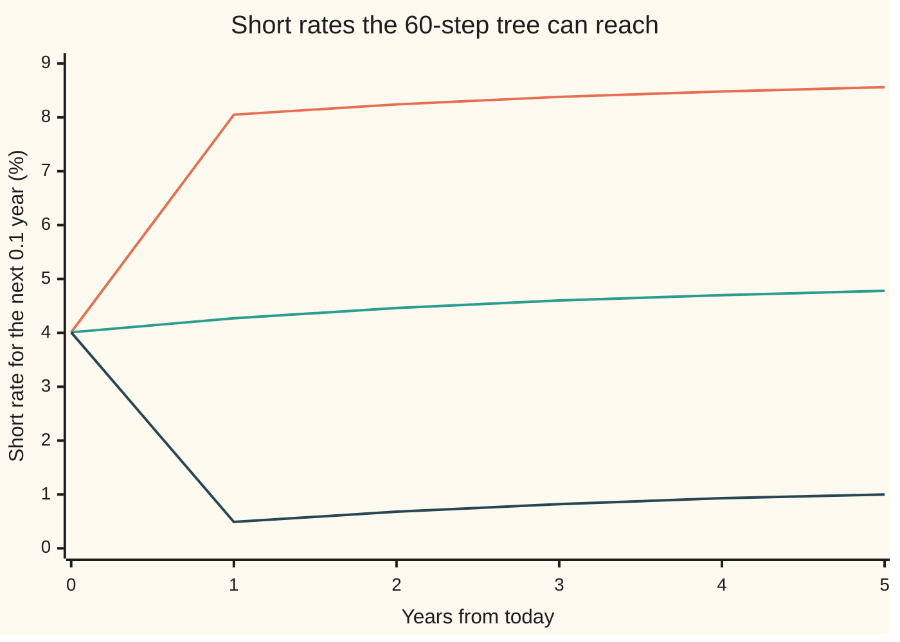
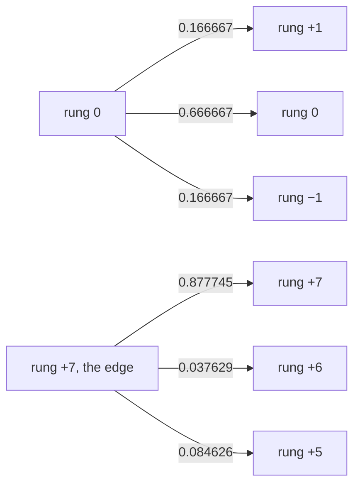

# The Hull-White tree: a trinomial lattice for the short rate that handles any payoff

[Syllabus](../../../SYLLABUS.md) → [Financial mathematics](../../../SYLLABUS.md#w12) → [Short-Rate Models](../../../SYLLABUS.md#w12-s30) → The Hull-White tree

---

## General Overview

Acme has borrowed $1,000,000 at a floating rate for six years; each year the rate resets to what one-year money costs then. Fearing rising rates, Acme buys a right: on any anniversary from year 1 to year 5, it may switch the remaining payments to a fixed 4.7 percent until year 6. Switching at year 1 fixes five years of payments; switching at year 4 fixes two.

That right is a **payer Bermudan swaption**: an option to enter a swap paying fixed, exercisable on a fixed list of dates ([Swaptions](../29-Caps%2C%20Floors%20and%20Swaptions/04-swaptions-payer-and-receiver.md), [Bermudan options](../15-American%20and%20Bermudan%20exercise/03-bermudan-options.md)). The market calls it a "1-into-5": first exercise in one year, into a five-year swap, every later swap ending at year 6 too.

One exercise date has a closed-form price ([Bond options](05-bond-options-and-jamshidians-trick.md)). Five dates do not: each year the holder compares switching now with keeping the right, and keeping it has no formula. The answer is a **lattice**, a grid of possible interest rates at each date, built so the rates wander as the Hull-White model says ([Hull-White](04-hull-white-model.md)) and so every bond on today's curve comes out at its market price. John Hull and Alan White published the construction in 1994; from here on it is the Hull-White tree.

On a 60-step tree the right is worth **$14,432.09**; with the tree's step error removed, and on an independent grid, it is about $14,238. The best single date alone, year 2, is worth $9,741.96 by a closed formula. The extra, about $4,500, is what the choice of date buys.

**Build a three-branch ladder for the random part of the short rate, shift each layer until today's discount curve is repriced exactly, then walk backwards from the end, taking at each exercise node the larger of "switch now" and "wait".**

**What kind of fact this is:** a method, with its error stated: on this contract the error roughly halves each time the steps double. The Hull-White model underneath is a model: an assumption about how rates move, not a law.

### The picture: how far the tree reaches

The tree has 60 steps of 0.1 year. At each step it holds a fan of possible short rates; the chart shows the highest rung, the centre and the lowest rung at each year.



Top line: the highest rung. Middle line: the fitted centre. Bottom line: the lowest rung. The fan opens for seven steps, then stops widening: by then the pull of rates back to the centre is strong enough that no more rungs are needed. The centre climbs from 4.01 to 4.78 percent because today's curve says rates are expected to rise.

---

## The formula

Notation first, in words. Time runs in steps of length $\Delta t$; step number $i$ is the date $i\,\Delta t$ years from today. The possible rates at each step sit on rungs a fixed distance $\Delta x$ apart, and the rung number $j$ counts up or down from the centre. A node is one rung at one step, written (i, j); a double subscript such as $r_{i,j}$ means "at step i, rung j". $D(t)$ is today's price of $1 paid at year t, read off the discount curve. Every other symbol is in the table below the formula.

The rate at node (i, j), applying for the next step, and the contract's value there are

$$r_{i,j} = \alpha_i + j\,\Delta x, \qquad V_{i,j} = \max\Big(G_{i,j},\; e^{-r_{i,j}\Delta t}\big(p_u V_{i+1,\,j+1} + p_m V_{i+1,\,j} + p_d V_{i+1,\,j-1}\big)\Big).$$

**Read it aloud:** a node is worth the larger of what exercising pays now and the average of the three nodes it can reach next, discounted for one step at that node's own rate.

On dates with no exercise right the first entry is dropped. At the edge rungs the branches go to rungs j, j−1, j−2 (top) or j, j+1, j+2 (bottom); Step 3 says why.

| Symbol | Plain meaning | In our example | Push it up and the answer… |
| --- | --- | --- | --- |
| $a$ | mean reversion: how hard the short rate is pulled back to its centre, per year | 0.3 | cheaper: rates wander less |
| $\sigma$ | volatility of the short rate, in rate units per square root of a year | 1 percent | dearer: more chance of high rates |
| $\theta$, $r_0$, $D(t)$ | long-run rate and today's short rate of the house Vasicek curve; the discount curve they produce | 5 percent, 4 percent; $D(1)$ = 0.959496, $D(6)$ = 0.762590 | a higher curve makes the payer right dearer |
| $\Delta t$, $i$ | step length in years; step number | 0.1 year; 0 to 60 | coarser tree, larger error |
| $\Delta x$, $j$ | spacing between rungs; rung number | 0.005396; −7 to +7 | wider fan |
| $M$, $jM$, $j_{max}$ | pull per step, $e^{-a\Delta t} - 1$; the average move from rung j, in rungs; the last rung before the branches turn in | −0.029554; −0.206881 at rung 7; 7 | stronger pull, narrower tree |
| $p_u$, $p_m$, $p_d$ | weights on the up, middle and down branches | 1/6, 2/3, 1/6 at rung 0 | — |
| $\alpha_i$, $\alpha_0$, $\alpha_1$, $r_{i,j}$ | the fitted centre at step i; its first two values; the rate at node (i, j) | 4.0148 percent, 4.0439 percent | higher rates at every rung |
| $Q_{i,j}$ | state price: today's value of $1 paid only if the tree lands on node (i, j) | 0.663995 at node (1, 0) | — |
| $K$ | the fixed rate Acme would pay after switching | 4.7 percent | cheaper payer right |
| $G$, $P_{i,j}(y)$ | the swap's worth at a node if entered now, floored at zero; the node's price of $1 paid at year y | 26,180.14 dollars at year 1, rung +2 | — |
| $V$ | the Bermudan's value at a node | $14,432.09 at the root | — |

The helper formulas:

$$\Delta x = \sqrt{3\,\sigma^2\,\frac{1 - e^{-2a\Delta t}}{2a}}, \qquad j_{max} = \text{the smallest whole number above } \frac{0.184}{-M}.$$

The spacing is the square root of three times one step's variance, the stretch the trinomial card calls root 3; the edge rung is where the ladder stops widening. Step 3 derives the 0.184.

$$p_u = \tfrac16 + \tfrac12\big(j^2M^2 + jM\big), \qquad p_m = \tfrac23 - j^2M^2, \qquad p_d = \tfrac16 + \tfrac12\big(j^2M^2 - jM\big).$$

The middle rungs' weights. Above the centre $jM$ is negative, so weight moves to the down branch: that is the pull.

$$\alpha_i = \frac{1}{\Delta t}\,\ln\frac{\sum_j Q_{i,j}\, e^{-j\,\Delta x\,\Delta t}}{D\big((i+1)\Delta t\big)}, \qquad Q_{i+1,k} = \sum_j Q_{i,j}\; p(j \to k)\; e^{-r_{i,j}\Delta t}.$$

Each step's shift is whatever reprices the next zero-coupon bond on the curve; the state prices then move one layer forward. $p(j \to k)$ is the weight on the branch from rung j to rung k, zero if there is none.

$$G_{i,j} = \$1{,}000{,}000 \times \max\Big(1 - P_{i,j}(6) - K\sum_{y = e+1}^{6} P_{i,j}(y),\; 0\Big)$$

at exercise year e. One minus the six-year bond is the floating side: a loan that resets every year is worth its face at each reset. The sum is the fixed side, 4.7 percent at each remaining year end.

### When it holds

- **One Gaussian factor, constant $a$ and $\sigma$.** Every rate on the curve moves together. A Bermudan's value depends on how short and long swap rates move against each other; where they do not move in lockstep, the price is off, and [Beyond one factor](07-two-factor-and-lognormal-short-rate-models.md) adds a factor.
- **Rates may go below zero.** Here the lowest rung stays above zero, at 0.49 percent by year 1; on a low curve the tree has negative rungs, which a market floored at zero would reject.
- **Short steps.** The error is first order: $139.60 short on the one-date contract at 60 steps, $67.30 at 120. On the Bermudan the 60-step tree is $194.46 above the grid.
- **Exercise dates on tree layers.** A date between layers needs an extra step or interpolation.
- **One curve for discounting and for the floating rate.** Otherwise the "one minus the last bond" shortcut fails; see [Multi-curve](../28-Swaps/04-basis-swaps-and-the-multi-curve-framework.md).

---

## Why it works

### Step 0: split the rate into a shape and a position

In the Hull-White model the short rate is a random part plus a curve-fitting shift: $r = x + \alpha(t)$. The random part x starts at zero, is pulled back towards zero at speed $a$, and is kicked by noise of size $\sigma$. It knows nothing about today's curve. The shift $\alpha(t)$ is not random; it is chosen so the model reprices today's bonds.

That split is the whole trick. Build the ladder for x once: same spacing, same weights on every layer, no curve anywhere. Then slide each layer, one number per step, until the curve comes out right. The shape comes from $a$ and $\sigma$; the position comes from the market.

### Step 1: what one step of x has to match

Over one step x behaves like the Vasicek rate centred at zero ([Vasicek](02-vasicek-model.md)). From a value x its average move is M times x, and the move's variance is $\sigma^2(1 - e^{-2a\Delta t})/(2a)$. Both are exact, not small-step approximations.

On rung j, x equals $j\,\Delta x$. Measured in rungs, the average move is $jM$ and the variance is one third, because $\Delta x^2$ was set to three times the step variance.

### Step 2: three weights for three conditions

From a middle rung the branches go up one rung, stay, or go down one. The conditions: the weights add to one; the average move is $jM$; the average squared move is the variance plus the square of the average, $\tfrac13 + j^2M^2$.

A move of +1 or −1 has square 1 and staying has square 0. So the up and down weights add to $\tfrac13 + j^2M^2$ and differ by $jM$. Add and halve: $p_u$. Subtract and halve: $p_d$. The middle weight is the rest, $\tfrac23 - j^2M^2$. That is the display formula.

### Step 3: turn the branches at the edge, or a weight goes negative

The middle weight $\tfrac23 - j^2M^2$ falls as j grows, and once $|jM|$ passes $\sqrt{2/3}$ = 0.816497 it is negative: from rung 28 on Acme's tree. A negative weight is not a probability; it amplifies errors instead of averaging them. Without a fix the 60-step tree carries a weight of −2.373870.

The fix changes the branching. Far above the centre the pull is strong, so the branches go to rungs j, j−1 and j−2. Solving the same three conditions gives the edge weights in the callout; all are positive while $|jM|$ lies between $1 - \sqrt{2/3}$, which is 0.184, and $1 + \sqrt{2/3}$. Hull and White take the smallest rung past 0.184: for Acme, 0.184 divided by 0.029554 is 6.23, so $j_{max}$ = 7. That is the flat top and bottom of the fan chart.



Left: a middle rung, symmetric at the centre. Right: the top edge, where most weight stays put and the rest steps down. The 0.037629 is the smallest weight anywhere on the tree.

<details>
<summary>The algebra behind the edge weights</summary>

At the top edge the moves are 0, −1, −2 rungs, with squares 0, 1, 4. The conditions: weights add to one, $-p_m - 2p_d = jM$, and $p_m + 4p_d = \tfrac13 + j^2M^2$. Adding the last two gives $p_d = \tfrac16 + \tfrac12(j^2M^2 + jM)$. Then $p_m = -jM - 2p_d = -\tfrac13 - j^2M^2 - 2jM$, and the weight on staying is $1 - p_m - p_d = \tfrac76 + \tfrac12(j^2M^2 + 3jM)$. Write y for $-jM$, positive at the top: the middle weight is $-\tfrac13 - y^2 + 2y$, positive exactly when y lies between $1 - \sqrt{2/3}$ and $1 + \sqrt{2/3}$, and the other two are positive on that range too. The bottom edge is the mirror image.

</details>

### Step 4: fit the curve one layer at a time

A zero-coupon bond paying $1 at step i+1 pays $1 at every node of that layer, so its price today is the sum of that layer's state prices. That sum must equal $D((i+1)\Delta t)$.

Each state price on layer i+1 is built from layer i: a parent's state price, times the branch weight, times one step of discount at the parent's rate $\alpha_i + j\Delta x$. The weights out of each parent add to one, so the layer's sum is $e^{-\alpha_i\Delta t}\sum_j Q_{i,j} e^{-j\Delta x\Delta t}$. Setting it equal to the curve leaves one unknown, $\alpha_i$; logs give the display formula. The sum is positive, so the answer always exists and is unique.

Start with $Q_{0,0} = 1$, solve for $\alpha_0$, push the state prices forward, solve for $\alpha_1$, and so on. The check prices the six-year bond by rolling $1 back through the tree and gets 0.762590449, the curve's number to nine places.

### Step 5: roll back, deciding at each exercise date

At year 6 the contract is worth nothing. Step back one layer at a time. At an ordinary node the value is the discounted average of the three children, the rule of every tree ([Trinomial trees](../04-Binomial%20Trees/06-trinomial-trees-and-the-grid-connection.md)). At an exercise date the holder takes the larger of the swap's worth now and the value of keeping the right; backward induction makes that choice optimal ([Bermudan options](../15-American%20and%20Bermudan%20exercise/03-bermudan-options.md)).

The swap's worth at a node needs bond prices at that node. They come from the same tree: put $1 on every node of year y's layer and roll it back to the exercise layer. Exercise and waiting then use one set of rates, and the comparison is fair.

<details>
<summary>Detailed proof: the tree's prices agree with its fit</summary>

**Claim.** For a payoff H paid at layer m, rolling back to the root gives $\sum_k Q_{m,k} H_k$.

**Proof, by induction on m.** At m = 0 both sides are the payoff at the root, since $Q_{0,0} = 1$. Suppose the claim holds at layer m, and take H paid at layer m+1. One step back turns it into a payoff at layer m: $H'_j = e^{-r_{m,j}\Delta t}\sum_k p(j\to k) H_k$. By the hypothesis the root value is $\sum_j Q_{m,j} H'_j = \sum_k H_k \sum_j Q_{m,j}\,p(j\to k)\,e^{-r_{m,j}\Delta t} = \sum_k Q_{m+1,k} H_k$, by the forward rule for Q.

**The curve.** With H equal to 1 everywhere, the root value is the layer's state-price sum, which Step 4 set equal to the curve. Every zero-coupon bond on the grid is repriced, by rollback as well as by the forward sum.

**Exercise.** An exercise rule's value is the sum, over its stopping nodes, of state price times exercise value, counting only paths not stopped earlier. Rolling back with the max takes the better branch of every decision, so no rule beats it, and the rule "stop where exercise beats waiting" attains it.

**What it does not say.** How close 60 steps come to the continuous Hull-White price is measured, not proved: the code prices the contract at 30, 60 and 120 steps and on an independent grid.

</details>

### The other doors

For one exercise date, Jamshidian's formula is exact, because Hull-White fitted to this Vasicek curve with the same $a$ and $\sigma$ is Vasicek itself. The value also solves the term-structure equation ([A short-rate model](01-the-term-structure-equation.md)), which a fine grid in the short rate solves directly. With too many factors for any lattice, simulation with a regression for the waiting value takes over: [Bermudan swaptions](../31-Forward-Rate%20Models/06-bermudan-swaptions-by-regression.md).

---

## Worked numbers, by hand

Acme's contract: $1,000,000 face, fixed 4.7 percent, exercise at years 1 to 5 into a swap ending at year 6, annual payments. The curve is the shelf's house Vasicek curve: reversion 0.3 towards 5 percent, volatility 1 percent, starting at 4 percent; the tree uses the same $a$ = 0.3 and $\sigma$ = 1 percent. The 1-into-5 forward swap rate is 4.6909 percent, so 4.7 percent is almost exactly at the money.

| Step | Arithmetic | Value |
| --- | --- | --- |
| step length $\Delta t$ | 6 years ÷ 60 steps | 0.1 |
| pull per step $M$ | $e^{-0.3 \times 0.1} - 1$ | −0.029554 |
| rung spacing $\Delta x$ | $\sqrt{3 \times 0.01^2 \times (1 - e^{-0.06}) / 0.6}$ | 0.005396 |
| edge rung $j_{max}$ | smallest whole number above 0.184 ÷ 0.029554 = 6.23 | 7 |
| weights at rung 0 | 1/6, 2/3, 1/6 | 0.166667, 0.666667, 0.166667 |
| weights at rung 7 | edge formulas with $7M$ = −0.206881 | 0.877745, 0.037629, 0.084626 |
| first shift $\alpha_0$ | $-\ln D(0.1) / 0.1 = -\ln 0.995993 / 0.1$ | 4.0148 percent |
| state prices at step 1 | weights × $e^{-0.040148 \times 0.1}$ | 0.165999, 0.663995, 0.165999 |
| second shift $\alpha_1$ | the fit formula on those three | 4.0439 percent |
| … 58 more layers, then roll back from year 6 | | |
| **Bermudan, 60 steps** | | **$14,432.09** |

The last row is machine work, but every step of it is one of the lines above. For about $14,238 today, Acme may lock in 4.7 percent on whichever anniversary turns out best.

### The decision at a few nodes

| Node | Rate for the next 0.1 year | Switch now | Wait | Decision |
| --- | --- | --- | --- | --- |
| year 1, rung 0 | 4.2699 percent | $0.00 | $12,677.67 | wait |
| year 1, rung +1 | 4.8095 percent | $13,140.01 | $16,950.27 | wait, though switching pays |
| year 1, rung +2 | 5.3491 percent | $26,180.14 | $22,360.74 | switch |
| year 1, rung +3 | 5.8887 percent | $39,042.78 | $28,770.58 | switch |
| year 5, rung −1 | 4.2403 percent | $0.00 | $0.00 | let it lapse |
| year 5, rung 0 | 4.7799 percent | $2,126.94 | $0.00 | switch |
| year 5, rung +1 | 5.3195 percent | $6,837.89 | $0.00 | switch |

At year 1, rung +1, four more dates of choice outweigh a modest gain now. At year 5 nothing is left to wait for, so any swap worth more than zero is taken.

### One date against five

Each single date priced alone by the closed form, and all five together on the independent grid. One block is $500, value today on $1,000,000 face.

```
European 1-into-5   ████████████████              $7,877.63
European 2-into-4   ███████████████████           $9,741.96
European 3-into-3   ███████████████████           $9,284.67
European 4-into-2   ███████████████               $7,340.56
European 5-into-1   ████████                      $4,224.31
Bermudan, all five  ████████████████████████████  $14,237.63
```

The Bermudan beats the best single date but falls short of the sum of all five: the holder exercises once, but picks the date after seeing the rates. Over the year-1 European it adds $6,361.93 on the grid.

### What breaks if you drop a piece

Same contract, 60 steps, $14,432.09 when built right:

| Mistake | Comes out at | What went wrong |
| --- | --- | --- |
| Exercise wherever the swap is worth more than zero | $12,528.95 | The option to wait is thrown away |
| Skip the fit; centre every layer at today's 4 percent | $4,592.63 | The curve says rates rise towards 5 percent; the unfitted tree misprices every bond and the payer right with them |
| Keep middle-rung branching out to rung 59 | a weight of −2.373870 | Past $\lvert jM\rvert$ = 0.816497 the middle weight is negative |
| Price only the first date | $7,738.03 | The European 1-into-5: four dates, worth $6,694.06, left out |

---

## Code, from first principles, and it actually runs

Three independent roads. **Road 1**, the Hull-White tree at 30, 60 and 120 steps; twice the 120-step price minus the 60-step price cancels the first-order error. **Road 2**, Jamshidian's closed form for each single date, with its own bisection and a normal CDF from its power series. **Road 3**, an implicit finite-difference grid for the term-structure equation, 401 rates by 500 time steps a year, which knows nothing of trees or fitting. Six asserts set the roads against each other and test every rung's weights against the step's mean and variance. Reversing the pull in the weights, swapping the edge weights, dropping the root 3 from the spacing, dropping the rung term from the discount, or loosening the exercise test each makes one fail.

### Python

```python
# Hull-White trinomial tree -- the check behind the card.  Standard library only.  Three roads: the fitted
# tree; Jamshidian's closed form (Hull-White fitted to a Vasicek curve is Vasicek); an implicit grid in r.
from math import exp, log, sqrt, ceil, pi
A, SIG, THETA, R0, K, FACE = 0.3, 0.01, 0.05, 0.04, 0.047, 1_000_000.0

def N(x):                                   # bell-curve area left of x, by its power series
    if abs(x) > 8: return 0.0 if x < 0 else 1.0
    term, s, k = x, x, 0
    while abs(term) > 1e-17:
        k += 1; term *= x * x / (2 * k + 1); s += term
    return 0.5 + s * exp(-0.5 * x * x) / sqrt(2 * pi)

def vbond(tau, r):                          # Vasicek zero-coupon bond, tau years, short rate r
    B = (1 - exp(-A * tau)) / A
    return exp((THETA - SIG * SIG / (2 * A * A)) * (B - tau) - SIG * SIG * B * B / (4 * A) - B * r)

def D(t): return vbond(t, R0)               # today's discount curve: the house Vasicek curve

def tree(n, sig=SIG, edges=True, fit=True, T=6.0):
    dt = T / n; M = exp(-A * dt) - 1; dx = sqrt(3 * sig * sig * (1 - exp(-2 * A * dt)) / (2 * A))
    jmax = ceil(0.184 / -M) if edges else n
    def br(j):                              # (child, weight) for the three branches out of rung j
        m = j * M; mm = m * m
        if j >= jmax:  return ((j, 7/6 + (mm + 3*m)/2), (j-1, -1/3 - mm - 2*m), (j-2, 1/6 + (mm + m)/2))
        if j <= -jmax: return ((j+2, 1/6 + (mm - m)/2), (j+1, -1/3 - mm + 2*m), (j, 7/6 + (mm - 3*m)/2))
        return ((j+1, 1/6 + (mm + m)/2), (j, 2/3 - mm), (j-1, 1/6 + (mm - m)/2))
    w = [min(i, jmax) for i in range(n + 1)]
    Q, alpha, pmin, Qs = [1.0], [], 1.0, []
    for i in range(n):                      # forward: fit alpha_i, then push state prices on
        a = log(sum(Q[j + w[i]] * exp(-j * dx * dt) for j in range(-w[i], w[i] + 1)) / D((i + 1) * dt)) / dt if fit else R0
        alpha.append(a); Qs.append(Q); nq = [0.0] * (2 * w[i + 1] + 1)
        for j in range(-w[i], w[i] + 1):
            for k, p in br(j):
                pmin = min(pmin, p); nq[k + w[i + 1]] += Q[j + w[i]] * p * exp(-(a + j * dx) * dt)
        Q = nq
    def back(i, v):                         # one step of backward induction, layer i+1 to layer i
        return [exp(-(alpha[i] + j * dx) * dt) * sum(p * v[k + w[i + 1]] for k, p in br(j)) for j in range(-w[i], w[i] + 1)]
    return dict(n=n, dt=dt, M=M, dx=dx, jmax=jmax, alpha=alpha, w=w, back=back, pmin=pmin, br=br, Qs=Qs)

def on_tree(t, dates, greedy=False, show=False, k=K):
    n, s, w = t['n'], t['n'] // 6, t['w']
    P = {}                                  # zero-coupon bond prices at each exercise layer
    for y in range(2, 7):
        v = [1.0] * (2 * w[y * s] + 1)
        for i in range(y * s - 1, s - 1, -1):
            v = t['back'](i, v)
            if i % s == 0: P[(i // s, y)] = v
    v = [0.0] * (2 * w[n] + 1)
    for i in range(n - 1, -1, -1):
        v = t['back'](i, v)
        e = i // s
        if i % s == 0 and e in dates:
            G = [max(1 - P[(e, 6)][x] - k * sum(P[(e, y)][x] for y in range(e + 1, 7)), 0.0) for x in range(len(v))]
            if show and e in (1, 5):
                for j in ((0, 1, 2, 3) if e == 1 else (-1, 0, 1)):
                    x = j + w[i]
                    print(f"year {e} rung {j:+d}: rate {100 * (t['alpha'][i] + j * t['dx']):.4f}%  exercise {G[x] * FACE:10.2f}  wait {v[x] * FACE:10.2f}")
            v = [G[x] if G[x] > 0 and (greedy or G[x] > v[x]) else v[x] for x in range(len(v))]
    return v[0]

def jamshidian(e):                          # European payer e-into-(6-e) as a put on a coupon bond
    c = {y: K + (1.0 if y == 6 else 0.0) for y in range(e + 1, 7)}
    lo, hi = -1.0, 1.0
    for _ in range(200):                    # bisection for the rate r* that prices the bond at par
        mid = 0.5 * (lo + hi)
        if sum(cy * vbond(y - e, mid) for y, cy in c.items()) > 1: lo = mid
        else: hi = mid
    tot = 0.0
    for y, cy in c.items():
        X = vbond(y - e, 0.5 * (lo + hi))
        sp = SIG * sqrt((1 - exp(-2 * A * e)) / (2 * A)) * (1 - exp(-A * (y - e))) / A
        h = log(D(y) / (D(e) * X)) / sp + sp / 2
        tot += cy * (X * D(e) * N(-h + sp) - D(y) * N(-h))
    return tot

def pde(dates, nr=401, lo=-0.11, hi=0.19, per_year=500):   # implicit grid for the term-structure equation
    dr, dt = (hi - lo) / (nr - 1), 1.0 / per_year
    r = [lo + i * dr for i in range(nr)]; v = [0.0] * nr
    for step in range(5 * per_year, -1, -1):
        e = step // per_year
        if step % per_year == 0 and e in dates:
            v = [max(v[i], 1 - vbond(6 - e, r[i]) - K * sum(vbond(y - e, r[i]) for y in range(e + 1, 7))) for i in range(nr)]
        if step == 0: break
        a, b, c, d = [0.0] * nr, [0.0] * nr, [0.0] * nr, [x / dt for x in v]
        for i in range(nr):
            mu, df = A * (THETA - r[i]), 0.5 * SIG * SIG / (dr * dr)
            if i == 0:        b[i], c[i] = 1 / dt + r[i] + mu / dr, -mu / dr
            elif i == nr - 1: a[i], b[i] = mu / dr, 1 / dt + r[i] - mu / dr
            else: a[i], b[i], c[i] = -(df - mu / (2 * dr)), 1 / dt + r[i] + 2 * df, -(df + mu / (2 * dr))
        for i in range(1, nr):              # tridiagonal solve (Thomas)
            m = a[i] / b[i - 1]; b[i] -= m * c[i - 1]; d[i] -= m * d[i - 1]
        v[nr - 1] = d[nr - 1] / b[nr - 1]
        for i in range(nr - 2, -1, -1): v[i] = (d[i] - c[i] * v[i + 1]) / b[i]
    return v[round((R0 - lo) / dr)]

ALL = {1, 2, 3, 4, 5}
t = tree(60); t30, t120 = tree(30), tree(120)
print("curve D(0.1), D(1), D(6)       ", f"{D(0.1):.6f} {D(1):.6f} {D(6):.6f}")
print("forward swap rate 1-into-5      ", f"{100 * (D(1) - D(6)) / sum(D(y) for y in range(2, 7)):.4f}%")
print("tree 60: dt, M, dx              ", f"{t['dt']:.6f} {t['M']:.6f} {t['dx']:.6f}")
print("tree 60: jmax                   ", t['jmax'])
for j in (0, 7):
    print(f"tree 60: weights at rung {j}      ", " ".join(f"{p:.6f}" for _, p in t['br'](j)))
print("tree 60: smallest weight        ", f"{t['pmin']:.6f}")
print("edge: 0.184/-M, sqrt(2/3), 7M, 3*7M", f"{0.184 / -t['M']:.2f} {sqrt(2 / 3):.6f} {7 * t['M']:.6f} {21 * t['M']:.6f}")
print("step 1: alpha_0, Q(1,-1..+1)    ", f"{100 * t['alpha'][0]:.4f}%", " ".join(f"{q:.6f}" for q in t['Qs'][1]))
print("step 2: alpha_1                 ", f"{100 * t['alpha'][1]:.4f}%")
print("chart, year                      0      1      2      3      4      5")
for lab, jj in (("top", 1), ("centre", 0), ("bottom", -1)):
    print(f"chart, {lab:<7} rate %          " + " ".join(f"{100 * (t['alpha'][i] + jj * t['w'][i] * t['dx']):6.2f}" for i in range(0, 60, 10)))
eu = [jamshidian(e) for e in range(1, 6)]
for e in range(1, 6): print(f"closed form European {e}-into-{6 - e}   ", f"{eu[e - 1] * FACE:10.2f}")
(e30, e60, e120), (b30, b60, b120) = ([on_tree(x, d) for x in (t30, t, t120)] for d in ({1}, ALL))
pe, pb = pde({1}), pde(ALL)
for lab, v in (("tree 30  European 1-into-5", e30), ("tree 60  European 1-into-5", e60), ("tree 120 European 1-into-5", e120),
               ("tree 2x120-60 European", 2 * e120 - e60), ("grid (PDE) European", pe),
               ("tree 30  Bermudan", b30), ("tree 60  Bermudan", b60), ("tree 120 Bermudan", b120),
               ("tree 2x120-60 Bermudan", 2 * b120 - b60), ("grid (PDE) Bermudan", pb), ("grid: Bermudan minus European", pb - pe),
               ("diff: grid - closed, European", pe - eu[0]), ("diff: tree 60 - closed, European", e60 - eu[0]),
               ("diff: tree 120 - closed, European", e120 - eu[0]), ("diff: tree 2x120-60 - closed", 2 * e120 - e60 - eu[0]),
               ("diff: tree 2x120-60 - grid, Bermudan", 2 * b120 - b60 - pb), ("diff: tree 60 Bermudan - European", b60 - e60),
               ("diff: tree 60 Bermudan - best European", b60 - max(eu)),
               ("wrong: exercise when in the money", on_tree(t, ALL, greedy=True)),
               ("wrong: no curve fit, centre at 4%", on_tree(tree(60, fit=False), ALL)),
               ("try: fixed rate 5%, tree 60 Bermudan", on_tree(t, ALL, k=0.05)),
               ("try: sigma 2%, tree 60 Bermudan", on_tree(tree(60, sig=0.02), ALL))):
    print(f"{lab:<38}", f"{v * FACE:10.2f}")
print("wrong: no edge turn, smallest weight  ", f"{tree(60, edges=False)['pmin']:.6f}", "; middle weight < 0 from rung", ceil(sqrt(2 / 3) / -t['M']))
on_tree(t, ALL, show=True)
z6 = [1.0] * 15
for i in range(59, -1, -1): z6 = t['back'](i, z6)
print("6-year zero: tree rollback, curve   ", f"{z6[0]:.9f} {D(6):.9f}")
assert abs(z6[0] - D(6)) < 1e-12,                  "tree rollback reprices the 6-year zero on the curve"
assert abs(pe - eu[0]) * FACE < 5,                  "grid European vs closed form"
assert abs(2 * e120 - e60 - eu[0]) * FACE < 10,     "extrapolated tree European vs closed form"
assert abs(2 * b120 - b60 - pb) * FACE < 15,        "extrapolated tree Bermudan vs grid Bermudan"
assert pb > max(eu) and b60 > max(eu),              "Bermudan worth more than its best European"
assert t['pmin'] > 0 > tree(60, edges=False)['pmin'] and all(abs(sum(p * (k - j) ** e for k, p in t['br'](j)) - (1, j * t['M'], 1 / 3 + (j * t['M']) ** 2)[e]) < 1e-12
           for j in range(-7, 8) for e in range(3)), "weights positive; every rung's branches match the step's mean and variance"
print("ALL CHECKS PASS")
```

**Ran 2026-09-28 on macOS, Python 3.14.6, standard library only. All checks passed. Output, pasted from the run:**

```
curve D(0.1), D(1), D(6)        0.995993 0.959496 0.762590
forward swap rate 1-into-5       4.6909%
tree 60: dt, M, dx               0.100000 -0.029554 0.005396
tree 60: jmax                    7
tree 60: weights at rung 0       0.166667 0.666667 0.166667
tree 60: weights at rung 7       0.877745 0.037629 0.084626
tree 60: smallest weight         0.037629
edge: 0.184/-M, sqrt(2/3), 7M, 3*7M 6.23 0.816497 -0.206881 -0.620644
step 1: alpha_0, Q(1,-1..+1)     4.0148% 0.165999 0.663995 0.165999
step 2: alpha_1                  4.0439%
chart, year                      0      1      2      3      4      5
chart, top     rate %            4.01   8.05   8.24   8.38   8.48   8.56
chart, centre  rate %            4.01   4.27   4.46   4.60   4.70   4.78
chart, bottom  rate %            4.01   0.49   0.68   0.82   0.93   1.00
closed form European 1-into-5       7877.63
closed form European 2-into-4       9741.96
closed form European 3-into-3       9284.67
closed form European 4-into-2       7340.56
closed form European 5-into-1       4224.31
tree 30  European 1-into-5                7585.38
tree 60  European 1-into-5                7738.03
tree 120 European 1-into-5                7810.33
tree 2x120-60 European                    7882.63
grid (PDE) European                       7875.70
tree 30  Bermudan                        14566.56
tree 60  Bermudan                        14432.09
tree 120 Bermudan                        14332.22
tree 2x120-60 Bermudan                   14232.35
grid (PDE) Bermudan                      14237.63
grid: Bermudan minus European             6361.93
diff: grid - closed, European               -1.93
diff: tree 60 - closed, European          -139.60
diff: tree 120 - closed, European          -67.30
diff: tree 2x120-60 - closed                 5.00
diff: tree 2x120-60 - grid, Bermudan        -5.28
diff: tree 60 Bermudan - European         6694.06
diff: tree 60 Bermudan - best European    4690.13
wrong: exercise when in the money        12528.95
wrong: no curve fit, centre at 4%         4592.63
try: fixed rate 5%, tree 60 Bermudan      9408.73
try: sigma 2%, tree 60 Bermudan          27864.93
wrong: no edge turn, smallest weight   -2.373870 ; middle weight < 0 from rung 28
year 5 rung -1: rate 4.2403%  exercise       0.00  wait       0.00
year 5 rung +0: rate 4.7799%  exercise    2126.94  wait       0.00
year 5 rung +1: rate 5.3195%  exercise    6837.89  wait       0.00
year 1 rung +0: rate 4.2699%  exercise       0.00  wait   12677.67
year 1 rung +1: rate 4.8095%  exercise   13140.01  wait   16950.27
year 1 rung +2: rate 5.3491%  exercise   26180.14  wait   22360.74
year 1 rung +3: rate 5.8887%  exercise   39042.78  wait   28770.58
6-year zero: tree rollback, curve    0.762590449 0.762590449
ALL CHECKS PASS
```

The closed form and the grid agree on the year-1 European to $1.93. The tree is $139.60 short at 60 steps and $67.30 at 120, and the two combined land $5.00 above the closed form. On the Bermudan, where no closed form exists, the combined tree lands $5.28 below the grid.

### Rust

Same inputs, roads and labels; rung numbers index plain vectors.

```rust
// Hull-White trinomial tree -- the same check as hull_white_trinomial_tree_check.py, in Rust, std only.
// Three roads: the fitted tree; Jamshidian's closed form on the Vasicek curve; an implicit grid in r.
use std::f64::consts::PI;
const A: f64 = 0.3; const SIG: f64 = 0.01; const THETA: f64 = 0.05; const R0: f64 = 0.04; const K: f64 = 0.047; const FACE: f64 = 1e6;

fn n_cdf(x: f64) -> f64 {                                   // bell-curve area left of x, power series
    if x.abs() > 8.0 { return if x < 0.0 { 0.0 } else { 1.0 }; }
    let (mut term, mut s, mut k) = (x, x, 0.0);
    while term.abs() > 1e-17 { k += 1.0; term *= x * x / (2.0 * k + 1.0); s += term; }
    0.5 + s * (-0.5 * x * x).exp() / (2.0 * PI).sqrt()
}
fn vbond(tau: f64, r: f64) -> f64 {                         // Vasicek zero-coupon bond
    let b = (1.0 - (-A * tau).exp()) / A;
    ((THETA - SIG * SIG / (2.0 * A * A)) * (b - tau) - SIG * SIG * b * b / (4.0 * A) - b * r).exp()
}
fn d(t: f64) -> f64 { vbond(t, R0) }

struct Tree { n: usize, dt: f64, m: f64, dx: f64, jmax: i64, alpha: Vec<f64>, w: Vec<i64>, q1: Vec<f64>, pmin: f64 }
impl Tree {
    fn br(&self, j: i64) -> [(i64, f64); 3] {               // (child, weight) for the three branches
        let m = j as f64 * self.m; let mm = m * m;
        if j >= self.jmax { [(j, 7.0/6.0 + (mm + 3.0*m)/2.0), (j-1, -1.0/3.0 - mm - 2.0*m), (j-2, 1.0/6.0 + (mm + m)/2.0)] }
        else if j <= -self.jmax { [(j+2, 1.0/6.0 + (mm - m)/2.0), (j+1, -1.0/3.0 - mm + 2.0*m), (j, 7.0/6.0 + (mm - 3.0*m)/2.0)] }
        else { [(j+1, 1.0/6.0 + (mm + m)/2.0), (j, 2.0/3.0 - mm), (j-1, 1.0/6.0 + (mm - m)/2.0)] }
    }
    fn back(&self, i: usize, v: &[f64]) -> Vec<f64> {        // one step of backward induction
        (-self.w[i]..=self.w[i]).map(|j| (-(self.alpha[i] + j as f64 * self.dx) * self.dt).exp()
            * self.br(j).iter().map(|&(k, p)| p * v[(k + self.w[i + 1]) as usize]).sum::<f64>()).collect()
    }
}
fn tree(n: usize, sig: f64, edges: bool, fit: bool) -> Tree {
    let dt = 6.0 / n as f64; let m = (-A * dt).exp() - 1.0;
    let dx = (3.0 * sig * sig * (1.0 - (-2.0 * A * dt).exp()) / (2.0 * A)).sqrt();
    let jmax = if edges { (0.184 / -m).ceil() as i64 } else { n as i64 };
    let w: Vec<i64> = (0..=n).map(|i| (i as i64).min(jmax)).collect();
    let mut t = Tree { n, dt, m, dx, jmax, alpha: vec![], w, q1: vec![], pmin: 1.0 };
    let mut q = vec![1.0];
    for i in 0..n {                                         // forward: fit alpha_i, push state prices on
        let wi = t.w[i];
        let a = if fit { ((-wi..=wi).map(|j| q[(j + wi) as usize] * (-(j as f64) * dx * dt).exp()).sum::<f64>()
            / d((i + 1) as f64 * dt)).ln() / dt } else { R0 };
        t.alpha.push(a);
        let mut nq = vec![0.0; (2 * t.w[i + 1] + 1) as usize];
        for j in -wi..=wi {
            for (k, p) in t.br(j) {
                t.pmin = t.pmin.min(p);
                nq[(k + t.w[i + 1]) as usize] += q[(j + wi) as usize] * p * (-(a + j as f64 * dx) * dt).exp();
            }
        }
        q = nq; if i == 0 { t.q1 = q.clone(); }
    }
    t
}
fn on_tree(t: &Tree, dates: &[usize], greedy: bool, show: bool, k: f64) -> f64 {
    let (n, s) = (t.n, t.n / 6);
    let mut p = std::collections::HashMap::new();           // zero bond prices at exercise layers
    for y in 2..7 {
        let mut v = vec![1.0; (2 * t.w[y * s] + 1) as usize];
        for i in (s..y * s).rev() { v = t.back(i, &v); if i % s == 0 { p.insert((i / s, y), v.clone()); } }
    }
    let mut v = vec![0.0; (2 * t.w[n] + 1) as usize];
    for i in (0..n).rev() {
        v = t.back(i, &v);
        let e = i / s;
        if i % s == 0 && dates.contains(&e) {
            let g: Vec<f64> = (0..v.len()).map(|x| (1.0 - p[&(e, 6)][x] - k * (e + 1..7).map(|y| p[&(e, y)][x]).sum::<f64>()).max(0.0)).collect();
            if show && (e == 1 || e == 5) {
                let rungs: Vec<i64> = if e == 1 { vec![0, 1, 2, 3] } else { vec![-1, 0, 1] };
                for j in rungs {
                    let x = (j + t.w[i]) as usize;
                    println!("year {} rung {:+}: rate {:.4}%  exercise {:10.2}  wait {:10.2}", e, j, 100.0 * (t.alpha[i] + j as f64 * t.dx), g[x] * FACE, v[x] * FACE);
                }
            }
            v = (0..v.len()).map(|x| if g[x] > 0.0 && (greedy || g[x] > v[x]) { g[x] } else { v[x] }).collect();
        }
    }
    v[0]
}
fn jamshidian(e: usize) -> f64 {                            // European payer as a put on a coupon bond
    let c = |y: usize| K + if y == 6 { 1.0 } else { 0.0 };
    let (mut lo, mut hi) = (-1.0, 1.0);
    for _ in 0..200 {                                       // bisection for the par rate r*
        let mid = 0.5 * (lo + hi);
        if (e + 1..7).map(|y| c(y) * vbond((y - e) as f64, mid)).sum::<f64>() > 1.0 { lo = mid } else { hi = mid }
    }
    let mut tot = 0.0;
    for y in e + 1..7 {
        let (ef, yf) = (e as f64, y as f64);
        let x = vbond(yf - ef, 0.5 * (lo + hi));
        let sp = SIG * ((1.0 - (-2.0 * A * ef).exp()) / (2.0 * A)).sqrt() * (1.0 - (-A * (yf - ef)).exp()) / A;
        let h = (d(yf) / (d(ef) * x)).ln() / sp + sp / 2.0;
        tot += c(y) * (x * d(ef) * n_cdf(-h + sp) - d(yf) * n_cdf(-h));
    }
    tot
}
fn pde(dates: &[usize]) -> f64 {                            // implicit grid for the term-structure equation
    let (nr, lo, hi, per_year) = (401usize, -0.11, 0.19, 500usize);
    let (dr, dt) = ((hi - lo) / (nr - 1) as f64, 1.0 / per_year as f64);
    let r: Vec<f64> = (0..nr).map(|i| lo + i as f64 * dr).collect();
    let mut v = vec![0.0f64; nr];
    for step in (0..=5 * per_year).rev() {
        let e = step / per_year;
        if step % per_year == 0 && dates.contains(&e) {
            for i in 0..nr { v[i] = v[i].max(1.0 - vbond((6 - e) as f64, r[i]) - K * (e + 1..7).map(|y| vbond((y - e) as f64, r[i])).sum::<f64>()); }
        }
        if step == 0 { break; }
        let (mut a, mut b, mut c) = (vec![0.0; nr], vec![0.0; nr], vec![0.0; nr]);
        let mut dd: Vec<f64> = v.iter().map(|x| x / dt).collect();
        for i in 0..nr {
            let (mu, df) = (A * (THETA - r[i]), 0.5 * SIG * SIG / (dr * dr));
            if i == 0 { b[i] = 1.0 / dt + r[i] + mu / dr; c[i] = -mu / dr; }
            else if i == nr - 1 { a[i] = mu / dr; b[i] = 1.0 / dt + r[i] - mu / dr; }
            else { a[i] = -(df - mu / (2.0 * dr)); b[i] = 1.0 / dt + r[i] + 2.0 * df; c[i] = -(df + mu / (2.0 * dr)); }
        }
        for i in 1..nr { let m = a[i] / b[i - 1]; b[i] -= m * c[i - 1]; dd[i] -= m * dd[i - 1]; }
        v[nr - 1] = dd[nr - 1] / b[nr - 1];
        for i in (0..nr - 1).rev() { v[i] = (dd[i] - c[i] * v[i + 1]) / b[i]; }
    }
    v[((R0 - lo) / dr).round() as usize]
}
fn main() {
    let all = [1usize, 2, 3, 4, 5];
    let (t, t30, t120) = (tree(60, SIG, true, true), tree(30, SIG, true, true), tree(120, SIG, true, true));
    println!("curve D(0.1), D(1), D(6)        {:.6} {:.6} {:.6}", d(0.1), d(1.0), d(6.0));
    println!("forward swap rate 1-into-5       {:.4}%", 100.0 * (d(1.0) - d(6.0)) / (2..7).map(|y| d(y as f64)).sum::<f64>());
    println!("tree 60: dt, M, dx               {:.6} {:.6} {:.6}", t.dt, t.m, t.dx); println!("tree 60: jmax                    {}", t.jmax);
    for j in [0i64, 7] {
        println!("tree 60: weights at rung {}       {}", j, t.br(j).iter().map(|&(_, p)| format!("{:.6}", p)).collect::<Vec<_>>().join(" "));
    }
    println!("tree 60: smallest weight         {:.6}", t.pmin);
    println!("edge: 0.184/-M, sqrt(2/3), 7M, 3*7M {:.2} {:.6} {:.6} {:.6}", 0.184 / -t.m, (2.0f64 / 3.0).sqrt(), 7.0 * t.m, 21.0 * t.m);
    let q1: Vec<String> = t.q1.iter().map(|q| format!("{:.6}", q)).collect();
    println!("step 1: alpha_0, Q(1,-1..+1)     {:.4}% {}", 100.0 * t.alpha[0], q1.join(" "));
    println!("step 2: alpha_1                  {:.4}%", 100.0 * t.alpha[1]);
    println!("chart, year                      0      1      2      3      4      5");
    for (lab, jj) in [("top", 1.0), ("centre", 0.0), ("bottom", -1.0)] {
        let row: Vec<String> = (0..60).step_by(10).map(|i| format!("{:6.2}", 100.0 * (t.alpha[i] + jj * t.w[i] as f64 * t.dx))).collect();
        println!("chart, {:<7} rate %          {}", lab, row.join(" "));
    }
    let eu: Vec<f64> = (1..6).map(jamshidian).collect();
    for e in 1..6 { println!("closed form European {}-into-{}    {:10.2}", e, 6 - e, eu[e - 1] * FACE); }
    let (e30, e60, e120) = (on_tree(&t30, &[1], false, false, K), on_tree(&t, &[1], false, false, K), on_tree(&t120, &[1], false, false, K));
    let (b30, b60, b120) = (on_tree(&t30, &all, false, false, K), on_tree(&t, &all, false, false, K), on_tree(&t120, &all, false, false, K));
    let (pe, pb) = (pde(&[1]), pde(&all));
    let rows = [("tree 30  European 1-into-5", e30), ("tree 60  European 1-into-5", e60), ("tree 120 European 1-into-5", e120),
        ("tree 2x120-60 European", 2.0 * e120 - e60), ("grid (PDE) European", pe),
        ("tree 30  Bermudan", b30), ("tree 60  Bermudan", b60), ("tree 120 Bermudan", b120),
        ("tree 2x120-60 Bermudan", 2.0 * b120 - b60), ("grid (PDE) Bermudan", pb), ("grid: Bermudan minus European", pb - pe),
        ("diff: grid - closed, European", pe - eu[0]), ("diff: tree 60 - closed, European", e60 - eu[0]),
        ("diff: tree 120 - closed, European", e120 - eu[0]), ("diff: tree 2x120-60 - closed", 2.0 * e120 - e60 - eu[0]),
        ("diff: tree 2x120-60 - grid, Bermudan", 2.0 * b120 - b60 - pb), ("diff: tree 60 Bermudan - European", b60 - e60),
        ("diff: tree 60 Bermudan - best European", b60 - eu.iter().cloned().fold(0.0, f64::max)),
        ("wrong: exercise when in the money", on_tree(&t, &all, true, false, K)),
        ("wrong: no curve fit, centre at 4%", on_tree(&tree(60, SIG, true, false), &all, false, false, K)),
        ("try: fixed rate 5%, tree 60 Bermudan", on_tree(&t, &all, false, false, 0.05)),
        ("try: sigma 2%, tree 60 Bermudan", on_tree(&tree(60, 0.02, true, true), &all, false, false, K))];
    for (lab, v) in rows { println!("{:<38} {:10.2}", lab, v * FACE); }
    let noedge = tree(60, SIG, false, true).pmin; println!("wrong: no edge turn, smallest weight   {:.6} ; middle weight < 0 from rung {}", noedge, ((2.0f64 / 3.0).sqrt() / -t.m).ceil());
    on_tree(&t, &all, false, true, K);
    let mut z6 = vec![1.0; 15]; for i in (0..60).rev() { z6 = t.back(i, &z6); }
    println!("6-year zero: tree rollback, curve    {:.9} {:.9}", z6[0], d(6.0));
    assert!((z6[0] - d(6.0)).abs() < 1e-12, "tree rollback reprices the 6-year zero on the curve");
    assert!((pe - eu[0]).abs() * FACE < 5.0, "grid European vs closed form");
    assert!((2.0 * e120 - e60 - eu[0]).abs() * FACE < 10.0, "extrapolated tree European vs closed form");
    assert!((2.0 * b120 - b60 - pb).abs() * FACE < 15.0, "extrapolated tree Bermudan vs grid Bermudan");
    let best = eu.iter().cloned().fold(0.0, f64::max); assert!(pb > best && b60 > best, "Bermudan worth more than its best European");
    assert!(t.pmin > 0.0 && 0.0 > noedge && (-7i64..=7).all(|j| (0..3).all(|e| (t.br(j).iter().map(|&(k, p)| p * ((k - j) as f64).powi(e)).sum::<f64>()
        - [1.0, j as f64 * t.m, 1.0 / 3.0 + (j as f64 * t.m).powi(2)][e as usize]).abs() < 1e-12)), "weights positive; every rung's branches match the step's mean and variance");
    println!("ALL CHECKS PASS");
}
```

**Ran 2026-09-28 on macOS, rustc 1.98.1, no crates. All checks passed. Output, pasted from the run:**

```
curve D(0.1), D(1), D(6)        0.995993 0.959496 0.762590
forward swap rate 1-into-5       4.6909%
tree 60: dt, M, dx               0.100000 -0.029554 0.005396
tree 60: jmax                    7
tree 60: weights at rung 0       0.166667 0.666667 0.166667
tree 60: weights at rung 7       0.877745 0.037629 0.084626
tree 60: smallest weight         0.037629
edge: 0.184/-M, sqrt(2/3), 7M, 3*7M 6.23 0.816497 -0.206881 -0.620644
step 1: alpha_0, Q(1,-1..+1)     4.0148% 0.165999 0.663995 0.165999
step 2: alpha_1                  4.0439%
chart, year                      0      1      2      3      4      5
chart, top     rate %            4.01   8.05   8.24   8.38   8.48   8.56
chart, centre  rate %            4.01   4.27   4.46   4.60   4.70   4.78
chart, bottom  rate %            4.01   0.49   0.68   0.82   0.93   1.00
closed form European 1-into-5       7877.63
closed form European 2-into-4       9741.96
closed form European 3-into-3       9284.67
closed form European 4-into-2       7340.56
closed form European 5-into-1       4224.31
tree 30  European 1-into-5                7585.38
tree 60  European 1-into-5                7738.03
tree 120 European 1-into-5                7810.33
tree 2x120-60 European                    7882.63
grid (PDE) European                       7875.70
tree 30  Bermudan                        14566.56
tree 60  Bermudan                        14432.09
tree 120 Bermudan                        14332.22
tree 2x120-60 Bermudan                   14232.35
grid (PDE) Bermudan                      14237.63
grid: Bermudan minus European             6361.93
diff: grid - closed, European               -1.93
diff: tree 60 - closed, European          -139.60
diff: tree 120 - closed, European          -67.30
diff: tree 2x120-60 - closed                 5.00
diff: tree 2x120-60 - grid, Bermudan        -5.28
diff: tree 60 Bermudan - European         6694.06
diff: tree 60 Bermudan - best European    4690.13
wrong: exercise when in the money        12528.95
wrong: no curve fit, centre at 4%         4592.63
try: fixed rate 5%, tree 60 Bermudan      9408.73
try: sigma 2%, tree 60 Bermudan          27864.93
wrong: no edge turn, smallest weight   -2.373870 ; middle weight < 0 from rung 28
year 5 rung -1: rate 4.2403%  exercise       0.00  wait       0.00
year 5 rung +0: rate 4.7799%  exercise    2126.94  wait       0.00
year 5 rung +1: rate 5.3195%  exercise    6837.89  wait       0.00
year 1 rung +0: rate 4.2699%  exercise       0.00  wait   12677.67
year 1 rung +1: rate 4.8095%  exercise   13140.01  wait   16950.27
year 1 rung +2: rate 5.3491%  exercise   26180.14  wait   22360.74
year 1 rung +3: rate 5.8887%  exercise   39042.78  wait   28770.58
6-year zero: tree rollback, curve    0.762590449 0.762590449
ALL CHECKS PASS
```

The two outputs are identical line for line.

> [!TIP]
> **Try changing**
> Guess the direction first. Then run it.
> - **Raise the fixed rate to 5 percent**, `on_tree(t, ALL, k=0.05)`. The payer right is further out of the money: **$9,408.73**.
> - **Double the volatility**, `tree(60, sig=0.02)`. The fan doubles and the Bermudan nearly does, to **$27,864.93**. The fit is untouched: $\sigma$ sets the shape, the curve the position.
> - **Halve or double the steps.** 30 steps give **$14,566.56**, 120 give **$14,332.22**; the gap to the grid's $14,237.63 falls from $328.93 to $194.46 to $94.59, roughly halving.
> - **Exercise greedily**, `on_tree(t, ALL, greedy=True)`: **$12,528.95**, the cost of never waiting.

---

## The usual mistake

> [!warning]
> **Exercising as soon as the swap is worth something.** Waiting keeps the chance of switching later at a better rate, and that chance has a price. At year 1, rung +1, switching pays $13,140.01 while waiting is worth $16,950.27. A holder who switches at every positive node gets $12,528.95 from a right worth $14,432.09.
>
> Smaller traps:
> - **Not fitting the tree.** Without its shift the tree is a Vasicek tree centred where it started: $4,592.63 instead of $14,432.09.
> - **Letting the tree widen without limit.** Middle weights turn negative from rung 28; at rung 59 one is −2.373870.
> - **Reading the node rate as instantaneous.** It is the rate for the next 0.1 year, continuously compounded. Bond prices at a node come from rolling back through the tree, not from a closed-form bond formula.
> - **Trusting 60 steps to the cent.** The one-date contract comes out at $7,738.03 against an exact $7,877.63. Quote the error, or combine two step counts.

---

## Where you meet it in real life

- **Bermudan swaption desks.** Banks sell Acme's right to borrowers and to issuers of callable debt; a one-factor tree fitted to the day's curve is a standard first model for pricing and hedging it.
- **Callable bonds.** An issuer that may repay early on coupon dates holds a Bermudan option; the same rollback, with "call" for "switch", prices it: [Callable bonds](../35-Mortgages%2C%20Callables%20and%20Prepayment/01-callable-bonds-and-yield-to-worst.md).
- **Cancellable swaps.** A swap one side may end on reset dates is a plain swap plus a Bermudan swaption the other way.
- **Calibration.** $a$ and $\sigma$ are first chosen so the model reproduces quoted swaptions; the tree then prices what the quotes do not cover: [Calibrating Hull-White](08-calibrating-a-short-rate-model.md).
- **Any payoff written from rates at a node.** Caps, range accruals, sinking-fund bonds: the same lattice prices them. That is the "any payoff" in the title.

> **Say it back**
> The Hull-White tree is a ladder of short rates with three branches from every rung, its spacing and weights set by one step of a mean-reverting rate, its branches turned inwards at the edge so no weight goes negative. Each layer is shifted until today's curve is repriced, one bond per step. A Bermudan is priced by walking back from the end, taking at each exercise node the larger of switching now and waiting. Acme's 1-into-5 right is worth $14,432.09 on 60 steps, against $14,237.63 on an independent grid.

---

## What this builds on

- [Hull-White](04-hull-white-model.md): the model, a mean-reverting Gaussian short rate whose time-dependent level fits today's curve. The tree is its discrete version.
- [Trinomial trees](../04-Binomial%20Trees/06-trinomial-trees-and-the-grid-connection.md): three branches, weights from matched moments, the root-3 spacing, and the link between a tree and a finite-difference grid.

## Where this goes next

- [Calibrating Hull-White](08-calibrating-a-short-rate-model.md): choosing $a$ and $\sigma$ from market swaption prices, so the tree's answers are the market's.
- [Bermudan swaptions](../31-Forward-Rate%20Models/06-bermudan-swaptions-by-regression.md): the same contract by simulation, with a regression estimating the value of waiting; it works where a lattice cannot, in models with many factors.
- [Callable bonds](../35-Mortgages%2C%20Callables%20and%20Prepayment/01-callable-bonds-and-yield-to-worst.md): the issuer's version of the decision, on a bond instead of a swap.

This card took $a$ and $\sigma$ as given; which values the market implies, and whether one pair can match every swaption quote at once, is the question the calibration card answers.

---

## Sources

Verified 2026-09-28: every link below resolves to the publisher's page.

- Hull, John, and Alan White. "Numerical Procedures for Implementing Term Structure Models I: Single-Factor Models." *The Journal of Derivatives* 2, no. 1 (1994): 7–16. [doi:10.3905/jod.1994.407902](https://doi.org/10.3905/jod.1994.407902). The tree: matched weights, the edge turn at 0.184, the forward induction that fits the curve.
- Hull, John, and Alan White. "Using Hull-White Interest Rate Trees." *The Journal of Derivatives* 3, no. 3 (1996): 26–36. [doi:10.3905/jod.1996.407949](https://doi.org/10.3905/jod.1996.407949). Practical construction with exact one-step moments, and early exercise on the tree.
- Hull, John, and Alan White. "Pricing Interest-Rate-Derivative Securities." *The Review of Financial Studies* 3, no. 4 (1990): 573–592. [doi:10.1093/rfs/3.4.573](https://doi.org/10.1093/rfs/3.4.573). The model: a Vasicek rate with a time-dependent level fitted to the initial curve.
- Jamshidian, Farshid. "An Exact Bond Option Formula." *The Journal of Finance* 44, no. 1 (1989): 205–209. [doi:10.1111/j.1540-6261.1989.tb02413.x](https://doi.org/10.1111/j.1540-6261.1989.tb02413.x). The closed form behind road 2.
- Brigo, Damiano, and Fabio Mercurio. *Interest Rate Models: Theory and Practice*, 2nd ed. Springer, 2006. [doi:10.1007/978-3-540-34604-3](https://doi.org/10.1007/978-3-540-34604-3). The Hull-White model, its bond-option formulas and its tree in one place.
