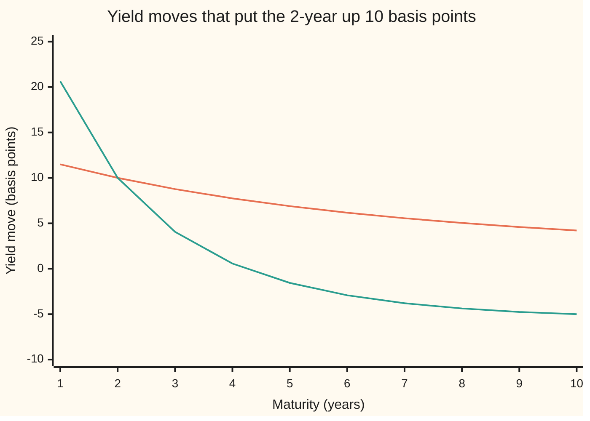
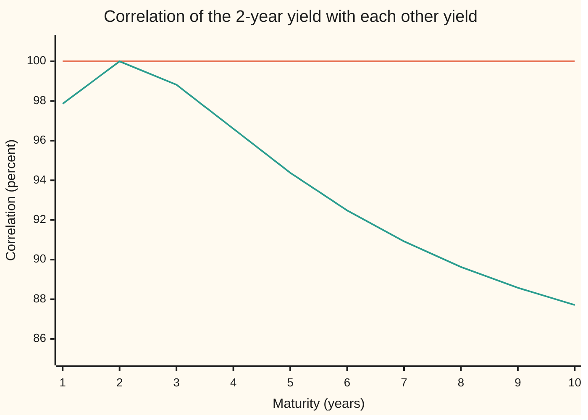

# Beyond one factor: G2++, Black-Karasinski and Black-Derman-Toy in outline

Financial mathematics → Short-Rate Models → Curve twists and positive rates → Beyond one factor

---

## General Overview

A rates desk has sold a 10-year zero-coupon bond (a bond that pays one lump sum at maturity and nothing before) and hedges it by buying 2-year bonds. On most days the whole yield curve (the line of interest rates across maturities) moves up or down together, and the hedge holds. Then a day comes when the 2-year yield rises 10 basis points (a basis point is one hundredth of a percent) and the 10-year yield falls 5. Traders call that a twist. The 2-year bonds it owns fall in price, the 10-year bond it owes rises, and the desk loses on both legs.

The Hull-White model ([hull-white-model](04-hull-white-model.md)) cannot produce that day. It drives every rate from one random number: the short rate, the interest rate on overnight money. On the shelf's house curve (Vasicek, pulled toward 5% at speed 0.3 a year, volatility 1%, starting at 4%), ask Hull-White for a 10 basis point rise at 2 years. It answers with a rise at every maturity: 11.49 at 1 year, 4.21 at 10 years. Every move points the same way, in the same fixed proportions, every day.

The number of independent random shocks driving a model is its number of **factors**, the word used from here on. One factor bends the curve one way only.

Three models go further, and they fix different things.

- **G2++** adds a second factor. Two shocks that fade at different speeds can push the short end up while the long end falls.
- **Black-Karasinski** keeps one factor but models the logarithm of the short rate, so the rate itself can never go below zero.
- **Black-Derman-Toy** is the tree that came first: a one-factor lognormal lattice (a grid of possible future rates) fitted node by node to today's curve.

A **swaption** is an option to enter a swap (an exchange of fixed for floating interest payments) on a future date ([swaptions-payer-and-receiver](../29-Caps%2C%20Floors%20and%20Swaptions/04-swaptions-payer-and-receiver.md)). Take two swaptions that both expire in one year: one on a 2-year swap, one on a 9-year swap. Anything that pays on both, or lets its holder choose between them, depends on how the two swap rates move together. Every one-factor model says: in perfect lockstep, correlation 1. G2++ with the parameters below says 0.979.

**One random shock moves every rate on the curve the same way in fixed proportions, so a one-factor model makes all rates perfectly correlated; G2++ adds a second shock so the curve can twist, while Black-Karasinski and Black-Derman-Toy keep one shock and reshape it so the short rate stays positive.**

**What kind of fact this is:** three models, assumptions about how rates move that fit markets well enough, not laws; inside them, that one factor forces correlation 1 and that G2++ gives less than 1 are theorems, proved on this card in Why it works.

### The picture: one factor against two, asked for the same 2-year move



The orange line is Hull-White: one shock, 13.2982 basis points on the short rate, every yield up. The green line is G2++ asked for the twist: 2-year up 10, 10-year down 5. It needs a fast factor up 56.0659 basis points and a slow factor down 15.4086. Hull-White has no way to draw the green line.

---

## The formula

Notation first, in words. A small random step is written $dW_t$: the step of a **Brownian motion**, a random walk whose steps are independent and Normal with variance equal to the time elapsed. Two Brownian motions can be correlated: $dW^1_t\,dW^2_t = \rho\,dt$ says their steps move together with correlation $\rho$. The symbol $d$ in front of anything means its change over a short time $dt$.

**G2++**, the two-factor Gaussian model:

$$r_t = x_t + y_t + \varphi(t),\qquad dx_t = -a\,x_t\,dt + \sigma\,dW^1_t,\qquad dy_t = -b\,y_t\,dt + \eta\,dW^2_t,\qquad dW^1_t\,dW^2_t = \rho\,dt$$

**Read it aloud:** the short rate is a fast-fading random part plus a slow-fading random part plus a fixed curve that makes today's bond prices come out right.

What it implies for how two maturities $u$ and $v$ move together:

$$C(u,v) = \sigma^2 B_a(u)B_a(v) + \eta^2 B_b(u)B_b(v) + \rho\,\sigma\eta\,\big[B_a(u)B_b(v) + B_b(u)B_a(v)\big],\qquad \mathrm{corr}(u,v) = \frac{C(u,v)}{\sqrt{C(u,u)\,C(v,v)}}$$

$$B_c(u) = \frac{1 - e^{-cu}}{c}$$

**Read it aloud:** each maturity's move is a mix of the two shocks, weighted by how long each shock lasts inside that maturity; two maturities with different mixes cannot move in perfect step.

**Black-Karasinski**, one factor, lognormal:

$$d\ln r_t = \big[\theta(t) - a\ln r_t\big]\,dt + \sigma\,dW_t$$

**Read it aloud:** the logarithm of the short rate is pulled toward a moving target and shaken by one shock, so the rate itself is always positive.

**Black-Derman-Toy**, one factor, a tree with one-year steps:

$$r_{i,j} = U_i\,e^{\sigma(2j - i)}$$

**Read it aloud:** at year $i$, the rate after $j$ up-moves is the year's middle rate scaled up or down by a fixed log-step; each year's middle rate is chosen so the tree prices today's bond of the next maturity exactly.

A swap starting in one year and paying annually for $n$ years has par rate (the fixed rate that makes it worth zero today, [par-swap-rate-and-annuity](../28-Swaps/02-par-swap-rate-and-annuity.md)):

$$S_n = \frac{P(1) - P(1+n)}{P(2) + P(3) + \dots + P(1+n)}$$

| Symbol | Plain meaning | In our example | Push it up and the answer… |
| --- | --- | --- | --- |
| $r_t$ | the short rate: the overnight interest rate at time t | 4% today on the house curve | every bond cheaper |
| $x_t$, $y_t$ | the two G2++ factors, fast and slow; both start at 0 | the twist needs x = +56.0659 bp, y = −15.4086 bp | x lifts the short end most; y lifts the whole curve |
| $\varphi(t)$, $\theta(t)$ | fixed functions of time, chosen so today's curve comes out exactly | whatever the house curve demands | the forward curve shifts |
| $a$, $b$ | reversion speeds, per year: how fast each factor fades back to 0 | G2++: 1 and 0.08; Hull-White: 0.3 | that shock dies sooner; long yields feel it less |
| $\sigma$, $\eta$ | size of each shock; $\sigma$ in rate units per root-year for Gaussian models, a log-volatility for lognormal ones | G2++: 0.012 and 0.007; Hull-White 0.01; Black-Derman-Toy 0.20 | more of that shock |
| $\rho$ | correlation between the two G2++ shocks | −0.2 | maturities move more alike |
| $W_t$, $W^1_t$, $W^2_t$, $dW_t$, $dt$ | Brownian motions, the random drivers; a small step of one, over a short time $dt$ | one for one-factor models, two for G2++ | — |
| $B_c(u)$ | loading: how far a u-year bond's log price falls per unit rise in a factor that fades at speed c | B_1(2) = 0.864665, B_0.08(10) = 6.883388 | — |
| $u$, $v$, $t$, $s$, $w$, $T$, $P(u)$ | maturities and times in years; $P(u)$ is today's price of 1 paid at year u | 2 and 10; P(2) = 0.918629 | — |
| $C(u,v)$, $V$ | the rate at which the u-year and v-year bonds' log prices co-vary, per year; $V$ is the total variance of a bond's log price | gives corr(2, 10) = 0.877124 | — |
| $S_n$, $n$ | par rate of the swap from year 1 to year 1 + n | 4.5293% for n = 2, 4.8029% for n = 9 | — |
| $U_i$, $i$, $j$ | Black-Derman-Toy: year $i$'s middle node rate; $j$ counts up-moves | 4.2214% at year 0 | — |

A u-year yield is the rate y with price $e^{-yu}$, so a yield move is minus the log-price move divided by u. Dividing by a positive number changes no correlation: yields and bonds of the same maturities share the same correlations.

### When it holds

- **Gaussian factors (Hull-White, G2++):** shocks are Normal, so rates can go negative. In a 1% world with 1% volatility, Hull-White gives a 21.90% chance of a negative short rate in 10 years. Where negative rates are impossible or forbidden by the product, the Gaussian price is off; where they happened (the euro area, Japan, Switzerland in the 2010s), they are a feature.
- **Lognormal (Black-Karasinski, Black-Derman-Toy):** the short rate's log is Normal, so rates stay positive but can never fit a curve with negative forward rates, and there is no closed-form bond price: every price comes from a tree or a numerical integral.
- **Constant parameters:** a, b, σ, η and ρ are fixed numbers here. Real calibrations let volatilities vary with time; the correlations then change with the calendar.
- **Local correlation:** the correlations on this card are instantaneous, for one small step. Over a year the two factors fade by different amounts and swap rates are nonlinear in them, so the correlation of yearly changes differs from the instantaneous figure.

---

## Why it works

### Step 0: whatever moves every rate is what sets their correlation

A bond price tomorrow is a function of the model's random state tomorrow. If that state is one number, every bond is a function of the same number, and small changes in every bond are proportional to one small change. Proportional moves have correlation +1 or −1, never anything between. So the question "can two rates move differently?" is the question "how many random numbers drive the state?".

### Step 1: one factor makes every yield move in fixed proportion

In Hull-White a u-year bond is priced $P = A(u)e^{-B(u)r}$, with $B(u) = (1 - e^{-au})/a$ ([hull-white-model](04-hull-white-model.md)). Its yield is $-\ln P/u$, so a short-rate move $\Delta r$ moves the u-year yield by $B(u)/u \times \Delta r$, plus a part that depends only on the calendar.

At speed 0.3 the 2-year yield loading $B(u)/u$ is 0.751981 and the 10-year is 0.316738. A 10 basis point rise at 2 years needs $\Delta r$ = 13.2982 basis points, which lifts the 10-year by 4.21. Every loading is positive, so every yield moves the same way. The 10-year can never fall while the 2-year rises.

The same holds for any one-factor model. In Black-Karasinski and Black-Derman-Toy the proportions change with the rate's level, but at each instant they are still proportions of one shock.

### Step 2: two factors give each maturity its own mix

In G2++ the short rate is $x_t + y_t + \varphi(t)$. Each factor is an Ornstein-Uhlenbeck process (a random walk pulled back toward 0), the same kind that drives Hull-White. A unit rise in the fast factor today raises the short rate by 1 now and by $e^{-a s}$ in $s$ years; summed over a bond's life that is $B_a(u) = \int_0^u e^{-as}\,ds$. So the u-year bond price is

$$P(u) = P_0(u)\,\exp\!\big(-B_a(u)\,x - B_b(u)\,y + \text{a fixed correction}\big)$$

where $P_0(u)$ is today's price, and the u-year yield moves by $\big(B_a(u)\,x + B_b(u)\,y\big)/u$.

The fast factor, fading at speed 1, is almost spent after two years: its 2-year loading per year of maturity is 0.432332, its 10-year loading 0.099995. The slow factor at speed 0.08 barely fades: 0.924101 and 0.688339. Two maturities, two unknowns. To put the 2-year up 10 and the 10-year down 5:

$$0.432332\,x + 0.924101\,y = 10,\qquad 0.099995\,x + 0.688339\,y = -5$$

The determinant (the number that says whether two equations pin two unknowns) is 0.205185, not zero, so there is exactly one answer: x = 56.0659, y = −15.4086 basis points. Fast up, slow down. The short end rises because the fast factor dominates there; the long end falls because only the slow factor reaches it.

<details>
<summary>Detailed proof: the G2++ bond price and when two maturities really have two directions</summary>

Solve each factor from time $t$: $x_s = x_t e^{-a(s-t)} + \sigma\int_t^s e^{-a(s-w)}dW^1_w$, and the same for $y_t$ with $b$ and $\eta$. Integrate the short rate from $t$ to $T$ and swap the order of integration: the random part of $\int_t^T r_s\,ds$ is $B_a(T-t)x_t + B_b(T-t)y_t + \sigma\int_t^T B_a(T-w)dW^1_w + \eta\int_t^T B_b(T-w)dW^2_w$. The last two terms are Normal with mean 0 and variance $V = \int_0^{T-t}[\sigma^2B_a^2 + \eta^2B_b^2 + 2\rho\sigma\eta B_aB_b]$, the cross term coming from $dW^1\,dW^2 = \rho\,dt$. For a Normal $Z$ with mean 0 and variance $V$, the average of $e^{-Z}$ is $e^{V/2}$, so the bond price is the exponential of minus the fixed part, minus $B_a x_t + B_b y_t$, plus $V/2$. Choosing $\varphi$ as today's forward rate plus half the derivative of $V$ makes the price at time 0 equal today's market price.

Only the state terms are random, so over a short step the log price of the u-year bond moves by $-\sigma B_a(u)\,dW^1 - \eta B_b(u)\,dW^2$. Multiply two such moves and keep the $dt$ terms: that is $C(u,v)\,dt$. For maturities u and v, stack the two shock loadings into a 2 by 2 array; the determinant of their covariance is
$$C(u,u)C(v,v) - C(u,v)^2 = \sigma^2\eta^2(1-\rho^2)\,\big[B_a(u)B_b(v) - B_a(v)B_b(u)\big]^2.$$

For yields, divide both sides by $u^2v^2$; the sign is unchanged.
The bracket is $\int_0^u\!\int_u^v\big(e^{-as}e^{-bw} - e^{-bs}e^{-aw}\big)\,dw\,ds$. For $s < w$ the integrand is $e^{-as-bw}(1 - e^{(a-b)(s-w)})$, which has one strict sign when $a \ne b$, so the bracket is not zero when $0 < u < v$. Hence with $\sigma, \eta > 0$, $|\rho| < 1$ and $a \ne b$, the determinant is positive and $|\mathrm{corr}(u,v)| < 1$. Set $\rho = \pm1$, $a = b$, or either volatility to 0 and the determinant is 0: correlation ±1 again.

</details>

### Step 3: correlation below one, and its size

Combine the two shocks through $C(u,u)$: the 2-year yield moves with volatility 74.39 basis points a year and the 10-year with 47.27. Their correlation from the formula is 0.877124. The determinant identity from the proof gives the same covariance determinant two ways, 2.8518e-10 both times; a positive determinant is exactly the statement that the correlation is below one.

The correlation falls with distance from the 2-year: 98.82% with the 3-year, 94.38% with the 5-year, 87.71% with the 10-year. In Hull-White every entry is 100%.



The orange line is Hull-White, Black-Karasinski and Black-Derman-Toy: all one-factor, all at 100%. The green line is G2++ with a = 1, b = 0.08, σ = 0.012, η = 0.007, ρ = −0.2.

### Step 4: from yields to swaption correlations

A swaption's value hangs on its swap rate, not on one yield. The swap rate $S_n$ is a ratio of bond prices, so its move is found by the quotient rule (the derivative of a ratio), using the fact from Step 2 that a unit rise in a factor lowers each bond's price by its loading times its price. On the house curve the swap from year 1 to year 3 has par rate 4.5293% and the swap from year 1 to year 10 has 4.8029%. The 2-year swap rate moves 0.167886 per unit of the fast factor, and a bump-and-reprice gives the same 0.167886.

Weight each factor's sensitivity by its shock size and feed the two pairs into the correlation formula: 0.979129. Simulating 100,000 one-day shocks and repricing both swaps in full gives 0.979.

That is higher than the 2-year against 10-year yield correlation of 0.877. Both swaps start at year 1 and both lean on the same near bonds, so they share much of their move. A price that depends on two swap rates needs the correlation of those swap rates, not of any two yields.

### Step 5: the lognormal repair keeps rates positive

A Gaussian short rate is Normal, so some of its paths go negative. Pull a Hull-White rate toward 1% at speed 0.3 with 1% volatility, starting at 1%: after 10 years it is Normal with mean 1%, and the chance it sits below zero is 21.90%. A simulation of 100,000 paths finds 21.77%.

Black-Karasinski makes $\ln r_t$ the Gaussian process instead. The exponential of any finite number is positive, so $r_t > 0$ on every path. The price is paid elsewhere: the integral of a lognormal rate has no known distribution, so there is no closed-form bond price and every bond is priced on a tree ([hull-white-trinomial-tree](06-hull-white-trinomial-tree.md) builds the lattice for the Gaussian case; Black-Karasinski runs the same lattice in log-rate). And the volatility now scales with the level: a fixed log-volatility means large moves when rates are high and small ones when they are low.

### Step 6: Black-Derman-Toy, the tree that came first

Black, Derman and Toy (1990) built the lognormal tree first. Each year the rate moves up or down with probability one half, and neighbouring rates in the same year differ by a factor $e^{2\sigma}$. The middle rate $U_i$ is solved each year so the tree prices the next zero bond exactly.

The code builds it with $\sigma$ = 0.20 on the house curve. Year 0 is forced: $U_0 = 1/P(1) - 1$, which is 4.2214%. Year 1 is 3.5766% or 5.3357%; year 3 runs from 2.4740% to 8.2138%. Rolling a bond back through the tree reproduces every house price: 0.959496, 0.918629, 0.878115, 0.838425.

At year 1 there are two states. In the up state the 2-year swap rate is 5.4358% and the 3-year 5.5169%; in the down state 3.6455% and 3.7027%. Both rise together. With two states any two quantities have correlation +1 or −1; one factor again.

Black-Derman-Toy's weakness is structural. In its continuous-time limit,

$$d\ln r_t = \Big[\theta(t) + \frac{\sigma'(t)}{\sigma(t)}\ln r_t\Big]dt + \sigma(t)\,dW_t,$$

where $\sigma'(t)$ is the rate of change of the volatility. The pull back to the middle is the ratio $\sigma'(t)/\sigma(t)$: the model reverts only if its volatility falls with time. Fit the volatility curve and the reversion comes with it. Black-Karasinski separates the two by giving reversion its own speed $a$.

Another route to more than one factor is to stop modelling one short rate and model the whole forward curve: [hjm-framework-and-the-drift-condition](../31-Forward-Rate%20Models/01-hjm-framework-and-the-drift-condition.md) does that, with as many factors as the data support.

---

## Worked numbers, by hand

| Step | Arithmetic | Value |
| --- | --- | --- |
| house 2-year price | Vasicek formula, speed 0.3, target 5%, vol 1%, start 4% | 0.918629 |
| Hull-White loadings | (1 − e^(−0.3u))/(0.3u) at u = 2 and 10 | 0.751981, 0.316738 |
| short-rate shock for +10 bp at 2 years | 10 / 0.751981 | 13.2982 bp |
| its 10-year move | 13.2982 × 0.316738 | **+4.21 bp** |
| G2++ loadings per year | (1 − e^(−u))/u and (1 − e^(−0.08u))/(0.08u) at u = 2 and 10 | fast 0.432332, 0.099995; slow 0.924101, 0.688339 |
| determinant | 0.432332 × 0.688339 − 0.924101 × 0.099995 | 0.205185 |
| fast shock x | (10 × 0.688339 + 5 × 0.924101) / 0.205185 | 56.0659 bp |
| slow shock y | (−5 × 0.432332 − 10 × 0.099995) / 0.205185 | −15.4086 bp |
| yield vols | shock size times loading, both shocks and their correlation | 74.39 and 47.27 bp a year |
| 2-year against 10-year | C(2,10) / √(C(2,2) C(10,10)) | **0.877124** |
| swap 1y-into-2y against 1y-into-9y | same formula on swap-rate sensitivities | **0.979129** |

A desk running Hull-White reads a 2-year hedge of a 10-year bond as perfect. G2++ puts their correlation at 0.877124, so part of the 10-year's daily move is left unhedged by any amount of 2-year bonds.

### What breaks if you drop a piece

| Mistake | Comes out at | What went wrong |
| --- | --- | --- |
| set ρ = −1 | correlation 1.000000 | the two shocks become one; G2++ is a one-factor model again |
| give both factors speed 0.08 | correlation 1.000000 | equal speeds give every maturity the same mix |
| drop ρ, treat the shocks as independent | 0.908174 instead of 0.877124 | the cross term in C(u,v) is gone |
| quote the yield correlation for swaptions | 0.877124 instead of 0.979129 | swap rates share their start and annuity; their correlation is higher |

---

## Code, from first principles, and it actually runs

The code builds the house curve, then takes five roads. It solves the twist and checks it by substitution. It gets the G2++ loadings in closed form and by Simpson's rule (adding up thin slices of an integral). It gets the covariance determinant directly and by its identity. It gets the swap-rate correlation by formula and by a 100,000-day simulation with full repricing, with the swap sensitivity checked by bumping. It fits a four-year Black-Derman-Toy tree by bisection (halving an interval until the root is pinned) and prices every bond back by rolling through the tree. It gets Hull-White's chance of a negative rate by integrating the Normal curve and by simulation. The random numbers come from its own generator; nothing imported knows the answer.

### Python

```python
"""Beyond one factor: Hull-White against G2++, a Black-Derman-Toy tree, and negative rates. Standard library only."""
from math import exp, log, sqrt, cos, pi

KV, TH, SV, R0 = 0.3, 0.05, 0.01, 0.04                  # house curve: Vasicek, also Hull-White's a and sigma
A, B, SIG, ETA, RHO = 1.0, 0.08, 0.012, 0.007, -0.2     # G2++: fast factor, slow factor, their correlation
MATS = [float(u) for u in range(1, 11)]
def load(c, u):                                          # B_c(u) = (1 - e^(-c u)) / c
    return (1.0 - exp(-c * u)) / c
def simpson(f, lo, hi, n=2000):
    h = (hi - lo) / n
    return (f(lo) + f(hi) + sum((4 if k % 2 else 2) * f(lo + k * h) for k in range(1, n))) * h / 3.0
def P0(T):                                               # today's zero price on the house curve
    b = load(KV, T)
    return exp((TH - SV * SV / (2 * KV * KV)) * (b - T) - SV * SV * b * b / (4 * KV) - b * R0)
def cov(p, q, rho=RHO):
    return p[0] * q[0] + p[1] * q[1] + rho * (p[0] * q[1] + p[1] * q[0])
def corr(p, q, rho=RHO):
    return cov(p, q, rho) / sqrt(cov(p, p, rho) * cov(q, q, rho))
def yload(u, a=A, b=B, s=SIG, e=ETA):                    # how much a u-year yield moves per unit of each shock
    return (s * load(a, u) / u, e * load(b, u) / u)
def swap(n, x=0.0, y=0.0):                              # par rate of a swap from year 1 to year 1+n, factors shocked by x, y
    p = [P0(t) * exp(-load(A, t) * x - load(B, t) * y) for t in range(1, n + 2)]
    return (p[0] - p[n]) / sum(p[1:])
def swap_grad(n, c):                                     # d(swap rate)/d(factor with speed c), by the quotient rule
    p = [P0(t) for t in range(1, n + 2)]
    ann = sum(p[1:])
    num = (-load(c, 1) * p[0] + load(c, 1 + n) * p[n]) * ann
    num += (p[0] - p[n]) * sum(load(c, 1 + j) * p[j] for j in range(1, n + 1))
    return num / ann ** 2
def rng(seed):                                           # xorshift64, uniforms in (0, 1)
    s, M = seed, (1 << 64) - 1
    while True:
        s ^= (s << 13) & M; s ^= s >> 7; s ^= (s << 17) & M
        yield ((s >> 11) + 0.5) / 2.0 ** 53
def normals(g):
    while True:
        yield sqrt(-2.0 * log(next(g))) * cos(2.0 * pi * next(g))
def show(label, v, d=6):
    print(f"{label:<40} {v:>12.{d}f}")

# 1. one factor: a 2-year move fixes every other move
dr = 0.0010 / (load(KV, 2) / 2)
hw_move = [dr * load(KV, u) / u * 1e4 for u in MATS]
# 2. two factors: solve for the shocks that put 2y up 10bp and 10y down 5bp
(p2, q2), (p10, q10) = (load(A, 2) / 2, load(B, 2) / 2), (load(A, 10) / 10, load(B, 10) / 10)
det = p2 * q10 - q2 * p10
x = (0.0010 * q10 - q2 * -0.0005) / det
y = (p2 * -0.0005 - p10 * 0.0010) / det
g2_move = [(load(A, u) * x + load(B, u) * y) / u * 1e4 for u in MATS]
# 3. correlations of yields and of swap rates
c_2_10 = corr(yload(2), yload(10))
cross = load(A, 2) * load(B, 10) - load(A, 10) * load(B, 2)
det_cov = cov(yload(2), yload(2)) * cov(yload(10), yload(10)) - cov(yload(2), yload(10)) ** 2
det_id = (SIG * ETA / 20) ** 2 * (1 - RHO ** 2) * cross ** 2
g = {n: (SIG * swap_grad(n, A), ETA * swap_grad(n, B)) for n in (2, 9)}
swap_corr = corr(g[2], g[9])
h = 1e-6
fd2 = (swap(2, h, 0) - swap(2, -h, 0)) / (2 * h)
hw_swap = corr((swap_grad(2, KV), 0.0), (swap_grad(9, KV), 0.0))
zs, dt, d2, d9 = normals(rng(20260928)), 1.0 / 252, [], []
s2, s9 = swap(2), swap(9)
for _ in range(100000):                                 # one trading day of shocks, fully repriced
    z1, z2 = next(zs), next(zs)
    xx, yy = SIG * sqrt(dt) * z1, ETA * sqrt(dt) * (RHO * z1 + sqrt(1 - RHO * RHO) * z2)
    d2.append(swap(2, xx, yy) - s2); d9.append(swap(9, xx, yy) - s9)
m2, m9 = sum(d2) / len(d2), sum(d9) / len(d9)
sxy = sum((u - m2) * (v - m9) for u, v in zip(d2, d9))
mc_corr = sxy / sqrt(sum((u - m2) ** 2 for u in d2) * sum((v - m9) ** 2 for v in d9))
# 4. a Black-Derman-Toy tree, 4 annual steps, 20% log-volatility, fitted to the house curve
SB, N = 0.20, 4
U, Q, rates = [], [1.0], []
for i in range(N):
    node = lambda u, j: u * exp(SB * (2 * j - i))
    price = lambda u: sum(Q[j] / (1 + node(u, j)) for j in range(i + 1))
    lo, hi = 1e-6, 1.0
    for _ in range(200):                                # bisection: price falls as the median rate rises
        mid = 0.5 * (lo + hi)
        lo, hi = (mid, hi) if price(mid) > P0(i + 1) else (lo, mid)
    U.append(0.5 * (lo + hi)); r = [node(U[i], j) for j in range(i + 1)]; rates.append(r)
    Q = [0.5 * ((Q[j - 1] / (1 + r[j - 1]) if j > 0 else 0) + (Q[j] / (1 + r[j]) if j <= i else 0)) for j in range(i + 2)]
def backward(T):                                        # roll a bond paying 1 at year T back through the tree
    v, layers = [1.0] * (T + 1), {}
    for i in range(T - 1, -1, -1):
        v = [0.5 * (v[j] + v[j + 1]) / (1 + rates[i][j]) for j in range(i + 1)]
        layers[i] = v
    return layers
bdt_back = [backward(T)[0][0] for T in range(1, N + 1)]
at1 = {T: backward(T)[1] for T in (2, 3, 4)}            # bond prices seen from year 1, down node then up node
sw = [[(1 - at1[1 + n][j]) / sum(at1[t][j] for t in range(2, 2 + n)) for j in (0, 1)] for n in (2, 3)]
# 5. negative rates: Hull-White in a 1% world after 10 years
a1, s1, r1, T1 = 0.3, 0.01, 0.01, 10.0
sd = sqrt(s1 * s1 * (1 - exp(-2 * a1 * T1)) / (2 * a1))
p_neg = 0.5 - simpson(lambda z: exp(-z * z / 2) / sqrt(2 * pi), 0.0, r1 / sd)
zs2, neg, fade = normals(rng(7)), 0, exp(-a1)
for _ in range(100000):                                 # ten exact one-year steps of the short rate
    r = r1
    for _ in range(10):
        r = r1 + (r - r1) * fade + s1 * sqrt((1 - fade * fade) / (2 * a1)) * next(zs2)
    neg += r < 0
print("house curve: zero prices P0(T)")
print("  " + " ".join(f"{P0(T):.6f}" for T in (1, 2, 3, 4, 10)))
print(f"HW yield loadings B(u)/u, 2y and 10y     {load(KV, 2) / 2:.6f} {load(KV, 10) / 10:.6f}")
print(f"G2 loadings 2y fast/slow, 10y fast/slow {p2:.6f} {q2:.6f} {p10:.6f} {q10:.6f}  det {det:.6f}")
show("HW: short-rate shock for 2y +10bp, bp", dr * 1e4, 4); show("G2++: fast factor shock x, bp", x * 1e4, 4); show("G2++: slow factor shock y, bp", y * 1e4, 4)
print(f"G2++ yield vols 2y, 10y, bp a year       {1e4 * sqrt(cov(yload(2), yload(2))):.2f} {1e4 * sqrt(cov(yload(10), yload(10))):.2f}")
print("maturity " + " ".join(f"{int(u):>6d}" for u in MATS))
print("HW move  " + " ".join(f"{v:6.2f}" for v in hw_move))
print("G2 move  " + " ".join(f"{v:6.2f}" for v in g2_move))
print("G2 corr% " + " ".join(f"{100 * corr(yload(2), yload(u)):6.2f}" for u in MATS))
show("B_1(2)", load(A, 2)); show("B_1(2) by Simpson", simpson(lambda s: exp(-A * s), 0.0, 2.0))
show("B_0.08(10)", load(B, 10)); show("B_0.08(10) by Simpson", simpson(lambda s: exp(-B * s), 0.0, 10.0))
show("yield corr 2y,10y: G2++", c_2_10); show("yield corr 2y,10y: HW", corr(yload(2, KV, KV, SV, 0.0), yload(10, KV, KV, SV, 0.0)))
print(f"{'covariance determinant, direct':<40} {det_cov:>12.4e}"); print(f"{'covariance determinant, identity':<40} {det_id:>12.4e}")
show("swap 1y-into-2y par rate", s2); show("swap 1y-into-9y par rate", s9)
show("dS2/dx analytic", swap_grad(2, A)); show("dS2/dx bumped", fd2)
show("swap corr 1y2y,1y9y: G2++ formula", swap_corr); show("swap corr: G2++ Monte Carlo, 100000 days", mc_corr, 3)
show("swap corr: HW", hw_swap)
show("wrong: rho = -1, yield corr", corr(yload(2), yload(10), -1.0))
show("wrong: a = b = 0.08, yield corr", corr(yload(2, B, B), yload(10, B, B)))
show("wrong: rho set to 0, yield corr", corr(yload(2), yload(10), 0.0))
show("try: rho = +0.5, yield corr", corr(yload(2), yload(10), 0.5)); show("try: rho = -0.8, yield corr", corr(yload(2), yload(10), -0.8))
show("try: rho = +0.5, swap corr", corr(g[2], g[9], 0.5)); show("try: b = 0.3, yield corr", corr(yload(2, A, 0.3), yload(10, A, 0.3)))
for i, r in enumerate(rates):
    print(f"BDT year {i} node rates, %  " + " ".join(f"{100 * v:7.4f}" for v in r))
print("BDT zero prices, tree  " + " ".join(f"{v:.6f}" for v in bdt_back))
print(f"BDT year-1 swap to 3, down/up, %  {100 * sw[0][0]:.4f} {100 * sw[0][1]:.4f}")
print(f"BDT year-1 swap to 4, down/up, %  {100 * sw[1][0]:.4f} {100 * sw[1][1]:.4f}")
show("HW 1% world: P(r < 0 at 10y), formula", p_neg, 4); show("HW 1% world: P(r < 0), Monte Carlo", neg / 100000, 4)

assert abs(g2_move[1] - 10.0) < 1e-9, "the solved shocks put the 2-year up 10bp"
assert abs(g2_move[9] + 5.0) < 1e-9, "and the 10-year down 5bp"
assert min(hw_move) > 0, "one factor cannot move any yield against the 2-year"
assert abs(load(A, 2) - simpson(lambda s: exp(-A * s), 0.0, 2.0)) < 1e-10, "loading: closed form against quadrature"
assert abs(det_cov - det_id) < 1e-22, "covariance determinant against its identity"
assert abs(fd2 - swap_grad(2, A)) < 1e-6, "swap gradient: quotient rule against bump"
assert abs(mc_corr - swap_corr) < 0.003, "swap correlation: formula against simulation"
assert abs(U[0] - (1 / P0(1) - 1)) < 1e-12, "first BDT rate is the one-year rate"
assert max(abs(bdt_back[T] - P0(T + 1)) for T in range(N)) < 1e-12, "tree prices every zero back"
assert abs(neg / 100000 - p_neg) < 0.003, "negative-rate chance: formula against simulation"
print("ALL CHECKS PASS")
```

**Ran 2026-09-28 on macOS, Python 3.14.6, standard library only. All checks passed. Output, pasted from the run:**

```
house curve: zero prices P0(T)
  0.959496 0.918629 0.878115 0.838425 0.627905
HW yield loadings B(u)/u, 2y and 10y     0.751981 0.316738
G2 loadings 2y fast/slow, 10y fast/slow 0.432332 0.924101 0.099995 0.688339  det 0.205185
HW: short-rate shock for 2y +10bp, bp         13.2982
G2++: fast factor shock x, bp                 56.0659
G2++: slow factor shock y, bp                -15.4086
G2++ yield vols 2y, 10y, bp a year       74.39 47.27
maturity      1      2      3      4      5      6      7      8      9     10
HW move   11.49  10.00   8.77   7.74   6.89   6.17   5.56   5.04   4.59   4.21
G2 move   20.63  10.00   4.06   0.57  -1.56  -2.92  -3.80  -4.37  -4.76  -5.00
G2 corr%  97.86 100.00  98.82  96.60  94.38  92.48  90.92  89.63  88.58  87.71
B_1(2)                                       0.864665
B_1(2) by Simpson                            0.864665
B_0.08(10)                                   6.883388
B_0.08(10) by Simpson                        6.883388
yield corr 2y,10y: G2++                      0.877124
yield corr 2y,10y: HW                        1.000000
covariance determinant, direct             2.8518e-10
covariance determinant, identity           2.8518e-10
swap 1y-into-2y par rate                     0.045293
swap 1y-into-9y par rate                     0.048029
dS2/dx analytic                              0.167886
dS2/dx bumped                                0.167886
swap corr 1y2y,1y9y: G2++ formula            0.979129
swap corr: G2++ Monte Carlo, 100000 days        0.979
swap corr: HW                                1.000000
wrong: rho = -1, yield corr                  1.000000
wrong: a = b = 0.08, yield corr              1.000000
wrong: rho set to 0, yield corr              0.908174
try: rho = +0.5, yield corr                  0.963568
try: rho = -0.8, yield corr                  0.734291
try: rho = +0.5, swap corr                   0.990577
try: b = 0.3, yield corr                     0.942515
BDT year 0 node rates, %   4.2214
BDT year 1 node rates, %   3.5766  5.3357
BDT year 2 node rates, %   2.9876  4.4569  6.6490
BDT year 3 node rates, %   2.4740  3.6907  5.5059  8.2138
BDT zero prices, tree  0.959496 0.918629 0.878115 0.838425
BDT year-1 swap to 3, down/up, %  3.6455 5.4358
BDT year-1 swap to 4, down/up, %  3.7027 5.5169
HW 1% world: P(r < 0 at 10y), formula          0.2190
HW 1% world: P(r < 0), Monte Carlo             0.2177
ALL CHECKS PASS
```

### Rust

```rust
// Beyond one factor: Hull-White against G2++, a Black-Derman-Toy tree, and negative rates. std only.
use std::f64::consts::PI;

const KV: f64 = 0.3; const TH: f64 = 0.05; const SV: f64 = 0.01; const R0: f64 = 0.04; // house curve
const A: f64 = 1.0; const B: f64 = 0.08; const SIG: f64 = 0.012; const ETA: f64 = 0.007; const RHO: f64 = -0.2; // G2++

fn load(c: f64, u: f64) -> f64 { (1.0 - (-c * u).exp()) / c }
fn simpson(f: &dyn Fn(f64) -> f64, lo: f64, hi: f64) -> f64 {
    let n = 2000; let h = (hi - lo) / n as f64;
    let s: f64 = (1..n).map(|k| (if k % 2 == 1 { 4.0 } else { 2.0 }) * f(lo + k as f64 * h)).sum();
    (f(lo) + f(hi) + s) * h / 3.0
}
fn p0(t: f64) -> f64 {
    let b = load(KV, t);
    ((TH - SV * SV / (2.0 * KV * KV)) * (b - t) - SV * SV * b * b / (4.0 * KV) - b * R0).exp()
}
fn cov(p: (f64, f64), q: (f64, f64), rho: f64) -> f64 { p.0 * q.0 + p.1 * q.1 + rho * (p.0 * q.1 + p.1 * q.0) }
fn corr(p: (f64, f64), q: (f64, f64), rho: f64) -> f64 { cov(p, q, rho) / (cov(p, p, rho) * cov(q, q, rho)).sqrt() }
fn yload(u: f64, a: f64, b: f64, s: f64, e: f64) -> (f64, f64) { (s * load(a, u) / u, e * load(b, u) / u) }
fn yl(u: f64) -> (f64, f64) { yload(u, A, B, SIG, ETA) }
fn swap(n: usize, x: f64, y: f64) -> f64 {
    let p: Vec<f64> = (1..=n + 1).map(|t| { let t = t as f64; p0(t) * (-load(A, t) * x - load(B, t) * y).exp() }).collect();
    (p[0] - p[n]) / p[1..].iter().sum::<f64>()
}
fn swap_grad(n: usize, c: f64) -> f64 {
    let p: Vec<f64> = (1..=n + 1).map(|t| p0(t as f64)).collect();
    let ann: f64 = p[1..].iter().sum();
    let mut num = (-load(c, 1.0) * p[0] + load(c, 1.0 + n as f64) * p[n]) * ann;
    num += (p[0] - p[n]) * (1..=n).map(|j| load(c, 1.0 + j as f64) * p[j]).sum::<f64>();
    num / ann.powi(2)
}
struct Rng { s: u64 }
impl Rng {
    fn uni(&mut self) -> f64 { self.s ^= self.s << 13; self.s ^= self.s >> 7; self.s ^= self.s << 17; ((self.s >> 11) as f64 + 0.5) / 2f64.powi(53) }
    fn normal(&mut self) -> f64 { let u = self.uni(); let v = self.uni(); (-2.0 * u.ln()).sqrt() * (2.0 * PI * v).cos() }
}
fn show(label: &str, v: f64, d: usize) { println!("{:<40} {:>12.*}", label, d, v); }
fn join(v: &[f64], d: usize, w: usize) -> String { v.iter().map(|x| format!("{:>w$.d$}", x, w = w, d = d)).collect::<Vec<_>>().join(" ") }

fn main() {
    let mats: Vec<f64> = (1..=10).map(|u| u as f64).collect();
    // 1. one factor: a 2-year move fixes every other move
    let dr = 0.0010 / (load(KV, 2.0) / 2.0);
    let hw_move: Vec<f64> = mats.iter().map(|&u| dr * load(KV, u) / u * 1e4).collect();
    // 2. two factors: solve for the shocks that put 2y up 10bp and 10y down 5bp
    let (p2, q2, p10, q10) = (load(A, 2.0) / 2.0, load(B, 2.0) / 2.0, load(A, 10.0) / 10.0, load(B, 10.0) / 10.0);
    let det = p2 * q10 - q2 * p10;
    let x = (0.0010 * q10 - q2 * -0.0005) / det;
    let y = (p2 * -0.0005 - p10 * 0.0010) / det;
    let g2_move: Vec<f64> = mats.iter().map(|&u| (load(A, u) * x + load(B, u) * y) / u * 1e4).collect();
    // 3. correlations of yields and of swap rates
    let c_2_10 = corr(yl(2.0), yl(10.0), RHO);
    let cross = load(A, 2.0) * load(B, 10.0) - load(A, 10.0) * load(B, 2.0);
    let det_cov = cov(yl(2.0), yl(2.0), RHO) * cov(yl(10.0), yl(10.0), RHO) - cov(yl(2.0), yl(10.0), RHO).powi(2);
    let det_id = (SIG * ETA / 20.0).powi(2) * (1.0 - RHO.powi(2)) * cross.powi(2);
    let g = |n: usize| (SIG * swap_grad(n, A), ETA * swap_grad(n, B));
    let swap_corr = corr(g(2), g(9), RHO);
    let h = 1e-6;
    let fd2 = (swap(2, h, 0.0) - swap(2, -h, 0.0)) / (2.0 * h);
    let hw_swap = corr((swap_grad(2, KV), 0.0), (swap_grad(9, KV), 0.0), RHO);
    let mut zs = Rng { s: 20260928 }; let dt: f64 = 1.0 / 252.0;
    let (s2, s9) = (swap(2, 0.0, 0.0), swap(9, 0.0, 0.0));
    let (mut d2, mut d9) = (Vec::new(), Vec::new());
    for _ in 0..100000 { // one trading day of shocks, fully repriced
        let z1 = zs.normal(); let z2 = zs.normal();
        let xx = SIG * dt.sqrt() * z1; let yy = ETA * dt.sqrt() * (RHO * z1 + (1.0 - RHO * RHO).sqrt() * z2);
        d2.push(swap(2, xx, yy) - s2); d9.push(swap(9, xx, yy) - s9);
    }
    let m2 = d2.iter().sum::<f64>() / d2.len() as f64; let m9 = d9.iter().sum::<f64>() / d9.len() as f64;
    let sxy: f64 = d2.iter().zip(&d9).map(|(u, v)| (u - m2) * (v - m9)).sum();
    let mc_corr = sxy / (d2.iter().map(|u| (u - m2).powi(2)).sum::<f64>() * d9.iter().map(|v| (v - m9).powi(2)).sum::<f64>()).sqrt();
    // 4. a Black-Derman-Toy tree, 4 annual steps, 20% log-volatility, fitted to the house curve
    let (sb, nn) = (0.20, 4usize);
    let (mut uu, mut q, mut rates): (Vec<f64>, Vec<f64>, Vec<Vec<f64>>) = (vec![], vec![1.0], vec![]);
    for i in 0..nn {
        let node = |u: f64, j: usize| u * (sb * (2.0 * j as f64 - i as f64)).exp();
        let price = |u: f64| (0..=i).map(|j| q[j] / (1.0 + node(u, j))).sum::<f64>();
        let (mut lo, mut hi) = (1e-6, 1.0);
        for _ in 0..200 { // bisection: price falls as the median rate rises
            let mid = 0.5 * (lo + hi);
            if price(mid) > p0(i as f64 + 1.0) { lo = mid } else { hi = mid }
        }
        uu.push(0.5 * (lo + hi)); let r: Vec<f64> = (0..=i).map(|j| node(uu[i], j)).collect();
        q = (0..=i + 1).map(|j| 0.5 * ((if j > 0 { q[j - 1] / (1.0 + r[j - 1]) } else { 0.0 }) + (if j <= i { q[j] / (1.0 + r[j]) } else { 0.0 }))).collect();
        rates.push(r);
    }
    let backward = |t: usize| -> Vec<Vec<f64>> { // roll a bond paying 1 at year t back through the tree
        let mut v = vec![1.0; t + 1]; let mut layers = vec![vec![]; t];
        for i in (0..t).rev() { v = (0..=i).map(|j| 0.5 * (v[j] + v[j + 1]) / (1.0 + rates[i][j])).collect(); layers[i] = v.clone(); }
        layers
    };
    let bdt_back: Vec<f64> = (1..=nn).map(|t| backward(t)[0][0]).collect();
    let at1: Vec<Vec<f64>> = (0..=4).map(|t| if t >= 2 { backward(t)[1].clone() } else { vec![] }).collect();
    let sw: Vec<Vec<f64>> = [2usize, 3].iter().map(|&n| (0..2).map(|j| (1.0 - at1[1 + n][j]) / (2..2 + n).map(|t| at1[t][j]).sum::<f64>()).collect()).collect();
    // 5. negative rates: Hull-White in a 1% world after 10 years
    let (a1, s1, r1, t1): (f64, f64, f64, f64) = (0.3, 0.01, 0.01, 10.0);
    let sd = (s1 * s1 * (1.0 - (-2.0 * a1 * t1).exp()) / (2.0 * a1)).sqrt();
    let p_neg = 0.5 - simpson(&|z: f64| (-z * z / 2.0).exp() / (2.0 * PI).sqrt(), 0.0, r1 / sd);
    let (mut zs2, mut neg, fade) = (Rng { s: 7 }, 0u32, (-a1).exp());
    for _ in 0..100000 { // ten exact one-year steps of the short rate
        let mut r = r1;
        for _ in 0..10 { r = r1 + (r - r1) * fade + s1 * ((1.0 - fade * fade) / (2.0 * a1)).sqrt() * zs2.normal(); }
        if r < 0.0 { neg += 1 }
    }
    println!("house curve: zero prices P0(T)");
    println!("  {}", [1.0, 2.0, 3.0, 4.0, 10.0].iter().map(|&t| format!("{:.6}", p0(t))).collect::<Vec<_>>().join(" "));
    println!("HW yield loadings B(u)/u, 2y and 10y     {:.6} {:.6}", load(KV, 2.0) / 2.0, load(KV, 10.0) / 10.0);
    println!("G2 loadings 2y fast/slow, 10y fast/slow {:.6} {:.6} {:.6} {:.6}  det {:.6}", p2, q2, p10, q10, det);
    show("HW: short-rate shock for 2y +10bp, bp", dr * 1e4, 4); show("G2++: fast factor shock x, bp", x * 1e4, 4); show("G2++: slow factor shock y, bp", y * 1e4, 4);
    println!("G2++ yield vols 2y, 10y, bp a year       {:.2} {:.2}", 1e4 * cov(yl(2.0), yl(2.0), RHO).sqrt(), 1e4 * cov(yl(10.0), yl(10.0), RHO).sqrt());
    println!("maturity {}", mats.iter().map(|u| format!("{:>6}", *u as i32)).collect::<Vec<_>>().join(" "));
    println!("HW move  {}", join(&hw_move, 2, 6));
    println!("G2 move  {}", join(&g2_move, 2, 6));
    println!("G2 corr% {}", join(&mats.iter().map(|&u| 100.0 * corr(yl(2.0), yl(u), RHO)).collect::<Vec<_>>(), 2, 6));
    show("B_1(2)", load(A, 2.0), 6); show("B_1(2) by Simpson", simpson(&|s: f64| (-A * s).exp(), 0.0, 2.0), 6);
    show("B_0.08(10)", load(B, 10.0), 6); show("B_0.08(10) by Simpson", simpson(&|s: f64| (-B * s).exp(), 0.0, 10.0), 6);
    show("yield corr 2y,10y: G2++", c_2_10, 6); show("yield corr 2y,10y: HW", corr(yload(2.0, KV, KV, SV, 0.0), yload(10.0, KV, KV, SV, 0.0), RHO), 6);
    println!("{:<40} {:>12.4e}", "covariance determinant, direct", det_cov); println!("{:<40} {:>12.4e}", "covariance determinant, identity", det_id);
    show("swap 1y-into-2y par rate", s2, 6); show("swap 1y-into-9y par rate", s9, 6);
    show("dS2/dx analytic", swap_grad(2, A), 6); show("dS2/dx bumped", fd2, 6);
    show("swap corr 1y2y,1y9y: G2++ formula", swap_corr, 6); show("swap corr: G2++ Monte Carlo, 100000 days", mc_corr, 3);
    show("swap corr: HW", hw_swap, 6);
    show("wrong: rho = -1, yield corr", corr(yl(2.0), yl(10.0), -1.0), 6);
    show("wrong: a = b = 0.08, yield corr", corr(yload(2.0, B, B, SIG, ETA), yload(10.0, B, B, SIG, ETA), RHO), 6);
    show("wrong: rho set to 0, yield corr", corr(yl(2.0), yl(10.0), 0.0), 6);
    show("try: rho = +0.5, yield corr", corr(yl(2.0), yl(10.0), 0.5), 6); show("try: rho = -0.8, yield corr", corr(yl(2.0), yl(10.0), -0.8), 6);
    show("try: rho = +0.5, swap corr", corr(g(2), g(9), 0.5), 6); show("try: b = 0.3, yield corr", corr(yload(2.0, A, 0.3, SIG, ETA), yload(10.0, A, 0.3, SIG, ETA), RHO), 6);
    for (i, r) in rates.iter().enumerate() {
        println!("BDT year {} node rates, %  {}", i, join(&r.iter().map(|v| 100.0 * v).collect::<Vec<_>>(), 4, 7));
    }
    println!("BDT zero prices, tree  {}", bdt_back.iter().map(|v| format!("{:.6}", v)).collect::<Vec<_>>().join(" "));
    println!("BDT year-1 swap to 3, down/up, %  {:.4} {:.4}", 100.0 * sw[0][0], 100.0 * sw[0][1]);
    println!("BDT year-1 swap to 4, down/up, %  {:.4} {:.4}", 100.0 * sw[1][0], 100.0 * sw[1][1]);
    show("HW 1% world: P(r < 0 at 10y), formula", p_neg, 4); show("HW 1% world: P(r < 0), Monte Carlo", neg as f64 / 100000.0, 4);

    assert!((g2_move[1] - 10.0).abs() < 1e-9, "the solved shocks put the 2-year up 10bp");
    assert!((g2_move[9] + 5.0).abs() < 1e-9, "and the 10-year down 5bp");
    assert!(hw_move.iter().cloned().fold(f64::INFINITY, f64::min) > 0.0, "one factor cannot move any yield against the 2-year");
    assert!((load(A, 2.0) - simpson(&|s: f64| (-A * s).exp(), 0.0, 2.0)).abs() < 1e-10, "loading: closed form against quadrature");
    assert!((det_cov - det_id).abs() < 1e-22, "covariance determinant against its identity");
    assert!((fd2 - swap_grad(2, A)).abs() < 1e-6, "swap gradient: quotient rule against bump");
    assert!((mc_corr - swap_corr).abs() < 0.003, "swap correlation: formula against simulation");
    assert!((uu[0] - (1.0 / p0(1.0) - 1.0)).abs() < 1e-12, "first BDT rate is the one-year rate");
    assert!((0..nn).all(|t| (bdt_back[t] - p0(t as f64 + 1.0)).abs() < 1e-12), "tree prices every zero back");
    assert!((neg as f64 / 100000.0 - p_neg).abs() < 0.003, "negative-rate chance: formula against simulation");
    println!("ALL CHECKS PASS");
}
```

**Ran 2026-09-28 on macOS, rustc 1.98.1, no crates. All checks passed. Output, pasted from the run:**

```
house curve: zero prices P0(T)
  0.959496 0.918629 0.878115 0.838425 0.627905
HW yield loadings B(u)/u, 2y and 10y     0.751981 0.316738
G2 loadings 2y fast/slow, 10y fast/slow 0.432332 0.924101 0.099995 0.688339  det 0.205185
HW: short-rate shock for 2y +10bp, bp         13.2982
G2++: fast factor shock x, bp                 56.0659
G2++: slow factor shock y, bp                -15.4086
G2++ yield vols 2y, 10y, bp a year       74.39 47.27
maturity      1      2      3      4      5      6      7      8      9     10
HW move   11.49  10.00   8.77   7.74   6.89   6.17   5.56   5.04   4.59   4.21
G2 move   20.63  10.00   4.06   0.57  -1.56  -2.92  -3.80  -4.37  -4.76  -5.00
G2 corr%  97.86 100.00  98.82  96.60  94.38  92.48  90.92  89.63  88.58  87.71
B_1(2)                                       0.864665
B_1(2) by Simpson                            0.864665
B_0.08(10)                                   6.883388
B_0.08(10) by Simpson                        6.883388
yield corr 2y,10y: G2++                      0.877124
yield corr 2y,10y: HW                        1.000000
covariance determinant, direct             2.8518e-10
covariance determinant, identity           2.8518e-10
swap 1y-into-2y par rate                     0.045293
swap 1y-into-9y par rate                     0.048029
dS2/dx analytic                              0.167886
dS2/dx bumped                                0.167886
swap corr 1y2y,1y9y: G2++ formula            0.979129
swap corr: G2++ Monte Carlo, 100000 days        0.979
swap corr: HW                                1.000000
wrong: rho = -1, yield corr                  1.000000
wrong: a = b = 0.08, yield corr              1.000000
wrong: rho set to 0, yield corr              0.908174
try: rho = +0.5, yield corr                  0.963568
try: rho = -0.8, yield corr                  0.734291
try: rho = +0.5, swap corr                   0.990577
try: b = 0.3, yield corr                     0.942515
BDT year 0 node rates, %   4.2214
BDT year 1 node rates, %   3.5766  5.3357
BDT year 2 node rates, %   2.9876  4.4569  6.6490
BDT year 3 node rates, %   2.4740  3.6907  5.5059  8.2138
BDT zero prices, tree  0.959496 0.918629 0.878115 0.838425
BDT year-1 swap to 3, down/up, %  3.6455 5.4358
BDT year-1 swap to 4, down/up, %  3.7027 5.5169
HW 1% world: P(r < 0 at 10y), formula          0.2190
HW 1% world: P(r < 0), Monte Carlo             0.2177
ALL CHECKS PASS
```

The two outputs agree line for line: both programs use the same generator, the same seeds and the same order of sums.

> [!TIP]
> **Try changing**
> - **Make the shocks move together.** Guess first: does positive ρ raise or lower the 2-year against 10-year correlation? Set ρ = +0.5: it rises to 0.963568. At ρ = −0.8 it falls to 0.734291. Negative ρ lets the slow factor partly cancel the fast one at the short end, and that is how G2++ fits markets where short and long rates decouple.
> - **Same change, swaptions.** Guess first: does the swap-rate correlation move as far? At ρ = +0.5 it is 0.990577, up from 0.979129: already near one, it has less room.
> - **Speed up the slow factor.** Set b = 0.3 instead of 0.08, so the two speeds are closer: the yield correlation rises to 0.942515. At b = a it would be exactly one.
> - **Remove the second shock.** Set η = 0: every correlation is 1, and the green line in the first chart cannot be drawn.

---

## The usual mistake

> [!warning]
> **Believing a model that fits today's curve and today's swaption prices has the right correlations.** Hull-White fits the whole curve exactly and can fit a row of swaption prices, and still says every rate moves in lockstep. A single swaption's price depends on one swap rate's volatility only; correlation shows up only in products that depend on two rates at once (spread options, Bermudan swaptions, which let the holder choose among swap lengths). Calibrating to single swaptions says nothing about correlation.
>
> - **Reading positivity as a second factor.** Black-Karasinski and Black-Derman-Toy fix negative rates, not correlation: their swap-rate correlation is 1, as the year-1 states of the tree show.
> - **Quoting yield correlation for swaptions.** The 2-year against 10-year yield correlation is 0.877124; the 1y-into-2y against 1y-into-9y swap-rate correlation is 0.979129.
> - **Using a Gaussian model without checking the negative-rate probability.** In a 1% world with 1% volatility, 21.90% of 10-year Hull-White paths end below zero.
> - **Reading ρ as the correlation of rates.** ρ = −0.2 is the correlation of the two shocks; the rates themselves are positively correlated, 0.877124 at 2 and 10 years.

---

## Where you meet it in real life

- **Bermudan swaption desks.** A Bermudan lets the holder enter a swap on any of several dates, so its value depends on how swap rates of different lengths move together. Banks price them in two-factor models for that reason.
- **Curve-spread options.** Options on the difference between the 10-year and 2-year swap rate pay when the curve steepens or flattens; a one-factor model ties that spread to the level of rates, so it cannot let the spread move on its own.
- **Positive-rate markets and old systems.** Black-Derman-Toy and Black-Karasinski trees still run in callable bond and mortgage systems written when negative rates were thought impossible. Since the 2010s many desks shifted to Gaussian or shifted-lognormal models ([normal-and-shifted-volatilities-for-rates](../29-Caps%2C%20Floors%20and%20Swaptions/06-normal-and-shifted-volatilities-for-rates.md)).
- **Calibration.** Fitting G2++ to single swaptions pins its volatilities; fitting its correlation needs products that depend on two rates ([calibrating-a-short-rate-model](08-calibrating-a-short-rate-model.md)).

> **Say it back**
> A one-factor model drives every rate from one random number, so every yield moves the same way in fixed proportions and every pair of rates has correlation one. G2++ adds a second factor that fades at a different speed, so each maturity gets its own mix and the curve can twist: correlations fall below one. Swap rates, which set swaption values, have their own correlation, higher than that of the yields at their ends. Black-Karasinski and Black-Derman-Toy keep one factor and model the logarithm of the rate, so rates stay positive. They fix negative rates, not correlation.

---

## What this builds on

- [hull-white-model](04-hull-white-model.md): the one-factor model with a fitted curve and the loading $B(u)$; G2++ is two of them added together.

---

## Where this goes next

- [calibrating-a-short-rate-model](08-calibrating-a-short-rate-model.md): which market prices pin which parameters, starting with Hull-White.
- [hjm-framework-and-the-drift-condition](../31-Forward-Rate%20Models/01-hjm-framework-and-the-drift-condition.md): model the whole forward curve instead of one short rate, with as many factors as needed.

This card shows that a model's factor count sets its correlations and its lognormality sets its sign; the open question is which market prices can tell a model's parameters apart, and that is what calibrating-a-short-rate-model answers.

---

## Sources

Verified 2026-09-28: every link below resolves to the publisher's page, and each title was confirmed against the DOI registry.

- Fischer Black, Emanuel Derman and William Toy, "A One-Factor Model of Interest Rates and Its Application to Treasury Bond Options", *Financial Analysts Journal* 46(1), 1990, pp. 33–39, [doi:10.2469/faj.v46.n1.33](https://doi.org/10.2469/faj.v46.n1.33). The lognormal tree fitted to today's curve and volatilities.
- Fischer Black and Piotr Karasinski, "Bond and Option Pricing when Short Rates are Lognormal", *Financial Analysts Journal* 47(4), 1991, pp. 52–59, [doi:10.2469/faj.v47.n4.52](https://doi.org/10.2469/faj.v47.n4.52). The continuous log-rate model with its own reversion speed.
- John Hull and Alan White, "Numerical Procedures for Implementing Term Structure Models II: Two-Factor Models", *The Journal of Derivatives* 2(2), 1994, pp. 37–48, [doi:10.3905/jod.1994.407908](https://doi.org/10.3905/jod.1994.407908). Two-factor short-rate models on a tree.
- Damiano Brigo and Fabio Mercurio, *Interest Rate Models — Theory and Practice*, 2nd edition, Springer, 2006, [doi:10.1007/978-3-540-34604-3](https://doi.org/10.1007/978-3-540-34604-3). The G2++ model, its bond price and the correlations it implies between rates; also Black-Karasinski and Black-Derman-Toy side by side.
