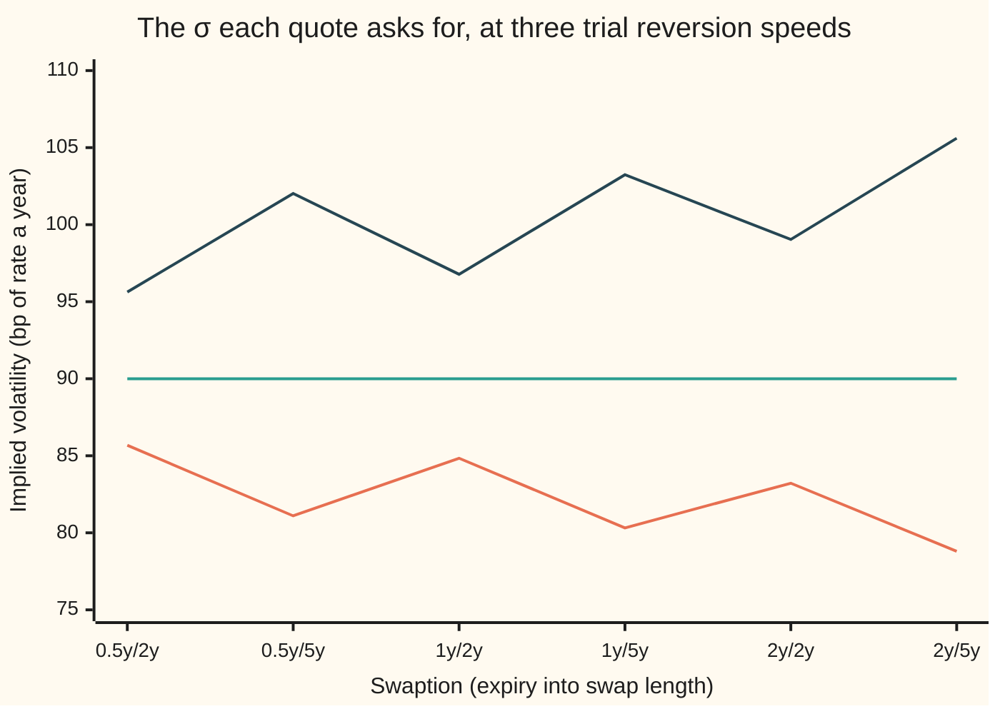
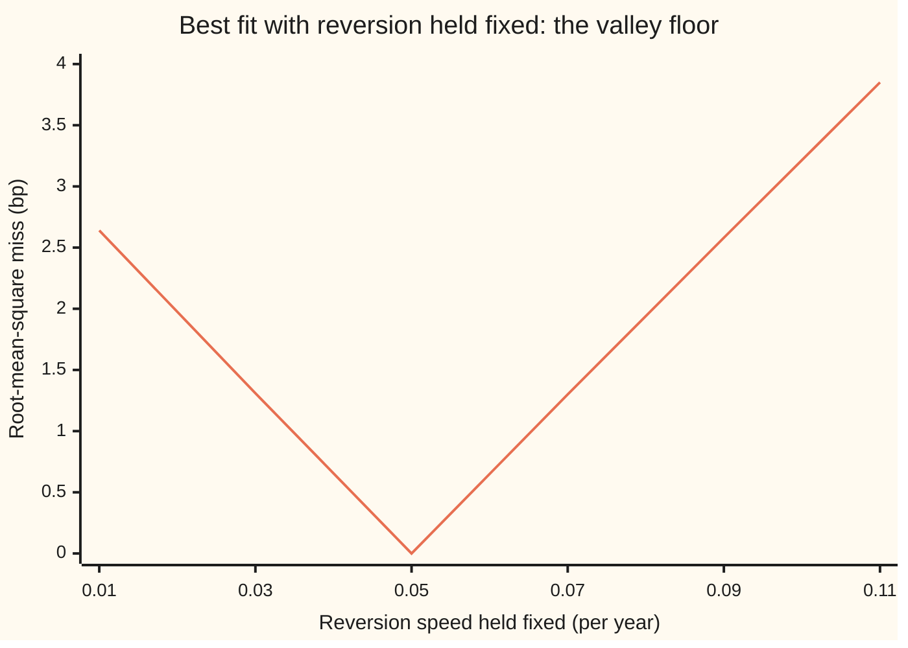

# Calibrating Hull-White: reversion and volatility from swaptions

[Syllabus](../../../SYLLABUS.md) → [Financial mathematics](../README.md) → [Short-Rate Models](../README.md#s30) → Calibrating Hull-White

---

## General Overview

A rates desk opens its screen to six option prices. Each is a **receiver swaption**: the right, on a fixed future date, to enter a swap that receives a fixed interest rate and pays a floating one ([Swaptions](../29-Caps%2C%20Floors%20and%20Swaptions/04-swaptions-payer-and-receiver.md)). The rights expire in half a year, one year and two years. Each expiry comes in two lengths of swap, 2 years and 5 years. On $1 million of notional (the amount the interest is computed on), the six premiums run from $4,617.79 for the shortest to $18,275.06 for the longest.

The desk prices everything else with the Hull-White model ([Hull-White](04-hull-white-model.md)). There the short rate, the interest earned on cash lent for an instant, is pulled toward a moving target chosen so today's bond prices come out exactly right, and knocked about by normal shocks. Two numbers are left free: the **reversion speed**, how hard the pull is, and the **volatility**, how big the shocks are. Today's bond prices say nothing about either. Option prices do, because an option is worth more when rates move more.

Calibrating means choosing those two numbers so the model's six premiums land as close to the six quotes as possible. Here the quotes were generated from a reversion speed of 0.05 a year and a volatility of 0.9 percent a year, then rounded, so the right answer is known and each road to it can be checked. Three roads find it. The more useful result is *how*: the six quotes do not share the work evenly. The overall level of the premiums fixes the volatility. The way premiums grow from short swaps to long ones, and from near expiries to far ones, fixes the reversion speed, and fixes it far less firmly.

**Calibrating Hull-White chooses reversion and volatility by least squares on swaption premiums: volatility scales every premium alike, reversion shrinks long and late ones more than short and early ones, so the level of the quotes pins volatility and their tilt pins reversion.**

**What kind of fact this is:** a method: an objective, a solver and a stopping rule, applied to a model. The pricing formula it uses is a theorem inside Hull-White, proved on [Bond options](05-bond-options-and-jamshidians-trick.md); which quote pins which parameter is derived on this card in Why it works; that the fitted pair is the market's "true" one is not proved, and is usually false.

### The picture: six premiums on $1 million

Rows run by expiry, then by swap length. Bars are drawn to scale.

```
premium on $1 million notional, bars to scale
0.5y into 2y   ████████                           $4,617.79
0.5y into 5y   ██████████████████                 $10,100.44
1.0y into 2y   ███████████                        $6,338.76
1.0y into 5y   ████████████████████████           $13,827.27
2.0y into 2y   ███████████████                    $8,422.94
2.0y into 5y   ████████████████████████████████   $18,275.06
```

Longer swaps cost more: more years of fixed payments ride on the right. Later expiries cost more: rates have longer to move before the choice is made. How much more, in each direction, is where the two parameters hide.

---

## The formula

A **basis point** (bp) is one hundredth of a percent; here it measures a premium as a fraction of notional, so 46.178 bp on $1 million is $4,617.79. Quote number i is written $q_i$ and the model's premium for it $V_i$.

$$L(\kappa,\sigma)=\tfrac12\sum_{i=1}^{6}\Big(10^4\,\big[V_i(\kappa,\sigma)-q_i\big]\Big)^2$$

**Read it aloud:** for a trial reversion and volatility, price all six swaptions, measure each miss in basis points, square it, add them up and halve the total; calibration is the pair that makes this as small as possible.

Each model premium is a sum of options on zero-coupon bonds, one per payment of the swap, and the two parameters reach it only through each option's **width**, the standard deviation of that bond's log price at expiry:

$$w_j=\sigma\,b_\kappa(T_j-E)\,\sqrt{v_\kappa(E)},\qquad b_\kappa(u)=\frac{1-e^{-\kappa u}}{\kappa},\qquad v_\kappa(E)=\frac{1-e^{-2\kappa E}}{2\kappa}.$$

**Read it aloud:** a bond's width is the rate's shock size, times how strongly that bond feels a rate move, times the rate's spread at expiry measured on a clock that the pull slows down.

| Symbol | Plain meaning | In our example | Push it up and the answer… |
| --- | --- | --- | --- |
| $\kappa$ | **reversion speed**, kappa: the strength of the pull toward the target, per year | 0.05; half-life 13.86 years | long and late premiums fall more than short and early ones |
| $\sigma$ | **volatility**, sigma: the size of the short rate's shocks, in rate per root-year | 0.9% | every premium rises almost in proportion |
| $D_0(T)$, $f_0(T)$ | today's discount curve, the value today of one dollar due at T, and its instantaneous forward rate, the rate it locks in for an instant at T | $e^{-0.03T-0.002T^2}$ and $0.03+0.004T$ | fixed input; the fit never moves it |
| $E$, $n$, $T_j$ | expiry, swap length, and payment dates $T_j=E+j$ for j = 1 to n | 0.5, 1 or 2; 2 or 5; yearly | premium rises with each |
| $K$, $c_j$ | the strike, a fixed rate chosen at par; the fixed leg's cash, K each year plus the $1 principal on the last date | 3.6619% to 4.8769% | a higher strike makes a receiver dearer |
| $r_E$ | the short rate on the expiry date | normal, centred on $f_0(E)$ | — |
| $b_\kappa(u)$ | **load**: how much a u-year zero's log price moves per unit move of the short rate | 4.4240 for u = 5 (no pull: 5) | — |
| $v_\kappa(E)$ | **variance clock**: the rate's spread at E is $\sigma^2 v_\kappa(E)$ | 1.8127 for E = 2 (no pull: 2) | — |
| $w_j$ | **width** of payment j's bond at expiry | 0.053607 for the last payment of 2.0y into 5y | its option rises almost in proportion |
| $V_i$ | model premium for quote i | 182.751 bp for 2.0y into 5y at the fit | — |
| $q_i$ | quoted premium for quote i | 46.178 bp to 182.751 bp | the fitted pair moves; see Why it works |
| $L$ | the **loss**: half the sum of squared misses in bp squared | 14807.2462 at the start, 0 at the fit | — |

The **strike** of each swaption is the par forward swap rate, the fixed rate that makes the swap worth nothing today ([The par swap rate](../28-Swaps/02-par-swap-rate-and-annuity.md)):

$$K=\frac{D_0(E)-D_0(E+n)}{\sum_{j=1}^{n}D_0(E+j)}.$$

In words: the value of the floating leg divided by the value of one unit of fixed payments. Such a swaption is called **at the money**.

### When it holds

- **One factor.** Every rate moves with the short rate. If long and short rates move partly apart, no pair fits a wide strip, and the leftover misses are a second factor showing through ([Beyond one factor](07-two-factor-and-lognormal-short-rate-models.md)).
- **Constant parameters.** If the market's volatility changes with expiry, a constant σ spreads the error over all six quotes; a σ per date absorbs it, at the cost of more knobs.
- **Premiums, not volatilities.** Markets quote swaptions as normal or shifted volatilities ([Rate volatilities](../29-Caps%2C%20Floors%20and%20Swaptions/06-normal-and-shifted-volatilities-for-rates.md)); turn them into premiums on the same curve first.
- **European exercise, positive coupons.** The split into bond options needs one exercise date and a fixed leg of positive cash flows. A Bermudan needs the tree.
- **Quotes inside their bounds.** An at-the-money receiver premium must lie strictly between 0 and $D_0(E)$, the cost today of $1 paid at expiry; outside that range no volatility reprices it.

Conventions verified 2026-09-28: swaptions are quoted as normal volatilities in basis points a year, and USD SOFR and EUR swaps pay fixed annually. This card pays fixed yearly and ignores day counts.

---

## Why it works

### Step 0: the curve cannot see the two parameters, options can

Hull-White's moving target is rebuilt for every trial pair so that every zero-coupon bond is priced exactly off today's curve. Change reversion or volatility and today's bond prices do not move. The curve carries no information about the pair.

An option does: its value depends on how widely the underlying can spread by expiry. Calibration asks how widely these six swaptions say rates can spread, and in what shape.

### Step 1: a receiver swaption is a call on a coupon bond

At expiry, receiving fixed K and paying floating on $1 is worth the same as holding a bond that pays K each year and $1 at the end, minus the $1 that the floating leg is worth on its reset date. So the receiver swaption is a call on that coupon bond, struck at $1.

In Hull-White every zero-coupon bond at expiry falls as the short rate then rises. So one threshold rate makes the coupon bond worth exactly $1, and the call is exercised when the rate lands below it. Jamshidian's trick splits the coupon-bond call into one call per payment, each struck at that payment's bond price at the threshold, and adds them; each piece is a Black-Scholes-like call with width $w_j$ ([Bond options](05-bond-options-and-jamshidians-trick.md) proves the split).

### Step 2: volatility scales every width, and so every premium, alike

In the width formula σ is a plain multiplier. Double it and every $w_j$ doubles.

An at-the-money option is worth nearly its width times a constant. The call on a bond whose forward equals its strike is $D_0(T)\,[N(w/2)-N(-w/2)]$, and for a small width that is $D_0(T)\,w/\sqrt{2\pi}$: a straight line through zero. So a 1% rise in σ raises each premium by very nearly 1% of itself.

The sensitivity table in the code shows it. The 0.5y into 2y premium is 46.178 bp and gains 0.4618 bp per 1% of σ. The 2.0y into 5y premium is 182.751 bp and gains 1.8271 bp. In the language of economics, the **elasticity**, the percentage change of the output per percentage change of the input, is almost exactly 1 for every quote. Volatility cannot tell the six apart. It sets their level.

### Step 3: reversion shrinks long and late widths more

Reversion enters twice, and both times as a shrink.

The **load** $b_\kappa(u)$ is how much a u-year zero feels a rate move. With no pull a 5-year zero's log price moves 5 times the rate move. With the pull, a shock today is expected to fade before the later years, so the load is less: 4.4240. For a 2-year zero it is 1.9033 against 2. The longer the bond, the bigger the shrink.

The **variance clock** $v_\kappa(E)$ measures how far the rate spreads by expiry. With no pull, spread grows like elapsed time: 2 at two years. With the pull, early shocks partly fade before expiry: 1.8127. At half a year it is 0.4877 against 0.5. The later the expiry, the bigger the shrink.

For small κu, $b_\kappa(u)\approx u\,(1-\kappa u/2)$ and $v_\kappa(E)\approx E\,(1-\kappa E)$. Take logs, and the width's elasticity to κ is about $-\kappa(u+E)/2$. The last payment carries the principal and dominates the premium, so a rough rule for the whole swaption is $-\kappa(n+E)/2$.

| Quote | Rule −κ(n+E)/2 | Measured: bp per 1% of κ ÷ bp per 1% of σ |
| --- | --- | --- |
| 0.5y into 2y | −0.0625 | −0.0611 |
| 1.0y into 2y | −0.0750 | −0.0733 |
| 2.0y into 2y | −0.1000 | −0.0970 |
| 0.5y into 5y | −0.1375 | −0.1280 |
| 1.0y into 5y | −0.1500 | −0.1400 |
| 2.0y into 5y | −0.1750 | −0.1634 |

The rule runs a little high because earlier coupons have shorter loads than the last payment. Its ordering is right: relative to its size, the 2.0y into 5y premium feels reversion far more than the 0.5y into 2y premium, −0.1634 against −0.0611.

### Step 4: which quote pins which parameter

Put Steps 2 and 3 together. Fix a trial κ. Each quote alone then has exactly one σ that reprices it, since its premium rises steadily with σ: its **implied σ** at that κ, found by bisection, repeatedly halving an interval known to hold the answer. The chart gives it in basis points of rate a year, so 90 bp is σ = 0.9%.

At the wrong κ the six disagree in a pattern. Too little pull, κ = 0.01, leaves long and late widths too big, so those quotes need a smaller σ: from 85.68 bp down to 78.80 bp. Too much pull, κ = 0.10, reverses the tilt: 95.63 bp up to 105.61 bp. Only at κ = 0.05 do all six agree, at 90.00 bp.



Orange: κ = 0.01, too little pull, the implied σ sags on long and late quotes. Green: κ = 0.05, flat at 90.00 bp. Dark blue: κ = 0.10, too much pull, it rises.

That is the whole answer to "which quote pins which". **The height of the line pins σ. Its tilt pins κ.** The tilt comes from the spread in n + E across the strip: short-and-early quotes against long-and-late ones. A strip with no spread in n + E would have almost no tilt to read, and κ would be barely pinned.

### Step 5: least squares, and how firmly each parameter is pinned

With real quotes no κ makes the line perfectly flat, so the fit minimises L instead. The solver is Levenberg-Marquardt, the damped Gauss-Newton step from [Calibration](../07-Greeks%20by%20Numbers%20and%20Calibration/06-calibration-as-least-squares.md), run on the logs of κ and σ so both stay positive.

Near the answer, L is a bowl whose steepness in each direction comes from the sensitivity table. Measured in 1% moves of each parameter, its two principal curvatures, the **eigenvalues** of that bowl, differ by a factor of 1235.4. One direction, mostly σ, is steep. The other, mostly κ, is a long flat valley. Fixing κ and fitting σ alone traces that valley. At κ = 0.03 the best σ is 0.851% and the six quotes miss by 1.31 bp on average, measured as a **root mean square**, the square root of the average squared miss.



The single line is the smallest average miss for each fixed reversion speed, with σ refitted each time: 0.803%, 0.851%, 0.900%, 0.951%, 1.003%, 1.057% from left to right. Moving κ by 0.02 either side costs only 1.31 bp or 1.30 bp, less than a typical bid-offer spread.

### Existence, uniqueness and the edges

- **Each quote has one implied σ at a given κ** when it lies strictly between 0 and $D_0(E)$. At σ → 0 the at-the-money premium falls to zero. As σ grows it climbs toward $D_0(E)$, since at par the fixed leg's value is $D_0(E)$. Each bond call rises strictly with its width, so the answer is unique.
- **The pair needs at least two quotes with different n + E.** With one quote there is a whole curve of exact fits: the 1.0y into 5y quote alone is repriced by σ of 80.32 bp at κ = 0.01 and by 103.24 bp at κ = 0.10. Two quotes with different shapes, 0.5y into 2y and 2.0y into 5y, recover both exactly. That the least-squares minimum is the only one is not proved in general; here the 441-pair grid, the solver from a far start and road C all land on the same pair.
- **κ near 0** is safe: the load tends to u and the clock to E, which is the model without reversion (Ho-Lee). **κ below 0** makes shocks grow instead of fading; the formulas still compute, but the fit here works in logs and never goes there.

<details>
<summary>Detailed proof: the rate's law at expiry, and the second road</summary>

Write the short rate as $r_t=x_t+\alpha(t)$, where $x$ starts at 0 and follows $dx=-\kappa x\,dt+\sigma\,dW$, and $\alpha(t)=f_0(t)+\tfrac12\sigma^2 b_\kappa(t)^2$ is the part that fits today's curve ([Hull-White](04-hull-white-model.md)).

Price in units of the zero-coupon bond maturing at E, the **E-forward measure** ([Forward measures](../31-Forward-Rate%20Models/02-forward-measures-for-rates.md)). The change of unit adds a drift $-\sigma^2 b_\kappa(E-t)$ to $x$. Solving the linear equation, $x$ at time E is normal with variance $\sigma^2\int_0^E e^{-2\kappa(E-s)}ds=\sigma^2 v_\kappa(E)$ and mean
$$-\sigma^2\int_0^E e^{-\kappa(E-s)}\,b_\kappa(E-s)\,ds=-\frac{\sigma^2}{\kappa^2}\Big[(1-e^{-\kappa E})-\tfrac12(1-e^{-2\kappa E})\Big]=-\tfrac12\sigma^2 b_\kappa(E)^2.$$
That cancels the $\tfrac12\sigma^2 b_\kappa(E)^2$ inside $\alpha(E)$. So under the E-forward measure $r_E$ is normal, centred on $f_0(E)$, with variance $\sigma^2 v_\kappa(E)$.

The receiver's value at expiry is $\big(\sum_j c_j P(E,T_j;r_E)-1\big)^+$, where $P(E,T;r)=\frac{D_0(T)}{D_0(E)}\exp\!\big(-b_\kappa(T-E)(r-f_0(E))-\tfrac12\sigma^2 v_\kappa(E)\,b_\kappa(T-E)^2\big)$ is the Hull-White zero at expiry. Its price today is $D_0(E)$ times the average of that payoff over the normal law above. The second road in the code computes this average directly with Simpson's rule, with no threshold split and no bond-option formula. It agrees with the Jamshidian sum to 0.00000 bp on all six quotes.

**Elasticities.** $\ln b_\kappa(u)=\ln u+\ln\frac{1-e^{-\kappa u}}{\kappa u}$, and $\ln\frac{1-e^{-y}}{y}=-\tfrac{y}{2}+\tfrac{y^2}{24}-\dots$. So $\kappa\,\partial_\kappa \ln b_\kappa(u)=-\tfrac12\kappa u+O(\kappa^2u^2)$. The same series with $y=2\kappa E$ gives $\kappa\,\partial_\kappa\tfrac12\ln v_\kappa(E)=-\tfrac12\kappa E+O(\kappa^2E^2)$. Adding, $\kappa\,\partial_\kappa\ln w_j\approx-\tfrac12\kappa\,(T_j-E+E)$, and σ's elasticity of $w_j$ is exactly 1. Near the money each bond call is close to proportional to its width, which carries both statements from widths to premiums.

</details>

A second route prices the six on [The Hull-White tree](06-hull-white-trinomial-tree.md) for each trial pair. It is slower and noisier than the closed form, so desks calibrate Europeans in closed form and keep the tree for Bermudans.

---

## Worked numbers, by hand

The fingerprint of κ is in two widths: the last payment of the shortest quote and of the longest. Parameters κ = 0.05, σ = 0.9%.

| Step | Arithmetic | Value |
| --- | --- | --- |
| load, 2-year payment | $(1-e^{-0.05\times2})/0.05$ | 1.9033 |
| clock, half-year expiry | $(1-e^{-2\times0.05\times0.5})/(2\times0.05)$ | 0.4877 |
| width, 0.5y into 2y | $0.009\times1.9033\times\sqrt{0.4877}$ | 0.011962 |
| same with no pull | $0.009\times2\times\sqrt{0.5}$ | 0.012728 |
| load, 5-year payment | $(1-e^{-0.05\times5})/0.05$ | 4.4240 |
| clock, two-year expiry | $(1-e^{-2\times0.05\times2})/(2\times0.05)$ | 1.8127 |
| width, 2.0y into 5y | $0.009\times4.4240\times\sqrt{1.8127}$ | 0.053607 |
| same with no pull | $0.009\times5\times\sqrt{2}$ | 0.063640 |
| **what κ does** | shrinks the long, late width far more than the short, early one | **0.053607 vs 0.063640, against 0.011962 vs 0.012728** |

The ratios are 0.842 for the long, late quote and 0.940 for the short, early one. Those two ratios are what the fit reads. σ multiplies both widths alike and cannot change their ratio; only κ can. A reversion of 0.05 a year means a rate shock is expected to lose half its size in 13.86 years: slow, and still enough to take a visible bite out of a 5-year swap starting in 2 years.

### What breaks if you drop a piece

The right fit is κ = 0.05, σ = 0.900%, missing by nothing.

| Mistake | Comes out at | What went wrong |
| --- | --- | --- |
| Freeze κ at 0.01 and fit σ alone | σ = 0.803%, misses 2.64 bp rms | With too little pull the model's long quotes are too dear relative to its short ones; no single σ fixes a tilt |
| Take the rate's spread at expiry as $\sigma\sqrt{E}$ | κ = 0.0497, σ = 0.8675%, misses 1.67 bp rms | Forgets that the pull also damps shocks before expiry; every width is too big, so σ comes out too low |
| Fit one quote only, 1.0y into 5y | any κ: σ of 80.32 bp at κ = 0.01, 103.24 bp at κ = 0.10 | One number cannot pin two; the tilt needs quotes of different n + E |
| Read a 0.5 bp tilt in the quotes as signal | κ = 0.0558, σ = 0.9133% | The soft direction: half a basis point up on the 2-year swaps and down on the 5-year ones moves κ from 0.0500 to 0.0558, σ only to 0.9133% |

---

## Code, from first principles, and it actually runs

The code builds its own normal curve area, bisection root finder, Simpson integrator and Levenberg-Marquardt solver. It prices each swaption by **two independent roads**: the Jamshidian sum of bond calls, and a direct average of the exercise value over the rate's normal law at expiry, which uses neither the threshold split nor the bond-option formula. A payer swaption is priced separately and receiver minus payer is checked against the forward swap's value, which must be zero at the par strike. The load and the clock are checked against the integrals that define them. Then it finds the pair by **three roads**: an exhaustive grid of 441 pairs, Levenberg-Marquardt from a far start of κ = 0.20 and σ = 0.5%, and the κ at which the shortest and longest quotes imply the same σ. It prints the sensitivities, the valley, the noise experiments and every number on this card.

### Python

```python
# Calibrating Hull-White to six swaptions. Standard library only: own normal CDF, root finder, integrator, solver.
from math import exp, expm1, log, sqrt, pi

CASES = [(e, n) for e in (0.5, 1.0, 2.0) for n in (2, 5)]    # (expiry, tenor) in years
KAPPA, SIGMA = 0.05, 0.009                                    # the pair behind the six quotes

def phi(z): return exp(-0.5 * z * z) / sqrt(2 * pi)
def N(z):                                        # series near 0, continued fraction in the tails
    if abs(z) < 3:
        term = total = z
        for k in range(1, 80):
            term *= -z * z * (2 * k - 1) / (2 * k * (2 * k + 1)); total += term
        return 0.5 + total / sqrt(2 * pi)
    t = abs(z)
    for k in range(60, 0, -1): t = abs(z) + k / t
    return 1 - phi(z) / t if z > 0 else phi(z) / t

def D(t): return exp(-0.03 * t - 0.002 * t * t)              # today's discount curve
def f(t): return 0.03 + 0.004 * t                             # its instantaneous forward rate
def b(k, u): return -expm1(-k * u) / k                        # load of a u-year bond on the rate
def clock(k, e): return -expm1(-2 * k * e) / (2 * k)          # variance of r at e is s^2 * clock
def bond(e, t, r, k, s):                                      # Hull-White zero at e, rate r there
    bb = b(k, t - e)
    return D(t) / D(e) * exp(-bb * (r - f(e)) - 0.5 * s * s * clock(k, e) * bb * bb)
def strike(e, n): return (D(e) - D(e + n)) / sum(D(e + j) for j in range(1, n + 1))
def legs(e, n):
    K = strike(e, n)
    return [K] * (n - 1) + [1 + K], [e + j for j in range(1, n + 1)]
def bisect(g, lo, hi, it=60):                                 # needs g(lo) > 0 > g(hi)
    for _ in range(it):
        mid = 0.5 * (lo + hi)
        if g(mid) > 0: lo = mid
        else: hi = mid
    return 0.5 * (lo + hi)

def jamshidian(e, n, k, s, flat=False):           # road 1: bond calls at one threshold
    c, ts = legs(e, n)
    rs = bisect(lambda r: sum(ci * bond(e, t, r, k, s) for ci, t in zip(c, ts)) - 1, -1.0, 1.0)
    rec = pay = 0.0
    for ci, t in zip(c, ts):
        kj = bond(e, t, rs, k, s)                            # payment j's strike: its bond at the threshold
        w = s * b(k, t - e) * sqrt(e if flat else clock(k, e))  # flat = spread s*sqrt(e), no damping
        d1 = log(D(t) / (D(e) * kj)) / w + w / 2
        rec += ci * (D(t) * N(d1) - kj * D(e) * N(d1 - w))
        pay += ci * (kj * D(e) * N(w - d1) - D(t) * N(-d1))
    return rec, pay, sum(ci * D(t) for ci, t in zip(c, ts)) - D(e)

def simpson(g, a, c, m=2000):                  # Simpson's rule on [a, c], m even
    h = (c - a) / m
    return h / 3 * sum((1 if i in (0, m) else 4 if i % 2 else 2) * g(a + i * h) for i in range(m + 1))
def by_integral(e, n, k, s):                 # road 2: average exercise value over r at e, Simpson
    c, ts = legs(e, n); sd = s * sqrt(clock(k, e))
    v = lambda z: sum(ci * bond(e, t, f(e) + sd * z, k, s) for ci, t in zip(c, ts)) - 1
    return D(e) * simpson(lambda z: v(z) * phi(z), -12.0, bisect(v, -12.0, 12.0))
def prices(k, s, **kw): return [jamshidian(e, n, k, s, **kw)[0] for e, n in CASES]
def rms(p, q, use=range(6)): return sqrt(sum((1e4 * (p[i] - q[i])) ** 2 for i in use) / len(use))

def fit(q, k=0.20, s=0.005, use=range(6), free=(0, 1), trail=None, **kw):  # road B: Levenberg-Marquardt
    x, lam = [log(k), log(s)], 1e-3                                         # in logs: both stay positive
    res = lambda x: [1e4 * (prices(exp(x[0]), exp(x[1]), **kw)[i] - q[i]) for i in use]
    r = res(x)
    for it in range(40):
        if trail is not None: trail.append((it, exp(x[0]), exp(x[1]), 0.5 * sum(a * a for a in r)))
        J = [[0.0] * len(r) for _ in range(2)]
        for a in free:
            xp, xm = x[:], x[:]; xp[a] += 1e-6; xm[a] -= 1e-6
            J[a] = [(u - v) / 2e-6 for u, v in zip(res(xp), res(xm))]
        A = [[sum(J[a][i] * J[c][i] for i in range(len(r))) for c in range(2)] for a in range(2)]
        g = [sum(J[a][i] * r[i] for i in range(len(r))) for a in range(2)]
        while True:
            M = [[A[a][c] * (1 + lam * (a == c)) + 1e-12 * (a == c) for c in range(2)] for a in range(2)]
            det = M[0][0] * M[1][1] - M[0][1] * M[1][0]
            dx = [-(M[1][1] * g[0] - M[0][1] * g[1]) / det, -(M[0][0] * g[1] - M[1][0] * g[0]) / det]
            xn = [x[0] + dx[0], x[1] + dx[1]]; rn = res(xn)
            if sum(a * a for a in rn) <= sum(a * a for a in r): x, r, lam = xn, rn, lam / 10; break
            lam *= 10
            if lam > 1e12: break
        if abs(dx[0]) + abs(dx[1]) < 1e-12 or lam > 1e12: break
    return exp(x[0]), exp(x[1]), rms(prices(exp(x[0]), exp(x[1]), **kw), q, use)
def implied_sigma(i, k, q):                  # the one sigma that reprices quote i at this kappa
    e, n = CASES[i]
    return bisect(lambda s: q[i] - jamshidian(e, n, k, s)[0], 1e-5, 0.1, 50)
name = lambda e, n: f"{e:.1f}y x {n}y"
q = [round(p, 9) for p in prices(KAPPA, SIGMA)]               # the quotes, to 9 decimals
print("six receiver swaptions, at-the-money, curve D(T) = exp(-0.03T - 0.002T^2)\nquote       strike %  premium bp  $ per 1m  road 2 bp  gap bp")
gap = 0.0
for (e, n), qi in zip(CASES, q):
    rec, pay, swap = jamshidian(e, n, KAPPA, SIGMA); integ = by_integral(e, n, KAPPA, SIGMA)
    assert abs(integ - rec) < 1e-9, "Simpson over the rate must land on Jamshidian"
    assert abs(rec - pay - swap) < 1e-12, "receiver - payer = the forward swap's value"
    assert abs(swap) < 1e-15, "the strike is the par rate: the forward swap is worth nothing"
    assert max(abs(clock(KAPPA, e) - simpson(lambda u: exp(-2 * KAPPA * u), 0, e)), abs(b(KAPPA, n) - simpson(lambda u: exp(-KAPPA * u), 0, n))) < 1e-12, "clock and load equal their integrals"
    gap = max(gap, abs(rec - pay - swap))
    print(f"{name(e, n):<11} {100 * strike(e, n):7.4f}  {1e4 * qi:9.3f}  {1e6 * qi:8.2f}  {1e4 * integ:9.3f}  {1e4 * abs(integ - rec):.5f}")
print(f"receiver - payer - swap value, largest gap bp {1e4 * gap:.6f}")
for e, n in ((0.5, 2), (2.0, 5)):                            # the last payment's width, with and without the pull
    print(f"by hand {name(e, n)} last payment: load {b(KAPPA, n):.4f}  clock {clock(KAPPA, e):.4f}  width {SIGMA * b(KAPPA, n) * sqrt(clock(KAPPA, e)):.6f}  no-pull {SIGMA * n * sqrt(e):.6f}")
grid = min((0.5 * sum((1e4 * (p - qi)) ** 2 for p, qi in zip(prices(0.01 + 0.005 * m, 0.004 + 0.0005 * l), q)),
            0.01 + 0.005 * m, 0.004 + 0.0005 * l) for m in range(21) for l in range(21))
print(f"road A grid of 441 pairs: kappa {grid[1]:.6f}  sigma % {100 * grid[2]:.4f}  half-life ln2/kappa yrs {log(2) / grid[1]:.2f}")
assert abs(grid[1] - KAPPA) < 1e-12 and abs(grid[2] - SIGMA) < 1e-12, "grid must find the generating pair"
trail = []; kB, sB, _ = fit(q, trail=trail); print("road B Levenberg-Marquardt from kappa 0.20, sigma 0.5%")
for it, k, s, L in trail[:7]: print(f"  step {it}  kappa {k:.6f}  sigma % {100 * s:.6f}  loss bp^2 {L:.4f}")
print(f"  lands   kappa {kB:.6f}  sigma % {100 * sB:.6f}  after {len(trail)} steps")
assert abs(kB - KAPPA) < 1e-6 and abs(sB - SIGMA) < 1e-8, "LM from far away must find the pair"
kC = bisect(lambda k: implied_sigma(0, k, q) - implied_sigma(5, k, q), 0.01, 0.10, 50)
print(f"road C kappa where 0.5y x 2y and 2.0y x 5y imply one sigma: {kC:.6f}")
assert abs(kC - KAPPA) < 1e-5, "flat implied sigma must find kappa"
J = []; print("sensitivity, bp per +1%   kappa    sigma   kappa/sigma  rule -kappa(n+E)/2")
for (e, n), i in zip(CASES, range(6)):
    dk = 1e4 * 0.01 * (jamshidian(e, n, KAPPA * 1.0001, SIGMA)[0] - jamshidian(e, n, KAPPA * 0.9999, SIGMA)[0]) / 2e-4
    ds = 1e4 * 0.01 * (jamshidian(e, n, KAPPA, SIGMA * 1.0001)[0] - jamshidian(e, n, KAPPA, SIGMA * 0.9999)[0]) / 2e-4
    J.append((dk, ds))
    print(f"  {name(e, n):<11}           {dk:8.4f} {ds:8.4f}  {dk / ds:9.4f}  {-KAPPA * (n + e) / 2:9.4f}")
def ratio(use):                               # stiff / soft eigenvalue of J'J over the chosen quotes
    aa, bb, ab = (sum(J[r][i] * J[r][j] for r in use) for i, j in ((0, 0), (1, 1), (0, 1)))
    big = (aa + bb + sqrt((aa - bb) ** 2 + 4 * ab * ab)) / 2
    return big / ((aa * bb - ab * ab) / big)
for label, use in (("all six", range(6)), ("the three 2y tenors", (0, 2, 4)), ("the two 0.5y expiries", (0, 1))):
    print(f"eigenvalue ratio, stiff / soft, {label:<22} {ratio(use):10.1f}")
print("implied sigma bp     kappa 0.01  kappa 0.05  kappa 0.10")
for i, (e, n) in enumerate(CASES):
    iv = [implied_sigma(i, k, q) for k in (0.01, 0.05, 0.10)]
    assert abs(iv[1] - SIGMA) < 1e-8, "at the true kappa every quote implies the true sigma"
    print(f"  {name(e, n):<11}         " + "  ".join(f"{1e4 * v:10.2f}" for v in iv))
prof = [fit(q, k, 0.005, free=(1,)) for k in (0.01, 0.03, 0.05, 0.07, 0.09, 0.11)]
print("profile kappa        " + " ".join(f"{k:6.2f}" for k, _, _ in prof))
print("profile best sigma % " + " ".join(f"{100 * s:6.3f}" for _, s, _ in prof))
print("profile rms miss bp  " + " ".join(f"{m:6.2f}" for _, _, m in prof))
for label, qn in (("all six scaled up 1%", [1.01 * a for a in q]), ("tilt +0.5bp 2y, -0.5bp 5y", [a + d for a, d in zip(q, [5e-5, -5e-5] * 3)])):
    k, s, _ = fit(qn, KAPPA, SIGMA)
    print(f"noise: {label:<26} kappa {k:.4f}  sigma % {100 * s:.4f}")
k, s, m = fit(q, KAPPA, SIGMA, flat=True)
print(f"wrong: spread s*sqrt(E)  kappa {k:.4f}  sigma % {100 * s:.4f}  rms bp {m:.2f}")
print(f"try: sigma 1.2%, 2.0y x 5y premium bp {1e4 * jamshidian(2.0, 5, KAPPA, 0.012)[0]:.2f}  (was {1e4 * q[5]:.2f})")
print(f"try: kappa 0.15, 2.0y x 5y premium bp {1e4 * jamshidian(2.0, 5, 0.15, SIGMA)[0]:.2f}")
k2, s2, _ = fit(q, use=(0, 5))
print(f"try: fit to 0.5y x 2y and 2.0y x 5y only: kappa {k2:.6f}  sigma % {100 * s2:.6f}")
print("ALL CHECKS PASS")
```

**Ran 2026-09-28 on macOS, Python 3.14.6, standard library only. All checks passed. Output, pasted from the run:**

```
six receiver swaptions, at-the-money, curve D(T) = exp(-0.03T - 0.002T^2)
quote       strike %  premium bp  $ per 1m  road 2 bp  gap bp
0.5y x 2y    3.6619     46.178   4617.79     46.178  0.00000
0.5y x 5y    4.2545    101.004  10100.44    101.004  0.00000
1.0y x 2y    3.8692     63.388   6338.76     63.388  0.00000
1.0y x 5y    4.4616    138.273  13827.27    138.273  0.00000
2.0y x 2y    4.2851     84.229   8422.94     84.229  0.00000
2.0y x 5y    4.8769    182.751  18275.06    182.751  0.00000
receiver - payer - swap value, largest gap bp 0.000000
by hand 0.5y x 2y last payment: load 1.9033  clock 0.4877  width 0.011962  no-pull 0.012728
by hand 2.0y x 5y last payment: load 4.4240  clock 1.8127  width 0.053607  no-pull 0.063640
road A grid of 441 pairs: kappa 0.050000  sigma % 0.9000  half-life ln2/kappa yrs 13.86
road B Levenberg-Marquardt from kappa 0.20, sigma 0.5%
  step 0  kappa 0.200000  sigma % 0.500000  loss bp^2 14807.2462
  step 1  kappa 0.024827  sigma % 0.954009  loss bp^2 730.4536
  step 2  kappa 0.060196  sigma % 0.899756  loss bp^2 31.1517
  step 3  kappa 0.050547  sigma % 0.899691  loss bp^2 0.1353
  step 4  kappa 0.050002  sigma % 0.899999  loss bp^2 0.0000
  step 5  kappa 0.050000  sigma % 0.900000  loss bp^2 0.0000
  step 6  kappa 0.050000  sigma % 0.900000  loss bp^2 0.0000
  lands   kappa 0.050000  sigma % 0.900000  after 7 steps
road C kappa where 0.5y x 2y and 2.0y x 5y imply one sigma: 0.050000
sensitivity, bp per +1%   kappa    sigma   kappa/sigma  rule -kappa(n+E)/2
  0.5y x 2y              -0.0282   0.4618    -0.0611    -0.0625
  0.5y x 5y              -0.1293   1.0100    -0.1280    -0.1375
  1.0y x 2y              -0.0464   0.6339    -0.0733    -0.0750
  1.0y x 5y              -0.1936   1.3826    -0.1400    -0.1500
  2.0y x 2y              -0.0817   0.8423    -0.0970    -0.1000
  2.0y x 5y              -0.2985   1.8271    -0.1634    -0.1750
eigenvalue ratio, stiff / soft, all six                    1235.4
eigenvalue ratio, stiff / soft, the three 2y tenors        4842.7
eigenvalue ratio, stiff / soft, the two 0.5y expiries      1605.2
implied sigma bp     kappa 0.01  kappa 0.05  kappa 0.10
  0.5y x 2y                85.68       90.00       95.63
  0.5y x 5y                81.10       90.00      102.02
  1.0y x 2y                84.84       90.00       96.78
  1.0y x 5y                80.32       90.00      103.24
  2.0y x 2y                83.22       90.00       99.04
  2.0y x 5y                78.80       90.00      105.61
profile kappa          0.01   0.03   0.05   0.07   0.09   0.11
profile best sigma %  0.803  0.851  0.900  0.951  1.003  1.057
profile rms miss bp    2.64   1.31   0.00   1.30   2.58   3.85
noise: all six scaled up 1%       kappa 0.0500  sigma % 0.9090
noise: tilt +0.5bp 2y, -0.5bp 5y  kappa 0.0558  sigma % 0.9133
wrong: spread s*sqrt(E)  kappa 0.0497  sigma % 0.8675  rms bp 1.67
try: sigma 1.2%, 2.0y x 5y premium bp 243.64  (was 182.75)
try: kappa 0.15, 2.0y x 5y premium bp 133.62
try: fit to 0.5y x 2y and 2.0y x 5y only: kappa 0.050000  sigma % 0.900000
ALL CHECKS PASS
```

### Rust

```rust
// Calibrating Hull-White to six swaptions. Rust std only: own normal CDF, root finder, integrator, solver.
use std::f64::consts::PI;
const CASES: [(f64, usize); 6] = [(0.5, 2), (0.5, 5), (1.0, 2), (1.0, 5), (2.0, 2), (2.0, 5)];
const KAPPA: f64 = 0.05; const SIGMA: f64 = 0.009;                // the pair behind the six quotes
fn phi(z: f64) -> f64 { (-0.5 * z * z).exp() / (2.0 * PI).sqrt() }
fn ncdf(z: f64) -> f64 {
    if z.abs() < 3.0 {
        let (mut term, mut total) = (z, z);
        for k in 1..80 {
            let k = k as f64;
            term *= -z * z * (2.0 * k - 1.0) / (2.0 * k * (2.0 * k + 1.0)); total += term;
        }
        return 0.5 + total / (2.0 * PI).sqrt();
    }
    let mut t = z.abs();
    for k in (1..=60).rev() { t = z.abs() + k as f64 / t; }
    if z > 0.0 { 1.0 - phi(z) / t } else { phi(z) / t }
}
fn d(t: f64) -> f64 { (-0.03 * t - 0.002 * t * t).exp() }
fn f(t: f64) -> f64 { 0.03 + 0.004 * t }
fn b(k: f64, u: f64) -> f64 { -(-k * u).exp_m1() / k }
fn clock(k: f64, e: f64) -> f64 { -(-2.0 * k * e).exp_m1() / (2.0 * k) }
fn bond(e: f64, t: f64, r: f64, k: f64, s: f64) -> f64 {
    let bb = b(k, t - e);
    d(t) / d(e) * (-bb * (r - f(e)) - 0.5 * s * s * clock(k, e) * bb * bb).exp()
}
fn strike(e: f64, n: usize) -> f64 { (d(e) - d(e + n as f64)) / (1..=n).map(|j| d(e + j as f64)).sum::<f64>() }
fn legs(e: f64, n: usize) -> Vec<(f64, f64)> {
    let kk = strike(e, n);
    (1..=n).map(|j| (if j == n { 1.0 + kk } else { kk }, e + j as f64)).collect()
}
fn bisect(g: &dyn Fn(f64) -> f64, mut lo: f64, mut hi: f64, it: usize) -> f64 {
    for _ in 0..it { let mid = 0.5 * (lo + hi); if g(mid) > 0.0 { lo = mid } else { hi = mid } }
    0.5 * (lo + hi)
}
fn jamshidian(e: f64, n: usize, k: f64, s: f64, flat: bool) -> (f64, f64, f64) {
    let lg = legs(e, n);
    let rs = bisect(&|r| lg.iter().map(|&(c, t)| c * bond(e, t, r, k, s)).sum::<f64>() - 1.0, -1.0, 1.0, 60);
    let (mut rec, mut pay, mut swap) = (0.0, 0.0, -d(e));
    for &(c, t) in &lg {
        let kj = bond(e, t, rs, k, s);
        let w = s * b(k, t - e) * (if flat { e } else { clock(k, e) }).sqrt();
        let d1 = (d(t) / (d(e) * kj)).ln() / w + w / 2.0;
        rec += c * (d(t) * ncdf(d1) - kj * d(e) * ncdf(d1 - w));
        pay += c * (kj * d(e) * ncdf(w - d1) - d(t) * ncdf(-d1));
        swap += c * d(t);
    }
    (rec, pay, swap)
}
fn simpson(g: &dyn Fn(f64) -> f64, a: f64, c: f64) -> f64 {        // Simpson's rule on [a, c], 2000 panels
    let (m, h) = (2000, (c - a) / 2000.0);
    h / 3.0 * (0..=m).map(|i| (if i == 0 || i == m { 1.0 } else if i % 2 == 1 { 4.0 } else { 2.0 }) * g(a + i as f64 * h)).sum::<f64>()
}
fn by_integral(e: f64, n: usize, k: f64, s: f64) -> f64 {
    let (lg, sd) = (legs(e, n), s * clock(k, e).sqrt());
    let v = |z: f64| lg.iter().map(|&(c, t)| c * bond(e, t, f(e) + sd * z, k, s)).sum::<f64>() - 1.0;
    d(e) * simpson(&|z| v(z) * phi(z), -12.0, bisect(&v, -12.0, 12.0, 60))
}
fn prices(k: f64, s: f64, flat: bool) -> Vec<f64> { CASES.iter().map(|&(e, n)| jamshidian(e, n, k, s, flat).0).collect() }
fn rms(p: &[f64], q: &[f64], used: &[usize]) -> f64 {
    (used.iter().map(|&i| (1e4 * (p[i] - q[i])).powi(2)).sum::<f64>() / used.len() as f64).sqrt()
}
const ALL: [usize; 6] = [0, 1, 2, 3, 4, 5];
fn fit(q: &[f64], k: f64, s: f64, used: &[usize], free: &[usize], flat: bool, trail: &mut Vec<(usize, f64, f64, f64)>) -> (f64, f64, f64) {
    let (mut x, mut lam) = ([k.ln(), s.ln()], 1e-3);
    let res = |x: [f64; 2]| -> Vec<f64> { let p = prices(x[0].exp(), x[1].exp(), flat); used.iter().map(|&i| 1e4 * (p[i] - q[i])).collect() };
    let ss = |r: &[f64]| r.iter().map(|a| a * a).sum::<f64>();
    let mut r = res(x); for it in 0..40 {
        trail.push((it, x[0].exp(), x[1].exp(), 0.5 * ss(&r)));
        let mut jac = vec![vec![0.0; r.len()]; 2];
        for &a in free {
            let (mut xp, mut xm) = (x, x); xp[a] += 1e-6; xm[a] -= 1e-6;
            jac[a] = res(xp).iter().zip(res(xm).iter()).map(|(u, v)| (u - v) / 2e-6).collect();
        }
        let dot = |u: &[f64], v: &[f64]| u.iter().zip(v).map(|(a, c)| a * c).sum::<f64>();
        let a = [[dot(&jac[0], &jac[0]), dot(&jac[0], &jac[1])], [dot(&jac[1], &jac[0]), dot(&jac[1], &jac[1])]];
        let g = [dot(&jac[0], &r), dot(&jac[1], &r)];
        let mut dx;
        loop {
            let mut m = a;
            for i in 0..2 { m[i][i] = a[i][i] * (1.0 + lam) + 1e-12; }
            let det = m[0][0] * m[1][1] - m[0][1] * m[1][0];
            dx = [-(m[1][1] * g[0] - m[0][1] * g[1]) / det, -(m[0][0] * g[1] - m[1][0] * g[0]) / det];
            let xn = [x[0] + dx[0], x[1] + dx[1]]; let rn = res(xn);
            if ss(&rn) <= ss(&r) { x = xn; r = rn; lam /= 10.0; break; }
            lam *= 10.0; if lam > 1e12 { break; }
        }
        if dx[0].abs() + dx[1].abs() < 1e-12 || lam > 1e12 { break; }
    }
    (x[0].exp(), x[1].exp(), rms(&prices(x[0].exp(), x[1].exp(), flat), q, used))
}
fn implied_sigma(i: usize, k: f64, q: &[f64]) -> f64 {
    let (e, n) = CASES[i];
    bisect(&|s| q[i] - jamshidian(e, n, k, s, false).0, 1e-5, 0.1, 50)
}
fn name(e: f64, n: usize) -> String { format!("{:.1}y x {}y", e, n) }
fn main() {
    let q: Vec<f64> = prices(KAPPA, SIGMA, false).iter().map(|p| (p * 1e9).round() / 1e9).collect();
    let (mut no, mut gap) = (Vec::new(), 0.0_f64);
    println!("six receiver swaptions, at-the-money, curve D(T) = exp(-0.03T - 0.002T^2)\nquote       strike %  premium bp  $ per 1m  road 2 bp  gap bp");
    for (i, &(e, n)) in CASES.iter().enumerate() {
        let ((rec, pay, swap), integ) = (jamshidian(e, n, KAPPA, SIGMA, false), by_integral(e, n, KAPPA, SIGMA));
        assert!((integ - rec).abs() < 1e-9, "Simpson over the rate must land on Jamshidian");
        assert!((rec - pay - swap).abs() < 1e-12, "receiver - payer = the forward swap's value");
        assert!(swap.abs() < 1e-15, "the strike is the par rate: the forward swap is worth nothing");
        assert!((clock(KAPPA, e) - simpson(&|u| (-2.0 * KAPPA * u).exp(), 0.0, e)).abs().max((b(KAPPA, n as f64) - simpson(&|u| (-KAPPA * u).exp(), 0.0, n as f64)).abs()) < 1e-12, "clock and load equal their integrals");
        gap = gap.max((rec - pay - swap).abs());
        println!("{:<11} {:7.4}  {:9.3}  {:8.2}  {:9.3}  {:.5}", name(e, n), 100.0 * strike(e, n), 1e4 * q[i], 1e6 * q[i], 1e4 * integ, 1e4 * (integ - rec).abs());
    }
    println!("receiver - payer - swap value, largest gap bp {:.6}", 1e4 * gap);
    for (e, n) in [(0.5, 2), (2.0, 5)] {                        // the last payment's width, with and without the pull
        println!("by hand {} last payment: load {:.4}  clock {:.4}  width {:.6}  no-pull {:.6}", name(e, n), b(KAPPA, n as f64), clock(KAPPA, e), SIGMA * b(KAPPA, n as f64) * clock(KAPPA, e).sqrt(), SIGMA * n as f64 * e.sqrt()); }
    let mut grid = (f64::INFINITY, 0.0, 0.0);
    for m in 0..21 { for l in 0..21 {
            let (k, s) = (0.01 + 0.005 * m as f64, 0.004 + 0.0005 * l as f64);
            let lo = 0.5 * prices(k, s, false).iter().zip(&q).map(|(p, qi)| (1e4 * (p - qi)).powi(2)).sum::<f64>();
            if lo < grid.0 { grid = (lo, k, s); }
    } }
    println!("road A grid of 441 pairs: kappa {:.6}  sigma % {:.4}  half-life ln2/kappa yrs {:.2}", grid.1, 100.0 * grid.2, 2f64.ln() / grid.1);
    assert!((grid.1 - KAPPA).abs() < 1e-12 && (grid.2 - SIGMA).abs() < 1e-12, "grid must find the generating pair");
    let mut trail = Vec::new();
    let (kb, sb, _) = fit(&q, 0.20, 0.005, &ALL, &[0, 1], false, &mut trail);
    println!("road B Levenberg-Marquardt from kappa 0.20, sigma 0.5%");
    for &(it, k, s, l) in trail.iter().take(7) { println!("  step {}  kappa {:.6}  sigma % {:.6}  loss bp^2 {:.4}", it, k, 100.0 * s, l); }
    println!("  lands   kappa {:.6}  sigma % {:.6}  after {} steps", kb, 100.0 * sb, trail.len());
    assert!((kb - KAPPA).abs() < 1e-6 && (sb - SIGMA).abs() < 1e-8, "LM from far away must find the pair");
    let kc = bisect(&|k| implied_sigma(0, k, &q) - implied_sigma(5, k, &q), 0.01, 0.10, 50);
    println!("road C kappa where 0.5y x 2y and 2.0y x 5y imply one sigma: {:.6}", kc);
    assert!((kc - KAPPA).abs() < 1e-5, "flat implied sigma must find kappa");
    println!("sensitivity, bp per +1%   kappa    sigma   kappa/sigma  rule -kappa(n+E)/2");
    let mut jac = Vec::new();
    for &(e, n) in CASES.iter() {
        let dk = 1e4 * 0.01 * (jamshidian(e, n, KAPPA * 1.0001, SIGMA, false).0 - jamshidian(e, n, KAPPA * 0.9999, SIGMA, false).0) / 2e-4;
        let ds = 1e4 * 0.01 * (jamshidian(e, n, KAPPA, SIGMA * 1.0001, false).0 - jamshidian(e, n, KAPPA, SIGMA * 0.9999, false).0) / 2e-4;
        jac.push((dk, ds));
        println!("  {:<11}           {:8.4} {:8.4}  {:9.4}  {:9.4}", name(e, n), dk, ds, dk / ds, -KAPPA * (n as f64 + e) / 2.0);
    }
    let ratio = |used: &[usize]| {
        let sum = |f: &dyn Fn(&(f64, f64)) -> f64| used.iter().map(|&r| f(&jac[r])).sum::<f64>();
        let (aa, bb, ab) = (sum(&|j| j.0 * j.0), sum(&|j| j.1 * j.1), sum(&|j| j.0 * j.1));
        let big = (aa + bb + ((aa - bb).powi(2) + 4.0 * ab * ab).sqrt()) / 2.0;
        big / ((aa * bb - ab * ab) / big)
    };
    for (label, used) in [("all six", &ALL[..]), ("the three 2y tenors", &[0, 2, 4][..]), ("the two 0.5y expiries", &[0, 1][..])] { println!("eigenvalue ratio, stiff / soft, {:<22} {:10.1}", label, ratio(used)); }
    println!("implied sigma bp     kappa 0.01  kappa 0.05  kappa 0.10");
    for (i, &(e, n)) in CASES.iter().enumerate() {
        let iv: Vec<f64> = [0.01, 0.05, 0.10].iter().map(|&k| implied_sigma(i, k, &q)).collect();
        assert!((iv[1] - SIGMA).abs() < 1e-8, "at the true kappa every quote implies the true sigma");
        println!("  {:<11}         {}", name(e, n), iv.iter().map(|v| format!("{:10.2}", 1e4 * v)).collect::<Vec<_>>().join("  "));
    }
    let prof: Vec<(f64, f64, f64)> = [0.01, 0.03, 0.05, 0.07, 0.09, 0.11].iter().map(|&k| fit(&q, k, 0.005, &ALL, &[1], false, &mut no)).collect();
    println!("profile kappa        {}", prof.iter().map(|p| format!("{:6.2}", p.0)).collect::<Vec<_>>().join(" "));
    println!("profile best sigma % {}", prof.iter().map(|p| format!("{:6.3}", 100.0 * p.1)).collect::<Vec<_>>().join(" "));
    println!("profile rms miss bp  {}", prof.iter().map(|p| format!("{:6.2}", p.2)).collect::<Vec<_>>().join(" "));
    let up: Vec<f64> = q.iter().map(|a| 1.01 * a).collect();
    let tilt: Vec<f64> = q.iter().enumerate().map(|(i, a)| a + if i % 2 == 0 { 5e-5 } else { -5e-5 }).collect();
    for (label, qn) in [("all six scaled up 1%", &up), ("tilt +0.5bp 2y, -0.5bp 5y", &tilt)] {
        let (k, s, _) = fit(qn, KAPPA, SIGMA, &ALL, &[0, 1], false, &mut no);
        println!("noise: {:<26} kappa {:.4}  sigma % {:.4}", label, k, 100.0 * s);
    }
    let (k, s, m) = fit(&q, KAPPA, SIGMA, &ALL, &[0, 1], true, &mut no);
    println!("wrong: spread s*sqrt(E)  kappa {:.4}  sigma % {:.4}  rms bp {:.2}", k, 100.0 * s, m);
    println!("try: sigma 1.2%, 2.0y x 5y premium bp {:.2}  (was {:.2})", 1e4 * jamshidian(2.0, 5, KAPPA, 0.012, false).0, 1e4 * q[5]);
    println!("try: kappa 0.15, 2.0y x 5y premium bp {:.2}", 1e4 * jamshidian(2.0, 5, 0.15, SIGMA, false).0);
    let (k2, s2, _) = fit(&q, 0.20, 0.005, &[0, 5], &[0, 1], false, &mut no);
    println!("try: fit to 0.5y x 2y and 2.0y x 5y only: kappa {:.6}  sigma % {:.6}", k2, 100.0 * s2);
    println!("ALL CHECKS PASS");
}
```

**Ran 2026-09-28 on macOS, rustc 1.98.1, no crates. All checks passed. Output, pasted from the run:**

```
six receiver swaptions, at-the-money, curve D(T) = exp(-0.03T - 0.002T^2)
quote       strike %  premium bp  $ per 1m  road 2 bp  gap bp
0.5y x 2y    3.6619     46.178   4617.79     46.178  0.00000
0.5y x 5y    4.2545    101.004  10100.44    101.004  0.00000
1.0y x 2y    3.8692     63.388   6338.76     63.388  0.00000
1.0y x 5y    4.4616    138.273  13827.27    138.273  0.00000
2.0y x 2y    4.2851     84.229   8422.94     84.229  0.00000
2.0y x 5y    4.8769    182.751  18275.06    182.751  0.00000
receiver - payer - swap value, largest gap bp 0.000000
by hand 0.5y x 2y last payment: load 1.9033  clock 0.4877  width 0.011962  no-pull 0.012728
by hand 2.0y x 5y last payment: load 4.4240  clock 1.8127  width 0.053607  no-pull 0.063640
road A grid of 441 pairs: kappa 0.050000  sigma % 0.9000  half-life ln2/kappa yrs 13.86
road B Levenberg-Marquardt from kappa 0.20, sigma 0.5%
  step 0  kappa 0.200000  sigma % 0.500000  loss bp^2 14807.2462
  step 1  kappa 0.024827  sigma % 0.954009  loss bp^2 730.4536
  step 2  kappa 0.060196  sigma % 0.899756  loss bp^2 31.1517
  step 3  kappa 0.050547  sigma % 0.899691  loss bp^2 0.1353
  step 4  kappa 0.050002  sigma % 0.899999  loss bp^2 0.0000
  step 5  kappa 0.050000  sigma % 0.900000  loss bp^2 0.0000
  step 6  kappa 0.050000  sigma % 0.900000  loss bp^2 0.0000
  lands   kappa 0.050000  sigma % 0.900000  after 7 steps
road C kappa where 0.5y x 2y and 2.0y x 5y imply one sigma: 0.050000
sensitivity, bp per +1%   kappa    sigma   kappa/sigma  rule -kappa(n+E)/2
  0.5y x 2y              -0.0282   0.4618    -0.0611    -0.0625
  0.5y x 5y              -0.1293   1.0100    -0.1280    -0.1375
  1.0y x 2y              -0.0464   0.6339    -0.0733    -0.0750
  1.0y x 5y              -0.1936   1.3826    -0.1400    -0.1500
  2.0y x 2y              -0.0817   0.8423    -0.0970    -0.1000
  2.0y x 5y              -0.2985   1.8271    -0.1634    -0.1750
eigenvalue ratio, stiff / soft, all six                    1235.4
eigenvalue ratio, stiff / soft, the three 2y tenors        4842.7
eigenvalue ratio, stiff / soft, the two 0.5y expiries      1605.2
implied sigma bp     kappa 0.01  kappa 0.05  kappa 0.10
  0.5y x 2y                85.68       90.00       95.63
  0.5y x 5y                81.10       90.00      102.02
  1.0y x 2y                84.84       90.00       96.78
  1.0y x 5y                80.32       90.00      103.24
  2.0y x 2y                83.22       90.00       99.04
  2.0y x 5y                78.80       90.00      105.61
profile kappa          0.01   0.03   0.05   0.07   0.09   0.11
profile best sigma %  0.803  0.851  0.900  0.951  1.003  1.057
profile rms miss bp    2.64   1.31   0.00   1.30   2.58   3.85
noise: all six scaled up 1%       kappa 0.0500  sigma % 0.9090
noise: tilt +0.5bp 2y, -0.5bp 5y  kappa 0.0558  sigma % 0.9133
wrong: spread s*sqrt(E)  kappa 0.0497  sigma % 0.8675  rms bp 1.67
try: sigma 1.2%, 2.0y x 5y premium bp 243.64  (was 182.75)
try: kappa 0.15, 2.0y x 5y premium bp 133.62
try: fit to 0.5y x 2y and 2.0y x 5y only: kappa 0.050000  sigma % 0.900000
ALL CHECKS PASS
```

The two outputs agree line for line. Levenberg-Marquardt settles σ first and κ last: by step 2 σ is already 0.899756% while κ has swung from 0.20 to 0.024827 and back to 0.060196. That order is the steep and flat directions of Step 5 seen from inside the solver.

> [!TIP]
> **Try changing**
> - **Raise σ to 1.2%.** Guess first: what does the 2.0y into 5y premium become? It goes from 182.75 bp to 243.64 bp, a third more, as elasticity 1 says.
> - **Raise κ to 0.15.** Guess first: up or down, and by how much? The 2.0y into 5y premium falls to 133.62 bp; stronger pull shrinks the long, late widths.
> - **Fit only two quotes, 0.5y into 2y and 2.0y into 5y.** Guess first: enough? Yes, with exact quotes: κ = 0.050000 and σ = 0.900000%. Two quotes with different n + E suffice; noise is what the other four are for.
> - **Scale all six quotes up by 1%.** Guess first: which parameter moves? σ rises to 0.9090% and κ stays at 0.0500. A level change is all σ; a tilt, as in the last row of What breaks, is what moves κ.

---

## The usual mistake

> [!warning]
> **Taking a perfect fit as a precise answer.** The six quotes are repriced to within rounding, yet the two parameters are not known equally well. The fit's bowl is 1235.4 times steeper one way than the other. σ is pinned by the level of the quotes, which is large and robust. κ is pinned by their tilt, which is small: half a basis point of tilt moves κ from 0.0500 to 0.0558. Reported to the same number of decimals, the two look equally solid. They are not.
>
> Smaller traps:
> - **Choosing a strip without a spread in shape.** The three 2-year swaps alone make the bowl 4842.7 times steeper one way; the two half-year expiries alone, 1605.2. Using all six gives 1235.4. A strip must mix short and long, early and late, or κ drifts.
> - **Fitting the curve and the options together.** The moving target already reprices every bond for any pair. Adding bond prices to L adds nothing but rounding noise.
> - **Mixing quote units.** Market swaption volatilities are Black-style numbers in their own model. Fit them only after turning them into premiums on the same curve and schedule.
> - **Calibrating to Europeans, then trusting the Bermudan.** A Bermudan swaption depends on how rates at different dates move together, which six European quotes pin only through κ. A κ that is loosely pinned gives a loosely pinned Bermudan price.

---

## Where you meet it in real life

- **The morning rates run.** Banks recalibrate short-rate models to a swaption strip each day, choosing the expiries and swap lengths that the trade being priced will exercise into.
- **Callable bonds and Bermudan swaptions.** A bond the issuer can call back on several dates is a Bermudan receiver on the issuer's side. It is priced on the tree ([The Hull-White tree](06-hull-white-trinomial-tree.md)) with the calibrated pair, and κ decides how much each later call right is worth.
- **Co-terminal strips.** For a long Bermudan, desks often fit the swaptions that all end on its final date, one per exercise date. Each expiry gets its own σ, and κ is chosen by hand or from history, because the strip's own tilt pins it weakly.
- **Counterparty-risk models.** Simulating future exposures on a whole book of swaps needs a model fast enough to run a great many paths. Hull-White calibrated to swaptions is a common choice; its σ sets how wide future exposures fan out.

> **Say it back**
> Hull-White fits today's bond curve for any reversion and volatility, so only option prices can pin those two numbers. Each swaption is a sum of bond calls whose widths are volatility times a load times the root of a variance clock. Volatility multiplies every width alike, so it sets the level of all premiums. Reversion shrinks long and late widths more than short and early ones, so it sets their tilt. Least squares finds both, but the tilt is small, so reversion is pinned far less firmly than volatility.

---

## What this builds on

- [The Hull-White tree](06-hull-white-trinomial-tree.md): the lattice that prices any payoff in the model once the pair is fixed; calibration supplies that pair, and the tree is the second route to each premium.
- [Calibration](../07-Greeks%20by%20Numbers%20and%20Calibration/06-calibration-as-least-squares.md): the loss, the weights and the Levenberg-Marquardt step used here without change.

## Where this goes next

- [Model risk](../07-Greeks%20by%20Numbers%20and%20Calibration/07-model-risk-and-parameter-stability.md): what the soft direction costs: how a loosely pinned κ moves prices of products the strip did not contain.
- [Beyond one factor](07-two-factor-and-lognormal-short-rate-models.md): when one factor leaves a pattern in the misses, a second factor gives the curve a second way to move.
- [Calibrating a market model](../31-Forward-Rate%20Models/04-calibrating-a-market-model.md): the same job for a model of forward rates, with a volatility and a correlation for every forward instead of two numbers for all.
- Nonlinear least squares: the solver in general, with its convergence proof.

Two numbers can match six prices today and still disagree with tomorrow's; how much a loosely pinned reversion speed is worth in dollars is the question model-risk-and-parameter-stability answers.

---

## Sources

Verified 2026-09-28: every link below resolves to the publisher's page.

- Hull, John, and Alan White. "Pricing Interest-Rate-Derivative Securities." *Review of Financial Studies* 3, no. 4 (1990): 573–592. [doi:10.1093/rfs/3.4.573](https://doi.org/10.1093/rfs/3.4.573). The model with a curve-fitting target, reversion and volatility.
- Jamshidian, Farshid. "An Exact Bond Option Formula." *Journal of Finance* 44, no. 1 (1989): 205–209. [doi:10.1111/j.1540-6261.1989.tb02413.x](https://doi.org/10.1111/j.1540-6261.1989.tb02413.x). The threshold split that turns each swaption into a sum of bond calls.
- Brigo, Damiano, and Fabio Mercurio. *Interest Rate Models: Theory and Practice*, 2nd ed. Springer, 2006. [doi:10.1007/978-3-540-34604-3](https://doi.org/10.1007/978-3-540-34604-3). Hull-White swaption pricing under the forward measure, and calibration to swaption strips in practice.
- Marquardt, Donald W. "An Algorithm for Least-Squares Estimation of Nonlinear Parameters." *Journal of the Society for Industrial and Applied Mathematics* 11, no. 2 (1963): 431–441. [doi:10.1137/0111030](https://doi.org/10.1137/0111030). The damped Gauss-Newton step used as the second road to the fit.
