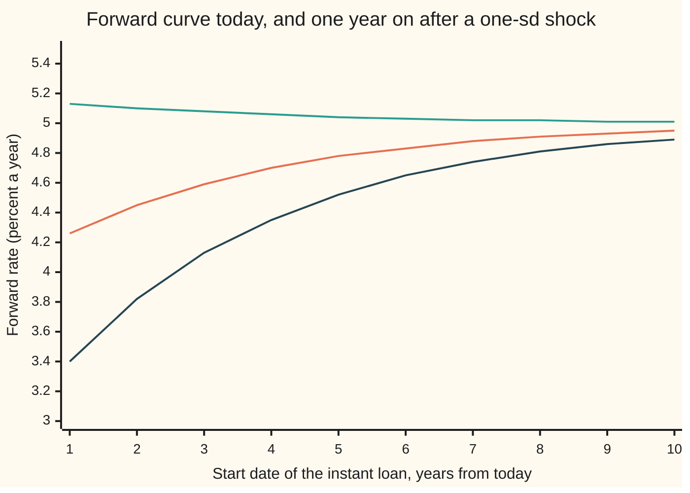
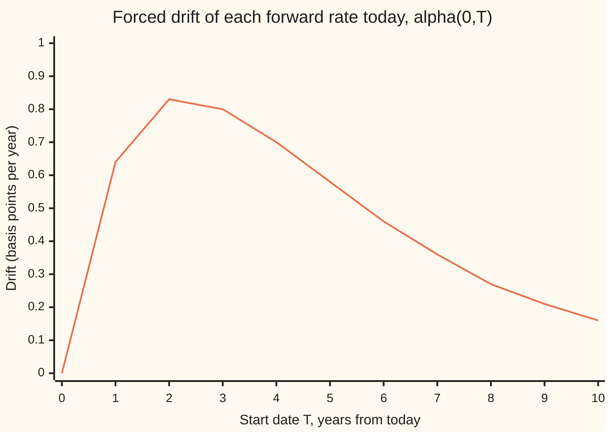

# Heath-Jarrow-Morton: model the forward curve and let no-arbitrage fix the drift

[Syllabus](../../../SYLLABUS.md) → [Financial mathematics](../../../SYLLABUS.md#w12) → [Forward-Rate Models](../../../SYLLABUS.md#w12-s31) → Heath-Jarrow-Morton

---

## General Overview

A bank's rates desk holds a promise of $1,000,000 due in five years. Today that promise is worth $799,231.74. Behind the price sits a curve: for every future date, the rate at which money can be locked in today for a loan starting on that date and lasting an instant. That curve is the **forward curve**. On this card it starts near 4% for loans starting now and climbs toward 5% for loans starting ten years out.

Tomorrow the whole curve will move. The front end might jump; the far end might barely twitch. A model of interest rates has to say how the curve moves, and it has two ingredients for each point: a steady push, called the **drift**, and a random shake, called the **volatility**.

In 1992 David Heath, Robert Jarrow and Andrew Morton showed a surprising fact. The modeller gets to choose the shakes. The pushes are then not free. No-arbitrage (the rule that no trade can make money for sure out of nothing) fixes every drift from the volatilities alone. Choose any other drift and the model hands out free money on bonds. On this card the free money is $243.27 on the $1,000,000 promise if the drift is set to zero.

The card's example is the simplest honest one: one random shock moves the whole curve, and each point's volatility fades exponentially with how far out it sits. That choice turns out to be the Hull-White short-rate model seen from the other side.

**Pick how hard each point of the forward curve shakes; no-arbitrage then sets how fast each point drifts: the drift equals that point's volatility times the total volatility of all the points between now and it.**

**What kind of fact this is:** a theorem, proved on this card in Why it works; the volatility shape it is applied to is a model: an assumption that fits markets well enough, not a law.

### The picture: one shock moves every maturity

A year from now, one random draw of the single shock sets the whole new curve. The chart shows today's curve and the curve one year later after a shock one standard deviation up and one standard deviation down. Each point is the forward rate for a loan starting at that calendar date.



Orange: today's curve. Green: one year on, shock one standard deviation up. Dark blue: one year on, shock one standard deviation down. The near end swings from 3.40% to 5.13%. The ten-year point barely moves, from 4.89% to 5.01%, because its volatility has faded.

---

## The formula

The model says each forward rate moves, over a tiny slice of time, by a drift plus a volatility times a random kick:

$$df(t,T) = \alpha(t,T)\,dt + \sigma(t,T)\,dW(t).$$

No-arbitrage then forces the drift:

$$\boxed{\;\alpha(t,T) = \sigma(t,T)\int_t^T \sigma(t,u)\,du\;}$$

**Read it aloud:** the drift of the forward rate for date T equals its own volatility times the area under the volatility curve from now out to T.

This card's volatility is $\sigma(t,T) = \sigma\,e^{-a(T-t)}$: a front volatility of 1 percentage point per square-root year that fades at speed 0.3 a year as the start date moves out. Putting it in gives the drift in closed form:

$$\alpha(t,T) = \frac{\sigma^2}{a}\,e^{-a(T-t)}\left(1 - e^{-a(T-t)}\right) = \sigma^2\,e^{-a(T-t)}\,b(T-t), \qquad b(h) = \frac{1 - e^{-ah}}{a}.$$

| Symbol | Plain meaning | In our example | Push it up and the answer… |
| --- | --- | --- | --- |
| $t$, $T$ | $t$ is now, in years from today; $T$ is the start date of the instant loan the forward rate is for | $t = 0$, $T = 5$ | a later $T$ adds more volatility area but fades its own volatility |
| $f(t,T)$ | the **forward rate**: the rate fixed at time $t$ for an instant loan starting at $T$; today's curve is $f(0,T) = 0.05 - 0.01\,e^{-0.3T}$ | $f(0,5) = 4.78\%$ | not an input to the drift at all |
| $P(t,T)$ | price at time $t$ of $1 paid at $T$: $P(t,T) = e^{-\int_t^T f(t,u)\,du}$ | $P(0,5) = 0.799231739$ | a higher forward curve lowers it |
| $r(t)$ | the **short rate**: the front of the curve, $r(t) = f(t,t)$, the rate on a loan starting now | $r(1) = 5.13\%$ after a one-sd up shock | — |
| $D(t)$ | the bank's discount along one path of rates, $D(t) = e^{-\int_0^t r(u)\,du}$: one over what $1 grows to when rolled at the short rate | random; its average with the bond is the test | — |
| $\sigma(t,T)$, $\sigma$, $a$ | volatility of the forward for date $T$, in rate units per square-root year; $\sigma$ is its front value and $a$ its fading speed | $\sigma = 0.01$, $a = 0.3$, $\sigma(0,5) = 0.0022313$ | drift scales with $\sigma^2$; a bigger $a$ shrinks it |
| $W$, $dW$, $dt$ | the single shared random shock (a Brownian motion); $dW$ is its kick over a tiny slice of time $dt$, mean zero, spread $\sqrt{dt}$ | one draw moves every maturity | — |
| $\alpha(t,T)$ | the **drift** of the forward rate, per year: forced, not chosen | $\alpha(0,5) = 0.0000577810$, about 0.58 bp a year | — |
| $A(t,T)$ | the **volatility area** $\int_t^T \sigma(t,u)\,du$: also the volatility of the bond $P(t,T)$ | $A(0,5) = 0.0258957$ | more area, more drift |
| $b(h)$, $h$ | $h = T - t$ is time to the start date; $b(h)$ is the volatility area per unit of $\sigma$ | $b(5) = 2.58957$ | — |
| $M$, $V$ | for the five-year bond held one year: $M$ is the total drift the curve piles up, $V$ the variance of the log of the discounted bond | $M = V/2 = 0.000304328$ | the theorem says $M$ must equal $V/2$ |
| $\theta(t)$ | the Hull-White target drift of the short rate, rebuilt from this model | $\theta(1) = 0.01507520$ | — |

A basis point (bp) is one hundredth of a percent, 0.0001. The drift here is tiny next to the shakes: 0.58 bp a year against a five-year forward volatility of 22 bp per square-root year. Small is not the same as optional, as the what-breaks table shows.

### The drift across the curve



The single line is $\alpha(0,T)$. It is zero at the front, where there is no volatility area yet. It is small at the far end, where the forward's own volatility has faded. It peaks between, at $T = \ln 2 / a = 2.31$ years, where it equals $\sigma^2/(4a) = 0.0000833333$ a year.

### When it holds

- **Prices are taken in the pricing world.** The formula is the drift under the risk-neutral pricing rule (the world where every asset, discounted at the short rate, is a fair bet; see [Hull-White](../30-Short-Rate%20Models/04-hull-white-model.md) for the same rule applied to one rate). Real-world drifts add a risk premium; use the formula for a forecast and it will be wrong by that premium.
- **The shocks are continuous.** Brownian kicks, no jumps. A curve that can jump by 25 bp on a central-bank day needs extra drift terms for the jumps.
- **The volatility is well behaved.** Here it is fixed in advance, so every rate is a bell curve and the discounted bond is a genuine fair bet. A bell curve has no floor: rates can go negative, here with small probability. Make volatility proportional to the rate itself and the forced drift grows like the rate squared: HJM proved such rates blow up in finite time.
- **One curve prices everything.** Bonds, the bank account and the forwards all come from one curve. Since 2008 desks discount on one curve and project coupons on another; each extra curve carries its own drift condition.
- **Today's curve is smooth.** The drift needs integrals and the Hull-White link needs a slope of $f(0,T)$. Quoted rates exist only at pillars, so an interpolated curve comes first.

---

## Why it works

### Step 0: a bond bought with borrowed money must be a fair bet

Borrow $799,231.74 at the short rate, rolling the loan every instant. Buy the five-year promise with it. Hold one year. The position cost nothing. If on average it ends worth more than the loan, that is money for nothing on average, and a bank that believed the model would do the trade in size. So the pricing rule demands that a bond, divided by the bank's rolled-up account, has no drift: it must be a **fair bet**, a quantity whose expected future value equals its value today. Everything below turns that one demand into a formula for $\alpha(t,T)$.

### Step 1: a bond is the whole curve, summed

A promise of $1 at $T$ is a chain of instant loans from now to $T$. Each link costs the forward rate for its date. Chain them and the log of the price is minus the area under the curve:

$$\ln P(t,T) = -\int_t^T f(t,u)\,du.$$

So the bond moves when the curve moves. How it moves is the next step.

### Step 2: the curve's move gives the bond's move

Two things change $\ln P(t,T)$ over a tiny slice $dt$. The left end of the area slides right: the strip at $u = t$ drops out, and its height is $f(t,t) = r(t)$. That adds $r(t)\,dt$. And every forward inside the area moves by its own $df(t,u)$. Adding up those moves over $u$ from $t$ to $T$:

$$d\ln P(t,T) = r(t)\,dt \;-\; \Big(\int_t^T \alpha(t,u)\,du\Big)dt \;-\; A(t,T)\,dW(t).$$

The shock term collects $\int_t^T \sigma(t,u)\,du$, which is why $A(t,T)$ is the bond's volatility.

### Step 3: Itô's correction when un-logging

The bond is e raised to its log. When a quantity shakes, its exponential gains an extra half-variance of drift: Itô's lemma ([Ito's lemma](../../11-Stochastic%20processes%20and%20calculus/06-Ito%20Calculus/02-itos-lemma.md)) adds $\tfrac12 A^2\,dt$. So

$$\frac{dP(t,T)}{P(t,T)} = \Big(r(t) - \int_t^T \alpha(t,u)\,du + \tfrac12 A(t,T)^2\Big)dt \;-\; A(t,T)\,dW(t).$$

### Step 4: remove the bank's growth and demand zero drift

Dividing by the bank account removes $r(t)\,dt$. What remains must have no drift, for every maturity $T$:

$$\int_t^T \alpha(t,u)\,du = \tfrac12 A(t,T)^2.$$

The total drift piled up between now and $T$ must exactly pay for the half-variance the bond gains from shaking.

### Step 5: differentiate in the maturity

Both sides are zero at $T = t$, so they are equal for every $T$ exactly when their slopes in $T$ are equal. The slope of the left side is $\alpha(t,T)$. The slope of $\tfrac12 A^2$ is $A$ times the slope of $A$, which is $\sigma(t,T)$. Hence

$$\alpha(t,T) = \sigma(t,T)\,A(t,T) = \sigma(t,T)\int_t^T\sigma(t,u)\,du.$$

The step also runs backwards: this drift makes every discounted bond drift-free. Nothing in the result mentions today's curve or anyone's forecast. Only the volatilities appear.

<details>
<summary>Detailed proof</summary>

The body used two moves without justifying them. First, Step 2 swapped "integrate over maturities" with "add up random kicks over time". For volatility fixed in advance and continuous on the triangle $0 \le t \le T \le H$ (here $H = 10$ years), this is a stochastic Fubini theorem: approximate $\sigma(s,u)$ by step functions in $u$, where the swap is a finite sum; the Itô isometry (the mean square of a stochastic integral equals the integral of the squared integrand) makes the error vanish in mean square. The moving lower limit is handled by writing $\int_t^T f(t,u)\,du$ as $\int_0^T$ minus $\int_0^t$ and differentiating each piece; the piece lost at the left end is $f(t,t)\,dt = r(t)\,dt$.

Second, zero drift makes the discounted bond a *local* fair bet only. With fixed volatility it is a genuine one: after the drift condition, the discounted bond equals $P(0,T)\exp\!\big(-\int_0^t A(s,T)\,dW(s) - \tfrac12\int_0^t A(s,T)^2\,ds\big)$. The exponent is a bell curve with a fixed variance, and e raised to a bell-curve draw minus half its variance averages exactly one. So the expected discounted bond is $P(0,T)$ at every date.

Third, the converse. If the discounted bond is a fair bet, its drift must be zero almost everywhere in time, because a continuous process can be split into a drift part and a fair-bet part in only one way. That gives Step 4's identity, and Step 5 follows. With several independent shocks the same argument runs shock by shock and the condition becomes $\alpha = \sum_i \sigma_i(t,T)\int_t^T\sigma_i(t,u)\,du$.

</details>

### Step 6: the exponential volatility is Hull-White

With $\sigma(t,T) = \sigma e^{-a(T-t)}$, every forward rate is driven by the same single random number: the shocks so far, each faded by $e^{-a(t-u)}$. Call their sum the state. The whole curve at time $t$ is today's curve, plus the drift piled up, plus $\sigma e^{-a(T-t)}$ times the state. At $T = t$ that gives the short rate, so the state is $r(t)$ minus known pieces, and **the whole curve is a function of $r(t)$ alone.** Most volatility choices make the curve depend on the whole path of past shocks; this fading shape is what lets one number carry the state.

The drift piled up at the front is a convexity term:

$$\int_0^t \alpha(u,t)\,du = \frac{\sigma^2}{2a^2}\left(1 - e^{-at}\right)^2.$$

Differentiating $r(t)$ in time and replacing the state by $r(t)$ gives

$$dr(t) = \big(\theta(t) - a\,r(t)\big)dt + \sigma\,dW(t), \qquad \theta(t) = \frac{\partial f(0,t)}{\partial t} + a\,f(0,t) + \frac{\sigma^2}{2a}\left(1 - e^{-2at}\right).$$

That is the Hull-White model, with the $\theta(t)$ that fits today's curve exactly ([Hull-White](../30-Short-Rate%20Models/04-hull-white-model.md)). HJM did not choose $a$ or $\sigma$; it took them as the volatility shape and returned the short-rate model.

<details>
<summary>The algebra behind Step 6</summary>

Write $c(t) = \frac{\sigma^2}{2a^2}(1 - e^{-at})^2$ and let $S(t) = \sigma\int_0^t e^{-a(t-u)}\,dW(u)$ be the faded shocks. Then $r(t) = f(0,t) + c(t) + S(t)$, and $dS = -a\,S\,dt + \sigma\,dW$. Differentiate: $dr = \big(\partial_t f(0,t) + c'(t) - a S\big)dt + \sigma\,dW$. Replace $S(t)$ by $r - f(0,t) - c(t)$: the drift becomes $\partial_t f(0,t) + a f(0,t) + c'(t) + a\,c(t) - a\,r$. Finally $c'(t) + a\,c(t) = \frac{\sigma^2}{a}(1-e^{-at})e^{-at} + \frac{\sigma^2}{2a}(1-e^{-at})^2 = \frac{\sigma^2}{2a}(1 - e^{-at})(1 + e^{-at}) = \frac{\sigma^2}{2a}(1 - e^{-2at})$.

</details>

Setting $a$ toward zero gives constant volatility, drift $\sigma^2(T-t)$, and the Ho-Lee model. Discrete versions of the same argument, with forward rates over accrual periods instead of instants, give the market models on [Market models](03-libor-and-sofr-market-models.md).

---

## Worked numbers, by hand

The five-year forward today, and the five-year bond held for one year.

| Step | Arithmetic | Value |
| --- | --- | --- |
| volatility of the five-year forward, $\sigma(0,5)$ | $0.01 \times e^{-1.5} = 0.01 \times 0.22313$ | $0.0022313$ |
| volatility area, $A(0,5) = \sigma\,b(5)$ | $0.01 \times (1 - 0.22313)/0.3 = 0.01 \times 2.58957$ | $0.0258957$ |
| forced drift, $\alpha(0,5)$ | $0.0022313 \times 0.0258957$ | $0.0000577810$ a year, 0.58 bp |
| peak drift, at $T = 2.31$ | $\sigma^2/(4a) = 0.0001/1.2$ | $0.0000833333$ |
| today's bond, $P(0,5)$ | $e^{-(0.05 \times 5 - 0.01 \times 2.58957)} = e^{-0.224104}$ | $0.799231739$ |
| drift piled up over the year, $M$ | double integral of $\alpha$, by quadrature | $0.000304328$ |
| half the variance of the log, $V/2$ | $\tfrac12\int_0^1 A(v,5)^2\,dv$, by quadrature | $0.000304328$ |
| **expected discounted bond after a year** | $0.799231739 \times e^{-M + V/2}$ | **$0.799231739$** |

The bond bought with borrowed money is worth, on average, exactly what it cost. The drift piled up by the curve, 0.000304328, cancels the half-variance the bond gains from shaking, 0.000304328, to all nine printed digits. That is Step 4 on real numbers.

### What breaks if you drop a piece

Same bond, $1,000,000 due in five years, bought today at $799,231.74 with money borrowed at the short rate and held one year. The table gives the model's expected discounted value and the free gain per $1,000,000 it implies.

| Mistake | Comes out at | What went wrong |
| --- | --- | --- |
| Drift set to zero ("rates have no trend") | 0.799475005, a free $243.27 | Nothing pays for the bond's half-variance, so the average bond beats the bank |
| Drift sign flipped, $-\sigma A$ | 0.799718345, a free $486.61 | Twice the error: the drift pushes the wrong way by the full amount |
| Drift $\tfrac12\sigma(t,T)^2$, the stock-model habit | 0.799412930, a free $181.19 | Half-variance of the forward itself, not its volatility times the volatility area |

```
Free expected gain on $1,000,000 due in 5 years, held 1 year  (one █ = $25)
drift condition      |                          $0.00
drift 1/2 sigma^2    |███████                   $181.19
zero drift           |██████████                $243.27
sign flipped         |███████████████████▌      $486.61
```

A few hundred dollars on a million sounds small. It is free, it scales with the book, and a Monte Carlo pricer with the wrong drift misprices every rate option it touches by the same mechanism.

---

## Code, from first principles, and it actually runs

The code reaches the drift condition by **four independent roads**. Road 1 computes $\alpha(t,T)$ from the closed form and again by integrating the volatility with Simpson's rule (adding up thin slices under a curve). Road 2 uses the exact bell-curve law of the discounted bond: the drift enters only its centre and the volatility only its spread, and the two are computed by separate double integrals. Road 3 simulates 100,000 curves over one year with a random-number generator written in the script, prices the bond on each, and averages. Road 4 rebuilds Hull-White from the curve: $\theta(t)$ by differentiating the expected short rate numerically, and the one-year-on bond priced once from the whole curve and once from $r(1)$ alone. Every chart value is printed at the end.

### Python

```python
# HJM drift condition -- the check behind the card.  Standard library only.
# One-factor HJM, exponential volatility sigma(t,T) = 0.01 e^{-0.3 (T - t)},
# today's forward curve f(0,T) = 0.05 - 0.01 e^{-0.3 T}.  Four roads:
# 1 drift from the volatility: closed form against quadrature
# 2 the exact bell-curve law of the discounted bond: E[D(1) P(1,5)] = P(0,5)?
# 3 Monte Carlo: 100,000 simulated curves, same question
# 4 Hull-White inside HJM: theta(t), convexity, and the bond from r(1) alone
from math import exp, log, sqrt, cos, pi

A, SIG = 0.3, 0.01                       # fade speed per year, front volatility

def f0(T): return 0.05 - 0.01 * exp(-0.3 * T)                 # today's forward curve
def f0_area(T): return 0.05 * T - 0.01 * (1 - exp(-0.3 * T)) / 0.3
def P0(T): return exp(-f0_area(T))                          # today's bond prices
def vol(t, T): return SIG * exp(-A * (T - t))
def b(h): return (1 - exp(-A * h)) / A

def simpson(g, lo, hi, n=200):
    if hi <= lo: return 0.0
    h = (hi - lo) / n
    s = g(lo) + g(hi) + sum((4 if k % 2 else 2) * g(lo + k * h) for k in range(1, n))
    return s * h / 3

def alpha(t, T): return SIG * SIG * exp(-A * (T - t)) * b(T - t)   # drift condition, closed
def alpha_quad(t, T): return vol(t, T) * simpson(lambda u: vol(t, u), t, T)

# ---- road 1: the drift is the volatility times the volatility area ----
print("road 1: alpha(t,T) = sigma(t,T) x A(t,T), per year")
print(" (t,T)     sigma(t,T)    A(t,T)      closed         quadrature")
gap1 = 0.0
for t, T in ((0, 1), (0, 5), (1, 5), (0, 10), (0, log(2) / A)):
    ac, aq = alpha(t, T), alpha_quad(t, T)
    gap1 = max(gap1, abs(ac - aq))
    print(f" ({t},{T:5.2f})  {vol(t, T):.7f}  {SIG * b(T - t):.7f}  {ac:.10f}  {aq:.10f}")
print(f" peak drift sigma^2/(4a) = {SIG * SIG / (4 * A):.10f}")

# ---- road 2: exact law. log of D(1)P(1,5) is a bell curve; mean from drift, spread from vol ----
def drift_area(dr):          # int_0^1 int_0^u dr(v,u) dv du  +  int_1^5 int_0^1 dr(v,s) dv ds
    front = simpson(lambda u: simpson(lambda v: dr(v, u), 0, u, 60), 0, 1, 60)
    back = simpson(lambda s: simpson(lambda v: dr(v, s), 0, 1, 60), 1, 5, 60)
    return front + back
V = simpson(lambda v: simpson(lambda u: vol(v, u), v, 5) ** 2, 0, 1)   # variance of the exponent
def expect(dr): return P0(5) * exp(-drift_area(dr) + V / 2)
E_right = expect(alpha)
print()
print("road 2: exact bell-curve law of D(1) P(1,5)")
print(f" P(0,5) market                    {P0(5):.9f}   exponent {f0_area(5):.6f}")
print(f" drift area M                     {drift_area(alpha):.9f}")
print(f" half variance V/2                {V / 2:.9f}")
print(f" E[D(1)P(1,5)] drift condition    {E_right:.9f}")
wrongs = (("zero drift", lambda v, u: 0.0), ("drift sign flipped", lambda v, u: -alpha(v, u)),
          ("drift 1/2 sigma^2", lambda v, u: 0.5 * vol(v, u) ** 2))
for name, dr in wrongs:
    e = expect(dr)
    print(f" wrong: {name:<20} {e:.9f}  per $1m: {1e6 * (e - P0(5)):+8.2f}")

# ---- road 3: Monte Carlo of the whole curve (state X_t = int_0^t e^{-a(t-u)} dW_u) ----
state = 2026
def normal():
    global state
    state = (state * 6364136223846793005 + 1442695040888963407) % (1 << 64)
    u1 = ((state >> 11) + 0.5) / 9007199254740992.0
    state = (state * 6364136223846793005 + 1442695040888963407) % (1 << 64)
    u2 = ((state >> 11) + 0.5) / 9007199254740992.0
    return sqrt(-2 * log(u1)) * cos(2 * pi * u2)
def G(t, T):                              # int_0^t alpha(u,T) du, closed form
    return SIG * SIG / A * ((exp(-A * (T - t)) - exp(-A * T)) / A
                            - (exp(-2 * A * (T - t)) - exp(-2 * A * T)) / (2 * A))
N, M = 100000, 25
dt = 1.0 / M
fade, kick = exp(-A * dt), sqrt((1 - exp(-2 * A * dt)) / (2 * A))
r_det = [f0(k * dt) + G(k * dt, k * dt) for k in range(M + 1)]
r_nod = [f0(k * dt) for k in range(M + 1)]
back_det = f0_area(5) - f0_area(1) + simpson(lambda s: G(1, s), 1, 5)
back_nod = f0_area(5) - f0_area(1)
disc_det = sum(0.5 * (r_det[k - 1] + r_det[k]) * dt for k in range(1, M + 1))
disc_nod = sum(0.5 * (r_nod[k - 1] + r_nod[k]) * dt for k in range(1, M + 1))
s1 = s2 = z1 = fm = fs = 0.0
for _ in range(N):
    X, I = 0.0, 0.0                       # state, and the area under it over the year
    for _k in range(M):
        Xn = fade * X + kick * normal()
        I += 0.5 * (X + Xn) * dt
        X = Xn
    shock_d, shock_p = SIG * I, SIG * b(4) * X
    y = exp(-(disc_det + shock_d)) * exp(-(back_det + shock_p))
    s1 += y; s2 += y * y
    z1 += exp(-(disc_nod + shock_d)) * exp(-(back_nod + shock_p))
    f15 = f0(5) + G(1, 5) + SIG * exp(-4 * A) * X
    fm += f15; fs += f15 * f15
mc = s1 / N
se = sqrt((s2 / N - mc * mc) / N)
mc_zero = z1 / N
f_mean, f_sd = fm / N, sqrt(fs / N - (fm / N) ** 2)
sd_exact = SIG * exp(-4 * A) * sqrt((1 - exp(-2 * A)) / (2 * A))
print()
print(f"road 3: Monte Carlo, {N} curves, {M} steps in the year")
print(f" f(1,5) mean   exact {f0(5) + G(1, 5):.6f}   simulated {f_mean:.6f}")
print(f" f(1,5) sd     exact {sd_exact:.6f}   simulated {f_sd:.6f}")
print(f" E[D(1)P(1,5)] drift condition  {mc:.6f}  SE {se:.6f}  off by {(mc - P0(5)) / se:+.2f} SE")
print(f" E[D(1)P(1,5)] zero drift       {mc_zero:.6f}  SE {se:.6f}  off by {(mc_zero - P0(5)) / se:+.2f} SE")

# ---- road 4: Hull-White inside HJM ----
def mean_r(t): return f0(t) + simpson(lambda u: alpha(u, t), 0, t)   # expected r(t), HJM side
def theta_hw(t): return 0.003 * exp(-0.3 * t) + A * f0(t) + SIG * SIG / (2 * A) * (1 - exp(-2 * A * t))
print()
print("road 4: Hull-White inside HJM")
gap4 = 0.0
for t in (1.0, 2.0, 5.0, 10.0):
    h = 1e-4
    th = (mean_r(t + h) - mean_r(t - h)) / (2 * h) + A * mean_r(t)
    gap4 = max(gap4, abs(th - theta_hw(t)))
    print(f" theta({t:4.1f})  Hull-White {theta_hw(t):.8f}   from HJM curve {th:.8f}")
conv_hjm = simpson(lambda u: alpha(u, 1), 0, 1)
conv_hw = SIG * SIG / (2 * A * A) * (1 - exp(-A)) ** 2
print(f" convexity at t=1   HJM {conv_hjm:.10f}   Hull-White {conv_hw:.10f}")
X1 = sqrt((1 - exp(-2 * A)) / (2 * A))           # a one-sd upward shock of the state
def f1(s, x): return f0(s) + simpson(lambda u: alpha(u, s), 0, 1, 100) + SIG * exp(-A * (s - 1)) * x
p_curve = exp(-simpson(lambda s: f1(s, X1), 1, 5, 100))
r1 = f1(1, X1)
p_hw = P0(5) / P0(1) * exp(b(4) * f0(1) - SIG * SIG / (4 * A) * (1 - exp(-2 * A)) * b(4) ** 2 - b(4) * r1)
print(f" after +1 sd: r(1) {r1:.6f}   P(1,5) from curve {p_curve:.9f}   from r(1) {p_hw:.9f}")

# ---- chart points ----
print()
print("chart, maturity T (years)   " + " ".join(f"{T:5d}" for T in range(1, 11)))
print("chart, f(0,T) percent       " + " ".join(f"{100 * f0(T):5.2f}" for T in range(1, 11)))
print("chart, f(1,T) +1 sd percent " + " ".join(f"{100 * f1(T, X1):5.2f}" for T in range(1, 11)))
print("chart, f(1,T) -1 sd percent " + " ".join(f"{100 * f1(T, -X1):5.2f}" for T in range(1, 11)))
print("chart, alpha(0,T) bp/year   " + " ".join(f"{1e4 * alpha(0, T):5.2f}" for T in range(0, 11)))

assert gap1 < 1e-12,                        "drift: closed form vs quadrature"
assert abs(E_right - P0(5)) < 1e-10,        "exact law: drift condition makes the discounted bond fair"
assert abs(mc - P0(5)) < 3 * se,            "Monte Carlo lands on today's bond price"
assert (mc_zero - P0(5)) > 3 * se,          "zero drift leaves a detectable free return"
assert gap4 < 1e-7,                        "Hull-White theta from the HJM curve"
assert abs(p_curve - p_hw) < 1e-9,          "the whole HJM curve is priced by r(1) alone"
print("ALL CHECKS PASS")
```

**Ran 2026-09-28 on macOS, Python 3.14.6, standard library only. All checks passed. Output, pasted from the run:**

```
road 1: alpha(t,T) = sigma(t,T) x A(t,T), per year
 (t,T)     sigma(t,T)    A(t,T)      closed         quadrature
 (0, 1.00)  0.0074082  0.0086394  0.0000640022  0.0000640022
 (0, 5.00)  0.0022313  0.0258957  0.0000577810  0.0000577810
 (1, 5.00)  0.0030119  0.0232935  0.0000701588  0.0000701588
 (0,10.00)  0.0004979  0.0316738  0.0000157694  0.0000157694
 (0, 2.31)  0.0050000  0.0166667  0.0000833333  0.0000833333
 peak drift sigma^2/(4a) = 0.0000833333

road 2: exact bell-curve law of D(1) P(1,5)
 P(0,5) market                    0.799231739   exponent 0.224104
 drift area M                     0.000304328
 half variance V/2                0.000304328
 E[D(1)P(1,5)] drift condition    0.799231739
 wrong: zero drift           0.799475005  per $1m:  +243.27
 wrong: drift sign flipped   0.799718345  per $1m:  +486.61
 wrong: drift 1/2 sigma^2    0.799412930  per $1m:  +181.19

road 3: Monte Carlo, 100000 curves, 25 steps in the year
 f(1,5) mean   exact 0.047833   simulated 0.047831
 f(1,5) sd     exact 0.002612   simulated 0.002616
 E[D(1)P(1,5)] drift condition  0.799242  SE 0.000062  off by +0.17 SE
 E[D(1)P(1,5)] zero drift       0.799486  SE 0.000062  off by +4.07 SE

road 4: Hull-White inside HJM
 theta( 1.0)  Hull-White 0.01507520   from HJM curve 0.01507520
 theta( 2.0)  Hull-White 0.01511647   from HJM curve 0.01511647
 theta( 5.0)  Hull-White 0.01515837   from HJM curve 0.01515837
 theta(10.0)  Hull-White 0.01516625   from HJM curve 0.01516625
 convexity at t=1   HJM 0.0000373196   Hull-White 0.0000373196
 after +1 sd: r(1) 0.051301   P(1,5) from curve 0.816087194   from r(1) 0.816087194

chart, maturity T (years)       1     2     3     4     5     6     7     8     9    10
chart, f(0,T) percent        4.26  4.45  4.59  4.70  4.78  4.83  4.88  4.91  4.93  4.95
chart, f(1,T) +1 sd percent  5.13  5.10  5.08  5.06  5.04  5.03  5.02  5.02  5.01  5.01
chart, f(1,T) -1 sd percent  3.40  3.82  4.13  4.35  4.52  4.65  4.74  4.81  4.86  4.89
chart, alpha(0,T) bp/year    0.00  0.64  0.83  0.80  0.70  0.58  0.46  0.36  0.27  0.21  0.16
ALL CHECKS PASS
```

### Rust

```rust
// HJM drift condition -- the check behind the card, in Rust.  std only, no crates.
// One-factor HJM, exponential volatility sigma(t,T) = 0.01 e^{-0.3 (T - t)},
// today's forward curve f(0,T) = 0.05 - 0.01 e^{-0.3 T}.  The same four roads as
// the Python: drift by quadrature, the exact bell-curve law of the discounted
// bond, Monte Carlo of 100,000 curves, and Hull-White inside HJM.
const A: f64 = 0.3; // fade speed per year
const SIG: f64 = 0.01; // front volatility

fn f0(t: f64) -> f64 { 0.05 - 0.01 * (-0.3 * t).exp() }
fn f0_area(t: f64) -> f64 { 0.05 * t - 0.01 * (1.0 - (-0.3 * t).exp()) / 0.3 }
fn p0(t: f64) -> f64 { (-f0_area(t)).exp() }
fn vol(t: f64, big_t: f64) -> f64 { SIG * (-A * (big_t - t)).exp() }
fn b(h: f64) -> f64 { (1.0 - (-A * h).exp()) / A }
fn alpha(t: f64, big_t: f64) -> f64 { SIG * SIG * (-A * (big_t - t)).exp() * b(big_t - t) }

fn simpson<F: Fn(f64) -> f64>(g: F, lo: f64, hi: f64, n: usize) -> f64 {
    if hi <= lo { return 0.0; }
    let h = (hi - lo) / n as f64;
    let mut inner = 0.0;
    for k in 1..n { inner += if k % 2 == 1 { 4.0 } else { 2.0 } * g(lo + k as f64 * h); }
    (g(lo) + g(hi) + inner) * h / 3.0
}
fn alpha_quad(t: f64, big_t: f64) -> f64 { vol(t, big_t) * simpson(|u| vol(t, u), t, big_t, 200) }

fn drift_area<F: Fn(f64, f64) -> f64>(dr: &F) -> f64 {
    let front = simpson(|u| simpson(|v| dr(v, u), 0.0, u, 60), 0.0, 1.0, 60);
    let back = simpson(|s| simpson(|v| dr(v, s), 0.0, 1.0, 60), 1.0, 5.0, 60);
    front + back
}
// int_0^t alpha(u,T) du, closed form
fn g_int(t: f64, big_t: f64) -> f64 {
    SIG * SIG / A * (((-A * (big_t - t)).exp() - (-A * big_t).exp()) / A
        - ((-2.0 * A * (big_t - t)).exp() - (-2.0 * A * big_t).exp()) / (2.0 * A))
}
struct Rng(u64);
impl Rng {
    fn unif(&mut self) -> f64 {
        self.0 = self.0.wrapping_mul(6364136223846793005).wrapping_add(1442695040888963407);
        ((self.0 >> 11) as f64 + 0.5) / 9007199254740992.0
    }
    fn normal(&mut self) -> f64 {
        let u1 = self.unif();
        let u2 = self.unif();
        (-2.0 * u1.ln()).sqrt() * (2.0 * std::f64::consts::PI * u2).cos()
    }
}
fn mean_r(t: f64) -> f64 { f0(t) + simpson(|u| alpha(u, t), 0.0, t, 200) }
fn theta_hw(t: f64) -> f64 {
    0.003 * (-0.3 * t).exp() + A * f0(t) + SIG * SIG / (2.0 * A) * (1.0 - (-2.0 * A * t).exp())
}
fn f1(s: f64, x: f64) -> f64 { f0(s) + simpson(|u| alpha(u, s), 0.0, 1.0, 100) + SIG * (-A * (s - 1.0)).exp() * x }

fn main() {
    // ---- road 1: the drift is the volatility times the volatility area ----
    println!("road 1: alpha(t,T) = sigma(t,T) x A(t,T), per year");
    println!(" (t,T)     sigma(t,T)    A(t,T)      closed         quadrature");
    let mut gap1: f64 = 0.0;
    for &(t, bt) in &[(0.0, 1.0), (0.0, 5.0), (1.0, 5.0), (0.0, 10.0), (0.0, 2f64.ln() / A)] {
        let (ac, aq) = (alpha(t, bt), alpha_quad(t, bt));
        gap1 = gap1.max((ac - aq).abs());
        println!(" ({},{:5.2})  {:.7}  {:.7}  {:.10}  {:.10}", t as i32, bt, vol(t, bt), SIG * b(bt - t), ac, aq);
    }
    println!(" peak drift sigma^2/(4a) = {:.10}", SIG * SIG / (4.0 * A));

    // ---- road 2: exact law of D(1)P(1,5) ----
    let v = simpson(|v| simpson(|u| vol(v, u), v, 5.0, 200).powi(2), 0.0, 1.0, 200);
    let expect = |m: f64| p0(5.0) * (-m + v / 2.0).exp();
    let e_right = expect(drift_area(&alpha));
    println!();
    println!("road 2: exact bell-curve law of D(1) P(1,5)");
    println!(" P(0,5) market                    {:.9}   exponent {:.6}", p0(5.0), f0_area(5.0));
    println!(" drift area M                     {:.9}", drift_area(&alpha));
    println!(" half variance V/2                {:.9}", v / 2.0);
    println!(" E[D(1)P(1,5)] drift condition    {:.9}", e_right);
    let wrongs: [(&str, f64); 3] = [
        ("zero drift", drift_area(&|_v: f64, _u: f64| 0.0)),
        ("drift sign flipped", drift_area(&|v: f64, u: f64| -alpha(v, u))),
        ("drift 1/2 sigma^2", drift_area(&|v: f64, u: f64| 0.5 * vol(v, u).powi(2))),
    ];
    for (name, m) in wrongs.iter() {
        let e = expect(*m);
        println!(" wrong: {:<20} {:.9}  per $1m: {:+8.2}", name, e, 1e6 * (e - p0(5.0)));
    }

    // ---- road 3: Monte Carlo of the whole curve ----
    let mut rng = Rng(2026);
    let (n, m) = (100000usize, 25usize);
    let dt = 1.0 / m as f64;
    let (fade, kick) = ((-A * dt).exp(), ((1.0 - (-2.0 * A * dt).exp()) / (2.0 * A)).sqrt());
    let r_det: Vec<f64> = (0..=m).map(|k| f0(k as f64 * dt) + g_int(k as f64 * dt, k as f64 * dt)).collect();
    let r_nod: Vec<f64> = (0..=m).map(|k| f0(k as f64 * dt)).collect();
    let back_det = f0_area(5.0) - f0_area(1.0) + simpson(|s| g_int(1.0, s), 1.0, 5.0, 200);
    let back_nod = f0_area(5.0) - f0_area(1.0);
    let disc_det: f64 = (1..=m).map(|k| 0.5 * (r_det[k - 1] + r_det[k]) * dt).sum();
    let disc_nod: f64 = (1..=m).map(|k| 0.5 * (r_nod[k - 1] + r_nod[k]) * dt).sum();
    let (mut s1, mut s2, mut z1, mut fm, mut fs) = (0.0, 0.0, 0.0, 0.0, 0.0);
    for _ in 0..n {
        let (mut x, mut area) = (0.0f64, 0.0f64); // state, and the area under it over the year
        for _ in 0..m {
            let xn = fade * x + kick * rng.normal();
            area += 0.5 * (x + xn) * dt;
            x = xn;
        }
        let (shock_d, shock_p) = (SIG * area, SIG * b(4.0) * x);
        let y = (-(disc_det + shock_d)).exp() * (-(back_det + shock_p)).exp();
        s1 += y;
        s2 += y * y;
        z1 += (-(disc_nod + shock_d)).exp() * (-(back_nod + shock_p)).exp();
        let f15 = f0(5.0) + g_int(1.0, 5.0) + SIG * (-4.0 * A).exp() * x;
        fm += f15;
        fs += f15 * f15;
    }
    let nf = n as f64;
    let mc = s1 / nf;
    let se = ((s2 / nf - mc * mc) / nf).sqrt();
    let mc_zero = z1 / nf;
    let (f_mean, f_sd) = (fm / nf, (fs / nf - (fm / nf).powi(2)).sqrt());
    let sd_exact = SIG * (-4.0 * A).exp() * ((1.0 - (-2.0 * A).exp()) / (2.0 * A)).sqrt();
    println!();
    println!("road 3: Monte Carlo, {} curves, {} steps in the year", n, m);
    println!(" f(1,5) mean   exact {:.6}   simulated {:.6}", f0(5.0) + g_int(1.0, 5.0), f_mean);
    println!(" f(1,5) sd     exact {:.6}   simulated {:.6}", sd_exact, f_sd);
    println!(" E[D(1)P(1,5)] drift condition  {:.6}  SE {:.6}  off by {:+.2} SE", mc, se, (mc - p0(5.0)) / se);
    println!(" E[D(1)P(1,5)] zero drift       {:.6}  SE {:.6}  off by {:+.2} SE", mc_zero, se, (mc_zero - p0(5.0)) / se);

    // ---- road 4: Hull-White inside HJM ----
    println!();
    println!("road 4: Hull-White inside HJM");
    let mut gap4: f64 = 0.0;
    for &t in &[1.0, 2.0, 5.0, 10.0] {
        let h = 1e-4;
        let th = (mean_r(t + h) - mean_r(t - h)) / (2.0 * h) + A * mean_r(t);
        gap4 = gap4.max((th - theta_hw(t)).abs());
        println!(" theta({:4.1})  Hull-White {:.8}   from HJM curve {:.8}", t, theta_hw(t), th);
    }
    let conv_hjm = simpson(|u| alpha(u, 1.0), 0.0, 1.0, 200);
    let conv_hw = SIG * SIG / (2.0 * A * A) * (1.0 - (-A).exp()).powi(2);
    println!(" convexity at t=1   HJM {:.10}   Hull-White {:.10}", conv_hjm, conv_hw);
    let x1 = ((1.0 - (-2.0 * A).exp()) / (2.0 * A)).sqrt(); // one-sd upward shock of the state
    let p_curve = (-simpson(|s| f1(s, x1), 1.0, 5.0, 100)).exp();
    let r1 = f1(1.0, x1);
    let p_hw = p0(5.0) / p0(1.0)
        * (b(4.0) * f0(1.0) - SIG * SIG / (4.0 * A) * (1.0 - (-2.0 * A).exp()) * b(4.0).powi(2) - b(4.0) * r1).exp();
    println!(" after +1 sd: r(1) {:.6}   P(1,5) from curve {:.9}   from r(1) {:.9}", r1, p_curve, p_hw);

    // ---- chart points ----
    println!();
    let row = |lab: &str, vals: Vec<f64>| {
        let cells: Vec<String> = vals.iter().map(|v| format!("{:5.2}", v)).collect();
        println!("{}{}", lab, cells.join(" "));
    };
    let mats: Vec<String> = (1..=10).map(|t| format!("{:5}", t)).collect();
    println!("chart, maturity T (years)   {}", mats.join(" "));
    row("chart, f(0,T) percent       ", (1..=10).map(|t| 100.0 * f0(t as f64)).collect());
    row("chart, f(1,T) +1 sd percent ", (1..=10).map(|t| 100.0 * f1(t as f64, x1)).collect());
    row("chart, f(1,T) -1 sd percent ", (1..=10).map(|t| 100.0 * f1(t as f64, -x1)).collect());
    row("chart, alpha(0,T) bp/year   ", (0..=10).map(|t| 1e4 * alpha(0.0, t as f64)).collect());

    assert!(gap1 < 1e-12, "drift: closed form vs quadrature");
    assert!((e_right - p0(5.0)).abs() < 1e-10, "exact law: drift condition makes the discounted bond fair");
    assert!((mc - p0(5.0)).abs() < 3.0 * se, "Monte Carlo lands on today's bond price");
    assert!(mc_zero - p0(5.0) > 3.0 * se, "zero drift leaves a detectable free return");
    assert!(gap4 < 1e-7, "Hull-White theta from the HJM curve");
    assert!((p_curve - p_hw).abs() < 1e-9, "the whole HJM curve is priced by r(1) alone");
    println!("ALL CHECKS PASS");
}
```

**Ran 2026-09-28 on macOS, rustc 1.98.1, no crates. All checks passed. Output, pasted from the run:**

```
road 1: alpha(t,T) = sigma(t,T) x A(t,T), per year
 (t,T)     sigma(t,T)    A(t,T)      closed         quadrature
 (0, 1.00)  0.0074082  0.0086394  0.0000640022  0.0000640022
 (0, 5.00)  0.0022313  0.0258957  0.0000577810  0.0000577810
 (1, 5.00)  0.0030119  0.0232935  0.0000701588  0.0000701588
 (0,10.00)  0.0004979  0.0316738  0.0000157694  0.0000157694
 (0, 2.31)  0.0050000  0.0166667  0.0000833333  0.0000833333
 peak drift sigma^2/(4a) = 0.0000833333

road 2: exact bell-curve law of D(1) P(1,5)
 P(0,5) market                    0.799231739   exponent 0.224104
 drift area M                     0.000304328
 half variance V/2                0.000304328
 E[D(1)P(1,5)] drift condition    0.799231739
 wrong: zero drift           0.799475005  per $1m:  +243.27
 wrong: drift sign flipped   0.799718345  per $1m:  +486.61
 wrong: drift 1/2 sigma^2    0.799412930  per $1m:  +181.19

road 3: Monte Carlo, 100000 curves, 25 steps in the year
 f(1,5) mean   exact 0.047833   simulated 0.047831
 f(1,5) sd     exact 0.002612   simulated 0.002616
 E[D(1)P(1,5)] drift condition  0.799242  SE 0.000062  off by +0.17 SE
 E[D(1)P(1,5)] zero drift       0.799486  SE 0.000062  off by +4.07 SE

road 4: Hull-White inside HJM
 theta( 1.0)  Hull-White 0.01507520   from HJM curve 0.01507520
 theta( 2.0)  Hull-White 0.01511647   from HJM curve 0.01511647
 theta( 5.0)  Hull-White 0.01515837   from HJM curve 0.01515837
 theta(10.0)  Hull-White 0.01516625   from HJM curve 0.01516625
 convexity at t=1   HJM 0.0000373196   Hull-White 0.0000373196
 after +1 sd: r(1) 0.051301   P(1,5) from curve 0.816087194   from r(1) 0.816087194

chart, maturity T (years)       1     2     3     4     5     6     7     8     9    10
chart, f(0,T) percent        4.26  4.45  4.59  4.70  4.78  4.83  4.88  4.91  4.93  4.95
chart, f(1,T) +1 sd percent  5.13  5.10  5.08  5.06  5.04  5.03  5.02  5.02  5.01  5.01
chart, f(1,T) -1 sd percent  3.40  3.82  4.13  4.35  4.52  4.65  4.74  4.81  4.86  4.89
chart, alpha(0,T) bp/year    0.00  0.64  0.83  0.80  0.70  0.58  0.46  0.36  0.27  0.21  0.16
ALL CHECKS PASS
```

The two outputs agree line for line. The Monte Carlo lines agree too, because both programs carry the same hand-written generator; the libraries' exponential and logarithm can differ in the last bit, which does not reach six printed decimals here.

> [!TIP]
> **Try changing**
> Guess the direction first. Then run it.
> - **Double the front volatility.** Set `SIG = 0.02`. Guess: the drift doubles? It quadruples, because it is volatility times volatility area: the 0.58 bp becomes four times as big, and every free gain in the what-breaks table grows about fourfold.
> - **Starve the Monte Carlo.** Set `N = 10000`. The standard error grows by the square root of ten, the zero-drift average drifts inside three standard errors of today's price, and the fourth assert fails. A $243.27 error on a million is real money and still hard to see by simulation; that is why road 2 exists.
> - **Let the volatility stop fading.** Set `A = 1e-4`. The drift chart loses its hump and becomes the straight line $\sigma^2 T$: the Ho-Lee model. Long forwards now drift the most.
> - **Break the drift on purpose.** Replace `alpha` by `0.5 * vol(t, T) ** 2`. Road 1 fails at once: the closed form no longer matches the quadrature of the volatility.

---

## The usual mistake

> [!warning]
> **Treating the drift as a forecast.** It is not one. The 0.58 bp a year on the five-year forward is not anyone's view that rates will rise; it is the payment the curve must make so that a bond bought with borrowed money stays a fair bet. Two economists who disagree about the Federal Reserve but agree on volatilities must agree on the drift.
>
> Smaller traps:
> - **Copying the stock habit.** A stock in the pricing world drifts at the short rate, and its log drifts at the rate minus half its variance. Forward rates are not prices. Using $\tfrac12\sigma(t,T)^2$ as the drift leaves a free $181.19 per $1,000,000 on the five-year bond.
> - **Integrating from zero instead of from now.** The volatility area runs from $t$, the current date, to $T$. Integrate from 0 and the drift keeps counting volatility that has already been spent.
> - **Reading the forward curve as expected future short rates.** Even in the pricing world, the forward $f(0,1) = 4.26\%$ is not the average of $r(1)$. The average sits above it by the convexity term of Step 6, 0.0000373196, and the gap widens with the horizon.
> - **Forgetting that one shock means perfect correlation.** With one factor, the two-year and ten-year forwards always move in the same direction. Curve twists need a second shock, and the drift condition then sums over shocks.

---

## Where you meet it in real life

- **Every Gaussian rates model on a desk.** Hull-White, and its two-factor cousin G2++, are HJM models with exponential volatilities. Desks calibrate $a$ and $\sigma$, and the drift comes from this card's formula. See [Hull-White](../30-Short-Rate%20Models/04-hull-white-model.md).
- **Simulating curves for risk.** Counterparty-exposure engines simulate whole forward curves thousands of times. A missing or wrong drift puts a slow leak of value into every simulated swap, and the leak compounds over thirty-year trades.
- **Market models.** The LIBOR and SOFR market models are HJM on a grid of accrual periods: pick the volatilities of the quoted forward rates and no-arbitrage sets their drifts. See [Market models](03-libor-and-sofr-market-models.md) and [Swap market model](05-swap-market-model-in-outline.md).
- **Calibration.** Because the drift is not a free parameter, fitting a forward-rate model to caps and swaptions means fitting volatilities only: [Calibrating a market model](04-calibrating-a-market-model.md).
- **Callable products.** Pricing a Bermudan swaption means simulating curves with the right drifts, then deciding when to exercise: [Bermudan swaptions](06-bermudan-swaptions-by-regression.md).

> **Say it back**
> HJM models the whole forward curve at once: each forward rate gets a drift and a volatility. The modeller chooses the volatilities. No-arbitrage demands that a bond bought with borrowed money be a fair bet, and that forces each drift to equal the forward's volatility times the volatility area between now and its date. Choose any other drift and the bond hands out free money: $243.27 per million on the five-year bond if the drift is zero. With an exponentially fading volatility the whole curve is a function of the short rate, and the model is Hull-White.

---

## What this builds on

- [Ito's lemma](../../11-Stochastic%20processes%20and%20calculus/06-Ito%20Calculus/02-itos-lemma.md): the half-variance correction in Step 3, the whole reason the drift is not zero.
- [Hull-White](../30-Short-Rate%20Models/04-hull-white-model.md): the short-rate model this card recovers in Step 6, with its $\theta(t)$ fitted to today's curve.

## Where this goes next

- [Forward measures](02-forward-measures-for-rates.md): counting value in units of a bond instead of the bank account. Under that choice the forward rate for the bond's date loses its drift altogether.

This card fixes the drift under the bank account's pricing rule; the open question is which unit of account makes a given forward rate drift-free, so that a caplet on it prices with a Black-style formula.

---

## Sources

Verified 2026-09-28: every link below resolves to the publisher's page.

- Heath, David, Robert Jarrow, and Andrew Morton. "Bond Pricing and the Term Structure of Interest Rates: A New Methodology for Contingent Claims Valuation." *Econometrica* 60, no. 1 (1992): 77–105. [doi:10.2307/2951677](https://doi.org/10.2307/2951677). The framework and the drift condition, with several shocks and a market price of risk.
- Hull, John, and Alan White. "Pricing Interest-Rate-Derivative Securities." *Review of Financial Studies* 3, no. 4 (1990): 573–592. [doi:10.1093/rfs/3.4.573](https://doi.org/10.1093/rfs/3.4.573). The short-rate model recovered in Step 6.
- Brigo, Damiano, and Fabio Mercurio. *Interest Rate Models — Theory and Practice*, 2nd ed. Springer, 2006. [doi:10.1007/978-3-540-34604-3](https://doi.org/10.1007/978-3-540-34604-3). The HJM chapter, and short-rate models written as HJM models.
- Filipović, Damir. *Term-Structure Models: A Graduate Course*. Springer, 2009. [doi:10.1007/978-3-540-68015-4](https://doi.org/10.1007/978-3-540-68015-4). The stochastic Fubini step and the Gaussian HJM to Hull-White link, done carefully.
- Glasserman, Paul. *Monte Carlo Methods in Financial Engineering*. Springer, 2003. [doi:10.1007/978-0-387-21617-1](https://doi.org/10.1007/978-0-387-21617-1). Simulating forward curves with the drift condition, the method of road 3.
