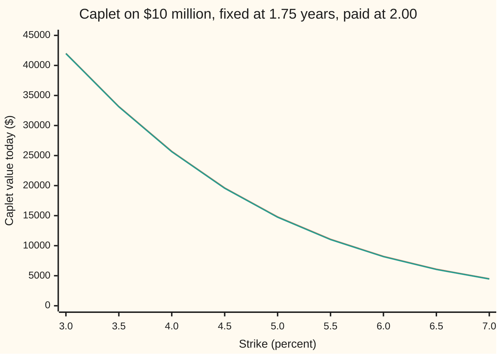

# Forward measures: a bond as the unit makes its forward rate a martingale

Financial mathematics → Forward-Rate Models → Pricing in bond units → Forward measures

---

## General Overview

A company pays a floating rate on a $10 million loan. One quarter worries it most: the three months from 1.75 years out to 2.00 years out. The rate for that quarter is looked up (fixed) at 1.75 years and the interest is paid at 2.00 years. Today's curve prices that quarter's rate at 4.75 percent. The company buys insurance: if the rate fixes above 5 percent, the insurer pays the excess on $10 million for a quarter of a year. That contract is a **caplet** ([caplets-and-floorlets](../29-Caps%2C%20Floors%20and%20Swaptions/01-caplets-and-floorlets.md)). It is the last quarter of the shelf's 2-year cap ([caps-floors-and-parity](../29-Caps%2C%20Floors%20and%20Swaptions/02-caps-floors-and-parity.md)), and the market prices it at **$14,793.71** with Black's formula.

Black's formula was built for a world where the bank rate stays fixed. Here the rate is the random thing: discounting and payoff both depend on it, and the two are tangled. Why should the formula still be right?

The answer is a choice of unit. Count every price not in dollars but in **bonds that pay $1 on the payment date**, 2.00 years out. In those units the discounting disappears, and the quarter's forward rate becomes a **fair bet**: its average future value, under the odds that go with this unit, equals its value today. A fair bet with a bell-curve spread in logs is exactly what Black's formula prices. The odds that go with a bond unit are called that date's **forward measure** (a measure is a set of probability weights on the possible outcomes).

**Price with the bond that pays on the payment date as the unit: the forward rate for that period then has no drift, so the caplet is that bond's price times the plain average of its payoff, and with a lognormal forward that average is Black's formula.**

**What kind of fact this is:** a theorem, proved on this card in Why it works; the lognormal spread that turns it into Black's formula is a model: an assumption that fits markets well enough, not a law.

### The picture: two units, one price

The code prices the caplet at nine strikes twice. Once with the payment-date bond as the unit and Black's formula. Once with a different unit, the bond that pays at the fixing date, by simulation, where the forward rate is no longer a fair bet and has to be given its exact drift.



Orange: Black's formula under the payment-date bond. Green: 200,000 simulated paths under the fixing-date bond, with the drift this card derives. The two lines sit on top of each other; the gap of about $45 is the simulation's own noise, the same at every strike because every strike uses the same paths (its standard error at the 5 percent strike is $66.94). Change the unit and the odds change with it, but the price does not.

---

## The formula

Notation first, in words. $P(t,T)$ is the price at time $t$ of a bond paying $1 at time $T$. The quarter runs from $T_1$ to $T_2$. The forward rate $F(t)$ is the simple (not compounded) rate for that quarter that can be locked in at time $t$ using those two bonds. A superscript on an expectation, $\mathbb{E}^{T_2}$, names the unit whose odds are used: the average is taken under the forward measure of date $T_2$, written $Q^{T_2}$.

$$F(t) = \frac{1}{\tau}\left(\frac{P(t,T_1)}{P(t,T_2)} - 1\right), \qquad \mathbb{E}^{T_2}\big[F(T_1)\big] = F(0),$$

$$V = P(0,T_2)\,\mathbb{E}^{T_2}\!\big[\tau\,(F(T_1) - K)^+\big] = \tau\,P(0,T_2)\,\big[F(0)\,N(d_1) - K\,N(d_2)\big].$$

**Read it aloud:** the forward rate is the growth from the fixing-date bond to the payment-date bond, per year; under the payment-date bond's odds it averages to today's value; so the caplet is that bond's price times the average payoff, which for a lognormal forward is Black's bracket.

| Symbol | Plain meaning | In our example | Push it up and the answer… |
| --- | --- | --- | --- |
| $V$ | the caplet's value today | $14,793.71 on $10 million | — |
| $P(t,T)$, $t$, $T$ | price at time $t$ (years from today) of $1 paid at time $T$; a **zero-coupon bond** | $P(0,1.75) = 0.923878$, $P(0,2.00) = 0.913036$ | a dearer payment-date bond raises $V$ in proportion |
| $T_1$, $T_2$ | fixing date (rate looked up) and payment date (interest paid) | 1.75 and 2.00 years | later fixing: more time to wander, dearer caplet |
| $\tau$ | the **accrual fraction**: the quarter's length in years | 0.25 | payment scales with it |
| $F(t)$, $F(0)$ | the forward rate for the quarter as seen at time $t$; today's value | $F(0) = 4.75\%$ | caplet dearer |
| $K$ | the strike: the capped rate | 5% | caplet cheaper |
| $\sigma$ | volatility: the yearly spread of the log of the forward rate | 30% | caplet dearer |
| $d_1$, $d_2$ | standardised distances of forward from strike, as for Black-76: $d_1 = [\ln(F(0)/K) + \tfrac12\sigma^2 T_1]/(\sigma\sqrt{T_1})$, $d_2 = d_1 - \sigma\sqrt{T_1}$ | 0.069184 and −0.327678 | — |
| $N(x)$ | the normal CDF: the chance a standard bell-curve draw lands below $x$ | $N(d_1) = 0.527579$, $N(d_2) = 0.371577$ | — |
| $Q^{T}$, $\mathbb{E}^{T}$, $X$, $Y$ | the forward measure of date $T$ (odds under which every traded price $X$, divided by $P(t,T)$, is a fair bet) and the average under it; $Y$ is any payoff being averaged | $T = 2.00$ for this caplet | — |
| $B(t)$, $Q$ | the bank account ($1 rolled at the overnight rate) and its odds, the risk-neutral measure | needs a full rate model; this card avoids it | — |
| $\mu$, $W$, $dW$ | extra drift of the forward per year, as a fraction of its level, under another unit; $W$ is the Brownian motion (random shock) under the odds in use, $dW$ its kick over a tiny time step | $\mu = \sigma^2\tau F/(1+\tau F)$ under $Q^{T_1}$ | a larger $\mu$ lifts the average forward |

A **fair bet** (the technical word is *martingale*) is a quantity whose average future value, given everything known now, equals its value now. A basis point (bp) is one hundredth of a percent.

### When it holds

- **Both bonds trade and are positive.** The unit must be a traded price that never hits zero, and the forward must be a ratio of traded prices. If the rate the contract fixes on comes off a different curve from the bonds used for discounting (the usual case since 2008), $F$ is no longer that ratio, and the fair-bet property needs a separate model of the spread between the curves.
- **The payment falls on $T_2$.** The unit must match the payment date. Pay the same amount at the fixing date instead and the payoff no longer lives in $T_2$ bonds; the price picks up a convexity adjustment (a correction from the curvature of the payoff in the rate).
- **The rate fixes at the start of the quarter.** That is how term rates (the old LIBOR, Term SOFR) work. A caplet on overnight SOFR compounded through the quarter is known only at $T_2$; $F$ is still a fair bet under $Q^{T_2}$, but it keeps moving, more and more slowly, until $T_2$. Conventions verified 2026-09-28.
- **The forward is lognormal with constant $\sigma$.** This is the model half. The fair-bet property is exact in any model; only Black's closed form needs the bell curve in logs. A market that prices each strike at its own volatility (a smile) is outside it.
- **Rates stay positive.** A lognormal forward cannot go below zero. Where rates can, desks switch to a normal or shifted-lognormal spread ([normal-and-shifted-volatilities-for-rates](../29-Caps%2C%20Floors%20and%20Swaptions/06-normal-and-shifted-volatilities-for-rates.md)); the fair-bet property survives the switch.

---

## Why it works

### Step 0: any positive traded price can serve as the unit

Prices in dollars already use a unit: the dollar held in the bank. Nothing forces that choice. A price can be quoted in ounces of gold, in shares of Acme, or in bonds that pay $1 in two years. No-arbitrage (no trade makes money for sure out of nothing) says one thing in every unit: there is a set of odds under which every price, divided by the unit, is a fair bet. Each unit has its own odds. The price is always the unit's price today times the average of the payoff counted in units. The trick of this card is to pick the unit that makes the average easy.

### Step 1: switching unit reweights the paths by the unit's growth

Start from the bank account $B(t)$ and its odds $Q$, the risk-neutral measure ([change-of-numeraire-in-pricing](../05-Black-Scholes%20from%20the%20Ground%20Up/05-change-of-numeraire-in-pricing.md)). Under $Q$, every price divided by $B(t)$ is a fair bet. To use the payment-date bond as the unit instead, reweight each path (one possible history of prices) by how well that bond did against the bank, relative to the start:

$$\text{weight of a path} = \frac{P(t,T_2)/B(t)}{P(0,T_2)/B(0)}.$$

These weights average to one under $Q$, because the bond counted in bank units is itself a fair bet. So they turn $Q$ into new odds, $Q^{T_2}$. Under $Q^{T_2}$, every price divided by $P(t,T_2)$ is a fair bet.

<details>
<summary>Detailed proof: every price in bond units is a fair bet under the reweighted odds</summary>

Write $Z(t) = \dfrac{P(t,T_2)/B(t)}{P(0,T_2)/B(0)}$. It is positive, starts at 1, and is a fair bet under $Q$ because $P(t,T_2)/B(t)$ is. Define $Q^{T_2}$ by giving each outcome up to time $T_2$ the weight $Z(T_2)$. Averages given what is known at time $t$ then change by Bayes' rule (the rule for reweighting a conditional average): for any payoff $Y$ settled at time $s \ge t$,
$$\mathbb{E}^{T_2}[Y \mid \text{now}] = \frac{\mathbb{E}^{Q}[Z(s)\,Y \mid \text{now}]}{Z(t)}.$$
Take $Y = X(s)/P(s,T_2)$ for a traded price $X$. Then $Z(s)\,Y = \dfrac{X(s)/B(s)}{P(0,T_2)/B(0)}$, a fair bet under $Q$, so its average is $\dfrac{X(t)/B(t)}{P(0,T_2)/B(0)}$. Divide by $Z(t)$: the answer is $X(t)/P(t,T_2)$. So $X/P(\cdot,T_2)$ is a fair bet under $Q^{T_2}$. The same three lines work for any positive traded unit; that is the change-of-numeraire theorem of Geman, El Karoui and Rochet (1995) ([change-of-numeraire](../../11-Stochastic%20processes%20and%20calculus/07-Changing%20Measure/05-change-of-numeraire.md)).

</details>

### Step 2: the forward rate is a traded price in bond units

Buy one bond paying $1 at 1.75 years and sell one paying $1 at 2.00 years. At 1.75 years, deposit the dollar received for one quarter at the rate then fixed. At 2.00 years the deposit returns more than the dollar owed, by the quarter's interest. So this pair of bonds is a traded portfolio worth $P(t,T_1) - P(t,T_2)$, and by the definition of $F(t)$ that equals $\tau\,F(t)\,P(t,T_2)$. Divide by the unit $P(t,T_2)$:

$$\frac{P(t,T_1) - P(t,T_2)}{P(t,T_2)} = \tau\,F(t).$$

The left side is a traded price in bond units, a fair bet under $Q^{T_2}$ by Step 1. So $\tau F(t)$ is a fair bet, and so is $F(t)$: $\mathbb{E}^{T_2}[F(T_1)] = F(0)$. No rate model was used, only the fact that both bonds trade.

### Step 3: the payoff in bond units is the payoff itself

The caplet pays $\tau\,(F(T_1) - K)^+$ dollars at $T_2$ (the $^+$ means "or zero, if negative"). At $T_2$ the unit bond is worth exactly $1, so in bond units the payoff is the same number. The price today is the unit's price times the average payoff in units:

$$V = P(0,T_2)\,\mathbb{E}^{T_2}\big[\tau\,(F(T_1) - K)^+\big].$$

All the randomness of discounting has gone into the unit. What is left to average is a call payoff on one number, $F(T_1)$, which by Step 2 has no drift.

### Step 4: add Black's model

Now the one modelling assumption: under $Q^{T_2}$ the forward moves as $dF = \sigma\,F\,dW$ with constant $\sigma$. No drift term appears, because Step 2 forbids one. So $\ln F(T_1)$ is a bell curve with centre $\ln F(0) - \tfrac12\sigma^2 T_1$ and spread $\sigma\sqrt{T_1}$. The average of a call payoff on such a number is the Black-76 bracket ([black-76-and-forward-level-pricing](../05-Black-Scholes%20from%20the%20Ground%20Up/06-black-76-and-forward-level-pricing.md)):

$$\mathbb{E}^{T_2}\big[(F(T_1) - K)^+\big] = F(0)\,N(d_1) - K\,N(d_2).$$

Multiply by $\tau\,P(0,T_2)$ and the caplet formula is proved. The two dates now have separate jobs, and the unit explains why: volatility runs to $T_1$, when the forward stops moving; discounting runs to $T_2$, the date of the unit.

### Step 5: a different unit gives the forward a drift

Use the fixing-date bond $P(t,T_1)$ as the unit instead. Under its odds, $Q^{T_1}$, the forward is no longer a fair bet. The two sets of odds differ by the ratio of the two units, which is $P(t,T_1)/P(t,T_2) = 1 + \tau F(t)$. Paths with a high forward rate get more weight under $Q^{T_1}$, so the forward's average rises. The rise has an exact size:

$$\mathbb{E}^{T_1}[F(T_1)] = \frac{F(0) + \tau\,F(0)^2\,e^{\sigma^2 T_1}}{1 + \tau F(0)} = 4.7595\%,$$

a lift of 0.9509 bp over today's 4.75 percent. The simulation, which knows nothing of this formula and only moves the forward step by step with the drift below, lands on 0.9486 bp, with a standard error of 0.0014 bp. In continuous time the reweighting adds to the forward's log a drift

$$\mu = \frac{\sigma^2\,\tau\,F}{1 + \tau F}\quad\text{per year}.$$

What is a fair bet under $Q^{T_1}$ is the traded pair of Step 2 divided by the new unit: $F/(1 + \tau F)$. The simulation's average of it misses $F(0)/(1+\tau F(0))$ by 0.0023 bp, well inside its standard error of 0.0074 bp.

<details>
<summary>The algebra behind the drift</summary>

Relative to $Q^{T_2}$, the odds $Q^{T_1}$ weight a path by $\dfrac{P(T_1,T_1)/P(T_1,T_2)}{P(0,T_1)/P(0,T_2)} = \dfrac{1 + \tau F(T_1)}{1 + \tau F(0)}$, by Step 1 with $P(t,T_2)$ in the place of the bank account. So $\mathbb{E}^{T_1}[F] = \mathbb{E}^{T_2}[F(1 + \tau F)]/(1 + \tau F(0))$. Under $Q^{T_2}$, $F$ is lognormal with mean $F(0)$, so $\mathbb{E}^{T_2}[F^2] = F(0)^2 e^{\sigma^2 T_1}$; that gives the exact mean above. For the drift: the weight's own shocks are $\tau\,\sigma F/(1 + \tau F)$ times $dW$. Girsanov's theorem (a change of odds shifts a Brownian motion by its covariance with the weight) replaces $dW^{T_2}$ by $dW^{T_1} + \sigma\tau F/(1 + \tau F)\,dt$. Put that into $dF = \sigma F\,dW^{T_2}$: $dF = \sigma^2 \tau F^2/(1 + \tau F)\,dt + \sigma F\,dW^{T_1}$, whose relative drift is $\mu$.

</details>

The price under $Q^{T_1}$ is the fixing-date bond times the average payoff counted in fixing-date bonds. The payoff paid at $T_2$ is worth $1/(1 + \tau F(T_1))$ fixing-date bonds per dollar at $T_1$, so

$$V = P(0,T_1)\,\mathbb{E}^{T_1}\!\left[\frac{\tau\,(F(T_1) - K)^+}{1 + \tau F(T_1)}\right].$$

The simulation gives $14,744.51 (standard error $66.94). Paired path by path with the same random draws under the payment-date unit, the two roads differ by −$0.27, standard error $0.84. Same price, different odds, as the chart showed.

### Step 6: the same fact for the instantaneous forward

The HJM card ([hjm-framework-and-the-drift-condition](01-hjm-framework-and-the-drift-condition.md)) found that under the bank-account odds the instantaneous forward for date $T$ drifts at its volatility times $\int_t^T\sigma(t,u)\,du$, the size of the $T$-bond's volatility. Switching to $Q^{T}$ shifts the Brownian motion by the bond's volatility, which removes exactly that drift. So every forward rate, instantaneous or over a quarter, is a fair bet under the forward measure of its own payment date. The bank-account unit needs the whole curve's volatility to set the drift; the payment-date unit needs none of it.

---

## Worked numbers, by hand

The shelf's curve: quarterly forwards 4.40% + 0.05% × i for quarters 0 to 7, each discount factor the previous one divided by $1 + \tau F$. Caplet 7: fixed at 1.75, paid at 2.00, strike 5%, $\sigma$ = 30%, $10 million.

| Step | Arithmetic | Value |
| --- | --- | --- |
| fixing-date bond $P(0,1.75)$ | chained from the curve | 0.923878 |
| payment-date bond $P(0,2.00)$ | $0.923878 / (1 + 0.25 \times 0.0475)$ | 0.913036 |
| forward $F(0)$ | $(0.923878 / 0.913036 - 1) / 0.25$ | 4.75% |
| spread to the fixing date, $\sigma\sqrt{T_1}$ | $0.30 \times \sqrt{1.75}$ | 0.396863 |
| $d_1$ | $[\ln(4.75/5) + 0.396863^2/2] / 0.396863$ | 0.069184 |
| $d_2$ | $0.069184 - 0.396863$ | −0.327678 |
| $N(d_1)$, $N(d_2)$ | bell-curve areas | 0.527579, 0.371577 |
| Black bracket | $4.75\% \times 0.527579 - 5\% \times 0.371577$ | 0.648111% |
| **caplet** | $\$10{,}000{,}000 \times 0.25 \times 0.913036 \times 0.648111\%$ | **$14,793.71** |

The insurer charges $14,793.71 today for one quarter's cover. No view on where rates will go enters, only their spread.

### What breaks if you drop a piece

| Mistake | Comes out at | What went wrong |
| --- | --- | --- |
| Discount from the fixing date, $P(0,1.75)$ | $14,969.39 | The unit and the payment date disagree: cash paid at 2.00 years was valued as if paid at 1.75 |
| Leave out the accrual fraction $\tau$ | $59,174.84 | A rate is not a payment: 5 percent for a quarter is a quarter of 5 percent |
| Run the volatility to the payment date, $\sqrt{2.00}$ | $15,975.10 | The forward stops moving when it fixes at 1.75; the last quarter adds no uncertainty |
| Fixing-date unit, forward left driftless | $14,663.64 | A fair bet under one unit is not one under another; the missing drift costs $130.07 |

The last error is also found by simulation, paired path by path against the correct road: −$129.31, against −$130.07 by quadrature.

```
Caplet price by method, $10 million  (one █ = $100, bars start at $14,500)
Correct, pay-date unit       ███                         $14,793.71
Fix-date unit, no drift      ██                          $14,663.64
Discounted from fix date     █████                       $14,969.39
Volatility to pay date       ███████████████             $15,975.10
```

---

## Code, from first principles, and it actually runs

The code prices the caplet by **three independent roads** and tests the fair-bet claims directly. Road 1 is Black's formula, with the bell-curve area built by a series in Python and by Simpson's rule (adding thin slices under the curve) in Rust. Road 2 averages the payoff over the driftless lognormal law by Simpson's rule, with no $d_1$ or $d_2$. Road 3 changes the unit to the fixing-date bond and simulates 200,000 paths (100,000 antithetic pairs: each set of random draws is used once as drawn and once with its signs flipped) in 35 steps, with the drift from Step 5 and a random-number generator written in the script. The same draws also run under the payment-date unit, so the two units can be compared path by path. Then the drift's exact size, the new fair bet $F/(1+\tau F)$, every what-breaks number and every chart point are printed.

### Python

```python
# Forward measures for rates -- the check behind the card.  Standard library only.
# Caplet 7 of the shelf's 2-year cap: the 3-month rate fixed at 1.75 years, paid
# at 2.00 years, strike 5%, lognormal volatility 30%, notional $10,000,000.
# 1 Black's formula: the pay-date bond is the unit, the forward rate has no drift
# 2 Simpson quadrature of the payoff over that driftless lognormal law
# 3 Monte Carlo with the FIX-date bond as the unit: the forward now carries the
#   drift sigma^2 tau F / (1 + tau F), and the payoff is valued in fix-date bonds
# 4 martingale tests: what averages to its starting value under which unit
from math import exp, log, sqrt, cos, pi

TAU, K, SIG, T1, T2, NOTL = 0.25, 0.05, 0.30, 1.75, 2.0, 1e7
FWD = [0.044 + 0.0005 * i for i in range(8)]          # the shelf's quarterly forwards
D = [1.0]
for f in FWD:
    D.append(D[-1] / (1 + TAU * f))                   # discount factors, chained
F0, P1, P2 = FWD[7], D[7], D[8]                       # forward, fix-date bond, pay-date bond

def ncdf(x):                                          # bell-curve area left of x, by its series
    if abs(x) > 8: return 0.0 if x < 0 else 1.0
    term, s, n = x, x, 0
    while abs(term) > 1e-17:
        n += 1
        term *= -x * x / (2 * n)
        s += term / (2 * n + 1)
    return 0.5 + s / sqrt(2 * pi)

def black(F, k, sig, t):                              # F N(d1) - k N(d2), per unit of rate
    v = sig * sqrt(t)
    d1 = (log(F / k) + v * v / 2) / v
    return F * ncdf(d1) - k * ncdf(d1 - v)

def quad(g, t=T1, n=40000):                            # E[g(F(t))], F driftless lognormal
    v, a, h = SIG * sqrt(t), -10.0, 20.0 / n
    tot = 0.0
    for i in range(n + 1):
        z = a + i * h
        w = 1 if i in (0, n) else (4 if i % 2 else 2)
        tot += w * g(F0 * exp(v * z - v * v / 2)) * exp(-z * z / 2) / sqrt(2 * pi)
    return tot * h / 3

state = 88172645463325252                             # 64-bit LCG, then Box-Muller
def unif():
    global state
    state = (6364136223846793005 * state + 1442695040888963407) % 2**64
    return ((state >> 11) + 0.5) / 2**53
def gauss():
    u1 = unif()
    return sqrt(-2 * log(u1)) * cos(2 * pi * unif())

STRIKES = [0.03 + 0.005 * j for j in range(9)]
PAIRS, STEPS = 100000, 35
dt = T1 / STEPS
pay1 = [0.0] * 9                                      # strike sweep, fix-date unit
s_d = s_dd = s1 = s11 = sh = shh = sf = sff = sn = snn = 0.0
for p in range(PAIRS):
    zs = [gauss() for _ in range(STEPS)]
    for sign in (1.0, -1.0):
        x = log(F0); y = log(F0)                      # x: fix-date unit (drift), y: pay-date unit
        for z in zs:
            F = exp(x)
            x += (SIG * SIG * TAU * F / (1 + TAU * F) - SIG * SIG / 2) * dt + SIG * sqrt(dt) * sign * z
            y += -SIG * SIG / 2 * dt + SIG * sqrt(dt) * sign * z
        Fx, Fy = exp(x), exp(y)
        for j in range(9):
            pay1[j] += P1 * TAU * max(Fx - STRIKES[j], 0) / (1 + TAU * Fx)
        c1 = P1 * TAU * max(Fx - K, 0) / (1 + TAU * Fx)
        s1 += c1; s11 += c1 * c1
        d = c1 - P2 * TAU * max(Fy - K, 0)            # same draws, the other unit
        s_d += d; s_dd += d * d
        h = Fx - Fy; sh += h; shh += h * h            # drift shift, paired
        g = Fx / (1 + TAU * Fx) - Fy / (1 + TAU * F0); sf += g; sff += g * g
        e = P1 * TAU * max(Fy - K, 0) / (1 + TAU * Fy) - c1   # drift forgotten, minus right
        sn += e; snn += e * e
M = 2 * PAIRS
def se(s, ss): return sqrt((ss / M - (s / M) ** 2) / M)

c_black = TAU * P2 * black(F0, K, SIG, T1) * NOTL
c_quad = TAU * P2 * quad(lambda F: max(F - K, 0)) * NOTL
c_mc1, se1 = s1 / M * NOTL, se(s1, s11) * NOTL
diff, se_d = s_d / M * NOTL, se(s_d, s_dd) * NOTL
mean_fix = (F0 + TAU * F0 * F0 * exp(SIG * SIG * T1)) / (1 + TAU * F0)
no_drift = P1 * TAU * quad(lambda F: max(F - K, 0) / (1 + TAU * F)) * NOTL
v = SIG * sqrt(T1); d1 = (log(F0 / K) + v * v / 2) / v
out = [
    ("fix-date bond P(0,1.75)", P1, 6), ("pay-date bond P(0,2.00)", P2, 6),
    ("forward F(0), percent", 100 * F0, 4), ("sigma sqrt(T1)", v, 6),
    ("d1", d1, 6), ("d2", d1 - v, 6), ("N(d1)", ncdf(d1), 6), ("N(d2)", ncdf(d1 - v), 6),
    ("F N(d1) - K N(d2), percent", 100 * black(F0, K, SIG, T1), 6),
    ("1 Black, pay-date unit $", c_black, 2), ("2 Simpson quadrature $", c_quad, 2),
    ("3 MC, fix-date unit + drift $", c_mc1, 2), ("  standard error $", se1, 2),
    ("  road 3 minus pay-date road, MC $", diff, 2), ("  its standard error $", se_d, 2),
    ("mean F(1.75) under fix-date unit %", 100 * mean_fix, 4),
    ("  its lift over F(0), bp, exact", 1e4 * (mean_fix - F0), 4),
    ("  its lift over F(0), bp, MC paired", 1e4 * sh / M, 4),
    ("  standard error, bp", 1e4 * se(sh, shh), 4),
    ("fair bet F/(1+tau F) gap, bp, MC", 1e4 * sf / M, 4),
    ("  standard error, bp", 1e4 * se(sf, sff), 4),
    ("wrong: discount from fix date $", TAU * P1 * black(F0, K, SIG, T1) * NOTL, 2),
    ("wrong: no accrual fraction $", P2 * black(F0, K, SIG, T1) * NOTL, 2),
    ("wrong: volatility to pay date $", TAU * P2 * black(F0, K, SIG, T2) * NOTL, 2),
    ("wrong: fix-date unit, no drift $", no_drift, 2),
    ("  its error, quadrature $", no_drift - c_black, 2),
    ("  its error, MC paired $", sn / M * NOTL, 2),
]
for name, val, dp in out:
    print(f"{name:<38}{val:>16.{dp}f}")
print("chart, strike %      " + " ".join(f"{100 * k:8.2f}" for k in STRIKES))
print("chart, Black $       " + " ".join(f"{TAU * P2 * black(F0, k, SIG, T1) * NOTL:8.0f}" for k in STRIKES))
print("chart, MC fix-date $ " + " ".join(f"{pay1[j] / M * NOTL:8.0f}" for j in range(9)))

assert abs(c_quad - c_black) < 1e-4, "quadrature road vs Black's formula"
assert abs(c_black - 14793.71) < 0.005, "caplet 7 as priced on the caps shelf"
assert abs(c_mc1 - c_black) < 4 * se1, "fix-date-unit simulation vs Black"
assert abs(diff) < 4 * se_d, "paired: fix-date road vs pay-date road, path by path"
assert abs(sh / M - (mean_fix - F0)) < 4 * se(sh, shh), "forward drifts under the fix-date unit, by the exact amount"
assert abs(sf / M) < 4 * se(sf, sff), "F/(1+tau F) is the fair bet there instead"
assert abs(sn / M * NOTL - (no_drift - c_black)) < 4 * se(sn, snn) * NOTL, "the no-drift error, two roads"
print("ALL CHECKS PASS")
```

**Ran 2026-09-28 on macOS, Python 3.14.6, standard library only. All checks passed. Output, pasted from the run:**

```
fix-date bond P(0,1.75)                       0.923878
pay-date bond P(0,2.00)                       0.913036
forward F(0), percent                           4.7500
sigma sqrt(T1)                                0.396863
d1                                            0.069184
d2                                           -0.327678
N(d1)                                         0.527579
N(d2)                                         0.371577
F N(d1) - K N(d2), percent                    0.648111
1 Black, pay-date unit $                      14793.71
2 Simpson quadrature $                        14793.71
3 MC, fix-date unit + drift $                 14744.51
  standard error $                               66.94
  road 3 minus pay-date road, MC $               -0.27
  its standard error $                            0.84
mean F(1.75) under fix-date unit %              4.7595
  its lift over F(0), bp, exact                 0.9509
  its lift over F(0), bp, MC paired             0.9486
  standard error, bp                            0.0014
fair bet F/(1+tau F) gap, bp, MC                0.0023
  standard error, bp                            0.0074
wrong: discount from fix date $               14969.39
wrong: no accrual fraction $                  59174.84
wrong: volatility to pay date $               15975.10
wrong: fix-date unit, no drift $              14663.64
  its error, quadrature $                      -130.07
  its error, MC paired $                       -129.31
chart, strike %          3.00     3.50     4.00     4.50     5.00     5.50     6.00     6.50     7.00
chart, Black $          42008    33163    25694    19610    14794    11063     8222     6084     4489
chart, MC fix-date $    41967    33116    25646    19561    14745    11017     8178     6048     4459
ALL CHECKS PASS
```

The quadrature road lands on Black's formula to the cent. The simulation under the other unit lands within one standard error; the paired comparison, with far less noise, finds no gap. The forward's lift matches its exact value within two standard errors. Another assert ties Black's price to the caps shelf's $14,793.71.

### Rust

Same checks, same random draws, a different route to the bell-curve area. No crates.

```rust
// Forward measures for rates -- the same check as forward_measures_for_rates_check.py.
// Standard library only, no crates.  Rust has no erf, so the bell-curve area is
// built by adding thin slices under the curve (Simpson), not by the Python series.
// Caplet 7 of the shelf's 2-year cap: fixed at 1.75 years, paid at 2.00, strike 5%,
// lognormal volatility 30%, $10,000,000.  Roads: Black under the pay-date bond,
// Simpson quadrature, Monte Carlo under the fix-date bond with the forward's drift.
use std::f64::consts::PI;

const TAU: f64 = 0.25; const K: f64 = 0.05; const SIG: f64 = 0.30;
const T1: f64 = 1.75; const T2: f64 = 2.0; const NOTL: f64 = 1e7;

fn phi(z: f64) -> f64 { (-z * z / 2.0).exp() / (2.0 * PI).sqrt() }

fn simpson<F: Fn(f64) -> f64>(f: F, a: f64, b: f64, n: usize) -> f64 {
    let h = (b - a) / n as f64;
    let mut s = f(a) + f(b);
    for i in 1..n { s += if i % 2 == 1 { 4.0 } else { 2.0 } * f(a + i as f64 * h); }
    s * h / 3.0
}

fn ncdf(x: f64) -> f64 {
    if x.abs() > 8.0 { return if x < 0.0 { 0.0 } else { 1.0 }; }
    0.5 + simpson(phi, 0.0, x, 4000)
}

fn black(f: f64, k: f64, sig: f64, t: f64) -> f64 {
    let v = sig * t.sqrt();
    let d1 = ((f / k).ln() + v * v / 2.0) / v;
    f * ncdf(d1) - k * ncdf(d1 - v)
}

fn quad<G: Fn(f64) -> f64>(f0: f64, g: G) -> f64 {    // E[g(F(T1))], F driftless lognormal
    let v = SIG * T1.sqrt();
    simpson(|z| g(f0 * (v * z - v * v / 2.0).exp()) * phi(z), -10.0, 10.0, 40000)
}

struct Lcg(u64);
impl Lcg {
    fn unif(&mut self) -> f64 {
        self.0 = self.0.wrapping_mul(6364136223846793005).wrapping_add(1442695040888963407);
        ((self.0 >> 11) as f64 + 0.5) / 9007199254740992.0
    }
    fn gauss(&mut self) -> f64 {
        let u1 = self.unif();
        (-2.0 * u1.ln()).sqrt() * (2.0 * PI * self.unif()).cos()
    }
}

fn main() {
    let fwd: Vec<f64> = (0..8).map(|i| 0.044 + 0.0005 * i as f64).collect();
    let mut d = vec![1.0_f64];
    for f in &fwd { let last = *d.last().unwrap(); d.push(last / (1.0 + TAU * f)); }
    let (f0, p1, p2) = (fwd[7], d[7], d[8]);

    let strikes: Vec<f64> = (0..9).map(|j| 0.03 + 0.005 * j as f64).collect();
    let (pairs, steps) = (100000usize, 35usize);
    let dt = T1 / steps as f64;
    let mut rng = Lcg(88172645463325252);
    let mut pay1 = [0.0_f64; 9];
    let (mut s_d, mut s_dd, mut s1, mut s11) = (0.0_f64, 0.0_f64, 0.0_f64, 0.0_f64);
    let (mut sh, mut shh, mut sf, mut sff, mut sn, mut snn) = (0.0_f64, 0.0, 0.0, 0.0, 0.0, 0.0);
    for _ in 0..pairs {
        let zs: Vec<f64> = (0..steps).map(|_| rng.gauss()).collect();
        for sign in [1.0_f64, -1.0] {
            let (mut x, mut y) = (f0.ln(), f0.ln());   // x: fix-date unit (drift), y: pay-date unit
            for z in &zs {
                let f = x.exp();
                x += (SIG * SIG * TAU * f / (1.0 + TAU * f) - SIG * SIG / 2.0) * dt + SIG * dt.sqrt() * sign * z;
                y += -SIG * SIG / 2.0 * dt + SIG * dt.sqrt() * sign * z;
            }
            let (fx, fy) = (x.exp(), y.exp());
            for j in 0..9 { pay1[j] += p1 * TAU * (fx - strikes[j]).max(0.0) / (1.0 + TAU * fx); }
            let c1 = p1 * TAU * (fx - K).max(0.0) / (1.0 + TAU * fx);
            s1 += c1; s11 += c1 * c1;
            let dd = c1 - p2 * TAU * (fy - K).max(0.0);
            s_d += dd; s_dd += dd * dd;
            let h = fx - fy; sh += h; shh += h * h;
            let g = fx / (1.0 + TAU * fx) - fy / (1.0 + TAU * f0); sf += g; sff += g * g;
            let e = p1 * TAU * (fy - K).max(0.0) / (1.0 + TAU * fy) - c1;
            sn += e; snn += e * e;
        }
    }
    let m = (2 * pairs) as f64;
    let se = |s: f64, ss: f64| ((ss / m - (s / m).powi(2)) / m).sqrt();

    let c_black = TAU * p2 * black(f0, K, SIG, T1) * NOTL;
    let c_quad = TAU * p2 * quad(f0, |f| (f - K).max(0.0)) * NOTL;
    let (c_mc1, se1) = (s1 / m * NOTL, se(s1, s11) * NOTL);
    let (diff, se_d) = (s_d / m * NOTL, se(s_d, s_dd) * NOTL);
    let mean_fix = (f0 + TAU * f0 * f0 * (SIG * SIG * T1).exp()) / (1.0 + TAU * f0);
    let no_drift = p1 * TAU * quad(f0, |f| (f - K).max(0.0) / (1.0 + TAU * f)) * NOTL;
    let v = SIG * T1.sqrt();
    let d1 = ((f0 / K).ln() + v * v / 2.0) / v;
    let out: Vec<(&str, f64, usize)> = vec![
        ("fix-date bond P(0,1.75)", p1, 6), ("pay-date bond P(0,2.00)", p2, 6),
        ("forward F(0), percent", 100.0 * f0, 4), ("sigma sqrt(T1)", v, 6),
        ("d1", d1, 6), ("d2", d1 - v, 6), ("N(d1)", ncdf(d1), 6), ("N(d2)", ncdf(d1 - v), 6),
        ("F N(d1) - K N(d2), percent", 100.0 * black(f0, K, SIG, T1), 6),
        ("1 Black, pay-date unit $", c_black, 2), ("2 Simpson quadrature $", c_quad, 2),
        ("3 MC, fix-date unit + drift $", c_mc1, 2), ("  standard error $", se1, 2),
        ("  road 3 minus pay-date road, MC $", diff, 2), ("  its standard error $", se_d, 2),
        ("mean F(1.75) under fix-date unit %", 100.0 * mean_fix, 4),
        ("  its lift over F(0), bp, exact", 1e4 * (mean_fix - f0), 4),
        ("  its lift over F(0), bp, MC paired", 1e4 * sh / m, 4),
        ("  standard error, bp", 1e4 * se(sh, shh), 4),
        ("fair bet F/(1+tau F) gap, bp, MC", 1e4 * sf / m, 4),
        ("  standard error, bp", 1e4 * se(sf, sff), 4),
        ("wrong: discount from fix date $", TAU * p1 * black(f0, K, SIG, T1) * NOTL, 2),
        ("wrong: no accrual fraction $", p2 * black(f0, K, SIG, T1) * NOTL, 2),
        ("wrong: volatility to pay date $", TAU * p2 * black(f0, K, SIG, T2) * NOTL, 2),
        ("wrong: fix-date unit, no drift $", no_drift, 2),
        ("  its error, quadrature $", no_drift - c_black, 2),
        ("  its error, MC paired $", sn / m * NOTL, 2),
    ];
    for (name, val, dp) in &out { println!("{:<38}{:>16.*}", name, *dp, val); }
    let row = |xs: Vec<f64>| xs.iter().map(|x| format!("{:8.0}", x)).collect::<Vec<_>>().join(" ");
    let strike_row: Vec<String> = strikes.iter().map(|k| format!("{:8.2}", 100.0 * k)).collect();
    println!("chart, strike %      {}", strike_row.join(" "));
    println!("chart, Black $       {}", row(strikes.iter().map(|&k| TAU * p2 * black(f0, k, SIG, T1) * NOTL).collect()));
    println!("chart, MC fix-date $ {}", row(pay1.iter().map(|p| p / m * NOTL).collect()));

    assert!((c_quad - c_black).abs() < 1e-4, "quadrature road vs Black's formula");
    assert!((c_black - 14793.71).abs() < 0.005, "caplet 7 as priced on the caps shelf");
    assert!((c_mc1 - c_black).abs() < 4.0 * se1, "fix-date-unit simulation vs Black");
    assert!(diff.abs() < 4.0 * se_d, "paired: fix-date road vs pay-date road, path by path");
    assert!((sh / m - (mean_fix - f0)).abs() < 4.0 * se(sh, shh), "forward drifts under the fix-date unit");
    assert!((sf / m).abs() < 4.0 * se(sf, sff), "F/(1+tau F) is the fair bet there instead");
    assert!((sn / m * NOTL - (no_drift - c_black)).abs() < 4.0 * se(sn, snn) * NOTL, "the no-drift error, two roads");
    println!("ALL CHECKS PASS");
}
```

**Ran 2026-09-28 on macOS, rustc 1.98.1, no crates. All checks passed. Output, pasted from the run:**

```
fix-date bond P(0,1.75)                       0.923878
pay-date bond P(0,2.00)                       0.913036
forward F(0), percent                           4.7500
sigma sqrt(T1)                                0.396863
d1                                            0.069184
d2                                           -0.327678
N(d1)                                         0.527579
N(d2)                                         0.371577
F N(d1) - K N(d2), percent                    0.648111
1 Black, pay-date unit $                      14793.71
2 Simpson quadrature $                        14793.71
3 MC, fix-date unit + drift $                 14744.51
  standard error $                               66.94
  road 3 minus pay-date road, MC $               -0.27
  its standard error $                            0.84
mean F(1.75) under fix-date unit %              4.7595
  its lift over F(0), bp, exact                 0.9509
  its lift over F(0), bp, MC paired             0.9486
  standard error, bp                            0.0014
fair bet F/(1+tau F) gap, bp, MC                0.0023
  standard error, bp                            0.0074
wrong: discount from fix date $               14969.39
wrong: no accrual fraction $                  59174.84
wrong: volatility to pay date $               15975.10
wrong: fix-date unit, no drift $              14663.64
  its error, quadrature $                      -130.07
  its error, MC paired $                       -129.31
chart, strike %          3.00     3.50     4.00     4.50     5.00     5.50     6.00     6.50     7.00
chart, Black $          42008    33163    25694    19610    14794    11063     8222     6084     4489
chart, MC fix-date $    41967    33116    25646    19561    14745    11017     8178     6048     4459
ALL CHECKS PASS
```

The two outputs agree line for line, the simulations included: both scripts use the same generator and the same seed.

> [!TIP]
> **Try changing**
> Guess the direction first. Then run it.
> - **Lower the strike to 4 percent.** Every quarter where the rate fixes between 4 and 5 percent now pays too. The chart row gives **$25,694** by Black and **$25,646** by simulation under the fixing-date unit.
> - **Delete the drift from road 3.** In the line that updates `x`, replace the `SIG * SIG * TAU * F / (1 + TAU * F)` term with 0. The paired check fails: the price drops by about **$130**, the forgotten-drift error in the what-breaks table.
> - **Discount road 3 with the wrong bond.** Replace `P1` by `P2` in the line that sets `c1`. The unit and its odds no longer match and the paired check fails.
> - **Quarter the number of paths.** Set `PAIRS = 25000`. The standard errors roughly double; the asserts still pass, because every tolerance is set by the simulation's own noise.

---

## The usual mistake

> [!warning]
> **Reading the forward rate as the market's forecast of the future rate.** It is the average future rate only under the odds of its own payment-date bond. Under the fixing-date bond's odds the average is 4.7595 percent, not 4.75. Under real-world odds nothing ties the two at all: the forward carries whatever risk premium investors demand. "The forward is a fair bet" is always a statement about one named unit.
>
> Smaller traps, each with the wrong number it produces:
> - **Discounting from the fixing date.** $14,969.39 instead of $14,793.71. The unit is the payment-date bond, so discount to the payment date.
> - **Running the volatility to the payment date.** $15,975.10. The rate is fixed at 1.75 years; after that it cannot move.
> - **Switching unit without switching drift.** Pricing in fixing-date bonds with a driftless forward gives $14,663.64. Every unit has its own drift for the same rate.
> - **Using one forward measure for several dates at once.** A cap is fine: its caplets are priced separately and added, each in its own unit. A product whose payoff mixes several rates cannot be; it needs one common unit and the drifts that go with it, which is the market model's job.

---

## Where you meet it in real life

- **Every cap and floor quote.** Brokers quote caplet volatilities that go into exactly the formula of Step 4, one caplet per quarter, each under its own forward measure. See [caps-floors-and-parity](../29-Caps%2C%20Floors%20and%20Swaptions/02-caps-floors-and-parity.md).
- **Swaptions.** The same trick with a different unit: the annuity (the value of a strip of payment-date bonds) makes the forward swap rate a fair bet. See [the-annuity-measure](../29-Caps%2C%20Floors%20and%20Swaptions/05-the-annuity-measure.md).
- **Convexity adjustments.** A payment made on the wrong date for its rate, such as a rate paid at its fixing date, is priced by Step 5: the drift of the rate under the unit of the actual payment date is the adjustment.
- **Monte Carlo for many rates.** A simulation of the whole curve must pick one unit for all dates, often the last bond (the terminal measure). Only the last forward is then driftless; each earlier one gets a drift of the Step 5 kind. See [libor-and-sofr-market-models](03-libor-and-sofr-market-models.md).
- **Bond options.** Jamshidian (1989) priced an option on a bond in a Gaussian rate model by the same unit change, which turns the option into a Black-type formula on the bond's forward price.

> **Say it back**
> A price can be counted in any positive traded unit, and each unit comes with its own odds under which prices in that unit are fair bets. Counted in bonds that pay on the caplet's payment date, a quarter's forward rate is a ratio of traded prices, so it has no drift. The caplet is then that bond's price times its average payoff, and with a lognormal forward that average is Black's bracket, volatility running to the fixing date. Under any other unit the same rate drifts, by an amount the change of odds fixes exactly. The price does not depend on the unit; only the ease of computing it does.

---

## What this builds on

- [hjm-framework-and-the-drift-condition](01-hjm-framework-and-the-drift-condition.md): forward rates under the bank-account odds, and the drift no-arbitrage forces on them. This card removes that drift by changing the unit.
- [change-of-numeraire](../../11-Stochastic%20processes%20and%20calculus/07-Changing%20Measure/05-change-of-numeraire.md): the general theorem that any positive traded price can be the unit, with its own odds. Step 1 applies it to a bond.

## Where this goes next

- [libor-and-sofr-market-models](03-libor-and-sofr-market-models.md): many quarterly forwards simulated together under one unit, with the Step 5 drift for every forward whose own unit was not chosen.

Each caplet here was priced in its own unit, which works only while each payoff depends on one rate; the open question is how to move all the forwards at once when a product depends on several of them.

---

## Sources

Verified 2026-09-28: every link below resolves to the publisher's page.

- Geman, Hélyette, Nicole El Karoui, and Jean-Charles Rochet. "Changes of Numéraire, Changes of Probability Measure and Option Pricing." *Journal of Applied Probability* 32, no. 2 (1995): 443–458. [doi:10.2307/3215299](https://doi.org/10.2307/3215299). The change-of-numeraire theorem of Step 1, and forward measures by name.
- Jamshidian, Farshid. "An Exact Bond Option Formula." *Journal of Finance* 44, no. 1 (1989): 205–209. [doi:10.1111/j.1540-6261.1989.tb02413.x](https://doi.org/10.1111/j.1540-6261.1989.tb02413.x). The first use of a bond as the unit to price a rate option.
- Black, Fischer. "The Pricing of Commodity Contracts." *Journal of Financial Economics* 3, no. 1–2 (1976): 167–179. [doi:10.1016/0304-405X(76)90024-6](https://doi.org/10.1016/0304-405X(76)90024-6). The formula for options on forwards that Step 4 justifies for rates.
- Brigo, Damiano, and Fabio Mercurio. *Interest Rate Models — Theory and Practice*, 2nd ed. Springer, 2006. [doi:10.1007/978-3-540-34604-3](https://doi.org/10.1007/978-3-540-34604-3). Forward measures, caplet pricing and the drifts under other units, in full.
