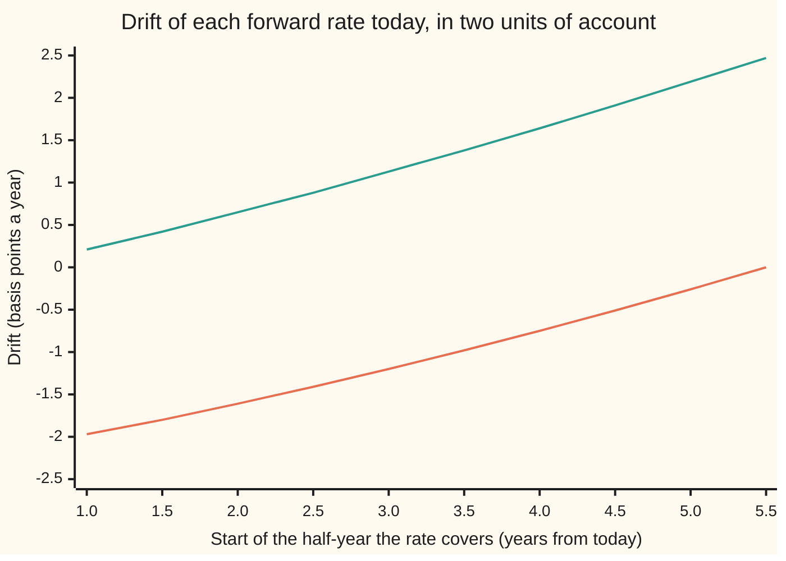

# Market models: lognormal forward rates, the drift under one terminal measure, and simulation

[Syllabus](../../../SYLLABUS.md) → [Financial mathematics](../../../SYLLABUS.md#w12) → [Forward-Rate Models](../../../SYLLABUS.md#w12-s31) → Market models

---

## General Overview

A rates desk looks at ten future half-years, starting one year from today and ending six years out. For each one the market quotes a **forward rate**: the simple interest rate that can be locked in today for a loan over that half-year. On this card the ten rates run 3.0%, 3.1%, and so on up to 3.9%.

A **caplet** (a contract that pays when one of those rates ends above a strike) needs only one of the ten rates. A **swaption** (an option, exercisable in one year, to enter a five-year swap paying a fixed rate against the floating rates) needs all ten at once. Its payoff depends on how the ten rates move together.

A **market model** gives each forward rate its own lognormal law: each rate moves in proportion to its own level, with its own volatility, so it can never fall below zero. Measured in the right unit, each rate has no drift at all. That is why the model reproduces the market's own caplet formula (Black's 1976 formula, **Black-76**) exactly, and why dealers adopted it in the late 1990s.

The trouble starts with the swaption. Ten rates, each driftless in its own unit, cannot all be driftless in one shared unit. Simulate them together in the unit of the bond that pays at year 6 (the **terminal bond**) and nine of the ten rates pick up a drift. The drift is not a choice: no-arbitrage fixes it from the curve and the volatilities. For the first rate it is −0.6571% of its level a year, about −1.97 basis points a year (a basis point is 0.01%). Leave it out and the swaption on $1,000,000 comes out $289.62 too dear.

The drift depends on the rates themselves, so it changes along every simulated path. A **predictor-corrector step** handles that: take a trial step with the drift frozen, recompute the drift on the trial curve, then redo the step with the average of the two drifts.

**Give each forward rate a lognormal law that is driftless in its own payment bond's unit; to simulate them all in the unit of the last bond, each earlier rate must drift down by its covariance with the later rates, weighted by how much each later rate moves its bond.**

**What kind of fact this is:** a model: an assumption that fits caplet markets well enough, not a law. Inside the model, the drift is a theorem, proved on this card in Why it works, and the time step is an approximation, with its error measured in the code.

### The picture: the forced drift across the strip



Orange: drift in the unit of the terminal bond, paying at year 6. The last rate is driftless; each earlier rate has more later rates to answer to, so it drifts down harder. Green: drift in the unit of the first bond, paying at year 1. Every rate now drifts up, and the pattern runs the other way. Same model, same prices, two bookkeeping units.

---

## The formula

Notation first, in words. The ten rates are numbered 0 to 9; $L_i$ is rate number $i$. Two random shocks drive the whole curve, so each rate's volatility is a list of two numbers, one per shock, written $\sigma_i$. A raised dot between two such lists, $\sigma_i\cdot\sigma_j$, means multiply matching entries and add: it is the covariance per year of the two rates' logarithms. $Q^{T}$ names the **pricing rule** that uses the bond paying at date $T$ as its unit (the sibling card [Forward measures](02-forward-measures-for-rates.md) builds it).

The bond identity that defines a forward rate:

$$1 + \delta\,L_i(t) \;=\; \frac{P(t,T_i)}{P(t,T_{i+1})}.$$

The model, in the unit of rate $i$'s own payment bond:

$$\frac{dL_i}{L_i} \;=\; \sigma_i\cdot dW^{\,T_{i+1}}.$$

The same rates, all in the unit of the terminal bond:

$$\boxed{\;\frac{dL_i}{L_i} \;=\; \mu_i\,dt \;+\; \sigma_i\cdot dW^{\,T_{10}},\qquad \mu_i \;=\; -\sum_{j=i+1}^{9} a_j\;\sigma_i\cdot\sigma_j,\qquad a_j \;=\; \frac{\delta L_j}{1+\delta L_j}\;}$$

**Read it aloud:** in the last bond's unit, each rate drifts down by the sum, over every later rate, of that later rate's weight times the covariance of the two.

| Symbol | Plain meaning | In our example | Push it up and the answer… |
| --- | --- | --- | --- |
| $L_i$, $L_j$, $L_i(t)$, $L_0$, $L_9$, $\hat L_i$ | forward rate number $i$, seen at time $t$; $\hat L_i$ is the trial value inside one step | $L_i(0) = 3.0\% + 0.1\% \times i$ | a higher later rate deepens earlier drifts |
| $T_i$, $T$, $T_0$, $T_1$, $T_{10}$, $t$, $i$, $j$ | rate $i$ covers $T_i$ to $T_{i+1}$; $T_i = 1 + 0.5\,i$ years; $t$ is now | $T_0 = 1$, $T_{10} = 6$ | — |
| $\delta$ | length of each period, in years | 0.5 | larger weights $a_j$ |
| $P(t,T)$, $P$, $D_i$ | price at time $t$ of $1 paid at $T$; $D_i$ is the $T_{i+1}$ bond counted in year-6 bonds | $P(0,T_0) = 0.970446$, $P(0,T_{10}) = 0.817897$ | — |
| $\sigma_i$, $\sigma_0$ | rate $i$'s volatility, one entry per shock, per square-root year | $\sigma_i = (0.20 - 0.005\,i,\; 0.08 + 0.003\,i)$; size of $\sigma_0$ is 21.5407% | drift grows with the square |
| $a_j$ | rate $j$'s **weight**: how much a 1% move in $L_j$ moves its bond ratio | about $\delta L_j$, near 0.015 | — |
| $\mu_i$, $\mu_0$ | drift of $L_i$, as a fraction of its level per year | $\mu_0 = -0.6571\%$, $\mu_9 = 0$ | — |
| $W$, $dW$, $\Delta W$, $z$ | the two shared shocks (Brownian motions); $\Delta W$ is their move over one step, $\sqrt{h}\,z$ with $z$ a pair of bell-curve draws | $z = (0.2, -0.4)$ in the hand step | — |
| $h$ | length of one time step, in years | 0.25 | bigger steps, bigger bias |
| $Q^{T}$ | pricing rule whose unit is the bond paying at $T$ | $Q^{T_{10}}$, the terminal rule | — |
| $K$, $S_0$ | strikes: caplet 3%; swaption at today's swap rate | $S_0 = 3.435718\%$ | — |
| $N$, $d_1$, $\bar\sigma$ | bell-curve area, and Black-76's distance-to-strike with volatility $\bar\sigma$ | $d_1 = 0.107703$, $\bar\sigma = 21.5407\%$ | — |

The predictor-corrector step, from $L_i$ to the next reading over a step of length $h$:

$$\hat L_i = L_i\,e^{(\mu_i(L) - \frac12 \sigma_i\cdot\sigma_i)h + \sigma_i\cdot\Delta W},\qquad L_i^{\text{new}} = L_i\,e^{\frac12(\mu_i(L) + \mu_i(\hat L))h - \frac12 \sigma_i\cdot\sigma_i\,h + \sigma_i\cdot\Delta W}.$$

In words: step once with today's drift; recompute every drift on that trial curve; step again from the start with the average drift and the same shock.

### When it holds

- **Rates stay positive.** A lognormal rate cannot cross zero. Euro and yen rates sat below zero for much of 2014 to 2022; there a desk shifts every rate by a constant first (a displaced market model), or the model cannot price the book at all.
- **Volatilities are fixed in advance.** Each $\sigma_i$ is a known number, so each caplet has one Black-76 volatility at every strike. Real caplet prices show a smile (different volatilities at different strikes); fitting it needs a random volatility on top, and this card's prices away from the money are then off.
- **One curve.** The same bonds set the forward rates and discount the cash. Since 2008 desks project and discount on separate curves; the drift weights then come from the discount curve, and a one-curve drift misprices multi-rate payoffs.
- **The rate is known when its period starts.** That was LIBOR: fixed at $T_i$, paid at $T_{i+1}$. A SOFR coupon compounds a daily overnight rate through the period and is known only at its end. Before the period starts, the expected compounded rate still satisfies the bond identity above, so the model carries over; inside the period it needs the extension of Lyashenko and Mercurio (see Sources).
- **The step is an approximation.** The corrector cuts the average error; it does not make the discrete step exact, and a step that crosses a reset date must stop there and freeze the rate that fixed.

Conventions verified 28 Sep 2026: the UK regulator's announcement of 5 March 2021 ended the sterling, euro, Swiss franc, yen and some dollar LIBOR panels after 31 December 2021 and the remaining US dollar panels after 30 June 2023.

---

## Why it works

### Step 0: a forward rate is a price measured in another bond's unit

$1 + \delta L_i$ is the $T_i$ bond's price divided by the $T_{i+1}$ bond's price. So it is the price of a traded thing, counted in units of another traded thing. The sibling card [Forward measures](02-forward-measures-for-rates.md) proves that any traded price, counted in units of the $T_{i+1}$ bond, is a **fair bet** under $Q^{T_{i+1}}$: its expected future value equals its value today. A fair bet has no drift. That is the whole reason a market model exists: each rate has a unit in which it is driftless, and in that unit a lognormal law gives the market's Black-76 caplet formula.

### Step 1: the model is a choice; the caplet is its reward

Choose $dL_i/L_i = \sigma_i\cdot dW^{T_{i+1}}$. Then $L_0(T_0)$ is lognormal around today's 3% with log-volatility $\bar\sigma = 21.5407\%$ (the size of $\sigma_0$) over one year. The caplet pays $\delta(L_0 - K)^+$ at $T_1$, so its price is Black's 1976 formula:

$$\text{caplet} = \delta\,P(0,T_1)\big[L_0 N(d_1) - K N(d_1 - \bar\sigma\sqrt{T_0})\big],\qquad d_1 = \frac{\ln(L_0/K) + \frac12\bar\sigma^2 T_0}{\bar\sigma\sqrt{T_0}}.$$

On $1,000,000 that is $1,230.06.

### Step 2: switching units costs an exchange rate

To simulate all ten rates on one path, all must be counted in one unit. Pick the terminal bond, $P(t,T_{10})$. The exchange rate from rate $i$'s own unit to the terminal unit is the ratio of the two bonds. By the bond identity, applied link by link, it telescopes:

$$D_i \;=\; \frac{P(t,T_{i+1})}{P(t,T_{10})} \;=\; \prod_{j=i+1}^{9}\big(1 + \delta L_j\big).$$

Only the later rates appear. For the last rate, $i = 9$, the product is empty and equals 1: its own unit already is the terminal unit.

### Step 3: how hard the exchange rate shakes

Take logarithms: $\ln D_i$ is a sum of $\ln(1 + \delta L_j)$. A 1% relative move in $L_j$ moves $\ln(1+\delta L_j)$ by $a_j = \delta L_j/(1+\delta L_j)$ percent. So the shock part of $\ln D_i$ is $\sum_{j>i} a_j\,\sigma_j\cdot dW$. Its covariance with $\ln L_i$, per year, is $\sum_{j>i} a_j\,\sigma_i\cdot\sigma_j$.

### Step 4: changing units shifts the shock by that covariance

Girsanov's theorem (a change of pricing rule tilts the odds of every path, and the tilt shows up as a drift equal to a covariance) says: moving from the $T_{i+1}$ unit to the terminal unit shifts the shock by minus the exchange rate's volatility. Rate $i$ picks up the drift

$$\mu_i = -\,\sigma_i\cdot\sum_{j=i+1}^{9} a_j\,\sigma_j.$$

Why minus. The terminal rule keeps score in year-6 bonds. On paths where the later rates end high, one $T_{i+1}$ bond buys many year-6 bonds. So the terminal rule must give those paths less weight than rate $i$'s own rule does, or the $T_{i+1}$ bond would be overpriced. Rate $i$ rises with the later rates (the covariance is positive), so down-weighting their high paths drags rate $i$ down. For $L_0$ that drag is nine terms, each about 0.07% a year, totalling −0.6571%.

<details>
<summary>Detailed proof</summary>

Work on $[0, T_0]$, before any rate resets, with the natural history of the two-shock Brownian motion $W^{10}$ under $Q^{T_{10}}$ and fixed, bounded volatilities.

*Existence.* Build the rates backward. $L_9$ is a driftless lognormal. Given $L_{i+1}, \dots, L_9$, the drift $\mu_i$ is a known bounded process (each $a_j$ lies between 0 and 1), so $L_i(t) = L_i(0)\exp\big(\int_0^t (\mu_i - \frac12 \sigma_i\cdot\sigma_i)\,ds + \int_0^t \sigma_i\cdot dW^{10}\big)$ is positive and satisfies the boxed equation by Itô's lemma.

*The exchange rate is a fair bet.* Itô on $\ln(1+\delta L_j)$ gives shock $a_j\sigma_j\cdot dW^{10}$ and drift $a_j\mu_j - \frac12 a_j^2\,\sigma_j\cdot\sigma_j$. Sum over $j > i$ and insert $\mu_j = -\sum_{k>j} a_k\,\sigma_j\cdot\sigma_k$. The cross terms $-\sum_{j<k} a_j a_k\,\sigma_j\cdot\sigma_k$ and the squares $-\frac12\sum_j a_j^2\,\sigma_j\cdot\sigma_j$ add to exactly $-\frac12\,\theta_i\cdot\theta_i$ with $\theta_i = \sum_{j>i} a_j\sigma_j$. So $D_i(t)/D_i(0) = \exp\big(\int \theta_i\cdot dW^{10} - \frac12\int \theta_i\cdot\theta_i\,ds\big)$: a stochastic exponential with bounded loading, hence a true fair bet with average 1. That is exactly what no-arbitrage demands of the $T_{i+1}$ bond counted in year-6 bonds, so the drift is the right one.

*Back to rate $i$'s own unit.* Use $D_i(T_0)/D_i(0)$ as the density of $Q^{T_{i+1}}$ against $Q^{T_{10}}$. Girsanov's theorem for bounded loadings makes $W^{T_{i+1}} = W^{10} - \int \theta_i\,ds$ a Brownian motion under $Q^{T_{i+1}}$. Substituting, $dL_i/L_i = \mu_i\,dt + \sigma_i\cdot(dW^{T_{i+1}} + \theta_i\,dt) = \sigma_i\cdot dW^{T_{i+1}}$, since $\mu_i = -\sigma_i\cdot\theta_i$. Driftless, as the model said. The same calculation over $j \ge i$ shows every bond ratio $P(t,T_i)/P(t,T_{10})$ is a fair bet under the terminal rule, which is what the code's bond-ratio test checks by simulation.

</details>

### Step 5: the step, and why it is taken in logarithms

By Itô's lemma, $\ln L_i$ moves by $(\mu_i - \frac12\sigma_i\cdot\sigma_i)\,dt + \sigma_i\cdot dW$. Over a step of length $h$ with fixed volatilities, the shock part is exactly $\sigma_i\cdot\Delta W$ and the half-variance part is exactly $\frac12\sigma_i\cdot\sigma_i\,h$. Only the drift part is unknown, because $\mu_i$ depends on where the whole curve wanders during the step. Plain Euler, in log form, uses the drift at the start. The trapezoid rule would average the drift at both ends, but the end is not known yet. The predictor supplies a trial end; the corrector averages. Because every update multiplies $L_i$ by an exponential, no step can make a rate negative. [Stepping an SDE](../06-Numerical%20Methods%20for%20Pricing/05-discretisation-schemes-for-sdes.md) explains why any time step is an approximation and how its error is measured.

### The other door: the first bond's unit

Count everything in the bond paying at $T_0$ instead. The exchange rate becomes $\prod_{j=0}^{i}(1+\delta L_j)^{-1}$, which involves the earlier rates and the rate itself, and the drift flips sign: $\mu_i = +\,\sigma_i\cdot\sum_{j=0}^{i} a_j\sigma_j$ (the green line in the chart). Different paths, different weights, same prices: the code prices the caplet and the swaption both ways and they agree within the noise. Modelling the swap rate itself as the lognormal quantity, instead of the forward rates, is [Swap market model](05-swap-market-model-in-outline.md); the continuous-maturity parent of this whole construction is [Heath-Jarrow-Morton](01-hjm-framework-and-the-drift-condition.md).

---

## Worked numbers, by hand

The strip: $L_i(0) = 3.0\%, 3.1\%, \dots, 3.9\%$, $\delta = 0.5$, the first reset at one year, $P(0,T_0) = e^{-0.03} = 0.970446$.

| Step | Arithmetic | Value |
| --- | --- | --- |
| bond at year 6 | $0.970446 / (1.015 \times 1.0155 \times \dots \times 1.0195)$ | $P(0,T_{10}) = 0.817897$ |
| swap annuity | $0.5 \times$ (sum of the ten bonds $P(0,T_1)$ to $P(0,T_{10})$) | 4.440084 |
| swap rate | $(0.970446 - 0.817897) / 4.440084$ | $S_0 = 3.435718\%$ |
| drift of $L_0$, nine terms | $a_j\,\sigma_0\cdot\sigma_j$ for $j = 1..9$: 0.0697%, 0.0707%, …, 0.0757% | sum 0.6571% |
| $\mu_0$ | minus that sum | $-0.6571\%$ a year |
| in basis points | $-0.006571 \times 3\%$ | $-1.97$ bp a year |

Now one predictor-corrector step for $L_0$ over a quarter-year, $h = 0.25$, with shock draws $z = (0.2, -0.4)$, so $\Delta W = (0.1, -0.2)$:

| Step | Arithmetic | Value |
| --- | --- | --- |
| shock | $0.20 \times 0.1 + 0.08 \times (-0.2)$ | 0.004000 |
| half-variance | $\frac12 \times (0.20^2 + 0.08^2) \times 0.25$ | 0.005800 |
| predicted log move | $-0.006571 \times 0.25 - 0.005800 + 0.004000$ | $-0.00344287$ |
| predicted rate | $3\% \times e^{-0.00344287}$ | $\hat L_0 = 2.989689154\%$ |
| drift on the predicted curve | recompute all nine terms | $-0.652485\%$ a year |
| corrected log move | $\frac12(-0.657147\% - 0.652485\%) \times 0.25 - 0.005800 + 0.004000$ | $-0.00343704$ |
| **corrected rate** | $3\% \times e^{-0.00343704}$ | **$2.989706578\%$** |

The corrector moved $L_0$ up by less than a hundredth of a basis point on this step. The correction grows with volatility, rate level and horizon. The last rate, $L_9$, has no drift, so its predicted and corrected values are both 3.859903963%.

Priced over 24,000 simulated paths (four such steps to year 1), the 1-year-into-5-year payer swaption (the holder pays fixed) struck at 3.435718% is worth **$12,146.26** on $1,000,000, standard error $105.22. The same paths in the first bond's unit give $12,151.13, a difference of $4.87 with standard error $8.60: two units, one price.

### What breaks if you drop a piece

Each row reuses the correct price's random numbers, so the differences are measured far more precisely than the prices.

| Mistake | Comes out at | What went wrong |
| --- | --- | --- |
| Drop the drift: every rate driftless in the terminal unit | $12,435.88, $289.62 too dear (standard error $1.02) | Each rate is driftless only in its own unit. At year 1, the year-1 bond counted in year-6 bonds averages 1.187129 against the required 1.186513, 10.33 standard errors off: free money on bonds. |
| Flip the sign of the drift | $12,730.62, $584.36 too dear | The terminal rule down-weights high-rate paths; a plus sign up-weights them. The bond ratio is 20.78 standard errors off. |
| Start the sum at $j = i$, counting the rate's own term | $12,084.29, $61.98 too cheap (standard error $0.22) | It treats rate $i$ as driftless in the unit of the bond paying at its reset $T_i$, not at its payment $T_{i+1}$. |
| One Euler step instead of one corrected step | average error in $L_0$ at year 1 of 3.2919 hundredths of a basis point, against −0.2057 | Euler freezes the drift at the start of the step; the average error shrinks only in proportion to the step. |

---

## Code, from first principles, and it actually runs

The code builds the strip, computes all ten drifts from the formula, and derives them a second way: it nudges each shock by a tiny amount, reads how far the log of the bond ratio $D_i$ moves, and takes minus the covariance, with no $a_j$ formula in sight. It prices the caplet three ways (Black-76 with a Simpson's-rule bell-curve area, and simulation in the terminal and first-bond units) and the swaption two ways, then reprices with each mistake from the table. It tests the bond ratio for being a fair bet, and it measures the stepping error against a 64-step reference on the same shocks. Random numbers come from a hand-written xorshift generator and the Box-Muller recipe; each draw is also used with its sign flipped (antithetic pairs) to cut the noise.

### Python

```python
# Market models: ten forwards under the terminal measure -- the check behind the card.
# Standard library only.  The normal CDF, the random numbers and every sum are written here.
from math import exp, log, sqrt, cos, sin, pi

n, dl, T0 = 10, 0.5, 1.0               # ten half-year forwards; the first one resets at T0 = 1 year
L0 = [0.030 + 0.001 * i for i in range(n)]
V = [(0.20 - 0.005 * i, 0.08 + 0.003 * i) for i in range(n)]   # two-factor log volatilities
P = [exp(-0.03 * T0)]                  # P(0,T0); later bonds from 1 + dl L_i = P(T_i) / P(T_(i+1))
for L in L0: P.append(P[-1] / (1 + dl * L))
S0 = (P[0] - P[n]) / (dl * sum(P[1:]))  # today's 1y-into-5y swap rate: the swaption strike
dot = lambda x, y: x[0] * y[0] + x[1] * y[1]

def drift(L, rule):   # T terminal bond; F first bond; N none; S sign flipped; I own term included
    if rule == 'N': return [0.0] * n
    mu, s0, s1 = [0.0] * n, 0.0, 0.0
    for i in (range(n) if rule == 'F' else range(n - 1, -1, -1)):
        ai = dl * L[i] / (1 + dl * L[i])
        if rule in 'FI': s0 += ai * V[i][0]; s1 += ai * V[i][1]
        mu[i] = (1 if rule in 'FS' else -1) * (V[i][0] * s0 + V[i][1] * s1) + 0.0
        if rule in 'TS': s0 += ai * V[i][0]; s1 += ai * V[i][1]
    return mu

def step(L, rule, h, z, pc=True):      # log-Euler predictor, then trapezoid corrector on the drift
    kick = [sqrt(h) * dot(V[i], z) - 0.5 * dot(V[i], V[i]) * h for i in range(n)]
    m0 = drift(L, rule)
    Lp = [L[i] * exp(m0[i] * h + kick[i]) for i in range(n)]
    if not pc: return Lp
    m1 = drift(Lp, rule)
    return [L[i] * exp(0.5 * (m0[i] + m1[i]) * h + kick[i]) for i in range(n)]

def bump_drift(L, i, eps=1e-6):        # road 2: minus the covariance of log L_i with the log bond ratio
    def logD(k, e): return sum(log(1 + dl * L[j] * exp(e * V[j][k])) for j in range(i + 1, n))
    load = [(logD(k, eps) - logD(k, -eps)) / (2 * eps) for k in (0, 1)]
    return -dot(V[i], load) + 0.0

def N(x, m=2000):                      # bell-curve area left of x, by Simpson's rule from 0
    f = lambda u: exp(-0.5 * u * u) / sqrt(2 * pi)
    hh = x / m
    return 0.5 + hh / 3 * (f(0) + f(x) + sum((4 if k % 2 else 2) * f(k * hh) for k in range(1, m)))

state = 20260928                       # xorshift64* random numbers, Box-Muller normals
def unif():
    global state
    state ^= state >> 12; state ^= (state << 25) & 0xFFFFFFFFFFFFFFFF; state ^= state >> 27
    return (((state * 0x2545F4914F6CDD1D) & 0xFFFFFFFFFFFFFFFF) >> 11) * 2.0 ** -53 + 2.0 ** -54
def normals():
    r, t = sqrt(-2 * log(unif())), 2 * pi * unif()
    return (r * cos(t), r * sin(t))

def at_reset(L, rule):                 # caplet on L_0, swaption, bond ratio: in numeraire units at T0
    w, acc = [0.0] * n, 1.0
    for i in (range(n) if rule == 'F' else range(n - 1, -1, -1)):
        if rule == 'F': acc /= 1 + dl * L[i]; w[i] = acc
        else: w[i] = acc; acc *= 1 + dl * L[i]
    cap = dl * max(L[0] - 0.03, 0.0) * w[0]
    swp = max(sum(dl * (L[i] - S0) * w[i] for i in range(n)), 0.0)
    return (cap, swp, acc)

rules, M, steps = "TFNSI", 12000, 4    # antithetic pairs; four quarter-year steps to T0
tot = {r: [[0.0, 0.0] for _ in range(3)] for r in rules}
dif = {r: [0.0, 0.0] for r in rules}
for _ in range(M):
    zs = [normals() for _ in range(steps)]
    val = {}
    for r in rules:
        acc = [0.0, 0.0, 0.0]
        for sg in (1, -1):
            L = L0[:]
            for z in zs: L = step(L, r, T0 / steps, (sg * z[0], sg * z[1]))
            acc = [a + 0.5 * b for a, b in zip(acc, at_reset(L, r))]
        val[r] = [acc[0] * P[0 if r == 'F' else n], acc[1] * P[0 if r == 'F' else n], acc[2]]
        for k in range(3): tot[r][k][0] += val[r][k]; tot[r][k][1] += val[r][k] ** 2
        d = val[r][1] - val['T'][1]; dif[r][0] += d; dif[r][1] += d * d
ms = lambda s: (s[0] / M, sqrt(max(s[1] / M - (s[0] / M) ** 2, 0.0) / M))

print("market model: ten half-year forwards, first reset T0 = 1 year")
print(f"P(0,T0) {P[0]:.6f}  P(0,T10) {P[n]:.6f}  swap rate S0 {S0 * 100:.6f}%  annuity {dl * sum(P[1:]):.6f}")
print("  i  L_i(0) %   drift terminal %/yr   bump road %/yr   drift first bond %/yr")
muT, muF = drift(L0, 'T'), drift(L0, 'F')
bump = [bump_drift(L0, i) for i in range(n)]
for i in range(n):
    print(f"{i:>3} {L0[i] * 100:9.3f} {muT[i] * 100:21.4f} {bump[i] * 100:16.4f} {muF[i] * 100:23.4f}")
for r, mu in (("terminal", muT), ("first bond", muF)):
    print(f"chart, {r + ' drift bp/yr':<25}" + " ".join(f"{m * L * 1e4:5.2f}" for m, L in zip(mu, L0)))
print("drift of L_0, terms a_j sigma_0.sigma_j, %/yr: "
      + " ".join(f"{dl * L0[j] / (1 + dl * L0[j]) * dot(V[0], V[j]) * 100:.4f}" for j in range(1, n)))
hp, hc = step(L0, 'T', 0.25, (0.2, -0.4), False), step(L0, 'T', 0.25, (0.2, -0.4))
print(f"hand step, h = 0.25, z = (0.2, -0.4): sigma_0.dW {dot(V[0], (0.1, -0.2)):.6f}"
      f"  half variance x h {0.5 * dot(V[0], V[0]) * 0.25:.6f}")
print(f"  L_0 drift at start {muT[0] * 100:.6f}%/yr, on the predicted curve {drift(hp, 'T')[0] * 100:.6f}%/yr")
print(f"  log move of L_0: predicted {log(hp[0] / L0[0]):.8f}, corrected {log(hc[0] / L0[0]):.8f}")
print(f"  L_0 predicted {hp[0] * 100:.9f}%  corrected {hc[0] * 100:.9f}%;  L_9 both {hc[9] * 100:.9f}%")
print(f"try: L_0 drift %/yr, rates doubled {drift([2 * x for x in L0], 'T')[0] * 100:.4f}, rates halved "
      f"{drift([x / 2 for x in L0], 'T')[0] * 100:.4f}; no-shock step L_0 {step(L0, 'T', 0.25, (0.0, 0.0))[0] * 100:.6f}%")
vbar = sqrt(dot(V[0], V[0]))
d1 = (log(L0[0] / 0.03) + 0.5 * vbar ** 2 * T0) / (vbar * sqrt(T0))
black = dl * P[1] * (L0[0] * N(d1) - 0.03 * N(d1 - vbar * sqrt(T0)))
print(f"caplet on L_0, K = 3%, per $1m: Black-76 {black * 1e6:.2f}  (vol {vbar * 100:.4f}%, d1 {d1:.6f})")
for r, name in (("T", "terminal bond"), ("F", "first bond")):
    m, se = ms(tot[r][0])
    print(f"  Monte Carlo, {name:<13} {m * 1e6:9.2f}  se {se * 1e6:.2f}")
print(f"payer swaption 1y into 5y, K = S0, per $1m, {2 * M} paths, {steps} predictor-corrector steps:")
names = {"T": "terminal bond, drift", "F": "first bond, drift", "N": "terminal, no drift",
         "S": "terminal, sign flipped", "I": "terminal, own term in"}
for r in rules:
    m, se = ms(tot[r][1]); dm, dse = ms(dif[r])
    print(f"  {names[r]:<23} {m * 1e6:10.2f}  se {se * 1e6:6.2f}   minus terminal {dm * 1e6:8.2f}  se {dse * 1e6:5.2f}")
target = P[0] / P[n]
print(f"bond ratio P(T0,T0)/P(T0,T10), must average today's {target:.6f}:")
for r in "TNSI":
    m, se = ms(tot[r][2])
    print(f"  {names[r]:<23} {m:.6f}  se {se:.6f}  off by {(m - target) / se:+7.2f} se")
m, se = ms(tot["F"][2])
print(f"  first bond: P(T0,T10) {m:.6f}  se {se:.6f}  must average {1 / target:.6f}")

print("same kicks, 2000 paths: error in L_0(1) against 64 steps, hundredths of a basis point")
err, paths = {}, 2000
for _ in range(paths):
    zf, Lr = [normals() for _ in range(64)], L0[:]
    for z in zf: Lr = step(Lr, 'T', T0 / 64, z)
    for k in (1, 2, 4, 8):
        g = 64 // k
        zk = [[sum(z[c] for z in zf[s * g:(s + 1) * g]) / sqrt(g) for c in (0, 1)] for s in range(k)]
        for pc in (False, True):
            Lc = L0[:]
            for z in zk: Lc = step(Lc, 'T', T0 / k, z, pc)
            e = err.setdefault((k, pc), [0.0, 0.0])
            e[0] += (Lc[0] - Lr[0]) * 1e6 / paths; e[1] += abs(Lc[0] - Lr[0]) * 1e6 / paths
for k in (1, 2, 4, 8):
    (eb, ea), (pb, pa) = err[(k, False)], err[(k, True)]
    print(f"  {k} steps  average: Euler {eb:7.4f}  corrector {pb:7.4f}   size: Euler {ea:7.4f}  corrector {pa:7.4f}")

assert max(abs(muT[i] - bump[i]) for i in range(n)) < 1e-10, "drift formula vs bumped bond ratio"
assert abs(hc[0] - 0.029897065778) < 1e-11, "hand step vs the audited value"
for r in "TF": assert abs(ms(tot[r][0])[0] - black) < 3 * ms(tot[r][0])[1], "caplet MC vs Black-76"
assert abs(ms(dif["F"])[0]) < 3 * ms(dif["F"])[1], "two measures, one swaption price"
assert abs(ms(dif["N"])[0]) > 3 * ms(dif["N"])[1], "dropping the drift must move the price"
assert abs(ms(tot["T"][2])[0] - target) < 3 * ms(tot["T"][2])[1], "bond ratio is a fair bet"
assert all(abs(err[(k, True)][0]) < abs(err[(k, False)][0]) / 4 for k in (1, 2, 4, 8)), "corrector bias"
print("ALL CHECKS PASS")
```

**Ran 2026-09-28 on macOS, Python 3.14.6, standard library only. All checks passed. Output, pasted from the run:**

```
market model: ten half-year forwards, first reset T0 = 1 year
P(0,T0) 0.970446  P(0,T10) 0.817897  swap rate S0 3.435718%  annuity 4.440084
  i  L_i(0) %   drift terminal %/yr   bump road %/yr   drift first bond %/yr
  0     3.000               -0.6571          -0.6571                  0.0686
  1     3.100               -0.5796          -0.5796                  0.1360
  2     3.200               -0.5031          -0.5031                  0.2023
  3     3.300               -0.4279          -0.4279                  0.2674
  4     3.400               -0.3538          -0.3538                  0.3313
  5     3.500               -0.2809          -0.2809                  0.3940
  6     3.600               -0.2091          -0.2091                  0.4557
  7     3.700               -0.1384          -0.1384                  0.5162
  8     3.800               -0.0687          -0.0687                  0.5757
  9     3.900                0.0000           0.0000                  0.6343
chart, terminal drift bp/yr     -1.97 -1.80 -1.61 -1.41 -1.20 -0.98 -0.75 -0.51 -0.26  0.00
chart, first bond drift bp/yr    0.21  0.42  0.65  0.88  1.13  1.38  1.64  1.91  2.19  2.47
drift of L_0, terms a_j sigma_0.sigma_j, %/yr: 0.0697 0.0707 0.0716 0.0725 0.0733 0.0740 0.0746 0.0752 0.0757
hand step, h = 0.25, z = (0.2, -0.4): sigma_0.dW 0.004000  half variance x h 0.005800
  L_0 drift at start -0.657147%/yr, on the predicted curve -0.652485%/yr
  log move of L_0: predicted -0.00344287, corrected -0.00343704
  L_0 predicted 2.989689154%  corrected 2.989706578%;  L_9 both 3.859903963%
try: L_0 drift %/yr, rates doubled -1.2920, rates halved -0.3314; no-shock step L_0 2.977768%
caplet on L_0, K = 3%, per $1m: Black-76 1230.06  (vol 21.5407%, d1 0.107703)
  Monte Carlo, terminal bond   1230.63  se 11.17
  Monte Carlo, first bond      1231.27  se 10.40
payer swaption 1y into 5y, K = S0, per $1m, 24000 paths, 4 predictor-corrector steps:
  terminal bond, drift      12146.26  se 105.22   minus terminal     0.00  se  0.00
  first bond, drift         12151.13  se  97.86   minus terminal     4.87  se  8.60
  terminal, no drift        12435.88  se 106.06   minus terminal   289.62  se  1.02
  terminal, sign flipped    12730.62  se 106.89   minus terminal   584.36  se  2.00
  terminal, own term in     12084.29  se 105.03   minus terminal   -61.98  se  0.22
bond ratio P(T0,T0)/P(T0,T10), must average today's 1.186513:
  terminal bond, drift    1.186500  se 0.000059  off by   -0.23 se
  terminal, no drift      1.187129  se 0.000060  off by  +10.33 se
  terminal, sign flipped  1.187762  se 0.000060  off by  +20.78 se
  terminal, own term in   1.186360  se 0.000059  off by   -2.60 se
  first bond: P(T0,T10) 0.842811  se 0.000029  must average 0.842805
same kicks, 2000 paths: error in L_0(1) against 64 steps, hundredths of a basis point
  1 steps  average: Euler  3.2919  corrector -0.2057   size: Euler 17.9166  corrector  8.8269
  2 steps  average: Euler  1.6579  corrector -0.0843   size: Euler  9.0405  corrector  4.3319
  4 steps  average: Euler  0.8015  corrector -0.0679   size: Euler  4.5033  corrector  2.1850
  8 steps  average: Euler  0.4778  corrector  0.0435   size: Euler  2.2527  corrector  1.1084
ALL CHECKS PASS
```

The drift table matches the bump road to every printed digit. Both caplet simulations land within one standard error of Black-76. In the error table, "average" is the bias that prices inherit and "size" is the typical distance on one path: the corrector cuts the bias from 3.2919 to −0.2057 hundredths of a basis point at one step, but only halves the path distance, because what is left there is the unseen wander of the shocks inside the step.

### Rust

Same algorithm, generator and seed.

```rust
// Market models: ten forwards under the terminal measure -- the same check in Rust, std only.
// The normal CDF, the random numbers and every sum are written here.  No crates.
use std::f64::consts::PI;
const N: usize = 10; const DL: f64 = 0.5; const T0: f64 = 1.0;   // ten half-year forwards, first reset 1y
type Curve = [f64; N];
fn vol(i: usize) -> [f64; 2] { [0.20 - 0.005 * i as f64, 0.08 + 0.003 * i as f64] }
fn dot(x: [f64; 2], y: [f64; 2]) -> f64 { x[0] * y[0] + x[1] * y[1] }
// rule: 'T' terminal bond, 'F' first bond, 'N' none, 'S' sign flipped, 'I' own term included
fn drift(l: &Curve, rule: char) -> Curve {
    let mut mu = [0.0; N];
    if rule == 'N' { return mu; }
    let (mut s0, mut s1) = (0.0, 0.0);
    let order: Vec<usize> = if rule == 'F' { (0..N).collect() } else { (0..N).rev().collect() };
    for i in order {
        let ai = DL * l[i] / (1.0 + DL * l[i]);
        let v = vol(i);
        if rule == 'F' || rule == 'I' { s0 += ai * v[0]; s1 += ai * v[1]; }
        let sg = if rule == 'F' || rule == 'S' { 1.0 } else { -1.0 };
        mu[i] = sg * (v[0] * s0 + v[1] * s1) + 0.0;
        if rule == 'T' || rule == 'S' { s0 += ai * v[0]; s1 += ai * v[1]; }
    }
    mu
}
// log-Euler predictor, then a trapezoid corrector on the drift; the same kick both times
fn step(l: &Curve, rule: char, h: f64, z: [f64; 2], pc: bool) -> Curve {
    let mut kick = [0.0; N]; for i in 0..N { kick[i] = h.sqrt() * dot(vol(i), z) - 0.5 * dot(vol(i), vol(i)) * h; }
    let m0 = drift(l, rule);
    let (mut lp, mut out) = ([0.0; N], [0.0; N]);
    for i in 0..N { lp[i] = l[i] * (m0[i] * h + kick[i]).exp(); }
    if !pc { return lp; }
    let m1 = drift(&lp, rule);
    for i in 0..N { out[i] = l[i] * (0.5 * (m0[i] + m1[i]) * h + kick[i]).exp(); }
    out
}
// road 2 for the drift: bump each factor, read the loading of the log bond ratio
fn bump_drift(l: &Curve, i: usize) -> f64 {
    let eps = 1e-6;
    let log_d = |k: usize, e: f64| -> f64 { ((i + 1)..N).fold(0.0, |s, j| s + (1.0 + DL * l[j] * (e * vol(j)[k]).exp()).ln()) };
    let load = [(log_d(0, eps) - log_d(0, -eps)) / (2.0 * eps), (log_d(1, eps) - log_d(1, -eps)) / (2.0 * eps)];
    -dot(vol(i), load) + 0.0
}
fn ncdf(x: f64) -> f64 {   // bell-curve area left of x, by Simpson's rule from 0
    let (m, mut s) = (2000, 0.0);
    let f = |u: f64| (-0.5 * u * u).exp() / (2.0 * PI).sqrt();
    let hh = x / m as f64;
    for k in 1..m { s += if k % 2 == 1 { 4.0 } else { 2.0 } * f(k as f64 * hh); }
    0.5 + hh / 3.0 * (f(0.0) + f(x) + s)
}
struct Rng(u64);   // xorshift64* random numbers, Box-Muller normals
impl Rng {
    fn unif(&mut self) -> f64 {
        self.0 ^= self.0 >> 12; self.0 ^= self.0 << 25; self.0 ^= self.0 >> 27;
        (self.0.wrapping_mul(0x2545F4914F6CDD1D) >> 11) as f64 * 2f64.powi(-53) + 2f64.powi(-54)
    }
    fn normals(&mut self) -> [f64; 2] {
        let r = (-2.0 * self.unif().ln()).sqrt(); let t = 2.0 * PI * self.unif();
        [r * t.cos(), r * t.sin()]
    }
}
// caplet on L_0, swaption, bond ratio: each in numeraire units at T0
fn at_reset(l: &Curve, rule: char, s0: f64) -> [f64; 3] {
    let (mut w, mut acc) = ([0.0; N], 1.0);
    if rule == 'F' { for i in 0..N { acc /= 1.0 + DL * l[i]; w[i] = acc; } }
    else { for i in (0..N).rev() { w[i] = acc; acc *= 1.0 + DL * l[i]; } }
    let cap = DL * (l[0] - 0.03).max(0.0) * w[0];
    let sw = (0..N).fold(0.0, |s, i| s + DL * (l[i] - s0) * w[i]);
    [cap, sw.max(0.0), acc]
}

fn main() {
    let mut l0 = [0.0; N]; for i in 0..N { l0[i] = 0.030 + 0.001 * i as f64; }
    let mut p = vec![(-0.03 * T0).exp()];
    for i in 0..N { let last = p[i]; p.push(last / (1.0 + DL * l0[i])); }
    let ann: f64 = p[1..].iter().fold(0.0, |a, b| a + b); let s0 = (p[0] - p[N]) / (DL * ann);
    let (rules, m, steps, mut rng) = (['T', 'F', 'N', 'S', 'I'], 12000usize, 4usize, Rng(20260928));
    let (mut tot, mut dif) = ([[[0.0f64; 2]; 3]; 5], [[0.0f64; 2]; 5]);
    for _ in 0..m {
        let zs: Vec<[f64; 2]> = (0..steps).map(|_| rng.normals()).collect();
        let mut val = [[0.0f64; 3]; 5];
        for (ri, &r) in rules.iter().enumerate() {
            let mut acc = [0.0; 3];
            for sg in [1.0, -1.0] {
                let mut l = l0;
                for z in &zs { l = step(&l, r, T0 / steps as f64, [sg * z[0], sg * z[1]], true); }
                let v = at_reset(&l, r, s0);
                for k in 0..3 { acc[k] += 0.5 * v[k]; }
            }
            let num = if r == 'F' { p[0] } else { p[N] };
            val[ri] = [acc[0] * num, acc[1] * num, acc[2]];
            for k in 0..3 { tot[ri][k][0] += val[ri][k]; tot[ri][k][1] += val[ri][k] * val[ri][k]; }
            let d = val[ri][1] - val[0][1]; dif[ri][0] += d; dif[ri][1] += d * d;
        }
    }
    let mf = m as f64;
    let ms = |s: [f64; 2]| (s[0] / mf, ((s[1] / mf - (s[0] / mf).powi(2)).max(0.0) / mf).sqrt());
    println!("market model: ten half-year forwards, first reset T0 = 1 year");
    println!("P(0,T0) {:.6}  P(0,T10) {:.6}  swap rate S0 {:.6}%  annuity {:.6}", p[0], p[N], s0 * 100.0, DL * ann);
    println!("  i  L_i(0) %   drift terminal %/yr   bump road %/yr   drift first bond %/yr");
    let (mu_t, mu_f) = (drift(&l0, 'T'), drift(&l0, 'F'));
    let bump: Vec<f64> = (0..N).map(|i| bump_drift(&l0, i)).collect();
    for i in 0..N { println!("{:>3} {:9.3} {:21.4} {:16.4} {:23.4}", i, l0[i] * 100.0, mu_t[i] * 100.0, bump[i] * 100.0, mu_f[i] * 100.0); }
    for (r, mu) in [("terminal", mu_t), ("first bond", mu_f)] {
        let vals: Vec<String> = (0..N).map(|i| format!("{:5.2}", mu[i] * l0[i] * 1e4)).collect();
        println!("chart, {:<25}{}", format!("{} drift bp/yr", r), vals.join(" "));
    }
    let terms: Vec<String> = (1..N).map(|j| format!("{:.4}", DL * l0[j] / (1.0 + DL * l0[j]) * dot(vol(0), vol(j)) * 100.0)).collect();
    println!("drift of L_0, terms a_j sigma_0.sigma_j, %/yr: {}", terms.join(" "));
    let (hp, hc) = (step(&l0, 'T', 0.25, [0.2, -0.4], false), step(&l0, 'T', 0.25, [0.2, -0.4], true));
    println!("hand step, h = 0.25, z = (0.2, -0.4): sigma_0.dW {:.6}  half variance x h {:.6}", dot(vol(0), [0.1, -0.2]), 0.5 * dot(vol(0), vol(0)) * 0.25);
    println!("  L_0 drift at start {:.6}%/yr, on the predicted curve {:.6}%/yr", mu_t[0] * 100.0, drift(&hp, 'T')[0] * 100.0);
    println!("  log move of L_0: predicted {:.8}, corrected {:.8}", (hp[0] / l0[0]).ln(), (hc[0] / l0[0]).ln());
    println!("  L_0 predicted {:.9}%  corrected {:.9}%;  L_9 both {:.9}%", hp[0] * 100.0, hc[0] * 100.0, hc[9] * 100.0);
    let (mut dbl, mut hlf) = (l0, l0); for i in 0..N { dbl[i] *= 2.0; hlf[i] /= 2.0; }
    println!("try: L_0 drift %/yr, rates doubled {:.4}, rates halved {:.4}; no-shock step L_0 {:.6}%",
             drift(&dbl, 'T')[0] * 100.0, drift(&hlf, 'T')[0] * 100.0, step(&l0, 'T', 0.25, [0.0, 0.0], true)[0] * 100.0);
    let vbar = dot(vol(0), vol(0)).sqrt();
    let d1 = ((l0[0] / 0.03).ln() + 0.5 * vbar.powi(2) * T0) / (vbar * T0.sqrt());
    let black = DL * p[1] * (l0[0] * ncdf(d1) - 0.03 * ncdf(d1 - vbar * T0.sqrt()));
    println!("caplet on L_0, K = 3%, per $1m: Black-76 {:.2}  (vol {:.4}%, d1 {:.6})", black * 1e6, vbar * 100.0, d1);
    for (ri, name) in [(0usize, "terminal bond"), (1, "first bond")] {
        let (mm, se) = ms(tot[ri][0]);
        println!("  Monte Carlo, {:<13} {:9.2}  se {:.2}", name, mm * 1e6, se * 1e6);
    }
    println!("payer swaption 1y into 5y, K = S0, per $1m, {} paths, {} predictor-corrector steps:", 2 * m, steps);
    let names = ["terminal bond, drift", "first bond, drift", "terminal, no drift", "terminal, sign flipped", "terminal, own term in"];
    for ri in 0..5 {
        let ((mm, se), (dm, dse)) = (ms(tot[ri][1]), ms(dif[ri]));
        println!("  {:<23} {:10.2}  se {:6.2}   minus terminal {:8.2}  se {:5.2}", names[ri], mm * 1e6, se * 1e6, dm * 1e6, dse * 1e6);
    }
    let target = p[0] / p[N];
    println!("bond ratio P(T0,T0)/P(T0,T10), must average today's {:.6}:", target);
    for ri in [0usize, 2, 3, 4] {
        let (mm, se) = ms(tot[ri][2]);
        println!("  {:<23} {:.6}  se {:.6}  off by {:+7.2} se", names[ri], mm, se, (mm - target) / se);
    }
    let (mm, se) = ms(tot[1][2]);
    println!("  first bond: P(T0,T10) {:.6}  se {:.6}  must average {:.6}", mm, se, 1.0 / target);

    println!("same kicks, 2000 paths: error in L_0(1) against 64 steps, hundredths of a basis point");
    let (paths, ks, mut err) = (2000usize, [1usize, 2, 4, 8], [[[0.0f64; 2]; 2]; 4]);   // err[k][pc][average, size]
    for _ in 0..paths {
        let zf: Vec<[f64; 2]> = (0..64).map(|_| rng.normals()).collect();
        let mut lr = l0; for z in &zf { lr = step(&lr, 'T', T0 / 64.0, *z, true); }
        for (ki, &k) in ks.iter().enumerate() {
            let g = 64 / k;
            let zk: Vec<[f64; 2]> = (0..k).map(|s| {
                let mut c = [0.0; 2];
                for z in &zf[s * g..(s + 1) * g] { c[0] += z[0]; c[1] += z[1]; }
                [c[0] / (g as f64).sqrt(), c[1] / (g as f64).sqrt()]
            }).collect();
            for (pi, pc) in [false, true].iter().enumerate() {
                let mut lc = l0; for z in &zk { lc = step(&lc, 'T', T0 / k as f64, *z, *pc); }
                err[ki][pi][0] += (lc[0] - lr[0]) * 1e6 / paths as f64;
                err[ki][pi][1] += (lc[0] - lr[0]).abs() * 1e6 / paths as f64;
            }
        }
    }
    for (ki, k) in ks.iter().enumerate() {
        println!("  {} steps  average: Euler {:7.4}  corrector {:7.4}   size: Euler {:7.4}  corrector {:7.4}",
                 k, err[ki][0][0], err[ki][1][0], err[ki][0][1], err[ki][1][1]);
    }
    assert!((0..N).all(|i| (mu_t[i] - bump[i]).abs() < 1e-10), "drift formula vs bumped bond ratio");
    assert!((hc[0] - 0.029897065778).abs() < 1e-11, "hand step vs the audited value");
    for ri in 0..2 { let (mm, se) = ms(tot[ri][0]); assert!((mm - black).abs() < 3.0 * se, "caplet MC vs Black-76"); }
    let (dm, dse) = ms(dif[1]); assert!(dm.abs() < 3.0 * dse, "two measures, one swaption price");
    let (dm, dse) = ms(dif[2]); assert!(dm.abs() > 3.0 * dse, "dropping the drift must move the price");
    let (mm, se) = ms(tot[0][2]); assert!((mm - target).abs() < 3.0 * se, "bond ratio is a fair bet");
    assert!((0..4).all(|ki| err[ki][1][0].abs() < err[ki][0][0].abs() / 4.0), "corrector bias");
    println!("ALL CHECKS PASS");
}
```

**Ran 2026-09-28 on macOS, rustc 1.98.1, no crates. All checks passed. Output, pasted from the run:**

```
market model: ten half-year forwards, first reset T0 = 1 year
P(0,T0) 0.970446  P(0,T10) 0.817897  swap rate S0 3.435718%  annuity 4.440084
  i  L_i(0) %   drift terminal %/yr   bump road %/yr   drift first bond %/yr
  0     3.000               -0.6571          -0.6571                  0.0686
  1     3.100               -0.5796          -0.5796                  0.1360
  2     3.200               -0.5031          -0.5031                  0.2023
  3     3.300               -0.4279          -0.4279                  0.2674
  4     3.400               -0.3538          -0.3538                  0.3313
  5     3.500               -0.2809          -0.2809                  0.3940
  6     3.600               -0.2091          -0.2091                  0.4557
  7     3.700               -0.1384          -0.1384                  0.5162
  8     3.800               -0.0687          -0.0687                  0.5757
  9     3.900                0.0000           0.0000                  0.6343
chart, terminal drift bp/yr     -1.97 -1.80 -1.61 -1.41 -1.20 -0.98 -0.75 -0.51 -0.26  0.00
chart, first bond drift bp/yr    0.21  0.42  0.65  0.88  1.13  1.38  1.64  1.91  2.19  2.47
drift of L_0, terms a_j sigma_0.sigma_j, %/yr: 0.0697 0.0707 0.0716 0.0725 0.0733 0.0740 0.0746 0.0752 0.0757
hand step, h = 0.25, z = (0.2, -0.4): sigma_0.dW 0.004000  half variance x h 0.005800
  L_0 drift at start -0.657147%/yr, on the predicted curve -0.652485%/yr
  log move of L_0: predicted -0.00344287, corrected -0.00343704
  L_0 predicted 2.989689154%  corrected 2.989706578%;  L_9 both 3.859903963%
try: L_0 drift %/yr, rates doubled -1.2920, rates halved -0.3314; no-shock step L_0 2.977768%
caplet on L_0, K = 3%, per $1m: Black-76 1230.06  (vol 21.5407%, d1 0.107703)
  Monte Carlo, terminal bond   1230.63  se 11.17
  Monte Carlo, first bond      1231.27  se 10.40
payer swaption 1y into 5y, K = S0, per $1m, 24000 paths, 4 predictor-corrector steps:
  terminal bond, drift      12146.26  se 105.22   minus terminal     0.00  se  0.00
  first bond, drift         12151.13  se  97.86   minus terminal     4.87  se  8.60
  terminal, no drift        12435.88  se 106.06   minus terminal   289.62  se  1.02
  terminal, sign flipped    12730.62  se 106.89   minus terminal   584.36  se  2.00
  terminal, own term in     12084.29  se 105.03   minus terminal   -61.98  se  0.22
bond ratio P(T0,T0)/P(T0,T10), must average today's 1.186513:
  terminal bond, drift    1.186500  se 0.000059  off by   -0.23 se
  terminal, no drift      1.187129  se 0.000060  off by  +10.33 se
  terminal, sign flipped  1.187762  se 0.000060  off by  +20.78 se
  terminal, own term in   1.186360  se 0.000059  off by   -2.60 se
  first bond: P(T0,T10) 0.842811  se 0.000029  must average 0.842805
same kicks, 2000 paths: error in L_0(1) against 64 steps, hundredths of a basis point
  1 steps  average: Euler  3.2919  corrector -0.2057   size: Euler 17.9166  corrector  8.8269
  2 steps  average: Euler  1.6579  corrector -0.0843   size: Euler  9.0405  corrector  4.3319
  4 steps  average: Euler  0.8015  corrector -0.0679   size: Euler  4.5033  corrector  2.1850
  8 steps  average: Euler  0.4778  corrector  0.0435   size: Euler  2.2527  corrector  1.1084
ALL CHECKS PASS
```

The two outputs are identical line for line.

How the bias falls as the steps shrink, average error in $L_0$ at year 1, hundredths of a basis point:

```
steps  scheme      one block = 0.2
  1    Euler       ████████████████   3.2919
  1    corrector   █                 -0.2057
  2    Euler       ████████           1.6579
  2    corrector                     -0.0843
  4    Euler       ████               0.8015
  4    corrector                     -0.0679
  8    Euler       ██                 0.4778
  8    corrector                      0.0435
```

Euler's bias roughly halves each time the step halves. The corrector's is already at the level of the simulation noise at one step.

> [!TIP]
> **Try changing**
> - **Double every rate.** Guess first: does the drift of $L_0$ double? Set every $L_i(0)$ to twice its value. The drift goes from −0.6571% to −1.2920% a year, almost exactly double, because each weight $a_j$ is close to $\delta L_j$. Halving the rates gives −0.3314%.
> - **Take a step with no shock.** Guess first: does $L_0$ stay at 3%? Step a quarter-year with $z = (0, 0)$. It lands at 2.977768%: the drift and the half-variance term both pull it down, even with nothing random happening.
> - **Change the unit.** Guess first: does the swaption price change when every rate is counted in the year-1 bond instead? The rule `'F'` in the pricing loop does exactly that. It gives $12,151.13, $4.87 from the terminal price, inside the $8.60 standard error of the difference.
> - **Starve the grid.** Guess first: which scheme suffers more from one big step? The one-step row of the error table answers it: Euler's bias is 3.2919, the corrector's −0.2057.

---

## The usual mistake

> [!warning]
> **Simulating every forward rate driftless because each one is driftless in its own unit.** Each rate is a fair bet only when counted in its own payment bond. A joint simulation counts all ten in one bond, and then nine of them must drift. Leave the drift out and the model sells free money on bonds (the bond ratio test fails by 10.33 standard errors) and prices the swaption $289.62 too dear on $1,000,000.
>
> - **The wrong sign.** In the terminal unit every earlier rate drifts *down*. A plus sign doubles the error: $584.36 too dear.
> - **The wrong range in the sum.** The terminal-unit sum runs over later rates only, $j > i$. Including $j = i$ treats each rate as driftless in the bond paying at its reset, not its payment, and prices the swaption $61.98 too cheap.
> - **Forgetting the unit in the payoff.** Cash paid at $T_{i+1}$, counted in year-6 bonds, is multiplied by the product of $1 + \delta L_j$ over the later rates. A simulation that averages the plain payoff and discounts with today's curve is pricing in no unit at all.
> - **Expecting the corrector to fix every path.** It removes most of the average error, which is what prices need. The error on a single path only halves (8.8269 against 17.9166 hundredths of a basis point at one step), so exposure profiles that read individual paths still need small steps.

---

## Where you meet it in real life

- **Swaption and callable-swap desks.** Any payoff that depends on several rates at once is priced by simulating the strip in one unit, with these drifts. [Bermudan swaptions](06-bermudan-swaptions-by-regression.md) adds the right to exercise on several dates.
- **Calibration.** Setting the volatilities and correlations from quoted caplets and swaptions is [Calibrating a market model](04-calibrating-a-market-model.md).
- **Correlated shocks.** Two shocks here; production models use three to ten, built from a correlation matrix by [Correlated paths](../06-Numerical%20Methods%20for%20Pricing/04-correlated-paths-and-cholesky.md).
- **The end of LIBOR.** The model was built for LIBOR, a rate banks submitted for unsecured loans. After the manipulation scandals regulators ended it; dollar markets moved to SOFR, an overnight rate on loans backed by US Treasury bonds, compounded through each period. The drift algebra survived; the timing of when a rate is known did not, and the forward market model of Lyashenko and Mercurio fills that gap.

> **Say it back**
> A market model gives each forward rate a lognormal law that is driftless in the unit of its own payment bond, which reproduces the market's caplet formula. To simulate all the rates together, they must share one unit. In the unit of the last bond, each earlier rate drifts down by its covariance with the later rates, each weighted by how much that rate moves its bond. The drift depends on the curve, so a predictor-corrector step recomputes it on a trial curve and averages. Dropping the drift, or flipping its sign, breaks no-arbitrage and misprices every multi-rate product.

---

## What this builds on

- [Forward measures](02-forward-measures-for-rates.md): the pricing rule that counts in one bond's units, and the proof that a forward rate is a fair bet in its own payment bond's unit. Step 0 rests on it.
- [Stepping an SDE](../06-Numerical%20Methods%20for%20Pricing/05-discretisation-schemes-for-sdes.md): Euler stepping, log stepping, and the difference between the average error and the error on one path, which the error table measures.

## Where this goes next

- [Calibrating a market model](04-calibrating-a-market-model.md): choosing the volatility lists and correlations so the simulated strip reprices quoted caplets and swaptions.
- [Bermudan swaptions](06-bermudan-swaptions-by-regression.md): the simulated strip, run past several reset dates, with an exercise decision at each one.

---

## Sources

Verified 28 Sep 2026: every link below resolves to the publisher's page or the paper's DOI record.

- Brace, Alan, Dariusz Gatarek, and Marek Musiela. "The Market Model of Interest Rate Dynamics." *Mathematical Finance* 7, no. 2 (1997): 127–155. [doi:10.1111/1467-9965.00028](https://doi.org/10.1111/1467-9965.00028). The original lognormal forward-rate model and its Black-76 caplets.
- Jamshidian, Farshid. "LIBOR and Swap Market Models and Measures." *Finance and Stochastics* 1 (1997): 293–330. [doi:10.1007/s007800050026](https://doi.org/10.1007/s007800050026). The bond-unit pricing rules and the drift of each forward in a shared unit.
- Glasserman, Paul. *Monte Carlo Methods in Financial Engineering*. Springer, 2003. [doi:10.1007/978-0-387-21617-1](https://doi.org/10.1007/978-0-387-21617-1). Simulating the discrete forward-rate model, its terminal and spot units, and its stepping error.
- Lyashenko, Andrei, and Fabio Mercurio. "Looking Forward to Backward-Looking Rates: A Modeling Framework for Term Rates Replacing LIBOR." SSRN, 2019. [doi:10.2139/ssrn.3330240](https://doi.org/10.2139/ssrn.3330240). The extension to compounded overnight rates such as SOFR.
- Financial Conduct Authority. "Announcements on the end of LIBOR," 5 March 2021. [fca.org.uk](https://www.fca.org.uk/news/press-releases/announcements-end-libor). The cessation dates in the conventions line.
