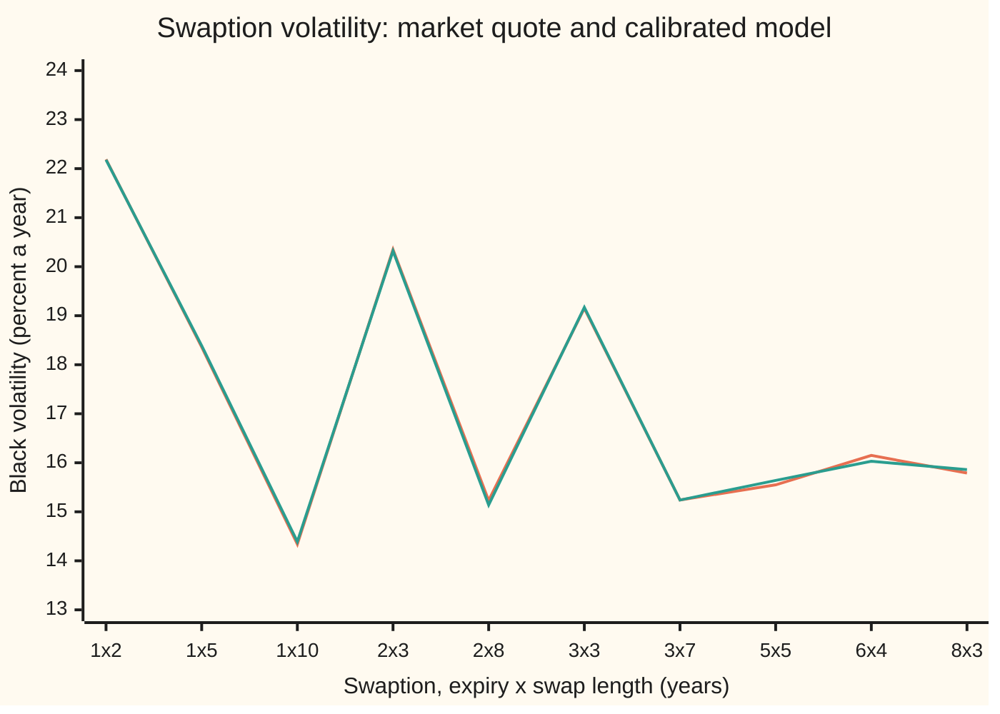
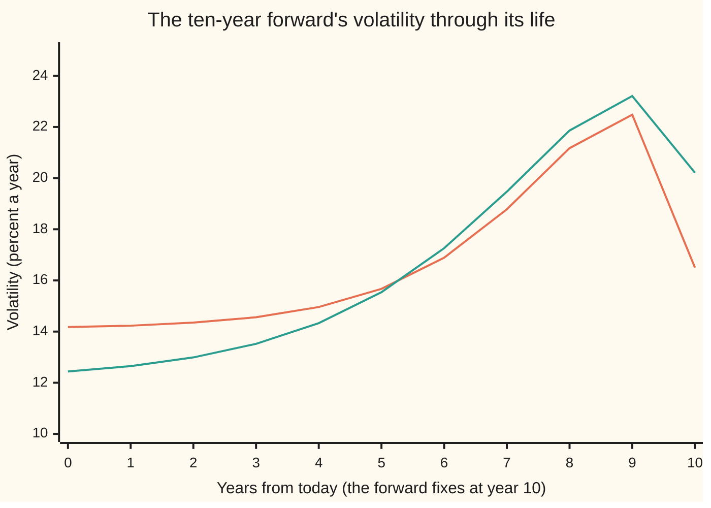

# Calibrating a market model: caplet volatilities exactly, swaptions approximately

[Syllabus](../../../SYLLABUS.md) → [Financial mathematics](../../../SYLLABUS.md#w12) → [Forward-Rate Models](../../../SYLLABUS.md#w12-s31) → Calibrating a market model

---

## General Overview

A rates desk's screen shows twenty numbers. Ten are caplet volatilities, one for each of the next ten yearly interest periods. A caplet is insurance on one future year's rate: it pays if that rate fixes above a strike. Its volatility is the market's price for how much that one rate will wander before it fixes. The other ten are swaption volatilities. A swaption is the right to enter a swap, a trade of fixed rate for floating, on a future date, so it bets on a block of years at once.

The desk wants one model that reprices all twenty: the forward market model of [Market models](03-libor-and-sofr-market-models.md), one random rate per year, each with its own wobble, all moving together to some degree. Before it prices anything untraded, such as a Bermudan swaption, its wobbles and their togetherness must be set. That setting is calibration.

A caplet watches one rate alone, so it pins down that rate's total wobble and nothing else: ten caplets, ten multipliers, ten exact matches. A swaption watches several rates, so it also feels *when* each wobbles and *how closely* they move together. Four numbers carry that: three shape the wobble over time, one sets how fast togetherness fades. Ten quotes, four numbers: the fit settles for the smallest misses, pricing each swaption with a fast approximate formula, Rebonato's.

**The whole idea in one sentence: give each forward rate a multiplier that reprices its caplet exactly, then choose four shape-and-correlation numbers that bring ten swaptions as close as they will go, using a formula that treats the swap rate as a frozen blend of forward rates.**

**What kind of fact this is:** a method. Its caplet half is exact inside the model, proved in Why it works; its swaption half leans on an approximation whose error is measured on this card by simulating the model, not bounded.

### The picture: ten swaption quotes and the four-number fit



The orange line is the screen; the green line is the calibrated model; the largest miss is 0.12 volatility points. Long swaps on short expiries (1x10, 2x8) have the lowest volatility: rates that do not move in lockstep partly cancel, and the correlation number measures that cancelling.

---

## The formula

Notation first, in words. Forward rate number $i$, written $L_i$, is today's fair rate for the year running from $T_i$ to $T_{i+1}$, where $T_i$ is $i$ years from now. A small $i$ or $j$ below a symbol picks out one forward. A sum sign $\sum$ adds a term for every forward named under and over it.

Each forward's volatility at calendar time $t$ is a common shape times its own multiplier:

$$\sigma_i(t) = k_i\,g(T_i - t), \qquad g(\tau) = (a + b\,\tau)\,e^{-c\,\tau} + d, \qquad k_i = v_i\sqrt{\frac{T_i}{\int_0^{T_i} g(T_i - t)^2\,dt}}$$

**Read it aloud:** a forward's wobble depends on how long it has left before fixing, through one hump-shaped curve shared by all forwards, scaled by the one multiplier that makes its caplet's total wobble equal the quote.

The swaption formula, Rebonato's, for a swaption expiring at $T_p$ on a swap of $n$ yearly periods:

$$\hat u^{\,2}\,T_p = \sum_{i=p}^{p+n-1}\;\sum_{j=p}^{p+n-1} \frac{w_i L_i\; w_j L_j}{S^2}\;\rho_{ij}\int_0^{T_p}\sigma_i(t)\,\sigma_j(t)\,dt, \qquad \rho_{ij} = e^{-\beta\,|T_i - T_j|}$$

**Read it aloud:** the swaption's total variance is the variance of a basket of forward rates, each held in the proportion it contributes to the swap rate today, with every pair counted by how closely it moves together, up to the expiry date.

The weights and swap rate come from today's discount factors, with every period one year long:

$$A = \sum_{i=p}^{p+n-1} P(0,T_{i+1}), \qquad w_i = \frac{P(0,T_{i+1})}{A}, \qquad S = \sum_{i=p}^{p+n-1} w_i L_i$$

Finally the four knobs are chosen to make the misses small, measured in volatility points:

$$\mathcal{L}(a,b,c,\beta) = \tfrac12\sum_{m=1}^{10}\big(100\,[\hat u_m - u_m]\big)^2$$

| Symbol | Plain meaning | In our example | Push it up and the answer… |
| --- | --- | --- | --- |
| $L_i$, $T_i$, $dL_i$, $i$, $j$ | forward rate for the year from $T_i$ to $T_{i+1}$, $i$ years from now; $dL_i$ its change over a short time; $i$, $j$ label forwards | 3.0% for the year starting now, rising 0.2 points a year to 5.0% | more weight in its swap rate |
| $P(0,T)$, $T$ | discount factor: today's price of 1 dollar paid at time $T$ | 0.940769 at two years | — |
| $v_i$ | caplet $i$'s quoted Black volatility | 22.10% at one year, 17.20% at ten | $k_i$ rises in proportion |
| $\sigma_i(t)$, $t$, $dt$ | forward $i$'s volatility at calendar time $t$; $dt$ a short stretch of time | ten-year forward: 14.18% today, 22.48% at year nine | options on that forward rise |
| $g$, $\tau$, $a$, $b$, $c$, $d$ | the shared hump in time-to-fixing $\tau$: $a$ its height at fixing above $d$, $b$ its rise, $c$ its decay, $d$ its floor | $a$ 0.020228, $b$ 0.137257, $c$ 0.796333, $d$ fixed at 0.12 | reshapes the timing; overall scale is absorbed by $k_i$ |
| $k_i$, $k_1$, $k_2$ | forward $i$'s multiplier, set so its caplet reprices exactly | 1.1390 to 1.2637 | that forward wobbles more |
| $\rho_{ij}$, $\rho_{12}$, $\beta$, $dW_i$ | correlation of forwards $i$ and $j$; $\beta$ sets how fast it fades with the gap between their dates; $dW_i$ forward $i$'s random kick | $\beta$ = 0.128525; neighbours correlate at 0.879392 | $\beta$ up: long swaptions cheaper |
| $I_{ij}$, $I_{11}$, $I_{12}$, $I_{22}$, $s$, $\kappa$ | overlap integral $\int_0^{T_p} g(T_i - t)\,g(T_j - t)\,dt$; $s$, $\kappa$ are working letters in its closed form | 0.032778 for forwards 1 and 2 to year 1 | — |
| $A$, $w_i$, $w_1$, $w_2$, $S$, $K$ | the annuity (value of 1 a year paid on each payment date), each forward's weight, the swap rate, the strike ($S$ at the money) | 1x2 swaption: 1.850604, 0.508358 and 0.491642, 3.298328% | — |
| $T_p$, $p$, $n$ | swaption expiry; its first forward; the swap's number of yearly periods | 1x2: $p$ = 1, $n$ = 2 | more time to wobble |
| $u$, $\hat u$ | swaption Black volatility: quoted, and from Rebonato's formula | 1x2: 22.19% and 22.18% | — |
| $\mathcal{L}$, $N(x)$, $\sum$ | half the sum of squared misses in volatility points; the normal CDF in Black's formula; the sum sign | $\mathcal{L}$ = 0.020388 at the fit | worse fit |

The shape $g$ is the "abcd" curve. At fixing it equals $a + d$; far from fixing it sinks to $d$; in between, $b$ lifts it into a hump. Rates are calmest when their fixing is far off and wobble most about a year before it.

### When it holds

- **Positive rates, lognormal wobble.** Each forward's logarithm moves by bell-curve steps. Near or below zero, quotes come as normal or shifted volatilities and the formulas change ([Rate volatilities](../29-Caps%2C%20Floors%20and%20Swaptions/06-normal-and-shifted-volatilities-for-rates.md)).
- **Genuine caplet volatilities.** Screens quote caps at one flat volatility; each caplet's own volatility must be stripped out first ([Caplet stripping](../29-Caps%2C%20Floors%20and%20Swaptions/03-caplet-stripping.md)), or every multiplier is wrong.
- **At-the-money only.** Volatility here depends on time, not strike, so the model has no smile ([SABR for rates](../29-Caps%2C%20Floors%20and%20Swaptions/07-sabr-for-rates-and-the-volatility-cube.md)).
- **Frozen weights.** Rebonato's formula pretends the swap's weights never move. On the five-into-five swaption the model's own price implies 15.58% against the formula's 15.64%. That gap is measured at one point only; elsewhere it must be measured again, not assumed.
- **One curve.** Discounting and forward rates come from the same curve; with separate curves the weights change ([Multi-curve](../28-Swaps/04-basis-swaps-and-the-multi-curve-framework.md)).

Conventions verified 28 September 2026: at-the-money lognormal (Black) volatilities in percent a year; one-year periods paid at the end; caplet $i$ fixes at $T_i$. Many desks now quote rate options in normal volatility; the method is the same with a normal model underneath.

### Before solving: does an answer exist, and is it the only one?

**Caplets.** For every positive quote $v_i$ and positive shape $g$, the integral under $k_i$ is positive, so $k_i$ exists, is positive and is unique. Edges: a zero quote gives a multiplier of zero, a forward that never moves; a fixed caplet has no quote to match.

**Swaptions.** The loss is continuous in the knobs, so on any closed, bounded box of knobs it has a smallest value. The checks keep $c$ between 0.05 and 5, $\beta$ between 0 and 3 and $a$ above $-d$, but leave $a$ and $b$ unbounded, so there existence is observed, not proved. Nothing makes the smallest value unique. The checks reach it twice, by two unrelated searches from different starts, and agree to six decimals. For every $\beta \ge 0$ the matrix $e^{-\beta|T_i - T_j|}$ is a genuine correlation matrix, so every trial is a real model. Edges: $\beta = 0$ makes all forwards move as one; $c \to 0$ flattens the hump into a line, and the closed-form integrals divide by $c$; a one-period swaption carries no information about correlation.

**Identification.** The fourth abcd number, $d$, is not a knob; Step 2 shows why.

---

## Why it works

### Step 0: a caplet sees one rate, a swaption sees a basket

A caplet pays on one forward rate on one date. Only that rate's total wobble up to fixing matters, so a caplet quote pins down one number per forward: the integral of its squared volatility.

A swaption pays on the swap rate, a weighted blend of several forwards. A blend wobbles less than its parts unless the parts move together, and it only counts wobble before the swaption's expiry. So a swaption sees what caplets cannot: *correlation* between forwards and the *timing* of each forward's wobble.

Hence a division of labour: ten multipliers absorb the ten caplets exactly; four numbers shaping timing and correlation are fitted to the swaptions. The two never compete, because the multipliers are recomputed for every trial set of knobs.

### Step 1: caplets are matched exactly

Price a caplet in units of the bond that pays on its payment date. Under those pricing weights, the forward measure of [Forward measures](02-forward-measures-for-rates.md), forward $i$ has no drift. Its logarithm at fixing is then a bell curve with variance $\int_0^{T_i}\sigma_i(t)^2\,dt$. Black-76 prices the caplet from a bell curve with variance $v_i^2 T_i$ ([Black-76](../05-Black-Scholes%20from%20the%20Ground%20Up/06-black-76-and-forward-level-pricing.md)). Same distribution, same price, whenever

$$\int_0^{T_i} k_i^2\,g(T_i - t)^2\,dt = v_i^2\,T_i.$$

Solve for $k_i$ and the formula above falls out. The match holds at every strike of that caplet, because the whole distribution matches. The checks confirm it with an integrator the fit never uses: Simpson's rule reprices all ten caplets with a largest miss of 0.0000000000 volatility points.

### Step 2: the overall size of the shape cancels, so $d$ is fixed

Multiply $a$, $b$ and $d$ by the same number, say 1.5. The curve $g$ becomes 1.5 times itself. Every integral under $k_i$ grows by 1.5 squared, so every $k_i$ shrinks by 1.5. Their product, the actual volatility $\sigma_i(t)$, does not move. No quote can see the change.

So only three abcd numbers carry information: two ratios and the decay $c$. Fitting all four would send the optimiser along a direction where the loss is perfectly flat. The card fixes $d$ at 0.12. Scaling $a$, $b$ and $d$ by 1.5, the checks report the largest change in any fitted swaption volatility as 0.0000000000.

### Step 3: the swap rate as a frozen basket

The swap rate is an exact weighted average of the forwards:

$$S(t) = \sum_i w_i(t)\,L_i(t).$$

The weights $w_i(t)$ are ratios of discount factors, and they move with rates. Rebonato freezes them at today's values. A small change in the swap rate is then $\sum_i w_i\,dL_i$. Divide by $S$:

$$\frac{dS}{S} \approx \sum_i \frac{w_i L_i}{S}\,\frac{dL_i}{L_i}.$$

Over a short time $dt$ the random part of $dL_i / L_i$ has variance $\sigma_i(t)^2\,dt$, and two forwards' random parts have covariance $\rho_{ij}\,\sigma_i(t)\sigma_j(t)\,dt$. A weighted sum's variance is the double sum of weights times covariances. Add it up to the swaption's expiry, freeze $L_i$ and $S$ at today's values too, and that is Rebonato's formula. Treat the swap rate as lognormal with that variance, and Black's swaption formula gives the price ([Swaptions](../29-Caps%2C%20Floors%20and%20Swaptions/04-swaptions-payer-and-receiver.md)).

A consistency check comes free. A one-period swaption is a caplet: one forward, weight 1, and the formula returns $v_p^2$ by Step 1. The checks put the five-into-one swaption at 19.630000% against the five-year caplet quote of 19.630000%.

<details>
<summary>Detailed proof: what the frozen basket keeps and what it throws away</summary>

Price swaptions in units of the annuity $A(t)$, the annuity measure of [The annuity measure](../29-Caps%2C%20Floors%20and%20Swaptions/05-the-annuity-measure.md). Under it the swap rate has no drift, and a payer swaption is worth $A(0)\,\mathbb{E}^A[(S(T_p) - K)^+]$, where $K$ is the strike and $\mathbb{E}^A$ the average under those weights. Changing the unit changes drifts only, never the random parts, so the random part of each $dL_i$ is $L_i\,\sigma_i(t)\,dW_i$, with $dW_i$ the random kick to forward $i$ and $dW_i\,dW_j = \rho_{ij}\,dt$.

Ito's product rule on $S = \sum_i w_i L_i$ gives
$$dS = \sum_i \big(w_i\,dL_i + L_i\,dw_i + dw_i\,dL_i\big).$$
The frozen basket keeps the first term and drops the other two, which are real: the weights are discount-factor ratios and move with the same forwards. The random part of $dS/S$ is then $\sum_i x_i(t)\,\sigma_i(t)\,dW_i$ with $x_i = w_i L_i / S$. Its variance rate is $\sum_{i,j} x_i x_j \rho_{ij}\sigma_i\sigma_j$. Replace each $x_i(t)$ by today's value $x_i(0)$, integrate from 0 to $T_p$, and the result is $\hat u^{\,2} T_p$.

Two approximations so far: dropping the weight terms, and freezing the proportions. A third comes with Black's formula: a sum of lognormal forwards is not lognormal, so even the exact variance would not give the exact price. The result is exact when $n = 1$ and carries no error bound. Step 5 measures the error.

</details>

### Step 4: fit four knobs to ten swaptions

With the multipliers recomputed inside every evaluation, the loss depends on $a$, $b$, $c$ and $\beta$ only: the least-squares problem of [Calibration](../07-Greeks%20by%20Numbers%20and%20Calibration/06-calibration-as-least-squares.md). Levenberg-Marquardt, with slopes found by nudging each knob, takes 10 accepted steps. Nelder-Mead, which uses no slopes and only compares losses at the five corners of a shrinking simplex, takes 576 loss evaluations from a different start. Both report $a$ = 0.020228, $b$ = 0.137257, $c$ = 0.796333, $\beta$ = 0.128525, loss 0.020388.

Speed comes from a closed form for the overlap integrals, checked against Simpson's rule for forwards 3 and 7 up to year 3: 0.06971338 both ways.

<details>
<summary>The closed form for the overlap integral</summary>

Put $s = T_p - t$, so forward $i$'s time to fixing is $(T_i - T_p) + s$. Then $g(T_i - t) = (\alpha_i + b\,s)\,\varepsilon_i\,e^{-cs} + d$ with $\alpha_i = a + b(T_i - T_p)$ and $\varepsilon_i = e^{-c(T_i - T_p)}$. Multiply two and integrate term by term; everything reduces to three integrals, $m = 0, 1, 2$,
$$M_m(\kappa) = \int_0^{T_p} s^m e^{-\kappa s}\,ds,$$
taken at $\kappa = 2c$ and at $\kappa = c$. Integration by parts gives $M_0 = (1 - e^{-\kappa T_p})/\kappa$, $M_1 = (M_0 - T_p\,e^{-\kappa T_p})/\kappa$, $M_2 = (2M_1 - T_p^2 e^{-\kappa T_p})/\kappa$. The result:
$$I_{ij} = \varepsilon_i\varepsilon_j\big(\alpha_i\alpha_j M_0(2c) + b(\alpha_i + \alpha_j)M_1(2c) + b^2 M_2(2c)\big) + d\big(\varepsilon_i(\alpha_i M_0(c) + bM_1(c)) + \varepsilon_j(\alpha_j M_0(c) + bM_1(c))\big) + d^2 T_p.$$
The division by $\kappa$ is why $c$ is kept away from zero.

</details>

The fitted shape is not the one that manufactured the screen. The quotes were built from $a$ = 0.08, $b$ = 0.12, $c$ = 0.60, $\beta$ = 0.10, then nudged by up to a few tenths of a point, the way real quotes disagree with any four-number model. The nudges moved $a$ to 0.020228. For the ten-year forward the two shapes differ most at fixing, 16.50% against 20.21%, yet both reprice the screen closely: loss 0.047490 against the fit's 0.020388.



The orange line is the calibrated shape; the green line is the shape that manufactured the quotes. Both stay calm for years and peak about a year before fixing. Where they part, at the last year, few of the ten swaptions look.

### Step 5: measure the approximation by simulating the model

Rebonato's formula stands in for the model's true swaption price; the only way to see its error is to price inside the model. The checks simulate forwards 5 to 10 up to year 5, in units of the bond paying at year 11 (the terminal measure). In those units forward $i$'s proportional drift per year is

$$-\,\sigma_i(t)\sum_{j=i+1}^{10}\frac{L_j\,\rho_{ij}\,\sigma_j(t)}{1 + L_j}$$

the cost of measuring every forward against the same far bond ([Forward measures](02-forward-measures-for-rates.md)). Twenty quarterly steps; each step's random moves carry exactly the covariance the closed-form integrals give, through a Cholesky factor (a lower-triangular matrix whose product with its own transpose is that covariance); 20,000 pairs of paths with opposite signs.

The five-year caplet comes out at 0.005675 per 1 of notional, standard error 0.000052, against Black's 0.005653 at the quote: within one standard error, as Step 1 promised. The five-into-five swaption comes out at 0.022660, standard error 0.000036, against 0.022752 from Rebonato's volatility. The error is small thanks to a control: the forward swap, worth exactly zero today, is simulated alongside and its sampling error subtracted. In volatility the model says 15.58%, give or take 0.03, and the formula 15.64%: the formula overstates this swaption by 0.06 points, about the size of the fit's own misses.

### The other door

Price each swaption in the loop by simulation instead. The misses then belong to the model alone, but every loss evaluation costs a simulation, and noisy losses need the common-random-numbers fix of [Bump and revalue](../07-Greeks%20by%20Numbers%20and%20Calibration/01-bump-and-revalue-and-common-random-numbers.md). The usual compromise is this card's: fit with the formula, check by simulation. Another door makes swap rates, not forwards, the lognormal quantities: [Swap market model](05-swap-market-model-in-outline.md).

---

## Worked numbers, by hand

The one-into-two swaption: expiry in one year, a two-year swap on forwards 1 and 2, at 3.2% and 3.4%. Its quote is 22.19%. The calibrated knobs are as above.

| Step | Arithmetic | Value |
| --- | --- | --- |
| discount factors $P(0,2)$, $P(0,3)$ | $1/(1.030 \times 1.032)$; then divide by $1.034$ | 0.940769, 0.909835 |
| annuity $A$ | $0.940769 + 0.909835$ | 1.850604 |
| weights $w_1$, $w_2$ | $0.940769 / 1.850604$; $0.909835 / 1.850604$ | 0.508358, 0.491642 |
| swap rate $S$ | $0.508358 \times 3.2\% + 0.491642 \times 3.4\%$ | 3.298328% |
| multipliers $k_1$, $k_2$ | from the caplet quotes 22.10% and 22.96% | 1.258172, 1.263689 |
| overlaps to year 1: $I_{11}$, $I_{12}$, $I_{22}$ | closed form above | 0.030854, 0.032778, 0.035169 |
| correlation $\rho_{12}$ | $e^{-0.128525 \times 1}$ | 0.879392 |
| forward 1 alone, $(w_1 L_1 k_1)^2 I_{11}$ | $(0.508358 \times 0.032 \times 1.258172)^2 \times 0.030854$ | 12.924796 millionths |
| both cross terms, $2\,w_1 L_1 k_1\,w_2 L_2 k_2\,\rho_{12} I_{12}$ | same pieces, times 0.879392 and 0.032778 | 24.923925 millionths |
| forward 2 alone, $(w_2 L_2 k_2)^2 I_{22}$ | $(0.491642 \times 0.034 \times 1.263689)^2 \times 0.035169$ | 15.692733 millionths |
| total | add the three | 53.541454 millionths |
| divide by $T_p S^2$ | $S^2$ = 1087.897035 millionths, $T_p$ = 1; take the square root | **22.18%** |

The model prices the one-into-two swaption at 22.18% against a screen quote of 22.19%: one hundredth of a point cheap. The cross terms are nearly half the total; with independent forwards that row would vanish.

### What breaks if you drop a piece

Rows two to four are the one-into-ten swaption, quoted at 14.34% and fitted at 14.39%.

| Mistake | Comes out at | What went wrong |
| --- | --- | --- |
| One common multiplier, 1.2067, for all ten forwards | caplets miss by up to 1.04 points | the shape alone cannot follow the jagged caplet quotes; per-forward multipliers can |
| Correlation 1 between all forwards ($\beta = 0$) | 17.38% | ten forwards moving in lockstep never cancel; the basket wobbles as much as its parts |
| Each forward given its caplet volatility, flat through time | 16.33% | the far forwards are calm in the swaption's single year; their caplet volatilities average in the hump near their own fixing |
| Swaption volatility as the weighted average of caplet volatilities | 19.71% | both errors at once: lockstep movement and the wrong time window |

---

## Code, from first principles, and it actually runs

The checks compute the ten multipliers and fit the four knobs twice, by Levenberg-Marquardt and by slope-free Nelder-Mead from a different start. Simpson's rule, which the fit never touches, reprices every caplet and one overlap integral. A one-period swaption must collapse to its caplet. A simulation of the model under the year-11 bond, with its own normal CDF, root finder and random numbers, prices the five-year caplet and the five-into-five swaption. Four independent roads: two optimisers, two integrators, a limiting case, and the model against its own approximation.

### Python

```python
# Calibrating a market model. Roads: Levenberg-Marquardt, Nelder-Mead, Simpson, a Monte Carlo of the model.
from math import exp, expm1, log, sqrt, cos, sin, pi
D, T = 0.12, [float(i) for i in range(12)]        # fixed d; reset dates, forward i runs T[i] to T[i+1]
L = [0.030 + 0.002 * i for i in range(11)]        # today's one-year forward rates, 3.0% to 5.0%
P = [1.0]
for i in range(11): P.append(P[-1] / (1.0 + L[i]))     # discount factors P(0, T_i)
CAP = [0.2210, 0.2296, 0.2149, 0.2129, 0.1963, 0.1925, 0.1893, 0.1779, 0.1694, 0.1720]
SWP = [(1, 2, 0.2219), (1, 5, 0.1836), (1, 10, 0.1434), (2, 3, 0.2035), (2, 8, 0.1523),
       (3, 3, 0.1915), (3, 7, 0.1524), (5, 5, 0.1555), (6, 4, 0.1615), (8, 3, 0.1579)]
MADE = [0.08, 0.12, 0.60, 0.10]                   # the knobs the screen was manufactured from
def g(i, t, th): return (th[0] + th[1] * (T[i] - t)) * exp(-th[2] * (T[i] - t)) + D
def cross(i, j, e, th, d):                        # closed form: integral of g_i g_j from 0 to e
    a, b, c, m, n = th[0], th[1], th[2], [0.0] * 3, [0.0] * 3
    for mom, k in ((m, 2.0 * c), (n, c)):         # integrals of 1, s, s^2 times e^(-ks) on [0, e]
        mom[0] = -expm1(-k * e) / k; mom[1] = (mom[0] - e * exp(-k * e)) / k; mom[2] = (2.0 * mom[1] - e * e * exp(-k * e)) / k
    ai, aj, ei, ej = a + b * (T[i] - e), a + b * (T[j] - e), exp(-c * (T[i] - e)), exp(-c * (T[j] - e))
    return (ei * ej * (ai * aj * m[0] + b * (ai + aj) * m[1] + b * b * m[2])
            + d * (ei * (ai * n[0] + b * n[1]) + ej * (aj * n[0] + b * n[1])) + d * d * e)
def simpson(f, lo, hi, n=2000):                   # second integrator, no closed form used
    h = (hi - lo) / n
    return h / 3.0 * sum((1 if m in (0, n) else 4 if m % 2 else 2) * f(lo + m * h) for m in range(n + 1))
def mults(th, d, cap): return [0.0] + [cap[i - 1] * sqrt(T[i] / cross(i, i, T[i], th, d)) for i in range(1, 11)]
def cov(i, j, e, th, k, d): return exp(-th[3] * abs(T[i] - T[j])) * k[i] * k[j] * cross(i, j, e, th, d)
def swap(p, n): A = sum(P[i + 1] for i in range(p, p + n)); return A, sum(P[i + 1] * L[i] for i in range(p, p + n)) / A
def reb(p, n, th, k, d=D):                        # Rebonato's frozen-weight Black vol of the swaption
    A, S = swap(p, n); x = [P[i + 1] / A * L[i] for i in range(p, p + n)]
    return sqrt(sum(x[a] * x[b] * cov(p + a, p + b, T[p], th, k, d) for a in range(n) for b in range(n)) / (T[p] * S * S))
def resid(th): k = mults(th, D, CAP); return [100.0 * (reb(p, n, th, k) - u) for p, n, u in SWP]
def loss(th): return 0.5 * sum(e * e for e in resid(th)) if 0.05 < th[2] < 5.0 and 0.0 <= th[3] < 3.0 and th[0] > -D else float("inf")
def chol(c):                                      # lower-triangular r with r r' = c
    n = len(c); r = [[0.0] * n for _ in range(n)]
    for a in range(n):
        for b in range(a + 1):
            x = c[a][b] - sum(r[a][m] * r[b][m] for m in range(b)); r[a][b] = sqrt(x) if a == b else x / r[b][b]
    return r
def lm(th, lam=1e-3):                             # road one: Levenberg-Marquardt, slopes by bumping
    f, steps = loss(th), 0
    while steps < 100:
        e = resid(th); J = [[(x - y) / 1e-7 for x, y in zip(resid([th[q] + (1e-7 if q == r else 0.0) for q in range(4)]), e)] for r in range(4)]
        A = [[sum(J[r][m] * J[s][m] for m in range(10)) for s in range(4)] for r in range(4)]
        grad = [-sum(J[r][m] * e[m] for m in range(10)) for r in range(4)]
        while lam < 1e12:                         # damped step by Cholesky; a refused step triples the damping
            R, y, d = chol([[A[r][s] * (1.0 + lam if r == s else 1.0) for s in range(4)] for r in range(4)]), [0.0] * 4, [0.0] * 4
            for a in range(4): y[a] = (grad[a] - sum(R[a][m] * y[m] for m in range(a))) / R[a][a]
            for a in (3, 2, 1, 0): d[a] = (y[a] - sum(R[m][a] * d[m] for m in range(a + 1, 4))) / R[a][a]
            tn = [th[q] + d[q] for q in range(4)]; fn = loss(tn)
            if fn < f: break
            lam *= 3.0
        if fn >= f: break
        steps, lam, gain, th, f = steps + 1, lam / 3.0, f - fn, tn, fn
        if gain < 1e-13 * (1.0 + f): break
    return th, f, steps
def nelder(th, size=0.05):                        # road two: Nelder-Mead, no slopes at all
    pts = [th[:]] + [[th[q] + (size if q == r else 0.0) for q in range(4)] for r in range(4)]
    fs, evals = [loss(p) for p in pts], 5
    while max(fs) - min(fs) > 1e-13 * (1.0 + min(fs)) and evals < 20000:
        o = sorted(range(5), key=lambda m: fs[m]); pts, fs = [pts[m] for m in o], [fs[m] for m in o]
        tr = lambda s: [(pts[0][q] + pts[1][q] + pts[2][q] + pts[3][q]) / 4.0 * (1.0 - s) + s * pts[4][q] for q in range(4)]
        xr = tr(-1.0); fr = loss(xr); evals += 1
        if fr < fs[0]:
            xe = tr(-2.0); fe = loss(xe); evals += 1; pts[4], fs[4] = (xe, fe) if fe < fr else (xr, fr)
        elif fr < fs[3]: pts[4], fs[4] = xr, fr
        else:
            xc = tr(0.5 if fr >= fs[4] else -0.5); fc = loss(xc); evals += 1
            if fc < min(fr, fs[4]): pts[4], fs[4] = xc, fc
            else:                                 # shrink every corner halfway to the best one
                pts = [pts[0]] + [[0.5 * (pts[0][q] + p[q]) for q in range(4)] for p in pts[1:]]; fs = [fs[0]] + [loss(p) for p in pts[1:]]; evals += 4
    m = min(range(5), key=lambda m: fs[m]); return pts[m], fs[m], evals
M64, SEED = (1 << 64) - 1, [20260928]
def unif():                                       # splitmix64, top 53 bits, never exactly 0
    SEED[0] = (SEED[0] + 0x9E3779B97F4A7C15) & M64; z = SEED[0]
    z = ((z ^ (z >> 30)) * 0xBF58476D1CE4E5B9) & M64; z = ((z ^ (z >> 27)) * 0x94D049BB133111EB) & M64
    return ((z ^ (z >> 31)) >> 11) * 2.0 ** -53 + 2.0 ** -54
def N(x):                                         # bell-curve area left of x, by its power series
    y, s, term, n = x / sqrt(2.0), 0.0, x / sqrt(2.0), 0
    while abs(term) > 1e-17 * (2 * n + 1): s += term / (2 * n + 1); n += 1; term *= -y * y / n
    return 0.5 + s / sqrt(pi)
def mc(th, k, pairs, steps=20):                   # road four: forwards 5..10 to year 5, year-11 bond as unit
    h, S0, out = 5.0 / steps, swap(5, 5)[1], []
    C = [[[cov(i, j, (s + 1) * h, th, k, D) - cov(i, j, s * h, th, k, D) for j in range(5, 11)] for i in range(5, 11)] for s in range(steps)]; R = [chol(c) for c in C]
    for _ in range(pairs):
        z, pay = [], [0.0, 0.0, 0.0]
        for _ in range(steps * 3):
            r, a = sqrt(-2.0 * log(unif())), 2.0 * pi * unif(); z += [r * cos(a), r * sin(a)]
        for sign in (1.0, -1.0):                  # antithetic pair: the same draws, sign flipped
            x = [log(L[i]) for i in range(5, 11)]
            for s in range(steps):                # log step: terminal-measure drift, exact covariance
                Lv, c = [exp(v) for v in x], C[s]
                x = [x[a] - sum(Lv[b] / (1.0 + Lv[b]) * c[a][b] for b in range(a + 1, 6)) - 0.5 * c[a][a]
                     + sign * sum(R[s][a][b] * z[6 * s + b] for b in range(a + 1)) for a in range(6)]
            grow = [1.0] * 7                      # grow[m] = P(5, T_5+m) / P(5, T_11)
            for m in (5, 4, 3, 2, 1, 0): grow[m] = grow[m + 1] * (1.0 + exp(x[m]))
            ann = sum(grow[1:6]); sw = (grow[0] - grow[5]) / ann
            pay = [pay[0] + 0.5 * max(exp(x[0]) - L[5], 0.0) * grow[1], pay[1] + 0.5 * ann * max(sw - S0, 0.0), pay[2] + 0.5 * ann * (sw - S0)]
        out.append(pay)
    mean = [sum(o[q] for o in out) / pairs for q in range(3)]
    cv = lambda q, r: sum((o[q] - mean[q]) * (o[r] - mean[r]) for o in out) / (pairs - 1)
    beta = cv(1, 2) / cv(2, 2)                    # control: the forward swap itself, worth exactly 0 today
    return P[11] * mean[0], P[11] * sqrt(cv(0, 0) / pairs), P[11] * (mean[1] - beta * mean[2]), P[11] * sqrt((cv(1, 1) - beta * cv(1, 2)) / pairs)
def implied(ratio, e, lo=1e-6, hi=2.0):           # ATM Black vol by bisection: 2N(u sqrt(e) / 2) - 1 = ratio
    for _ in range(100): mid = 0.5 * (lo + hi); lo, hi = (mid, hi) if 2.0 * N(0.5 * mid * sqrt(e)) - 1.0 < ratio else (lo, mid)
    return 0.5 * (lo + hi)
th1, f1, n1 = lm([0.20, 0.05, 1.50, 0.40]); th2, f2, n2 = nelder([0.02, 0.30, 0.30, 0.02]); k = mults(th1, D, CAP)
print("caplet quotes 1y..10y        " + " ".join(f"{100 * x:.2f}" for x in CAP) + "\ncaplet multipliers k_1..k_10  " + " ".join(f"{x:.4f}" for x in k[1:]))
print("road 1 Levenberg-Marquardt a b c beta " + " ".join(f"{x:.6f}" for x in th1) + f"  loss {f1:.6f}  steps {n1}")
print("road 2 Nelder-Mead         a b c beta " + " ".join(f"{x:.6f}" for x in th2) + f"  loss {f2:.6f}  evals {n2}")
print(f"manufacturing knobs 0.08 0.12 0.60 0.10: loss {loss(MADE):.6f}  1y x 10y {100 * reb(1, 10, MADE, mults(MADE, D, CAP)):.2f}")
for p, n, u in SWP:
    v = reb(p, n, th1, k); print(f"swaption {p:>2}y x {n:>2}y  quote {100 * u:6.2f}  fit {100 * v:6.2f}  miss {100 * (v - u):+.2f}")
capmiss = max(abs(k[i] * sqrt(simpson(lambda t: g(i, t, th1) ** 2, 0.0, T[i]) / T[i]) - CAP[i - 1]) for i in range(1, 11))
one, ci, cs = reb(5, 1, th1, k), cross(3, 7, 3.0, th1, D), simpson(lambda t: g(3, t, th1) * g(7, t, th1), 0.0, 3.0)
big = [1.5 * th1[0], 1.5 * th1[1], th1[2], th1[3]]; kb = mults(big, 1.5 * D, CAP)
shift = max(abs(reb(p, n, big, kb, 1.5 * D) - reb(p, n, th1, k)) for p, n, _ in SWP)
print(f"caplets repriced through Simpson: largest miss {100 * capmiss:.10f} points   5y x 1y by Rebonato {100 * one:.6f}, caplet quote {100 * CAP[4]:.6f}")
print(f"cross integral, forwards 3 and 7, to year 3: closed form {ci:.8f}  Simpson {cs:.8f}   abcd all times 1.5: largest change {100 * shift:.10f}")
(A5, S5), r55 = swap(5, 5), reb(5, 5, th1, k); cmc, cse, smc, sse = mc(th1, k, 20000)
cbl, sbl = P[6] * L[5] * (2.0 * N(0.5 * CAP[4] * sqrt(5.0)) - 1.0), A5 * S5 * (2.0 * N(0.5 * r55 * sqrt(5.0)) - 1.0)
umc = implied(smc / (A5 * S5), 5.0); use = implied((smc + sse) / (A5 * S5), 5.0) - umc
print(f"MC 5y caplet, per 1 notional  {cmc:.6f} +/- {cse:.6f}   Black at the quote {cbl:.6f}")
print(f"MC 5y x 5y swaption           {smc:.6f} +/- {sse:.6f}   Rebonato price {sbl:.6f}")
print(f"MC implied vol {100 * umc:.2f} +/- {100 * use:.2f}   Rebonato {100 * r55:.2f}   gap {100 * (r55 - umc):+.2f} points")
(A, S), I = swap(1, 2), [cross(1, 1, 1.0, th1, D), cross(1, 2, 1.0, th1, D), cross(2, 2, 1.0, th1, D)]
x1, x2 = P[2] / A * L[1] * k[1], P[3] / A * L[2] * k[2]; tm = [x1 * x1 * I[0], 2.0 * x1 * x2 * exp(-th1[3]) * I[1], x2 * x2 * I[2]]
print(f"hand 1y x 2y: P(0,2) {P[2]:.6f}  P(0,3) {P[3]:.6f}  annuity {A:.6f}  w1 {P[2] / A:.6f}  w2 {P[3] / A:.6f}  S {100 * S:.6f}%")
print(f"hand: k1 {k[1]:.6f}  k2 {k[2]:.6f}  I11 {I[0]:.6f}  I12 {I[1]:.6f}  I22 {I[2]:.6f}  rho12 {exp(-th1[3]):.6f}")
print(f"hand: terms x 1e6 {1e6 * tm[0]:.6f} {1e6 * tm[1]:.6f} {1e6 * tm[2]:.6f}  sum {1e6 * (tm[0] + tm[1] + tm[2]):.6f}  S^2 x 1e6 {1e6 * S * S:.6f}")
kbar, (A1, S1) = sum(k[1:]) / 10.0, swap(1, 10)
print(f"break: one common multiplier {kbar:.4f}, largest caplet miss {100 * max(abs(kbar * sqrt(cross(i, i, T[i], th1, D) / T[i]) - CAP[i - 1]) for i in range(1, 11)):.2f} points")
print(f"break: 1y x 10y with beta = 0 (one factor) {100 * reb(1, 10, th1[:3] + [0.0], k):.2f}   with flat caplet vols {100 * reb(1, 10, [0.0, 0.0, 1.0, th1[3]], [0.0] + CAP, 1.0):.2f}")
print(f"break: 1y x 10y as weighted average of caplet vols {100 * sum(P[m + 2] * L[m + 1] * CAP[m] for m in range(10)) / (A1 * S1):.2f}")
print(f"try: beta = 0.30, 1y x 10y {100 * reb(1, 10, th1[:3] + [0.30], k):.2f}   5y caplet +1 point, 5y x 5y {100 * reb(5, 5, th1, mults(th1, D, CAP[:4] + [CAP[4] + 0.01] + CAP[5:])):.2f}")
for name, th in (("fitted", th1), ("made  ", MADE)): print(f"chart, 10y forward {name}   " + " ".join(f"{100 * mults(th, D, CAP)[10] * g(10, t, th):.2f}" for t in range(11)))
assert max(abs(x - y) for x, y in zip(th1, th2)) < 1e-5, "two optimisers, one minimum"
assert capmiss < 1e-10, "every caplet repriced exactly, checked with an integral the fit never used"
assert abs(ci - cs) < 1e-10, "closed-form cross integral against Simpson"
assert abs(one - CAP[4]) < 1e-12, "a one-period swaption must collapse to its caplet"
assert abs(cmc - cbl) < 3.0 * cse, "simulated caplet within three standard errors of Black"
assert abs(r55 - umc) < 0.0025, "Rebonato within a quarter of a vol point of the simulated model"
assert shift < 1e-12, "overall scale of abcd is invisible once the caplets set the multipliers"
print("ALL CHECKS PASS")
```

**Ran 2026-09-28 on macOS, Python 3.14.6, standard library only. All checks passed. Output, pasted from the run:**

```
caplet quotes 1y..10y        22.10 22.96 21.49 21.29 19.63 19.25 18.93 17.79 16.94 17.20
caplet multipliers k_1..k_10  1.2582 1.2637 1.2086 1.2411 1.1870 1.2031 1.2173 1.1719 1.1390 1.1767
road 1 Levenberg-Marquardt a b c beta 0.020228 0.137257 0.796333 0.128525  loss 0.020388  steps 10
road 2 Nelder-Mead         a b c beta 0.020228 0.137257 0.796333 0.128525  loss 0.020388  evals 576
manufacturing knobs 0.08 0.12 0.60 0.10: loss 0.047490  1y x 10y 14.26
swaption  1y x  2y  quote  22.19  fit  22.18  miss -0.01
swaption  1y x  5y  quote  18.36  fit  18.39  miss +0.03
swaption  1y x 10y  quote  14.34  fit  14.39  miss +0.05
swaption  2y x  3y  quote  20.35  fit  20.32  miss -0.03
swaption  2y x  8y  quote  15.23  fit  15.14  miss -0.09
swaption  3y x  3y  quote  19.15  fit  19.17  miss +0.02
swaption  3y x  7y  quote  15.24  fit  15.24  miss +0.00
swaption  5y x  5y  quote  15.55  fit  15.64  miss +0.09
swaption  6y x  4y  quote  16.15  fit  16.03  miss -0.12
swaption  8y x  3y  quote  15.79  fit  15.86  miss +0.07
caplets repriced through Simpson: largest miss 0.0000000000 points   5y x 1y by Rebonato 19.630000, caplet quote 19.630000
cross integral, forwards 3 and 7, to year 3: closed form 0.06971338  Simpson 0.06971338   abcd all times 1.5: largest change 0.0000000000
MC 5y caplet, per 1 notional  0.005675 +/- 0.000052   Black at the quote 0.005653
MC 5y x 5y swaption           0.022660 +/- 0.000036   Rebonato price 0.022752
MC implied vol 15.58 +/- 0.03   Rebonato 15.64   gap +0.06 points
hand 1y x 2y: P(0,2) 0.940769  P(0,3) 0.909835  annuity 1.850604  w1 0.508358  w2 0.491642  S 3.298328%
hand: k1 1.258172  k2 1.263689  I11 0.030854  I12 0.032778  I22 0.035169  rho12 0.879392
hand: terms x 1e6 12.924796 24.923925 15.692733  sum 53.541454  S^2 x 1e6 1087.897035
break: one common multiplier 1.2067, largest caplet miss 1.04 points
break: 1y x 10y with beta = 0 (one factor) 17.38   with flat caplet vols 16.33
break: 1y x 10y as weighted average of caplet vols 19.71
try: beta = 0.30, 1y x 10y 11.85   5y caplet +1 point, 5y x 5y 15.82
chart, 10y forward fitted   14.18 14.23 14.35 14.56 14.96 15.67 16.89 18.78 21.17 22.48 16.50
chart, 10y forward made     12.44 12.65 12.99 13.52 14.33 15.54 17.26 19.47 21.86 23.21 20.21
ALL CHECKS PASS
```

### Rust

```rust
// Calibrating a market model. Roads: Levenberg-Marquardt, Nelder-Mead, Simpson, a Monte Carlo of the model.
use std::f64::consts::PI;
const D: f64 = 0.12; // fixed d; forward i runs from year i to year i + 1
const CAP: [f64; 10] = [0.2210, 0.2296, 0.2149, 0.2129, 0.1963, 0.1925, 0.1893, 0.1779, 0.1694, 0.1720];
const SWP: [(usize, usize, f64); 10] = [(1, 2, 0.2219), (1, 5, 0.1836), (1, 10, 0.1434), (2, 3, 0.2035), (2, 8, 0.1523),
    (3, 3, 0.1915), (3, 7, 0.1524), (5, 5, 0.1555), (6, 4, 0.1615), (8, 3, 0.1579)];
const MADE: [f64; 4] = [0.08, 0.12, 0.60, 0.10]; // the knobs the screen was manufactured from
type Th = [f64; 4]; type Ks = [f64; 11]; type Mat = Vec<Vec<f64>>;
fn t(i: usize) -> f64 { i as f64 }
fn l(i: usize) -> f64 { 0.030 + 0.002 * i as f64 } // today's one-year forward rates, 3.0% to 5.0%
fn p(i: usize) -> f64 { let mut x = 1.0; for j in 0..i { x = x / (1.0 + l(j)); } x } // discount factor P(0, T_i)
fn g(i: usize, s: f64, th: &Th) -> f64 { (th[0] + th[1] * (t(i) - s)) * (-th[2] * (t(i) - s)).exp() + D }
fn cross(i: usize, j: usize, e: f64, th: &Th, d: f64) -> f64 { // closed form: integral of g_i g_j from 0 to e
    let (a, b, c) = (th[0], th[1], th[2]);
    let mom = |k: f64| { let m0 = -(-k * e).exp_m1() / k; let m1 = (m0 - e * (-k * e).exp()) / k; [m0, m1, (2.0 * m1 - e * e * (-k * e).exp()) / k] };
    let (m, n) = (mom(2.0 * c), mom(c));
    let (ai, aj, ei, ej) = (a + b * (t(i) - e), a + b * (t(j) - e), (-c * (t(i) - e)).exp(), (-c * (t(j) - e)).exp());
    ei * ej * (ai * aj * m[0] + b * (ai + aj) * m[1] + b * b * m[2]) + d * (ei * (ai * n[0] + b * n[1]) + ej * (aj * n[0] + b * n[1])) + d * d * e
}
fn simpson<F: Fn(f64) -> f64>(f: F, lo: f64, hi: f64) -> f64 { // second integrator, no closed form used
    let n = 2000usize; let h = (hi - lo) / n as f64;
    h / 3.0 * (0..=n).map(|m| (if m == 0 || m == n { 1.0 } else if m % 2 == 1 { 4.0 } else { 2.0 }) * f(lo + m as f64 * h)).sum::<f64>()
}
fn mults(th: &Th, d: f64, cap: &[f64]) -> Ks { let mut k = [0.0; 11]; for i in 1..11 { k[i] = cap[i - 1] * (t(i) / cross(i, i, t(i), th, d)).sqrt(); } k }
fn cov(i: usize, j: usize, e: f64, th: &Th, k: &Ks, d: f64) -> f64 { (-th[3] * (t(i) - t(j)).abs()).exp() * k[i] * k[j] * cross(i, j, e, th, d) }
fn swap(q: usize, n: usize) -> (f64, f64) { let a: f64 = (q..q + n).map(|i| p(i + 1)).sum(); (a, (q..q + n).map(|i| p(i + 1) * l(i)).sum::<f64>() / a) }
fn reb(q: usize, n: usize, th: &Th, k: &Ks, d: f64) -> f64 { // Rebonato's frozen-weight Black vol of the swaption
    let (a, s) = swap(q, n); let x: Vec<f64> = (q..q + n).map(|i| p(i + 1) / a * l(i)).collect();
    let v: f64 = (0..n).flat_map(|u| (0..n).map(move |w| (u, w))).map(|(u, w)| x[u] * x[w] * cov(q + u, q + w, t(q), th, k, d)).sum();
    (v / (t(q) * s * s)).sqrt()
}
fn resid(th: &Th) -> Vec<f64> { let k = mults(th, D, &CAP); SWP.iter().map(|&(q, n, u)| 100.0 * (reb(q, n, th, &k, D) - u)).collect() }
fn loss(th: &Th) -> f64 {
    if 0.05 < th[2] && th[2] < 5.0 && 0.0 <= th[3] && th[3] < 3.0 && th[0] > -D { 0.5 * resid(th).iter().map(|e| e * e).sum::<f64>() } else { f64::INFINITY }
}
fn chol(c: &Mat) -> Mat { // lower-triangular r with r r' = c
    let n = c.len(); let mut r = vec![vec![0.0; n]; n];
    for a in 0..n { for b in 0..=a { let x = c[a][b] - (0..b).map(|m| r[a][m] * r[b][m]).sum::<f64>(); r[a][b] = if a == b { x.sqrt() } else { x / r[b][b] }; } }
    r
}
fn lm(mut th: Th) -> (Th, f64, usize) { // road one: Levenberg-Marquardt, slopes by bumping
    let (mut f, mut steps, mut lam) = (loss(&th), 0usize, 1e-3);
    while steps < 100 {
        let e = resid(&th);
        let j: Mat = (0..4).map(|r| { let mut tp = th; tp[r] += 1e-7; resid(&tp).iter().zip(&e).map(|(x, y)| (x - y) / 1e-7).collect() }).collect();
        let a: Mat = (0..4).map(|r| (0..4).map(|s| (0..10).map(|m| j[r][m] * j[s][m]).sum()).collect()).collect();
        let grad: Vec<f64> = (0..4).map(|r| -(0..10).map(|m| j[r][m] * e[m]).sum::<f64>()).collect();
        let (mut tn, mut fnew) = (th, f64::INFINITY);
        while lam < 1e12 { // damped step by Cholesky; a refused step triples the damping
            let rr = chol(&(0..4).map(|r| (0..4).map(|s| a[r][s] * if r == s { 1.0 + lam } else { 1.0 }).collect()).collect());
            let (mut y, mut d) = ([0.0; 4], [0.0; 4]);
            for u in 0..4 { y[u] = (grad[u] - (0..u).map(|m| rr[u][m] * y[m]).sum::<f64>()) / rr[u][u]; }
            for u in (0..4).rev() { d[u] = (y[u] - (u + 1..4).map(|m| rr[m][u] * d[m]).sum::<f64>()) / rr[u][u]; }
            for q in 0..4 { tn[q] = th[q] + d[q]; } fnew = loss(&tn);
            if fnew < f { break; } lam *= 3.0;
        }
        if fnew >= f { break; }
        let gain = f - fnew; steps += 1; lam /= 3.0; th = tn; f = fnew;
        if gain < 1e-13 * (1.0 + f) { break; }
    }
    (th, f, steps)
}
fn nelder(th: Th) -> (Th, f64, usize) { // road two: Nelder-Mead, no slopes at all
    let mut pts: Vec<Th> = vec![th]; for r in 0..4 { let mut x = th; x[r] += 0.05; pts.push(x); }
    let (mut fs, mut evals, lo) = (pts.iter().map(loss).collect::<Vec<f64>>(), 5usize, |f: &Vec<f64>| f.iter().cloned().fold(f64::INFINITY, f64::min));
    while fs.iter().cloned().fold(f64::NEG_INFINITY, f64::max) - lo(&fs) > 1e-13 * (1.0 + lo(&fs)) && evals < 20000 {
        let mut o: Vec<usize> = (0..5).collect(); o.sort_by(|&x, &y| fs[x].partial_cmp(&fs[y]).unwrap());
        pts = o.iter().map(|&m| pts[m]).collect(); fs = o.iter().map(|&m| fs[m]).collect();
        let tr = |s: f64, pts: &Vec<Th>| { let mut x = [0.0; 4]; for q in 0..4 { x[q] = (pts[0][q] + pts[1][q] + pts[2][q] + pts[3][q]) / 4.0 * (1.0 - s) + s * pts[4][q]; } x };
        let xr = tr(-1.0, &pts); let fr = loss(&xr); evals += 1;
        if fr < fs[0] {
            let xe = tr(-2.0, &pts); let fe = loss(&xe); evals += 1;
            if fe < fr { pts[4] = xe; fs[4] = fe; } else { pts[4] = xr; fs[4] = fr; }
        } else if fr < fs[3] { pts[4] = xr; fs[4] = fr; } else {
            let xc = tr(if fr >= fs[4] { 0.5 } else { -0.5 }, &pts); let fc = loss(&xc); evals += 1;
            if fc < fr.min(fs[4]) { pts[4] = xc; fs[4] = fc; } else { // shrink every corner halfway to the best one
                for m in 1..5 { for q in 0..4 { pts[m][q] = 0.5 * (pts[0][q] + pts[m][q]); } fs[m] = loss(&pts[m]); }
                evals += 4;
            }
        }
    }
    let m = (0..5).min_by(|&x, &y| fs[x].partial_cmp(&fs[y]).unwrap()).unwrap(); (pts[m], fs[m], evals)
}
struct Rng(u64);
impl Rng { fn unif(&mut self) -> f64 { // splitmix64, top 53 bits, never exactly 0
    self.0 = self.0.wrapping_add(0x9E3779B97F4A7C15); let mut z = self.0;
    z = (z ^ (z >> 30)).wrapping_mul(0xBF58476D1CE4E5B9); z = (z ^ (z >> 27)).wrapping_mul(0x94D049BB133111EB);
    ((z ^ (z >> 31)) >> 11) as f64 * 2f64.powi(-53) + 2f64.powi(-54) } }
fn ncdf(x: f64) -> f64 { // bell-curve area left of x, by its power series
    let y = x / 2f64.sqrt(); let (mut s, mut term, mut n) = (0.0, y, 0.0);
    while term.abs() > 1e-17 * (2.0 * n + 1.0) { s += term / (2.0 * n + 1.0); n += 1.0; term *= -y * y / n; }
    0.5 + s / PI.sqrt()
}
fn mc(th: &Th, k: &Ks, pairs: usize) -> [f64; 4] { // road four: forwards 5..10 to year 5, year-11 bond as unit
    let (steps, mut rng, s0) = (20usize, Rng(20260928), swap(5, 5).1); let h = 5.0 / steps as f64;
    let cm: Vec<Mat> = (0..steps).map(|s| (5..11).map(|i| (5..11).map(|j| cov(i, j, (s + 1) as f64 * h, th, k, D) - cov(i, j, s as f64 * h, th, k, D)).collect()).collect()).collect();
    let rm: Vec<Mat> = cm.iter().map(chol).collect(); let mut out: Vec<[f64; 3]> = Vec::new();
    for _ in 0..pairs {
        let (mut z, mut pay) = (Vec::new(), [0.0; 3]);
        for _ in 0..steps * 3 { let r = (-2.0 * rng.unif().ln()).sqrt(); let a = 2.0 * PI * rng.unif(); z.push(r * a.cos()); z.push(r * a.sin()); }
        for sign in [1.0, -1.0] { // antithetic pair: the same draws, sign flipped
            let mut x: Vec<f64> = (5..11).map(|i| l(i).ln()).collect();
            for s in 0..steps { // log step: terminal-measure drift, exact covariance
                let (lv, c): (Vec<f64>, &Mat) = (x.iter().map(|v| v.exp()).collect(), &cm[s]);
                x = (0..6).map(|a| x[a] - (a + 1..6).map(|b| lv[b] / (1.0 + lv[b]) * c[a][b]).sum::<f64>() - 0.5 * c[a][a]
                    + sign * (0..=a).map(|b| rm[s][a][b] * z[6 * s + b]).sum::<f64>()).collect();
            }
            let mut grow = [1.0; 7]; // grow[m] = P(5, T_5+m) / P(5, T_11)
            for m in (0..6).rev() { grow[m] = grow[m + 1] * (1.0 + x[m].exp()); }
            let ann: f64 = grow[1..6].iter().sum(); let sw = (grow[0] - grow[5]) / ann;
            pay = [pay[0] + 0.5 * (x[0].exp() - l(5)).max(0.0) * grow[1], pay[1] + 0.5 * ann * (sw - s0).max(0.0), pay[2] + 0.5 * ann * (sw - s0)];
        }
        out.push(pay);
    }
    let np = pairs as f64; let mean: Vec<f64> = (0..3).map(|q| out.iter().map(|o| o[q]).sum::<f64>() / np).collect();
    let cv = |q: usize, r: usize| out.iter().map(|o| (o[q] - mean[q]) * (o[r] - mean[r])).sum::<f64>() / (np - 1.0);
    let beta = cv(1, 2) / cv(2, 2); // control: the forward swap itself, worth exactly 0 today
    [p(11) * mean[0], p(11) * (cv(0, 0) / np).sqrt(), p(11) * (mean[1] - beta * mean[2]), p(11) * ((cv(1, 1) - beta * cv(1, 2)) / np).sqrt()]
}
fn implied(ratio: f64, e: f64) -> f64 { // ATM Black vol by bisection: 2N(u sqrt(e) / 2) - 1 = ratio
    let (mut lo, mut hi) = (1e-6, 2.0); for _ in 0..100 { let mid = 0.5 * (lo + hi); if 2.0 * ncdf(0.5 * mid * e.sqrt()) - 1.0 < ratio { lo = mid } else { hi = mid } }
    0.5 * (lo + hi)
}
fn main() {
    let (th1, f1, n1) = lm([0.20, 0.05, 1.50, 0.40]); let (th2, f2, n2) = nelder([0.02, 0.30, 0.30, 0.02]); let k = mults(&th1, D, &CAP);
    let jn = |v: &[f64], dp: usize| v.iter().map(|x| format!("{:.*}", dp, x)).collect::<Vec<_>>().join(" ");
    println!("caplet quotes 1y..10y        {}\ncaplet multipliers k_1..k_10  {}", jn(&CAP.map(|x| 100.0 * x), 2), jn(&k[1..], 4));
    println!("road 1 Levenberg-Marquardt a b c beta {}  loss {:.6}  steps {}", jn(&th1, 6), f1, n1);
    println!("road 2 Nelder-Mead         a b c beta {}  loss {:.6}  evals {}", jn(&th2, 6), f2, n2);
    println!("manufacturing knobs 0.08 0.12 0.60 0.10: loss {:.6}  1y x 10y {:.2}", loss(&MADE), 100.0 * reb(1, 10, &MADE, &mults(&MADE, D, &CAP), D));
    for &(q, n, u) in SWP.iter() { let v = reb(q, n, &th1, &k, D); println!("swaption {:>2}y x {:>2}y  quote {:6.2}  fit {:6.2}  miss {:+.2}", q, n, 100.0 * u, 100.0 * v, 100.0 * (v - u)); }
    let capmiss = (1..11).map(|i| (k[i] * (simpson(|s| g(i, s, &th1).powi(2), 0.0, t(i)) / t(i)).sqrt() - CAP[i - 1]).abs()).fold(0.0, f64::max);
    let (one, ci, cs) = (reb(5, 1, &th1, &k, D), cross(3, 7, 3.0, &th1, D), simpson(|s| g(3, s, &th1) * g(7, s, &th1), 0.0, 3.0));
    let big = [1.5 * th1[0], 1.5 * th1[1], th1[2], th1[3]]; let kb = mults(&big, 1.5 * D, &CAP);
    let shift = SWP.iter().map(|&(q, n, _)| (reb(q, n, &big, &kb, 1.5 * D) - reb(q, n, &th1, &k, D)).abs()).fold(0.0, f64::max);
    println!("caplets repriced through Simpson: largest miss {:.10} points   5y x 1y by Rebonato {:.6}, caplet quote {:.6}", 100.0 * capmiss, 100.0 * one, 100.0 * CAP[4]);
    println!("cross integral, forwards 3 and 7, to year 3: closed form {:.8}  Simpson {:.8}   abcd all times 1.5: largest change {:.10}", ci, cs, 100.0 * shift);
    let ((a5, s5), r55) = (swap(5, 5), reb(5, 5, &th1, &k, D)); let [cmc, cse, smc, sse] = mc(&th1, &k, 20000);
    let (cbl, sbl) = (p(6) * l(5) * (2.0 * ncdf(0.5 * CAP[4] * 5f64.sqrt()) - 1.0), a5 * s5 * (2.0 * ncdf(0.5 * r55 * 5f64.sqrt()) - 1.0));
    let umc = implied(smc / (a5 * s5), 5.0); let use_ = implied((smc + sse) / (a5 * s5), 5.0) - umc;
    println!("MC 5y caplet, per 1 notional  {:.6} +/- {:.6}   Black at the quote {:.6}", cmc, cse, cbl);
    println!("MC 5y x 5y swaption           {:.6} +/- {:.6}   Rebonato price {:.6}", smc, sse, sbl);
    println!("MC implied vol {:.2} +/- {:.2}   Rebonato {:.2}   gap {:+.2} points", 100.0 * umc, 100.0 * use_, 100.0 * r55, 100.0 * (r55 - umc));
    let ((a, s), i) = (swap(1, 2), [cross(1, 1, 1.0, &th1, D), cross(1, 2, 1.0, &th1, D), cross(2, 2, 1.0, &th1, D)]);
    let (x1, x2) = (p(2) / a * l(1) * k[1], p(3) / a * l(2) * k[2]); let tm = [x1 * x1 * i[0], 2.0 * x1 * x2 * (-th1[3]).exp() * i[1], x2 * x2 * i[2]];
    println!("hand 1y x 2y: P(0,2) {:.6}  P(0,3) {:.6}  annuity {:.6}  w1 {:.6}  w2 {:.6}  S {:.6}%", p(2), p(3), a, p(2) / a, p(3) / a, 100.0 * s);
    println!("hand: k1 {:.6}  k2 {:.6}  I11 {:.6}  I12 {:.6}  I22 {:.6}  rho12 {:.6}", k[1], k[2], i[0], i[1], i[2], (-th1[3]).exp());
    println!("hand: terms x 1e6 {:.6} {:.6} {:.6}  sum {:.6}  S^2 x 1e6 {:.6}", 1e6 * tm[0], 1e6 * tm[1], 1e6 * tm[2], 1e6 * (tm[0] + tm[1] + tm[2]), 1e6 * s * s);
    let (kbar, (a1, s1)) = (k[1..].iter().sum::<f64>() / 10.0, swap(1, 10));
    let cmiss = (1..11).map(|i| (kbar * (cross(i, i, t(i), &th1, D) / t(i)).sqrt() - CAP[i - 1]).abs()).fold(0.0, f64::max);
    println!("break: one common multiplier {:.4}, largest caplet miss {:.2} points", kbar, 100.0 * cmiss);
    let mut flat = [0.0; 11]; flat[1..].copy_from_slice(&CAP);
    println!("break: 1y x 10y with beta = 0 (one factor) {:.2}   with flat caplet vols {:.2}", 100.0 * reb(1, 10, &[th1[0], th1[1], th1[2], 0.0], &k, D), 100.0 * reb(1, 10, &[0.0, 0.0, 1.0, th1[3]], &flat, 1.0));
    println!("break: 1y x 10y as weighted average of caplet vols {:.2}", 100.0 * (0..10).map(|m| p(m + 2) * l(m + 1) * CAP[m]).sum::<f64>() / (a1 * s1));
    let mut bump = CAP; bump[4] += 0.01;
    println!("try: beta = 0.30, 1y x 10y {:.2}   5y caplet +1 point, 5y x 5y {:.2}", 100.0 * reb(1, 10, &[th1[0], th1[1], th1[2], 0.30], &k, D), 100.0 * reb(5, 5, &th1, &mults(&th1, D, &bump), D));
    for (name, th) in [("fitted", th1), ("made  ", MADE)] { let kk = mults(&th, D, &CAP); println!("chart, 10y forward {}   {}", name, jn(&(0..11).map(|s| 100.0 * kk[10] * g(10, s as f64, &th)).collect::<Vec<_>>(), 2)); }
    assert!(th1.iter().zip(&th2).map(|(x, y)| (x - y).abs()).fold(0.0, f64::max) < 1e-5, "two optimisers, one minimum");
    assert!(capmiss < 1e-10, "every caplet repriced exactly, checked with an integral the fit never used");
    assert!((ci - cs).abs() < 1e-10, "closed-form cross integral against Simpson");
    assert!((one - CAP[4]).abs() < 1e-12, "a one-period swaption must collapse to its caplet");
    assert!((cmc - cbl).abs() < 3.0 * cse, "simulated caplet within three standard errors of Black");
    assert!((r55 - umc).abs() < 0.0025, "Rebonato within a quarter of a vol point of the simulated model");
    assert!(shift < 1e-12, "overall scale of abcd is invisible once the caplets set the multipliers");
    println!("ALL CHECKS PASS");
}
```

**Ran 2026-09-28 on macOS, rustc 1.98.1, no crates. All checks passed. Output, pasted from the run:**

```
caplet quotes 1y..10y        22.10 22.96 21.49 21.29 19.63 19.25 18.93 17.79 16.94 17.20
caplet multipliers k_1..k_10  1.2582 1.2637 1.2086 1.2411 1.1870 1.2031 1.2173 1.1719 1.1390 1.1767
road 1 Levenberg-Marquardt a b c beta 0.020228 0.137257 0.796333 0.128525  loss 0.020388  steps 10
road 2 Nelder-Mead         a b c beta 0.020228 0.137257 0.796333 0.128525  loss 0.020388  evals 576
manufacturing knobs 0.08 0.12 0.60 0.10: loss 0.047490  1y x 10y 14.26
swaption  1y x  2y  quote  22.19  fit  22.18  miss -0.01
swaption  1y x  5y  quote  18.36  fit  18.39  miss +0.03
swaption  1y x 10y  quote  14.34  fit  14.39  miss +0.05
swaption  2y x  3y  quote  20.35  fit  20.32  miss -0.03
swaption  2y x  8y  quote  15.23  fit  15.14  miss -0.09
swaption  3y x  3y  quote  19.15  fit  19.17  miss +0.02
swaption  3y x  7y  quote  15.24  fit  15.24  miss +0.00
swaption  5y x  5y  quote  15.55  fit  15.64  miss +0.09
swaption  6y x  4y  quote  16.15  fit  16.03  miss -0.12
swaption  8y x  3y  quote  15.79  fit  15.86  miss +0.07
caplets repriced through Simpson: largest miss 0.0000000000 points   5y x 1y by Rebonato 19.630000, caplet quote 19.630000
cross integral, forwards 3 and 7, to year 3: closed form 0.06971338  Simpson 0.06971338   abcd all times 1.5: largest change 0.0000000000
MC 5y caplet, per 1 notional  0.005675 +/- 0.000052   Black at the quote 0.005653
MC 5y x 5y swaption           0.022660 +/- 0.000036   Rebonato price 0.022752
MC implied vol 15.58 +/- 0.03   Rebonato 15.64   gap +0.06 points
hand 1y x 2y: P(0,2) 0.940769  P(0,3) 0.909835  annuity 1.850604  w1 0.508358  w2 0.491642  S 3.298328%
hand: k1 1.258172  k2 1.263689  I11 0.030854  I12 0.032778  I22 0.035169  rho12 0.879392
hand: terms x 1e6 12.924796 24.923925 15.692733  sum 53.541454  S^2 x 1e6 1087.897035
break: one common multiplier 1.2067, largest caplet miss 1.04 points
break: 1y x 10y with beta = 0 (one factor) 17.38   with flat caplet vols 16.33
break: 1y x 10y as weighted average of caplet vols 19.71
try: beta = 0.30, 1y x 10y 11.85   5y caplet +1 point, 5y x 5y 15.82
chart, 10y forward fitted   14.18 14.23 14.35 14.56 14.96 15.67 16.89 18.78 21.17 22.48 16.50
chart, 10y forward made     12.44 12.65 12.99 13.52 14.33 15.54 17.26 19.47 21.86 23.21 20.21
ALL CHECKS PASS
```

> [!TIP]
> **Try changing**
> - **Guess first: faster-fading correlation.** Set $\beta$ to 0.30 in the one-into-ten line. Answer: 11.85%, down from 14.39%: the basket cancels more.
> - **Guess first: raise one caplet.** Add 1 point to the five-year caplet quote and reprice the five-into-five swaption without refitting. Answer: 15.82%, up from 15.64%: one of five forwards got livelier.
> - **Guess first: the knobs that made the screen.** Plug in 0.08, 0.12, 0.60, 0.10. Answer: loss 0.047490, more than twice the fit's 0.020388, yet the one-into-ten moves only from 14.39% to 14.26%.
> - **Guess first: scale the shape.** Multiply $a$, $b$ and $d$ by 1.5. Answer: every swaption volatility changes by 0.0000000000. That is Step 2.

---

## The usual mistake

> [!warning]
> **Reading "exact on caplets" as evidence.** Ten multipliers can hit any ten positive quotes, so a perfect caplet fit is bought, not earned. The evidence lies in the swaption misses, here 0.12 points at worst, and in whether the four knobs stay put from one day's screen to the next. Small nudges to the quotes moved $a$ from 0.08 to 0.020228; a parameter that moves that easily measures little.
>
> - **Swaption volatility as an average of caplet volatilities.** For the one-into-ten it gives 19.71% against a fitted 14.39%. It ignores decorrelation and counts wobble from after the swaption has expired.
> - **Treating the fitted misses as the model's pricing error.** The misses are measured through Rebonato's formula. The model's own five-into-five price, by simulation, implies 15.58%, not the formula's 15.64%.
> - **Fitting $d$ as a fifth knob.** Scaling $a$, $b$, $d$ together changes nothing, so the slope table turns singular.
> - **Feeding flat cap volatilities in as caplet volatilities.** Every multiplier is then set to the wrong target; the fit stays exact, to the wrong numbers.

---

## Where you meet it in real life

- **Bermudan swaptions.** Exercisable on several dates, they depend on how forwards move together over time, exactly what the four knobs set: [Bermudan swaptions](06-bermudan-swaptions-by-regression.md).
- **The morning screen.** Caplet volatilities come from stripping cap quotes: [Caplet stripping](../29-Caps%2C%20Floors%20and%20Swaptions/03-caplet-stripping.md). Swaption volatilities come from the at-the-money column of the volatility cube: [SABR for rates](../29-Caps%2C%20Floors%20and%20Swaptions/07-sabr-for-rates-and-the-volatility-cube.md).
- **Model validation.** Validators refit on successive days, watch the knobs, and reprice swaptions the fit never saw: [Model risk](../07-Greeks%20by%20Numbers%20and%20Calibration/07-model-risk-and-parameter-stability.md).
- **After LIBOR.** The forward rates were once LIBOR fixings. Since USD LIBOR panels ended in June 2023, the same machinery runs on compounded SOFR periods, with the caplet's rate known only at the end of its period: [Market models](03-libor-and-sofr-market-models.md).

> **Say it back**
> A caplet watches one forward, so it fixes that forward's total wobble; a swaption watches a basket, so it also sees when forwards wobble and how closely they move together. Calibration gives each forward a multiplier that reprices its caplet exactly, then fits a hump-shaped time profile and one correlation decay to the swaptions, priced by Rebonato's frozen-weight formula. Here four knobs bring ten swaptions to within about 0.12 points, and simulating the model shows the formula itself off by 0.06 points on the five-into-five. The fit is exact where it was built to be, approximate elsewhere, and silent on whether its knobs are real.

---

## What this builds on

- [Market models](03-libor-and-sofr-market-models.md): the model being calibrated, one lognormal forward per period, with its drifts under different bond units.
- [Calibration](../07-Greeks%20by%20Numbers%20and%20Calibration/06-calibration-as-least-squares.md): the loss, the scales, the Levenberg-Marquardt loop and the question of whether quotes can tell knobs apart.

## Where this goes next

- [Swap market model](05-swap-market-model-in-outline.md): the model that makes swap rates, not forwards, the lognormal quantities, so swaptions are priced exactly and caplets approximately.

This card bought exact caplets and paid with an approximate swaption formula; whether the trade can be reversed, and why forwards and swap rates cannot both be lognormal at once, is what [Swap market model](05-swap-market-model-in-outline.md) takes up.

---

## Sources

Verified 28 September 2026: every link below resolves to the publisher's page.

- Brace, Alan, Dariusz Gatarek, and Marek Musiela. "The Market Model of Interest Rate Dynamics." *Mathematical Finance* 7, no. 2 (1997): 127–155. [doi:10.1111/1467-9965.00028](https://doi.org/10.1111/1467-9965.00028). The lognormal forward-rate model and its exact caplet prices.
- Rebonato, Riccardo. *Modern Pricing of Interest-Rate Derivatives: The LIBOR Market Model and Beyond*. Princeton University Press, 2002. [Publisher page](https://press.princeton.edu/books/hardcover/9780691089737/modern-pricing-of-interest-rate-derivatives). The abcd volatility shape, the per-forward multipliers, and the frozen-weight swaption approximation.
- Brigo, Damiano, and Fabio Mercurio. *Interest Rate Models — Theory and Practice*, 2nd ed. Springer, 2006. [doi:10.1007/978-3-540-34604-3](https://doi.org/10.1007/978-3-540-34604-3). Parametric volatility and correlation forms, Rebonato's formula, and joint calibration to caps and swaptions.
- Schoenmakers, John, and Brian Coffey. "LIBOR Rate Models, Related Derivatives and Model Calibration." WIAS Preprint 480, Weierstrass Institute, Berlin, 1999. [PDF](https://www.wias-berlin.de/people/schoenma/wias_preprints_480.pdf). Why caplets cannot see correlation, and the instability of fitting correlation to swaptions.
