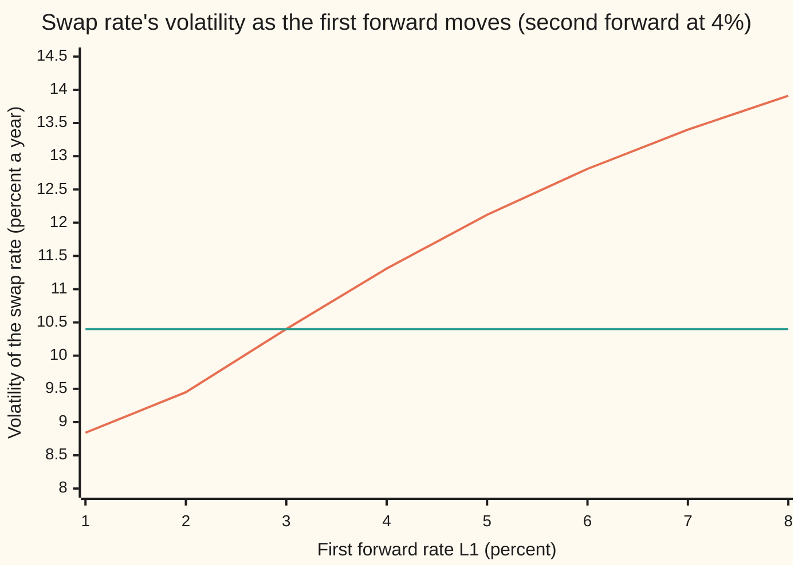
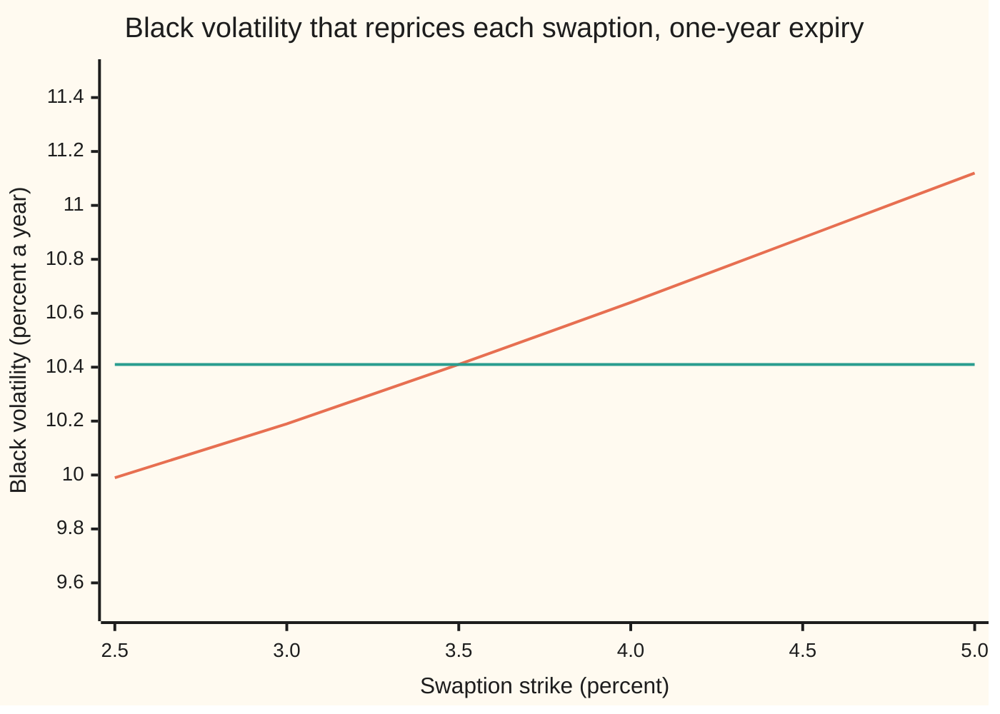

# Swap market model: lognormal swap rates instead of forwards, and why you cannot have both

[Syllabus](../../../SYLLABUS.md) → [Financial mathematics](../../../SYLLABUS.md#w12) → [Forward-Rate Models](../../../SYLLABUS.md#w12-s31) → Swap market model

---

## General Overview

A rates desk runs two books. One book sells caplets: each pays out if a single one-year borrowing rate ends up above a strike. The other sells swaptions: each is the right, one year from now, to enter a two-year swap paying a fixed rate. Both books quote prices with Black's formula, the lognormal formula from the Black-Scholes family. Lognormal means the logarithm of the rate follows a bell curve, so the rate stays positive and its percentage moves have a fixed size.

The two one-year borrowing rates that the swap covers stand today at 3% (year 1 to year 2) and 4% (year 2 to year 3). These are **forward rates**: rates agreed today for loans that start later. The desk gives the first a volatility of 20% a year and the second 10%, each driven by its own independent random shock. That is a **forward market model** ([Market models](03-libor-and-sofr-market-models.md)): every forward rate lognormal, every caplet priced exactly by Black.

The swap's fair fixed rate, the **swap rate**, is built from the same two forwards. Today it is 3.4902%. The swaption desk would like it lognormal too, with one fixed volatility near 10.40%. Making the swap rate lognormal instead of the forwards is the **swap market model**. The trouble is that the swap rate is a weighted average of the forwards, and the weights move when rates move. If the first forward climbs from 3% to 6%, the swap rate's own volatility climbs from 10.40% to 12.81%. A lognormal rate's volatility cannot depend on where rates are. So the two models cannot both hold.

**A swap market model makes a chosen swap rate lognormal under its own unit of account, which prices its swaptions exactly by Black's formula; but the swap rate is a moving blend of forward rates, so it and the forwards cannot all be lognormal at once, and a desk must choose which instruments its model prices exactly.**

**What kind of fact this is:** a model, an assumption that fits markets well enough, not a law; the clash between the two models is a theorem, proved on this card in Why it works.

### The picture: the swap rate's volatility moves with the first forward

Hold the second forward at 4% and slide the first from 1% to 8%. Under the forward market model the swap rate's volatility follows the curve. The swap market model insists on one number.



Orange: the swap rate's volatility implied by the forward market model, rising from 8.84% to 13.91%. Green: the swap market model's single fixed volatility, 10.40%, which matches the orange curve only at today's 3%. Where the first forward is low, the swap rate leans on the calm second forward; where it is high, the swap rate leans on the jumpy first one.

---

## The formula

Notation first, in words. $P(t,T)$ is the price at date $t$ of one dollar paid at date $T$: a zero-coupon bond. A superscript on $Q$ names the unit of account that prices are counted in: $Q^{A}$ is the **annuity measure** ([The annuity measure](../29-Caps%2C%20Floors%20and%20Swaptions/05-the-annuity-measure.md)), under which prices are counted in annuities, and $Q^{T_3}$ counts them in bonds paying at $T_3$. A $dW$ is the tiny random kick of a Brownian motion over a tiny slice of time.

The swap starts at $T_1$ = 1 year and pays fixed at $T_2$ = 2 and $T_3$ = 3 years, one year's interest each time. Its **annuity** and **swap rate** are

$$A(t) = P(t,T_2) + P(t,T_3), \qquad S(t) = \frac{P(t,T_1) - P(t,T_3)}{A(t)}.$$

The **swap market model** chooses, before $T_1$,

$$\frac{dS(t)}{S(t)} = \gamma(t)\,dW^{A}(t) \quad\text{under } Q^{A},$$

with $\gamma$ a fixed number or a fixed function of time, never of rates. A payer swaption with strike $K$ on notional $M$ then has exactly Black's price:

$$V = M\,A(0)\,\bigl[S(0)\,N(d_1) - K\,N(d_2)\bigr], \qquad d_{1,2} = \frac{\ln(S(0)/K) \pm \tfrac12\gamma^2 T_1}{\gamma\sqrt{T_1}}.$$

**Read it aloud:** the swap rate's percentage moves are pure noise of a fixed size when counted in annuities, so a swaption is today's annuity times a Black call on the swap rate.

The **forward market model** makes a different choice. Each forward, $L_1$ for year 1 to 2 and $L_2$ for year 2 to 3, is lognormal under the unit of its own payment bond:

$$\frac{dL_1}{L_1} = \sigma_1\,dW_1 \ \text{under } Q^{T_2}, \qquad \frac{dL_2}{L_2} = \sigma_2\,dW_2 \ \text{under } Q^{T_3}.$$

The clash is one line of algebra. Bonds link the swap rate to the forwards:

$$S = \frac{L_1 + L_2 + L_1 L_2}{2 + L_2},$$

and under the forward market model the swap rate's percentage volatility has one piece per shock:

$$\Gamma_1 = \frac{\sigma_1 L_1 (1 + L_2)}{L_1 + L_2 + L_1 L_2}, \qquad \Gamma_2 = \frac{\sigma_2 L_2 (2 + L_1)}{(2 + L_2)(L_1 + L_2 + L_1 L_2)}, \qquad \Gamma = \sqrt{\Gamma_1^2 + \Gamma_2^2}.$$

**Read it aloud:** the swap rate's volatility is made of the forwards' volatilities, weighted by how much each forward matters to the swap right now, and those weights change as the forwards move.

| Symbol | Plain meaning | In our example | Push it up and the answer… |
| --- | --- | --- | --- |
| $T_1$, $T_2$, $T_3$, $t$ | swap start and swaption expiry; the two fixed payment dates; any date before $T_1$ | 1, 2, 3 years | a later expiry gives more room for the weights to drift |
| $P(t,T)$, $T$ | price at date $t$ of one dollar paid at date $T$ | 0.975610, 0.947194, 0.910763 today | the swap rate falls if only the far bond rises |
| $L_1$, $L_2$, $x$, $y$ | forward rates for year 1 to 2 and year 2 to 3 (written $x$, $y$ in the proof) | 3% and 4% | the swap rate rises; its volatility moves too (up, as $L_1$ runs from 1% to 8%) |
| $\sigma_1$, $\sigma_2$ | volatilities of the forwards in the forward market model | 20% and 10% a year | the swap rate's volatility rises |
| $W_1$, $W_2$, $W^{A}$, $dW$ | independent random shocks; the swap model's single shock under $Q^{A}$; a shock's tiny kick | — | — |
| $A$ | the annuity: value of one dollar of fixed rate paid on each payment date | 1.857957 | each point of rate is worth more money |
| $S$ | the swap rate: the fixed rate that makes the swap worth zero | 3.4902% | a payer swaption is worth more |
| $\gamma$ | the swap market model's volatility for $S$, chosen by the modeller | 10.40% a year | every swaption rises |
| $\Gamma_1$, $\Gamma_2$, $\Gamma$ | the swap rate's volatility from each shock, and in total, under the forward market model | 8.7640%, 5.5904%, 10.3953% | — |
| $K$, $M$ | swaption strike; notional | 2.5% to 5%; $10,000,000 | payer falls; everything scales |
| $N(x)$, $d_1$, $d_2$ | bell-curve area left of $x$; Black's two cut-offs | — | — |
| $Q$, $Q^{A}$, $Q^{T_2}$, $Q^{T_3}$ | pricing weights with annuities, or bonds paying at $T_2$ or $T_3$, as the unit | — | — |

### When it holds

- **Positive rates, one curve.** The same bonds set both the forwards and the discounting. Lognormal rates cannot go below zero. With negative rates a desk shifts the rate or uses a normal model ([Rate volatilities](../29-Caps%2C%20Floors%20and%20Swaptions/06-normal-and-shifted-volatilities-for-rates.md)); the clash on this card survives in the shifted rates.
- **Deterministic volatility.** $\gamma$ may depend on time, not on rates. Let it depend on rates or on a random factor and the clash can go away, at the price of Black no longer being exact.
- **A physically settled swaption.** The holder receives the swap itself, worth $A(T_1)(S(T_1) - K)$ per dollar of notional. Cash settlement uses a different annuity formula and needs its own pricing unit.
- **Two or more coupons, and moving forwards.** With one coupon the swap rate is the forward itself and nothing clashes. With every volatility zero nothing moves and nothing clashes either.

---

## Why it works

### Step 0: a swap rate is an average of forwards with moving weights

A two-year swap pays the fixed rate twice and receives the two floating rates. It is fair when the fixed rate equals an average of the two forwards, each weighted by the value of its payment date:

$$S = \frac{P(t,T_2)}{A}\,L_1 + \frac{P(t,T_3)}{A}\,L_2.$$

Today the weights are 0.509804 and 0.490196. Both depend on bond prices, and bond prices depend on the forwards. So the swap rate is not a fixed blend. It is a blend whose recipe changes as rates move.

### Step 1: write the swap rate as a function of the two forwards

Count every bond in units of the $T_1$ bond. Rolling a dollar forward one year at $L_1$ gives $P(T_2)/P(T_1) = 1/(1 + L_1)$, and another year gives $P(T_3)/P(T_1) = 1/((1 + L_1)(1 + L_2))$. Put those into $S = (P(T_1) - P(T_3))/A$ and multiply top and bottom by $(1 + L_1)(1 + L_2)$:

$$S = \frac{(1+L_1)(1+L_2) - 1}{(1 + L_2) + 1} = \frac{L_1 + L_2 + L_1 L_2}{2 + L_2}.$$

The $L_1 L_2$ term is interest on interest. The denominator is the annuity in the same units.

### Step 2: the swap rate has no drift in annuity units, whatever the model

A swap rate is a traded difference of bonds divided by a traded annuity. Any traded price divided by the unit of account has no drift under that unit's pricing weights. So $S$ is a **martingale** (a process whose average future value is its value today) under $Q^{A}$, in every model without free money. That is the annuity-measure card's theorem. It says nothing about the *size* or *shape* of the swap rate's moves. The swap market model's extra assumption is the shape: lognormal, with fixed $\gamma$.

The draws in the code confirm the no-drift half: averaged with annuity weights over two million simulated futures, the swap rate at expiry is 3.4902%, today's value.

### Step 3: under the forward market model, the swap rate's volatility depends on the rates

Take the forward market model with independent shocks. Counted in $T_3$ bonds, both forwards have no drift: the second by construction, the first because its drift correction is proportional to the correlation between the shocks, here zero. Now apply Itô's lemma ([Ito's lemma](../../11-Stochastic%20processes%20and%20calculus/06-Ito%20Calculus/02-itos-lemma.md)) to Step 1's formula. The random part of the swap rate's percentage move is

$$\frac{dS}{S} = (\text{no drift under } Q^{A}) + \Gamma_1\,dW_1 + \Gamma_2\,dW_2^{A},$$

with $\Gamma_1$ and $\Gamma_2$ as in The formula, and $dW_2^{A}$ the second shock as seen in annuity units. Each is a forward's volatility times the percentage sensitivity of $S$ to that forward. At today's rates those sensitivities are 0.438202 and 0.559044, giving $\Gamma_1$ = 8.7640% and $\Gamma_2$ = 5.5904%. The total, $\Gamma$ = 10.3953%, is the square root of the sum of squares because the shocks are independent.

Move the first forward to 6% and $\Gamma_1$ becomes 12.1875% and $\Gamma_2$ 3.9445%; the total becomes 12.8099%. The swap rate's volatility has changed although no volatility input changed.

### Step 4: a deterministic volatility cannot equal a moving one

The swap market model demands that the swap rate's squared volatility equal $\gamma(t)^2$, a number fixed in advance for each date. The forward market model delivers $\Gamma^2$, which depends on where $L_1$ and $L_2$ happen to be. Both forwards are lognormal with independent shocks, so at any date before expiry every pair of positive rates is possible. $\Gamma^2$ takes different values across those pairs. No fixed number can match all of them. So the two models cannot both hold for the same swap.

The squared volatility is the right thing to compare because it does not depend on how the shocks are labelled: rotate or recombine $W_1$ and $W_2$ and the total variance of $\ln S$ per unit time stays the same.

<details>
<summary>Detailed proof</summary>

Work before $T_1$ and write $x = L_1$, $y = L_2$, $f(x,y) = (x + y + xy)/(2 + y)$.

**The two forwards under $Q^{T_3}$.** $y$ is driftless lognormal under $Q^{T_3}$ by assumption. $x$ is driftless under $Q^{T_2}$; the density of $Q^{T_2}$ relative to $Q^{T_3}$ is proportional to $P(t,T_2)/P(t,T_3) = 1 + y$, whose random part is driven by $W_2$ alone. Since $W_1$ and $W_2$ are independent, the change of unit shifts only $W_2$, so $x$ stays driftless under $Q^{T_3}$ too. Hence $x_t = L_1(0)\,e^{\sigma_1 W_1(t) - \sigma_1^2 t/2}$ and $y_t = L_2(0)\,e^{\sigma_2 W_2(t) - \sigma_2^2 t/2}$, independent, with a strictly positive joint density on the whole positive quadrant at every $0 < t \le T_1$.

**Change to annuity units.** The density of $Q^{A}$ relative to $Q^{T_3}$ is $A(t)/P(t,T_3) = 2 + y$, normalised by its value today. Its random part is $\sigma_2 y/(2 + y)\,dW_2$, so Girsanov's theorem gives $dW_2 = dW_2^{A} + \sigma_2 y/(2 + y)\,dt$ and leaves $W_1$ alone. Under $Q^{A}$, $dx = \sigma_1 x\,dW_1$ and $dy = \sigma_2^2 y^2/(2 + y)\,dt + \sigma_2 y\,dW_2^{A}$. Equivalent measures agree on which sets of states have positive probability, so full support survives.

**Itô's lemma on $f(x,y)$.** The partial derivatives are $f_x = (1 + y)/(2 + y)$, $f_y = (2 + x)/(2 + y)^2$, $f_{xx} = 0$, $f_{yy} = -2(2 + x)/(2 + y)^3$, and $x$, $y$ have no joint variation. The drift of $S = f(x,y)$ under $Q^{A}$ is
$$f_y\,\frac{\sigma_2^2 y^2}{2 + y} + \tfrac12 f_{yy}\,\sigma_2^2 y^2 = \frac{\sigma_2^2 y^2 (2 + x)}{(2 + y)^3} - \frac{\sigma_2^2 y^2 (2 + x)}{(2 + y)^3} = 0,$$
as Step 2 promised. The diffusion is $f_x \sigma_1 x\,dW_1 + f_y \sigma_2 y\,dW_2^{A}$. Dividing by $S$ gives $\Gamma_1$ and $\Gamma_2$ as stated.

**The contradiction.** The variance rate of $\ln S$ is $v(x,y) = \Gamma_1^2 + \Gamma_2^2$, a quantity that no relabelling of the shocks changes. It is continuous, and it is not constant: at $y$ = 4% its square root is 10.3953% at $x$ = 3% and 12.8099% at $x$ = 6%, as Worked numbers shows. If the swap market model held, $v(x_t, y_t) = \gamma(t)^2$ for almost every $t$ with probability one. Pick such a $t > 0$: full support and continuity would force $v(x,y)$ to be constant on the quadrant. It is not. So a non-degenerate two-factor lognormal forward model and a deterministic-volatility lognormal swap model cannot describe the same two-coupon swap.

</details>


### Step 5: the converse in numbers

Suppose the swap rate and the second forward are both lognormal, as a swap market model on the two swaps ending at year 3 says (the one-coupon swap from year 2 to 3 has swap rate $L_2$). Then the first forward is whatever the bonds make it: $L_1 = (S(2 + L_2) - L_2)/(1 + L_2)$. If the swap rate falls to 1% while $L_2$ stays at 4%, the first forward comes out at −1.8846%. Both roads in the code, the formula and rebuilding the bonds, agree. When the two lognormal rates are driven by shocks that are not perfectly correlated, every pair of positive values is possible, so this state has positive probability. A lognormal rate never goes below zero, so in a swap market model the forwards are not lognormal, and caplets are no longer priced exactly by Black.

### Another road: freeze the weights

The practical escape is approximation: pretend the moving parts stay where they are today. Rebonato's formula, the one the calibration card uses ([Calibrating a market model](04-calibrating-a-market-model.md)), freezes Step 0's weights at 0.509804 and 0.490196. The swap rate's volatility is then 10.4101% for the whole life of the option. Freezing instead Step 3's sensitivities, which also count how the weights move, gives today's $\Gamma$, 10.3953%. At the money these price the swaption at $26,918.72 and $26,880.39, against the forward model's $26,905.75: close, not exact, and the gap grows away from the money.

---

## Worked numbers, by hand

Notional $10,000,000. The rate for the first year is 2.5%, so $P(0,T_1)$ = 1/1.025. Forwards 3% and 4%, volatilities 20% and 10%, independent shocks, expiry one year.

| Step | Arithmetic | Value |
| --- | --- | --- |
| $P(0,T_1)$ | $1/1.025$ | 0.975610 |
| $P(0,T_2)$ | $0.975610/1.03$ | 0.947194 |
| $P(0,T_3)$ | $0.947194/1.04$ | 0.910763 |
| annuity $A(0)$ | $0.947194 + 0.910763$ | 1.857957 |
| swap rate $S(0)$ | $(0.03 + 0.04 + 0.0012)/2.04 = 0.0712/2.04$ | **3.4902%** |
| $\Gamma_1$ at $L_1$ = 3% | $0.20 \times 0.03 \times 1.04 / 0.0712$ | 8.7640% |
| $\Gamma_2$ at $L_1$ = 3% | $0.10 \times 0.04 \times 2.03 / (2.04 \times 0.0712)$ | 5.5904% |
| $\Gamma$ at $L_1$ = 3% | $\sqrt{0.087640^2 + 0.055904^2}$ | **10.3953%** |
| $\Gamma_1$ at $L_1$ = 6% | $0.20 \times 0.06 \times 1.04 / 0.1024$ | 12.1875% |
| $\Gamma$ at $L_1$ = 6% | $\sqrt{0.121875^2 + 0.039445^2}$ | **12.8099%** |

Doubling the first forward lifted the swap rate's volatility by almost a quarter, with no input volatility touched. A desk running a forward market model sees its swap-rate volatilities drift with the curve; a desk running a swap market model sees its caplet volatilities do the same.

### A second worked case: the smile the forward model draws

If the swap rate were lognormal, one Black volatility would reprice swaptions at every strike. Price payer swaptions on the $10,000,000 swap under the forward market model, then ask Black which volatility reproduces each price:

| Strike | Forward-model price | Black volatility that reproduces it |
| --- | --- | --- |
| 2.5% | $183,980.17 | 9.9879% |
| 3.0% | $92,930.96 | 10.1896% |
| 3.4902% (at the money) | $26,905.75 | 10.4051% |
| 3.5% | $26,054.10 | 10.4095% |
| 4.0% | $3,498.00 | 10.6425% |
| 4.5% | $263.90 | 10.8806% |
| 5.0% | $14.07 | 11.1159% |



Orange: the Black volatility that reproduces each forward-model price. Green: a swap market model calibrated at the money, one volatility for every strike. The orange line slopes up: high strikes pay off in futures where the swap rate is high, which are mostly futures where the jumpy first forward is high, where Step 3 showed the swap rate's volatility is higher. A lognormal swap rate has a flat line by definition. The slope is the clash, measured in prices.

### What breaks if you drop a piece

| Mistake | Comes out at | What went wrong |
| --- | --- | --- |
| Use the at-the-money volatility for the 5% swaption | $5.64 (right: $14.07) | The forward model's swap rate is not lognormal; one volatility cannot serve every strike |
| Same, for the 4.5% swaption | $183.16 (right: $263.90) | Same skew, a smaller miss nearer the money |
| Add the two volatility pieces, 8.7640% + 5.5904% = 14.3545% | $37,103.12 at the money (right: $26,905.75) | Independent shocks combine as the square root of the sum of squares, not the sum |

The code prints every one of these.

---

## Code, from first principles, and it actually runs

Every result is reached twice. The swap rate comes from bond prices and from Step 1's algebra. Its volatility comes from the $\Gamma$ formulas and from nudging each forward and re-pricing the bonds. Each swaption is priced by one integral over the second forward's shock, with Black's formula handling the first forward exactly given the second, and by a million pairs of random shocks, each used with its mirror image. Halving an interval backs out each Black volatility. Nothing imported knows the answer: the bell-curve area is summed slice by slice and the random numbers come from a hand-written xorshift generator.

### Python

```python
# Swap market model in outline -- the check behind the card.  Standard library only.
# Two annual forwards, L1 (year 1 to 2) and L2 (year 2 to 3), each lognormal on its own
# independent shock: a forward market model.  The two-coupon swap rate built from them
# is then shown not to be lognormal, by formula, by nudging, and by pricing swaptions.
from math import log, exp, sqrt, pi, cos

L1, L2, S1, S2, T = 0.03, 0.04, 0.20, 0.10, 1.0     # forwards, their vols, expiry in years
D1, NOTIONAL = 1 / 1.025, 10_000_000.0               # today's price of $1 paid in one year

def phi(z): return exp(-0.5 * z * z) / sqrt(2 * pi)  # bell-curve height
def simpson(f, a, b, n):
    h = (b - a) / n; s = f(a) + f(b)
    for i in range(1, n): s += (4 if i % 2 else 2) * f(a + i * h)
    return s * h / 3
def N(x):                                            # bell-curve area left of x, by slices
    if abs(x) > 8: return 0.0 if x < 0 else 1.0
    return 0.5 + simpson(phi, 0.0, x, 200)
def black(F, K, vol, t):                             # undiscounted Black call on lognormal F
    if K <= 0: return F - K
    sd = vol * sqrt(t); d1 = (log(F / K) + 0.5 * sd * sd) / sd
    return F * N(d1) - K * N(d1 - sd)

def bonds(l1, l2):                  # bond prices at T1, T2, T3, each in units of the T1 bond
    p2 = 1 / (1 + l1)
    return 1.0, p2, p2 / (1 + l2)
def swap_from_bonds(l1, l2):        # road 1: (P(T1) - P(T3)) / (P(T2) + P(T3))
    p1, p2, p3 = bonds(l1, l2)
    return (p1 - p3) / (p2 + p3)
def swap_formula(l1, l2): return (l1 + l2 + l1 * l2) / (2 + l2)       # road 2: the algebra
def gamma(l1, l2, s1=S1, s2=S2):    # the swap rate's percentage vol, one entry per shock
    d = l1 + l2 + l1 * l2
    return s1 * l1 * (1 + l2) / d, s2 * l2 * (l1 + 2) / ((2 + l2) * d)
def gamma_bump(l1, l2, h=1e-5):     # the same by nudging each forward by a tiny percentage
    g1 = log(swap_from_bonds(l1 * exp(h), l2) / swap_from_bonds(l1 * exp(-h), l2)) / (2 * h)
    g2 = log(swap_from_bonds(l1, l2 * exp(h)) / swap_from_bonds(l1, l2 * exp(-h))) / (2 * h)
    return S1 * g1, S2 * g2
def size(g): return sqrt(g[0] ** 2 + g[1] ** 2)

def payer_integral(K, s1=S1, s2=S2, t=T):
    # Road A.  Terminal-bond measure: both forwards driftless, independent.  Given L2 = y
    # at expiry, (2 + y)(S - K)+ = (1 + y)(L1 - x*)+, a Black call on L1 with strike x*.
    def f(z):
        y = L2 * exp(s2 * sqrt(t) * z - 0.5 * s2 * s2 * t)
        xs = (K * (2 + y) - y) / (1 + y)
        return (1 + y) * black(L1, xs, s1, t) * phi(z)
    return simpson(f, -8.0, 8.0, 400)
state = 88172645463325252
def uniform():                      # xorshift64, our own random numbers
    global state
    state ^= (state << 13) & 0xFFFFFFFFFFFFFFFF; state ^= state >> 7
    state ^= (state << 17) & 0xFFFFFFFFFFFFFFFF
    return ((state >> 11) + 0.5) / 2.0 ** 53
def payer_mc(strikes, paths=1_000_000):   # Road B: draw both shocks, and their mirror image
    sums = [0.0] * len(strikes); sq = [0.0] * len(strikes); ann = 0.0
    for _ in range(paths):
        u1, u2 = uniform(), uniform()
        r = sqrt(-2 * log(u1))
        z1, z2 = r * cos(2 * pi * u2), r * cos(2 * pi * u2 - pi / 2)
        v = [0.0] * len(strikes)
        for sign in (1.0, -1.0):
            x = L1 * exp(sign * S1 * sqrt(T) * z1 - 0.5 * S1 * S1 * T)
            y = L2 * exp(sign * S2 * sqrt(T) * z2 - 0.5 * S2 * S2 * T)
            s = swap_formula(x, y); ann += 0.5 * (2 + y) * s
            for i, K in enumerate(strikes): v[i] += 0.5 * (2 + y) * max(s - K, 0.0)
        for i in range(len(strikes)): sums[i] += v[i]; sq[i] += v[i] * v[i]
    means = [a / paths for a in sums]
    ses = [sqrt((q / paths - m * m) / paths) for q, m in zip(sq, means)]
    return means, ses, ann / paths
def implied(target, K, t=T):        # Black vol that reproduces a price, by halving
    lo, hi = 1e-4, 1.0
    for _ in range(100):
        mid = 0.5 * (lo + hi)
        lo, hi = (mid, hi) if black(S0, K, mid, t) < target else (lo, mid)
    return 0.5 * (lo + hi)

S0, S0b = swap_formula(L1, L2), swap_from_bonds(L1, L2)
A0 = D1 * (bonds(L1, L2)[1] + bonds(L1, L2)[2])   # annuity today, dollars per $1 of rate
P3 = D1 * bonds(L1, L2)[2]
g, gb = gamma(L1, L2), gamma_bump(L1, L2)
g6, g6b = gamma(0.06, L2), gamma_bump(0.06, L2)
money = lambda e: NOTIONAL * P3 * e                # expectation in T3 units -> dollars
print(f"{'swap rate from bonds':<34}{S0b:>14.6f}")
print(f"{'swap rate from the algebra':<34}{S0:>14.6f}")
print(f"{'bonds P(T1) P(T2) P(T3) today':<34}" + "".join(f"{D1 * p:>10.6f}" for p in bonds(L1, L2)))
print(f"{'annuity today A(0)':<34}{A0:>14.6f}")
print(f"{'average weights P(T2)/A, P(T3)/A':<34}{D1 * bonds(L1, L2)[1] / A0:>14.6f}{P3 / A0:>10.6f}")
for lab, a, b in (("gamma1 at L1 = 3%", g[0], gb[0]), ("gamma2 at L1 = 3%", g[1], gb[1]),
                  ("gamma1 at L1 = 6%", g6[0], g6b[0]), ("gamma2 at L1 = 6%", g6[1], g6b[1])):
    print(f"{lab:<24}formula{a:>11.6f}  nudge{b:>11.6f}")
print(f"{'swap vol size at L1 = 3%':<34}{size(g):>14.6f}")
print(f"{'swap vol size at L1 = 6%':<34}{size(g6):>14.6f}")
print(f"{'weights dlnS/dlnL1, dlnS/dlnL2':<34}{g[0] / S1:>14.6f}{g[1] / S2:>10.6f}")
one = lambda l: (bonds(l, L2)[0] - bonds(l, L2)[1]) / bonds(l, L2)[1]     # one-coupon swap rate
g_one = S1 * log(one(L1 * exp(1e-5)) / one(L1 * exp(-1e-5))) / 2e-5
print(f"{'one coupon: swap vol by nudging':<34}{g_one:>14.6f}")
print("chart, swap vol (%) as L1 runs 1..8%, L2 = 4%:")
print("  forward model " + " ".join(f"{100 * size(gamma(i / 100, L2)):.2f}" for i in range(1, 9)))
print("  swap model    " + " ".join(f"{100 * size(g):.2f}" for i in range(1, 9)))

strikes = [0.025, 0.03, 0.035, 0.04, 0.045, 0.05, S0]
exact = [payer_integral(K) for K in strikes]
mc, se, ann = payer_mc(strikes)
print(f"{'annuity measure: E[S] by draws':<34}{ann / (2 + L2):>14.6f}")
print("strike %   integral $    draws $  std error $  implied Black vol %")
vols = []
for K, e, m, s in zip(strikes, exact, mc, se):
    v = implied(e / (2 + L2), K); vols.append(v)
    print(f"{100 * K:8.4f}{money(e):>13.2f}{money(m):>11.2f}{money(s):>11.2f}{100 * v:>18.4f}")
atm = vols[-1]
print("chart, implied vol (%) strikes 2.5..5.0: " + " ".join(f"{100 * v:.2f}" for v in vols[:6]))
flat = lambda K, v: money(black(S0, K, v, T) * (2 + L2))
print(f"{'frozen sensitivities: vol, ATM $':<34}{size(g):>14.6f}{flat(S0, size(g)):>14.2f}")
w1, w2 = D1 * bonds(L1, L2)[1] / A0, P3 / A0      # Rebonato: freeze the averaging weights
reb = size((S1 * w1 * L1 / S0, S2 * w2 * L2 / S0))
print(f"{'frozen weights (Rebonato): vol, $':<34}{reb:>14.6f}{flat(S0, reb):>14.2f}")
print(f"{'wrong: flat ATM vol, 5% strike $':<34}{flat(0.05, atm):>14.2f}")
print(f"{'wrong: flat ATM vol, 4.5% strike $':<34}{flat(0.045, atm):>14.2f}")
print(f"{'wrong: vols added, not combined':<34}{g[0] + g[1]:>14.6f}{flat(S0, g[0] + g[1]):>14.2f}")
xs = (0.01 * (2 + L2) - L2) / (1 + L2)
p1 = 0.01 * (2 + L2) + 1.0                          # swap model state back to bonds: P(T1)
print(f"{'swap model, S = 1%, L2 = 4%: L1':<34}{xs:>14.6f}{p1 / (1 + L2) - 1:>12.6f}")
tv = [implied(payer_integral(K, S1, 0.20) / (2 + L2), K) for K in (0.025, 0.05)]
t5 = [implied(payer_integral(K, t=5.0) / (2 + L2), K, 5.0) for K in (0.025, 0.05)]
print(f"{'try: sigma2 = 20%, vol at 2.5%, 5%':<34}{100 * tv[0]:>14.4f}{100 * tv[1]:>10.4f}")
print(f"{'try: expiry 5 years, vol 2.5%, 5%':<34}{100 * t5[0]:>14.4f}{100 * t5[1]:>10.4f}")

assert abs(S0 - S0b) < 1e-14, "bond road and algebra road must agree"
assert max(abs(a - b) for a, b in zip(g + g6, gb + g6b)) < 1e-8, "closed-form vol vs nudging"
assert all(abs(e - m) < 4 * s for e, m, s in zip(exact, mc, se)), "integral vs draws"
assert abs(ann / (2 + L2) - S0) < 3e-5, "swap rate is driftless in annuity units"
assert vols[0] < atm - 0.002 and vols[5] > atm + 0.002, "a lognormal swap rate has no skew"
assert abs(g_one - S1) < 1e-8, "one coupon: the swap rate is the forward, same vol"
assert abs(swap_from_bonds(xs, L2) - 0.01) < 1e-14, "recovered L1 reprices the 1% swap through bonds"
assert abs(p1 / (1 + L2) - 1 - xs) < 1e-14, "L1 from the formula and from rebuilt bonds agree"
assert size(g6) > size(g) + 0.02, "the swap rate's vol moves with L1, so no fixed gamma fits both"
assert min(abs(reb - atm), abs(size(g) - atm)) > 2e-5, "frozen approximations are not exact"
print("ALL CHECKS PASS")
```

**Ran 2026-09-28 on macOS, Python 3.14.6, standard library only. All checks passed. Output, pasted from the run:**

```
swap rate from bonds                    0.034902
swap rate from the algebra              0.034902
bonds P(T1) P(T2) P(T3) today       0.975610  0.947194  0.910763
annuity today A(0)                      1.857957
average weights P(T2)/A, P(T3)/A        0.509804  0.490196
gamma1 at L1 = 3%       formula   0.087640  nudge   0.087640
gamma2 at L1 = 3%       formula   0.055904  nudge   0.055904
gamma1 at L1 = 6%       formula   0.121875  nudge   0.121875
gamma2 at L1 = 6%       formula   0.039445  nudge   0.039445
swap vol size at L1 = 3%                0.103953
swap vol size at L1 = 6%                0.128099
weights dlnS/dlnL1, dlnS/dlnL2          0.438202  0.559044
one coupon: swap vol by nudging         0.200000
chart, swap vol (%) as L1 runs 1..8%, L2 = 4%:
  forward model 8.84 9.45 10.40 11.31 12.12 12.81 13.40 13.91
  swap model    10.40 10.40 10.40 10.40 10.40 10.40 10.40 10.40
annuity measure: E[S] by draws          0.034902
strike %   integral $    draws $  std error $  implied Black vol %
  2.5000    183980.17  183979.51       8.51            9.9879
  3.0000     92930.96   92932.43      13.03           10.1896
  3.5000     26054.10   26038.92      23.58           10.4095
  4.0000      3498.00    3502.42      10.85           10.6425
  4.5000       263.90     268.97       2.95           10.8806
  5.0000        14.07      14.78       0.67           11.1159
  3.4902     26905.75   26890.60      23.65           10.4051
chart, implied vol (%) strikes 2.5..5.0: 9.99 10.19 10.41 10.64 10.88 11.12
frozen sensitivities: vol, ATM $        0.103953      26880.39
frozen weights (Rebonato): vol, $       0.104101      26918.72
wrong: flat ATM vol, 5% strike $            5.64
wrong: flat ATM vol, 4.5% strike $        183.16
wrong: vols added, not combined         0.143545      37103.12
swap model, S = 1%, L2 = 4%: L1        -0.018846   -0.018846
try: sigma2 = 20%, vol at 2.5%, 5%       14.2453   14.2925
try: expiry 5 years, vol 2.5%, 5%        10.0445   11.1112
ALL CHECKS PASS
```

### Rust

```rust
// Swap market model in outline -- the same check as swap_market_model_in_outline_check.py.
// Standard library only, no crates.  Two annual forwards, L1 (year 1 to 2) and L2 (year 2
// to 3), each lognormal on its own independent shock: a forward market model.  The
// two-coupon swap rate built from them is shown not to be lognormal, three ways.
use std::f64::consts::PI;

const L1: f64 = 0.03; const L2: f64 = 0.04; const S1: f64 = 0.20; const S2: f64 = 0.10;
const T: f64 = 1.0; const NOTIONAL: f64 = 10_000_000.0;

fn phi(z: f64) -> f64 { (-0.5 * z * z).exp() / (2.0 * PI).sqrt() }
fn simpson<F: Fn(f64) -> f64>(f: F, a: f64, b: f64, n: usize) -> f64 {
    let h = (b - a) / n as f64;
    let mut s = f(a) + f(b);
    for i in 1..n { s += if i % 2 == 1 { 4.0 } else { 2.0 } * f(a + i as f64 * h); }
    s * h / 3.0
}
fn n_cdf(x: f64) -> f64 {
    if x.abs() > 8.0 { return if x < 0.0 { 0.0 } else { 1.0 }; }
    0.5 + simpson(phi, 0.0, x, 200)
}
fn black(f: f64, k: f64, vol: f64, t: f64) -> f64 {        // undiscounted Black call
    if k <= 0.0 { return f - k; }
    let sd = vol * t.sqrt();
    let d1 = ((f / k).ln() + 0.5 * sd * sd) / sd;
    f * n_cdf(d1) - k * n_cdf(d1 - sd)
}
fn bonds(l1: f64, l2: f64) -> [f64; 3] {                   // P(T1), P(T2), P(T3) per T1 bond
    let p2 = 1.0 / (1.0 + l1);
    [1.0, p2, p2 / (1.0 + l2)]
}
fn swap_from_bonds(l1: f64, l2: f64) -> f64 {
    let p = bonds(l1, l2);
    (p[0] - p[2]) / (p[1] + p[2])
}
fn swap_formula(l1: f64, l2: f64) -> f64 { (l1 + l2 + l1 * l2) / (2.0 + l2) }
fn gamma(l1: f64, l2: f64) -> (f64, f64) {
    let d = l1 + l2 + l1 * l2;
    (S1 * l1 * (1.0 + l2) / d, S2 * l2 * (l1 + 2.0) / ((2.0 + l2) * d))
}
fn gamma_bump(l1: f64, l2: f64) -> (f64, f64) {
    let h: f64 = 1e-5;
    let g1 = (swap_from_bonds(l1 * h.exp(), l2) / swap_from_bonds(l1 * (-h).exp(), l2)).ln() / (2.0 * h);
    let g2 = (swap_from_bonds(l1, l2 * h.exp()) / swap_from_bonds(l1, l2 * (-h).exp())).ln() / (2.0 * h);
    (S1 * g1, S2 * g2)
}
fn size(g: (f64, f64)) -> f64 { (g.0 * g.0 + g.1 * g.1).sqrt() }
fn payer_integral(k: f64, s1: f64, s2: f64, t: f64) -> f64 {   // road A: one integral
    let f = |z: f64| {
        let y = L2 * (s2 * t.sqrt() * z - 0.5 * s2 * s2 * t).exp();
        let xs = (k * (2.0 + y) - y) / (1.0 + y);
        (1.0 + y) * black(L1, xs, s1, t) * phi(z)
    };
    simpson(f, -8.0, 8.0, 400)
}
struct Rng(u64);
impl Rng {                                                   // xorshift64
    fn uniform(&mut self) -> f64 {
        self.0 ^= self.0 << 13; self.0 ^= self.0 >> 7; self.0 ^= self.0 << 17;
        ((self.0 >> 11) as f64 + 0.5) / (2.0f64).powi(53)
    }
}
fn payer_mc(strikes: &[f64], paths: usize) -> (Vec<f64>, Vec<f64>, f64) {   // road B
    let m = strikes.len();
    let (mut sums, mut sq, mut ann) = (vec![0.0; m], vec![0.0; m], 0.0);
    let mut rng = Rng(88172645463325252);
    for _ in 0..paths {
        let (u1, u2) = (rng.uniform(), rng.uniform());
        let r = (-2.0 * u1.ln()).sqrt();
        let (z1, z2) = (r * (2.0 * PI * u2).cos(), r * (2.0 * PI * u2 - PI / 2.0).cos());
        let mut v = vec![0.0; m];
        for sign in [1.0, -1.0] {
            let x = L1 * (sign * S1 * T.sqrt() * z1 - 0.5 * S1 * S1 * T).exp();
            let y = L2 * (sign * S2 * T.sqrt() * z2 - 0.5 * S2 * S2 * T).exp();
            let s = swap_formula(x, y);
            ann += 0.5 * (2.0 + y) * s;
            for i in 0..m { v[i] += 0.5 * (2.0 + y) * (s - strikes[i]).max(0.0); }
        }
        for i in 0..m { sums[i] += v[i]; sq[i] += v[i] * v[i]; }
    }
    let n = paths as f64;
    let means: Vec<f64> = sums.iter().map(|a| a / n).collect();
    let ses = sq.iter().zip(&means).map(|(q, mu)| ((q / n - mu * mu) / n).sqrt()).collect();
    (means, ses, ann / n)
}
fn implied(s0: f64, target: f64, k: f64, t: f64) -> f64 {  // Black vol by halving
    let (mut lo, mut hi) = (1e-4, 1.0);
    for _ in 0..100 {
        let mid = 0.5 * (lo + hi);
        if black(s0, k, mid, t) < target { lo = mid; } else { hi = mid; }
    }
    0.5 * (lo + hi)
}

fn main() {
    let d1 = 1.0 / 1.025;
    let (s0, s0b) = (swap_formula(L1, L2), swap_from_bonds(L1, L2));
    let p = bonds(L1, L2);
    let (a0, p3) = (d1 * (p[1] + p[2]), d1 * p[2]);
    let (g, gb, g6, g6b) = (gamma(L1, L2), gamma_bump(L1, L2), gamma(0.06, L2), gamma_bump(0.06, L2));
    let money = |e: f64| NOTIONAL * p3 * e;
    println!("{:<34}{:>14.6}", "swap rate from bonds", s0b);
    println!("{:<34}{:>14.6}", "swap rate from the algebra", s0);
    println!("{:<34}{:>10.6}{:>10.6}{:>10.6}", "bonds P(T1) P(T2) P(T3) today", d1 * p[0], d1 * p[1], d1 * p[2]);
    println!("{:<34}{:>14.6}", "annuity today A(0)", a0);
    println!("{:<34}{:>14.6}{:>10.6}", "average weights P(T2)/A, P(T3)/A", d1 * p[1] / a0, p3 / a0);
    for (lab, a, b) in [("gamma1 at L1 = 3%", g.0, gb.0), ("gamma2 at L1 = 3%", g.1, gb.1),
                        ("gamma1 at L1 = 6%", g6.0, g6b.0), ("gamma2 at L1 = 6%", g6.1, g6b.1)] {
        println!("{:<24}formula{:>11.6}  nudge{:>11.6}", lab, a, b);
    }
    println!("{:<34}{:>14.6}", "swap vol size at L1 = 3%", size(g));
    println!("{:<34}{:>14.6}", "swap vol size at L1 = 6%", size(g6));
    println!("{:<34}{:>14.6}{:>10.6}", "weights dlnS/dlnL1, dlnS/dlnL2", g.0 / S1, g.1 / S2);
    let one = |l: f64| { let b = bonds(l, L2); (b[0] - b[1]) / b[1] };
    let g_one = S1 * (one(L1 * 1e-5f64.exp()) / one(L1 * (-1e-5f64).exp())).ln() / 2e-5;
    println!("{:<34}{:>14.6}", "one coupon: swap vol by nudging", g_one);
    println!("chart, swap vol (%) as L1 runs 1..8%, L2 = 4%:");
    let fm: Vec<String> = (1..9).map(|i| format!("{:.2}", 100.0 * size(gamma(i as f64 / 100.0, L2)))).collect();
    println!("  forward model {}", fm.join(" "));
    println!("  swap model    {}", vec![format!("{:.2}", 100.0 * size(g)); 8].join(" "));

    let strikes = [0.025, 0.03, 0.035, 0.04, 0.045, 0.05, s0];
    let exact: Vec<f64> = strikes.iter().map(|&k| payer_integral(k, S1, S2, T)).collect();
    let (mc, se, ann) = payer_mc(&strikes, 1_000_000);
    println!("{:<34}{:>14.6}", "annuity measure: E[S] by draws", ann / (2.0 + L2));
    println!("strike %   integral $    draws $  std error $  implied Black vol %");
    let mut vols = vec![];
    for i in 0..strikes.len() {
        let v = implied(s0, exact[i] / (2.0 + L2), strikes[i], T);
        vols.push(v);
        println!("{:8.4}{:>13.2}{:>11.2}{:>11.2}{:>18.4}", 100.0 * strikes[i], money(exact[i]), money(mc[i]), money(se[i]), 100.0 * v);
    }
    let atm = vols[6];
    let iv: Vec<String> = vols[..6].iter().map(|v| format!("{:.2}", 100.0 * v)).collect();
    println!("chart, implied vol (%) strikes 2.5..5.0: {}", iv.join(" "));
    let flat = |k: f64, v: f64| money(black(s0, k, v, T) * (2.0 + L2));
    println!("{:<34}{:>14.6}{:>14.2}", "frozen sensitivities: vol, ATM $", size(g), flat(s0, size(g)));
    let (w1, w2) = (d1 * p[1] / a0, p3 / a0);                 // Rebonato: freeze the weights
    let reb = size((S1 * w1 * L1 / s0, S2 * w2 * L2 / s0));
    println!("{:<34}{:>14.6}{:>14.2}", "frozen weights (Rebonato): vol, $", reb, flat(s0, reb));
    println!("{:<34}{:>14.2}", "wrong: flat ATM vol, 5% strike $", flat(0.05, atm));
    println!("{:<34}{:>14.2}", "wrong: flat ATM vol, 4.5% strike $", flat(0.045, atm));
    println!("{:<34}{:>14.6}{:>14.2}", "wrong: vols added, not combined", g.0 + g.1, flat(s0, g.0 + g.1));
    let xs = (0.01 * (2.0 + L2) - L2) / (1.0 + L2);
    let p1 = 0.01 * (2.0 + L2) + 1.0;                        // swap model state back to bonds
    println!("{:<34}{:>14.6}{:>12.6}", "swap model, S = 1%, L2 = 4%: L1", xs, p1 / (1.0 + L2) - 1.0);
    let tv: Vec<f64> = [0.025, 0.05].iter().map(|&k| implied(s0, payer_integral(k, S1, 0.20, T) / (2.0 + L2), k, T)).collect();
    let t5: Vec<f64> = [0.025, 0.05].iter().map(|&k| implied(s0, payer_integral(k, S1, S2, 5.0) / (2.0 + L2), k, 5.0)).collect();
    println!("{:<34}{:>14.4}{:>10.4}", "try: sigma2 = 20%, vol at 2.5%, 5%", 100.0 * tv[0], 100.0 * tv[1]);
    println!("{:<34}{:>14.4}{:>10.4}", "try: expiry 5 years, vol 2.5%, 5%", 100.0 * t5[0], 100.0 * t5[1]);

    assert!((s0 - s0b).abs() < 1e-14, "bond road and algebra road must agree");
    let gaps = [g.0 - gb.0, g.1 - gb.1, g6.0 - g6b.0, g6.1 - g6b.1];
    assert!(gaps.iter().all(|d| d.abs() < 1e-8), "closed-form vol vs nudging");
    assert!((0..strikes.len()).all(|i| (exact[i] - mc[i]).abs() < 4.0 * se[i]), "integral vs draws");
    assert!((ann / (2.0 + L2) - s0).abs() < 3e-5, "swap rate is driftless in annuity units");
    assert!(vols[0] < atm - 0.002 && vols[5] > atm + 0.002, "a lognormal swap rate has no skew");
    assert!((g_one - S1).abs() < 1e-8, "one coupon: the swap rate is the forward, same vol");
    assert!((swap_from_bonds(xs, L2) - 0.01).abs() < 1e-14, "recovered L1 reprices the 1% swap through bonds");
    assert!((p1 / (1.0 + L2) - 1.0 - xs).abs() < 1e-14, "L1 from the formula and from rebuilt bonds agree");
    assert!(size(g6) > size(g) + 0.02, "the swap rate's vol moves with L1, so no fixed gamma fits both");
    assert!((reb - atm).abs().min((size(g) - atm).abs()) > 2e-5, "frozen approximations are not exact");
    println!("ALL CHECKS PASS");
}
```

**Ran 2026-09-28 on macOS, rustc 1.98.1, no crates. All checks passed. Output, pasted from the run:**

```
swap rate from bonds                    0.034902
swap rate from the algebra              0.034902
bonds P(T1) P(T2) P(T3) today       0.975610  0.947194  0.910763
annuity today A(0)                      1.857957
average weights P(T2)/A, P(T3)/A        0.509804  0.490196
gamma1 at L1 = 3%       formula   0.087640  nudge   0.087640
gamma2 at L1 = 3%       formula   0.055904  nudge   0.055904
gamma1 at L1 = 6%       formula   0.121875  nudge   0.121875
gamma2 at L1 = 6%       formula   0.039445  nudge   0.039445
swap vol size at L1 = 3%                0.103953
swap vol size at L1 = 6%                0.128099
weights dlnS/dlnL1, dlnS/dlnL2          0.438202  0.559044
one coupon: swap vol by nudging         0.200000
chart, swap vol (%) as L1 runs 1..8%, L2 = 4%:
  forward model 8.84 9.45 10.40 11.31 12.12 12.81 13.40 13.91
  swap model    10.40 10.40 10.40 10.40 10.40 10.40 10.40 10.40
annuity measure: E[S] by draws          0.034902
strike %   integral $    draws $  std error $  implied Black vol %
  2.5000    183980.17  183979.51       8.51            9.9879
  3.0000     92930.96   92932.43      13.03           10.1896
  3.5000     26054.10   26038.92      23.58           10.4095
  4.0000      3498.00    3502.42      10.85           10.6425
  4.5000       263.90     268.97       2.95           10.8806
  5.0000        14.07      14.78       0.67           11.1159
  3.4902     26905.75   26890.60      23.65           10.4051
chart, implied vol (%) strikes 2.5..5.0: 9.99 10.19 10.41 10.64 10.88 11.12
frozen sensitivities: vol, ATM $        0.103953      26880.39
frozen weights (Rebonato): vol, $       0.104101      26918.72
wrong: flat ATM vol, 5% strike $            5.64
wrong: flat ATM vol, 4.5% strike $        183.16
wrong: vols added, not combined         0.143545      37103.12
swap model, S = 1%, L2 = 4%: L1        -0.018846   -0.018846
try: sigma2 = 20%, vol at 2.5%, 5%       14.2453   14.2925
try: expiry 5 years, vol 2.5%, 5%        10.0445   11.1112
ALL CHECKS PASS
```

The two outputs agree line for line. The random draws agree too, because both programs run the same xorshift generator from the same seed; the integral and the draws differ by at most about two standard errors at every strike.

> [!TIP]
> **Try changing**
> Guess first, then run it.
> - **Give both forwards 20% volatility.** Guess: does the smile vanish? Nearly: the Black volatility is 14.2453% at the 2.5% strike and 14.2925% at 5%. The weights still move, but when both forwards shake equally, moving weight between them changes little.
> - **Swap one coupon for two.** Guess the one-coupon swap rate's volatility. It is the forward's own 20.0000%, by nudging the bonds: with one coupon the swap rate is the forward, and the two models agree.
> - **Stretch the expiry to five years** (swap from year 5 to 7). Guess: a steeper smile? The volatilities at 2.5% and 5% become 10.0445% and 11.1112%, almost the same span; more time spreads the rates, but the strikes sit fewer standard deviations from the money.

---

## The usual mistake

> [!warning]
> **Calibrating a forward market model to caplets and a swap market model to swaptions, then using both on one book.** Each model is internally consistent. Together they assign two different laws to the same bonds. The swaption price from the caplet-calibrated forward model and the swaption price from the swap model differ away from the money, as the smile table shows, and hedges computed in one model do not hedge the other. Pick one model for the book, price the other instruments inside it, and measure the gap.
>
> Smaller traps:
> - **Adding volatilities.** Independent shocks combine as the square root of the sum of squares: 10.3953% here, not 14.3545%. Adding them prices the at-the-money swaption at $37,103.12 instead of $26,905.75.
> - **Reading "the swap rate is a martingale" as "the swap rate is lognormal".** The first is a theorem in every model; the second is the swap market model's assumption.
> - **Treating Rebonato's frozen weights as exact.** They give $26,918.72 at the money against $26,905.75; an approximation, and worse away from the money.

---

## Where you meet it in real life

- **Swaption books.** Physically settled European swaptions quote and hedge in Black-type volatilities; a swap market model makes a chosen set of those prices exact inside one model ([Swaptions](../29-Caps%2C%20Floors%20and%20Swaptions/04-swaptions-payer-and-receiver.md)).
- **Bermudan swaptions.** A Bermudan swaption can be exercised on several dates into swaps that all end on the same date: the co-terminal swaps. A swap market model on exactly those swaps prices each European piece exactly, which is why desks built it; valuing the exercise decision is [Bermudan swaptions](06-bermudan-swaptions-by-regression.md).
- **Calibration.** Rebonato's frozen-weight formula lets a forward market model fit swaption volatilities approximately without leaving the model ([Calibrating a market model](04-calibrating-a-market-model.md)).
- **The whole-curve view.** Both models are special cases of [Heath-Jarrow-Morton](01-hjm-framework-and-the-drift-condition.md), each counted in its own unit ([Forward measures](02-forward-measures-for-rates.md)).

> **Say it back**
> A swap market model makes a swap rate lognormal, with a fixed volatility, when prices are counted in annuities, so its swaptions are priced exactly by Black. A forward market model makes the forward rates lognormal instead, so its caplets are exact. The swap rate is an average of the forwards whose weights move with the rates, so its volatility moves too: 10.40% at a 3% first forward, 12.81% at 6%. A fixed volatility cannot match a moving one, so the two models contradict each other except in the one-coupon case. A desk picks one, and prices everything else inside it or by an approximation with a measured error.

---

## What this builds on

- [Calibrating a market model](04-calibrating-a-market-model.md): fitting a forward market model to caplets exactly and to swaptions through Rebonato's frozen-weight approximation; this card shows why the swaption fit can only be approximate.

## Where this goes next

- [Bermudan swaptions](06-bermudan-swaptions-by-regression.md): simulate one market model and decide, date by date, whether to exercise into a co-terminal swap.

Choosing a market model settles which European prices are exact; the open question is how to value a contract whose holder chooses when to exercise, which no single Black formula prices.

---

## Sources

Verified 28 Sep 2026: every link below resolves to the publisher's record of the work.

- Jamshidian, Farshid. "LIBOR and swap market models and measures." *Finance and Stochastics* 1 (1997): 293–330. [doi:10.1007/s007800050026](https://doi.org/10.1007/s007800050026). Builds the swap market model under annuity measures and shows it is inconsistent with the lognormal forward model.
- Brace, Alan, Dariusz Gatarek, and Marek Musiela. "The Market Model of Interest Rate Dynamics." *Mathematical Finance* 7, no. 2 (1997): 127–155. [doi:10.1111/1467-9965.00028](https://doi.org/10.1111/1467-9965.00028). The lognormal forward-rate model that the swap model is set against.
- Brigo, Damiano, and Fabio Mercurio. *Interest Rate Models — Theory and Practice*, 2nd ed. Springer, 2006. [doi:10.1007/978-3-540-34604-3](https://doi.org/10.1007/978-3-540-34604-3). Textbook treatment of both market models, their incompatibility, Rebonato's frozen-weight approximation and its frozen-sensitivity variant.
