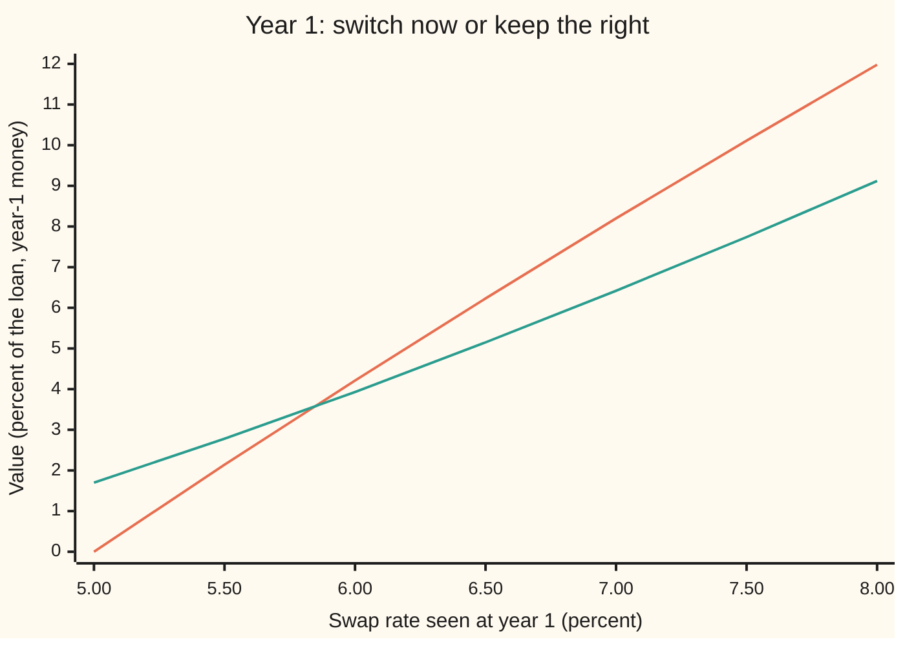
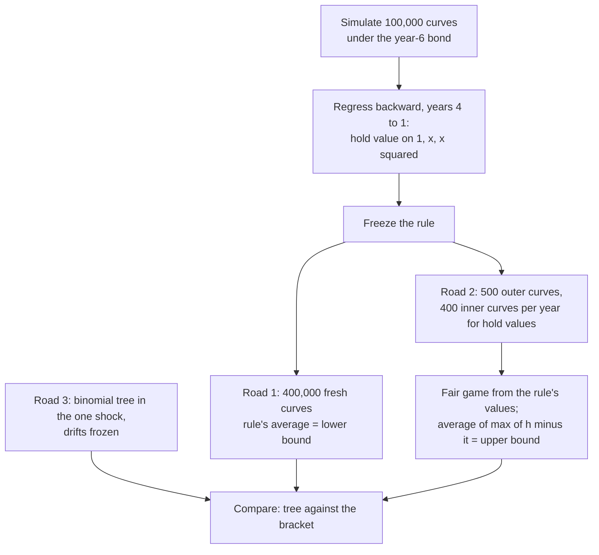

# Bermudan swaptions: many exercise dates, priced by regression on simulated curves

Financial mathematics → Forward-Rate Models → Early exercise on a moving curve → Bermudan swaptions

---

## General Overview

A company will borrow from year 1 to year 6 at a floating rate. Fearing that rates will climb, it buys a right: on any one anniversary, in year 1, 2, 3, 4 or 5, it may switch the rest of the loan to a fixed 5% until year 6. Switching is entering an **interest-rate swap**: the company pays a fixed 5% a year and receives the floating rate, which cancels the floating loan's payments. A right to enter a swap is a **swaption**. A swaption with several permitted dates is a **Bermudan swaption**, named because Bermuda sits between Europe (one date) and America (any date). This one is a **1-into-5**: first chance in one year, into a swap that ends five years later, with each later chance entering the shorter swap that is left.

Today every annual forward rate (the rate that can be locked in now for one future year of borrowing) is 5%, and each moves by about 20% of its level in a year. The right costs about **2.35% of the loan's size**: between $23,454.57 and $23,484.99 on a $1,000,000 loan.

Two things make that number hard. Each anniversary poses a choice: switch now, or keep the right and ask again next year. And what moves is a whole curve of rates, not one price. A tree over a whole curve is too large; simulation handles the curve, but one simulated future cannot say what waiting is worth.

The method: simulate thousands of curves and learn a switching rule by regression (fitting a curve through a cloud of points). Run the frozen rule on fresh curves; its average payout is a **lower bound**, since no rule beats the best one. Then subtract from the switching values a fair game (a process whose average change is zero) built from the rule's own values, and average the best that remains on each path: an **upper bound**. Here the two land within 0.003% of each other, and a tree sits beside them.

**A rule learned by regression on simulated curves prices the Bermudan from below; a fair-game correction built from that same rule prices it from above; a narrow gap between the two is the evidence that the rule is close to the best.**

**What kind of fact this is:** a method; the two inequalities it rests on, the lower bound and the dual upper bound, are theorems, proved on this card in Why it works.

### The picture: the decision in year 1

Suppose the curve seen at year 1 is flat. Switching pays the value of a five-year swap at 5% fixed; keeping the right is worth the fitted hold value. Both are shown per 100 of loan, in year-1 money.



Orange: the payoff, what switching pays now. Green: the hold value the regression learned. At a 5.50% swap rate, switching pays 2.14 but holding is worth 2.78: keep the right. At 6.00% switching pays 4.21 against 3.93: switch. The crossing, between those two rates, is the **exercise boundary**. Nobody gave it to the program; the regression learned it.

---

## The formula

Notation first, in words. Years are counted 0 to 6. The forward rate $L_i$ covers borrowing from year $i$ to year $i+1$. A price at year $e$ of 1 dollar paid at year 6 is written $P(e,6)$. A capital sigma sums over the swap's payment years. An average over simulated futures, given everything known at year $e$, is written $E_e[\;]$.

At an exercise year $e$ the swap left to enter pays fixed $K$ in years $e+1$ to 6. Its value per 1 of loan is

$$A_e\,(S_e - K), \qquad A_e = \sum_{m=e+1}^{6} P(e,m), \qquad S_e = \frac{1 - P(e,6)}{A_e}.$$

Switching is optional, so the payoff is the positive part. Measure it in year-6 bonds instead of dollars:

$$h_e = \frac{A_e\,\max(S_e - K,\,0)}{P(e,6)}.$$

The price is the best average over all legal rules, and every legal rule pins it between two computable numbers:

$$\boxed{\;P(0,6)\,E\big[h_{\hat\tau}\big] \;\le\; V_0 \;=\; P(0,6)\,\max_{\tau} E\big[h_\tau\big] \;\le\; P(0,6)\,E\Big[\max_{1\le e\le 5}\big(h_e - M_e\big)\Big]\;}$$

**Read it aloud:** the price is today's value of a year-6 dollar times the best average switching value; the rule learned by regression can only do worse, and the switching values minus any fair-game process, maximised path by path, can only do better.

| Symbol | Plain meaning | In our example | Push it up and the answer… |
| --- | --- | --- | --- |
| $L_i$, $\mu_i$, $i$ | forward rate for borrowing from year $i$ to $i+1$, compounded once a year; $\mu_i$ its drift in the year-6 bond's world | 5% for $i = 0$ to 5 | rises: the swap that pays fixed gains |
| $\sigma$, $W$ | volatility: the yearly spread of each forward's log; $W$ the running total of the one shock that moves all six | 20% | rises: more chance of a big move |
| $K$ | the strike: the fixed rate the holder may lock in | 5% | falls: less to gain from switching |
| $e$, $\tau$, $\hat\tau$ | an exercise year, 1 to 5; $\tau$ the year a rule picks, decided only from curves seen so far; $\hat\tau$ the regression rule's pick | $\hat\tau = 1$ on 73,696 of 400,000 paths | — |
| $P(e,6)$ | price at year $e$ of 1 dollar paid at year 6: the **numeraire**, the unit all values are counted in | 0.746215 today | — |
| $A_e$, $m$ | the **annuity**: the year-$e$ value of 1 paid in each payment year $m$ from $e+1$ to 6 | $A(0) = 4.123311$: today's value of the year-1 swap's annuity, years 2 to 6 | — |
| $S_e$, $x_e$ | the swap rate that makes the swap worth zero; $x_e = 100\,(S_e - K)$, the same in percentage points | $S(0) = 5\%$ today: at the money | — |
| $h_e$ | the switching value at year $e$, counted in year-6 bonds | 0 below the strike | — |
| $C_e$, $\beta_e$ | the hold value $C_e = E_e[h_\tau]$ over later years; $\beta_e$ its three regression coefficients | see the chart | — |
| $M_e$ | a **martingale**: a fair-game process, whose expected next value, given today, is today's value; $M_0 = 0$ | built from the rule | — |
| $V_0$, $Y_e$, $Y_0$ | the price today, per 1 of loan; $Y_e$ the true value at year $e$ in year-6 bonds, so $V_0 = P(0,6)\,Y_0$ | 2.35% | — |
| $N(d_1)$, $N(d_2)$ | bell-curve areas in the Black formula for the one-date swaption, $d_1 = -d_2 = \sigma/2$ here | 0.539828, 0.460172 | — |

**Conventions, dated 28 Sep 2026:** annual periods with a year fraction of exactly one, one curve for both forecasting and discounting, and settlement by entering the swap. Traded swaps use day counts and a separate discount curve; the method does not change.

Two helper facts carry the rest. The floating side of a swap is worth $1 - P(e,6)$: borrowing 1 now and repaying it at year 6 with floating interest in between is a floating loan at par. The fixed side is worth $K A_e$. Their difference is the swap value above.

### When it holds

- **The model is right.** Six lognormal forward rates (each one's log is normal), one shock, flat 20% volatility, one step a year. One shock moves every forward together; real forwards do not, and a Bermudan's price depends on that co-movement more than on the pricing method. A desk calibrates volatilities and correlations to quoted swaptions ([calibrating-a-market-model](04-calibrating-a-market-model.md)); the bounds are bounds on the model, not on the market.
- **The rule looks only at the present.** A rule that peeks at later curves is not legal, and its average is not a lower bound. The perfect-foresight rule averages 2.77%, not 2.35%.
- **The fair-game correction is really fair.** Its expected increments must be zero. They are estimated by inner simulations, whose noise biases the upper bound upward; the bound stays valid in expectation, with a standard error.
- **The regression inputs describe the state.** With one shock the swap rate nearly pins the curve. With several shocks, one input misses part of the curve, the rule gets worse, and the gap between the bounds widens: the gap is the warning light.

---

## Why it works

### Step 0: any rule is a floor, any fair game makes a ceiling

The holder wants the rule with the best average payout. That rule is unknown. But any rule that decides from what it has seen so far is a candidate, and a candidate can do no better than the best. So any legal rule, run on fresh simulations, gives a price from below.

From above, allow cheating and charge for it. A holder who sees the whole path picks the best year on each one, which overprices the option. Subtract a fair game from the switching values first. It costs honest rules nothing on average, but it can cancel the luck that foresight exploits. Chosen well, it shrinks the cheater's advantage to almost nothing.

A good fair game comes from a good rule: its value, updated as the curve moves. So one regression feeds both bounds.

### Step 1: count everything in year-6 bonds

A dollar at year 2 and a dollar at year 5 are different things today. So count everything in one unit, the bond that pays 1 dollar at year 6: divide every value by that bond's price at the same moment. In the matching pricing world, every traded value counted this way is a fair game ([forward-measures-for-rates](02-forward-measures-for-rates.md)).

The payoff at any year then compares directly with the payoff at any other year. No discounting runs between exercise dates. The price is $P(0,6)$ times the average of $h_e$ at the chosen year.

### Step 2: simulate the curve in that world

In the year-6 bond's world the last forward, for year 5 to 6, has no drift. Each earlier forward has a drift fixed by no-arbitrage, from the forwards after it ([libor-and-sofr-market-models](03-libor-and-sofr-market-models.md)):

$$\frac{dL_i}{L_i} = -\sigma^2 \sum_{j=i+1}^{5} \frac{L_j}{1 + L_j}\,dt \;+\; \sigma\,dW.$$

The last term is one normal shock shared by all six forwards; the first is the drift over a short time step. The simulation steps one year at a time, updating the last forward first and working to the front. The drift is averaged between its value before the step and after it, a predictor-corrector step (a first guess, then a correction using the guessed values). Dropping the drift moves the simulated one-date swaption off the Black formula far enough that the check fails.

### Step 3: the value of switching

On each simulated path at year $e$, the bond prices come from the live forwards: $P(e,m)$ is 1 divided by $(1+L_e)(1+L_{e+1})\cdots(1+L_{m-1})$. The annuity, swap rate and $h_e$ follow from the formula section. The floating leg is worth $1 - P(e,6)$ because each floating payment repays exactly the interest on 1 borrowed and rolled.

<details>
<summary>The algebra behind the floating leg</summary>

Take one payment year, from $m-1$ to $m$ with $m$ between $e+1$ and 6. Its floating payment is $L_{m-1}$, fixed at the start and paid at the end. At year $m-1$ it is worth $L_{m-1}/(1+L_{m-1}) = 1 - 1/(1+L_{m-1})$: one dollar now minus one dollar next year. Priced at year $e$, that is $P(e,m-1) - P(e,m)$. Add over $m = e+1$ to 6: the middle terms cancel in pairs and leave $P(e,e) - P(e,6) = 1 - P(e,6)$.

</details>

### Step 4: learn the hold value by regression

Work backward. At year 5 no choice is left: switch if the swap is worth something. At year 4, take the paths where switching pays something. On each, record the swap-rate spread $x_e$ and the cash that path went on to collect, counted in year-6 bonds. Fit $C_e \approx \beta_0 + \beta_1 x_e + \beta_2 x_e^2$ by least squares, with $e = 4$. Switch on a path where $h_e$ beats the fitted $C_e$. Repeat at years 3, 2 and 1.

A least-squares fit estimates an average given what is known; that is why it stands in for the hold value ([longstaff-schwartz-least-squares-monte-carlo](../06-Numerical%20Methods%20for%20Pricing/06-longstaff-schwartz-least-squares-monte-carlo.md)). Only paths where switching pays something (in the money) enter the fit: elsewhere there is no decision to make. The coefficients are then frozen.

### Step 5: the lower bound

Run the frozen rule on 400,000 new curves. At each year it looks at the curve it has, computes $h_e$ and $x_e$, and switches if $h_e$ beats the fitted hold value. That rule sees only the past, so it is one of the legal rules the maximum ranges over. Its average is at most the maximum. Times $P(0,6)$, it is a lower bound: 2.345457%, standard error 0.004932%.

Fresh curves matter: on its training paths the rule has seen the answers, and its average there can sit above the truth.

### Step 6: the upper bound, for any fair game

Take any martingale $M_e$ with $M_0 = 0$ and any legal rule $\tau$. Since $M_e$ is a fair game, stopping it by a rule that cannot see ahead leaves its average at zero: $E[M_\tau] = 0$. So

$$E[h_\tau] = E[h_\tau - M_\tau] \le E\Big[\max_{e}\,(h_e - M_e)\Big].$$

The right side does not depend on $\tau$. It bounds the best rule too. That is the **dual** bound, found by Rogers and, independently, by Haugh and Kogan. With $M = 0$ it is the perfect-foresight value, a poor bound. With the right $M_e$ it is exact.

<details>
<summary>Detailed proof: the bound is exact for the best martingale</summary>

Let $Y_e$ be the true value of the option at year $e$ (in year-6 bonds): $Y_5 = h_5$ and $Y_e = \max(h_e, E_e[Y_{e+1}])$. Define the martingale by its increments, $M^*_e - M^*_{e-1} = Y_e - E_{e-1}[Y_e]$, with $M^*_0 = 0$ and $Y_0 = E_0[Y_1]$.

Claim: $h_e - M^*_e \le Y_0$ on every path, for every $e$. Induction: $Y_0 - M^*_0 = Y_0$. And $Y_e - M^*_e = Y_{e-1} - M^*_{e-1} - (Y_{e-1} - E_{e-1}[Y_e]) \le Y_{e-1} - M^*_{e-1}$, since $Y_{e-1} \ge E_{e-1}[Y_e]$. So $Y_e - M^*_e \le Y_0$, and $h_e \le Y_e$ gives the claim.

So $E[\max_e(h_e - M^*_e)] \le Y_0$. The dual inequality gives the reverse, so the upper bound with $M^*_e$ equals the price. The argument only uses $h_e \le Y_e$ and $Y_{e-1} \ge E_{e-1}[Y_e]$, so a near-optimal value process gives a near-optimal martingale.

</details>

### Step 7: build the fair game from the rule

Andersen and Broadie built $M_e$ from the frozen rule. Let $C_e$ be the value at year $e$ of following the rule from year $e+1$ on. Let the rule's value at $e$ be $h_e$ if it switches, and $C_e$ if it holds. Then $E_{e-1}$ of the rule's value at $e$ is exactly $C_{e-1}$. So the increments "rule's value at $e$ minus $C_{e-1}$" average to zero: a fair game.

The $C_e$ are not known. On each of 500 outer paths, at each year, 400 inner paths are simulated from that curve, run under the rule, and averaged. The fair game starts at year 1 as the rule's value there minus that value's average. That average is the lower bound itself. So the upper bound splits into the lower bound plus a **duality gap**: the average over outer paths of the largest $h_e$ minus the running total of increments, with the rule's year-1 value as the starting point. The gap is 0.003043%, standard error 0.000842. The upper bound is 2.348499%.

The gap is small because the rule is good: where the rule is close to the best, its value process is close to $Y_e$, and Step 6's proof then says the cheater's advantage nearly vanishes.

### Step 8: a third road, the tree

With one shock, every forward at year $e$ depends on the path only through the drift. Freeze the drifts at today's values and every forward becomes a function of the total shock $W$ so far: $L_i = L_i(0)\exp\big((\mu_i - \tfrac12\sigma^2)e + \sigma W\big)$, with $\mu_i$ the frozen drift. $W$ lives on a recombining binomial tree: 200 up-or-down steps a year, each of size $1/\sqrt{200}$. At each exercise year, the value at a node is the larger of $h_e$ and the average of its two children, rolled back step by step. This is the backward induction of [hull-white-trinomial-tree](../30-Short-Rate%20Models/06-hull-white-trinomial-tree.md), run on the market model's own shock instead of a short rate. No regression and no simulation enter.

The tree gives 2.350191%, inside the simulated bracket's noise. Its European is 1.646175% against Black's 1.642226%. That small excess is the price of freezing the drift, and the size of the tree's own bias.

The other door: model the swap rates themselves as the random objects, one per exercise date ([swap-market-model-in-outline](05-swap-market-model-in-outline.md)). Each European piece is then exactly lognormal, which suits calibration; the regression and dual steps are unchanged.



---

## Worked numbers, by hand

The one-date part first, by the Black formula for a swaption: today's annuity times the at-the-money payoff odds.

| Step | Arithmetic | Value |
| --- | --- | --- |
| year-6 bond today, $P(0,6)$ | $1 / 1.05^6$ | 0.746215 |
| annuity, years 2 to 6, $A(0)$ | $1.05^{-2} + 1.05^{-3} + \dots + 1.05^{-6}$ | 4.123311 |
| forward swap rate | $(1.05^{-1} - 1.05^{-6}) / 4.123311$ | 5%, the strike |
| $d_1$, $d_2$ at the money, one year | $\pm\,\sigma/2$ | 0.1, −0.1 |
| $N(d_1)$, $N(d_2)$ | bell-curve areas | 0.539828, 0.460172 |
| European 1-into-5 | $100 \times 4.123311 \times 0.05 \times (0.539828 - 0.460172)$ | 1.642226% |
| year 1, curve flat at 5.50% | switch 2.14 against hold 2.78 | hold |
| year 1, curve flat at 6.00% | switch 4.21 against hold 3.93 | switch |
| lower bound, frozen rule, fresh curves | average over 400,000 paths | 2.345457% |
| duality gap | 500 outer paths, 400 inner | 0.003043% |
| upper bound | 2.345457 + 0.003043 | 2.348499% |
| **price** | bracket; tree at 2.350191% | **about 2.35% of the loan** |

The last digit of the upper bound differs from the sum by rounding. In dollars on a $1,000,000 loan: lower 23,454.57, upper 23,484.99, tree 23,501.91.

What it means: the four extra dates add 0.704016% of the loan, on the tree, over the one-date European. The bracket is 0.003% wide, smaller than the lower bound's standard error of 0.004932%: the noise, not the rule, now limits the precision.

### What breaks if you drop a piece

| Mistake | Comes out at | What went wrong |
| --- | --- | --- |
| Price only the first date | 1.642226% | Four later rights, worth 0.70% of the loan, thrown away |
| Switch the first year the swap is worth anything | 2.039482% | Takes a small gain and gives up the chance of a larger one; a legal rule, so a valid but loose lower bound |
| Upper bound with no fair game, $M = 0$ | 2.769233% | Perfect foresight: the holder picks the best year after seeing the whole path |

### How the rule spends its rights

Of 400,000 fresh curves, this is the year the frozen rule switched. One block is 5,000 paths.

```
year     paths switching in that year (one block = 5,000)
   1   ███████████████                       73696
   2   ███████████                           55043
   3   ████████                              39622
   4   ██████                                30795
   5   █████                                 23489
never  ███████████████████████████████████   177355
```

Year 1 is the busiest: the longest swap is left, so a high rate there is worth the most. On 177,355 paths rates never rise far enough and the right goes unused.

### Greeks, from the tree

| Greek | Bermudan | European | Meaning |
| --- | --- | --- | --- |
| delta, per 1bp (0.01%) rise in every forward | 0.019947% | 0.022460% | change in value, percent of the loan |
| vega, per 1 point of volatility | 0.117879% | 0.081963% | change in value, percent of the loan |

The Bermudan carries more vega than the European: more dates, more to gain from movement. Its delta is smaller: part of its value comes from later, shorter swaps, which move less per basis point.

---

## Code, from first principles, and it actually runs

The programs make their own random numbers (splitmix64 bits, turned into normal draws by Box-Muller), fit the rule by solving the least-squares equations by hand, and reach the price by three roads: the frozen rule on fresh curves (lower bound), the Andersen-Broadie fair game (upper bound), and the tree. The one-date swaption is priced three ways too: Black's formula with a bell-curve area built by Simpson's rule, the simulation, and the tree.

### Python

```python
# Bermudan swaption by regression -- the check behind the card.  Standard library only.  One-factor market
# model, six annual forwards, simulated under the year-6 bond.  Road 1: Longstaff-Schwartz lower bound.
# Road 2: Andersen-Broadie dual upper bound.  Road 3: a recombining tree.  Random numbers, N(x): our own.
from math import exp, log, sqrt, cos, pi

L0, SIG, K, M = 0.05, 0.20, 0.05, 6        # flat 5% forwards, 20% vol, 5% strike, swap ends year 6
N_TRAIN, N_EVAL, N_OUT, N_IN = 100000, 400000, 500, 400
MASK, seed = (1 << 64) - 1, 20260928
def u64():                                  # splitmix64 random bits
    global seed
    seed = (seed + 0x9E3779B97F4A7C15) & MASK
    z = ((seed ^ (seed >> 30)) * 0xBF58476D1CE4E5B9) & MASK
    z = ((z ^ (z >> 27)) * 0x94D049BB133111EB) & MASK
    return z ^ (z >> 31)
def normal():                               # Box-Muller: two uniforms in, one standard normal out
    u1 = ((u64() >> 11) + 1) * 2.0 ** -53;  return sqrt(-2.0 * log(u1)) * cos(2.0 * pi * ((u64() >> 11) * 2.0 ** -53))

def step(L, t, z, sig=SIG):                 # year t -> t+1 under the year-6 bond, predictor-corrector drift
    new, s_old, s_new = L[:], 0.0, 0.0
    for i in range(M - 1, t, -1):           # the last forward has no drift; each earlier one feels those after it
        new[i] = L[i] * exp(-sig * sig * 0.5 * (s_old + s_new) - 0.5 * sig * sig + sig * z)
        s_old += L[i] / (1.0 + L[i]); s_new += new[i] / (1.0 + new[i])
    return new
def exercise(L, e, k=K):                    # swap entered at year e: spread x (points), deflated value h, P(e,6)
    P, A = 1.0, 0.0
    for j in range(e, M):
        P = P / (1.0 + L[j]); A += P
    return 100.0 * ((1.0 - P) / A - k), max(1.0 - P - k * A, 0.0) / P, P

def cont(b, x): return b[0] + b[1] * x + b[2] * x * x
def fit(pts):                               # least squares on 1, x, x^2: normal equations, Gauss-Jordan
    G = [[0.0] * 4 for _ in range(3)]
    for x, y in pts:
        v = (1.0, x, x * x)
        for r in range(3):
            for c in range(3): G[r][c] += v[r] * v[c]
            G[r][3] += v[r] * y
    for c in range(3):
        for r in range(3):
            if r != c:
                f = G[r][c] / G[c][c]
                for k in range(4): G[r][k] -= f * G[c][k]
    return [G[r][3] / G[r][r] for r in range(3)]
def mean_se(v):
    s = q = 0.0
    for a in v: s += a; q += a * a
    m = s / len(v);  return m, sqrt((q / len(v) - m * m) / (len(v) - 1))

# ---- train: simulate curves, regress backwards from year 4 to year 1, freeze the rule ----
train = []
for _ in range(N_TRAIN):
    L, row = [L0] * M, [(0.0, 0.0, 1.0)]
    for t in range(5):
        L = step(L, t, normal()); row.append(exercise(L, t + 1))
    train.append(row)
cash, beta, greedy = [r[5][1] for r in train], [None] * 6, []
for e in range(4, 0, -1):
    beta[e] = fit([(train[k][e][0], cash[k]) for k in range(N_TRAIN) if train[k][e][1] > 0.0])
    for k in range(N_TRAIN):
        if train[k][e][1] > 0.0 and train[k][e][1] >= cont(beta[e], train[k][e][0]): cash[k] = train[k][e][1]
for r in train: greedy.append(next((r[e][1] for e in range(1, 6) if r[e][1] > 0.0), 0.0))
def stop(e, x, h): return h > 0.0 and (e == 5 or h >= cont(beta[e], x))
def run_policy(L, t):                       # from year t on (no decision at t itself): deflated payoff, year
    while t < 5:
        L = step(L, t, normal()); t += 1
        x, h, _ = exercise(L, t)
        if stop(t, x, h): return h, t
    return 0.0, 0

# ---- road 1: the frozen rule on fresh curves gives a lower bound ----
pay, years = [], [0] * 6
for _ in range(N_EVAL):
    h, y = run_policy([L0] * M, 0); pay.append(h); years[y] += 1
lo, lo_se = mean_se(pay)
# ---- road 2: Andersen-Broadie.  Inner simulations give hold values C; they build a martingale ----
gap, fore = [], []
for _ in range(N_OUT):
    L, Ls, xs, hs, C = [L0] * M, [None] * 6, [0.0] * 6, [0.0] * 6, [0.0] * 6
    for t in range(1, 6):
        L = step(L, t - 1, normal()); Ls[t] = L; xs[t], hs[t], _ = exercise(L, t)
    for t in range(1, 5):
        acc = 0.0
        for _ in range(N_IN): acc += run_policy(Ls[t], t)[0]
        C[t] = acc / N_IN
    val = [hs[t] if stop(t, xs[t], hs[t]) else C[t] for t in range(6)]   # the rule's value on this path
    mart, best = val[1], hs[1] - val[1]     # the martingale starts at the rule's year-1 value
    for t in range(2, 6):
        mart += val[t] - C[t - 1]
        best = max(best, hs[t] - mart)
    gap.append(best); fore.append(max(hs[1:]))
g, g_se = mean_se(gap)
# ---- road 3: a recombining tree on the single shock, drifts frozen at today's curve ----
def tree(sig=SIG, shift=0.0, k=K, bermudan=True, m=200):
    f, mu, p6 = [L0 + shift] * M, [], 1.0
    for i in range(M):
        s = 0.0
        for j in range(i + 1, M): s += f[j] / (1.0 + f[j])
        mu.append(-sig * sig * s); p6 = p6 / (1.0 + f[i])
    V = [0.0] * (5 * m + 1)
    for e in range(5, 0, -1):
        for j in range(e * m + 1 if bermudan or e == 1 else 0):
            w = (2 * j - e * m) / sqrt(m)
            V[j] = max(V[j], exercise([f[i] * exp((mu[i] - 0.5 * sig * sig) * e + sig * w) for i in range(M)], e, k)[1])
        for n in range(e * m, (e - 1) * m, -1): V = [0.5 * (V[j] + V[j + 1]) for j in range(n)]
    return 100.0 * p6 * V[0]
def ncdf(x, n=4000):                        # N(x): one half, plus Simpson's rule on the bell curve from 0 to x
    h, s = x / n, 0.0
    for i in range(n + 1): s += (1 if i in (0, n) else 4 if i % 2 else 2) * exp(-0.5 * (i * h) * (i * h))
    return 0.5 + s * h / 3.0 / sqrt(2.0 * pi)
P06, A0 = (1.0 + L0) ** -6.0, 0.0
for i in range(2, M + 1): A0 += (1.0 + L0) ** -float(i)
eu_black = 100.0 * A0 * (L0 * ncdf(0.5 * SIG) - K * ncdf(-0.5 * SIG))
eu_mc, eu_se = mean_se([100.0 * P06 * r[1][1] for r in train])
tb, te, D = tree(), tree(bermudan=False), 100.0 * P06
rows = [("P(0,6)  year-6 bond today", P06), ("A(0)  annuity, years 2 to 6", A0), ("N(d1), d1 = 0.1", ncdf(0.5 * SIG)), ("N(d2), d2 = -0.1", ncdf(-0.5 * SIG)),
        ("european, Black formula", eu_black), ("european, simulation", eu_mc), ("  standard error", eu_se),
        ("european, tree", te), ("1 lower bound, fresh paths", D * lo), ("  standard error", D * lo_se),
        ("  duality gap", D * g), ("  standard error", D * g_se), ("2 dual upper bound", D * (lo + g)),
        ("  standard error", D * sqrt(lo_se * lo_se + g_se * g_se)), ("3 bermudan, tree", tb),
        ("extra dates worth, tree", tb - te), ("wrong: exercise when first in the money", D * mean_se(greedy)[0]),
        ("wrong: no martingale, perfect foresight", D * mean_se(fore)[0]),
        ("delta, bermudan per 1bp up", tree(shift=0.0001) - tb), ("delta, european per 1bp up", tree(shift=0.0001, bermudan=False) - te),
        ("vega, bermudan per vol point", tree(sig=0.21) - tb), ("vega, european per vol point", tree(sig=0.21, bermudan=False) - te),
        ("try: vol 10%, tree bermudan", tree(sig=0.10)), ("try: strike 6%, tree bermudan", tree(k=0.06))]
print("percent of notional unless marked")
for name, v in rows: print(f"{name:<42} {v:>12.6f}")
print(f"dollars per 1,000,000: lower {1e4 * D * lo:.2f}  upper {1e4 * D * (lo + g):.2f}  tree {1e4 * tb:.2f}")
print("coefficients by year (1, x, x^2):")
for e in range(1, 5): print(f"  year {e}  " + "  ".join(f"{b:>11.6f}" for b in beta[e]))
print("exercised in year 1..5, never: " + " ".join(f"{years[y]}" for y in (1, 2, 3, 4, 5, 0)))
grid = [exercise([L0] + [0.05 + 0.005 * i] * 5, 1) for i in range(7)]
print("chart, year-1 swap rate %     " + " ".join(f"{5.0 + 0.5 * i:6.2f}" for i in range(7)))
print("chart, take now %             " + " ".join(f"{100.0 * p * h:6.2f}" for x, h, p in grid))
print("chart, hold (fitted) %        " + " ".join(f"{100.0 * p * cont(beta[1], x):6.2f}" for x, h, p in grid))
assert abs(eu_mc - eu_black) < 3.0 * eu_se, "simulated european vs Black formula"
assert abs(te - eu_black) < 0.01, "tree european vs Black formula"
assert abs(tb - D * (lo + g)) < 3.0 * D * lo_se + 0.01, "tree bermudan vs the simulated bracket"
assert 0.0 <= D * g < 0.01, "duality gap nonnegative and under 0.01% of the loan"
assert mean_se(greedy)[0] < lo, "the fitted rule beats exercising at first chance"
print("ALL CHECKS PASS")
```

**Ran 2026-09-28 on macOS, Python 3.14.6, standard library only. All checks passed. Output, pasted from the run:**

```
percent of notional unless marked
P(0,6)  year-6 bond today                      0.746215
A(0)  annuity, years 2 to 6                    4.123311
N(d1), d1 = 0.1                                0.539828
N(d2), d2 = -0.1                               0.460172
european, Black formula                        1.642226
european, simulation                           1.626438
  standard error                               0.008747
european, tree                                 1.646175
1 lower bound, fresh paths                     2.345457
  standard error                               0.004932
  duality gap                                  0.003043
  standard error                               0.000842
2 dual upper bound                             2.348499
  standard error                               0.005003
3 bermudan, tree                               2.350191
extra dates worth, tree                        0.704016
wrong: exercise when first in the money        2.039482
wrong: no martingale, perfect foresight        2.769233
delta, bermudan per 1bp up                     0.019947
delta, european per 1bp up                     0.022460
vega, bermudan per vol point                   0.117879
vega, european per vol point                   0.081963
try: vol 10%, tree bermudan                    1.173791
try: strike 6%, tree bermudan                  1.183982
dollars per 1,000,000: lower 23454.57  upper 23484.99  tree 23501.91
coefficients by year (1, x, x^2):
  year 1     0.021728     0.027622     0.003260
  year 2     0.013815     0.022921     0.001575
  year 3     0.006902     0.017379     0.000410
  year 4     0.002630     0.008935     0.000095
exercised in year 1..5, never: 73696 55043 39622 30795 23489 177355
chart, year-1 swap rate %       5.00   5.50   6.00   6.50   7.00   7.50   8.00
chart, take now %               0.00   2.14   4.21   6.23   8.20  10.11  11.98
chart, hold (fitted) %          1.70   2.78   3.93   5.15   6.42   7.74   9.12
ALL CHECKS PASS
```

The simulated European, 1.626438%, sits within two standard errors of Black's 1.642226%. The frozen rule's lower bound and the fair-game upper bound are 0.003043% apart. The tree lands 2.350191%, within one standard error of the upper bound.

### Rust

Same model, same random-number recipe, same rows, so every printed digit can be compared.

```rust
// Bermudan swaption by regression -- the same check as bermudan_swaptions_by_regression_check.py, in Rust.
// Std only, no crates.  Same random numbers (splitmix64 + Box-Muller), same three roads, same rows.
// Compile: rustc --edition 2021 -O bermudan_swaptions_by_regression_check.rs -o /tmp/bermudan_check
use std::f64::consts::PI;
const L0: f64 = 0.05; const SIG: f64 = 0.20; const K: f64 = 0.05; const M: usize = 6;
const N_TRAIN: usize = 100000; const N_EVAL: usize = 400000; const N_OUT: usize = 500; const N_IN: usize = 400;
const TWO53: f64 = 1.0 / 9007199254740992.0;
type Curve = [f64; 6];

struct Rng(u64);
impl Rng {
    fn u64(&mut self) -> u64 {                          // splitmix64 random bits
        self.0 = self.0.wrapping_add(0x9E3779B97F4A7C15);
        let z = (self.0 ^ (self.0 >> 30)).wrapping_mul(0xBF58476D1CE4E5B9);
        let z = (z ^ (z >> 27)).wrapping_mul(0x94D049BB133111EB);
        z ^ (z >> 31)
    }
    fn normal(&mut self) -> f64 {                       // Box-Muller: two uniforms in, one normal out
        let u1 = ((self.u64() >> 11) + 1) as f64 * TWO53;
        (-2.0 * u1.ln()).sqrt() * (2.0 * PI * ((self.u64() >> 11) as f64 * TWO53)).cos()
    }
}
fn step(l: &Curve, t: usize, z: f64, sig: f64) -> Curve {   // year t -> t+1 under the year-6 bond
    let (mut new, mut so, mut sn) = (*l, 0.0, 0.0);
    for i in (t + 1..M).rev() {
        new[i] = l[i] * (-sig * sig * 0.5 * (so + sn) - 0.5 * sig * sig + sig * z).exp();
        so += l[i] / (1.0 + l[i]); sn += new[i] / (1.0 + new[i]);
    }
    new
}
fn exercise(l: &Curve, e: usize, k: f64) -> (f64, f64, f64) {   // spread x, deflated value h, P(e,6)
    let (mut p, mut a) = (1.0, 0.0);
    for j in e..M { p = p / (1.0 + l[j]); a += p; }
    (100.0 * ((1.0 - p) / a - k), (1.0 - p - k * a).max(0.0) / p, p)
}
fn cont(b: &[f64; 3], x: f64) -> f64 { b[0] + b[1] * x + b[2] * x * x }
fn fit(pts: &[(f64, f64)]) -> [f64; 3] {               // least squares on 1, x, x^2
    let mut g = [[0.0f64; 4]; 3];
    for &(x, y) in pts {
        let v = [1.0, x, x * x];
        for r in 0..3 { for c in 0..3 { g[r][c] += v[r] * v[c]; } g[r][3] += v[r] * y; }
    }
    for c in 0..3 { for r in 0..3 { if r != c {
        let f = g[r][c] / g[c][c];
        for k in 0..4 { g[r][k] -= f * g[c][k]; }
    } } }
    [g[0][3] / g[0][0], g[1][3] / g[1][1], g[2][3] / g[2][2]]
}
fn mean_se(v: &[f64]) -> (f64, f64) {
    let (mut s, mut q) = (0.0, 0.0);
    for a in v { s += a; q += a * a; }
    let n = v.len() as f64; let m = s / n;
    (m, ((q / n - m * m) / (n - 1.0)).sqrt())
}
fn stop(beta: &[[f64; 3]; 6], e: usize, x: f64, h: f64) -> bool { h > 0.0 && (e == 5 || h >= cont(&beta[e], x)) }
fn run_policy(rng: &mut Rng, beta: &[[f64; 3]; 6], l0: &Curve, t0: usize) -> (f64, usize) {
    let (mut l, mut t) = (*l0, t0);
    while t < 5 {
        l = step(&l, t, rng.normal(), SIG); t += 1;
        let (x, h, _) = exercise(&l, t, K);
        if stop(beta, t, x, h) { return (h, t); }
    }
    (0.0, 0)
}
fn tree(sig: f64, shift: f64, k: f64, bermudan: bool) -> f64 {   // recombining tree, drifts frozen today
    let m = 200usize;
    let (f, mut mu, mut p6) = ([L0 + shift; 6], [0.0; 6], 1.0);
    for i in 0..M {
        let mut s = 0.0;
        for j in i + 1..M { s += f[j] / (1.0 + f[j]); }
        mu[i] = -sig * sig * s; p6 = p6 / (1.0 + f[i]);
    }
    let mut v = vec![0.0f64; 5 * m + 1];
    for e in (1..6).rev() {
        let top = if bermudan || e == 1 { e * m + 1 } else { 0 };
        for j in 0..top {
            let w = (2 * j as i64 - (e * m) as i64) as f64 / (m as f64).sqrt();
            let mut l = [0.0; 6];
            for i in 0..M { l[i] = f[i] * ((mu[i] - 0.5 * sig * sig) * e as f64 + sig * w).exp(); }
            v[j] = v[j].max(exercise(&l, e, k).1);
        }
        for n in ((e - 1) * m + 1..=e * m).rev() { v = (0..n).map(|j| 0.5 * (v[j] + v[j + 1])).collect(); }
    }
    100.0 * p6 * v[0]
}
fn ncdf(x: f64) -> f64 {                                // one half, plus Simpson on the bell curve from 0 to x
    let (n, mut s) = (4000usize, 0.0);
    let h = x / n as f64;
    for i in 0..=n {
        let wgt = if i == 0 || i == n { 1.0 } else if i % 2 == 1 { 4.0 } else { 2.0 };
        s += wgt * (-0.5 * (i as f64 * h) * (i as f64 * h)).exp();
    }
    0.5 + s * h / 3.0 / (2.0 * PI).sqrt()
}
fn main() {
    let mut rng = Rng(20260928);
    // ---- train: simulate curves, regress backwards from year 4 to year 1, freeze the rule ----
    let mut train: Vec<[(f64, f64, f64); 6]> = Vec::with_capacity(N_TRAIN);
    for _ in 0..N_TRAIN {
        let (mut l, mut row) = ([L0; 6], [(0.0, 0.0, 1.0); 6]);
        for t in 0..5 { l = step(&l, t, rng.normal(), SIG); row[t + 1] = exercise(&l, t + 1, K); }
        train.push(row);
    }
    let mut cash: Vec<f64> = train.iter().map(|r| r[5].1).collect();
    let mut beta = [[0.0f64; 3]; 6];
    for e in (1..5).rev() {
        let pts: Vec<(f64, f64)> = (0..N_TRAIN).filter(|&k| train[k][e].1 > 0.0).map(|k| (train[k][e].0, cash[k])).collect();
        beta[e] = fit(&pts);
        for k in 0..N_TRAIN { if train[k][e].1 > 0.0 && train[k][e].1 >= cont(&beta[e], train[k][e].0) { cash[k] = train[k][e].1; } }
    }
    let greedy: Vec<f64> = train.iter().map(|r| (1..6).map(|e| r[e].1).find(|&h| h > 0.0).unwrap_or(0.0)).collect();
    // ---- road 1: the frozen rule on fresh curves gives a lower bound ----
    let (mut pay, mut years) = (Vec::with_capacity(N_EVAL), [0usize; 6]);
    for _ in 0..N_EVAL { let (h, y) = run_policy(&mut rng, &beta, &[L0; 6], 0); pay.push(h); years[y] += 1; }
    let (lo, lo_se) = mean_se(&pay);
    // ---- road 2: Andersen-Broadie.  Inner simulations give hold values C; they build a martingale ----
    let (mut gap, mut fore) = (Vec::new(), Vec::new());
    for _ in 0..N_OUT {
        let (mut l, mut ls, mut xs, mut hs, mut c) = ([L0; 6], [[0.0; 6]; 6], [0.0; 6], [0.0; 6], [0.0; 6]);
        for t in 1..6 { l = step(&l, t - 1, rng.normal(), SIG); ls[t] = l; let r = exercise(&l, t, K); xs[t] = r.0; hs[t] = r.1; }
        for t in 1..5 {
            let mut acc = 0.0;
            for _ in 0..N_IN { acc += run_policy(&mut rng, &beta, &ls[t], t).0; }
            c[t] = acc / N_IN as f64;
        }
        let val: Vec<f64> = (0..6).map(|t| if stop(&beta, t, xs[t], hs[t]) { hs[t] } else { c[t] }).collect();
        let (mut mart, mut best) = (val[1], hs[1] - val[1]);
        for t in 2..6 { mart += val[t] - c[t - 1]; best = best.max(hs[t] - mart); }
        gap.push(best); fore.push(hs[1..].iter().cloned().fold(f64::NEG_INFINITY, f64::max));
    }
    let (g, g_se) = mean_se(&gap);
    // ---- road 3 and the closed form ----
    let (p06, mut a0) = ((1.0 + L0).powf(-6.0), 0.0);
    for i in 2..=M { a0 += (1.0 + L0).powf(-(i as f64)); }
    let eu_black = 100.0 * a0 * (L0 * ncdf(0.5 * SIG) - K * ncdf(-0.5 * SIG));
    let (eu_mc, eu_se) = mean_se(&train.iter().map(|r| 100.0 * p06 * r[1].1).collect::<Vec<f64>>());
    let (tb, te, d) = (tree(SIG, 0.0, K, true), tree(SIG, 0.0, K, false), 100.0 * p06);
    let (greedy_m, fore_m) = (mean_se(&greedy).0, mean_se(&fore).0);
    let rows: Vec<(&str, f64)> = vec![("P(0,6)  year-6 bond today", p06), ("A(0)  annuity, years 2 to 6", a0), ("N(d1), d1 = 0.1", ncdf(0.5 * SIG)), ("N(d2), d2 = -0.1", ncdf(-0.5 * SIG)),
        ("european, Black formula", eu_black), ("european, simulation", eu_mc), ("  standard error", eu_se),
        ("european, tree", te), ("1 lower bound, fresh paths", d * lo), ("  standard error", d * lo_se),
        ("  duality gap", d * g), ("  standard error", d * g_se), ("2 dual upper bound", d * (lo + g)),
        ("  standard error", d * (lo_se * lo_se + g_se * g_se).sqrt()), ("3 bermudan, tree", tb),
        ("extra dates worth, tree", tb - te), ("wrong: exercise when first in the money", d * greedy_m),
        ("wrong: no martingale, perfect foresight", d * fore_m),
        ("delta, bermudan per 1bp up", tree(SIG, 0.0001, K, true) - tb), ("delta, european per 1bp up", tree(SIG, 0.0001, K, false) - te),
        ("vega, bermudan per vol point", tree(0.21, 0.0, K, true) - tb), ("vega, european per vol point", tree(0.21, 0.0, K, false) - te),
        ("try: vol 10%, tree bermudan", tree(0.10, 0.0, K, true)), ("try: strike 6%, tree bermudan", tree(SIG, 0.0, 0.06, true))];
    println!("percent of notional unless marked");
    for (name, v) in &rows { println!("{:<42} {:>12.6}", name, v); }
    println!("dollars per 1,000,000: lower {:.2}  upper {:.2}  tree {:.2}", 1e4 * d * lo, 1e4 * d * (lo + g), 1e4 * tb);
    println!("coefficients by year (1, x, x^2):");
    for e in 1..5 { println!("  year {}  {}", e, beta[e].iter().map(|b| format!("{:>11.6}", b)).collect::<Vec<_>>().join("  ")); }
    println!("exercised in year 1..5, never: {}", [1, 2, 3, 4, 5, 0].iter().map(|&y| years[y].to_string()).collect::<Vec<_>>().join(" "));
    let grid: Vec<(f64, f64, f64)> = (0..7).map(|i| { let mut c = [0.05 + 0.005 * i as f64; 6]; c[0] = L0; exercise(&c, 1, K) }).collect();
    println!("chart, year-1 swap rate %     {}", (0..7).map(|i| format!("{:6.2}", 5.0 + 0.5 * i as f64)).collect::<Vec<_>>().join(" "));
    println!("chart, take now %             {}", grid.iter().map(|&(_, h, p)| format!("{:6.2}", 100.0 * p * h)).collect::<Vec<_>>().join(" "));
    println!("chart, hold (fitted) %        {}", grid.iter().map(|&(x, _, p)| format!("{:6.2}", 100.0 * p * cont(&beta[1], x))).collect::<Vec<_>>().join(" "));
    assert!((eu_mc - eu_black).abs() < 3.0 * eu_se, "simulated european vs Black formula");
    assert!((te - eu_black).abs() < 0.01, "tree european vs Black formula");
    assert!((tb - d * (lo + g)).abs() < 3.0 * d * lo_se + 0.01, "tree bermudan vs the simulated bracket");
    assert!(0.0 <= d * g && d * g < 0.01, "duality gap nonnegative and under 0.01% of the loan");
    assert!(greedy_m < lo, "the fitted rule beats exercising at first chance");
    println!("ALL CHECKS PASS");
}
```

**Ran 2026-09-28 on macOS, rustc 1.98.1, no crates. All checks passed. Output, pasted from the run:**

```
percent of notional unless marked
P(0,6)  year-6 bond today                      0.746215
A(0)  annuity, years 2 to 6                    4.123311
N(d1), d1 = 0.1                                0.539828
N(d2), d2 = -0.1                               0.460172
european, Black formula                        1.642226
european, simulation                           1.626438
  standard error                               0.008747
european, tree                                 1.646175
1 lower bound, fresh paths                     2.345457
  standard error                               0.004932
  duality gap                                  0.003043
  standard error                               0.000842
2 dual upper bound                             2.348499
  standard error                               0.005003
3 bermudan, tree                               2.350191
extra dates worth, tree                        0.704016
wrong: exercise when first in the money        2.039482
wrong: no martingale, perfect foresight        2.769233
delta, bermudan per 1bp up                     0.019947
delta, european per 1bp up                     0.022460
vega, bermudan per vol point                   0.117879
vega, european per vol point                   0.081963
try: vol 10%, tree bermudan                    1.173791
try: strike 6%, tree bermudan                  1.183982
dollars per 1,000,000: lower 23454.57  upper 23484.99  tree 23501.91
coefficients by year (1, x, x^2):
  year 1     0.021728     0.027622     0.003260
  year 2     0.013815     0.022921     0.001575
  year 3     0.006902     0.017379     0.000410
  year 4     0.002630     0.008935     0.000095
exercised in year 1..5, never: 73696 55043 39622 30795 23489 177355
chart, year-1 swap rate %       5.00   5.50   6.00   6.50   7.00   7.50   8.00
chart, take now %               0.00   2.14   4.21   6.23   8.20  10.11  11.98
chart, hold (fitted) %          1.70   2.78   3.93   5.15   6.42   7.74   9.12
ALL CHECKS PASS
```

The two outputs are identical line for line: same random numbers, same order of additions, so even the regression coefficients match.

> [!TIP]
> **Try changing**
> Guess the direction first. Then run it.
> - **Halve the volatility.** Call `tree(sig=0.10)`. The Bermudan falls from 2.350191% to **1.173791%**, about half. Near the money, an option's value is close to proportional to volatility.
> - **Raise the strike to 6%.** Call `tree(k=0.06)`. The price drops to **1.183982%**: the rate must climb a full point before switching pays anything.
> - **One more point of volatility.** Call `tree(sig=0.21)`. The price rises by **0.117879%** of the loan, the vega in the Greeks table. The European rises by only 0.081963%.
> - **Break the rule on purpose.** In the upper-bound loop, value the rule as switching whenever `hs[t] > 0`, instead of calling `stop`. The fair game no longer matches the rule, and the check `tree bermudan vs the simulated bracket` fails.

---

## The usual mistake

> [!warning]
> **Quoting the regression price as the price.** A Longstaff-Schwartz number is a lower bound, and only when the rule is run on fresh paths. By itself it cannot say how far below the truth it sits: a poor rule and a good rule both produce a number that looks like a price. The dual upper bound is what turns the number into a bracket. Here the bracket is 0.003043% wide; with poor regression inputs it would widen, and that width is the warning.
>
> Smaller traps:
> - **Discounting between exercise dates at a fixed rate.** When rates move, a fixed discount factor is wrong on every path. Counting in year-6 bonds removes the question.
> - **Upper bound with no fair game.** $M = 0$ gives the perfect-foresight value, 2.769233%. It is a valid upper bound, and useless.
> - **Noisy inner averages mistaken for exact ones.** The upper bound's fair game uses hold values from 400 inner paths. Their noise pushes the upper bound up, so it stays valid, but too few inner paths inflate the gap and make a good rule look poor.
> - **Switching the moment the swap is worth something.** That gives 2.039482%: a legal rule, so a lower bound, but well below the price.

---

## Where you meet it in real life

- **Callable bonds and loans.** A borrower's right to repay a fixed-rate bond at par on coupon dates is a Bermudan receiver swaption (a right to receive fixed and pay floating) held by the borrower. The issuer's funding desk prices that right this way ([callable-and-cancellable-swaps](../32-Convexity%20and%20Exotics/05-callable-and-cancellable-swaps.md)).
- **Mortgage hedging.** Home-loan borrowers can refinance on many dates. Banks that hold mortgages hedge that prepayment right with Bermudan swaptions, and value both with simulated curves.
- **Model validation.** A validation team checks a desk's Bermudan price by the width of its primal-dual bracket. A wide gap means the exercise rule, not the model, needs work.
- **Whole-curve models.** In the Heath-Jarrow-Morton framework ([hjm-framework-and-the-drift-condition](01-hjm-framework-and-the-drift-condition.md)) with several shocks, no small tree exists. Regression plus the dual is how such models price anything with early exercise.

> **Say it back**
> A Bermudan swaption is the right to enter a swap on any one of several dates. Counting every value in year-6 bonds lets payoffs on different dates be compared directly. A rule fitted by regression on simulated curves and then frozen, run on fresh curves, can only do worse than the best rule, so its average is a lower bound. Subtracting a fair game built from that rule's own values, and taking each path's best remaining value, gives an upper bound. Here the two sit 0.003043% apart at about 2.35% of the loan, and a tree in the single shock agrees.

---

## What this builds on

- [libor-and-sofr-market-models](03-libor-and-sofr-market-models.md): the lognormal forward rates, and the drift each one needs in the year-6 bond's world. This card simulates exactly that model.
- [longstaff-schwartz-least-squares-monte-carlo](../06-Numerical%20Methods%20for%20Pricing/06-longstaff-schwartz-least-squares-monte-carlo.md): the backward regression that learns the hold value, and why a least-squares fit estimates an average given what is known.
- [hull-white-trinomial-tree](../30-Short-Rate%20Models/06-hull-white-trinomial-tree.md): backward induction with an exercise check at each node. Road 3 runs it on the market model's shock.

## Where this goes next

- [callable-and-cancellable-swaps](../32-Convexity%20and%20Exotics/05-callable-and-cancellable-swaps.md): a swap that one side may cancel on coupon dates is an ordinary swap plus a Bermudan swaption. The machinery here prices the cancellation right.

This card prices a right to enter a swap; the question it leaves open is how that right hides inside everyday contracts, a callable bond or a cancellable swap, and how to strip it out and price it there.

---

## Sources

Verified 28 Sep 2026: every DOI below matches its title and first author on Crossref and resolves to the publisher.

- Longstaff, Francis A., and Eduardo S. Schwartz. "Valuing American Options by Simulation: A Simple Least-Squares Approach." *Review of Financial Studies* 14, no. 1 (2001): 113–147. [doi:10.1093/rfs/14.1.113](https://doi.org/10.1093/rfs/14.1.113). The backward regression of Step 4.
- Andersen, Leif, and Mark Broadie. "Primal-Dual Simulation Algorithm for Pricing Multidimensional American Options." *Management Science* 50, no. 9 (2004): 1222–1234. [doi:10.1287/mnsc.1040.0258](https://doi.org/10.1287/mnsc.1040.0258). The fair game built from the rule's values, with inner simulations; applied there to Bermudan swaptions in a market model.
- Rogers, L. C. G. "Monte Carlo Valuation of American Options." *Mathematical Finance* 12, no. 3 (2002): 271–286. [doi:10.1111/1467-9965.02010](https://doi.org/10.1111/1467-9965.02010). The dual inequality of Step 6.
- Haugh, Martin B., and Leonid Kogan. "Pricing American Options: A Duality Approach." *Operations Research* 52, no. 2 (2004): 258–270. [doi:10.1287/opre.1030.0070](https://doi.org/10.1287/opre.1030.0070). The same dual bound, found independently.
- Brace, Alan, Dariusz Gatarek, and Marek Musiela. "The Market Model of Interest Rate Dynamics." *Mathematical Finance* 7, no. 2 (1997): 127–155. [doi:10.1111/1467-9965.00028](https://doi.org/10.1111/1467-9965.00028). The lognormal forward-rate model simulated here.
- Glasserman, Paul. *Monte Carlo Methods in Financial Engineering*. Springer, 2003. [doi:10.1007/978-0-387-21617-1](https://doi.org/10.1007/978-0-387-21617-1). Simulating the market model under a terminal bond, and the primal-dual bounds for early exercise.
