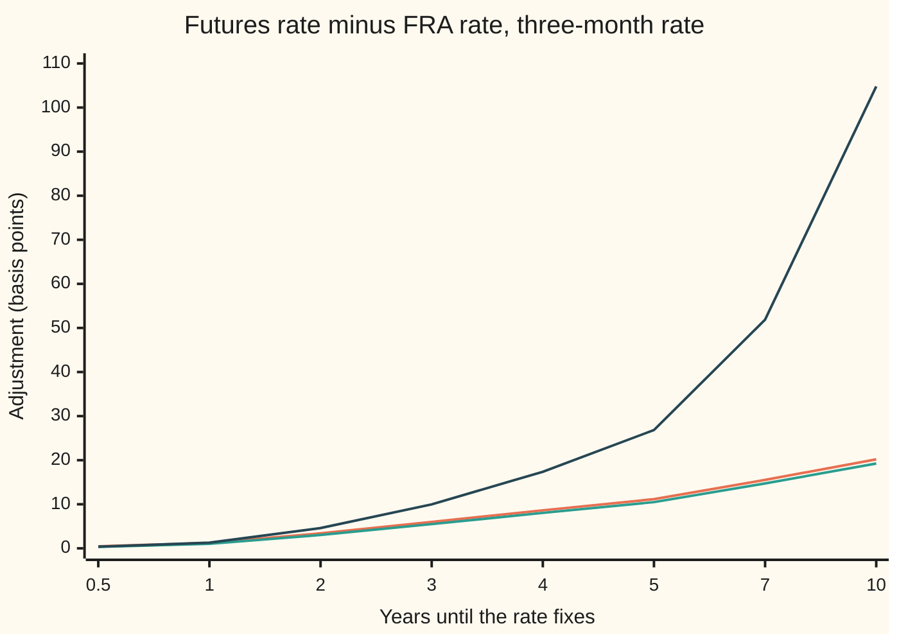

# Futures against forwards: the convexity that makes a rate future differ from an FRA

[Syllabus](../../../SYLLABUS.md) → [Financial mathematics](../../../SYLLABUS.md#w12) → [Convexity and Exotics](../../../SYLLABUS.md#w12-s32) → Futures against forwards

---

## General Overview

A company will borrow $1,000,000 for three months, starting three years from today. It wants to fix the interest rate now. Two contracts do that job.

The first is a **forward rate agreement**, an FRA: a private contract that fixes a borrowing rate for a future period and settles once, in a single payment at the end of that period. The second is a **rate future**: an exchange contract on the same three-month rate, quoted as 100 minus the rate, and settled in cash every evening. The classic example was the Eurodollar future on three-month dollar LIBOR; this card's "Eurodollar-style" contract is defined here, not copied from a rulebook. On it one basis point (0.01 percentage point) of rate is worth $1,000,000 × 0.0001 × 0.25 = $25.

Both contracts point at the same rate on the same dates. On the invented market of this card the FRA rate is **4.2727%**. The fair futures rate is **4.3325%**, a quote of 95.6675. The future sits about **6 basis points higher**: $149.73 per contract.

The gap comes from the evening settlement. Hold the side of the future that gains when rates rise. When rates rise, cash arrives early and is invested at the new, higher rates. When rates fall, cash leaves early, but borrowing it is cheap because rates are low. Either way the timing favours that side. A contract that favours one side cannot be fair at the FRA rate, so the futures rate is pushed up until the edge is paid for. That push is the **convexity adjustment**: the name for the gap between a futures rate and the matching forward rate, used from here on.

**A rate future is settled every evening in a bank account whose growth moves with the very rate the future tracks, so its fair rate is a plain average of the final rate, while the FRA's rate is an average that gives less weight to high-rate outcomes; in the Hull-White model the gap has an exact formula, about 6 basis points at three years.**

**What kind of fact this is:** a theorem inside a model. The FRA rate needs no model. The futures rate is a theorem once rates follow the Hull-White model, proved on this card in Why it works; the model itself is an assumption that fits markets well enough, not a law.

### The picture: the gap grows with the fixing date

The adjustment for a three-month rate, in basis points, against the number of years until the rate fixes. Same invented market throughout.



Orange: this card's exact adjustment for the simple three-month rate, 5.99 at three years. Green: the same model's adjustment for a continuously compounded rate, the form printed in Hull's textbook, 5.50 at three years. Dark blue: the Ho-Lee rule of thumb, which lets rates wander with no pull-back, 9.97 at three years and 104.80 at ten. The first two bend, because the model pulls rates back; the rule of thumb keeps accelerating and is safe only for short dates.

---

## The formula

$$R_0 - K \;=\; \frac{G_0}{\alpha}\left(e^{C}-1\right), \qquad C \;=\; b(h)^2\,q_T \;+\; b(h)\,c_T$$

**Read it aloud:** the futures rate beats the FRA rate by the forward growth factor, times a small exponential tilt, spread over the accrual period; the tilt has a payment-date part and a bank-account part.

The two rates on their own:

$$K = \frac{G_0 - 1}{\alpha}, \qquad R_0 = \frac{G_0\,e^{C} - 1}{\alpha}, \qquad G_0 = \frac{D(T)}{D(U)}$$

| Symbol | Plain meaning | In our example | Push it up and the adjustment… |
| --- | --- | --- | --- |
| $L_T$, $Z_T$ | the three-month simple rate that fixes at $T$; $Z_T = 1 + \alpha L_T$ is the growth factor it implies | random | |
| $K$ | the **FRA rate**: the fixed rate that makes the FRA worth zero today | 4.2727% | |
| $R_0$ | the **futures rate** today; the quote is $100(1-R_0)$ | 4.3325%, quote 95.6675 | |
| $D(s)$, $P(T,U)$, $w$ | today's discount curve: what one dollar due at a date is worth now; $P(T,U)$ is the same thing seen at $T$ for a payment at $U$; $w = P(T,U)/B_T$ is Step 3's weight, today's value of one dollar at $U$ along one outcome | $D(s) = e^{-0.03s - 0.002s^2}$; $D(U) = 0.8881$ | |
| $G_0$ | $D(T)/D(U)$: the growth factor from $T$ to $U$ that today's curve implies | 1.01068165 | |
| $T$, $U$, $h$ | the fixing date, the payment date, and the gap $h = U - T$, in years | 3, 3.25, 0.25 | rises with $T$ (the chart) |
| $\alpha$ | the accrual fraction: the share of a year the rate is paid for | 0.25 | |
| $r_t$, $\varphi$, $X_t$, $X_T$, $W$, $B_T$ | the **short rate** (the overnight bank rate); its fitted, non-random part; its random part, now and at the fixing date; the random walk that kicks it; and the bank account, one dollar invested at the short rate from today to $T$ | random; $X_0 = 0$ | |
| $\kappa$ | **mean-reversion speed**: how hard the model pulls $X_t$ back to zero, per year | 0.2 | falls: pull-back limits how far rates wander |
| $\sigma$ | **rate volatility**: the size of the random kicks to the short rate, in rate per square-root year | 0.0143 (1.43 percentage points) | rises with its square |
| $b(v)$, $v$ | the **loading** $(1 - e^{-\kappa v})/\kappa$: how much a rate move now shifts the average rate over the next $v$ years | $b(h) = 0.2439$, $b(T) = 2.2559$ | |
| $q_T$, $c_T$, $C$ | the variance of $X_T$; its covariance with the bank account's log growth; the total exponent | 0.00035725, 0.00052035, 0.00014813 | |

The two model quantities, each in one line of words:

$$q_T = \sigma^2\,\frac{1 - e^{-2\kappa T}}{2\kappa}, \qquad c_T = \frac{\sigma^2}{2}\,b(T)^2$$

$q_T$ is how spread out the random part of the short rate is on the fixing date. $c_T$ is how strongly that random part moves together with everything the bank account earned on the way there. Both are zero if $\sigma = 0$ or $T = 0$, and then $R_0 = K$.

### When it holds

- **Rates follow the Hull-White model**: one random driver, normal kicks, pull-back, fitted to today's curve. Fatter tails or several drivers change the size; the sign argument of Step 3 survives in any model where high rates and a fast-growing bank account go together.
- **Settlement is continuous and gains earn the bank rate.** Daily settlement moves the answer by a sliver; margin paid at a rate far from the bank rate needs its own model.
- **The FRA pays at the end of the period, $U$.** An FRA that pays at $T$ with a discount factor has the same rate $K$. A plain payment at $T$ without that discount is a different contract; see [Timing adjustments](03-timing-and-in-arrears-adjustments.md).
- **One curve, no default.** A separate projection curve, or a rate compounded day by day over the period, changes the payoff and needs its own derivation.
- **The volatility is known.** The adjustment moves with $\sigma^2$, so a 10% error in $\sigma$ is roughly a 20% error in the adjustment.

---

## Why it works

### Step 0: settlement dates change which average is fair

A contract that costs nothing to enter must be worth nothing on average, once each payment is valued at the date it is paid. The FRA pays once, at $U$. The future pays every evening, from now to $T$. Different payment dates mean the two contracts are fair under different averages of the same final rate. The whole card is working out those two averages and subtracting.

The tool is the pricing rule from the Black-Scholes cards: the value today of a payment due at date $T$ is the average of that payment divided by $B_T$, where $B_T$ is what one dollar in the bank grows to by $T$. The average is taken in the **risk-neutral** world, the pretend world in which every asset is priced this way. Every average on this card is in that world.

### Step 1: the futures rate is a plain average

Take one evening. The future pays that night's change in its rate, in cash, and entering costs nothing. The bank rate for that one night is already known, so discounting the payment by a known amount cannot change its sign. For the position to be fair, the expected change over the night must be zero.

A quantity whose expected next change is always zero is a **martingale**: its best forecast of its own future value is its current value. At $T$ the futures rate equals the fixed rate $L_T$ by contract. So today

$$R_0 = \text{average of } L_T.$$

No discounting anywhere: the one-night discount was known at each step, so the bank account dropped out. This is the result of [Futures](../03-Contracts%20and%20No-Arbitrage/05-futures-margining-and-the-forward-futures-difference.md), carried from shares to rates.

### Step 2: the FRA rate needs no model

The FRA pays $\alpha(L_T - K)$ per dollar of notional at $U$. Rewrite: $\alpha L_T = Z_T - 1$, and $Z_T = 1/P(T,U)$, because a dollar invested at $T$ in the bond maturing at $U$ grows to exactly $Z_T$. So at $U$ the FRA pays $Z_T - 1 - \alpha K$.

Value that payment at $T$: multiply by $P(T,U)$ to get $1 - (1 + \alpha K)\,P(T,U)$. That is one dollar received at $T$ minus $1 + \alpha K$ dollars received at $U$. Its value today is $D(T) - (1 + \alpha K)\,D(U)$. Set it to zero:

$$K = \frac{G_0 - 1}{\alpha}.$$

Only today's curve. No volatility, no model.

### Step 3: the FRA rate is a weighted average, and the weights lean against high rates

Now write $K$ as an average of $L_T$ too. Give each future outcome the weight $w = P(T,U)/B_T$: the value today of one dollar paid at $U$ along that outcome. The average of $w$ is $D(U)$. The average of $Z_T\,w$ is the average of $1/B_T$, which is $D(T)$, since $Z_T P(T,U) = 1$. Divide: the weighted average of $Z_T$ is $G_0$. So

$$K = \text{weighted average of } L_T, \text{ with weight } w.$$

Here is the whole effect. In outcomes where rates rose, $L_T$ is high, the bank account grew fast so $B_T$ is big, and $P(T,U)$ is small. The weight $w$ is small exactly where $L_T$ is large. The weighted average leans away from high rates, so it sits below the plain average. That is why $R_0 > K$. In symbols, $R_0 - K$ equals minus the covariance of $L_T$ with $w$, divided by the average of $w$; the covariance is negative, so the gap is positive.

The weight has two parts, and each makes one piece of $C$:

- $P(T,U)$ is small when rates are high at $T$. This is the **payment-date piece**, $b(h)^2 q_T$. It exists even without evening settlement: it is what separates a payment at $U$ from a plain payment at $T$.
- $1/B_T$ is small when rates were high on the way to $T$. This is the **bank-account piece**, $b(h)\,c_T$. It is the evening settlement itself.

```
pieces of the 3-year adjustment, basis points (each █ = 0.25 bp)
payment date   ███                        0.86
bank account   █████████████████████      5.13
total          ████████████████████████   5.99
```

The bank-account piece is most of it: the bank account absorbs three years of rate moves, the payment-date piece only three months.

### Step 4: in Hull-White, the plain average is exact

The Hull-White model writes the short rate as $r_t = \varphi(t) + X_t$. The deterministic part $\varphi$ is fitted so the model reprices today's curve exactly. The random part $X_t$ starts at zero, is pulled back towards zero at speed $\kappa$, and is kicked by normal (bell-curve) shocks of size $\sigma$. Its value $X_T$ at the fixing date is normal, centred on zero, with variance $q_T$.

The [Hull-White](../30-Short-Rate%20Models/04-hull-white-model.md) card gives the bond price at $T$:

$$P(T,U) = \frac{D(U)}{D(T)}\,\exp\!\left(-\tfrac12 b(h)^2 q_T - b(h)\,c_T - b(h)\,X_T\right).$$

So the growth factor is $Z_T = 1/P(T,U) = G_0 \exp\!\left(\tfrac12 b(h)^2 q_T + b(h)\,c_T + b(h)\,X_T\right)$: a constant times the exponential of a normal variable. For a normal variable centred on zero, the average of its exponential is the exponential of half its variance. Here the variable is $b(h)X_T$, with variance $b(h)^2 q_T$. So

$$\text{average of } Z_T = G_0 \exp\!\left(b(h)^2 q_T + b(h)\,c_T\right) = G_0\,e^{C}.$$

Subtract one, divide by $\alpha$: $R_0 = (G_0 e^{C} - 1)/\alpha$. Subtract Step 2's $K$ and the formula is done.

The $c_T$ term comes from $\varphi$: to reprice today's curve while rates wander, the fitted drift must include $\tfrac12\sigma^2 b(T)^2 = c_T$ at time $T$. That extra drift is the bank account's covariance with the rate.

<details>
<summary>Detailed proof</summary>

**Setting.** The bank account is $B_T = \exp\!\left(\int_0^T r_s\,ds\right)$. Prices are averages of payments divided by the bank account, in the risk-neutral world. The model: $r_t = \varphi(t) + X_t$, $dX_t = -\kappa X_t\,dt + \sigma\,dW_t$ with $X_0 = 0$, where $W$ is a Brownian motion (the continuous random walk of the stochastic-calculus wing). $\varphi$ is chosen so that the average of $1/B_s$ equals $D(s)$ at every date.

**(a) The futures rate.** Hold any number of contracts, changed at will; the gains are paid as the rate moves and banked. Entering costs nothing, so every such strategy has discounted gains that average zero. Over one short interval, hold as many contracts as the bank account is worth, and only if some event known at its start has happened: the average change of the futures rate over the interval, given that event, is zero. So the futures rate is a martingale, and $R_0$ is the average of its final value, $L_T$. (The technical conditions, a continuous process of integrable size, hold here because every quantity is a smooth function of a normal variable.)

**(b) The FRA rate.** Shown in Step 2. The argument uses only the prices $D(T)$, $D(U)$ and the identity $Z_T P(T,U) = 1$.

**(c) The weighted form.** With $w = P(T,U)/B_T$: average of $w$ is $D(U)$ (the value of one dollar at $U$); average of $Z_T w$ is average of $1/B_T$, which is $D(T)$. Hence $K = \dfrac{\text{avg}(L_T w)}{\text{avg}(w)}$ and $R_0 - K = -\dfrac{\text{cov}(L_T, w)}{\text{avg}(w)}$.

**(d) The two moments.** Solving the equation for $X_t$: $X_T = \sigma\int_0^T e^{-\kappa(T-s)}\,dW_s$. By the Itô isometry (the variance of a stochastic integral is the integral of the squared integrand), $\text{var}(X_T) = \sigma^2\int_0^T e^{-2\kappa v}\,dv = q_T$. Swapping the order of integration, $\int_0^T X_s\,ds = \sigma\int_0^T b(T-s)\,dW_s$, so $\text{cov}\!\left(X_T, \int_0^T X_s\,ds\right) = \sigma^2\int_0^T e^{-\kappa v}\,b(v)\,dv$. The integrand is the derivative of $\tfrac12 b(v)^2$, since $b'(v) = e^{-\kappa v}$; so the covariance is $\tfrac12\sigma^2 b(T)^2 = c_T$.

**(e) The bond price.** Given $X_T$, $\int_T^U X_s\,ds = b(h)X_T + (\text{a normal variable independent of } X_T)$. Averaging $\exp\left(-\int_T^U r_s ds\right)$ over the independent part gives a constant times $e^{-b(h)X_T}$. The fitting condition on $\varphi$ fixes the constant; the calculation, done on the [Hull-White](../30-Short-Rate%20Models/04-hull-white-model.md) card, yields the bond formula of Step 4. Road 3 of the code checks it numerically: the simulated average of $P(T,U)/B_T$ reprices $D(U)$ to five decimal places.

**(f) The average.** $b(h)X_T$ is normal with centre 0 and variance $b(h)^2 q_T$, so $\text{avg}\,e^{b(h)X_T} = e^{\frac12 b(h)^2 q_T}$ (complete the square in the bell-curve integral). With (e), $\text{avg}\,Z_T = G_0 e^{C}$ with $C = b(h)^2 q_T + b(h) c_T$. By (a), $R_0 = (G_0 e^C - 1)/\alpha$; by (b), $R_0 - K = G_0(e^C - 1)/\alpha$.

**(g) Sign and boundaries.** For $\sigma > 0$, $T > 0$, $h > 0$: $q_T > 0$, $c_T > 0$, $b(h) > 0$, so $C > 0$ and the futures rate is strictly above the FRA rate. At $\sigma = 0$ or $T = 0$, $C = 0$ and the two rates agree, as the margining card found for known rates.

</details>

### The other roads: Hull's form and the Ho-Lee rule

Many books quote the adjustment for a **continuously compounded** rate, $\ln Z_T / h$, instead of the simple rate. Averaging the logarithm instead of $Z_T$ drops half of the payment-date piece:

$$\text{cc adjustment} = \frac{C - \tfrac12 b(h)^2 q_T}{h} = \frac{b(h)}{h}\left[b(h)\left(1 - e^{-2\kappa T}\right) + 2\kappa\,b(T)^2\right]\frac{\sigma^2}{4\kappa}.$$

The right-hand form is the one in Hull's textbook; the code types it separately and the two agree to within $10^{-12}$: 5.50 basis points. Let the pull-back vanish, $\kappa \to 0$: then $b(v) \to v$ and the formula becomes the **Ho-Lee rule**, $\tfrac12\sigma^2 T U$, 9.97 basis points. That rule is quick and common, and it is the dark-blue line in the chart. The trinomial tree that gives road 2 of the code is the Hull-White tree, built as in [Hull-White](../30-Short-Rate%20Models/04-hull-white-model.md).

---

## Worked numbers, by hand

The invented market: discount curve $D(s) = e^{-0.03s - 0.002s^2}$; Hull-White with $\kappa = 0.2$ and $\sigma = 0.0143$; the rate fixes at $T = 3$ and is paid at $U = 3.25$ with $\alpha = 0.25$.

| Step | Arithmetic | Value |
| --- | --- | --- |
| $b(h)$ | $(1 - e^{-0.2 \times 0.25})/0.2$ | 0.24385288 |
| $b(T)$ | $(1 - e^{-0.2 \times 3})/0.2$ | 2.25594182 |
| $q_T$ | $0.0143^2 \times (1 - e^{-1.2})/0.4$ | 0.00035725 |
| $c_T$ | $0.0143^2 \times 2.25594182^2 / 2$ | 0.00052035 |
| $C$ | $0.24385288^2 \times 0.00035725 + 0.24385288 \times 0.00052035$ | 0.00014813 |
| $G_0$ | $e^{-0.108}/e^{-0.118625} = e^{0.010625}$ | 1.01068165 |
| FRA rate $K$ | $(1.01068165 - 1)/0.25$ | 4.2727% |
| futures rate $R_0$ | $(1.01068165 \times e^{0.00014813} - 1)/0.25$ | 4.3325% |
| **adjustment** $R_0 - K$ | $1.01068165 \times (e^{0.00014813} - 1)/0.25$ | **5.99 bp** |
| futures quote | $100 \times (1 - 0.04332549)$ | 95.6675 |
| per contract | $5.98905314 \times \$25$ | $149.73 |

A desk that sees the future quoted at 95.6675 and wants the three-year FRA rate subtracts 5.99 basis points from 4.3325% and gets 4.2727%. Skip that step and a swap curve built from futures is 6 basis points too high at three years, and more further out.

### What breaks if you drop a piece

Correct adjustment 5.99 basis points; FRA rate 4.2727%.

| Mistake | Comes out at | What went wrong |
| --- | --- | --- |
| Take the futures rate as the FRA rate | 4.3325% | No adjustment at all: 5.99 bp too high, $149.73 per contract |
| Add the adjustment instead of subtracting it | 4.3924% | Futures rates sit above FRA rates; this lands twice as far away |
| Ho-Lee rule $\tfrac12\sigma^2 T U$ | 9.97 bp | No pull-back: rates are allowed to wander without limit, so the variance is overstated |
| Keep only the payment-date piece | 0.86 bp | Drops the evening settlement, which is 5.13 of the 5.99 |
| Continuously compounded formula on a simple rate | 5.50 bp | Right model, wrong rate: averaging a logarithm is not averaging the rate |

---

## Code, from first principles, and it actually runs

The code reaches the adjustment by **three independent roads**. Road 1 is the formula. Road 2 builds a Hull-White trinomial tree (each step, the random part of the rate goes up, stays or goes down), fits it to the curve by itself, rolls the bond price back from $U$ to $T$, and rolls the rate back from $T$ to today without discounting for the future and with discounting for the FRA. It uses no bond formula and no $q_T$ or $c_T$. Two step sizes are combined (Richardson extrapolation: the step-size error halves when the step halves, so twice the fine answer minus the coarse one cancels it). Road 3 simulates 50,000 paths of the short rate with random numbers generated in the script, then averages $L_T$ plainly for the future and with weight $P(T,U)/B_T$ for the FRA. Two more checks follow: Hull's textbook form against the derived one, and the Ho-Lee limit.

### Python

```python
# Futures against forwards -- the check behind the card.  Standard library only.
# A made-up discount curve, the Hull-White model fitted to it, and the three-month
# rate that fixes in 3 years.  Road 1: the closed formula.  Road 2: a trinomial tree
# fitted to the curve by itself.  Road 3: Monte Carlo with home-made random numbers.
from math import exp, log, sqrt, cos, pi

KAPPA, SIGMA, T, U, ALPHA = 0.2, 0.0143, 3.0, 3.25, 0.25   # mean reversion, rate vol, fix, pay, accrual
def D(s):  return exp(-0.03 * s - 0.002 * s * s)             # today's discount curve
def b(k, v): return (1.0 - exp(-k * v)) / k                  # Hull-White loading

def closed(k, sig, t, u, al):                                 # road 1: the card's formula
    h = u - t; bh = b(k, h)
    q = sig * sig * (1.0 - exp(-2.0 * k * t)) / (2.0 * k)    # variance of X_T
    c = sig * sig * b(k, t) ** 2 / 2.0                       # covariance of X_T with the bank's log
    C = bh * bh * q + bh * c
    G = D(t) / D(u)
    return dict(bh=bh, q=q, c=c, C=C, G=G, K=(G - 1.0) / al, R=(G * exp(C) - 1.0) / al,
                cc=(C - bh * bh * q / 2.0) / h)              # continuously compounded version

def tree(k, sig, t, u, al, n):                                # road 2: Hull-White trinomial tree
    dt = 1.0 / n; nT, nU = round(t * n), round(u * n); dx = sig * sqrt(3.0 * dt)
    def pr(j):
        a = -k * dt * j
        return ((1, 1/6 + (a * a + a) / 2), (0, 2/3 - a * a), (-1, 1/6 + (a * a - a) / 2))
    Q, shift = {0: 1.0}, []
    for i in range(nU):                                       # fit each step's shift to D
        ai = log(sum(v * exp(-j * dx * dt) for j, v in Q.items()) / D((i + 1) * dt)) / dt
        shift.append(ai); nq = {}
        for j, v in Q.items():
            w = v * exp(-(ai + j * dx) * dt)
            for dj, p in pr(j): nq[j + dj] = nq.get(j + dj, 0.0) + p * w
        Q = nq
    def back(V, i1, i0, disc):
        for i in range(i1 - 1, i0 - 1, -1):
            V = {j: (exp(-(shift[i] + j * dx) * dt) if disc else 1.0)
                 * sum(p * V[j + dj] for dj, p in pr(j)) for j in range(-i, i + 1)}
        return V
    P = back({j: 1.0 for j in range(-nU, nU + 1)}, nU, nT, True)   # bond T->U at every node
    R = back({j: (1.0 / P[j] - 1.0) / al for j in P}, nT, 0, False)[0]   # futures: no discounting
    fra = back({j: 1.0 - P[j] for j in P}, nT, 0, True)[0] / (al * D(u))
    return R, fra

MASK = (1 << 64) - 1; seed = [20260928]
def unif():                                                   # splitmix64, written out
    seed[0] = (seed[0] + 0x9E3779B97F4A7C15) & MASK; z = seed[0]
    z = ((z ^ (z >> 30)) * 0xBF58476D1CE4E5B9) & MASK
    z = ((z ^ (z >> 27)) * 0x94D049BB133111EB) & MASK
    return (((z ^ (z >> 31)) >> 11) + 0.5) / 9007199254740992.0
def gauss(): return sqrt(-2.0 * log(unif())) * cos(2.0 * pi * unif())

def monte_carlo(k, sig, t, u, al, pairs, steps=60):          # road 3: simulate the short rate
    dt = t / steps; e = exp(-k * dt); sd = sig * sqrt((1.0 - e * e) / (2.0 * k)); bh = b(k, u - t)
    phi = lambda s: 0.03 + 0.004 * s + sig * sig * b(k, s) ** 2 / 2.0   # fitted drift of r
    m = 600; hs = t / m
    int_phi = hs / 3 * (phi(0) + phi(t) + sum((4 if i % 2 else 2) * phi(i * hs) for i in range(1, m)))
    lnA = log(D(u) / D(t)) - bh * bh * sig * sig * (1 - exp(-2 * k * t)) / (4 * k) \
          - bh * sig * sig * b(k, t) ** 2 / 2                 # bond formula from the Hull-White card
    rec = []
    for _ in range(pairs):
        zs = [gauss() for _ in range(steps)]; pair = []
        for sgn in (1.0, -1.0):                               # antithetic twin
            x = I = 0.0
            for z in zs:
                xn = x * e + sd * sgn * z; I += 0.5 * (x + xn) * dt; x = xn
            P = exp(lnA - bh * x)
            pair.append(((1.0 / P - 1.0) / al, P * exp(-int_phi - I)))   # rate, weight P/B_T
        rec.append(pair)
    n = 2 * pairs
    R = sum(L for pr in rec for L, w in pr) / n
    W = sum(w for pr in rec for L, w in pr) / n                # should reprice D(U)
    K = sum(L * w for pr in rec for L, w in pr) / n / W
    v = [sum(L * (1 - w / W) for L, w in pr) / 2 for pr in rec]
    mu = sum(v) / pairs; se = sqrt(sum((x - mu) ** 2 for x in v) / (pairs - 1) / pairs)
    return R, K, W, se

bp = 1e4
c = closed(KAPPA, SIGMA, T, U, ALPHA)
R80, K80 = tree(KAPPA, SIGMA, T, U, ALPHA, 80)
R160, K160 = tree(KAPPA, SIGMA, T, U, ALPHA, 160)
R_rich = 2 * R160 - R80                                       # Richardson: cancel the step-size error
Rm, Km, Wm, se = monte_carlo(KAPPA, SIGMA, T, U, ALPHA, 25000)
h = U - T
hull_cc = (c["bh"] / h) * (c["bh"] * (1 - exp(-2 * KAPPA * T)) + 2 * KAPPA * b(KAPPA, T) ** 2) \
          * SIGMA ** 2 / (4 * KAPPA)                          # Hull's textbook form, typed separately
ho_lee = 0.5 * SIGMA ** 2 * T * U
tiny = closed(1e-6, SIGMA, T, U, ALPHA)["cc"]                 # mean reversion switched off
pay_only = (c["G"] * exp(c["bh"] ** 2 * c["q"]) - 1) / ALPHA - c["K"]

rows = [("b(h), h = 0.25", c["bh"]), ("b(T), T = 3", b(KAPPA, T)), ("q_T  variance of X_T", c["q"]),
        ("c_T  covariance with bank log", c["c"]), ("C = b^2 q + b c", c["C"]), ("G0 = D(T)/D(U)", c["G"]),
        ("1 FRA rate K", c["K"]), ("1 futures rate R0", c["R"]), ("1 R0 - K, bp", (c["R"] - c["K"]) * bp),
        ("  futures quote 100(1-R0)", 100 * (1 - c["R"])), ("  FRA as a quote 100(1-K)", 100 * (1 - c["K"])),
        ("2 tree n=80, R0 - K, bp", (R80 - K80) * bp), ("2 tree n=160, R0 - K, bp", (R160 - K160) * bp),
        ("2 tree extrapolated, bp", (R_rich - K160) * bp), ("3 Monte Carlo R0 - K, bp", (Rm - Km) * bp),
        ("  Monte Carlo std error, bp", se * bp), ("  MC weight vs D(U)", Wm), ("  D(U)", D(U)),
        ("4 cc adjustment, bp", c["cc"] * bp), ("  Hull textbook form, bp", hull_cc * bp),
        ("5 kappa -> 0, cc, bp", tiny * bp), ("  Ho-Lee 1/2 s^2 T U, bp", ho_lee * bp),
        ("piece: payment date only, bp", pay_only * bp), ("piece: bank account, bp", (c["R"] - c["K"] - pay_only) * bp),
        ("dollars per contract, $25/bp", (c["R"] - c["K"]) * bp * 25),
        ("wrong: sign flipped, FRA est.", c["R"] + (c["R"] - c["K"])), ("wrong: Ho-Lee rule, bp", ho_lee * bp),
        ("wrong: cc formula on simple, bp", c["cc"] * bp)]
for sig, lab in ((0.0286, "try: sigma doubled, bp"), (0.01, "try: sigma = 0.01, bp")):
    x = closed(KAPPA, sig, T, U, ALPHA); rows.append((lab, (x["R"] - x["K"]) * bp))
x = closed(0.05, SIGMA, T, U, ALPHA); rows.append(("try: kappa = 0.05, bp", (x["R"] - x["K"]) * bp))
for name, v in rows: print(f"{name:<34} {v:>14.8f}")
print("\nchart, fixing year      " + " ".join(f"{t:6.1f}" for t in (0.5, 1, 2, 3, 4, 5, 7, 10)))
for lab, f in (("chart, exact simple bp ", lambda x: (x["R"] - x["K"]) * bp), ("chart, Hull-White cc bp", lambda x: x["cc"] * bp)):
    print(lab + " " + " ".join(f"{f(closed(KAPPA, SIGMA, t, t + h, ALPHA)):6.2f}" for t in (0.5, 1, 2, 3, 4, 5, 7, 10)))
print("chart, Ho-Lee rule bp   " + " ".join(f"{0.5 * SIGMA ** 2 * t * (t + h) * bp:6.2f}" for t in (0.5, 1, 2, 3, 4, 5, 7, 10)))

assert abs((R_rich - K160) - (c["R"] - c["K"])) < 0.01 / bp,  "tree, fitted by itself, lands on the formula"
assert abs((Rm - Km) - (c["R"] - c["K"])) < 4 * se,         "Monte Carlo within four standard errors"
assert abs(Wm / D(U) - 1) < 1e-3,                           "simulated bank reprices the curve"
assert abs(hull_cc - c["cc"]) < 1e-12,                      "Hull's printed formula equals the derived one"
assert abs(tiny - ho_lee) < 1e-3 * ho_lee,                  "no mean reversion gives the Ho-Lee rule"
print("ALL CHECKS PASS")
```

**Ran 2026-09-28 on macOS, Python 3.14.6, standard library only. All checks passed. Output, pasted from the run:**

```
b(h), h = 0.25                         0.24385288
b(T), T = 3                            2.25594182
q_T  variance of X_T                   0.00035725
c_T  covariance with bank log          0.00052035
C = b^2 q + b c                        0.00014813
G0 = D(T)/D(U)                         1.01068165
1 FRA rate K                           0.04272658
1 futures rate R0                      0.04332549
1 R0 - K, bp                           5.98905314
  futures quote 100(1-R0)             95.66745117
  FRA as a quote 100(1-K)             95.72734170
2 tree n=80, R0 - K, bp                5.98635719
2 tree n=160, R0 - K, bp               5.98771002
2 tree extrapolated, bp                5.98906286
3 Monte Carlo R0 - K, bp               5.96413126
  Monte Carlo std error, bp            0.05619025
  MC weight vs D(U)                    0.88814158
  D(U)                                 0.88814079
4 cc adjustment, bp                    5.50044911
  Hull textbook form, bp               5.50044911
5 kappa -> 0, cc, bp                   9.96885625
  Ho-Lee 1/2 s^2 T U, bp               9.96888750
piece: payment date only, bp           0.85882233
piece: bank account, bp                5.13023081
dollars per contract, $25/bp         149.72632848
wrong: sign flipped, FRA est.          0.04392439
wrong: Ho-Lee rule, bp                 9.96888750
wrong: cc formula on simple, bp        5.50044911
try: sigma doubled, bp                23.96153653
try: sigma = 0.01, bp                  2.92866471
try: kappa = 0.05, bp                  9.29358895

chart, fixing year         0.5    1.0    2.0    3.0    4.0    5.0    7.0   10.0
chart, exact simple bp    0.45   1.23   3.41   5.99   8.63  11.16  15.52  20.19
chart, Hull-White cc bp   0.34   1.02   3.04   5.50   8.05  10.49  14.72  19.24
chart, Ho-Lee rule bp     0.38   1.28   4.60   9.97  17.38  26.84  51.89 104.80
ALL CHECKS PASS
```

The formula says 5.98905 basis points. The tree says 5.98636 with 80 steps a year and 5.98771 with 160; extrapolated, 5.98906. The simulation says 5.96 with a standard error of 0.06, so it sits within half a standard error. The simulated weights reprice $D(U)$ to five decimal places, which checks the bond formula the simulation borrows.

### Rust

Same roads, same inputs, same random-number generator. No crates.

```rust
// Futures against forwards -- the same check as futures_forward_convexity_check.py, in Rust.
// Standard library only, no crates.  Road 1: the closed formula.  Road 2: a trinomial
// tree fitted to the curve by itself.  Road 3: Monte Carlo with home-made random numbers.
use std::f64::consts::PI;

const KAPPA: f64 = 0.2; const SIGMA: f64 = 0.0143; const T: f64 = 3.0; const U: f64 = 3.25; const ALPHA: f64 = 0.25;
fn d(s: f64) -> f64 { (-0.03 * s - 0.002 * s * s).exp() }          // today's discount curve
fn b(k: f64, v: f64) -> f64 { (1.0 - (-k * v).exp()) / k }          // Hull-White loading

struct Closed { bh: f64, q: f64, c: f64, cc: f64, g: f64, k: f64, r: f64, cc_rate: f64 }
fn closed(k: f64, sig: f64, t: f64, u: f64, al: f64) -> Closed {   // road 1: the card's formula
    let h = u - t; let bh = b(k, h);
    let q = sig * sig * (1.0 - (-2.0 * k * t).exp()) / (2.0 * k);
    let c = sig * sig * b(k, t).powi(2) / 2.0;
    let cc = bh * bh * q + bh * c; let g = d(t) / d(u);
    Closed { bh, q, c, cc, g, k: (g - 1.0) / al, r: (g * cc.exp() - 1.0) / al, cc_rate: (cc - bh * bh * q / 2.0) / h }
}

fn tree(k: f64, sig: f64, t: f64, u: f64, al: f64, n: usize) -> (f64, f64) {   // road 2
    let dt = 1.0 / n as f64; let nt = (t * n as f64).round() as usize; let nu = (u * n as f64).round() as usize;
    let dx = sig * (3.0 * dt).sqrt(); let o = nu as i64 + 1; let w = 2 * nu + 3;
    let pr = |j: i64| { let a = -k * dt * j as f64;
        [(1i64, 1.0 / 6.0 + (a * a + a) / 2.0), (0, 2.0 / 3.0 - a * a), (-1, 1.0 / 6.0 + (a * a - a) / 2.0)] };
    let mut qv = vec![0.0; w]; qv[o as usize] = 1.0; let mut shift = Vec::new();
    for i in 0..nu {                                                 // fit each step's shift to D
        let ii = i as i64;
        let s: f64 = (-ii..=ii).map(|j| qv[(j + o) as usize] * (-(j as f64) * dx * dt).exp()).sum();
        let ai = (s / d((i + 1) as f64 * dt)).ln() / dt; shift.push(ai);
        let mut nq = vec![0.0; w];
        for j in -ii..=ii {
            let wt = qv[(j + o) as usize] * (-(ai + j as f64 * dx) * dt).exp();
            for (dj, p) in pr(j) { nq[(j + dj + o) as usize] += p * wt; }
        }
        qv = nq;
    }
    let back = |mut v: Vec<f64>, i1: usize, i0: usize, disc: bool| -> Vec<f64> {
        for i in (i0..i1).rev() {
            let mut nv = vec![0.0; w]; let ii = i as i64;
            for j in -ii..=ii {
                let df = if disc { (-(shift[i] + j as f64 * dx) * dt).exp() } else { 1.0 };
                nv[(j + o) as usize] = df * pr(j).iter().map(|(dj, p)| p * v[(j + dj + o) as usize]).sum::<f64>();
            }
            v = nv;
        }
        v
    };
    let p = back(vec![1.0; w], nu, nt, true);                         // bond T->U at every node
    let lv: Vec<f64> = p.iter().map(|x| if *x > 0.0 { (1.0 / x - 1.0) / al } else { 0.0 }).collect();
    let r = back(lv, nt, 0, false)[o as usize];                       // futures: no discounting
    let fra = back(p.iter().map(|x| 1.0 - x).collect(), nt, 0, true)[o as usize] / (al * d(u));
    (r, fra)
}

struct Rng(u64);
impl Rng {
    fn unif(&mut self) -> f64 {                                       // splitmix64, written out
        self.0 = self.0.wrapping_add(0x9E3779B97F4A7C15); let mut z = self.0;
        z = (z ^ (z >> 30)).wrapping_mul(0xBF58476D1CE4E5B9);
        z = (z ^ (z >> 27)).wrapping_mul(0x94D049BB133111EB);
        (((z ^ (z >> 31)) >> 11) as f64 + 0.5) / 9007199254740992.0
    }
    fn gauss(&mut self) -> f64 { let a = self.unif(); let c = self.unif(); (-2.0 * a.ln()).sqrt() * (2.0 * PI * c).cos() }
}

fn monte_carlo(k: f64, sig: f64, t: f64, u: f64, al: f64, pairs: usize, rng: &mut Rng) -> (f64, f64, f64, f64) {
    let steps = 60; let dt = t / steps as f64; let e = (-k * dt).exp();
    let sd = sig * ((1.0 - e * e) / (2.0 * k)).sqrt(); let bh = b(k, u - t);
    let phi = |s: f64| 0.03 + 0.004 * s + sig * sig * b(k, s).powi(2) / 2.0;   // fitted drift of r
    let m = 600; let hs = t / m as f64;
    let int_phi = hs / 3.0 * (phi(0.0) + phi(t) + (1..m).map(|i| if i % 2 == 1 { 4.0 } else { 2.0 } * phi(i as f64 * hs)).sum::<f64>());
    let ln_a = (d(u) / d(t)).ln() - bh * bh * sig * sig * (1.0 - (-2.0 * k * t).exp()) / (4.0 * k)
        - bh * sig * sig * b(k, t).powi(2) / 2.0;                    // bond formula from the Hull-White card
    let mut rec: Vec<[(f64, f64); 2]> = Vec::with_capacity(pairs);
    for _ in 0..pairs {
        let zs: Vec<f64> = (0..steps).map(|_| rng.gauss()).collect(); let mut pair = [(0.0, 0.0); 2];
        for (idx, sgn) in [1.0, -1.0].iter().enumerate() {           // antithetic twin
            let (mut x, mut i) = (0.0f64, 0.0f64);
            for z in &zs { let xn = x * e + sd * sgn * z; i += 0.5 * (x + xn) * dt; x = xn; }
            let p = (ln_a - bh * x).exp();
            pair[idx] = ((1.0 / p - 1.0) / al, p * (-int_phi - i).exp());   // rate, weight P/B_T
        }
        rec.push(pair);
    }
    let n = 2.0 * pairs as f64;
    let r = rec.iter().flat_map(|pr| pr.iter()).map(|(l, _)| l).sum::<f64>() / n;
    let wm = rec.iter().flat_map(|pr| pr.iter()).map(|(_, w)| w).sum::<f64>() / n;
    let kf = rec.iter().flat_map(|pr| pr.iter()).map(|(l, w)| l * w).sum::<f64>() / n / wm;
    let v: Vec<f64> = rec.iter().map(|pr| pr.iter().map(|(l, w)| l * (1.0 - w / wm)).sum::<f64>() / 2.0).collect();
    let mu = v.iter().sum::<f64>() / pairs as f64;
    let se = (v.iter().map(|x| (x - mu).powi(2)).sum::<f64>() / (pairs - 1) as f64 / pairs as f64).sqrt();
    (r, kf, wm, se)
}

fn main() {
    let bp = 1e4; let c = closed(KAPPA, SIGMA, T, U, ALPHA);
    let (r80, k80) = tree(KAPPA, SIGMA, T, U, ALPHA, 80);
    let (r160, k160) = tree(KAPPA, SIGMA, T, U, ALPHA, 160);
    let r_rich = 2.0 * r160 - r80;                                    // Richardson: cancel the step-size error
    let mut rng = Rng(20260928);
    let (rm, km, wm, se) = monte_carlo(KAPPA, SIGMA, T, U, ALPHA, 25000, &mut rng);
    let h = U - T;
    let hull_cc = (c.bh / h) * (c.bh * (1.0 - (-2.0 * KAPPA * T).exp()) + 2.0 * KAPPA * b(KAPPA, T).powi(2))
        * SIGMA.powi(2) / (4.0 * KAPPA);                              // Hull's textbook form, typed separately
    let ho_lee = 0.5 * SIGMA.powi(2) * T * U;
    let tiny = closed(1e-6, SIGMA, T, U, ALPHA).cc_rate;              // mean reversion switched off
    let pay_only = (c.g * (c.bh.powi(2) * c.q).exp() - 1.0) / ALPHA - c.k;
    let mut rows: Vec<(&str, f64)> = vec![
        ("b(h), h = 0.25", c.bh), ("b(T), T = 3", b(KAPPA, T)), ("q_T  variance of X_T", c.q),
        ("c_T  covariance with bank log", c.c), ("C = b^2 q + b c", c.cc), ("G0 = D(T)/D(U)", c.g),
        ("1 FRA rate K", c.k), ("1 futures rate R0", c.r), ("1 R0 - K, bp", (c.r - c.k) * bp),
        ("  futures quote 100(1-R0)", 100.0 * (1.0 - c.r)), ("  FRA as a quote 100(1-K)", 100.0 * (1.0 - c.k)),
        ("2 tree n=80, R0 - K, bp", (r80 - k80) * bp), ("2 tree n=160, R0 - K, bp", (r160 - k160) * bp),
        ("2 tree extrapolated, bp", (r_rich - k160) * bp), ("3 Monte Carlo R0 - K, bp", (rm - km) * bp),
        ("  Monte Carlo std error, bp", se * bp), ("  MC weight vs D(U)", wm), ("  D(U)", d(U)),
        ("4 cc adjustment, bp", c.cc_rate * bp), ("  Hull textbook form, bp", hull_cc * bp),
        ("5 kappa -> 0, cc, bp", tiny * bp), ("  Ho-Lee 1/2 s^2 T U, bp", ho_lee * bp),
        ("piece: payment date only, bp", pay_only * bp), ("piece: bank account, bp", (c.r - c.k - pay_only) * bp),
        ("dollars per contract, $25/bp", (c.r - c.k) * bp * 25.0),
        ("wrong: sign flipped, FRA est.", c.r + (c.r - c.k)), ("wrong: Ho-Lee rule, bp", ho_lee * bp),
        ("wrong: cc formula on simple, bp", c.cc_rate * bp)];
    for (sig, lab) in [(0.0286, "try: sigma doubled, bp"), (0.01, "try: sigma = 0.01, bp")] {
        let x = closed(KAPPA, sig, T, U, ALPHA); rows.push((lab, (x.r - x.k) * bp));
    }
    let x = closed(0.05, SIGMA, T, U, ALPHA); rows.push(("try: kappa = 0.05, bp", (x.r - x.k) * bp));
    for (name, v) in &rows { println!("{:<34} {:>14.8}", name, v); }
    let ts = [0.5, 1.0, 2.0, 3.0, 4.0, 5.0, 7.0, 10.0];
    let join = |f: &dyn Fn(f64) -> f64, p: usize| ts.iter().map(|t| format!("{:6.*}", p, f(*t))).collect::<Vec<_>>().join(" ");
    println!("\nchart, fixing year      {}", join(&|t| t, 1));
    println!("chart, exact simple bp  {}", join(&|t| { let x = closed(KAPPA, SIGMA, t, t + h, ALPHA); (x.r - x.k) * bp }, 2));
    println!("chart, Hull-White cc bp {}", join(&|t| closed(KAPPA, SIGMA, t, t + h, ALPHA).cc_rate * bp, 2));
    println!("chart, Ho-Lee rule bp   {}", join(&|t| 0.5 * SIGMA.powi(2) * t * (t + h) * bp, 2));

    assert!(((r_rich - k160) - (c.r - c.k)).abs() < 0.01 / bp, "tree, fitted by itself, lands on the formula");
    assert!(((rm - km) - (c.r - c.k)).abs() < 4.0 * se, "Monte Carlo within four standard errors");
    assert!((wm / d(U) - 1.0).abs() < 1e-3, "simulated bank reprices the curve");
    assert!((hull_cc - c.cc_rate).abs() < 1e-12, "Hull's printed formula equals the derived one");
    assert!((tiny - ho_lee).abs() < 1e-3 * ho_lee, "no mean reversion gives the Ho-Lee rule");
    println!("ALL CHECKS PASS");
}
```

**Ran 2026-09-28 on macOS, rustc 1.98.1, no crates. All checks passed. Output, pasted from the run:**

```
b(h), h = 0.25                         0.24385288
b(T), T = 3                            2.25594182
q_T  variance of X_T                   0.00035725
c_T  covariance with bank log          0.00052035
C = b^2 q + b c                        0.00014813
G0 = D(T)/D(U)                         1.01068165
1 FRA rate K                           0.04272658
1 futures rate R0                      0.04332549
1 R0 - K, bp                           5.98905314
  futures quote 100(1-R0)             95.66745117
  FRA as a quote 100(1-K)             95.72734170
2 tree n=80, R0 - K, bp                5.98635719
2 tree n=160, R0 - K, bp               5.98771002
2 tree extrapolated, bp                5.98906286
3 Monte Carlo R0 - K, bp               5.96413126
  Monte Carlo std error, bp            0.05619025
  MC weight vs D(U)                    0.88814158
  D(U)                                 0.88814079
4 cc adjustment, bp                    5.50044911
  Hull textbook form, bp               5.50044911
5 kappa -> 0, cc, bp                   9.96885625
  Ho-Lee 1/2 s^2 T U, bp               9.96888750
piece: payment date only, bp           0.85882233
piece: bank account, bp                5.13023081
dollars per contract, $25/bp         149.72632848
wrong: sign flipped, FRA est.          0.04392439
wrong: Ho-Lee rule, bp                 9.96888750
wrong: cc formula on simple, bp        5.50044911
try: sigma doubled, bp                23.96153653
try: sigma = 0.01, bp                  2.92866471
try: kappa = 0.05, bp                  9.29358895

chart, fixing year         0.5    1.0    2.0    3.0    4.0    5.0    7.0   10.0
chart, exact simple bp    0.45   1.23   3.41   5.99   8.63  11.16  15.52  20.19
chart, Hull-White cc bp   0.34   1.02   3.04   5.50   8.05  10.49  14.72  19.24
chart, Ho-Lee rule bp     0.38   1.28   4.60   9.97  17.38  26.84  51.89 104.80
ALL CHECKS PASS
```

The two outputs agree line for line, including the simulation, because both languages run the same generator from the same seed.

> [!TIP]
> **Try changing**
> Guess first, then run.
> - **Double the volatility.** The `try:` rows run `closed` with `sigma` at 0.0286. Guess: twice as big? The adjustment is **23.96** basis points, about four times as big. It moves with $\sigma^2$: it is a variance effect.
> - **Calm the rates.** `sigma` at 0.01. The adjustment falls to **2.93** basis points.
> - **Weaken the pull-back.** `kappa` at 0.05. The adjustment rises to **9.29** basis points: rates wander further before being pulled back, and it moves towards the Ho-Lee rule's 9.97.

---

## The usual mistake

> [!warning]
> **Treating a futures rate as a forward rate.** They point at the same rate on the same dates, and at short dates they differ by a fraction of a basis point, so the habit forms. At three years the gap is 5.99 basis points here; at ten years, 20.19. A curve built from futures without the adjustment prices every swap off rates that are too high, and the error grows with maturity.
>
> Smaller traps:
> - **Getting the sign backwards.** The future's side that gains when rates rise has the edge, so the futures rate is above the FRA rate. Adding the adjustment to the futures rate gives 4.3924% instead of 4.2727%.
> - **Using the Ho-Lee rule far out.** $\tfrac12\sigma^2 T U$ gives 9.97 basis points at three years and 104.80 at ten, against 5.99 and 20.19 with pull-back. Fine at a year, badly wrong at ten.
> - **Mixing rate conventions.** Hull's form is for a continuously compounded rate: 5.50 basis points. The simple rate needs 5.99. Half a basis point is real money on a futures strip.
> - **Calling it a timing adjustment.** The payment-date piece alone is 0.86 basis points. Most of the effect, 5.13, comes from the evening settlement.

---

## Where you meet it in real life

- **Building a curve from futures.** Rate desks read short- and medium-dated rates off a strip of futures, subtract a convexity adjustment for each, and then build forward rates and swap rates from the result. The adjustment is usually model-based, as here, with $\sigma$ and $\kappa$ fitted to option prices.
- **Hedging swaps with futures.** The hedge gains slightly whichever way rates move; the adjustment is the price of that gain, and getting it wrong shows up as a slow bleed.
- **After LIBOR.** Dollar LIBOR ended in June 2023; the dollar market's three-month rate futures now reference SOFR, an overnight rate compounded over the period, still quoted as 100 minus the rate at $25 per basis point. The payoff differs, but the evening-settlement argument of Step 3 is unchanged. *Conventions verified 2026-09-28.*
- **Constant-maturity swaps.** A swap that pays a 10-year swap rate every year has its own convexity, from a different nonlinear payoff: [Constant-maturity swaps](02-cms-and-the-convexity-adjustment.md).
- **Paying at the wrong date.** A rate paid at its fixing date instead of its natural end date needs the payment-date piece alone: [Timing adjustments](03-timing-and-in-arrears-adjustments.md).
- **Paying in another currency.** A rate paid in a currency other than its own picks up a covariance with the exchange rate: [Quanto rates](04-quanto-adjustments-for-rates.md).

> **Say it back**
> An FRA and a rate future fix the same rate but pay at different times: once at the end, or every evening. The FRA rate comes from today's curve alone. The futures rate is the plain average of the final rate, while the FRA rate is an average weighted by discount factors that are small exactly when rates are high. So the futures rate is higher. In the Hull-White model the gap is $G_0(e^C - 1)/\alpha$, with a payment-date piece and a larger bank-account piece: 5.99 basis points at three years in this card's market.

---

## What this builds on

- [Futures](../03-Contracts%20and%20No-Arbitrage/05-futures-margining-and-the-forward-futures-difference.md): evening settlement, and the proof that futures and forwards agree when rates are known. This card is the case where they are not.
- [Hull-White](../30-Short-Rate%20Models/04-hull-white-model.md): the short-rate model, its fit to today's curve, its bond-price formula and its trinomial tree. All four are used here.

## Where this goes next

- [Constant-maturity swaps](02-cms-and-the-convexity-adjustment.md): the same weighted-against-plain average, when the payoff is a swap rate rather than a three-month rate and the nonlinearity sits in the payoff itself.

This card's weight lived in the settlement; the open question is how big the gap gets when a contract pays a long swap rate on a date that rate was never built for.

---

## Sources

Verified 2026-09-28: every link below resolves to the publisher's page.

- Cox, John C., Jonathan E. Ingersoll, and Stephen A. Ross. "The Relation between Forward Prices and Futures Prices." *Journal of Financial Economics* 9, no. 4 (1981): 321–346. [doi:10.1016/0304-405X(81)90002-7](https://doi.org/10.1016/0304-405X(81)90002-7). Futures prices as plain averages, forward prices as weighted ones, and the covariance between them.
- Hull, John, and Alan White. "Pricing Interest-Rate-Derivative Securities." *Review of Financial Studies* 3, no. 4 (1990): 573–592. [doi:10.1093/rfs/3.4.573](https://doi.org/10.1093/rfs/3.4.573). The model fitted to today's curve, and its bond-price formula.
- Hull, John, and Alan White. "Numerical Procedures for Implementing Term Structure Models I: Single-Factor Models." *Journal of Derivatives* 2, no. 1 (1994): 7–16. [doi:10.3905/jod.1994.407902](https://doi.org/10.3905/jod.1994.407902). The trinomial tree and its fit to the curve, road 2 of the code.
- Brigo, Damiano, and Fabio Mercurio. *Interest Rate Models — Theory and Practice*, 2nd ed. Springer, 2006. [doi:10.1007/978-3-540-34604-3](https://doi.org/10.1007/978-3-540-34604-3). Futures rates in Gaussian short-rate models, done with full measure theory.
- Hull, John C. *Options, Futures, and Other Derivatives*, 11th ed. Pearson. [Publisher page](https://www.pearson.com/en-us/subject-catalog/p/options-futures-and-other-derivatives/P200000005938). The continuously compounded Hull-White adjustment and the Ho-Lee rule, in the chapter on interest rate futures.
