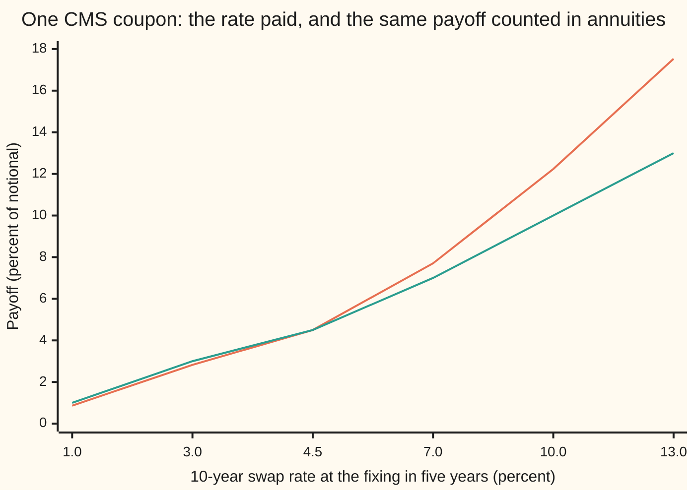
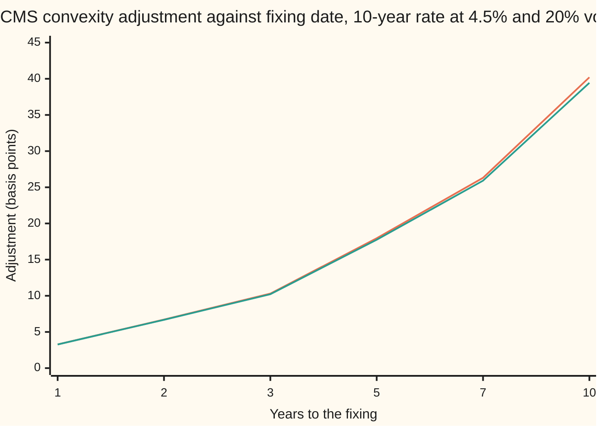

# Constant-maturity swaps: paying a swap rate on the wrong date, and the replication that prices it

[Syllabus](../../../SYLLABUS.md) → [Financial mathematics](../../../SYLLABUS.md#w12) → [Convexity and Exotics](../../../SYLLABUS.md#w12-s32) → Constant-maturity swaps

---

## General Overview

A pension fund agrees to receive, every year, whatever the 10-year swap rate happens to be that year, on 10 million dollars. The 10-year swap rate is the fixed rate at which, on that day, the market will swap fixed payments for floating ones for ten years ([The par swap rate](../28-Swaps/02-par-swap-rate-and-annuity.md)). A contract that pays a swap rate of fixed length as its coupon, year after year, is a **constant-maturity swap**, CMS for short: the maturity of the rate it pays stays at ten years while the calendar moves on.

Take one of its coupons. In five years the 10-year rate is read off the screen. One year after that, the fund receives that rate times 10 million dollars. Today's curve is flat at 4.5 percent a year, so the forward 10-year rate for that date, the fair fixed rate today for a 10-year swap starting in five years, is 4.5 percent.

The natural guess prices the coupon as if it will pay 4.5 percent: 345,553.08 dollars today. The right price is 359,344.72 dollars. The coupon behaves as if it paid 4.6796 percent, **18 basis points** more (a basis point is a hundredth of a percentage point). The 13,791.64 dollars between the two is the **CMS convexity adjustment**, the term used from here on.

The forward rate is the fair average only for a payment made in a particular currency unit: the swap's own annuity, the ten-year strip of payments that a swap rate is naturally paid in. The CMS coupon is paid once, one year after the fixing. Call each possible state of the market at the fixing a scenario. High-rate scenarios shrink a ten-year strip far more than a one-year payment, so counted in the coupon's own unit they weigh more, and the average rate lands above the forward. Patrick Hagan showed in 2003 how to price that tilt from the prices of swaptions, options on the same swap rate at every strike, once the curve's moves are tied to that one rate.

**A CMS coupon pays a swap rate on a date the swap rate was not built for; re-weighting the scenarios to that date lifts its fair rate above the forward, and a strip of swaptions struck across all rates buys the re-weighting outright.**

**What kind of fact this is:** a method. Its core, the static replication, is a theorem proved on this card in Why it works. It is applied through a model of how the whole curve moves with the 10-year rate, which is an assumption, not a law.

### The picture: the coupon counted in annuities is curved

Counted in dollars on the payment date, the coupon is a straight line in the rate. Counted in annuities, the unit the swaption market prices in, it bends upward, and a payoff that bends upward is worth more than its value at the average.



Straight line: the rate the coupon pays. Curved line: the same payoff counted in annuity units and scaled so the two agree at the 4.5 percent forward. The rates are not evenly spaced along the axis. Below the forward the curve sits under the line; above it, well over it. The curve's upward bend is the "convexity" in the name.

---

## The formula

Notation first, in words. Times are in years from today. $T$ is the fixing date, five years out. $U$ is the payment date, $T + 1$. $S_T$ is the 10-year swap rate observed at $T$, unknown today. $D(t)$ is today's price of one dollar paid at time $t$, the discount factor; on the flat curve $D(t) = 1.045^{-t}$. $A_T$ is the swap's **annuity** at $T$: the value then of one dollar paid at the end of each of the swap's ten years. $A_0$ is its value today. $\mathbb{E}^A[\,\cdot\,]$ is an average taken with the weights of the **annuity measure** ([The annuity measure](../29-Caps%2C%20Floors%20and%20Swaptions/05-the-annuity-measure.md)): the weights under which the forward swap rate $F$ has no drift, $\mathbb{E}^A[S_T] = F$.

The fair rate of a CMS coupon, the fixed rate that makes it worth the same as the floating coupon, is, with $h$ defined two displays below,

$$K_{\text{CMS}} = \frac{\mathbb{E}^A[\,S_T\, w(S_T)\,]}{\mathbb{E}^A[\,w(S_T)\,]} = F + \frac{\mathbb{E}^A[\,h(S_T)\,]}{\mathbb{E}^A[\,w(S_T)\,]}$$

**Read it aloud:** average the rate over the swaption market's scenarios, but let each scenario count in proportion to what the payment date's dollar is worth there relative to the annuity.

The weight $w$ is the payment bond over the annuity, written as a function of the rate by assuming the whole curve sits flat at $S_T$ on the fixing date:

$$w(s) = \frac{(1+s)^{-1}}{G(s)}, \qquad G(s) = \sum_{i=1}^{10} (1+s)^{-i}$$

In words: the top is one dollar paid a year after the fixing; the bottom is the annuity, ten such dollars, one a year. Both are discounted at the rate $s$ itself. The Greek capital sigma, $\sum$, means "add the terms for $i = 1$ to $10$".

The adjustment's numerator comes from swaption prices, Hagan's replication:

$$\mathbb{E}^A[h(S_T)] = \int_0^F h''(k)\, R(k)\, dk + \int_F^\infty h''(k)\, P(k)\, dk, \qquad h(s) = (s-F)\,\big(w(s) - w(F)\big)$$

In words: buy receiver swaptions at every strike below the forward and payer swaptions at every strike above it, in the amounts $h''(k)\,dk$; the strip's cost is the numerator. The denominator is found the same way with $w''$ in place of $h''$, plus $w(F)$.

| Symbol | Plain meaning | In our example | Push it up and the adjustment… |
| --- | --- | --- | --- |
| $S_T$ | the 10-year swap rate read at the fixing | unknown today | — |
| $F$ | the forward 10-year swap rate for the fixing date | 4.5% | grows, roughly as its square |
| $T$, $U$ | the fixing date and the payment date | 5 and 6 years | a later $T$ grows it (40.20 bp at 10 years); a later $U$ shrinks it, then turns it negative |
| $\sigma$ | Black volatility of the swap rate: the spread of its log per root-year | 20% | grows: 46.48 bp at 30% |
| $D(t)$, $t$ | today's price of a dollar paid at time $t$ | $D(U) = 0.767896$ | — |
| $A_T$, $A_0$, $A$ | the annuity at the fixing, today, and as a unit of account | $A_0 = 6.349569$ | — |
| $G(s)$, $s$, $\sum$ | the annuity on a flat curve at rate $s$; the sum of its ten terms | 7.912718 at 4.5% | — |
| $w(s)$, $W_T$, $c$ | payment bond over annuity: modelled as a function of the rate, the true ratio at $T$, and the constant between them | 0.120937 at 4.5% | a steeper $w$ gives a bigger adjustment |
| $h(s)$, $f$, $k$ | the payoff the strip replicates; any smooth payoff; a swaption strike | — | — |
| $R(k)$, $P(k)$, $N$, $d_1$, $d_2$ | receiver and payer swaption prices per unit of annuity; the bell-curve area and Black's two cut-offs | Black's formula at 20% | — |
| $K_{\text{CMS}}$ | the CMS coupon's fair rate | 4.6796% | — |
| $Q$, $B$, $X$ | in the proof only: the risk-neutral measure, the bank account, any positive traded asset used as the unit | — | — |

$R$ and $P$ are Black's swaption formulas from [Swaptions](../29-Caps%2C%20Floors%20and%20Swaptions/04-swaptions-payer-and-receiver.md), with the annuity factor left off: $P(k) = F\,N(d_1) - k\,N(d_2)$, $R(k) = k\,N(-d_2) - F\,N(-d_1)$, where $N$ is the bell-curve area to the left and $d_{1,2} = \big(\ln(F/k) \pm \sigma^2 T/2\big)/(\sigma\sqrt{T})$.

A quick formula, exact when $w$ is a straight line, gives most of the answer by hand:

$$K_{\text{CMS}} - F \approx F^2\left(e^{\sigma^2 T} - 1\right)\frac{w'(F)}{w(F)}$$

In words: the variance of the rate under the annuity measure, times how steeply the weight rises, per unit of weight. $w'$ is the slope of $w$; $w''$ and $h''$ are the second derivatives, the rate at which the slope changes.

### When it holds

- **Swaption prices are known at every strike.** Here a flat 20 percent Black volatility supplies them. Real markets have a smile (volatility that differs by strike), and the strip must use the market's price strike by strike; using one at-the-money volatility for all strikes misprices the wings.
- **The whole curve moves with the 10-year rate.** The weight $w$ assumes a flat curve at $S_T$. If the curve twists, two scenarios with the same 10-year rate have different weights, and no strip of swaptions on one rate can see the difference. The error is small for mild twists, but it is a model error, not a rounding error.
- **Rates stay positive.** The lognormal Black model and the lower limit 0 in the receiver integral both assume it. Negative rates need shifted or normal volatilities ([Rate volatilities](../29-Caps%2C%20Floors%20and%20Swaptions/06-normal-and-shifted-volatilities-for-rates.md)) and a receiver integral that starts below zero.
- **The payer wing is thin enough.** The payer integral runs to infinity, and its weights $h''(k)$ stay between 0.86 and 1.03 for every strike up to 30 percent. If the smile makes high-strike payers expensive, the integral, and the CMS price, grow sharply. That is Hagan's warning: CMS prices are hostage to the far upside of the smile.
- **The payment lag is the one stated.** The weight depends on when the coupon is paid. Paid on the fixing date the adjustment is 22.77 bp; paid at the swap's end it is −19.55 bp.
- **Conventions verified 2026-09-28.** The example pays annually with accrual fraction 1 on a flat annually compounded curve. Real USD swaps on SOFR pay the fixed leg annually on Act/360, and swaption volatilities are mostly quoted as normal (basis-point) volatilities; convert those to Black before using this card's formulas.

---

## Why it works

### Step 0: price the coupon in the unit where the rate has no drift

The swap rate is one traded price divided by another: the floating leg's value divided by the annuity. Counted in annuities it has no drift, and the swaption market prices in exactly that unit. The CMS coupon is paid in a different unit: one dollar on date $U$. So the plan is to write the coupon in annuity units, where swaptions describe the rate, and account for the conversion factor between the two units. That factor is where the adjustment lives.

### Step 1: the conversion factor is the payment bond over the annuity

The coupon pays $S_T$ at $U$. Its value today is $D(U)$ times the average of $S_T$ under the weights that belong to the payment date. Changing the unit from the payment bond to the annuity multiplies each scenario's weight by the ratio of the two assets in that scenario, divided by the same ratio today. Writing $W_T$ for the payment bond's price at the fixing divided by $A_T$, and dividing by the coupon's value per unit rate,

$$K_{\text{CMS}} = \frac{\mathbb{E}^A[\,S_T\, W_T\,]}{\mathbb{E}^A[\,W_T\,]}.$$

This is exact. It uses nothing but the absence of free money.

If $W_T$ were a constant, it would cancel and $K_{\text{CMS}}$ would be $F$. It is not constant, and it rises with the rate: at 4.5 percent the ratio is 0.120937, and its slope is 3.959847 times its own size per unit of rate. So futures with high rates count extra, and the average moves above $F$. This is the same mechanism as the gap between futures and forwards on [Futures against forwards](01-futures-forward-convexity.md): a payment made in the wrong unit, averaged under the wrong weights.

<details>
<summary>Detailed proof: the change of unit</summary>

Let $B$ be the bank account and $Q$ the risk-neutral measure. For any positive traded asset $X$ with no payouts before $T$, the measure $Q^X$ with density $dQ^X/dQ = X_T/(X_0 B_T)$ makes every traded price divided by $X$ a martingale. Take $X$ = the payment bond, price $P(t, U)$ at time $t$, and $X$ = the annuity $A$. The coupon's value today is $D(U)\,\mathbb{E}^{U}[S_T]$, since $S_T$ paid at $U$ divided by the bond, which is worth 1 at $U$, is $S_T$ itself. The ratio of densities is
$$\frac{dQ^U}{dQ^A} = \frac{P(T,U)/D(U)}{A_T/A_0} = \frac{A_0}{D(U)}\,W_T.$$
A density averages to 1, so $\mathbb{E}^A[W_T] = D(U)/A_0$. Then $\mathbb{E}^U[S_T] = \mathbb{E}^A[S_T\, W_T]\,A_0/D(U) = \mathbb{E}^A[S_T W_T]/\mathbb{E}^A[W_T]$. Subtracting $F = \mathbb{E}^A[S_T]$ gives $K_{\text{CMS}} - F = \operatorname{Cov}^A(S_T, W_T)/\mathbb{E}^A[W_T]$: the adjustment is the covariance of the rate with the weight. Nothing here fixes the sign; the payment date does.

</details>

### Step 2: make the weight a function of the rate

Swaptions describe the rate $S_T$ and nothing else about the curve. To use them, the weight must be written as a function of the rate. Hagan's standard choice: on the fixing date the curve is flat at $S_T$ and compounds once a year. Then the payment bond is $(1+S_T)^{-1}$, the annuity is $G(S_T)$, and $W_T = c\,w(S_T)$ for a constant $c$ that makes today's bond prices come out right. The constant cancels from top and bottom of Step 1's ratio, so only the shape of $w$ matters. On today's flat curve the check prints $w(F) = D(U)/A_0 = 0.120937$ both ways, a sign the mapping agrees with today's curve.

### Step 3: any smooth payoff is a strip of options

For any function $f$ with a second derivative, and any rate $s > 0$,

$$f(s) = f(F) + f'(F)(s-F) + \int_0^F f''(k)\,(k-s)^+\,dk + \int_F^\infty f''(k)\,(s-k)^+\,dk,$$

where $(x)^+$ means $x$ if positive, else 0. In words: a curved payoff is a straight line plus a heap of hockey sticks, one at every strike, each sized by how sharply the payoff bends there. Below the forward the hockey sticks are receivers, $(k - s)^+$; above it, payers, $(s - k)^+$.

<details>
<summary>Detailed proof: the strip identity</summary>

Take $s > F$. Only the second integral is non-zero, and only for $k$ between $F$ and $s$. Integrate by parts: $\int_F^s f''(k)(s-k)\,dk = \big[f'(k)(s-k)\big]_F^s + \int_F^s f'(k)\,dk = -f'(F)(s-F) + f(s) - f(F)$. Adding back $f(F) + f'(F)(s-F)$ leaves $f(s)$. For $s < F$ the first integral does the same job on the interval from $s$ to $F$, with the signs mirrored. For $s = F$ both integrals vanish. The identity holds rate by rate, with no probability in it, which is why it is called static: the strip is bought once and never traded again.

</details>

### Step 4: price the strip with swaptions

Apply Step 3 to $h(s) = (s - F)\big(w(s) - w(F)\big)$. It is zero at $F$ and so is its slope there, so only the integrals survive. Average under the annuity measure. The average of $(s - k)^+$ is the payer swaption's price in annuity units, $P(k)$, and the average of $(k - s)^+$ is the receiver's, $R(k)$. That gives Hagan's formula for the numerator. The same step on $w$ gives the denominator, $\mathbb{E}^A[w] = w(F) + \int_0^F w''R\,dk + \int_F^\infty w''P\,dk$, where the straight-line term averages away because $\mathbb{E}^A[S_T] = F$.

Why $h$ and not $s\,w(s)$ directly: $s\,w(s) = F\,w(F) + w(F)(s - F) + F\big(w(s) - w(F)\big) + h(s)$. Average it. The second piece is zero, and the first and third add to $F\,\mathbb{E}^A[w]$. So $\mathbb{E}^A[S_T w] = F\,\mathbb{E}^A[w] + \mathbb{E}^A[h]$; divide by $\mathbb{E}^A[w]$ to get $K_{\text{CMS}} = F + \mathbb{E}^A[h]/\mathbb{E}^A[w]$.

### Step 5: the sign and the size

The strip's weights are $h''(k) = 2w'(k) + (k - F)\,w''(k)$. With the coupon paid one year after the fixing, $w$ rises with the rate and bends only gently, so the weights are positive and every option in the strip is bought, not sold. A positive-weighted strip of options costs something, so the adjustment is positive. For the example the receivers below 4.5 percent contribute 5.7096 bp and the payers above contribute 12.2507 bp: 17.9603 bp in all. The payers carry two thirds of it, because a lognormal rate has a long right tail.

A second road, the quick formula, replaces $w$ by its tangent line at $F$: $w(s) \approx w(F) + w'(F)(s - F)$. Then the covariance of Step 1 is the slope times the variance of $S_T$, which for a lognormal rate is $F^2(e^{\sigma^2 T} - 1)$, and the denominator is $w(F)$. It gives 17.7536 bp, 1.2 percent low, because it drops the bend of $w$. The coupon paid at a different point in time follows the same derivation with a different $w$: [Timing adjustments](03-timing-and-in-arrears-adjustments.md).

---

## Worked numbers, by hand

The quick formula, then the replicated answer from the code.

| Step | Arithmetic | Value |
| --- | --- | --- |
| annuity at the forward, $G(F)$ | $1.045^{-1} + \dots + 1.045^{-10}$ | 7.912718 |
| weight at the forward, $w(F)$ | $1.045^{-1} / 7.912718$ | 0.120937 |
| same from today's curve, $D(U)/A_0$ | $0.767896 / 6.349569$ | 0.120937 |
| weight's slope per unit weight, $w'(F)/w(F)$ | nudge $F$ by 0.001 percent each way | 3.959847 |
| lognormal spread, $e^{\sigma^2 T} - 1$ | $e^{0.04 \times 5} - 1$ | 0.221403 |
| variance of the rate, $F^2(e^{\sigma^2 T} - 1)$ | $0.045^2 \times 0.221403$ | 0.00044834 |
| quick adjustment | $0.00044834 \times 3.959847$ | 17.75 bp |
| replicated adjustment, strip of swaptions | receivers 5.7096 + payers 12.2507 | **17.96 bp** |
| CMS rate | $4.5\% + 0.1796\%$ | **4.6796%** |
| coupon at the forward | $10{,}000{,}000 \times 0.767896 \times 4.5\%$ | $345,553.08 |
| CMS coupon | $10{,}000{,}000 \times 0.767896 \times 4.6796\%$ | **$359,344.72** |

The fund's one coupon is worth 13,791.64 dollars more than the forward says. A desk that paid the forward rate on this coupon would give that away.

### What breaks if you drop a piece

| Mistake | Comes out at | What went wrong |
| --- | --- | --- |
| Price the coupon at the forward rate | 0 bp, $345,553.08 | The forward is the average in annuity units, not in payment-date dollars |
| Take the quick formula as exact | 17.75 bp | The tangent line drops the bend of $w$: 1.2 percent low here, worse at long expiries |
| Treat the coupon as paid on the fixing date | 22.77 bp | A dollar paid sooner leans harder on high rates: the lag shapes $w$ |
| Copy the positive sign to a coupon paid at the swap's end | −19.55 bp | Paid ten years after the fixing, $w$ falls with the rate and the strip is sold, not bought |

### How the adjustment grows with the fixing date

A full CMS leg pays one coupon a year, each with its own fixing date. Each gets its own adjustment, and the later ones get far more.



Upper line: the exact adjustment from the direct integral. Lower line: the quick formula. The fixing dates are not evenly spaced along the axis. The adjustment grows faster than the time to fixing, because the variance $F^2(e^{\sigma^2 T} - 1)$ does, and the quick formula falls further behind as the rate's distribution gets more lopsided.

### How the price moves

| Sensitivity | Meaning | Value |
| --- | --- | --- |
| Delta | change in the CMS rate per 1 bp rise in the forward | 1.0747 bp |
| Vega | change in the adjustment per 1 point of volatility | 2.0005 bp |
| Time to fixing | the adjustment at 5 years against 3 and 7 | 10.30, 17.96, 26.31 bp |

The delta above 1 is the convexity at work: a higher forward raises the rate and raises the adjustment on top. A CMS receiver is long volatility even though it owns no option: the vega is the price of the swaption strip it is implicitly holding.

---

## Code, from first principles, and it actually runs

The code prices the one coupon four independent ways. Road 1 builds the swaption strip: Black prices at every strike, from a normal CDF written out as a series, weighted by $h''$ and summed by Simpson's rule. Road 2 skips swaptions and integrates the weighted rate directly over the lognormal distribution. Road 3 is a Monte Carlo with a hand-written random-number generator and 200,000 paths. Road 4 is the quick formula. The asserts compare the strip with the direct integral (at the one-year lag and again at the ten-year lag, where the sign flips), the simulation with the direct integral inside four standard errors, the quick formula with the direct integral inside 3 percent, $w(F)$ with today's $D(U)/A_0$, payer-minus-receiver parity with $F - k$, and the sign against the payment date both ways. Python and Rust print identical outputs.

### Python

```python
# CMS convexity adjustment -- the check behind the card.  Standard library only.
# One CMS coupon: the 10-year annual swap rate fixed in 5 years, paid 1 year later.
# Roads: (1) static replication in swaptions, (2) direct integral over the rate,
# (3) Monte Carlo with a hand-made generator, (4) the linear quick formula.
from math import exp, log, sqrt, pi, cos

F, SIG, T, N_SWAP, L = 0.045, 0.20, 5.0, 10, 10_000_000.0

def N(x):                                   # normal CDF from its Taylor series
    if x > 9: return 1.0
    if x < -9: return 0.0
    term, total, k = x, x, 0
    while abs(term) > 1e-17 * max(1.0, abs(total)):
        k += 1
        term *= x * x / (2 * k + 1)
        total += term
    return 0.5 + exp(-x * x / 2) / sqrt(2 * pi) * total

def phi(z): return exp(-z * z / 2) / sqrt(2 * pi)
def G(s): return sum((1 + s) ** -i for i in range(1, N_SWAP + 1))   # annuity at rate s
def w(s, d=1): return (1 + s) ** -d / G(s)  # payment bond / annuity, paid d years after fixing
def h(s, d=1): return (s - F) * (w(s, d) - w(F, d))

def second(f, k, e=1e-4): return (f(k + e) - 2 * f(k) + f(k - e)) / (e * e)

def black(k, sig, payer):                   # swaption value in annuity units
    v = sig * sqrt(T)
    d1 = (log(F / k) + v * v / 2) / v
    d2 = d1 - v
    if payer: return F * N(d1) - k * N(d2)
    return k * N(-d2) - F * N(-d1)

def simpson(f, a, b, m):
    step = (b - a) / m
    tot = f(a) + f(b)
    for i in range(1, m):
        tot += (4 if i % 2 else 2) * f(a + i * step)
    return tot * step / 3

def by_strip(sig=SIG, d=1):                 # receivers below F, payers above F
    def otm(k): return black(k, sig, k > F) if k > 0 else 0.0
    def num(k): return second(lambda s: h(s, d), k) * otm(k)
    def den(k): return second(lambda s: w(s, d), k) * otm(k)
    rec, pay = simpson(num, 0.0, F, 600), simpson(num, F, 1.0, 4000)
    bot = w(F, d) + simpson(den, 0.0, F, 600) + simpson(den, F, 1.0, 4000)
    return rec / bot, pay / bot, bot        # adjustment = rec + pay, bot = E[w]

def by_integral(sig=SIG, d=1, f0=F, t=T):
    v = sig * sqrt(t)
    def S(z): return f0 * exp(-v * v / 2 + v * z)
    top = simpson(lambda z: S(z) * w(S(z), d) * phi(z), -9, 9, 4000)
    bot = simpson(lambda z: w(S(z), d) * phi(z), -9, 9, 4000)
    return top / bot - f0

def by_monte_carlo(paths=200_000, seed=20260928):
    x = seed; M = (1 << 64) - 1; v = SIG * sqrt(T)
    def unif():
        nonlocal x
        x ^= (x << 13) & M; x ^= x >> 7; x ^= (x << 17) & M
        return ((x >> 11) + 0.5) / 2.0 ** 53
    sh = sw = sh2 = 0.0
    for _ in range(paths // 2):
        z = sqrt(-2 * log(unif())) * cos(2 * pi * unif())
        for zz in (z, -z):                  # antithetic pair
            s = F * exp(-v * v / 2 + v * zz)
            sh += h(s); sw += w(s); sh2 += h(s) ** 2
    mh, mw = sh / paths, sw / paths
    se = sqrt((sh2 / paths - mh * mh) / paths) / mw
    return mh / mw, se

def quick(sig=SIG, d=1, t=T):               # linear weight: F^2 (e^{sig^2 T} - 1) w'(F)/w(F)
    slope = (w(F + 1e-5, d) - w(F - 1e-5, d)) / 2e-5
    return F * F * (exp(sig * sig * t) - 1) * slope / w(F, d)

bp = 1e4
DU = 1.045 ** -6                            # payment bond on a flat 4.5% annual curve
A0 = sum(1.045 ** -i for i in range(6, 16))
rec, pay, ew = by_strip(); a1 = rec + pay; a2 = by_integral(); a3, se = by_monte_carlo(); a4 = quick()
print(f"inputs: forward, vol, expiry           {F:.3f}  {SIG:.2f}  {T:.1f}")
print(f"payment weight w(F) = D(U)/A0          {w(F):.6f}  {DU / A0:.6f}")
print(f"weight slope w'(F)/w(F)                {(w(F + 1e-5) - w(F - 1e-5)) / 2e-5 / w(F):.6f}")
print(f"annuity at the forward G(F); D(U); A0  {G(F):.6f}  {DU:.6f}  {A0:.6f}")
print(f"e^(sig^2 T) - 1; rate variance F^2(..)  {exp(SIG * SIG * T) - 1:.6f}  {F * F * (exp(SIG * SIG * T) - 1):.8f}")
print(f"parity at k=6%: payer - receiver       {black(0.06, SIG, True) - black(0.06, SIG, False):.8f}")
print(f"1 strip of swaptions, bp               {a1 * bp:.4f}")
print(f"2 direct integral, bp                  {a2 * bp:.4f}")
print(f"3 Monte Carlo 200k paths, bp           {a3 * bp:.4f}  (se {se * bp:.4f})")
print(f"4 linear quick formula, bp             {a4 * bp:.4f}")
print(f"CMS rate, percent                      {(F + a2) * 100:.4f}")
print(f"adjustment on $10m, dollars            {L * DU * a2:.2f}")
print(f"coupon at forward, no adjustment, $    {L * DU * F:.2f}")
print(f"CMS coupon on $10m, dollars            {L * DU * (F + a2):.2f}")
print(f"strip: receivers below F, bp           {rec * bp:.4f}")
print(f"strip: payers above F, bp              {pay * bp:.4f}")
print(f"average weight E[w] under annuity law  {ew:.6f}")
print("expiry sweep, adjustment bp (direct, quick):")
for t in (1, 2, 3, 5, 7, 10):
    print(f"  T = {t:>2}                                {by_integral(t=t) * bp:.2f}  {quick(t=t) * bp:.2f}")
print(f"quick formula shortfall at 5y, 10y, %   {(1 - a4 / a2) * 100:.1f}  {(1 - quick(t=10) / by_integral(t=10)) * 100:.1f}")
print("payoff counted in annuities, S w(S)/w(F) against S, percent:")
for s in (0.01, 0.03, 0.045, 0.07, 0.10, 0.13):
    print(f"  S = {s * 100:>4.1f}                              {s * w(s) / w(F) * 100:.3f}")
up = by_integral(f0=F + 1e-4); dn = by_integral(f0=F - 1e-4)
print(f"delta: CMS rate per 1bp of forward     {(2e-4 + up - dn) / 2e-4:.4f}")
print(f"vega: adjustment bp per vol point      {(by_integral(sig=SIG + 0.005) - by_integral(sig=SIG - 0.005)) * bp:.4f}")
print(f"wrong: no adjustment, bp               {0.0:.4f}")
print(f"wrong: paid on fixing date, bp         {by_integral(d=0) * bp:.4f}")
print(f"wrong: paid at swap's end, bp          {by_integral(d=10) * bp:.4f}")
print(f"try: vol 30%, bp                       {by_integral(sig=0.30) * bp:.4f}")
print(f"try: vol 10%, bp                       {by_integral(sig=0.10) * bp:.4f}")
end = sum(by_strip(d=10)[:2])
print(f"try: strip, paid at swap's end, bp     {end * bp:.4f}")

assert abs(a1 - a2) < 1e-7                  # replication against direct integral
assert abs(a3 - a2) < 4 * se                # simulation against direct integral
assert abs(a4 - a2) < 0.03 * a2             # quick formula within 3 percent
assert abs(black(0.06, SIG, True) - black(0.06, SIG, False) - (F - 0.06)) < 1e-12
assert abs(w(F) - DU / A0) < 1e-12         # flat-curve weight matches today's curve
assert abs(end - by_integral(d=10)) < 1e-7  # replication still holds when the sign flips
assert by_integral(d=10) < 0                # paying late flips the sign
assert by_integral(d=0) > a2                # paying early makes it bigger
print("all checks passed")
```

**Ran 2026-09-28 on macOS, Python 3.14.6, standard library only. All checks passed. Output, pasted from the run:**

```
inputs: forward, vol, expiry           0.045  0.20  5.0
payment weight w(F) = D(U)/A0          0.120937  0.120937
weight slope w'(F)/w(F)                3.959847
annuity at the forward G(F); D(U); A0  7.912718  0.767896  6.349569
e^(sig^2 T) - 1; rate variance F^2(..)  0.221403  0.00044834
parity at k=6%: payer - receiver       -0.01500000
1 strip of swaptions, bp               17.9603
2 direct integral, bp                  17.9603
3 Monte Carlo 200k paths, bp           17.9046  (se 0.1008)
4 linear quick formula, bp             17.7536
CMS rate, percent                      4.6796
adjustment on $10m, dollars            13791.64
coupon at forward, no adjustment, $    345553.08
CMS coupon on $10m, dollars            359344.72
strip: receivers below F, bp           5.7096
strip: payers above F, bp              12.2507
average weight E[w] under annuity law  0.121045
expiry sweep, adjustment bp (direct, quick):
  T =  1                                3.28  3.27
  T =  2                                6.71  6.68
  T =  3                                10.30  10.22
  T =  5                                17.96  17.75
  T =  7                                26.31  25.91
  T = 10                                40.20  39.44
quick formula shortfall at 5y, 10y, %   1.2  1.9
payoff counted in annuities, S w(S)/w(F) against S, percent:
  S =  1.0                              0.864
  S =  3.0                              2.823
  S =  4.5                              4.500
  S =  7.0                              7.702
  S = 10.0                              12.234
  S = 13.0                              17.531
delta: CMS rate per 1bp of forward     1.0747
vega: adjustment bp per vol point      2.0005
wrong: no adjustment, bp               0.0000
wrong: paid on fixing date, bp         22.7748
wrong: paid at swap's end, bp          -19.5525
try: vol 30%, bp                       46.4845
try: vol 10%, bp                       4.1237
try: strip, paid at swap's end, bp     -19.5525
all checks passed
```

### Rust

```rust
// CMS convexity adjustment -- the check behind the card.  Rust std only.
// One CMS coupon: the 10-year annual swap rate fixed in 5 years, paid 1 year later.
// Roads: (1) static replication in swaptions, (2) direct integral over the rate,
// (3) Monte Carlo with a hand-made generator, (4) the linear quick formula.
use std::f64::consts::PI;

const F: f64 = 0.045;
const SIG: f64 = 0.20;
const T: f64 = 5.0;
const N_SWAP: i32 = 10;
const L: f64 = 10_000_000.0;

fn n_cdf(x: f64) -> f64 { // normal CDF from its Taylor series
    if x > 9.0 { return 1.0; }
    if x < -9.0 { return 0.0; }
    let (mut term, mut total, mut k) = (x, x, 0.0);
    while term.abs() > 1e-17 * total.abs().max(1.0) {
        k += 1.0;
        term *= x * x / (2.0 * k + 1.0);
        total += term;
    }
    0.5 + (-x * x / 2.0).exp() / (2.0 * PI).sqrt() * total
}
fn phi(z: f64) -> f64 { (-z * z / 2.0).exp() / (2.0 * PI).sqrt() }
fn g(s: f64) -> f64 { (1..=N_SWAP).map(|i| (1.0 + s).powi(-i)).sum() } // annuity at rate s
fn w(s: f64, d: i32) -> f64 { (1.0 + s).powi(-d) / g(s) } // payment bond / annuity
fn h(s: f64, d: i32) -> f64 { (s - F) * (w(s, d) - w(F, d)) }
fn second(f: &dyn Fn(f64) -> f64, k: f64) -> f64 {
    let e = 1e-4;
    (f(k + e) - 2.0 * f(k) + f(k - e)) / (e * e)
}
fn black(k: f64, sig: f64, payer: bool) -> f64 { // swaption value in annuity units
    let v = sig * T.sqrt();
    let d1 = ((F / k).ln() + v * v / 2.0) / v;
    let d2 = d1 - v;
    if payer { F * n_cdf(d1) - k * n_cdf(d2) } else { k * n_cdf(-d2) - F * n_cdf(-d1) }
}
fn simpson(f: &dyn Fn(f64) -> f64, a: f64, b: f64, m: usize) -> f64 {
    let step = (b - a) / m as f64;
    let mut tot = f(a) + f(b);
    for i in 1..m { tot += (if i % 2 == 1 { 4.0 } else { 2.0 }) * f(a + i as f64 * step); }
    tot * step / 3.0
}
fn otm(k: f64, sig: f64) -> f64 { if k > 0.0 { black(k, sig, k > F) } else { 0.0 } }
fn by_strip(sig: f64, d: i32) -> (f64, f64, f64) { // receivers below F, payers above F
    let num = |k: f64| second(&|s| h(s, d), k) * otm(k, sig);
    let den = |k: f64| second(&|s| w(s, d), k) * otm(k, sig);
    let (rec, pay) = (simpson(&num, 0.0, F, 600), simpson(&num, F, 1.0, 4000));
    let bot = w(F, d) + simpson(&den, 0.0, F, 600) + simpson(&den, F, 1.0, 4000);
    (rec / bot, pay / bot, bot) // adjustment = rec + pay, bot = E[w]
}
fn by_integral(sig: f64, d: i32, f0: f64, t: f64) -> f64 {
    let v = sig * t.sqrt();
    let s = |z: f64| f0 * (-v * v / 2.0 + v * z).exp();
    let top = simpson(&|z| s(z) * w(s(z), d) * phi(z), -9.0, 9.0, 4000);
    let bot = simpson(&|z| w(s(z), d) * phi(z), -9.0, 9.0, 4000);
    top / bot - f0
}
fn by_monte_carlo(paths: usize, seed: u64) -> (f64, f64) {
    let mut x = seed;
    let v = SIG * T.sqrt();
    let mut unif = || { x ^= x << 13; x ^= x >> 7; x ^= x << 17; ((x >> 11) as f64 + 0.5) / 2f64.powi(53) };
    let (mut sh, mut sw, mut sh2) = (0.0, 0.0, 0.0);
    for _ in 0..paths / 2 {
        let u1 = unif();
        let u2 = unif();
        let z = (-2.0 * u1.ln()).sqrt() * (2.0 * PI * u2).cos();
        for zz in [z, -z] { // antithetic pair
            let s = F * (-v * v / 2.0 + v * zz).exp();
            sh += h(s, 1); sw += w(s, 1); sh2 += h(s, 1).powi(2);
        }
    }
    let (mh, mw) = (sh / paths as f64, sw / paths as f64);
    (mh / mw, ((sh2 / paths as f64 - mh * mh) / paths as f64).sqrt() / mw)
}
fn quick(sig: f64, d: i32, t: f64) -> f64 { // linear weight: F^2 (e^{sig^2 T} - 1) w'(F)/w(F)
    let slope = (w(F + 1e-5, d) - w(F - 1e-5, d)) / 2e-5;
    F * F * ((sig * sig * t).exp() - 1.0) * slope / w(F, d)
}

fn main() {
    let bp = 1e4;
    let du = 1.045f64.powi(-6); // payment bond on a flat 4.5% annual curve
    let a0: f64 = (6..16).map(|i| 1.045f64.powi(-i)).sum();
    let (rec, pay, ew) = by_strip(SIG, 1);
    let a1 = rec + pay;
    let a2 = by_integral(SIG, 1, F, T);
    let (a3, se) = by_monte_carlo(200_000, 20260928);
    let a4 = quick(SIG, 1, T);
    let parity = black(0.06, SIG, true) - black(0.06, SIG, false);
    println!("inputs: forward, vol, expiry           {:.3}  {:.2}  {:.1}", F, SIG, T);
    println!("payment weight w(F) = D(U)/A0          {:.6}  {:.6}", w(F, 1), du / a0);
    println!("weight slope w'(F)/w(F)                {:.6}", (w(F + 1e-5, 1) - w(F - 1e-5, 1)) / 2e-5 / w(F, 1));
    println!("annuity at the forward G(F); D(U); A0  {:.6}  {:.6}  {:.6}", g(F), du, a0);
    println!("e^(sig^2 T) - 1; rate variance F^2(..)  {:.6}  {:.8}", (SIG * SIG * T).exp() - 1.0, F * F * ((SIG * SIG * T).exp() - 1.0));
    println!("parity at k=6%: payer - receiver       {:.8}", parity);
    println!("1 strip of swaptions, bp               {:.4}", a1 * bp);
    println!("2 direct integral, bp                  {:.4}", a2 * bp);
    println!("3 Monte Carlo 200k paths, bp           {:.4}  (se {:.4})", a3 * bp, se * bp);
    println!("4 linear quick formula, bp             {:.4}", a4 * bp);
    println!("CMS rate, percent                      {:.4}", (F + a2) * 100.0);
    println!("adjustment on $10m, dollars            {:.2}", L * du * a2);
    println!("coupon at forward, no adjustment, $    {:.2}", L * du * F);
    println!("CMS coupon on $10m, dollars            {:.2}", L * du * (F + a2));
    println!("strip: receivers below F, bp           {:.4}", rec * bp);
    println!("strip: payers above F, bp              {:.4}", pay * bp);
    println!("average weight E[w] under annuity law  {:.6}", ew);
    println!("expiry sweep, adjustment bp (direct, quick):");
    for t in [1.0, 2.0, 3.0, 5.0, 7.0, 10.0] {
        println!("  T = {:>2}                                {:.2}  {:.2}", t as i32, by_integral(SIG, 1, F, t) * bp, quick(SIG, 1, t) * bp);
    }
    println!("quick formula shortfall at 5y, 10y, %   {:.1}  {:.1}", (1.0 - a4 / a2) * 100.0, (1.0 - quick(SIG, 1, 10.0) / by_integral(SIG, 1, F, 10.0)) * 100.0);
    println!("payoff counted in annuities, S w(S)/w(F) against S, percent:");
    for s in [0.01, 0.03, 0.045, 0.07, 0.10, 0.13] {
        println!("  S = {:>4.1}                              {:.3}", s * 100.0, s * w(s, 1) / w(F, 1) * 100.0);
    }
    let (up, dn) = (by_integral(SIG, 1, F + 1e-4, T), by_integral(SIG, 1, F - 1e-4, T));
    println!("delta: CMS rate per 1bp of forward     {:.4}", (2e-4 + up - dn) / 2e-4);
    println!("vega: adjustment bp per vol point      {:.4}", (by_integral(SIG + 0.005, 1, F, T) - by_integral(SIG - 0.005, 1, F, T)) * bp);
    println!("wrong: no adjustment, bp               {:.4}", 0.0);
    println!("wrong: paid on fixing date, bp         {:.4}", by_integral(SIG, 0, F, T) * bp);
    println!("wrong: paid at swap's end, bp          {:.4}", by_integral(SIG, 10, F, T) * bp);
    println!("try: vol 30%, bp                       {:.4}", by_integral(0.30, 1, F, T) * bp);
    println!("try: vol 10%, bp                       {:.4}", by_integral(0.10, 1, F, T) * bp);
    let end = by_strip(SIG, 10);
    println!("try: strip, paid at swap's end, bp     {:.4}", (end.0 + end.1) * bp);

    assert!((a1 - a2).abs() < 1e-7); // replication against direct integral
    assert!((a3 - a2).abs() < 4.0 * se); // simulation against direct integral
    assert!((a4 - a2).abs() < 0.03 * a2); // quick formula within 3 percent
    assert!((parity - (F - 0.06)).abs() < 1e-12);
    assert!((w(F, 1) - du / a0).abs() < 1e-12); // flat-curve weight matches today's curve
    assert!((end.0 + end.1 - by_integral(SIG, 10, F, T)).abs() < 1e-7); // replication holds when the sign flips
    assert!(by_integral(SIG, 10, F, T) < 0.0); // paying late flips the sign
    assert!(by_integral(SIG, 0, F, T) > a2); // paying early makes it bigger
    println!("all checks passed");
}
```

**Ran 2026-09-28 on macOS, rustc 1.98.1, no crates. All checks passed. Output, pasted from the run:**

```
inputs: forward, vol, expiry           0.045  0.20  5.0
payment weight w(F) = D(U)/A0          0.120937  0.120937
weight slope w'(F)/w(F)                3.959847
annuity at the forward G(F); D(U); A0  7.912718  0.767896  6.349569
e^(sig^2 T) - 1; rate variance F^2(..)  0.221403  0.00044834
parity at k=6%: payer - receiver       -0.01500000
1 strip of swaptions, bp               17.9603
2 direct integral, bp                  17.9603
3 Monte Carlo 200k paths, bp           17.9046  (se 0.1008)
4 linear quick formula, bp             17.7536
CMS rate, percent                      4.6796
adjustment on $10m, dollars            13791.64
coupon at forward, no adjustment, $    345553.08
CMS coupon on $10m, dollars            359344.72
strip: receivers below F, bp           5.7096
strip: payers above F, bp              12.2507
average weight E[w] under annuity law  0.121045
expiry sweep, adjustment bp (direct, quick):
  T =  1                                3.28  3.27
  T =  2                                6.71  6.68
  T =  3                                10.30  10.22
  T =  5                                17.96  17.75
  T =  7                                26.31  25.91
  T = 10                                40.20  39.44
quick formula shortfall at 5y, 10y, %   1.2  1.9
payoff counted in annuities, S w(S)/w(F) against S, percent:
  S =  1.0                              0.864
  S =  3.0                              2.823
  S =  4.5                              4.500
  S =  7.0                              7.702
  S = 10.0                              12.234
  S = 13.0                              17.531
delta: CMS rate per 1bp of forward     1.0747
vega: adjustment bp per vol point      2.0005
wrong: no adjustment, bp               0.0000
wrong: paid on fixing date, bp         22.7748
wrong: paid at swap's end, bp          -19.5525
try: vol 30%, bp                       46.4845
try: vol 10%, bp                       4.1237
try: strip, paid at swap's end, bp     -19.5525
all checks passed
```

> [!TIP]
> **Try changing**
> - **Volatility to 30 percent.** Guess first: half as much again as 18 bp? The adjustment is 46.48 bp, more than double, because it grows with $e^{\sigma^2 T} - 1$, not with $\sigma$. At 10 percent it is 4.12 bp.
> - **The fixing to ten years out.** Guess first. The sweep prints 40.20 bp: more than twice the five-year figure.
> - **The payment to the swap's last date**, `d=10` in `by_strip`. Guess first: the sign. The strip prints −19.55 bp, matching the direct integral. The strip is sold, not bought.
> - **The random seed.** The Monte Carlo moves by about its standard error, 0.10 bp; the other three roads do not move at all.

---

## The usual mistake

> [!warning]
> **Treating the forward swap rate as the expected value of the rate.** It is the expected value in one unit only, the annuity. A coupon paid in any other unit, here one dollar on a single date, needs a different average, and the gap is the convexity adjustment. Pricing a CMS leg at forwards gives away 18 bp on this coupon and 40 bp on the one fixing in ten years.
>
> - **Assuming the adjustment is always positive.** Its sign is set by how the payment bond moves against the annuity. Paid at the swap's end, the same coupon's adjustment is −19.55 bp.
> - **Using at-the-money volatility across the strip.** The payers above the forward carry two thirds of the 17.96 bp. A smile that lifts high-strike volatility lifts the CMS price, sometimes a lot.
> - **Truncating the payer integral early.** The weights $h''(k)$ stay near 1 up to 30 percent strikes; only the option prices fade. Cutting the integral at a strike the options have not yet made worthless underprices the coupon.
> - **Trusting the quick formula at long expiries.** It is 1.2 percent low at five years and 1.9 percent low at ten (39.44 against 40.20 bp).

---

## Where you meet it in real life

- **CMS swaps and CMS legs.** Insurers and pension funds receive CMS rates to match liabilities tied to long rates. Every coupon is priced as a forward plus its adjustment, one strip per fixing date.
- **CMS spread notes.** Notes paying the gap between the 10-year and 2-year rates, the "steepeners", need two adjusted rates and how they move together: [Structured rate notes](06-structured-notes-in-outline.md).
- **CMS caps and floors.** An option on a CMS rate is the same replication with a different $h$: weights start at the strike instead of at the forward.
- **Rates paid in another currency.** A CMS rate paid in a second currency adds a correlation term on top: [Quanto rates](04-quanto-adjustments-for-rates.md).
- **Smile calibration at the wings.** Because CMS prices depend on far out-of-the-money payers, dealers use quoted CMS spreads to pin down the upper wing of the swaption smile ([SABR for rates](../29-Caps%2C%20Floors%20and%20Swaptions/07-sabr-for-rates-and-the-volatility-cube.md)).

> **Say it back**
> A CMS coupon pays a swap rate once, a year after it is read, instead of across the swap's ten years. The forward swap rate is the fair average only when counted in the swap's annuity. Counted in the coupon's own payment-date dollar, high-rate scenarios weigh more, so the fair rate is higher: 4.6796 percent instead of 4.5 on this coupon. Writing the weight as a function of the rate and expanding it as a strip of receivers below the forward and payers above it prices the difference exactly from swaption prices. The sign and size come from the payment date and the smile's far wing.

---

## What this builds on

- [Futures against forwards](01-futures-forward-convexity.md): the first case of an average taken under the wrong weights; the same covariance appears there.
- [Swaptions](../29-Caps%2C%20Floors%20and%20Swaptions/04-swaptions-payer-and-receiver.md): the payer and receiver prices the strip is built from, and the annuity they are counted in.

## Where this goes next

- [Timing adjustments](03-timing-and-in-arrears-adjustments.md): a rate paid on a date other than its natural one, for the simpler case of a single floating rate; the payment lag that set the sign here becomes the whole subject.
- [Callable and cancellable swaps](05-callable-and-cancellable-swaps.md): swaps with an option to walk away, priced from the same swaptions with the exercise decision added.

---

## Sources

Verified 2026-09-28: every link below resolves to the publisher's page.

- Hagan, Patrick S. "Convexity Conundrums: Pricing CMS Swaps, Caps, and Floors." *Wilmott* 2003, no. 2 (March 2003): 38–45. [doi:10.1002/wilm.42820030211](https://doi.org/10.1002/wilm.42820030211). The replication in swaptions, the flat-curve weight $w$ and the warning about the payer wing.
- Pelsser, Antoon. "Mathematical Foundation of Convexity Correction." *Quantitative Finance* 3, no. 1 (2003): 59–65. [doi:10.1088/1469-7688/3/1/306](https://doi.org/10.1088/1469-7688/3/1/306). The change of unit behind Step 1: convexity corrections as changes of measure.
- Brigo, Damiano, and Fabio Mercurio. *Interest Rate Models — Theory and Practice: With Smile, Inflation and Credit*, 2nd ed. Springer, 2006. [Publisher page](https://link.springer.com/book/10.1007/978-3-540-34604-3). Annuity and forward measures and CMS convexity adjustments in textbook form.
