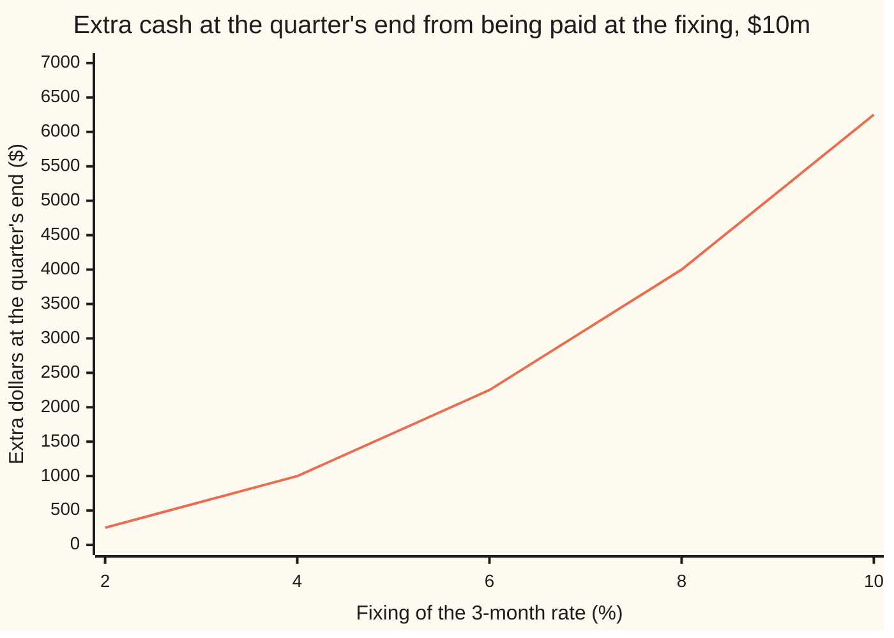
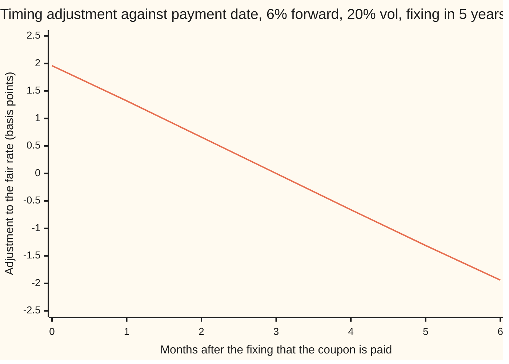

# Timing adjustments: rates paid at the start of the period instead of the end

Financial mathematics → Convexity and Exotics → Paying a rate early → Timing adjustments

---

## General Overview

A bank and a company agree a swap on \$10 million. One quarter, five years from today, is the subject here. The 3-month interest rate is looked up on the screen on the fixing date, five years out. It is the rate for a deposit running from that day to three months later. Today's curve of interest rates says that rate should be 6 percent: that is its **forward rate**, the rate the curve locks in for that future quarter today.

In an ordinary swap the quarter's interest, rate times \$10 million times a quarter of a year, is paid when the quarter ends, three months after the fixing. The rate is set at the start and paid at the end. This swap does something else. It pays the quarter's interest on the fixing day itself, the moment the rate is known. Seen from the coupon's own accrual period, which now ends on the fixing day, the rate is **set in arrears**: at the end of that period, not the start. Hence an **in-arrears** coupon (from the days of LIBOR, a LIBOR-in-arrears swap).

The fair fixed rate to swap against it is not 6 percent. It is 6 percent plus about **2 basis points** (a basis point is a hundredth of a percent): 6.0196 percent, on a 20 percent volatility for the rate. On \$10 million for one quarter that is worth \$382.23 today. Small, but every dealer charges it, and on a 30-year swap with 120 quarters it adds up.

The reason is timing. Money received three months early earns three months of interest. The rate it earns is the very rate that sets the coupon. When the fixing is high the coupon is big and the head start is worth most; when it is low both are small. The two move together, so on average the early payment is worth more than the forward rate alone says. The correction is called a **timing adjustment**.

**Paying a rate's interest on the fixing date instead of at the end of its period raises the fair rate by the rate's variance times the accrual fraction, divided by one plus accrual times forward; any other payment date gives a correction of the same kind, positive when paid early and negative when paid late.**

**What kind of fact this is:** a theorem, proved on this card in Why it works: the identity holds in any single-curve model without free money. The size of the variance comes from a model, here Black's lognormal assumption: an assumption that fits markets well enough, not a law.

### The picture: the extra cash from paying early

Take the in-arrears coupon, received at the fixing date, and deposit it until the quarter ends at the rate that was just fixed. At the quarter's end it has grown past the ordinary coupon by a square: the coupon times the rate times a quarter. The chart plots that extra, in dollars at the quarter's end, against the fixing.



One line: the extra dollars, \$10 million times a quarter squared times the fixing squared. It curves upward. A curve that bends up has an average above its value at the average fixing, and that gap is the adjustment. The sibling card on swap-rate coupons meets the same bend in a different product ([cms-and-the-convexity-adjustment](02-cms-and-the-convexity-adjustment.md)).

---

## The formula

For a coupon fixed and paid at $T$:

$$K_T = F + \frac{\delta\,\operatorname{Var}^U(L_T)}{1 + \delta F}$$

**Read it aloud:** the fair in-arrears rate is the forward rate plus the accrual fraction times the rate's variance, shrunk by one plus the forward's quarterly interest.

In Black's lognormal model the variance is

$$\operatorname{Var}^U(L_T) = F^2\left(e^{\sigma^2 T} - 1\right).$$

For a payment on any date $D$:

$$K_D = \frac{E^U[L_T\,W]}{E^U[W]} = F + \frac{\operatorname{Cov}^U(L_T, W)}{E^U[W]}, \qquad W = \frac{P(T,D)}{P(T,U)}.$$

**Read it aloud:** the fair rate for a payment on date D is the rate averaged with extra weight on the outcomes where cash on D is worth more, counted in cash on U.

| Symbol | Plain meaning | In our example | Push it up and the answer… |
| --- | --- | --- | --- |
| $L_T$ | the 3-month rate read off the screen on the fixing date | unknown today | — |
| $F$ | today's forward rate for that quarter | 6% | rises, roughly with the square of F |
| $K_T$ | fair fixed rate when the coupon is paid on the fixing date | 6.0196% | — |
| $K_D$ | fair fixed rate when the coupon is paid on date D | 6% when D is U | — |
| $\delta$ | accrual fraction: the quarter as a fraction of a year | 0.25 | rises |
| $T$ | years from today to the fixing | 5 | rises: more time for the rate to spread |
| $U$ | end of the quarter, where the ordinary coupon is paid | 5.25 | — |
| $D$ | the date the coupon is actually paid | 5, the fixing date | later D shrinks it, and past U it turns negative |
| $\sigma$ | volatility of the rate: how far it spreads per root-year, in log terms | 20% | rises fast |
| $P(0,T)$, $P(T,U)$ | price at the first date of \$1 paid at the second | $P(0,T)$ = 0.7788 | — |
| $W$ | cash on D counted in cash on U: the payment's weight | 1 + 0.25 × fixing when D = T | — |
| $E^U$, $\operatorname{Var}^U$, $\operatorname{Cov}^U$ | average, variance, covariance under the odds that price cash on U (the U-forward measure) | variance 0.000797 | — |

Here $e^x$ is the exponential and the variance of a random quantity is the average squared distance from its average ([normal-distribution](../../09-Probability%20and%20statistics/04-Continuous%20Distributions/04-normal-distribution.md)).

### When it holds

- **One curve for rates and discounting.** The proof deposits the coupon at the fixed rate itself. If the index rate differs from the rate cash earns, as in the multi-curve world after 2008 ([basis-swaps-and-the-multi-curve-framework](../28-Swaps/04-basis-swaps-and-the-multi-curve-framework.md)), the general covariance identity still holds but the variance formula needs a model of both curves.
- **A model for the spread of the fixing.** The lognormal variance assumes one flat volatility. With a smile (volatility that differs by strike), the variance comes from the strip of caplets in Step 5, priced at market volatilities; the closed form is then off by the smile's effect on the second moment.
- **Payment exactly on the fixing date.** A lag of a few business days moves D. The general identity covers it; the variance box does not.
- **For any D other than T or U, one more assumption.** The formulas take the rate between D and U to be the fixing itself. The true rate for that stretch is a different random number; the error is second order.
- **A finite variance.** Every lognormal or normal model has one.

Conventions verified 28 Sep 2026: US dollar LIBOR panel fixings ended on 30 June 2023. The card's rate is a forward-looking term rate, fixed at the start of its quarter, of which LIBOR was the classic case; a SOFR rate compounded in arrears is a different contract, covered in The usual mistake.

---

## Why it works

### Step 0: the coupon earns interest at its own rate

Cash paid early can be deposited. The deposit rate for the stretch from T to U is the fixing itself: that is what the fixing measures. So the early receiver gets the coupon and, on top, the coupon times the fixing times a quarter. Both grow with the fixing. Averaging a product of two things that rise together gives more than the product of their averages. That surplus is the adjustment.

### Step 1: the ordinary coupon needs no model

Pay the rate for the quarter, times the accrual fraction, at U. That coupon can be built from two bonds. Buy a bond paying \$1 at T and sell one paying \$1 at U. At T the \$1 arrives and goes on deposit at the fixing; at U it returns 1 plus a quarter's interest, of which \$1 repays the sold bond. What is left is exactly the coupon, paid at U.

The cost today is $P(0,T) - P(0,U)$, where $P(0,T)$ is today's price of \$1 paid at T. Divide by $P(0,U)$ and by the accrual fraction and the result is the forward rate:

$$F = \frac{1}{\delta}\left(\frac{P(0,T)}{P(0,U)} - 1\right).$$

So a coupon paid at U is worth $P(0,U)\,\delta F$, whatever the rates do. The same construction is the forward rate agreement ([forward-rate-agreements](../02-Curves/02-forward-rate-agreements.md)).

### Step 2: price in bonds that pay at U

Any amount X paid at U is worth $P(0,U)$ times an average of X. The average is taken under a particular set of odds, the ones that make this rule agree with every traded price: the **U-forward measure**, written $E^U$. Step 1 fixes one of its averages: $E^U[L_T] = F$. Under these odds the fixing is fair at the forward rate. This is the same move as counting in annuities for a swap rate ([the-annuity-measure](../29-Caps%2C%20Floors%20and%20Swaptions/05-the-annuity-measure.md)), with one bond as the unit instead of a strip.

### Step 3: roll the in-arrears coupon forward to U

The in-arrears coupon is the fixing times the accrual fraction, paid at T. Deposit it at the fixing until U. It becomes

$$\delta L_T\,(1 + \delta L_T) = \delta L_T + \delta^2 L_T^2 \quad \text{at } U.$$

Its value today is $P(0,U)$ times the U-average. The first piece averages to the forward. The second needs the average of a square, which is the square of the average plus the variance:

$$\text{value} = P(0,U)\,\delta\left[F + \delta\left(F^2 + \operatorname{Var}^U(L_T)\right)\right].$$

### Step 4: solve for the fair fixed rate

The fixed side pays the accrual fraction times $K_T$ at T. Its value is $P(0,T)\,\delta K_T$, and from Step 1, $P(0,T) = P(0,U)(1 + \delta F)$. Set the two sides equal and cancel $P(0,U)\,\delta$:

$$K_T(1 + \delta F) = F + \delta F^2 + \delta\operatorname{Var}^U(L_T) = F(1+\delta F) + \delta\operatorname{Var}^U(L_T).$$

Divide by $1 + \delta F$ and the formula appears. The adjustment is the variance times the accrual fraction, discounted over one quarter at the forward rate.

A three-state version shows it in numbers. Let the fixing be 2, 6 or 10 percent with U-odds of a quarter, a half and a quarter. The average is 6 percent and the variance is 0.0008. The adjustment is 0.25 × 0.0008 / 1.015, which is 1.97 basis points.

### Step 5: the variance, from a model or from caplets

Under Black's model the fixing is lognormal under the U-odds: its logarithm is bell-shaped with spread $\sigma\sqrt{T}$, centred so that the average is F. The average of its square is then $F^2 e^{\sigma^2 T}$, so the variance is $F^2(e^{\sigma^2 T} - 1)$. With 20 percent volatility and five years, $\sigma^2 T$ is 0.2, the bracket is 0.2214 and the variance is 0.000797: almost exactly the three-state 0.0008, which is why the two examples land on 1.96 and 1.97 basis points.

Without a model, the square can be bought. A square of the fixing equals twice the sum of caplet payoffs across every strike (a caplet pays the fixing minus the strike when positive; [caplets-and-floorlets](../29-Caps%2C%20Floors%20and%20Swaptions/01-caplets-and-floorlets.md)). So the average square is twice the integral of caplet prices over strikes, each price counted in U-bonds per unit of accrual, read off the market's caplets. The code takes this road too; it lands on the same 1.963177 basis points under a flat volatility, and on a market smile it gives the smile-consistent answer.

<details>
<summary>Detailed proof: the U-odds exist, and re-weighting them gives the answer directly</summary>

Assume a bank account and bonds with positive prices and no free money, so prices divided by the bank account are fair averages under some odds Q. Define new odds by weighting each outcome known at T by the U-bond's price at T, divided by the bank account's value at T and by $P(0,U)$. The weight is positive and averages to one under Q, so it is a legitimate re-weighting. Under the new odds, any price divided by $P(\cdot,U)$ is a fair average: that is the U-forward measure. Applied to the T-bond, $1/P(T,U) = 1 + \delta L_T$ averages to $P(0,T)/P(0,U) = 1 + \delta F$, so $E^U[L_T] = F$.

Cash X at T is worth $P(0,U)\,E^U[X/P(T,U)]$, which is $P(0,U)\,E^U[X(1+\delta L_T)]$. The fair $K_T$ solves $E^U[(L_T - K_T)(1+\delta L_T)] = 0$, giving $K_T = E^U[L_T(1+\delta L_T)]/(1 + \delta F)$. Equivalently, $K_T$ is the plain average of the fixing under odds re-weighted by $(1+\delta L_T)/(1+\delta F)$: the T-forward measure. In the three-state case those odds are 0.2475, 0.5 and 0.2525, and the re-weighted average is 6 percent plus 1.97 basis points. The code checks both routes agree.

For payment on D, cash X at D is worth $P(0,U)\,E^U[X\,P(T,D)/P(T,U)]$ (value at T is $X\,P(T,D)$, then convert to U-units). Setting the swaplet's value to zero gives $K_D = E^U[L_T W]/E^U[W]$, and expanding the average of a product gives the covariance form. When D is U, W is 1 and the correction vanishes.

</details>

### Step 6: any payment date

Nothing in Steps 2 to 4 used that the payment fell on T. Pay on D instead. Cash on D is worth $P(T,D)/P(T,U)$ units of cash on U at the fixing date: that is W. The fair rate becomes the W-weighted average of the fixing, and the correction is the covariance of the fixing with W, divided by W's average.

The sign follows from how W moves with rates. Paid early, D before U, cash on D can earn interest to U, so W rises with the fixing: covariance positive, adjustment positive. Paid late, D after U, cash on D is discounted back to U, so W falls as rates rise: adjustment negative. With the rate from D to U taken as the fixing, early payment gives

$$K_D = F + \frac{(U - D)\operatorname{Var}^U(L_T)}{1 + (U - D)F},$$

which is the in-arrears formula with the accrual fraction replaced by the head start.



One line: the adjustment, by Simpson integration. It starts at 1.96 basis points for payment on the fixing date, crosses zero at three months where the ordinary coupon is paid, and turns negative for later payment.

The caplet road of Step 5 is static replication, the method the sibling card uses for swap-rate coupons ([cms-and-the-convexity-adjustment](02-cms-and-the-convexity-adjustment.md)); a full term-structure model such as HJM gives the same identity with W computed path by path ([hjm-framework-and-the-drift-condition](../31-Forward-Rate%20Models/01-hjm-framework-and-the-drift-condition.md)).

---

## Worked numbers, by hand

Forward 6 percent, quarter 0.25, fixing in five years, volatility 20 percent, \$10 million notional, today's price of \$1 at the fixing date $e^{-0.05 \times 5}$ (a 5 percent riskless rate, continuously compounded).

| Step | Arithmetic | Value |
| --- | --- | --- |
| volatility squared times time | 0.20 × 0.20 × 5 | 0.2 |
| exponential bracket | e^0.2 − 1 | 0.2214 |
| variance of the fixing | 0.06 × 0.06 × 0.2214 | 0.000797 |
| one plus a quarter's forward interest | 1 + 0.25 × 0.06 | 1.015 |
| adjustment, in basis points | 0.25 × 0.000797 / 1.015, × 10,000 | **1.96** |
| fair in-arrears rate | 6% + 0.0196% | **6.0196%** |
| today's price of \$1 at the fixing | e^−0.25 | 0.7788 |
| extra value on \$10m for the quarter | 10,000,000 × 0.25 × 0.7788 × 1.9632 / 10,000 | **\$382.23** |

Paying the coupon at 6 percent fixed against the in-arrears rate would hand the receiver of the floating side \$382.23 of value for this one quarter.

### What breaks if you drop a piece

| Mistake | Comes out at | What went wrong |
| --- | --- | --- |
| No adjustment: swap at the forward rate | 0 bp, \$382.23 given away | The forward is the fair rate only for payment at U |
| Replace e^(σ^2 T) − 1 by σ^2 T | 1.77 bp | The common textbook shortcut; it drops the higher terms of the exponential, which matter at σ^2 T = 0.2 |
| Drop the division by 1 + δF | 1.99 bp | The extra cash arrives at U, one quarter after the fixed side is paid; it must be discounted |
| Measure the variance to U, 5.25 years | 2.07 bp | The fixing stops moving at T; the quarter after it adds no spread |

---

## How the adjustment moves

Nothing about the swap changes as the years pass, and the adjustment still shrinks. The clock does it: a fixing five years out can wander far, a fixing next quarter barely at all. The variance grows with time to fixing, so the adjustment melts towards zero as the fixing date nears.

```
years to fixing   adjustment, basis points (6% forward, 20% volatility)
     5.00   ████████████████████████████████████████  1.96
     4.00   ███████████████████████████████           1.54
     3.00   ███████████████████████                   1.13
     2.00   ███████████████                           0.74
     1.00   ███████                                   0.36
     0.25   ██                                        0.09
```

The melt is almost linear: $e^{\sigma^2 T} - 1$ is close to $\sigma^2 T$ at these sizes, bending slightly upward at the long end.

### The Greeks of the adjustment

| Move | Adjustment becomes | Reading |
| --- | --- | --- |
| volatility 20% → 21% | 2.19 bp | the adjustment is a position in volatility |
| forward 6% → 6.01% | 1.97 bp | small: it grows roughly with the forward squared |
| one year less to the fixing | 1.54 bp | it melts as the fixing nears |
| volatility 20% → 40% | 10.87 bp | more than five times: the exponential takes over |

A dealer who pays in-arrears rates and hedges with ordinary swaps is left short this volatility: the in-arrears leg gains value as volatility rises. Buying caplets, the road of Step 5, covers it.

---

## Code, from first principles, and it actually runs

Both programs price the in-arrears coupon four ways: the closed form; a Simpson integral (adding thin slices under a curve) of the fixing times its weight over the bell curve; a strip of Black caplets integrated across strikes; and a Monte Carlo average over 200,000 home-made random draws, each used with its mirror image. The three-state example is solved by the variance formula and by re-weighted odds. The dollar value is reached by the adjustment and by rolling the extra cash to U. The payment-date sweep is integrated and simulated; early dates are checked against the closed form, late dates against a series in the lognormal moments. The normal CDF, integrator and random numbers are written out.

### Python

```python
# Timing and in-arrears adjustments -- the check behind the card.  Standard library only.
# Nothing imported knows the answer: the normal CDF, the integrator and the
# random numbers are written out below.
from math import exp, log, sqrt, cos, pi

def phi(x): return exp(-0.5 * x * x) / sqrt(2.0 * pi)            # bell-curve height at x

def N(x):                                                          # bell-curve area left of x, by its series
    if x < -9.0: return 0.0
    if x > 9.0: return 1.0
    term, total, k = x, x, 0
    while abs(term) > 1e-17 * abs(total):
        k += 1
        term *= x * x / (2 * k + 1)
        total += term
    return 0.5 + phi(x) * total

def simpson(f, a, b, n):                                           # area under f, thin slices
    h = (b - a) / n
    s = f(a) + f(b)
    for i in range(1, n):
        s += (4.0 if i % 2 else 2.0) * f(a + i * h)
    return s * h / 3.0

F, dl, T, vol, r, notional = 0.06, 0.25, 5.0, 0.20, 0.05, 10_000_000.0
P0T = exp(-r * T)                 # today's price of $1 paid at the fixing date T
P0U = P0T / (1.0 + dl * F)        # today's price of $1 paid at U = T + 0.25; the curve's forward is F
BP = 1e4

# ---- the three-state stand-in: the fixing is 2%, 6% or 10% with odds 1/4, 1/2, 1/4 (U-bond odds) ----
Ls, ps = (0.02, 0.06, 0.10), (0.25, 0.5, 0.25)
mean3 = sum(p * L for p, L in zip(ps, Ls))
var3 = sum(p * (L - mean3) ** 2 for p, L in zip(ps, Ls))
adj3_var = dl * var3 / (1.0 + dl * mean3)                         # road 1: the variance formula
w3 = [p * (1.0 + dl * L) for p, L in zip(ps, Ls)]                 # road 2: re-weight each state by 1 + dl L
q3 = [w / sum(w3) for w in w3]
adj3_rw = sum(q * L for q, L in zip(q3, Ls)) - mean3

# ---- the lognormal fixing: L_T = F exp(-vol^2 T / 2 + vol sqrt(T) z) under the U-bond odds ----
def L_of(z, T=T, vol=vol, F=F): return F * exp(-0.5 * vol * vol * T + vol * sqrt(T) * z)
def adj_closed(F=F, vol=vol, T=T):                                 # road 1: closed form
    return dl * F * F * (exp(vol * vol * T) - 1.0) / (1.0 + dl * F)
def weighted(W, T=T):                                              # road 2: E[L W] / E[W] - F by Simpson
    num = simpson(lambda z: L_of(z, T) * W(L_of(z, T)) * phi(z), -10.0, 10.0, 4000)
    den = simpson(lambda z: W(L_of(z, T)) * phi(z), -10.0, 10.0, 4000)
    return num / den - F
adj_simp = weighted(lambda L: 1.0 + dl * L)
def caplet(K):                                                     # undiscounted Black caplet on L_T
    if K <= 0.0: return F
    s = vol * sqrt(T); d1 = (log(F / K) + 0.5 * s * s) / s
    return F * N(d1) - K * N(d1 - s)
EL2 = 2.0 * simpson(caplet, 0.0, 1.2, 6000)                        # road 3: L^2 = 2 x (all caplets, every strike)
adj_cap = dl * (EL2 - F * F) / (1.0 + dl * F)

state = 20260928                                                   # road 4: Monte Carlo, home-made numbers
def unif():
    global state
    state = (6364136223846793005 * state + 1442695040888963407) % 2 ** 64
    return ((state >> 11) + 0.5) / 2.0 ** 53
draws = []
for _ in range(100_000):
    z = sqrt(-2.0 * log(unif())) * cos(2.0 * pi * unif())
    draws += [L_of(z), L_of(-z)]                                   # each draw with its mirror image
def mc(W):                                                         # in-arrears average minus plain average, same paths
    sLW = sW = 0.0
    for L in draws:
        w = W(L); sLW += L * w; sW += w
    return sLW / sW - sum(draws) / len(draws)
adj_mc = mc(lambda L: 1.0 + dl * L)

# ---- money: $10m notional, one quarter ----
pv_via_adj = notional * dl * P0T * adj_closed()                    # extra fixed rate, paid at T
var_ln = F * F * (exp(vol * vol * T) - 1.0)
pv_rolled = notional * P0U * dl * dl * var_ln                      # the extra dl^2 L^2 at U, valued with U bonds

# ---- what breaks ----
hull = dl * F * F * vol * vol * T / (1.0 + dl * F)                 # e^x - 1 replaced by x
no_denominator = dl * var_ln                                       # forgot 1 / (1 + dl F)
wrong_T = adj_closed(T=T + dl)                                     # used the payment date U, not the fixing date

rows = [
    ("three-state mean fixing, %", 100 * mean3), ("three-state variance", var3),
    ("three-state T-odds for 2%, 6%, 10%", q3[0]), ("  6%", q3[1]), ("  10%", q3[2]),
    ("three-state adj, variance formula, bp", BP * adj3_var), ("three-state adj, re-weighted odds, bp", BP * adj3_rw),
    ("1 + dl F", 1.0 + dl * F), ("vol^2 T", vol * vol * T), ("lognormal variance of L_T", var_ln), ("e^(vol^2 T) - 1", exp(vol * vol * T) - 1.0),
    ("1 adj, closed form, bp", BP * adj_closed()), ("2 adj, Simpson integral, bp", BP * adj_simp),
    ("3 adj, strip of caplets, bp", BP * adj_cap), ("4 adj, Monte Carlo 200,000, bp", BP * adj_mc),
    ("in-arrears fair rate, %", 100 * (F + adj_closed())),
    ("P(0,T)", P0T), ("P(0,U)", P0U),
    ("extra PV via the adjustment, $", pv_via_adj), ("extra PV by rolling to U, $", pv_rolled),
    ("wrong: no adjustment, bp", 0.0), ("wrong: vol^2 T for e^(vol^2 T) - 1, bp", BP * hull),
    ("wrong: forgot 1/(1 + dl F), bp", BP * no_denominator), ("wrong: T = 5.25 in the variance, bp", BP * wrong_T),
    ("greek: vol 21% instead of 20%, bp", BP * adj_closed(vol=0.21)), ("greek: F 6.01% instead of 6%, bp", BP * adj_closed(F=0.0601)),
    ("try: vol 40%, bp", BP * adj_closed(vol=0.40)), ("try: F 3%, bp", BP * adj_closed(F=0.03)),
]
for name, v in rows:
    print(f"{name:<40} {v:>16.6f}")

print("payoff chart, extra $ at U for fixings 2..10%: " + ", ".join(f"{notional * dl * dl * L * L:.2f}" for L in (0.02, 0.04, 0.06, 0.08, 0.10)))
def bp(v): return 0.0 if abs(v) < 5e-13 else BP * v                 # basis points, with no "-0.0000"

print("\nyears to fixing: adjustment bp, closed form | Simpson")
for Tl in (5.0, 4.0, 3.0, 2.0, 1.0, 0.25):
    print(f"  {Tl:>4.2f}   {bp(adj_closed(T=Tl)):.4f} | {bp(weighted(lambda L: 1.0 + dl * L, T=Tl)):.4f}")

def moments(y, n=20):                                              # E[L W]/E[W] - F for W = 1/(1 + y L), no integral:
    mom = lambda k: F ** k * exp(0.5 * k * (k - 1) * vol * vol * T)  # E[L^k] = F^k e^(k(k-1) vol^2 T / 2)
    return sum((-y) ** k * mom(k + 1) for k in range(n)) / sum((-y) ** k * mom(k) for k in range(n)) - F

print("\npayment delay after T, months: adjustment bp, Simpson | Monte Carlo")
sweep, sweep_mc = [], []
for m in range(7):
    x = dl - m / 12.0                                              # years from the payment date D on to U
    W = (lambda L, x=x: 1.0 + x * L) if x >= 0 else (lambda L, x=x: 1.0 / (1.0 - x * L))
    a = weighted(W)                                                # early: roll forward to U; late: discount back
    if x >= 0: assert abs(a - x * var_ln / (1.0 + x * F)) < 1e-12 # closed form x Var / (1 + x F)
    else: assert abs(a - moments(-x)) < 1e-12                      # late: series in lognormal moments
    sweep.append(bp(a)); sweep_mc.append(bp(mc(W)))
    print(f"  {m}   {sweep[-1]:.4f} | {sweep_mc[-1]:.4f}")
print("chart: " + ", ".join(f"{v:.2f}" for v in sweep))

assert abs(adj3_var - adj3_rw) < 1e-15                             # variance formula = re-weighted odds
assert abs(adj_closed() - adj_simp) < 1e-12                        # closed form = integral
assert abs(adj_closed() - adj_cap) < 1e-9                          # closed form = strip of caplets
assert abs(adj_closed() - adj_mc) < 0.05 / BP                      # closed form = simulation, within noise
assert abs(pv_via_adj - pv_rolled) < 1e-6                          # two money routes agree
assert abs(sweep[6] - sweep_mc[6]) < 0.05                          # late payment: integral = simulation
print("all checks passed")
```

**Ran 2026-09-28 on macOS, Python 3.14.6, standard library only. All checks passed. Output, pasted from the run:**

```
three-state mean fixing, %                       6.000000
three-state variance                             0.000800
three-state T-odds for 2%, 6%, 10%               0.247537
  6%                                             0.500000
  10%                                            0.252463
three-state adj, variance formula, bp            1.970443
three-state adj, re-weighted odds, bp            1.970443
1 + dl F                                         1.015000
vol^2 T                                          0.200000
lognormal variance of L_T                        0.000797
e^(vol^2 T) - 1                                  0.221403
1 adj, closed form, bp                           1.963177
2 adj, Simpson integral, bp                      1.963177
3 adj, strip of caplets, bp                      1.963177
4 adj, Monte Carlo 200,000, bp                   1.962890
in-arrears fair rate, %                          6.019632
P(0,T)                                           0.778801
P(0,U)                                           0.767291
extra PV via the adjustment, $                 382.230979
extra PV by rolling to U, $                    382.230979
wrong: no adjustment, bp                         0.000000
wrong: vol^2 T for e^(vol^2 T) - 1, bp           1.773399
wrong: forgot 1/(1 + dl F), bp                   1.992625
wrong: T = 5.25 in the variance, bp              2.072022
greek: vol 21% instead of 20%, bp                2.187487
greek: F 6.01% instead of 6%, bp                 1.969678
try: vol 40%, bp                                10.866865
try: F 3%, bp                                    0.494448
payoff chart, extra $ at U for fixings 2..10%: 250.00, 1000.00, 2250.00, 4000.00, 6250.00

years to fixing: adjustment bp, closed form | Simpson
  5.00   1.9632 | 1.9632
  4.00   1.5385 | 1.5385
  3.00   1.1305 | 1.1305
  2.00   0.7385 | 0.7385
  1.00   0.3619 | 0.3619
  0.25   0.0891 | 0.0891

payment delay after T, months: adjustment bp, Simpson | Monte Carlo
  0   1.9632 | 1.9629
  1   1.3153 | 1.3151
  2   0.6609 | 0.6608
  3   0.0000 | 0.0000
  4   -0.6586 | -0.6585
  5   -1.3062 | -1.3061
  6   -1.9431 | -1.9430
chart: 1.96, 1.32, 0.66, 0.00, -0.66, -1.31, -1.94
all checks passed
```

### Rust

```rust
// Timing and in-arrears adjustments -- the check behind the card.  Rust std only.
// Nothing imported knows the answer: the normal CDF, the integrator and the
// random numbers are written out below.
use std::f64::consts::PI;

const F: f64 = 0.06;
const DL: f64 = 0.25;
const T: f64 = 5.0;
const VOL: f64 = 0.20;
const BP: f64 = 1e4;

fn phi(x: f64) -> f64 { (-0.5 * x * x).exp() / (2.0 * PI).sqrt() }   // bell-curve height at x

fn n_cdf(x: f64) -> f64 {                                             // bell-curve area left of x, by its series
    if x < -9.0 { return 0.0; }
    if x > 9.0 { return 1.0; }
    let (mut term, mut total, mut k) = (x, x, 0.0);
    while term.abs() > 1e-17 * total.abs() {
        k += 1.0;
        term *= x * x / (2.0 * k + 1.0);
        total += term;
    }
    0.5 + phi(x) * total
}

fn simpson<G: Fn(f64) -> f64>(f: G, a: f64, b: f64, n: usize) -> f64 {   // area under f, thin slices
    let h = (b - a) / n as f64;
    let mut s = f(a) + f(b);
    for i in 1..n { s += if i % 2 == 1 { 4.0 } else { 2.0 } * f(a + i as f64 * h); }
    s * h / 3.0
}

// the lognormal fixing: L_T = F exp(-vol^2 T / 2 + vol sqrt(T) z) under the U-bond odds
fn l_of(z: f64, t: f64) -> f64 { F * (-0.5 * VOL * VOL * t + VOL * t.sqrt() * z).exp() }
fn adj_closed(f: f64, vol: f64, t: f64) -> f64 {                      // road 1: closed form
    DL * f * f * ((vol * vol * t).exp() - 1.0) / (1.0 + DL * f)
}
fn weighted<W: Fn(f64) -> f64>(w: &W, t: f64) -> f64 {               // road 2: E[L W] / E[W] - F by Simpson
    let num = simpson(|z| l_of(z, t) * w(l_of(z, t)) * phi(z), -10.0, 10.0, 4000);
    let den = simpson(|z| w(l_of(z, t)) * phi(z), -10.0, 10.0, 4000);
    num / den - F
}
fn caplet(k: f64) -> f64 {                                            // undiscounted Black caplet on L_T
    if k <= 0.0 { return F; }
    let s = VOL * T.sqrt();
    let d1 = ((F / k).ln() + 0.5 * s * s) / s;
    F * n_cdf(d1) - k * n_cdf(d1 - s)
}
fn mc<W: Fn(f64) -> f64>(draws: &[f64], w: &W) -> f64 {              // in-arrears average minus plain average, same paths
    let (mut slw, mut sw, mut sl) = (0.0, 0.0, 0.0);
    for &l in draws { let x = w(l); slw += l * x; sw += x; sl += l; }
    slw / sw - sl / draws.len() as f64
}
fn moments(y: f64) -> f64 {                                           // E[L W]/E[W] - F for W = 1/(1 + y L), no integral:
    let mom = |k: i32| F.powi(k) * (0.5 * (k * (k - 1)) as f64 * VOL * VOL * T).exp(); // E[L^k]
    let num: f64 = (0..20).map(|k| (-y).powi(k) * mom(k + 1)).sum();
    let den: f64 = (0..20).map(|k| (-y).powi(k) * mom(k)).sum();
    num / den - F
}
fn bp(v: f64) -> f64 { if v.abs() < 5e-13 { 0.0 } else { BP * v } }  // basis points, with no "-0.0000"

fn main() {
    let (r, notional) = (0.05, 10_000_000.0);
    let p0t = (-r * T).exp();                 // today's price of $1 paid at the fixing date T
    let p0u = p0t / (1.0 + DL * F);           // today's price of $1 paid at U = T + 0.25

    // the three-state stand-in: 2%, 6% or 10% with odds 1/4, 1/2, 1/4 (U-bond odds)
    let ls = [0.02, 0.06, 0.10];
    let ps = [0.25, 0.5, 0.25];
    let mean3: f64 = (0..3).map(|i| ps[i] * ls[i]).sum();
    let var3: f64 = (0..3).map(|i| ps[i] * (ls[i] - mean3).powi(2)).sum();
    let adj3_var = DL * var3 / (1.0 + DL * mean3);                        // road 1: the variance formula
    let w3: Vec<f64> = (0..3).map(|i| ps[i] * (1.0 + DL * ls[i])).collect(); // road 2: re-weight by 1 + dl L
    let w3sum: f64 = w3.iter().sum();
    let q3: Vec<f64> = w3.iter().map(|w| w / w3sum).collect();
    let adj3_rw = (0..3).map(|i| q3[i] * ls[i]).sum::<f64>() - mean3;

    let arrears = |l: f64| 1.0 + DL * l;
    let adj = adj_closed(F, VOL, T);
    let adj_simp = weighted(&arrears, T);
    let el2 = 2.0 * simpson(caplet, 0.0, 1.2, 6000);                      // road 3: L^2 = 2 x (all caplets)
    let adj_cap = DL * (el2 - F * F) / (1.0 + DL * F);

    let mut state: u64 = 20260928;                                        // road 4: Monte Carlo, home-made numbers
    let mut unif = || {
        state = state.wrapping_mul(6364136223846793005).wrapping_add(1442695040888963407);
        ((state >> 11) as f64 + 0.5) / 2f64.powi(53)
    };
    let mut draws = Vec::with_capacity(200_000);
    for _ in 0..100_000 {
        let (u1, u2) = (unif(), unif());
        let z = (-2.0 * u1.ln()).sqrt() * (2.0 * PI * u2).cos();
        draws.push(l_of(z, T)); draws.push(l_of(-z, T));                  // each draw with its mirror image
    }
    let adj_mc = mc(&draws, &arrears);

    // money: $10m notional, one quarter
    let pv_via_adj = notional * DL * p0t * adj;                           // extra fixed rate, paid at T
    let var_ln = F * F * ((VOL * VOL * T).exp() - 1.0);
    let pv_rolled = notional * p0u * DL * DL * var_ln;                    // the extra dl^2 L^2 at U, valued with U bonds

    // what breaks
    let hull = DL * F * F * VOL * VOL * T / (1.0 + DL * F);               // e^x - 1 replaced by x
    let no_denominator = DL * var_ln;                                     // forgot 1 / (1 + dl F)
    let wrong_t = adj_closed(F, VOL, T + DL);                             // used the payment date U

    let rows: Vec<(&str, f64)> = vec![
        ("three-state mean fixing, %", 100.0 * mean3), ("three-state variance", var3),
        ("three-state T-odds for 2%, 6%, 10%", q3[0]), ("  6%", q3[1]), ("  10%", q3[2]),
        ("three-state adj, variance formula, bp", BP * adj3_var), ("three-state adj, re-weighted odds, bp", BP * adj3_rw),
        ("1 + dl F", 1.0 + DL * F), ("vol^2 T", VOL * VOL * T), ("lognormal variance of L_T", var_ln), ("e^(vol^2 T) - 1", (VOL * VOL * T).exp() - 1.0),
        ("1 adj, closed form, bp", BP * adj), ("2 adj, Simpson integral, bp", BP * adj_simp),
        ("3 adj, strip of caplets, bp", BP * adj_cap), ("4 adj, Monte Carlo 200,000, bp", BP * adj_mc),
        ("in-arrears fair rate, %", 100.0 * (F + adj)),
        ("P(0,T)", p0t), ("P(0,U)", p0u),
        ("extra PV via the adjustment, $", pv_via_adj), ("extra PV by rolling to U, $", pv_rolled),
        ("wrong: no adjustment, bp", 0.0), ("wrong: vol^2 T for e^(vol^2 T) - 1, bp", BP * hull),
        ("wrong: forgot 1/(1 + dl F), bp", BP * no_denominator), ("wrong: T = 5.25 in the variance, bp", BP * wrong_t),
        ("greek: vol 21% instead of 20%, bp", BP * adj_closed(F, 0.21, T)), ("greek: F 6.01% instead of 6%, bp", BP * adj_closed(0.0601, VOL, T)),
        ("try: vol 40%, bp", BP * adj_closed(F, 0.40, T)), ("try: F 3%, bp", BP * adj_closed(0.03, VOL, T)),
    ];
    for (name, v) in &rows { println!("{:<40} {:>16.6}", name, v); }

    let pay: Vec<String> = [0.02, 0.04, 0.06, 0.08, 0.10].iter().map(|l| format!("{:.2}", notional * DL * DL * l * l)).collect();
    println!("payoff chart, extra $ at U for fixings 2..10%: {}", pay.join(", "));

    println!("\nyears to fixing: adjustment bp, closed form | Simpson");
    for tl in [5.0, 4.0, 3.0, 2.0, 1.0, 0.25] {
        println!("  {:>4.2}   {:.4} | {:.4}", tl, bp(adj_closed(F, VOL, tl)), bp(weighted(&arrears, tl)));
    }

    println!("\npayment delay after T, months: adjustment bp, Simpson | Monte Carlo");
    let (mut sweep, mut sweep_mc) = (Vec::new(), Vec::new());
    for m in 0..7 {
        let x = DL - m as f64 / 12.0;                                     // years from the payment date D on to U
        let w = move |l: f64| if x >= 0.0 { 1.0 + x * l } else { 1.0 / (1.0 - x * l) };
        let a = weighted(&w, T);                                          // early: roll forward; late: discount back
        if x >= 0.0 { assert!((a - x * var_ln / (1.0 + x * F)).abs() < 1e-12); } // closed form x Var / (1 + x F)
        else { assert!((a - moments(-x)).abs() < 1e-12); }               // late: series in lognormal moments
        sweep.push(bp(a)); sweep_mc.push(bp(mc(&draws, &w)));
        println!("  {}   {:.4} | {:.4}", m, sweep[m], sweep_mc[m]);
    }
    let chart: Vec<String> = sweep.iter().map(|v| format!("{:.2}", v)).collect();
    println!("chart: {}", chart.join(", "));

    assert!((adj3_var - adj3_rw).abs() < 1e-15);                          // variance formula = re-weighted odds
    assert!((adj - adj_simp).abs() < 1e-12);                              // closed form = integral
    assert!((adj - adj_cap).abs() < 1e-9);                                // closed form = strip of caplets
    assert!((adj - adj_mc).abs() < 0.05 / BP);                            // closed form = simulation, within noise
    assert!((pv_via_adj - pv_rolled).abs() < 1e-6);                       // two money routes agree
    assert!((sweep[6] - sweep_mc[6]).abs() < 0.05);                       // late payment: integral = simulation
    println!("all checks passed");
}
```

**Ran 2026-09-28 on macOS, rustc 1.98.1, no crates. All checks passed. Output, pasted from the run:**

```
three-state mean fixing, %                       6.000000
three-state variance                             0.000800
three-state T-odds for 2%, 6%, 10%               0.247537
  6%                                             0.500000
  10%                                            0.252463
three-state adj, variance formula, bp            1.970443
three-state adj, re-weighted odds, bp            1.970443
1 + dl F                                         1.015000
vol^2 T                                          0.200000
lognormal variance of L_T                        0.000797
e^(vol^2 T) - 1                                  0.221403
1 adj, closed form, bp                           1.963177
2 adj, Simpson integral, bp                      1.963177
3 adj, strip of caplets, bp                      1.963177
4 adj, Monte Carlo 200,000, bp                   1.962890
in-arrears fair rate, %                          6.019632
P(0,T)                                           0.778801
P(0,U)                                           0.767291
extra PV via the adjustment, $                 382.230979
extra PV by rolling to U, $                    382.230979
wrong: no adjustment, bp                         0.000000
wrong: vol^2 T for e^(vol^2 T) - 1, bp           1.773399
wrong: forgot 1/(1 + dl F), bp                   1.992625
wrong: T = 5.25 in the variance, bp              2.072022
greek: vol 21% instead of 20%, bp                2.187487
greek: F 6.01% instead of 6%, bp                 1.969678
try: vol 40%, bp                                10.866865
try: F 3%, bp                                    0.494448
payoff chart, extra $ at U for fixings 2..10%: 250.00, 1000.00, 2250.00, 4000.00, 6250.00

years to fixing: adjustment bp, closed form | Simpson
  5.00   1.9632 | 1.9632
  4.00   1.5385 | 1.5385
  3.00   1.1305 | 1.1305
  2.00   0.7385 | 0.7385
  1.00   0.3619 | 0.3619
  0.25   0.0891 | 0.0891

payment delay after T, months: adjustment bp, Simpson | Monte Carlo
  0   1.9632 | 1.9629
  1   1.3153 | 1.3151
  2   0.6609 | 0.6608
  3   0.0000 | 0.0000
  4   -0.6586 | -0.6585
  5   -1.3062 | -1.3061
  6   -1.9431 | -1.9430
chart: 1.96, 1.32, 0.66, 0.00, -0.66, -1.31, -1.94
all checks passed
```

The two outputs are identical to the printed precision.

> [!TIP]
> **Try changing**
> - **Double the volatility to 40%.** Guess first: twice the adjustment, or four times? It is 10.87 basis points, more than five times, because the exponential bracket grows faster than the volatility squared.
> - **Halve the forward to 3%.** Guess first. It falls to 0.49 basis points, about a quarter, since the variance scales with the forward squared.
> - **Pay six months after the fixing instead of three.** Guess first: which sign? The adjustment is −1.94 basis points: late payment is worth less than the forward says.
> - **Move the fixing to one year away.** Guess first. It drops to 0.36 basis points: less time, less spread.

---

## The usual mistake

> [!warning]
> **Treating the forward rate as the expected fixing for every payment date.** The forward is the fair average of the fixing only when its coupon is paid at the end of its own period, U. Move the payment and the pricing odds move with it, and the fair rate moves by the covariance of the fixing with the payment's weight. Pricing an in-arrears swap at the forward gives away 1.96 basis points a quarter here, \$382.23 on \$10 million for the one quarter.
>
> - **Confusing an in-arrears coupon with a forward rate agreement.** An FRA also settles on the fixing date, but it pays the rate difference divided by 1 + δ × fixing, already discounted to that date. That division undoes the head start, and its fair rate is the plain forward: 0 bp of adjustment.
> - **Confusing it with SOFR compounded in arrears.** That coupon compounds overnight rates observed during its own period and pays at its end. The rate is observed across the period, not fixed at a date before it, and paid when the period ends: no timing adjustment of this kind.
> - **Using the shortcut σ^2 T.** It gives 1.77 bp instead of 1.96 at five years, and falls further behind for longer fixings or higher volatility.
> - **Adding the adjustment to a late payment.** Payment after U makes the correction negative: −1.94 bp for payment three months after U.

---

## Where you meet it in real life

- **In-arrears swaps and caps.** Written when a borrower expected rates to rise faster than the curve implied: the coupon set on the fixing date pays higher if they do. The dealer prices it with this adjustment and hedges it with caplets.
- **Payment lags.** A coupon paid two business days after its period ends has a tiny negative adjustment; desks with large books still compute it through W.
- **Constant-maturity swaps.** A swap rate paid on a date that does not match its own annuity carries the same kind of correction, larger because the swap rate spreads more ([cms-and-the-convexity-adjustment](02-cms-and-the-convexity-adjustment.md)).
- **Futures against forwards.** Daily margining is another way of paying early and late at random, with its own correction ([futures-forward-convexity](01-futures-forward-convexity.md)).
- **Structured notes.** Coupons on dates chosen for the investor rather than for the index carry timing adjustments inside their prices ([structured-notes-in-outline](06-structured-notes-in-outline.md)).

> **Say it back**
> The forward rate is the fair value of a rate paid at the end of its own period. Paying it earlier lets the receiver deposit the coupon at the same rate that set it, and the two rise together. That makes the fair rate higher by the rate's variance times the accrual fraction, discounted one period. Paid on the fixing date, 6 percent with 20 percent volatility five years out becomes 6.0196 percent. Any other payment date gives the covariance of the rate with the payment's weight: positive when early, zero at the period's end, negative when late.

---

## What this builds on

- [cms-and-the-convexity-adjustment](02-cms-and-the-convexity-adjustment.md): the first convexity adjustment on the shelf, where a rate paid in the wrong unit picks up a covariance correction and caplets or swaptions replicate the curvature. This card is the simplest case of the same idea.

---

## Where this goes next

- [quanto-adjustments-for-rates](04-quanto-adjustments-for-rates.md): the card after this one on the shelf changes the payment currency instead of the payment date, and the weight becomes an exchange rate.

A payment moved in time is re-weighted by the price of time; the open question is what happens when a payment moves between currencies, where the re-weighting runs through the exchange rate's covariance with the fixing.

---

## Sources

Verified 2026-09-28: every link below resolves to the publisher's page or the paper itself.

- John C. Hull, *[Options, Futures, and Other Derivatives](https://www.pearson.com/en-us/subject-catalog/p/options-futures-and-other-derivatives/P200000005938)*, 11th edition, Pearson. The chapter on convexity, timing and quanto adjustments gives the in-arrears example and the σ^2 T approximation this card compares with.
- Damiano Brigo and Fabio Mercurio, *[Interest Rate Models — Theory and Practice](https://doi.org/10.1007/978-3-540-34604-3)*, 2nd edition, Springer, 2006. Forward measures, change of numeraire and the in-arrears swap priced exactly.
- Antoon Pelsser, "[Mathematical foundation of convexity correction](https://doi.org/10.1088/1469-7688/3/1/306)", *Quantitative Finance* 3 (2003). Convexity and timing corrections derived as changes of measure, with their exact forms.
- Wolfram Boenkost and Wolfgang M. Schmidt, "[Notes on convexity and quanto adjustments for interest rates and related options](https://d-nb.info/989681769/34)" (2003). Section 3.1 derives the LIBOR-in-arrears variance correction under a single curve.
