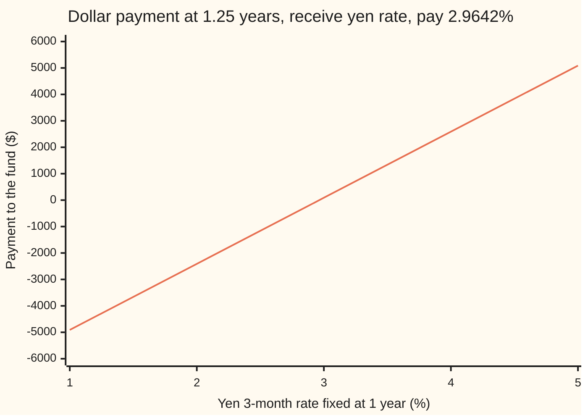
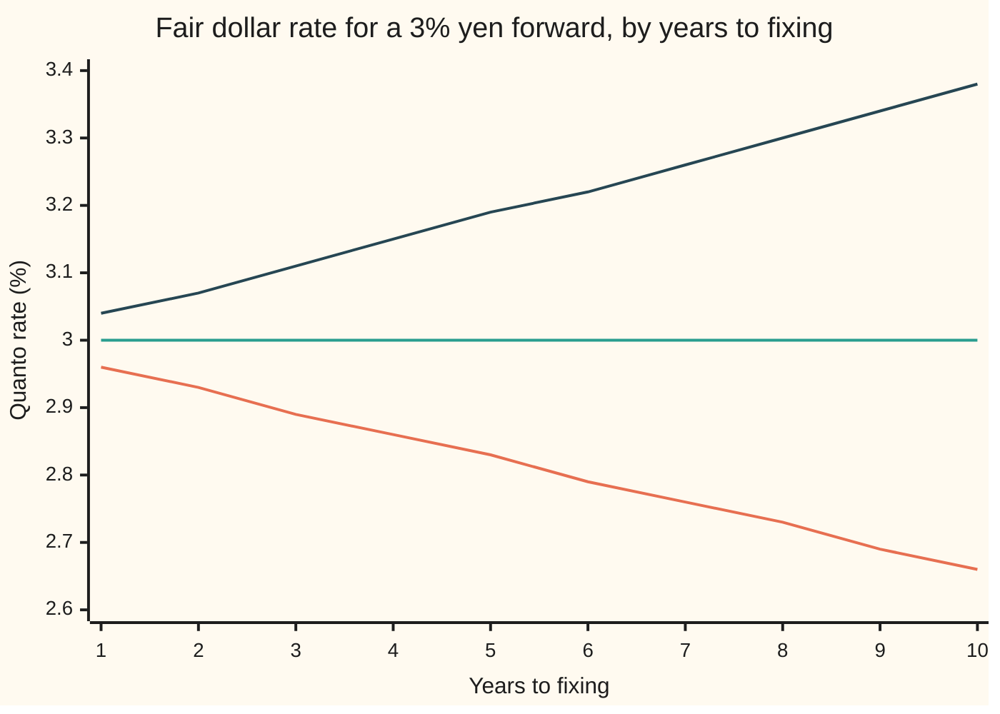

# Quanto rates: a foreign rate paid in domestic currency

[Syllabus](../../../SYLLABUS.md) → [Financial mathematics](../../../SYLLABUS.md#w12) → [Convexity and Exotics](../../../SYLLABUS.md#w12-s32) → Quanto rates

---

## General Overview

A dollar fund wants exposure to Japanese interest rates, but not to the yen. A bank offers a coupon. In one year the 3-month yen rate is fixed. Three months after that, the bank pays the fund that rate on 100 million yen, converted to dollars at a rate written into the contract today: 100 yen to the dollar, whatever the yen trades at by then. The fund pays a fixed rate in return. A rate set in one currency and paid in another at a frozen conversion is a **quanto rate** (short for "quantity-adjusting"), the term used from here on.

Which fixed rate makes the swap fair? The obvious answer is the yen forward rate, 3.00 percent: the rate at which a Japanese bank would agree today to lend yen for those three months. That answer is wrong by a small, stubborn amount. With the yen rate and the yen's value moving together, the fair dollar rate is **2.9642 percent**, 3.58 basis points lower (a basis point is a hundredth of a percent). Struck at 3.00 percent instead, the fund's side is worth minus $87.67 today.

The gap has one source. The yen forward rate is an average of possible future yen rates, each weighted by what a yen payment is worth in that future. The fund is paid in dollars, so each future must be weighted by what a dollar payment is worth there. Where the yen is strong, a dollar buys fewer yen, so those futures count for less. If the yen tends to be strong when yen rates are high, the high rates lose weight and the average falls.

**A foreign rate paid in home currency at a fixed conversion has a fair value equal to its foreign forward reweighted by the inverse of the forward exchange rate; when the rate and the exchange rate are lognormal, that reweighting is a drift of minus correlation times the two volatilities.**

**What kind of fact this is:** a theorem, proved on this card in Why it works: the reweighting is exact in any model without free money. The closed form $K_q = F e^{-\rho\sigma_F\sigma_G T}$ on top of it is a model, an assumption about how rates and currency move together.

### The picture: what the coupon pays

The fund receives the yen rate and pays the fair quanto rate, 2.9642 percent, on the dollar equivalent of 100 million yen for a quarter of a year: $250,000 per unit of rate, so $2,500 per percentage point. The payment arrives at 1.25 years.



One line: the dollar payment for each yen fixing. It is straight, with slope $2,500 per percentage point, because the conversion is frozen. No exchange rate appears on it. The exchange rate still moves the fair strike, through the weights on the futures, not through the payment.

---

## The formula

Notation first, in words. $T$ is the fixing date and $U$ the payment date. $L$ is the yen rate fixed at $T$; $F$ is its yen forward today. $G_T$ is the forward exchange rate at $T$, in dollars per yen, for delivery at $U$. A subscript d marks dollars (domestic) and f marks yen (foreign). $D_d(t,U)$ is the price at a date t of one dollar paid at date $U$; $D_f(t,U)$ is the same for one yen. An average written $\mathbb{E}^{f,U}[\cdot]$ is taken with the probabilities that make every yen price, counted in yen bonds maturing at $U$, driftless: the **yen forward measure**, the device of [Timing adjustments](03-timing-and-in-arrears-adjustments.md) set in yen. $\mathbb{E}^{d,U}$ is the dollar forward measure, and $\mathbb{E}^{f,A}$ counts in a yen annuity: the **annuity measure** of [The annuity measure](../29-Caps%2C%20Floors%20and%20Swaptions/05-the-annuity-measure.md).

The exact statement, for any joint behaviour of rates and currency:

$$K_q \;=\; \mathbb{E}^{d,U}[L] \;=\; \frac{\mathbb{E}^{f,U}\!\left[L / G_T\right]}{\mathbb{E}^{f,U}\!\left[1 / G_T\right]} \;=\; F + \frac{\operatorname{Cov}^{f,U}\!\left(L,\; 1/G_T\right)}{\mathbb{E}^{f,U}\!\left[1/G_T\right]}$$

**Read it aloud:** the fair dollar strike is the yen rate averaged over futures, each future weighted by one over the forward exchange rate; equivalently, the yen forward plus the covariance of the rate with that weight, per unit of average weight.

Under the model where the yen forward rate and the forward exchange rate are both lognormal, with yearly volatilities $\sigma_F$ and $\sigma_G$ and correlation $\rho$ between their random drivers $W^F$ and $W^G$:

$$\frac{dF_t}{F_t} = -\rho\,\sigma_F\,\sigma_G\,dt + \sigma_F\,dW^F_t \quad\text{under } \mathbb{E}^{d,U}, \qquad K_q = F\,e^{-\rho\,\sigma_F\,\sigma_G\,T}$$

**Read it aloud:** counted in dollars, the yen forward rate drifts down at correlation times rate volatility times currency volatility, so the fair dollar strike is the yen forward shrunk by that drift over the time to fixing.

For a yen swap rate paid in dollars (a quanto CMS coupon; CMS is a constant-maturity swap, a leg paying a long swap rate), the weight gains the swap's annuity. $S_T$ is the yen 10-year swap rate at $T$ and $A_T$ its yen annuity:

$$K_q^{\text{CMS}} = \frac{\mathbb{E}^{f,A}\!\left[S_T\, m(S_T) / G_T\right]}{\mathbb{E}^{f,A}\!\left[m(S_T) / G_T\right]}, \qquad m = \frac{D_f(T,U)}{A_T}$$

In words: average the swap rate in annuity units, reweighted once by $m$ for the payment date (the CMS convexity of [Constant-maturity swaps](02-cms-and-the-convexity-adjustment.md)) and once by $1/G_T$ for the currency.

| Symbol | Plain meaning | In our example | Push it up and the answer… |
| --- | --- | --- | --- |
| $L$ | the yen 3-month rate as fixed at $T$, a decimal per year | unknown today | the payment rises $2,500 per percentage point |
| $F$ | the yen forward rate: the fair value of $L$ counted in yen | 3.00% | $K_q$ rises in proportion |
| $K$, $K_q$ | a strike (the fixed rate the fund pays); the fair quanto strike | 3.00%; 2.9642% | a higher $K$ lowers the fund's value by $245,000 per unit of rate |
| $\mu$ | the drift of $F$ counted in dollars, per year | −0.012 | — |
| $T$, $U$ | fixing date and payment date, in years | 1 and 1.25 | a later $T$ widens the gap: 0.012 of $F$ per year |
| $\delta$, $\chi$, $N$ | accrual fraction of a year; fixed conversion, dollars per yen; yen notional | 0.25; 0.01; ¥100,000,000 | scale the payment, not $K_q$ |
| $X_t$, $X_0$, $X_T$, $G_t$, $G_T$ | spot and forward exchange rate for delivery at $U$, dollars per yen; $G_t = X_t D_f(t,U)/D_d(t,U)$ | spot 0.01 | today's level cancels from $K_q$ |
| $D_d$, $D_f$ | dollar and yen discount factors to $U$ | 0.98 and 0.96 | $D_d$ scales the value, not $K_q$ |
| $\sigma_F$, $\sigma_G$, $\sigma_S$ | yearly volatility of the yen forward rate, of the forward exchange rate, of the yen swap rate | 30%, 10%, 25% | widen the gap when $\rho \ne 0$ |
| $\rho$, $W^F$, $W^G$ | correlation between the random drivers $W^F$ and $W^G$ of the yen rate and of the yen's dollar value; say "rho" | 0.40 | lowers $K_q$; the fund's value falls $2.18 per 0.01 |
| $S$, $S_T$, $A$, $A_T$, $m$ | yen 10-year swap rate; yen annuity (value of 1 yen a year on the swap's payment dates); the ratio $m = D_f(T,U)/A_T$ | 3.00% forward | — |
| $\mathbb{E}^{f,U}$, $\mathbb{E}^{d,U}$, $\mathbb{E}^{f,A}$, $Q$, $Y$ | averages under the yen forward, dollar forward and yen annuity measures; $Q^{f,U}$, $Q^{d,U}$ name the measures themselves; $Y$ is any dollar amount fixed at $T$ | — | — |

### When it holds

- **The conversion is frozen in the contract.** A coupon converted at the market exchange rate on the payment day is a plain yen payment and its fair strike is the yen forward, 3.00 percent. Treating it as a quanto misprices it by the full 3.58 basis points.
- **The exact formula needs only no free money.** The weight $1/G_T$ follows from the definition of the forward exchange rate. What it does not supply is the joint law of $L$ and $G_T$: the covariance must come from a model or from quotes.
- **Lognormal, constant volatilities and correlation.** The exponential needs both. If the correlation moves, its average over the life is what counts; every 0.01 of error in it moves the value by $2.18 here.
- **Forward, not spot, exchange-rate volatility.** $\sigma_G$ belongs to $G_t$, which also moves with the two interest-rate curves. Using spot volatility is an approximation whose error grows with the time to payment.
- **Payment at the natural date.** Paying at any other date adds the timing weight of [Timing adjustments](03-timing-and-in-arrears-adjustments.md) on top; the two multiply inside one weight.

Conventions verified 2026-09-28: the market quotes the pair as yen per dollar (a USD/JPY quote is the number of yen one dollar buys). This card uses dollars per yen, the inverse, so a correlation measured on the market quote enters with the opposite sign.

---

## Why it works

### Step 0: price the coupon where it is natural, then change the unit

A yen rate has one unit of account in which its average is known without any model: yen bonds maturing on the payment date. Counted that way, the yen forward rate $F$ is driftless, which is the content of a forward rate agreement being free to enter. The dollar coupon needs the average in a different unit, dollar bonds maturing on the payment date. Changing the unit reweights the futures ([The quanto adjustment](../24-Quantos%20and%20composites/01-quanto-forward-and-adjustment.md) does this for a share). The whole card is the size of that reweighting.

The same fact seen by a hedger. The bank that pays the quanto coupon hedges it by receiving the yen rate in yen. With $\rho > 0$, when yen rates rise the yen tends to rise too, so the hedge's yen gain converts into more dollars than the coupon costs. When rates fall the yen tends to fall, so the hedge's loss converts into fewer dollars than the coupon saves. The hedge beats the coupon both ways. Competition passes that edge to the fund as a lower fixed rate.

### Step 1: the yen forward rate is an average in yen bonds

The 3-month yen rate for $[T,U]$ satisfies $1 + \delta L = 1/D_f(T,U)$: lending one yen for the quarter returns $1+\delta L$. Today's version is $1 + \delta F = D_f(0,T)/D_f(0,U)$. The ratio $D_f(t,T)/D_f(t,U)$ is one yen asset divided by another, so counted in yen $U$-bonds it has no drift. That is exactly the statement $\mathbb{E}^{f,U}[L] = F$.

### Step 2: the dollar payment, counted in yen bonds, carries the weight $1/G_T$

The payment is known at $T$: $\chi N \delta (L - K)$ dollars due at $U$. At $T$ that promise is worth $D_d(T,U)$ dollars per dollar. Convert to yen at $X_T$ and count in yen $U$-bonds:

$$\frac{D_d(T,U)}{X_T\, D_f(T,U)} = \frac{1}{G_T}.$$

So the coupon's value in yen bonds is $\chi N \delta\,(L - K)/G_T$, and its value today is today's yen bond times the $\mathbb{E}^{f,U}$ average of that. Setting the value to zero and solving for $K$ gives the exact formula. The denominator is pinned by the same argument applied to a plain dollar bond: $\mathbb{E}^{f,U}[1/G_T] = 1/G_0$. The spot level $X_0$ never enters $K_q$.

<details>
<summary>Detailed proof: the unit change as a density</summary>

Write $Q^{f,U}$ for the yen forward measure and $Q^{d,U}$ for the dollar one. For any dollar amount $Y$ known at $T$ and paid at $U$, its dollar value today is $D_d(0,U)\,\mathbb{E}^{d,U}[Y]$ by the definition of the dollar forward measure, and $X_0 D_f(0,U)\,\mathbb{E}^{f,U}[Y/G_T]$ by Step 2 read in yen and converted at today's spot. Both are the price of the same claim, so for every such $Y$
$$\mathbb{E}^{d,U}[Y] = \mathbb{E}^{f,U}\!\left[Y \cdot \frac{G_0}{G_T}\right], \qquad G_0 = \frac{X_0 D_f(0,U)}{D_d(0,U)}.$$
That is the density $dQ^{d,U}/dQ^{f,U} = G_0/G_T$: positive, with average one (take $Y = 1$). Put $Y = L$ to get the first equality of the formula. Expand $\mathbb{E}^{f,U}[L/G_T] = \operatorname{Cov}(L, 1/G_T) + F\,\mathbb{E}^{f,U}[1/G_T]$ and divide to get the covariance form. The argument needs $L/G_T$ to have a finite average and the payment amount $\chi N \delta$ to be nonzero; otherwise any strike prices the same zero coupon.

</details>

### Step 3: lognormal rate and currency give the drift

Now take $\ln F_T$ and $\ln G_T$ jointly normal under $Q^{f,U}$, with volatilities $\sigma_F$ and $\sigma_G$ and correlation $\rho$, and $F$ driftless there. The weight $1/G_T$ is the exponential of a normal variable whose covariance with $\ln F_T$ is $-\rho\sigma_F\sigma_G T$. For jointly normal $x$ and $z$, $\mathbb{E}[e^{x}e^{z}]/\mathbb{E}[e^{z}] = \mathbb{E}[e^{x}]\,e^{\operatorname{Cov}(x,z)}$ (complete the square in the joint density). Therefore

$$K_q = F\,e^{-\rho\sigma_F\sigma_G T}.$$

Read through Girsanov's theorem, the density $G_0/G_T$ shifts the driver $W^F$ by $-\rho\sigma_G\,dt$, which is the drift $\mu = -\rho\sigma_F\sigma_G$ on the formula line. For the example, $\rho\sigma_F\sigma_G T = 0.40 \times 0.30 \times 0.10 \times 1 = 0.012$.

### Step 4: the same answer from the dollar side

Under the dollar forward measure the forward exchange rate $G_t$ is driftless: it is a yen bond priced in dollars, counted in dollar bonds. A yen forward rate agreement settled in yen and converted at the market rate must still be free to enter. In dollar-bond units it pays $G_T\,\delta(L - F)$, so

$$\mathbb{E}^{d,U}\!\left[G_T\,(L - F)\right] = 0.$$

With $L$ lognormal of unknown drift $\mu$, this one equation fixes $\mu$. The code solves it by bisection, with the average done as a two-dimensional integral, and lands on $\mu = -0.0120000000$. No yen measure is used on this road.

### Step 5: a swap rate uses the annuity instead of the bond

A yen 10-year swap rate $S$ is driftless when counted in the swap's yen annuity $A$. A coupon paying $S_T$ in dollars at $U$ needs the dollar $U$-bond. Repeat Step 2 with $A_T$ in place of $D_f(T,U)$:

$$\frac{D_d(T,U)}{X_T\,A_T} = \frac{1}{G_T}\cdot\frac{D_f(T,U)}{A_T} = \frac{m(S_T)}{G_T}.$$

The weight splits into a currency factor and a payment-date factor $m$. Taking $\ln S_T$ and $\ln G_T$ jointly normal under the annuity measure, the currency factor again shifts the swap rate's driver, so the quanto CMS rate is the plain yen CMS rate computed on the shifted forward $S_0 e^{-\rho\sigma_S\sigma_G T}$. That is exact in the model. Multiplying the yen CMS rate by $e^{-\rho\sigma_S\sigma_G T}$ instead is close but not exact, because the CMS convexity grows with the level of the forward it is computed on. A single-period swap has $A_T = \delta D_f(T,U)$, $m$ constant, and Step 5 collapses back to Step 2: the forward measure is the annuity measure of a one-payment swap.

<details>
<summary>Why a flat curve for $m$?</summary>

The ratio $m = D_f(T,U)/A_T$ depends on the whole yen curve at $T$. The code ties it to the swap rate alone by assuming the curve is flat at $S_T$, annually compounded: $m(S) = \dfrac{S/(1+S)}{1 - (1+S)^{-10}}$ for a coupon paid one year after fixing. This is the usual annuity mapping of [Constant-maturity swaps](02-cms-and-the-convexity-adjustment.md); the quanto factor does not depend on it.

</details>

The other door is replication: build the yen rate payoff from yen instruments and a currency forward, then read the fair strike from the cost. Boenkost and Schmidt (Sources) carry it out for a domestic rate paid abroad; the density above is its compressed form.

---

## Worked numbers, by hand

The yen coupon: $F = 3\%$, $\sigma_F = 30\%$, $\sigma_G = 10\%$, $\rho = 0.40$, $T = 1$, $U = 1.25$, $\delta = 0.25$, 100 million yen at 0.01 dollars per yen, $D_d(0,U) = 0.98$.

| Step | Arithmetic | Value |
| --- | --- | --- |
| correlation times the two volatilities, times $T$ | $0.40 \times 0.30 \times 0.10 \times 1$ | 0.012 |
| shrink factor | $e^{-0.012}$ | 0.98807 |
| fair quanto rate | $3\% \times 0.98807$ | **2.9642%** |
| adjustment | $2.9642\% - 3\%$ | −3.58 bp |
| dollars at $U$ per unit of rate | $0.01 \times 100{,}000{,}000 \times 0.25$ | $250,000 |
| dollars today per unit of rate | $250{,}000 \times 0.98$ | $245,000 |
| value of the fund's side struck at 3% | $245{,}000 \times (0.029642 - 0.03)$ | −$87.67 |

Paying the yen forward gives away $87.67 on this one coupon, and the gap grows with each later fixing.

### The same reweighting in three states

A deliberately wide three-state world shows the weight at work with fractions. Counted in yen bonds, the yen rate finishes at 1, 3 or 5 percent with probabilities 1/4, 1/2, 1/4, so $F = 3\%$. The exchange rate at fixing is 0.008, 0.010 or 0.012 dollars per yen in those states: the yen is strong exactly when rates are high. Take both curves equal at fixing, so $G_T = X_T$, with $X_0 = 0.01$ and $D_f(0,U) = 0.96$.

| Step | Arithmetic | Value |
| --- | --- | --- |
| weights $1/X_T$ | $1/0.008,\ 1/0.010,\ 1/0.012$ | 125, 100, 83.33 |
| average weight | $\tfrac14(125) + \tfrac12(100) + \tfrac14(83.33)$ | 102.08 |
| dollar bond implied | $0.01 \times 0.96 \times 102.08$ | 0.98 |
| dollar probabilities | $\tfrac14 \cdot 125/102.08$, and so on | 15/49, 24/49, 10/49 |
| fair quanto rate | $(15 \times 1\% + 24 \times 3\% + 10 \times 5\%)/49$ | **2.7959%** |
| covariance route | $3\% + (-0.2083)/102.08$ | 2.7959% |
| value struck at 3% | $245{,}000 \times (0.027959 - 0.03)$ | −$500.00 |

The high-rate state loses probability (1/4 becomes 10/49) because it is the strong-yen state. The swings are wide on purpose, so the gap is 20.41 basis points; the lognormal numbers above are the realistic size.

### What breaks if you drop a piece

| Mistake | Comes out at | What went wrong |
| --- | --- | --- |
| Strike at the yen forward | 3.0000% | The yen average is the wrong unit for a dollar payment: $87.67 given away |
| Sign flipped | 3.0362% | The weight is $1/G_T$, not $G_T$; or the correlation was measured on the yen-per-dollar quote |
| Clock runs to payment, $U = 1.25$ | 2.9553% | The rate stops moving at fixing; after $T$ only discounting remains |
| Quanto CMS: ignore the currency | 3.0241% | Right yen CMS rate, wrong currency; the quanto CMS is 2.9938% |
| Quanto CMS: multiply the two corrections | 2.9940% | Close: 0.02 bp high, because convexity scales with the shifted forward |

### How the value moves: the Greeks

Sensitivities of the fund's side (receive the yen rate, pay 3%), analytic and by bumping, which agree to six decimals:

| Nudge | Change in value today |
| --- | --- |
| yen forward up 1 bp | +$24.21 |
| correlation up 0.01 | −$2.18 |
| currency volatility up 1 point | −$8.71 |
| rate volatility up 1 point | −$2.90 |

The currency volatility matters three times as much as the rate volatility here only because $\sigma_F = 30\%$ is three times $\sigma_G = 10\%$: each one's sensitivity carries the other's size.

### The adjustment grows with the time to fixing



Bottom line (orange): correlation +0.40. Middle line (green): correlation 0, no adjustment. Top line (dark): correlation −0.40. At ten years the gap is about a third of a percentage point either way: a ten-year strip of quanto coupons cannot ignore it.

---

## Code, from first principles, and it actually runs

The scripts build their own normal density, a Simpson integrator on a 161-by-161 grid and a bisection root finder. The yen coupon's fair rate is reached three ways: the drift formula; the yen-measure average reweighted by $1/G_T$ as a two-dimensional integral; and the dollar-measure drift found by root-finding the free-to-enter yen FRA, with no yen measure used. The three-state world is solved separately and checked against the exact fractions 137/4900 and −$500. The quanto CMS rate is reached by a two-dimensional integral with weight $m/G$ and by the shifted-forward route, which must agree; setting the correlation to zero must return the plain yen CMS rate. Every figure on the card is printed by both.

### Python

```python
# Quanto rates: a yen rate paid in dollars at a fixed conversion.  Standard library only.
# Every number quoted on the card is printed here.  The normal density, the Simpson
# integrator and the bisection root finder are written out below.
from math import exp, sqrt, pi

def phi(z): return exp(-0.5 * z * z) / sqrt(2.0 * pi)            # bell-curve height at z

N_GRID, LO, HI = 160, -8.0, 8.0                                   # Simpson grid on [-8, 8]
H = (HI - LO) / N_GRID
Z = [LO + i * H for i in range(N_GRID + 1)]
WZ = [(1 if i in (0, N_GRID) else (4 if i % 2 else 2)) * H / 3.0 * phi(z) for i, z in enumerate(Z)]

def dot(a, b):                                                    # plain left-to-right sum of products
    t = 0.0
    for x, y in zip(a, b): t += x * y
    return t
def avg1(f): return dot(WZ, [f(z) for z in Z])                    # E[f(Z)], Z standard normal
def avg2(f, rho):                                                 # E[f(Z1, Z2)], correlation rho
    c, t = sqrt(1.0 - rho * rho), 0.0
    for z1, w1 in zip(Z, WZ):
        t += w1 * dot(WZ, [f(z1, rho * z1 + c * z2) for z2 in Z])
    return t

def lognormal(f0, vol, T, z): return f0 * exp(vol * sqrt(T) * z - 0.5 * vol * vol * T)

# ---- contract A: 3-month yen rate fixing at T = 1, paid in dollars at U = 1.25 ----
F, sF, sG, rho, T, U, delta = 0.03, 0.30, 0.10, 0.40, 1.0, 1.25, 0.25
chi, Nf, Dd = 0.01, 100_000_000, 0.98                             # USD per JPY, JPY notional, dollar bond to U
scale = chi * Nf * delta * Dd                                     # dollars today per unit of rate

def formula(F, sF, sG, rho, T): return F * exp(-rho * sF * sG * T)   # road 1: the quanto drift

def reweighted(F, sF, sG, rho, T):                                # road 2: yen measure, weight 1/G
    h = lambda z1, z2: exp(-sG * sqrt(T) * z2)
    return avg2(lambda a, b: lognormal(F, sF, T, a) * h(a, b), rho) / avg2(h, rho)

def drift_by_root(F, sF, sG, rho, T):                             # road 3: dollar measure, solve for the drift
    G = lambda z2: lognormal(1.0, sG, T, z2)                      # forward FX, driftless in dollars
    def fra(mu):                                                  # dollar value of a yen FRA at market FX
        return avg2(lambda a, b: G(b) * (F * exp(mu * T + sF * sqrt(T) * a - 0.5 * sF * sF * T) - F), rho)
    lo, hi, flo = -0.5, 0.5, fra(-0.5)
    for _ in range(60):
        mid = 0.5 * (lo + hi)
        fm = fra(mid)
        if flo * fm <= 0: hi = mid
        else: lo, flo = mid, fm
    return 0.5 * (lo + hi)

k1, k2 = formula(F, sF, sG, rho, T), reweighted(F, sF, sG, rho, T)
mu = drift_by_root(F, sF, sG, rho, T)
k3 = F * exp(mu * T)
assert abs(k2 - k1) < 1e-12                                      # reweighting agrees with the drift
assert abs(k3 - k1) < 1e-12                                      # root-found drift agrees too

# ---- three states by hand: foreign probabilities, rates, FX in USD per JPY ----
qf, R, X = (0.25, 0.5, 0.25), (0.01, 0.03, 0.05), (0.008, 0.010, 0.012)
w = [1.0 / x for x in X]                                          # dollar-bond weight 1/X_T
wbar = dot(qf, w)
qd = [p * v / wbar for p, v in zip(qf, w)]
f3, k_toy = dot(qf, R), dot(qd, R)
cov = dot(qf, [r * v for r, v in zip(R, w)]) - f3 * wbar
dd_toy = 0.01 * 0.96 * wbar                                       # X_0 * D_f(0,U) * E[weight]
assert abs(k_toy - 137 / 4900) < 1e-15                           # dollar probabilities, exact fraction
assert abs(f3 + cov / wbar - k_toy) < 1e-15                       # covariance form, same answer
assert abs(dd_toy - 0.98) < 1e-15
pv_toy = chi * Nf * delta * dd_toy * (k_toy - 0.03)
assert abs(pv_toy + 500.0) < 1e-9

# ---- contract B: 10-year yen swap rate fixing at T = 1, paid in dollars at T + 1 ----
S0, sS = 0.03, 0.25
def m(s): return s / (1.0 + s) / (1.0 - pow(1.0 + s, -10.0))         # D_f(T,T+1) / A_T on a flat yen curve
def cms(S0, sS, T): return avg1(lambda z: lognormal(S0, sS, T, z) * m(lognormal(S0, sS, T, z))) / avg1(lambda z: m(lognormal(S0, sS, T, z)))
def cms_quanto_2d(S0, sS, sG, rho, T):                           # annuity measure, weight m(S)/G
    wt = lambda a, b: m(lognormal(S0, sS, T, a)) * exp(-sG * sqrt(T) * b)
    return avg2(lambda a, b: lognormal(S0, sS, T, a) * wt(a, b), rho) / avg2(wt, rho)
kc_yen = cms(S0, sS, T)
kc_2d = cms_quanto_2d(S0, sS, sG, rho, T)
kc_shift = cms(S0 * exp(-rho * sS * sG * T), sS, T)               # Girsanov: shift the forward, then convexity
kc_prod = kc_yen * exp(-rho * sS * sG * T)                        # the two corrections multiplied
kc_rho0 = cms_quanto_2d(S0, sS, sG, 0.0, T)
assert abs(kc_2d - kc_shift) < 1e-12                             # 2-D weight = shifted forward
assert abs(kc_rho0 - kc_yen) < 1e-12                              # no correlation, no quanto part
assert 1e-7 < abs(kc_prod - kc_2d) < 1e-5                         # the product rule is close, not exact

# ---- sensitivities of contract A's value at strike 3%: analytic against bumped ----
def value(F=F, sF=sF, sG=sG, rho=rho, T=T): return scale * (formula(F, sF, sG, rho, T) - 0.03)
greeks = [("per 1 bp of yen forward", scale * 1e-4 * exp(-rho * sF * sG * T), (value(F=F + 1e-6) - value(F=F - 1e-6)) / 2e-6 * 1e-4),
          ("per 0.01 of correlation", -scale * 0.01 * sF * sG * T * k1, (value(rho=rho + 1e-6) - value(rho=rho - 1e-6)) / 2e-6 * 0.01),
          ("per 1 vol point of FX", -scale * 0.01 * rho * sF * T * k1, (value(sG=sG + 1e-6) - value(sG=sG - 1e-6)) / 2e-6 * 0.01),
          ("per 1 vol point of rate", -scale * 0.01 * rho * sG * T * k1, (value(sF=sF + 1e-6) - value(sF=sF - 1e-6)) / 2e-6 * 0.01)]
for _, a, b in greeks: assert abs(a - b) < 1e-5

bp = lambda x: 1e4 * x
rows = [("A yen forward F (%)", 100 * F), ("A rho*sF*sG*T", rho * sF * sG * T),
        ("A shrink factor e^-(that)", exp(-rho * sF * sG * T)),
        ("A 1 formula K_q (%)", 100 * k1), ("A 2 reweighted by 1/G (%)", 100 * k2),
        ("A 3 drift found by root", mu), ("A 3 K_q from that drift (%)", 100 * k3),
        ("A adjustment (bp)", bp(k1 - F)), ("A value at 3% strike ($)", scale * (k1 - F)),
        ("A dollars at U per unit rate", chi * Nf * delta),
        ("A dollars at U per 1% of rate", chi * Nf * delta / 100), ("A dollars today per unit rate", scale),
        ("toy weight 1/X, rate 1%", w[0]), ("toy weight 1/X, rate 3%", w[1]), ("toy weight 1/X, rate 5%", w[2]),
        ("toy weight mean E[1/X]", wbar), ("toy D_d(0,U)", dd_toy),
        ("toy dollar prob, rate 1%", qd[0]), ("toy dollar prob, rate 3%", qd[1]), ("toy dollar prob, rate 5%", qd[2]),
        ("toy covariance", cov), ("toy K_q (%)", 100 * k_toy), ("toy adjustment (bp)", bp(k_toy - f3)),
        ("toy value at 3% ($)", pv_toy),
        ("B yen CMS rate (%)", 100 * kc_yen), ("B yen convexity (bp)", bp(kc_yen - S0)),
        ("B 1 quanto CMS, 2-D (%)", 100 * kc_2d), ("B shifted forward (%)", 100 * S0 * exp(-rho * sS * sG * T)),
        ("B 2 shift then CMS (%)", 100 * kc_shift),
        ("B 3 product of the two (%)", 100 * kc_prod), ("B total adjustment (bp)", bp(kc_2d - S0)),
        ("B quanto part (bp)", bp(kc_2d - kc_yen)), ("B product error (bp)", bp(kc_prod - kc_2d)),
        ("wrong: no quanto (%)", 100 * F), ("wrong: sign flipped (%)", 100 * F * exp(rho * sF * sG * T)),
        ("wrong: payment clock U (%)", 100 * formula(F, sF, sG, rho, U)),
        ("try: rho = -0.40 (%)", 100 * formula(F, sF, sG, -rho, T)), ("try: sG = 0.20 (%)", 100 * formula(F, sF, 0.20, rho, T)),
        ("try: B at rho = -0.40 (%)", 100 * cms_quanto_2d(S0, sS, sG, -rho, T))]
for name, v in rows: print(f"{name:<30} {v:>16.10f}")
for name, a, b in greeks: print(f"greek {name:<24} {a:>12.6f} {b:>12.6f}")
print("payoff, yen rate (%)      " + "".join(f"{x:>10.2f}" for x in (1, 2, 3, 4, 5)))
print("payoff, dollars at K_q    " + "".join(f"{chi * Nf * delta * (x / 100 - k1):>10.2f}" for x in (1, 2, 3, 4, 5)))
for r_ in (0.4, 0.0, -0.4):
    print(f"chart rho {r_:+.1f}, K_q (%)  " + "".join(f"{100 * formula(F, sF, sG, r_, t):>6.2f}" for t in range(1, 11)))
print("ALL CHECKS PASS")
```

**Ran 2026-09-28 on macOS, Python 3.14.6, standard library only. All checks passed. Output, pasted from the run:**

```
A yen forward F (%)                3.0000000000
A rho*sF*sG*T                      0.0120000000
A shrink factor e^-(that)          0.9880717129
A 1 formula K_q (%)                2.9642151386
A 2 reweighted by 1/G (%)          2.9642151386
A 3 drift found by root           -0.0120000000
A 3 K_q from that drift (%)        2.9642151386
A adjustment (bp)                 -3.5784861414
A value at 3% strike ($)         -87.6729104648
A dollars at U per unit rate   250000.0000000000
A dollars at U per 1% of rate   2500.0000000000
A dollars today per unit rate  245000.0000000000
toy weight 1/X, rate 1%          125.0000000000
toy weight 1/X, rate 3%          100.0000000000
toy weight 1/X, rate 5%           83.3333333333
toy weight mean E[1/X]           102.0833333333
toy D_d(0,U)                       0.9800000000
toy dollar prob, rate 1%           0.3061224490
toy dollar prob, rate 3%           0.4897959184
toy dollar prob, rate 5%           0.2040816327
toy covariance                    -0.2083333333
toy K_q (%)                        2.7959183673
toy adjustment (bp)              -20.4081632653
toy value at 3% ($)             -500.0000000000
B yen CMS rate (%)                 3.0240653954
B yen convexity (bp)               2.4065395402
B 1 quanto CMS, 2-D (%)            2.9937580025
B shifted forward (%)              2.9701495012
B 2 shift then CMS (%)             2.9937580025
B 3 product of the two (%)         2.9939754420
B total adjustment (bp)           -0.6241997518
B quanto part (bp)                -3.0307392921
B product error (bp)               0.0217439483
wrong: no quanto (%)               3.0000000000
wrong: sign flipped (%)            3.0362168666
wrong: payment clock U (%)         2.9553358188
try: rho = -0.40 (%)               3.0362168666
try: sG = 0.20 (%)                 2.9288571293
try: B at rho = -0.40 (%)          3.0546814206
greek per 1 bp of yen forward     24.207757    24.207757
greek per 0.01 of correlation     -2.178698    -2.178698
greek per 1 vol point of FX       -8.714793    -8.714793
greek per 1 vol point of rate     -2.904931    -2.904931
payoff, yen rate (%)            1.00      2.00      3.00      4.00      5.00
payoff, dollars at K_q      -4910.54  -2410.54     89.46   2589.46   5089.46
chart rho +0.4, K_q (%)    2.96  2.93  2.89  2.86  2.83  2.79  2.76  2.73  2.69  2.66
chart rho +0.0, K_q (%)    3.00  3.00  3.00  3.00  3.00  3.00  3.00  3.00  3.00  3.00
chart rho -0.4, K_q (%)    3.04  3.07  3.11  3.15  3.19  3.22  3.26  3.30  3.34  3.38
ALL CHECKS PASS
```

### Rust

```rust
// Quanto rates: a yen rate paid in dollars at a fixed conversion.  Rust std only.
// Every number quoted on the card is printed here.  The normal density, the Simpson
// integrator and the bisection root finder are written out below.

const NG: usize = 160;
const LO: f64 = -8.0;
const HI: f64 = 8.0;

fn phi(z: f64) -> f64 { (-0.5 * z * z).exp() / (2.0 * std::f64::consts::PI).sqrt() }

struct Grid { z: Vec<f64>, w: Vec<f64> }

impl Grid {
    fn new() -> Grid {
        let h = (HI - LO) / NG as f64;
        let z: Vec<f64> = (0..=NG).map(|i| LO + i as f64 * h).collect();
        let w = z.iter().enumerate().map(|(i, &x)| {
            let c = if i == 0 || i == NG { 1.0 } else if i % 2 == 1 { 4.0 } else { 2.0 };
            c * h / 3.0 * phi(x)
        }).collect();
        Grid { z, w }
    }
    fn avg1(&self, f: impl Fn(f64) -> f64) -> f64 {   // E[f(Z)], Z standard normal
        let mut t = 0.0;
        for i in 0..=NG { t += self.w[i] * f(self.z[i]); }
        t
    }
    fn avg2(&self, f: impl Fn(f64, f64) -> f64, rho: f64) -> f64 {   // E[f(Z1, Z2)], correlation rho
        let c = (1.0 - rho * rho).sqrt();
        let mut t = 0.0;
        for i in 0..=NG {
            let z1 = self.z[i];
            let mut inner = 0.0;
            for j in 0..=NG { inner += self.w[j] * f(z1, rho * z1 + c * self.z[j]); }
            t += self.w[i] * inner;
        }
        t
    }
}

fn lognormal(f0: f64, vol: f64, t: f64, z: f64) -> f64 { f0 * (vol * t.sqrt() * z - 0.5 * vol * vol * t).exp() }
fn formula(f: f64, sf: f64, sg: f64, rho: f64, t: f64) -> f64 { f * (-rho * sf * sg * t).exp() }   // road 1
fn m(s: f64) -> f64 { s / (1.0 + s) / (1.0 - (1.0 + s).powf(-10.0)) }   // D_f(T,T+1) / A_T, flat yen curve

fn cms(g: &Grid, s0: f64, ss: f64, t: f64) -> f64 {
    g.avg1(|z| lognormal(s0, ss, t, z) * m(lognormal(s0, ss, t, z))) / g.avg1(|z| m(lognormal(s0, ss, t, z)))
}
fn cms_quanto_2d(g: &Grid, s0: f64, ss: f64, sg: f64, rho: f64, t: f64) -> f64 {   // weight m(S)/G
    let wt = |a: f64, b: f64| m(lognormal(s0, ss, t, a)) * (-sg * t.sqrt() * b).exp();
    g.avg2(|a, b| lognormal(s0, ss, t, a) * wt(a, b), rho) / g.avg2(wt, rho)
}

fn main() {
    let g = Grid::new();
    // ---- contract A: 3-month yen rate fixing at T = 1, paid in dollars at U = 1.25 ----
    let (f, sf, sg, rho, t, u, delta) = (0.03, 0.30, 0.10, 0.40, 1.0, 1.25, 0.25);
    let (chi, nf, dd) = (0.01, 100_000_000.0, 0.98);
    let scale = chi * nf * delta * dd;
    let k1 = formula(f, sf, sg, rho, t);
    // road 2: yen forward measure, each outcome weighted by 1/G
    let h = |_a: f64, b: f64| (-sg * t.sqrt() * b).exp();
    let k2 = g.avg2(|a, b| lognormal(f, sf, t, a) * h(a, b), rho) / g.avg2(h, rho);
    // road 3: dollar measure, G driftless; find the drift that makes a market-FX yen FRA worth zero
    let fra = |mu: f64| g.avg2(|a, b| lognormal(1.0, sg, t, b) * (f * (mu * t + sf * t.sqrt() * a - 0.5 * sf * sf * t).exp() - f), rho);
    let (mut lo, mut hi) = (-0.5, 0.5);
    let mut flo = fra(lo);
    for _ in 0..60 {
        let mid = 0.5 * (lo + hi);
        let fm = fra(mid);
        if flo * fm <= 0.0 { hi = mid; } else { lo = mid; flo = fm; }
    }
    let mu = 0.5 * (lo + hi);
    let k3 = f * (mu * t).exp();
    assert!((k2 - k1).abs() < 1e-12);   // reweighting agrees with the drift
    assert!((k3 - k1).abs() < 1e-12);   // root-found drift agrees too

    // ---- three states by hand ----
    let qf = [0.25, 0.5, 0.25];
    let r = [0.01, 0.03, 0.05];
    let x = [0.008, 0.010, 0.012];
    let w: Vec<f64> = x.iter().map(|v| 1.0 / v).collect();
    let dot = |a: &[f64], b: &[f64]| { let mut s = 0.0; for i in 0..a.len() { s += a[i] * b[i]; } s };
    let wbar = dot(&qf, &w);
    let qd: Vec<f64> = (0..3).map(|i| qf[i] * w[i] / wbar).collect();
    let (f3, k_toy) = (dot(&qf, &r), dot(&qd, &r));
    let rw: Vec<f64> = (0..3).map(|i| r[i] * w[i]).collect();
    let cov = dot(&qf, &rw) - f3 * wbar;
    let dd_toy = 0.01 * 0.96 * wbar;
    assert!((k_toy - 137.0 / 4900.0).abs() < 1e-15);   // dollar probabilities, exact fraction
    assert!((f3 + cov / wbar - k_toy).abs() < 1e-15);  // covariance form, same answer
    assert!((dd_toy - 0.98).abs() < 1e-15);
    let pv_toy = chi * nf * delta * dd_toy * (k_toy - 0.03);
    assert!((pv_toy + 500.0).abs() < 1e-9);

    // ---- contract B: 10-year yen swap rate fixing at T = 1, paid in dollars at T + 1 ----
    let (s0, ss) = (0.03, 0.25);
    let kc_yen = cms(&g, s0, ss, t);
    let kc_2d = cms_quanto_2d(&g, s0, ss, sg, rho, t);
    let kc_shift = cms(&g, s0 * (-rho * ss * sg * t).exp(), ss, t);
    let kc_prod = kc_yen * (-rho * ss * sg * t).exp();
    let kc_rho0 = cms_quanto_2d(&g, s0, ss, sg, 0.0, t);
    assert!((kc_2d - kc_shift).abs() < 1e-12);   // 2-D weight = shifted forward
    assert!((kc_rho0 - kc_yen).abs() < 1e-12);   // no correlation, no quanto part
    assert!((kc_prod - kc_2d).abs() > 1e-7 && (kc_prod - kc_2d).abs() < 1e-5);   // close, not exact

    // ---- sensitivities of contract A's value at strike 3%: analytic against bumped ----
    let value = |f_: f64, sf_: f64, sg_: f64, rho_: f64| scale * (formula(f_, sf_, sg_, rho_, t) - 0.03);
    let e = 1e-6;
    let greeks = [
        ("per 1 bp of yen forward", scale * 1e-4 * (-rho * sf * sg * t).exp(), (value(f + e, sf, sg, rho) - value(f - e, sf, sg, rho)) / 2e-6 * 1e-4),
        ("per 0.01 of correlation", -scale * 0.01 * sf * sg * t * k1, (value(f, sf, sg, rho + e) - value(f, sf, sg, rho - e)) / 2e-6 * 0.01),
        ("per 1 vol point of FX", -scale * 0.01 * rho * sf * t * k1, (value(f, sf, sg + e, rho) - value(f, sf, sg - e, rho)) / 2e-6 * 0.01),
        ("per 1 vol point of rate", -scale * 0.01 * rho * sg * t * k1, (value(f, sf + e, sg, rho) - value(f, sf - e, sg, rho)) / 2e-6 * 0.01),
    ];
    for gk in greeks.iter() { assert!((gk.1 - gk.2).abs() < 1e-5); }

    let bp = |v: f64| 1e4 * v;
    let rows: Vec<(&str, f64)> = vec![
        ("A yen forward F (%)", 100.0 * f), ("A rho*sF*sG*T", rho * sf * sg * t),
        ("A shrink factor e^-(that)", (-rho * sf * sg * t).exp()),
        ("A 1 formula K_q (%)", 100.0 * k1), ("A 2 reweighted by 1/G (%)", 100.0 * k2),
        ("A 3 drift found by root", mu), ("A 3 K_q from that drift (%)", 100.0 * k3),
        ("A adjustment (bp)", bp(k1 - f)), ("A value at 3% strike ($)", scale * (k1 - f)),
        ("A dollars at U per unit rate", chi * nf * delta),
        ("A dollars at U per 1% of rate", chi * nf * delta / 100.0), ("A dollars today per unit rate", scale),
        ("toy weight 1/X, rate 1%", w[0]), ("toy weight 1/X, rate 3%", w[1]), ("toy weight 1/X, rate 5%", w[2]),
        ("toy weight mean E[1/X]", wbar), ("toy D_d(0,U)", dd_toy),
        ("toy dollar prob, rate 1%", qd[0]), ("toy dollar prob, rate 3%", qd[1]), ("toy dollar prob, rate 5%", qd[2]),
        ("toy covariance", cov), ("toy K_q (%)", 100.0 * k_toy), ("toy adjustment (bp)", bp(k_toy - f3)),
        ("toy value at 3% ($)", pv_toy),
        ("B yen CMS rate (%)", 100.0 * kc_yen), ("B yen convexity (bp)", bp(kc_yen - s0)),
        ("B 1 quanto CMS, 2-D (%)", 100.0 * kc_2d), ("B shifted forward (%)", 100.0 * s0 * (-rho * ss * sg * t).exp()),
        ("B 2 shift then CMS (%)", 100.0 * kc_shift),
        ("B 3 product of the two (%)", 100.0 * kc_prod), ("B total adjustment (bp)", bp(kc_2d - s0)),
        ("B quanto part (bp)", bp(kc_2d - kc_yen)), ("B product error (bp)", bp(kc_prod - kc_2d)),
        ("wrong: no quanto (%)", 100.0 * f), ("wrong: sign flipped (%)", 100.0 * f * (rho * sf * sg * t).exp()),
        ("wrong: payment clock U (%)", 100.0 * formula(f, sf, sg, rho, u)),
        ("try: rho = -0.40 (%)", 100.0 * formula(f, sf, sg, -rho, t)), ("try: sG = 0.20 (%)", 100.0 * formula(f, sf, 0.20, rho, t)),
        ("try: B at rho = -0.40 (%)", 100.0 * cms_quanto_2d(&g, s0, ss, sg, -rho, t)),
    ];
    for (name, v) in rows.iter() { println!("{:<30} {:>16.10}", name, v); }
    for gk in greeks.iter() { println!("greek {:<24} {:>12.6} {:>12.6}", gk.0, gk.1, gk.2); }
    let xs = [1.0, 2.0, 3.0, 4.0, 5.0];
    println!("payoff, yen rate (%)      {}", xs.iter().map(|v| format!("{:>10.2}", v)).collect::<String>());
    println!("payoff, dollars at K_q    {}", xs.iter().map(|v| format!("{:>10.2}", chi * nf * delta * (v / 100.0 - k1))).collect::<String>());
    for r_ in [0.4, 0.0, -0.4] {
        let line: String = (1..=10).map(|tt| format!("{:>6.2}", 100.0 * formula(f, sf, sg, r_, tt as f64))).collect();
        println!("chart rho {:+.1}, K_q (%)  {}", r_, line);
    }
    println!("ALL CHECKS PASS");
}
```

**Ran 2026-09-28 on macOS, rustc 1.98.1, no crates. All checks passed. Output, pasted from the run:**

```
A yen forward F (%)                3.0000000000
A rho*sF*sG*T                      0.0120000000
A shrink factor e^-(that)          0.9880717129
A 1 formula K_q (%)                2.9642151386
A 2 reweighted by 1/G (%)          2.9642151386
A 3 drift found by root           -0.0120000000
A 3 K_q from that drift (%)        2.9642151386
A adjustment (bp)                 -3.5784861414
A value at 3% strike ($)         -87.6729104648
A dollars at U per unit rate   250000.0000000000
A dollars at U per 1% of rate   2500.0000000000
A dollars today per unit rate  245000.0000000000
toy weight 1/X, rate 1%          125.0000000000
toy weight 1/X, rate 3%          100.0000000000
toy weight 1/X, rate 5%           83.3333333333
toy weight mean E[1/X]           102.0833333333
toy D_d(0,U)                       0.9800000000
toy dollar prob, rate 1%           0.3061224490
toy dollar prob, rate 3%           0.4897959184
toy dollar prob, rate 5%           0.2040816327
toy covariance                    -0.2083333333
toy K_q (%)                        2.7959183673
toy adjustment (bp)              -20.4081632653
toy value at 3% ($)             -500.0000000000
B yen CMS rate (%)                 3.0240653954
B yen convexity (bp)               2.4065395402
B 1 quanto CMS, 2-D (%)            2.9937580025
B shifted forward (%)              2.9701495012
B 2 shift then CMS (%)             2.9937580025
B 3 product of the two (%)         2.9939754420
B total adjustment (bp)           -0.6241997518
B quanto part (bp)                -3.0307392921
B product error (bp)               0.0217439483
wrong: no quanto (%)               3.0000000000
wrong: sign flipped (%)            3.0362168666
wrong: payment clock U (%)         2.9553358188
try: rho = -0.40 (%)               3.0362168666
try: sG = 0.20 (%)                 2.9288571293
try: B at rho = -0.40 (%)          3.0546814206
greek per 1 bp of yen forward     24.207757    24.207757
greek per 0.01 of correlation     -2.178698    -2.178698
greek per 1 vol point of FX       -8.714793    -8.714793
greek per 1 vol point of rate     -2.904931    -2.904931
payoff, yen rate (%)            1.00      2.00      3.00      4.00      5.00
payoff, dollars at K_q      -4910.54  -2410.54     89.46   2589.46   5089.46
chart rho +0.4, K_q (%)    2.96  2.93  2.89  2.86  2.83  2.79  2.76  2.73  2.69  2.66
chart rho +0.0, K_q (%)    3.00  3.00  3.00  3.00  3.00  3.00  3.00  3.00  3.00  3.00
chart rho -0.4, K_q (%)    3.04  3.07  3.11  3.15  3.19  3.22  3.26  3.30  3.34  3.38
ALL CHECKS PASS
```

The two outputs are identical line for line.

> [!TIP]
> **Try changing**
> Guess the direction first.
> - **Flip the correlation.** Set `rho = -0.40`. The fair rate rises to **3.0362%**, above the yen forward by about the same distance: now the yen is weak when rates are high, and those futures gain weight.
> - **Double the currency volatility.** Set `sG = 0.20`. The fair rate falls to **2.9289%**: the log gap doubles.
> - **Flip the correlation on the CMS coupon.** With `rho = -0.40` the quanto CMS rate is **3.0547%**: the currency and payment-date corrections now point the same way and add.
> - **Coarsen the grid.** Set `N_GRID = 20`. The integrals drift off the formula and the first assert fails: the tolerance of 1e-12 needs the finer grid.

---

## The usual mistake

> [!warning]
> **Treating the currency as irrelevant because the payment does not contain it.** The frozen conversion removes the exchange rate from the cheque, not from the price. The price averages over futures, and a dollar is worth different amounts of yen in different futures. Striking at the yen forward, 3.00 percent, gives away $87.67 on one coupon here.
>
> Smaller traps:
> - **Using the market quote's correlation with this card's sign.** The market quotes yen per dollar. A correlation of +0.40 between yen rates and "USD/JPY" means the yen is weak when rates are high, which *raises* the quanto rate, to 3.0362%.
> - **Running the clock to the payment date.** The adjustment accrues until the rate fixes, not until it is paid: 2.9553% instead of 2.9642%.
> - **Adding the CMS and quanto corrections computed separately.** On the 10-year yen swap rate they are +2.41 and −3.03 basis points. The honest total, −0.62 bp, comes from shifting the forward first; the product shortcut is 0.02 bp off here and worse for longer fixings.
> - **Confusing a quanto coupon with a converted one.** A yen coupon converted at the market rate on payment day carries currency risk in the payment and needs no drift adjustment: its fair strike is 3.00%.

---

## Where you meet it in real life

- **Differential swaps.** A "diff swap" pays the difference between a foreign and a domestic floating rate, all in the domestic currency, on a domestic notional. Its foreign leg is a strip of quanto rates like the one on this card; banks sold them heavily in the early 1990s when yen and mark rates stood far from dollar rates.
- **Quanto CMS and spread notes.** A dollar note paying the 10-year yen or euro swap rate, or a spread between two swap rates, carries both corrections of Step 5 in one weight: [Structured rate notes](06-structured-notes-in-outline.md).
- **Its family on this shelf.** A futures rate is a forward reweighted by the bank account ([Futures against forwards](01-futures-forward-convexity.md)); a rate paid early is reweighted by a bond ratio ([Timing adjustments](03-timing-and-in-arrears-adjustments.md)); a rate paid abroad is reweighted by the forward exchange rate. Every convexity adjustment is one of these unit changes.

> **Say it back**
> A yen rate paid in dollars at a frozen conversion is a quanto rate. Its yen forward is an average counted in yen bonds; the dollar payment needs the average counted in dollar bonds. The change of unit weights each future by one over the forward exchange rate, which pulls the average down when the rate and the yen rise together. With both lognormal, the dollar-measure drift is minus correlation times the two volatilities, so the fair strike is the forward times the exponential of minus that product and the time to fixing. For a swap rate, the annuity replaces the bond and the CMS weight joins the currency weight.

---

## What this builds on

- [Timing adjustments](03-timing-and-in-arrears-adjustments.md): paying a rate on a date other than its own reweights the futures by a bond ratio. This card reweights by the forward exchange rate instead, with the same algebra.
- [The quanto adjustment](../24-Quantos%20and%20composites/01-quanto-forward-and-adjustment.md): the equity quanto, where the share's drift loses correlation times two volatilities. Here the share becomes a forward rate and the spot exchange rate becomes the forward one.

## Where this goes next

- [Callable and cancellable swaps](05-callable-and-cancellable-swaps.md): adds an exercise right to a strip of dated rate payments.
- [Structured rate notes](06-structured-notes-in-outline.md): quanto and CMS coupons assembled into the notes sold to investors.

This card fixes the strike of a coupon whose amount is known once the rate is set; what a strip of such coupons is worth when the payer may cancel it is the question the callable swap answers.

---

## Sources

Verified 2026-09-28: every link below resolves to a page naming the cited work; DOIs checked against Crossref.

- Boenkost, Wolfram, and Wolfgang M. Schmidt. *Notes on convexity and quanto adjustments for interest rates and related options.* Working paper No. 47, Hochschule für Bankwirtschaft, Frankfurt, 2003. [EconStor record](https://hdl.handle.net/10419/27810). The two-currency change of measure for rate payoffs, and the split between rate payment date and currency conversion; its worked case runs in the opposite direction, a domestic rate paid abroad.
- Brigo, Damiano, and Fabio Mercurio. *Interest Rate Models — Theory and Practice*, 2nd ed. Springer, 2006. [doi:10.1007/978-3-540-34604-3](https://doi.org/10.1007/978-3-540-34604-3). Forward and annuity measures, and the pricing of rate payoffs across two interest-rate curves.
- Geman, Hélyette, Nicole El Karoui, and Jean-Charles Rochet. "Changes of Numéraire, Changes of Probability Measure and Option Pricing." *Journal of Applied Probability* 32, no. 2 (1995): 443–458. [doi:10.2307/3215299](https://doi.org/10.2307/3215299). The general rule behind Steps 2 and 5: a change of unit is a change of weights.
