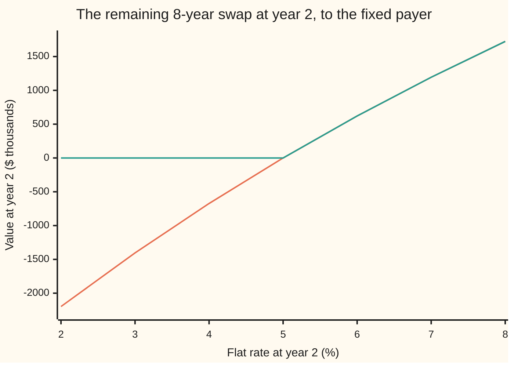

# Callable and cancellable swaps: a swap plus a Bermudan swaption

[Syllabus](../../../SYLLABUS.md) → [Financial mathematics](../README.md) → [Convexity and Exotics](../README.md#s32) → Callable and cancellable swaps

---

## General Overview

A company borrows $10 million for ten years at a floating rate: each year it pays whatever the one-year rate turned out to be. It wants a fixed bill, so it signs a ten-year swap with a bank. Every year the company pays the bank 5% of $10 million, and the bank pays the company the one-year rate, which the company passes on to its lender. The curve today is flat at 5%, so 5% is the fair fixed rate and the swap costs nothing to sign.

The company adds one clause. From the end of year 2, on any anniversary up to year 9, just after that year's payment, it may tear the swap up. No fee, no settlement: the remaining payments simply stop. If rates fall to 3%, paying 5% fixed hurts, and the company walks away. If rates rise, it keeps paying 5% while the market charges more.

A swap that one side may end early on listed dates is a **callable swap** when the fixed payer holds the right, the term used from here on. When the other side holds it, the same contract is called cancellable by the bank; the ICE instrument guide calls that version putable. Market usage wobbles, so the card always names who holds the right.

What is the clause worth? In the model below, **$452,750.81** today. Paid as a higher fixed rate instead of cash up front, it lifts the company's rate from 5% to **6.0988%**.

The whole idea in one sentence: **tearing up a swap on a date is the same as entering the exactly opposite swap on that date, so a callable swap is a plain swap plus the right to enter the opposite swap on any of the listed dates, which is a Bermudan swaption.**

**What kind of fact this is:** a theorem, the decomposition, proved on this card in Why it works; the dollar price comes from a model of how rates move, an assumption, not a law.

### The picture: what the right does on one date

Freeze the decision at year 2 and suppose the whole curve then sits flat at some rate. The remaining eight years of paying 5% are worth something to the company: negative if rates fell, positive if they rose. With the right, the company keeps the good side and cancels the bad side.



Orange: the remaining swap with no right, a gently bent line through zero at 5%. Teal: the same swap with the right used on the spot, floored at zero. The gap below zero on the left is what cancelling saves: $2,197.64 thousand if rates sit at 2%. That floor is an option payoff. The rest of the card prices it when it can be used on eight dates, not one.

---

## The formula

Notation first, in words. $N$ is the notional, the amount the rates are paid on. $K$ is the fixed rate. $D(t)$ is the discount factor, today's price of $1 paid in year t. A plus sign as a superscript, $x^+$, means "x if positive, else zero".

$$V_{\rm callable} = V_{\rm swap} + B_R \qquad\qquad V_{\rm cancellable\ by\ bank} = V_{\rm swap} - B_P$$

**Read it aloud:** the swap with the company's exit is the plain swap plus a receiver Bermudan swaption; the swap with the bank's exit is the plain swap minus a payer Bermudan swaption.

A **receiver swaption** is the right to enter a swap receiving the fixed rate; a **payer swaption** is the right to enter one paying it ([Swaptions](../29-Caps%2C%20Floors%20and%20Swaptions/04-swaptions-payer-and-receiver.md)). **Bermudan** means usable on any one of a list of dates ([Bermudan options](../15-American%20and%20Bermudan%20exercise/03-bermudan-options.md)). Here both are struck at the swap's own $K$ and each ends the swap at year 10.

The plain swap, to the fixed payer, from the curve alone:

$$V_{\rm swap} = N\,\bigl[\,1 - D(10) - K\,A\,\bigr], \qquad A = \sum_{t=1}^{10} D(t)$$

In words: the floating payments are worth $1 - D(10)$ per dollar of notional, the fixed payments are worth $K$ times the **annuity** $A$, the value of $1 a year for ten years ([The par swap rate](../28-Swaps/02-par-swap-rate-and-annuity.md)).

The option's value comes from rolling back on a rate tree. On a listed year $i$, at a tree node where the one-year rate is $r_i$:

$$B_i = \max\bigl(\,(-M_i)^+,\; W_i\,\bigr), \qquad W_i = \frac{\tfrac12\bigl(B_{i+1}^{\rm up} + B_{i+1}^{\rm down}\bigr)}{1 + r_i}$$

In words: at each node, cancel if what cancelling saves beats what waiting is worth. $M_i$ is the value of the swap's remaining payments at that node; $W_i$ is the discounted average of the option's value one year on.

| Symbol | Plain meaning | In our example | Push it up and the callable's value… |
| --- | --- | --- | --- |
| $N$ | notional: the amount the rates are paid on | $10 million | scales in proportion |
| $K$ | the fixed rate the company pays | 5% | falls: the swap costs more, though the exit gets more valuable |
| $D(t)$ | discount factor: today's price of $1 paid in year t | 1.05 to the power −t | — |
| $A$ | annuity: today's value of $1 a year for ten years | 7.7217 | — |
| $r_i$ | the one-year rate set at year i, paid at year i+1 | 3.24% to 7.21% at year 2 | — |
| $i$ | a year on the tree; the cancel dates are listed years | 2, 3, … 9 | — |
| $M_i$ | remaining swap: value at year i of payments i+1 to 10 | −$1,175,916.03 at the lowest year-2 node | — |
| $W_i$ | wait value: the option kept alive one more year | from the tree | — |
| $B_R$ | receiver Bermudan swaption: the company's exit | $452,750.81 | — |
| $B_P$ | payer Bermudan swaption: the bank's exit | $459,398.62 | — |
| $V_{\rm swap}$, $V_{\rm callable}$ | today's values to the fixed payer | $0.00 and $452,750.81 | — |
| $\sigma$ | volatility of the tree's rate, per year, on a log scale | 20% | rises: $21,460.70 per point |
| $\delta$ | a small rise in the fixed rate $K$, used in the break-even argument | — | — |

### When it holds

- **No fee and a clean date.** Cancelling just after a payment, with nothing owed on exit. A break fee lowers each exercise reward by the fee; notice given between payment dates leaves a stub period that the formula misses.
- **The option is struck at the swap's own rate.** The offsetting swap must pay exactly $K$. A swaption struck at the new market rate on the exercise date does not cancel the old payments and prices a different thing.
- **One curve prices and projects.** The floating rate is the same rate used to discount. With a separate projection curve, $1 - D(10)$ no longer values the floating leg ([Multi-curve](../28-Swaps/04-basis-swaps-and-the-multi-curve-framework.md)).
- **The rate model is right.** The decomposition holds in any model; the dollar price does not. A one-factor tree moves every rate together. Real curves twist, and the Bermudan's price depends on how the European options on each date hang together.
- **The holder exercises well.** $B_R$ assumes the best stopping rule. Cancelling by a simpler rule, such as "whenever the swap is underwater", is worth less: $306,871.10 here.

---

## Why it works

### Step 0: stopping a swap is entering its opposite

Suppose at year 4 the company cancels. Payments 5 to 10 vanish. Now suppose instead it keeps the swap and signs a new one for years 5 to 10, receiving 5% and paying floating. Every remaining payment on the new swap is the exact negative of one on the old. The two net to nothing, year by year, whatever rates do.

So the right to cancel on year 4 is the right, on year 4, to enter the opposite swap at the same fixed rate. The right to cancel on any of years 2 to 9 is the right to enter it on any one of them: a Bermudan receiver swaption. The swap and the option are separate pieces, and value adds up across separate pieces. That is the whole theorem. The steps below make each piece a number.

### Step 1: what the remaining swap is worth at a node

At a node in year $i$, the company still owes payments $i+1$ to 10. Each floating payment pays the one-year rate set a year earlier; call it $r_i$ for the payment due a year after year $i$. Paid a year later and discounted by that same rate, it is worth $r_i/(1+r_i) = 1 - 1/(1+r_i)$ per dollar at its start: a dollar now minus a dollar a year on. Chain the years and everything in the middle cancels. The floating leg is worth $1 - D_i(10)$, a dollar now minus a dollar at year 10, where $D_i(10)$ is the price at that node of $1 paid at year 10. The fixed leg is $K$ times the node's own annuity. Their difference is $M_i$.

At the lowest year-2 node the one-year rate is 3.24%, and the remaining eight years are worth −$1,175,916.03 to the company. Cancelling there saves that amount.

<details>
<summary>Detailed proof: the floating leg telescopes, and the decomposition holds on every path</summary>

**Floating leg.** Write $d_k = 1/(1+r_k)$ for the one-year discount set at year k. The floating payment at year k+1, discounted to year $i$, is $d_i d_{i+1} \cdots d_k \, r_k = d_i \cdots d_{k-1} - d_i \cdots d_k$, since $d_k r_k = 1 - d_k$. Sum over $k = i$ to 9: the terms telescope to $1 - d_i d_{i+1} \cdots d_9$. That holds on every path. Averaging over paths with the tree's pricing weights turns the product into $D_i(10)$.

**Decomposition.** Fix any stopping rule τ (tau): a rule that picks a listed year, or none, using only what is known by then. On a path where the company stops at τ, the cash it receives is the full swap's cash minus the payments after τ. Removing those payments is the same as adding the opposite swap's payments after τ, whose value at τ is $-M_\tau$. So the value of the cancelled contract under rule τ is $V_{\rm swap}$ plus the value of receiving $-M_\tau$ at τ. The holder chooses the best τ, and never stops where $-M_\tau$ is negative, since not stopping is also allowed. The largest value of receiving $(-M_\tau)^+$ over all rules is the Bermudan receiver's price, by definition. Hence $V_{\rm callable} = V_{\rm swap} + B_R$. When the bank holds the right it picks the rule that is worst for the company, reward $M_\tau^+$ taken away, giving $V_{\rm swap} - B_P$.

</details>

### Step 2: a tree for the one-year rate

The option's value depends on how rates can move. The card uses a **Black–Derman–Toy tree**: each year the one-year rate steps up or down, each with probability one half. These are pricing weights, not forecasts. The rate at year i, after j up-steps, equals $a_i e^{2\sigma j}$, a level fitted for that year times a factor for the node. Neighbouring nodes differ by the factor $e^{2\sigma}$, so the rate's log moves by $\sigma$ each way. Rates stay positive, and they swing more when they are high.

Each year's level is solved by bisection (halving an interval until it pins the root) so that the tree reprices today's ten discount factors, $D(1)$ to $D(10)$ on the flat 5% curve, exactly. A tree that did not match the curve would misprice the plain swap before any option entered. At year 2 the three nodes run from 3.24% at the bottom to 7.21% at the top.

### Step 3: roll the option back

Start at year 10, where nothing remains and the option is worth zero. Step back one year at a time. At each node, the wait value $W_i$ is the average of the two nodes one year on, discounted by the node's own rate. On a listed year, compare it with the saving from cancelling, $(-M_i)^+$, and keep the larger. On an unlisted year, keep the wait value. At year 0 the tree returns $B_R$ = $452,750.81. The same loop with $M_i^+$ as the reward returns $B_P$ = $459,398.62.

The comparison is the heart of it. A negative remaining swap does not force exercise. At a node where the swap is slightly underwater but rates could fall further, waiting keeps the right to cancel later at a bigger saving, and waiting wins.

### Step 4: bounds that any Bermudan must meet

Allowing only year 3 gives a European receiver swaption worth $362,494.53, the best single date. A menu containing year 3 can only be worth more, so the Bermudan is at least $362,494.53. It is also at most the sum of all eight Europeans, $1,945,844.36, since one exercise can never pay more than all eight exercises together. The Bermudan's $452,750.81 sits between, and nearer the bottom: the eight dates overlap heavily, and only one of them can be used.

### The other door

The option can also be priced by simulating many rate paths and learning the wait value by regression, which scales to models with many rate factors where a tree cannot follow the state. That route is [Bermudan swaptions](../31-Forward-Rate%20Models/06-bermudan-swaptions-by-regression.md).

---

## Worked numbers, by hand

Company pays 5% fixed on $10 million for ten years, curve flat at 5% with yearly compounding, tree volatility 20%, exit on years 2 to 9.

| Step | Arithmetic | Value |
| --- | --- | --- |
| floating leg per dollar | $1 - D(10) = 1 - 1.05^{-10}$ | 0.3861 |
| annuity | $A = 1.05^{-1} + \cdots + 1.05^{-10}$ | 7.7217 |
| fixed leg per dollar | $0.05 \times 7.7217$ | 0.3861 |
| plain swap | $10{,}000{,}000 \times (0.3861 - 0.3861)$ | $0.00 |
| receiver Bermudan, tree | Step 3 rolled back | $452,750.81 |
| **callable swap** | $0.00 + 452{,}750.81$ | **$452,750.81** |
| same, rolled as one contract | Road 2 below | $452,750.81 |
| same, over all 512 paths | Road 3 below | $452,750.81 |
| exit paid by a higher fixed rate | solve callable value = 0 for $K$ | **6.0988%** |

So the right to walk away is worth $452,750.81 today. A company that will not pay cash up front pays for it by paying 6.0988% fixed instead of 5% every year.

**Does the break-even rate exist, and is it unique?** Yes, on both sides. Under any cancel rule the company makes at least the payments of years 1 and 2, so raising $K$ by $\delta$ lowers the callable's value by at least $N\delta\,[D(1)+D(2)]$, whichever rule is best. The value therefore falls strictly and without limit as $K$ rises. At $K = 0$ it is positive: the company only receives. So exactly one $K$ gives zero, 6.0988%. The bank-cancellable version falls the same way, is positive at $K = 0$ and −$459,398.62 at 5%, and crosses zero once, at 4.0578%. Both checks confirm each root prices to zero.

### What breaks if you drop a piece

| Mistake | Comes out at | What went wrong |
| --- | --- | --- |
| Price only the first date, year 2 | $298,841.26 | A European swaption: seven later exits thrown away |
| Cancel whenever the swap is underwater | $306,871.10 | Ignores the wait value: exits early, before the bigger saving arrives |
| Charge the premium as premium ÷ annuity | pays 5.5863%, and the company still gains $202,491.34 | A higher fixed rate makes the exit itself more valuable; the true break-even is 6.0988% |
| Book the bank's exit as the company's | +$459,398.62 instead of −$459,398.62 | The sign belongs to whoever holds the right: the bank's exit is sold, so it subtracts |

Every number in these tables is printed by both programs below.

---

## Reading the option: when it gets used

A Bermudan price hides a plan. The rollback marks, at each node, whether cancelling beats waiting. On this tree the cancel nodes are always the lowest-rate nodes of their year: the company leaves when rates have fallen far enough.

| Year | European on this year alone | Cancel at tree rates up to | Chance of cancelling that year |
| --- | --- | --- | --- |
| 2 | $298,841.26 | 3.2393% | 0.2500 |
| 3 | $362,494.53 | 3.9011% | 0.2500 |
| 4 | $317,378.96 | 3.1558% | 0.0000 |
| 5 | $305,787.15 | 3.8164% | 0.0938 |
| 6 | $249,797.68 | 3.1003% | 0.0000 |
| 7 | $202,248.23 | 3.7655% | 0.0547 |
| 8 | $137,645.84 | 4.5834% | 0.0742 |
| 9 | $71,650.70 | 3.7478% | 0.0000 |

The chances are pricing probabilities from the tree, not forecasts. Three rows read zero because every path that reaches those cancel nodes has already passed through a cancel node a year earlier. The swap runs to year 10 with chance 0.2773. The boundary rates zigzag because the tree's nodes shift half a step from one year to the next; a finer tree smooths them.

The Europeans, one date each, against the Bermudan:

```
value of the exit, $ (one block = about $15,000)
 year 2 only  ████████████████████               $298,841.26
 year 3 only  ████████████████████████           $362,494.53
 year 4 only  █████████████████████              $317,378.96
 year 5 only  ████████████████████               $305,787.15
 year 6 only  █████████████████                  $249,797.68
 year 7 only  █████████████                      $202,248.23
 year 8 only  █████████                          $137,645.84
 year 9 only  █████                              $71,650.70
 any of 2-9   ██████████████████████████████     $452,750.81
```

Early dates have many years left to escape but little time for rates to fall; late dates have the reverse. Year 3 balances them best.

### How the price moves: the Greeks

Rate delta is the change in value when the whole curve rises by one **basis point**, one hundredth of a percent; vega is the change when $\sigma$ rises by one percentage point. Both are central differences: move the input up and down by the step, refit the tree each time, and halve the change in value.

| | Plain swap | Company's exit $B_R$ | Callable swap |
| --- | --- | --- | --- |
| Rate delta per basis point | +$7,721.74 | −$2,813.90 | +$4,907.83 |
| Vega per volatility point | none: the curve fixes it | +$21,460.70 | +$21,460.70 |

The plain swap's delta is about $N \times A \times 0.0001$ = $10 million × 7.7217 × 0.0001. The exit cuts the rate exposure by more than a third: as rates fall, the right to leave gains what the swap loses. That is **negative convexity** for whoever sold the right: the bank's hedge must be topped up as rates move, which is why the bank charges for it.

---

## Code, from first principles, and it actually runs

Both programs build the tree, fit it to the curve by their own bisection, and reach the callable value by three roads: (1) plain swap plus the receiver Bermudan, (2) the cancellable contract rolled back as one object with no option in sight, (3) all 512 rate paths through year 9, paying the actual coupons until the Bermudan's cancel rule fires. A fourth road prices the plain swap straight from the curve. They also solve the break-even rates, the Greeks, the Europeans and every what-breaks number. Eight asserts: the two decompositions, paths against rollback, tree against curve, the Bermudan's bounds, the naive exit rule losing value, and each break-even pricing to zero.

### Python

```python
# Callable swap = plain swap + Bermudan swaption -- the check behind the card.
# Standard library only: the tree, its fitting, the root finder and the path
# enumeration are all written out here.  Money in dollars, rates as decimals.
from math import exp

N, K0, Y, SIG, YEARS = 10_000_000.0, 0.05, 0.05, 0.20, 10
CALL = range(2, 10)                    # cancel just after the coupon of years 2..9

def bisect(f, lo, hi):                 # root of an increasing-or-decreasing f on [lo, hi]
    flo = f(lo)
    for _ in range(200):
        mid = 0.5 * (lo + hi)
        if (f(mid) > 0) == (flo > 0): lo = mid
        else: hi = mid
    return 0.5 * (lo + hi)

def tree(y, sig):
    # Black-Derman-Toy: one-year rate at year i, node j (j = up-moves so far) is a_i*exp(2*sig*j).
    # Each a_i is solved so the tree reprices the flat curve's zero bond (1+y)^-(i+1).
    R, Q = [], [1.0]                   # Q: today's price of $1 paid only at each node
    for i in range(YEARS):
        f = lambda a: sum(q / (1 + a * exp(2 * sig * j)) for j, q in enumerate(Q)) - (1 + y) ** -(i + 1)
        a = bisect(f, 1e-6, 1.0)
        R.append([a * exp(2 * sig * j) for j in range(i + 1)])
        nq = [0.0] * (i + 2)
        for j, q in enumerate(Q):
            nq[j] += 0.5 * q / (1 + R[i][j]); nq[j + 1] += 0.5 * q / (1 + R[i][j])
        Q = nq
    return R

def marks(R, K):                       # M[i][j]: value at (i, j), just after coupon i, of coupons i+1..10
    M = [[0.0] * (YEARS + 1)]
    for i in range(YEARS - 1, -1, -1):
        nx = M[0]
        M.insert(0, [(N * (R[i][j] - K) + 0.5 * (nx[j] + nx[j + 1])) / (1 + R[i][j]) for j in range(i + 1)])
    return M

def bermudan(R, M, sign, dates):       # right to enter the swap of sign*M: reward (sign*M)^+
    B, stop = [0.0] * (YEARS + 1), {}
    for i in range(YEARS - 1, -1, -1):
        new = []
        for j in range(i + 1):
            cont = 0.5 * (B[j] + B[j + 1]) / (1 + R[i][j])
            reward = max(sign * M[i][j], 0.0) if i in dates else 0.0
            stop[i, j] = reward > cont
            new.append(max(reward, cont))
        B = new
    return B[0], stop

def direct(R, K, side):                # road 2: roll the cancellable contract itself, no option in sight
    W = [0.0] * (YEARS + 1)
    for i in range(YEARS - 1, -1, -1):
        c = [(N * (R[i][j] - K) + 0.5 * (W[j] + W[j + 1])) / (1 + R[i][j]) for j in range(i + 1)]
        W = [(max(x, 0.0) if side > 0 else min(x, 0.0)) if i in CALL else x for x in c]
    return W[0]

def ledger(R, K, stop):                # road 3: all 512 rate paths, actual coupons paid until cancelled
    total, when = 0.0, [0.0] * (YEARS + 1)
    for bits in range(1 << 9):
        j, df, pv = 0, 1.0, 0.0
        for y in range(1, YEARS + 1):
            df /= 1 + R[y - 1][j]
            pv += N * (R[y - 1][j] - K) * df
            if y < YEARS: j += (bits >> (y - 1)) & 1
            if y in CALL and stop(y, j):
                when[y] += 1 / 512; break
        total += pv / 512
    return total, when

def closed_swap(y, K, n=YEARS):        # road 4: plain swap straight from a flat curve, no tree
    P = [(1 + y) ** -t for t in range(1, n + 1)]
    return N * (1 - P[-1] - K * sum(P))

def price(y, sig, K):
    R = tree(y, sig); M = marks(R, K)
    return R, M, M[0][0], bermudan(R, M, -1, CALL), bermudan(R, M, +1, CALL)

R, M, swap, (bR, stopR), (bP, stopP) = price(Y, SIG, K0)
holder, bank = direct(R, K0, +1), direct(R, K0, -1)
path_holder, when = ledger(R, K0, lambda y, j: stopR[y, j])
path_greedy, _ = ledger(R, K0, lambda y, j: M[y][j] < 0)
euro = [bermudan(R, M, -1, {e})[0] for e in CALL]
k_hold = bisect(lambda k: direct(tree(Y, SIG), k, +1), 0.05, 0.08)
k_bank = bisect(lambda k: direct(tree(Y, SIG), k, -1), 0.02, 0.05)
Rk = tree(Y, SIG)
def c2(x): return 0.0 if abs(x) < 0.005 else x          # print a zero that is zero to the cent as 0.00
up, dn = price(Y + 1e-4, SIG, K0), price(Y - 1e-4, SIG, K0)   # curve moved 1 basis point each way
d_swap, d_rec = (up[2] - dn[2]) / 2, (up[3][0] - dn[3][0]) / 2
vega = (price(Y, SIG + 0.01, K0)[3][0] - price(Y, SIG - 0.01, K0)[3][0]) / 2
ann = sum((1 + Y) ** -t for t in range(1, YEARS + 1))       # annuity: $1 a year for 10 years, today
k_naive = K0 + bR / (N * ann)                                # premium spread evenly over the annuity

rows = [
    ("tree rate year 0 %", 100 * R[0][0]), ("tree rate year 2, lowest node %", 100 * R[2][0]), ("tree rate year 2, highest node %", 100 * R[2][2]),
    ("curve: 1 - P(0,10)", 1 - (1 + Y) ** -YEARS), ("curve: annuity", ann),
    ("year 2 low node: remaining swap", M[2][0]),
    ("1 plain swap, tree", c2(swap)), ("1 plain swap, curve", c2(closed_swap(Y, K0))),
    ("1 receiver Bermudan B_R", bR), ("1 swap + B_R", swap + bR),
    ("2 callable, rolled directly", holder), ("3 callable, 512 paths", path_holder),
    ("1 payer Bermudan B_P", bP), ("1 swap - B_P", swap - bP), ("2 bank-cancellable, rolled", bank),
    ("max European (one date)", max(euro)), ("sum of Europeans", sum(euro)),
    ("wrong: European year 2 only", euro[0]), ("wrong: cancel when mark < 0", path_greedy),
    ("breakeven fixed, holder cancels %", 100 * k_hold), ("breakeven fixed, bank cancels %", 100 * k_bank),
    ("naive breakeven, premium / annuity %", 100 * k_naive), ("callable at naive breakeven", direct(Rk, k_naive, +1)),
    ("swap at holder breakeven, tree", marks(Rk, k_hold)[0][0]), ("swap at holder breakeven, curve", closed_swap(Y, k_hold)),
    ("rate delta per bp: swap", d_swap), ("rate delta per bp: B_R", d_rec), ("rate delta per bp: callable", d_swap + d_rec),
    ("vega per vol point: B_R = callable", vega),
]
for name, v in rows: print(f"{name:<36} {v:>16.4f}")
print("\nyear  European B_R  cancel at rates up to %  chance cancelled then")
for e, v in zip(CALL, euro):
    edge = max([R[e][j] for j in range(e + 1) if stopR[e, j]], default=0.0)
    print(f"{e:>4} {v:>14.2f} {100 * edge:>18.4f} {when[e]:>21.4f}")
print(f"never cancelled {1 - sum(when):.4f}")
print("\npayoff at year 2, $ thousands: flat rate %, remaining swap, with cancel right")
for yy in range(2, 9):
    m = c2(closed_swap(yy / 100, K0, 8) / 1000)
    print(f"{yy:>4} {m:>14.2f} {max(m, 0.0):>14.2f}")

assert abs(holder - (swap + bR)) < 1e-6 * N, "decomposition, holder side"
assert abs(bank - (swap - bP)) < 1e-6 * N, "decomposition, bank side"
assert abs(path_holder - holder) < 1e-6 * N, "path ledger vs rollback"
assert abs(marks(Rk, k_hold)[0][0] - closed_swap(Y, k_hold)) < 1e-4, "tree vs curve"
assert max(euro) <= bR <= sum(euro), "Bermudan between best European and all Europeans"
assert path_greedy < holder, "greedy exercise must lose value"
assert abs(direct(Rk, k_hold, +1)) < 1e-2, "holder break-even is a root"
assert abs(direct(Rk, k_bank, -1)) < 1e-2, "bank break-even is a root"
print("all checks passed")
```

**Ran 2026-09-28 on macOS, Python 3.14.6, standard library only. All checks passed. Output, pasted from the run:**

```
tree rate year 0 %                             5.0000
tree rate year 2, lowest node %                3.2393
tree rate year 2, highest node %               7.2092
curve: 1 - P(0,10)                             0.3861
curve: annuity                                 7.7217
year 2 low node: remaining swap         -1175916.0336
1 plain swap, tree                             0.0000
1 plain swap, curve                            0.0000
1 receiver Bermudan B_R                   452750.8075
1 swap + B_R                              452750.8075
2 callable, rolled directly               452750.8075
3 callable, 512 paths                     452750.8075
1 payer Bermudan B_P                      459398.6206
1 swap - B_P                             -459398.6206
2 bank-cancellable, rolled               -459398.6206
max European (one date)                   362494.5301
sum of Europeans                         1945844.3559
wrong: European year 2 only               298841.2642
wrong: cancel when mark < 0               306871.0999
breakeven fixed, holder cancels %              6.0988
breakeven fixed, bank cancels %                4.0578
naive breakeven, premium / annuity %           5.5863
callable at naive breakeven               202491.3412
swap at holder breakeven, tree           -848490.6674
swap at holder breakeven, curve          -848490.6674
rate delta per bp: swap                     7721.7363
rate delta per bp: B_R                     -2813.9019
rate delta per bp: callable                 4907.8344
vega per vol point: B_R = callable         21460.7036

year  European B_R  cancel at rates up to %  chance cancelled then
   2      298841.26             3.2393                0.2500
   3      362494.53             3.9011                0.2500
   4      317378.96             3.1558                0.0000
   5      305787.15             3.8164                0.0938
   6      249797.68             3.1003                0.0000
   7      202248.23             3.7655                0.0547
   8      137645.84             4.5834                0.0742
   9       71650.70             3.7478                0.0000
never cancelled 0.2773

payoff at year 2, $ thousands: flat rate %, remaining swap, with cancel right
   2       -2197.64           0.00
   3       -1403.94           0.00
   4        -673.27           0.00
   5           0.00           0.00
   6         620.98         620.98
   7        1194.26        1194.26
   8        1723.99        1723.99
all checks passed
```

### Rust

```rust
// Callable swap = plain swap + Bermudan swaption -- the check behind the card.
// Rust std only: the tree, its fitting, the root finder and the path
// enumeration are all written out here.  Money in dollars, rates as decimals.
const N: f64 = 10_000_000.0;
const K0: f64 = 0.05;
const Y: f64 = 0.05;
const SIG: f64 = 0.20;
const YEARS: usize = 10;
fn is_call(i: usize) -> bool { (2..10).contains(&i) } // cancel just after the coupon of years 2..9

fn bisect(f: &dyn Fn(f64) -> f64, mut lo: f64, mut hi: f64) -> f64 {
    let flo = f(lo);
    for _ in 0..200 {
        let mid = 0.5 * (lo + hi);
        if (f(mid) > 0.0) == (flo > 0.0) { lo = mid } else { hi = mid }
    }
    0.5 * (lo + hi)
}

// Black-Derman-Toy: one-year rate at year i, node j is a_i*exp(2*sig*j); a_i reprices (1+y)^-(i+1).
fn tree(y: f64, sig: f64) -> Vec<Vec<f64>> {
    let (mut r, mut q): (Vec<Vec<f64>>, Vec<f64>) = (vec![], vec![1.0]);
    for i in 0..YEARS {
        let target = (1.0 + y).powf(-((i + 1) as f64));
        let qc = q.clone();
        let f = move |a: f64| qc.iter().enumerate().map(|(j, x)| x / (1.0 + a * (2.0 * sig * j as f64).exp())).sum::<f64>() - target;
        let a = bisect(&f, 1e-6, 1.0);
        r.push((0..=i).map(|j| a * (2.0 * sig * j as f64).exp()).collect());
        let mut nq = vec![0.0; i + 2];
        for (j, x) in q.iter().enumerate() {
            nq[j] += 0.5 * x / (1.0 + r[i][j]);
            nq[j + 1] += 0.5 * x / (1.0 + r[i][j]);
        }
        q = nq;
    }
    r
}

fn marks(r: &[Vec<f64>], k: f64) -> Vec<Vec<f64>> {
    let mut m = vec![vec![0.0; YEARS + 1]; YEARS + 1];
    for i in (0..YEARS).rev() {
        m[i] = (0..=i).map(|j| (N * (r[i][j] - k) + 0.5 * (m[i + 1][j] + m[i + 1][j + 1])) / (1.0 + r[i][j])).collect();
    }
    m
}

fn bermudan(r: &[Vec<f64>], m: &[Vec<f64>], sign: f64, dates: &dyn Fn(usize) -> bool) -> (f64, Vec<Vec<bool>>) {
    let mut b = vec![0.0; YEARS + 1];
    let mut stop = vec![vec![false; YEARS + 1]; YEARS + 1];
    for i in (0..YEARS).rev() {
        let mut new = vec![];
        for j in 0..=i {
            let cont = 0.5 * (b[j] + b[j + 1]) / (1.0 + r[i][j]);
            let reward = if dates(i) { (sign * m[i][j]).max(0.0) } else { 0.0 };
            stop[i][j] = reward > cont;
            new.push(reward.max(cont));
        }
        b = new;
    }
    (b[0], stop)
}

fn direct(r: &[Vec<f64>], k: f64, side: f64) -> f64 {
    let mut w = vec![0.0; YEARS + 1];
    for i in (0..YEARS).rev() {
        w = (0..=i).map(|j| {
            let x = (N * (r[i][j] - k) + 0.5 * (w[j] + w[j + 1])) / (1.0 + r[i][j]);
            if !is_call(i) { x } else if side > 0.0 { x.max(0.0) } else { x.min(0.0) }
        }).collect();
    }
    w[0]
}

fn ledger(r: &[Vec<f64>], k: f64, stop: &dyn Fn(usize, usize) -> bool) -> (f64, Vec<f64>) {
    let (mut total, mut when) = (0.0, vec![0.0; YEARS + 1]);
    for bits in 0..(1usize << 9) {
        let (mut j, mut df, mut pv) = (0usize, 1.0, 0.0);
        for y in 1..=YEARS {
            df /= 1.0 + r[y - 1][j];
            pv += N * (r[y - 1][j] - k) * df;
            if y < YEARS { j += (bits >> (y - 1)) & 1; }
            if is_call(y) && stop(y, j) { when[y] += 1.0 / 512.0; break; }
        }
        total += pv / 512.0;
    }
    (total, when)
}

fn closed_swap(y: f64, k: f64, n: usize) -> f64 {
    let p: Vec<f64> = (1..=n).map(|t| (1.0 + y).powf(-(t as f64))).collect();
    N * (1.0 - p[n - 1] - k * p.iter().sum::<f64>())
}

fn c2(x: f64) -> f64 { if x.abs() < 0.005 { 0.0 } else { x } }

fn price(y: f64, sig: f64, k: f64) -> (Vec<Vec<f64>>, Vec<Vec<f64>>, f64, (f64, Vec<Vec<bool>>), (f64, Vec<Vec<bool>>)) {
    let r = tree(y, sig);
    let m = marks(&r, k);
    let (br, bp) = (bermudan(&r, &m, -1.0, &is_call), bermudan(&r, &m, 1.0, &is_call));
    let s = m[0][0];
    (r, m, s, br, bp)
}

fn main() {
    let (r, m, swap, (b_r, stop_r), (b_p, _)) = price(Y, SIG, K0);
    let (holder, bank) = (direct(&r, K0, 1.0), direct(&r, K0, -1.0));
    let (path_holder, when) = ledger(&r, K0, &|y, j| stop_r[y][j]);
    let (path_greedy, _) = ledger(&r, K0, &|y, j| m[y][j] < 0.0);
    let euro: Vec<f64> = (2..10).map(|e| bermudan(&r, &m, -1.0, &move |i| i == e).0).collect();
    let k_hold = bisect(&|k| direct(&tree(Y, SIG), k, 1.0), 0.05, 0.08);
    let k_bank = bisect(&|k| direct(&tree(Y, SIG), k, -1.0), 0.02, 0.05);
    let rk = tree(Y, SIG);
    let (up, dn) = (price(Y + 1e-4, SIG, K0), price(Y - 1e-4, SIG, K0));
    let (d_swap, d_rec) = ((up.2 - dn.2) / 2.0, ((up.3).0 - (dn.3).0) / 2.0);
    let vega = ((price(Y, SIG + 0.01, K0).3).0 - (price(Y, SIG - 0.01, K0).3).0) / 2.0;
    let ann: f64 = (1..=YEARS).map(|t| (1.0 + Y).powf(-(t as f64))).sum(); // $1 a year for 10 years, today
    let k_naive = K0 + b_r / (N * ann); // premium spread evenly over the annuity
    let emax = euro.iter().cloned().fold(f64::MIN, f64::max);
    let esum: f64 = euro.iter().sum();
    let swap_k = marks(&rk, k_hold)[0][0];
    let rows: Vec<(&str, f64)> = vec![
        ("tree rate year 0 %", 100.0 * r[0][0]), ("tree rate year 2, lowest node %", 100.0 * r[2][0]), ("tree rate year 2, highest node %", 100.0 * r[2][2]),
        ("curve: 1 - P(0,10)", 1.0 - (1.0 + Y).powf(-(YEARS as f64))), ("curve: annuity", ann),
        ("year 2 low node: remaining swap", m[2][0]),
        ("1 plain swap, tree", c2(swap)), ("1 plain swap, curve", c2(closed_swap(Y, K0, YEARS))),
        ("1 receiver Bermudan B_R", b_r), ("1 swap + B_R", swap + b_r),
        ("2 callable, rolled directly", holder), ("3 callable, 512 paths", path_holder),
        ("1 payer Bermudan B_P", b_p), ("1 swap - B_P", swap - b_p), ("2 bank-cancellable, rolled", bank),
        ("max European (one date)", emax), ("sum of Europeans", esum),
        ("wrong: European year 2 only", euro[0]), ("wrong: cancel when mark < 0", path_greedy),
        ("breakeven fixed, holder cancels %", 100.0 * k_hold), ("breakeven fixed, bank cancels %", 100.0 * k_bank),
        ("naive breakeven, premium / annuity %", 100.0 * k_naive), ("callable at naive breakeven", direct(&rk, k_naive, 1.0)),
        ("swap at holder breakeven, tree", swap_k), ("swap at holder breakeven, curve", closed_swap(Y, k_hold, YEARS)),
        ("rate delta per bp: swap", d_swap), ("rate delta per bp: B_R", d_rec), ("rate delta per bp: callable", d_swap + d_rec),
        ("vega per vol point: B_R = callable", vega),
    ];
    for (name, v) in &rows { println!("{:<36} {:>16.4}", name, v); }
    println!("\nyear  European B_R  cancel at rates up to %  chance cancelled then");
    for (idx, e) in (2..10).enumerate() {
        let edge = (0..=e).filter(|&j| stop_r[e][j]).map(|j| r[e][j]).fold(0.0, f64::max);
        println!("{:>4} {:>14.2} {:>18.4} {:>21.4}", e, euro[idx], 100.0 * edge, when[e]);
    }
    println!("never cancelled {:.4}", 1.0 - when.iter().sum::<f64>());
    println!("\npayoff at year 2, $ thousands: flat rate %, remaining swap, with cancel right");
    for yy in 2..9 {
        let mm = c2(closed_swap(yy as f64 / 100.0, K0, 8) / 1000.0);
        println!("{:>4} {:>14.2} {:>14.2}", yy, mm, mm.max(0.0));
    }
    assert!((holder - (swap + b_r)).abs() < 1e-6 * N, "decomposition, holder side");
    assert!((bank - (swap - b_p)).abs() < 1e-6 * N, "decomposition, bank side");
    assert!((path_holder - holder).abs() < 1e-6 * N, "path ledger vs rollback");
    assert!((swap_k - closed_swap(Y, k_hold, YEARS)).abs() < 1e-4, "tree vs curve");
    assert!(emax <= b_r && b_r <= esum, "Bermudan between best European and all Europeans");
    assert!(path_greedy < holder, "greedy exercise must lose value");
    assert!(direct(&rk, k_hold, 1.0).abs() < 1e-2, "holder break-even is a root");
    assert!(direct(&rk, k_bank, -1.0).abs() < 1e-2, "bank break-even is a root");
    println!("all checks passed");
}
```

**Ran 2026-09-28 on macOS, rustc 1.98.1, no crates. All checks passed. Output, pasted from the run:**

```
tree rate year 0 %                             5.0000
tree rate year 2, lowest node %                3.2393
tree rate year 2, highest node %               7.2092
curve: 1 - P(0,10)                             0.3861
curve: annuity                                 7.7217
year 2 low node: remaining swap         -1175916.0336
1 plain swap, tree                             0.0000
1 plain swap, curve                            0.0000
1 receiver Bermudan B_R                   452750.8075
1 swap + B_R                              452750.8075
2 callable, rolled directly               452750.8075
3 callable, 512 paths                     452750.8075
1 payer Bermudan B_P                      459398.6206
1 swap - B_P                             -459398.6206
2 bank-cancellable, rolled               -459398.6206
max European (one date)                   362494.5301
sum of Europeans                         1945844.3559
wrong: European year 2 only               298841.2642
wrong: cancel when mark < 0               306871.0999
breakeven fixed, holder cancels %              6.0988
breakeven fixed, bank cancels %                4.0578
naive breakeven, premium / annuity %           5.5863
callable at naive breakeven               202491.3412
swap at holder breakeven, tree           -848490.6674
swap at holder breakeven, curve          -848490.6674
rate delta per bp: swap                     7721.7363
rate delta per bp: B_R                     -2813.9019
rate delta per bp: callable                 4907.8344
vega per vol point: B_R = callable         21460.7036

year  European B_R  cancel at rates up to %  chance cancelled then
   2      298841.26             3.2393                0.2500
   3      362494.53             3.9011                0.2500
   4      317378.96             3.1558                0.0000
   5      305787.15             3.8164                0.0938
   6      249797.68             3.1003                0.0000
   7      202248.23             3.7655                0.0547
   8      137645.84             4.5834                0.0742
   9       71650.70             3.7478                0.0000
never cancelled 0.2773

payoff at year 2, $ thousands: flat rate %, remaining swap, with cancel right
   2       -2197.64           0.00
   3       -1403.94           0.00
   4        -673.27           0.00
   5           0.00           0.00
   6         620.98         620.98
   7        1194.26        1194.26
   8        1723.99        1723.99
all checks passed
```

The two outputs agree byte for byte.

> [!TIP]
> **Try changing**
> Guess the direction first, then run it.
> - **Allow one date only.** Set `CALL = range(2, 3)` in Python, or `2..3` in `is_call` in Rust. The callable falls to **$298,841.26**, the year-2 European. The table of Europeans shows year 3 alone would do better, **$362,494.53**.
> - **Hand the right to the bank.** Read the `bank-cancellable` row: **−$459,398.62**. The bank's exit is worth slightly more than the company's, because a payer swaption gains from rates rising and this tree's rates swing more when high. The company can charge for it by paying only **4.0578%** fixed.
> - **Raise the volatility.** Set `SIG = 0.21`. The exit rises by roughly the vega row, **$21,460.70**. Volatility is the input a desk argues about; the curve is not.
> - **Pay the break-even rate.** Set `K0 = 0.060988`. The callable rows fall to almost nothing, because 0.060988 is the break-even rounded. The plain swap at the exact break-even reads **−$848,490.67** by both tree and curve: the higher coupon pays for the exit.

---

## The usual mistake

> [!warning]
> **Calling a swap "callable" without naming who holds the right.** The same words describe two contracts with opposite signs. With the company's exit the contract is worth +$452,750.81 to the company; with the bank's exit it is worth −$459,398.62. Booking one as the other gets the size and the sign wrong at once. Name the holder, then the sign follows: the holder adds the option, the other side subtracts it.
>
> Smaller traps:
> - **Pricing the exit as the best European.** $362,494.53 misses a fifth of the value. A Bermudan is worth more than any one date, and less than all of them together.
> - **Exercising whenever the swap is underwater.** The rule looks sensible and gives $306,871.10, a third below the best rule. Waiting has value until the saving is large enough.
> - **Turning the premium into a rate by dividing by the annuity.** That gives 5.5863%. But raising the fixed rate makes the exit richer, so the true break-even is 6.0988%. The break-even is a root to solve, not a division.
> - **Striking the offsetting swaption at the new market rate.** Cancelling needs a swaption at the old rate, $K$. One struck at the market rate on the day leaves the difference running for the rest of the swap.

---

## Where you meet it in real life

- **Callable bonds.** A company issues a 10-year bond it may repay from year 2 and swaps it to floating, receiving fixed. When rates fall it will call the bond, so it wants the swap to end then too. It sells the bank the right to cancel: the bank pays fixed and holds exactly this card's receiver Bermudan. The issuer's call on its bond and the bank's exit from the swap are one option seen from two sides, and this is where most Bermudan swaption volume comes from.
- **Borrowers buying flexibility.** A borrower who may repay a loan early buys a callable swap so the hedge can end with the loan. It pays through a higher fixed rate, as in the 6.0988% here.
- **Lower rate for giving up the exit.** The ICE instrument guide describes a borrower accepting a lower fixed rate by letting the other side cancel after year 3: the 4.0578% of this card's Try-changing box, on different numbers.
- **Structured notes.** A callable note is a bond with this option inside, and the dealer hedges it with a callable swap: [Structured rate notes](06-structured-notes-in-outline.md).
- **Desk risk.** Callable swap books carry the vega and negative convexity of the Greeks table. Hedging them is what sets the price of long-dated swaption volatility.

Conventions verified 28 Sep 2026 against the ICE guide: callable when the fixed payer holds the right (swap plus receiver swaption), putable when the fixed receiver does (swap plus payer swaption). ICE uses "cancelable" for the one-date (European) version; elsewhere "cancellable" is used loosely for either side.

> **Say it back**
> A callable swap is a swap that the fixed payer may end on listed dates. Ending a swap is the same as entering its exact opposite, so the contract is a plain swap plus a Bermudan receiver swaption at the swap's own rate. The option is priced by rolling back on a rate tree fitted to today's curve, comparing on each date what cancelling saves with what waiting is worth. Here the exit is worth $452,750.81, or 6.0988% fixed instead of 5%. When the other side holds the right, the option is subtracted instead.

---

## What this builds on

- [Constant-maturity swaps](02-cms-and-the-convexity-adjustment.md): the shelf's other way of adding optionality to a swap, where the rate paid, not the end date, carries the option.
- [Bermudan swaptions](../31-Forward-Rate%20Models/06-bermudan-swaptions-by-regression.md): the Bermudan swaption on its own, priced by simulation and regression; this card prices the same object on a tree and puts it inside a swap.

## Where this goes next

- [Structured rate notes](06-structured-notes-in-outline.md): notes that bundle a callable swap with other rate options, sold to investors as one bond.

The decomposition leaves open how a dealer packages this option, and others, into a single note an investor buys; that is where the shelf goes next.

---

## Sources

Verified 28 Sep 2026: every link below resolves to the publisher's page.

- ICE Data Derivatives. "Callable Swap." Instrument guide. [idd.ice.com](https://idd.ice.com/IRHelp/Content/FM/Callable_Swap.htm). The naming conventions, the swap-plus-swaption decomposition, and the break-even rate.
- Black, Fischer, Emanuel Derman, and William Toy. "A One-Factor Model of Interest Rates and Its Application to Treasury Bond Options." *Financial Analysts Journal* 46, no. 1 (1990): 33–39. [doi:10.2469/faj.v46.n1.33](https://doi.org/10.2469/faj.v46.n1.33). The tree used here, fitted to the curve level by level.
- Brigo, Damiano, and Fabio Mercurio. *Interest Rate Models: Theory and Practice*, 2nd ed. Springer, 2006. [doi:10.1007/978-3-540-34604-3](https://doi.org/10.1007/978-3-540-34604-3). Bermudan swaptions and short-rate trees in full.
- Hull, John C. *Options, Futures, and Other Derivatives*, 11th ed. Pearson. [Publisher page](https://www.pearson.com/en-us/subject-catalog/p/options-futures-and-other-derivatives/P200000005938). Swaps, swaptions and interest-rate trees at textbook pace.
- Longstaff, Francis A., and Eduardo S. Schwartz. "Valuing American Options by Simulation: A Simple Least-Squares Approach." *Review of Financial Studies* 14, no. 1 (2001): 113–147. [doi:10.1093/rfs/14.1.113](https://doi.org/10.1093/rfs/14.1.113). The regression route named in The other door.
