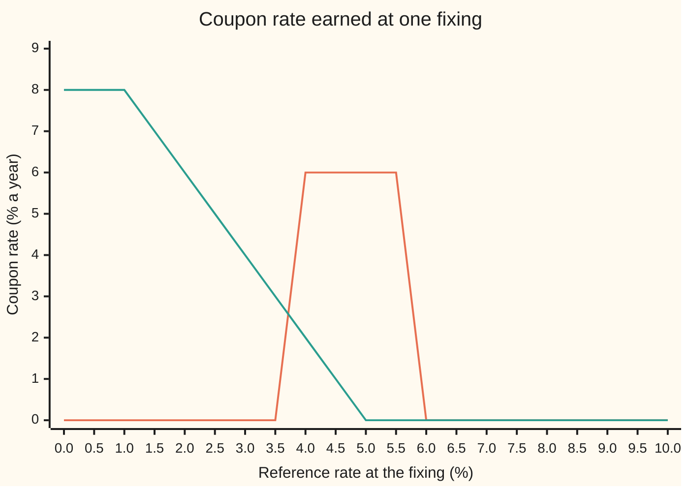
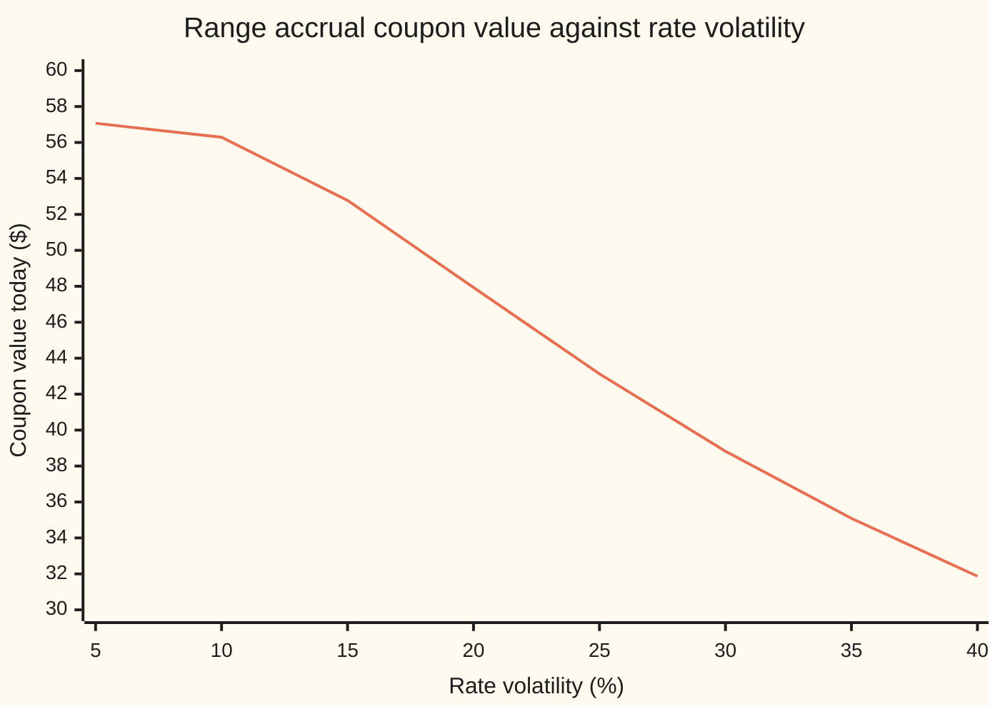

# Structured rate notes: range accruals, inverse floaters and target redemption, in outline

[Syllabus](../../../SYLLABUS.md) → [Financial mathematics](../README.md) → [Convexity and Exotics](../README.md#s32) → Structured rate notes

---

## General Overview

A bank sells a one-year note with a face of $1,000. The term sheet promises a coupon of 6 percent a year, well above what plain deposits pay. The catch is in one line: the coupon accrues only while a reference interest rate sits between 4 percent and 6 percent. The rate is read once a month, twelve times. Each month inside the band earns one twelfth of the $60. Each month outside earns nothing. The coupon is paid at year end, with the $1,000.

Today the market's forward rate for that reference, the rate it prices in for future fixings, is 5 percent: dead centre of the band. A buyer who reasons from the forward expects the full $60, worth $57.07 today after a year's discount at 5 percent. The note is worth less. The rate wanders, and every month it spends outside the band costs $5. Priced properly, the coupon is worth **$47.93**. The missing $9.14 is what the buyer gave up, and it is what the bank earned for writing the note.

This product is a **range accrual**: "range" for the band, "accrual" because the coupon builds up fixing by fixing. It belongs to the **structured notes**, bonds whose coupon is a formula in a market rate. This card takes three members of the family: the range accrual, the **inverse floater** (a coupon that falls as rates rise) and the **target redemption note** (a note that repays early once its coupons reach a target). Each one splits into pieces that already have prices: digital options (a fixed sum if a rate crosses a level), caps and floors (options paying when a rate ends above or below a strike), and an exercise right of the kind a **Bermudan** option carries (a right usable on a list of set dates).

**Write the coupon as a sum of standard payoffs, one fixing and one date at a time, price each piece, and add; where the coupon depends on the path so far, carry the path in a tree and price backwards.**

**What kind of fact this is:** a method. The splitting of each coupon is an exact identity, proved on this card in Why it works; the prices then rest on a model of the rate, which is an assumption, not a law.

### The picture: what each coupon pays against the rate

The reference rate at a fixing runs left to right, in percent. The coupon rate it earns for that fixing runs up and down.



Orange: the range accrual, 6 percent from 4 percent up to (not including) 6 percent, zero elsewhere. The chart joins points with lines, so the true jumps at 4 and 6 appear as short slopes. Green: the inverse floater of this card, 10 percent minus twice the rate, never below zero and never above 8 percent. Both payoffs bend or jump, which is why the forward rate alone cannot price them.

---

## The formula

For the range accrual:

$$V = M\,c\,D(1)\,\frac{1}{n}\sum_{j=1}^{n}\Big[\,N\big(d(a,t_j)\big) - N\big(d(b,t_j)\big)\Big], \qquad d(K,t) = \frac{\ln(F/K) - \tfrac12\sigma^2 t}{\sigma\sqrt{t}}$$

**Read it aloud:** "Each fixing is a bet that the rate lands at or above the bottom of the band, minus a bet that it lands at or above the top; price both bets with the bell curve, average over the fixings, scale by the full coupon and discount to today."

For the inverse floater, the coupon rate $g(L)$ splits two ways:

$$g(L) = \min\big(8\%,\ \max(0,\ 10\% - 2L)\big) = 2\big[(K_0 - L)^+ - (K_c - L)^+\big] = 8\% + 2(L - K_0)^+ - 2(L - K_c)^+$$

with $K_0 = 5\%$ and $K_c = 1\%$. The notation $x^+$ means $\max(x, 0)$.

For the target redemption note, the coupon paid at date $i$ and the running total are

$$C_i = \min\big(\text{raw coupon}_i,\ G - A_{i-1}\big), \qquad A_i = A_{i-1} + C_i,$$

and the note repays its face the day $A_i$ reaches $G$. When the issuer may call, the note's value just after a coupon is $\min(R_i, \text{value of staying alive})$.

| Symbol | Plain meaning | In our example | Push it up and the value… |
| --- | --- | --- | --- |
| $V$ | value today of the coupon leg | $47.93 (range), $7.21 (inverse) | |
| $M$ | the note's face amount | $1,000 | scales every coupon |
| $c$ | coupon rate earned while the fixing is in the band | 6% a year | rises in proportion |
| $a$, $b$ | bottom and top of the band; in band means $a \le L < b$ | 4%, 6% | a wider band raises it |
| $L$, $L_j$, $W$ | the reference rate; its value at fixing $j$; the bell-curve draw that moves it | forward 5% | range: either way hurts; inverse: falls |
| $n$, $j$, $t_j$, $t$ | number of fixings, which fixing, its time in years | 12, monthly, $t_j = j/12$ | more distant fixings are less sure to land in band |
| $F$ | forward rate: the level priced in for each fixing | 5% | range: barely moves at mid-band; inverse: falls |
| $\sigma$ | rate volatility, the yearly jumpiness of the log of the rate | 20% | range falls; inverse rises |
| $D(T)$, $T$, $r$ | discount factor for money due at year $T$; the rate behind it, $D(T) = e^{-rT}$ | 0.951229, 0.904837; 5% | falls |
| $N(x)$, $d(K,t)$, $K$ | bell-curve area left of $x$; the cut-off for "fixing at $t$ is at or above the level $K$" | $N(d(4\%,1)) = 0.845118$ | |
| $g(L)$, $K_0$, $K_c$ | inverse coupon rate; where it hits zero; where it hits its 8% ceiling | 5%, 1% | |
| $G$, $A_i$, $C_i$, $R_i$, $U_i$, $J_i$, $i$ | target; coupons paid so far; coupon paid at date $i$; issuer's call price; value before the coupon; value of staying alive after it | $50, $30 per hit, $980 then $985 | a higher call price helps the holder |

The cut-off $d(K,t)$ in words: the numerator is how far the forward sits above the level $K$ in log terms, less the small drag that makes the average of the rate land on $F$; the denominator is how far the log of the rate spreads by time $t$. So $N(d(K,t))$ is the priced-in chance that the fixing at $t$ is at or above $K$.

### When it holds

- **Each fixing is lognormal around the forward, under the payment date's pricing law** (the probability weights that, averaged and discounted, give prices for money paid on that date). Real rate smiles make out-of-band digitals dearer or cheaper than a flat 20% says; the error per digital is the skew term on [A digital from a call spread](../10-Digitals%20and%20the%20implied%20density/04-digital-from-a-call-spread-and-the-skew-term.md). A lognormal rate also cannot go negative, which some markets have.
- **Every fixing is paid on one date with one discount.** A range accrual observed monthly but paid at year end is priced here as though each fixing were a fair forward for that payment date. The small correction is a timing adjustment, the subject of [Timing adjustments](03-timing-and-in-arrears-adjustments.md).
- **The issuer does not default.** A structured note is the issuer's debt. A credit spread lowers every price on this card.
- **The target note's coin is a teaching model.** Each half-year the rate is in band with chance one half, independently. A real target note needs a model of the whole rate path, and its value moves with correlation between fixings.
- **Contract terms as written.** Band endpoints, which days count and whether the last target coupon is clipped are fixed by each note's term sheet, not by market convention.

---

## Why it works

### Step 0: a price is linear in the cash flows

The value today of a payment due on a date is its average under the pricing law for that date, times the discount factor. An average of a sum is the sum of the averages. So if a coupon is, fixing by fixing and dollar by dollar, a sum of simpler payments on the same date, its value is the sum of their values. No independence between fixings is needed. That is the whole engine of decomposition.

### Step 1: a band is two digitals

A **digital** (a contract paying a fixed sum if a level is reached, nothing otherwise) is priced on [Cash-or-nothing digital](../10-Digitals%20and%20the%20implied%20density/01-cash-or-nothing-digital.md). For any rate $L$:

$$[\,a \le L < b\,] = [\,L \ge a\,] - [\,L \ge b\,].$$

The square brackets are switches: 1 if true, 0 if not. Check the three cases. Below $a$: both switches off, 0 − 0 = 0. In the band: the first on, the second off, 1. At or above $b$: both on, 1 − 1 = 0. The equality holds for every value of the rate, including the endpoints, because the band was defined to include $a$ and exclude $b$.

So each month's coupon, $1,000 × 6% ÷ 12 = $5, is a long digital at 4% and a short digital at 6%, each paying $5 at year end.

### Step 2: price each digital, then add

Under the payment-date law the fixing at time $t$ is $L = F\,e^{\sigma W - \frac12\sigma^2 t}$, where $W$ is a bell-curve draw with spread $\sqrt t$. The fixing is at or above $K$ exactly when that draw is above a line, and the chance of that is $N(d(K,t))$. Discount by $D(1)$ because every coupon is paid at year end. Add over twelve months:

- the twelve long digitals at 4% are worth $52.86;
- the twelve short digitals at 6% are worth $4.93;
- the coupon is the difference, $47.93.

Month 1 is almost sure to land in band, with chance 0.999218; month 12 has only 0.689255. The year's average, 0.839800, times the $57.07 of a sure coupon, is the price.

### Step 3: the inverse floater is a floor spread

Take the coupon rate $g(L) = \min(8\%, \max(0, 10\% - 2L))$ and check it region by region against $2[(5\% - L)^+ - (1\% - L)^+]$:

- $L \ge 5\%$: both floor terms are zero, and $10\% - 2L \le 0$, so both sides are 0.
- $1\% < L < 5\%$: only the first term is live, giving $2(5\% - L) = 10\% - 2L$, which lies between 0 and 8%.
- $L \le 1\%$: both live, and the difference is $2(5\% - 1\%) = 8\%$, the ceiling.

Each $(K - L)^+$ is a **floorlet** (a single-date option paying when the rate is below $K$). So the inverse floater is two floorlets struck at 5%, less two struck at 1%. Replace each $(K - L)^+$ by $(K - L) + (L - K)^+$ and the constants collect into $2(5\% - 1\%) = 8\%$: the same coupon is a fixed 8% plus two **caplets** at 5%, less two caplets at 1% (a caplet pays when the rate is above its strike). The two readings are one cash flow described twice, not two things to add. Caps and floors, and the parity that links them, are on [Caps and floors](../29-Caps%2C%20Floors%20and%20Swaptions/02-caps-floors-and-parity.md).

The caplet and floorlet prices come from the same lognormal fixing: $E[(L-K)^+] = F N(d+\sigma) - K N(d)$ and $E[(K-L)^+] = K N(-d) - F N(-d-\sigma)$ with $d = d(K,1)$, a fixing at year 1 paid at year 2.

### Step 4: a target breaks the static split

A target redemption note pays a raw coupon, here $30 each half-year the rate is in band. It stops once the coupons paid reach the target, here $50. The coupon that would overshoot is clipped to what is left, and the face is repaid the same day. So $C_i = \min(\text{raw coupon}_i, G - A_{i-1})$ depends on $A_{i-1}$, the coupons already paid. That is a fact about the path, not about one fixing. The raw coupon still splits into digitals, but each piece is multiplied by a switch that depends on history, and no fixed list of stand-alone digitals reproduces it.

The fix is to carry the history. Build a tree whose nodes record both the rate state and the coupons earned so far. At the last date the note pays its coupon and face. At each earlier node, the value is the coupon plus the discounted average of the next nodes. On a coin with discount 0.98 a period, that gives $980.93: $34.94 of coupons and $945.99 of principal. Two of the eight coin paths (hit, hit) reach the target at date 2 and return the face a period early.

### Step 5: an issuer call is a Bermudan right, priced backwards

Many notes let the issuer repay early at a set price $R_i$ on listed dates. The issuer holds the right, so the issuer uses it when repaying is cheaper than carrying on. Just after each coupon, the holder's note is worth $\min(R_i, \text{value of staying alive})$. This is the same backward comparison as on [Callable and cancellable swaps](05-callable-and-cancellable-swaps.md), with one addition: the call pays a redemption amount and ends both future coupons and principal.

With calls at $980 after date 1 and $985 after date 2, the tree says: at date 2, staying alive is worth $989.80 (with $30 earned) or $994.70 (with nothing earned); both exceed $985, so the issuer calls. At date 1 after a hit, staying alive is worth $982.45, above $980: call. After a miss it is worth exactly $980.00: a tie, and either choice gives the same value. The callable note is worth **$975.10**. The call right cost the holder $5.83.

<details>
<summary>Detailed proof: backward induction finds the issuer's best policy</summary>

At each node, a rate state together with the coupons earned so far, let $U_i$ be the note's value just before the date-$i$ coupon. At the final date, or on a target hit, $U_i = C_i + M$. Otherwise let $J_i$ be the discounted average of $U_{i+1}$ over the next nodes. On a call date $U_i = C_i + \min(R_i, J_i)$; on other dates $U_i = C_i + J_i$.

Claim: the value at the start is the smallest value the issuer can reach with any rule that decides "call or not" from what is known at the time. Proof by induction from the last date backwards. At the last date there is no choice. Suppose the claim holds from date $i+1$ on. At date $i$, any rule either calls, paying $R_i$, or continues, and a continuing rule is worth at least $J_i$ by the claim for later dates, since averages and discounting preserve order. The minimum of the two options is $\min(R_i, J_i)$, and the backward rule reaches it. So the claim holds at date $i$.

On the coin there are five places to call: after a hit or a miss at date 1, and after the three surviving histories at date 2. The check tries all 32 call-or-not policies path by path and keeps the cheapest. It lands on $975.10, the tree's number. Adding call dates can only add policies, so it never raises the holder's value.

</details>

### The other doors

The code adds two more roads for the range accrual: the density integrated over the band, and a month-by-month simulation. For a callable note in a real rate model the tree grows too large; banks simulate paths and estimate the value of staying alive by regression, as on [Longstaff-Schwartz](../06-Numerical%20Methods%20for%20Pricing/06-longstaff-schwartz-least-squares-monte-carlo.md). The exercise logic is the one of [Bermudan options](../15-American%20and%20Bermudan%20exercise/03-bermudan-options.md).

---

## Worked numbers, by hand

The range accrual, month 12 first, then the year.

| Step | Arithmetic | Value |
| --- | --- | --- |
| Cut-off at 4% | $(\ln(5/4) - \tfrac12(0.2)^2)/0.2$ | 1.015718 |
| Cut-off at 6% | $(\ln(5/6) - \tfrac12(0.2)^2)/0.2$ | −1.011608 |
| Chance at or above 4% | $N(1.015718)$ | 0.845118 |
| Chance at or above 6% | $N(-1.011608)$ | 0.155863 |
| Month 12 in band | 0.845118 − 0.155863 | 0.689255 |
| Month 1 in band | same, with $t = 1/12$ | 0.999218 |
| Average over 12 months | sum of the twelve, over 12 | 0.839800 |
| Sure coupon, today's money | $1,000 × 6% × 0.951229 | $57.07 |
| **Range accrual coupon** | $57.07 × 0.839800 | **$47.93** |

The inverse floater: fixing at year 1, paid at year 2, discount 0.904837. The floorlet spread, the fixed-plus-caplets form and a direct integral all give **$7.21**. Valued at the 5% forward, the coupon rate is zero, and the naive value is $0.00.

The target note on the coin: **$980.93** uncalled, **$975.10** callable.

**Greeks** (bumped in the checks; delta per one basis point, 0.01%, of the forward; vega per one point of volatility):

| Coupon | Delta per 1bp | Vega per vol point | Holder is… |
| --- | --- | --- | --- |
| Range accrual | −$0.0175 | −$0.99 | short volatility |
| Inverse floater | −$0.0833 | +$0.36 | long volatility, hurt by rising rates |
| Target note (coin) | not defined | not defined | the coin has no rate level to bump |

The range accrual barely cares where the forward sits, because 5% is mid-band. It cares a great deal how much the rate moves:



Orange: the coupon's value as volatility rises from 5% to 40%. At 5% the rate almost never leaves the band and the coupon is nearly the sure $57.07. At 40% it is $31.87.

### What breaks if you drop a piece

| Mistake | Comes out at | What went wrong |
| --- | --- | --- |
| Range accrual valued at the forward | $57.07 (true $47.93) | 5% is in band, so the forward says "always pays"; the spread of the rate is ignored |
| Every fixing treated as a year away | $39.34 | early fixings have had little time to wander; they are much safer than month 12 |
| Inverse floater valued at the forward | $0.00 (true $7.21) | the floor at zero is an option; its value is invisible at the forward |
| Target note's face always repaid at date 3 | $976.13 (true $980.93) | two paths in eight repay a period early |
| Target clip dropped | $984.42 | pays three range coupons in full, ignoring that the note stops at $50 |
| Issuer call ignored | $980.93 (true $975.10) | the issuer's right is worth $5.83 to the issuer |

---

## Code, from first principles, and it actually runs

The scripts price all three notes. Range accrual, three roads: the digital formula, Simpson integration of the density over the band, and 100,000 simulated monthly paths from a hand-written random number generator. Inverse floater, four: floorlet spread, fixed coupon plus caplets, an integral of the payoff, the same simulation. Target note, two: backward induction on the tree, and a walk down all eight coin paths, with the callable case checked against all 32 call policies. Seven asserts tie the roads together. Breaking the maths five ways (a floorlet sign, the drag in the cut-off, a discount, the call's min, the target clip) trips one each time.

### Python

```python
# Structured rate notes priced by their parts: range accrual, inverse floater, target redemption note.
# Python standard library only. Normal CDF, integrator and random numbers are written here.
from math import exp, log, sqrt, pi, cos

def N(x):                                   # normal CDF: series near 0, continued fraction in the tails
    if abs(x) <= 3.0:
        term, total, k = x, x, 0
        while abs(term) > 1e-17:
            k += 1
            term *= -x * x / (2 * k)
            total += term / (2 * k + 1)
        return 0.5 + total / sqrt(2 * pi)
    y = f = abs(x)
    for k in range(150, 0, -1):
        f = y + k / f
    tail = exp(-y * y / 2) / sqrt(2 * pi) / f
    return 1.0 - tail if x > 0 else tail

def simpson(fn, lo, hi, m=2000):
    h = (hi - lo) / m
    return (fn(lo) + fn(hi) + sum((4 if i % 2 else 2) * fn(lo + i * h) for i in range(1, m))) * h / 3

M, c, a, b = 1000.0, 0.06, 0.04, 0.06       # face, coupon rate, band a <= L < b
F, sig, r, n = 0.05, 0.20, 0.05, 12         # forward rate, rate volatility, discount rate, monthly fixings
D1, D2, ts = exp(-r), exp(-2 * r), [(j + 1) / n for j in range(n)]   # discount factors, fixing times

def d(K, t, f=F, s=sig):                    # the cut-off: L(t) >= K exactly when a standard normal draw < d
    return (log(f / K) - 0.5 * s * s * t) / (s * sqrt(t))

def range_value(f=F, s=sig):                # road 1: long a digital at a, short a digital at b, each month
    return M * c * D1 * sum(N(d(a, t, f, s)) - N(d(b, t, f, s)) for t in ts) / n

def floorlet(K, f=F, s=sig):                # E[(K - L)+] for the fixing at year 1
    return K * N(-d(K, 1, f, s)) - f * N(-d(K, 1, f, s) - s)

def caplet(K, f=F, s=sig):                  # E[(L - K)+] for the fixing at year 1
    return f * N(d(K, 1, f, s) + s) - K * N(d(K, 1, f, s))

def g(L):                                   # inverse coupon rate: 10% - 2L, floored at 0, capped at 8%
    return min(0.08, max(0.0, 0.10 - 2 * L))

def inverse_value(f=F, s=sig):              # road 1: two floorlets at 5%, short two floorlets at 1%
    return M * D2 * 2 * (floorlet(0.05, f, s) - floorlet(0.01, f, s))

def pdf(y, t):                              # density of log L(t)
    v = sig * sqrt(t)
    return exp(-0.5 * ((y - log(F) + 0.5 * v * v) / v) ** 2) / (v * sqrt(2 * pi))

V_rng, V_inv = range_value(), inverse_value()
V_cap = M * D2 * (0.08 + 2 * caplet(0.05) - 2 * caplet(0.01))           # road 2: fixed 8% plus caplets
V_rng_int = M * c * D1 * sum(simpson(lambda y: pdf(y, t), log(a), log(b)) for t in ts) / n
V_inv_int = M * D2 * (0.08 * simpson(lambda y: pdf(y, 1), log(F) - 3, log(0.01))
                      + simpson(lambda y: (0.10 - 2 * exp(y)) * pdf(y, 1), log(0.01), log(0.05)))

st = 20260928                                # road 4: simulate rate paths with a hand-written generator
def rnd():
    global st
    st = (st * 6364136223846793005 + 1442695040888963407) % 2 ** 64
    return ((st >> 11) + 0.5) / 2 ** 53
paths, sr, sr2, sg, sg2 = 100000, 0.0, 0.0, 0.0, 0.0
for p in range(paths):
    w, hits = 0.0, 0
    for j in range(n):
        w += sqrt(1 / n) * sqrt(-2 * log(rnd())) * cos(2 * pi * rnd())
        L = F * exp(sig * w - 0.5 * sig * sig * ts[j])
        hits += a <= L < b
    vr, vg = M * c * D1 * hits / n, M * D2 * g(L)
    sr, sr2, sg, sg2 = sr + vr, sr2 + vr * vr, sg + vg, sg2 + vg * vg
mc_r, mc_g = sr / paths, sg / paths
se_r, se_g = sqrt((sr2 / paths - mc_r ** 2) / paths), sqrt((sg2 / paths - mc_g ** 2) / paths)

# target redemption note on a coin: raw coupon 30 when in band, target 50, face 1000, discount .98 a period
D, G, R = 0.98, 50, {1: 980.0, 2: 985.0}
def node(pre, earned, call):                 # backward road: value just before the coupon at date len(pre)
    i = len(pre)
    cpn = min(30 if pre[-1] else 0, G - earned)
    if earned + cpn == G or i == 3:
        return cpn + 1000.0
    alive = keep(pre, earned + cpn, call)
    return cpn + (min(R[i], alive) if call else alive)
def keep(pre, earned, call):                 # value of staying alive after this date's coupon
    return D * (node(pre + (1,), earned, call) + node(pre + (0,), earned, call)) / 2
def path_pv(bits, policy):                   # forward road: walk one coin path, call where the policy says
    earned, pv = 0, 0.0
    for i in (1, 2, 3):
        cpn = min(30 if bits[i - 1] else 0, G - earned)
        earned += cpn
        prin = 1000.0 if earned == G or i == 3 else (R[i] if bits[:i] in policy else 0.0)
        pv += D ** i * (cpn + prin)
        if prin:
            return pv
coins = [(x >> 2 & 1, x >> 1 & 1, x & 1) for x in range(8)]
tree_plain = D * (node((1,), 0, False) + node((0,), 0, False)) / 2
tree_call = D * (node((1,), 0, True) + node((0,), 0, True)) / 2
paths_plain = sum(path_pv(k, set()) for k in coins) / 8
spots = [(1,), (0,), (1, 0), (0, 1), (0, 0)]   # every place the issuer could call
paths_call = min(sum(path_pv(k, {spots[i] for i in range(5) if m >> i & 1}) for k in coins) / 8 for m in range(32))
cpn_pv = sum(path_pv(k, set()) - D ** (2 if k[:2] == (1, 1) else 3) * 1000 for k in coins) / 8

rows = [("range accrual: 6% on 1000 while 4% <= L < 6%", None),
        ("month 12: d(4%)", d(a, 1)), ("month 12: d(6%)", d(b, 1)), ("month 12: N(d(4%))", N(d(a, 1))),
        ("month 12: N(d(6%))", N(d(b, 1))), ("month 1: chance in band", N(d(a, ts[0])) - N(d(b, ts[0]))),
        ("average chance in band", V_rng / (M * c * D1)), ("month 12: chance in band", N(d(a, 1)) - N(d(b, 1))), ("discount D(1)", D1),
        ("long 12 digitals at 4%", M * c * D1 * sum(N(d(a, t)) for t in ts) / n),
        ("short 12 digitals at 6%", M * c * D1 * sum(N(d(b, t)) for t in ts) / n),
        ("1 digitals formula", V_rng), ("2 Simpson over the band", V_rng_int),
        ("3 simulation, 100000 paths", mc_r), ("  standard error", se_r),
        ("delta per 1bp of F", (range_value(F + 1e-4) - range_value(F - 1e-4)) / 2),
        ("vega per vol point", (range_value(F, 0.21) - range_value(F, 0.19)) / 2),
        ("wrong: valued at the forward", M * c * D1), ("wrong: every fixing at month 12", M * c * D1 * (N(d(a, 1)) - N(d(b, 1)))),
        ("inverse floater: 1000 x min(8%, max(0, 10% - 2L))", None), ("discount D(2)", D2),
        ("1 floorlet spread", V_inv), ("2 fixed 8% plus caplets", V_cap), ("3 Simpson over L", V_inv_int),
        ("4 simulation, 100000 paths", mc_g), ("  standard error", se_g),
        ("delta per 1bp of F", (inverse_value(F + 1e-4) - inverse_value(F - 1e-4)) / 2),
        ("vega per vol point", (inverse_value(F, 0.21) - inverse_value(F, 0.19)) / 2),
        ("wrong: valued at the forward", M * D2 * g(F)), ("target note on a coin: 30 in band, target 50", None),
        ("uncalled, backward tree", tree_plain), ("uncalled, 8 paths", paths_plain),
        ("  coupons alone", cpn_pv), ("  principal alone", paths_plain - cpn_pv),
        ("date 1 after a hit: stay alive", keep((1,), 30, True)), ("date 1 after a miss: stay alive", keep((0,), 0, True)),
        ("date 2 at 30 earned: stay alive", keep((1, 0), 30, True)), ("date 2 at 0 earned: stay alive", keep((0, 0), 0, True)),
        ("callable, backward tree", tree_call), ("callable, best of 32 policies", paths_call),
        ("  cost of the call right", tree_plain - tree_call),
        ("wrong: principal always at date 3", cpn_pv + 1000 * D ** 3),
        ("wrong: no target clip", 15 * (D + D ** 2 + D ** 3) + 1000 * D ** 3)]
for lab, v in rows:
    print(lab if v is None else f"{lab:<40}{v:>14.6f}")
print("chart, vol %:     " + " ".join(f"{5 * k:6d}" for k in range(1, 9)))
print("chart, range $:   " + " ".join(f"{range_value(F, 0.05 * k):6.2f}" for k in range(1, 9)))
print("chart, L %:       " + " ".join(f"{k / 2:5.1f}" for k in range(0, 21)))
print("chart, range %:   " + " ".join(f"{100 * c * (a <= k / 200 < b):5.1f}" for k in range(0, 21)))
print("chart, inverse %: " + " ".join(f"{100 * g(k / 200):5.1f}" for k in range(0, 21)))

assert abs(V_rng - V_rng_int) < 1e-8, "digital formula vs integral of the density"
assert abs(mc_r - V_rng) < 4 * se_r, "range accrual simulation within 4 standard errors"
assert abs(mc_g - V_inv) < 4 * se_g, "inverse floater simulation within 4 standard errors"
assert abs(V_inv - V_cap) < 1e-9, "floor spread vs fixed coupon plus caplets (parity)"
assert abs(V_inv - V_inv_int) < 1e-8, "floor spread vs integral of the payoff"
assert abs(tree_plain - paths_plain) < 1e-9, "backward tree vs 8 enumerated paths"
assert abs(tree_call - paths_call) < 1e-9, "backward tree vs brute-force search over call policies"
print("ALL CHECKS PASS")
```

**Ran 2026-09-28 on macOS, Python 3.14.6, standard library only. All checks passed. Output, pasted from the run:**

```
range accrual: 6% on 1000 while 4% <= L < 6%
month 12: d(4%)                               1.015718
month 12: d(6%)                              -1.011608
month 12: N(d(4%))                            0.845118
month 12: N(d(6%))                            0.155863
month 1: chance in band                       0.999218
average chance in band                        0.839800
month 12: chance in band                      0.689255
discount D(1)                                 0.951229
long 12 digitals at 4%                       52.859070
short 12 digitals at 6%                       4.928504
1 digitals formula                           47.930566
2 Simpson over the band                      47.930566
3 simulation, 100000 paths                   47.960179
  standard error                              0.040742
delta per 1bp of F                           -0.017508
vega per vol point                           -0.990299
wrong: valued at the forward                 57.073765
wrong: every fixing at month 12              39.338394
inverse floater: 1000 x min(8%, max(0, 10% - 2L))
discount D(2)                                 0.904837
1 floorlet spread                             7.207543
2 fixed 8% plus caplets                       7.207543
3 Simpson over L                              7.207543
4 simulation, 100000 paths                    7.204750
  standard error                              0.029741
delta per 1bp of F                           -0.083277
vega per vol point                            0.359176
wrong: valued at the forward                  0.000000
target note on a coin: 30 in band, target 50
uncalled, backward tree                     980.934430
uncalled, 8 paths                           980.934430
  coupons alone                              34.940430
  principal alone                           945.994000
date 1 after a hit: stay alive              982.450000
date 1 after a miss: stay alive             980.000000
date 2 at 30 earned: stay alive             989.800000
date 2 at 0 earned: stay alive              994.700000
callable, backward tree                     975.100000
callable, best of 32 policies               975.100000
  cost of the call right                      5.834430
wrong: principal always at date 3           976.132430
wrong: no target clip                       984.415880
chart, vol %:          5     10     15     20     25     30     35     40
chart, range $:    57.07  56.29  52.78  47.93  43.13  38.82  35.09  31.87
chart, L %:         0.0   0.5   1.0   1.5   2.0   2.5   3.0   3.5   4.0   4.5   5.0   5.5   6.0   6.5   7.0   7.5   8.0   8.5   9.0   9.5  10.0
chart, range %:     0.0   0.0   0.0   0.0   0.0   0.0   0.0   0.0   6.0   6.0   6.0   6.0   0.0   0.0   0.0   0.0   0.0   0.0   0.0   0.0   0.0
chart, inverse %:   8.0   8.0   8.0   7.0   6.0   5.0   4.0   3.0   2.0   1.0   0.0   0.0   0.0   0.0   0.0   0.0   0.0   0.0   0.0   0.0   0.0
ALL CHECKS PASS
```

### Rust

```rust
// Structured rate notes priced by their parts: range accrual, inverse floater, target redemption note.
// Rust std only. Normal CDF, integrator and random numbers are written here.
use std::collections::HashSet;
use std::f64::consts::PI;

fn n_cdf(x: f64) -> f64 { // normal CDF: series near 0, continued fraction in the tails
    if x.abs() <= 3.0 {
        let (mut term, mut total, mut k) = (x, x, 0.0);
        while term.abs() > 1e-17 {
            k += 1.0;
            term *= -x * x / (2.0 * k);
            total += term / (2.0 * k + 1.0);
        }
        return 0.5 + total / (2.0 * PI).sqrt();
    }
    let y = x.abs();
    let mut f = y;
    for k in (1..=150).rev() { f = y + k as f64 / f; }
    let tail = (-y * y / 2.0).exp() / (2.0 * PI).sqrt() / f;
    if x > 0.0 { 1.0 - tail } else { tail }
}
fn simpson(f: &dyn Fn(f64) -> f64, lo: f64, hi: f64) -> f64 {
    let m = 2000;
    let h = (hi - lo) / m as f64;
    let mut s = f(lo) + f(hi);
    for i in 1..m { s += if i % 2 == 1 { 4.0 } else { 2.0 } * f(lo + i as f64 * h); }
    s * h / 3.0
}
const M: f64 = 1000.0; const C: f64 = 0.06; const A: f64 = 0.04; const B: f64 = 0.06;
const F: f64 = 0.05; const SIG: f64 = 0.20; const R: f64 = 0.05; const NF: usize = 12;
fn ts() -> Vec<f64> { (0..NF).map(|j| (j + 1) as f64 / NF as f64).collect() }
fn d(k: f64, t: f64, f: f64, s: f64) -> f64 { ((f / k).ln() - 0.5 * s * s * t) / (s * t.sqrt()) }
fn range_value(f: f64, s: f64) -> f64 { // road 1: long a digital at A, short a digital at B, each month
    M * C * (-R).exp() * ts().iter().map(|&t| n_cdf(d(A, t, f, s)) - n_cdf(d(B, t, f, s))).sum::<f64>() / NF as f64
}
fn floorlet(k: f64, f: f64, s: f64) -> f64 { k * n_cdf(-d(k, 1.0, f, s)) - f * n_cdf(-d(k, 1.0, f, s) - s) }
fn caplet(k: f64, f: f64, s: f64) -> f64 { f * n_cdf(d(k, 1.0, f, s) + s) - k * n_cdf(d(k, 1.0, f, s)) }
fn g(l: f64) -> f64 { (0.10 - 2.0 * l).max(0.0).min(0.08) } // 10% - 2L, floored at 0, capped at 8%
fn inverse_value(f: f64, s: f64) -> f64 { M * (-2.0 * R).exp() * 2.0 * (floorlet(0.05, f, s) - floorlet(0.01, f, s)) }
fn pdf(y: f64, t: f64) -> f64 { // density of log L(t)
    let v = SIG * t.sqrt();
    (-0.5 * ((y - F.ln() + 0.5 * v * v) / v).powi(2)).exp() / (v * (2.0 * PI).sqrt())
}
// target redemption note on a coin: raw coupon 30 when in band, target 50, face 1000, discount .98 a period
const DC: f64 = 0.98; const G: i32 = 50;
fn call_price(i: usize) -> f64 { if i == 1 { 980.0 } else { 985.0 } }
fn node(pre: &[u8], earned: i32, call: bool) -> f64 { // backward road: value just before the coupon at date pre.len()
    let i = pre.len();
    let cpn = (if pre[i - 1] == 1 { 30 } else { 0 }).min(G - earned);
    if earned + cpn == G || i == 3 { return cpn as f64 + 1000.0; }
    let alive = keep(pre, earned + cpn, call);
    cpn as f64 + if call { call_price(i).min(alive) } else { alive }
}
fn keep(pre: &[u8], earned: i32, call: bool) -> f64 { // value of staying alive after this date's coupon
    let (mut h, mut m) = (pre.to_vec(), pre.to_vec());
    h.push(1); m.push(0);
    DC * (node(&h, earned, call) + node(&m, earned, call)) / 2.0
}
fn path_pv(bits: &[u8; 3], policy: &HashSet<Vec<u8>>) -> f64 { // forward road: walk one coin path
    let (mut earned, mut pv) = (0, 0.0);
    for i in 1..=3 {
        let cpn = (if bits[i - 1] == 1 { 30 } else { 0 }).min(G - earned);
        earned += cpn;
        let prin = if earned == G || i == 3 { 1000.0 } else if policy.contains(&bits[..i].to_vec()) { call_price(i) } else { 0.0 };
        pv += DC.powi(i as i32) * (cpn as f64 + prin);
        if prin > 0.0 { return pv; }
    }
    pv
}
fn main() {
    let (d1, d2, t) = ((-R).exp(), (-2.0 * R).exp(), ts());
    let v_rng = range_value(F, SIG);
    let v_inv = inverse_value(F, SIG);
    let v_cap = M * d2 * (0.08 + 2.0 * caplet(0.05, F, SIG) - 2.0 * caplet(0.01, F, SIG)); // road 2: fixed 8% plus caplets
    let v_rng_int = M * C * d1 * t.iter().map(|&tt| simpson(&|y| pdf(y, tt), A.ln(), B.ln())).sum::<f64>() / NF as f64;
    let v_inv_int = M * d2 * (0.08 * simpson(&|y| pdf(y, 1.0), F.ln() - 3.0, 0.01f64.ln())
        + simpson(&|y| (0.10 - 2.0 * y.exp()) * pdf(y, 1.0), 0.01f64.ln(), 0.05f64.ln()));
    // road 4: simulate rate paths with a hand-written generator
    let mut st: u64 = 20260928;
    let mut rnd = || { st = st.wrapping_mul(6364136223846793005).wrapping_add(1442695040888963407);
        ((st >> 11) as f64 + 0.5) / 9007199254740992.0 };
    let paths = 100000;
    let (mut sr, mut sr2, mut sg, mut sg2) = (0.0, 0.0, 0.0, 0.0);
    for _ in 0..paths {
        let (mut w, mut hits, mut l) = (0.0, 0, 0.0);
        for j in 0..NF {
            let (u1, u2) = (rnd(), rnd());
            w += (1.0 / NF as f64).sqrt() * (-2.0 * u1.ln()).sqrt() * (2.0 * PI * u2).cos();
            l = F * (SIG * w - 0.5 * SIG * SIG * t[j]).exp();
            if A <= l && l < B { hits += 1; }
        }
        let (vr, vg) = (M * C * d1 * hits as f64 / NF as f64, M * d2 * g(l));
        sr += vr; sr2 += vr * vr; sg += vg; sg2 += vg * vg;
    }
    let p = paths as f64;
    let (mc_r, mc_g) = (sr / p, sg / p);
    let (se_r, se_g) = (((sr2 / p - mc_r * mc_r) / p).sqrt(), ((sg2 / p - mc_g * mc_g) / p).sqrt());
    let coins: Vec<[u8; 3]> = (0..8u8).map(|x| [x >> 2 & 1, x >> 1 & 1, x & 1]).collect();
    let tree_plain = DC * (node(&[1], 0, false) + node(&[0], 0, false)) / 2.0;
    let tree_call = DC * (node(&[1], 0, true) + node(&[0], 0, true)) / 2.0;
    let none: HashSet<Vec<u8>> = HashSet::new();
    let paths_plain = coins.iter().map(|k| path_pv(k, &none)).sum::<f64>() / 8.0;
    let spots: [Vec<u8>; 5] = [vec![1], vec![0], vec![1, 0], vec![0, 1], vec![0, 0]]; // every place the issuer could call
    let mut paths_call = f64::INFINITY;
    for m in 0..32 {
        let pol: HashSet<Vec<u8>> = (0..5).filter(|i| m >> i & 1 == 1).map(|i| spots[i].clone()).collect();
        paths_call = paths_call.min(coins.iter().map(|k| path_pv(k, &pol)).sum::<f64>() / 8.0);
    }
    let cpn_pv = coins.iter().map(|k| path_pv(k, &none) - DC.powi(if k[0] == 1 && k[1] == 1 { 2 } else { 3 }) * 1000.0).sum::<f64>() / 8.0;
    let s1 = |x: f64| M * C * d1 * t.iter().map(|&tt| n_cdf(d(x, tt, F, SIG))).sum::<f64>() / NF as f64;
    let rows: Vec<(&str, Option<f64>)> = vec![("range accrual: 6% on 1000 while 4% <= L < 6%", None),
        ("month 12: d(4%)", Some(d(A, 1.0, F, SIG))), ("month 12: d(6%)", Some(d(B, 1.0, F, SIG))),
        ("month 12: N(d(4%))", Some(n_cdf(d(A, 1.0, F, SIG)))), ("month 12: N(d(6%))", Some(n_cdf(d(B, 1.0, F, SIG)))),
        ("month 1: chance in band", Some(n_cdf(d(A, t[0], F, SIG)) - n_cdf(d(B, t[0], F, SIG)))),
        ("average chance in band", Some(v_rng / (M * C * d1))), ("month 12: chance in band", Some(n_cdf(d(A, 1.0, F, SIG)) - n_cdf(d(B, 1.0, F, SIG)))),
        ("discount D(1)", Some(d1)),
        ("long 12 digitals at 4%", Some(s1(A))), ("short 12 digitals at 6%", Some(s1(B))),
        ("1 digitals formula", Some(v_rng)), ("2 Simpson over the band", Some(v_rng_int)),
        ("3 simulation, 100000 paths", Some(mc_r)), ("  standard error", Some(se_r)),
        ("delta per 1bp of F", Some((range_value(F + 1e-4, SIG) - range_value(F - 1e-4, SIG)) / 2.0)),
        ("vega per vol point", Some((range_value(F, 0.21) - range_value(F, 0.19)) / 2.0)),
        ("wrong: valued at the forward", Some(M * C * d1)),
        ("wrong: every fixing at month 12", Some(M * C * d1 * (n_cdf(d(A, 1.0, F, SIG)) - n_cdf(d(B, 1.0, F, SIG))))),
        ("inverse floater: 1000 x min(8%, max(0, 10% - 2L))", None), ("discount D(2)", Some(d2)),
        ("1 floorlet spread", Some(v_inv)), ("2 fixed 8% plus caplets", Some(v_cap)), ("3 Simpson over L", Some(v_inv_int)),
        ("4 simulation, 100000 paths", Some(mc_g)), ("  standard error", Some(se_g)),
        ("delta per 1bp of F", Some((inverse_value(F + 1e-4, SIG) - inverse_value(F - 1e-4, SIG)) / 2.0)),
        ("vega per vol point", Some((inverse_value(F, 0.21) - inverse_value(F, 0.19)) / 2.0)),
        ("wrong: valued at the forward", Some(M * d2 * g(F))), ("target note on a coin: 30 in band, target 50", None),
        ("uncalled, backward tree", Some(tree_plain)), ("uncalled, 8 paths", Some(paths_plain)),
        ("  coupons alone", Some(cpn_pv)), ("  principal alone", Some(paths_plain - cpn_pv)),
        ("date 1 after a hit: stay alive", Some(keep(&[1], 30, true))), ("date 1 after a miss: stay alive", Some(keep(&[0], 0, true))),
        ("date 2 at 30 earned: stay alive", Some(keep(&[1, 0], 30, true))), ("date 2 at 0 earned: stay alive", Some(keep(&[0, 0], 0, true))),
        ("callable, backward tree", Some(tree_call)), ("callable, best of 32 policies", Some(paths_call)),
        ("  cost of the call right", Some(tree_plain - tree_call)),
        ("wrong: principal always at date 3", Some(cpn_pv + 1000.0 * DC.powi(3))),
        ("wrong: no target clip", Some(15.0 * (DC + DC.powi(2) + DC.powi(3)) + 1000.0 * DC.powi(3)))];
    for (lab, v) in &rows {
        match v { None => println!("{}", lab), Some(x) => println!("{:<40}{:>14.6}", lab, x) }
    }
    println!("chart, vol %:     {}", (1..=8).map(|k| format!("{:6}", 5 * k)).collect::<Vec<_>>().join(" "));
    println!("chart, range $:   {}", (1..=8).map(|k| format!("{:6.2}", range_value(F, 0.05 * k as f64))).collect::<Vec<_>>().join(" "));
    println!("chart, L %:       {}", (0..=20).map(|k| format!("{:5.1}", k as f64 / 2.0)).collect::<Vec<_>>().join(" "));
    println!("chart, range %:   {}", (0..=20).map(|k| { let l = k as f64 / 200.0;
        format!("{:5.1}", if A <= l && l < B { 100.0 * C } else { 0.0 }) }).collect::<Vec<_>>().join(" "));
    println!("chart, inverse %: {}", (0..=20).map(|k| format!("{:5.1}", 100.0 * g(k as f64 / 200.0))).collect::<Vec<_>>().join(" "));

    assert!((v_rng - v_rng_int).abs() < 1e-8, "digital formula vs integral of the density");
    assert!((mc_r - v_rng).abs() < 4.0 * se_r, "range accrual simulation within 4 standard errors");
    assert!((mc_g - v_inv).abs() < 4.0 * se_g, "inverse floater simulation within 4 standard errors");
    assert!((v_inv - v_cap).abs() < 1e-9, "floor spread vs fixed coupon plus caplets (parity)");
    assert!((v_inv - v_inv_int).abs() < 1e-8, "floor spread vs integral of the payoff");
    assert!((tree_plain - paths_plain).abs() < 1e-9, "backward tree vs 8 enumerated paths");
    assert!((tree_call - paths_call).abs() < 1e-9, "backward tree vs brute-force search over call policies");
    println!("ALL CHECKS PASS");
}
```

**Ran 2026-09-28 on macOS, rustc 1.98.1, no crates. All checks passed. Output, pasted from the run:**

```
range accrual: 6% on 1000 while 4% <= L < 6%
month 12: d(4%)                               1.015718
month 12: d(6%)                              -1.011608
month 12: N(d(4%))                            0.845118
month 12: N(d(6%))                            0.155863
month 1: chance in band                       0.999218
average chance in band                        0.839800
month 12: chance in band                      0.689255
discount D(1)                                 0.951229
long 12 digitals at 4%                       52.859070
short 12 digitals at 6%                       4.928504
1 digitals formula                           47.930566
2 Simpson over the band                      47.930566
3 simulation, 100000 paths                   47.960179
  standard error                              0.040742
delta per 1bp of F                           -0.017508
vega per vol point                           -0.990299
wrong: valued at the forward                 57.073765
wrong: every fixing at month 12              39.338394
inverse floater: 1000 x min(8%, max(0, 10% - 2L))
discount D(2)                                 0.904837
1 floorlet spread                             7.207543
2 fixed 8% plus caplets                       7.207543
3 Simpson over L                              7.207543
4 simulation, 100000 paths                    7.204750
  standard error                              0.029741
delta per 1bp of F                           -0.083277
vega per vol point                            0.359176
wrong: valued at the forward                  0.000000
target note on a coin: 30 in band, target 50
uncalled, backward tree                     980.934430
uncalled, 8 paths                           980.934430
  coupons alone                              34.940430
  principal alone                           945.994000
date 1 after a hit: stay alive              982.450000
date 1 after a miss: stay alive             980.000000
date 2 at 30 earned: stay alive             989.800000
date 2 at 0 earned: stay alive              994.700000
callable, backward tree                     975.100000
callable, best of 32 policies               975.100000
  cost of the call right                      5.834430
wrong: principal always at date 3           976.132430
wrong: no target clip                       984.415880
chart, vol %:          5     10     15     20     25     30     35     40
chart, range $:    57.07  56.29  52.78  47.93  43.13  38.82  35.09  31.87
chart, L %:         0.0   0.5   1.0   1.5   2.0   2.5   3.0   3.5   4.0   4.5   5.0   5.5   6.0   6.5   7.0   7.5   8.0   8.5   9.0   9.5  10.0
chart, range %:     0.0   0.0   0.0   0.0   0.0   0.0   0.0   0.0   6.0   6.0   6.0   6.0   0.0   0.0   0.0   0.0   0.0   0.0   0.0   0.0   0.0
chart, inverse %:   8.0   8.0   8.0   7.0   6.0   5.0   4.0   3.0   2.0   1.0   0.0   0.0   0.0   0.0   0.0   0.0   0.0   0.0   0.0   0.0   0.0
ALL CHECKS PASS
```

The two outputs agree line for line.

> [!TIP]
> **Try changing**
> - **Guess first: what is the range coupon worth if volatility is only 5%?** Set `sig = 0.05`. It is $57.07 to the cent, the sure coupon: at that jumpiness the rate almost never leaves a band 1% wide on each side.
> - **Guess first: at 40% volatility?** Set `sig = 0.40`. It drops to $31.87. The chart above plots the steps between.
> - **Guess first: how much does the issuer's call take from the target note?** Remove the call (the `call` flag set to False): $980.93 instead of $975.10, a difference of $5.83.

---

## The usual mistake

> [!warning]
> **Valuing a structured coupon at the forward rate.** The forward of 5% sits inside the band, so the naive range coupon is the full $57.07; the true value is $47.93. The forward sits exactly where the inverse coupon hits zero, so the naive inverse value is $0.00; the true value is $7.21. A payoff that jumps or bends is an option, and an option's value comes from the spread of outcomes, not from their centre.
>
> - **Pricing a target note as a list of range coupons.** Without the target clip the coin note comes out at $984.42, not $980.93. The coupon at each date depends on what was paid before.
> - **Forgetting who owns the call.** The issuer holds it, so it lowers the holder's value: $975.10, not $980.93. A callable note is a plain note minus a Bermudan option the holder has sold.
> - **Using a flat volatility for the band's digitals.** A digital is the slope of a call price against strike, so the smile's tilt moves its price.

---

## Where you meet it in real life

- **Private banking and retail notes.** Range accruals on overnight rates, or on the gap between two swap rates, sell as high-coupon notes. The coupon is high because the holder has sold digitals.
- **Callable range accruals.** Many range accruals are also callable. The issuer calls when rates sit deep in the band and the note is expensive to carry, exactly when the holder would most like to keep it.
- **Inverse floaters in municipal and agency markets.** Inverse floaters were a large part of the Orange County portfolio that collapsed in 1994 when rates rose: a leveraged inverse coupon loses twice as fast as rates climb.
- **Target redemption notes and forwards.** Target notes are common in rates and in foreign exchange, where the same "stop once enough has been paid" rule caps what the issuing bank pays out.
- **Coupons on longer rates.** When the reference is a ten-year swap rate rather than a short rate, each digital needs the convexity correction of [Constant-maturity swaps](02-cms-and-the-convexity-adjustment.md) before it is priced.

> **Say it back**
> A structured note's coupon is a formula in a rate. A range accrual's coupon is, fixing by fixing, a long digital at the bottom of the band and a short digital at the top. An inverse floater's coupon is a spread of floorlets, or equally a fixed coupon plus a spread of caplets. A target note's coupon depends on what has been paid before, so it needs a tree that remembers the history, and an issuer call is priced backwards by taking the cheaper of calling and carrying on. Valued at the forward, all three come out wrong.

---

## What this builds on

- [Callable and cancellable swaps](05-callable-and-cancellable-swaps.md): the backward "exercise or continue" comparison for an issuer's right, used here for the called note.
- [Cash-or-nothing digital](../10-Digitals%20and%20the%20implied%20density/01-cash-or-nothing-digital.md): the price of a fixed payment made if a level is crossed, the building block of the range accrual.

---

## Where this goes next

- [Longstaff-Schwartz](../06-Numerical%20Methods%20for%20Pricing/06-longstaff-schwartz-least-squares-monte-carlo.md): the value of staying alive estimated by regression on simulated paths, the tool for callable notes in a real rate model.
- [A digital from a call spread](../10-Digitals%20and%20the%20implied%20density/04-digital-from-a-call-spread-and-the-skew-term.md): how the smile moves each digital in the band.
- [Timing adjustments](03-timing-and-in-arrears-adjustments.md): the correction for fixings paid at a later date than their natural one.

What the decomposition leaves open is how the joint movement of many fixings, and the smile at each, change the value of path-dependent and callable notes: the work of calibrated rate models and regression on simulated paths.

---

## Sources

Verified 2026-09-28: each DOI resolves to the cited work (title and author checked on Crossref); the last link is the authors' companion site.

- Fischer Black, "The pricing of commodity contracts", *Journal of Financial Economics* 3 (1976): [doi.org/10.1016/0304-405X(76)90024-6](https://doi.org/10.1016/0304-405X(76)90024-6). The lognormal forward formula behind every caplet, floorlet and rate digital on this card.
- Damiano Brigo and Fabio Mercurio, *Interest Rate Models — Theory and Practice*, 2nd edition, Springer (2006): [doi.org/10.1007/978-3-540-34604-3](https://doi.org/10.1007/978-3-540-34604-3). Payment-date pricing laws, caps and floors, and the rate models a real range accrual is priced in.
- Francis Longstaff and Eduardo Schwartz, "Valuing American Options by Simulation: A Simple Least-Squares Approach", *Review of Financial Studies* 14 (2001): [doi.org/10.1093/rfs/14.1.113](https://doi.org/10.1093/rfs/14.1.113). Early exercise by regression on simulated paths, the practical route for callable notes.
- Leif Andersen and Vladimir Piterbarg, *Interest Rate Modeling*, three volumes, Atlantic Financial Press: [andersen-piterbarg-book.com](https://www.andersen-piterbarg-book.com/). The practitioner treatment of exotic and callable rate products.
