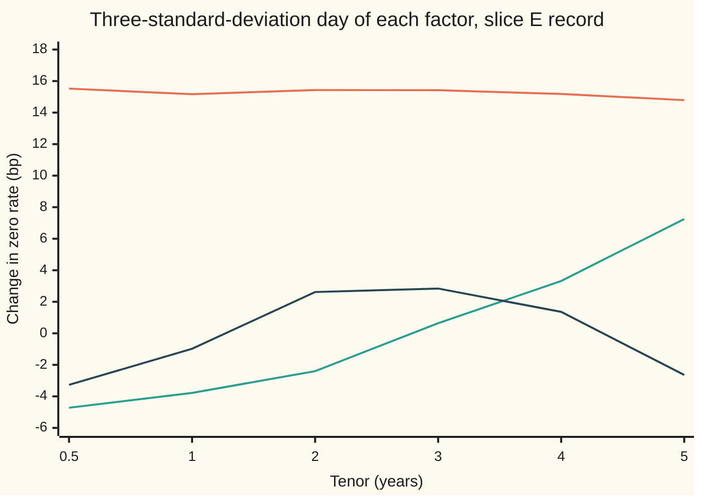

# Level, slope and curvature: the three moves that explain almost every curve change

[Syllabus](../../../SYLLABUS.md) → [Financial mathematics](../README.md) → [Curves in Depth](../README.md#s33) → Level, slope and curvature

---

## General Overview

A rates desk prices its trades off the slice E curve: six zero rates, from 3.9605 percent at six months to 4.5577 percent at five years, bootstrapped from two deposits and four swaps ([Bootstrapping](../02-Curves/04-bootstrapping-the-discount-curve.md)). Every evening each of the six rates has moved. That is six numbers a day, over a two-year record of 500 trading days.

Six numbers a day is too many to think with. Most days they move together: all six up about 5 basis points (a basis point, bp, is a hundredth of a percent). Some days the short end rises while the long end falls. Rarely, the middle rises against both ends. Those three patterns have names: **level**, **slope** and **curvature**.

Principal component analysis (PCA) is the method that finds such patterns from the record alone, without being told what to look for. It hands back six perpendicular shapes, ranked by how much of the day-to-day movement each one carries. On this card's 500-day record the top three carry **97.23 percent** of all the movement. Three numbers a day describe the curve almost as well as six.

**PCA rewrites each day's curve change as a mix of fixed shapes, ordered so that the first shape carries the most movement, the second the most of what is left, and so on; for yield curves the first three are level, slope and curvature, and together they carry about 97 percent.**

**What kind of fact this is:** a method. Inside it sits a theorem, proved on this card in Why it works: no other three shapes can carry more of the movement. That three shapes carry about 97 percent is an empirical regularity of rate markets, not a law.

### The picture: what each factor does to the curve

The record below is synthetic, built by the check scripts from their own random numbers. PCA was not told how it was built. It found these three shapes, each drawn at the size of a rare day, three standard deviations (three times the typical daily size of that factor).



Orange, top: **level**, every tenor up about 15 bp. Green, rising: **slope**, short rates down and long rates up, crossing zero between two and three years. Dark, arched: **curvature**, the belly (the middle tenors) up and both ends down. Level is more than three times the size of slope, and slope is nearly twice the size of curvature.

---

## The formula

Notation first, in words. A **vector** here is a list of six numbers, one per tenor (a tenor is a time to maturity: 0.5, 1, 2, 3, 4 and 5 years). A **matrix** is a square table of numbers. A matrix times a vector gives a new vector: each entry is one row of the table multiplied entry by entry with the vector and added up. A superscript $\top$ turns a column of numbers into a row, so $u^{\top}w$ is the plain sum of products $u_1w_1 + \dots + u_6w_6$; two vectors are **perpendicular** when that sum is zero, and $w\,w^{\top}$ is the six-by-six table of every product $w_i\,w_j$.

$$\Sigma \;=\; \frac{1}{n}\sum_{t=1}^{n}\bigl(x_t-\bar x\bigr)\bigl(x_t-\bar x\bigr)^{\top}, \qquad \Sigma\,u_k \;=\; \lambda_k\,u_k, \qquad R_3 \;=\; \frac{\lambda_1+\lambda_2+\lambda_3}{\operatorname{tr}\Sigma}$$

**Read it aloud:** average the day-by-day table of how the tenors move together; find the directions that this table only stretches, never turns; the stretch along each direction is the movement it carries, and the top three stretches over the total are the share that three factors explain.

| Symbol | Plain meaning | In our example | Push it up and the answer… |
| --- | --- | --- | --- |
| $T$ | tenor: time to maturity, in years | 0.5, 1, 2, 3, 4, 5 | — |
| $D(T)$, $z(T)$ | discount factor: today's price of a dollar due at tenor $T$; zero rate, continuously compounded, $-\ln D(T)/T$ | $D(5)$ = 0.79621728; $z(5)$ = 4.5577% | — |
| $m$, $n$; $t$, $i$, $j$, $k$, $l$ | number of tenors; number of days; counters for a day, two tenors and two factors | 6; 500 | more tenors add more small factors |
| $x_t$ | day $t$'s curve change: six changes in bp | one row of the record | — |
| $\bar x$ | the average daily change, tenor by tenor | close to zero | — |
| $\Sigma$ | covariance matrix: entry $(i, j)$ averages the product of tenor $i$'s and tenor $j$'s centred changes; the diagonal holds the six variances | diagonal from 5.29^2 to 5.58^2 bp^2 | bigger moves, bigger stretches |
| $u_k$; $u_1$, $u_2$, $u_3$ | loading, or factor shape $k$: a unit-length vector the matrix only stretches | level: 0.4154 … 0.3958 | — |
| $\lambda_k$; $\lambda_1$, $\lambda_2$, $\lambda_3$ | eigenvalue: the variance carried by factor $k$, in bp^2 | 155.0758, 11.8141, 3.9319 | a larger share for factor $k$ |
| $a_{tk}$, $\top$ | score: how much of shape $k$ day $t$ contained, $u_k^{\top}(x_t-\bar x)$; the $\top$ lays a column on its side | varies by day | — |
| $\operatorname{tr}\Sigma$; $P$, $w_k$, $w$ | trace: sum of the diagonal, the total variance; $P$ is a projection and $w_k$ a surviving squared length, both in the detailed proof; $w$ is any vector of six numbers | 175.6880 bp^2 | every share shrinks |
| $R_3$ | share of the total carried by the top three factors | 97.23% | — |

A **variance** is the average squared distance from the average; its square root is the **standard deviation**, the typical size of a move. "Centred" means the average has been subtracted. An **eigenvector** of a matrix is a direction the matrix only stretches; the stretch factor is its **eigenvalue**. The needs-first card on [Principal components](../../09-Probability%20and%20statistics/09-Regression/07-principal-components.md) builds these words in full; this card uses them on a curve.

Each day then splits exactly into factors:

$$x_t \;=\; \bar x + a_{t1}u_1 + a_{t2}u_2 + \dots + a_{t6}u_6 .$$

In words: a day's change is the average change plus so much level, so much slope, so much curvature, and three small remainders.

### When it holds

- **A fixed record, equally weighted.** The shapes and the 97 percent describe these 500 days. A different window gives different numbers; a window of 20 days can give a visibly different curvature shape.
- **Changes, not levels.** Rates wander, and PCA on the rate levels mostly measures how far the curve drifted over the window. The shares come out different (see What breaks).
- **Every tenor in the same unit.** One bp at one tenor must weigh the same as one bp at another. Leave one column in percent and PCA stops seeing it.
- **Clear gaps between eigenvalues.** Where two eigenvalues are close, their shapes can swap or blend when a few days change. Here the top three stand well apart (155.08, 11.81, 3.93); the bottom three (1.72, 1.69, 1.46) do not, and their shapes mean nothing.
- **Signs are arbitrary.** Minus a loading is as good a loading as the loading itself. The checks fix signs by rule: level adds up to a positive number, slope ends higher than it starts, curvature has a raised belly.

---

## Why it works

### Step 0: the best single shape leaves the least unexplained

Suppose every day had to be described by one number: how much of one fixed shape it contained. Some shape would leave the smallest leftover, averaged over the record. That shape is the first factor. Finding it is a question about one six-by-six table, because the leftover depends on the record only through $\Sigma$.

The leftover and the captured part are the two sides of a right angle. A day's centred change is the hypotenuse. Its piece along a unit shape $u$ is one side, its leftover the other. Pythagoras says their squares add to the day's squared size. So **least leftover is the same as most captured**, and the first factor is the shape along which the days vary most.

### Step 1: the movement along a shape is one number from the table

Take a unit shape $u$: six weights whose squares add to one. Day $t$'s score along it is $u^{\top}(x_t-\bar x)$. Square it and average over the days:

$$\frac{1}{n}\sum_{t}\bigl(u^{\top}(x_t-\bar x)\bigr)^2 \;=\; u^{\top}\Sigma\,u .$$

The step is expanding a square: $(u^{\top}w)^2 = u^{\top}(w\,w^{\top})u$, then averaging $w\,w^{\top}$ over the days, which is $\Sigma$. This number is never negative, since it is an average of squares. A table with that property is called positive semidefinite.

### Step 2: the best shape is the top eigenvector

$\Sigma$ is symmetric: entry $(i, j)$ equals entry $(j, i)$, because tenor $i$ moves with tenor $j$ exactly as $j$ moves with $i$. A symmetric table has six perpendicular unit eigenvectors $u_1, \dots, u_6$ with real eigenvalues $\lambda_1 \ge \dots \ge \lambda_6 \ge 0$. That is the spectral theorem, used on the principal-components card.

Write any unit shape as a mix of those six: $u = c_1u_1 + \dots + c_6u_6$, where the squared weights $c_k^2$ add to one. The table stretches each piece by its own eigenvalue, and perpendicular pieces do not interact, so

$$u^{\top}\Sigma\,u \;=\; \lambda_1c_1^2 + \lambda_2c_2^2 + \dots + \lambda_6c_6^2 .$$

That is an average of the eigenvalues with weights $c_k^2$. An average is largest when all its weight sits on the largest value. So the best shape is $u_1$, and the movement it carries is $\lambda_1$: 155.0758 bp^2 on this record.

### Step 3: the next best shapes, and why the shares add up

Ask for the best shape perpendicular to $u_1$. The same average, now with $c_1 = 0$, peaks at $u_2$ with $\lambda_2$. Then $u_3$ with $\lambda_3$, and so on. Three consequences follow.

- **The scores are uncorrelated.** The average product of the scores on factors $k$ and $l$ is $u_k^{\top}\Sigma\,u_l = \lambda_l\,u_k^{\top}u_l$, which is zero for two perpendicular shapes. A level day tells nothing about the same day's slope, within the record.
- **The eigenvalues add up to the total.** The total variance is the trace, and the trace equals the sum of the eigenvalues: 175.6880 bp^2, which the checks confirm by adding the six eigenvalues.
- **The leftover is the tail.** Keep three factors and the average squared leftover is exactly $\lambda_4 + \lambda_5 + \lambda_6$ = 4.8662 bp^2. The checks compute it the long way too, day by day, and land on the same number.

The share of factor $k$ is $\lambda_k / \operatorname{tr}\Sigma$. Any three shapes capture something; the theorem says the top three eigenvectors capture the most.

<details>
<summary>Detailed proof: no three shapes beat the top three eigenvectors</summary>

Let $P$ be the projection onto any three-dimensional set of shapes: the table that keeps a vector's part inside that set and drops the rest. The captured variance is the trace of $P\Sigma$. Write $w_k$ for the squared length of $P u_k$, the part of eigenvector $k$ that survives. Each $w_k$ lies between 0 and 1, and the six add to 3, the trace of $P$. The captured variance is $\lambda_1w_1 + \dots + \lambda_6w_6$.

Compare with the top three, $\lambda_1 + \lambda_2 + \lambda_3$. The difference is
$$\sum_{k\le 3}(\lambda_k-\lambda_3)(1-w_k) \;+\; \sum_{k>3}(\lambda_3-\lambda_k)\,w_k \;\ge\; 0,$$
since every bracket and every weight is non-negative. The identity uses only that the $w_k$ add to 3. Equality needs the lost weight to sit only on eigenvalues equal to $\lambda_3$, so when $\lambda_3 > \lambda_4$ the top three shapes are the unique best set. Pythagoras turns most captured into least leftover, averaged over the days.

</details>

### Step 4: why the shapes come out as level, slope and curvature

PCA knows nothing about curves. The shapes come from how rates move together.

- **Level has one sign.** Every pair of tenors moves in the same direction on average, so every entry of $\Sigma$ is positive. For such a table the top eigenvector has all entries of one sign (the Perron–Frobenius theorem). Here they are nearly equal, 0.3958 to 0.4154: close to a flat shape.
- **Slope changes sign once.** It must be perpendicular to an all-positive shape, so it has to be negative somewhere and positive somewhere. The cheapest way to do that, for rates whose co-movement fades smoothly with the distance between tenors, is one crossing: here between two and three years.
- **Curvature changes sign twice.** Perpendicular to both, the next smoothest shape has two crossings: down at the ends, up in the belly.

That pattern is the pattern of a vibrating string, whose modes have zero, one and two crossings. It is not a theorem for every covariance table. It is what smooth, strongly positive co-movement produces, and rate curves have it. A curve whose tenors moved independently would give no such shapes.

<details>
<summary>The record was built from three shapes. Is PCA just returning them?</summary>

Nearly, but not exactly. The scripts made each day as a flat move of typical size 5 bp, a straight-line tilt of size 2 bp, a parabola-shaped bend of size 1 bp, and independent noise of 1.3 bp at each tenor. Those three building shapes are not perpendicular, so PCA cannot return them as they are. It returns the perpendicular set that carries the most movement. A hand-made flat, straight-line and bowl basis, made perpendicular, carries 97.2066 percent; PCA's shapes carry 97.2302 percent. PCA wins, as the theorem says it must, by a hair: near the top, the captured share changes little as the shapes tilt.

</details>

Another road reaches the same shapes: the singular value decomposition, which factors the 500-by-6 table of centred changes itself into turn, stretch, turn, without forming $\Sigma$. With many tenors it is the numerically safer route.

---

## Worked numbers, by hand

The slice E record, 500 days, changes in bp.

| Step | Arithmetic | Value |
| --- | --- | --- |
| variance of each tenor | squared standard deviations, 5.5631^2, 5.3287^2, … , 5.5799^2 | the diagonal of $\Sigma$ |
| total variance, $\operatorname{tr}\Sigma$ | the six variances added | 175.6880 bp^2 |
| level, $\lambda_1$ | top eigenvalue | 155.0758 bp^2 |
| level's share | 155.0758 ÷ 175.6880 | 88.27% |
| slope's share | 11.8141 ÷ 175.6880 | 6.72% |
| curvature's share | 3.9319 ÷ 175.6880 | 2.24% |
| **three together** | (155.0758 + 11.8141 + 3.9319) ÷ 175.6880 | **97.23%** |
| leftover | 1.7166 + 1.6865 + 1.4632 | 4.8662 bp^2 |
| level's typical day | $\sqrt{155.0758}$ | 12.45 bp along the shape |

The typical level day moves the unit shape by 12.45 bp. Spread over six tenors with loadings near 0.41, that is about 5 bp at each tenor: most of the per-tenor standard deviations of 5.29 to 5.58 bp.

The house example is the slice E curve shocked by each factor on a three-standard-deviation day. Take level at five years.

| Step | Arithmetic | Value |
| --- | --- | --- |
| move at five years | 3 × 12.4529 × 0.3958, three typical level days times the five-year loading | 14.79 bp |
| new five-year zero | 4.5577% plus the 14.79 bp, unrounded | 4.7055% |
| five-year zero-coupon bond, per $100 | $100 e^{-0.045577 \times 5}$ becomes $100 e^{-0.047055 \times 5}$ | **$79.62 to $79.04** |

The three rare days, applied to the whole curve, in percent:

| Tenor (years) | 0.5 | 1 | 2 | 3 | 4 | 5 | Five-year bond, per $100 |
| --- | --- | --- | --- | --- | --- | --- | --- |
| slice E curve | 3.9605 | 4.1142 | 4.3102 | 4.4591 | 4.5285 | 4.5577 | 79.6217 |
| after the level day | 4.1157 | 4.2659 | 4.4645 | 4.6133 | 4.6803 | 4.7055 | 79.0353 |
| after the slope day | 3.9134 | 4.0764 | 4.2862 | 4.4654 | 4.5618 | 4.6302 | 79.3335 |
| after the curvature day | 3.9278 | 4.1044 | 4.3364 | 4.4875 | 4.5421 | 4.5312 | 79.7270 |

The level day takes the five-year bond from $79.62 to $79.04 per $100. The slope day costs it less, since slope lifts the long end by only 7.25 bp. The curvature day lowers the five-year rate by 2.64 bp and the bond gains. Three shocks, three different answers for one bond: that is why a desk hedges more than one factor.

The shares, one block per 2.5 percentage points:

```
share of total variance, % (one block = 2.5 points)
level        ███████████████████████████████████  88.27
slope        ███                                   6.72
curvature    █                                     2.24
factor 4     ▌                                     0.98
factor 5     ▌                                     0.96
factor 6     ▌                                     0.83
```

### What breaks if you drop a piece

Same record, correct answer 97.23 percent in three factors.

| Mistake | Comes out at | What went wrong |
| --- | --- | --- |
| PCA on rate levels, not daily changes | first factor 82.58%, three 98.17% | The levels wander over two years; PCA then describes the wander, not the daily move a hedge must survive |
| Hand-made flat, line and bowl shapes instead of eigenvectors | 97.21% | Not a disaster, just second best: the theorem's margin is small near the optimum, and never negative |
| Five-year column left in percent, others in bp | level loading at five years 0.0040, not 0.3958 | That column's variance shrinks ten-thousandfold, and PCA stops seeing the tenor a hedge most needs |
| Only three tenors in the record | 100.00% | Three factors always explain three columns completely; the share says nothing |

Every number in this section is printed by both check scripts.

---

## Code, from first principles, and it actually runs

The scripts bootstrap the slice E curve, generate 500 synthetic days with their own random numbers (a 64-bit linear congruential generator and the Box–Muller transform, which turns two uniform draws into a bell-curve draw), and run PCA **two independent ways**: Jacobi rotations, which spin pairs of axes until the table is diagonal and read the eigenvalues off it, and power iteration, which multiplies a vector by the table until it settles on the top direction, then removes that direction and repeats. Then three more checks, each by a different road: the eigenvalues must add to the trace; the leftover computed day by day must equal the three dropped eigenvalues; the factor scores must be uncorrelated. The hand-made shapes must lose. Every what-breaks number and the house shocks are printed.

### Python

```python
# Level, slope and curvature -- the check behind the card.  Standard library only.
# 500 synthetic daily changes of the slice E zero curve at its six pillars, then PCA
# two ways: Jacobi rotations and power iteration.  Nothing imported knows the answer.
from math import log, sqrt, cos, pi, exp

T = [0.5, 1.0, 2.0, 3.0, 4.0, 5.0]
D = {0.0: 1.0, 0.5: 1 / 1.02, 1.0: 1 / 1.042}                  # the two deposits
for n, s in ((2, 0.0440), (3, 0.0455), (4, 0.0462), (5, 0.0465)):  # the bootstrap ladder
    D[float(n)] = (1.0 - s * sum(D[float(j)] for j in range(1, n))) / (1.0 + s)
ZERO = [-log(D[t]) / t * 1e4 for t in T]                        # zero rates in bp, continuous

state = 20260928                                                # our own random numbers
def unif():
    global state
    state = (state * 6364136223846793005 + 1442695040888963407) % 2**64
    return ((state >> 11) + 0.5) / 2.0**53
def gauss():
    u1 = unif(); u2 = unif()
    return sqrt(-2.0 * log(u1)) * cos(2.0 * pi * u2)            # Box-Muller

SLOPE = [(t - 2.5) / 2.5 for t in T]                            # shapes used only to make data
BEND = [1.0 - 2.0 * ((t - 2.5) / 2.5) ** 2 for t in T]
X = []
for day in range(500):                                          # bp changes, one row a day
    lv, sl, cv = 5.0 * gauss(), 2.0 * gauss(), 1.0 * gauss()
    X.append([lv + sl * SLOPE[i] + cv * BEND[i] + 1.3 * gauss() for i in range(6)])

def cov(rows):                                                  # centred, divide by n
    n, m = len(rows), len(rows[0])
    mu = [sum(r[j] for r in rows) / n for j in range(m)]
    return [[sum((r[i] - mu[i]) * (r[j] - mu[j]) for r in rows) / n for j in range(m)] for i in range(m)]

def jacobi(A):                                                  # road 1: rotate until diagonal
    m = len(A); A = [row[:] for row in A]
    V = [[float(i == j) for j in range(m)] for i in range(m)]
    for sweep in range(100):
        off = sum(A[i][j] ** 2 for i in range(m) for j in range(m) if i != j)
        if off < 1e-24: break
        for p in range(m):
            for q in range(p + 1, m):
                if abs(A[p][q]) < 1e-300: continue
                th = (A[q][q] - A[p][p]) / (2.0 * A[p][q])
                t = (1.0 if th >= 0 else -1.0) / (abs(th) + sqrt(th * th + 1.0))
                c = 1.0 / sqrt(t * t + 1.0); s = t * c
                for k in range(m):
                    akp, akq = A[k][p], A[k][q]
                    A[k][p], A[k][q] = c * akp - s * akq, s * akp + c * akq
                for k in range(m):
                    apk, aqk = A[p][k], A[q][k]
                    A[p][k], A[q][k] = c * apk - s * aqk, s * apk + c * aqk
                for k in range(m):
                    vkp, vkq = V[k][p], V[k][q]
                    V[k][p], V[k][q] = c * vkp - s * vkq, s * vkp + c * vkq
    pairs = sorted(((A[i][i], [V[k][i] for k in range(m)]) for i in range(m)), key=lambda p: -p[0])
    return [p[0] for p in pairs], [p[1] for p in pairs]

def power(A, k):                                                # road 2: multiply, deflate, repeat
    m = len(A); A = [row[:] for row in A]; vals, vecs = [], []
    for _ in range(k):
        v = [1.0 + 0.1 * i for i in range(m)]
        for it in range(3000):
            w = [sum(A[i][j] * v[j] for j in range(m)) for i in range(m)]
            nw = sqrt(sum(x * x for x in w)); v = [x / nw for x in w]
        lam = sum(v[i] * A[i][j] * v[j] for i in range(m) for j in range(m))
        vals.append(lam); vecs.append(v)
        A = [[A[i][j] - lam * v[i] * v[j] for j in range(m)] for i in range(m)]
    return vals, vecs

def orient(vecs):                                               # fix the arbitrary signs
    tests = [lambda v: sum(v), lambda v: v[-1] - v[0], lambda v: v[2] + v[3] - v[0] - v[-1]]
    return [[-x for x in v] if tests[k](v) < 0 else v for k, v in enumerate(vecs)]

def share3(rows):
    lam = jacobi(cov(rows))[0]
    return sum(lam[:3]) / sum(lam), lam[0] / sum(lam)
S = cov(X)
lam, U = jacobi(S); U = orient(U[:3])
plam, PU = power(S, 3); PU = orient(PU)
trace = sum(S[i][i] for i in range(6))
dot = lambda a, b: sum(x * y for x, y in zip(a, b))
mu = [sum(r[j] for r in X) / 500 for j in range(6)]
Z = [[r[j] - mu[j] for j in range(6)] for r in X]
resid = sum(dot(z, z) - sum(dot(z, u) ** 2 for u in U) for z in Z) / 500   # leftover, day by day
sc = [[dot(z, u) for u in U] for z in Z]
offcov = max(abs(sum(s[a] * s[b] for s in sc) / 500) for a in range(3) for b in range(a + 1, 3))

def gram(vs):                                                   # hand-made flat / line / bowl
    out = []
    for v in vs:
        for u in out: v = [x - dot(v, u) * y for x, y in zip(v, u)]
        nv = sqrt(dot(v, v)); out.append([x / nv for x in v])
    return out
H = gram([[1.0] * 6, T, [t * t for t in T]])
hand = sum(sum(S[i][j] * h[i] * h[j] for i in range(6) for j in range(6)) for h in H) / trace
LEV = []; y = ZERO[:]
for r in X:
    y = [a + b for a, b in zip(y, r)]; LEV.append(y)
sd = [sqrt(S[i][i]) for i in range(6)]
PCT = [r[:5] + [r[5] / 100.0] for r in X]                       # the 5-year column left in percent

f = lambda v: " ".join(f"{x:8.4f}" for x in v)
print("tenor, years          " + " ".join(f"{t:8.1f}" for t in T))
print("slice E zero, %       " + f([z / 100 for z in ZERO]))
print("sd of daily change bp " + f(sd))
print(f"total variance, bp^2  {trace:10.4f}")
print("eigenvalues, Jacobi   " + f(lam))
print("eigenvalues, power    " + f(plam))
print("share of each, %      " + f([100 * l / trace for l in lam]))
print("cumulative share, %   " + f([100 * sum(lam[:k + 1]) / trace for k in range(6)]))
for k, name in enumerate(("level", "slope", "curvature")):
    print(f"{name + ' loading':<22}" + f(U[k]))
    print(f"{name + ' (power road)':<22}" + f(PU[k]))
print("factor sd, bp a day   " + f([sqrt(l) for l in lam[:3]]))
print(f"leftover, direct bp^2 {resid:10.4f}")
print(f"leftover, l4+l5+l6    {sum(lam[3:]):10.4f}")
print(f"largest score cov     {offcov:10.4f}")
print(f"wrong: hand shapes, % {100 * hand:10.4f}")
lv3, lv1 = share3(LEV)
print(f"wrong: levels 1st, %  {100 * lv1:10.4f}")
print(f"wrong: levels 3, %    {100 * lv3:10.4f}")
print(f"wrong: 5y %, 5y load  {orient(jacobi(cov(PCT))[1][:1])[0][5]:10.4f}")
print(f"wrong: 3 tenors, %    {100 * share3([[r[1], r[3], r[5]] for r in X])[0]:10.4f}")
print("house: 3-sd shock of each factor on the slice E curve")
price = lambda z: 100.0 * exp(-z[5] / 1e4 * 5.0)
rows = [("base", ZERO)]
for k, name in enumerate(("level", "slope", "curvature")):
    mv = [3.0 * sqrt(lam[k]) * u for u in U[k]]
    rows.append((name, [z + m for z, m in zip(ZERO, mv)]))
    print(f"{'chart, ' + name + ' bp':<22}" + " ".join(f"{m:8.2f}" for m in mv))
    print(f"{'  zero % after':<22}" + f([(z + m) / 100 for z, m in zip(ZERO, mv)]))
print("5y zero-coupon, $100  " + " ".join(f"{n}={price(z):.4f}" for n, z in rows))

assert max(abs(a - b) for a, b in zip(lam, plam)) < 1e-8, "two eigen-solvers agree"
assert max(abs(a - b) for u, v in zip(U, PU) for a, b in zip(u, v)) < 1e-6, "same shapes"
assert abs(sum(lam) - trace) < 1e-9, "eigenvalues add up to the total variance"
assert abs(resid - sum(lam[3:])) < 1e-8, "day-by-day leftover equals the dropped eigenvalues"
assert offcov < 1e-8, "factor scores are uncorrelated"
assert hand < sum(lam[:3]) / trace, "no other three shapes capture more"
assert 0.965 < sum(lam[:3]) / trace < 0.975, "about 97 percent in three factors"
print("ALL CHECKS PASS")
```

**Ran 2026-09-28 on macOS, Python 3.14.6, standard library only. All checks passed. Output, pasted from the run:**

```
tenor, years               0.5      1.0      2.0      3.0      4.0      5.0
slice E zero, %         3.9605   4.1142   4.3102   4.4591   4.5285   4.5577
sd of daily change bp   5.5631   5.3287   5.3675   5.3260   5.2946   5.5799
total variance, bp^2    175.6880
eigenvalues, Jacobi   155.0758  11.8141   3.9319   1.7166   1.6865   1.4632
eigenvalues, power    155.0758  11.8141   3.9319
share of each, %       88.2677   6.7245   2.2380   0.9771   0.9599   0.8328
cumulative share, %    88.2677  94.9922  97.2302  98.2072  99.1672 100.0000
level loading           0.4154   0.4060   0.4130   0.4127   0.4063   0.3958
level (power road)      0.4154   0.4060   0.4130   0.4127   0.4063   0.3958
slope loading          -0.4574  -0.3664  -0.2324   0.0617   0.3221   0.7035
slope (power road)     -0.4574  -0.3664  -0.2324   0.0617   0.3221   0.7035
curvature loading      -0.5498  -0.1650   0.4401   0.4771   0.2278  -0.4442
curvature (power road) -0.5498  -0.1650   0.4401   0.4771   0.2278  -0.4442
factor sd, bp a day    12.4529   3.4372   1.9829
leftover, direct bp^2     4.8662
leftover, l4+l5+l6        4.8662
largest score cov         0.0000
wrong: hand shapes, %    97.2066
wrong: levels 1st, %     82.5784
wrong: levels 3, %       98.1742
wrong: 5y %, 5y load      0.0040
wrong: 3 tenors, %      100.0000
house: 3-sd shock of each factor on the slice E curve
chart, level bp          15.52    15.17    15.43    15.42    15.18    14.79
  zero % after          4.1157   4.2659   4.4645   4.6133   4.6803   4.7055
chart, slope bp          -4.72    -3.78    -2.40     0.64     3.32     7.25
  zero % after          3.9134   4.0764   4.2862   4.4654   4.5618   4.6302
chart, curvature bp      -3.27    -0.98     2.62     2.84     1.36    -2.64
  zero % after          3.9278   4.1044   4.3364   4.4875   4.5421   4.5312
5y zero-coupon, $100  base=79.6217 level=79.0353 slope=79.3335 curvature=79.7270
ALL CHECKS PASS
```

Two solvers, one answer: the Jacobi and power-iteration eigenvalues and shapes agree to every printed digit. The day-by-day leftover lands on $\lambda_4 + \lambda_5 + \lambda_6$, and the largest covariance between two factors' scores is zero to four decimals.

### Rust

Same data, same generator and seed, same two solvers written again. No crates.

```rust
// Level, slope and curvature -- the same check as principal_components_of_the_curve_check.py.
// Std only, no crates.  Same 500 synthetic days, same seed; PCA by Jacobi and by power iteration.
// Compile: rustc --edition 2021 -O principal_components_of_the_curve_check.rs -o /tmp/pcc
use std::f64::consts::PI;
type Mat = Vec<Vec<f64>>;

struct Lcg(u64);
impl Lcg {
    fn unif(&mut self) -> f64 {
        self.0 = self.0.wrapping_mul(6364136223846793005).wrapping_add(1442695040888963407);
        ((self.0 >> 11) as f64 + 0.5) / 2f64.powi(53)
    }
    fn gauss(&mut self) -> f64 {                                     // Box-Muller
        let (u1, u2) = (self.unif(), self.unif());
        (-2.0 * u1.ln()).sqrt() * (2.0 * PI * u2).cos()
    }
}

fn dot(a: &[f64], b: &[f64]) -> f64 { a.iter().zip(b).map(|(x, y)| x * y).sum() }

fn cov(rows: &[Vec<f64>]) -> Mat {                                  // centred, divide by n
    let (n, m) = (rows.len() as f64, rows[0].len());
    let mu: Vec<f64> = (0..m).map(|j| rows.iter().map(|r| r[j]).sum::<f64>() / n).collect();
    (0..m).map(|i| (0..m).map(|j| rows.iter().map(|r| (r[i] - mu[i]) * (r[j] - mu[j])).sum::<f64>() / n).collect()).collect()
}

fn jacobi(a0: &Mat) -> (Vec<f64>, Mat) {                           // road 1: rotate until diagonal
    let (m, mut a) = (a0.len(), a0.clone());
    let mut v: Mat = (0..m).map(|i| (0..m).map(|j| if i == j { 1.0 } else { 0.0 }).collect()).collect();
    for _ in 0..100 {
        let mut off = 0.0;
        for i in 0..m { for j in 0..m { if i != j { off += a[i][j] * a[i][j]; } } }
        if off < 1e-24 { break; }
        for p in 0..m {
            for q in p + 1..m {
                if a[p][q].abs() < 1e-300 { continue; }
                let th = (a[q][q] - a[p][p]) / (2.0 * a[p][q]);
                let t = (if th >= 0.0 { 1.0 } else { -1.0 }) / (th.abs() + (th * th + 1.0).sqrt());
                let (c, s) = (1.0 / (t * t + 1.0).sqrt(), t / (t * t + 1.0).sqrt());
                for k in 0..m { let (x, y) = (a[k][p], a[k][q]); a[k][p] = c * x - s * y; a[k][q] = s * x + c * y; }
                for k in 0..m { let (x, y) = (a[p][k], a[q][k]); a[p][k] = c * x - s * y; a[q][k] = s * x + c * y; }
                for k in 0..m { let (x, y) = (v[k][p], v[k][q]); v[k][p] = c * x - s * y; v[k][q] = s * x + c * y; }
            }
        }
    }
    let mut idx: Vec<usize> = (0..m).collect();
    idx.sort_by(|&i, &j| a[j][j].partial_cmp(&a[i][i]).unwrap());
    (idx.iter().map(|&i| a[i][i]).collect(), idx.iter().map(|&i| (0..m).map(|k| v[k][i]).collect()).collect())
}

fn power(a0: &Mat, k: usize) -> (Vec<f64>, Mat) {                  // road 2: multiply, deflate, repeat
    let (m, mut a) = (a0.len(), a0.clone());
    let (mut vals, mut vecs) = (vec![], vec![]);
    for _ in 0..k {
        let mut v: Vec<f64> = (0..m).map(|i| 1.0 + 0.1 * i as f64).collect();
        for _ in 0..3000 {
            let w: Vec<f64> = (0..m).map(|i| dot(&a[i], &v)).collect();
            let nw = dot(&w, &w).sqrt();
            v = w.iter().map(|x| x / nw).collect();
        }
        let lam = (0..m).map(|i| v[i] * dot(&a[i], &v)).sum::<f64>();
        for i in 0..m { for j in 0..m { a[i][j] -= lam * v[i] * v[j]; } }
        vals.push(lam); vecs.push(v);
    }
    (vals, vecs)
}

fn orient(vecs: &[Vec<f64>]) -> Mat {                              // fix the arbitrary signs
    vecs.iter().enumerate().map(|(k, v)| {
        let test = match k { 0 => v.iter().sum::<f64>(), 1 => v[5] - v[0], _ => v[2] + v[3] - v[0] - v[5] };
        if test < 0.0 { v.iter().map(|x| -x).collect() } else { v.clone() }
    }).collect()
}

fn share3(rows: &[Vec<f64>]) -> (f64, f64) {
    let lam = jacobi(&cov(rows)).0;
    let tot: f64 = lam.iter().sum();
    ((lam[0] + lam[1] + lam[2]) / tot, lam[0] / tot)
}

fn f(v: &[f64]) -> String { v.iter().map(|x| format!("{:8.4}", x)).collect::<Vec<_>>().join(" ") }

fn main() {
    let t = [0.5, 1.0, 2.0, 3.0, 4.0, 5.0];
    let mut d = [1.0 / 1.02, 1.0 / 1.042, 0.0, 0.0, 0.0, 0.0];       // D at 0.5, 1, 2, 3, 4, 5
    for (n, s) in [(2usize, 0.0440), (3, 0.0455), (4, 0.0462), (5, 0.0465)] {
        let annuity: f64 = (1..n).map(|j| d[j]).sum();               // D(1) .. D(n-1)
        d[n] = (1.0 - s * annuity) / (1.0 + s);
    }
    let zero: Vec<f64> = (0..6).map(|i| -d[i].ln() / t[i] * 1e4).collect();
    let mut g = Lcg(20260928);
    let slope: Vec<f64> = t.iter().map(|x| (x - 2.5) / 2.5).collect();
    let bend: Vec<f64> = t.iter().map(|x| 1.0 - 2.0 * ((x - 2.5) / 2.5f64).powi(2)).collect();
    let mut x: Mat = vec![];
    for _ in 0..500 {
        let (lv, sl, cv) = (5.0 * g.gauss(), 2.0 * g.gauss(), 1.0 * g.gauss());
        x.push((0..6).map(|i| lv + sl * slope[i] + cv * bend[i] + 1.3 * g.gauss()).collect());
    }
    let s = cov(&x);
    let (lam, u_all) = jacobi(&s);
    let u = orient(&u_all[..3]);
    let (plam, pu0) = power(&s, 3);
    let pu = orient(&pu0);
    let trace: f64 = (0..6).map(|i| s[i][i]).sum();
    let mu: Vec<f64> = (0..6).map(|j| x.iter().map(|r| r[j]).sum::<f64>() / 500.0).collect();
    let z: Mat = x.iter().map(|r| (0..6).map(|j| r[j] - mu[j]).collect()).collect();
    let resid = z.iter().map(|zz| dot(zz, zz) - u.iter().map(|uu| dot(zz, uu).powi(2)).sum::<f64>()).sum::<f64>() / 500.0;
    let sc: Mat = z.iter().map(|zz| u.iter().map(|uu| dot(zz, uu)).collect()).collect();
    let mut offcov: f64 = 0.0;
    for a in 0..3 { for b in a + 1..3 { offcov = offcov.max((sc.iter().map(|r| r[a] * r[b]).sum::<f64>() / 500.0).abs()); } }
    let mut h: Mat = vec![];                                         // hand-made flat / line / bowl
    for v0 in [vec![1.0; 6], t.to_vec(), t.iter().map(|x| x * x).collect::<Vec<f64>>()] {
        let mut v = v0;
        for uu in &h { let c = dot(&v, uu); v = v.iter().zip(uu).map(|(a, b)| a - c * b).collect(); }
        let nv = dot(&v, &v).sqrt();
        h.push(v.iter().map(|a| a / nv).collect());
    }
    let hand = h.iter().map(|hh| (0..6).map(|i| hh[i] * dot(&s[i], hh)).sum::<f64>()).sum::<f64>() / trace;
    let (mut lev, mut y): (Mat, Vec<f64>) = (vec![], zero.clone());
    for r in &x { y = y.iter().zip(r).map(|(a, b)| a + b).collect(); lev.push(y.clone()); }
    let sd: Vec<f64> = (0..6).map(|i| s[i][i].sqrt()).collect();
    let pct: Mat = x.iter().map(|r| { let mut q = r.clone(); q[5] /= 100.0; q }).collect();

    println!("tenor, years          {}", t.iter().map(|v| format!("{:8.1}", v)).collect::<Vec<_>>().join(" "));
    println!("slice E zero, %       {}", f(&zero.iter().map(|v| v / 100.0).collect::<Vec<_>>()));
    println!("sd of daily change bp {}", f(&sd));
    println!("total variance, bp^2  {:10.4}", trace);
    println!("eigenvalues, Jacobi   {}", f(&lam));
    println!("eigenvalues, power    {}", f(&plam));
    println!("share of each, %      {}", f(&lam.iter().map(|l| 100.0 * l / trace).collect::<Vec<_>>()));
    println!("cumulative share, %   {}", f(&(0..6).map(|k| 100.0 * lam[..=k].iter().sum::<f64>() / trace).collect::<Vec<_>>()));
    for (k, name) in ["level", "slope", "curvature"].iter().enumerate() {
        println!("{:<22}{}", format!("{} loading", name), f(&u[k]));
        println!("{:<22}{}", format!("{} (power road)", name), f(&pu[k]));
    }
    println!("factor sd, bp a day   {}", f(&lam[..3].iter().map(|l| l.sqrt()).collect::<Vec<_>>()));
    println!("leftover, direct bp^2 {:10.4}", resid);
    println!("leftover, l4+l5+l6    {:10.4}", lam[3] + lam[4] + lam[5]);
    println!("largest score cov     {:10.4}", offcov);
    println!("wrong: hand shapes, % {:10.4}", 100.0 * hand);
    let (lv3, lv1) = share3(&lev);
    println!("wrong: levels 1st, %  {:10.4}", 100.0 * lv1);
    println!("wrong: levels 3, %    {:10.4}", 100.0 * lv3);
    println!("wrong: 5y %, 5y load  {:10.4}", orient(&jacobi(&cov(&pct)).1[..1])[0][5]);
    let three: Mat = x.iter().map(|r| vec![r[1], r[3], r[5]]).collect();
    println!("wrong: 3 tenors, %    {:10.4}", 100.0 * share3(&three).0);
    println!("house: 3-sd shock of each factor on the slice E curve");
    let price = |zz: &[f64]| 100.0 * (-zz[5] / 1e4 * 5.0).exp();
    let mut prices = vec![format!("base={:.4}", price(&zero))];
    for (k, name) in ["level", "slope", "curvature"].iter().enumerate() {
        let mv: Vec<f64> = u[k].iter().map(|uu| 3.0 * lam[k].sqrt() * uu).collect();
        let after: Vec<f64> = zero.iter().zip(&mv).map(|(a, b)| a + b).collect();
        println!("{:<22}{}", format!("chart, {} bp", name), mv.iter().map(|m| format!("{:8.2}", m)).collect::<Vec<_>>().join(" "));
        println!("{:<22}{}", "  zero % after", f(&after.iter().map(|v| v / 100.0).collect::<Vec<_>>()));
        prices.push(format!("{}={:.4}", name, price(&after)));
    }
    println!("5y zero-coupon, $100  {}", prices.join(" "));

    let share = (lam[0] + lam[1] + lam[2]) / trace;
    assert!((0..3).all(|k| (lam[k] - plam[k]).abs() < 1e-8), "two eigen-solvers agree");
    assert!((0..3).all(|k| (0..6).all(|i| (u[k][i] - pu[k][i]).abs() < 1e-6)), "same shapes");
    assert!((lam.iter().sum::<f64>() - trace).abs() < 1e-9, "eigenvalues add up to the total variance");
    assert!((resid - (lam[3] + lam[4] + lam[5])).abs() < 1e-8, "day-by-day leftover equals the dropped eigenvalues");
    assert!(offcov < 1e-8, "factor scores are uncorrelated");
    assert!(hand < share, "no other three shapes capture more");
    assert!(share > 0.965 && share < 0.975, "about 97 percent in three factors");
    println!("ALL CHECKS PASS");
}
```

**Ran 2026-09-28 on macOS, rustc 1.98.1, no crates. All checks passed. Output, pasted from the run:**

```
tenor, years               0.5      1.0      2.0      3.0      4.0      5.0
slice E zero, %         3.9605   4.1142   4.3102   4.4591   4.5285   4.5577
sd of daily change bp   5.5631   5.3287   5.3675   5.3260   5.2946   5.5799
total variance, bp^2    175.6880
eigenvalues, Jacobi   155.0758  11.8141   3.9319   1.7166   1.6865   1.4632
eigenvalues, power    155.0758  11.8141   3.9319
share of each, %       88.2677   6.7245   2.2380   0.9771   0.9599   0.8328
cumulative share, %    88.2677  94.9922  97.2302  98.2072  99.1672 100.0000
level loading           0.4154   0.4060   0.4130   0.4127   0.4063   0.3958
level (power road)      0.4154   0.4060   0.4130   0.4127   0.4063   0.3958
slope loading          -0.4574  -0.3664  -0.2324   0.0617   0.3221   0.7035
slope (power road)     -0.4574  -0.3664  -0.2324   0.0617   0.3221   0.7035
curvature loading      -0.5498  -0.1650   0.4401   0.4771   0.2278  -0.4442
curvature (power road) -0.5498  -0.1650   0.4401   0.4771   0.2278  -0.4442
factor sd, bp a day    12.4529   3.4372   1.9829
leftover, direct bp^2     4.8662
leftover, l4+l5+l6        4.8662
largest score cov         0.0000
wrong: hand shapes, %    97.2066
wrong: levels 1st, %     82.5784
wrong: levels 3, %       98.1742
wrong: 5y %, 5y load      0.0040
wrong: 3 tenors, %      100.0000
house: 3-sd shock of each factor on the slice E curve
chart, level bp          15.52    15.17    15.43    15.42    15.18    14.79
  zero % after          4.1157   4.2659   4.4645   4.6133   4.6803   4.7055
chart, slope bp          -4.72    -3.78    -2.40     0.64     3.32     7.25
  zero % after          3.9134   4.0764   4.2862   4.4654   4.5618   4.6302
chart, curvature bp      -3.27    -0.98     2.62     2.84     1.36    -2.64
  zero % after          3.9278   4.1044   4.3364   4.4875   4.5421   4.5312
5y zero-coupon, $100  base=79.6217 level=79.0353 slope=79.3335 curvature=79.7270
ALL CHECKS PASS
```

The two outputs agree line for line.

> [!TIP]
> **Try changing**
> Guess first. Then run it.
> - **Switch the noise off.** Set `1.3 * gauss()` to `0.0 * gauss()`. The three-factor share becomes 100 percent. Then the assert that the hand-made shapes must lose fails: the data now lie exactly in the span of flat, line and bowl, so the hand-made trio ties PCA.
> - **Switch the slope off.** Set the `2.0 * gauss()` in the day loop to `0.0 * gauss()`. The bend becomes the second factor, and the third is noise with a scrambled shape. A factor no larger than the noise cannot be told apart from it.
> - **Change the seed.** Set `state = 7`. The shares move by a fraction of a point and the three shapes barely change. That stability is what makes the 97 percent worth quoting.
> - **Shorten the window.** Use 20 days instead of 500 (both the loop and the divisors). The curvature shape bends visibly and the share drifts above 97.5 percent, so the last assert fails. Twenty days are too few to pin down a small factor.

---

## The usual mistake

> [!warning]
> **Reading 97 percent as "three factors are all the risk."** The share counts squared bp, averaged, tenor by tenor, over the record. A position hedged against level, slope and curvature is still exposed to the other 3 percent, and that 3 percent can be concentrated exactly where the position sits: a four-year position against suitably weighted two-, three- and five-year positions (three hedges for three factors) can be built with no level, slope or curvature exposure at all, and then it lives entirely in the small factors. The leftover here is 4.8662 bp^2 a day; how much of it lands on a given book depends on the book.
>
> Smaller traps:
> - **Running PCA on levels, or mixing units.** Both change the answer; What breaks has the numbers.
> - **Trusting the small factors' shapes.** Eigenvalues 1.72, 1.69 and 1.46 are nearly tied; their shapes rotate from one window to the next. Only a clear gap makes a shape meaningful.
> - **Comparing signs across studies.** Minus a loading is equally correct. One paper's "steepening" is another's negative slope score.
> - **Dividing by n − 1 and expecting new shares.** Using $n-1$ instead of $n$ multiplies every eigenvalue by the same 500/499, so the shapes and every share are unchanged.

---

## Where you meet it in real life

- **Risk reports on a rates desk.** Positions are reported as exposure to level, slope and curvature, in dollars per bp of each factor, alongside tenor-by-tenor numbers.
- **Hedging with a few instruments.** Three factors need three hedges: a desk can offset level, slope and curvature with three bonds or swaps and leave a small residual. Tenor-by-tenor exposures come next: [Key-rate durations](02-key-rate-durations-and-curve-hedging.md).
- **Scenario design.** Stress tests shock curves by multiples of factor standard deviations, as the house example does, instead of by arbitrary shapes.
- **Curve fitting with few parameters.** The level, slope and curvature terms of a four-parameter curve play the same roles as the first three factors: [Fitting a curve with four or six parameters](03-nelson-siegel-and-svensson-fitting.md).
- **Reading the curve's message.** Level moves track the expected path of short rates and the term premium together; untangling them is the work of [What a curve says](04-term-premium-and-expectations.md).
- **Relative-value trades.** Butterfly trades (long the belly, short both wings, or the reverse) are bets on the curvature factor with level and slope hedged away.

> **Say it back**
> A curve moves at many tenors every day, but the moves are strongly tied together. PCA averages the day-by-day table of co-movement and finds the directions that table only stretches; each stretch is the movement that direction carries. No other set of three shapes carries more than the top three, and on yield curves those three are level, slope and curvature, carrying about 97 percent. The share is a fact about the record, measured in squared bp, and the leftover 3 percent is still risk.

---

## What this builds on

- [Principal components](../../09-Probability%20and%20statistics/09-Regression/07-principal-components.md): the general method, the covariance matrix, eigenvectors and the spectral theorem. This card applies them to a curve and reads the shapes.

## Where this goes next

- [Key-rate durations](02-key-rate-durations-and-curve-hedging.md): exposure measured tenor by tenor instead of factor by factor, and hedges built from it.

Three factors say how curves tend to move; they do not say how much a particular portfolio loses when one tenor moves, and that is the question key-rate durations answer.

---

## Sources

Verified 28 Sep 2026: every DOI below resolves and its registry record names the work.

- Litterman, Robert, and José Scheinkman. "Common Factors Affecting Bond Returns." *The Journal of Fixed Income* 1, no. 1 (1991): 54–61. [doi:10.3905/jfi.1991.692347](https://doi.org/10.3905/jfi.1991.692347). The paper that found three factors, named level, steepness and curvature, behind Treasury returns.
- Pearson, Karl. "On Lines and Planes of Closest Fit to Systems of Points in Space." *Philosophical Magazine* 2, no. 11 (1901): 559–572. [doi:10.1080/14786440109462720](https://doi.org/10.1080/14786440109462720). The least-leftover view of Step 0.
- Hotelling, Harold. "Analysis of a Complex of Statistical Variables into Principal Components." *Journal of Educational Psychology* 24, no. 6 (1933): 417–441. [doi:10.1037/h0071325](https://doi.org/10.1037/h0071325). The most-variance view, the eigenvectors of the covariance matrix, and the name.
- Jolliffe, I. T. *Principal Component Analysis*, 2nd ed. Springer Series in Statistics, 2002. [doi:10.1007/b98835](https://doi.org/10.1007/b98835). The standard reference: optimality, choosing how many factors, and why small factors' shapes are unstable.
