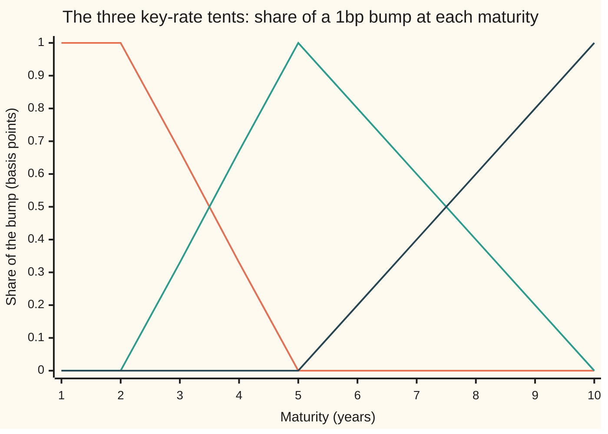
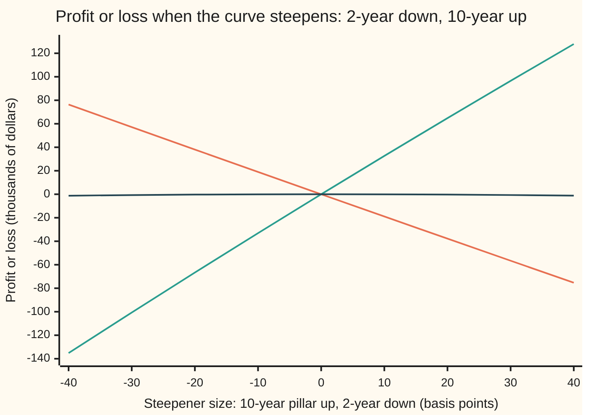

# Key-rate durations: sensitivity to each pillar, and hedging a bond book against the whole curve

[Syllabus](../../../SYLLABUS.md) → [Financial mathematics](../../../SYLLABUS.md#w12) → [Curves in Depth](../../../SYLLABUS.md#w12-s33) → Key-rate durations

---

## General Overview

A fund holds a 7-year bond: 10,000,000 dollars of face value, paying 5 percent of face once a year and the face itself at the end. On this morning's curve it is worth 10,187,765.52 dollars. If every interest rate rises by one **basis point**, one hundredth of a percentage point, the bond loses 6,196.46 dollars. That number is its **DV01**, the dollar value of one basis point ([Swap DV01](../28-Swaps/03-swap-dv01-and-hedging.md)).

The quick hedge is one interest rate swap, a contract trading fixed payments for floating ones, on which the fund pays the fixed rate: it gains when rates rise. A 10-year swap sized to the same DV01 needs 7,562,358.99 dollars of notional, the amount its payments are sized on. Against a move where every rate goes up together, the pair is flat. But curves rarely move together. Let the curve **steepen**: the 2-year rate falls 20 basis points, the 5-year stays put, the 10-year rises 20. The bond alone loses 37,778.50 dollars. The "hedged" pair gains 64,814.68: the hedge is now a larger bet than the bond it was meant to cancel.

The fix is to measure risk maturity by maturity. Pick a few maturities, here 2, 5 and 10 years, called **pillars**. Raise the curve at one pillar only, fading to nothing at the neighbouring pillars, and reprice. The loss per basis point is that pillar's **key-rate DV01**, also called a partial or bucket DV01. For the bond the three are 282.83, 3,735.38 and 2,178.25 dollars, and they add up to the 6,196.46. Then hedge each pillar: a 2-, a 5- and a 10-year swap, sized by solving three equations at once. The 5- and 10-year swaps do nearly all the work; the 2-year swap is a small trim of 58,918.14 dollars in the other direction.

**Key-rate DV01s split a position's rate risk into one number per pillar, adding up to the ordinary DV01; hedging every pillar to zero protects against any curve move that is a straight line between the pillars, not only against parallel ones.**

**What kind of fact this is:** a method. The pillars and the shape of each bump are choices, so each key-rate DV01 is a definition; that the three add up to the ordinary DV01, and that a book with all three at zero is flat to first order against every move built from them, are theorems, proved on this card in Why it works.

### The picture: three tents that add up to a flat roof

Each pillar gets a **tent**: a bump that is 1 basis point at its own pillar and falls in a straight line to 0 at the pillars either side. Beyond the first and last pillar the tent stays flat. At every maturity the three heights add up to 1.



Orange: the 2-year tent. Green: the 5-year tent. Dark blue: the 10-year tent. The bond's final payment falls at 7 years, where the 5-year tent stands at 0.60 and the 10-year tent at 0.40. That split is most of the story below.

---

## The formula

Notation first, in words. Cash flows fall at the end of whole years, $t = 1, 2, \dots, 10$. The **zero rate** $z(t)$ is the continuously compounded rate for money lent from today to year $t$ with nothing paid in between. The **discount factor** $D(t) = e^{-z(t)\,t}$ is the price today of one dollar paid at year $t$. The bond's price adds up its discounted cash flows. A tent is written $w_k(t)$: its height at maturity $t$, for the tent whose pillar is $k$ years.

$$P = \sum_{t} CF_t\, e^{-z(t)\,t}$$

**Read it aloud:** the bond is worth each payment times today's price of a dollar at that date, added up.

The key-rate DV01 for pillar $k$, the definition:

$$KR_k = -\,\frac{P\bigl(z + \delta\,w_k\bigr) - P\bigl(z - \delta\,w_k\bigr)}{2}, \qquad \delta = 0.0001$$

**Read it aloud:** lift the zero curve by one tent's worth of a basis point, then lower it by the same, reprice both times, and take half the loss.

The same number by hand, one cash flow at a time:

$$KR_k \approx \delta \sum_{t} w_k(t)\; t\; CF_t\, D(t)$$

**Read it aloud:** each payment loses its time, times its present value, times one basis point; the tent says how much of that loss belongs to pillar $k$.

The sum rule, and the hedge. The hedges are **par swaps**, whose fixed rate makes them worth zero today, with the fund paying fixed. The swap maturing in $j$ years ($j = 2, 5, 10$) gains $m_{kj}$ per dollar of notional per basis point of tent $k$:

$$KR_2 + KR_5 + KR_{10} = \text{DV01}, \qquad \sum_{j} m_{kj}\,h_j = KR_k \ \text{ for } k = 2, 5, 10$$

**Read it aloud:** the pillar risks add up to the whole risk; choose the swap notionals so that at every pillar the swaps gain what the bond loses.

Divide a key-rate DV01 by the price and by $\delta$ and dollars become years: the **key-rate duration**. The bond's are 0.2776, 3.6665 and 2.1381, adding up to its duration of 6.0823 ([Duration and convexity](../01-Money%2C%20Dates%20and%20Discounting/06-duration-and-convexity.md)). Hedges are sized in dollars, so the card works in dollars.

| Symbol | Plain meaning | In our example | Push it up and the answer… |
| --- | --- | --- | --- |
| $t$ | when a cash flow is paid, in years | 1 to 7 for the bond | its flow's loss per dollar of value grows in step |
| $CF_t$ | the cash flow paid at year $t$ | 500,000 a year; 10,500,000 at year 7 | its loss per bp grows in step |
| $z(t)$ | zero rate to year $t$, continuously compounded | 4.5863% at 7 years | price falls |
| $D(t)$ | price today of one dollar paid at year $t$ | $D(7) = 0.72539293$ | price rises |
| $P$ | the bond's price | 10,187,765.52 dollars | — |
| $\delta$ | one basis point | 0.0001 | every DV01 grows in step |
| $w_k(t)$, $k$ | height of the tent for pillar $k$ at maturity $t$; pillars at 2, 5, 10 years | $w_5(7) = 0.60$, $w_{10}(7) = 0.40$ | moves risk toward pillar $k$ |
| $KR_k$ | key-rate DV01: dollars lost per bp of tent $k$ | 282.83, 3,735.38, 2,178.25 | — |
| $m_{kj}$, $j$ | gain per bp of tent $k$, per dollar of notional, of the swap maturing in $j$ years | 711.82 per million for the 10-year swap at the 10-year pillar | less notional needed |
| $h_j$ | notional of swap $j$, paying fixed; negative means receiving fixed | 8,091,656.15 on the 5-year | — |
| $a_k$ | the move at pillar $k$ in a tent-shaped move, in decimal | −0.0020 to +0.0020 (±20 bp) in the random test | — |
| $S_n$, $n$ | par rate of an $n$-year swap: the fixed rate that makes it worth zero today | 4.40%, 4.65%, 4.71% for 2, 5, 10 years | — |

The tents, in symbols:

$$w_2(t) = \begin{cases} 1 & t \le 2 \\ \tfrac{5-t}{3} & 2 \le t \le 5 \\ 0 & t \ge 5 \end{cases} \qquad w_5(t) = \begin{cases} \tfrac{t-2}{3} & 2 \le t \le 5 \\ \tfrac{10-t}{5} & 5 \le t \le 10 \\ 0 & \text{otherwise} \end{cases} \qquad w_{10}(t) = \begin{cases} 0 & t \le 5 \\ \tfrac{t-5}{5} & 5 \le t \le 10 \\ 1 & t \ge 10 \end{cases}$$

In words: each tent climbs from the pillar before, peaks at its own, and falls to the pillar after.

### When it holds

- **The curve moves in straight lines between pillars.** Key-rate DV01s see only moves built from the three tents. A kink at 7 years alone, the 7-year zero rate up 10 basis points and nothing else, costs the bond 53,130.21 dollars and the fully hedged book 52,400.91: the hedge does almost nothing. More pillars catch more shapes, at the price of more hedges.
- **Small moves.** Key-rate DV01s are slopes. Over the 20 basis point steepener the fully hedged book still drifts by 297.20 dollars: the bend in the value line, called convexity, which slopes do not see.
- **The same lever everywhere.** Bond and swaps are bumped on the same zero curve with the same tents. Key rates on par quotes, rebuilding the curve each time, are a different and equally valid set of numbers; mixing the two sizes the hedge wrong.
- **One curve, annual payments.** The swaps' floating payments are forecast off the curve that discounts them, as on [Bootstrapping](../02-Curves/04-bootstrapping-the-discount-curve.md). Conventions verified 28 Sep 2026: dollar swaps float on SOFR, an overnight rate compounded over each period, and desks keep separate forecasting and discounting curves ([Multi-curve](../28-Swaps/04-basis-swaps-and-the-multi-curve-framework.md)); the numbers shift slightly, the method does not.
- **As many swaps as pillars.** Three pillars need three swaps whose risks are not copies of each other. Two swaps generally cannot zero three numbers; four leave a choice.

---

## Why it works

### Step 0: a curve with ten moving parts, squeezed into three

A curve move is ten numbers here, one per year, and dozens in a real market. Key rates pick a few pillars and assume the move at any other maturity is the straight line between the moves at the nearest pillars. Then every move is a weighted sum of the three tents, with the pillar moves as weights, and the value change is, to first order, three sensitivities times three moves. Three numbers, three hedges.

### Step 1: one cash flow's loss per basis point

A cash flow at year $t$ is worth $CF_t\,e^{-z(t)\,t}$. Raise its zero rate by $\delta$ and the value is multiplied by $e^{-t\delta}$, which is $1 - t\delta$ to first order. So the flow loses $t \times CF_t \times D(t) \times \delta$. Later payments lose more per dollar of value, in proportion to how far away they are.

The bond's final payment: 7 × 10,500,000 × 0.72539293 × 0.0001 = 5,331.64 dollars per basis point. The six coupons lose between 47.98 and 227.96 each.

### Step 2: split each flow's loss by the tents

Raise only tent $k$ by $\delta$. The zero rate at year $t$ moves by $w_k(t)\,\delta$, so that flow loses $w_k(t)$ times its full loss. Add over the flows: that is the mapping formula. The final payment at 7 years sends 0.60 of its 5,331.64 to the 5-year pillar, 3,198.98, and 0.40 to the 10-year pillar, 2,132.66.

```
bond's key-rate DV01, dollars lost per 1bp, one block = 100 dollars
   2-year  ███                                        282.83
   5-year  █████████████████████████████████████    3,735.38
  10-year  ██████████████████████                   2,178.25
```

The 2-year pillar collects only the first four coupons, and only part of the third and fourth. The 7-year bond is mostly a 5-year risk, with a large 10-year tail.

### Step 3: the pillars add up to the whole

At every maturity the three tents add to 1: between 2 and 5 years, for instance, $\tfrac{5-t}{3} + \tfrac{t-2}{3} = 1$. So raising all three tents by a basis point raises every zero rate by exactly a basis point: the parallel move. Each flow's first-order loss is shared out with weights that add to 1, so the three key-rate DV01s add to the parallel DV01. On the bond: 282.83 + 3,735.38 + 2,178.25 = 6,196.46, which the code also finds by bumping every zero rate at once.

<details>
<summary>Detailed proof: the sum rule, and why a zeroed book is flat</summary>

Write the value as a function of the ten zero rates, $V(z_1, \dots, z_{10})$. For a move $\Delta z$, Taylor's theorem gives $V(z + \Delta z) - V(z) = \sum_t \frac{\partial V}{\partial z_t}\,\Delta z_t + O(\lVert\Delta z\rVert^2)$, where the last term shrinks like the square of the move.

**Sum rule.** Tent $k$ is the move $\Delta z_t = \delta\,w_k(t)$. Its first-order loss is $KR_k = -\delta\sum_t \frac{\partial V}{\partial z_t} w_k(t)$; the central difference in the definition equals this up to a term of order $\delta^2$. Adding over $k$ and swapping the two sums, $\sum_k KR_k = -\delta\sum_t \frac{\partial V}{\partial z_t}\sum_k w_k(t) = -\delta\sum_t \frac{\partial V}{\partial z_t}$, since the inner sum is 1 at every $t$. The right side is the first-order loss for a parallel move of $\delta$: the DV01.

**Flat book.** A move built from tents is $\Delta z_t = \sum_k a_k\,w_k(t)$, where $a_k$ is the move at pillar $k$ in decimal. Its first-order value change is $\sum_t \frac{\partial V}{\partial z_t}\sum_k a_k w_k(t) = -\sum_k \frac{a_k}{\delta} KR_k$, by the same swap of sums. If the book's three key-rate DV01s are all zero, the first-order change is zero for every choice of $a_2, a_5, a_{10}$, and what remains is of order $\lVert\Delta z\rVert^2$. A move that is not a sum of tents, like the 7-year kink, is not covered by this argument, and the kink's loss confirms it.

</details>

### Step 4: the hedges have key-rate DV01s too

Paying fixed on a par swap means receiving the floating leg, worth $1 - D(n)$ per dollar of notional, and paying $S_n$ each year up to $n$ ([The par swap rate](../28-Swaps/02-par-swap-rate-and-annuity.md)). That is short a bond with coupon $S_n$: it gains when rates rise, and Step 2 applies unchanged.

The results, per million of notional, gained per basis point of each tent:

| Pillar | 2-year swap | 5-year swap | 10-year swap |
| --- | --- | --- | --- |
| 2 years | 195.78 | 26.30 | 26.64 |
| 5 years | 0.00 | 431.03 | 80.91 |
| 10 years | 0.00 | 0.00 | 711.82 |

A 5-year swap pays nothing after 5 years, so the 10-year tent cannot touch it; its early coupons give it a little 2-year risk. The 10-year swap touches all three. Written in the order 2, 5, 10, the matrix is **upper triangular**: zeros below the diagonal.

### Step 5: solve for the notionals, starting at the long end

The three hedge equations are the rows of that table times the notionals, set equal to the bond's key-rate DV01s. A triangular system solves from the bottom up, called back substitution ([Gaussian elimination](../../03-Algebra/05-Solving%20Systems/02-gaussian-elimination.md)).

- **10-year pillar.** Only the 10-year swap is there: 2,178.25 / 711.82 per million = 3,060,087.83 dollars.
- **5-year pillar.** That 10-year swap already covers 247.61 dollars of it, leaving 3,487.78 for the 5-year swap: 3,487.78 / 431.03 per million = 8,091,656.15 dollars.
- **2-year pillar.** The 5- and 10-year swaps between them cover 11.53 dollars more 2-year risk than the bond has. The 2-year swap must take that back: receive fixed on 11.53 / 195.78 per million = 58,918.14 dollars.

**Existence and uniqueness.** A triangular system with no zero on its diagonal has exactly one solution. Here the diagonal is 195.78, 431.03 and 711.82: each swap is the only one whose final payment sits at its own pillar. If one swap's column of risks were a combination of the others', the determinant ([Determinants](../../03-Algebra/05-Solving%20Systems/04-determinants.md)) would be zero: some bond risks could not be matched, and those that could would have many hedges. A determinant near zero, two swaps with almost the same risks, gives huge notionals of opposite sign.

### Step 6: why three zeros protect against every tent-shaped move

By the Detailed proof above, a book whose three key-rate DV01s are zero has no first-order change under any move built from tents. The code tests this on 2,000 random moves, each pillar drawn anywhere between −20 and +20 basis points. The worst loss for the bond alone is 118,048.43 dollars. With the one-swap hedge it is 124,105.76: worse than no hedge. With the three-swap hedge it is 651.77, all of it convexity.



Orange: the bond alone, losing as the curve steepens. Green: the bond with one 10-year swap sized on total DV01, tilted the other way and more steeply. Dark blue: the bond with the three-swap hedge, flat to within 1.22 thousand dollars at 40 basis points either way.

### The other road

Key rates can also be taken on the par quotes: bump the quoted swap rates in tents and rebuild the curve, as Tuckman's textbook does. A par swap's risk then sits entirely on its own quote, since the rebuilt curve must reprice that quote at par, so the swap table is diagonal. The numbers differ; the method is the same. A different road again hedges the curve's statistical moves, level, slope and curvature, instead of pillars: [Level, slope and curvature](01-principal-components-of-the-curve.md).

---

## Worked numbers, by hand

The curve: the par swap quotes of [Swap DV01](../28-Swaps/03-swap-dv01-and-hedging.md), 4.20 percent at one year rising to 4.71 percent at ten, bootstrapped to discount factors ($D(5) = 0.79621728$, the same on both cards) and turned into zero rates by $z(t) = -\ln D(t)/t$.

| Step | Arithmetic | Value |
| --- | --- | --- |
| 7-year zero rate | $-\ln(0.72539293)/7$ | 4.5863% |
| bond price | coupons and face, each times its $D(t)$ | 10,187,765.52 |
| final payment's loss per bp | $7 \times 10{,}500{,}000 \times 0.72539293 \times 0.0001$ | 5,331.64 |
| its split, 0.60 and 0.40 | to the 5-year and 10-year pillars | 3,198.98 and 2,132.66 |
| 2-year pillar | coupons 1 to 4, their 2-year shares | 282.83 |
| 5-year pillar | $43.74 + 111.24 + 199.05 + 182.37 + 3{,}198.98$ | 3,735.38 |
| 10-year pillar | $45.59 + 2{,}132.66$ | 2,178.25 |
| sum, equal to the parallel DV01 | $282.83 + 3{,}735.38 + 2{,}178.25$ | 6,196.46 |
| 10-year swap, pay fixed | $2{,}178.25 / 711.82$ per million | **3,060,087.83** |
| 5-year swap, pay fixed | $(3{,}735.38 - 247.61) / 431.03$ per million | **8,091,656.15** |
| 2-year swap, receive fixed | $11.53 / 195.78$ per million | **58,918.14** |

Paying fixed on about 8.1 million of 5-year swaps and 3.1 million of 10-year, and receiving on a sliver of 2-year, leaves a book that loses nothing, to first order, whichever pillar moves.

### What breaks if you drop a piece

| Mistake | Comes out at | What went wrong |
| --- | --- | --- |
| One 10-year swap sized on total DV01 | left per bp: 2y 81.35, 5y 3,123.48, 10y −3,204.83; a 20bp steepener gains 64,814.68 | Total DV01 matched, pillars not. The book is long the 5-year and short the 10-year: a curve bet. |
| Drop the 2-year swap | left per bp: 2y −11.53; a 20bp rise at the 2-year pillar gains 230.31 | The longer swaps' early coupons carry 2-year risk. Small here, but it is an open position. |
| Hedge each pillar with its own swap alone | left per bp: 2y −309.47, 5y −247.61 | Ignores the table's upper corner: the 10-year swap also moves at 5 and 2 years. Over-hedged at the short end. |
| Trust key rates for every move | the 7-year kink costs 52,400.91 hedged, 53,130.21 unhedged | A move between pillars that is not a straight line is invisible to the tents. |

---

## Code, from first principles, and it actually runs

The script bootstraps the curve from its quotes, then reaches the bond's key-rate DV01s by two independent roads: bump each tent up and down and reprice, and map each cash flow's loss onto the tents by hand. It checks the sum rule against a third computation, a parallel bump of every zero rate. The hedge is solved twice, by elimination on the bumped swap table and by Cramer's rule, a determinant formula, on the mapped one. Then the hedged book is put through a parallel move, a steepener, a front-end move, a 7-year kink and 2,000 random tent-shaped moves from its own random number generator. Six asserts, each against a number computed another way; breaking the bootstrap, the par-rate formula, a tent's slope, the mapping's time factor, the back substitution or a swap's final payment each makes one fail.

### Python

```python
# Key-rate durations and curve hedging -- the check behind the card.  Standard library only.
# The curve is bootstrapped from its par quotes; key-rate DV01s are reached by bumping and
# repricing, and separately by mapping each cash flow onto the pillars by hand.  The hedge
# is solved twice (elimination on one matrix, Cramer's rule on the other) and then tested.
from math import exp, log

QUOTES = [0.042, 0.044, 0.0455, 0.0462, 0.0465, 0.0467, 0.0468, 0.0469, 0.0470, 0.0471]
BP, F, C, NB = 0.0001, 10_000_000.0, 0.05, 7          # 1bp; bond face, coupon, years
PILLARS, SWAPS = (2, 5, 10), (2, 5, 10)

D, acc = [], 0.0
for s in QUOTES:                                       # D(n) = (1 - S_n (D(1)+...+D(n-1))) / (1 + S_n)
    D.append((1.0 - s * acc) / (1.0 + s)); acc += D[-1]
Z = [-log(D[i]) / (i + 1) for i in range(10)]          # zero rate for year i+1, continuously compounded

def w(k, t):                                           # tent k: 1 at its pillar, 0 at the neighbours
    lo = PILLARS[k - 1] if k > 0 else None
    hi = PILLARS[k + 1] if k < 2 else None
    p = PILLARS[k]
    if t <= p: return 1.0 if lo is None else max(0.0, (t - lo) / (p - lo))
    return 1.0 if hi is None else max(0.0, (hi - t) / (hi - p))

def flows_bond(): return [(t, F * C + (F if t == NB else 0.0)) for t in range(1, NB + 1)]
def flows_payer(n, k):                                 # pay fixed k, receive floating = +1 now, -1 at n
    return [(t, -k - (1.0 if t == n else 0.0)) for t in range(1, n + 1)]
def pv(flows, z): return sum(cf * exp(-z[t - 1] * t) for t, cf in flows)
def shifted(k, s): return [Z[i] + s * w(k, i + 1) for i in range(10)]

def kr_bump(flows, k):                                 # road 1: tent k up 1bp and down 1bp, reprice
    return -(pv(flows, shifted(k, BP)) - pv(flows, shifted(k, -BP))) / 2.0
def kr_map(flows, k):                                  # road 2: each flow's t*CF*D*1bp, split by tent
    return sum(w(k, t) * t * cf * exp(-Z[t - 1] * t) * BP for t, cf in flows)

par = {n: (1.0 - D[n - 1]) / sum(D[:n]) for n in SWAPS}
bond = flows_bond()
P0 = pv(bond, Z)
print("year  quote %   D(t)        zero %    tent 2  tent 5  tent 10")
for i in range(10):
    print(f"{i + 1:>4}  {100 * QUOTES[i]:6.4f}  {D[i]:.8f}  {100 * Z[i]:7.4f}   "
          + "  ".join(f"{w(k, i + 1):6.2f}" for k in range(3)))
print(f"bond: 10,000,000 face, 5% annual coupon, 7 years; price {P0:,.2f}")
print("year  cash flow      D(t)        t*CF*D*1bp   to 2y     to 5y     to 10y")
for t, cf in bond:
    x = t * cf * D[t - 1] * BP
    print(f"{t:>4}  {cf:>12,.2f}  {D[t - 1]:.8f}  {x:>10,.2f}  "
          + "  ".join(f"{w(k, t) * x:>8,.2f}" for k in range(3)))

KRb = [kr_bump(bond, k) for k in range(3)]
KRm = [kr_map(bond, k) for k in range(3)]
par_dv01 = -(pv(bond, [z + BP for z in Z]) - pv(bond, [z - BP for z in Z])) / 2.0
print("\nkey-rate DV01 of the bond, dollars lost per 1bp rise")
for k in range(3):
    print(f"  {PILLARS[k]:>2}-year pillar   bump {KRb[k]:>10,.2f}   mapped {KRm[k]:>10,.2f}   duration {KRb[k] / (P0 * BP):.4f}")
print(f"  sum of the three {sum(KRb):>10,.2f}   parallel bump of every zero {par_dv01:>10,.2f}   duration {par_dv01 / (P0 * BP):.4f}")

Mb = [[-kr_bump(flows_payer(n, par[n]), k) * 1e6 for n in SWAPS] for k in range(3)]
Mm = [[-kr_map(flows_payer(n, par[n]), k) * 1e6 for n in SWAPS] for k in range(3)]
print("\npay-fixed par swaps, dollars gained per 1bp rise per million, by pillar")
print("pillar      2y swap    5y swap   10y swap")
for k in range(3):
    print(f"{PILLARS[k]:>6}  " + " ".join(f"{Mb[k][j]:>10,.2f}" for j in range(3)))

def gauss(A, b):                                       # elimination with partial pivoting
    n = len(b); M = [row[:] + [b[i]] for i, row in enumerate(A)]
    for c in range(n):
        p = max(range(c, n), key=lambda r: abs(M[r][c])); M[c], M[p] = M[p], M[c]
        for r in range(c + 1, n):
            f = M[r][c] / M[c][c]
            M[r] = [M[r][j] - f * M[c][j] for j in range(n + 1)]
    x = [0.0] * n
    for r in range(n - 1, -1, -1):
        x[r] = (M[r][n] - sum(M[r][j] * x[j] for j in range(r + 1, n))) / M[r][r]
    return x
def det3(m): return (m[0][0] * (m[1][1] * m[2][2] - m[1][2] * m[2][1]) - m[0][1] * (m[1][0] * m[2][2] - m[1][2] * m[2][0])
                     + m[0][2] * (m[1][0] * m[2][1] - m[1][1] * m[2][0]))
def cramer(A, b):
    d = det3(A)
    return [det3([[b[r] if c == j else A[r][c] for c in range(3)] for r in range(3)]) / d for j in range(3)]

H = [x * 1e6 for x in gauss(Mb, KRb)]                  # dollars of notional, paying fixed
Hc = [x * 1e6 for x in cramer(Mm, KRm)]
print("\nhedge notionals, pay fixed (negative = receive fixed)")
for j in range(3):
    print(f"  {SWAPS[j]:>2}-year swap   elimination {H[j]:>14,.2f}   Cramer {Hc[j]:>14,.2f}")
h10 = par_dv01 / (-sum(kr_bump(flows_payer(10, par[10]), k) for k in range(3)))
print(f"  back substitution: 10y swap covers {H[2] * Mb[1][2] / 1e6:,.2f} of the 5y pillar, leaving {KRb[1] - H[2] * Mb[1][2] / 1e6:,.2f}")
print(f"  one 10-year swap on total DV01 {h10:>14,.2f}   its parallel DV01 per million {par_dv01 / h10 * 1e6:,.2f}")

def pnl(z, hedge):                                     # bond plus pay-fixed swaps, change in value
    v = pv(bond, z) - P0
    for n, h in hedge:
        v += h * (pv(flows_payer(n, par[n]), z) - pv(flows_payer(n, par[n]), Z))
    return v
three, one = list(zip(SWAPS, H)), [(10, h10)]
two, diag = three[1:], [(n, KRb[j] / Mb[j][j] * 1e6) for j, n in enumerate(SWAPS)]
def move(m2, m5, m10): return [Z[i] + BP * (m2 * w(0, i + 1) + m5 * w(1, i + 1) + m10 * w(2, i + 1)) for i in range(10)]
hump = [Z[i] + (10 * BP if i == 6 else 0.0) for i in range(10)]
print("scenario P&L, dollars          bond alone     one swap   5y+10y only   three swaps")
for lab, z in (("parallel +25bp", move(25, 25, 25)), ("steepener 2y -20, 10y +20", move(-20, 0, 20)),
               ("front end 2y +20", move(20, 0, 0)), ("7-year zero alone +10", hump)):
    print(f"  {lab:<26}" + "".join(f"{pnl(z, h):>13,.2f}" for h in ([], one, two, three)))
sizes = [-40, -30, -20, -10, 0, 10, 20, 30, 40]
print("chart, steepener bp  " + " ".join(f"{s:>7d}" for s in sizes))
for lab, h in (("chart, bond alone   ", []), ("chart, one swap     ", one), ("chart, three swaps  ", three)):
    print(lab + " " + " ".join(f"{pnl(move(-s, 0, s), h) / 1e3:>7.2f}" for s in sizes))
def left(hedge): return "  ".join(f"{PILLARS[k]}y {KRb[k] - sum(h * Mb[k][SWAPS.index(n)] / 1e6 for n, h in hedge):>9,.2f}" for k in range(3))
print("what breaks, net key-rate DV01 left after the hedge, dollars per 1bp")
for lab, h in (("one 10y swap on total DV01", one), ("5y and 10y only", two), ("each pillar by its own swap", diag)):
    print(f"  {lab:<28}{left(h)}")

seed, worst = 20260928, [0.0, 0.0, 0.0]
def rnd():                                             # 64-bit linear congruential generator, in [-1, 1)
    global seed
    seed = (seed * 6364136223846793005 + 1442695040888963407) % 2**64
    return (seed >> 11) / 2**52 - 1.0
for _ in range(2000):
    z = move(20 * rnd(), 20 * rnd(), 20 * rnd())
    for i, h in enumerate(([], one, three)): worst[i] = max(worst[i], abs(pnl(z, h)))
print(f"2,000 random pillar moves up to 20bp, worst |P&L|: bond {worst[0]:,.2f}  one swap {worst[1]:,.2f}  three {worst[2]:,.2f}")
print(f"try: 7-year bond at a 3% coupon, 10y pillar DV01 {sum(w(2, t) * t * (F * 0.03 + (F if t == 7 else 0)) * D[t - 1] * BP for t in range(1, 8)):,.2f}")

assert abs(D[4] - 0.79621728) < 5e-9,                        "D(5) must match the swap and bootstrap cards"
assert all(abs(par[n] - QUOTES[n - 1]) < 1e-12 for n in SWAPS), "par formula on D(t) must give back each quote"
assert all(abs(KRb[k] - KRm[k]) < 0.01 for k in range(3)),   "bump road vs cash-flow mapping road"
assert abs(sum(KRb) - par_dv01) < 0.01,                      "tents sum to one, so key rates sum to the parallel DV01"
assert all(abs(H[j] - Hc[j]) < 1.0 for j in range(3)),       "elimination on bump matrix vs Cramer on mapped matrix"
assert worst[2] < 0.01 * worst[0],                           "three-swap hedge must cut every random move by 99%"
print("ALL CHECKS PASS")
```

**Ran 2026-09-28 on macOS, Python 3.14.6, standard library only. All checks passed. Output, pasted from the run:**

```
year  quote %   D(t)        zero %    tent 2  tent 5  tent 10
   1  4.2000  0.95969290   4.1142     1.00    0.00    0.00
   2  4.4000  0.91740758   4.3102     1.00    0.00    0.00
   3  4.5500  0.87478903   4.4591     0.67    0.33    0.00
   4  4.6200  0.83431725   4.5285     0.33    0.67    0.00
   5  4.6500  0.79621728   4.5577     0.00    1.00    0.00
   6  4.6700  0.75985554   4.5771     0.00    0.80    0.20
   7  4.6800  0.72539293   4.5863     0.00    0.60    0.40
   8  4.6900  0.69233562   4.5961     0.00    0.40    0.60
   9  4.7000  0.66063001   4.6062     0.00    0.20    0.80
  10  4.7100  0.63022438   4.6168     0.00    0.00    1.00
bond: 10,000,000 face, 5% annual coupon, 7 years; price 10,187,765.52
year  cash flow      D(t)        t*CF*D*1bp   to 2y     to 5y     to 10y
   1    500,000.00  0.95969290       47.98     47.98      0.00      0.00
   2    500,000.00  0.91740758       91.74     91.74      0.00      0.00
   3    500,000.00  0.87478903      131.22     87.48     43.74      0.00
   4    500,000.00  0.83431725      166.86     55.62    111.24      0.00
   5    500,000.00  0.79621728      199.05      0.00    199.05      0.00
   6    500,000.00  0.75985554      227.96      0.00    182.37     45.59
   7  10,500,000.00  0.72539293    5,331.64      0.00  3,198.98  2,132.66

key-rate DV01 of the bond, dollars lost per 1bp rise
   2-year pillar   bump     282.83   mapped     282.83   duration 0.2776
   5-year pillar   bump   3,735.38   mapped   3,735.38   duration 3.6665
  10-year pillar   bump   2,178.25   mapped   2,178.25   duration 2.1381
  sum of the three   6,196.46   parallel bump of every zero   6,196.46   duration 6.0823

pay-fixed par swaps, dollars gained per 1bp rise per million, by pillar
pillar      2y swap    5y swap   10y swap
     2      195.78      26.30      26.64
     5        0.00     431.03      80.91
    10        0.00       0.00     711.82

hedge notionals, pay fixed (negative = receive fixed)
   2-year swap   elimination     -58,918.14   Cramer     -58,918.20
   5-year swap   elimination   8,091,656.15   Cramer   8,091,656.15
  10-year swap   elimination   3,060,087.83   Cramer   3,060,088.28
  back substitution: 10y swap covers 247.61 of the 5y pillar, leaving 3,487.78
  one 10-year swap on total DV01   7,562,358.99   its parallel DV01 per million 819.38
scenario P&L, dollars          bond alone     one swap   5y+10y only   three swaps
  parallel +25bp              -153,638.10      -501.81       288.51         0.85
  steepener 2y -20, 10y +20    -37,778.50    64,814.68      -528.35      -297.20
  front end 2y +20              -5,646.91    -1,624.20       230.31         0.06
  7-year zero alone +10        -53,130.21   -51,327.89   -52,400.91   -52,400.91
chart, steepener bp      -40     -30     -20     -10       0      10      20      30      40
chart, bond alone      76.34   57.16   38.04   18.99    0.00  -18.92  -37.78  -56.57  -75.30
chart, one swap      -135.16 -100.67  -66.65  -33.09    0.00   32.63   64.81   96.55  127.84
chart, three swaps     -1.22   -0.68   -0.30   -0.08    0.00   -0.07   -0.30   -0.67   -1.18
what breaks, net key-rate DV01 left after the hedge, dollars per 1bp
  one 10y swap on total DV01  2y     81.35  5y  3,123.48  10y -3,204.83
  5y and 10y only             2y    -11.53  5y      0.00  10y      0.00
  each pillar by its own swap 2y   -309.47  5y   -247.61  10y      0.00
2,000 random pillar moves up to 20bp, worst |P&L|: bond 118,048.43  one swap 124,105.76  three 651.77
try: 7-year bond at a 3% coupon, 10y pillar DV01 2,119.39
ALL CHECKS PASS
```

The two hedge solutions differ by 6 cents on the 2-year swap and 45 cents on the 10-year: the bumped table carries an error of order $\delta^2$ that the mapped table does not, one or two parts in ten million.

### Rust

```rust
// Key-rate durations and curve hedging -- the same check as the Python, in Rust.  Std only, no crates.
// Bootstrap the curve, key-rate DV01s by bump and by cash-flow mapping, the hedge by elimination
// and by Cramer's rule, then the hedged book under scenarios and 2,000 random moves.

const QUOTES: [f64; 10] = [0.042, 0.044, 0.0455, 0.0462, 0.0465, 0.0467, 0.0468, 0.0469, 0.0470, 0.0471];
const BP: f64 = 0.0001;
const F: f64 = 10_000_000.0; const C: f64 = 0.05; const NB: usize = 7;   // bond face, coupon, years
const PILLARS: [f64; 3] = [2.0, 5.0, 10.0];
const SWAPS: [usize; 3] = [2, 5, 10];

fn c2(x: f64) -> String {                              // 1234567.891 -> "1,234,567.89"
    let s = format!("{:.2}", x.abs());
    let (int, frac) = s.split_at(s.len() - 3);
    let mut out = String::new();
    for (i, ch) in int.chars().enumerate() {
        if i > 0 && (int.len() - i) % 3 == 0 { out.push(','); }
        out.push(ch);
    }
    format!("{}{}{}", if x < 0.0 && s != "0.00" { "-" } else { "" }, out, frac)
}

fn w(k: usize, t: f64) -> f64 {                        // tent k: 1 at its pillar, 0 at the neighbours
    let p = PILLARS[k];
    if t <= p {
        if k == 0 { 1.0 } else { ((t - PILLARS[k - 1]) / (p - PILLARS[k - 1])).max(0.0) }
    } else if k == 2 { 1.0 } else { ((PILLARS[k + 1] - t) / (PILLARS[k + 1] - p)).max(0.0) }
}

type Flows = Vec<(usize, f64)>;
fn flows_bond() -> Flows { (1..=NB).map(|t| (t, F * C + if t == NB { F } else { 0.0 })).collect() }
fn flows_payer(n: usize, k: f64) -> Flows { (1..=n).map(|t| (t, -k - if t == n { 1.0 } else { 0.0 })).collect() }
fn pv(fl: &Flows, z: &[f64]) -> f64 { fl.iter().map(|&(t, cf)| cf * (-z[t - 1] * t as f64).exp()).sum() }

fn gauss(a: &Vec<Vec<f64>>, b: &[f64]) -> Vec<f64> {   // elimination with partial pivoting
    let n = b.len();
    let mut m: Vec<Vec<f64>> = (0..n).map(|i| { let mut r = a[i].clone(); r.push(b[i]); r }).collect();
    for c in 0..n {
        let mut p = c;
        for r in c..n { if m[r][c].abs() > m[p][c].abs() { p = r; } }
        m.swap(c, p);
        for r in c + 1..n {
            let f = m[r][c] / m[c][c];
            for j in 0..=n { m[r][j] -= f * m[c][j]; }
        }
    }
    let mut x = vec![0.0; n];
    for r in (0..n).rev() {
        let s: f64 = (r + 1..n).map(|j| m[r][j] * x[j]).sum();
        x[r] = (m[r][n] - s) / m[r][r];
    }
    x
}
fn det3(m: &Vec<Vec<f64>>) -> f64 {
    m[0][0] * (m[1][1] * m[2][2] - m[1][2] * m[2][1]) - m[0][1] * (m[1][0] * m[2][2] - m[1][2] * m[2][0])
        + m[0][2] * (m[1][0] * m[2][1] - m[1][1] * m[2][0])
}
fn cramer(a: &Vec<Vec<f64>>, b: &[f64]) -> Vec<f64> {
    let d = det3(a);
    (0..3).map(|j| det3(&(0..3).map(|r| (0..3).map(|c| if c == j { b[r] } else { a[r][c] }).collect()).collect()) / d).collect()
}

fn main() {
    let (mut d, mut acc) = (Vec::new(), 0.0);
    for s in QUOTES { let x = (1.0 - s * acc) / (1.0 + s); d.push(x); acc += x; }
    let z: Vec<f64> = (0..10).map(|i| -d[i].ln() / (i + 1) as f64).collect();
    let shifted = |k: usize, s: f64| -> Vec<f64> { (0..10).map(|i| z[i] + s * w(k, (i + 1) as f64)).collect() };
    let kr_bump = |fl: &Flows, k: usize| -(pv(fl, &shifted(k, BP)) - pv(fl, &shifted(k, -BP))) / 2.0;
    let kr_map = |fl: &Flows, k: usize| -> f64 {
        fl.iter().map(|&(t, cf)| w(k, t as f64) * t as f64 * cf * (-z[t - 1] * t as f64).exp() * BP).sum()
    };
    let par = |n: usize| (1.0 - d[n - 1]) / d[..n].iter().sum::<f64>();
    let bond = flows_bond();
    let p0 = pv(&bond, &z);
    println!("year  quote %   D(t)        zero %    tent 2  tent 5  tent 10");
    for i in 0..10 {
        let ws: Vec<String> = (0..3).map(|k| format!("{:6.2}", w(k, (i + 1) as f64))).collect();
        println!("{:>4}  {:6.4}  {:.8}  {:7.4}   {}", i + 1, 100.0 * QUOTES[i], d[i], 100.0 * z[i], ws.join("  "));
    }
    println!("bond: 10,000,000 face, 5% annual coupon, 7 years; price {}", c2(p0));
    println!("year  cash flow      D(t)        t*CF*D*1bp   to 2y     to 5y     to 10y");
    for &(t, cf) in &bond {
        let x = t as f64 * cf * d[t - 1] * BP;
        let ws: Vec<String> = (0..3).map(|k| format!("{:>8}", c2(w(k, t as f64) * x))).collect();
        println!("{:>4}  {:>12}  {:.8}  {:>10}  {}", t, c2(cf), d[t - 1], c2(x), ws.join("  "));
    }
    let krb: Vec<f64> = (0..3).map(|k| kr_bump(&bond, k)).collect();
    let krm: Vec<f64> = (0..3).map(|k| kr_map(&bond, k)).collect();
    let par_dv01 = -(pv(&bond, &z.iter().map(|x| x + BP).collect::<Vec<_>>()) - pv(&bond, &z.iter().map(|x| x - BP).collect::<Vec<_>>())) / 2.0;
    println!("\nkey-rate DV01 of the bond, dollars lost per 1bp rise");
    for k in 0..3 { println!("  {:>2}-year pillar   bump {:>10}   mapped {:>10}   duration {:.4}", PILLARS[k], c2(krb[k]), c2(krm[k]), krb[k] / (p0 * BP)); }
    println!("  sum of the three {:>10}   parallel bump of every zero {:>10}   duration {:.4}", c2(krb.iter().sum()), c2(par_dv01), par_dv01 / (p0 * BP));

    let mb: Vec<Vec<f64>> = (0..3).map(|k| SWAPS.iter().map(|&n| -kr_bump(&flows_payer(n, par(n)), k) * 1e6).collect()).collect();
    let mm: Vec<Vec<f64>> = (0..3).map(|k| SWAPS.iter().map(|&n| -kr_map(&flows_payer(n, par(n)), k) * 1e6).collect()).collect();
    println!("\npay-fixed par swaps, dollars gained per 1bp rise per million, by pillar");
    println!("pillar      2y swap    5y swap   10y swap");
    for k in 0..3 {
        let r: Vec<String> = (0..3).map(|j| format!("{:>10}", c2(mb[k][j]))).collect();
        println!("{:>6}  {}", PILLARS[k], r.join(" "));
    }
    let h: Vec<f64> = gauss(&mb, &krb).iter().map(|x| x * 1e6).collect();
    let hc: Vec<f64> = cramer(&mm, &krm).iter().map(|x| x * 1e6).collect();
    println!("\nhedge notionals, pay fixed (negative = receive fixed)");
    for j in 0..3 { println!("  {:>2}-year swap   elimination {:>14}   Cramer {:>14}", SWAPS[j], c2(h[j]), c2(hc[j])); }
    let f10 = flows_payer(10, par(10));
    let h10 = par_dv01 / -(0..3).map(|k| kr_bump(&f10, k)).sum::<f64>();
    println!("  back substitution: 10y swap covers {} of the 5y pillar, leaving {}", c2(h[2] * mb[1][2] / 1e6), c2(krb[1] - h[2] * mb[1][2] / 1e6));
    println!("  one 10-year swap on total DV01 {:>14}   its parallel DV01 per million {}", c2(h10), c2(par_dv01 / h10 * 1e6));

    let pnl = |zz: &[f64], hedge: &[(usize, f64)]| -> f64 {
        let mut v = pv(&bond, zz) - p0;
        for &(n, hh) in hedge { let fl = flows_payer(n, par(n)); v += hh * (pv(&fl, zz) - pv(&fl, &z)); }
        v
    };
    let three: Vec<(usize, f64)> = SWAPS.iter().cloned().zip(h.iter().cloned()).collect();
    let one = vec![(10usize, h10)];
    let two = three[1..].to_vec();
    let diag: Vec<(usize, f64)> = (0..3).map(|j| (SWAPS[j], krb[j] / mb[j][j] * 1e6)).collect();
    let mv = |m2: f64, m5: f64, m10: f64| -> Vec<f64> {
        (0..10).map(|i| { let t = (i + 1) as f64; z[i] + BP * (m2 * w(0, t) + m5 * w(1, t) + m10 * w(2, t)) }).collect()
    };
    let hump: Vec<f64> = (0..10).map(|i| z[i] + if i == 6 { 10.0 * BP } else { 0.0 }).collect();
    let none: Vec<(usize, f64)> = vec![];
    println!("scenario P&L, dollars          bond alone     one swap   5y+10y only   three swaps");
    for (lab, zz) in [("parallel +25bp", mv(25.0, 25.0, 25.0)), ("steepener 2y -20, 10y +20", mv(-20.0, 0.0, 20.0)),
                      ("front end 2y +20", mv(20.0, 0.0, 0.0)), ("7-year zero alone +10", hump.clone())] {
        let cols: Vec<String> = [&none, &one, &two, &three].iter().map(|hh| format!("{:>13}", c2(pnl(&zz, hh)))).collect();
        println!("  {:<26}{}", lab, cols.join(""));
    }
    let sizes = [-40i32, -30, -20, -10, 0, 10, 20, 30, 40];
    let hdr: Vec<String> = sizes.iter().map(|s| format!("{:>7}", s)).collect();
    println!("chart, steepener bp  {}", hdr.join(" "));
    for (lab, hh) in [("chart, bond alone   ", &none), ("chart, one swap     ", &one), ("chart, three swaps  ", &three)] {
        let v: Vec<String> = sizes.iter().map(|&s| { let s = s as f64; format!("{:>7.2}", pnl(&mv(-s, 0.0, s), hh) / 1e3) }).collect();
        println!("{} {}", lab, v.join(" "));
    }
    let left = |hedge: &[(usize, f64)]| -> String {
        (0..3).map(|k| {
            let hs: f64 = hedge.iter().map(|&(n, hh)| hh * mb[k][SWAPS.iter().position(|&m| m == n).unwrap()] / 1e6).sum();
            format!("{}y {:>9}", PILLARS[k], c2(krb[k] - hs))
        }).collect::<Vec<_>>().join("  ")
    };
    println!("what breaks, net key-rate DV01 left after the hedge, dollars per 1bp");
    for (lab, hh) in [("one 10y swap on total DV01", &one), ("5y and 10y only", &two), ("each pillar by its own swap", &diag)] {
        println!("  {:<28}{}", lab, left(hh));
    }

    let mut seed: u64 = 20260928;
    let mut rnd = || -> f64 {                          // 64-bit linear congruential generator, in [-1, 1)
        seed = seed.wrapping_mul(6364136223846793005).wrapping_add(1442695040888963407);
        (seed >> 11) as f64 / (1u64 << 52) as f64 - 1.0
    };
    let mut worst = [0.0f64; 3];
    for _ in 0..2000 {
        let (a, b, c) = (20.0 * rnd(), 20.0 * rnd(), 20.0 * rnd());
        let zz = mv(a, b, c);
        for (i, hh) in [&none, &one, &three].iter().enumerate() { worst[i] = worst[i].max(pnl(&zz, hh).abs()); }
    }
    println!("2,000 random pillar moves up to 20bp, worst |P&L|: bond {}  one swap {}  three {}", c2(worst[0]), c2(worst[1]), c2(worst[2]));
    let t3: f64 = (1..=7).map(|t| w(2, t as f64) * t as f64 * (F * 0.03 + if t == 7 { F } else { 0.0 }) * d[t - 1] * BP).sum();
    println!("try: 7-year bond at a 3% coupon, 10y pillar DV01 {}", c2(t3));

    assert!((d[4] - 0.79621728).abs() < 5e-9, "D(5) must match the swap and bootstrap cards");
    assert!(SWAPS.iter().all(|&n| (par(n) - QUOTES[n - 1]).abs() < 1e-12), "par formula on D(t) must give back each quote");
    assert!((0..3).all(|k| (krb[k] - krm[k]).abs() < 0.01), "bump road vs cash-flow mapping road");
    assert!((krb.iter().sum::<f64>() - par_dv01).abs() < 0.01, "tents sum to one, so key rates sum to the parallel DV01");
    assert!((0..3).all(|j| (h[j] - hc[j]).abs() < 1.0), "elimination on bump matrix vs Cramer on mapped matrix");
    assert!(worst[2] < 0.01 * worst[0], "three-swap hedge must cut every random move by 99%");
    println!("ALL CHECKS PASS");
}
```

**Ran 2026-09-28 on macOS, rustc 1.98.1, no crates. All checks passed. Output, pasted from the run:**

```
year  quote %   D(t)        zero %    tent 2  tent 5  tent 10
   1  4.2000  0.95969290   4.1142     1.00    0.00    0.00
   2  4.4000  0.91740758   4.3102     1.00    0.00    0.00
   3  4.5500  0.87478903   4.4591     0.67    0.33    0.00
   4  4.6200  0.83431725   4.5285     0.33    0.67    0.00
   5  4.6500  0.79621728   4.5577     0.00    1.00    0.00
   6  4.6700  0.75985554   4.5771     0.00    0.80    0.20
   7  4.6800  0.72539293   4.5863     0.00    0.60    0.40
   8  4.6900  0.69233562   4.5961     0.00    0.40    0.60
   9  4.7000  0.66063001   4.6062     0.00    0.20    0.80
  10  4.7100  0.63022438   4.6168     0.00    0.00    1.00
bond: 10,000,000 face, 5% annual coupon, 7 years; price 10,187,765.52
year  cash flow      D(t)        t*CF*D*1bp   to 2y     to 5y     to 10y
   1    500,000.00  0.95969290       47.98     47.98      0.00      0.00
   2    500,000.00  0.91740758       91.74     91.74      0.00      0.00
   3    500,000.00  0.87478903      131.22     87.48     43.74      0.00
   4    500,000.00  0.83431725      166.86     55.62    111.24      0.00
   5    500,000.00  0.79621728      199.05      0.00    199.05      0.00
   6    500,000.00  0.75985554      227.96      0.00    182.37     45.59
   7  10,500,000.00  0.72539293    5,331.64      0.00  3,198.98  2,132.66

key-rate DV01 of the bond, dollars lost per 1bp rise
   2-year pillar   bump     282.83   mapped     282.83   duration 0.2776
   5-year pillar   bump   3,735.38   mapped   3,735.38   duration 3.6665
  10-year pillar   bump   2,178.25   mapped   2,178.25   duration 2.1381
  sum of the three   6,196.46   parallel bump of every zero   6,196.46   duration 6.0823

pay-fixed par swaps, dollars gained per 1bp rise per million, by pillar
pillar      2y swap    5y swap   10y swap
     2      195.78      26.30      26.64
     5        0.00     431.03      80.91
    10        0.00       0.00     711.82

hedge notionals, pay fixed (negative = receive fixed)
   2-year swap   elimination     -58,918.14   Cramer     -58,918.20
   5-year swap   elimination   8,091,656.15   Cramer   8,091,656.15
  10-year swap   elimination   3,060,087.83   Cramer   3,060,088.28
  back substitution: 10y swap covers 247.61 of the 5y pillar, leaving 3,487.78
  one 10-year swap on total DV01   7,562,358.99   its parallel DV01 per million 819.38
scenario P&L, dollars          bond alone     one swap   5y+10y only   three swaps
  parallel +25bp              -153,638.10      -501.81       288.51         0.85
  steepener 2y -20, 10y +20    -37,778.50    64,814.68      -528.35      -297.20
  front end 2y +20              -5,646.91    -1,624.20       230.31         0.06
  7-year zero alone +10        -53,130.21   -51,327.89   -52,400.91   -52,400.91
chart, steepener bp      -40     -30     -20     -10       0      10      20      30      40
chart, bond alone      76.34   57.16   38.04   18.99    0.00  -18.92  -37.78  -56.57  -75.30
chart, one swap      -135.16 -100.67  -66.65  -33.09    0.00   32.63   64.81   96.55  127.84
chart, three swaps     -1.22   -0.68   -0.30   -0.08    0.00   -0.07   -0.30   -0.67   -1.18
what breaks, net key-rate DV01 left after the hedge, dollars per 1bp
  one 10y swap on total DV01  2y     81.35  5y  3,123.48  10y -3,204.83
  5y and 10y only             2y    -11.53  5y      0.00  10y      0.00
  each pillar by its own swap 2y   -309.47  5y   -247.61  10y      0.00
2,000 random pillar moves up to 20bp, worst |P&L|: bond 118,048.43  one swap 124,105.76  three 651.77
try: 7-year bond at a 3% coupon, 10y pillar DV01 2,119.39
ALL CHECKS PASS
```

The two outputs agree line for line.

> [!TIP]
> **Try changing**
> - **Cut the coupon to 3 percent.** Guess first: does the 10-year pillar grow or shrink? It shrinks a little, from 2,178.25 to 2,119.39 dollars per basis point. The face payment at 7 years dominates, and its split between pillars does not depend on the coupon.
> - **Drop the 2-year swap.** Guess first: how much does a 20 basis point rise at the 2-year pillar cost? The book gains 230.31 dollars instead of 0.06: 11.53 dollars per basis point of over-hedge, times 20 basis points.
> - **Hedge with one 10-year swap.** Guess first: better or worse than no hedge on random moves? Worse: a worst loss of 124,105.76 against 118,048.43 for the bond alone.
> - **Bump the 7-year zero rate alone.** Guess first: does the three-swap hedge help? Barely: 52,400.91 dollars lost against 53,130.21. The move is not tent-shaped.

---

## The usual mistake

> [!warning]
> **Matching total DV01 and calling the book hedged.** DV01 answers one question: what if every rate moves together? A 7-year bond hedged with 7,562,358.99 dollars of 10-year swaps is flat against that move, and against nothing else. Its leftover risks are 3,123.48 dollars per basis point at the 5-year pillar and −3,204.83 at the 10-year: a curve bet, placed by accident.
>
> Smaller traps:
> - **Reading the swap table's diagonal only.** Sizing each swap on its own pillar ignores that longer swaps carry shorter-pillar risk, and leaves −309.47 and −247.61 dollars per basis point at the 2- and 5-year pillars.
> - **Mixing levers.** Key rates on zero rates and on par quotes are different numbers for the same bond. Bond and hedges must be measured with the same curve, the same pillars and the same tents.
> - **Sign of a hedge notional.** The 2-year notional is −58,918.14: receive fixed, not pay.
> - **Rectangular buckets instead of tents.** Bumping one pillar's zero rate alone, with no slope to its neighbours, leaves the years between pillars unbumped, so the pillar numbers no longer add up to the DV01.

---

## Where you meet it in real life

- **Bond fund risk reports.** A row of key-rate durations sits beside the fund's total duration and the same row for its benchmark index. The differences are the fund's curve bets.
- **Swap desks.** A desk's risk is shown as a ladder of DV01s by maturity bucket, and hedges are traded bucket by bucket, usually in the most liquid swaps, which play the role of this card's pillars ([Swap DV01](../28-Swaps/03-swap-dv01-and-hedging.md)).
- **Pension funds.** Promised pensions stretch decades out; their key-rate DV01s are hedged with long swaps and bonds, so a move at 30 years does not open a gap a 10-year hedge would miss.
- **Bank capital rules.** Regulators measure a trading book's interest rate risk as sensitivities at a fixed list of maturities, each weighted and combined: key-rate DV01s with prescribed pillars.
- **The curve's own story.** Level, slope and curvature are three moves that explain most of a curve's history; key-rate DV01s tell how a book responds to each: [Level, slope and curvature](01-principal-components-of-the-curve.md). Holding a book as the curve ages is [Carry and roll-down](05-carry-and-roll-down.md).

> **Say it back**
> DV01 measures a book against one move, every rate together, and curves move in other ways. Key-rate DV01s measure it against a few tent-shaped moves, one per pillar, and because the tents add up to a parallel move, the pillar numbers add up to the DV01. A hedge is a set of swaps, one per pillar, whose pillar risks cancel the book's; the swaps' risks overlap, so the notionals come from solving a small triangular system. The 7-year bond needs 8.1 million of 5-year swaps, 3.1 million of 10-year and a small 2-year trim in the other direction. The result is flat to first order against every move that is a straight line between pillars, and blind to anything between them.

---

## What this builds on

- [Level, slope and curvature](01-principal-components-of-the-curve.md): how real curves move, and why moves other than parallel ones matter enough to hedge.
- [Swap DV01](../28-Swaps/03-swap-dv01-and-hedging.md): DV01, the house curve used here, and hedging one number with one swap. This card splits that one number into three.

## Where this goes next

- [Fitting a curve with four or six parameters](03-nelson-siegel-and-svensson-fitting.md): a curve described by four or six smooth parameters instead of ten quotes, whose sensitivities are a different way to cut the same risk.

Key rates assume the curve bends only at a few chosen pillars; the open question is what shape a real curve takes between them, and a fitted curve is one answer.

---

## Sources

Verified 28 Sep 2026: each DOI below is registered at Crossref under the title given and resolves to the publisher's page; the book link is the publisher's page for the edition named.

- Ho, Thomas S. Y. "Key Rate Durations." *The Journal of Fixed Income* 2, no. 2 (1992): 29–44. [doi:10.3905/jfi.1992.408049](https://doi.org/10.3905/jfi.1992.408049). The original: risk measured at a few key maturities, with straight-line shifts between them.
- Reitano, Robert R. "Non-parallel yield curve shifts and durational leverage." *The Journal of Portfolio Management* 16, no. 4 (1990): 62–67. [doi:10.3905/jpm.1990.409282](https://doi.org/10.3905/jpm.1990.409282). Partial durations: why a single duration misleads when the curve twists.
- Tuckman, Bruce, and Angel Serrat. *Fixed Income Securities: Tools for Today's Markets*, 4th ed. Wiley, 2022. [Publisher page](https://www.wiley.com/en-us/Fixed+Income+Securities%3A+Tools+for+Today%27s+Markets%2C+4th+Edition-p-9781119835554). Key-rate and bucket exposures on par quotes, and hedging them with swaps: the other road on this card.
