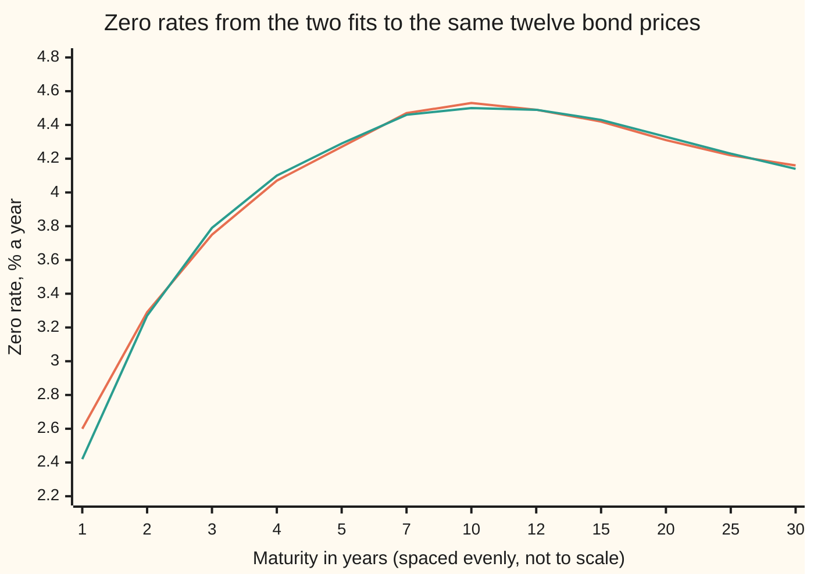
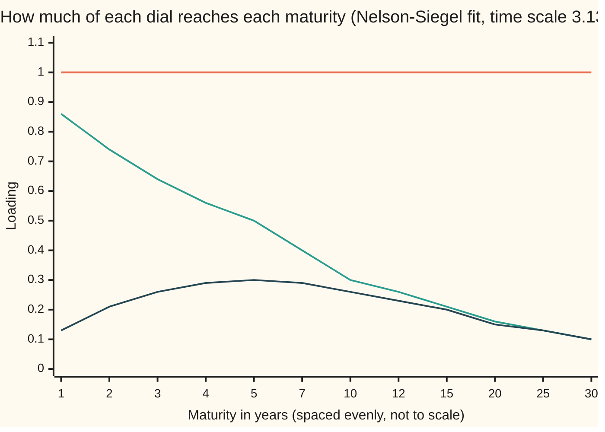
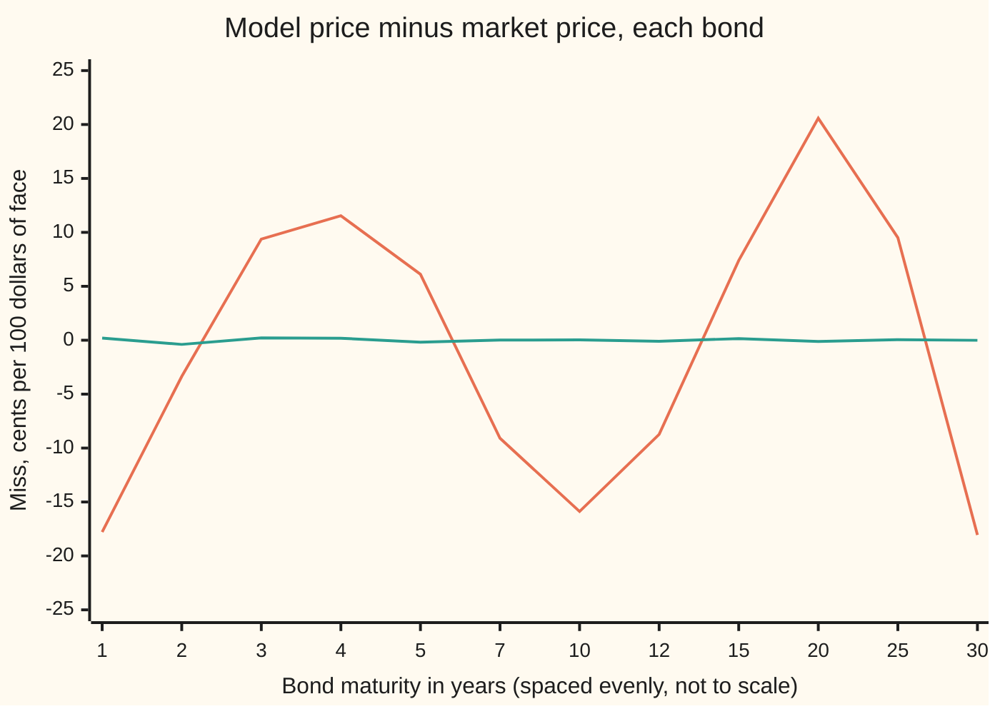

# Fitting a curve with four or six parameters: Nelson-Siegel and Svensson

Financial mathematics → Curves in Depth → A whole curve from a few dials → Fitting a curve with four or six parameters

---

## General Overview

A morning screen shows twelve government bonds. They mature at 1, 2, 3, 4, 5, 7, 10, 12, 15, 20, 25 and 30 years. Each pays a fixed **coupon** once a year (2.00 dollars a year on the shortest, 4.50 on the longest) and 100 dollars at the end. Their prices run from 99.56 dollars for the one-year bond to 103.03 dollars for the thirty-year.

The desk wants one curve that prices all twelve and that can be read at a glance. Bootstrapping, solving for one discount rate per quoted date, needs a bond for every payment date; these twelve bonds pay on thirty different dates. So the desk describes the whole curve with a handful of dials instead.

**Nelson-Siegel** uses four dials: a long-run **level**, a **slope** that fades with maturity, a **hump** in the middle, and a time scale that says where the hump sits. **Svensson** adds a second hump with its own time scale: six dials. Neither can pass through twelve prices exactly. Each is **fitted**: the dials are turned until the curve's twelve prices miss the market's by as little as possible, counting each miss squared.

These twelve prices were built from a known six-dial curve and then rounded to the cent, so the card can see what each fit gets back. Svensson recovers that curve, missing each price by at most 0.39 cents. Nelson-Siegel misses by up to 20.58 cents, and it misreads the long-run level: 3.8595% a year against the true 3.5000%.

**Pick a curve shape with a few readable dials, then turn the dials until the curve's bond prices miss the market's by the smallest total squared amount; the fitted dials are then the curve's level, slope and curvature.**

**What kind of fact this is:** a model: an assumed shape for the curve, not a law of markets. Fitting it is a method, and the formulas that turn the dials into prices are proved on this card in Why it works.

### The picture: two fitted curves

A **zero rate** is the one steady rate, continuously compounded, that turns a dollar paid on a single future date into its price today. Here are the zero rates each fit implies, at the twelve maturities.



First line (orange): Nelson-Siegel, four dials. Second line (green): Svensson, six dials. They agree to within a few hundredths of a percent between 3 and 25 years. They part at the ends: at one year Nelson-Siegel says 2.60% where Svensson says 2.42%. With one hump, Nelson-Siegel cannot start as low and climb as fast as the true curve and still level off at the long end.

---

## The formula

Notation first, in words. Time $t$ is years from today. The **forward rate** $f(t)$ is the rate the curve charges, per year, for a loan that starts at $t$ and lasts a moment. The **zero rate** $R(t)$ is the average of the forward rate from today to $t$. The **discount factor** $D(t)$ is today's price of one dollar paid at $t$. Greek letters name the dials: beta (β) for sizes, tau (τ) for time scales.

Svensson's forward rate is a level plus three shapes:

$$f(t) = \beta_0 + \beta_1\, e^{-t/\tau_1} + \beta_2\, \frac{t}{\tau_1}\, e^{-t/\tau_1} + \beta_3\, \frac{t}{\tau_2}\, e^{-t/\tau_2}$$

**Read it aloud:** the rate far out, plus a piece that starts at full size and fades, plus a hump that rises from zero and fades, plus a second hump on its own clock.

Nelson-Siegel is the same formula with the last term removed: $\beta_3 = 0$, and $\tau_2$ plays no part.

Averaging the forward rate from today to $t$ gives the zero rate:

$$R(t) = \beta_0 + \beta_1\, L\!\left(\tfrac{t}{\tau_1}\right) + \beta_2\, H\!\left(\tfrac{t}{\tau_1}\right) + \beta_3\, H\!\left(\tfrac{t}{\tau_2}\right), \qquad L(x) = \frac{1 - e^{-x}}{x}, \quad H(x) = L(x) - e^{-x}$$

**Read it aloud:** each dial times its **loading**, the share of that dial that reaches maturity $t$.

A bond is a list of payments, so its model price is each payment discounted by the curve. Bond number i pays coupon $c_i$ at years 1, 2, … up to its maturity $n_i$, and 100 dollars at $n_i$:

$$\hat P_i = \sum_{k=1}^{n_i} c_i\, e^{-k\,R(k)} \;+\; 100\, e^{-n_i\,R(n_i)}$$

The fit chooses the dials that make the score smallest:

$$S = \sum_{i=1}^{12} \left(\hat P_i - P_i\right)^2$$

**Read it aloud:** for every bond, the model's price minus the market's price, squared, and added up over the twelve.

| Symbol | Plain meaning | In our example | Push it up and the answer… |
| --- | --- | --- | --- |
| $t$ | maturity: years from today | 1 to 30 | — |
| $f(t)$ | forward rate: the rate for a loan starting at $t$ and lasting a moment | Svensson's forward averages to 4.50300510% over 10 years | — |
| $R(t)$ | zero rate: the average forward from today to $t$ | Nelson-Siegel 4.53% at 10 years | every bond paying near $t$ gets cheaper |
| $D(t)$ | discount factor, $e^{-t R(t)}$: today's price of a dollar paid at $t$ | 0.893511 at 3 years | — |
| $\beta_0$ | level: where the forward and zero rates settle far out | Nelson-Siegel 3.8595%, Svensson 3.5045% | every rate rises, the long end one for one |
| $\beta_1$ | start: the short end minus the level; its negative is the slope | Nelson-Siegel −2.2528% | the short end rises, so the curve flattens |
| $\beta_2$ | hump size | Nelson-Siegel 5.1761% | the middle maturities rise |
| $\tau_1$ | time scale of the fade and the first hump, in years | Nelson-Siegel 3.1347 | the fade lasts longer and the hump moves later |
| $\beta_3$, $\tau_2$ | Svensson's second hump: its size and its time scale | 2.4856% and 6.9781 years | a second bulge grows, and moves later |
| $L$, $H$ | slope loading and hump loading, functions of $x$ = maturity over time scale | at 10 years, Nelson-Siegel: 0.30 and 0.26 | — |
| $P_i$, $\hat P_i$, $c_i$, $n_i$ | market price, model price, coupon and maturity of bond number i | 3-year bond: 97.67, 97.7638, 3.00, 3 | — |
| $S$ | score: sum of squared price misses, in dollars squared | Nelson-Siegel 0.189162, Svensson 0.000036 | the fit is worse |

Conventions verified 28 Sep 2026: the card's bonds pay one coupon a year, on anniversaries of the fit date, so there is no interest accrued between coupons and the quoted price is the whole price. US Treasury notes and bonds pay coupons twice a year and are quoted as **clean** prices, which leave out the interest accrued since the last coupon; a real fit adds that accrued interest back before comparing prices.

### When it holds

- **The curve really is one level, one fade and one or two humps.** When the market's curve has an extra bend, the fit smears the miss across neighbouring bonds. Here Nelson-Siegel's misses reach 20.58 cents because the true curve has a second hump.
- **The prices are comparable.** Same settlement date, clean and accrued interest handled the same way, no bond priced for a special reason such as being the cheapest to deliver into a futures contract. Otherwise the misses measure the data, not the curve.
- **The dials are identified.** Svensson with $\tau_1 = \tau_2$, or with $\beta_3 = 0$, has more dials than the prices can pin down. The fit still prices the bonds; the reading of the dials is lost.
- **Inside the bonds' range.** Past 30 years the curve runs on its assumed shape alone, with no price to check it.
- **One morning at a time.** A fit describes today's curve, not how rates move tomorrow.

---

## Why it works

### Step 0: ask for less than an exact fit

Twelve prices and four dials: in general no setting of four numbers hits twelve targets. So the question changes from "which curve passes through the prices?" to "which curve in this family misses them least?" That is **least squares**: add up the squared misses and make the total as small as possible. Squaring counts a miss twice as large four times as heavily, and makes misses above and below the market count alike.

The family is chosen for reading, not only for fitting. Rate curves move mostly in three patterns: the whole curve up or down, the short end against the long end, and the middle against both ends. [principal-components-of-the-curve](01-principal-components-of-the-curve.md) finds those three patterns in rate history. Nelson-Siegel builds them in as dials.

### Step 1: from a forward rate to a bond price

A dollar paid at $t$ is worth today what is left after the forward rate has been charged, moment by moment, from today to $t$: $D(t) = e^{-\int_0^t f(s)\,ds}$. Writing the integral as $t$ times the average forward, $t\,R(t)$, gives $D(t) = e^{-t R(t)}$. So the zero rate is the average of the forward rate, and averaging each of the three shapes gives its loading. A bond's price is then the sum of its payments, each times its discount factor.

<details>
<summary>Detailed proof: the loadings are averages of the forward shapes</summary>

Put $x = t/\tau$. The flat piece averages to itself: 1.

The fading piece: $\int_0^t e^{-s/\tau}\,ds = \tau\,(1 - e^{-x})$. Divide by $t$: $\frac{1 - e^{-x}}{x} = L(x)$.

The hump: substitute $u = s/\tau$, so $\int_0^t \frac{s}{\tau} e^{-s/\tau}\,ds = \tau \int_0^x u\,e^{-u}\,du = \tau\,\big(1 - (1 + x)e^{-x}\big)$, integrating by parts. Divide by $t$: $\frac{1 - e^{-x}}{x} - e^{-x} = L(x) - e^{-x} = H(x)$.

The second hump is the same calculation on $\tau_2$. Adding the four averages, each times its dial, gives $R(t)$. At $t = 0$ both loadings are defined by their limits, $L = 1$ and $H = 0$, which are the averages over a vanishing interval.

</details>

The checks confirm this without the algebra. They add up Svensson's forward rate over ten years in 2,000 thin slices (Simpson's rule) and divide by ten: 4.50300510%. The closed form gives 4.50300510%.

### Step 2: reading the dials

The loadings decide what each dial means. Far out, $x$ is large, both $L$ and $H$ shrink to zero, and the zero rate settles at $\beta_0$: the **level**. Near today, $x$ is small, $L$ is close to 1 and $H$ close to 0, so the zero rate starts at $\beta_0 + \beta_1$. The long end minus the short end is therefore $-\beta_1$: the **slope**. A negative $\beta_1$ means an upward-sloping curve.

$H$ is zero at both ends and positive between: the **curvature**, or hump. For the zero rate the hump peaks at $x$ = 1.7933, which on the Nelson-Siegel fit is 1.7933 × 3.1347 = 5.6215 years. The forward rate's hump, $\frac{t}{\tau_1} e^{-t/\tau_1}$, peaks earlier, at exactly $t = \tau_1$.



First line (orange, flat at 1): the level reaches every maturity in full. Second line (green): the slope loading $L$, strongest at the short end and fading. Third line (dark): the hump loading $H$, weak at both ends and strongest in the middle.

Read off this morning's Nelson-Siegel fit:

| Dial | Value | What the curve does |
| --- | --- | --- |
| level $\beta_0$ | 3.8595% | the zero rate at 10,000 years is 3.8604%, still creeping down to it |
| short end $\beta_0 + \beta_1$ | 1.6067% | the zero rate at a thousandth of a year is 1.6079% |
| slope $-\beta_1$ | 2.2528% | the long end sits 2.2528% above the short end |
| hump $\beta_2$ | 5.1761% | a bulge in the zero rate peaking near 5.6215 years |

### Step 3: does a best fit exist, and is it the only one?

**Existence.** Keep each dial inside a closed range: the time scales between a small floor and a large ceiling, the sizes between fixed limits. The score is a continuous function of the dials, and a continuous function on a closed, bounded range reaches its lowest value somewhere. So a best fit exists within any such range.

**Uniqueness is not promised.** With the time scales held fixed, the zero rate is a plain weighted sum of the beta dials, and the score is close to a bowl with one bottom, as long as the loadings are not copies of each other. The time scales enter inside exponentials, and the score can have more than one dip along them. That is why the checks start from a grid of time scales rather than a single guess.

**Boundary cases.** Three settings make dials invisible:

- $\tau_1$ near zero: every loading has faded before the first bond pays, so $\beta_1$ and $\beta_2$ touch no price.
- $\tau_1$ very large: $L$ stays near 1 and $H$ near 0 at every bond's maturity, so the slope dial copies the level dial.
- Svensson with $\tau_2 = \tau_1$: the two hump loadings are identical, and only $\beta_2 + \beta_3$ is fixed by the prices. With $\beta_3 = 0$, any $\tau_2$ gives the same prices.

### Step 4: turning the dials, two independent ways

**Road 1, Gauss-Newton.** Near any setting of the dials, a small change in the dials changes each price by roughly a fixed multiple of each change. Those multiples form a table, the **Jacobian**: one row per bond, one column per dial. Replacing the prices by that straight-line approximation turns the problem into an ordinary least-squares problem, which is solved exactly by a small system of linear equations. Take that step, halve it if the score got worse, and repeat. The checks first sweep $\tau_1$ from 0.25 to 10 years with only the beta dials moving, then free all four dials from the best sweep point.

<details>
<summary>The algebra behind the Gauss-Newton step</summary>

Write *r* for the list of twelve misses $\hat P_i - P_i$, and *J* for the Jacobian, with the entry in row i and column j the change in $\hat P_i$ per unit change of dial j. For a beta dial that entry is minus the sum, over bond i's payment dates, of date × payment × discount factor × that dial's loading at the date. The checks estimate every column by nudging the dial up and down by a millionth.

After a step *δ* ("delta") in the dials the misses are about *r* + *Jδ*. Their sum of squares is smallest where its slope in every direction is zero:
$$J^\top J\,\delta = -J^\top r$$
Here $J^\top$ is *J* turned on its side, rows swapped for columns. That is four equations in four unknowns (six for Svensson), solved by Gaussian elimination. Where the columns of *J* are independent, the step is unique. Along it the score first falls, so a short enough step always improves it.

</details>

**Road 2, Nelder-Mead.** This road uses no slopes. It keeps a **simplex**, one more trial setting than there are dials, and each round replaces the worst setting by reflecting it through the middle of the others, stretching or shrinking as the scores dictate. It starts from a plain guess: level 4%, start −2%, no hump, time scale one year.

Both roads land on the same four numbers: 3.8595%, −2.2528%, 5.1761% and 3.1347 years. For Svensson both land on 3.5045%, −2.4956%, 3.9919%, 2.4856%, 2.0074 years and 6.9781 years. The true curve behind the prices is 3.5000%, −2.5000%, 4.0000%, 2.5000%, 2.0000 and 7.0000. The gap is the rounding of prices to the cent.

### Step 5: six dials never fit worse than four

Svensson with $\beta_3 = 0$ is Nelson-Siegel. So every Nelson-Siegel curve is also a Svensson curve, and Svensson's best score can only be equal or lower: 0.000036 against 0.189162 dollars squared. Extra dials never raise the score. The question is whether they lower it by more than noise. Here Svensson's typical miss, the root of the mean squared miss, is 0.173 cents, the size of rounding to the cent. Nelson-Siegel's is 12.555 cents, and its misses run in waves: negative, positive, negative, positive, negative along the maturities. A pattern in the misses is a missing shape.

A different road fits yields rather than prices. Price misses weigh long bonds more heavily in rate terms, because their prices move more per unit of rate; yield misses weigh every maturity alike, and give somewhat different dials. Svensson's 1994 paper discusses both choices. [curve-interpolation-and-shape](../02-Curves/05-curve-interpolation-and-shape.md) fits Nelson-Siegel to zero rates directly, which is simpler when a bootstrapped curve already exists.

---

## Worked numbers, by hand

Price the 3-year bond, coupon 3.00 dollars, on the Nelson-Siegel fit. At one year $x$ = 1/3.1347, so $L$ = 0.8562 and $H$ = 0.1293 (the code prints them).

| Step | Arithmetic | Value |
| --- | --- | --- |
| zero rate at 1 year | 3.8595 + (−2.2528)(0.8562) + 5.1761(0.1293) | 2.6000% (2.5999 from the rounded inputs) |
| discount factor at 1 year | $e^{-1 \times 2.6000\%}$ | 0.974335 |
| zero rate at 2 years | same recipe | 3.2858% |
| discount factor at 2 years | $e^{-2 \times 3.2858\%}$ | 0.936396 |
| zero rate at 3 years | same recipe | 3.7532% |
| discount factor at 3 years | $e^{-3 \times 3.7532\%}$ | 0.893511 |
| model price | 3 × 0.974335 + 3 × 0.936396 + 103 × 0.893511 | 97.7638 |
| market price | quoted | 97.67 |
| **miss** | 97.7638 − 97.67 | **+9.38 cents** |

The four-dial curve prices this bond 9.38 cents too high. Its 3-year zero rate, which discounts the final 103 dollars, is too low: 3.75% against Svensson's 3.79%. The true curve starts lower and climbs faster than one hump allows.

Now all twelve misses, for both fits:



First line (orange): Nelson-Siegel, swinging between −18.05 and +20.58 cents in waves. Second line (green): Svensson, hugging zero, never beyond 0.39 cents.

### What breaks if you drop a piece

| Mistake | Comes out at | What went wrong |
| --- | --- | --- |
| Treat each bond's yield to maturity as the zero rate at its maturity, and fit to those | dials 3.9080%, −2.4172%, 5.1598%; worst price miss 0.5246 dollars, against 20.58 cents for the proper fit | a yield is one flat rate for a whole stream of payments; a zero rate belongs to a single date |
| Discount with the forward rate $f(t)$ in place of the zero rate $R(t)$ | the 30-year bond at 107.4188 instead of 102.8495 | a dollar at 30 years is discounted by the average forward over 30 years, not the forward at year 30 |
| Hold $\tau_1$ at 1.3684 years, the value Diebold and Li fixed for monthly US data | score 4.897487 against 0.189162; start −5.9522%, hump 7.5400% | with the time scale wrong the other dials contort to compensate, and they stop meaning level, slope and hump |

The **yield to maturity** in the first row is the one flat rate, continuously compounded here, that reprices a bond; the checks find it for each bond by bisection, halving an interval of rates 200 times.

---

## Code, from first principles, and it actually runs

The code builds the twelve prices from the known six-dial curve, rounded to the cent, and fits each form by two independent roads: Gauss-Newton after a grid of time scales, and Nelder-Mead from a plain guess. Its asserts check that the roads agree, that the zero-rate formula matches a brute-force average of the forward, that Svensson fits no worse than Nelson-Siegel, and that Svensson recovers the true curve. It prints every number on this card. Nothing imported knows an answer: the linear solver, both optimisers, the integral and the yield solver are written out.

### Python

```python
# Nelson-Siegel and Svensson fitted to twelve bond prices -- the check behind the card.
# Standard library only.  Gaussian elimination, Gauss-Newton, Nelder-Mead, Simpson's rule
# and the bisection yield solver are all written out below.
from math import exp

BONDS = [(1, 2.00), (2, 2.50), (3, 3.00), (4, 3.25), (5, 3.50), (7, 3.75),
         (10, 4.00), (12, 4.00), (15, 4.25), (20, 4.25), (25, 4.50), (30, 4.50)]  # (years, coupon per 100)
TRUE = (0.035, -0.025, 0.040, 0.025, 2.0, 7.0)          # the six-parameter curve the prices were built from

def L(x): return (1 - exp(-x)) / x                      # slope loading of the zero rate
def H(x): return L(x) - exp(-x)                         # hump loading of the zero rate
def zero(t, p):                                         # p = (b0, b1, b2, tau1) or (b0, b1, b2, b3, tau1, tau2)
    z = p[0] + p[1] * L(t / p[-2 if len(p) == 6 else -1]) + p[2] * H(t / p[-2 if len(p) == 6 else -1])
    return z + (p[3] * H(t / p[5]) if len(p) == 6 else 0.0)
def fwd(t, p):
    a = t / (p[4] if len(p) == 6 else p[3])
    f = p[0] + p[1] * exp(-a) + p[2] * a * exp(-a)
    return f + (p[3] * (t / p[5]) * exp(-t / p[5]) if len(p) == 6 else 0.0)
def flows(n, c): return [(k, c + (100.0 if k == n else 0.0)) for k in range(1, n + 1)]
def price(n, c, p, rate=zero): return sum(cf * exp(-t * rate(t, p)) for t, cf in flows(n, c))
MKT = [round(price(n, c, TRUE), 2) for n, c in BONDS]  # quoted to the cent
def sse(p, mkt=MKT): return sum((price(n, c, p) - m) ** 2 for (n, c), m in zip(BONDS, mkt))

def solve(A, b):                                        # Gaussian elimination with pivoting
    n = len(b); M = [row[:] + [b[i]] for i, row in enumerate(A)]
    for k in range(n):
        piv = max(range(k, n), key=lambda i: abs(M[i][k])); M[k], M[piv] = M[piv], M[k]
        for i in range(k + 1, n):
            f = M[i][k] / M[k][k]
            for j in range(k, n + 1): M[i][j] -= f * M[k][j]
    x = [0.0] * n
    for i in reversed(range(n)): x[i] = (M[i][n] - sum(M[i][j] * x[j] for j in range(i + 1, n))) / M[i][i]
    return x

def gn(p, free, mkt=MKT):                               # road 1: Gauss-Newton on the free parameters
    p = list(p)
    for _ in range(40):
        J = []
        for j in free:                                  # slopes of the twelve prices, by central differences
            up, dn = p[:], p[:]; up[j] += 1e-6; dn[j] -= 1e-6
            J.append([(price(n, c, up) - price(n, c, dn)) / 2e-6 for n, c in BONDS])
        r = [price(n, c, p) - m for (n, c), m in zip(BONDS, mkt)]
        step = solve([[sum(x * y for x, y in zip(u, v)) for v in J] for u in J], [-sum(x * y for x, y in zip(u, r)) for u in J])
        old, h = sse(p, mkt), 1.0
        def moved(h): q = p[:]; [q.__setitem__(j, q[j] + h * s) for j, s in zip(free, step)]; return q
        while sse(moved(h), mkt) > old and h > 1e-6: h /= 2
        p = moved(h)
        if max(abs(s) for s in step) < 1e-12: break
    return tuple(p)

def road1_ns(mkt=MKT):                                  # grid on tau with the betas solved, then all four
    start = min(([0.04, 0, 0, 0.25 * i] for i in range(1, 41)), key=lambda q: sse(gn(q, [0, 1, 2], mkt), mkt))
    return gn(gn(start, [0, 1, 2], mkt), [0, 1, 2, 3], mkt)

def road1_sv():                                         # grid on both taus, then all six
    start = min(([0.04, 0, 0, 0, 0.5 * i, 0.5 * j] for i in range(1, 11) for j in range(4, 31) if j > i + 1),
                key=lambda q: sse(gn(q, [0, 1, 2, 3])))
    return gn(gn(start, [0, 1, 2, 3]), range(6))

def nelder_mead(f, x0, steps, rounds=12, iters=800):  # road 2: all parameters at once, no derivatives
    best, n = list(x0), len(x0)
    for _ in range(rounds):
        S = [best[:]] + [[best[j] + (steps[j] if j == i else 0.0) for j in range(n)] for i in range(n)]
        S = sorted((f(v), v) for v in S)
        for _ in range(iters):
            c = [sum(v[j] for _, v in S[:-1]) / n for j in range(n)]
            pt = lambda s: [c[j] + s * (S[-1][1][j] - c[j]) for j in range(n)]
            r = pt(-1.0); fr = f(r)
            if fr < S[0][0]:
                e = pt(-2.0); fe = f(e); S[-1] = (fe, e) if fe < fr else (fr, r)
            elif fr < S[-2][0]: S[-1] = (fr, r)
            else:
                k = pt(0.5); fk = f(k)
                if fk < S[-1][0]: S[-1] = (fk, k)
                else: S = [S[0]] + [(f(w), w) for w in ([S[0][1][j] + 0.5 * (v[j] - S[0][1][j]) for j in range(n)] for _, v in S[1:])]
            S.sort(key=lambda z: z[0])
        best = S[0][1]; steps = [s * 0.3 for s in steps]
    return tuple(best)

def safe(p): return sse(p) if min(p[-2:] if len(p) == 6 else p[-1:]) > 0.05 else 1e9
def simpson(g, a, b, n=2000):
    h = (b - a) / n
    return (g(a) + g(b) + sum((4 if i % 2 else 2) * g(a + i * h) for i in range(1, n))) * h / 3
def ytm(n, c, m):                                        # bisection: one flat rate that reprices the bond
    lo, hi = -0.05, 0.20
    for _ in range(200):
        mid = (lo + hi) / 2
        lo, hi = (mid, hi) if sum(cf * exp(-t * mid) for t, cf in flows(n, c)) > m else (lo, mid)
    return (lo + hi) / 2

ns1, sv1 = road1_ns(), road1_sv()
ns2 = nelder_mead(safe, (0.04, -0.02, 0.0, 1.0), (0.01, 0.01, 0.01, 0.5))
sv2 = nelder_mead(safe, (0.04, -0.02, 0.0, 0.0, 1.0, 5.0), (0.01, 0.01, 0.01, 0.01, 0.5, 2.0))
fmt = lambda p: " ".join(f"{100 * x:.4f}" for x in p[:-2 if len(p) == 6 else -1]) + " | " + " ".join(f"{x:.4f}" for x in p[-2 if len(p) == 6 else -1:])
print("fit             betas (% a year)                    | taus (years)")
for lab, p in (("NS road 1", ns1), ("NS road 2", ns2), ("SV road 1", sv1), ("SV road 2", sv2), ("SV truth", TRUE)):
    print(f"{lab:<15} {fmt(p)}")
rms = lambda p: (sse(p) / 12) ** 0.5
print(f"score: NS {sse(ns1):.6f}  SV {sse(sv1):.6f}  (dollars squared); rms miss NS {100 * rms(ns1):.3f}c SV {100 * rms(sv1):.3f}c")
print("bond  coupon  market  NS miss, cents  SV miss, cents  yield %  NS zero %  SV zero %")
for (n, c), m in zip(BONDS, MKT):
    print(f"{n:>4} {c:7.2f} {m:8.2f} {100 * (price(n, c, ns1) - m):+15.2f} {100 * (price(n, c, sv1) - m):+15.2f}"
          f" {100 * ytm(n, c, m):8.2f} {100 * zero(n, ns1):10.2f} {100 * zero(n, sv1):10.2f}")
b0, b1, b2, t1 = ns1
print(f"read NS: long level b0 {100 * b0:.4f}%, zero at 10000y {100 * zero(10000, ns1):.4f}%; short end b0+b1 {100 * (b0 + b1):.4f}%, "
      f"zero at 0.001y {100 * zero(0.001, ns1):.4f}%")
xp = max((i * 1e-5 for i in range(1, 500001)), key=H)
print(f"read NS: slope long minus short = -b1 = {-100 * b1:.4f}%; zero-rate hump peaks at x = {xp:.4f}, t = {xp * t1:.4f}y")
print(f"read SV: long level b0 {100 * sv1[0]:.4f}%, short end b0+b1 {100 * (sv1[0] + sv1[1]):.4f}%; truth {100 * TRUE[0]:.4f}% and {100 * (TRUE[0] + TRUE[1]):.4f}%")
print("loadings at NS tau, years: " + " ".join(f"{n}" for n, _ in BONDS))
print("  slope L " + " ".join(f"{L(n / t1):.2f}" for n, _ in BONDS))
print("  hump  H " + " ".join(f"{H(n / t1):.2f}" for n, _ in BONDS))
ci = simpson(lambda s: fwd(s, sv1), 0.0, 10.0) / 10.0
print(f"SV 10y zero: closed form {100 * zero(10, sv1):.8f}%  integral of forward / 10 {100 * ci:.8f}%")
n3, c3 = BONDS[2]
print("3y bond by hand: " + "  ".join(f"t={t} L={L(t / t1):.4f} H={H(t / t1):.4f} R={100 * zero(t, ns1):.4f}% D={exp(-t * zero(t, ns1)):.6f}" for t, _ in flows(n3, c3))
      + f"  price {price(n3, c3, ns1):.4f}")
yl = [ytm(n, c, m) for (n, c), m in zip(BONDS, MKT)]
cols = [[1.0] * 12, [L(n / t1) for n, _ in BONDS], [H(n / t1) for n, _ in BONDS]]
lin = solve([[sum(a * b for a, b in zip(u, v)) for v in cols] for u in cols], [sum(a * y for a, y in zip(u, yl)) for u in cols])
print("wrong: yields fitted as zero rates (same tau): betas " + " ".join(f"{100 * x:.4f}" for x in lin)
      + f"; worst price miss {max(abs(price(n, c, tuple(lin) + (t1,)) - m) for (n, c), m in zip(BONDS, MKT)):.4f}")
print(f"wrong: forward used as zero rate, 30y bond: {price(30, 4.5, ns1, fwd):.4f} vs NS {price(30, 4.5, ns1):.4f}")
dl = gn([0.04, 0, 0, 1 / (12 * 0.0609)], [0, 1, 2])
print(f"wrong: tau fixed at 1.3684y: betas {100 * dl[0]:.4f} {100 * dl[1]:.4f} {100 * dl[2]:.4f} score {sse(dl):.6f}")
m2 = [round(price(n, c, TRUE[:3] + (2.0,)), 2) for n, c in BONDS]; t2 = road1_ns(m2)
print(f"try: prices from a four-parameter curve: NS fit {fmt(t2)}; score {sse(t2, m2):.6f}")
m3 = [price(n, c, TRUE) for n, c in BONDS]
print(f"try: prices not rounded: SV fit {fmt(gn(sv1, range(6), m3))}")
m4 = [m + (0.10 if n == 10 else 0.0) for (n, c), m in zip(BONDS, MKT)]
print(f"try: 10y bond 10 cents dearer: NS fit {fmt(gn(ns1, range(4), m4))}")
assert all(abs(a - b) < 1e-6 for a, b in zip(ns1, ns2)), "NS: road 1 and road 2 must land on the same fit"
assert all(abs(a - b) < 1e-5 for a, b in zip(sv1, sv2)), "SV: road 1 and road 2 must land on the same fit"
assert sse(sv1) <= sse(ns1), "Svensson contains Nelson-Siegel, so it cannot fit worse"
assert abs(zero(10, sv1) - ci) < 1e-10, "zero rate must equal the average of the forward"
assert all(abs(a - b) < 2e-4 for a, b in zip(sv1[:4], TRUE[:4])), "SV betas must recover the curve the prices came from"
print("ALL CHECKS PASS")
```

**Ran 2026-09-28 on macOS, Python 3.14.6, standard library only. All checks passed. Output, pasted from the run:**

```
fit             betas (% a year)                    | taus (years)
NS road 1       3.8595 -2.2528 5.1761 | 3.1347
NS road 2       3.8595 -2.2528 5.1761 | 3.1347
SV road 1       3.5045 -2.4956 3.9919 2.4856 | 2.0074 6.9781
SV road 2       3.5045 -2.4956 3.9919 2.4856 | 2.0074 6.9781
SV truth        3.5000 -2.5000 4.0000 2.5000 | 2.0000 7.0000
score: NS 0.189162  SV 0.000036  (dollars squared); rms miss NS 12.555c SV 0.173c
bond  coupon  market  NS miss, cents  SV miss, cents  yield %  NS zero %  SV zero %
   1    2.00    99.56          -17.79           +0.20     2.42       2.60       2.42
   2    2.50    98.45           -3.36           -0.39     3.26       3.29       3.27
   3    3.00    97.67           +9.38           +0.22     3.77       3.75       3.79
   4    3.25    96.75          +11.54           +0.18     4.06       4.07       4.10
   5    3.50    96.33           +6.12           -0.18     4.24       4.27       4.29
   7    3.75    95.56           -9.09           +0.01     4.41       4.47       4.46
  10    4.00    95.60          -15.88           +0.03     4.46       4.53       4.50
  12    4.00    95.01           -8.73           -0.10     4.45       4.49       4.49
  15    4.25    97.18           +7.39           +0.15     4.41       4.42       4.43
  20    4.25    97.51          +20.58           -0.11     4.34       4.31       4.33
  25    4.50   101.89           +9.51           +0.05     4.28       4.22       4.23
  30    4.50   103.03          -18.05           -0.01     4.23       4.16       4.14
read NS: long level b0 3.8595%, zero at 10000y 3.8604%; short end b0+b1 1.6067%, zero at 0.001y 1.6079%
read NS: slope long minus short = -b1 = 2.2528%; zero-rate hump peaks at x = 1.7933, t = 5.6215y
read SV: long level b0 3.5045%, short end b0+b1 1.0088%; truth 3.5000% and 1.0000%
loadings at NS tau, years: 1 2 3 4 5 7 10 12 15 20 25 30
  slope L 0.86 0.74 0.64 0.56 0.50 0.40 0.30 0.26 0.21 0.16 0.13 0.10
  hump  H 0.13 0.21 0.26 0.29 0.30 0.29 0.26 0.23 0.20 0.15 0.13 0.10
SV 10y zero: closed form 4.50300510%  integral of forward / 10 4.50300510%
3y bond by hand: t=1 L=0.8562 H=0.1293 R=2.6000% D=0.974335  t=2 L=0.7393 H=0.2109 R=3.2858% D=0.936396  t=3 L=0.6436 H=0.2596 R=3.7532% D=0.893511  price 97.7638
wrong: yields fitted as zero rates (same tau): betas 3.9080 -2.4172 5.1598; worst price miss 0.5246
wrong: forward used as zero rate, 30y bond: 107.4188 vs NS 102.8495
wrong: tau fixed at 1.3684y: betas 4.1961 -5.9522 7.5400 score 4.897487
try: prices from a four-parameter curve: NS fit 3.5004 -2.5124 4.0129 | 1.9942; score 0.000051
try: prices not rounded: SV fit 3.5000 -2.5000 4.0000 2.5000 | 2.0000 7.0000
try: 10y bond 10 cents dearer: NS fit 3.8655 -2.2464 5.1331 | 3.1313
ALL CHECKS PASS
```

### Rust

```rust
// Nelson-Siegel and Svensson fitted to twelve bond prices -- the same check in Rust, std only.
// Gaussian elimination, Gauss-Newton, Nelder-Mead, Simpson's rule and bisection are written out.
const BONDS: [(u32, f64); 12] = [(1, 2.00), (2, 2.50), (3, 3.00), (4, 3.25), (5, 3.50), (7, 3.75),
    (10, 4.00), (12, 4.00), (15, 4.25), (20, 4.25), (25, 4.50), (30, 4.50)];
const TRUE: [f64; 6] = [0.035, -0.025, 0.040, 0.025, 2.0, 7.0];

fn l(x: f64) -> f64 { (1.0 - (-x).exp()) / x }                 // slope loading of the zero rate
fn h(x: f64) -> f64 { l(x) - (-x).exp() }                        // hump loading of the zero rate
fn tau1(p: &[f64]) -> f64 { if p.len() == 6 { p[4] } else { p[3] } }
fn zero(t: f64, p: &[f64]) -> f64 {
    let z = p[0] + p[1] * l(t / tau1(p)) + p[2] * h(t / tau1(p));
    if p.len() == 6 { z + p[3] * h(t / p[5]) } else { z }
}
fn fwd(t: f64, p: &[f64]) -> f64 {
    let a = t / tau1(p);
    let f = p[0] + p[1] * (-a).exp() + p[2] * a * (-a).exp();
    if p.len() == 6 { f + p[3] * (t / p[5]) * (-t / p[5]).exp() } else { f }
}
fn flows(n: u32, c: f64) -> Vec<(f64, f64)> { (1..=n).map(|k| (k as f64, c + if k == n { 100.0 } else { 0.0 })).collect() }
fn price_with(n: u32, c: f64, p: &[f64], rate: fn(f64, &[f64]) -> f64) -> f64 {
    flows(n, c).iter().map(|&(t, cf)| cf * (-t * rate(t, p)).exp()).sum()
}
fn price(n: u32, c: f64, p: &[f64]) -> f64 { price_with(n, c, p, zero) }
fn sse(p: &[f64], mkt: &[f64]) -> f64 { BONDS.iter().zip(mkt).map(|(&(n, c), m)| (price(n, c, p) - m).powi(2)).sum() }

fn solve(a: Vec<Vec<f64>>, b: Vec<f64>) -> Vec<f64> {          // Gaussian elimination with pivoting
    let n = b.len();
    let mut m: Vec<Vec<f64>> = a.into_iter().zip(b).map(|(mut r, v)| { r.push(v); r }).collect();
    for k in 0..n {
        let piv = (k..n).max_by(|&i, &j| m[i][k].abs().total_cmp(&m[j][k].abs())).unwrap(); m.swap(k, piv);
        for i in k + 1..n {
            let f = m[i][k] / m[k][k];
            for j in k..=n { m[i][j] -= f * m[k][j]; }
        }
    }
    let mut x = vec![0.0; n];
    for i in (0..n).rev() { x[i] = (m[i][n] - (i + 1..n).map(|j| m[i][j] * x[j]).sum::<f64>()) / m[i][i]; }
    x
}
fn gram(rows: &[Vec<f64>], y: &[f64]) -> (Vec<Vec<f64>>, Vec<f64>) {
    (rows.iter().map(|u| rows.iter().map(|v| u.iter().zip(v).map(|(a, b)| a * b).sum()).collect()).collect(),
     rows.iter().map(|u| u.iter().zip(y).map(|(a, b)| a * b).sum()).collect())
}
fn gn(p0: &[f64], free: &[usize], mkt: &[f64]) -> Vec<f64> {    // road 1: Gauss-Newton on the free parameters
    let mut p = p0.to_vec();
    for _ in 0..40 {
        let jac: Vec<Vec<f64>> = free.iter().map(|&j| {
            let (mut up, mut dn) = (p.clone(), p.clone()); up[j] += 1e-6; dn[j] -= 1e-6;
            BONDS.iter().map(|&(n, c)| (price(n, c, &up) - price(n, c, &dn)) / 2e-6).collect()
        }).collect();
        let r: Vec<f64> = BONDS.iter().zip(mkt).map(|(&(n, c), m)| m - price(n, c, &p)).collect();
        let (a, b) = gram(&jac, &r); let step = solve(a, b);
        let moved = |hh: f64| { let mut q = p.clone(); for (&j, s) in free.iter().zip(&step) { q[j] += hh * s; } q };
        let (old, mut hh) = (sse(&p, mkt), 1.0);
        while sse(&moved(hh), mkt) > old && hh > 1e-6 { hh /= 2.0; }
        p = moved(hh);
        if step.iter().fold(0.0_f64, |a, s| a.max(s.abs())) < 1e-12 { break; }
    }
    p
}
fn ns_fit(mkt: &[f64]) -> Vec<f64> {                            // grid on tau with the betas solved, then all four
    let start = (1..=40).map(|i| gn(&[0.04, 0.0, 0.0, 0.25 * i as f64], &[0, 1, 2], mkt))
        .min_by(|a, b| sse(a, mkt).total_cmp(&sse(b, mkt))).unwrap();
    gn(&start, &[0, 1, 2, 3], mkt)
}
fn nelder_mead(f: &dyn Fn(&[f64]) -> f64, x0: &[f64], steps0: &[f64]) -> Vec<f64> {   // road 2: no derivatives
    let n = x0.len();
    let (mut best, mut steps) = (x0.to_vec(), steps0.to_vec());
    for _ in 0..12 {
        let mut s: Vec<(f64, Vec<f64>)> = (0..=n).map(|i| {
            let mut v = best.clone(); if i > 0 { v[i - 1] += steps[i - 1]; } (f(&v), v)
        }).collect();
        s.sort_by(|a, b| a.0.total_cmp(&b.0));
        for _ in 0..800 {
            let c: Vec<f64> = (0..n).map(|j| s[..n].iter().map(|z| z.1[j]).sum::<f64>() / n as f64).collect();
            let pt = |k: f64, w: &[f64]| -> Vec<f64> { (0..n).map(|j| c[j] + k * (w[j] - c[j])).collect() };
            let worst = s[n].1.clone();
            let r = pt(-1.0, &worst); let fr = f(&r);
            if fr < s[0].0 {
                let e = pt(-2.0, &worst); let fe = f(&e); s[n] = if fe < fr { (fe, e) } else { (fr, r) };
            } else if fr < s[n - 1].0 { s[n] = (fr, r); } else {
                let k = pt(0.5, &worst); let fk = f(&k);
                if fk < s[n].0 { s[n] = (fk, k); } else {
                    let b0 = s[0].1.clone();
                    for z in s.iter_mut().skip(1) {
                        let w: Vec<f64> = (0..n).map(|j| b0[j] + 0.5 * (z.1[j] - b0[j])).collect();
                        *z = (f(&w), w);
                    }
                }
            }
            s.sort_by(|a, b| a.0.total_cmp(&b.0));
        }
        best = s[0].1.clone(); for st in steps.iter_mut() { *st *= 0.3; }
    }
    best
}
fn simpson(g: &dyn Fn(f64) -> f64, a: f64, b: f64, n: usize) -> f64 {
    let hh = (b - a) / n as f64;
    (g(a) + g(b) + (1..n).map(|i| if i % 2 == 1 { 4.0 } else { 2.0 } * g(a + i as f64 * hh)).sum::<f64>()) * hh / 3.0
}
fn ytm(n: u32, c: f64, m: f64) -> f64 {                          // bisection: one flat rate that reprices the bond
    let (mut lo, mut hi) = (-0.05_f64, 0.20_f64);
    for _ in 0..200 { let mid = (lo + hi) / 2.0;
        if flows(n, c).iter().map(|&(t, cf)| cf * (-t * mid).exp()).sum::<f64>() > m { lo = mid } else { hi = mid } }
    (lo + hi) / 2.0
}
fn fmt(p: &[f64]) -> String {
    let (k, j) = (p.len() / 2 + 1, |v: Vec<String>| v.join(" "));
    format!("{} | {}", j(p[..k].iter().map(|x| format!("{:.4}", 100.0 * x)).collect()), j(p[k..].iter().map(|x| format!("{:.4}", x)).collect()))
}
fn main() {
    let mkt: Vec<f64> = BONDS.iter().map(|&(n, c)| (price(n, c, &TRUE) * 100.0).round() / 100.0).collect();
    let ns1 = ns_fit(&mkt);
    let mut best = (f64::INFINITY, vec![]);
    for i in 1..=10 { for j in 4..=30 { if j > i + 1 {
        let q = gn(&[0.04, 0.0, 0.0, 0.0, 0.5 * i as f64, 0.5 * j as f64], &[0, 1, 2, 3], &mkt);
        let v = sse(&q, &mkt); if v < best.0 { best = (v, q); }
    } } }
    let sv1 = gn(&best.1, &[0, 1, 2, 3, 4, 5], &mkt);
    let safe = |p: &[f64]| if p[3..].iter().skip(if p.len() == 6 { 1 } else { 0 }).all(|&t| t > 0.05) { sse(p, &mkt) } else { 1e9 };
    let ns2 = nelder_mead(&safe, &[0.04, -0.02, 0.0, 1.0], &[0.01, 0.01, 0.01, 0.5]);
    let sv2 = nelder_mead(&safe, &[0.04, -0.02, 0.0, 0.0, 1.0, 5.0], &[0.01, 0.01, 0.01, 0.01, 0.5, 2.0]);
    println!("fit             betas (% a year)                    | taus (years)");
    for (lab, p) in [("NS road 1", &ns1), ("NS road 2", &ns2), ("SV road 1", &sv1), ("SV road 2", &sv2), ("SV truth", &TRUE.to_vec())] {
        println!("{:<15} {}", lab, fmt(p));
    }
    let rms = |p: &[f64]| (sse(p, &mkt) / 12.0).sqrt();
    println!("score: NS {:.6}  SV {:.6}  (dollars squared); rms miss NS {:.3}c SV {:.3}c", sse(&ns1, &mkt), sse(&sv1, &mkt), 100.0 * rms(&ns1), 100.0 * rms(&sv1));
    println!("bond  coupon  market  NS miss, cents  SV miss, cents  yield %  NS zero %  SV zero %");
    for (&(n, c), &m) in BONDS.iter().zip(&mkt) {
        println!("{:>4} {:7.2} {:8.2} {:+15.2} {:+15.2} {:8.2} {:10.2} {:10.2}", n, c, m, 100.0 * (price(n, c, &ns1) - m),
            100.0 * (price(n, c, &sv1) - m), 100.0 * ytm(n, c, m), 100.0 * zero(n as f64, &ns1), 100.0 * zero(n as f64, &sv1));
    }
    let (b0, b1, t1) = (ns1[0], ns1[1], ns1[3]);
    println!("read NS: long level b0 {:.4}%, zero at 10000y {:.4}%; short end b0+b1 {:.4}%, zero at 0.001y {:.4}%",
        100.0 * b0, 100.0 * zero(10000.0, &ns1), 100.0 * (b0 + b1), 100.0 * zero(0.001, &ns1));
    let xp = (1..=500000).map(|i| i as f64 * 1e-5).fold((0.0, f64::MIN), |a, x| if h(x) > a.1 { (x, h(x)) } else { a }).0;
    println!("read NS: slope long minus short = -b1 = {:.4}%; zero-rate hump peaks at x = {:.4}, t = {:.4}y", -100.0 * b1, xp, xp * t1);
    println!("read SV: long level b0 {:.4}%, short end b0+b1 {:.4}%; truth {:.4}% and {:.4}%", 100.0 * sv1[0], 100.0 * (sv1[0] + sv1[1]), 100.0 * TRUE[0], 100.0 * (TRUE[0] + TRUE[1]));
    let row = |g: &dyn Fn(f64) -> String| BONDS.iter().map(|&(n, _)| g(n as f64)).collect::<Vec<_>>().join(" ");
    println!("loadings at NS tau, years: {}", row(&|n| format!("{}", n)));
    println!("  slope L {}", row(&|n| format!("{:.2}", l(n / t1))));
    println!("  hump  H {}", row(&|n| format!("{:.2}", h(n / t1))));
    let ci = simpson(&|s| fwd(s, &sv1), 0.0, 10.0, 2000) / 10.0;
    println!("SV 10y zero: closed form {:.8}%  integral of forward / 10 {:.8}%", 100.0 * zero(10.0, &sv1), 100.0 * ci);
    let parts: Vec<String> = flows(3, 3.0).iter().map(|&(t, _)| format!("t={} L={:.4} H={:.4} R={:.4}% D={:.6}", t, l(t / t1), h(t / t1), 100.0 * zero(t, &ns1), (-t * zero(t, &ns1)).exp())).collect();
    println!("3y bond by hand: {}  price {:.4}", parts.join("  "), price(3, 3.0, &ns1));
    let yl: Vec<f64> = BONDS.iter().zip(&mkt).map(|(&(n, c), &m)| ytm(n, c, m)).collect();
    let cols: Vec<Vec<f64>> = vec![vec![1.0; 12], BONDS.iter().map(|&(n, _)| l(n as f64 / t1)).collect(), BONDS.iter().map(|&(n, _)| h(n as f64 / t1)).collect()];
    let (a, b) = gram(&cols, &yl);
    let mut lin = solve(a, b); lin.push(t1);
    let worst = BONDS.iter().zip(&mkt).map(|(&(n, c), m)| (price(n, c, &lin) - m).abs()).fold(0.0_f64, f64::max);
    println!("wrong: yields fitted as zero rates (same tau): betas {:.4} {:.4} {:.4}; worst price miss {:.4}", 100.0 * lin[0], 100.0 * lin[1], 100.0 * lin[2], worst);
    println!("wrong: forward used as zero rate, 30y bond: {:.4} vs NS {:.4}", price_with(30, 4.5, &ns1, fwd), price(30, 4.5, &ns1));
    let dl = gn(&[0.04, 0.0, 0.0, 1.0 / (12.0 * 0.0609)], &[0, 1, 2], &mkt);
    println!("wrong: tau fixed at 1.3684y: betas {:.4} {:.4} {:.4} score {:.6}", 100.0 * dl[0], 100.0 * dl[1], 100.0 * dl[2], sse(&dl, &mkt));
    let m2: Vec<f64> = BONDS.iter().map(|&(n, c)| (price(n, c, &[0.035, -0.025, 0.040, 2.0]) * 100.0).round() / 100.0).collect();
    let t2 = ns_fit(&m2);
    println!("try: prices from a four-parameter curve: NS fit {}; score {:.6}", fmt(&t2), sse(&t2, &m2));
    let m3: Vec<f64> = BONDS.iter().map(|&(n, c)| price(n, c, &TRUE)).collect();
    println!("try: prices not rounded: SV fit {}", fmt(&gn(&sv1, &[0, 1, 2, 3, 4, 5], &m3)));
    let m4: Vec<f64> = BONDS.iter().zip(&mkt).map(|(&(n, _), &m)| m + if n == 10 { 0.10 } else { 0.0 }).collect();
    println!("try: 10y bond 10 cents dearer: NS fit {}", fmt(&gn(&ns1, &[0, 1, 2, 3], &m4)));
    assert!(ns1.iter().zip(&ns2).all(|(a, b)| (a - b).abs() < 1e-6), "NS: road 1 and road 2 must land on the same fit");
    assert!(sv1.iter().zip(&sv2).all(|(a, b)| (a - b).abs() < 1e-5), "SV: road 1 and road 2 must land on the same fit");
    assert!(sse(&sv1, &mkt) <= sse(&ns1, &mkt), "Svensson contains Nelson-Siegel, so it cannot fit worse");
    assert!((zero(10.0, &sv1) - ci).abs() < 1e-10, "zero rate must equal the average of the forward");
    assert!(sv1[..4].iter().zip(&TRUE[..4]).all(|(a, b)| (a - b).abs() < 2e-4), "SV betas must recover the curve the prices came from");
    println!("ALL CHECKS PASS");
}
```

**Ran 2026-09-28 on macOS, rustc 1.98.1, no crates. All checks passed. Output, pasted from the run:**

```
fit             betas (% a year)                    | taus (years)
NS road 1       3.8595 -2.2528 5.1761 | 3.1347
NS road 2       3.8595 -2.2528 5.1761 | 3.1347
SV road 1       3.5045 -2.4956 3.9919 2.4856 | 2.0074 6.9781
SV road 2       3.5045 -2.4956 3.9919 2.4856 | 2.0074 6.9781
SV truth        3.5000 -2.5000 4.0000 2.5000 | 2.0000 7.0000
score: NS 0.189162  SV 0.000036  (dollars squared); rms miss NS 12.555c SV 0.173c
bond  coupon  market  NS miss, cents  SV miss, cents  yield %  NS zero %  SV zero %
   1    2.00    99.56          -17.79           +0.20     2.42       2.60       2.42
   2    2.50    98.45           -3.36           -0.39     3.26       3.29       3.27
   3    3.00    97.67           +9.38           +0.22     3.77       3.75       3.79
   4    3.25    96.75          +11.54           +0.18     4.06       4.07       4.10
   5    3.50    96.33           +6.12           -0.18     4.24       4.27       4.29
   7    3.75    95.56           -9.09           +0.01     4.41       4.47       4.46
  10    4.00    95.60          -15.88           +0.03     4.46       4.53       4.50
  12    4.00    95.01           -8.73           -0.10     4.45       4.49       4.49
  15    4.25    97.18           +7.39           +0.15     4.41       4.42       4.43
  20    4.25    97.51          +20.58           -0.11     4.34       4.31       4.33
  25    4.50   101.89           +9.51           +0.05     4.28       4.22       4.23
  30    4.50   103.03          -18.05           -0.01     4.23       4.16       4.14
read NS: long level b0 3.8595%, zero at 10000y 3.8604%; short end b0+b1 1.6067%, zero at 0.001y 1.6079%
read NS: slope long minus short = -b1 = 2.2528%; zero-rate hump peaks at x = 1.7933, t = 5.6215y
read SV: long level b0 3.5045%, short end b0+b1 1.0088%; truth 3.5000% and 1.0000%
loadings at NS tau, years: 1 2 3 4 5 7 10 12 15 20 25 30
  slope L 0.86 0.74 0.64 0.56 0.50 0.40 0.30 0.26 0.21 0.16 0.13 0.10
  hump  H 0.13 0.21 0.26 0.29 0.30 0.29 0.26 0.23 0.20 0.15 0.13 0.10
SV 10y zero: closed form 4.50300510%  integral of forward / 10 4.50300510%
3y bond by hand: t=1 L=0.8562 H=0.1293 R=2.6000% D=0.974335  t=2 L=0.7393 H=0.2109 R=3.2858% D=0.936396  t=3 L=0.6436 H=0.2596 R=3.7532% D=0.893511  price 97.7638
wrong: yields fitted as zero rates (same tau): betas 3.9080 -2.4172 5.1598; worst price miss 0.5246
wrong: forward used as zero rate, 30y bond: 107.4188 vs NS 102.8495
wrong: tau fixed at 1.3684y: betas 4.1961 -5.9522 7.5400 score 4.897487
try: prices from a four-parameter curve: NS fit 3.5004 -2.5124 4.0129 | 1.9942; score 0.000051
try: prices not rounded: SV fit 3.5000 -2.5000 4.0000 2.5000 | 2.0000 7.0000
try: 10y bond 10 cents dearer: NS fit 3.8655 -2.2464 5.1331 | 3.1313
ALL CHECKS PASS
```

The two outputs agree line for line, each language taking both roads with its own code.

> [!TIP]
> **Try changing**
> Guess first, then run.
> - **Build the prices from a four-dial curve.** Set the truth to level 3.5%, start −2.5%, hump 4.0%, time scale 2.0 years, no second hump. Nelson-Siegel now fits to rounding: 3.5004%, −2.5124%, 4.0129% and 1.9942 years, score 0.000051. The waves in the misses were the missing second hump.
> - **Stop rounding the prices.** With prices to full precision, Svensson returns the true dials to every printed digit: 3.5000%, −2.5000%, 4.0000%, 2.5000%, 2.0000 and 7.0000 years.
> - **Make the 10-year bond 10 cents dearer.** Nelson-Siegel moves to 3.8655%, −2.2464%, 5.1331% and 3.1313 years. One bond moved and every dial moved, the level upward even though a dearer bond means a lower rate at 10 years. The dials share the work.
> - **Fix the time scale at 1.3684 years.** The score rises from 0.189162 to 4.897487, and the start and hump swell to −5.9522% and 7.5400%.

---

## The usual mistake

> [!warning]
> **Reading the dials as facts about the market.** They are facts about the fit. The same twelve prices give a level of 3.8595% under Nelson-Siegel and 3.5045% under Svensson, and the true curve's level is 3.5000%. A four-dial curve that lacks a shape the market has will bend its other dials to make up for it. Compare dials only between fits of the same form, with the same time scales.
>
> Smaller traps:
> - **The slope's sign.** $\beta_1$ is the short end minus the level. This morning's −2.2528% means the curve slopes up by 2.2528%.
> - **Time scale units.** Diebold and Li write the Nelson-Siegel decay as a rate, lambda (λ), of 0.0609 per month. As a time scale in years that is 1 / (12 × 0.0609) = 1.3684. Mixing months and years moves the hump by a factor of twelve.
> - **A tiny score is not a better curve.** Six dials always fit at least as well as four. What earns the extra dials is misses that fall to the size of the noise, as Svensson's 0.173 cents does here, and dials that stay put from one morning to the next.
> - **Believing the curve past the last bond.** Beyond 30 years the fitted curve heads for its level with no price to check it.

---

## Where you meet it in real life

- **Central bank yield curves.** The Federal Reserve publishes Svensson dials for the US Treasury curve for each business day, from the Gürkaynak, Sack and Wright fit. The Bank for International Settlements has catalogued which central banks use Nelson-Siegel and which use Svensson.
- **Rich and cheap bonds.** A bond whose market price sits well above the fitted curve is **rich**, one below is **cheap**. Traders read the misses in the chart above as trade ideas, once the fit is trusted.
- **Level, slope and curvature over time.** Diebold and Li fit Nelson-Siegel each month with the time scale fixed, and forecast the three beta dials as time series. [principal-components-of-the-curve](01-principal-components-of-the-curve.md) finds the same three patterns in the data without assuming a shape.
- **Hedging a book.** A fitted curve can be bumped one dial at a time, or at single maturities as in [key-rate-durations-and-curve-hedging](02-key-rate-durations-and-curve-hedging.md).
- **Roll-down.** The fitted curve's slope says how a bond's yield should drift as it ages: [carry-and-roll-down](05-carry-and-roll-down.md).
- **Rates below zero.** Nothing in the formula stops $\beta_0 + \beta_1$ from being negative. The European Central Bank's euro-area curve is a Svensson fit, and its short end sat below zero for years after 2014: [negative-rates-and-floors](06-negative-rates-and-floors.md).

> **Say it back**
> Nelson-Siegel writes the forward curve as a level, a fading start and one hump: four dials. Svensson adds a second hump: six. Averaging the forward gives the zero rate, which gives each discount factor, which prices every bond. The dials are chosen to make the total squared price miss smallest. The level is where the curve settles, minus the start is the slope, and the hump is the middle; a four-dial curve that lacks a shape the market has will misread them.

---

## What this builds on

- [key-rate-durations-and-curve-hedging](02-key-rate-durations-and-curve-hedging.md): the curve as many maturity-by-maturity rates that can move separately. This card compresses them into four or six dials.
- [curve-interpolation-and-shape](../02-Curves/05-curve-interpolation-and-shape.md): Nelson-Siegel first appears there as one of three ways to fill a curve, fitted to six zero rates. This card fits bond prices directly and adds Svensson.

## Where this goes next

- [term-premium-and-expectations](04-term-premium-and-expectations.md): what a fitted forward curve says about where rates are expected to go, and how much of it is pay for bearing risk.

A fitted curve is a clean description of today's prices; whether its upward slope is a forecast of higher rates or a reward for lending long is the question that card answers.

---

## Sources

Verified 28 Sep 2026: every link below resolves to the publisher's page.

- Nelson, Charles R., and Andrew F. Siegel. "Parsimonious Modeling of Yield Curves." *The Journal of Business* 60, no. 4 (1987): 473–489. [doi:10.1086/296409](https://doi.org/10.1086/296409). The four-dial form: level, fading start and hump.
- Svensson, Lars E. O. "Estimating and Interpreting Forward Interest Rates: Sweden 1992–1994." NBER Working Paper 4871, 1994. [NBER page](https://www.nber.org/papers/w4871). Adds the second hump, and fits to prices and yields.
- Diebold, Francis X., and Canlin Li. "Forecasting the Term Structure of Government Bond Yields." *Journal of Econometrics* 130, no. 2 (2006): 337–364. [doi:10.1016/j.jeconom.2005.03.005](https://doi.org/10.1016/j.jeconom.2005.03.005). Reads the dials as level, slope and curvature and fixes the time scale.
- Gürkaynak, Refet S., Brian Sack, and Jonathan H. Wright. "The U.S. Treasury Yield Curve: 1961 to the Present." *Journal of Monetary Economics* 54, no. 8 (2007): 2291–2304. [doi:10.1016/j.jmoneco.2007.06.029](https://doi.org/10.1016/j.jmoneco.2007.06.029). The Svensson fit behind the Federal Reserve's daily curve.
- Bank for International Settlements. "Zero-Coupon Yield Curves: Technical Documentation." BIS Papers No. 25, 2005. [BIS page](https://www.bis.org/publ/bppdf/bispap25.htm). Which central banks fit which form, and how.
