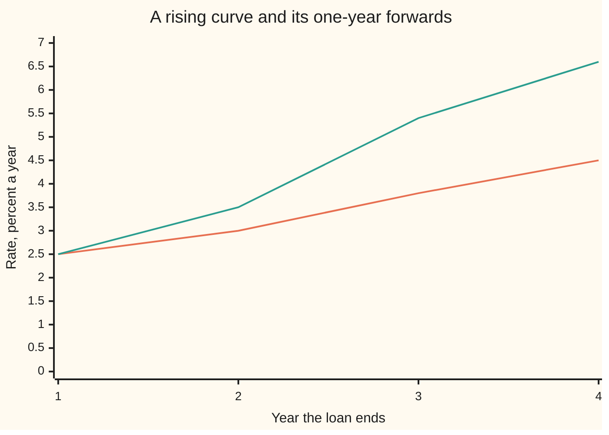
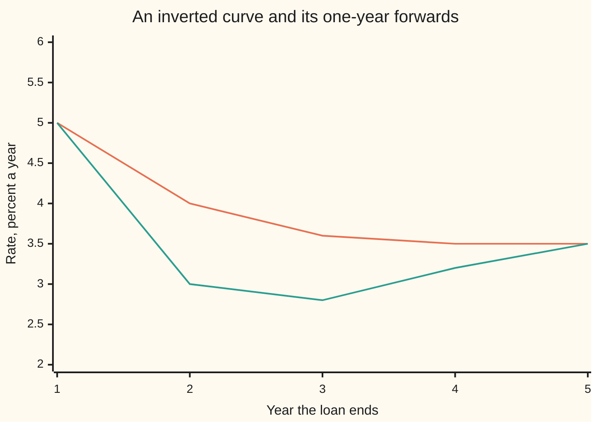

# What a curve says: expectations, term premium, and why an inverted curve worries people

[Syllabus](../../../SYLLABUS.md) → [Financial mathematics](../../../SYLLABUS.md#w12) → [Curves in Depth](../../../SYLLABUS.md#w12-s33) → What a curve says

---

## General Overview

A government borrows at two maturities. Money lent to it for two years earns 3 percent a year. Money lent for four years earns 4.5 percent a year. Both are zero-coupon loans: one payment in, one payment back, nothing in between.

Those two quotes already fix a third rate: the rate for lending from year 2 to year 4, agreed today. It comes out at **6 percent a year**. That rate for a later stretch, locked today, is a **forward rate**. It is not an opinion. Two trades on today's screen lock it in.

Now a forecast, from a bank economist or a survey of traders, puts the 2-year rate quoted two years from now at about **4 percent**. The forward is 6. The forecast is 4. The 2 percentage points between them have a name: the **term premium**, the extra return lenders demand for tying money up for longer instead of lending short and rolling over.

So a curve mixes two things. One is what people expect rates to be. The other is what they charge for bearing the risk that rates turn out differently. The curve alone cannot say how much of each it holds.

**A forward rate is an expected future rate plus a term premium; the curve fixes the sum, and an outside forecast is needed to split it.**

**What kind of fact this is:** a model. The forward rate is arithmetic on today's prices, proved on this card in Why it works. The term premium is a definition: whatever is left of the forward after the forecast is taken out. The pure expectations hypothesis, the claim that the premium is zero, is a model, and the data mostly reject it.

### The picture: one forward, two readings

```
Rate for years 2 to 4, percent a year (one block = 0.25 percent)
forward F(2,4), from the curve   ████████████████████████  6.00
expected rate, from a forecast   ████████████████          4.00
term premium, the difference     ████████                  2.00
```

The top bar is a fact about today's prices. The middle bar is a belief about the future. The bottom bar is what the market charges for the gap between them being uncertain.

---

## The formula

Notation first, in words. $D(T)$ is the **discount factor**: today's price of one dollar paid in $T$ years. $y(T)$ is the **zero rate** for $T$ years, continuously compounded, so $D(T) = e^{-y(T)\,T}$. Two dates $a$ and $b$, with $a$ before $b$, mark the stretch a forward covers. $e^{x}$ and $\ln$ are the exponential and natural logarithm from [Compounding more often, and the number e](../../01-Foundations/04-Compound%20Growth%20and%20Discounting/04-compounding-frequency-and-e.md).

$$F(a,b) \;=\; \frac{\ln D(a) - \ln D(b)}{b - a} \;=\; \frac{b\,y(b) - a\,y(a)}{b-a}$$

**Read it aloud:** the forward rate is the extra discounting between the two dates, spread over the years between them.

$$F(a,b) \;=\; A(a,b) \;+\; \mathrm{TP}(a,b), \qquad A(a,b) = E[R]$$

**Read it aloud:** the forward equals the expected future rate plus the term premium.

| Symbol | Plain meaning | In our example | Push it up and the answer… |
| --- | --- | --- | --- |
| $D(T)$, $D$ | the discount factor: today's price of one dollar paid in $T$ years | 0.941765 at 2 years, 0.835270 at 4 | a dearer far dollar lowers the forward |
| $T$ | time from today, in years | 2 and 4 | — |
| $y(T)$, $y$ | the zero rate: the single rate from today to year $T$, continuously compounded | 3 percent at 2 years, 4.5 at 4 | the far zero rate up lifts the forward twice as fast here |
| $a$, $b$ | start and end of the forward's stretch | year 2, year 4 | — |
| $F(a,b)$, $F$ | the forward rate for the stretch from $a$ to $b$, locked today | 6 percent | — |
| $R$ | the 2-year rate that will be quoted in year 2: unknown today, a random quantity | 1, 4 or 7 percent | — |
| $p$ | the probability given to one scenario for $R$ | 0.25, 0.50, 0.25 | — |
| $E[R]$, $A(a,b)$, $A$ | the expected future rate: the probability-weighted average of $R$ | 4 percent | the premium falls one for one |
| $\mathrm{TP}(a,b)$ | the term premium: forward minus expected rate | 2 percentage points | — |
| $F_0$ | the forward that a lender who charges no premium at all would accept | 3.955 percent | — |
| $e^{x}$, $\ln$ | exponential and natural logarithm; each undoes the other | $e^{0.12} = 1.127497$ | — |

A **percentage point** (pp) is the plain difference between two percentages: 6 percent minus 4 percent is 2 pp.

The first equation is a theorem. The second is a definition of $\mathrm{TP}$: it holds for any forecast, because the premium is whatever makes it hold. The content arrives only when someone commits to a forecast, or to a model that produces one.

### When it holds

- **One borrower, zero-coupon rates, one compounding rule.** Mix a government curve with a bank curve and a credit spread (extra rate for default risk) poses as term premium.
- **An outside forecast.** Today's prices fix $F$ but not the split. An expected 4 with premium 2 and an expected 5 with premium 1 fit the same 6 percent. Surveys, statistical models and policy guidance supply the forecast, and each brings its own error.
- **Convexity is small, not zero.** Even a lender who charges no premium accepts a forward a little below the expected rate, because bond prices bend with rates. In this example the gap is 0.045 pp, so even that lender shows a TP of −0.045 pp: the premium as defined here carries convexity too. Wider scenarios or longer stretches make it bigger.
- **The pure expectations hypothesis, TP = 0.** It fails in most data: Campbell and Shiller (1991) found that when the curve is steep, long yields tend to fall, the opposite of what zero premium predicts.

---

## Why it works

### Step 0: two routes to year 4 must cost the same

A lender with money for four years has two routes. Lend for four years at once. Or lend for two years, and fix today the rate for the next two. Both routes are available now and neither carries risk. If one paid more, borrowing on the cheap route and lending on the dear one would be free money. So the forward is whatever makes the two routes equal. Nothing in that argument mentions a forecast.

### Step 1: the forward from the two zero rates

Growth over four years at 4.5 percent is $e^{4 \times 0.045} = e^{0.18}$. Growth over two years at 3 percent is $e^{0.06}$. The forward must supply the rest:

$$e^{0.06}\, e^{2F} = e^{0.18} \quad\Longrightarrow\quad 2F = 0.12 \quad\Longrightarrow\quad F = 6\%.$$

Written with discount factors, the extra discounting $\ln D(2) - \ln D(4) = 0.12$ is spread over $b - a = 2$ years. That is the formula.

The same arithmetic across a whole curve gives a forward for every year. On a rising curve the forwards run above the zero rates, because each zero rate is an average of the forwards before it.



Lower line: zero rates from today, with the 3 and 4.5 of the example at years 2 and 4 and illustrative values at years 1 and 3. Upper line: the one-year forward for the year ending at each date. The forwards for years 3 and 4, 5.4 and 6.6 percent, average to the 6 percent two-year forward.

### Step 2: add a forecast, and the premium is what remains

Suppose the 2-year rate quoted in year 2, $R$, has three scenarios: 1 percent with probability 0.25, 4 percent with probability 0.50, 7 percent with probability 0.25. The expected rate is

$$E[R] = 0.25 \times 1 + 0.50 \times 4 + 0.25 \times 7 = 4\%.$$

The premium is $6 - 4 = 2$ pp. Under the pure expectations hypothesis the premium would be zero, the forward would be a forecast, and 6 percent would mean rates are expected to reach 6.

### Step 3: the premium is an expected extra return

Why is the premium a reward? Follow 100 dollars down each route to year 2.

- **Roll:** buy the 2-year zero. In year 2 it repays $100 / D(2) = 106.18$ dollars, whatever happens.
- **Long:** buy the 4-year zero and sell it in year 2. By then it is a 2-year zero, priced at the rate $R$ quoted that day. Its value is $(100 / D(4))\, e^{-2R}$.

| Rate in year 2 | Probability | Long route | Roll route | Extra log return, long over roll |
| --- | --- | --- | --- | --- |
| 1 percent | 0.25 | $117.35 | $106.18 | +10.00 percent |
| 4 percent | 0.50 | $110.52 | $106.18 | +4.00 percent |
| 7 percent | 0.25 | $104.08 | $106.18 | −2.00 percent |

The extra log return (the natural log of the ratio of the two values) is $2(F - R)$ in each row. Its average is $0.25 \times 10 + 0.50 \times 4 + 0.25 \times (-2) = 4$ percent over two years, which is 2 percent a year. That is the term premium again, reached from bond prices instead of from the forward.

So the premium is the extra a lender expects to earn, per year, for holding the long bond through the stretch. It is paid because the long route can lose: if rates jump to 7 percent, the long route ends at 104.08 dollars against the roll route's 106.18. A lender who dislikes that risk demands a premium to take it. A lender who wants that exposure, such as a pension fund matching payments due in 30 years, may accept a small or negative one.

<details>
<summary>Detailed proof: the forward identity, the premium as extra return, and the inversion rule</summary>

**Forward.** Both routes cost $D(b)$ today for one dollar at $b$: buy it outright, or buy $D(b)/D(a)$ dollars of the $a$-year zero and reinvest at the locked forward. The second route delivers one dollar exactly when $e^{(b-a)F} = D(a)/D(b)$. Taking logs, $(b-a)F = \ln D(a) - \ln D(b) = b\,y(b) - a\,y(a)$, which is the formula. Existence and uniqueness: $D(a)/D(b)$ is positive, so its log exists, and $e^{(b-a)F}$ is strictly increasing in $F$, so one forward does it.

**Premium as extra return.** One dollar in the long bond grows to $e^{b\,y(b)} e^{-(b-a)R}$ at $a$. One dollar rolled grows to $e^{a\,y(a)}$. The log of their ratio is $b\,y(b) - a\,y(a) - (b-a)R = (b-a)(F - R)$. Averaging over $R$ gives $(b-a)(F - E[R]) = (b-a)\,\mathrm{TP}$. No step used a particular set of scenarios.

**Inversion rule.** From $b\,y(b) = a\,y(a) + (b-a)F$, divide by $b$ and subtract $y(a)$: $y(b) - y(a) = \frac{b-a}{b}\,(F - y(a))$. The factor $\frac{b-a}{b}$ is positive, so $y(b) < y(a)$ exactly when $F < y(a)$. Substituting $F = A + \mathrm{TP}$ gives $F - y(a) = (A - y(a)) + \mathrm{TP}$: a negative sum does not say which term is negative.

</details>

### Step 4: even a lender with no premium does not quote the forecast

Remove all appetite for a premium. The lender now prices the long bond at its expected value. The fair forward $F_0$ then solves $e^{-2F_0} = E[e^{-2R}]$. Because $e^{-2R}$ bends upward, its average is larger than $e^{-2E[R]}$, and $F_0$ comes out at 3.955 percent, not 4. The 0.045 pp gap is **convexity**: the price gain when rates fall beats the price loss when they rise by the same amount. It is small at two years and grows as the stretch lengthens and the scenarios spread. The full treatment of convexity in rate products lives on [Futures against forwards](../32-Convexity%20and%20Exotics/01-futures-forward-convexity.md).

The other door: a short-rate model such as [Vasicek](../30-Short-Rate%20Models/02-vasicek-model.md) writes down how the rate moves in the real world and how much risk is priced. The expected rate, the premium and the convexity then come out of one set of parameters instead of three separate inputs.

---

## Worked numbers, by hand

The government curve: 3 percent for two years, 4.5 percent for four. The forecast: 1, 4 or 7 percent with probabilities 0.25, 0.50, 0.25.

| Step | Arithmetic | Value |
| --- | --- | --- |
| $D(2)$ | $e^{-2 \times 0.03} = e^{-0.06}$ | 0.941765 |
| $D(4)$ | $e^{-4 \times 0.045} = e^{-0.18}$ | 0.835270 |
| discount ratio | $0.941765 / 0.835270$ | 1.127497 |
| forward $F(2,4)$ | $\ln(1.127497) / 2 = 0.12 / 2$ | 6.00 percent |
| check by weights | $(4 \times 4.5 - 2 \times 3) / 2$ | 6.00 percent |
| lock it: buy 1 million dollars face of the 4-year zero | $1{,}000{,}000 \times 0.835270$ | $835,270.21 |
| pay for it with 2-year zeros | $835{,}270.21 / 0.941765$ | $886,920.44 due in year 2 |
| rate earned from year 2 to year 4 | $\ln(1{,}000{,}000 / 886{,}920.44) / 2$ | 6.00 percent |
| expected rate $E[R]$ | $0.25 \times 1 + 0.5 \times 4 + 0.25 \times 7$ | 4.00 percent |
| **term premium** | $6.00 - 4.00$ | **2.00 pp** |

The two trades cost nothing today: 835,270.21 dollars in, 835,270.21 dollars out. In year 2 they pay out 886,920.44 dollars. In year 4 they bring in 1,000,000. That is a loan from year 2 to year 4 at 6 percent, fixed now. The premium says the market charges 2 pp a year over the forecast for making it.

### What breaks if you drop a piece

| Mistake | Comes out at | What went wrong |
| --- | --- | --- |
| Average the two zero rates | 3.75 percent | The forward is the rate for the later stretch only; averaging mixes in years 0 to 2 |
| Divide by $b$ instead of $b - a$ | 3.00 percent | The extra discounting is spread over all four years instead of the two it covers |
| Read the slope $y(4) - y(2)$ as the premium | 1.50 pp | The slope mixes expected rate changes and premium; it is neither |
| Read the forward as the forecast | expects 6.00, off by 2.00 pp | Assumes the premium is zero; this forecast says it is 2 pp |

---

## Reading an inverted curve

The mystery: when short rates pay more than long rates, commentators start talking about recessions. Nothing about a price seems to know about the economy. The inversion rule explains what the curve does say.

Take a 1-year zero rate of 5 percent and a 2-year zero rate of 4 percent. That is an **inversion**: a longer rate below a shorter one. The forward for the second year is

$$F(1,2) = 2 \times 4 - 1 \times 5 = 3\%.$$

The inversion rule from the proof above says the two statements are the same: $y(2) - y(1) = \tfrac12\,(F(1,2) - y(1))$, and here $-1 = \tfrac12 (3 - 5)$. A curve inverts exactly when the forward sits below today's short rate.



Upper line: zero rates, falling from 5 percent at one year to 3.5 at five. Lower line: one-year forwards, dropping to 2.8 percent for the third year, then climbing back. Each forward sits below its zero rate wherever the curve is still falling, and meets it where the curve goes flat.

What does a 3 percent forward mean? It depends on the premium, and the curve does not say.

| Premium assumed for year 2 | Expected 1-year rate in year 1 |
| --- | --- |
| +1.00 pp, lenders charge for length as usual | 2.00 percent |
| 0.00 pp, the pure expectations hypothesis | 3.00 percent |
| −1.00 pp, lenders pay to lock in length | 4.00 percent |
| −2.00 pp, an unusually negative premium | 5.00 percent: no cut at all |

In the first three rows the expected rate sits below today's 5 percent: the market expects the central bank to cut. Reading no cut into this curve takes a premium of −2 pp, which is rare. And central banks cut hard mostly when the economy weakens. That chain, inversion to expected cuts to expected weakness, is why an inversion worries people.

The chain has weak links. Wright (2006) found that the curve's slope predicts recessions better when the level of the policy rate is added. Model estimates of the US term premium, such as those of Adrian, Crump and Moench (2013), fell below zero for stretches of the 2010s, and a negative premium flattens or inverts a curve with no change in expected rates. The inversion that began in 2022 lasted more than two years without an officially dated US recession during it. An inversion is a signal to look at expectations and premium separately, not a dated forecast.

---

## Code, from first principles, and it actually runs

The code reaches the 6 percent forward **four independent ways**: the weighted formula, two trades that lock it in, a bisection root finder that solves "two years then the forward equals four years", and the average of one-year forwards from a whole curve. It reaches the 2 pp premium **three ways**: forward minus forecast, the expected extra return of the long bond over rolling, and a 200,000-draw simulation with its own random number generator. Then it computes the no-premium forward two ways (closed form and root finder), checks the inversion rule from discount factors, and prints every chart point, every "what breaks" number and every "try changing" answer.

### Python

```python
# Term premium and expectations -- the check behind the card.  Standard library only.
# Every number quoted on the card is printed here.  Rates are decimals in the code,
# continuously compounded; the printout shows them in percent.
from math import exp, log

def pct(x): return f"{100.0 * x:.4f}"
def row(name, text): print(f"{name:<44} {text}")

def D(t, y): return exp(-y * t)                           # discount factor for t years at zero rate y
def fwd(a, ya, b, yb): return (b * yb - a * ya) / (b - a)  # road 1: the weighted-difference formula

def bisect(g, lo, hi, n=200):                              # root finder: g must change sign on [lo, hi]
    for _ in range(n):
        mid = 0.5 * (lo + hi)
        if (g(lo) < 0) == (g(mid) < 0): lo = mid
        else: hi = mid
    return 0.5 * (lo + hi)

# ---- the example: 2-year zero at 3%, 4-year zero at 4.5%; the forward runs from year 2 to year 4 ----
a, b, ya, yb = 2.0, 4.0, 0.03, 0.045
D2, D4 = D(a, ya), D(b, yb)
F1 = fwd(a, ya, b, yb)
face4 = 1_000_000.0                                        # road 2: lock the rate with two trades
cost4 = face4 * D4                                         # buy $1m face of the 4-year zero
face2 = cost4 / D2                                         # pay for it by selling 2-year zeros
F2 = log(face4 / face2) / (b - a)
growth = lambda f: 100.0 * exp(a * ya) * exp((b - a) * f) - 100.0 * exp(b * yb)
F3 = bisect(growth, -1.0, 1.0)                             # road 3: solve "2 years then F" = "4 years"
curve = [(1.0, 0.025), (2.0, 0.030), (3.0, 0.038), (4.0, 0.045)]
one_year = [fwd(t0, y0, t1, y1) for (t0, y0), (t1, y1) in zip([(0.0, 0.0)] + curve, curve)]
F4 = (one_year[2] + one_year[3]) / 2                       # road 4: average the two one-year forwards

# ---- the expectation: three scenarios for the 2-year rate quoted in year 2 ----
scen = [(0.25, 0.01), (0.50, 0.04), (0.25, 0.07)]
A = sum(p * R for p, R in scen)
TP = F1 - A
hold = []                                                  # road 2 to the premium: holding returns
for p, R in scen:
    long_val = (100.0 / D4) * exp(-(b - a) * R)            # $100 in the 4-year zero, sold in year 2
    roll_val = 100.0 / D2                                  # $100 in the 2-year zero, repaid in year 2
    hold.append((p, R, long_val, roll_val, log(long_val / roll_val)))
TP_hold = sum(p * x for p, _, _, _, x in hold) / (b - a)

def lcg(seed):                                             # own random numbers, 64-bit LCG
    x = seed
    while True:
        x = (x * 6364136223846793005 + 1442695040888963407) % (1 << 64)
        yield (x >> 11) / float(1 << 53)

def mc_premium(F, cases, n, seed=20260928):                # road 3: simulate year 2, average the excess
    u, total = lcg(seed), 0.0
    for _ in range(n):
        v, acc = next(u), 0.0
        for p, R in cases:
            acc += p
            if v < acc: break
        total += (b - a) * (F - R)                         # excess log return of long over roll
    return total / n / (b - a)
TP_mc = mc_premium(F1, scen, 200_000)
F0 = -log(sum(p * exp(-(b - a) * R) for p, R in scen)) / (b - a)   # fair forward with no premium at all
F0_root = bisect(lambda f: sum(p * exp((b - a) * (f - R)) for p, R in scen) - 1.0, -1.0, 1.0)  # zero expected excess

# ---- inversion: 1-year zero at 5%, 2-year zero at 4% ----
y1, y2 = 0.05, 0.04
Finv = log(D(1.0, y1) / D(2.0, y2)) / 1.0
inv_curve = [(1.0, 0.050), (2.0, 0.040), (3.0, 0.036), (4.0, 0.035), (5.0, 0.035)]
inv_fwd = [fwd(t0, y0, t1, y1_) for (t0, y0), (t1, y1_) in zip([(0.0, 0.0)] + inv_curve, inv_curve)]

row("zero rate y(2), y(4)", f"{pct(ya)} {pct(yb)}")
row("discount D(2), D(4)", f"{D2:.6f} {D4:.6f}")
row("D(2)/D(4)", f"{D2 / D4:.6f}")
row("1 forward F(2,4), weighted formula", pct(F1))
row("2 forward, replication: cost of $1m 4y", f"{cost4:.2f}")
row("  2y face sold, paid back in year 2", f"{face2:.2f}")
row("  rate from year 2 to year 4", pct(F2))
row("3 forward, bisection on growth", pct(F3))
row("4 forward, mean of one-year forwards", pct(F4))
row("chart, zero curve y(1..4)", " ".join(pct(y) for _, y in curve))
row("chart, one-year forwards", " ".join(pct(f) for f in one_year))
for p, R, lv, rv, x in hold:
    row(f"scenario R = {pct(R)}, p = {p:.2f}", f"long {lv:.2f} roll {rv:.2f} excess {pct(x)}")
row("expected rate A = E[R]", pct(A))
row("1 term premium F - A", pct(TP))
row("2 premium, expected excess / 2 years", pct(TP_hold))
row("3 premium, simulated, 200000 draws", pct(TP_mc))
row("no-premium forward -ln E[e^-2R] / 2", pct(F0))
row("  convexity gap A - F0", pct(A - F0))
row("inversion y(1), y(2)", f"{pct(y1)} {pct(y2)}")
row("  forward F(1,2)", pct(Finv))
row("  y(2) - y(1)", pct(y2 - y1))
row("  (1/2)(F(1,2) - y(1))", pct(0.5 * (Finv - y1)))
for tp in (0.01, 0.0, -0.01, -0.02):
    row(f"  premium {pct(tp)} -> expected rate", pct(Finv - tp))
row("chart, inverted zero curve y(1..5)", " ".join(pct(y) for _, y in inv_curve))
row("chart, inverted one-year forwards", " ".join(pct(f) for f in inv_fwd))
row("wrong: average the two zero rates", pct((ya + yb) / 2))
row("wrong: divide by b, not b - a", pct((b * yb - a * ya) / b))
row("wrong: read slope y(4) - y(2) as premium", pct(yb - ya))
row("wrong: read F as the forecast, gap", pct(F1 - A))
row("try: y(4) = 5%, forward", pct(fwd(a, ya, b, 0.05)))
row("try: y(4) = 5%, premium", pct(fwd(a, ya, b, 0.05) - A))
wide = [(0.25, 0.0), (0.50, 0.04), (0.25, 0.08)]
row("try: scenarios 0/4/8, expected", pct(sum(p * R for p, R in wide)))
row("try: scenarios 0/4/8, no-premium fwd", pct(-log(sum(p * exp(-2 * R) for p, R in wide)) / 2))
row("try: y(2) = 4.5% in the inversion, F(1,2)", pct(fwd(1.0, y1, 2.0, 0.045)))
row("try: simulated premium, 1000 draws", pct(mc_premium(F1, scen, 1000)))

assert abs(F1 - 0.06) < 1e-12,             "formula vs the card's worked 6%"
assert abs(F2 - F1) < 1e-12,               "replication trades land on the formula"
assert abs(F3 - F1) < 1e-10,               "root finder lands on the formula"
assert abs(F4 - F1) < 1e-12,               "one-year forwards average to the two-year forward"
assert abs(TP_hold - TP) < 1e-12,          "holding-return premium equals F - A"
assert abs(TP_mc - TP) < 5e-4,             "simulated premium within 0.05 pp"
assert abs((y2 - y1) - 0.5 * (Finv - y1)) < 1e-12, "inversion identity from discount factors"
assert abs(F0_root - F0) < 1e-10,          "no-premium forward: closed form vs root finder"
assert F0 < A,                             "with no premium the forward sits below the expectation"
print("ALL CHECKS PASS")
```

**Ran 2026-09-28 on macOS, Python 3.14.6, standard library only. All checks passed. Output, pasted from the run:**

```
zero rate y(2), y(4)                         3.0000 4.5000
discount D(2), D(4)                          0.941765 0.835270
D(2)/D(4)                                    1.127497
1 forward F(2,4), weighted formula           6.0000
2 forward, replication: cost of $1m 4y       835270.21
  2y face sold, paid back in year 2          886920.44
  rate from year 2 to year 4                 6.0000
3 forward, bisection on growth               6.0000
4 forward, mean of one-year forwards         6.0000
chart, zero curve y(1..4)                    2.5000 3.0000 3.8000 4.5000
chart, one-year forwards                     2.5000 3.5000 5.4000 6.6000
scenario R = 1.0000, p = 0.25                long 117.35 roll 106.18 excess 10.0000
scenario R = 4.0000, p = 0.50                long 110.52 roll 106.18 excess 4.0000
scenario R = 7.0000, p = 0.25                long 104.08 roll 106.18 excess -2.0000
expected rate A = E[R]                       4.0000
1 term premium F - A                         2.0000
2 premium, expected excess / 2 years         2.0000
3 premium, simulated, 200000 draws           1.9979
no-premium forward -ln E[e^-2R] / 2          3.9550
  convexity gap A - F0                       0.0450
inversion y(1), y(2)                         5.0000 4.0000
  forward F(1,2)                             3.0000
  y(2) - y(1)                                -1.0000
  (1/2)(F(1,2) - y(1))                       -1.0000
  premium 1.0000 -> expected rate            2.0000
  premium 0.0000 -> expected rate            3.0000
  premium -1.0000 -> expected rate           4.0000
  premium -2.0000 -> expected rate           5.0000
chart, inverted zero curve y(1..5)           5.0000 4.0000 3.6000 3.5000 3.5000
chart, inverted one-year forwards            5.0000 3.0000 2.8000 3.2000 3.5000
wrong: average the two zero rates            3.7500
wrong: divide by b, not b - a                3.0000
wrong: read slope y(4) - y(2) as premium     1.5000
wrong: read F as the forecast, gap           2.0000
try: y(4) = 5%, forward                      7.0000
try: y(4) = 5%, premium                      3.0000
try: scenarios 0/4/8, expected               4.0000
try: scenarios 0/4/8, no-premium fwd         3.9200
try: y(2) = 4.5% in the inversion, F(1,2)    4.0000
try: simulated premium, 1000 draws           1.9070
ALL CHECKS PASS
```

Four roads land on 6.0000 percent. The premium by expected extra return matches forward minus forecast to every printed digit, and the simulation lands at 1.9979, inside its sampling noise.

### Rust

Same inputs, same random number generator, same labels. No crates.

```rust
// Term premium and expectations -- the same check as term_premium_and_expectations_check.py.
// Standard library only, no crates.  Rates are decimals, continuously compounded;
// the printout shows them in percent.
// Compile: rustc --edition 2021 -O term_premium_and_expectations_check.rs -o /tmp/tp_check

fn pct(x: f64) -> String { format!("{:.4}", 100.0 * x) }
fn row(name: &str, text: String) { println!("{:<44} {}", name, text); }
fn d(t: f64, y: f64) -> f64 { (-y * t).exp() }                        // discount factor
fn fwd(a: f64, ya: f64, b: f64, yb: f64) -> f64 { (b * yb - a * ya) / (b - a) }

fn bisect<G: Fn(f64) -> f64>(g: G, mut lo: f64, mut hi: f64) -> f64 { // root finder on a sign change
    for _ in 0..200 {
        let mid = 0.5 * (lo + hi);
        if (g(lo) < 0.0) == (g(mid) < 0.0) { lo = mid; } else { hi = mid; }
    }
    0.5 * (lo + hi)
}

struct Lcg(u64);                                                        // own random numbers
impl Lcg {
    fn next(&mut self) -> f64 {
        self.0 = self.0.wrapping_mul(6364136223846793005).wrapping_add(1442695040888963407);
        (self.0 >> 11) as f64 / (1u64 << 53) as f64
    }
}

fn mc_premium(f: f64, cases: &[(f64, f64)], n: usize, span: f64) -> f64 {
    let mut u = Lcg(20260928);
    let mut total = 0.0;
    for _ in 0..n {
        let v = u.next();
        let mut acc = 0.0;
        let mut r = cases[cases.len() - 1].1;
        for &(p, rr) in cases { acc += p; if v < acc { r = rr; break; } }
        total += span * (f - r);                                        // excess log return, long over roll
    }
    total / n as f64 / span
}

fn one_year_fwds(curve: &[(f64, f64)]) -> Vec<f64> {
    let mut prev = (0.0, 0.0);
    curve.iter().map(|&(t, y)| { let f = fwd(prev.0, prev.1, t, y); prev = (t, y); f }).collect()
}

fn join(v: &[f64]) -> String { v.iter().map(|&x| pct(x)).collect::<Vec<_>>().join(" ") }

fn main() {
    let (a, b, ya, yb) = (2.0_f64, 4.0_f64, 0.03_f64, 0.045_f64);
    let (d2, d4) = (d(a, ya), d(b, yb));
    let f1 = fwd(a, ya, b, yb);
    let face4 = 1_000_000.0_f64;                                        // road 2: two trades lock the rate
    let cost4 = face4 * d4;
    let face2 = cost4 / d2;
    let f2 = (face4 / face2).ln() / (b - a);
    let f3 = bisect(|f: f64| 100.0 * (a * ya).exp() * ((b - a) * f).exp() - 100.0 * (b * yb).exp(), -1.0, 1.0);
    let curve = [(1.0, 0.025), (2.0, 0.030), (3.0, 0.038), (4.0, 0.045)];
    let one_year = one_year_fwds(&curve);
    let f4 = (one_year[2] + one_year[3]) / 2.0;

    let scen = [(0.25, 0.01), (0.50, 0.04), (0.25, 0.07)];
    let big_a: f64 = scen.iter().map(|&(p, r)| p * r).sum();
    let tp = f1 - big_a;
    let mut hold = Vec::new();
    for &(p, r) in &scen {
        let long_val = (100.0 / d4) * (-(b - a) * r).exp();             // 4-year zero, sold in year 2
        let roll_val = 100.0 / d2;                                      // 2-year zero, repaid in year 2
        hold.push((p, r, long_val, roll_val, (long_val / roll_val).ln()));
    }
    let tp_hold = hold.iter().map(|h| h.0 * h.4).sum::<f64>() / (b - a);
    let tp_mc = mc_premium(f1, &scen, 200_000, b - a);
    let f0 = -scen.iter().map(|&(p, r)| p * (-(b - a) * r).exp()).sum::<f64>().ln() / (b - a);
    let f0_root = bisect(|f: f64| scen.iter().map(|&(p, r)| p * ((b - a) * (f - r)).exp()).sum::<f64>() - 1.0, -1.0, 1.0);

    let (y1, y2) = (0.05_f64, 0.04_f64);
    let finv = (d(1.0, y1) / d(2.0, y2)).ln() / 1.0;
    let inv_curve = [(1.0, 0.050), (2.0, 0.040), (3.0, 0.036), (4.0, 0.035), (5.0, 0.035)];
    let inv_fwd = one_year_fwds(&inv_curve);

    row("zero rate y(2), y(4)", format!("{} {}", pct(ya), pct(yb)));
    row("discount D(2), D(4)", format!("{:.6} {:.6}", d2, d4));
    row("D(2)/D(4)", format!("{:.6}", d2 / d4));
    row("1 forward F(2,4), weighted formula", pct(f1));
    row("2 forward, replication: cost of $1m 4y", format!("{:.2}", cost4));
    row("  2y face sold, paid back in year 2", format!("{:.2}", face2));
    row("  rate from year 2 to year 4", pct(f2));
    row("3 forward, bisection on growth", pct(f3));
    row("4 forward, mean of one-year forwards", pct(f4));
    row("chart, zero curve y(1..4)", join(&curve.iter().map(|c| c.1).collect::<Vec<_>>()));
    row("chart, one-year forwards", join(&one_year));
    for &(p, r, lv, rv, x) in &hold {
        row(&format!("scenario R = {}, p = {:.2}", pct(r), p), format!("long {:.2} roll {:.2} excess {}", lv, rv, pct(x)));
    }
    row("expected rate A = E[R]", pct(big_a));
    row("1 term premium F - A", pct(tp));
    row("2 premium, expected excess / 2 years", pct(tp_hold));
    row("3 premium, simulated, 200000 draws", pct(tp_mc));
    row("no-premium forward -ln E[e^-2R] / 2", pct(f0));
    row("  convexity gap A - F0", pct(big_a - f0));
    row("inversion y(1), y(2)", format!("{} {}", pct(y1), pct(y2)));
    row("  forward F(1,2)", pct(finv));
    row("  y(2) - y(1)", pct(y2 - y1));
    row("  (1/2)(F(1,2) - y(1))", pct(0.5 * (finv - y1)));
    for tpx in [0.01_f64, 0.0, -0.01, -0.02] {
        row(&format!("  premium {} -> expected rate", pct(tpx)), pct(finv - tpx));
    }
    row("chart, inverted zero curve y(1..5)", join(&inv_curve.iter().map(|c| c.1).collect::<Vec<_>>()));
    row("chart, inverted one-year forwards", join(&inv_fwd));
    row("wrong: average the two zero rates", pct((ya + yb) / 2.0));
    row("wrong: divide by b, not b - a", pct((b * yb - a * ya) / b));
    row("wrong: read slope y(4) - y(2) as premium", pct(yb - ya));
    row("wrong: read F as the forecast, gap", pct(f1 - big_a));
    row("try: y(4) = 5%, forward", pct(fwd(a, ya, b, 0.05)));
    row("try: y(4) = 5%, premium", pct(fwd(a, ya, b, 0.05) - big_a));
    let wide = [(0.25, 0.0), (0.50, 0.04), (0.25, 0.08)];
    row("try: scenarios 0/4/8, expected", pct(wide.iter().map(|&(p, r)| p * r).sum::<f64>()));
    row("try: scenarios 0/4/8, no-premium fwd", pct(-wide.iter().map(|&(p, r)| p * (-2.0 * r).exp()).sum::<f64>().ln() / 2.0));
    row("try: y(2) = 4.5% in the inversion, F(1,2)", pct(fwd(1.0, y1, 2.0, 0.045)));
    row("try: simulated premium, 1000 draws", pct(mc_premium(f1, &scen, 1000, b - a)));

    assert!((f1 - 0.06).abs() < 1e-12, "formula vs the card's worked 6%");
    assert!((f2 - f1).abs() < 1e-12, "replication trades land on the formula");
    assert!((f3 - f1).abs() < 1e-10, "root finder lands on the formula");
    assert!((f4 - f1).abs() < 1e-12, "one-year forwards average to the two-year forward");
    assert!((tp_hold - tp).abs() < 1e-12, "holding-return premium equals F - A");
    assert!((tp_mc - tp).abs() < 5e-4, "simulated premium within 0.05 pp");
    assert!(((y2 - y1) - 0.5 * (finv - y1)).abs() < 1e-12, "inversion identity from discount factors");
    assert!((f0_root - f0).abs() < 1e-10, "no-premium forward: closed form vs root finder");
    assert!(f0 < big_a, "with no premium the forward sits below the expectation");
    println!("ALL CHECKS PASS");
}
```

**Ran 2026-09-28 on macOS, rustc 1.98.1, no crates. All checks passed. Output, pasted from the run:**

```
zero rate y(2), y(4)                         3.0000 4.5000
discount D(2), D(4)                          0.941765 0.835270
D(2)/D(4)                                    1.127497
1 forward F(2,4), weighted formula           6.0000
2 forward, replication: cost of $1m 4y       835270.21
  2y face sold, paid back in year 2          886920.44
  rate from year 2 to year 4                 6.0000
3 forward, bisection on growth               6.0000
4 forward, mean of one-year forwards         6.0000
chart, zero curve y(1..4)                    2.5000 3.0000 3.8000 4.5000
chart, one-year forwards                     2.5000 3.5000 5.4000 6.6000
scenario R = 1.0000, p = 0.25                long 117.35 roll 106.18 excess 10.0000
scenario R = 4.0000, p = 0.50                long 110.52 roll 106.18 excess 4.0000
scenario R = 7.0000, p = 0.25                long 104.08 roll 106.18 excess -2.0000
expected rate A = E[R]                       4.0000
1 term premium F - A                         2.0000
2 premium, expected excess / 2 years         2.0000
3 premium, simulated, 200000 draws           1.9979
no-premium forward -ln E[e^-2R] / 2          3.9550
  convexity gap A - F0                       0.0450
inversion y(1), y(2)                         5.0000 4.0000
  forward F(1,2)                             3.0000
  y(2) - y(1)                                -1.0000
  (1/2)(F(1,2) - y(1))                       -1.0000
  premium 1.0000 -> expected rate            2.0000
  premium 0.0000 -> expected rate            3.0000
  premium -1.0000 -> expected rate           4.0000
  premium -2.0000 -> expected rate           5.0000
chart, inverted zero curve y(1..5)           5.0000 4.0000 3.6000 3.5000 3.5000
chart, inverted one-year forwards            5.0000 3.0000 2.8000 3.2000 3.5000
wrong: average the two zero rates            3.7500
wrong: divide by b, not b - a                3.0000
wrong: read slope y(4) - y(2) as premium     1.5000
wrong: read F as the forecast, gap           2.0000
try: y(4) = 5%, forward                      7.0000
try: y(4) = 5%, premium                      3.0000
try: scenarios 0/4/8, expected               4.0000
try: scenarios 0/4/8, no-premium fwd         3.9200
try: y(2) = 4.5% in the inversion, F(1,2)    4.0000
try: simulated premium, 1000 draws           1.9070
ALL CHECKS PASS
```

The two outputs agree line for line, including the simulated premium, because both programs step the same 64-bit generator from the same seed.

> [!TIP]
> **Try changing**
> Guess the direction first. Then run it.
> - **Raise the 4-year zero rate to 5 percent.** The forward jumps to **7.00 percent** and, with the forecast unchanged, the premium to **3.00 pp**. The far rate moves the forward twice as fast, because $b/(b-a) = 2$.
> - **Widen the scenarios to 0, 4 and 8 percent.** The expected rate stays **4.00 percent**, so the premium stays 2 pp. The no-premium forward falls to **3.92 percent**: more spread, more convexity.
> - **Soften the inversion: 2-year zero rate at 4.5 percent.** The forward for year two rises to **4.00 percent**, still below the 5 percent short rate, so the curve is still inverted, just less.
> - **Starve the simulation to 1,000 draws.** The simulated premium comes out at **1.9070 pp** instead of 1.9979. A thousand scenarios is too few to pin the average to a hundredth of a point.

---

## The usual mistake

> [!warning]
> **Reading the forward as the market's forecast.** A 6 percent forward does not mean anyone expects 6 percent. It is the rate two trades lock in today, and it holds a premium as well as an expectation. With the forecast on this card, reading the forward as a forecast overstates the future rate by 2 pp.
>
> Smaller traps:
> - **Averaging zero rates to get a forward.** It gives 3.75 percent here, not 6. A forward covers the later stretch only.
> - **Treating the premium as measured.** It is a residual: change the forecast and it changes. Two analysts with different forecasts get different premiums from the same curve, and both are arithmetically right.
> - **Mixing compounding rules.** The 6 percent on this card is continuously compounded. The same forward quoted with annual compounding is $e^{0.06} - 1$, a different number for the same loan.
> - **Taking an inversion as a recession date.** The inversion rule says only that the forward is below today's short rate. How much of that is expected cuts and how much is a low premium needs a separate estimate.

---

## Where you meet it in real life

- **Central bank speeches.** Bernanke (2006) split each forward rate into the rate investors expect and the extra compensation for holding longer-term debt, the same split as this card, and warned that the premium estimates depend on modelling assumptions.
- **Term premium series.** The New York Fed publishes daily estimates of the US 10-year term premium from the Adrian–Crump–Moench model. Each is a forward minus a model's expected path.
- **Recession models.** Estrella and Mishkin (1998) found the slope of the curve, the 10-year minus 3-month Treasury spread, the best single financial predictor of US recessions two or more quarters ahead.
- **Treasury desks deciding to fix or float.** A company borrowing floating can swap into fixed at rates built from forwards. Fixing costs the premium on top of the expected path: the price of certainty.
- **Curve shape.** Level, slope and curvature, the three moves [Level, slope and curvature](01-principal-components-of-the-curve.md) extracts, each mix expectations and premium. A steepening can be expected hikes or a rising premium; the principal components do not say which.
- **Hedging.** [Key-rate durations](02-key-rate-durations-and-curve-hedging.md) protects a portfolio against moves in the curve, whatever mixture of expectation and premium drives them.

> **Say it back**
> Two zero rates fix a forward rate by arithmetic alone: two trades lock it in today. That forward equals an expected future rate plus a term premium, and the curve fixes only the sum. The premium is the extra return a lender expects for holding the long bond through the stretch, paid because the long route can lose. An inverted curve means the forward sits below today's short rate, which with any normal premium means the market expects cuts. Cuts tend to come with weakness, which is why inversion worries people, and a low premium is why it sometimes misleads.

---

## What this builds on

- [Fitting a curve with four or six parameters](03-nelson-siegel-and-svensson-fitting.md): a smooth curve of zero rates from a handful of bond prices, so a forward can be read at any pair of dates. Its parameters describe shape, not expectations; this card is where expectations enter.
- [Spot, forward and par rates](../02-Curves/01-spot-forward-and-par-rates.md): the forward rate as a no-free-money consequence of spot rates, there with annual compounding.
- [Discount factors](../01-Money%2C%20Dates%20and%20Discounting/01-compounding-and-discount-factors.md): discount factors and continuous compounding, the $D(T) = e^{-y(T)T}$ used throughout.

## Where this goes next

- [Carry and roll-down](05-carry-and-roll-down.md): the return from holding a bond while the curve stays put. Carry and roll-down are the premium's cousins, computed under a stated scenario instead of a forecast.

---

## Sources

Verified 2026-09-28: every link below resolves to the publisher's page or, for the journal articles, to the DOI record naming the paper.

- Campbell, John Y., and Robert J. Shiller. "Yield Spreads and Interest Rate Movements: A Bird's Eye View." *Review of Economic Studies* 58, no. 3 (1991): 495–514. [doi:10.2307/2298008](https://doi.org/10.2307/2298008). The test of the expectations hypothesis and its failure: steep curves are followed by falling long yields.
- Estrella, Arturo, and Frederic S. Mishkin. "Predicting U.S. Recessions: Financial Variables as Leading Indicators." *Review of Economics and Statistics* 80, no. 1 (1998): 45–61. [doi:10.1162/003465398557320](https://doi.org/10.1162/003465398557320). The yield spread as a recession predictor.
- Adrian, Tobias, Richard K. Crump, and Emanuel Moench. "Pricing the Term Structure with Linear Regressions." *Journal of Financial Economics* 110, no. 1 (2013): 110–138. [doi:10.1016/j.jfineco.2013.04.009](https://doi.org/10.1016/j.jfineco.2013.04.009). A model that splits yields into expected rates and term premium.
- Bernanke, Ben S. "Reflections on the Yield Curve and Monetary Policy." Federal Reserve Board speech, 20 March 2006. [federalreserve.gov](https://www.federalreserve.gov/newsevents/speech/bernanke20060320a.htm). Forward rate as expected rate plus term premium, and why estimates of the split are model-dependent.
- Wright, Jonathan H. "The Yield Curve and Predicting Recessions." Federal Reserve Finance and Economics Discussion Series 2006-7. [federalreserve.gov](https://www.federalreserve.gov/pubs/feds/2006/200607/index.html). Inversion as a recession signal, sharper when the policy rate's level is added.
