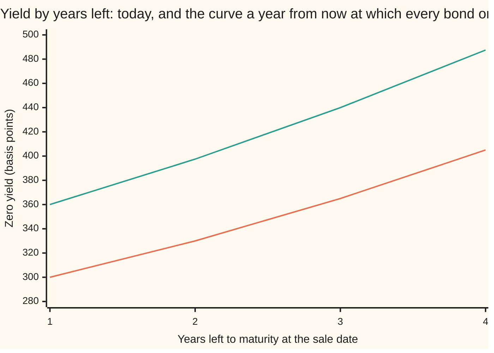
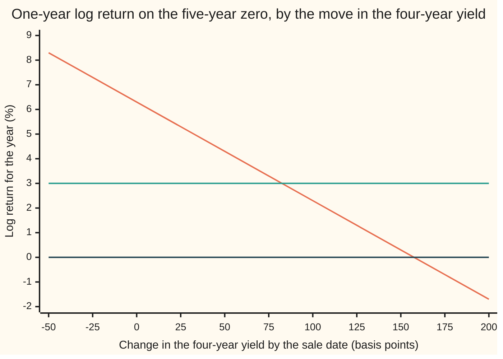

# Carry and roll-down: what a bond earns if the curve does not move

[Syllabus](../../../SYLLABUS.md) → [Financial mathematics](../../../SYLLABUS.md#w12) → [Curves in Depth](../../../SYLLABUS.md#w12-s33) → Carry and roll-down

---

## General Overview

A fund buys a five-year government bond today and plans to sell it in exactly one year. The bond is a **zero-coupon** bond: it pays nothing along the way and \$100 at the end. The market prices five-year money at a yield of 4.50% a year. Four-year money is cheaper to borrow: 4.05%.

A year passes and nothing happens to the curve (the list of yields by maturity). The five-year yield is still 4.50%, the four-year still 4.05%. But the bond is no longer a five-year bond. It has four years left, so the market now prices it at the four-year yield. Its yield has slid 45 basis points down the curve (a basis point is one hundredth of a percent). A lower yield means a higher price.

So the year pays twice. The bond earns its own yield for the year, like money in a deposit: that is **carry**. And it gains again because it now sits lower on the curve: that is **roll-down**. Here carry is 4.50% and roll-down is 1.80%, a total of 6.30%, against 3.00% for leaving the money in one-year cash.

That edge has a size a trader can use. The four-year yield could rise by 82.5 basis points during the year before the bond does worse than cash. That rise is not arbitrary: it lifts the four-year yield exactly to the **forward rate**, the rate for borrowing from year 1 to year 5 that today's curve already locks in. Carry and roll-down are the curve move the forwards already expect, read as a return.

**Carry and roll-down are what a bond earns over a holding period if every yield, read by years left to maturity, stays where it is; their excess over cash, divided by the years left at sale, is exactly how far the curve can rise to the forward curve before that edge is gone.**

**What kind of fact this is:** a definition (a scenario, not a forecast); the breakeven statement attached to it is a theorem, proved on this card in Why it works.

### The picture: today's curve and the breakeven curve



Lower line (orange): today's curve, 3.00% for one year up to 4.05% for four. Upper line (green): the **breakeven curve**, the forward yields a year ahead, 3.60% up to 4.875%. If next year's curve is the lower line, every bond bought today beats cash. If it is the upper line, every bond exactly matches cash. The gap at four years, 82.5 basis points, is the five-year bond's breakeven.

---

## The formula

Notation first, in words. $y(t)$ is today's **zero yield** for money due in $t$ years, continuously compounded: a payment of 1 due in $t$ years is worth $D(t) = e^{-t\,y(t)}$ today, where $D(t)$ is the **discount factor** and $e$ is the exponential base ([What a curve says](04-term-premium-and-expectations.md) reads the same curve). The bond matures in $T$ years and is held for $h$ years. Returns are **log returns**, the natural log of sale price over purchase price, because those add exactly.

$$C = h\,y(T), \qquad R = (T-h)\,\bigl(y(T) - y(T-h)\bigr), \qquad \ln\frac{P_h}{P_0} = C + R$$

**Read it aloud:** carry is the bond's own yield earned for the holding period; roll-down is the fall in yield from sliding down the curve, times the years still left; together they are the whole return if the curve stands still.

The breakeven move, set against cash earning $y(h)$ for the holding period:

$$\delta^{*} = \frac{C + R - h\,y(h)}{T - h} = f - y(T-h), \qquad f = \frac{T\,y(T) - h\,y(h)}{T - h}$$

**Read it aloud:** the edge over cash, divided by the years left at sale, is how far the sale-date yield can rise; and that is exactly the gap between the forward yield and today's yield at the same years left.

| Symbol | Plain meaning | In our example | Push it up and the year's return… |
| --- | --- | --- | --- |
| $N$, $c_t$ | face: what the zero pays at maturity; $c_t$ is any bond's payment at time $t$ | \$100; a coupon of \$4.50 | scales every dollar figure, no percentage |
| $T$ | years to maturity when bought | 5 | depends on the curve's slope there |
| $h$ | holding period, in years | 1 | more carry; the roll depends on the curve |
| $y(t)$, $t$, $y(5)$, $y(4)$ | zero yield for money due in $t$ years, continuously compounded | 4.50%, 4.05% | $y(5)$ up: more carry and roll; $y(4)$ up: less roll |
| $y(h)$ | the cash rate: the one-year yield | 3.00% | unchanged; the edge over cash shrinks |
| $D(t)$, $e$ | discount factor, $e^{-t\,y(t)}$: today's value of 1 due in $t$ years; $e$ is the exponential base | 100 × $D(5)$ = \$79.85 | — |
| $P_0$, $P_h$ | price today; sale price after $h$ years on the unchanged curve | \$79.85, \$85.04 | — |
| $C$ | carry: the bond's own yield for the holding period | 4.50% | adds one for one |
| $R$ | roll-down: price gain from the lower yield at a shorter maturity | 1.80% | adds one for one |
| $\delta$ | the actual change in the four-year yield by the sale date | 0 in the scenario | each basis point costs 4 basis points of return |
| $\delta^{*}$ | breakeven: the rise in $\delta$ that leaves the bond level with cash | 82.5 bp | — |
| $f$ | forward yield: the rate for years 1 to 5 locked in by today's curve | 4.875% | — |

### When it holds

- **The curve is held still by years left, not by calendar date.** This is a scenario, not a forecast. If the four-year yield moves by $\delta$ by the sale date, the return changes by $-(T-h)\,\delta$: four basis points of return per basis point of yield here.
- **No coupons, no default, no change in credit spread.** A coupon bond adds cash during the year and needs its own yield for the carry leg; the coupon case below does it. A corporate bond whose spread widens loses on top of any curve move.
- **Continuous compounding.** Log returns make carry and roll add exactly. With annually compounded yields or simple returns, the pieces carry a small cross term: 6.30% of log return is 6.50% of simple return.
- **Cash earns a rate known today.** The breakeven is against one-year cash at $y(h)$ = 3.00%. A bond financed at a repo rate (the rate for borrowing against the bond as collateral) breaks even against that rate instead.
- **Yields between maturities.** At whole years the curve's points are enough. Between them, a rule is needed; the checks use straight lines, and a fitted curve gives slightly different roll.

---

## Why it works

### Step 0: a zero's price depends on two numbers, and a year changes both

A zero's price is $N\,e^{-(\text{years left})\times(\text{yield})}$. After a year, the years left drop from 5 to 4, and the yield that applies drops from $y(5)$ to $y(4)$ because the bond now sits at the four-year point. Carry is the first change alone. Roll-down is the second.

### Step 1: carry is the first change

Keep the old yield and cut one year. The price goes from \$79.85, which is 100 times $e^{-5 \times 0.045}$, to \$83.53, which is 100 times $e^{-4 \times 0.045}$. The log of the ratio is $5 \times 0.045 - 4 \times 0.045 = 0.045$. In general

$$\ln\frac{N e^{-(T-h)\,y(T)}}{N e^{-T\,y(T)}} = h\,y(T) = C.$$

A bond held at a fixed yield grows at that yield: \$3.68 of the year's gain.

### Step 2: roll-down is the second change

Now reprice those four remaining years at the four-year yield instead: from \$83.53 to \$85.04, which is 100 times $e^{-4 \times 0.0405}$. The log ratio is $4 \times (0.045 - 0.0405) = 0.018$:

$$\ln\frac{N e^{-(T-h)\,y(T-h)}}{N e^{-(T-h)\,y(T)}} = (T-h)\,\bigl(y(T) - y(T-h)\bigr) = R.$$

The 45-basis-point fall in yield is multiplied by 4 because a zero's price moves by its years left for each unit of yield: its **duration** (the price's sensitivity to its yield) is its remaining life. That is \$1.52 of the gain.

### Step 3: together they are the forward rate

Add the two logs and the middle price cancels:

$$C + R = T\,y(T) - (T-h)\,y(T-h).$$

That right side is a forward rate. Borrowing for five years costs $T\,y(T)$ in log terms; borrowing for four costs $(T-h)\,y(T-h)$; the difference is the rate for the extra stretch from year 4 to year 5, times its length. So a bond held on a still curve earns the forward rate for the stretch of maturities it slides through: 6.30% for the slide from 5 years to 4.

The code confirms this without the closed form. It builds the instantaneous forward rate (the rate for an instant of borrowing at maturity $t$, the slope of $t\,y(t)$) at every point between 4 and 5 years and adds up 4,000 thin slices of it. The sum is 6.30%.

### Step 4: the breakeven move lands on the forward curve

Let the four-year yield at sale be $y(4) + \delta$. The return becomes $C + R - (T-h)\,\delta$. Cash earns $h\,y(h)$. Setting the two equal:

$$\delta^{*} = \frac{C + R - h\,y(h)}{T-h} = \frac{T\,y(T) - h\,y(h)}{T-h} - y(T-h) = f - y(T-h).$$

The middle fraction is $f$, the forward yield: the four-year rate starting in one year that today's curve locks in. It comes from one fact: five years at $y(5)$ must cost the same as one year at $y(1)$ followed by four at $f$, since both are ways of lending the same money for the same five years. Here $f = (0.225 - 0.03)/4$ = 4.875%, and $\delta^{*}$ = 4.875% − 4.05% = 82.5 basis points.

The return is a straight line in $\delta$ with slope $-(T-h)$, so $\delta^{*}$ always exists and is unique. If carry plus roll-down is below cash, $\delta^{*}$ is negative: yields must fall for the bond to match cash.

So the breakeven is not a new number. It is the distance from today's curve up to the forward curve, read at the bond's years left at sale.

<details>
<summary>Detailed proof: on the forward curve, every bond earns cash</summary>

Let the curve a year from now be the forward curve: a payment due $u$ years after the sale date is discounted by $D(h+u)/D(h)$. Any bond, zero or coupon, with fixed payments $c_t$ at times $t$ after today, is worth $P_0 = \sum_t c_t D(t)$ today. At the sale date it holds the payments already received, each valued at the horizon, plus the rest priced on the forward curve. With the one coupon received exactly at the sale date, the horizon wealth is
$$c_h + \sum_{t>h} c_t \frac{D(t)}{D(h)} = \frac{1}{D(h)} \sum_t c_t D(t) = \frac{P_0}{D(h)} = P_0\, e^{h\,y(h)}.$$
That is cash's growth. For a zero the only term is $N\,D(T)/D(h)$, and $D(T)/D(h) = e^{-(T-h) f}$ by the definition of $f$, so a sale yield of $f$ is breakeven; since the zero's price falls strictly as its yield rises, it is the only one. The code checks the coupon case: a 4.5% coupon bond priced on the forward curve grows by 1.0304545340, the same as $e^{0.03}$.

</details>

The same breakeven can be read the other way round. The term-premium card splits a forward rate into what the market expects plus a premium for bearing risk ([What a curve says](04-term-premium-and-expectations.md)). If rates are expected to stay put, the whole excess of carry and roll-down over cash is that premium; if they are expected to rise to the forwards, the excess is zero.

---

## Worked numbers, by hand

The five-year zero, face \$100, held one year; today's curve 3.00%, 3.30%, 3.65%, 4.05%, 4.50% for one to five years.

| Step | Arithmetic | Value |
| --- | --- | --- |
| roll-down in yield | 4.50% − 4.05% | 45 bp |
| price today, $P_0$ | 100 × $e^{-5 \times 0.045}$ = 100 × $e^{-0.225}$ | \$79.85 |
| sale price at the old yield | 100 × $e^{-4 \times 0.045}$ | \$83.53 |
| sale price at the four-year yield, $P_h$ | 100 × $e^{-4 \times 0.0405}$ | \$85.04 |
| carry, $C$ | 1 × 4.50% | 4.50% (\$3.68) |
| roll-down, $R$ | 4 × 0.45% | 1.80% (\$1.52) |
| total, log | 4.50% + 1.80% | **6.30%** (\$5.19) |
| total, simple | $e^{0.063} - 1$ | 6.50% |
| excess over one-year cash | 6.30% − 3.00% | 3.30% |
| forward four-year yield, $f$ | (5 × 4.50% − 1 × 3.00%) / 4 | 4.875% |
| **breakeven rise, $\delta^{*}$** | 3.30% / 4, or 4.875% − 4.05% | **82.5 bp** |

The bond beats a year of cash unless the four-year yield climbs more than 82.5 basis points, to 4.875%, by the sale date.

Carry alone can be quoted net of funding: 4.50% − 3.00% = 1.50%, the **net carry**. Net carry plus roll-down is the same 3.30% excess.

### A coupon bond on the same curve

A five-year bond paying a \$4.50 coupon every year is priced by discounting each payment on the curve: \$99.88. Its own single yield, found by repeated halving (bisection), is 4.4268%. Held a year, collecting the first coupon at the sale date, its carry (horizon value at its own yield) is 4.5263%, its roll-down 1.5799%, its simple return 6.1062%. Its breakeven for a parallel rise in the whole curve is 81.66 bp, a little below the zero's 82.5 bp: its edge over cash is smaller (lower carry, less roll-down), and that outweighs its shorter duration.

### What breaks if you drop a piece

| Mistake | Comes out at | What went wrong |
| --- | --- | --- |
| Reading the 45 bp yield fall as the return | 0.45% | The yield change has to be multiplied by the years left, 4 |
| Multiplying by the original maturity | 2.25% | After a year the bond has 4 years left, not 5 |
| Breakeven against zero return, not cash | 157.5 bp | Measures when the bond loses money, not when cash would have done better |
| Breakeven divided by 5 years | 66 bp | The rise hits a bond with 4 years left |

---

## When the curve does move

The scenario holds the curve still. Real curves move. On the five-year zero, each basis point of rise in the four-year yield by the sale date costs 4 basis points of return, because the bond then has 4 years left.



Falling line (orange): the bond's return, 6.30% at no move. Flat line (green): one-year cash at 3.00%. Bottom line (dark): zero. The bond crosses cash at a rise of 82.5 bp and crosses zero at 157.5 bp. Between those two points the bond still makes money but less than cash.

Each bond on the curve has its own carry, roll-down and breakeven. In percent for one year, against cash at 3.00%:

```
carry + roll-down, % for one year (█ = 0.25%)
2-year zero  ██████████████             carry 3.30 + roll 0.30 = 3.60
3-year zero  █████████████████          carry 3.65 + roll 0.70 = 4.35
4-year zero  █████████████████████      carry 4.05 + roll 1.20 = 5.25
5-year zero  █████████████████████████  carry 4.50 + roll 1.80 = 6.30
```

```
breakeven rise against cash, basis points (█ = 5 bp)
2-year zero  ████████████       60.00
3-year zero  █████████████▌     67.50
4-year zero  ███████████████    75.00
5-year zero  ████████████████▌  82.50
```

Each total is the forward rate for the one-year stretch the bond slides through: 3.60% from 1 to 2 years, 6.30% from 4 to 5. The curve gets steeper toward 5 years, so the longest bond rolls most and carries most. It also has the most years left, so its breakeven grows more slowly than its edge: an excess of 3.30% spread over 4 years is 82.5 bp, where 0.60% over 1 year is 60 bp.

---

## Code, from first principles, and it actually runs

Both scripts price the bond and reach the year's return by three roads: the closed forms for carry and roll-down, repricing the bond at the two dates, and adding up the instantaneous forward rate along the stretch from 5 years to 4 by thin slices. The breakeven is found twice more: by bisection (halving an interval until the sale price equals cash's growth) and as the forward yield read off discount factors minus today's four-year yield. The coupon bond is priced on the forward curve to check that it earns exactly cash. Nothing imported knows the answer: the root finder and the slicing are written out.

### Python

```python
# Carry and roll-down -- the check behind the card.  Standard library only.
# A five-year zero-coupon bond, face 100, bought today and sold in one year on
# a curve that has not moved.  Roads to the answer: (1) the closed forms for
# carry and roll, (2) repricing the bond, (3) adding up the instantaneous
# forward rate along the path the bond travels, (4) bisection on the sale
# price for the breakeven, (5) the forward curve read off discount factors.
from math import exp, log

Y = {1: 0.030, 2: 0.033, 3: 0.0365, 4: 0.0405, 5: 0.045}  # zero yields, continuous
N, T, h = 100.0, 5, 1                                      # face, maturity, holding years
r1 = Y[1]                                                  # one-year rate: cash for the year

def y(t):                          # yield at any maturity from 1 to 5: straight line between pillars
    lo = min(max(int(t), 1), 4)
    w = t - lo
    return (1 - w) * Y[lo] + w * Y[lo + 1]

def D(t): return exp(-t * y(t))    # discount factor: today's value of 1 due in t years

def fwd_inst(t, e=1e-6):           # instantaneous forward rate: the slope of t * y(t)
    return ((t + e) * y(t + e) - (t - e) * y(t - e)) / (2 * e)

def slices(f, a, b, n=4000):       # add up n thin slices of f between a and b (midpoints)
    w = (b - a) / n
    return sum(f(a + (i + 0.5) * w) for i in range(n)) * w

def bisect(g, lo, hi):             # the root of g between lo and hi, by halving
    for _ in range(200):
        mid = 0.5 * (lo + hi)
        if (g(lo) > 0) == (g(mid) > 0): lo = mid
        else: hi = mid
    return 0.5 * (lo + hi)

def zero_price(years_left, yld): return N * exp(-years_left * yld)

# ---- road 1: the closed forms;  road 2: reprice the bond ----
carry, roll = h * Y[5], (T - h) * (Y[5] - Y[4])
P0, flat, static = zero_price(T, Y[5]), zero_price(T - h, Y[5]), zero_price(T - h, Y[4])
total_reprice = log(static / P0)
# ---- road 3: the bond slides from 5 years to 4 and earns the forward rate on the way ----
total_path = slices(fwd_inst, T - h, T)
excess = carry + roll - h * r1
# ---- breakevens: road 4 bisection on the price, road 5 the forward yield ----
be_zero_formula = (carry + roll) / (T - h)
be_zero_bisect = bisect(lambda d: zero_price(T - h, Y[4] + d) - P0, -0.1, 0.1)
be_cash_formula = excess / (T - h)
be_cash_bisect = bisect(lambda d: zero_price(T - h, Y[4] + d) - P0 * exp(h * r1), -0.1, 0.1)
fwd_4y = log(D(1) / D(5)) / (T - h)          # the 4-year yield, one year ahead, locked in today

def pct(x): return f"{100 * x:.4f}%"
def bp(x):  return f"{10000 * x:.2f} bp"
rows = [
    ("5-year yield today", pct(Y[5])), ("4-year yield today", pct(Y[4])),
    ("roll-down in yield, 5y minus 4y", bp(Y[5] - Y[4])), ("one-year rate (cash)", pct(r1)),
    ("price today, 100 e^-5y5", f"{P0:.6f}"), ("sale price at the old 5y yield", f"{flat:.6f}"),
    ("sale price at the 4y yield", f"{static:.6f}"),
    ("carry in dollars", f"{flat - P0:.6f}"), ("roll in dollars", f"{static - flat:.6f}"),
    ("total in dollars", f"{static - P0:.6f}"),
    ("1 carry, h y(5)", pct(carry)), ("1 roll, (T-h)(y5 - y4)", pct(roll)),
    ("1 carry + roll", pct(carry + roll)), ("2 log(sale / price today)", pct(total_reprice)),
    ("3 forward rate added up, 4y to 5y", pct(total_path)),
    ("simple return, e^total - 1", pct(exp(carry + roll) - 1)),
    ("net carry, h (y5 - r1)", pct(h * (Y[5] - r1))), ("excess over cash", pct(excess)),
    ("breakeven vs zero, formula", bp(be_zero_formula)), ("breakeven vs zero, bisection", bp(be_zero_bisect)),
    ("breakeven vs cash, formula", bp(be_cash_formula)), ("breakeven vs cash, bisection", bp(be_cash_bisect)),
    ("forward 4y yield in one year", pct(fwd_4y)), ("forward minus today's 4y", bp(fwd_4y - Y[4])),
    ("wrong: 45 bp read as the return", pct(Y[5] - Y[4])),
    ("wrong: roll times 5 years", pct(T * (Y[5] - Y[4]))),
    ("wrong: breakeven over 5 years", bp(excess / T)),
    ("wrong: breakeven from roll alone", bp(roll / (T - h))),
]
for name, v in rows:
    print(f"{name:<36} {v:>14}")
def try_curve(y5, y4, y1):         # the closed forms again, for the Try-changing box
    c, r = h * y5, (T - h) * (y5 - y4)
    return f"carry {pct(c)}, roll {pct(r)}, breakeven vs cash {bp((c + r - h * y1) / (T - h))}"
print("try: 4y yield 4.80%      " + try_curve(0.045, 0.048, 0.030))
print("try: cash rate 4.50%     " + try_curve(0.045, 0.0405, 0.045))
print("try: flat curve at 4.50% " + try_curve(0.045, 0.045, 0.045))

print("\nbond, % a year   carry   roll  total   path excess  breakeven")
for m in (2, 3, 4, 5):                       # every bond on the curve, held one year
    c, r = h * y(m), (m - h) * (y(m) - y(m - h))
    p = slices(fwd_inst, m - h, m)
    print(f"{m}-year zero     {100*c:6.2f} {100*r:6.2f} {100*(c+r):6.2f} {100*p:6.2f} {100*(c+r-r1):6.2f}"
          f" {10000*(c+r-r1)/(m-h):7.2f} bp")
print("chart, years left at sale " + "".join(f"{u:9d}" for u in (1, 2, 3, 4)))
print("chart, today's curve bp   " + "".join(f"{10000*y(u):9.2f}" for u in (1, 2, 3, 4)))
print("chart, breakeven curve bp " + "".join(f"{10000*log(D(1)/D(1+u))/u:9.2f}" for u in (1, 2, 3, 4)))
shifts = [-0.005 + 0.0025 * i for i in range(11)]
print("chart, 4y yield move bp   " + "".join(f"{10000*d:7.0f}" for d in shifts))
print("chart, log return %       " + "".join(f"{100*log(zero_price(4, Y[4]+d)/P0):7.2f}" for d in shifts))

# ---- a 4.5% annual-coupon five-year bond on the same curve ----
cf = {t: 4.5 + (N if t == 5 else 0.0) for t in range(1, 6)}
Pc = sum(cf[t] * D(t) for t in cf)
q = bisect(lambda z: sum(cf[t] * exp(-z * t) for t in cf) - Pc, -0.5, 0.5)   # its own yield
w_flat = cf[1] + sum(cf[t] * exp(-q * (t - 1)) for t in cf if t > 1)
w_static = cf[1] + sum(cf[t] * D(t - 1) for t in cf if t > 1)
fwd = {u: ((1 + u) * y(1 + u) - y(1)) / u for u in (1, 2, 3, 4)}              # breakeven curve
w_fwd = cf[1] + sum(cf[t] * exp(-(t - 1) * fwd[t - 1]) for t in cf if t > 1)
be_c = bisect(lambda d: cf[1] + sum(cf[t] * D(t - 1) * exp(-(t - 1) * d) for t in cf if t > 1)
              - Pc * exp(h * r1), -0.1, 0.1)
print(f"\ncoupon bond price today {Pc:.6f}, its own yield {pct(q)}")
print(f"coupon bond carry {pct((w_flat - Pc) / Pc)}, roll {pct((w_static - w_flat) / Pc)}, "
      f"total {pct((w_static - Pc) / Pc)}")
print(f"coupon bond on the breakeven curve: growth {w_fwd / Pc:.10f}, cash e^r1 {exp(h * r1):.10f}")
print(f"coupon bond breakeven, parallel move {bp(be_c)}")

assert abs(total_path - (carry + roll)) < 1e-9, "forward rate added up must equal carry + roll"
assert abs(total_reprice - (carry + roll)) < 1e-12, "repricing must equal the closed form"
assert abs(be_cash_bisect - (fwd_4y - Y[4])) < 1e-12, "breakeven by bisection = forward minus spot"
assert abs(be_zero_bisect - be_zero_formula) < 1e-12, "zero-return breakeven, two roads"
assert abs(w_fwd / Pc - exp(h * r1)) < 1e-12, "on the forward curve every bond earns cash"
assert abs(be_cash_bisect - 0.00825) < 1e-12, "breakeven vs cash: 82.5 bp, the audited reference"
assert abs(be_zero_bisect - 0.01575) < 1e-12, "breakeven vs zero: 157.5 bp, the audited reference"
print("ALL CHECKS PASS")
```

**Ran 2026-09-28 on macOS, Python 3.14.6, standard library only. All checks passed. Output, pasted from the run:**

```
5-year yield today                          4.5000%
4-year yield today                          4.0500%
roll-down in yield, 5y minus 4y            45.00 bp
one-year rate (cash)                        3.0000%
price today, 100 e^-5y5                   79.851622
sale price at the old 5y yield            83.527021
sale price at the 4y yield                85.044120
carry in dollars                           3.675399
roll in dollars                            1.517099
total in dollars                           5.192499
1 carry, h y(5)                             4.5000%
1 roll, (T-h)(y5 - y4)                      1.8000%
1 carry + roll                              6.3000%
2 log(sale / price today)                   6.3000%
3 forward rate added up, 4y to 5y           6.3000%
simple return, e^total - 1                  6.5027%
net carry, h (y5 - r1)                      1.5000%
excess over cash                            3.3000%
breakeven vs zero, formula                157.50 bp
breakeven vs zero, bisection              157.50 bp
breakeven vs cash, formula                 82.50 bp
breakeven vs cash, bisection               82.50 bp
forward 4y yield in one year                4.8750%
forward minus today's 4y                   82.50 bp
wrong: 45 bp read as the return             0.4500%
wrong: roll times 5 years                   2.2500%
wrong: breakeven over 5 years              66.00 bp
wrong: breakeven from roll alone           45.00 bp
try: 4y yield 4.80%      carry 4.5000%, roll -1.2000%, breakeven vs cash 7.50 bp
try: cash rate 4.50%     carry 4.5000%, roll 1.8000%, breakeven vs cash 45.00 bp
try: flat curve at 4.50% carry 4.5000%, roll 0.0000%, breakeven vs cash 0.00 bp

bond, % a year   carry   roll  total   path excess  breakeven
2-year zero       3.30   0.30   3.60   3.60   0.60   60.00 bp
3-year zero       3.65   0.70   4.35   4.35   1.35   67.50 bp
4-year zero       4.05   1.20   5.25   5.25   2.25   75.00 bp
5-year zero       4.50   1.80   6.30   6.30   3.30   82.50 bp
chart, years left at sale         1        2        3        4
chart, today's curve bp      300.00   330.00   365.00   405.00
chart, breakeven curve bp    360.00   397.50   440.00   487.50
chart, 4y yield move bp       -50    -25      0     25     50     75    100    125    150    175    200
chart, log return %          8.30   7.30   6.30   5.30   4.30   3.30   2.30   1.30   0.30  -0.70  -1.70

coupon bond price today 99.884794, its own yield 4.4268%
coupon bond carry 4.5263%, roll 1.5799%, total 6.1062%
coupon bond on the breakeven curve: growth 1.0304545340, cash e^r1 1.0304545340
coupon bond breakeven, parallel move 81.66 bp
ALL CHECKS PASS
```

### Rust

Same numbers, same labels, built with `rustc --edition 2021 -O`.

```rust
// Carry and roll-down -- the same check as the Python, in Rust.  No crates.
// A five-year zero-coupon bond, face 100, bought today and sold in one year on
// a curve that has not moved.  Roads to the answer: (1) the closed forms for
// carry and roll, (2) repricing the bond, (3) adding up the instantaneous
// forward rate along the path the bond travels, (4) bisection on the sale
// price for the breakeven, (5) the forward curve read off discount factors.
const Y: [f64; 6] = [0.0, 0.030, 0.033, 0.0365, 0.0405, 0.045]; // zero yields, continuous
const N: f64 = 100.0;
const T: f64 = 5.0;
const H: f64 = 1.0;

fn y(t: f64) -> f64 {                // yield at any maturity from 1 to 5: straight line between pillars
    let lo = (t.floor() as usize).clamp(1, 4);
    let w = t - lo as f64;
    (1.0 - w) * Y[lo] + w * Y[lo + 1]
}

fn d(t: f64) -> f64 { (-t * y(t)).exp() }   // discount factor: today's value of 1 due in t years

fn fwd_inst(t: f64) -> f64 {         // instantaneous forward rate: the slope of t * y(t)
    let e = 1e-6;
    ((t + e) * y(t + e) - (t - e) * y(t - e)) / (2.0 * e)
}

fn slices(f: &dyn Fn(f64) -> f64, a: f64, b: f64) -> f64 {   // n thin slices, at midpoints
    let n = 4000;
    let w = (b - a) / n as f64;
    (0..n).map(|i| f(a + (i as f64 + 0.5) * w)).sum::<f64>() * w
}

fn bisect(g: &dyn Fn(f64) -> f64, mut lo: f64, mut hi: f64) -> f64 {   // halve until done
    for _ in 0..200 {
        let mid = 0.5 * (lo + hi);
        if (g(lo) > 0.0) == (g(mid) > 0.0) { lo = mid } else { hi = mid }
    }
    0.5 * (lo + hi)
}

fn zero_price(years_left: f64, yld: f64) -> f64 { N * (-years_left * yld).exp() }
fn pct(x: f64) -> String { format!("{:.4}%", 100.0 * x) }
fn bp(x: f64) -> String { format!("{:.2} bp", 10000.0 * x) }
fn try_curve(y5: f64, y4: f64, y1: f64) -> String {   // the closed forms again, for Try changing
    let (c, r) = (H * y5, (T - H) * (y5 - y4));
    format!("carry {}, roll {}, breakeven vs cash {}", pct(c), pct(r), bp((c + r - H * y1) / (T - H)))
}

fn main() {
    let r1 = Y[1];                                           // one-year rate: cash for the year
    // ---- road 1: the closed forms;  road 2: reprice the bond ----
    let (carry, roll) = (H * Y[5], (T - H) * (Y[5] - Y[4]));
    let (p0, flat, stat) = (zero_price(T, Y[5]), zero_price(T - H, Y[5]), zero_price(T - H, Y[4]));
    let total_reprice = (stat / p0).ln();
    // ---- road 3: the bond slides from 5 years to 4 and earns the forward rate on the way ----
    let total_path = slices(&fwd_inst, T - H, T);
    let excess = carry + roll - H * r1;
    // ---- breakevens: road 4 bisection on the price, road 5 the forward yield ----
    let be_zero_formula = (carry + roll) / (T - H);
    let be_zero_bisect = bisect(&|x| zero_price(T - H, Y[4] + x) - p0, -0.1, 0.1);
    let be_cash_formula = excess / (T - H);
    let be_cash_bisect = bisect(&|x| zero_price(T - H, Y[4] + x) - p0 * (H * r1).exp(), -0.1, 0.1);
    let fwd_4y = (d(1.0) / d(5.0)).ln() / (T - H);           // the 4-year yield, one year ahead
    let rows: Vec<(&str, String)> = vec![
        ("5-year yield today", pct(Y[5])), ("4-year yield today", pct(Y[4])),
        ("roll-down in yield, 5y minus 4y", bp(Y[5] - Y[4])), ("one-year rate (cash)", pct(r1)),
        ("price today, 100 e^-5y5", format!("{:.6}", p0)), ("sale price at the old 5y yield", format!("{:.6}", flat)),
        ("sale price at the 4y yield", format!("{:.6}", stat)),
        ("carry in dollars", format!("{:.6}", flat - p0)), ("roll in dollars", format!("{:.6}", stat - flat)),
        ("total in dollars", format!("{:.6}", stat - p0)),
        ("1 carry, h y(5)", pct(carry)), ("1 roll, (T-h)(y5 - y4)", pct(roll)),
        ("1 carry + roll", pct(carry + roll)), ("2 log(sale / price today)", pct(total_reprice)),
        ("3 forward rate added up, 4y to 5y", pct(total_path)),
        ("simple return, e^total - 1", pct((carry + roll).exp() - 1.0)),
        ("net carry, h (y5 - r1)", pct(H * (Y[5] - r1))), ("excess over cash", pct(excess)),
        ("breakeven vs zero, formula", bp(be_zero_formula)), ("breakeven vs zero, bisection", bp(be_zero_bisect)),
        ("breakeven vs cash, formula", bp(be_cash_formula)), ("breakeven vs cash, bisection", bp(be_cash_bisect)),
        ("forward 4y yield in one year", pct(fwd_4y)), ("forward minus today's 4y", bp(fwd_4y - Y[4])),
        ("wrong: 45 bp read as the return", pct(Y[5] - Y[4])),
        ("wrong: roll times 5 years", pct(T * (Y[5] - Y[4]))),
        ("wrong: breakeven over 5 years", bp(excess / T)),
        ("wrong: breakeven from roll alone", bp(roll / (T - H))),
    ];
    for (name, v) in &rows { println!("{:<36} {:>14}", name, v) }
    println!("try: 4y yield 4.80%      {}", try_curve(0.045, 0.048, 0.030));
    println!("try: cash rate 4.50%     {}", try_curve(0.045, 0.0405, 0.045));
    println!("try: flat curve at 4.50% {}", try_curve(0.045, 0.045, 0.045));

    println!("\nbond, % a year   carry   roll  total   path excess  breakeven");
    for m in [2.0_f64, 3.0, 4.0, 5.0] {                      // every bond on the curve, held one year
        let (c, r) = (H * y(m), (m - H) * (y(m) - y(m - H)));
        let p = slices(&fwd_inst, m - H, m);
        println!("{}-year zero     {:6.2} {:6.2} {:6.2} {:6.2} {:6.2} {:7.2} bp", m, 100.0 * c, 100.0 * r,
                 100.0 * (c + r), 100.0 * p, 100.0 * (c + r - r1), 10000.0 * (c + r - r1) / (m - H));
    }
    let us = [1.0_f64, 2.0, 3.0, 4.0];
    println!("chart, years left at sale {}", us.iter().map(|u| format!("{:9}", u)).collect::<String>());
    println!("chart, today's curve bp   {}", us.iter().map(|&u| format!("{:9.2}", 10000.0 * y(u))).collect::<String>());
    println!("chart, breakeven curve bp {}", us.iter()
        .map(|&u| format!("{:9.2}", 10000.0 * (d(1.0) / d(1.0 + u)).ln() / u)).collect::<String>());
    let shifts: Vec<f64> = (0..11).map(|i| -0.005 + 0.0025 * i as f64).collect();
    println!("chart, 4y yield move bp   {}", shifts.iter().map(|s| format!("{:7.0}", 10000.0 * s)).collect::<String>());
    println!("chart, log return %       {}", shifts.iter()
        .map(|&s| format!("{:7.2}", 100.0 * (zero_price(4.0, Y[4] + s) / p0).ln())).collect::<String>());

    // ---- a 4.5% annual-coupon five-year bond on the same curve ----
    let cf: Vec<f64> = (0..6).map(|t| if t == 0 { 0.0 } else { 4.5 + if t == 5 { N } else { 0.0 } }).collect();
    let pc: f64 = (1..6).map(|t| cf[t] * d(t as f64)).sum();
    let q = bisect(&|z| (1..6).map(|t| cf[t] * (-z * t as f64).exp()).sum::<f64>() - pc, -0.5, 0.5);
    let w_flat = cf[1] + (2..6).map(|t| cf[t] * (-q * (t as f64 - 1.0)).exp()).sum::<f64>();
    let w_stat = cf[1] + (2..6).map(|t| cf[t] * d(t as f64 - 1.0)).sum::<f64>();
    let fwd = |u: f64| ((1.0 + u) * y(1.0 + u) - y(1.0)) / u;                   // breakeven curve
    let w_fwd = cf[1] + (2..6).map(|t| { let u = t as f64 - 1.0; cf[t] * (-u * fwd(u)).exp() }).sum::<f64>();
    let be_c = bisect(&|x| cf[1] + (2..6).map(|t| { let u = t as f64 - 1.0; cf[t] * d(u) * (-u * x).exp() })
        .sum::<f64>() - pc * (H * r1).exp(), -0.1, 0.1);
    println!("\ncoupon bond price today {:.6}, its own yield {}", pc, pct(q));
    println!("coupon bond carry {}, roll {}, total {}", pct((w_flat - pc) / pc), pct((w_stat - w_flat) / pc),
             pct((w_stat - pc) / pc));
    println!("coupon bond on the breakeven curve: growth {:.10}, cash e^r1 {:.10}", w_fwd / pc, (H * r1).exp());
    println!("coupon bond breakeven, parallel move {}", bp(be_c));

    assert!((total_path - (carry + roll)).abs() < 1e-9, "forward rate added up must equal carry + roll");
    assert!((total_reprice - (carry + roll)).abs() < 1e-12, "repricing must equal the closed form");
    assert!((be_cash_bisect - (fwd_4y - Y[4])).abs() < 1e-12, "breakeven by bisection = forward minus spot");
    assert!((be_zero_bisect - be_zero_formula).abs() < 1e-12, "zero-return breakeven, two roads");
    assert!((w_fwd / pc - (H * r1).exp()).abs() < 1e-12, "on the forward curve every bond earns cash");
    assert!((be_cash_bisect - 0.00825).abs() < 1e-12, "breakeven vs cash: 82.5 bp, the audited reference");
    assert!((be_zero_bisect - 0.01575).abs() < 1e-12, "breakeven vs zero: 157.5 bp, the audited reference");
    println!("ALL CHECKS PASS");
}
```

**Ran 2026-09-28 on macOS, rustc 1.98.1, no crates. All checks passed. Output, pasted from the run:**

```
5-year yield today                          4.5000%
4-year yield today                          4.0500%
roll-down in yield, 5y minus 4y            45.00 bp
one-year rate (cash)                        3.0000%
price today, 100 e^-5y5                   79.851622
sale price at the old 5y yield            83.527021
sale price at the 4y yield                85.044120
carry in dollars                           3.675399
roll in dollars                            1.517099
total in dollars                           5.192499
1 carry, h y(5)                             4.5000%
1 roll, (T-h)(y5 - y4)                      1.8000%
1 carry + roll                              6.3000%
2 log(sale / price today)                   6.3000%
3 forward rate added up, 4y to 5y           6.3000%
simple return, e^total - 1                  6.5027%
net carry, h (y5 - r1)                      1.5000%
excess over cash                            3.3000%
breakeven vs zero, formula                157.50 bp
breakeven vs zero, bisection              157.50 bp
breakeven vs cash, formula                 82.50 bp
breakeven vs cash, bisection               82.50 bp
forward 4y yield in one year                4.8750%
forward minus today's 4y                   82.50 bp
wrong: 45 bp read as the return             0.4500%
wrong: roll times 5 years                   2.2500%
wrong: breakeven over 5 years              66.00 bp
wrong: breakeven from roll alone           45.00 bp
try: 4y yield 4.80%      carry 4.5000%, roll -1.2000%, breakeven vs cash 7.50 bp
try: cash rate 4.50%     carry 4.5000%, roll 1.8000%, breakeven vs cash 45.00 bp
try: flat curve at 4.50% carry 4.5000%, roll 0.0000%, breakeven vs cash 0.00 bp

bond, % a year   carry   roll  total   path excess  breakeven
2-year zero       3.30   0.30   3.60   3.60   0.60   60.00 bp
3-year zero       3.65   0.70   4.35   4.35   1.35   67.50 bp
4-year zero       4.05   1.20   5.25   5.25   2.25   75.00 bp
5-year zero       4.50   1.80   6.30   6.30   3.30   82.50 bp
chart, years left at sale         1        2        3        4
chart, today's curve bp      300.00   330.00   365.00   405.00
chart, breakeven curve bp    360.00   397.50   440.00   487.50
chart, 4y yield move bp       -50    -25      0     25     50     75    100    125    150    175    200
chart, log return %          8.30   7.30   6.30   5.30   4.30   3.30   2.30   1.30   0.30  -0.70  -1.70

coupon bond price today 99.884794, its own yield 4.4268%
coupon bond carry 4.5263%, roll 1.5799%, total 6.1062%
coupon bond on the breakeven curve: growth 1.0304545340, cash e^r1 1.0304545340
coupon bond breakeven, parallel move 81.66 bp
ALL CHECKS PASS
```

The two outputs match line for line.

> [!TIP]
> **Try changing**
> Guess first, then run. The `try:` lines already print each answer.
> - **Invert the end of the curve.** Set the four-year yield to 4.80%, above the five-year. Roll-down turns negative, −1.20%, and the breakeven shrinks to 7.50 bp: the bond barely beats cash.
> - **Raise cash to the bond's yield.** Set the one-year rate to 4.50%. Net carry is zero, and the breakeven, 45.00 bp, is the roll-down gap alone.
> - **Flatten the curve at 4.50%.** Carry 4.50%, roll 0.00%, breakeven 0.00 bp: with no slope there is nothing to roll down and no edge over cash.
> - **Break the forward curve.** In the coupon section, drop the `- y(1)` from the forward formula. The last assert stops the run: the coupon bond no longer earns exactly cash.

---

## The usual mistake

> [!warning]
> **Reading carry and roll-down as an expected return.** They are the return on one scenario, a curve that does not move. The forward curve names a second scenario, at which the same bond only matches cash. Which one is closer to what happens is the term premium's question ([What a curve says](04-term-premium-and-expectations.md)), and a steep curve can mean either high expected returns or rates expected to rise.
>
> - **The yield gap is not the return.** 45 bp of roll-down in yield is 1.80% of return on a bond with 4 years left, not 0.45%.
> - **The wrong multiplier.** Multiplying by the original 5 years gives 2.25%; the price moves by the years left at sale.
> - **The wrong benchmark.** Breakeven against losing money is 157.5 bp. Breakeven against cash is 82.5 bp. Only the second says whether owning the bond was worth it.
> - **Adding log and simple pieces.** 4.50% + 1.80% = 6.30% is a log return; the simple return is 6.50%. Mixing the two leaves the attribution short of the 6.50% it should explain.

---

## Where you meet it in real life

- **Carry-and-roll tables on bond desks.** For each maturity: carry, roll-down, and breakeven in basis points, as in the bars above. A position with a wide breakeven is a cushion against rising rates; one with a narrow breakeven is a bet that they will not rise.
- **Riding the curve.** A money-market fund that needs cash in three months buys a six-month bill and sells it after three, earning the roll-down on a steep short end. It works while the short end stays steep.
- **Curve trades.** Traders weigh a steepener or flattener (a bet that the curve steepens or flattens) by its carry and roll per unit of risk; the risk comes from how the curve moves, which [Level, slope and curvature](01-principal-components-of-the-curve.md) splits into level, slope and curvature, and [Key-rate durations](02-key-rate-durations-and-curve-hedging.md) into single maturities.
- **Fitted curves.** Roll-down between listed maturities needs yields at every maturity, usually from a smooth fitted curve such as [Fitting a curve with four or six parameters](03-nelson-siegel-and-svensson-fitting.md); the fit's shape changes the roll.
- **The carry factor.** Koijen, Moskowitz, Pedersen and Vrugt define a bond's carry as net carry plus roll-down on an unchanged curve and find that high-carry bonds have, on average, earned more.

> **Say it back**
> A bond held on a curve that does not move earns its own yield, which is carry, and gains again as it slides to a shorter maturity with a lower yield, which is roll-down: the yield fall times the years left. Together they equal the forward rate for the stretch of maturities the bond passes through. Their excess over cash, divided by the years left at sale, is how far yields can rise before the bond does worse than cash, and that rise lands exactly on the forward curve. For the five-year zero on this curve: 4.50% carry, 1.80% roll-down, 3.30% over cash, 82.5 bp of room.

---

## What this builds on

- [What a curve says](04-term-premium-and-expectations.md): forward rates as expectations plus a premium; this card turns that premium into a holding return and a breakeven.

## Where this goes next

- [Negative rates](06-negative-rates-and-floors.md): yields below zero, where carry itself turns negative and floors in contracts change what a bond or loan pays.

Every yield here was positive. What happens to carry, and to loans and options with a floor on the rate, once yields go below zero is the next question.

---

## Sources

Verified 28 Sep 2026: every link below resolves to the publisher's page.

- Tuckman, Bruce, and Angel Serrat. *Fixed Income Securities: Tools for Today's Markets*, 4th ed. Wiley, 2022. [Publisher page](https://www.wiley.com/en-us/Fixed+Income+Securities%3A+Tools+for+Today%27s+Markets%2C+4th+Edition-p-9781119835554). Bond returns split into carry, roll-down and rate changes, and the realized-forwards scenario in which every bond earns the short rate.
- Ilmanen, Antti. *Expected Returns: An Investor's Guide to Harvesting Market Rewards*. Wiley, 2011. [Publisher page](https://www.wiley.com/en-us/Expected+Returns%3A+An+Investor%27s+Guide+to+Harvesting+Market+Rewards-p-9781119990727). Carry and roll-down as a guide to expected bond returns, and when it fails.
- Koijen, Ralph S. J., Tobias J. Moskowitz, Lasse Heje Pedersen, and Evert B. Vrugt. "Carry." *Journal of Financial Economics* 127, no. 2 (2018): 197–225. [doi:10.1016/j.jfineco.2017.11.002](https://doi.org/10.1016/j.jfineco.2017.11.002). Bond carry defined as the return on an unchanged curve, measured across countries.
- Fama, Eugene F. "The Information in the Term Structure." *Journal of Financial Economics* 13, no. 4 (1984): 509–528. [doi:10.1016/0304-405X(84)90013-8](https://doi.org/10.1016/0304-405X(84)90013-8). Whether forward rates predict future rates or the extra return on holding longer bonds.
