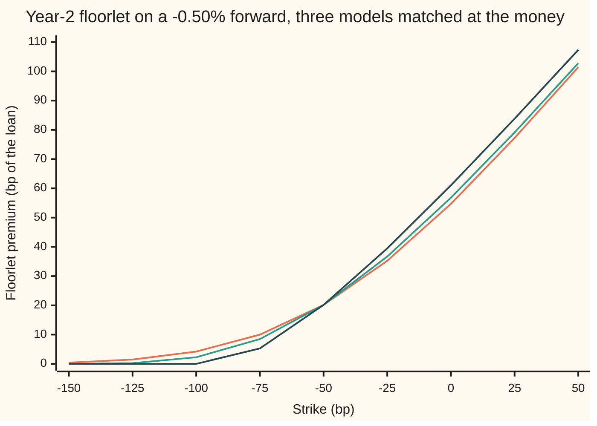

# Negative rates: what breaks, what is floored, and which models survive

Financial mathematics → Curves in Depth → Zero-floored coupons → Negative rates

---

## General Overview

A bank lends 10 million dollars for three years at a floating rate. Each year the interest is reset to that day's benchmark rate, fixed at the start of the year and paid at the end. The loan agreement adds one line: if the benchmark fixes below zero, zero is used instead. That line is a **zero floor**.

Today the curve sits at **minus 0.50 percent** for every year ahead. Rates like that are not a thought experiment. The European Central Bank set its deposit rate below zero in June 2014, and euro rates stayed there for years. The numbers on this card are in dollars, as everywhere in this library; the story is the euro's.

Without the floor, the lender would pay the borrower interest. That plain floating leg is worth **minus $151,512.59** to the lender today. With the floor, the lender never pays and sometimes receives, and the floored leg is worth **plus $14,341.05**. The difference, **$165,853.64**, is the value of the floor.

Pricing that floor raises three questions, and this card answers them in order. What breaks: Black's lognormal model, the standard tool for rate options, returns no price at all. What is floored: a floored coupon splits exactly into the plain coupon plus a put on the rate struck at zero. Which models survive: the normal model and the shifted lognormal model both price it, agree on most of it, and disagree on the rest.

**A coupon floored at zero is the plain coupon plus a put on the rate struck at zero; below zero that put is mostly intrinsic value, which needs no model, while the remainder depends on how the model lets the rate move, and a lognormal model cannot price it at all.**

**What kind of fact this is:** a model — how the rate wanders below zero is an assumption, not a law — carrying two theorems proved on this card in Why it works: the split of a floored coupon, and the smallest shift a shifted model may use.

### The picture: what one floorlet costs, by strike

One year's floor is a **floorlet**: a put on one fixing. Take the second year's fixing, one year away, and price a floorlet at strikes from minus 1.50 to plus 0.50 percent. Prices are in **basis points** of the loan, hundredths of one percent. One basis point on 10 million dollars for a year is $1,000.



The line still above zero on the far left is the **normal model**: the rate moves by so many basis points a year wherever it sits. The middle line is the **shifted lognormal model** with a 2 percent shift: the rate plus 2 percent moves by a percentage of itself, so the rate never falls below minus 2 percent. The line that hits zero at minus 100 bp is the same model with its wall at minus 1 percent. All three cost 20.15 bp at the forward, minus 50 bp, by construction. At the zero strike they part: 54.71, 56.79 and 61.04 bp. Black's unshifted model cannot draw a single point of this chart.

---

## The formula

Notation first, in words. The loan has notional $M$, 10 million dollars, and three periods of length $\tau$, one year each. Period $i$ pays on date $t_i$ (years 1, 2, 3) and fixes its rate at $T_i$, one year earlier (years 0, 1, 2). $D$ is the **discount factor**: $D(t_i)$ is what a dollar due at $t_i$ costs today. $F_i$ is the **forward rate** for period $i$, the rate the curve fixes for it today, and $L_i$ is the rate that will actually be fixed, unknown today. $K$ is the floor's strike, here zero. $\sigma_N$ is the **normal volatility**, how many basis points the rate typically moves in a year, and $w_i = \sigma_N\sqrt{T_i}$ is one **wiggle unit** for period $i$: the typical move between today and its fixing, in proper terms the **standard deviation** of $L_i$. $N$ is the standard normal CDF, the bell-curve area to the left of a point, and $\varphi$ its density, the bell curve's height there ([bachelier-model](../05-Black-Scholes%20from%20the%20Ground%20Up/07-bachelier-model.md)).

The coupon split, true at every outcome:

$$\max(L_i, K) \;=\; L_i \;+\; \max(K - L_i,\,0)$$

The floored leg's value, $V$, adds the plain coupon and one floorlet $\mathrm{Fl}_i$ per period:

$$V \;=\; \sum_{i=1}^{3} M\,\tau\,D(t_i)\,\bigl[\,F_i + \mathrm{Fl}_i\,\bigr], \qquad \mathrm{Fl}_i = (K - F_i)\,N(d_i) + w_i\,\varphi(d_i), \qquad d_i = \frac{K - F_i}{w_i}$$

**Read it aloud:** each year the loan pays the forward rate plus a floorlet; the floorlet is how far the strike already sits above the forward, weighted by the chance it still does at the fixing, plus a payment for the wiggle that could yet put it there; everything is scaled to dollars and brought back to today.

$d_i$ counts how many wiggle units the strike sits above the forward. For the year-2 fixing it is exactly 1. Year 1 is already fixed, so $w_1 = 0$ and $\mathrm{Fl}_1$ is simply $\max(K - F_1, 0)$.

The shifted model replaces $\mathrm{Fl}_i$ with Black's put on the slid pair $F_i + a$ and $K + a$, at a volatility $\sigma_a$ that is a percentage of the slid rate ([shifted-lognormal-and-volatility-conversion](../05-Black-Scholes%20from%20the%20Ground%20Up/08-shifted-lognormal-and-volatility-conversion.md)). To compare it with the normal model, $\sigma_a$ is chosen so both cost the same at the money. That choice exists, and is unique, exactly when

$$a \;>\; -F_i \;+\; \sigma_N\sqrt{\frac{T_i}{2\pi}}$$

**Read it aloud:** the shift must lift the forward above zero, and then by a margin as large as the normal model's at-the-money premium. Here that is 0.6995 percent for the year-2 fixing and 0.7821 percent for the year-3 fixing.

| Symbol | Plain meaning | In our example | Push it up and the floored leg… |
| --- | --- | --- | --- |
| $M$, $\tau$ | the notional, and each period's length in years | $10,000,000; 1 | scales one for one |
| $i$, $t_i$, $T_i$ | the period's number; when it pays, and when its rate fixes | 1 to 3; 1, 2, 3; 0, 1, 2 | a later fixing: more room to move, dearer |
| $D$ | the discount factor, today's price of a dollar due later | 1.005025, 1.010076, 1.015151 | scales one for one |
| $F_i$, $F$ | the forward rate for period $i$; $F$ when the period does not matter | −0.50 percent | rises: the coupon rises, the floor falls, the sum rises |
| $L_i$, $L$ | the rate actually fixed for period $i$, unknown today; $L$ likewise | − | − |
| $K$ | the floor's strike | 0 percent | rises: dearer, one for one where the floor is deep |
| $\sigma_N$ | the normal volatility, bp per year | 50 bp | rises: dearer, $206,929.32 floor at 100 bp |
| $w_i$, $d_i$ | one wiggle unit to period $i$'s fixing, and the strike's distance above the forward in wiggle units | 50 bp and 1 (year 2) | − |
| $N$, $\varphi$ | the bell-curve area to the left, and the curve's height | $N(1) = 0.841345$ | − |
| $\mathrm{Fl}_i$, $V$ | one floorlet in rate units, and the floored leg in dollars | 54.165774 bp; $14,341.05 | − |
| $a$, $\sigma_a$ | the shift, the wall sits at $-a$; the slid rate's volatility | 2 percent; 33.49 percent (year 2) | a smaller shift: dearer, $31,350.14 at 1 percent |

### When it holds

- **The rate moves by a fixed absolute size, with no wall.** If rates stick near a central bank's lower limit, the normal model overprices floors struck far below zero.
- **One volatility per fixing, no smile.** Each model is tuned at the money, 50 bp below the zero strike. The market quotes a different volatility at each strike, and a desk would use the zero strike's own quote.
- **One curve.** Forwards are read from the same curve that discounts. Real euro legs project the benchmark on one curve and discount on an overnight-rate curve, and then the plain leg no longer collapses to $M(D(0) - D(3))$.
- **The shift is chosen, and chosen large enough.** Below the minimum shift no shifted volatility reproduces the at-the-money price.
- **The floor applies to the benchmark alone.** A fixed margin added on top is a plain payment and changes nothing in the option.

**Conventions verified 28 Sep 2026:** simple annual rates, one-year accrual, strikes and premiums in basis points, one curve for forwards and discounting. A shifted volatility is quoted with its shift.

---

## Why it works

### Step 0: the floor only ever adds a put

At every outcome, $\max(L, 0)$ is $L$ plus the amount by which $L$ fell short of zero. If $L$ fixes at minus 0.30 percent, the floored coupon is 0: the plain coupon, minus 0.30, plus the shortfall, 0.30. If $L$ fixes at plus 0.20 percent, it is 0.20: the plain coupon, plus a shortfall of nothing.

That shortfall is exactly a floorlet's payoff, $\max(K - L, 0)$ with $K = 0$. So a floored leg is a plain leg plus a strip of floorlets, one per period. The identity holds at every outcome, not on average, so it holds for prices under any model.

There is a second reading of the same payoff. $\max(L, 0)$ is also $\max(L - 0, 0)$: a **caplet** struck at zero, a call on the rate ([caplets-and-floorlets](../29-Caps%2C%20Floors%20and%20Swaptions/01-caplets-and-floorlets.md)). So the floored leg equals a zero-strike cap. The code prices it that way too, as a separate road, and the two agree to the cent.

### Step 1: the plain leg needs no model

The forward $F_i$ is the rate a contract can lock in today at no cost. So a promise to pay $L_i$ at $t_i$ is worth the same as a promise to pay $F_i$ ([carry-and-roll-down](05-carry-and-roll-down.md) reads the forwards off the same curve). With one curve, each forward is read from two discount factors, $F_i = \bigl(D(t_{i-1})/D(t_i) - 1\bigr)/\tau$, so each coupon's value $\tau F_i D(t_i)$ is $D(t_{i-1}) - D(t_i)$. The sum collapses:

$$\sum_{i=1}^{3} M\,\tau\,D(t_i)\,F_i \;=\; M\,\bigl[D(0) - D(3)\bigr] \;=\; -\$151{,}512.59$$

The discount factors are above 1. At minus 0.50 percent, a dollar due in three years costs $1.015151 today, because holding cash for three years costs money. That is not an error in the code; it is what a negative rate means.

### Step 2: the first year is already fixed

Year 1's rate was fixed this morning at minus 0.50 percent. Its floorlet is no longer an option. It pays 50 bp for certain, worth $50,251.26 today. No model enters.

### Step 3: why Black's model cannot price the rest

Black's model says the fixing is today's forward times a random growth factor that is always positive ([black-76-and-forward-level-pricing](../05-Black-Scholes%20from%20the%20Ground%20Up/06-black-76-and-forward-level-pricing.md)). Two things follow.

- **A negative forward has no place in it.** A growth factor is positive, so the fixing keeps the sign of $F$. The formula makes that literal: it needs $\ln(F/K)$, and with $F = -0.50$ percent and $K = 0$ the code gets a division by zero; with $K$ nudged to plus 0.01 percent, the log of a negative number. No price.
- **A positive forward gives the wrong price.** Nudge the forward to plus 0.01 percent, and the strike a hair above zero so the formula runs. Now $L$ is always positive, the chance of fixing below zero is exactly nothing, and the zero-strike floorlet is worth $0.00.

That zero breaks a bound no model may cross. A floorlet minus a caplet at the same strike pays $K - L$ at every outcome, which is worth $D\,\tau\,(K - F)$ today, the plain coupon read backwards ([caps-floors-and-parity](../29-Caps%2C%20Floors%20and%20Swaptions/02-caps-floors-and-parity.md)). A caplet is never worth less than nothing. So a floorlet is worth at least $D\,\tau\,\max(K - F, 0)$, its **intrinsic value**. On a minus 0.50 percent forward that is 50 bp a year, $151,512.59 over the loan. A model that prices the floor at nothing prices it below a bound anyone could exploit.

### Step 4: the normal model prices it

The normal model says $L_i = F_i + w_i Z$, with $Z$ a standard bell-curve draw. Zero is just a number the rate passes through. Average the floorlet's payoff over $Z$ and discount once:

$$\mathrm{Fl}_i = \mathbb{E}\bigl[\max(K - F_i - w_i Z,\,0)\bigr] = (K - F_i)\,N(d_i) + w_i\,\varphi(d_i)$$

The first term is the 50 bp distance, weighted by the chance the rate is still below the strike at the fixing: 84.13 percent for year 2. The second is what the wiggle adds.

<details>
<summary>Detailed proof: the integral, and the bound it respects</summary>

The payoff is positive where $F_i + w_i z < K$, that is where $z < d_i$. So
$$\mathrm{Fl}_i = \int_{-\infty}^{d_i} (K - F_i - w_i z)\,\varphi(z)\,\mathrm{d}z = (K - F_i)\,N(d_i) - w_i\int_{-\infty}^{d_i} z\,\varphi(z)\,\mathrm{d}z .$$
The bell curve's height has slope $\varphi'(z) = -z\,\varphi(z)$, so the last integral is $-\varphi(d_i)$, and $\mathrm{Fl}_i = (K - F_i)N(d_i) + w_i\,\varphi(d_i)$.
Subtract the intrinsic value $K - F_i$: the rest is $w_i\bigl[\varphi(d_i) - d_i\,(1 - N(d_i))\bigr]$. The bracket is the average of $\max(z - d_i, 0)$ over the bell curve, an average of something never negative, so it is never negative. The normal floorlet sits on or above its intrinsic value at every strike, which Black's zero did not.

</details>

### Step 5: the shifted model prices it, if the shift is big enough

The shifted model says $L_i + a$ is lognormal: the slid rate grows by a random percentage, so $L_i$ cannot fall below $-a$. With $a = 2$ percent the forward slides to plus 1.50 percent, Black's formula runs, and the zero strike slides to plus 2 percent.

To compare models fairly, each shifted volatility is tuned so the at-the-money floorlet, struck at the forward, costs what the normal model says: $\sigma_N\sqrt{T_i/(2\pi)}$, 20.15 bp once discounted for year 2. The shifted at-the-money premium, before discounting, is $(F_i + a)\bigl[2N(w/2) - 1\bigr]$ with $w = \sigma_a\sqrt{T_i}$. As $\sigma_a$ runs from 0 upwards, $2N(w/2) - 1$ climbs strictly from 0 towards 1 and never arrives. So the shifted premium sweeps every value between nothing and $F_i + a$, each exactly once. A match exists, and is unique, exactly when the normal premium is below $F_i + a$: the bound in The formula. For year 3 that needs a shift above 0.7821 percent. At 0.75 percent the code finds a year-2 volatility of 255.11 percent and no year-3 volatility at all.

### Step 6: why the survivors disagree

Matched at the money, the models still differ at the zero strike, 50 bp away. The shifted model's moves are proportional to the distance above its wall. Rises from a low rate are therefore larger than falls, and falls slow down near the wall. That tilts the odds towards the rate climbing above zero, which is exactly what the zero-strike caplet, and so the floored leg, pays for.

The smaller the shift, the stronger the tilt. The floored leg is worth $31,350.14 at a 1 percent shift, $20,082.32 at 2, $17,790.91 at 3, and $15,249.58 at 10. As the shift grows, the percentage moves of a far-away wall become absolute moves, and the shifted model tends to the normal one's $14,341.05. None of these is wrong. They are different bets about rates near zero, settled by the volatility the market quotes at each strike.

---

## Worked numbers, by hand

The normal model, 50 bp volatility, curve flat at minus 0.50 percent. Year 2 fixes in one year and pays in two.

| Step | Arithmetic | Value |
| --- | --- | --- |
| discount factor $D(2)$ | $1 / 0.995^2$ | 1.010076 |
| one wiggle unit $w_i$, year 2 | $50 \times \sqrt{1}$ bp | 50 bp |
| $d_i$, year 2: strike above forward in wiggle units | $(0 - (-50)) / 50$ | 1.000000 |
| chance of fixing below zero, $N(1)$ | bell-curve table | 0.841345 |
| bell-curve height $\varphi(1)$ | $e^{-1/2} / \sqrt{2\pi}$ | 0.241971 |
| floorlet, undiscounted | $50 \times 0.841345 + 50 \times 0.241971$ | 54.165774 bp |
| floorlet, today | $54.165774 \times 1.010076$ | 54.711521 bp |
| year-2 floorlet in dollars | $54.711521 \times \$1{,}000$ | $54,711.52 |
| year-3 floorlet, same steps with $w_i = 70.710678$ bp, $d_i = 0.707107$ | $59.982061 \times 1.015151$ bp | $60,890.87 |
| year-1 floorlet, already fixed | $50 \times 1.005025$ bp | $50,251.26 |
| **floor** | $50{,}251.26 + 54{,}711.52 + 60{,}890.87$ | **$165,853.64** |
| plain leg | $10{,}000{,}000 \times (1 - 1.015151)$ | −$151,512.59 |
| **floored leg** | $-151{,}512.59 + 165{,}853.64$ | **$14,341.05** |

The floor costs $165,853.64, of which $151,512.59 is intrinsic: the three years' 50 bp, certain if rates sit still. The model prices only the other $14,341.05, which is the whole value of the floored leg: the lender's chance that rates climb above zero before a fixing.

### What breaks if you drop a piece

| Mistake | Comes out at | What went wrong |
| --- | --- | --- |
| Black-76 on the −0.50 percent forward | no price | division by a zero strike, or the log of a negative number |
| Black-76 with the forward nudged to +0.01 percent | $0.00 floorlet | the model forbids negative fixings, so the floor is free, below its intrinsic value |
| Skip year 1 because it has already fixed | $115,602.39 floor | a fixed floorlet is not worthless; it is certain, $50,251.26 |
| Discount at 1, treating $D > 1$ as a bug | $164,147.83 floor | below zero a dollar later costs more than a dollar now |
| Use the 2 percent shift's volatilities at a 1 percent shift | $152,760.98 floor (right: $182,862.74) | a shifted volatility means nothing without its shift |

---

## Code, from first principles, and it actually runs

The scripts build the curve from the flat rate, read the forwards back off it, and price the floor and the floored leg by **four independent roads** in the normal model: the formula; a brute-force average of the floorlet payoff over the bell curve by Simpson's rule, with no $N$ in it; the zero-strike cap priced separately by the same brute force, which must equal plain leg plus floor; and a Monte Carlo of the loan's cash flows, 200,000 paths of floored coupons, with its own random numbers. The shifted model is priced by Black's formula and again by brute force, after a bisection finds each matched volatility or reports that none exists. Every number on the card, including every chart point, is printed by both.

### Python

```python
# Negative rates and floors -- the check behind the card.  Standard library only.
# A $10m three-year loan pays max(rate, 0) each year on a curve sitting at -0.50%.
# Nothing imported knows the answer: N(x) from math.erf, Simpson's rule, bisection
# and the random numbers are written out below.
from math import log, sqrt, exp, erf, pi, cos

def N(x):   return 0.5 * (1.0 + erf(x / sqrt(2.0)))       # bell-curve area left of x
def phi(x): return exp(-0.5 * x * x) / sqrt(2.0 * pi)     # bell-curve height at x

def simpson(f, a, b, n=4000):
    h = (b - a) / n
    s = f(a) + f(b) + sum((4 if i % 2 else 2) * f(a + i * h) for i in range(1, n))
    return s * h / 3.0

def expect(payoff, level, kink):          # E[payoff(level(z))], z a bell-curve draw, split at the kink
    g = lambda z: payoff(level(z)) * phi(z)
    k = min(max(kink, -10.0), 10.0)
    return simpson(g, -10.0, k) + simpson(g, k, 10.0)

def bach(F, K, s, T, cp):                  # normal model, per unit of rate; cp = +1 cap, -1 floor
    w = s * sqrt(T)
    if w == 0.0: return max(cp * (F - K), 0.0)
    d = cp * (F - K) / w
    return cp * (F - K) * N(d) + w * phi(d)

def black(F, K, s, T, cp):                 # Black-76, per unit of rate; needs F > 0 and K > 0
    w = s * sqrt(T)
    d1 = (log(F / K) + 0.5 * w * w) / w    # log of a negative or zero ratio: no price
    return cp * (F * N(cp * d1) - K * N(cp * (d1 - w)))

def shifted(F, K, a, s, T, cp):            # Black on the slid pair F + a, K + a
    if K + a <= 0.0: return max(cp * (F - K), 0.0)   # strike at or below the wall: never reached
    return black(F + a, K + a, s, T, cp)

def match(a, F, sN, T):                    # shifted vol with the normal model's at-the-money price
    target, lo, hi = sN * sqrt(T) / sqrt(2.0 * pi), 1e-9, 50.0
    if target >= F + a: return None        # no lognormal vol pays that much: the shift is too small
    for _ in range(200):
        mid = 0.5 * (lo + hi)
        if shifted(F, F, a, mid, T, 1) < target: lo = mid
        else: hi = mid
    return 0.5 * (lo + hi)

# ---- the loan: $10m, three yearly periods, curve flat at -0.50% a year, zero floor ----
M, tau, Fq, K, sN = 10_000_000.0, 1.0, -0.005, 0.0, 0.005
D = [(1.0 + Fq) ** (-t) for t in range(4)]                      # discount factors D(0)..D(3)
F = [(D[i] / D[i + 1] - 1.0) / tau for i in range(3)]            # forward for period i, read off the curve
T = [0.0, 1.0, 2.0]                                              # when each period's rate is fixed
print("period  fixes  paid    D(paid)      forward")
for i in range(3): print(f"{i + 1:>6} {T[i]:>6.0f} {i + 1:>5} {D[i + 1]:>10.6f} {F[i]:>12.6%}")
for Kb, why in ((K, "divides by a zero strike"), (0.0001, "log of a negative number")):
    try: print(f"black, F = -0.50%, K = {Kb:.2%}: {black(F[1], Kb, 0.30, 1.0, -1):.6f}")
    except (ValueError, ZeroDivisionError): print(f"black, F = -0.50%, K = {Kb:.2%}: no price ({why})")
print(f"{'black, F = +0.01%, K = 1e-8, floorlet $':<44}{0.0 + max(M * D[2] * black(1e-4, 1e-8, 0.30, 1.0, -1), 0.0):>14.2f}")

flo, flo_int, cap0, intr, leg = [], [], [], [], []
for i in range(3):
    w, pay = sN * sqrt(T[i]), M * tau * D[i + 1]
    flo.append(pay * bach(F[i], K, sN, T[i], -1))
    if w > 0:
        lvl = lambda z, i=i, w=w: F[i] + w * z
        flo_int.append(pay * expect(lambda L: max(K - L, 0.0), lvl, (K - F[i]) / w))
        cap0.append(pay * expect(lambda L: max(L - K, 0.0), lvl, (K - F[i]) / w))
    else:
        flo_int.append(pay * max(K - F[i], 0.0)); cap0.append(pay * max(F[i] - K, 0.0))
    intr.append(pay * max(K - F[i], 0.0)); leg.append(pay * F[i])
print("period    floorlet     by integral    intrinsic   0-strike caplet   P(below 0)")
for i in range(3):
    pb = N((K - F[i]) / (sN * sqrt(T[i]))) if T[i] > 0 else 1.0
    print(f"{i + 1:>6} {flo[i]:>11.2f} {flo_int[i]:>14.2f} {intr[i]:>12.2f} {cap0[i]:>12.2f} {pb:>12.2%}")
dd = lambda i: (K - F[i]) / (sN * sqrt(T[i]))                   # by hand: periods 2 and 3
print(f"{'by hand':<26}{'period 2':>12}{'period 3':>12}")
for name, g in (("wiggle w = sN sqrt(T), bp", lambda i: 1e4 * sN * sqrt(T[i])), ("d = (K - F) / w", dd),
                ("N(d)", lambda i: N(dd(i))), ("phi(d)", lambda i: phi(dd(i))),
                ("floorlet bp, undiscounted", lambda i: 1e4 * bach(F[i], K, sN, T[i], -1)),
                ("floorlet bp, times D", lambda i: 1e4 * D[i + 1] * bach(F[i], K, sN, T[i], -1))):
    print(f"{name:<26}" + "".join(f"{g(i):>12.6f}" for i in (1, 2)))
x = 0x2545F4914F6CDD1D
def unif():                                                      # xorshift64, our own uniform on (0, 1)
    global x
    x ^= (x << 13) & 0xFFFFFFFFFFFFFFFF; x ^= x >> 7; x ^= (x << 17) & 0xFFFFFFFFFFFFFFFF
    return ((x >> 11) + 0.5) / 9007199254740992.0
n, tot, tot2 = 200_000, 0.0, 0.0
for _ in range(n):                                               # pay max(fixing, 0) on every path
    z1, z2 = sqrt(-2.0 * log(unif())) * cos(2.0 * pi * unif()), sqrt(-2.0 * log(unif())) * cos(2.0 * pi * unif())
    v = sum(M * tau * D[i + 1] * max(F[i] + sN * sqrt(T[i]) * z, 0.0) for i, z in ((0, 0.0), (1, z1), (2, z2)))
    tot += v; tot2 += v * v
mc, se = tot / n, sqrt((tot2 / n - (tot / n) ** 2) / n)
rows = [("one basis point, one year, on the loan", M * tau * 1e-4), ("unfloored leg, sum D tau F M", sum(leg)), ("unfloored leg, M (D(0) - D(3))", M * (D[0] - D[3])),
        ("floor, normal formula", sum(flo)), ("floor, integral", sum(flo_int)), ("floor, intrinsic only", sum(intr)),
        ("floor, time value", sum(flo) - sum(intr)), ("floored leg = leg + floor", sum(leg) + sum(flo)),
        ("floored leg = zero-strike cap", sum(cap0)), ("floored leg, Monte Carlo", mc), ("  Monte Carlo std error", se)]
for name, v in rows: print(f"{name:<44}{v:>14.2f}")

print(f"smallest shift that can match, 1y and 2y: {-F[1] + sN * sqrt(1.0 / (2.0 * pi)):.4%} {-F[2] + sN * sqrt(2.0 / (2.0 * pi)):.4%}")
print("shift  vol 1y match  vol 2y match     floor $   floored leg $   by integral")
for a in (0.0075, 0.01, 0.02, 0.03, 0.10):
    s1, s2 = match(a, F[1], sN, 1.0), match(a, F[2], sN, 2.0)
    if s2 is None: print(f"{a:>5.2%} {s1:>12.2%}          none    no price: the 2y quote cannot be matched"); continue
    fl = [flo[0], M * tau * D[2] * shifted(F[1], K, a, s1, 1.0, -1), M * tau * D[3] * shifted(F[2], K, a, s2, 2.0, -1)]
    G2 = F[2] + a
    chk = M * tau * D[3] * expect(lambda L: max(K + a - L, 0.0), lambda z: G2 * exp(-0.5 * s2 * s2 * 2.0 + s2 * sqrt(2.0) * z),
                                  (log((K + a) / G2) + s2 * s2) / (s2 * sqrt(2.0)))
    print(f"{a:>5.2%} {s1:>12.2%} {s2:>13.2%} {sum(fl):>11.2f} {sum(leg) + sum(fl):>15.2f} {chk + fl[0] + fl[1] + sum(leg):>13.2f}")
    assert abs(chk - fl[2]) < 1e-4, "shifted formula vs integral, year-3 floorlet"
    if a == 0.02: s1_2 = s1
    if a == 0.10: fl10 = sum(fl)

ks = [-0.015, -0.0125, -0.01, -0.0075, -0.005, -0.0025, 0.0, 0.0025, 0.005]
s1a = match(0.01, F[1], sN, 1.0)
print("chart, strike bp       " + " ".join(f"{k * 1e4:>7.0f}" for k in ks))
print("chart, normal          " + " ".join(f"{1e4 * D[2] * bach(F[1], k, sN, 1.0, -1):>7.2f}" for k in ks))
print("chart, shift 2%        " + " ".join(f"{1e4 * D[2] * shifted(F[1], k, 0.02, s1_2, 1.0, -1):>7.2f}" for k in ks))
print("chart, shift 1%        " + " ".join(f"{1e4 * D[2] * shifted(F[1], k, 0.01, s1a, 1.0, -1):>7.2f}" for k in ks))

wrong = [("wrong: skip period 1, it has fixed", sum(flo) - flo[0]),
         ("wrong: discount at 1, not D > 1", sum(flo[i] / D[i + 1] for i in range(3))),
         ("wrong: 2% shift's vol used at 1% shift", flo[0] + sum(M * tau * D[i + 1] * shifted(F[i], K, 0.01, match(0.02, F[i], sN, T[i]), T[i], -1) for i in (1, 2))),
         ("try: normal vol 1.00%", sum(M * tau * D[i + 1] * bach(F[i], K, 0.01, T[i], -1) for i in range(3))),
         ("try: floor at -0.25%, floored leg", sum(leg) + sum(M * tau * D[i + 1] * bach(F[i], -0.0025, sN, T[i], -1) for i in range(3)))]
for name, v in wrong: print(f"{name:<44}{v:>14.2f}")

assert abs(sum(leg) - M * (D[0] - D[3])) < 1e-6, "leg period by period vs the telescoped curve"
assert abs(sum(flo) - sum(flo_int)) < 1e-4, "normal formula vs brute-force integral"
assert abs(sum(leg) + sum(flo) - sum(cap0)) < 1e-4, "leg + floor must equal the zero-strike cap, priced separately"
assert abs(mc - (sum(leg) + sum(flo))) < 4.0 * se, "Monte Carlo within four standard errors"
assert sum(flo) > sum(intr) and abs(fl10 - sum(flo)) < 0.01 * sum(flo), "floor above intrinsic; wide shift near normal"
print("ALL CHECKS PASS")
```

**Ran 2026-09-28 on macOS, Python 3.14.6, standard library only. All checks passed. Output, pasted from the run:**

```
period  fixes  paid    D(paid)      forward
     1      0     1   1.005025   -0.500000%
     2      1     2   1.010076   -0.500000%
     3      2     3   1.015151   -0.500000%
black, F = -0.50%, K = 0.00%: no price (divides by a zero strike)
black, F = -0.50%, K = 0.01%: no price (log of a negative number)
black, F = +0.01%, K = 1e-8, floorlet $               0.00
period    floorlet     by integral    intrinsic   0-strike caplet   P(below 0)
     1    50251.26       50251.26     50251.26         0.00      100.00%
     2    54711.52       54711.52     50503.78      4207.75       84.13%
     3    60890.87       60890.87     50757.56     10133.30       76.02%
by hand                       period 2    period 3
wiggle w = sN sqrt(T), bp    50.000000   70.710678
d = (K - F) / w               1.000000    0.707107
N(d)                          0.841345    0.760250
phi(d)                        0.241971    0.310697
floorlet bp, undiscounted    54.165774   59.982061
floorlet bp, times D         54.711521   60.890865
one basis point, one year, on the loan             1000.00
unfloored leg, sum D tau F M                    -151512.59
unfloored leg, M (D(0) - D(3))                  -151512.59
floor, normal formula                            165853.64
floor, integral                                  165853.64
floor, intrinsic only                            151512.59
floor, time value                                 14341.05
floored leg = leg + floor                         14341.05
floored leg = zero-strike cap                     14341.05
floored leg, Monte Carlo                          14379.87
  Monte Carlo std error                              62.98
smallest shift that can match, 1y and 2y: 0.6995% 0.7821%
shift  vol 1y match  vol 2y match     floor $   floored leg $   by integral
0.75%      255.11%          none    no price: the 2y quote cannot be matched
1.00%      104.58%       110.21%   182862.74        31350.14      31350.14
2.00%       33.49%        33.65%   171594.91        20082.32      20082.32
3.00%       20.03%        20.07%   169303.51        17790.91      17790.91
10.00%        5.26%         5.26%   166762.18        15249.58      15249.58
chart, strike bp          -150    -125    -100     -75     -50     -25       0      25      50
chart, normal             0.43    1.48    4.21    9.99   20.15   35.24   54.71   77.24  101.44
chart, shift 2%           0.00    0.25    2.25    8.48   20.15   36.70   56.79   79.13  102.80
chart, shift 1%           0.00    0.00    0.00    5.27   20.15   39.49   61.04   83.82  107.34
wrong: skip period 1, it has fixed               115602.39
wrong: discount at 1, not D > 1                  164147.83
wrong: 2% shift's vol used at 1% shift           152760.98
try: normal vol 1.00%                            206929.32
try: floor at -0.25%, floored leg                -48047.93
ALL CHECKS PASS
```

Four roads, one floor. Formula and integral agree to the cent. The zero-strike cap, priced on its own, equals plain leg plus floor. The Monte Carlo lands at $14,379.87, within one standard error of $62.98. Every shifted row agrees with its brute-force integral to the cent.

### Rust

Same checks, same inputs. Rust has no `erf`, so $N$ is built by adding thin slices under the bell curve. No crates.

```rust
// Negative rates and floors -- the same check as negative_rates_and_floors_check.py, in Rust.
// Standard library only, no crates.  Rust has no erf, so N(x) is built by adding thin
// slices under the bell curve (Simpson).  Bisection and random numbers written out too.
// Compile: rustc --edition 2021 -O negative_rates_and_floors_check.rs -o /tmp/nrf_check
use std::f64::consts::PI;

fn phi(x: f64) -> f64 { (-0.5 * x * x).exp() / (2.0 * PI).sqrt() }
fn simpson<G: Fn(f64) -> f64>(f: G, a: f64, b: f64, n: usize) -> f64 {
    let h = (b - a) / n as f64;
    let inner: f64 = (1..n).map(|i| if i % 2 == 1 { 4.0 } else { 2.0 } * f(a + i as f64 * h)).sum();
    (f(a) + f(b) + inner) * h / 3.0
}
fn n_cdf(x: f64) -> f64 { if x < -12.0 { 0.0 } else if x > 12.0 { 1.0 } else { 0.5 + simpson(phi, 0.0, x, 4000) } }
fn expect<P: Fn(f64) -> f64, L: Fn(f64) -> f64>(payoff: P, level: L, kink: f64) -> f64 {
    let g = |z: f64| payoff(level(z)) * phi(z);
    let k = kink.max(-10.0).min(10.0);
    simpson(&g, -10.0, k, 4000) + simpson(&g, k, 10.0, 4000)
}
fn bach(f: f64, k: f64, s: f64, t: f64, cp: f64) -> f64 {        // normal model, per unit of rate
    let w = s * t.sqrt();
    if w == 0.0 { return (cp * (f - k)).max(0.0); }
    let d = cp * (f - k) / w;
    cp * (f - k) * n_cdf(d) + w * phi(d)
}
fn black(f: f64, k: f64, s: f64, t: f64, cp: f64) -> f64 {       // Black-76; NaN when f/k is not positive
    let w = s * t.sqrt();
    let d1 = ((f / k).ln() + 0.5 * w * w) / w;
    cp * (f * n_cdf(cp * d1) - k * n_cdf(cp * (d1 - w)))
}
fn shifted(f: f64, k: f64, a: f64, s: f64, t: f64, cp: f64) -> f64 {
    if k + a <= 0.0 { return (cp * (f - k)).max(0.0); }          // strike at or below the wall
    black(f + a, k + a, s, t, cp)
}
fn matched(a: f64, f: f64, sn: f64, t: f64) -> Option<f64> {
    let target = sn * t.sqrt() / (2.0 * PI).sqrt();
    if target >= f + a { return None; }                             // the shift is too small
    let (mut lo, mut hi) = (1e-9, 50.0);
    for _ in 0..200 {
        let mid = 0.5 * (lo + hi);
        if shifted(f, f, a, mid, t, 1.0) < target { lo = mid } else { hi = mid }
    }
    Some(0.5 * (lo + hi))
}
fn pct(v: f64, w: usize, p: usize) -> String { format!("{:>w$.p$}%", v * 100.0, w = w - 1, p = p) }
fn row(name: &str, v: f64) { println!("{:<44}{:>14.2}", name, v); }

fn main() {
    let (m, tau, fq, k, sn) = (10_000_000.0_f64, 1.0_f64, -0.005_f64, 0.0_f64, 0.005_f64);
    let d: Vec<f64> = (0..4).map(|t| (1.0 + fq).powf(-(t as f64))).collect();
    let f: Vec<f64> = (0..3).map(|i| (d[i] / d[i + 1] - 1.0) / tau).collect();
    let t = [0.0_f64, 1.0, 2.0];
    println!("period  fixes  paid    D(paid)      forward");
    for i in 0..3 { println!("{:>6} {:>6.0} {:>5} {:>10.6} {}", i + 1, t[i], i + 1, d[i + 1], pct(f[i], 12, 6)); }
    for (kb, why) in [(k, "divides by a zero strike"), (0.0001, "log of a negative number")] {
        let v = black(f[1], kb, 0.30, 1.0, -1.0);
        if v.is_finite() { println!("black, F = -0.50%, K = {}: {:.6}", pct(kb, 1, 2), v); }
        else { println!("black, F = -0.50%, K = {}: no price ({})", pct(kb, 1, 2), why); }
    }
    row("black, F = +0.01%, K = 1e-8, floorlet $", 0.0 + (m * d[2] * black(1e-4, 1e-8, 0.30, 1.0, -1.0)).max(0.0));

    let (mut flo, mut flo_int, mut cap0, mut intr, mut leg) = (vec![], vec![], vec![], vec![], vec![]);
    for i in 0..3 {
        let (w, pay, fi) = (sn * t[i].sqrt(), m * tau * d[i + 1], f[i]);
        flo.push(pay * bach(fi, k, sn, t[i], -1.0));
        if w > 0.0 {
            let lvl = |z: f64| fi + w * z;
            flo_int.push(pay * expect(|l| (k - l).max(0.0), lvl, (k - fi) / w));
            cap0.push(pay * expect(|l| (l - k).max(0.0), lvl, (k - fi) / w));
        } else { flo_int.push(pay * (k - fi).max(0.0)); cap0.push(pay * (fi - k).max(0.0)); }
        intr.push(pay * (k - fi).max(0.0)); leg.push(pay * fi);
    }
    println!("period    floorlet     by integral    intrinsic   0-strike caplet   P(below 0)");
    for i in 0..3 {
        let pb = if t[i] > 0.0 { n_cdf((k - f[i]) / (sn * t[i].sqrt())) } else { 1.0 };
        println!("{:>6} {:>11.2} {:>14.2} {:>12.2} {:>12.2} {}", i + 1, flo[i], flo_int[i], intr[i], cap0[i], pct(pb, 12, 2));
    }
    let dd = |i: usize| (k - f[i]) / (sn * t[i].sqrt());               // by hand: periods 2 and 3
    println!("{:<26}{:>12}{:>12}", "by hand", "period 2", "period 3");
    let hand: [(&str, Box<dyn Fn(usize) -> f64>); 6] = [("wiggle w = sN sqrt(T), bp", Box::new(|i| 1e4 * sn * t[i].sqrt())), ("d = (K - F) / w", Box::new(dd)),
        ("N(d)", Box::new(|i| n_cdf(dd(i)))), ("phi(d)", Box::new(|i| phi(dd(i)))),
        ("floorlet bp, undiscounted", Box::new(|i| 1e4 * bach(f[i], k, sn, t[i], -1.0))),
        ("floorlet bp, times D", Box::new(|i| 1e4 * d[i + 1] * bach(f[i], k, sn, t[i], -1.0)))];
    for (name, g) in hand.iter() { println!("{:<26}{:>12.6}{:>12.6}", name, g(1), g(2)); }
    let mut x: u64 = 0x2545F4914F6CDD1D;
    let mut unif = || { x ^= x << 13; x ^= x >> 7; x ^= x << 17; ((x >> 11) as f64 + 0.5) / 9007199254740992.0 };
    let (n, mut tot, mut tot2) = (200_000usize, 0.0_f64, 0.0_f64);
    for _ in 0..n {                                                  // pay max(fixing, 0) on every path
        let (u1, u2) = (unif(), unif()); let z1 = (-2.0 * u1.ln()).sqrt() * (2.0 * PI * u2).cos();
        let (u3, u4) = (unif(), unif()); let z2 = (-2.0 * u3.ln()).sqrt() * (2.0 * PI * u4).cos();
        let v: f64 = [(0usize, 0.0_f64), (1, z1), (2, z2)].iter()
            .map(|&(i, z)| m * tau * d[i + 1] * (f[i] + sn * t[i].sqrt() * z).max(0.0)).sum();
        tot += v; tot2 += v * v;
    }
    let (mc, se) = (tot / n as f64, ((tot2 / n as f64 - (tot / n as f64).powi(2)) / n as f64).sqrt());
    let s = |v: &Vec<f64>| -> f64 { v.iter().sum() };
    row("one basis point, one year, on the loan", m * tau * 1e-4);
    row("unfloored leg, sum D tau F M", s(&leg)); row("unfloored leg, M (D(0) - D(3))", m * (d[0] - d[3]));
    row("floor, normal formula", s(&flo)); row("floor, integral", s(&flo_int)); row("floor, intrinsic only", s(&intr));
    row("floor, time value", s(&flo) - s(&intr)); row("floored leg = leg + floor", s(&leg) + s(&flo));
    row("floored leg = zero-strike cap", s(&cap0)); row("floored leg, Monte Carlo", mc); row("  Monte Carlo std error", se);

    println!("smallest shift that can match, 1y and 2y: {} {}", pct(-f[1] + sn * (1.0 / (2.0 * PI)).sqrt(), 1, 4), pct(-f[2] + sn * (2.0 / (2.0 * PI)).sqrt(), 1, 4));
    println!("shift  vol 1y match  vol 2y match     floor $   floored leg $   by integral");
    let (mut s1_2, mut fl10) = (0.0, 0.0);
    for a in [0.0075_f64, 0.01, 0.02, 0.03, 0.10] {
        let s1 = matched(a, f[1], sn, 1.0).unwrap();
        let s2 = match matched(a, f[2], sn, 2.0) {
            Some(v) => v,
            None => { println!("{} {}          none    no price: the 2y quote cannot be matched", pct(a, 5, 2), pct(s1, 12, 2)); continue; }
        };
        let fl = [flo[0], m * tau * d[2] * shifted(f[1], k, a, s1, 1.0, -1.0), m * tau * d[3] * shifted(f[2], k, a, s2, 2.0, -1.0)];
        let g2 = f[2] + a;
        let chk = m * tau * d[3] * expect(|l| (k + a - l).max(0.0), |z| g2 * (-0.5 * s2 * s2 * 2.0 + s2 * 2.0_f64.sqrt() * z).exp(),
                                          (((k + a) / g2).ln() + s2 * s2) / (s2 * 2.0_f64.sqrt()));
        let sf: f64 = fl.iter().sum();
        println!("{} {} {} {:>11.2} {:>15.2} {:>13.2}", pct(a, 5, 2), pct(s1, 12, 2), pct(s2, 13, 2), sf, s(&leg) + sf, chk + fl[0] + fl[1] + s(&leg));
        assert!((chk - fl[2]).abs() < 1e-4, "shifted formula vs integral, year-3 floorlet");
        if a == 0.02 { s1_2 = s1; }
        if a == 0.10 { fl10 = sf; }
    }

    let ks = [-0.015_f64, -0.0125, -0.01, -0.0075, -0.005, -0.0025, 0.0, 0.0025, 0.005];
    let s1a = matched(0.01, f[1], sn, 1.0).unwrap();
    let line = |lab: &str, g: &dyn Fn(f64) -> f64| println!("{:<22}{}", lab, ks.iter().map(|&kk| format!(" {:>7.2}", g(kk))).collect::<String>());
    println!("{:<22}{}", "chart, strike bp", ks.iter().map(|&kk| format!(" {:>7.0}", kk * 1e4)).collect::<String>());
    line("chart, normal", &|kk| 1e4 * d[2] * bach(f[1], kk, sn, 1.0, -1.0));
    line("chart, shift 2%", &|kk| 1e4 * d[2] * shifted(f[1], kk, 0.02, s1_2, 1.0, -1.0));
    line("chart, shift 1%", &|kk| 1e4 * d[2] * shifted(f[1], kk, 0.01, s1a, 1.0, -1.0));

    row("wrong: skip period 1, it has fixed", s(&flo) - flo[0]);
    row("wrong: discount at 1, not D > 1", (0..3).map(|i| flo[i] / d[i + 1]).sum());
    row("wrong: 2% shift's vol used at 1% shift", flo[0] + [1usize, 2].iter().map(|&i| m * tau * d[i + 1] * shifted(f[i], k, 0.01, matched(0.02, f[i], sn, t[i]).unwrap(), t[i], -1.0)).sum::<f64>());
    row("try: normal vol 1.00%", (0..3).map(|i| m * tau * d[i + 1] * bach(f[i], k, 0.01, t[i], -1.0)).sum());
    row("try: floor at -0.25%, floored leg", s(&leg) + (0..3).map(|i| m * tau * d[i + 1] * bach(f[i], -0.0025, sn, t[i], -1.0)).sum::<f64>());

    assert!((s(&leg) - m * (d[0] - d[3])).abs() < 1e-6, "leg period by period vs the telescoped curve");
    assert!((s(&flo) - s(&flo_int)).abs() < 1e-4, "normal formula vs brute-force integral");
    assert!((s(&leg) + s(&flo) - s(&cap0)).abs() < 1e-4, "leg + floor must equal the zero-strike cap, priced separately");
    assert!((mc - (s(&leg) + s(&flo))).abs() < 4.0 * se, "Monte Carlo within four standard errors");
    assert!(s(&flo) > s(&intr) && (fl10 - s(&flo)).abs() < 0.01 * s(&flo), "floor above intrinsic; wide shift near normal");
    println!("ALL CHECKS PASS");
}
```

**Ran 2026-09-28 on macOS, rustc 1.98.1, no crates. All checks passed. Output, pasted from the run:**

```
period  fixes  paid    D(paid)      forward
     1      0     1   1.005025   -0.500000%
     2      1     2   1.010076   -0.500000%
     3      2     3   1.015151   -0.500000%
black, F = -0.50%, K = 0.00%: no price (divides by a zero strike)
black, F = -0.50%, K = 0.01%: no price (log of a negative number)
black, F = +0.01%, K = 1e-8, floorlet $               0.00
period    floorlet     by integral    intrinsic   0-strike caplet   P(below 0)
     1    50251.26       50251.26     50251.26         0.00      100.00%
     2    54711.52       54711.52     50503.78      4207.75       84.13%
     3    60890.87       60890.87     50757.56     10133.30       76.02%
by hand                       period 2    period 3
wiggle w = sN sqrt(T), bp    50.000000   70.710678
d = (K - F) / w               1.000000    0.707107
N(d)                          0.841345    0.760250
phi(d)                        0.241971    0.310697
floorlet bp, undiscounted    54.165774   59.982061
floorlet bp, times D         54.711521   60.890865
one basis point, one year, on the loan             1000.00
unfloored leg, sum D tau F M                    -151512.59
unfloored leg, M (D(0) - D(3))                  -151512.59
floor, normal formula                            165853.64
floor, integral                                  165853.64
floor, intrinsic only                            151512.59
floor, time value                                 14341.05
floored leg = leg + floor                         14341.05
floored leg = zero-strike cap                     14341.05
floored leg, Monte Carlo                          14379.87
  Monte Carlo std error                              62.98
smallest shift that can match, 1y and 2y: 0.6995% 0.7821%
shift  vol 1y match  vol 2y match     floor $   floored leg $   by integral
0.75%      255.11%          none    no price: the 2y quote cannot be matched
1.00%      104.58%       110.21%   182862.74        31350.14      31350.14
2.00%       33.49%        33.65%   171594.91        20082.32      20082.32
3.00%       20.03%        20.07%   169303.51        17790.91      17790.91
10.00%        5.26%         5.26%   166762.18        15249.58      15249.58
chart, strike bp          -150    -125    -100     -75     -50     -25       0      25      50
chart, normal             0.43    1.48    4.21    9.99   20.15   35.24   54.71   77.24  101.44
chart, shift 2%           0.00    0.25    2.25    8.48   20.15   36.70   56.79   79.13  102.80
chart, shift 1%           0.00    0.00    0.00    5.27   20.15   39.49   61.04   83.82  107.34
wrong: skip period 1, it has fixed               115602.39
wrong: discount at 1, not D > 1                  164147.83
wrong: 2% shift's vol used at 1% shift           152760.98
try: normal vol 1.00%                            206929.32
try: floor at -0.25%, floored leg                -48047.93
ALL CHECKS PASS
```

The two outputs are identical line for line, Monte Carlo included: both use the same xorshift generator and the same Box-Muller step, while the bell-curve area comes from `erf` in one and from Simpson slices in the other.

> [!TIP]
> **Try changing**
> Guess the direction first. Then run it.
> - **Double the volatility.** Set the normal volatility to 1.00 percent. The floor rises from $165,853.64 to **$206,929.32**. The intrinsic part does not move; only the time value grows.
> - **Lower the floor.** Strike it at minus 0.25 percent instead of zero. The floored leg drops from $14,341.05 to **−$48,047.93**: the lender now agrees to pay up to 0.25 percent a year, and the forward sits below that too.
> - **Widen the shift.** At a 10 percent shift the floored leg is **$15,249.58**, close to the normal model's $14,341.05. A far-away wall barely bends the moves.
> - **Tighten the shift.** At 0.75 percent the year-3 fixing has **no matched volatility**: the smallest usable shift for it is 0.7821 percent.

---

## The usual mistake

> [!warning]
> **Treating a zero floor as a cheap, far-away option.** When rates sit above zero, a zero floor is insurance against something unlikely and costs little. Below zero it is the opposite. Of this floor's $165,853.64, $151,512.59 is intrinsic value, owed if rates simply stay where they are. A lender who books the floor as a small tail option misstates the loan by that much.
>
> Smaller traps, each with its number:
> - **Quoting a shifted volatility without its shift.** The same year-2 premium reads 104.58 percent at a 1 percent shift and 33.49 percent at 2 percent. Swap them and the floor falls from $182,862.74 to $152,760.98.
> - **Nudging the forward positive to make Black run.** The formula then prices the zero floor at $0.00, under its intrinsic value.
> - **Correcting discount factors above 1.** At minus 0.50 percent, $D(3) = 1.015151$ is right. Forcing it to 1 moves the floor to $164,147.83.
> - **Hedging a floored loan with an unfloored swap.** The loan's coupon stops at zero; the swap's floating leg does not. The mismatch is the floor itself, worth $165,853.64 here.

---

## Where you meet it in real life

- **Floating-rate loans.** Loan agreements commonly floor the benchmark at zero, so the lender never pays the borrower interest. The borrower has sold that floor, usually without a separate price on it; this card is the price.
- **Deposits.** Retail deposits are floored at zero in practice, since banks were slow to charge savers. The bank has written a floor it never priced.
- **Rate volatility quotes.** Once rates went below zero, brokers moved caps, floors and swaptions to normal and shifted quotes, each shifted quote with its shift ([normal-and-shifted-volatilities-for-rates](../29-Caps%2C%20Floors%20and%20Swaptions/06-normal-and-shifted-volatilities-for-rates.md)).
- **Curve moves.** A floored leg does not move one for one with the curve. A level shift of the whole curve ([principal-components-of-the-curve](01-principal-components-of-the-curve.md)) changes the floor's intrinsic part at full speed and its time value at less, so key-rate hedges ([key-rate-durations-and-curve-hedging](02-key-rate-durations-and-curve-hedging.md)) must be recomputed as the curve moves.

> **Say it back**
> A coupon floored at zero is the plain coupon plus a put on the rate struck at zero. The plain leg needs no model; below zero it is worth less than nothing, and the floor's intrinsic value cancels it. Black's lognormal model cannot price the rest: it has no negative rates, so it prices the floor below its own intrinsic value or not at all. The normal model and a shifted lognormal model with a large enough shift both price it. They agree at the money and differ at the zero strike, and that difference is a bet on how rates move near zero.

---

## What this builds on

- [carry-and-roll-down](05-carry-and-roll-down.md): reading forwards and discount factors off one curve, the plain leg's whole valuation here.
- [shifted-lognormal-and-volatility-conversion](../05-Black-Scholes%20from%20the%20Ground%20Up/08-shifted-lognormal-and-volatility-conversion.md): the shifted model, its wall at $-a$, and the at-the-money conversion that the minimum shift comes from.
- [bachelier-model](../05-Black-Scholes%20from%20the%20Ground%20Up/07-bachelier-model.md): the normal model and its formula, proved there in full.
- [caps-floors-and-parity](../29-Caps%2C%20Floors%20and%20Swaptions/02-caps-floors-and-parity.md): floorlet minus caplet as a fixed payment, the source of the intrinsic-value bound.

## Where this goes next

- [inflation-options-in-outline](../34-Inflation%20and%20Real%20Rates/05-inflation-options-in-outline.md): inflation floors at zero, where the rate under the floor is a price index's growth and the same choice between normal and shifted models returns.
- [sabr-for-rates-and-the-volatility-cube](../29-Caps%2C%20Floors%20and%20Swaptions/07-sabr-for-rates-and-the-volatility-cube.md): a smile model that sets a different volatility at every strike, the input this card held flat.

---

## Sources

Verified 28 Sep 2026: every link below resolves to the publisher's page.

- Bachelier, Louis. "Théorie de la spéculation." *Annales scientifiques de l'École Normale Supérieure* 17 (1900): 21–86. [doi:10.24033/asens.476](https://doi.org/10.24033/asens.476). The normal model: a level that moves by absolute amounts.
- Black, Fischer. "The Pricing of Commodity Contracts." *Journal of Financial Economics* 3 (1976): 167–179. [doi:10.1016/0304-405X(76)90024-6](https://doi.org/10.1016/0304-405X(76)90024-6). The lognormal forward model that breaks below zero.
- Rubinstein, Mark. "Displaced Diffusion Option Pricing." *The Journal of Finance* 38, no. 1 (1983): 213–217. [doi:10.1111/j.1540-6261.1983.tb03636.x](https://doi.org/10.1111/j.1540-6261.1983.tb03636.x). The shifted lognormal model, a lognormal quantity slid by a constant.
- Brigo, Damiano, and Fabio Mercurio. *Interest Rate Models — Theory and Practice*, 2nd ed. Springer, 2006. [Publisher page](https://link.springer.com/book/10.1007/978-3-540-34604-3). Caps, floors and displaced-diffusion rate models in market form.
- European Central Bank. "ECB introduces a negative deposit facility interest rate." Press release, 5 June 2014. [ecb.europa.eu](https://www.ecb.europa.eu/press/pr/date/2014/html/pr140605_3.en.html). The date euro rates went below zero.
