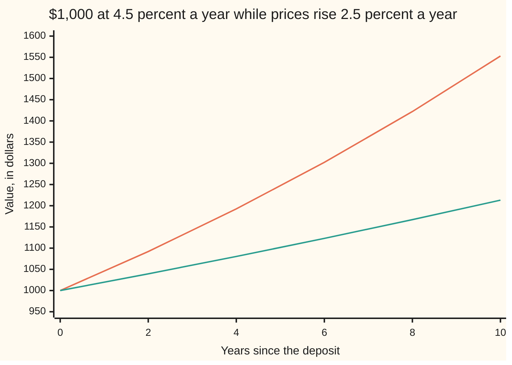
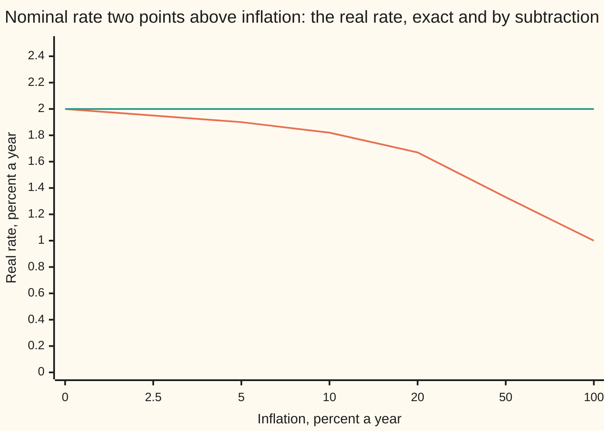

# Real rates: nominal minus inflation, exactly and approximately

[Syllabus](../../../SYLLABUS.md) → [Financial mathematics](../../../SYLLABUS.md#w12) → [Inflation and Real Rates](../../../SYLLABUS.md#w12-s34) → Real rates

---

## General Overview

A saver puts $1,000 into a one-year deposit that pays 4.5 percent. A year later the account holds $1,045.00. That is the rate on the label, counted in dollars. It is called the **nominal** rate: nominal because it names dollars, not what dollars buy.

Now price a fixed basket of groceries. Today it costs $100.00, so the $1,000 buys 10 baskets. Over the year prices rise 2.5 percent, and the same basket costs $102.50. The $1,045.00 buys 1,045 ÷ 102.50 = 10.195 baskets. Counted in baskets, the saver is up 0.195 of a basket on 10: a gain of **1.95 percent**. That is the **real** rate: the growth in what the money buys.

The quick rule says 4.5 minus 2.5 is 2 percent. It is close, and it is not the answer. The exact answer divides growth factors instead of subtracting rates, and the two part company as inflation grows. At 100 percent inflation the quick rule is out by a factor of two.

**The real rate is the growth of money measured in goods: divide one plus the nominal rate by one plus inflation and subtract one; subtracting the rates is the first-order shortcut.**

**What kind of fact this is:** a definition — the real rate is defined as growth in purchasing power — and the exact Fisher relation follows from it by one division, proved on this card in Why it works; the subtraction is an approximation, with its error stated there.

### The picture: ten years of the same deposit, in dollars and in baskets



The upper line is the balance as the bank statement shows it: $1,552.97 after ten years. The lower line is the same balance in **today's dollars**, meaning dollars of this year's buying power: the balance divided by how far prices have risen. After ten years prices are 1.280085 times today's, so the $1,552.97 buys what $1,213.18 buys now, which is 12.13 baskets. The gap between the lines is inflation's share of the interest. The lower line grows at the real rate.

---

## The formula

Notation first, in words. The Greek letter $\pi$ ("pi") is used here for the inflation rate, as economists write it; on this card it never means 3.14159. A small c set low and to the right of a rate marks the **continuous** version of that rate, the one that compounds at every instant ([Discount factors](../01-Money%2C%20Dates%20and%20Discounting/01-compounding-and-discount-factors.md)).

The exact relation, named after Irving Fisher, who set it out in 1896:

$$1 + i \;=\; (1 + r)(1 + \pi) \qquad\text{so}\qquad r \;=\; \frac{1 + i}{1 + \pi} - 1 \;=\; \frac{i - \pi}{1 + \pi}$$

**Read it aloud:** one year's growth in dollars equals one year's growth in goods times one year's rise in prices; so the growth in goods is the dollar growth divided by the price rise.

The approximation everyone uses:

$$r \;\approx\; i - \pi, \qquad\text{off by exactly}\qquad (i - \pi) - r \;=\; \frac{(i - \pi)\,\pi}{1 + \pi}$$

In words: the shortcut drops the division by $1 + \pi$. Since $(i - \pi)/(1 + \pi)$ is $r$, the error is exactly $r\pi$, the real rate times inflation: tiny when both are a few percent, large when either is large.

In continuous rates the relation is a plain subtraction, with no approximation at all:

$$r_c \;=\; i_c - \pi_c, \qquad i_c = \ln(1 + i), \quad \pi_c = \ln(1 + \pi), \quad r_c = \ln(1 + r)$$

In words: the natural logarithm turns multiplying growth factors into adding rates, so on the continuous label the real rate is the nominal minus inflation, exactly.

| Symbol | Plain meaning | In our example | Push it up and the real rate… |
| --- | --- | --- | --- |
| $i$ | the **nominal** rate: growth of the account in dollars, one year | 4.5 percent | rises, almost point for point |
| $\pi$ | **inflation**: the rise in the basket's price over the same year | 2.5 percent | falls, almost point for point |
| $r$ | the **real** rate: growth in how many baskets the money buys | 1.9512 percent | — |
| $M$ | the dollars deposited | 1,000 dollars | — (it cancels) |
| $P_0$ | the basket's price at the start | 100.00 dollars | — (it cancels) |
| $P_1$ | the basket's price a year later, $P_0 (1 + \pi)$ | 102.50 dollars | falls: each dollar buys less |
| $i_c$ | the continuous nominal rate, $\ln(1 + i)$ | 4.4017 percent | $r_c$ rises one for one |
| $\pi_c$ | the continuous inflation rate, $\ln(1 + \pi)$ | 2.4693 percent | $r_c$ falls one for one |
| $r_c$ | the continuous real rate, $i_c - \pi_c$ | 1.9324 percent | — |
| $n$ | a number of years, for the ten-year story | 10 | the shortcut's error compounds |

### When it holds

The exact relation is an identity: once the three rates are defined as above, it cannot fail. What can fail is the match between the definitions and the world.

- **One basket stands for "prices".** In practice the basket is a price index such as a consumer price index. If a household's own spending rises faster than the index, its real rate is lower than the one computed.
- **Same period, same compounding.** All three rates must cover the same year on the same label. Mixing a yearly nominal rate with a monthly inflation figure, or a yearly rate with a continuous one, gives a number with no meaning.
- **Inflation measured, not guessed.** Computed with inflation that has already happened, the result is the **realised** real rate. Computed with inflation that is expected, it is the **expected** real rate. This is close to, not equal to, the average of the realised real rates: dividing by an average is not the average of the divisions. The claim that market nominal rates rise one for one with expected inflation is a separate model, the Fisher hypothesis, tested in the sources and only roughly true.
- **Before tax.** Tax is charged on the nominal interest, not the real gain. After tax the real rate is lower than the formula applied to pre-tax numbers suggests, by more than the tax rate alone (The usual mistake has the numbers).
- **Prices above zero.** The division needs $1 + \pi$ above zero, which holds whenever prices stay positive. Then each pair of rates fixes the third uniquely, and $r$ is above −1 exactly when $i$ is (money not wiped out). Deflation, a negative $\pi$, is allowed and raises the real rate above the nominal.

---

## Why it works

### Step 0: measure the gain in goods, not in dollars

A rate of interest is a statement about a ratio: what comes back over what went in. Measured in dollars, that ratio is $1 + i$. But dollars are only worth what they buy. So measure the same ratio in baskets. The real rate is nothing more than the nominal rate recomputed with baskets as the unit of account.

### Step 1: count baskets at the start and at the end

Put in $M$ dollars (here 1,000). At the start a basket costs $P_0$, so the money buys $M / P_0$ baskets: 10.

A year later the account holds $M(1 + i)$ dollars: 1,045.00. A basket costs $P_1 = P_0(1 + \pi)$ dollars: 102.50. So the money buys

$$\frac{M(1 + i)}{P_0(1 + \pi)} \text{ baskets}: \quad \frac{1045}{102.50} = 10.195122.$$

### Step 2: the ratio of basket counts is one plus the real rate

By definition, $1 + r$ is baskets at the end over baskets at the start. Divide Step 1's count by $M / P_0$. The deposit and the starting price both cancel:

$$1 + r \;=\; \frac{1 + i}{1 + \pi}.$$

Neither the size of the deposit nor the price of a basket survives. Only the two rates do. Multiply both sides by $1 + \pi$ and the result is Fisher's form, $1 + i = (1 + r)(1 + \pi)$: dollar growth is goods growth times price growth.

### Step 3: the subtraction is what is left when a small product is dropped

Multiply out Fisher's form: $1 + i = 1 + r + \pi + r\pi$. So $i = r + \pi + r\pi$, and

$$r \;=\; i - \pi - r\pi.$$

The shortcut $r \approx i - \pi$ drops the last term, $r\pi$: the real rate earned on the inflation itself. At 1.95 percent and 2.5 percent that product is about 0.05 percentage points (0.0488, to be exact). At 100 percent inflation and 102 percent nominal the real rate is 1 percent, so the dropped product is 1 point: as large as the answer itself, and the shortcut stops being a shortcut.

<details>
<summary>Detailed proof: the exact error, the continuous form, and many years</summary>

**The error.** From Step 2, $r = (1 + i)/(1 + \pi) - 1 = (i - \pi)/(1 + \pi)$. Subtract this from $i - \pi$:
$$(i - \pi) - \frac{i - \pi}{1 + \pi} \;=\; (i - \pi)\,\frac{(1 + \pi) - 1}{1 + \pi} \;=\; \frac{(i - \pi)\,\pi}{1 + \pi}.$$
With $i - \pi = 0.02$ and $\pi = 0.025$: $0.02 \times 0.025 / 1.025 = 0.000487805$. The sign is the sign of $(i - \pi)\pi$: with positive inflation and a positive real rate, the shortcut always overstates.

**The continuous form.** Take natural logarithms of $1 + i = (1 + r)(1 + \pi)$. The logarithm of a product is the sum of the logarithms, so $\ln(1 + i) = \ln(1 + r) + \ln(1 + \pi)$, which is $i_c = r_c + \pi_c$. No term was dropped, so the subtraction is exact on this label.

**Many years.** Over $n$ years, with the same rates each year, dollars grow by $(1 + i)^n$ and prices by $(1 + \pi)^n$. Baskets grow by their ratio, $\big((1 + i)/(1 + \pi)\big)^n = (1 + r)^n$. So the real rate compounds exactly like any other rate, and the yearly relation is all that is needed. If the rates differ year to year, the same argument multiplies the yearly ratios.

</details>

### Step 4: two more roads to the same number

The relation can be read as an equation to solve rather than a division to do: find the $r$ for which $(1 + r)(1 + \pi)$ lands on $1 + i$. With $1 + \pi$ above zero the left side rises steadily as $r$ rises, so there is exactly one such $r$, and halving an interval that brackets it (bisection) finds it without ever dividing. The code does that. It also takes the continuous road: subtract the two logarithms, then undo the logarithm. All roads land on 1.9512195 percent.

The same relation run backwards turns a real rate into a nominal one. The shelf's house bond yields 1 percent real (its coupon, priced at par), and markets price 2.5 percent inflation against it; Fisher's form gives $1.01 \times 1.025 - 1 = 3.525$ percent as the nominal yield that matches it. How markets read that 2.5 percent out of prices is [Breakeven inflation](03-breakeven-inflation.md).

---

## Worked numbers, by hand

The deposit: $1,000 at 4.5 percent nominal, prices rising 2.5 percent, one year.

| Step | Arithmetic | Value |
| --- | --- | --- |
| baskets bought today | 1,000 ÷ 100.00 | 10 |
| dollars in a year | 1,000 × 1.045 | $1,045.00 |
| basket price in a year | 100.00 × 1.025 | $102.50 |
| baskets bought in a year | 1,045.00 ÷ 102.50 | 10.195122 |
| one plus the real rate | 10.195122 ÷ 10, or 1.045 ÷ 1.025 | 1.0195122 |
| **real rate, exact** | 1.0195122 − 1 | **1.9512 percent** |
| real rate, shortcut | 4.5 − 2.5 | 2.0000 percent |
| the shortcut's error | 0.02 × 0.025 ÷ 1.025 | 0.0488 points |
| continuous nominal, continuous inflation | ln 1.045, ln 1.025 | 4.4017, 2.4693 percent |
| continuous real | 4.4017 − 2.4693 | 1.9324 percent |

A year of saving at 4.5 percent buys 1.95 percent more groceries, not 4.5 percent more. Most of the interest only kept pace with prices.

### What breaks if you drop a piece

| Mistake | Comes out at | What went wrong |
| --- | --- | --- |
| Subtract the rates | 2.00 percent, not 1.95 | Drops the real return on the inflation; small here, 0.0488 points |
| Multiply instead of divide: $(1 + i)(1 + \pi) - 1$ | 7.11 percent | Adds inflation to the gain; it should come off |
| Subtract when inflation is 100 percent and nominal 110 | 10 percent, not 5 | The dropped term $r\pi$ is now as large as the answer |
| Compound the shortcut for ten years | 12.19 baskets, not 12.13 | A 0.05-point error each year, carried ten times |

Every number in both tables is printed by the code below.

### The same two-point gap as inflation rises

Hold the nominal rate two points above inflation and raise inflation. The shortcut always says 2 percent. The exact real rate falls:



The falling line is the exact real rate, 2 divided by one plus inflation. The flat line is the shortcut. At ordinary inflation they touch. At 100 percent inflation, 102 percent nominal buys exactly 1 percent more goods, half what the subtraction claims. The x-axis spacing is uneven: each label is one row of the code's table.

---

## How it moves: the inflation nobody knew in advance

The deposit's 4.5 percent was fixed on the day the money went in. Inflation was not. So the real rate the saver actually earns is only known a year later. Same formula, different inputs: the nominal rate stays put and the realised inflation varies.

```
realised inflation   realised real rate (percent a year), nominal locked at 4.5
      0.0%   ████████████████████████████████████  4.50
      1.0%   ████████████████████████████          3.47
      2.0%   ████████████████████                  2.45
      2.5%   ████████████████                      1.95
      3.0%   ████████████                          1.46
      4.0%   ████                                  0.48
      5.0%                                        -0.48
```

Each extra point of inflation costs almost exactly one point of real return. At 5 percent inflation the real rate turns negative: the account grew from $1,000 to $1,045 and still buys fewer baskets than at the start. The saver carried the whole of the inflation risk. A bond that pays a fixed real rate instead, with the dollars adjusted for whatever inflation turns out to be, moves that risk to the borrower: [Inflation-linked bonds](02-inflation-linked-bonds.md).

---

## Code, from first principles, and it actually runs

The code reaches the real rate four independent ways: dividing the growth factors, counting baskets before and after, a bisection root finder that never divides, and subtracting continuous rates then converting back. It then checks the approximation's error against its own closed form, follows the deposit for ten years, and prints every table, chart point and wrong answer on the card. Logarithms and exponentials come from the standard library; they compute a conversion, not the answer.

### Python

```python
# Real rates and the Fisher equation -- the check behind the card.
# Standard library only.  Every number quoted on the card is printed here.
# The real rate is reached four ways: dividing growth factors, counting
# baskets, a bisection root finder that never divides, and log rates.
from math import log, exp

I, PI = 0.045, 0.025            # nominal rate and inflation, one year
DEPOSIT, BASKET = 1000.0, 100.0  # dollars deposited; a basket's price today

def real(i, p):                  # road 1: the exact Fisher relation
    return (1.0 + i) / (1.0 + p) - 1.0

def by_baskets(i, p):            # road 2: count what the money buys, before and after
    before = DEPOSIT / BASKET
    after = DEPOSIT * (1.0 + i) / (BASKET * (1.0 + p))
    return before, after, after / before - 1.0

def by_bisection(i, p):          # road 3: find r with (1 + r)(1 + p) = 1 + i, no division
    lo, hi = -0.99, 1.0
    for _ in range(200):
        mid = 0.5 * (lo + hi)
        if (1.0 + mid) * (1.0 + p) - (1.0 + i) > 0.0: hi = mid
        else: lo = mid
    return 0.5 * (lo + hi)

def by_logs(i, p):               # road 4: continuous rates subtract exactly
    ic, pc = log(1.0 + i), log(1.0 + p)
    return ic, pc, ic - pc, exp(ic - pc) - 1.0

r = real(I, PI)
b0, b1, r_b = by_baskets(I, PI)
r_bis = by_bisection(I, PI)
ic, pc, rc, r_log = by_logs(I, PI)
approx = I - PI
gap_formula = (I - PI) * PI / (1.0 + PI)   # the approximation's error, written independently

rows = [
    ("baskets bought today", b0), ("basket price in a year", BASKET * (1.0 + PI)),
    ("dollars in a year", DEPOSIT * (1.0 + I)), ("baskets bought in a year", b1),
    ("1 exact (1+i)/(1+pi) - 1", r), ("2 baskets after/before - 1", r_b),
    ("3 bisection, no division", r_bis),
    ("4a continuous nominal ln(1+i)", ic), ("4b continuous inflation ln(1+pi)", pc),
    ("4c continuous real, the difference", rc), ("4  back to yearly, e^diff - 1", r_log),
    ("approximation i - pi", approx), ("approximation minus exact", approx - r),
    ("  (i - pi) pi / (1 + pi)", gap_formula),
]
for name, v in rows:
    print(f"{name:<38} {v:>13.9f}")

# ---- ten years: the deposit in dollars and in today's dollars ----
print()
print("year   dollars  today's-dollars  approx-2%")
grow = 1.0; prices = 1.0; money = DEPOSIT; approx_path = DEPOSIT
for year in range(11):
    if year > 0:
        money *= 1.0 + I; prices *= 1.0 + PI; approx_path *= 1.0 + approx; grow *= 1.0 + r
    if year % 2 == 0:
        print(f"{year:>4} {money:>9.2f} {money / prices:>16.2f} {approx_path:>10.2f}")
baskets10 = money / (BASKET * prices)
print(f"{'baskets after ten years':<38} {baskets10:>13.6f}")
print(f"{'price index after ten years':<38} {prices:>13.6f}")

# ---- the same 2-point gap as inflation rises: exact against approximate ----
print()
print("inflation%  nominal%  exact-real%  approx-real%")
for p in (0.0, 0.025, 0.05, 0.10, 0.20, 0.50, 1.00):
    print(f"{100 * p:>10.1f} {100 * (p + 0.02):>9.1f} {100 * real(p + 0.02, p):>12.2f} {100 * 0.02:>13.2f}")

# ---- nominal locked at 4.5 percent; the inflation that actually arrived ----
print()
print("realised inflation%  realised real%")
for p in (0.0, 0.01, 0.02, 0.025, 0.03, 0.04, 0.05):
    print(f"{100 * p:>19.1f} {100 * real(I, p):>15.2f}")

# ---- what breaks, taxes, the shelf's bond, try changing ----
print()
T = 0.30
extra = [
    ("wrong: multiply, (1+i)(1+pi) - 1", (1.0 + I) * (1.0 + PI) - 1.0),
    ("wrong: approx, 110% nominal 100% infl", 1.10 - 1.00),
    ("  exact, 110% nominal 100% inflation", real(1.10, 1.00)),
    ("wrong: approx compounded, baskets", DEPOSIT * (1.0 + approx) ** 10 / BASKET),
    ("tax 30%: nominal after tax", I * (1.0 - T)),
    ("tax 30%: real after tax", real(I * (1.0 - T), PI)),
    ("wrong: tax charged on the real rate", r * (1.0 - T)),
    ("shelf bond: real 1%, breakeven 2.5%", 1.01 * 1.025 - 1.0),
    ("try: inflation 4.5%", real(I, 0.045)),
    ("try: inflation 10%", real(I, 0.10)),
    ("try: nominal 10%", real(0.10, PI)),
]
for name, v in extra:
    print(f"{name:<38} {v:>13.9f}")

assert abs(r_bis - r) < 1e-12,                  "bisection (no division) must land on the ratio"
assert abs(r_log - r) < 1e-12,                  "log road must land on the ratio"
assert abs(r_b - r) < 1e-12,                    "basket count must land on the ratio"
assert abs((approx - r) - gap_formula) < 1e-15, "approximation error is (i - pi) pi / (1 + pi)"
assert abs(baskets10 - 10.0 * grow) < 1e-9,     "ten years of baskets vs real growth compounded"
assert abs(r - 2.0 / 102.5) < 1e-15,            "hand value: 2 dollars gained on a 102.50 basket"
assert abs((approx - r) - r * PI) < 1e-15,      "the dropped term is exactly r times pi"
assert abs(real(1.01 * 1.025 - 1.0, 0.025) - 0.01) < 1e-15, "shelf bond: back to 1 percent real"
assert abs(real(1.10, 1.00) - (1.10 - 1.00) / 2.0) < 1e-15, "100% inflation: exact is half the shortcut"
print("ALL CHECKS PASS")
```

**Ran 2026-09-28 on macOS, Python 3.14.6, standard library only. All checks passed. Output, pasted from the run:**

```
baskets bought today                    10.000000000
basket price in a year                 102.500000000
dollars in a year                      1045.000000000
baskets bought in a year                10.195121951
1 exact (1+i)/(1+pi) - 1                 0.019512195
2 baskets after/before - 1               0.019512195
3 bisection, no division                 0.019512195
4a continuous nominal ln(1+i)            0.044016885
4b continuous inflation ln(1+pi)         0.024692613
4c continuous real, the difference       0.019324273
4  back to yearly, e^diff - 1            0.019512195
approximation i - pi                     0.020000000
approximation minus exact                0.000487805
  (i - pi) pi / (1 + pi)                 0.000487805

year   dollars  today's-dollars  approx-2%
   0   1000.00          1000.00    1000.00
   2   1092.02          1039.41    1040.40
   4   1192.52          1080.36    1082.43
   6   1302.26          1122.93    1126.16
   8   1422.10          1167.18    1171.66
  10   1552.97          1213.18    1218.99
baskets after ten years                    12.131772
price index after ten years                 1.280085

inflation%  nominal%  exact-real%  approx-real%
       0.0       2.0         2.00          2.00
       2.5       4.5         1.95          2.00
       5.0       7.0         1.90          2.00
      10.0      12.0         1.82          2.00
      20.0      22.0         1.67          2.00
      50.0      52.0         1.33          2.00
     100.0     102.0         1.00          2.00

realised inflation%  realised real%
                0.0            4.50
                1.0            3.47
                2.0            2.45
                2.5            1.95
                3.0            1.46
                4.0            0.48
                5.0           -0.48

wrong: multiply, (1+i)(1+pi) - 1         0.071125000
wrong: approx, 110% nominal 100% infl    0.100000000
  exact, 110% nominal 100% inflation     0.050000000
wrong: approx compounded, baskets       12.189944200
tax 30%: nominal after tax               0.031500000
tax 30%: real after tax                  0.006341463
wrong: tax charged on the real rate      0.013658537
shelf bond: real 1%, breakeven 2.5%      0.035250000
try: inflation 4.5%                      0.000000000
try: inflation 10%                      -0.050000000
try: nominal 10%                         0.073170732
ALL CHECKS PASS
```

### Rust

The same four roads, the same labels, std only.

```rust
// Real rates and the Fisher equation -- the same check as the Python, in Rust.
// Standard library only, no crates.  The real rate is reached four ways:
// dividing growth factors, counting baskets, a bisection root finder that
// never divides, and log rates.
// Compile: rustc --edition 2021 -O real_rates_and_the_fisher_equation_check.rs

const I: f64 = 0.045; // nominal rate, one year
const PI: f64 = 0.025; // inflation, one year
const DEPOSIT: f64 = 1000.0; // dollars deposited
const BASKET: f64 = 100.0; // a basket's price today

fn real(i: f64, p: f64) -> f64 { (1.0 + i) / (1.0 + p) - 1.0 } // road 1: exact Fisher

fn by_baskets(i: f64, p: f64) -> (f64, f64, f64) { // road 2: count what the money buys
    let before = DEPOSIT / BASKET;
    let after = DEPOSIT * (1.0 + i) / (BASKET * (1.0 + p));
    (before, after, after / before - 1.0)
}

fn by_bisection(i: f64, p: f64) -> f64 { // road 3: (1 + r)(1 + p) = 1 + i, no division
    let (mut lo, mut hi) = (-0.99_f64, 1.0_f64);
    for _ in 0..200 {
        let mid = 0.5 * (lo + hi);
        if (1.0 + mid) * (1.0 + p) - (1.0 + i) > 0.0 { hi = mid; } else { lo = mid; }
    }
    0.5 * (lo + hi)
}

fn by_logs(i: f64, p: f64) -> (f64, f64, f64, f64) { // road 4: continuous rates subtract
    let (ic, pc) = ((1.0 + i).ln(), (1.0 + p).ln());
    (ic, pc, ic - pc, (ic - pc).exp() - 1.0)
}

fn main() {
    let r = real(I, PI);
    let (b0, b1, r_b) = by_baskets(I, PI);
    let r_bis = by_bisection(I, PI);
    let (ic, pc, rc, r_log) = by_logs(I, PI);
    let approx = I - PI;
    let gap_formula = (I - PI) * PI / (1.0 + PI); // the approximation's error, independently

    let rows: Vec<(&str, f64)> = vec![
        ("baskets bought today", b0), ("basket price in a year", BASKET * (1.0 + PI)),
        ("dollars in a year", DEPOSIT * (1.0 + I)), ("baskets bought in a year", b1),
        ("1 exact (1+i)/(1+pi) - 1", r), ("2 baskets after/before - 1", r_b),
        ("3 bisection, no division", r_bis),
        ("4a continuous nominal ln(1+i)", ic), ("4b continuous inflation ln(1+pi)", pc),
        ("4c continuous real, the difference", rc), ("4  back to yearly, e^diff - 1", r_log),
        ("approximation i - pi", approx), ("approximation minus exact", approx - r),
        ("  (i - pi) pi / (1 + pi)", gap_formula),
    ];
    for (name, v) in &rows { println!("{:<38} {:>13.9}", name, v); }

    // ---- ten years: the deposit in dollars and in today's dollars ----
    println!();
    println!("year   dollars  today's-dollars  approx-2%");
    let (mut grow, mut prices, mut money, mut approx_path) = (1.0_f64, 1.0_f64, DEPOSIT, DEPOSIT);
    for year in 0..11 {
        if year > 0 {
            money *= 1.0 + I; prices *= 1.0 + PI; approx_path *= 1.0 + approx; grow *= 1.0 + r;
        }
        if year % 2 == 0 {
            println!("{:>4} {:>9.2} {:>16.2} {:>10.2}", year, money, money / prices, approx_path);
        }
    }
    let baskets10 = money / (BASKET * prices);
    println!("{:<38} {:>13.6}", "baskets after ten years", baskets10);
    println!("{:<38} {:>13.6}", "price index after ten years", prices);

    // ---- the same 2-point gap as inflation rises: exact against approximate ----
    println!();
    println!("inflation%  nominal%  exact-real%  approx-real%");
    for p in [0.0_f64, 0.025, 0.05, 0.10, 0.20, 0.50, 1.00] {
        println!("{:>10.1} {:>9.1} {:>12.2} {:>13.2}", 100.0 * p, 100.0 * (p + 0.02),
                 100.0 * real(p + 0.02, p), 100.0 * 0.02);
    }

    // ---- nominal locked at 4.5 percent; the inflation that actually arrived ----
    println!();
    println!("realised inflation%  realised real%");
    for p in [0.0_f64, 0.01, 0.02, 0.025, 0.03, 0.04, 0.05] {
        println!("{:>19.1} {:>15.2}", 100.0 * p, 100.0 * real(I, p));
    }

    // ---- what breaks, taxes, the shelf's bond, try changing ----
    println!();
    let t = 0.30;
    let extra: Vec<(&str, f64)> = vec![
        ("wrong: multiply, (1+i)(1+pi) - 1", (1.0 + I) * (1.0 + PI) - 1.0),
        ("wrong: approx, 110% nominal 100% infl", 1.10 - 1.00),
        ("  exact, 110% nominal 100% inflation", real(1.10, 1.00)),
        ("wrong: approx compounded, baskets", DEPOSIT * (1.0 + approx).powi(10) / BASKET),
        ("tax 30%: nominal after tax", I * (1.0 - t)),
        ("tax 30%: real after tax", real(I * (1.0 - t), PI)),
        ("wrong: tax charged on the real rate", r * (1.0 - t)),
        ("shelf bond: real 1%, breakeven 2.5%", 1.01 * 1.025 - 1.0),
        ("try: inflation 4.5%", real(I, 0.045)),
        ("try: inflation 10%", real(I, 0.10)),
        ("try: nominal 10%", real(0.10, PI)),
    ];
    for (name, v) in &extra { println!("{:<38} {:>13.9}", name, v); }

    assert!((r_bis - r).abs() < 1e-12, "bisection (no division) must land on the ratio");
    assert!((r_log - r).abs() < 1e-12, "log road must land on the ratio");
    assert!((r_b - r).abs() < 1e-12, "basket count must land on the ratio");
    assert!(((approx - r) - gap_formula).abs() < 1e-15, "approximation error is (i - pi) pi / (1 + pi)");
    assert!((baskets10 - 10.0 * grow).abs() < 1e-9, "ten years of baskets vs real growth compounded");
    assert!((r - 2.0 / 102.5).abs() < 1e-15, "hand value: 2 dollars gained on a 102.50 basket");
    assert!(((approx - r) - r * PI).abs() < 1e-15, "the dropped term is exactly r times pi");
    assert!((real(1.01 * 1.025 - 1.0, 0.025) - 0.01).abs() < 1e-15, "shelf bond: back to 1 percent real");
    assert!((real(1.10, 1.00) - (1.10 - 1.00) / 2.0).abs() < 1e-15, "100% inflation: exact is half the shortcut");
    println!("ALL CHECKS PASS");
}
```

**Ran 2026-09-28 on macOS, rustc 1.98.1, no crates. All checks passed. Output, pasted from the run:**

```
baskets bought today                    10.000000000
basket price in a year                 102.500000000
dollars in a year                      1045.000000000
baskets bought in a year                10.195121951
1 exact (1+i)/(1+pi) - 1                 0.019512195
2 baskets after/before - 1               0.019512195
3 bisection, no division                 0.019512195
4a continuous nominal ln(1+i)            0.044016885
4b continuous inflation ln(1+pi)         0.024692613
4c continuous real, the difference       0.019324273
4  back to yearly, e^diff - 1            0.019512195
approximation i - pi                     0.020000000
approximation minus exact                0.000487805
  (i - pi) pi / (1 + pi)                 0.000487805

year   dollars  today's-dollars  approx-2%
   0   1000.00          1000.00    1000.00
   2   1092.02          1039.41    1040.40
   4   1192.52          1080.36    1082.43
   6   1302.26          1122.93    1126.16
   8   1422.10          1167.18    1171.66
  10   1552.97          1213.18    1218.99
baskets after ten years                    12.131772
price index after ten years                 1.280085

inflation%  nominal%  exact-real%  approx-real%
       0.0       2.0         2.00          2.00
       2.5       4.5         1.95          2.00
       5.0       7.0         1.90          2.00
      10.0      12.0         1.82          2.00
      20.0      22.0         1.67          2.00
      50.0      52.0         1.33          2.00
     100.0     102.0         1.00          2.00

realised inflation%  realised real%
                0.0            4.50
                1.0            3.47
                2.0            2.45
                2.5            1.95
                3.0            1.46
                4.0            0.48
                5.0           -0.48

wrong: multiply, (1+i)(1+pi) - 1         0.071125000
wrong: approx, 110% nominal 100% infl    0.100000000
  exact, 110% nominal 100% inflation     0.050000000
wrong: approx compounded, baskets       12.189944200
tax 30%: nominal after tax               0.031500000
tax 30%: real after tax                  0.006341463
wrong: tax charged on the real rate      0.013658537
shelf bond: real 1%, breakeven 2.5%      0.035250000
try: inflation 4.5%                      0.000000000
try: inflation 10%                      -0.050000000
try: nominal 10%                         0.073170732
ALL CHECKS PASS
```

The two outputs match line for line.

> [!TIP]
> **Try changing**
> Guess first, then run it. The asserts are pinned to the deposit's numbers, so some changes stop the program; the `try:` rows show the answer without editing anything.
> - **Inflation catches the rate.** Set inflation to 4.5 percent. The real rate is exactly 0: the account grows and buys the same number of baskets. The row `try: inflation 4.5%` prints 0.
> - **Inflation overtakes it.** Set inflation to 10 percent. The real rate is −5 percent exactly, since 1.045 ÷ 1.10 = 0.95: the shortcut is off in the other direction now, overstating the loss.
> - **A higher nominal rate.** Set the nominal rate to 10 percent with inflation at 2.5. The real rate is 7.317 percent, further below the subtraction than before: the error grows with the real rate too.
> - **Break the bisection.** Replace the product `(1.0 + mid) * (1.0 + p)` with a sum `(1.0 + mid) + p`. The bisection now solves the shortcut and lands on 2 percent, and the first assert stops the run.

---

## The usual mistake

> [!warning]
> **Treating the nominal rate as the return.** A 4.5 percent deposit does not make its owner 4.5 percent richer. It makes them 1.95 percent richer in goods, and in a year when inflation reaches 5 percent, 0.48 percent poorer. The number on the statement is a count of dollars; wealth is a count of what they buy.
>
> - **Taxing the wrong number.** Tax falls on the nominal interest. At a 30 percent tax rate the saver keeps 3.15 percent nominal, which is 0.634 percent real. Taking 30 percent off the real rate instead gives 1.366 percent, more than double the truth: the tax also bites the part of the interest that only kept pace with prices.
> - **Multiplying where division belongs.** $(1 + i)(1 + \pi) - 1$ gives 7.11 percent. Fisher's form multiplies the real rate by inflation to get the nominal rate; to go back, divide.
> - **Mixing labels.** A continuous nominal rate minus a yearly inflation figure is neither a yearly nor a continuous real rate. Put both on one label first.
> - **Trusting the subtraction in high inflation.** At 100 percent inflation and 110 percent nominal the shortcut says 10 percent and the truth is 5.

---

## Where you meet it in real life

- **A savings account or a pay rise.** A 3 percent raise in a 4 percent inflation year is a real pay cut, since 1.03 ÷ 1.04 is below 1. The same division as the deposit.
- **Government inflation-linked bonds.** The United States Treasury sells TIPS, bonds whose principal is scaled by the consumer price index, so they pay a fixed real rate. Their yields are quoted as real rates (conventions verified 2026-09-28 on TreasuryDirect: terms of 5, 10 and 30 years, principal scaled by the consumer price index, auctions bid in real yield): [Inflation-linked bonds](02-inflation-linked-bonds.md).
- **Reading inflation out of prices.** An ordinary bond and a real-rate bond of the same maturity, run through Fisher's form, give the inflation the market is pricing in. The shelf's house bond, 1 percent real with 2.5 percent inflation priced in, matches a 3.525 percent nominal yield: [Breakeven inflation](03-breakeven-inflation.md).
- **Trading the inflation number itself.** A contract that swaps a fixed rate for realised inflation removes the saver's risk from the bar chart above: [Inflation swaps](04-zero-coupon-inflation-swaps.md). Options that pay when inflation passes a level come after: [Inflation caps and floors in outline](05-inflation-options-in-outline.md).
- **Central banks.** A policy rate is set in nominal terms and judged in real terms: a 5 percent policy rate with 6 percent inflation is loose money, not tight.

> **Say it back**
> The nominal rate counts dollars; the real rate counts what those dollars buy. Counting baskets before and after gives one plus the real rate as one plus the nominal rate divided by one plus inflation. At 4.5 percent nominal and 2.5 percent inflation that is 1.95 percent, not the 2 the subtraction gives. The subtraction drops the real return earned on the inflation, a small term at low rates and a large one at high rates. On the continuous label the subtraction is exact.

---

## What this builds on

- [Bond price and yield](../01-Money%2C%20Dates%20and%20Discounting/05-bonds-price-and-yield.md): what a yield is, and that a quoted rate is growth per year on a stated compounding label. This card splits that yield into a real part and an inflation part.

## Where this goes next

- [Inflation-linked bonds](02-inflation-linked-bonds.md): a bond that pays the real rate by scaling its dollars with a price index, so the lender no longer carries the risk in the bar chart.

The saver above learns the real rate only after the year is over; the open question is how to lock a real rate in on the first day, and the inflation-linked bond is the answer.

---

## Sources

Verified 2026-09-28: every link below resolves to the publisher's page.

- Dimand, Robert W., and Rebeca Gomez Betancourt. "Retrospectives: Irving Fisher's *Appreciation and Interest* (1896) and the Fisher Relation." *Journal of Economic Perspectives* 26, no. 4 (2012): 185–196. [doi:10.1257/jep.26.4.185](https://doi.org/10.1257/jep.26.4.185). Where the relation came from, and what Fisher himself claimed for it.
- Mishkin, Frederic S. "Is the Fisher Effect for Real?" *Journal of Monetary Economics* 30, no. 2 (1992): 195–215. [doi:10.1016/0304-3932(92)90060-F](https://doi.org/10.1016/0304-3932(92)90060-F). The Fisher hypothesis tested: nominal rates follow inflation over long spans, not month to month.
- TreasuryDirect, United States Department of the Treasury. "Treasury Inflation-Protected Securities (TIPS)." [Publisher page](https://www.treasurydirect.gov/marketable-securities/tips/). How a real-rate bond scales its principal with the consumer price index.
