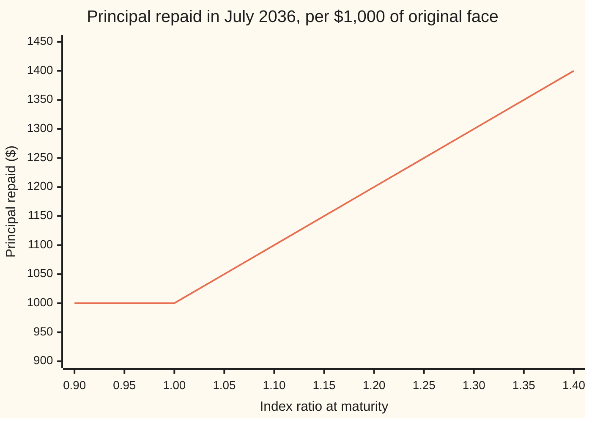
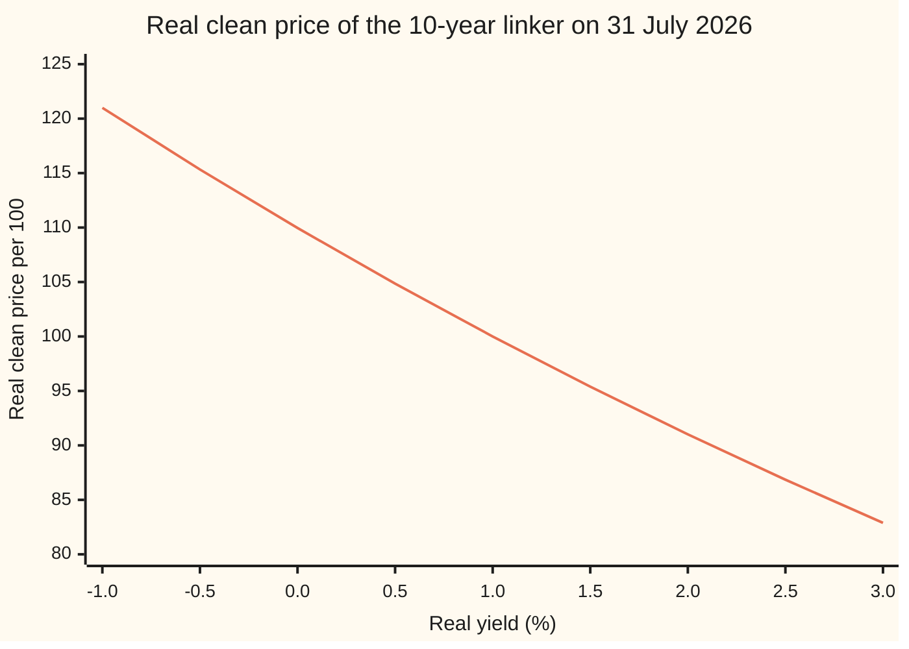

# Inflation-linked bonds: coupons and principal scaled by an index ratio

Financial mathematics → Inflation and Real Rates → Indexed cashflows → Inflation-linked bonds

---

## General Overview

An ordinary 10-year government bond with a $1,000 face pays fixed dollars. If prices double over the ten years, the $1,000 returned at the end buys half of what it bought at the start. The holder was repaid in full and still lost half.

An **inflation-linked bond**, a **linker** for short, fixes that. Its promises are written in dollars of its **dated date**, the day its interest starts. Each payment is then scaled up by how far a price index has risen since. The US Treasury's version is called TIPS (Treasury Inflation-Protected Securities), and its index is the consumer price index, CPI-U: the price of a fixed basket of household goods.

The example on this card is a 10-year linker with a 1% real coupon, dated 15 July 2026 and bought for settlement on 31 July 2026 at a real yield of 1.02%, with invented price-index levels. "Real" means measured in dollars of constant buying power. The buyer pays $1,000.04 per $1,000 of original face. Its first coupon, on 15 January 2027, is $5.06 rather than $5.00. If inflation runs at 2.5% a year, the face repaid in 2036 is about $1,280.63.

The number doing the scaling is the **index ratio**: the price index today divided by the price index on the bond's dated date. Three details turn that sentence into a price. The index is read three months late, the **indexation lag**. It is spread evenly across the days of each month. And the price is quoted in real terms, then converted at the ratio for the settlement day.

**A linker is an ordinary bond written in dollars of its dated day: price its fixed real payments at a real yield, then multiply by the index ratio to turn them into today's dollars.**

**What kind of fact this is:** a method, proved on this card in Why it works; the index ratio, the lag and the principal floor are conventions set by the US Treasury, and the invented index levels are for teaching.

### The picture: what the principal repays at maturity



The one line is the principal repaid against the index ratio on the maturity date. Right of 1.00 it rises dollar for dollar with the index: prices up 30%, principal up 30%. Left of 1.00 it is flat at $1,000. That flat stretch is the **deflation floor**: if prices end lower than at the dated date, the Treasury still repays the original face. Coupons have no such floor.

---

## The formula

Notation first, in words. Prices are per 100 of original face, the market's quoting unit; a $1,000 holding is ten times as much. A subscript names a date: $I_s$ is the index ratio on the settlement day. $\sum_{k=1}^{n}$ means "add the terms for k = 1, 2, up to n". The real yield $y$ is a yearly rate paid in two halves, so one half-year grows money by $1 + y/2$. **Accrued interest** $A$ is the part of the next coupon the seller has already earned; the **clean price** $P$ is the quote without it.

The real price, clean plus accrued, from the Treasury's rule:

$$P + A \;=\; \frac{1}{1 + \frac{r}{s}\cdot\frac{y}{2}}\left[\frac{c}{2} \;+\; \sum_{k=1}^{n}\frac{c/2}{(1+y/2)^{k}} \;+\; \frac{100}{(1+y/2)^{n}}\right]$$

**Read it aloud:** discount the next half-coupon, the later half-coupons and the final 100 at the real yield, all in dollars of the dated day.

The cash that changes hands:

$$\text{invoice} \;=\; \frac{F}{100}\; I_s\,(P + A)$$

**Read it aloud:** scale the real price by the index ratio on the settlement day, then by the size of the holding.

The payments the buyer receives:

$$\text{coupon at date } t = \frac{F}{100}\cdot\frac{c}{2}\cdot I_t, \qquad \text{principal at maturity} = F\,\max(I_T,\,1)$$

| Symbol | Plain meaning | In our example | Push it up and the answer… |
| --- | --- | --- | --- |
| $F$ | original face: the amount bought, in dated-day dollars | $1,000 | invoice grows in proportion |
| $c$ | real coupon: dollars a year per 100 of original face | 1, paid as 0.50 twice a year | price rises |
| $y$ | real yield: the yearly return in constant buying power, compounded twice a year | 1.02% | price falls, about 0.95 dollars per $1,000 for each 0.01 point |
| $P$, $A$ | real clean price and real accrued interest, per 100 | 99.810901 and 0.043478 | — |
| $I$, $I_s$, $I_t$, $I_T$ | index ratio: reference index on a date over the base; at settlement, a coupon date, maturity | 1.00150 at settlement, 1.01161 on 15 Jan 2027 | invoice and every payment rise in proportion |
| $R$, $R_b$ | reference index for a date; the base, for the dated date | 320.90 and 320.42 | — |
| $M_0$, $M_1$ | CPI-U of the third and second months before the date's month | 320.000 and 320.930 for July | — |
| $t$, $D$ | calendar day of the date; days in its month | 31 and 31 | — |
| $r$, $s$ | days from settlement to the next coupon; days in that half-year | 168 and 184 | — |
| $n$, $X_k$ | whole half-years after the next coupon, to maturity; the real amount of payment k, counting the next coupon as k = 0 | 19; 0.50 each, 100.50 at maturity | more payments to discount |
| $\pi$, $g$ | breakeven inflation: the yearly inflation rate that makes a linker and an ordinary bond pay the same; g is one half-year of it, the square root of 1 + π | 2.5% | no change to the invoice at a fixed real yield |
| $y_n$ | nominal yield: the yield in ordinary dollars, by Fisher | 3.5172% | — |

The reference index for any day, the Treasury's rule:

$$R \;=\; M_0 + \frac{t-1}{D}\,(M_1 - M_0), \qquad I \;=\; \frac{R}{R_b}$$

In words: on the first of the month, use the CPI of three months earlier; each later day moves an equal step towards the next month's CPI. Both $R$ and $I$ are cut to six decimals, then rounded to five.

### When it holds

- **Payments are fixed in real terms.** The formula prices a stream of known real amounts. The deflation floor breaks that: if $I_T$ ends below 1 the principal is not $F I_T$. At today's ratio of 1.00150 the floor is far out of reach, and its value needs a model of inflation ([inflation-options-in-outline](05-inflation-options-in-outline.md)).
- **One real yield for every date.** A single $y$ is a quote, not a model. With a real yield curve each payment has its own rate; the single $y$ is the one rate that gives the same price, a kind of average of the curve.
- **The index is the contract's index.** Protection is against lagged CPI-U, not a household's own prices, and not the last three months of inflation, which the lag leaves unpaid until later.
- **Quoted with the Treasury's stub rule.** The part-period to the next coupon is discounted with simple interest, the factor $1 + \frac{r}{s}\cdot\frac{y}{2}$. A compound stub gives $1,000.0426 instead of $1,000.0416: a tenth of a cent here, more on large trades.

**Conventions verified 28 Sep 2026** against 31 CFR 356, Appendix B, and TreasuryDirect: three-month lag, daily interpolation, truncation to six decimals then rounding to five, semiannual coupons on adjusted principal, the maturity floor at original face.

---

## Why it works

### Step 0: the bond is fixed in dated-day dollars

Take the linker's promise at face value. It pays 0.50 per 100 every half-year and 100 at the end, all in dollars of 15 July 2026. None of those numbers depends on inflation. They are fixed, like an ordinary bond's.

What moves is the exchange rate between dated-day dollars and today's dollars. That exchange rate is the index ratio. So the linker is priced in two moves: value the fixed real stream as an ordinary bond, then convert at today's rate.

### Step 1: the index ratio, with its lag

CPI-U for a month is published in the middle of the following month. A coupon due on 15 January needs its index then, so it cannot wait for January's CPI. The Treasury therefore reads the index three months late: the reference index for 1 July is April's CPI, and for 1 August it is May's.

Between the firsts of months it walks in a straight line. On 15 July 2026, fourteen days into July, it is $320.000 + \frac{14}{31}(320.930 - 320.000) = 320.42$. That is the base, $R_b$. On 31 July it is thirty days along: 320.90. The ratio is $320.90 / 320.42 = 1.0014980\ldots$, cut to 1.001498 and rounded to **1.00150**.

The daily walk exists so that a bond sold on any day carries the right amount of inflation. Without it, the index would jump on the first of each month and a buyer could time the jump.

### Step 2: every payment is its real amount times the ratio on its date

The coupon on 15 January 2027 uses October and November 2026: a reference index of 324.14 and a ratio of 1.01161. On $1,000 face it pays $5.00 × 1.01161 = $5.05805, which is $5.06 after cash rounding. Divide it by its own ratio and $5.00 returns. That is what "fixed in real terms" means.

The principal follows the same rule, with one exception: at maturity it is at least the original face, $F\max(I_T, 1)$.

### Step 3: price in real terms, convert at today's ratio

A buyer today pays today's dollars. Each future payment is its real amount times a ratio not yet known. Suppose inflation runs at a steady rate $\pi$. Each future ratio is today's ratio grown by inflation, and an ordinary dollar discount rate is, by Fisher ([real-rates-and-the-fisher-equation](01-real-rates-and-the-fisher-equation.md)), the real rate grown by the same inflation. The inflation on top and the inflation underneath cancel, payment by payment, and what is left is $I_s$ times the real price.

When inflation is uncertain, the nominal road needs a model of how rates and the index move together; the real-yield quote does not. So the market needs no inflation forecast to quote a linker. It quotes the real yield, and the invoice follows. At 2.5% inflation and at 3.5% inflation the invoice is the same $1,000.0416: raising expected inflation raises the nominal yield by as much as it raises the future payments.

<details>
<summary>The algebra behind this, if you want it</summary>

Write $g = \sqrt{1+\pi}$ for one half-year of inflation. Payment number k, counted from the next coupon at $k = 0$, is due $r/s + k$ half-years from settlement, so its ratio is $I_s\,g^{r/s+k}$. Fisher gives the nominal growth per half-year as $(1 + y/2)\,g$, and the stub grows by $(1 + \frac{r}{s}\cdot\frac{y}{2})\,g^{r/s}$. The nominal value of the real amount $X_k$ due at payment k is then
$$\frac{X_k\, I_s\, g^{r/s+k}}{\left(1 + \frac{r}{s}\cdot\frac{y}{2}\right) g^{r/s}\,(1+y/2)^k\, g^k} \;=\; I_s\,\frac{X_k}{\left(1 + \frac{r}{s}\cdot\frac{y}{2}\right)(1+y/2)^k}.$$
Every power of g cancels. Adding over all the payments gives $I_s(P + A)$, whatever $\pi$ is. The nominal yield is $y_n = 2\big((1+y/2)\,g - 1\big) = 3.5172\%$ at $\pi = 2.5\%$.

</details>

### Step 4: the inverse, from quoted price to real yield

Traders quote the real clean price $P$ and read off $y$. Before solving, three facts about the equation.

- **Existence.** As $y$ falls towards −200%, one half-year's growth $1 + y/2$ falls towards zero and the price grows without limit. As $y$ grows, the dirty price falls towards zero, so the clean price falls towards $-A$. Any quote above $-A$, which includes every positive price, is reached.
- **Uniqueness.** Every term falls as $y$ rises, so the price falls steadily and crosses each level once.
- **Boundary cases.** Negative real yields are allowed and have traded; the Treasury's auction rules accept them. At $y = 0$ the formula's shortcut for the sum divides by zero, so the code uses its limit: n undiscounted half-coupons. At $y = c$, on a coupon date, the price is exactly 100.

Bisection halves a bracket from −50% to 50% two hundred times. Newton's method starts at 5% and follows the slope. Both return 1.0200000000% from the clean price 99.810901.

<details>
<summary>Detailed proof: one real yield for each price</summary>

Write $z = 1 + y/2 > 0$ and $\rho = r/s$ with $0 < \rho \le 1$. The dirty price is
$$f(y) = \sum_{k=0}^{n}\frac{X_k}{(1 + \rho\,y/2)\,z^{k}},$$
with $X_k = c/2$ for $k < n$ and $X_n = c/2 + 100$, all positive. Each denominator is positive and increasing in $y$ on $y > -2$: $z > 0$ there, and $1 + \rho y/2 > 1 - \rho \ge 0$. So $f(y)$ is continuous and strictly decreasing. As $y \to -2$, $z \to 0$ and the term with $k = n$ exceeds any bound. As $y \to \infty$ every term tends to zero. By the intermediate value theorem, $f(y) = p$ has a solution for every $p > 0$; strict decrease makes it unique. The clean price is $f(y) - A$ with $A$ fixed, so the same holds for any clean quote above $-A$. Bisection keeps a bracket with the price above the target at one end and below at the other, and halves it; after 200 halvings the bracket is below the spacing of machine numbers.

</details>

<details>
<summary>Why a floor on principal but not on coupons?</summary>

The floor protects the sum lent. Coupons are interest, and a fall in prices lowers them in step. The floor is set against the dated day's index, not the buyer's: someone who buys when the ratio is 1.28 is protected only down to 1.00, a fall of more than a fifth.

</details>

The same price comes from a nominal road: project each payment in dollars at the breakeven rate and discount at the nominal yield. That road is the one the next card on this shelf walks along ([breakeven-inflation](03-breakeven-inflation.md)).

---

## Worked numbers, by hand

The 10-year linker: 1% real coupon, dated 15 July 2026, maturing 15 July 2036, settling 31 July 2026 at a real yield of 1.02%, $1,000 original face. CPI-U levels invented: April 2026 320.000, May 2026 320.930.

| Step | Arithmetic | Value |
| --- | --- | --- |
| base index, 15 July | $320.000 + \frac{14}{31}(0.930)$ | 320.42000 |
| settlement index, 31 July | $320.000 + \frac{30}{31}(0.930)$ | 320.90000 |
| index ratio $I_s$ | $320.90 / 320.42$, cut and rounded | 1.00150 |
| days $s$ and $r$ | 15 Jul to 15 Jan; 31 Jul to 15 Jan | 184 and 168 |
| real accrued $A$ | $\frac{184-168}{184}\times 0.50$ | 0.043478 |
| real dirty $P + A$ | 20 real payments at 1.0051 per half-year, simple stub | 99.854379 |
| real clean $P$, the quote | 99.854379 − 0.043478 | 99.810901 |
| nominal clean, $1,000 face | 10 × 1.00150 × 99.810901 | $999.6062 |
| nominal accrued | 10 × 1.00150 × 0.043478 | $0.4354 |
| **invoice** | 999.6062 + 0.4354 | **$1,000.0416** |

A buyer pays $1,000.04 today for a stream that pays 0.50% of the indexed face every half-year and at least $1,000 in 2036. The price sits a hair under 100 in real terms because the real yield, 1.02%, is a hair above the coupon.

The quote is also a curve: the same bond at other real yields.



The line is the real clean price at each real yield. It passes 100.00 where the yield equals the 1% coupon and bends upward at the left: a fall in yield gains more than an equal rise loses.

### Sensitivities

| Input moves | Invoice per $1,000 moves | Road |
| --- | --- | --- |
| real yield up 0.01 point (real DV01) | down $0.9450 | slope by calculus; by bumping, $0.9450 |
| real yield up 1 point | down about 9.45%: modified duration 9.4492 years | $0.9450 / $1,000.0416 per 0.01 point |
| index ratio up 0.01 | up $9.9854 | 10 × 99.854379 × 0.01 |
| expected inflation, real yield fixed | no change: $1,000.0416 at 2.5% and at 3.5% | nominal road |

The linker's price risk is real-yield risk. Inflation itself is paid, not priced.

### What breaks if you drop a piece

Correct invoice: $1,000.0416.

| Mistake | Comes out at | What went wrong |
| --- | --- | --- |
| Leave out the index ratio | $998.5438 | Paid in dated-day dollars; sixteen days of inflation missed |
| Use the coupon date's ratio, 1.01161 | $1,010.1369 | Charged for inflation that has not yet been indexed |
| Discount real payments at the 3.5172% nominal yield | $791.6959 | Inflation taken off twice: out of the payments and out of the rate |
| Project payments at 2.5% inflation, discount at the 1.02% real yield | $1,265.3648 | Inflation added to the payments but not to the rate |

---

## Code, from first principles, and it actually runs

The code builds the reference index twice, from the interpolation formula and by walking one day at a time, with the Treasury's truncate-then-round rule. It reproduces three worked examples printed in the Treasury's own rule text. It then prices the linker by three independent roads: the closed form with the annuity shortcut, the real payments summed one by one, and nominal payments projected at a breakeven rate and discounted at the Fisher nominal yield. It inverts the quote twice, by bisection and by Newton's method, and checks the real DV01 by calculus against a bump. No library that knows bond maths is imported.

### Python

```python
# Inflation-linked bond -- the check behind the card.  Standard library only.
# The 10-year linker: 1% real coupon, dated 15 Jul 2026, settles 31 Jul 2026 at a 1.02% real yield.
# Index levels are invented for teaching; the rules are the US Treasury's (31 CFR 356, Appendix B).
from datetime import date
from math import sqrt
def ref_cpi(m0, m1, day, days):
    # CPI levels in thousandths.  Road 1: the interpolation formula.  Road 2: walk one day at a time.
    formula = m0 * days + (day - 1) * (m1 - m0)
    walk = m0 * days
    for _ in range(day - 1):
        walk += m1 - m0
    assert walk == formula
    six = formula * 1000 // days          # truncate to six decimals
    return (six + 5) // 10                # round to five: result in units of 0.00001
def index_ratio(ref, base):               # both in units of 0.00001; ratio in units of 0.00001
    six = ref * 1_000_000 // base
    return (six + 5) // 10
def price_closed(C, i, n, r, s):          # Treasury's formula: real clean price and accrued, per 100
    v = 1 / (1 + i / 2)
    an = (1 - v ** n) / (i / 2) if i != 0 else float(n)
    whole = (C / 2 + (C / 2) * an + 100 * v ** n) / (1 + (r / s) * (i / 2))
    accrued = (s - r) / s * (C / 2)
    return whole - accrued, accrued
def dirty_by_sum(C, i, n, r, s):          # the same price, one cashflow at a time
    stub = 1 + (r / s) * (i / 2)
    total = 0.0
    for k in range(n + 1):
        cash = C / 2 + (100 if k == n else 0)
        total += cash / (stub * (1 + i / 2) ** k)
    return total
def ddirty_dy(C, i, n, r, s):             # slope of the dirty price in the real yield, by calculus
    stub = 1 + (r / s) * (i / 2)
    total = 0.0
    for k in range(n + 1):
        cash = C / 2 + (100 if k == n else 0)
        total -= cash * ((r / s) / 2 / stub + k / 2 / (1 + i / 2)) / (stub * (1 + i / 2) ** k)
    return total
def yield_bisect(target, C, n, r, s):
    lo, hi = -0.5, 0.5                    # price falls as yield rises, so one crossing
    for _ in range(200):
        mid = (lo + hi) / 2
        if price_closed(C, mid, n, r, s)[0] > target: lo = mid
        else: hi = mid
    return (lo + hi) / 2
def yield_newton(target, C, n, r, s):
    y = 0.05
    for _ in range(50):
        acc = price_closed(C, y, n, r, s)[1]
        y -= (dirty_by_sum(C, y, n, r, s) - acc - target) / ddirty_dy(C, y, n, r, s)
    return y

# ---- road 0: Treasury's own published examples, reproduced to six decimals ----
t_ref = ref_cpi(154400, 154900, 15, 30)
t_ratio = index_ratio(ref_cpi(154400, 154900, 16, 30), t_ref)
t_p1 = price_closed(3.875, 0.03898, 19, 181, 181)[0]
t_p2, t_a2 = price_closed(3.625, 0.0365, 18, 92, 184)
t_sa2 = round(round(t_p2, 6) * 1.01074, 6) + round(t_a2 * 1.01074, 6)
assert (t_ref, t_ratio) == (15463333, 100011)
assert abs(t_p1 - 99.811030) < 5e-7 and abs(t_p2 - 99.797017) < 5e-7 and abs(t_sa2 - 101.784820) < 2e-6

# ---- the 10-year linker ----
base = ref_cpi(320000, 320930, 15, 31)    # 15 Jul 2026: April and May 2026 CPI, 14/31 of the way
settle = ref_cpi(320000, 320930, 31, 31)  # 31 Jul 2026: 30/31 of the way
jan = ref_cpi(324000, 324310, 15, 31)     # 15 Jan 2027: October and November 2026 CPI
I_s, I_jan = index_ratio(settle, base) / 1e5, index_ratio(jan, base) / 1e5
assert (base, settle, jan, round(I_s * 1e5), round(I_jan * 1e5)) == (32042000, 32090000, 32414000, 100150, 101161)
s = (date(2027, 1, 15) - date(2026, 7, 15)).days
r = (date(2027, 1, 15) - date(2026, 7, 31)).days
n = 19                                    # full half-years after the next coupon, to 15 Jul 2036
C, y, face = 1.0, 0.0102, 10.0            # per 100 original face; face scales to $1,000
clean, accrued = price_closed(C, y, n, r, s)
dirty = dirty_by_sum(C, y, n, r, s)
invoice = face * I_s * dirty
assert abs(clean + accrued - dirty) < 1e-11

# ---- the inverse: quoted real price in, real yield out, two root finders ----
y_b = yield_bisect(clean, C, n, r, s)
y_n = yield_newton(clean, C, n, r, s)
assert abs(y_b - y) < 1e-12 and abs(y_n - y) < 1e-12

# ---- road 3: nominal cashflows, inflation at the 2.5% breakeven, nominal yield by Fisher ----
def nominal_road(pi):
    g = sqrt(1 + pi)                      # one half-year of inflation
    zn = (1 + y / 2) * g                  # nominal growth per half-year
    stub = (1 + (r / s) * (y / 2)) * g ** (r / s)
    pv = 0.0
    for k in range(n + 1):
        cash = C / 2 + (100 if k == n else 0)
        pv += cash * I_s * g ** (r / s + k) / (stub * zn ** k)
    return face * pv, 2 * (zn - 1), I_s * g ** (r / s + n)
nom_pv, nom_yield, final_ratio = nominal_road(0.025)
nom_pv_hi = nominal_road(0.035)[0]
assert abs(nom_pv - invoice) < 1e-9 and abs(nom_pv_hi - invoice) < 1e-9

# ---- sensitivities, by calculus and by bumping ----
dv01 = -face * I_s * ddirty_dy(C, y, n, r, s) * 1e-4
dv01_bump = face * I_s * (dirty_by_sum(C, y - 1e-4, n, r, s) - dirty_by_sum(C, y + 1e-4, n, r, s)) / 2
assert abs(dv01 - dv01_bump) < 1e-6

# ---- what breaks ----
no_ratio = face * dirty
jan_ratio = face * I_jan * dirty
real_at_nominal = face * I_s * dirty_by_sum(C, nom_yield, n, r, s)
nominal_at_real = face * I_s * sum((C / 2 + (100 if k == n else 0)) * sqrt(1.025) ** (r / s + k)
                  / ((1 + (r / s) * (y / 2)) * (1 + y / 2) ** k) for k in range(n + 1))
street = face * I_s * sum((C / 2 + (100 if k == n else 0)) / (1 + y / 2) ** (r / s + k) for k in range(n + 1))

def row(label, v, d=6): print(f"{label:<44} {v:.{d}f}")
row("treasury 1996 ref CPI, 15 Apr", t_ref / 1e5, 5); row("treasury 1996 index ratio, 16 Apr", t_ratio / 1e5, 5)
row("treasury 1999 real price", t_p1); row("treasury 1998 real price", t_p2); row("treasury 1998 settlement amount", t_sa2)
row("ref CPI 15 Jul 2026 (base)", base / 1e5, 5); row("ref CPI 31 Jul 2026 (settlement)", settle / 1e5, 5)
row("ref CPI 15 Jan 2027 (first coupon)", jan / 1e5, 5)
row("index ratio 31 Jul 2026", I_s, 5); row("index ratio 15 Jan 2027", I_jan, 5)
print(f"{'days in period s, days to coupon r, n':<44} {s} {r} {n}")
row("real coupon per half-year, per $1,000", face * C / 2, 2)
row("first coupon paid, per $1,000", face * C / 2 * I_jan, 5)
row("1 real clean price per 100, closed form", clean); row("  real accrued per 100", accrued)
row("2 real dirty per 100, cashflow by cashflow", dirty)
row("invoice per $1,000 = 10 x ratio x dirty", invoice, 4)
row("  nominal clean per $1,000", face * I_s * clean, 4); row("  nominal accrued per $1,000", face * I_s * accrued, 4)
row("yield from price, bisection (%)", 100 * y_b, 10); row("yield from price, Newton (%)", 100 * y_n, 10)
row("3 nominal road: PV at 2.5% breakeven", nom_pv, 4); row("  nominal yield by Fisher (%)", 100 * nom_yield, 4)
row("  same, breakeven 3.5%", nom_pv_hi, 4)
row("  projected final index ratio", final_ratio, 5); row("  projected final principal", 1000 * final_ratio, 2)
row("real DV01 per $1,000, calculus", dv01, 4); row("real DV01 per $1,000, bump", dv01_bump, 4)
row("real modified duration (years)", dv01 / invoice * 1e4, 4)
row("invoice change per 0.01 of index ratio", face * dirty * 0.01, 4)
row("wrong: no index ratio", no_ratio, 4); row("wrong: coupon-date ratio 1.01161", jan_ratio, 4)
row("wrong: real cashflows at nominal yield", real_at_nominal, 4)
row("wrong: nominal cashflows at real yield", nominal_at_real, 4)
row("convention: compound stub instead of simple", street, 4)
row("floor: principal if final ratio 0.95", 1000 * max(0.95, 1.0), 2); row("  without the floor", 1000 * 0.95, 2)
print("payoff: principal at final ratio 0.90 to 1.40, step 0.05")
print(" ".join(f"{1000 * max(0.90 + 0.05 * k, 1.0):.2f}" for k in range(11)))
print("price curve: real clean per 100 at yield -1.0% to 3.0%, step 0.5%")
print(" ".join(f"{price_closed(C, -0.01 + 0.005 * k, n, r, s)[0]:.2f}" for k in range(9)))
```

**Ran 2026-09-28 on macOS, Python 3.14.6, standard library only. All checks passed. Output, pasted from the run:**

```
treasury 1996 ref CPI, 15 Apr                154.63333
treasury 1996 index ratio, 16 Apr            1.00011
treasury 1999 real price                     99.811030
treasury 1998 real price                     99.797017
treasury 1998 settlement amount              101.784820
ref CPI 15 Jul 2026 (base)                   320.42000
ref CPI 31 Jul 2026 (settlement)             320.90000
ref CPI 15 Jan 2027 (first coupon)           324.14000
index ratio 31 Jul 2026                      1.00150
index ratio 15 Jan 2027                      1.01161
days in period s, days to coupon r, n        184 168 19
real coupon per half-year, per $1,000        5.00
first coupon paid, per $1,000                5.05805
1 real clean price per 100, closed form      99.810901
  real accrued per 100                       0.043478
2 real dirty per 100, cashflow by cashflow   99.854379
invoice per $1,000 = 10 x ratio x dirty      1000.0416
  nominal clean per $1,000                   999.6062
  nominal accrued per $1,000                 0.4354
yield from price, bisection (%)              1.0200000000
yield from price, Newton (%)                 1.0200000000
3 nominal road: PV at 2.5% breakeven         1000.0416
  nominal yield by Fisher (%)                3.5172
  same, breakeven 3.5%                       1000.0416
  projected final index ratio                1.28063
  projected final principal                  1280.63
real DV01 per $1,000, calculus               0.9450
real DV01 per $1,000, bump                   0.9450
real modified duration (years)               9.4492
invoice change per 0.01 of index ratio       9.9854
wrong: no index ratio                        998.5438
wrong: coupon-date ratio 1.01161             1010.1369
wrong: real cashflows at nominal yield       791.6959
wrong: nominal cashflows at real yield       1265.3648
convention: compound stub instead of simple  1000.0426
floor: principal if final ratio 0.95         1000.00
  without the floor                          950.00
payoff: principal at final ratio 0.90 to 1.40, step 0.05
1000.00 1000.00 1000.00 1050.00 1100.00 1150.00 1200.00 1250.00 1300.00 1350.00 1400.00
price curve: real clean per 100 at yield -1.0% to 3.0%, step 0.5%
120.99 115.33 109.96 104.85 100.00 95.39 91.01 86.85 82.89
```

### Rust

```rust
// Inflation-linked bond -- the check behind the card.  Rust std only, no crates.
// The 10-year linker: 1% real coupon, dated 15 Jul 2026, settles 31 Jul 2026 at a 1.02% real yield.
// Index levels are invented for teaching; the rules are the US Treasury's (31 CFR 356, Appendix B).
fn ref_cpi(m0: i64, m1: i64, day: i64, days: i64) -> i64 {
    // CPI levels in thousandths.  Road 1: the interpolation formula.  Road 2: walk one day at a time.
    let formula = m0 * days + (day - 1) * (m1 - m0);
    let mut walk = m0 * days;
    for _ in 1..day {
        walk += m1 - m0;
    }
    assert_eq!(walk, formula);
    let six = formula * 1000 / days; // truncate to six decimals
    (six + 5) / 10 // round to five: result in units of 0.00001
}
fn index_ratio(reference: i64, base: i64) -> i64 {
    let six = reference * 1_000_000 / base;
    (six + 5) / 10
}
fn days_from_civil(y: i64, m: i64, d: i64) -> i64 {
    // day count since 1 Mar 0000, month by month -- a second road to the calendar
    let (y, m) = if m <= 2 { (y - 1, m + 12) } else { (y, m) };
    365 * y + y / 4 - y / 100 + y / 400 + (153 * (m - 3) + 2) / 5 + d
}
fn price_closed(c: f64, i: f64, n: i32, r: f64, s: f64) -> (f64, f64) {
    let v = 1.0 / (1.0 + i / 2.0);
    let an = if i != 0.0 { (1.0 - v.powi(n)) / (i / 2.0) } else { n as f64 };
    let whole = (c / 2.0 + (c / 2.0) * an + 100.0 * v.powi(n)) / (1.0 + (r / s) * (i / 2.0));
    let accrued = (s - r) / s * (c / 2.0);
    (whole - accrued, accrued)
}
fn cash(c: f64, k: i32, n: i32) -> f64 {
    c / 2.0 + if k == n { 100.0 } else { 0.0 }
}
fn dirty_by_sum(c: f64, i: f64, n: i32, r: f64, s: f64) -> f64 {
    let stub = 1.0 + (r / s) * (i / 2.0);
    (0..=n).map(|k| cash(c, k, n) / (stub * (1.0 + i / 2.0).powi(k))).sum()
}
fn ddirty_dy(c: f64, i: f64, n: i32, r: f64, s: f64) -> f64 {
    let stub = 1.0 + (r / s) * (i / 2.0);
    let mut total = 0.0;
    for k in 0..=n {
        let rate = (r / s) / 2.0 / stub + k as f64 / 2.0 / (1.0 + i / 2.0);
        total -= cash(c, k, n) * rate / (stub * (1.0 + i / 2.0).powi(k));
    }
    total
}
fn yield_bisect(target: f64, c: f64, n: i32, r: f64, s: f64) -> f64 {
    let (mut lo, mut hi) = (-0.5, 0.5);
    for _ in 0..200 {
        let mid = (lo + hi) / 2.0;
        if price_closed(c, mid, n, r, s).0 > target { lo = mid } else { hi = mid }
    }
    (lo + hi) / 2.0
}
fn yield_newton(target: f64, c: f64, n: i32, r: f64, s: f64) -> f64 {
    let mut y = 0.05;
    for _ in 0..50 {
        let acc = price_closed(c, y, n, r, s).1;
        y -= (dirty_by_sum(c, y, n, r, s) - acc - target) / ddirty_dy(c, y, n, r, s);
    }
    y
}
fn row(label: &str, v: f64, d: usize) {
    println!("{:<44} {:.*}", label, d, v);
}
fn main() {
    // ---- road 0: Treasury's own published examples, reproduced to six decimals ----
    let t_ref = ref_cpi(154400, 154900, 15, 30);
    let t_ratio = index_ratio(ref_cpi(154400, 154900, 16, 30), t_ref);
    let t_p1 = price_closed(3.875, 0.03898, 19, 181.0, 181.0).0;
    let (t_p2, t_a2) = price_closed(3.625, 0.0365, 18, 92.0, 184.0);
    let r6 = |x: f64| (x * 1e6).round() / 1e6;
    let t_sa2 = r6(r6(t_p2) * 1.01074) + r6(t_a2 * 1.01074);
    assert_eq!((t_ref, t_ratio), (15463333, 100011));
    assert!((t_p1 - 99.811030).abs() < 5e-7 && (t_p2 - 99.797017).abs() < 5e-7);
    assert!((t_sa2 - 101.784820).abs() < 2e-6);

    // ---- the 10-year linker ----
    let base = ref_cpi(320000, 320930, 15, 31);
    let settle = ref_cpi(320000, 320930, 31, 31);
    let jan = ref_cpi(324000, 324310, 15, 31);
    let (i_s, i_jan) = (index_ratio(settle, base) as f64 / 1e5, index_ratio(jan, base) as f64 / 1e5);
    assert_eq!((base, settle, jan, index_ratio(settle, base), index_ratio(jan, base)), (32042000, 32090000, 32414000, 100150, 101161));
    let s = (days_from_civil(2027, 1, 15) - days_from_civil(2026, 7, 15)) as f64;
    let r = (days_from_civil(2027, 1, 15) - days_from_civil(2026, 7, 31)) as f64;
    let n = 19;
    let (c, y, face) = (1.0, 0.0102, 10.0);
    let (clean, accrued) = price_closed(c, y, n, r, s);
    let dirty = dirty_by_sum(c, y, n, r, s);
    let invoice = face * i_s * dirty;
    assert!((clean + accrued - dirty).abs() < 1e-11);

    // ---- the inverse: quoted real price in, real yield out, two root finders ----
    let y_b = yield_bisect(clean, c, n, r, s);
    let y_n = yield_newton(clean, c, n, r, s);
    assert!((y_b - y).abs() < 1e-12 && (y_n - y).abs() < 1e-12);

    // ---- road 3: nominal cashflows, inflation at the breakeven, nominal yield by Fisher ----
    let nominal_road = |pi: f64| -> (f64, f64, f64) {
        let g = (1.0 + pi).sqrt();
        let zn = (1.0 + y / 2.0) * g;
        let stub = (1.0 + (r / s) * (y / 2.0)) * g.powf(r / s);
        let pv: f64 = (0..=n)
            .map(|k| cash(c, k, n) * i_s * g.powf(r / s + k as f64) / (stub * zn.powi(k)))
            .sum();
        (face * pv, 2.0 * (zn - 1.0), i_s * g.powf(r / s + n as f64))
    };
    let (nom_pv, nom_yield, final_ratio) = nominal_road(0.025);
    let nom_pv_hi = nominal_road(0.035).0;
    assert!((nom_pv - invoice).abs() < 1e-9 && (nom_pv_hi - invoice).abs() < 1e-9);

    // ---- sensitivities, by calculus and by bumping ----
    let dv01 = -face * i_s * ddirty_dy(c, y, n, r, s) * 1e-4;
    let dv01_bump = face * i_s * (dirty_by_sum(c, y - 1e-4, n, r, s) - dirty_by_sum(c, y + 1e-4, n, r, s)) / 2.0;
    assert!((dv01 - dv01_bump).abs() < 1e-6);

    // ---- what breaks ----
    let no_ratio = face * dirty;
    let jan_ratio = face * i_jan * dirty;
    let real_at_nominal = face * i_s * dirty_by_sum(c, nom_yield, n, r, s);
    let g = 1.025f64.sqrt();
    let nominal_at_real: f64 = face * i_s * (0..=n)
        .map(|k| cash(c, k, n) * g.powf(r / s + k as f64) / ((1.0 + (r / s) * (y / 2.0)) * (1.0 + y / 2.0).powi(k)))
        .sum::<f64>();
    let street: f64 = face * i_s * (0..=n).map(|k| cash(c, k, n) / (1.0 + y / 2.0).powf(r / s + k as f64)).sum::<f64>();

    row("treasury 1996 ref CPI, 15 Apr", t_ref as f64 / 1e5, 5);
    row("treasury 1996 index ratio, 16 Apr", t_ratio as f64 / 1e5, 5);
    row("treasury 1999 real price", t_p1, 6);
    row("treasury 1998 real price", t_p2, 6);
    row("treasury 1998 settlement amount", t_sa2, 6);
    row("ref CPI 15 Jul 2026 (base)", base as f64 / 1e5, 5);
    row("ref CPI 31 Jul 2026 (settlement)", settle as f64 / 1e5, 5);
    row("ref CPI 15 Jan 2027 (first coupon)", jan as f64 / 1e5, 5);
    row("index ratio 31 Jul 2026", i_s, 5);
    row("index ratio 15 Jan 2027", i_jan, 5);
    println!("{:<44} {} {} {}", "days in period s, days to coupon r, n", s, r, n);
    row("real coupon per half-year, per $1,000", face * c / 2.0, 2);
    row("first coupon paid, per $1,000", face * c / 2.0 * i_jan, 5);
    row("1 real clean price per 100, closed form", clean, 6);
    row("  real accrued per 100", accrued, 6);
    row("2 real dirty per 100, cashflow by cashflow", dirty, 6);
    row("invoice per $1,000 = 10 x ratio x dirty", invoice, 4);
    row("  nominal clean per $1,000", face * i_s * clean, 4);
    row("  nominal accrued per $1,000", face * i_s * accrued, 4);
    row("yield from price, bisection (%)", 100.0 * y_b, 10);
    row("yield from price, Newton (%)", 100.0 * y_n, 10);
    row("3 nominal road: PV at 2.5% breakeven", nom_pv, 4);
    row("  nominal yield by Fisher (%)", 100.0 * nom_yield, 4);
    row("  same, breakeven 3.5%", nom_pv_hi, 4);
    row("  projected final index ratio", final_ratio, 5);
    row("  projected final principal", 1000.0 * final_ratio, 2);
    row("real DV01 per $1,000, calculus", dv01, 4);
    row("real DV01 per $1,000, bump", dv01_bump, 4);
    row("real modified duration (years)", dv01 / invoice * 1e4, 4);
    row("invoice change per 0.01 of index ratio", face * dirty * 0.01, 4);
    row("wrong: no index ratio", no_ratio, 4);
    row("wrong: coupon-date ratio 1.01161", jan_ratio, 4);
    row("wrong: real cashflows at nominal yield", real_at_nominal, 4);
    row("wrong: nominal cashflows at real yield", nominal_at_real, 4);
    row("convention: compound stub instead of simple", street, 4);
    row("floor: principal if final ratio 0.95", 1000.0 * 0.95f64.max(1.0), 2);
    row("  without the floor", 1000.0 * 0.95, 2);
    println!("payoff: principal at final ratio 0.90 to 1.40, step 0.05");
    let pay: Vec<String> = (0..11).map(|k| format!("{:.2}", 1000.0 * (0.90 + 0.05 * k as f64).max(1.0))).collect();
    println!("{}", pay.join(" "));
    println!("price curve: real clean per 100 at yield -1.0% to 3.0%, step 0.5%");
    let curve: Vec<String> = (0..9).map(|k| format!("{:.2}", price_closed(c, -0.01 + 0.005 * k as f64, n, r, s).0)).collect();
    println!("{}", curve.join(" "));
}
```

**Ran 2026-09-28 on macOS, rustc 1.98.1, no crates. All checks passed. Output, pasted from the run:**

```
treasury 1996 ref CPI, 15 Apr                154.63333
treasury 1996 index ratio, 16 Apr            1.00011
treasury 1999 real price                     99.811030
treasury 1998 real price                     99.797017
treasury 1998 settlement amount              101.784820
ref CPI 15 Jul 2026 (base)                   320.42000
ref CPI 31 Jul 2026 (settlement)             320.90000
ref CPI 15 Jan 2027 (first coupon)           324.14000
index ratio 31 Jul 2026                      1.00150
index ratio 15 Jan 2027                      1.01161
days in period s, days to coupon r, n        184 168 19
real coupon per half-year, per $1,000        5.00
first coupon paid, per $1,000                5.05805
1 real clean price per 100, closed form      99.810901
  real accrued per 100                       0.043478
2 real dirty per 100, cashflow by cashflow   99.854379
invoice per $1,000 = 10 x ratio x dirty      1000.0416
  nominal clean per $1,000                   999.6062
  nominal accrued per $1,000                 0.4354
yield from price, bisection (%)              1.0200000000
yield from price, Newton (%)                 1.0200000000
3 nominal road: PV at 2.5% breakeven         1000.0416
  nominal yield by Fisher (%)                3.5172
  same, breakeven 3.5%                       1000.0416
  projected final index ratio                1.28063
  projected final principal                  1280.63
real DV01 per $1,000, calculus               0.9450
real DV01 per $1,000, bump                   0.9450
real modified duration (years)               9.4492
invoice change per 0.01 of index ratio       9.9854
wrong: no index ratio                        998.5438
wrong: coupon-date ratio 1.01161             1010.1369
wrong: real cashflows at nominal yield       791.6959
wrong: nominal cashflows at real yield       1265.3648
convention: compound stub instead of simple  1000.0426
floor: principal if final ratio 0.95         1000.00
  without the floor                          950.00
payoff: principal at final ratio 0.90 to 1.40, step 0.05
1000.00 1000.00 1000.00 1050.00 1100.00 1150.00 1200.00 1250.00 1300.00 1350.00 1400.00
price curve: real clean per 100 at yield -1.0% to 3.0%, step 0.5%
120.99 115.33 109.96 104.85 100.00 95.39 91.01 86.85 82.89
```

The two outputs agree line for line.

> [!TIP]
> **Try changing**
> - **Real yield equal to the coupon.** Guess first: is the real clean price above or below 100? Set `y = 0.01`. It is 100.00: on the price curve, the 1.0% point.
> - **A negative real yield.** Guess first: does the formula still work? Set `y = -0.005`. The real clean price is 115.33, the −0.5% point on the price curve; the buyer pays extra to lock in buying power.
> - **Higher expected inflation.** Guess first: does the invoice rise? Call `nominal_road(0.035)`. It stays $1,000.0416, because the nominal yield rises with the payments.
> - **Deflation to maturity.** Guess first: what does a final ratio of 0.95 repay on $1,000? The floor makes it $1,000.00, not $950.00.

---

## The usual mistake

> [!warning]
> **Mixing real and nominal.** Real payments go with a real yield; nominal payments go with a nominal yield. Discount the 0.50 coupons at the 3.5172% nominal yield and the bond looks worth $791.6959; project them at 2.5% inflation and discount at 1.02% and it looks worth $1,265.3648. The true invoice is $1,000.0416, and both wrong numbers look like plausible prices.
>
> Smaller traps:
> - **The wrong day's index ratio.** The invoice uses the ratio on the settlement day, not the next coupon date: $1,010.1369 instead of $1,000.0416.
> - **Forgetting the lag.** The reference index on 31 July is built from April and May CPI, not July's. The bond pays the inflation from April 2026 to April 2036, not from July to July.
> - **Thinking the floor protects the buyer's price.** It protects the original face at maturity only. Coupons fall with deflation, and a buyer at a ratio of 1.28 is guarded only down to 1.00.
> - **Treating a linker as riskless.** Inflation is paid, but real yields move. Each 0.01 point on the real yield moves this bond $0.9450 per $1,000.

---

## Where you meet it in real life

- **US TIPS.** The rules on this card are the Treasury's. Ten-year TIPS are first issued in January and July and reopened in March, May, September and November; the coupon is set at auction and is never below 0.125%.
- **Other governments' linkers.** The UK indexes to its retail price index, and France issues bonds tied to French and to euro-area consumer prices. Lags and floors differ by issuer, so the index ratio rule is read from each prospectus.
- **Breakeven inflation.** The gap between an ordinary bond's yield and a linker's real yield of the same maturity is the market's breakeven, the 2.5% on this card ([breakeven-inflation](03-breakeven-inflation.md)).
- **Inflation swaps.** A swap that pays the change in the index for a fixed rate prices the same index ratio without a bond ([zero-coupon-inflation-swaps](04-zero-coupon-inflation-swaps.md)).
- **The deflation floor as an option.** A floor on principal is a put on the index; valuing it takes the models of [inflation-options-in-outline](05-inflation-options-in-outline.md).
- **Pension funds.** A fund that owes pensions rising with prices holds linkers because their payments rise the same way.

> **Say it back**
> A linker's coupons and principal are fixed in dollars of its dated day. The index ratio, the lagged and interpolated price index divided by its value on that day, turns them into today's dollars. So the bond is priced like an ordinary bond at a real yield, and the invoice is that real price times the settlement ratio. Expected inflation cancels out of the price; real yields do not. At maturity the principal is at least the original face.

---

## What this builds on

- [real-rates-and-the-fisher-equation](01-real-rates-and-the-fisher-equation.md): real against nominal, and the Fisher link between them that makes inflation cancel in Step 3.

## Where this goes next

- [breakeven-inflation](03-breakeven-inflation.md): set a linker's real yield beside an ordinary bond's yield and read off the inflation the market is pricing.
- [zero-coupon-inflation-swaps](04-zero-coupon-inflation-swaps.md): the same index ratio traded as a swap.
- [inflation-options-in-outline](05-inflation-options-in-outline.md): the deflation floor priced as an option.

This card prices a linker without saying what inflation the market expects; breakeven-inflation reads that expectation off the gap between the two yields.

---

## Sources

Verified 2026-09-28: every link below resolves to the publisher's page.

- US Code of Federal Regulations, Title 31, Part 356, [Appendix B: Formulas and Tables](https://www.ecfr.gov/current/title-31/subtitle-B/chapter-II/subchapter-A/part-356/appendix-Appendix%20B%20to%20Part%20356). The reference index, three-month lag, daily interpolation, truncation and rounding, the index ratio and the real price formula, with the worked examples the code reproduces.
- TreasuryDirect, [Treasury Inflation-Protected Securities (TIPS)](https://www.treasurydirect.gov/marketable-securities/tips/). The principal floor at maturity, interest on adjusted principal, the 0.125% minimum coupon and negative real yields at auction.
- TreasuryDirect, [Reopenings](https://www.treasurydirect.gov/auctions/reopenings/). The 10-year TIPS issue and reopening months.
- TreasuryDirect, [TIPS/CPI Data](https://www.treasurydirect.gov/auctions/announcements-data-results/tips-cpi-data/). Published daily index ratios, for checking a real bond's ratio.
- Jarrow, Robert, and Yildiray Yildirim. "Pricing Treasury Inflation Protected Securities and Related Derivatives using an HJM Model." *Journal of Financial and Quantitative Analysis* 38, no. 2 (2003): 337–358. [doi:10.2307/4126754](https://doi.org/10.2307/4126754). Real and nominal rate curves together, the model behind Step 3 when inflation is uncertain.
