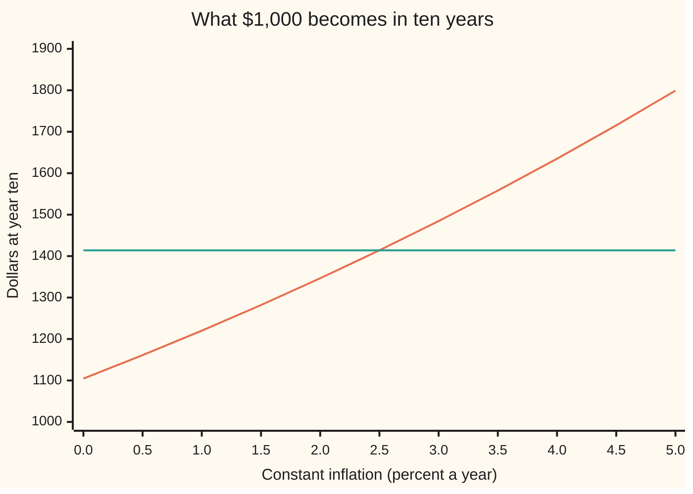

# Breakeven inflation: the inflation rate at which a linker and a nominal bond tie

[Syllabus](../../../SYLLABUS.md) → [Financial mathematics](../../../SYLLABUS.md#w12) → [Inflation and Real Rates](../../../SYLLABUS.md#w12-s34) → Breakeven inflation

---

## General Overview

Two ten-year government bonds are on sale today, and $1,000 goes into each.

The first is an ordinary **nominal bond**: it pays fixed dollars. Bought at its yield of 3.525 percent a year, the $1,000 grows to **$1,414.01** in ten years, whatever prices do in the meantime.

The second is an **inflation-linked bond**, a "linker" for short: its payments are scaled up by a price index, so they keep their buying power ([Inflation-linked bonds](02-inflation-linked-bonds.md)). It yields 1 percent a year in **real** terms, meaning in units of buying power. Its $1,000 grows to $1,104.62 of today's buying power, then gets multiplied by however much prices rose.

Which is the better buy? It depends on inflation. If prices rise 2 percent a year, the linker ends at $1,346.53 and the nominal bond wins. At 3 percent the linker ends at $1,484.52 and wins. Somewhere between, the two pay exactly the same dollars. That rate is the **breakeven inflation rate**. Here it is **2.5 percent a year**.

Markets quote it every day. A newspaper line such as "the ten-year breakeven is 2.5 percent" is this number, read off two bond yields. It is the price of inflation protection, and the card finds it three ways, then reads it against the other place that price is quoted: the inflation swap.

**Breakeven inflation is the constant yearly inflation rate at which an inflation-linked bond and a nominal bond of the same maturity pay the same dollars; it equals nominal growth divided by real growth, minus one.**

**What kind of fact this is:** a definition. The closed formula for it, and the fact that coupons do not move it, are theorems proved on this card in Why it works. Reading it as the market's forecast of inflation is a model, not a fact.

### The picture: two bonds, one crossing

Each $1,000 is followed to year ten. Inflation, held constant for all ten years, runs left to right.



Rising line: the linker, whose dollars grow with prices. Flat line: the nominal bond, $1,414.01 in every world. They cross at 2.5 percent. Left of the crossing the nominal bond wins; right of it the linker wins.

---

## The formula

A few pieces of notation, each met on earlier cards. A rate is a decimal: 2.5 percent is 0.025. A **growth factor** is one plus a rate: 1.025. Raising a factor to the power $T$ compounds it over $T$ years. A **basis point**, "bp", is one hundredth of a percent, 0.0001.

The two bonds tie when their dollars at year $T$ are equal:

$$(1+n)^T = (1+r)^T\,(1+b)^T$$

Take the $T$-th root of both sides, which is allowed because every factor is positive, and solve:

$$b = \frac{1+n}{1+r} - 1$$

**Read it aloud:** divide one year of nominal growth by one year of real growth; what is left over is one year of inflation, and that is the breakeven.

For our bonds: 1.03525 divided by 1.01 is 1.025, so $b$ is 2.5 percent.

The market's quick version subtracts the yields instead:

$$s = n - r, \qquad s - b = r\,b$$

**Read it aloud:** the plain difference of the yields overstates the breakeven by the real yield times the breakeven. Here that is 0.01 × 0.025, or 2.5 basis points: $s$ is 2.525 percent, $b$ is 2.5.

| Symbol | Plain meaning | In our example | Push it up and the breakeven… |
| --- | --- | --- | --- |
| $n$ | the nominal bond's yield: growth of dollars per year | 3.525% | rises almost one for one |
| $r$ | the linker's real yield: growth of buying power per year | 1% | falls almost one for one |
| $b$ | the breakeven inflation rate | 2.5% | — |
| $\pi$ | an actual constant yearly inflation rate, a scenario | 2%, 2.5%, 3% | — |
| $T$ | years to maturity, the same for both bonds | 10 | no change: the tie holds year by year |
| $t$ | a year count running 1, 2, … up to $T$ | 1 to 10 | — |
| $I_0$, $I_T$ | the price index today and at year $T$ | not needed: only their ratio enters | — |
| $J$ | the index ratio $I_T / I_0$: how much prices rose in total | at the tie, 1.2801 | — |
| $c$ | the linker's real coupon, a fraction of face paid each year before scaling | 1% (a second case: 0.125%) | no change |
| $P$ | the linker's price per 1 of face, from its real yield | 1.000 (0.125% coupon: 0.9171) | — |
| $s$ | the shortcut: nominal yield minus real yield | 2.525% | — |
| $k$ | an inflation swap's fixed rate, quoted for the same maturity | 2.6% | — |

### Solving it as an inverse: existence, uniqueness, the boundary

The breakeven is an inverse: it runs a payoff backwards to the rate that produces it ([Solving backwards](../07-Greeks%20by%20Numbers%20and%20Calibration/05-root-finding-for-inverses.md)). Three questions come before solving.

- **Does one exist?** Yes, whenever both yields are above −100 percent. The linker's year-$T$ dollars, $(1+r)^T(1+\pi)^T$, run from zero (as $\pi$ falls to −1) to as large as needed, passing every value on the way. So they hit the nominal bond's dollars somewhere.
- **Is it unique?** Yes. Higher inflation always means more linker dollars, so the linker line in the picture only climbs. A climbing line crosses a flat one once.
- **The boundary.** If $n = r$, the breakeven is zero. If $n < r$, it is negative: the bonds tie only under falling prices. Then a real feature intervenes: a US linker repays at least its original face at maturity (the **deflation floor**). At $n = r$ the floor makes every index ratio $J \le 1$ a tie, so the answer is no longer unique. With $n$ at 0.5 percent and $r$ at 1 percent, the formula gives −0.495 percent, an index ratio of 0.9516. But the floored linker pays at least $1,104.62, above the nominal bond's $1,051.14. No inflation rate makes them tie. In our example the tie sits at an index ratio of 1.2801, far above 1, so the floor stays out of the way.

### When it holds

- **Same maturity, same dates.** A ten-year linker against a seven-year nominal bond measures nothing clean. Real market breakevens are read off matched maturities or a fitted curve.
- **Constant inflation.** The formula names one steady rate. Actual inflation wobbles. For zero-coupon bonds only the total rise $J$ matters, so the tie holds for any path with $J = 1.2801$. With coupons, the path shifts each coupon's dollars a little.
- **Same compounding on both yields.** Mixing a semiannual quote with an annual one moves the answer by 3 basis points here; see What breaks.
- **No credit, tax or liquidity differences.** Both bonds are from the same government. Linkers trade less, and buyers want paying for that; the gap lands inside the breakeven and makes it read low.
- **The index is the one the linker uses.** A US linker follows a consumer price index read three months late; a breakeven measures inflation in that index, over that lagged window.

---

## Why it works

### Step 0: price the same money two ways

Two bonds from the same issuer, maturing the same day, are two ways to hold money for ten years. One fixes the dollars. The other fixes the buying power. Their prices today, through their yields, say how many dollars the market pays for each. So the inflation rate that makes the two deliveries equal is already inside the two yields. Nothing about the future is guessed; it is read off today's prices.

### Step 1: zero-coupon bonds tie on their one payment

Take the simplest pair: bonds with no coupons, one payment each, at year $T$. A dollar in the nominal bond becomes $(1+n)^T$ dollars. A dollar in the linker becomes $(1+r)^T$ units of buying power, and each unit is paid as $J$ dollars, where $J$ is how much the index rose. So the linker pays $(1+r)^T J$ dollars.

Set them equal: $J = (1+n)^T / (1+r)^T$. For our bonds, $J = 1.025^{10} = 1.2801$. Prices rising 28.01 percent in total over ten years make the two bonds tie.

### Step 2: turn the total into a yearly rate

A total rise of $J$ over $T$ years is a constant yearly rate $b$ with $(1+b)^T = J$. Taking the $T$-th root gives

$$1 + b = \frac{1+n}{1+r}.$$

The years cancel. That is why the breakeven for the ten-year pair and a thirty-year pair with the same yields comes out the same, 2.5 percent. The code checks this with $T = 30$.

### Step 3: coupons do not move it

Real linkers pay coupons. The 1 percent linker pays 1 percent of its face each year, scaled by the index, and the face at the end, also scaled. If inflation is a constant $\pi$, year $t$ pays $c(1+\pi)^t$ dollars. To compare it with the nominal bond, discount every payment at the nominal yield $n$, the rate the market uses for dollar payments on that date. The breakeven is the $\pi$ that makes this worth exactly the linker's price $P$:

$$P = \sum_{t=1}^{T} \frac{c\,(1+\pi)^t}{(1+n)^t} + \frac{(1+\pi)^T}{(1+n)^T}$$

The sign $\sum_{t=1}^{T}$ means: add up the term after it for $t = 1, 2, \ldots, T$. Now look at one term. It has $(1+\pi)^t$ on top and $(1+n)^t$ below, so it equals $c / \big((1+n)/(1+\pi)\big)^t$. That is the payment discounted at a single rate, $(1+n)/(1+\pi) - 1$. The linker's price, by definition of its real yield, is its real payments discounted at $r$ ([Bond price and yield](../01-Money%2C%20Dates%20and%20Discounting/05-bonds-price-and-yield.md)). So the equation holds exactly when $(1+n)/(1+\pi) = 1+r$: the same formula as Step 2.

The coupon never entered. The code checks it on two linkers, one with a 1 percent coupon priced at $1,000 and one with a 0.125 percent coupon priced at $917.13. Both give 2.5 percent.

<details>
<summary>Detailed proof: the coupon linker's breakeven is unique and equals the closed form</summary>

Write $g = (1+n)/(1+\pi)$, positive whenever $\pi > -1$ and $n > -1$. The right-hand side above is then $\sum_{t=1}^{T} c\,g^{-t} + g^{-T}$, the linker's real price at yield $g - 1$.

For $c \ge 0$ that price strictly falls as the yield rises, since each term $g^{-t}$ does. As $\pi$ rises, $(1+n)/(1+\pi)$ falls, so the right-hand side strictly rises in $\pi$: at most one root.

As $\pi \to -1$, $g \to \infty$ and the right-hand side goes to 0, below $P$. As $\pi \to \infty$, $g \to 0$ and the right-hand side grows without bound, above $P$. It is continuous in between, so it crosses $P$: at least one root.

The real yield $r$ is defined by $P = \sum c(1+r)^{-t} + (1+r)^{-T}$. So $g = 1+r$ solves the equation, and by uniqueness it is the only solution: $1 + b = (1+n)/(1+r)$. The deflation floor adds $\max(0, 1 - (1+\pi)^T)$ to the final payment; for $b > 0$ that term is zero at the root, so the answer stands.

</details>

### Step 4: why subtracting yields is close but not exact

Multiply out the tie: $1 + n = (1+r)(1+b) = 1 + r + b + r\,b$. So $n - r = b + r\,b$. The shortcut $s$ carries an extra cross term $r\,b$: real growth earned on the inflation uplift. At our yields it is 2.5 basis points. It grows with both rates.

Quoted with **continuous compounding**, rates add exactly: the breakeven is $\ln(1+n) - \ln(1+r)$, here 2.469 percent a year continuously compounded. Same fact, a different unit, as a temperature in Celsius and Fahrenheit.

### Step 5: read it against the inflation swap

A zero-coupon inflation swap is a contract on the same question with no bonds at all: at year $T$, one side pays the index's total rise $J$ on a notional amount, the other pays a fixed growth $(1+k)^T$ ([Inflation swaps](04-zero-coupon-inflation-swaps.md)). Its fixed rate $k$ is a second, independent quote for the price of inflation.

The two quotes can be set side by side as trades.

- **Linker plus a swap paying the index.** The linker's dollars rise with $J$; the swap hands that rise away and receives fixed growth. Whatever the index does, $1,000 ends at $1{,}000 \times (1.01 \times 1.026)^{10} = \$1{,}427.87$. That is $13.86 more than the nominal bond's $1,414.01, with no inflation risk. The code tries 1,000 random index ratios; the total never moves.
- **Nominal bond plus a swap receiving the index.** This builds a linker out of other parts. Its real yield is $(1+n)/(1+k) - 1 = 0.9016$ percent, below the cash linker's 1 percent.

Both say the same thing: when $k$ is above $b$, cash linkers are cheap next to swaps. The gap here is 10 basis points. In real markets the two quotes for one maturity rarely match exactly. The gap is not free money: holding the linker ties up cash, the swap carries a counterparty and collateral terms, and linkers are harder to sell in a hurry. Those costs are what the gap pays for.

---

## Worked numbers, by hand

Ten years; nominal yield 3.525 percent; linker real yield 1 percent, real coupon 1 percent; swap fixed rate 2.6 percent; $1,000 in each.

| Step | Arithmetic | Value |
| --- | --- | --- |
| nominal growth over real growth | 1.03525 ÷ 1.01 | 1.025 |
| **breakeven** $b$ | 1.025 − 1 | **2.5%** |
| index ratio at the tie, $J$ | 1.025 to the 10th | 1.2801 |
| nominal bond at year ten | 1,000 × 1.03525 to the 10th | $1,414.01 |
| linker, in today's buying power | 1,000 × 1.01 to the 10th | $1,104.62 |
| linker at the tie, in dollars | 1,104.62 × 1.2801 | $1,414.01 |
| shortcut $s$ | 3.525% − 1% | 2.525% |
| shortcut error | 0.01 × 0.025 | 2.5 bp |
| swap minus breakeven | 2.6% − 2.5% | 10 bp |
| synthetic real yield | 1.03525 ÷ 1.026 − 1 | 0.9016% |
| swap receiver at the tie path, per $1,000 | 1,000 × (1.2801 − 1.026 to the 10th) | −$12.54 |

So the market is pricing 2.5 percent a year of inflation as the dividing line. Above it, the linker holder does better; below it, the nominal bond holder does. The last row says the same thing from the swap side: if inflation comes in exactly at the bond breakeven, someone who agreed to receive the index and pay 2.6 percent loses $12.54 per $1,000.

### What breaks if you drop a piece

Correct answer: 2.5 percent.

| Mistake | Comes out at | What went wrong |
| --- | --- | --- |
| Subtract the yields | 2.525% | drops the cross term $r\,b$; 2.5 bp too high |
| Divide the wrong way, real over nominal | −2.439% | the sign flips and a deflation "breakeven" appears |
| Annualise the total rise by dividing 28.01% by 10 | 2.801% | treats compound growth as simple; 30 bp too high |
| Nominal yield quoted semiannually (3.4945%), real yield annually | 2.470% | two compounding conventions in one fraction; 3 bp too low |

---

## Code, from first principles, and it actually runs

The scripts reach the breakeven by three independent roads: the closed formula; bisection on the two zero-coupon payoffs (halving a bracket until the sign of the gap pins the rate); and Newton's method (sliding down the tangent line) on the coupon linker's price, run for two different coupons. The root finders are written out, with no library solver. They then read the swap, test the locked-in trade on 1,000 random index ratios from a hand-written random number generator, and print every what-breaks number and chart point.

### Python

```python
# Breakeven inflation -- the check behind the card.  Standard library only.
# Every number quoted on the card is printed here.  The breakeven is reached
# by three roads: the closed form, bisection on two zero-coupon payoffs, and
# Newton's method on a coupon linker's price.  The root finders are our own.
from math import log

T, n, r = 10, 0.03525, 0.01        # years; nominal yield; real yield (annual effective)
c, k, FACE = 0.01, 0.026, 1000.0   # linker's real coupon; swap fixed rate; dollars invested

def closed_form(n, r):             # Road 1: divide the growth factors, subtract one
    return (1 + n) / (1 + r) - 1

def bisect(f, lo, hi, steps=200):  # halve a sign-changing bracket until it is tiny
    assert f(lo) < 0 < f(hi), "bracket must straddle the root"
    for _ in range(steps):
        mid = (lo + hi) / 2
        if f(mid) < 0: lo = mid
        else: hi = mid
    return (lo + hi) / 2

def zero_gap(pi, n=n, r=r, T=T):   # Road 2: linker zero minus nominal zero, in dollars at year T
    return FACE * (1 + r) ** T * (1 + pi) ** T - FACE * (1 + n) ** T

def real_price(c, y, T):           # a bond's price per 1 of face, flows in real units, at yield y
    return sum(c / (1 + y) ** t for t in range(1, T + 1)) + 1 / (1 + y) ** T

def linker_pv(pi, c, n, T):        # the linker's flows inflated at pi, discounted at the nominal yield
    return sum(c * (1 + pi) ** t / (1 + n) ** t for t in range(1, T + 1)) + (1 + pi) ** T / (1 + n) ** T

def newton(f, x, steps=50, h=1e-7):  # Road 3: slide down the tangent, slope by nudging
    for _ in range(steps):
        x -= f(x) / ((f(x + h) - f(x - h)) / (2 * h))
    return x

pi1 = closed_form(n, r)
pi2 = bisect(zero_gap, -0.5, 1.0)
P_c = real_price(c, r, T)                                   # the 1% linker, priced off its real yield
pi3 = newton(lambda p: linker_pv(p, c, n, T) - P_c, 0.0)
P_lo = real_price(0.00125, r, T)                            # a second linker, 0.125% coupon
pi4 = newton(lambda p: linker_pv(p, 0.00125, n, T) - P_lo, 0.0)

J = (1 + pi1) ** T                                          # index ratio that makes the bonds tie
nominal_end = FACE * (1 + n) ** T
linker_real_end = FACE * (1 + r) ** T
spread = n - r
cont = log(1 + n) - log(1 + r)                              # continuous-rate breakeven

# ---- reading against the inflation swap ----
basis = k - pi1
synth_real = (1 + n) / (1 + k) - 1                          # nominal bond + receive CPI, pay fixed
locked = FACE * ((1 + r) * (1 + k)) ** T                    # linker + pay CPI, receive fixed
receiver_at_tie = FACE * ((1 + pi1) ** T - (1 + k) ** T)

# ---- what breaks ----
inverted = (1 + r) / (1 + n) - 1
simple_ann = (J - 1) / T
y_sa = 2 * ((1 + n) ** 0.5 - 1)                             # the same nominal yield quoted semiannually
mixed = (1 + y_sa) / (1 + r) - 1

# ---- boundary: nominal yield below real yield, principal floor ----
n_low = 0.005
pi_low = closed_form(n_low, r)
floor_min = FACE * (1 + r) ** T                             # floored linker pays at least this
nominal_low = FACE * (1 + n_low) ** T

rows = [
    ("1 closed form, pct", 100 * pi1), ("2 bisection, zero bonds, pct", 100 * pi2),
    ("3 Newton, 1% coupon linker, pct", 100 * pi3), ("  linker price per 1000", 1000 * P_c),
    ("4 Newton, 0.125% coupon linker, pct", 100 * pi4), ("  linker price per 1000", 1000 * P_lo),
    ("growth ratio (1+n)/(1+r)", (1 + n) / (1 + r)),
    ("index ratio at the tie J*", J),
    ("nominal zero at year 10, $", nominal_end), ("linker zero, real units, $", linker_real_end),
    ("linker zero at the tie, $", linker_real_end * J),
    ("linker if inflation 2%, $", linker_real_end * 1.02 ** T),
    ("linker if inflation 3%, $", linker_real_end * 1.03 ** T),
    ("shortcut spread n - r, pct", 100 * spread), ("shortcut error, bp", 10000 * (spread - pi1)),
    ("  r times breakeven, bp", 10000 * r * pi1),
    ("continuous-rate breakeven, pct", 100 * cont),
    ("swap fixed rate, pct", 100 * k), ("swap minus breakeven, bp", 10000 * basis),
    ("synthetic real yield, pct", 100 * synth_real),
    ("linker + pay-CPI swap at year 10, $", locked), ("  gain over nominal zero, $", locked - nominal_end),
    ("CPI receiver at the tie path, $", receiver_at_tie),
    ("wrong: inverted ratio, pct", 100 * inverted),
    ("wrong: simple annualising, pct", 100 * simple_ann),
    ("  nominal yield quoted semiannual, pct", 100 * y_sa),
    ("wrong: semiannual over annual, pct", 100 * mixed),
    ("boundary: n = 0.5%, breakeven pct", 100 * pi_low), ("  index ratio at that tie", (1 + pi_low) ** T),
    ("  floored linker at least, $", floor_min), ("  nominal zero, $", nominal_low),
    ("try: real yield 2%, pct", 100 * closed_form(n, 0.02)),
    ("try: nominal yield 5%, pct", 100 * closed_form(0.05, r)),
    ("try: 30 years, bisection, pct", 100 * bisect(lambda p: zero_gap(p, T=30), -0.5, 1.0)),
    ("try: swap 2.5%, synthetic real, pct", 100 * ((1 + n) / 1.025 - 1)),
]
for name, v in rows:
    print(f"{name:<38} {v:>12.6f}")

grid = [0.005 * i for i in range(11)]
print(f"{'chart, inflation pct':<22}" + "".join(f"{100 * p:>9.1f}" for p in grid))
print(f"{'chart, linker $':<22}" + "".join(f"{linker_real_end * (1 + p) ** T:>9.2f}" for p in grid))
print(f"{'chart, nominal $':<22}" + "".join(f"{nominal_end:>9.2f}" for p in grid))

# linker + pay-CPI swap is fixed whatever the index does: test on random index ratios
seed, worst = 20260928, 0.0
for _ in range(1000):
    seed = (6364136223846793005 * seed + 1442695040888963407) % 2 ** 64
    Jx = 0.5 + 1.5 * (seed >> 11) / 2 ** 53                 # an index ratio between 0.5 and 2
    linker_leg = FACE * (1 + r) ** T * Jx
    swap_leg = FACE * (1 + r) ** T * ((1 + k) ** T - Jx)   # pay CPI growth, receive fixed
    worst = max(worst, abs(linker_leg + swap_leg - locked))

assert abs(pi2 - pi1) < 1e-12, "bisection on zero payoffs must land on the closed form"
assert abs(pi3 - pi1) < 1e-10, "Newton on the coupon linker must land on the closed form"
assert abs(pi4 - pi1) < 1e-10, "the coupon must not move the breakeven"
assert abs((spread - pi1) - r * pi1) < 1e-15, "shortcut error must equal r times breakeven"
assert zero_gap(0.02) < 0 < zero_gap(0.03), "linker loses below, wins above"
assert worst < 1e-9, "linker + pay-CPI swap must be fixed on every index path"
assert floor_min > nominal_low, "with n < r the floored linker beats the nominal bond: no tie"
print("ALL CHECKS PASS")
```

**Ran 2026-09-28 on macOS, Python 3.14.6, standard library only. All checks passed. Output, pasted from the run:**

```
1 closed form, pct                         2.500000
2 bisection, zero bonds, pct               2.500000
3 Newton, 1% coupon linker, pct            2.500000
  linker price per 1000                 1000.000000
4 Newton, 0.125% coupon linker, pct        2.500000
  linker price per 1000                  917.126085
growth ratio (1+n)/(1+r)                   1.025000
index ratio at the tie J*                  1.280085
nominal zero at year 10, $              1414.009710
linker zero, real units, $              1104.622125
linker zero at the tie, $               1414.009710
linker if inflation 2%, $               1346.528207
linker if inflation 3%, $               1484.519767
shortcut spread n - r, pct                 2.525000
shortcut error, bp                         2.500000
  r times breakeven, bp                    2.500000
continuous-rate breakeven, pct             2.469261
swap fixed rate, pct                       2.600000
swap minus breakeven, bp                  10.000000
synthetic real yield, pct                  0.901559
linker + pay-CPI swap at year 10, $     1427.865649
  gain over nominal zero, $               13.855939
CPI receiver at the tie path, $          -12.543601
wrong: inverted ratio, pct                -2.439024
wrong: simple annualising, pct             2.800845
  nominal yield quoted semiannual, pct     3.494472
wrong: semiannual over annual, pct         2.469774
boundary: n = 0.5%, breakeven pct         -0.495050
  index ratio at that tie                  0.951583
  floored linker at least, $            1104.622125
  nominal zero, $                       1051.140132
try: real yield 2%, pct                    1.495098
try: nominal yield 5%, pct                 3.960396
try: 30 years, bisection, pct              2.500000
try: swap 2.5%, synthetic real, pct        1.000000
chart, inflation pct        0.0      0.5      1.0      1.5      2.0      2.5      3.0      3.5      4.0      4.5      5.0
chart, linker $         1104.62  1161.11  1220.19  1281.96  1346.53  1414.01  1484.52  1558.18  1635.11  1715.44  1799.31
chart, nominal $        1414.01  1414.01  1414.01  1414.01  1414.01  1414.01  1414.01  1414.01  1414.01  1414.01  1414.01
ALL CHECKS PASS
```

Three roads, one rate: the closed form, the bisection and both Newton runs agree to six decimals. The 0.125 percent linker costs $917.13 rather than $1,000, and still gives 2.5 percent.

### Rust

Same inputs, same roads, same labels. `powf` is used for every power so both languages call the same kind of power routine; the outputs agree byte for byte.

```rust
// Breakeven inflation -- the same check as breakeven_inflation_check.py, in Rust.
// Standard library only, no crates.  Three roads to the breakeven: the closed
// form, bisection on two zero-coupon payoffs, Newton's method on a coupon linker.
// Compile: rustc --edition 2021 -O breakeven_inflation_check.rs -o /tmp/breakeven_check

const T: i32 = 10;
const N: f64 = 0.03525; // nominal yield, annual effective
const R: f64 = 0.01; // real yield, annual effective
const C: f64 = 0.01; // the linker's real coupon
const K: f64 = 0.026; // inflation swap fixed rate
const FACE: f64 = 1000.0; // dollars invested

fn pw(x: f64, t: i32) -> f64 {
    x.powf(t as f64)
}

fn closed_form(n: f64, r: f64) -> f64 {
    (1.0 + n) / (1.0 + r) - 1.0
}

fn bisect(f: &dyn Fn(f64) -> f64, mut lo: f64, mut hi: f64) -> f64 {
    assert!(f(lo) < 0.0 && 0.0 < f(hi), "bracket must straddle the root");
    for _ in 0..200 {
        let mid = (lo + hi) / 2.0;
        if f(mid) < 0.0 { lo = mid } else { hi = mid }
    }
    (lo + hi) / 2.0
}

fn zero_gap(pi: f64, t: i32) -> f64 {
    FACE * pw(1.0 + R, t) * pw(1.0 + pi, t) - FACE * pw(1.0 + N, t)
}

fn real_price(c: f64, y: f64, t: i32) -> f64 {
    let coupons: f64 = (1..=t).map(|s| c / pw(1.0 + y, s)).sum();
    coupons + 1.0 / pw(1.0 + y, t)
}

fn linker_pv(pi: f64, c: f64, n: f64, t: i32) -> f64 {
    let coupons: f64 = (1..=t).map(|s| c * pw(1.0 + pi, s) / pw(1.0 + n, s)).sum();
    coupons + pw(1.0 + pi, t) / pw(1.0 + n, t)
}

fn newton(f: &dyn Fn(f64) -> f64, mut x: f64) -> f64 {
    let h = 1e-7;
    for _ in 0..50 {
        x -= f(x) / ((f(x + h) - f(x - h)) / (2.0 * h));
    }
    x
}

fn main() {
    let pi1 = closed_form(N, R);
    let pi2 = bisect(&|p| zero_gap(p, T), -0.5, 1.0);
    let p_c = real_price(C, R, T);
    let pi3 = newton(&|p| linker_pv(p, C, N, T) - p_c, 0.0);
    let p_lo = real_price(0.00125, R, T);
    let pi4 = newton(&|p| linker_pv(p, 0.00125, N, T) - p_lo, 0.0);

    let j = pw(1.0 + pi1, T);
    let nominal_end = FACE * pw(1.0 + N, T);
    let linker_real_end = FACE * pw(1.0 + R, T);
    let spread = N - R;
    let cont = (1.0 + N).ln() - (1.0 + R).ln();

    let basis = K - pi1;
    let synth_real = (1.0 + N) / (1.0 + K) - 1.0;
    let locked = FACE * pw((1.0 + R) * (1.0 + K), T);
    let receiver_at_tie = FACE * (pw(1.0 + pi1, T) - pw(1.0 + K, T));

    let inverted = (1.0 + R) / (1.0 + N) - 1.0;
    let simple_ann = (j - 1.0) / T as f64;
    let y_sa = 2.0 * ((1.0 + N).powf(0.5) - 1.0);
    let mixed = (1.0 + y_sa) / (1.0 + R) - 1.0;

    let n_low = 0.005;
    let pi_low = closed_form(n_low, R);
    let floor_min = FACE * pw(1.0 + R, T);
    let nominal_low = FACE * pw(1.0 + n_low, T);

    let rows: Vec<(&str, f64)> = vec![
        ("1 closed form, pct", 100.0 * pi1), ("2 bisection, zero bonds, pct", 100.0 * pi2),
        ("3 Newton, 1% coupon linker, pct", 100.0 * pi3), ("  linker price per 1000", 1000.0 * p_c),
        ("4 Newton, 0.125% coupon linker, pct", 100.0 * pi4), ("  linker price per 1000", 1000.0 * p_lo),
        ("growth ratio (1+n)/(1+r)", (1.0 + N) / (1.0 + R)),
        ("index ratio at the tie J*", j),
        ("nominal zero at year 10, $", nominal_end), ("linker zero, real units, $", linker_real_end),
        ("linker zero at the tie, $", linker_real_end * j),
        ("linker if inflation 2%, $", linker_real_end * pw(1.02, T)),
        ("linker if inflation 3%, $", linker_real_end * pw(1.03, T)),
        ("shortcut spread n - r, pct", 100.0 * spread), ("shortcut error, bp", 10000.0 * (spread - pi1)),
        ("  r times breakeven, bp", 10000.0 * R * pi1),
        ("continuous-rate breakeven, pct", 100.0 * cont),
        ("swap fixed rate, pct", 100.0 * K), ("swap minus breakeven, bp", 10000.0 * basis),
        ("synthetic real yield, pct", 100.0 * synth_real),
        ("linker + pay-CPI swap at year 10, $", locked), ("  gain over nominal zero, $", locked - nominal_end),
        ("CPI receiver at the tie path, $", receiver_at_tie),
        ("wrong: inverted ratio, pct", 100.0 * inverted),
        ("wrong: simple annualising, pct", 100.0 * simple_ann),
        ("  nominal yield quoted semiannual, pct", 100.0 * y_sa),
        ("wrong: semiannual over annual, pct", 100.0 * mixed),
        ("boundary: n = 0.5%, breakeven pct", 100.0 * pi_low), ("  index ratio at that tie", pw(1.0 + pi_low, T)),
        ("  floored linker at least, $", floor_min), ("  nominal zero, $", nominal_low),
        ("try: real yield 2%, pct", 100.0 * closed_form(N, 0.02)),
        ("try: nominal yield 5%, pct", 100.0 * closed_form(0.05, R)),
        ("try: 30 years, bisection, pct", 100.0 * bisect(&|p| zero_gap(p, 30), -0.5, 1.0)),
        ("try: swap 2.5%, synthetic real, pct", 100.0 * ((1.0 + N) / 1.025 - 1.0)),
    ];
    for (name, v) in &rows {
        println!("{:<38} {:>12.6}", name, v);
    }

    let grid: Vec<f64> = (0..11).map(|i| 0.005 * i as f64).collect();
    let row = |f: &dyn Fn(f64) -> String| grid.iter().map(|&p| f(p)).collect::<String>();
    println!("{:<22}{}", "chart, inflation pct", row(&|p| format!("{:>9.1}", 100.0 * p)));
    println!("{:<22}{}", "chart, linker $", row(&|p| format!("{:>9.2}", linker_real_end * pw(1.0 + p, T))));
    println!("{:<22}{}", "chart, nominal $", row(&|_| format!("{:>9.2}", nominal_end)));

    // linker + pay-CPI swap is fixed whatever the index does: test on random index ratios
    let (mut seed, mut worst) = (20260928u64, 0.0f64);
    for _ in 0..1000 {
        seed = seed.wrapping_mul(6364136223846793005).wrapping_add(1442695040888963407);
        let jx = 0.5 + 1.5 * (seed >> 11) as f64 / 2f64.powi(53);
        let linker_leg = FACE * pw(1.0 + R, T) * jx;
        let swap_leg = FACE * pw(1.0 + R, T) * (pw(1.0 + K, T) - jx);
        worst = worst.max((linker_leg + swap_leg - locked).abs());
    }

    assert!((pi2 - pi1).abs() < 1e-12, "bisection on zero payoffs must land on the closed form");
    assert!((pi3 - pi1).abs() < 1e-10, "Newton on the coupon linker must land on the closed form");
    assert!((pi4 - pi1).abs() < 1e-10, "the coupon must not move the breakeven");
    assert!(((spread - pi1) - R * pi1).abs() < 1e-15, "shortcut error must equal r times breakeven");
    assert!(zero_gap(0.02, T) < 0.0 && 0.0 < zero_gap(0.03, T), "linker loses below, wins above");
    assert!(worst < 1e-9, "linker + pay-CPI swap must be fixed on every index path");
    assert!(floor_min > nominal_low, "with n < r the floored linker beats the nominal bond: no tie");
    println!("ALL CHECKS PASS");
}
```

**Ran 2026-09-28 on macOS, rustc 1.98.1, no crates. All checks passed. Output, pasted from the run:**

```
1 closed form, pct                         2.500000
2 bisection, zero bonds, pct               2.500000
3 Newton, 1% coupon linker, pct            2.500000
  linker price per 1000                 1000.000000
4 Newton, 0.125% coupon linker, pct        2.500000
  linker price per 1000                  917.126085
growth ratio (1+n)/(1+r)                   1.025000
index ratio at the tie J*                  1.280085
nominal zero at year 10, $              1414.009710
linker zero, real units, $              1104.622125
linker zero at the tie, $               1414.009710
linker if inflation 2%, $               1346.528207
linker if inflation 3%, $               1484.519767
shortcut spread n - r, pct                 2.525000
shortcut error, bp                         2.500000
  r times breakeven, bp                    2.500000
continuous-rate breakeven, pct             2.469261
swap fixed rate, pct                       2.600000
swap minus breakeven, bp                  10.000000
synthetic real yield, pct                  0.901559
linker + pay-CPI swap at year 10, $     1427.865649
  gain over nominal zero, $               13.855939
CPI receiver at the tie path, $          -12.543601
wrong: inverted ratio, pct                -2.439024
wrong: simple annualising, pct             2.800845
  nominal yield quoted semiannual, pct     3.494472
wrong: semiannual over annual, pct         2.469774
boundary: n = 0.5%, breakeven pct         -0.495050
  index ratio at that tie                  0.951583
  floored linker at least, $            1104.622125
  nominal zero, $                       1051.140132
try: real yield 2%, pct                    1.495098
try: nominal yield 5%, pct                 3.960396
try: 30 years, bisection, pct              2.500000
try: swap 2.5%, synthetic real, pct        1.000000
chart, inflation pct        0.0      0.5      1.0      1.5      2.0      2.5      3.0      3.5      4.0      4.5      5.0
chart, linker $         1104.62  1161.11  1220.19  1281.96  1346.53  1414.01  1484.52  1558.18  1635.11  1715.44  1799.31
chart, nominal $        1414.01  1414.01  1414.01  1414.01  1414.01  1414.01  1414.01  1414.01  1414.01  1414.01  1414.01
ALL CHECKS PASS
```

> [!TIP]
> **Try changing**
> - **Raise the real yield to 2 percent**, nominal unchanged. Guess first: does the breakeven fall by one point? It falls to 1.4951 percent, a touch more than one point, because the cross term shrinks too.
> - **Raise the nominal yield to 5 percent**, real unchanged. Guess first. The breakeven rises to 3.9604 percent, not 4.
> - **Stretch both bonds to thirty years**, yields unchanged. Guess first: more years, more compounding, a different answer? The bisection lands on 2.5 percent again. The years cancel in Step 2.
> - **Quote the swap at 2.5 percent**, level with the bond breakeven. The synthetic linker's real yield becomes exactly 1 percent, the cash linker's. With no gap between the two quotes, neither route is cheaper.

---

## The usual mistake

> [!warning]
> **Breakeven inflation is not the market's forecast of inflation.** It is the rate at which two bonds tie, and that rate carries two other things. Buyers of nominal bonds bear inflation risk and want paying for it (an **inflation risk premium**), which pushes the breakeven above expected inflation. Linkers trade less easily, so their buyers want a higher real yield (a **liquidity premium**), which pushes the breakeven below. Which one wins changes over time; splitting them apart needs a model, and different models disagree. A 2.5 percent breakeven says "2.5 percent is the dividing line"; it does not say "2.5 percent is expected".
>
> - **Subtracting yields.** Gives 2.525 percent, 2.5 basis points high here, more when rates are higher. Divide the growth factors instead.
> - **Mixing compounding conventions.** A semiannual nominal quote over an annual real one gives 2.470 percent, 3 basis points low.
> - **Mismatched maturities or index lags.** A ten-year linker against a nine-year nominal bond mixes the breakeven with the slope of the yield curve. The linker's index is also read three months late, so its breakeven covers a lagged window.
> - **Forgetting the deflation floor near zero.** When the breakeven is near or below zero, the linker's floor is worth something and the plain formula no longer gives the tie; with $n$ below $r$ there is no tie at all.

---

## Where you meet it in real life

- **Central banks.** The US Federal Reserve and others watch ten-year and five-year breakevens daily as a fast, market-made reading of inflation compensation, alongside surveys. Staff research splits it into expectations, risk premium and liquidity premium with term-structure models.
- **Treasury auctions of inflation-protected securities.** A US linker's real yield is set at auction; the nominal Treasury yield of the same maturity is known that day, so every auction prints a breakeven.
- **Portfolio choice.** A pension fund owing inflation-linked payouts compares the breakeven with its own view of inflation. If its view is above the breakeven, linkers are the cheaper way to cover the liability.
- **Relative-value desks.** Traders compare the bond breakeven with the swap rate for the same maturity, as in Step 5, and trade the gap when funding and balance-sheet costs allow ([Inflation swaps](04-zero-coupon-inflation-swaps.md)).
- **Real rates.** The exact relation between nominal yield, real yield and inflation used here is the Fisher equation, read in reverse ([Real rates](01-real-rates-and-the-fisher-equation.md)).

Conventions verified 2026-09-28: a US inflation-protected Treasury pays interest twice a year on its index-scaled principal; its reference index for the first day of a month is the consumer price index of the third preceding month; at maturity it repays the greater of the scaled principal and the original principal (TreasuryDirect; 31 CFR Part 356, Appendix B).

> **Say it back**
> A nominal bond fixes the dollars; an inflation-linked bond fixes the buying power. The inflation rate at which they pay the same dollars is the breakeven. It equals nominal growth divided by real growth, minus one: 1.03525 over 1.01, less one, is 2.5 percent. Coupons and maturity do not change it, and subtracting the yields overstates it by the real yield times the breakeven. An inflation swap quotes the same price separately, and the gap between the two is what linkers' cash and liquidity costs are worth.

---

## What this builds on

- [Inflation-linked bonds](02-inflation-linked-bonds.md): how a linker's coupons and principal scale with the index, what its real yield means, and the deflation floor.
- [Solving backwards](../07-Greeks%20by%20Numbers%20and%20Calibration/05-root-finding-for-inverses.md): bisection and Newton's method, and the habit of settling existence and uniqueness before solving.

---

## Where this goes next

- [Inflation swaps](04-zero-coupon-inflation-swaps.md): prices the swap whose fixed rate this card set beside the bond breakeven, and builds a curve of those rates by maturity.

This card read the price of inflation from two bonds and found a second quote in the swap; what sets the swap's fixed rate, and why it can sit 10 basis points away, is the question the swap card answers.

---

## Sources

Verified 2026-09-28: every link below resolves to the publisher's page.

- U.S. Department of the Treasury, [TIPS](https://www.treasurydirect.gov/marketable-securities/tips/), TreasuryDirect: how the principal is scaled by the consumer price index and repaid at no less than the original amount.
- U.S. Code of Federal Regulations, [31 CFR Part 356, Appendix B: Formulas and Tables](https://www.ecfr.gov/current/title-31/subtitle-B/chapter-II/subchapter-A/part-356/appendix-Appendix%20B%20to%20Part%20356): the semiannual interest, the three-month index lag and the index ratio.
- Don Kim, Cait Walsh and Min Wei, [Tips from TIPS: Update and Discussions](https://www.federalreserve.gov/econres/notes/feds-notes/tips-from-tips-update-and-discussions-20190521.html), FEDS Notes, Board of Governors of the Federal Reserve System, 21 May 2019: the nominal-minus-TIPS spread as "breakeven inflation", and its split into expected inflation, inflation risk premium and liquidity premium.
- Michael J. Fleming and John Sporn, [How Liquid Is the Inflation Swap Market?](https://libertystreeteconomics.newyorkfed.org/2013/04/how-liquid-is-the-inflation-swap-market/), Liberty Street Economics, Federal Reserve Bank of New York, 1 April 2013: the zero-coupon inflation swap's single exchange at maturity, and how the market trades.
