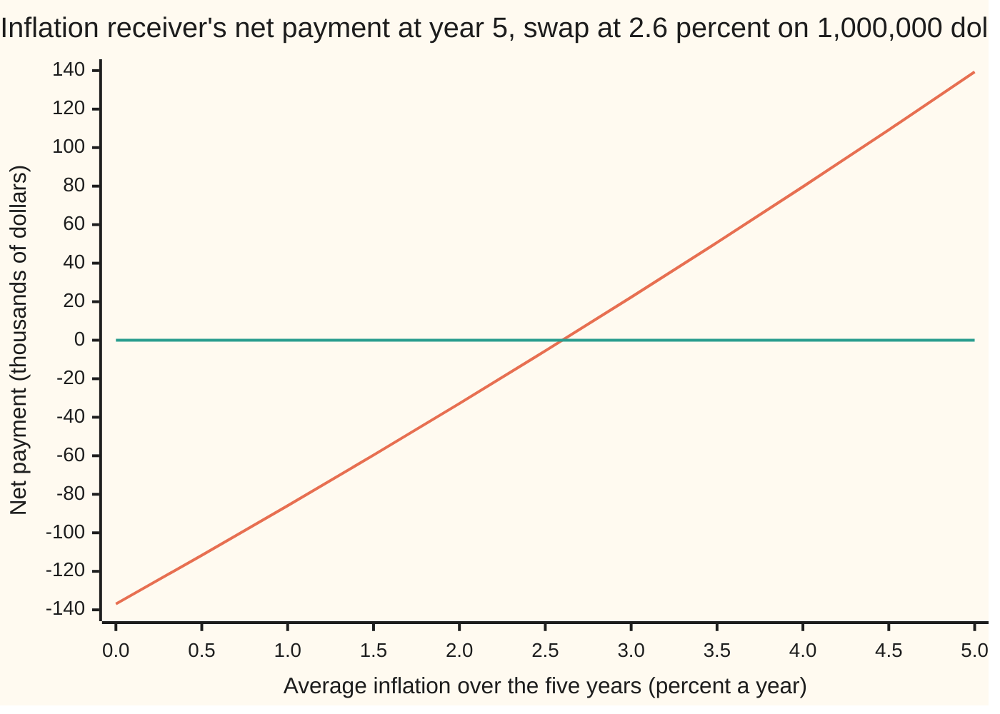
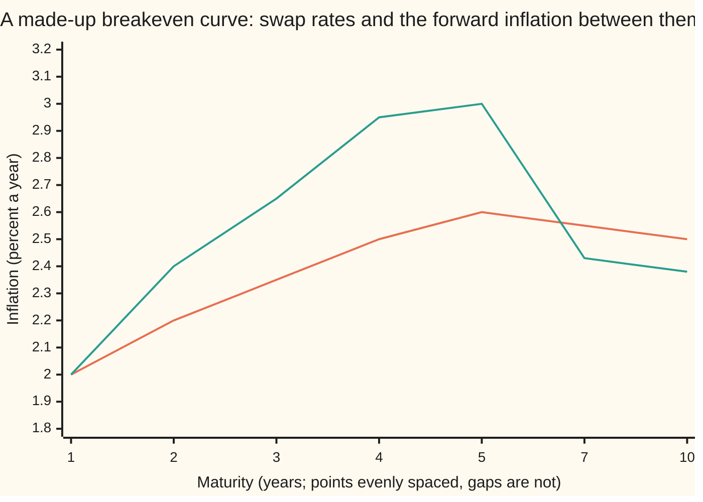

# Inflation swaps: a fixed rate against realised inflation

[Syllabus](../../../SYLLABUS.md) → [Financial mathematics](../../../SYLLABUS.md#w12) → [Inflation and Real Rates](../../../SYLLABUS.md#w12-s34) → Inflation swaps

---

## General Overview

A pension fund owes its retirees payments that rise with prices. It signs a five-year contract with a dealer on 1,000,000 dollars, the **notional**: every payment is computed on it, and it never changes hands itself.

In five years the fund receives 1,000,000 dollars times the rise in the consumer price index. It pays 1,000,000 dollars grown at 2.6 percent a year, compounded, for five years: 1,136,938.06 dollars. Only the difference is paid, once, at the end. Nothing is paid today.

If prices rise 15 percent in total, the fund receives 1,150,000.00 dollars and owes 1,136,938.06, a net 13,061.94 dollars. If they rise 10 percent, the fund pays the dealer. Either way, unknown inflation has been traded for a known rate.

That contract is a **zero-coupon inflation swap**: no money moves until the single exchange at maturity. The 2.6 percent is the **swap rate**, set so the swap costs nothing to enter. The fund, receiving inflation and paying fixed, is the **inflation receiver**; the dealer is the **inflation payer**.

The card prices the swap, new and old; builds a **breakeven curve** of swap rates across maturities; and uses swaps to hedge an inflation-linked bond, a **linker**.

**The swap rate is the rate that makes two bonds cost the same, one paying the index's rise in dollars and one paying fixed dollars; so the rate comes from bond prices, not from anyone's forecast of inflation.**

**What kind of fact this is:** a theorem, proved on this card in Why it works, true in every arbitrage-free model of how inflation behaves; the swap itself is a definition, and its quoting rules are conventions.

### The picture: what the fund collects in five years

The fund's net payment at maturity depends only on how much prices rose. Here it is against the average yearly inflation over the five years, in thousands of dollars.



The rising line is the fund's net payment; the flat line is zero. They cross at 2.6 percent a year, the swap rate. The rising line bends slightly upward because inflation compounds. There is no floor and no cap. The inflation payer's picture is the same line upside down.

---

## The formula

Notation first, in words. The **reference index** $I$ is the price index the contract names; $I_0$ is its value at the start and $I_T$ its value at maturity, $T$ years later. Their ratio $J_T$ is the **index ratio**: 1.15 means prices rose 15 percent in total. The notional is $N$ and the fixed rate in the contract is $K$, quoted per year and compounded once a year.

Two bond prices carry the whole card. $D(T)$ is today's price of one dollar paid at $T$: a **nominal zero**, a bond with no coupons paying a fixed number of dollars. $R(T)$ is today's price, in dollars, of a payment at $T$ of $J_T$ dollars: a **real zero**, a bond paying the index's rise. Its price is set by a **real yield**: the yearly return above inflation ([Real rates](01-real-rates-and-the-fisher-equation.md)).

The swap pays the inflation receiver, at $T$:

$$N\,\bigl[\,J_T - (1+K)^T\,\bigr]$$

**Read it aloud:** the notional times the index's total rise, less the notional times the fixed rate's total growth.

Its value today is the two bond prices, weighted:

$$V = N\,\bigl[\,R(T) - (1+K)^T\,D(T)\,\bigr]$$

**Read it aloud:** the inflation leg is worth the notional's worth of real zeros; the fixed leg is worth a known dollar amount's worth of nominal zeros; the swap is the difference.

The **par rate** $k_T$ is the fixed rate that makes $V$ zero:

$$k_T = \left(\frac{R(T)}{D(T)}\right)^{1/T} - 1 \;=\; \frac{1+n_T}{1+y_T} - 1$$

**Read it aloud:** the swap rate is the real bond's price over the nominal bond's price, as a yearly rate; in yields, one plus the nominal yield over one plus the real yield, less one.

The price ratio $A(T) = R(T)/D(T) = (1+k_T)^T$ is the **index forward**: the index ratio the market locks in for $T$. Two of them give the **forward inflation** $f$ between maturities $T_1$ and $T_2$:

$$1 + f = \left(\frac{A(T_2)}{A(T_1)}\right)^{1/(T_2-T_1)}$$

**Read it aloud:** the inflation priced between the two dates is the later index forward's extra growth, spread evenly over the gap.

A running swap keeps its original start index and term. With $J_t$ the index ratio so far and $M$ the original term:

$$V = N\,\bigl[\,J_t\,R(T) - (1+K)^M D(T)\,\bigr]$$

| Symbol | Plain meaning | In our example | Push it up and the answer… |
| --- | --- | --- | --- |
| $N$ | the notional: both legs are computed on it; it never changes hands | 1,000,000.00 dollars | every dollar figure scales with it |
| $T$, $M$, $T_1$, $T_2$ | years left; a running swap's original term; two curve maturities | 5; 7 | a longer swap moves more when rates move |
| $K$ | the fixed rate written into the swap | 2.60 percent; 2.30 for the older swap | the receiver pays more, so its value falls |
| $k_T$, $k_5$ | the par rate: the fixed rate that makes a new swap worth zero | 2.60 percent at 5 years | — |
| $I$, $I_0$, $I_T$ | the reference index; its value at the start and at maturity | only the ratio matters | — |
| $J_T$, $J_t$, $J_5$ | the index ratio at maturity; the ratio realised so far | 1.15 in the scenario; 1.06 so far | the receiver gains 951.47 dollars per 0.001 rise in $J_t$ |
| $D(T)$ | today's price of one dollar paid at $T$ | 0.836867 | see the Greeks table |
| $R(T)$ | today's price of $J_T$ dollars paid at $T$ | 0.951466 | the inflation leg gains |
| $y_T$, $n_T$ | the real and nominal zero yields | 1.00 and 3.626 percent | real up: par rate down; nominal up: par rate up |
| $A(T)$, $f$ | the index forward; forward inflation between two maturities | 1.136938; 3.00 percent from year 4 to 5 | — |
| $V$ | the swap's value today to the inflation receiver | 0 new; 27,289.86 dollars for the older swap | — |
| $\psi_s$, $J_s$, $s$ | in Step 4: a numbered state $s$, its state price, and the index ratio there | 4,000 states per economy | — |

**Conventions verified 28 Sep 2026** against Fleming and Sporn (2013), under Sources. US dollar inflation swaps reference the consumer price index for all urban consumers, not seasonally adjusted, the index that US Treasury inflation-protected securities (TIPS) use. It is read with a three-month lag. The fixed side is the notional times the annually compounded fixed rate, and only the net amount is paid, at maturity. The arithmetic here ignores the lag: $I$ is the contract's reference index, whatever month it describes.

### When it holds

- **Both bonds trade, on the same index, lag and date.** Real linkers carry coupons, a principal floor and their own index rules ([Inflation-linked bonds](02-inflation-linked-bonds.md)), and trade less often than swaps, so the swap rate and the bond breakeven differ by a **basis**: a spread to explain, not free money.
- **Nobody defaults.** Without collateral, a swap with a weaker counterparty is worth less to the side owed money.
- **The fixed leg compounds for the whole term.** The swap pays $(1+K)^T$, not $1 + KT$. Treating it as simple interest turns the 13,061.94 dollar payout into 20,000.00.
- **The payment is a straight line in the index.** A floor or cap on inflation is an option and needs a model of how inflation moves ([Inflation caps and floors in outline](05-inflation-options-in-outline.md)).

---

## Why it works

### Step 0: the unknown leg can be bought today

Nobody knows $J_T$. But a real zero pays exactly $J_T$ dollars at $T$, and it has a price today, $R(T)$. Holding $N$ of them delivers the inflation leg in every outcome. Two things that pay the same in every outcome cost the same, or one could be sold against the other for a riskless profit ([No arbitrage](../03-Contracts%20and%20No-Arbitrage/02-no-arbitrage-and-the-law-of-one-price.md)). So the inflation leg is worth $N\,R(T)$, whatever anyone expects inflation to be.

### Step 1: the fixed leg is a known number of dollars

The fixed leg pays $N(1+K)^T$ dollars at $T$, a number fixed on the trade date. It is worth that many nominal zeros: $N(1+K)^T D(T)$.

### Step 2: subtract, and solve for the par rate

The swap is the inflation leg less the fixed leg: $V = N[R(T) - (1+K)^T D(T)]$. A new swap is struck at the rate that makes $V$ zero, so $(1+k_T)^T = R(T)/D(T)$.

Exactly one answer exists. Both bond prices are positive, so their ratio is positive. As $K$ runs upward from just above −100 percent, $(1+K)^T$ climbs steadily from 0 without bound, passing every positive number once. The boundary case is allowed: if the real bond costs less than the nominal bond, the ratio is below 1 and the par rate is negative, pricing falling prices.

Taking the $T$-th root gives the formula. The code also reaches 2.6 percent by bisection: halving an interval until $V$ changes sign, with no formula inverted.

### Step 3: in yields, it is Fisher's product

Write each bond price through its yield: $D(T) = (1+n_T)^{-T}$ and $R(T) = (1+y_T)^{-T}$. The ratio becomes $[(1+n_T)/(1+y_T)]^T$, and the par rate is

$$1 + k_T = \frac{1+n_T}{1+y_T}.$$

That is the exact Fisher relation ([Real rates](01-real-rates-and-the-fisher-equation.md)): $1.03626 / 1.01 = 1.026$. So where both bonds trade, the swap rate equals the bond **breakeven**, the inflation at which the two bonds pay the same ([Breakeven inflation](03-breakeven-inflation.md)).

### Step 4: why no forecast enters

List the possible states of the world at year 5, each with a **state price**: today's cost of one dollar paid only in that state ([State prices](../03-Contracts%20and%20No-Arbitrage/07-state-prices-and-risk-neutral-pricing-in-one-period.md)). A payment is worth its amount in each state times that state's price, added up. The swap's payment is $N$ times the index ratio, less a fixed amount, so its sum needs only two totals: the state prices, which add to $D(T)$, and the state prices times the index ratio, which add to $R(T)$. How likely each state is and how investors feel about inflation risk enter only through those two bond prices.

The code builds four made-up economies of 4,000 states, each with its own random index ratios and state prices, rescaled so both bonds are priced right. Their plain averages of inflation, each state counted equally, are 2.60, 3.50, 1.21 and 1.68 percent a year. All four price the swap at 2.600000 percent and the older swap at 27,289.86 dollars.

<details>
<summary>Detailed proof: the value is model-free</summary>

Let the states at $T$ be numbered $s = 1, \dots, S$, with state prices $\psi_s > 0$ and index ratios $J_s > 0$. No arbitrage makes today's price of any payment the sum, over states, of the state price times the amount paid in that state. The nominal zero pays 1 in every state, so the sum of $\psi_s$ is $D(T)$. The real zero pays $J_s$, so the sum of $\psi_s J_s$ is $R(T)$.

The swap pays $N[J_s - (1+K)^T]$ in state $s$. Its price is the sum of $\psi_s N J_s$ less the sum of $\psi_s N (1+K)^T$. Take the constants $N$ and $(1+K)^T$ outside each sum: the price is $N R(T) - N(1+K)^T D(T)$. Every other feature of the state prices and the index ratios has cancelled.

With a continuum of states, integrals replace sums. The argument fails once the payment stops being a straight line in $J_s$: a floor $\max(J_s, 1)$ needs more than the two totals.

</details>

### Step 5: a running swap keeps its old base and its old term

Two years ago someone entered a 7-year swap at 2.30 percent, receiving inflation. A swap already running is called **seasoned**. Since then the index has risen 6.00 percent: $J_t = 1.06$. Five years remain.

Split the ratio at today: $I_T/I_0 = (I_t/I_0)(I_T/I_t)$. The first factor is known, 1.06. The second is what a 5-year real zero bought today pays. So the inflation leg is worth $1.06\,N\,R(5)$. The fixed leg is still $N(1.023)^7$, worth $N(1.023)^7 D(5)$. The difference is 27,289.86 dollars to the receiver: inflation so far has outrun 2.30 percent, and the market prices 2.60 percent ahead. It is the swap's version of a forward valued after inception ([An old forward](../03-Contracts%20and%20No-Arbitrage/04-forward-value-after-inception.md)).

### Step 6: many maturities make a curve

Swap rates trade at several maturities, here 1, 2, 3, 4, 5, 7 and 10 years. Each quote converts to an index forward, $A(T) = (1+k_T)^T$, and consecutive index forwards give forward inflation. From year 4 to 5, $1.136938 / 1.103813 = 1.030010$: 3.00 percent is priced for that year, though the 5-year rate is 2.60.



The smoother line is the swap curve, average inflation from today to each maturity. The jagged line is forward inflation for the gap ending at each maturity. A swap rate averages the forwards before it, so forwards run above a rising curve and below a falling one. The 10-year point, 2.50 percent, is the shelf's house breakeven.

Between pillars the curve needs a rule. **Flat forward** holds forward inflation constant across each gap; it prices a 6-year swap at 2.57 percent. Other rules give other numbers ([Between the pillars](../02-Curves/05-curve-interpolation-and-shape.md)). The index also has seasons, rising faster in some months than others, so desks add a seasonal adjustment on top. The code rebuilds the 10-year point from ten one-year forward factors and lands on 2.500000 percent.

### Step 7: the hedge cancels the index state by state

A zero-coupon linker on 1,000,000 dollars pays $1{,}000{,}000\,J_5$ at year 5. A pay-inflation swap on the same notional pays $1{,}000{,}000\,[(1.026)^5 - J_5]$. The sum is 1,136,938.06 dollars whatever $J_5$ turns out to be. At an index ratio of 1.15 the linker pays 1,150,000.00 and the swap costs 13,061.94.

A linker with coupons needs one swap per payment. Take a 5-year linker with the house 1 percent real coupon on 1,000,000 dollars, paid yearly: $10{,}000\,J_t$ each year, plus $1{,}000{,}000\,J_5$ at the end. Hedge each payment with a pay-inflation swap maturing that year, notional 10,000 dollars for years 1 to 4 and 1,010,000 at year 5. Each payment becomes its notional times that year's index forward, a fixed number of dollars.

The hedged package is a nominal bond, and its price matches: its fixed cash discounted at nominal rates is worth 1,000,000.00 dollars, as is the linker's real cash discounted at the 1 percent real yield. Across 20,000 random inflation paths, the largest gap between hedged cash and the locked amounts is 0.000000 dollars.

A US Treasury linker (TIPS) repays at maturity the larger of the inflated principal and the original face. The swap cannot cancel that floor. For a TIPS issued today, at an index ratio of 0.95 the linker repays 1,000,000, not 950,000, leaving 50,000.00 dollars above the locked amount. Of the 20,000 paths, 55 end below the start index, the largest leftover 44,848.73 dollars.

<details>
<summary>Another way to see it: the index as an exchange rate</summary>

Treat real dollars as a foreign currency and the index ratio as the exchange rate. A real zero is a foreign bond, the swap is a currency forward, and $1 + k_T = (1+n_T)/(1+y_T)$ is covered interest parity with the real yield as the foreign rate ([Covered interest parity](../20-FX%20spot%2C%20forwards%20and%20interest%20parity/02-covered-interest-parity.md)). Jarrow and Yildirim built their inflation model on exactly this analogy.

</details>

The other road is a full model of inflation and interest rates. Mercurio (2005) shows every such model must return this card's price for a zero-coupon swap, which is why models are fitted to the swap curve, not the reverse.

---

## Worked numbers, by hand

The 5-year swap at 2.6 percent, on 1,000,000 dollars, with a nominal zero yield of 3.626 percent and a real zero yield of 1.00 percent.

| Step | Arithmetic | Value |
| --- | --- | --- |
| nominal zero, $D(5)$ | $1 / 1.03626^5$ | 0.836867 |
| real zero, $R(5)$ | $1 / 1.01^5$ | 0.951466 |
| index forward, $A(5)$ | $0.951466 / 0.836867$ | 1.136938 |
| par rate, $k_5$ | $1.136938^{1/5} - 1$, or $1.03626 / 1.01 - 1$ | **2.60 percent** |
| fixed leg at year 5 | $1{,}000{,}000 \times 1.026^5$ | 1,136,938.06 dollars |
| payout at index ratio 1.15 | $1{,}150{,}000 - 1{,}136{,}938.06$ | 13,061.94 dollars |
| older swap, inflation leg | $1{,}000{,}000 \times 1.06 \times 0.951466$ | 1,008,553.63 dollars |
| older swap, fixed factor | $1.023^7$ | 1.172545 |
| older swap, fixed leg | $1{,}000{,}000 \times 1.172545 \times 0.836867$ | 981,263.77 dollars |
| **older swap's value** | $1{,}008{,}553.63 - 981{,}263.77$ | **27,289.86 dollars** |

A new swap costs nothing; the two-year-old one could be sold today for 27,289.86 dollars.

### The hedged 5-year linker, year by year

| Year | Linker pays | Swap notional | Locked cash, dollars |
| --- | --- | --- | --- |
| 1 | $10{,}000\,J_1$ | 10,000 | 10,200.00 |
| 2 | $10{,}000\,J_2$ | 10,000 | 10,444.84 |
| 3 | $10{,}000\,J_3$ | 10,000 | 10,721.70 |
| 4 | $10{,}000\,J_4$ | 10,000 | 11,038.13 |
| 5 | $1{,}010{,}000\,J_5$ | 1,010,000 | **1,148,307.44** |

Each locked amount is the notional times that year's index forward. At nominal rates the five are worth **1,000,000.00 dollars**, the linker's price.

### Greeks: how the swap's value moves

The two rate rows are computed by formula and by nudging the input one basis point, a hundredth of a percent, each way; the two agree to the cent, and the checks assert it. The index row is exact: the value is a straight line in the index ratio so far.

| Nudge | New 5-year swap at 2.6% | Older swap at 2.3%, 1.06 so far |
| --- | --- | --- |
| 5-year swap rate up 1 basis point, nominal yield fixed | +463.68 dollars | +491.50 dollars |
| 5-year nominal yield up 1 basis point, breakeven fixed | 0.00 dollars | −13.17 dollars |
| index ratio so far up 0.001 | +951.47 dollars | +951.47 dollars |

The new swap is worth zero, and zero discounted at any rate is zero, so it carries no nominal-rate risk at first order. The older swap's 27,289.86 dollars falls a little when nominal rates rise.

### What breaks if you drop a piece

| Mistake | Comes out at | What went wrong |
| --- | --- | --- |
| Fixed leg as simple interest, $1 + 5 \times 0.026$ | payout 20,000.00 dollars, not 13,061.94; a new swap looks worth 5,806.23, not 0 | The quote compounds yearly: 1.136938, not 1.13 |
| Older swap marked as a new one: base reset, 5-year term | 13,829.21 dollars, not 27,289.86 | Threw away the 6 percent already earned and the two years of fixed already owed |
| Older swap discounted at the real yield | 31,026.88 dollars, not 27,289.86 | The net payment is in dollars, so it discounts at the nominal rate |
| Coupon linker hedged with the 5-year swap only, 4 percent inflation every year | coupons off the locked amounts by 2,555.71 dollars over five years | Each coupon needs its own swap |
| TIPS floor ignored, index ratio 0.95 | 50,000.00 dollars left unhedged | The floor is an option, not a straight line in the index |

---

## Code, from first principles, and it actually runs

The script prices the 5-year swap three independent ways: the ratio of the two bond prices, bisection on the two legs, and state-by-state sums in four random economies that share only the two bond prices. It values the older swap by formula and in every economy, checks each Greek by bump, rebuilds the 10-year curve point from forwards, and runs 20,000 random inflation paths through the hedged linker. Random numbers come from a 64-bit linear congruential generator written out in both languages. Every number on the card is printed below.

### Python

```python
# Zero-coupon inflation swap -- the check behind the card.  Standard library only.
# The 5-year par rate is reached three ways: (1) the ratio of two bond prices,
# (2) bisection on the two legs' values, (3) state-by-state sums in four random
# economies that agree on those two bond prices and on nothing else.
from math import log, exp, sqrt, cos, pi

N, F, C = 1_000_000.0, 1_000_000.0, 0.01           # swap notional; linker face and real coupon
Y = 0.01                                           # real zero yield, every maturity
NOM = {1: .0302, 2: .03222, 3: .033735, 4: .03525, 5: .03626, 7: .035755, 10: .03525}
J_SO_FAR, K_OLD, T_OLD = 1.06, 0.023, 7            # seasoned swap: index up 6%, struck at 2.3%, 7 years

def D(t): return (1 + NOM[t]) ** -t                # nominal zero: one dollar at t
def R(t): return (1 + Y) ** -t                     # real zero: pays the index ratio at t, in dollars
def par(t): return (R(t) / D(t)) ** (1 / t) - 1    # road 1: the ratio of the two bond prices
def A(t): return (1 + par(t)) ** t                 # index forward: today's price of the ratio, per D(t)

def bisect(f, lo, hi, n=100):                      # root finder, written out
    flo = f(lo)
    for _ in range(n):
        mid = 0.5 * (lo + hi); fm = f(mid)
        if (fm > 0) == (flo > 0): lo, flo = mid, fm
        else: hi = mid
    return 0.5 * (lo + hi)

def value(k, j0=1.0, e=5):                         # inflation receiver's value today, 5 years left
    return N * (j0 * R(5) - (1 + k) ** e * D(5))

class Rng:                                          # 64-bit linear congruential generator
    def __init__(self, seed): self.s = seed
    def u(self):
        self.s = (6364136223846793005 * self.s + 1442695040888963407) % 2 ** 64
        return ((self.s >> 11) + 0.5) / 2.0 ** 53
    def normal(self): return sqrt(-2 * log(self.u())) * cos(2 * pi * self.u())

def economy(seed, vol, tilt, S=4000):              # road 3: a made-up world of S states at year 5
    g = Rng(seed)
    z = [g.normal() for _ in range(S)]
    J = [exp(vol * sqrt(5) * x) for x in z]        # index ratio in each state
    w = [exp(tilt * x + 0.3 * g.normal()) for x in z]
    sw = sum(w)
    psi = [D(5) * x / sw for x in w]               # state prices: sum to the nominal bond
    sc = R(5) / sum(p * j for p, j in zip(psi, J)) # rescale so the real bond is priced right
    J = [j * sc for j in J]
    val = lambda k, j0=1.0, e=5: sum(p * N * (j0 * j - (1 + k) ** e) for p, j in zip(psi, J))
    plain = (sum(J) / S) ** 0.2 - 1                # equal-chance average: a forecast, not a price
    return plain, bisect(val, -0.5, 0.5), val(K_OLD, J_SO_FAR, T_OLD)

def show(name, v): print(f"{name:<40} {round(v, 6) + 0.0:>16.6f}")

print(f"inputs: notional {N:.2f}  real yield {100 * Y:.2f}%  index so far {J_SO_FAR:.2f}  old fixed {100 * K_OLD:.2f}% for {T_OLD}y")
k1, k2 = par(5), bisect(value, -0.5, 0.5)
seasoned = value(K_OLD, J_SO_FAR, T_OLD)
for name, v in (("nominal zero D(5)", D(5)), ("real zero R(5)", R(5)), ("index forward A(5)", A(5)),
                ("par rate, road 1 bond ratio %", 100 * k1), ("par rate, road 2 bisection %", 100 * k2),
                ("seasoned inflation leg, N 1.06 R(5)", N * J_SO_FAR * R(5)), ("old fixed factor 1.023^7", (1 + K_OLD) ** T_OLD),
                ("seasoned fixed leg, N 1.023^7 D(5)", N * (1 + K_OLD) ** T_OLD * D(5)), ("seasoned swap value, formula", seasoned)): show(name, v)
econ = [economy(11, .01, 0.0), economy(22, .02, -1.0), economy(33, .03, 1.0), economy(44, .04, 0.5)]
for i, (plain, kp, sv) in enumerate(econ, 1):
    print(f"economy {i}: plain average {100 * plain:.4f}%  par {100 * kp:.6f}%  seasoned {sv:.6f}")
payout = N * (1.15 - A(5))
show("receiver gets, index ratio 1.15", payout); show("zero linker plus pay-inflation swap", N * 1.15 - payout)

h, b, n5 = 1e-4, k1, NOM[5]                         # Greeks: +1 basis point, analytic then by bump
vb = lambda bb, j0, k, e: N * D(5) * (j0 * (1 + bb) ** 5 - (1 + k) ** e)
vn = lambda nn, j0, k, e: N * (1 + nn) ** -5 * (j0 * A(5) - (1 + k) ** e)
gaps = []
for tag, j0, k, e in (("par", 1.0, k1, 5), ("seasoned", J_SO_FAR, K_OLD, T_OLD)):
    v0 = vb(b, j0, k, e)
    be, be_b = N * D(5) * j0 * 5 * (1 + b) ** 4 * h, (vb(b + h, j0, k, e) - vb(b - h, j0, k, e)) / 2
    no, no_b = -5 * v0 / (1 + n5) * h, (vn(n5 + h, j0, k, e) - vn(n5 - h, j0, k, e)) / 2
    gaps += [abs(be - be_b), abs(no - no_b)]
    print(f"{tag:<9} breakeven01 {be:10.4f} bump {be_b:10.4f}  nominal01 {round(no, 4) + 0.0:9.4f} bump {round(no_b, 4) + 0.0:9.4f}"
          f"  index01 {N * R(5) * 0.001:9.4f}")

TEN = [1, 2, 3, 4, 5, 7, 10]                        # the breakeven curve and its forward segments
fwd, prev = {}, 0
for t in TEN:
    fwd[t] = (A(t) / (A(prev) if prev else 1.0)) ** (1 / (t - prev)) - 1
    print(f"curve {t:>2}y  nominal {100 * NOM[t]:.4f}%  breakeven {100 * par(t):.4f}%  A {A(t):.6f}  forward {100 * fwd[t]:.4f}%")
    prev = t
print("chart, breakeven %  " + " ".join(f"{100 * par(t):.2f}" for t in TEN))
print("chart, forward %    " + " ".join(f"{100 * fwd[t]:.2f}" for t in TEN))
seg = lambda yr: fwd[min(t for t in TEN if t >= yr)]
rebuilt = 1.0
for yr in range(1, 11): rebuilt *= 1 + seg(yr)      # ten one-year forward factors, multiplied
show("10y rebuilt from forwards %", 100 * (rebuilt ** 0.1 - 1)); show("6y by flat forward %", 100 * ((A(5) * (1 + seg(6))) ** (1 / 6) - 1))

price = sum(C * F * R(t) for t in range(1, 6)) + F * R(5)          # the linker, real discounting
HEDGE = [10_000.0] * 4 + [1_010_000.0]              # pay-inflation swap notionals, as the card's table
locked = [n * A(t) for n, t in zip(HEDGE, range(1, 6))]
pv_locked = sum(l * D(t) for l, t in zip(locked, range(1, 6)))
g, worst, worst_p, floored, worst_floor = Rng(7), 0.0, 0.0, 0, 0.0
for _ in range(20000):                              # random inflation paths, hedged cash each year
    J = 1.0
    for t in range(1, 6):
        J *= 1 + 0.025 + 0.02 * g.normal()
        note = (C * F + (F if t == 5 else 0)) * J                   # the linker's cash this year
        worst = max(worst, abs(note + HEDGE[t - 1] * (A(t) - J) - locked[t - 1]))
        worst_p = max(worst_p, abs(note + (F * (A(5) - J) if t == 5 else 0) - locked[t - 1]))
    if J < 1: floored += 1; worst_floor = max(worst_floor, F * (1 - J))
show("linker price, real discounting", price); show("hedged cash, nominal discounting", pv_locked)
print("locked cash, years 1-5 " + " ".join(f"{x:.2f}" for x in locked))
print(f"paths 20000  worst hedge miss {worst:.6f}  paths under base {floored}  worst floor residue {worst_floor:.2f}")
show("floor residue, index ratio 0.95", F * max(0.95, 1) + F * (A(5) - 0.95) - F * A(5))

miss4 = sum(C * F * (1.04 ** t - A(t)) for t in range(1, 6))
for name, v in (("wrong: simple fixed leg, payout at 1.15", N * (1.15 - (1 + 5 * .026))),
                ("wrong: new swap valued with simple leg", N * (R(5) - (1 + 5 * .026) * D(5))),
                ("wrong: seasoned marked as new", value(K_OLD)),
                ("wrong: seasoned discounted at real rate", N * R(5) * (J_SO_FAR * A(5) - (1 + K_OLD) ** T_OLD)),
                ("wrong: principal-only hedge, 4% coupons", miss4),
                ("try: old swap at 2.5%, same dates", value(0.025)), ("try: payout if inflation is 2.6%", N * (1.026 ** 5 - A(5)))):
    show(name, v)
pis = [0.005 * i for i in range(11)]
print("chart, inflation % a year " + " ".join(f"{100 * p:.1f}" for p in pis))
print("chart, payout $000        " + " ".join(f"{N * ((1 + p) ** 5 - A(5)) / 1000:.2f}" for p in pis))

assert abs(k1 - 0.026) < 1e-12, "bond ratio must give the 2.6% quote"
assert abs(k2 - k1) < 1e-12, "bisection on the legs lands on the ratio"
assert all(abs(kp - k1) < 1e-10 and abs(sv - seasoned) < 1e-6 for _, kp, sv in econ), "every economy agrees"
assert max(p for p, _, _ in econ) - min(p for p, _, _ in econ) > 0.001, "forecasts differ, prices do not"
assert abs(payout - 13061.943239) < 1e-5, "audited payout at index ratio 1.15"
assert abs(rebuilt - 1.025 ** 10) < 1e-12, "forwards multiply back to the 10-year house breakeven"
assert abs(price - F) < 1e-6 and abs(pv_locked - F) < 1e-6, "coupon equals real yield: both roads price the linker at face"
assert worst < 1e-6 and worst_p > 100, "the strip hedge leaves no inflation on any path; principal-only does"
assert max(gaps) < 0.005, "every Greek matches its bump to the cent"
print("ALL CHECKS PASS")
```

**Ran 2026-09-28 on macOS, Python 3.14.6, standard library only. All checks passed. Output, pasted from the run:**

```
inputs: notional 1000000.00  real yield 1.00%  index so far 1.06  old fixed 2.30% for 7y
nominal zero D(5)                                0.836867
real zero R(5)                                   0.951466
index forward A(5)                               1.136938
par rate, road 1 bond ratio %                    2.600000
par rate, road 2 bisection %                     2.600000
seasoned inflation leg, N 1.06 R(5)        1008553.628863
old fixed factor 1.023^7                         1.172545
seasoned fixed leg, N 1.023^7 D(5)          981263.767685
seasoned swap value, formula                 27289.861178
economy 1: plain average 2.5993%  par 2.600000%  seasoned 27289.861178
economy 2: plain average 3.5010%  par 2.600000%  seasoned 27289.861178
economy 3: plain average 1.2098%  par 2.600000%  seasoned 27289.861178
economy 4: plain average 1.6790%  par 2.600000%  seasoned 27289.861178
receiver gets, index ratio 1.15              13061.943239
zero linker plus pay-inflation swap        1136938.056761
par       breakeven01   463.6772 bump   463.6772  nominal01    0.0000 bump    0.0000  index01  951.4657
seasoned  breakeven01   491.4979 bump   491.4979  nominal01  -13.1675 bump  -13.1675  index01  951.4657
curve  1y  nominal 3.0200%  breakeven 2.0000%  A 1.020000  forward 2.0000%
curve  2y  nominal 3.2220%  breakeven 2.2000%  A 1.044484  forward 2.4004%
curve  3y  nominal 3.3735%  breakeven 2.3500%  A 1.072170  forward 2.6507%
curve  4y  nominal 3.5250%  breakeven 2.5000%  A 1.103813  forward 2.9513%
curve  5y  nominal 3.6260%  breakeven 2.6000%  A 1.136938  forward 3.0010%
curve  7y  nominal 3.5755%  breakeven 2.5500%  A 1.192751  forward 2.4251%
curve 10y  nominal 3.5250%  breakeven 2.5000%  A 1.280085  forward 2.3834%
chart, breakeven %  2.00 2.20 2.35 2.50 2.60 2.55 2.50
chart, forward %    2.00 2.40 2.65 2.95 3.00 2.43 2.38
10y rebuilt from forwards %                      2.500000
6y by flat forward %                             2.570830
linker price, real discounting             1000000.000000
hedged cash, nominal discounting           1000000.000000
locked cash, years 1-5 10200.00 10444.84 10721.70 11038.13 1148307.44
paths 20000  worst hedge miss 0.000000  paths under base 55  worst floor residue 44848.73
floor residue, index ratio 0.95              50000.000000
wrong: simple fixed leg, payout at 1.15      20000.000000
wrong: new swap valued with simple leg        5806.229203
wrong: seasoned marked as new                13829.207696
wrong: seasoned discounted at real rate      31026.881737
wrong: principal-only hedge, 4% coupons       2555.707871
try: old swap at 2.5%, same dates             4627.742619
try: payout if inflation is 2.6%                 0.000000
chart, inflation % a year 0.0 0.5 1.0 1.5 2.0 2.5 3.0 3.5 4.0 4.5 5.0
chart, payout $000        -136.94 -111.69 -85.93 -59.65 -32.86 -5.53 22.34 50.75 79.71 109.24 139.34
ALL CHECKS PASS
```

Economies whose plain averages of inflation run from 1.21 to 3.50 percent all price the swap at 2.600000 percent. The strip hedge misses by nothing on any path.

### Rust

Same inputs, same generator, same rows. No crates.

```rust
// Zero-coupon inflation swap -- the same check as zero_coupon_inflation_swaps_check.py, in Rust.
// Standard library only, no crates.  Three roads to the 5-year par rate: the bond-price
// ratio, bisection on the legs, and state-by-state sums in four random economies.
use std::f64::consts::PI;

const N: f64 = 1_000_000.0; const F: f64 = 1_000_000.0; const C: f64 = 0.01;
const Y: f64 = 0.01;
const TEN: [u32; 7] = [1, 2, 3, 4, 5, 7, 10];
const J_SO_FAR: f64 = 1.06; const K_OLD: f64 = 0.023; const T_OLD: f64 = 7.0;

fn nom(t: u32) -> f64 {
    match t { 1 => 0.0302, 2 => 0.03222, 3 => 0.033735, 4 => 0.03525, 5 => 0.03626, 7 => 0.035755, _ => 0.03525 }
}
fn d(t: u32) -> f64 { (1.0 + nom(t)).powf(-(t as f64)) }             // nominal zero
fn r(t: u32) -> f64 { (1.0 + Y).powf(-(t as f64)) }                  // real zero
fn par(t: u32) -> f64 { (r(t) / d(t)).powf(1.0 / t as f64) - 1.0 }    // road 1
fn a(t: u32) -> f64 { (1.0 + par(t)).powf(t as f64) }                // index forward

fn bisect<G: Fn(f64) -> f64>(f: G, mut lo: f64, mut hi: f64) -> f64 {
    let mut flo = f(lo);
    for _ in 0..100 {
        let mid = 0.5 * (lo + hi); let fm = f(mid);
        if (fm > 0.0) == (flo > 0.0) { lo = mid; flo = fm; } else { hi = mid; }
    }
    0.5 * (lo + hi)
}
fn value(k: f64, j0: f64, e: f64) -> f64 { N * (j0 * r(5) - (1.0 + k).powf(e) * d(5)) }

struct Rng { s: u64 }
impl Rng {
    fn u(&mut self) -> f64 {
        self.s = self.s.wrapping_mul(6364136223846793005).wrapping_add(1442695040888963407);
        ((self.s >> 11) as f64 + 0.5) / 9007199254740992.0
    }
    fn normal(&mut self) -> f64 { let u1 = self.u(); let u2 = self.u(); (-2.0 * u1.ln()).sqrt() * (2.0 * PI * u2).cos() }
}

fn economy(seed: u64, vol: f64, tilt: f64) -> (f64, f64, f64) {
    let s = 4000;
    let mut g = Rng { s: seed };
    let z: Vec<f64> = (0..s).map(|_| g.normal()).collect();
    let mut j: Vec<f64> = z.iter().map(|x| (vol * 5f64.sqrt() * x).exp()).collect();
    let w: Vec<f64> = z.iter().map(|x| (tilt * x + 0.3 * g.normal()).exp()).collect();
    let sw: f64 = w.iter().sum();
    let psi: Vec<f64> = w.iter().map(|x| d(5) * x / sw).collect();
    let sc = r(5) / psi.iter().zip(&j).map(|(p, q)| p * q).sum::<f64>();
    for q in j.iter_mut() { *q *= sc; }
    let val = |k: f64, j0: f64, e: f64| psi.iter().zip(&j).map(|(p, q)| p * N * (j0 * q - (1.0 + k).powf(e))).sum::<f64>();
    let plain = (j.iter().sum::<f64>() / s as f64).powf(0.2) - 1.0;
    (plain, bisect(|k| val(k, 1.0, 5.0), -0.5, 0.5), val(K_OLD, J_SO_FAR, T_OLD))
}

fn clean(v: f64, p: i32) -> f64 { let m = 10f64.powi(p); (v * m).round() / m + 0.0 }
fn show(name: &str, v: f64) { println!("{:<40} {:>16.6}", name, clean(v, 6)); }

fn main() {
    println!("inputs: notional {:.2}  real yield {:.2}%  index so far {:.2}  old fixed {:.2}% for {}y", N, 100.0 * Y, J_SO_FAR, 100.0 * K_OLD, T_OLD as u32);
    let (k1, k2) = (par(5), bisect(|k| value(k, 1.0, 5.0), -0.5, 0.5));
    let seasoned = value(K_OLD, J_SO_FAR, T_OLD);
    for (name, v) in [("nominal zero D(5)", d(5)), ("real zero R(5)", r(5)), ("index forward A(5)", a(5)),
        ("par rate, road 1 bond ratio %", 100.0 * k1), ("par rate, road 2 bisection %", 100.0 * k2),
        ("seasoned inflation leg, N 1.06 R(5)", N * J_SO_FAR * r(5)), ("old fixed factor 1.023^7", (1.0 + K_OLD).powf(T_OLD)),
        ("seasoned fixed leg, N 1.023^7 D(5)", N * (1.0 + K_OLD).powf(T_OLD) * d(5)), ("seasoned swap value, formula", seasoned)] { show(name, v); }
    let econ = [economy(11, 0.01, 0.0), economy(22, 0.02, -1.0), economy(33, 0.03, 1.0), economy(44, 0.04, 0.5)];
    for (i, (plain, kp, sv)) in econ.iter().enumerate() {
        println!("economy {}: plain average {:.4}%  par {:.6}%  seasoned {:.6}", i + 1, 100.0 * plain, 100.0 * kp, sv);
    }
    let payout = N * (1.15 - a(5));
    show("receiver gets, index ratio 1.15", payout); show("zero linker plus pay-inflation swap", N * 1.15 - payout);

    let (h, b, n5) = (1e-4, k1, nom(5));
    let vb = |bb: f64, j0: f64, k: f64, e: f64| N * d(5) * (j0 * (1.0 + bb).powi(5) - (1.0 + k).powf(e));
    let vn = |nn: f64, j0: f64, k: f64, e: f64| N * (1.0 + nn).powi(-5) * (j0 * a(5) - (1.0 + k).powf(e));
    let mut gaps: Vec<f64> = Vec::new();
    for (tag, j0, k, e) in [("par", 1.0, k1, 5.0), ("seasoned", J_SO_FAR, K_OLD, T_OLD)] {
        let v0 = vb(b, j0, k, e);
        let (be, be_b) = (N * d(5) * j0 * 5.0 * (1.0 + b).powi(4) * h, (vb(b + h, j0, k, e) - vb(b - h, j0, k, e)) / 2.0);
        let (no, no_b) = (-5.0 * v0 / (1.0 + n5) * h, (vn(n5 + h, j0, k, e) - vn(n5 - h, j0, k, e)) / 2.0);
        gaps.extend([(be - be_b).abs(), (no - no_b).abs()]);
        println!("{:<9} breakeven01 {:10.4} bump {:10.4}  nominal01 {:9.4} bump {:9.4}  index01 {:9.4}", tag,
            be, be_b, clean(no, 4), clean(no_b, 4), N * r(5) * 0.001);
    }

    let mut fwd = std::collections::HashMap::new();
    let mut prev = 0u32;
    for &t in TEN.iter() {
        let base = if prev > 0 { a(prev) } else { 1.0 };
        let f = (a(t) / base).powf(1.0 / (t - prev) as f64) - 1.0;
        fwd.insert(t, f);
        println!("curve {:>2}y  nominal {:.4}%  breakeven {:.4}%  A {:.6}  forward {:.4}%", t, 100.0 * nom(t), 100.0 * par(t), a(t), 100.0 * f);
        prev = t;
    }
    println!("chart, breakeven %  {}", TEN.iter().map(|&t| format!("{:.2}", 100.0 * par(t))).collect::<Vec<_>>().join(" "));
    println!("chart, forward %    {}", TEN.iter().map(|t| format!("{:.2}", 100.0 * fwd[t])).collect::<Vec<_>>().join(" "));
    let seg = |yr: u32| fwd[TEN.iter().find(|&&t| t >= yr).unwrap()];
    let mut rebuilt = 1.0;
    for yr in 1..=10 { rebuilt *= 1.0 + seg(yr); }
    show("10y rebuilt from forwards %", 100.0 * (rebuilt.powf(0.1) - 1.0));
    show("6y by flat forward %", 100.0 * ((a(5) * (1.0 + seg(6))).powf(1.0 / 6.0) - 1.0));

    let flow = |t: u32| C * F + if t == 5 { F } else { 0.0 };
    let price: f64 = (1..=5).map(|t| C * F * r(t)).sum::<f64>() + F * r(5);
    let hedge = [10_000.0, 10_000.0, 10_000.0, 10_000.0, 1_010_000.0];   // swap notionals, as the card's table
    let locked: Vec<f64> = (1..=5).map(|t| hedge[t as usize - 1] * a(t)).collect();
    let pv_locked: f64 = (1..=5).map(|t| locked[t as usize - 1] * d(t)).sum();
    let (mut g, mut worst, mut worst_p, mut floored, mut worst_floor) = (Rng { s: 7 }, 0.0f64, 0.0f64, 0, 0.0f64);
    for _ in 0..20000 {
        let mut j = 1.0;
        for t in 1..=5u32 {
            j *= 1.0 + 0.025 + 0.02 * g.normal();
            let (note, i) = (flow(t) * j, t as usize - 1);
            worst = worst.max((note + hedge[i] * (a(t) - j) - locked[i]).abs());
            worst_p = worst_p.max((note + if t == 5 { F * (a(5) - j) } else { 0.0 } - locked[i]).abs());
        }
        if j < 1.0 { floored += 1; worst_floor = worst_floor.max(F * (1.0 - j)); }
    }
    show("linker price, real discounting", price); show("hedged cash, nominal discounting", pv_locked);
    println!("locked cash, years 1-5 {}", locked.iter().map(|x| format!("{:.2}", x)).collect::<Vec<_>>().join(" "));
    println!("paths 20000  worst hedge miss {:.6}  paths under base {}  worst floor residue {:.2}", worst, floored, worst_floor);
    show("floor residue, index ratio 0.95", F * 0.95f64.max(1.0) + F * (a(5) - 0.95) - F * a(5));

    let miss4: f64 = (1..=5).map(|t| C * F * (1.04f64.powi(t as i32) - a(t))).sum();
    for (name, v) in [("wrong: simple fixed leg, payout at 1.15", N * (1.15 - (1.0 + 5.0 * 0.026))),
        ("wrong: new swap valued with simple leg", N * (r(5) - (1.0 + 5.0 * 0.026) * d(5))),
        ("wrong: seasoned marked as new", value(K_OLD, 1.0, 5.0)),
        ("wrong: seasoned discounted at real rate", N * r(5) * (J_SO_FAR * a(5) - (1.0 + K_OLD).powf(T_OLD))),
        ("wrong: principal-only hedge, 4% coupons", miss4),
        ("try: old swap at 2.5%, same dates", value(0.025, 1.0, 5.0)), ("try: payout if inflation is 2.6%", N * (1.026f64.powi(5) - a(5)))] {
        show(name, v);
    }
    let pis: Vec<f64> = (0..11).map(|i| 0.005 * i as f64).collect();
    println!("chart, inflation % a year {}", pis.iter().map(|p| format!("{:.1}", 100.0 * p)).collect::<Vec<_>>().join(" "));
    println!("chart, payout $000        {}", pis.iter().map(|p| format!("{:.2}", N * ((1.0 + p).powi(5) - a(5)) / 1000.0)).collect::<Vec<_>>().join(" "));

    assert!((k1 - 0.026).abs() < 1e-12, "bond ratio must give the 2.6% quote");
    assert!((k2 - k1).abs() < 1e-12, "bisection on the legs lands on the ratio");
    assert!(econ.iter().all(|e| (e.1 - k1).abs() < 1e-10 && (e.2 - seasoned).abs() < 1e-6), "every economy agrees");
    let (lo, hi) = econ.iter().fold((f64::MAX, f64::MIN), |(l, h), e| (l.min(e.0), h.max(e.0)));
    assert!(hi - lo > 0.001, "forecasts differ, prices do not");
    assert!((payout - 13061.943239).abs() < 1e-5, "audited payout at index ratio 1.15");
    assert!((rebuilt - 1.025f64.powi(10)).abs() < 1e-12, "forwards multiply back to the 10-year house breakeven");
    assert!((price - F).abs() < 1e-6 && (pv_locked - F).abs() < 1e-6, "coupon equals real yield: both roads price the linker at face");
    assert!(worst < 1e-6 && worst_p > 100.0, "the strip hedge leaves no inflation on any path; principal-only does");
    assert!(gaps.iter().all(|&x| x < 0.005), "every Greek matches its bump to the cent");
    println!("ALL CHECKS PASS");
}
```

**Ran 2026-09-28 on macOS, rustc 1.98.1, no crates. All checks passed. Output, pasted from the run:**

```
inputs: notional 1000000.00  real yield 1.00%  index so far 1.06  old fixed 2.30% for 7y
nominal zero D(5)                                0.836867
real zero R(5)                                   0.951466
index forward A(5)                               1.136938
par rate, road 1 bond ratio %                    2.600000
par rate, road 2 bisection %                     2.600000
seasoned inflation leg, N 1.06 R(5)        1008553.628863
old fixed factor 1.023^7                         1.172545
seasoned fixed leg, N 1.023^7 D(5)          981263.767685
seasoned swap value, formula                 27289.861178
economy 1: plain average 2.5993%  par 2.600000%  seasoned 27289.861178
economy 2: plain average 3.5010%  par 2.600000%  seasoned 27289.861178
economy 3: plain average 1.2098%  par 2.600000%  seasoned 27289.861178
economy 4: plain average 1.6790%  par 2.600000%  seasoned 27289.861178
receiver gets, index ratio 1.15              13061.943239
zero linker plus pay-inflation swap        1136938.056761
par       breakeven01   463.6772 bump   463.6772  nominal01    0.0000 bump    0.0000  index01  951.4657
seasoned  breakeven01   491.4979 bump   491.4979  nominal01  -13.1675 bump  -13.1675  index01  951.4657
curve  1y  nominal 3.0200%  breakeven 2.0000%  A 1.020000  forward 2.0000%
curve  2y  nominal 3.2220%  breakeven 2.2000%  A 1.044484  forward 2.4004%
curve  3y  nominal 3.3735%  breakeven 2.3500%  A 1.072170  forward 2.6507%
curve  4y  nominal 3.5250%  breakeven 2.5000%  A 1.103813  forward 2.9513%
curve  5y  nominal 3.6260%  breakeven 2.6000%  A 1.136938  forward 3.0010%
curve  7y  nominal 3.5755%  breakeven 2.5500%  A 1.192751  forward 2.4251%
curve 10y  nominal 3.5250%  breakeven 2.5000%  A 1.280085  forward 2.3834%
chart, breakeven %  2.00 2.20 2.35 2.50 2.60 2.55 2.50
chart, forward %    2.00 2.40 2.65 2.95 3.00 2.43 2.38
10y rebuilt from forwards %                      2.500000
6y by flat forward %                             2.570830
linker price, real discounting             1000000.000000
hedged cash, nominal discounting           1000000.000000
locked cash, years 1-5 10200.00 10444.84 10721.70 11038.13 1148307.44
paths 20000  worst hedge miss 0.000000  paths under base 55  worst floor residue 44848.73
floor residue, index ratio 0.95              50000.000000
wrong: simple fixed leg, payout at 1.15      20000.000000
wrong: new swap valued with simple leg        5806.229203
wrong: seasoned marked as new                13829.207696
wrong: seasoned discounted at real rate      31026.881737
wrong: principal-only hedge, 4% coupons       2555.707871
try: old swap at 2.5%, same dates             4627.742619
try: payout if inflation is 2.6%                 0.000000
chart, inflation % a year 0.0 0.5 1.0 1.5 2.0 2.5 3.0 3.5 4.0 4.5 5.0
chart, payout $000        -136.94 -111.69 -85.93 -59.65 -32.86 -5.53 22.34 50.75 79.71 109.24 139.34
ALL CHECKS PASS
```

The two outputs agree line for line.

> [!TIP]
> **Try changing**
> Guess first, then run.
> - **A 5-year swap struck at 2.5 percent, starting today.** Change the argument of the `try: old swap` row. Guess the sign: the receiver pays 2.5 where the market charges 2.6, so the swap is worth **+4,627.74 dollars**.
> - **Inflation lands exactly on the swap rate.** The `try: payout` row sets 2.6 percent a year for five years. The net payment is **0.00 dollars**: the swap rate is the breakeven for the payout.
> - **A 6-year swap.** No quote exists at 6 years. With flat forward inflation from year 5 to 7 the par rate is **2.57 percent**, between the 5-year 2.60 and the 7-year 2.55.
> - **Tilt an economy.** Change the `tilt` of any economy, so state prices lean harder toward high or low inflation. Its plain average moves; its par rate stays **2.600000 percent**, because the two bond prices are rescaled to the same values.

---

## The usual mistake

> [!warning]
> **Reading the swap rate as the market's forecast of inflation.** It is not. The 2.60 percent comes from two bond prices, and Step 4 finds it in economies whose average inflation runs from 1.21 to 3.50 percent. It bundles expected inflation with a premium for bearing inflation risk and any difference in how easily the two bonds trade. Separating them takes a model.
>
> Smaller traps:
> - **Simple interest on the fixed leg.** $1 + KT$ in place of $(1+K)^T$ turns a 13,061.94 dollar payout into 20,000.00.
> - **Resetting a running swap.** Its base index and fixed term are fixed at the trade. Marking it as a new 5-year swap gives 13,829.21 dollars, not 27,289.86.
> - **Reading today's prices into $I_T$.** The index is lagged three months, so the final payment reflects prices a quarter old.
> - **Calling a linker plus one swap a nominal bond.** Coupons need their own swaps, and a TIPS floor leaves an option behind: 50,000.00 dollars at an index ratio of 0.95.

---

## Where you meet it in real life

- **Pension funds and insurers.** Liabilities that rise with prices are hedged by receiving inflation in swaps, often long ones, because linkers alone are too few.
- **Market-implied inflation.** Central banks and analysts read the swap curve as inflation compensation over each horizon. The [Breakeven inflation](03-breakeven-inflation.md) card reads the same number from bonds.
- **Linker desks.** A dealer holding TIPS pays inflation in swaps, keeping only nominal-rate risk and the floor.
- **Inflation-linked revenue.** Utilities and infrastructure owners whose tariffs rise with prices pay inflation to fix their income in dollars.
- **Models of inflation.** A model for inflation options is first fitted to the zero-coupon swap curve, because that curve is model-free ([Inflation caps and floors in outline](05-inflation-options-in-outline.md)).

> **Say it back**
> A zero-coupon inflation swap exchanges, once at maturity, the index's total rise on a notional against a fixed rate compounded over the term. The inflation leg is worth as many real zero-coupon bonds as the notional, and the fixed leg is a known dollar amount, so the par rate is the ratio of the two bond prices turned into a yearly rate: Fisher's nominal over real. No forecast enters, because the value depends on the state prices only through those two bonds. Swap rates at several maturities form a breakeven curve, whose ratios give forward inflation. A strip of swaps, one per linker payment, turns the linker into a nominal bond, except for the floor.

---

## What this builds on

- [Breakeven inflation](03-breakeven-inflation.md): the inflation rate at which a nominal bond and a linker pay the same; this card shows the swap rate is that number when both bonds trade.
- [Interest rate swaps](../28-Swaps/01-interest-rate-swaps.md): legs, notional and valuing each leg as a bond; the inflation swap is the same idea with one payment.
- [Inflation-linked bonds](02-inflation-linked-bonds.md): the index ratio, the coupons and the principal floor used in the hedge.
- [State prices](../03-Contracts%20and%20No-Arbitrage/07-state-prices-and-risk-neutral-pricing-in-one-period.md): state prices, the tool of Step 4.

## Where this goes next

- [Inflation caps and floors in outline](05-inflation-options-in-outline.md): payments that are not straight lines in the index, such as the TIPS floor and caps on inflation, and the model they need.

The swap prices every straight-line bet on the index without a model; the floor left over in Step 7 is not a straight line, and pricing it needs to know how widely inflation can spread, which inflation-options-in-outline supplies.

---

## Sources

Verified 28 Sep 2026: every link below resolves to the publisher's page.

- Fleming, Michael J., and John R. Sporn. "Trading Activity and Price Transparency in the Inflation Swap Market." Federal Reserve Bank of New York *Economic Policy Review* 19, no. 1 (May 2013). [Publisher page](https://www.newyorkfed.org/research/epr/2013/0513flem.html). The contract as traded: CPI-U not seasonally adjusted, the three-month lag, the annually compounded fixed leg, a single net payment; source of the conventions line.
- Fleming, Michael J., and John Sporn. "How Liquid Is the Inflation Swap Market?" *Liberty Street Economics*, Federal Reserve Bank of New York, April 2013. [Article](https://libertystreeteconomics.newyorkfed.org/2013/04/how-liquid-is-the-inflation-swap-market/). A short plain-language account of the same contract and its market.
- Mercurio, Fabio. "Pricing Inflation-Indexed Derivatives." *Quantitative Finance* 5, no. 3 (2005): 289–302. [doi:10.1080/14697680500148851](https://doi.org/10.1080/14697680500148851). Proves the zero-coupon swap's price is model-free and uses the swap curve to fit models.
- Jarrow, Robert, and Yildiray Yildirim. "Pricing Treasury Inflation Protected Securities and Related Derivatives using an HJM Model." *Journal of Financial and Quantitative Analysis* 38, no. 2 (2003): 337. [doi:10.2307/4126754](https://doi.org/10.2307/4126754). The index as an exchange rate between nominal and real dollars.
- U.S. Treasury. "Treasury Inflation-Protected Securities (TIPS)." TreasuryDirect. [Publisher page](https://www.treasurydirect.gov/marketable-securities/tips/). The principal floor at maturity used in Step 7.
