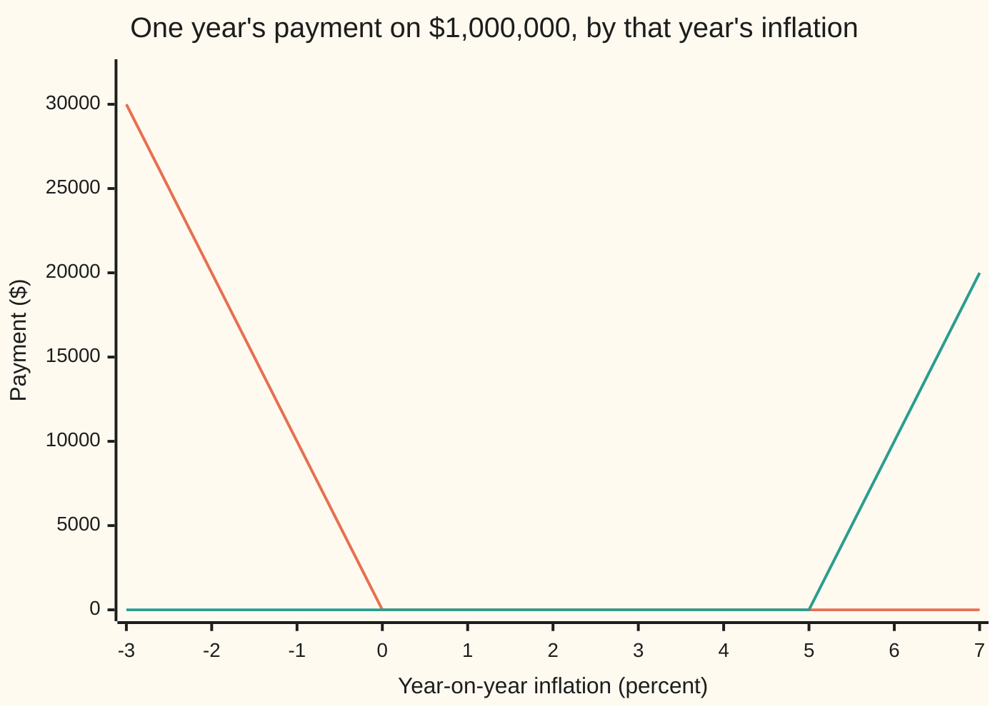
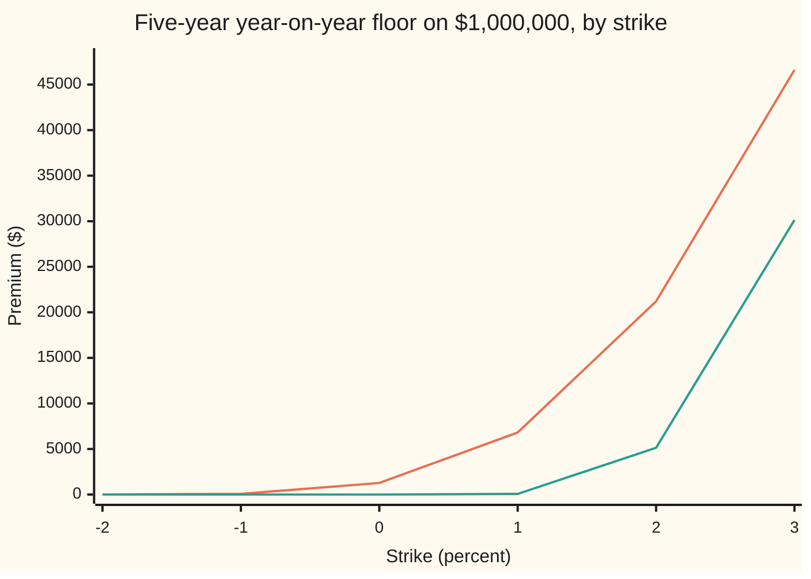

# Inflation caps and floors in outline: year-on-year options priced with a shifted Black formula

[Syllabus](../../../SYLLABUS.md) → [Financial mathematics](../../../SYLLABUS.md#w12) → [Inflation and Real Rates](../../../SYLLABUS.md#w12-s34) → Inflation caps and floors in outline

---

## General Overview

A contract pays each year's inflation on one million dollars, for five years. Each year's number is read the same way: the consumer price index at the year's end, divided by its level a year earlier, minus one. Prices up 2.5 percent pays $25,000. Prices down 1 percent would make the payment negative, minus $10,000, and the holder would owe money.

A **floor** at 0 percent removes that. In any year the price index falls, the floor pays $10,000 for each percentage point of the fall; in any year it rises, the floor pays nothing. Each year's piece is called a **floorlet**. The mirror image, paying for each point above a level, is a **cap**, made of **caplets**. Both are written on the **year-on-year rate**: the percentage change in the index over one year.

The market on this shelf expects 2.5 percent a year: the breakeven that sits between a 1 percent real yield and the nominal one ([Breakeven inflation](03-breakeven-inflation.md)). A fall below zero is 2.5 points away. Not likely, not impossible: US consumer prices were lower in the middle of 2009 than a year before.

Hand this floor to Black's formula and the answer is exactly $0.00. Black's model moves the rate in percentage steps, so the rate never reaches zero, and insurance against reaching it is free. The repair is the one from the shifted-lognormal card: slide the rate and the strike up by the same amount, 3 percentage points here, and run Black on the slid pair. The model now has a wall at −3 percent instead of at zero. At a 20 percent volatility the five-year floor costs **$1,268.01**. A 5 percent cap on the same contract costs **$7,264.41**.

**A year-on-year floor is a row of one-year puts on the inflation rate: slide rate and strike up by the same amount, price each put with Black's formula on the slid pair, discount at the nominal rate, and add; what the outline leaves out is a correction to the expected rate, a volatility for every strike, and a link between the years.**

**What kind of fact this is:** a model, since a shifted lognormal inflation rate is a desk's choice, not a law; inside it the premium is a theorem, proved in Why it works, and the forward it uses carries an error that is sized in Step 4.

### The picture: what one year's options pay



The line falling to the right is the 0 percent floorlet: $30,000 if prices fall 3 percent. The line rising at the right is the 5 percent caplet, $10,000 a point above 5 percent. The expected 2.5 percent sits in the flat middle, where neither pays.

---

## The formula

Notation first, in words. $y_i$ is the **year-on-year rate** for year $i$: the index at the end of year $i$ over the index at its start, minus one. $M$ is the notional, $n$ the number of yearly fixings, and $T_i$ the date, in years, when year $i$ fixes and pays. $F$ is the **forward** year-on-year rate: what the market expects $y_i$ to be, read from inflation swaps. $K$ is the strike. $a$ is the **shift**, slid onto rate and strike alike; the slid pair get their own letters, $G = F + a$ and $L = K + a$. $\sigma$, say "sigma", is the volatility of the slid rate, a yearly fraction of itself, and $w = \sigma\sqrt{T_i}$ is one **wiggle unit** for year $i$. $D(T)$ is the **discount factor**: what one dollar paid at time $T$ costs today, $(1 + r_N)^{-T}$ with $r_N$ the nominal yearly rate. $N(x)$ is the bell-curve area left of $x$, a chance between 0 and 1. The sign $\sum_{i=1}^{n}$ means "add the terms for $i = 1, 2, \ldots, n$".

$$P = \sum_{i=1}^{n} M\,D(T_i)\,\bigl[\,L\,N(-d_{2,i}) - G\,N(-d_{1,i})\,\bigr], \qquad C = \sum_{i=1}^{n} M\,D(T_i)\,\bigl[\,G\,N(d_{1,i}) - L\,N(d_{2,i})\,\bigr]$$

**Read it aloud:** the floor is a sum of Black puts, one per year, each on the slid inflation rate against the slid strike, each discounted from its own payment date; the cap is the same sum of calls.

$$d_{1,i} = \frac{\ln(G/L) + \tfrac12\sigma^2 T_i}{\sigma\sqrt{T_i}}, \qquad d_{2,i} = d_{1,i} - \sigma\sqrt{T_i}$$

$d_{1,i}$ counts how many wiggle units the slid rate sits above the slid strike, plus half a unit; $d_{2,i}$ is one unit lower. They carry the year's index $i$ because the wiggle unit grows with the wait.

One identity ties cap and floor together, at any single strike:

$$C - P = \sum_{i=1}^{n} M\,D(T_i)\,(F - K)$$

**Read it aloud:** owning the cap and owing the floor at the same strike pays $y_i - K$ every year, which is an inflation swap, and a swap needs no volatility at all.

| Symbol | Plain meaning | In our example | Push it up and the floor… |
| --- | --- | --- | --- |
| $P$, $C$ | the premium of the floor and of the cap | $1,268.01 at 0 percent; $7,264.41 at 5 percent | — |
| $y_i$, $I(t)$ | year $i$'s inflation rate, and the price index it is read from | unknown today | — |
| $M$, $n$, $i$, $T_i$, $T$ | notional, number of yearly fixings, the year's count, year $i$'s fixing-and-payment date, a time in years | $1,000,000; 5; 1 to 5; 1 to 5 years | more fixings: dearer, each added year the dearest so far |
| $F$, $b$ | the forward year-on-year rate, and the zero-coupon breakeven it comes from | 2.5 percent; 2.5 percent | falls by $12.15 per basis point |
| $K$ | the strike | 0 percent for the floor, 5 percent for the cap | rises: $76.33 at −1 percent, $6,809.72 at +1 percent |
| $a$ | the shift; the model's wall sits at $-a$ | 3 percent | with $\sigma$ held, rises: $6.96 at a 1 percent shift |
| $G$, $L$ | the slid rate $F + a$ and slid strike $K + a$ | 5.5 percent and 3 percent | — |
| $\sigma$, $w$ | the slid rate's volatility, and one wiggle unit $\sigma\sqrt{T_i}$ | 20 percent; 0.447214 in year 5 | rises by $283.16 per volatility point |
| $D(T)$, $r_N$ | the nominal discount factor $(1 + r_N)^{-T}$, and the nominal yearly rate | $D(5) = 0.840957$; 3.525 percent | rises in proportion to $D$, so falls as $r_N$ rises |
| $N(x)$, $\phi(x)$ | the bell-curve area left of $x$, and the curve's height at $x$ | $N(-d_{2,5}) = 0.128869$ | — |
| $d_1$, $d_2$ | the two cut-offs, in wiggle units, for one year | 1.578968 and 1.131754 in year 5 | — |
| $\rho$, $v_I$, $v_P$, $P_R$, $J$ | Step 4's correlation, the spreads of the index and of a future real bond price, that bond price, and the index at the year's start | 0.5; each $0.01\sqrt{T_{i-1}}$ | — |

The nominal rate comes from the shelf's first card, the Fisher relation: $1 + r_N = 1.01 \times 1.025$, so 3.525 percent ([Real rates](01-real-rates-and-the-fisher-equation.md)).

### When it holds

- **Each year's slid rate is lognormal with one volatility.** An assumption. Move $\sigma$ from 20 to 30 percent and the floor goes from $1,268.01 to $5,649.28; the answer is mostly volatility.
- **The wall at $-a$ is below anything that can happen.** The model gives zero chance to inflation below −3 percent. A floor struck near the wall is priced mostly by that choice.
- **The forward is the zero-coupon breakeven, uncorrected.** Exact only if the index and future real rates move independently. Step 4 sizes the error: 2.05 basis points on year 5 here, 9.73 on year 20.
- **Uncertainty runs to the fixing date.** Year $i$'s rate depends on the index at $T_i$, so its wiggle unit uses $T_i$. Cutting it at the start of the year halves the floor, to $638.64.
- **Payment on the fixing date, discounted at the nominal rate.** The cash is dollars. Discounting at the real rate gives $1,407.47.

**Conventions verified 28 Sep 2026:** US Treasury inflation-protected bonds repay the greater of the inflation-adjusted principal and the original principal (TreasuryDirect). Real contracts read the index with a publication lag of some months; this card ignores the lag and reads each fixing on its own date. Rates are yearly compounded, $T$ in years.

---

## Why it works

### Step 0: a floor is a row of separate one-year options

Each floorlet pays on one year's rate and nothing else. The price of a sum of payments is the sum of their prices, since anything else could be bought in pieces and sold whole for a riskless profit. So the floor's price is the five floorlet prices added. Nothing about how the years relate to each other enters. That is what makes an outline possible, and it is also the first thing a proper model has to put back (Step 5).

### Step 1: the forward rate comes from inflation swaps

A zero-coupon inflation swap fixes today the growth $(1 + b)^{T}$ that the index is expected to show by time $T$ ([Inflation swaps](04-zero-coupon-inflation-swaps.md)). Divide the expected growth to the end of year $i$ by the growth to its start:

$$1 + F_i \approx \frac{(1 + b)^{T_i}}{(1 + b)^{T_{i-1}}}$$

On a flat 2.5 percent breakeven every year's forward is 2.5 percent. The sign is "approximately", on purpose. The ratio of two averages is not the average of a ratio; Step 4 prices the gap.

### Step 2: slide the rate so it may go below zero

Black's rule moves a quantity in percentage steps, so it stays above zero forever. Inflation does not. At a zero strike, plain Black returns $0.00 for the whole floor, while the floorlets are real insurance.

The slide from [Shifted lognormal and volatility conversion](../05-Black-Scholes%20from%20the%20Ground%20Up/08-shifted-lognormal-and-volatility-conversion.md) fixes it. The floorlet pays $\max(K - y_i, 0)$. Add $a$ to both: $\max\bigl(L - (y_i + a), 0\bigr)$. Same payment at every outcome, since only the gap enters. The model assumption moves onto $y_i + a$, which is taken to be lognormal and fair on average:

$$y_i + a = G\,\exp\!\left(-\tfrac12 w^2 + w Z\right), \qquad Z \ \text{a standard bell-curve draw}$$

The $-\tfrac12 w^2$ is the drag that keeps the average at $G$, so the average of $y_i$ is $F$, the swap market's number. The smallest $y_i$ can be is $-a$: the wall.

### Step 3: average the payment, discount it, add up the years

A floorlet is a put on $y_i + a$ with strike $L$. Average its payment over the bell curve and discount from $T_i$: that is Black's put on the slid pair, the bracket in the formula. The folded proof does the integral. The five years, one block per $15:

```
floorlet premiums, 0 percent strike, $1,000,000 notional, one block = $15
year 1   ▏                                             $2.68
year 2   ████                                          $61.04
year 3   █████████████▌                                $202.92
year 4   ██████████████████████████▎                   $394.52
year 5   ████████████████████████████████████████▍     $606.85
```

Year 1 is almost free: one year is little time for the slid rate to fall from 5.5 to 3 percent at a 20 percent volatility. By year 5 the wiggle unit is $\sqrt 5$ times as wide, and that outweighs the extra discounting. The sum is $1,268.01, and the last two years carry most of it.

<details>
<summary>Detailed proof: the floorlet integral, and parity</summary>

Write $g(z) = G e^{-w^2/2 + wz}$ for the slid rate at draw $z$. The floorlet pays where $g(z) < L$, that is where $z < \left[\ln(L/G) + \tfrac12 w^2\right]/w = -d_2$. So its undiscounted value is
$$\int_{-\infty}^{-d_2}\bigl(L - g(z)\bigr)\,\phi(z)\,\mathrm{d}z .$$
The strike piece is $L$ times the area left of $-d_2$, which is $L\,N(-d_2)$. For the rate piece, complete the square: $e^{-w^2/2 + wz}\phi(z) = \phi(z - w)$, the same curve moved right by $w$. Substituting $u = z - w$ moves the upper limit to $-d_2 - w = -d_1$, so that piece is $G\,N(-d_1)$. Multiply by $M\,D(T_i)$ and sum over the years: that is $P$. The cap integrates above $-d_2$ and gives $C$.

Parity: at one strike, $\max(y - K, 0) - \max(K - y, 0) = y - K$ at every outcome. Its average is $F - K$ because the drag keeps the mean of $y_i$ at $F$. Discount and sum. The check prices the cap by its own integral and lands on the swap value, $112,796.43, to the printed digit.

</details>

### Step 4: what the outline leaves out, sized

Look at what year $i$'s payment $1 + y_i$ is worth at the start of that year, $T_{i-1}$. The index at $T_{i-1}$ is known by then. A claim on the index one year later, divided by a known number, is a one-year **real bond**: a bond whose repayment rises with prices. Its price at $T_{i-1}$, written $P_R$, depends on real interest rates at that future date, which are unknown today.

Zero-coupon swaps price only the product: the index at $T_{i-1}$ times that future bond price, which together make a bond maturing at $T_i$. Dividing out the index's average leaves the bond price's average only when the two are uncorrelated. If they tend to rise together, the product's average is lifted by that, and the bond price's own average is lower than the ratio says.

In a toy with the nominal rate fixed and the index and the future real bond price both lognormal, the fix is one factor:

$$1 + F_i = (1 + b)\,e^{-\rho\,v_I\,v_P}$$

Here $\rho$ is the correlation between the index at $T_{i-1}$ and the real bond price then, and $v_I$ and $v_P$ are their spreads, each $0.01\sqrt{T_{i-1}}$ at a 1 percent yearly volatility. In year 1 the start-of-year index is today's, so $v_I = 0$ and nothing changes. With $\rho = 0.5$ the year-5 forward drops to 2.479502 percent, 2.05 basis points down, and a year-20 fixing drops 9.73 basis points. Reprice the floor on the corrected forwards: $1,286.83 instead of $1,268.01. The sign follows $\rho$; a negative correlation raises the forwards instead.

<details>
<summary>Detailed proof: the convexity factor</summary>

Fix nominal rates, so the nominal discount factors are known numbers, and write $\mathbb{E}$ for the average under the pricing measure. Write $J = I(T_{i-1})$ for the index at the start of year $i$ and $P_R$ for the price then of the one-year real bond.

Three facts. The payment $1 + y_i$ at $T_i$ is worth $P_R$ at $T_{i-1}$, so $1 + F_i = \dfrac{D(T_{i-1})}{D(T_i)}\,\mathbb{E}[P_R]$. The real bond to $T_{i-1}$ gives $D(T_{i-1})\,\mathbb{E}[J] = I(0)\,P_R(0, T_{i-1})$. The real bond to $T_i$, held to $T_{i-1}$, is worth $J P_R$ then, so $D(T_{i-1})\,\mathbb{E}[J P_R] = I(0)\,P_R(0, T_i)$.

For two lognormal quantities with log-spreads $v_I$, $v_P$ and correlation $\rho$, $\mathbb{E}[J P_R] = \mathbb{E}[J]\,\mathbb{E}[P_R]\,e^{\rho v_I v_P}$: complete the square in the joint bell curve. Solve for $\mathbb{E}[P_R]$ from the last two facts, put it in the first, and use $P_R(0,T)/D(T) = (1+b)^T$ from the swap card:
$$1 + F_i = \frac{P_R(0,T_i)}{P_R(0,T_{i-1})}\,\frac{D(T_{i-1})}{D(T_i)}\,e^{-\rho v_I v_P} = (1 + b)\,e^{-\rho v_I v_P}.$$
The check computes $\mathbb{E}\bigl[e^{v_I z_1 - v_I^2/2}\,e^{v_P z_2 - v_P^2/2}\bigr]$ for correlated draws by a two-dimensional Simpson sum, with no completed square, and gets 1.000950 for year 20, matching $e^{\rho v_I v_P}$.

</details>

### Step 5: the rest of a proper model

Four more things the outline takes as given.

- **A volatility for each expiry and strike.** One $\sigma$ and one $a$ fit one price. Quotes at several strikes need a smile model ([SABR for rates](../29-Caps%2C%20Floors%20and%20Swaptions/07-sabr-for-rates-and-the-volatility-cube.md)).
- **How the years move together.** The floor does not care, by Step 0. A zero-coupon floor does: the principal guarantee on an inflation-linked bond pays only if the index ends below where it started, a single option on five years of inflation combined ([Inflation-linked bonds](02-inflation-linked-bonds.md)). Its price needs the correlations between years, which year-on-year quotes never reveal.
- **One model for both kinds of quote.** Jarrow and Yildirim (2003) model nominal rates, real rates and the index together, which produces the Step 4 correction from the full curves; Mercurio (2005) builds market models directly on year-on-year forwards.
- **The index itself.** Monthly publication, a lag of months, and seasonal patterns within the year, none of which a flat 2.5 percent carries.

The alternative road for Step 2 is the normal model, where the rate itself is bell-curved and has no wall at all ([Bachelier](../05-Black-Scholes%20from%20the%20Ground%20Up/07-bachelier-model.md)). At this shift, 20 percent on a 5.5 percent slid rate is a wobble of about 1.1 percentage points a year in the normal model's units.

---

## Worked numbers, by hand

Year 5's floorlet, at a 0 percent strike, on $1,000,000: forward 2.5 percent, shift 3 percent, volatility 20 percent, nominal rate 3.525 percent.

| Step | Arithmetic | Value |
| --- | --- | --- |
| discount factor $D(5)$ | $1.03525^{-5}$ | 0.840957 |
| slid rate $G$ | $2.5 + 3$ | 5.5 percent |
| slid strike $L$ | $0 + 3$ | 3 percent |
| wiggle unit $w$ | $0.20 \times \sqrt 5$ | 0.447214 |
| $d_1$ | $\bigl(\ln(5.5/3) + \tfrac12 \times 0.2^2 \times 5\bigr)/0.447214$ | 1.578968 |
| $d_2$ | $1.578968 - 0.447214$ | 1.131754 |
| $N(-d_2)$ | bell-curve area left of $-1.131754$ | 0.128869 |
| $N(-d_1)$ | bell-curve area left of $-1.578968$ | 0.057172 |
| floorlet | $1{,}000{,}000 \times 0.840957 \times (0.03 \times 0.128869 - 0.055 \times 0.057172)$ | $606.85 |
| four earlier years | years 1 to 4, the same way | $2.68, $61.04, $202.92, $394.52 |
| **five-year floor** | sum of the five | **$1,268.01** |
| the 5 percent cap, same way | calls in place of puts | **$7,264.41** |

Protection against any year of falling prices, five years long, costs $1,268.01 on a million dollars. The cap costs far more, because 5 percent is 2.5 points above the forward and 0 percent is 2.5 points below it, and a lognormal slid rate stretches further up than down.

### The Greeks

| Greek | What it measures | Formula | By bump |
| --- | --- | --- | --- |
| delta | change in the floor for a 1 basis point rise in every year's forward | −$12.15 | −$12.15 |
| vega | change in the floor for a 1 point rise in volatility | $283.16 | $283.16 |

Delta is $-M D(T_i) N(-d_{1,i})$ per unit of rate, summed; vega is $M D(T_i) G \sqrt{T_i}\,\phi(d_{1,i})$, summed. A floor this far **out of the money**, its strike well below the forward, is a position in volatility more than in the forward.

### The floor by strike



The upper line is the shifted model, 20 percent at a 3 percent shift: $0.16 at −2 percent, $1,268.01 at zero, $46,611.09 at 3 percent. The lower line is plain Black at the same 20 percent: nothing at or below zero, and far less everywhere, because the same volatility number means a smaller wobble on an unslid 2.5 percent rate.

### What breaks if you drop a piece

Correct answer: $1,268.01.

| Mistake | Comes out at | What went wrong |
| --- | --- | --- |
| Plain Black, no shift | $0.00 | The model forbids the rate from ever falling to zero, so a zero-strike floor is free |
| Wiggle unit cut at the start of each year, $\sigma\sqrt{T_{i-1}}$ | $638.64 | Year $i$ fixes on the index at $T_i$; the first floorlet loses all its uncertainty and every later one a year of it |
| The 20 percent quote used at a 1 percent shift | $6.96 | A shifted volatility belongs to its shift; the same 20 percent on a 3.5 percent slid rate is a far smaller wobble |
| Strike slid, rate not: Black on 2.5 against 3 percent | $30,132.98 | The payoff changed: this is a floor struck at 3 percent on the unslid rate, far too dear |
| Discounted at the 1 percent real rate | $1,407.47 | The floor pays dollars, not index-linked dollars; dollar cash is discounted at the nominal rate |

---

## Code, from first principles, and it actually runs

The floor is priced by **three independent roads** and one identity: Black's formula on the slid pair; the payoff averaged over the bell curve by Simpson's rule, kink found by bisection, no $d_1$ or $d_2$; a 2,000-step coin-flip tree; and parity against a cap priced by its own integral. Greeks come by formula and by bumping, the Step 4 factor in closed form and by a two-dimensional Simpson sum. Python takes the bell-curve area from `math.erf`; Rust, which has no `erf`, adds up thin slices under the curve.

### Python

```python
# A 0% floor and a 5% cap on year-on-year inflation, five yearly fixings, shifted Black.
# Roads: the formula; the payoff averaged over the bell curve; a coin-flip tree; parity.
from math import erf, exp, log, sqrt, pi

def N(x): return 0.5 * (1.0 + erf(x / sqrt(2.0)))
def phi(x): return exp(-0.5 * x * x) / sqrt(2.0 * pi)

M = 1_000_000.0                 # notional, dollars
F, A, SIG = 0.025, 0.03, 0.20   # forward YoY rate, shift, shifted volatility
NOM = 1.01 * 1.025 - 1.0        # nominal yearly rate from 1% real and 2.5% breakeven
YEARS = (1, 2, 3, 4, 5)
def D(t): return (1.0 + NOM) ** (-t)

def black(g, l, w, put):        # Black-76 on the slid pair, undiscounted
    if l <= 0.0: return 0.0 if put else g - l
    if w <= 0.0: return max(l - g, 0.0) if put else max(g - l, 0.0)
    d1 = (log(g / l) + 0.5 * w * w) / w
    d2 = d1 - w
    return l * N(-d2) - g * N(-d1) if put else g * N(d1) - l * N(d2)

def let_(k, t, put, f=F, a=A, sig=SIG, tv=None, disc=D):
    tv = t if tv is None else tv
    return M * disc(t) * black(f + a, k + a, sig * sqrt(tv), put)

def book(k, put, **kw): return sum(let_(k, t, put, **kw) for t in YEARS)

def simpson(fn, lo, hi, n=2000):
    h = (hi - lo) / n
    s = fn(lo) + fn(hi) + sum((4 if i % 2 else 2) * fn(lo + i * h) for i in range(1, n))
    return s * h / 3.0

def let_integral(k, t, put):    # average the payoff over the bell curve; kink found by bisection
    w = SIG * sqrt(t)
    y = lambda z: (F + A) * exp(-0.5 * w * w + w * z) - A          # the YoY fixing at draw z
    pay = lambda z: (max(k - y(z), 0.0) if put else max(y(z) - k, 0.0)) * phi(z)
    lo, hi = -12.0, 12.0
    for _ in range(200):
        mid = 0.5 * (lo + hi)
        lo, hi = (mid, hi) if y(mid) < k else (lo, mid)
    return M * D(t) * (simpson(pay, -12.0, lo) + simpson(pay, lo, 12.0))

def let_tree(k, t, put, n=2000):   # drift-free coin-flip tree on the slid rate
    u = exp(SIG * sqrt(t / n)); p = (1.0 - 1.0 / u) / (u - 1.0 / u)
    lw, tot = n * log(1.0 - p), 0.0
    for j in range(n + 1):
        y = (F + A) * u ** (2 * j - n) - A
        tot += exp(lw) * (max(k - y, 0.0) if put else max(y - k, 0.0))
        lw += log((n - j) / (j + 1)) + log(p / (1.0 - p)) if j < n else 0.0
    return M * D(t) * tot

fl = [let_(0.0, t, True) for t in YEARS]
fl_int = [let_integral(0.0, t, True) for t in YEARS]
fl_tree = [let_tree(0.0, t, True) for t in YEARS]
cap5 = book(0.05, False)
cap5_int = sum(let_integral(0.05, t, False) for t in YEARS)
cap0_int = sum(let_integral(0.0, t, False) for t in YEARS)
swap = sum(M * D(t) * (F - 0.0) for t in YEARS)

g, l, w5 = F + A, A, SIG * sqrt(5.0)
d1 = (log(g / l) + 0.5 * w5 * w5) / w5; d2 = d1 - w5
bp, vp = 1e-4, 0.01
delta_an = sum(-M * D(t) * N(-(log(g / l) + 0.5 * SIG * SIG * t) / (SIG * sqrt(t))) * bp for t in YEARS)
delta_bump = (book(0.0, True, f=F + bp / 10) - book(0.0, True, f=F - bp / 10)) * 5.0
vega_an = sum(M * D(t) * g * sqrt(t) * phi((log(g / l) + 0.5 * SIG * SIG * t) / (SIG * sqrt(t))) * vp for t in YEARS)
vega_bump = (book(0.0, True, sig=SIG + vp / 10) - book(0.0, True, sig=SIG - vp / 10)) * 5.0

# convexity: YoY forward = (1 + b) exp(-rho vI vP) - 1, with vI vP = sI sR T(i-1); second road by 2D Simpson
SI, SR, RHO = 0.01, 0.01, 0.5
def fwd_adj(t, rho=RHO): return (1.0 + F) * exp(-rho * SI * SR * (t - 1)) - 1.0
def joint_mean(vi, vp, rho, n=240):   # E[exp(vi z1 - vi^2/2) exp(vp z2 - vp^2/2)], corr(z1, z2) = rho
    c = sqrt(1.0 - rho * rho)
    inner = lambda z1: simpson(lambda e: exp(vp * (rho * z1 + c * e) - 0.5 * vp * vp) * phi(e), -9.0, 9.0, n)
    return simpson(lambda z1: exp(vi * z1 - 0.5 * vi * vi) * phi(z1) * inner(z1), -9.0, 9.0, n)
v19 = SI * sqrt(19.0) * SR * sqrt(19.0)
jm20 = joint_mean(SI * sqrt(19.0), SR * sqrt(19.0), RHO)
fl_adj = sum(let_(0.0, t, True, f=fwd_adj(t)) for t in YEARS)

print(f"inputs: forward {100 * F:.2f} pct, shift {100 * A:.2f} pct, vol {100 * SIG:.2f} pct, notional {M:.0f}")
print(f"toy: index vol {100 * SI:.2f} pct, real-rate vol {100 * SR:.2f} pct, rho {RHO:.2f}")
rows = [
    ("nominal rate from Fisher, pct", 100 * NOM), ("D(5), dollars per dollar", D(5)),
    ("year 5: G, pct", 100 * g), ("year 5: L, pct", 100 * l), ("year 5: w", w5),
    ("year 5: d1", d1), ("year 5: d2", d2), ("year 5: N(-d2)", N(-d2)), ("year 5: N(-d1)", N(-d1)),
    ("napkin normal vol, G sigma, pct", 100 * g * SIG),
    *[(f"1 floorlet year {t}, formula, $", v) for t, v in zip(YEARS, fl)],
    ("1 floor 0%, formula, $", sum(fl)), ("2 floor 0%, payoff average, $", sum(fl_int)),
    ("3 floor 0%, tree 2000 steps, $", sum(fl_tree)),
    ("  cap 5%, formula, $", cap5), ("  cap 5%, payoff average, $", cap5_int),
    ("  collar: 0% floor minus 5% cap, $", sum(fl) - cap5),
    ("4 cap 0% minus floor 0%, $", cap0_int - sum(fl)), ("  swap: sum D(t) (F - 0), $", swap),
    ("delta per 1 bp of F, formula, $", delta_an), ("delta per 1 bp of F, bump, $", delta_bump),
    ("vega per vol point, formula, $", vega_an), ("vega per vol point, bump, $", vega_bump),
    ("plain Black, no shift, floor 0%, $", book(0.0, True, a=0.0)),
    ("convexity: year 5 forward, pct", 100 * fwd_adj(5)),
    ("convexity: year 5 shift, bp", 1e4 * (fwd_adj(5) - F)),
    ("convexity: year 20 shift, bp", 1e4 * (fwd_adj(20) - F)),
    ("  factor exp(rho vI vP), year 20", exp(RHO * v19)),
    ("  the same by 2D Simpson", jm20),
    ("  floor 0% on adjusted forwards, $", fl_adj),
    ("wrong: vol run to start of year, $", sum(let_(0.0, t, True, tv=t - 1) for t in YEARS)),
    ("wrong: strike slid, rate not, $", sum(M * D(t) * black(F, A, SIG * sqrt(t), True) for t in YEARS)),
    ("wrong: 20% vol used at a 1% shift, $", book(0.0, True, a=0.01)),
    ("wrong: discounted at the 1% real rate, $", book(0.0, True, disc=lambda t: 1.01 ** (-t))),
    ("try: sigma = 30%, $", book(0.0, True, sig=0.30)),
    ("try: forward 1%, $", book(0.0, True, f=0.01)),
    ("try: strike -1%, $", book(-0.01, True)),
]
for name, v in rows:
    print(f"{name:<42} {v:>14.6f}")
print("bars, floorlets by year, $       " + " ".join(f"{v:>9.2f}" for v in fl))
xs = [-3, -2, -1, 0, 1, 2, 3, 4, 5, 6, 7]
print("chart, YoY inflation pct          " + " ".join(f"{x:>6d}" for x in xs))
print("chart, floorlet pays $            " + " ".join(f"{M * max(-x / 100, 0.0):>6.0f}" for x in xs))
print("chart, 5% caplet pays $           " + " ".join(f"{M * max(x / 100 - 0.05, 0.0):>6.0f}" for x in xs))
ks = [-0.02, -0.01, 0.0, 0.01, 0.02, 0.03]
print("chart, floor strike pct    " + " ".join(f"{100 * k:>9.0f}" for k in ks))
print("chart, shifted, $          " + " ".join(f"{book(k, True):>9.2f}" for k in ks))
print("chart, plain Black, $      " + " ".join(f"{book(k, True, a=0.0):>9.2f}" for k in ks))

assert abs(sum(fl_int) - sum(fl)) < 1e-6, "payoff average must land on the formula"
assert abs(sum(fl_tree) - sum(fl)) < 1.0, "tree within a dollar"
assert abs(cap5_int - cap5) < 1e-6, "cap by integral vs formula"
assert abs((cap0_int - sum(fl)) - swap) < 1e-6, "cap minus floor at one strike is the swap"
assert abs(delta_an - delta_bump) < 1e-4, "delta by bump"
assert abs(vega_an - vega_bump) < 0.005, "vega by bump"
assert abs(jm20 - exp(RHO * v19)) < 1e-10, "convexity factor"
assert abs((1.0 + F) / jm20 - 1.0 - fwd_adj(20)) < 1e-10, "year-20 forward by 2D Simpson"
print("ALL CHECKS PASS")
```

**Ran 2026-09-28 on macOS, Python 3.14.6, standard library only. All checks passed. Output, pasted from the run:**

```
inputs: forward 2.50 pct, shift 3.00 pct, vol 20.00 pct, notional 1000000
toy: index vol 1.00 pct, real-rate vol 1.00 pct, rho 0.50
nominal rate from Fisher, pct                    3.525000
D(5), dollars per dollar                         0.840957
year 5: G, pct                                   5.500000
year 5: L, pct                                   3.000000
year 5: w                                        0.447214
year 5: d1                                       1.578968
year 5: d2                                       1.131754
year 5: N(-d2)                                   0.128869
year 5: N(-d1)                                   0.057172
napkin normal vol, G sigma, pct                  1.100000
1 floorlet year 1, formula, $                    2.678169
1 floorlet year 2, formula, $                   61.035718
1 floorlet year 3, formula, $                  202.923168
1 floorlet year 4, formula, $                  394.517013
1 floorlet year 5, formula, $                  606.853181
1 floor 0%, formula, $                        1268.007249
2 floor 0%, payoff average, $                 1268.007249
3 floor 0%, tree 2000 steps, $                1267.547296
  cap 5%, formula, $                          7264.408207
  cap 5%, payoff average, $                   7264.408207
  collar: 0% floor minus 5% cap, $           -5996.400957
4 cap 0% minus floor 0%, $                  112796.434394
  swap: sum D(t) (F - 0), $                 112796.434394
delta per 1 bp of F, formula, $                -12.145832
delta per 1 bp of F, bump, $                   -12.145834
vega per vol point, formula, $                 283.157066
vega per vol point, bump, $                    283.156222
plain Black, no shift, floor 0%, $               0.000000
convexity: year 5 forward, pct                   2.479502
convexity: year 5 shift, bp                     -2.049795
convexity: year 20 shift, bp                    -9.732876
  factor exp(rho vI vP), year 20                 1.000950
  the same by 2D Simpson                         1.000950
  floor 0% on adjusted forwards, $            1286.831430
wrong: vol run to start of year, $             638.641940
wrong: strike slid, rate not, $              30132.976204
wrong: 20% vol used at a 1% shift, $             6.958993
wrong: discounted at the 1% real rate, $      1407.468469
try: sigma = 30%, $                           5649.282006
try: forward 1%, $                            5846.114816
try: strike -1%, $                              76.329320
bars, floorlets by year, $            2.68     61.04    202.92    394.52    606.85
chart, YoY inflation pct              -3     -2     -1      0      1      2      3      4      5      6      7
chart, floorlet pays $             30000  20000  10000      0      0      0      0      0      0      0      0
chart, 5% caplet pays $                0      0      0      0      0      0      0      0      0  10000  20000
chart, floor strike pct           -2        -1         0         1         2         3
chart, shifted, $               0.16     76.33   1268.01   6809.72  21206.08  46611.09
chart, plain Black, $           0.00      0.00      0.00     70.60   5127.78  30132.98
ALL CHECKS PASS
```

The integral lands on the formula at every printed digit; the tree is 46 cents short on the floor and closes as steps are added.

### Rust

Same inputs, same labels, no crates.

```rust
// A 0% floor and a 5% cap on year-on-year inflation, five yearly fixings, shifted Black.
// Roads: the formula; the payoff averaged over the bell curve; a coin-flip tree; parity.
// Rust has no erf, so the bell-curve area is built by Simpson slices under the curve.
const M: f64 = 1_000_000.0;
const F: f64 = 0.025;
const A: f64 = 0.03;
const SIG: f64 = 0.20;
const YEARS: [f64; 5] = [1.0, 2.0, 3.0, 4.0, 5.0];
const SI: f64 = 0.01;
const SR: f64 = 0.01;
const RHO: f64 = 0.5;

fn nom() -> f64 { 1.01 * 1.025 - 1.0 }
fn disc(t: f64) -> f64 { (1.0 + nom()).powf(-t) }
fn real_disc(t: f64) -> f64 { 1.01f64.powf(-t) }
fn phi(x: f64) -> f64 { (-0.5 * x * x).exp() / (2.0 * std::f64::consts::PI).sqrt() }

fn simpson<G: Fn(f64) -> f64>(f: G, lo: f64, hi: f64, n: usize) -> f64 {
    let h = (hi - lo) / n as f64;
    let mut s = f(lo) + f(hi);
    for i in 1..n { s += if i % 2 == 1 { 4.0 } else { 2.0 } * f(lo + i as f64 * h); }
    s * h / 3.0
}

fn ncdf(x: f64) -> f64 {
    if x.abs() > 12.0 { return if x > 0.0 { 1.0 } else { 0.0 }; }
    let half = simpson(phi, 0.0, x.abs(), 4000);
    if x >= 0.0 { 0.5 + half } else { 0.5 - half }
}

fn black(g: f64, l: f64, w: f64, put: bool) -> f64 {
    if l <= 0.0 { return if put { 0.0 } else { g - l }; }
    if w <= 0.0 { return if put { (l - g).max(0.0) } else { (g - l).max(0.0) }; }
    let d1 = ((g / l).ln() + 0.5 * w * w) / w;
    let d2 = d1 - w;
    if put { l * ncdf(-d2) - g * ncdf(-d1) } else { g * ncdf(d1) - l * ncdf(d2) }
}

// one option on one fixing: strike k, payment year t, forward f, shift a, vol sig, vol time tv, discount curve
fn let_(k: f64, t: f64, put: bool, f: f64, a: f64, sig: f64, tv: f64, dc: fn(f64) -> f64) -> f64 {
    M * dc(t) * black(f + a, k + a, sig * tv.sqrt(), put)
}
fn book(k: f64, put: bool, f: f64, a: f64, sig: f64) -> f64 {
    YEARS.iter().map(|&t| let_(k, t, put, f, a, sig, t, disc)).sum()
}

fn let_integral(k: f64, t: f64, put: bool) -> f64 {
    let w = SIG * t.sqrt();
    let y = |z: f64| (F + A) * (-0.5 * w * w + w * z).exp() - A;
    let pay = |z: f64| (if put { (k - y(z)).max(0.0) } else { (y(z) - k).max(0.0) }) * phi(z);
    let (mut lo, mut hi) = (-12.0f64, 12.0f64);
    for _ in 0..200 {
        let mid = 0.5 * (lo + hi);
        if y(mid) < k { lo = mid } else { hi = mid }
    }
    M * disc(t) * (simpson(&pay, -12.0, lo, 2000) + simpson(&pay, lo, 12.0, 2000))
}

fn let_tree(k: f64, t: f64, put: bool, n: i32) -> f64 {
    let u = (SIG * (t / n as f64).sqrt()).exp();
    let p = (1.0 - 1.0 / u) / (u - 1.0 / u);
    let (mut lw, mut tot) = (n as f64 * (1.0 - p).ln(), 0.0);
    for j in 0..=n {
        let y = (F + A) * u.powi(2 * j - n) - A;
        tot += lw.exp() * if put { (k - y).max(0.0) } else { (y - k).max(0.0) };
        if j < n { lw += ((n - j) as f64 / (j + 1) as f64).ln() + (p / (1.0 - p)).ln(); }
    }
    M * disc(t) * tot
}

fn fwd_adj(t: f64) -> f64 { (1.0 + F) * (-RHO * SI * SR * (t - 1.0)).exp() - 1.0 }
fn joint_mean(vi: f64, vp: f64, rho: f64, n: usize) -> f64 {
    let c = (1.0 - rho * rho).sqrt();
    let inner = |z1: f64| simpson(|e: f64| (vp * (rho * z1 + c * e) - 0.5 * vp * vp).exp() * phi(e), -9.0, 9.0, n);
    simpson(|z1: f64| (vi * z1 - 0.5 * vi * vi).exp() * phi(z1) * inner(z1), -9.0, 9.0, n)
}

fn main() {
    let fl: Vec<f64> = YEARS.iter().map(|&t| let_(0.0, t, true, F, A, SIG, t, disc)).collect();
    let fl_sum: f64 = fl.iter().sum();
    let fl_int: f64 = YEARS.iter().map(|&t| let_integral(0.0, t, true)).sum();
    let fl_tree: f64 = YEARS.iter().map(|&t| let_tree(0.0, t, true, 2000)).sum();
    let cap5 = book(0.05, false, F, A, SIG);
    let cap5_int: f64 = YEARS.iter().map(|&t| let_integral(0.05, t, false)).sum();
    let cap0_int: f64 = YEARS.iter().map(|&t| let_integral(0.0, t, false)).sum();
    let swap: f64 = YEARS.iter().map(|&t| M * disc(t) * (F - 0.0)).sum();

    let (g, l, w5) = (F + A, A, SIG * 5.0f64.sqrt());
    let d1 = ((g / l).ln() + 0.5 * w5 * w5) / w5;
    let d2 = d1 - w5;
    let (bp, vp) = (1e-4, 0.01);
    let dd1 = |t: f64| ((g / l).ln() + 0.5 * SIG * SIG * t) / (SIG * t.sqrt());
    let delta_an: f64 = YEARS.iter().map(|&t| -M * disc(t) * ncdf(-dd1(t)) * bp).sum();
    let delta_bump = (book(0.0, true, F + bp / 10.0, A, SIG) - book(0.0, true, F - bp / 10.0, A, SIG)) * 5.0;
    let vega_an: f64 = YEARS.iter().map(|&t| M * disc(t) * g * t.sqrt() * phi(dd1(t)) * vp).sum();
    let vega_bump = (book(0.0, true, F, A, SIG + vp / 10.0) - book(0.0, true, F, A, SIG - vp / 10.0)) * 5.0;

    let v19 = SI * 19.0f64.sqrt() * SR * 19.0f64.sqrt();
    let jm = joint_mean(SI * 19.0f64.sqrt(), SR * 19.0f64.sqrt(), RHO, 240);
    let fl_adj: f64 = YEARS.iter().map(|&t| let_(0.0, t, true, fwd_adj(t), A, SIG, t, disc)).sum();
    let start_of_year: f64 = YEARS.iter().map(|&t| let_(0.0, t, true, F, A, SIG, t - 1.0, disc)).sum();
    let strike_only: f64 = YEARS.iter().map(|&t| M * disc(t) * black(F, A, SIG * t.sqrt(), true)).sum();
    let real_dc: f64 = YEARS.iter().map(|&t| let_(0.0, t, true, F, A, SIG, t, real_disc)).sum();

    println!("inputs: forward {:.2} pct, shift {:.2} pct, vol {:.2} pct, notional {:.0}", 100.0 * F, 100.0 * A, 100.0 * SIG, M);
    println!("toy: index vol {:.2} pct, real-rate vol {:.2} pct, rho {:.2}", 100.0 * SI, 100.0 * SR, RHO);
    let mut rows: Vec<(String, f64)> = vec![
        ("nominal rate from Fisher, pct".into(), 100.0 * nom()), ("D(5), dollars per dollar".into(), disc(5.0)),
        ("year 5: G, pct".into(), 100.0 * g), ("year 5: L, pct".into(), 100.0 * l), ("year 5: w".into(), w5),
        ("year 5: d1".into(), d1), ("year 5: d2".into(), d2),
        ("year 5: N(-d2)".into(), ncdf(-d2)), ("year 5: N(-d1)".into(), ncdf(-d1)),
        ("napkin normal vol, G sigma, pct".into(), 100.0 * g * SIG),
    ];
    for (t, v) in YEARS.iter().zip(fl.iter()) { rows.push((format!("1 floorlet year {}, formula, $", t), *v)); }
    let more: Vec<(&str, f64)> = vec![
        ("1 floor 0%, formula, $", fl_sum), ("2 floor 0%, payoff average, $", fl_int),
        ("3 floor 0%, tree 2000 steps, $", fl_tree),
        ("  cap 5%, formula, $", cap5), ("  cap 5%, payoff average, $", cap5_int),
        ("  collar: 0% floor minus 5% cap, $", fl_sum - cap5),
        ("4 cap 0% minus floor 0%, $", cap0_int - fl_sum), ("  swap: sum D(t) (F - 0), $", swap),
        ("delta per 1 bp of F, formula, $", delta_an), ("delta per 1 bp of F, bump, $", delta_bump),
        ("vega per vol point, formula, $", vega_an), ("vega per vol point, bump, $", vega_bump),
        ("plain Black, no shift, floor 0%, $", book(0.0, true, F, 0.0, SIG)),
        ("convexity: year 5 forward, pct", 100.0 * fwd_adj(5.0)),
        ("convexity: year 5 shift, bp", 1e4 * (fwd_adj(5.0) - F)),
        ("convexity: year 20 shift, bp", 1e4 * (fwd_adj(20.0) - F)),
        ("  factor exp(rho vI vP), year 20", (RHO * v19).exp()),
        ("  the same by 2D Simpson", jm),
        ("  floor 0% on adjusted forwards, $", fl_adj),
        ("wrong: vol run to start of year, $", start_of_year),
        ("wrong: strike slid, rate not, $", strike_only),
        ("wrong: 20% vol used at a 1% shift, $", book(0.0, true, F, 0.01, SIG)),
        ("wrong: discounted at the 1% real rate, $", real_dc),
        ("try: sigma = 30%, $", book(0.0, true, F, A, 0.30)),
        ("try: forward 1%, $", book(0.0, true, 0.01, A, SIG)),
        ("try: strike -1%, $", book(-0.01, true, F, A, SIG)),
    ];
    for (n, v) in more { rows.push((n.to_string(), v)); }
    for (name, v) in &rows { println!("{:<42} {:>14.6}", name, v); }
    println!("bars, floorlets by year, $       {}", fl.iter().map(|v| format!("{:>9.2}", v)).collect::<Vec<_>>().join(" "));
    let xs = [-3i32, -2, -1, 0, 1, 2, 3, 4, 5, 6, 7];
    let line = |f: &dyn Fn(i32) -> String| xs.iter().map(|&x| f(x)).collect::<Vec<_>>().join(" ");
    println!("chart, YoY inflation pct          {}", line(&|x| format!("{:>6}", x)));
    println!("chart, floorlet pays $            {}", line(&|x| format!("{:>6.0}", M * (-(x as f64) / 100.0).max(0.0))));
    println!("chart, 5% caplet pays $           {}", line(&|x| format!("{:>6.0}", M * (x as f64 / 100.0 - 0.05).max(0.0))));
    let ks = [-0.02, -0.01, 0.0, 0.01, 0.02, 0.03];
    let kl = |f: &dyn Fn(f64) -> f64, p: usize| ks.iter().map(|&k| format!("{:>9.*}", p, f(k))).collect::<Vec<_>>().join(" ");
    println!("chart, floor strike pct    {}", kl(&|k| 100.0 * k, 0));
    println!("chart, shifted, $          {}", kl(&|k| book(k, true, F, A, SIG), 2));
    println!("chart, plain Black, $      {}", kl(&|k| book(k, true, F, 0.0, SIG), 2));

    assert!((fl_int - fl_sum).abs() < 1e-6, "payoff average must land on the formula");
    assert!((fl_tree - fl_sum).abs() < 1.0, "tree within a dollar");
    assert!((cap5_int - cap5).abs() < 1e-6, "cap by integral vs formula");
    assert!(((cap0_int - fl_sum) - swap).abs() < 1e-6, "cap minus floor at one strike is the swap");
    assert!((delta_an - delta_bump).abs() < 1e-4, "delta by bump");
    assert!((vega_an - vega_bump).abs() < 0.005, "vega by bump");
    assert!((jm - (RHO * v19).exp()).abs() < 1e-10, "convexity factor");
    assert!(((1.0 + F) / jm - 1.0 - fwd_adj(20.0)).abs() < 1e-10, "year-20 forward by 2D Simpson");
    println!("ALL CHECKS PASS");
}
```

**Ran 2026-09-28 on macOS, rustc 1.98.1, no crates. All checks passed. Output, pasted from the run:**

```
inputs: forward 2.50 pct, shift 3.00 pct, vol 20.00 pct, notional 1000000
toy: index vol 1.00 pct, real-rate vol 1.00 pct, rho 0.50
nominal rate from Fisher, pct                    3.525000
D(5), dollars per dollar                         0.840957
year 5: G, pct                                   5.500000
year 5: L, pct                                   3.000000
year 5: w                                        0.447214
year 5: d1                                       1.578968
year 5: d2                                       1.131754
year 5: N(-d2)                                   0.128869
year 5: N(-d1)                                   0.057172
napkin normal vol, G sigma, pct                  1.100000
1 floorlet year 1, formula, $                    2.678169
1 floorlet year 2, formula, $                   61.035718
1 floorlet year 3, formula, $                  202.923168
1 floorlet year 4, formula, $                  394.517013
1 floorlet year 5, formula, $                  606.853181
1 floor 0%, formula, $                        1268.007249
2 floor 0%, payoff average, $                 1268.007249
3 floor 0%, tree 2000 steps, $                1267.547296
  cap 5%, formula, $                          7264.408207
  cap 5%, payoff average, $                   7264.408207
  collar: 0% floor minus 5% cap, $           -5996.400957
4 cap 0% minus floor 0%, $                  112796.434394
  swap: sum D(t) (F - 0), $                 112796.434394
delta per 1 bp of F, formula, $                -12.145832
delta per 1 bp of F, bump, $                   -12.145834
vega per vol point, formula, $                 283.157066
vega per vol point, bump, $                    283.156222
plain Black, no shift, floor 0%, $               0.000000
convexity: year 5 forward, pct                   2.479502
convexity: year 5 shift, bp                     -2.049795
convexity: year 20 shift, bp                    -9.732876
  factor exp(rho vI vP), year 20                 1.000950
  the same by 2D Simpson                         1.000950
  floor 0% on adjusted forwards, $            1286.831430
wrong: vol run to start of year, $             638.641940
wrong: strike slid, rate not, $              30132.976204
wrong: 20% vol used at a 1% shift, $             6.958993
wrong: discounted at the 1% real rate, $      1407.468469
try: sigma = 30%, $                           5649.282006
try: forward 1%, $                            5846.114816
try: strike -1%, $                              76.329320
bars, floorlets by year, $            2.68     61.04    202.92    394.52    606.85
chart, YoY inflation pct              -3     -2     -1      0      1      2      3      4      5      6      7
chart, floorlet pays $             30000  20000  10000      0      0      0      0      0      0      0      0
chart, 5% caplet pays $                0      0      0      0      0      0      0      0      0  10000  20000
chart, floor strike pct           -2        -1         0         1         2         3
chart, shifted, $               0.16     76.33   1268.01   6809.72  21206.08  46611.09
chart, plain Black, $           0.00      0.00      0.00     70.60   5127.78  30132.98
ALL CHECKS PASS
```

The two outputs match line for line, from different code taking different routes to the bell-curve area.

> [!TIP]
> **Try changing**
> Guess the direction first, then run it. The asserts are pinned to this trade, so expect one to stop the program.
> - **Raise the volatility.** Set `SIG = 0.30`. The floor goes from $1,268.01 to **$5,649.28**: a far out-of-the-money option lives on its tail.
> - **Lower the expected inflation.** Set `F = 0.01`, a 1 percent breakeven. The floor rises to **$5,846.11**: zero is now 1 point away instead of 2.5.
> - **Move the strike to −1 percent.** Call `book(-0.01, True)`. The floor falls to **$76.33**, because the wall at −3 percent is now only 2 points below the strike.

---

## The usual mistake

> [!warning]
> **Treating the zero-coupon breakeven as the year-on-year forward, as if it were a market price.** It is a ratio of two averages, and year $i$'s payment is the average of a ratio. The two agree only when the index and future real bond prices move independently. In Step 4's toy the gap is 2.05 basis points on the year-5 fixing and 9.73 on a year-20 fixing, and it moves the floor from $1,268.01 to $1,286.83. Small at five years; at thirty years, or on a cap near the money, it is the difference between a price and a guess. The correction needs a model of real rates, which is the first thing the outline lacks.
>
> - **Pricing a zero strike with plain Black.** The answer is $0.00, whatever the volatility, because the model's rate cannot reach zero.
> - **Running the volatility to the start of the year.** Year $i$'s rate is read off the index at $T_i$. Cutting at $T_{i-1}$ halves the price, to $638.64, and makes the first floorlet free.
> - **Confusing a year-on-year floor with a zero-coupon floor.** The first pays in any year prices fall; the second pays only if prices over the whole life end lower. Four years of 2.5 percent and one of −1 percent triggers the first and not the second.

---

## Where you meet it in real life

- **UK pensions.** Many defined-benefit pensions rise each year by inflation, floored at 0 percent and capped at 5 percent, an arrangement called limited price indexation. A scheme owing that is short a year-on-year floor and long a cap relative to plain inflation; here the floor minus the cap is worth −$5,996.40 on a million over five years. Real schemes compound the increases, which turns the sum of options into a chain.
- **Inflation-linked bonds.** US Treasury inflation-protected bonds repay at least the original principal: a zero-coupon floor at 0 percent over the whole life, embedded in every bond ([Inflation-linked bonds](02-inflation-linked-bonds.md)). A bond issued just before a spell of falling prices has its floor close by; one that has already gathered years of inflation has it far away, and its floor is worth less.
- **Inflation swap desks.** A client receiving year-on-year inflation who never wants to pay in a year of falling prices buys this floor. The desk that sells it hedges mostly volatility: $283.16 per volatility point here, against $12.15 per basis point of forward.
- **Reading the market's fear of deflation.** The breakeven gives the middle of the market's view of inflation. Prices of floors at zero give the lower tail, the chance put on a year of falling prices, which the breakeven alone cannot show ([Breakeven inflation](03-breakeven-inflation.md)).

> **Say it back**
> A year-on-year inflation floor is a row of one-year puts on each year's inflation rate. Inflation can go negative, so slide rate and strike up by the same amount, run Black's put on the slid pair, discount each year from its payment date at the nominal rate, and add. With a 2.5 percent forward, a 3 percent shift and 20 percent volatility, five years of protection at zero cost $1,268.01 per million, and most of that is volatility. The forward from zero-coupon swaps needs a correction that depends on how inflation and real rates move together. A proper model adds that correction, a smile across strikes, the links between years, and the index's own calendar.

---

## What this builds on

- [Inflation swaps](04-zero-coupon-inflation-swaps.md): the breakeven curve that gives each year's forward rate, and the real bond prices behind Step 4.
- [Shifted lognormal and volatility conversion](../05-Black-Scholes%20from%20the%20Ground%20Up/08-shifted-lognormal-and-volatility-conversion.md): the slide that lets a lognormal model price a strike at zero, and the reason a shifted volatility means nothing without its shift.

---

## Where this goes next

The pieces this outline takes as given are built on cards elsewhere in the wing:

- [Forward measures](../31-Forward-Rate%20Models/02-forward-measures-for-rates.md): why each payment date gets its own pricing measure, which is where Step 4's correction comes from once nominal rates move too.
- [Quanto rates](../32-Convexity%20and%20Exotics/04-quanto-adjustments-for-rates.md): the same kind of correlation correction, for a rate paid in another currency; in Jarrow and Yildirim's model the real economy plays the foreign currency and the index the exchange rate.
- [SABR for rates](../29-Caps%2C%20Floors%20and%20Swaptions/07-sabr-for-rates-and-the-volatility-cube.md): a volatility for every strike and expiry, the smile a single shifted lognormal cannot fit.

This card prices the floor one year at a time; the open question is how the years, real rates and the index move together, and those cards supply the machinery for a joint model.

---

## Sources

Verified 2026-09-28: every link below resolves to the publisher's page.

- Fabio Mercurio, "Pricing inflation-indexed derivatives", *Quantitative Finance* 5(3), 289–302, 2005. [doi:10.1080/14697680500148851](https://doi.org/10.1080/14697680500148851). Year-on-year caps and floors in closed form, under Jarrow–Yildirim and under market models.
- Robert Jarrow and Yildiray Yildirim, "Pricing Treasury Inflation Protected Securities and Related Derivatives using an HJM Model", *Journal of Financial and Quantitative Analysis* 38(2), 337–358, 2003. [doi:10.2307/4126754](https://doi.org/10.2307/4126754). The foreign-currency analogy: nominal rates, real rates and the index modelled together.
- Fischer Black, "The pricing of commodity contracts", *Journal of Financial Economics* 3, 167–179, 1976. [doi:10.1016/0304-405X(76)90024-6](https://doi.org/10.1016/0304-405X(76)90024-6). The forward-level formula applied here to the slid rate.
- TreasuryDirect, "TIPS". [treasurydirect.gov/marketable-securities/tips](https://www.treasurydirect.gov/marketable-securities/tips/). The principal guarantee: the greater of the inflation-adjusted and the original principal.
