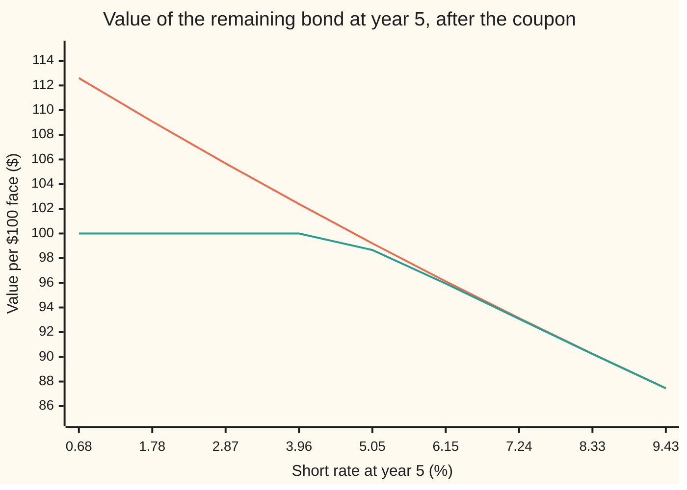
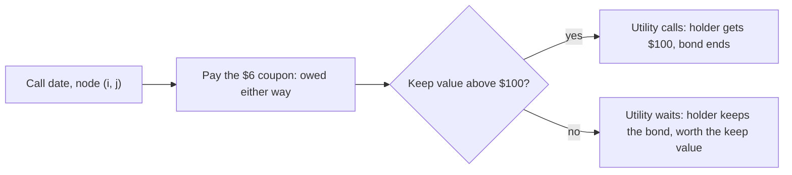

# Callable bonds: a bond minus a call option, and the yields quoted on them

[Syllabus](../../../SYLLABUS.md) → [Financial mathematics](../../../SYLLABUS.md#w12) → [Mortgages, Callables and Prepayment](../../../SYLLABUS.md#w12-s35) → Callable bonds

---

## General Overview

A city water utility borrows $100 for ten years. It promises $6 every year and the $100 back at the end: a 6 percent bond. One clause is added. From year 5 onwards, on each anniversary, just after paying that year's $6, the utility may hand back the $100 and stop. The later coupons vanish. A bond with that clause is **callable**, the clause is the **call**, and $100 is the **call price**: here par, the face value.

If rates fall to 3 percent by year 5, the utility borrows afresh at 3 percent, repays the old bond, and saves $3 a year. If rates rise, it keeps the cheap old debt. The utility holds an option, and uses it exactly when the holder would least like it used.

So the buyer owns an ordinary bond and has promised to sell it back at $100 whenever the utility asks. On today's rates the plain ten-year bond is worth **$108.28**. The utility's right to call it is worth **$1.32**. The callable bond is worth the difference, **$106.96**.

Bonds are usually quoted by yield, and a callable bond has one yield for every date it could end. The market quotes the lowest, the **yield to worst**. At $106.96 that is 4.42 percent, reached if the bond is called at year 5, against 5.09 percent if it runs to maturity.

**A callable bond is worth the plain bond minus the issuer's option to buy it back; the price comes from a rate tree on which the issuer calls whenever repaying is cheaper than carrying on, and the yield quoted on it is the lowest of the yields to each possible end date.**

**What kind of fact this is:** a model: the Hull-White tree is an assumption about how rates move, not a law. Inside it, "callable equals straight minus call" is a theorem, proved on this card in Why it works. Yield to call and yield to worst are conventions: definitions the market agreed on.

### The picture: what the call does at year 5

Stand at year 5, the first call date, just after the coupon. For each short rate the tree can reach there, the chart shows what the rest of each bond is worth.



Upper line: the plain bond, climbing as rates fall. Lower line: the callable bond, flat at $100 wherever the utility calls, and a whisker under the plain bond at high rates, where the utility waits but may call later. The gap is the utility's option: a call on the bond with strike $100, which the holder has given away.

---

## The formula

Notation first, in words. The tree of [The Hull-White tree](../30-Short-Rate%20Models/06-hull-white-trinomial-tree.md) is reused unchanged. A node (i, j) is rung j at step i; a double subscript such as $C_{i,j}$ means "at step i, rung j". $\Delta t$ is the step length, $r_{i,j}$ the node's short rate, and $p_u$, $p_m$, $p_d$ the branch weights to the rung above, the same rung and the rung below. $D(t)$ is today's price of $1 paid at year t. The contract: face $F$ = $100, coupon $c$ = $6 a year, call price $K$ = $100. The **keep value** of a contract V at a node is what its future payments are worth there if nothing happens now.

$$R_{i,j}[V] = e^{-r_{i,j}\Delta t}\big(p_u V_{i+1,\,j+1} + p_m V_{i+1,\,j} + p_d V_{i+1,\,j-1}\big)$$

**Read it aloud:** the three next values, weighted by their branch weights, shrunk for one step at this node's rate. At the edge rungs the branches bend inwards, as on the tree card.

The callable bond's value at a call date, year 5 to year 9:

$$C_{i,j} \;=\; c \;+\; \min\big(K,\; R_{i,j}[C]\big)$$

**Read it aloud:** the holder gets this year's coupon for certain, and then either the call price or the rest of the bond, whichever costs the utility less.

On other coupon dates the minimum is dropped: $C_{i,j} = c + R_{i,j}[C]$. Between coupon dates, $C_{i,j} = R_{i,j}[C]$. At maturity every node holds the last coupon plus the face, $106.

The option the holder has given away, and the identity that names the card:

$$O_{i,j} = \max\big(R_{i,j}[S] - K,\; R_{i,j}[O]\big)\ \text{at call dates}, \qquad C_{i,j} = S_{i,j} - O_{i,j}\ \text{everywhere}.$$

**Read it aloud:** at each call date the utility's option is worth the larger of calling now and keeping the option alive; the callable bond is the plain bond minus that option, at every node, today included.

The plain bond, called **straight**, needs no tree:

$$S_{0,0} = c\sum_{t=1}^{10} D(t) + F\,D(10).$$

The yields. Given a price $P$, the **yield to endpoint e** is the one annual rate that prices the fixed schedule "coupons to year e, then $100 at year e":

$$P = \sum_{t=1}^{e} \frac{c}{(1+y_e)^{t}} + \frac{K}{(1+y_e)^{e}}, \qquad y_{\text{worst}} = \min\{y_5, y_6, y_7, y_8, y_9, y_{10}\}.$$

**Read it aloud:** for each date the bond could end, find the one rate that makes that schedule cost the price paid; the yield to worst is the smallest of them.

Here $y_{10}$ is the **yield to maturity** (the call price and face are both $100, so the same formula serves), $y_5$ the **yield to first call**, and the rest are yields to the later calls.

| Symbol | Plain meaning | In our example | Push it up and the callable price… |
| --- | --- | --- | --- |
| $F$, $c$ | face, and the coupon paid each year per $100 face | $100, $6 | rises |
| $K$ | the call price the utility pays to retire the bond | $100, par | rises: calling costs the utility more |
| $D(t)$ | today's price of $1 at year t, from the curve $e^{-0.03t - 0.002t^2}$ | $D(10)$ = 0.606531 | rises |
| $a$, $\sigma$ | Hull-White mean reversion per year; volatility of the short rate | 0.2; 1 percent | $a$: rises, rates wander less; $\sigma$: falls, the option is dearer |
| $\Delta t$, $i$, $j$ | step length in years; step number; rung number | 0.025 year; 0 to 400; −37 to +37 | — |
| $r_{i,j}$ | short rate at node (i, j) for the next step | 5.05 percent at year 5, rung 0 | falls |
| $p_u$, $p_m$, $p_d$ | branch weights to the rung above, the same rung, the rung below | 1/6, 2/3, 1/6 at rung 0 | — |
| $R_{i,j}[V]$ | keep value of contract V at node (i, j) | — | — |
| $S_{i,j}$, $C_{i,j}$, $S$, $C$ | straight and callable bond values at a node | $108.28 and $106.96 today | — |
| $O_{i,j}$ | the utility's call option on the straight bond | $1.32 today | — |
| $P$, $e$, $y_e$, $y_5$, $y_{10}$, $a_e(y)$, $a_5$ | a price paid; an end year, 5 to 10; the yield to that end; the value of $1 a year for e years at yield y | $106.96; 5; 4.42 percent; $a_5$ = 4.400031 | a higher price lowers every $y_e$ |
| $y_{\text{worst}}$ | the lowest of the six yields | 4.42 percent, at year 5 | — |

The tree has 400 steps of 0.025 year, rung spacing 0.273178 percent and edge rung 37, set by the tree card's rules.

### When it holds

- **Rates follow one-factor Hull-White with fixed $a$ and $\sigma$.** The option's value is volatility, so a wrong $\sigma$ misprices the bond: $107.76 at 0.5 percent, $105.28 at 2 percent.
- **The utility calls optimally, on the same model.** Real issuers call late, because refinancing costs fees and calls need notice. An issuer calling whenever rates are below the coupon leaves the holder $107.61.
- **No default, one curve.** A riskier issuer's bond is discounted at a higher rate; the spread that reconciles model and market is [Option-adjusted spread](04-option-adjusted-spread.md).
- **The contract as stated.** Whole bond, at par, on the anniversary, after the coupon. A call premium, make-whole or partial call changes the recursion.
- **Enough steps.** The tree gives $106.95 at 100 steps, $106.96 at 200 and 400: settled to about a cent.

The yields are definitions and hold for any price above zero.

**Conventions verified 28 Sep 2026:** FINRA's investor guide defines yield to worst as whichever of yield to maturity and yield to call is lower. MSRB Rule G-15 requires municipal-bond confirmations to show yield computed to the lower of an in-whole call or maturity, and, for a series of calls at declining premiums, the call date giving the lowest yield. The price here is paid on a coupon date, just after the coupon, so no accrued interest is added. This bond pays annually, so its yields are annual rates; a bond paying twice a year is quoted with half-yearly compounding.

---

## Why it works

### Step 0: the holder has sold the issuer a call

Every call date offers the utility two actions: pay $100 now, or keep paying coupons. Each is a cost to the utility and a receipt to the holder, who has no say. The contract lets the utility pick the cheaper action every time, so the price assumes it does.

The holder owns the straight bond; the utility owns the right to buy the rest of it back at $100 on five dates. That right is a **Bermudan call**, an option exercisable on a fixed list of dates ([Bermudan options](../15-American%20and%20Bermudan%20exercise/03-bermudan-options.md)).

### Step 1: coupon first, then the choice

At a call date the coupon is already owed; calling does not cancel it. So the $6 sits outside the choice. After it is paid, calling costs $100 and continuing costs the keep value $R_{i,j}[C]$. The utility takes the smaller, and the holder's value at the node is $c + \min(K, R_{i,j}[C])$.



The keep value of the callable already includes the later chances to call, so the test is not a fixed rate threshold. On the 400-step tree the utility calls at 169 nodes across years 5 to 9.

### Step 2: walking back from year 10 finds the best call policy

At year 10 every node pays $106. Step back a layer at a time: take the keep value, add the coupon on coupon dates, take the minimum on call dates. The root value is the least the utility can pay under any call policy that uses only what it knows at the time.

<details>
<summary>Detailed proof: the minimum at each node gives the cheapest policy</summary>

**Claim.** For any call policy that decides at each call node from the rates seen so far, the holder's value at the root is at least the rolled-back $C_{0,0}$, and the policy "call where $R_{i,j}[C] > K$" attains it.

**Proof, by backward induction over layers.** At the last layer every policy pays $106. Suppose no policy started at layer i+1 costs less than $C_{i+1,k}$. From node (i, j), a policy that waits costs the discounted average of its costs at the three children, so at least $R_{i,j}[C]$, since the discount is positive and the weights non-negative. A policy that calls costs $K$. With the coupon owed, every policy costs at least $c + \min(K, R_{i,j}[C])$, and taking the smaller branch here, then the optimal policy below, achieves it. At non-call nodes only waiting is possible.

**The same number, forward.** The tree card proves that rolling a payment back equals summing it against the state prices, today's prices of $1 paid only at one node. The code's ledger pushes state prices forward, pays coupons on live nodes, pays $100 where the policy calls and stops those paths. It lands on $106.961036, the rollback's number.

</details>

### Step 3: straight minus call, node by node

The plain bond rolls back with no choices. The option rolls back with the rule for any call: at a call date the utility may exercise, gaining $R_{i,j}[S] - K$, the rest of the straight bond minus the $100 it pays, or keep the option.

The proof's shape: the keep value is an average, and averages subtract, so if the identity holds one step later it holds now. The coupon cancels because both bonds pay it.

<details>
<summary>Detailed proof: $C = S - O$ at every node</summary>

**Base.** At year 10, $S = C = 106$ and $O = 0$.

**Step.** Assume $C_{i+1,k} = S_{i+1,k} - O_{i+1,k}$ for every k. The keep value is linear, a fixed positive combination of the three children, so $R_{i,j}[C] = R_{i,j}[S] - R_{i,j}[O]$.

At a call date, with coupon c:
$S_{i,j} - C_{i,j} = \big(c + R[S]\big) - \big(c + \min(K, R[S] - R[O])\big) = R[S] - \min(K,\, R[S] - R[O]) = \max\big(R[S] - K,\; R[O]\big) = O_{i,j}.$
The third equality uses $w - \min(u, w - v) = \max(w - u, v)$.

At other dates, $S - C = R[S] - R[C] = R[O] = O$, with or without a coupon.

**What it needs.** One tree, one curve, one set of dates, the same coupon treatment and the same call price for all three recursions. An option priced on a different model, or with the coupon inside the strike, does not subtract to the callable price.

</details>

The code rolls the option back on its own, $1.320816, and subtracts it from the straight bond: $106.961036, the callable's own rollback to six decimals.

### Step 4: the option's value is volatility

Set $\sigma$ to zero. Rates are then known today, and the utility can compare fixed schedules: call at year 5, 6, 7, 8, 9 or never. On this curve those cost $108.74, $109.26, $109.43, $109.31, $108.91 and $108.28. Never calling is cheapest. The forward rates this curve implies for years 5 to 10 average about 6.2 percent a year, so on that path the rest of a 6 percent loan is worth less than $100 and never worth refinancing. The zero-volatility tree agrees: $108.28, the straight price.

All $1.32 of the option comes from the chance that rates fall. The first call date alone is worth $1.16 (the tree says 1.163134, Jamshidian's closed form 1.163324; see [Bond options](../30-Short-Rate%20Models/05-bond-options-and-jamshidians-trick.md)). The four later dates add $0.16. For the year-5-only call, the continuous model's remaining plain bond is worth exactly $100 at a short rate of 4.77 percent; below that rate, calling pays.

### Step 5: each yield exists, is unique, and they line up

**Existence and uniqueness.** For a fixed end year e, the schedule's value at yield y is a sum of positive payments, each divided by a power of 1 + y. As y rises from −1 to infinity, the value falls strictly from infinity to zero. So every price above zero has exactly one yield above −1, and a price of zero or less has none: the inverse argument of [Yield from price](../01-Money%2C%20Dates%20and%20Discounting/07-yield-from-price.md), applied to six schedules.

**The boundary.** At a price of $100 every yield is the coupon rate, 6 percent: $6 a year on $100 is 6 percent however long it lasts.

**Which end is worst.** Write $a_e(y)$ for the annuity factor, the value of $1 a year for e years. The schedule's value is $100 + (6 - 100y)\,a_e(y)$: the face, plus each year's excess of the $6 coupon over the $100y the yield asks for, discounted. Set it equal to P:

- **Price above $100.** Every yield is below 6 percent, where $6 - 100y$ is positive. At any such yield a later end year has a larger annuity factor, so a higher value; pulling it down to the same price takes a higher yield. The yields rise with e, and the **first call** is worst. At $106.96: 4.42, 4.64, 4.81, 4.93, 5.02 and 5.09 percent.
- **Price below $100.** Every yield is above 6 percent, and the same argument runs backwards: the yields fall with e, and **maturity** is worst. At $95.00: 7.23, 7.05, 6.93, 6.83, 6.76 and 6.70 percent.

Hence the traders' rule: a premium callable is quoted to the first call, a discount callable to maturity.

### The other doors

The tree is one road. The same Bermudan call can be priced on a grid for the term-structure equation, or by simulation with a regression for the keep value ([Bermudan swaptions](../31-Forward-Rate%20Models/06-bermudan-swaptions-by-regression.md)), which takes over when one rate factor is not enough.

---

## Worked numbers, by hand

The contract: $100 face, 6 percent annual coupon, ten years, callable at $100 just after the coupon in years 5 to 9. The curve: $D(t) = e^{-0.03t - 0.002t^2}$, a zero rate of 3 percent rising by 0.2 percent a year. The tree: $a$ = 0.2, $\sigma$ = 1 percent, 400 steps.

| Step | Arithmetic | Value |
| --- | --- | --- |
| coupons of the straight bond | 6 × (D(1) + … + D(10)) = 6 × 7.938131 | 47.628786 |
| face of the straight bond | 100 × D(10) = 100 × 0.606531 | 60.653066 |
| straight bond | 47.628786 + 60.653066 | $108.28 |
| utility's call, rolled back on the tree | machine: 400 steps, 169 call nodes | $1.32 |
| callable bond | 108.28 − 1.32 | **$106.96** |
| yield to maturity at $106.96 | solve with e = 10 | 5.09 percent |
| yield to call at year 5 | solve with e = 5 | 4.42 percent |
| check it: $(1 + y)^{-5}$ at 4.417958 percent | $1.04417958^{-5}$ | 0.805608 |
| annuity factor $a_5$ | $(1 - 0.805608) / 0.04417958$ | 4.400031 |
| schedule's value | 6 × 4.400031 + 100 × 0.805608 = 26.400188 + 80.560848 | 106.96 |
| **yield to worst** | lowest of the six | **4.42 percent, year 5** |

A buyer paying $106.96 is promised at least 4.42 percent a year on any schedule the contract allows, and at most 5.09 percent. These are internal rates of return: the realised return also depends on the rates at which coupons are reinvested. The price itself comes from a model; the 4.42 percent is arithmetic on that price.

### What breaks if you drop a piece

Same bond, correct price $106.96, yield to worst 4.42 percent:

| Mistake | Comes out at | What went wrong |
| --- | --- | --- |
| Ignore the call | $108.28 | The holder has sold an option worth $1.32 and been paid nothing for it |
| Utility calls whenever the rate is below the 6 percent coupon | $107.61 | Calling early throws away the chance to call later at a better moment; the utility's true rule compares $100 with the keep value |
| Only the first call date counts | $107.12 | The four later dates carry $0.16 of option value |
| Quote the yield to maturity | 5.09 percent | On a premium callable the first call is the worst case; 5.09 percent promises what the contract does not |

---

## Code, from first principles, and it actually runs

Both programs build the tree card's Hull-White tree on the curve above and roll the contracts back. Four roads meet. **Road 1**: the callable's rollback with the minimum. **Road 2**: the straight bond from the curve alone, minus the option rolled back by its own rule. **Road 3**: a forward ledger that pays the holder's actual receipts and stops paths where the utility calls. **Road 4**: the year-5-only call against Jamshidian's closed form, which knows nothing of trees. Also: at zero volatility the tree must equal the cheapest fixed schedule, and each yield is found by bisection and by Newton's method, and must be 6 percent at a price of $100. The normal curve's area comes from Simpson's rule. Breaking the coupon order, the root 3 in the rung spacing, or the ledger's stopping rule each makes an assert fail.

### Python

```python
# Callable bond and yield to worst -- the check behind the card.  Standard library only.  10-year 6% bond,
# callable at 100 just after the coupon in years 5-9.  Roads: (1) Hull-White tree, min(100, keep); (2) curve
# bond minus the issuer's option; (3) forward ledger; (4) Jamshidian for the year-5-only call.  Yields: two roots.
from math import exp, log, sqrt, pi
F, CPN, K, A, SIG = 100.0, 6.0, 100.0, 0.2, 0.01          # face, coupon, call price, reversion, rate vol
def D(t, sh=0.0): return exp(-(0.03 + sh) * t - 0.002 * t * t)   # today's discount curve
def phi(x): return exp(-0.5 * x * x) / sqrt(2 * pi)
def N(x):                                                  # normal CDF by Simpson's rule, 0 to x
    if abs(x) > 10: return 1.0 if x > 0 else 0.0
    h = x / 2000
    return 0.5 + h / 3 * sum((1 if i in (0, 2000) else 4 if i % 2 else 2) * phi(i * h) for i in range(2001))
def weights(offs, m):              # branch weights with mean m and variance 1/3, in rungs
    s2, out = 1 / 3 + m * m, []
    for a in offs:
        b, c = [o for o in offs if o != a]
        out.append((s2 - (b + c) * m + b * c) / ((a - b) * (a - c)))
    return out
def tree(n, sig, sh):
    dt = 10.0 / n; M = exp(-A * dt) - 1
    dx = sqrt(3 * sig * sig * (1 - exp(-2 * A * dt)) / (2 * A))
    jm = int(0.184 / -M) + 1
    br = {}
    for j in range(-jm, jm + 1):
        offs = (0, -1, -2) if j == jm else (2, 1, 0) if j == -jm else (1, 0, -1)
        br[j] = [(j + o, p) for o, p in zip(offs, weights(offs, j * M))]
    Q, al = {0: 1.0}, []
    for i in range(n):                                     # fit one shift per layer to the curve
        al.append(log(sum(q * exp(-j * dx * dt) for j, q in Q.items()) / D((i + 1) * dt, sh)) / dt)
        nq = {}
        for j, q in Q.items():
            for k, p in br[j]: nq[k] = nq.get(k, 0.0) + q * p * exp(-(al[i] + j * dx) * dt)
        Q = nq
    return dt, dx, jm, br, al
def price(n, sig=SIG, sh=0.0, dates=(5, 6, 7, 8, 9), below=None):   # below: naive rule, call if rate < it
    dt, dx, jm, br, al = tree(n, sig, sh); st = n // 10
    S = {j: F + CPN for j in range(-jm, jm + 1)}; C = dict(S); O = {j: 0.0 for j in S}
    calls, layer5 = set(), []
    for i in range(n - 1, -1, -1):
        cpn = CPN if i > 0 and i % st == 0 else 0.0
        can = i % st == 0 and i // st in dates
        nS, nC, nO = {}, {}, {}
        for j in range(-min(i, jm), min(i, jm) + 1):
            d = exp(-(al[i] + j * dx) * dt)
            s, c, o = (d * sum(p * V[k] for k, p in br[j]) for V in (S, C, O))
            nS[j] = cpn + s
            if below is not None: nC[j] = cpn + (K if can and al[i] + j * dx < below else c)
            else: nC[j] = cpn + (min(K, c) if can else c)
            nO[j] = max(s - K, o) if can else o
            if can and c > K: calls.add((i, j))
            if i == 5 * st: layer5.append((100 * (al[i] + j * dx), s, min(K, c)))
        S, C, O = nS, nC, nO
    led, live = 0.0, {0: 1.0}                                # road 3: follow the money forward
    for i in range(n + 1):
        if i > 0 and i % st == 0: led += CPN * sum(live.values())
        if i == n: led += F * sum(live.values()); break
        nl = {}
        for j, q in live.items():
            if (i, j) in calls: led += K * q; continue
            for k, p in br[j]: nl[k] = nl.get(k, 0.0) + q * p * exp(-(al[i] + j * dx) * dt)
        live = nl
    return S[0], C[0], O[0], led, len(calls), layer5, jm, dx, al
def jamshidian(T=5):               # road 4: European call at year 5 on the years 6-10 cash flows
    B = lambda t, u: (1 - exp(-A * (u - t))) / A
    lnA = lambda t, u: log(D(u) / D(t)) + B(t, u) * (0.03 + 0.004 * t) - SIG**2 / (4 * A) * (1 - exp(-2 * A * t)) * B(t, u)**2
    cf = [(u, CPN + (F if u == 10 else 0.0)) for u in range(T + 1, 11)]
    bond = lambda r: sum(c * exp(lnA(T, u) - B(T, u) * r) for u, c in cf)
    lo, hi = -1.0, 1.0
    for _ in range(200):
        mid = (lo + hi) / 2
        lo, hi = (mid, hi) if bond(mid) > K else (lo, mid)
    tot = 0.0
    for u, c in cf:
        X = exp(lnA(T, u) - B(T, u) * lo)
        sp = SIG * sqrt((1 - exp(-2 * A * T)) / (2 * A)) * B(T, u)
        h = log(D(u) / (X * D(T))) / sp + sp / 2
        tot += c * (D(u) * N(h) - X * D(T) * N(h - sp))
    return tot, 100 * lo
def fixed(e, y): return sum(CPN / (1 + y)**t for t in range(1, e + 1)) + F / (1 + y)**e
def y_bisect(e, P):
    lo, hi = -0.5, 1.0
    for _ in range(200):
        mid = (lo + hi) / 2
        lo, hi = (mid, hi) if fixed(e, mid) > P else (lo, mid)
    return (lo + hi) / 2
def y_newton(e, P):
    y = 0.05
    for _ in range(50):
        dP = -sum(t * CPN / (1 + y)**(t + 1) for t in range(1, e + 1)) - e * F / (1 + y)**(e + 1)
        y -= (fixed(e, y) - P) / dP
    return y
S0, C0, O0, led, ncalls, layer5, jm, dx, al = price(400)
curve = sum(CPN * D(t) for t in range(1, 11)) + F * D(10)
eur = S0 - price(400, dates=(5,))[1]; jam, rstar = jamshidian()
sched = [sum(CPN * D(t) for t in range(1, e + 1)) + F * D(e) for e in range(5, 11)]
flat = price(400, sig=0.0)[1]
print(f"{'tree: steps, edge rung, rung spacing %':<40} 400 {jm} {100 * dx:.6f}")
sD = sum(D(t) for t in range(1, 11))
print(f"{'curve: D(10), sum D(1..10), 6x, 100xD(10)':<40} {D(10):.6f} {sD:.6f} {6 * sD:.6f} {100 * D(10):.6f}")
for lab, v in (("1 straight bond, from the curve", curve), ("  straight bond, rolled back on tree", S0),
               ("1 callable, tree, 400 steps", C0), ("  callable, tree, 100 steps", price(100)[1]),
               ("  callable, tree, 200 steps", price(200)[1]),
               ("2 issuer's call option, own recursion", O0), ("  straight minus option", S0 - O0),
               ("3 callable, forward ledger", led), ("4 year-5-only call, tree", eur),
               ("  year-5-only call, Jamshidian", jam), ("  critical rate r* at year 5, %", rstar),
               ("  Bermudan call minus year-5-only call", O0 - eur),
               ("zero vol: callable on tree", flat), ("zero vol: cheapest fixed schedule", min(sched))):
    print(f"{lab:<40} {v:12.6f}")
print(f"{'call nodes on the 400-step tree':<40} {ncalls}")
print("fixed schedules on the curve, called at 5..9, maturity 10:")
print("  " + " ".join(f"{v:.4f}" for v in sched))
Y = [(y_bisect(e, C0), y_newton(e, C0)) for e in range(5, 11)]
print(f"yields at the model price {C0:.6f}, percent, bisection | Newton:")
for e, (yb, yn) in zip(range(5, 11), Y): print(f"  {'to call, year ' + str(e) if e < 10 else 'to maturity, year 10':<22} {100 * yb:.6f}  {100 * yn:.6f}")
ytw = min(yb for yb, _ in Y); v5 = (1 + ytw)**-5
print(f"{'yield to worst %, and its year':<40} {100 * ytw:.6f} {5 + [yb for yb, _ in Y].index(ytw)}")
print(f"{'  at it: (1+y)^-5, a_5, 6 a_5, 100 v^5':<40} {v5:.6f} {(1 - v5) / ytw:.6f} {6 * (1 - v5) / ytw:.6f} {100 * v5:.6f}")
for P in (100.0, 95.0):
    ys = [y_bisect(e, P) for e in range(5, 11)]
    print(f"at price {P:.2f}: yields % " + " ".join(f"{100 * y:.4f}" for y in ys) + f"  worst year {5 + ys.index(min(ys))}")
print(f"{'wrong: ignore the call (straight price)':<40} {S0:12.6f}")
print(f"{'wrong: call whenever rate < 6%':<40} {price(400, below=0.06)[1]:12.6f}")
print(f"{'wrong: only the first call date':<40} {S0 - eur:12.6f}")
print(f"{'wrong: quote yield to maturity, %':<40} {100 * Y[5][0]:12.6f}")
g = {}
for lab, kw in (("curve -1%", dict(sh=-0.01)), ("curve +1%", dict(sh=0.01)), ("vol 0.5%", dict(sig=0.005)), ("vol 2%", dict(sig=0.02))):
    s, c = price(400, **kw)[:2]; g[lab] = (s, c)
    print(f"{'greeks: ' + lab + ', straight | callable':<40} {s:10.4f} {c:10.4f}")
for lab, P0, idx in (("straight", S0, 0), ("callable", C0, 1)):
    print(f"{'effective duration, ' + lab:<40} {(g['curve -1%'][idx] - g['curve +1%'][idx]) / (2 * P0 * 0.01):10.4f}")
print("chart, year 5 after coupon: rate %, straight, callable (rungs -16 to 16, every 4th)")
for row in zip(*layer5[jm - 16:jm + 17:4]): print("  " + " ".join(f"{v:7.2f}" for v in row))
assert abs(S0 - curve) < 1e-9, "tree must reprice the straight bond the curve prices"
assert abs(led - C0) < 1e-9, "forward ledger vs rollback"
assert abs(S0 - O0 - C0) < 1e-9, "straight minus the separately rolled option vs rollback"
assert abs(eur - jam) < 5e-4, "tree's one-date call vs Jamshidian closed form"
assert abs(flat - min(sched)) < 1e-9, "zero vol: tree equals cheapest fixed schedule"
assert all(abs(yb - yn) < 1e-12 for yb, yn in Y), "yield by bisection vs Newton"
assert all(abs(y_newton(e, 100.0) - 0.06) < 1e-12 for e in range(5, 11)), "at par every yield is the coupon rate"
print("ALL CHECKS PASS")
```

**Ran 2026-09-28 on macOS, Python 3.14.6, standard library only. All checks passed. Output, pasted from the run:**

```
tree: steps, edge rung, rung spacing %   400 37 0.273178
curve: D(10), sum D(1..10), 6x, 100xD(10) 0.606531 7.938131 47.628786 60.653066
1 straight bond, from the curve            108.281852
  straight bond, rolled back on tree       108.281852
1 callable, tree, 400 steps                106.961036
  callable, tree, 100 steps                106.952114
  callable, tree, 200 steps                106.955275
2 issuer's call option, own recursion        1.320816
  straight minus option                    106.961036
3 callable, forward ledger                 106.961036
4 year-5-only call, tree                     1.163134
  year-5-only call, Jamshidian               1.163324
  critical rate r* at year 5, %              4.772069
  Bermudan call minus year-5-only call       0.157681
zero vol: callable on tree                 108.281852
zero vol: cheapest fixed schedule          108.281852
call nodes on the 400-step tree          169
fixed schedules on the curve, called at 5..9, maturity 10:
  108.7418 109.2566 109.4332 109.3061 108.9105 108.2819
yields at the model price 106.961036, percent, bisection | Newton:
  to call, year 5        4.417958  4.417958
  to call, year 6        4.644123  4.644123
  to call, year 7        4.805462  4.805462
  to call, year 8        4.926187  4.926187
  to call, year 9        5.019788  5.019788
  to maturity, year 10   5.094378  5.094378
yield to worst %, and its year           4.417958 5
  at it: (1+y)^-5, a_5, 6 a_5, 100 v^5   0.805608 4.400031 26.400188 80.560848
at price 100.00: yields % 6.0000 6.0000 6.0000 6.0000 6.0000 6.0000  worst year 5
at price 95.00: yields % 7.2269 7.0506 6.9254 6.8319 6.7596 6.7021  worst year 10
wrong: ignore the call (straight price)    108.281852
wrong: call whenever rate < 6%             107.605105
wrong: only the first call date            107.118717
wrong: quote yield to maturity, %            5.094378
greeks: curve -1%, straight | callable     117.1622   113.2521
greeks: curve +1%, straight | callable     100.1698    99.9047
greeks: vol 0.5%, straight | callable      108.2819   107.7645
greeks: vol 2%, straight | callable        108.2819   105.2832
effective duration, straight                 7.8464
effective duration, callable                 6.2394
chart, year 5 after coupon: rate %, straight, callable (rungs -16 to 16, every 4th)
     0.68    1.78    2.87    3.96    5.05    6.15    7.24    8.33    9.43
   112.60  109.08  105.68  102.39   99.20   96.12   93.14   90.25   87.46
   100.00  100.00  100.00  100.00   98.66   95.94   93.08   90.23   87.45
ALL CHECKS PASS
```

Four roads, one price: the rollback, the straight-minus-option subtraction and the forward ledger agree to six decimals, because they are three exact bookkeepings of one tree. Jamshidian's formula, from a continuous model, meets the tree's one-date call to the third decimal: $1.16 both ways.

### Rust

Same checks, same inputs, the rungs held in vectors instead of dictionaries. No crates.

```rust
// Callable bond and yield to worst -- the same check as callable_bonds_and_yield_to_worst_check.py, in Rust.
// Std only, no crates.  Rungs are stored in vectors at index j + jm.  Roads: (1) tree with min(100, keep);
// (2) curve bond minus the issuer's option; (3) forward ledger; (4) Jamshidian.  Yields: bisection and Newton.
use std::collections::HashSet;
const F: f64 = 100.0; const CPN: f64 = 6.0; const K: f64 = 100.0; const A: f64 = 0.2; const SIG: f64 = 0.01;
fn d(t: f64, sh: f64) -> f64 { (-(0.03 + sh) * t - 0.002 * t * t).exp() }
fn phi(x: f64) -> f64 { (-0.5 * x * x).exp() / (2.0 * std::f64::consts::PI).sqrt() }
fn ncdf(x: f64) -> f64 {
    if x.abs() > 10.0 { return if x > 0.0 { 1.0 } else { 0.0 }; }
    let h = x / 2000.0;
    0.5 + h / 3.0 * (0..=2000).map(|i| (if i == 0 || i == 2000 { 1.0 } else if i % 2 == 1 { 4.0 } else { 2.0 }) * phi(i as f64 * h)).sum::<f64>()
}
fn weights(offs: [i64; 3], m: f64) -> [f64; 3] {
    let (s2, mut out) = (1.0 / 3.0 + m * m, [0.0; 3]);
    for (n, &a) in offs.iter().enumerate() {
        let rest: Vec<f64> = offs.iter().filter(|&&o| o != a).map(|&o| o as f64).collect();
        let (b, c, af) = (rest[0], rest[1], a as f64);
        out[n] = (s2 - (b + c) * m + b * c) / ((af - b) * (af - c));
    }
    out
}
struct Out { s: f64, c: f64, o: f64, led: f64, ncalls: usize, layer5: Vec<(f64, f64, f64)>, jm: i64, dx: f64 }
fn price(n: usize, sig: f64, sh: f64, dates: &[usize], below: Option<f64>) -> Out {
    let dt = 10.0 / n as f64; let m = (-A * dt).exp() - 1.0;
    let dx = (3.0 * sig * sig * (1.0 - (-2.0 * A * dt).exp()) / (2.0 * A)).sqrt();
    let jm = (0.184 / -m) as i64 + 1; let w = (2 * jm + 1) as usize;
    let ix = |j: i64| (j + jm) as usize;
    let br: Vec<Vec<(i64, f64)>> = (-jm..=jm).map(|j| {
        let offs = if j == jm { [0, -1, -2] } else if j == -jm { [2, 1, 0] } else { [1, 0, -1] };
        let p = weights(offs, j as f64 * m);
        (0..3).map(|t| (j + offs[t], p[t])).collect()
    }).collect();
    let mut q = vec![0.0; w]; q[ix(0)] = 1.0; let mut al = Vec::new();
    for i in 0..n {
        let r = (i as i64).min(jm);
        let base: f64 = (-r..=r).map(|j| q[ix(j)] * (-(j as f64) * dx * dt).exp()).sum();
        al.push((base / d((i + 1) as f64 * dt, sh)).ln() / dt);
        let mut nq = vec![0.0; w];
        for j in -r..=r { for &(k, p) in &br[ix(j)] { nq[ix(k)] += q[ix(j)] * p * (-(al[i] + j as f64 * dx) * dt).exp(); } }
        q = nq;
    }
    let st = n / 10;
    let (mut sv, mut cv, mut ov) = (vec![F + CPN; w], vec![F + CPN; w], vec![0.0; w]);
    let mut calls = HashSet::new(); let mut layer5 = Vec::new();
    for i in (0..n).rev() {
        let cpn = if i > 0 && i % st == 0 { CPN } else { 0.0 };
        let can = i % st == 0 && dates.contains(&(i / st));
        let (mut ns, mut nc, mut no) = (vec![0.0; w], vec![0.0; w], vec![0.0; w]);
        let r = (i as i64).min(jm);
        for j in -r..=r {
            let rate = al[i] + j as f64 * dx; let disc = (-rate * dt).exp();
            let roll = |v: &Vec<f64>| disc * br[ix(j)].iter().map(|&(k, p)| p * v[ix(k)]).sum::<f64>();
            let (s, c, o) = (roll(&sv), roll(&cv), roll(&ov));
            ns[ix(j)] = cpn + s;
            nc[ix(j)] = match below {
                Some(b) => cpn + if can && rate < b { K } else { c },
                None => cpn + if can { K.min(c) } else { c },
            };
            no[ix(j)] = if can { (s - K).max(o) } else { o };
            if can && c > K { calls.insert((i, j)); }
            if i == 5 * st { layer5.push((100.0 * rate, s, K.min(c))); }
        }
        sv = ns; cv = nc; ov = no;
    }
    let (mut led, mut live) = (0.0, vec![0.0; w]); live[ix(0)] = 1.0;
    for i in 0..=n {
        if i > 0 && i % st == 0 { led += CPN * live.iter().sum::<f64>(); }
        if i == n { led += F * live.iter().sum::<f64>(); break; }
        let mut nl = vec![0.0; w]; let r = (i as i64).min(jm);
        for j in -r..=r {
            if calls.contains(&(i, j)) { led += K * live[ix(j)]; continue; }
            for &(k, p) in &br[ix(j)] { nl[ix(k)] += live[ix(j)] * p * (-(al[i] + j as f64 * dx) * dt).exp(); }
        }
        live = nl;
    }
    Out { s: sv[ix(0)], c: cv[ix(0)], o: ov[ix(0)], led, ncalls: calls.len(), layer5, jm, dx }
}
fn jamshidian(t: f64) -> (f64, f64) {
    let b = |s: f64, u: f64| (1.0 - (-A * (u - s)).exp()) / A;
    let lna = |s: f64, u: f64| (d(u, 0.0) / d(s, 0.0)).ln() + b(s, u) * (0.03 + 0.004 * s)
        - SIG * SIG / (4.0 * A) * (1.0 - (-2.0 * A * s).exp()) * b(s, u).powi(2);
    let cf: Vec<(f64, f64)> = ((t as usize + 1)..=10).map(|u| (u as f64, CPN + if u == 10 { F } else { 0.0 })).collect();
    let bond = |r: f64| cf.iter().map(|&(u, c)| c * (lna(t, u) - b(t, u) * r).exp()).sum::<f64>();
    let (mut lo, mut hi) = (-1.0, 1.0);
    for _ in 0..200 { let mid = (lo + hi) / 2.0; if bond(mid) > K { lo = mid } else { hi = mid } }
    let mut tot = 0.0;
    for &(u, c) in &cf {
        let x = (lna(t, u) - b(t, u) * lo).exp();
        let sp = SIG * ((1.0 - (-2.0 * A * t).exp()) / (2.0 * A)).sqrt() * b(t, u);
        let h = (d(u, 0.0) / (x * d(t, 0.0))).ln() / sp + sp / 2.0;
        tot += c * (d(u, 0.0) * ncdf(h) - x * d(t, 0.0) * ncdf(h - sp));
    }
    (tot, 100.0 * lo)
}
fn fixed(e: i32, y: f64) -> f64 { (1..=e).map(|t| CPN / (1.0 + y).powi(t)).sum::<f64>() + F / (1.0 + y).powi(e) }
fn y_bisect(e: i32, p: f64) -> f64 {
    let (mut lo, mut hi) = (-0.5, 1.0);
    for _ in 0..200 { let mid = (lo + hi) / 2.0; if fixed(e, mid) > p { lo = mid } else { hi = mid } }
    (lo + hi) / 2.0
}
fn y_newton(e: i32, p: f64) -> f64 {
    let mut y: f64 = 0.05;
    for _ in 0..50 {
        let dp = -(1..=e).map(|t| t as f64 * CPN / (1.0 + y).powi(t + 1)).sum::<f64>() - e as f64 * F / (1.0 + y).powi(e + 1);
        y -= (fixed(e, y) - p) / dp;
    }
    y
}
fn main() {
    let all = [5, 6, 7, 8, 9];
    let r0 = price(400, SIG, 0.0, &all, None); let (s0, c0, o0) = (r0.s, r0.c, r0.o);
    let curve = (1..=10).map(|t| CPN * d(t as f64, 0.0)).sum::<f64>() + F * d(10.0, 0.0);
    let eur = s0 - price(400, SIG, 0.0, &[5], None).c; let (jam, rstar) = jamshidian(5.0);
    let sched: Vec<f64> = (5..=10).map(|e| (1..=e).map(|t| CPN * d(t as f64, 0.0)).sum::<f64>() + F * d(e as f64, 0.0)).collect();
    let smin = sched.iter().cloned().fold(f64::INFINITY, f64::min);
    let flat = price(400, 0.0, 0.0, &all, None).c;
    println!("{:<40} 400 {} {:.6}", "tree: steps, edge rung, rung spacing %", r0.jm, 100.0 * r0.dx);
    let sd = (1..=10).map(|t| d(t as f64, 0.0)).sum::<f64>();
    println!("{:<40} {:.6} {:.6} {:.6} {:.6}", "curve: D(10), sum D(1..10), 6x, 100xD(10)", d(10.0, 0.0), sd, 6.0 * sd, 100.0 * d(10.0, 0.0));
    let rows = [("1 straight bond, from the curve", curve), ("  straight bond, rolled back on tree", s0),
        ("1 callable, tree, 400 steps", c0), ("  callable, tree, 100 steps", price(100, SIG, 0.0, &all, None).c),
        ("  callable, tree, 200 steps", price(200, SIG, 0.0, &all, None).c),
        ("2 issuer's call option, own recursion", o0), ("  straight minus option", s0 - o0),
        ("3 callable, forward ledger", r0.led), ("4 year-5-only call, tree", eur),
        ("  year-5-only call, Jamshidian", jam), ("  critical rate r* at year 5, %", rstar),
        ("  Bermudan call minus year-5-only call", o0 - eur),
        ("zero vol: callable on tree", flat), ("zero vol: cheapest fixed schedule", smin)];
    for (lab, v) in rows.iter() { println!("{:<40} {:12.6}", lab, v); }
    println!("{:<40} {}", "call nodes on the 400-step tree", r0.ncalls);
    println!("fixed schedules on the curve, called at 5..9, maturity 10:");
    println!("  {}", sched.iter().map(|v| format!("{:.4}", v)).collect::<Vec<_>>().join(" "));
    let ys: Vec<(f64, f64)> = (5..=10).map(|e| (y_bisect(e, c0), y_newton(e, c0))).collect();
    println!("yields at the model price {:.6}, percent, bisection | Newton:", c0);
    for (n, &(yb, yn)) in ys.iter().enumerate() {
        let lab = if n < 5 { format!("to call, year {}", n + 5) } else { "to maturity, year 10".to_string() };
        println!("  {:<22} {:.6}  {:.6}", lab, 100.0 * yb, 100.0 * yn);
    }
    let (wi, ytw) = ys.iter().enumerate().fold((0, f64::INFINITY), |a, (n, &(yb, _))| if yb < a.1 { (n, yb) } else { a }); let v5 = (1.0 + ytw).powi(-5);
    println!("{:<40} {:.6} {}", "yield to worst %, and its year", 100.0 * ytw, 5 + wi);
    println!("{:<40} {:.6} {:.6} {:.6} {:.6}", "  at it: (1+y)^-5, a_5, 6 a_5, 100 v^5", v5, (1.0 - v5) / ytw, 6.0 * (1.0 - v5) / ytw, 100.0 * v5);
    for p in [100.0, 95.0] {
        let yv: Vec<f64> = (5..=10).map(|e| y_bisect(e, p)).collect();
        let wy = yv.iter().enumerate().fold((0, f64::INFINITY), |a, (n, &y)| if y < a.1 { (n, y) } else { a }).0;
        println!("at price {:.2}: yields % {}  worst year {}", p, yv.iter().map(|y| format!("{:.4}", 100.0 * y)).collect::<Vec<_>>().join(" "), 5 + wy);
    }
    println!("{:<40} {:12.6}", "wrong: ignore the call (straight price)", s0);
    println!("{:<40} {:12.6}", "wrong: call whenever rate < 6%", price(400, SIG, 0.0, &all, Some(0.06)).c);
    println!("{:<40} {:12.6}", "wrong: only the first call date", s0 - eur);
    println!("{:<40} {:12.6}", "wrong: quote yield to maturity, %", 100.0 * ys[5].0);
    let mut g = Vec::new();
    for (lab, sig, sh) in [("curve -1%", SIG, -0.01), ("curve +1%", SIG, 0.01), ("vol 0.5%", 0.005, 0.0), ("vol 2%", 0.02, 0.0)] {
        let r = price(400, sig, sh, &all, None); g.push((r.s, r.c));
        println!("{:<40} {:10.4} {:10.4}", format!("greeks: {}, straight | callable", lab), r.s, r.c);
    }
    println!("{:<40} {:10.4}", "effective duration, straight", (g[0].0 - g[1].0) / (2.0 * s0 * 0.01));
    println!("{:<40} {:10.4}", "effective duration, callable", (g[0].1 - g[1].1) / (2.0 * c0 * 0.01));
    println!("chart, year 5 after coupon: rate %, straight, callable (rungs -16 to 16, every 4th)");
    let pts: Vec<&(f64, f64, f64)> = r0.layer5[(r0.jm - 16) as usize..=(r0.jm + 16) as usize].iter().step_by(4).collect();
    println!("  {}", pts.iter().map(|p| format!("{:7.2}", p.0)).collect::<Vec<_>>().join(" "));
    println!("  {}", pts.iter().map(|p| format!("{:7.2}", p.1)).collect::<Vec<_>>().join(" "));
    println!("  {}", pts.iter().map(|p| format!("{:7.2}", p.2)).collect::<Vec<_>>().join(" "));
    assert!((s0 - curve).abs() < 1e-9, "tree must reprice the straight bond the curve prices");
    assert!((r0.led - c0).abs() < 1e-9, "forward ledger vs rollback");
    assert!((s0 - o0 - c0).abs() < 1e-9, "straight minus the separately rolled option vs rollback");
    assert!((eur - jam).abs() < 5e-4, "tree's one-date call vs Jamshidian closed form");
    assert!((flat - smin).abs() < 1e-9, "zero vol: tree equals cheapest fixed schedule");
    assert!(ys.iter().all(|&(yb, yn)| (yb - yn).abs() < 1e-12), "yield by bisection vs Newton");
    assert!((5..=10).all(|e| (y_newton(e, 100.0) - 0.06).abs() < 1e-12), "at par every yield is the coupon rate");
    println!("ALL CHECKS PASS");
}
```

**Ran 2026-09-28 on macOS, rustc 1.98.1, no crates. All checks passed. Output, pasted from the run:**

```
tree: steps, edge rung, rung spacing %   400 37 0.273178
curve: D(10), sum D(1..10), 6x, 100xD(10) 0.606531 7.938131 47.628786 60.653066
1 straight bond, from the curve            108.281852
  straight bond, rolled back on tree       108.281852
1 callable, tree, 400 steps                106.961036
  callable, tree, 100 steps                106.952114
  callable, tree, 200 steps                106.955275
2 issuer's call option, own recursion        1.320816
  straight minus option                    106.961036
3 callable, forward ledger                 106.961036
4 year-5-only call, tree                     1.163134
  year-5-only call, Jamshidian               1.163324
  critical rate r* at year 5, %              4.772069
  Bermudan call minus year-5-only call       0.157681
zero vol: callable on tree                 108.281852
zero vol: cheapest fixed schedule          108.281852
call nodes on the 400-step tree          169
fixed schedules on the curve, called at 5..9, maturity 10:
  108.7418 109.2566 109.4332 109.3061 108.9105 108.2819
yields at the model price 106.961036, percent, bisection | Newton:
  to call, year 5        4.417958  4.417958
  to call, year 6        4.644123  4.644123
  to call, year 7        4.805462  4.805462
  to call, year 8        4.926187  4.926187
  to call, year 9        5.019788  5.019788
  to maturity, year 10   5.094378  5.094378
yield to worst %, and its year           4.417958 5
  at it: (1+y)^-5, a_5, 6 a_5, 100 v^5   0.805608 4.400031 26.400188 80.560848
at price 100.00: yields % 6.0000 6.0000 6.0000 6.0000 6.0000 6.0000  worst year 5
at price 95.00: yields % 7.2269 7.0506 6.9254 6.8319 6.7596 6.7021  worst year 10
wrong: ignore the call (straight price)    108.281852
wrong: call whenever rate < 6%             107.605105
wrong: only the first call date            107.118717
wrong: quote yield to maturity, %            5.094378
greeks: curve -1%, straight | callable     117.1622   113.2521
greeks: curve +1%, straight | callable     100.1698    99.9047
greeks: vol 0.5%, straight | callable      108.2819   107.7645
greeks: vol 2%, straight | callable        108.2819   105.2832
effective duration, straight                 7.8464
effective duration, callable                 6.2394
chart, year 5 after coupon: rate %, straight, callable (rungs -16 to 16, every 4th)
     0.68    1.78    2.87    3.96    5.05    6.15    7.24    8.33    9.43
   112.60  109.08  105.68  102.39   99.20   96.12   93.14   90.25   87.46
   100.00  100.00  100.00  100.00   98.66   95.94   93.08   90.23   87.45
ALL CHECKS PASS
```

The two outputs agree line for line.

### The Greeks of a callable bond

A bond's Greeks are its price moves when the curve or the volatility moves. The tree is refitted after each change.

| Move | Straight | Callable |
| --- | --- | --- |
| today | $108.28 | $106.96 |
| every zero rate down 1 percent | $117.16 | $113.25 |
| every zero rate up 1 percent | $100.17 | $99.90 |
| effective duration, the percent price change per 1 percent move | 7.85 | 6.24 |
| volatility 0.5 percent | $108.28 | $107.76 |
| volatility 2 percent | $108.28 | $105.28 |

The callable gains less when rates fall, because the utility is more likely to call it away at $100, and it loses value as volatility rises, because the holder is short an option. The curvature this produces is [Negative convexity](03-negative-convexity.md).

> [!TIP]
> **Try changing**
> Guess the direction first. Then run it.
> - **Double the volatility.** Call `price(400, sig=0.02)`. The callable falls from $106.96 to **$105.28**: the option the holder sold is worth more.
> - **Let the price fall to $95.** Call `y_bisect(e, 95.0)` for e from 5 to 10. Every yield is above 6 percent and the worst is now **maturity, 6.70 percent**, not the first call.
> - **Use the rule of thumb.** Call `price(400, below=0.06)`: the utility calls whenever the rate is below 6 percent. The holder's bond is worth **$107.61** instead of $106.96: calling early is a gift to the holder.
> - **Raise every zero rate by 1 percent.** Call `price(400, sh=0.01)`. The straight bond drops to **$100.17**, the callable to **$99.90**: once calling is unlikely, the two nearly meet.

---

## The usual mistake

> [!warning]
> **Reading yield to worst as a forecast.** It does not say the bond will be called at year 5. It is the lowest of six yields, each computed as if one fixed schedule were certain. On the tree, the utility calls at year 5 only where rates have fallen. Yield to worst is a floor on the promised yield, found by arithmetic on the price; the model's view of the call lives in the price, $106.96.
>
> Smaller traps:
> - **Quoting yield to maturity on a premium callable.** 5.09 percent, against a worst case of 4.42 percent.
> - **"The issuer calls when rates drop below the coupon."** Waiting has value too. That rule gives $107.61, not $106.96.
> - **Letting the call cancel the coupon.** The coupon is owed either way; dropping it misprices every call node.
> - **Subtracting a European call.** The option runs over five dates. The year-5 call alone gives $107.12, missing $0.16.

---

## Where you meet it in real life

- **Municipal bonds.** Long municipal bonds are often callable, and dealers must print the yield to the lower of call or maturity on every confirmation (MSRB Rule G-15).
- **Corporate bonds.** Many carry calls; quote screens show yield to maturity and yield to worst side by side.
- **Mortgages.** A homeowner who refinances is calling a loan, for reasons beyond rates: [Mortgage pools](02-mortgage-cash-flows-and-prepayment.md).
- **Pools of mortgages.** Thousands of such calls bundled into one security: [Mortgage-backed securities in outline](05-mortgage-backed-securities-in-outline.md).

> **Say it back**
> A callable bond lets its issuer repay early at a set price, so the holder owns a plain bond and has sold the issuer a call on it. On a rate tree, the issuer pays each coupon and then takes the cheaper of repaying and carrying on; walking back from maturity gives the price, $106.96 against $108.28 for the plain bond. The $1.32 difference is all volatility: with rates known, this issuer would never call. Yields to each possible end date turn the price into rates, and the lowest, the yield to worst, is what the market quotes. On a premium bond it is the first call, on a discount bond maturity.

---

## What this builds on

- [The Hull-White tree](../30-Short-Rate%20Models/06-hull-white-trinomial-tree.md): the lattice itself, its weights, its fit to the curve, and the rollback with a decision at each exercise date. This card changes only the contract.
- [Bond price and yield](../01-Money%2C%20Dates%20and%20Discounting/05-bonds-price-and-yield.md): price and yield of a fixed stream, the annuity factor, and why price and yield move opposite ways. Each yield on this card is that calculation for one schedule.

## Where this goes next

- [Mortgage pools](02-mortgage-cash-flows-and-prepayment.md): a loan that amortises and a borrower who repays early for reasons of their own, not only when it saves money.
- [Negative convexity](03-negative-convexity.md): the flattening in the year-5 chart, turned into a price-yield curve that bends the wrong way.
- [Option-adjusted spread](04-option-adjusted-spread.md): the spread added to the tree's rates so the model price meets a market price.

This card's issuer calls by a clean rule; the question it leaves open is how to price a loan whose borrowers repay early for reasons a rate tree cannot see, which the mortgage card answers.

---

## Sources

Verified 28 Sep 2026: every link below resolves to the publisher's page.

- Hull, John, and Alan White. "Numerical Procedures for Implementing Term Structure Models I: Single-Factor Models." *The Journal of Derivatives* 2, no. 1 (1994): 7–16. [doi:10.3905/jod.1994.407902](https://doi.org/10.3905/jod.1994.407902). The trinomial tree and its layer-by-layer fit, used as road 1.
- Jamshidian, Farshid. "An Exact Bond Option Formula." *The Journal of Finance* 44, no. 1 (1989): 205–209. [doi:10.1111/j.1540-6261.1989.tb02413.x](https://doi.org/10.1111/j.1540-6261.1989.tb02413.x). The closed form for an option on a coupon bond, used as road 4.
- FINRA. "Callable Bonds: Be Aware That Your Issuer May Come Calling." [finra.org](https://www.finra.org/investors/insights/callable-bonds-your-issuer-may-come-calling). What a call does to the holder: repayment at the call price and lost coupons.
- FINRA. "Understanding Bond Yield and Return." [finra.org](https://www.finra.org/investors/insights/bond-yield-return). Definitions of yield to call and yield to worst.
- MSRB. "Rule G-15: Confirmation, Clearance, Settlement and Other Uniform Practice Requirements with Respect to Transactions with Customers." [msrb.org](https://www.msrb.org/Rules-and-Interpretations/MSRB-Rules/General/Rule-G-15). The rule that municipal confirmations show yield to the lower of call or maturity.
