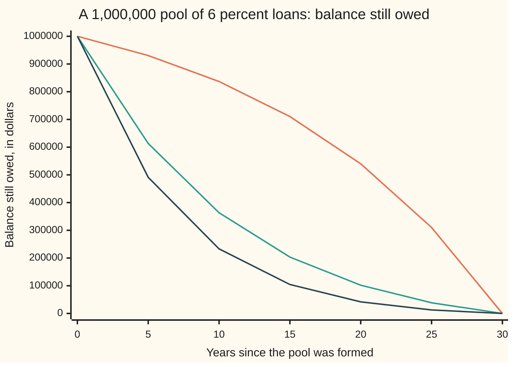
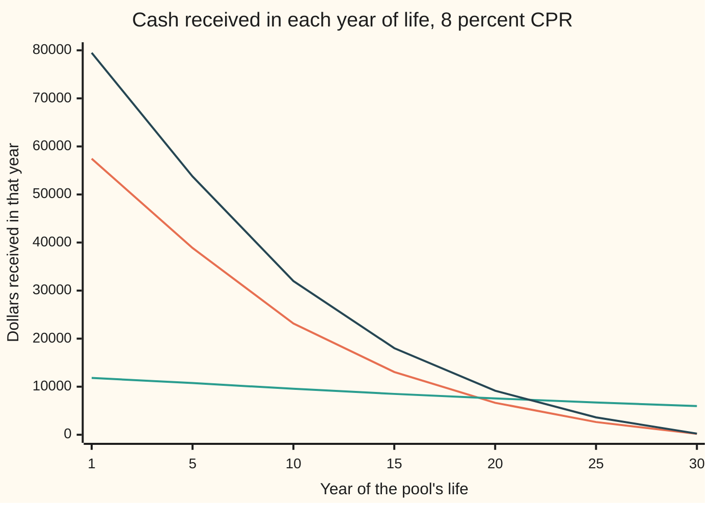

# Mortgage pools: scheduled amortisation plus prepayment, and the cash flows they produce

[Syllabus](../../../SYLLABUS.md) → [Financial mathematics](../../../SYLLABUS.md#w12) → [Mortgages, Callables and Prepayment](../../../SYLLABUS.md#w12-s35) → Mortgage pools

---

## General Overview

A lender makes a few hundred home loans, all alike: 30 years, 6 percent a year, paid monthly. Together they are owed $1,000,000. The lender sells the right to every payment on them to an investor, who now holds a **mortgage pool**: a bundle of loans whose payments pass straight through to the holder.

If every borrower paid exactly on schedule, the pool would pay $5,995.51 a month for 360 months, and the arithmetic would be the ordinary loan schedule of [Annuities](../01-Money%2C%20Dates%20and%20Discounting/03-annuities-and-loans.md). They do not. People sell houses, refinance when rates fall, and pay off early. Each time, that loan's whole balance arrives at once and the loan leaves the pool. Early repayment of principal beyond the schedule is **prepayment**.

Nobody knows in advance who will prepay. The market handles this with a single speed: a yearly percentage of the pool that is assumed to pay off early. At a speed of 8 percent a year, the first month alone brings the investor $12,912.99, more than twice the scheduled payment. The pool that was scheduled to run 30 years hands back its principal, on average, after 8.96 years.

One observation makes these flows exact: prepayment changes how many loans are left, never how a surviving loan behaves.

**A mortgage pool's balance is the fraction of loans still in the pool times the balance one loan would have on schedule; its monthly cash flow is the interest on last month's balance plus however much the balance fell.**

**What kind of fact this is:** a model: the prepayment speed is an assumption fed in, not a law of nature. Inside the model, the ledger identities are theorems, proved on this card in Why it works.

### The picture: what is still owed



Top line: no prepayment, the plain loan schedule. Middle line: 8 percent a year prepaying, the card's example. Bottom line: 12 percent a year. All three reach zero at 30 years, because a loan that never prepays still runs its full term. What changes is how much of the money comes back early. After ten years the scheduled pool still owes $836,857.25; at 8 percent it owes $363,521.13.

---

## The formula

Notation first, in words. Months are counted $m$ = 1, 2, … up to the term $N$ = 360. The monthly rate $i$ is the yearly note rate divided by 12. The **annuity factor** $a_n(i)$ is today's value of one dollar paid at the end of each of $n$ months, as on [Annuities](../01-Money%2C%20Dates%20and%20Discounting/03-annuities-and-loans.md). The prepayment speed is quoted as a yearly percentage $c$, the **conditional prepayment rate** or **CPR**. It is used month by month as $s$, the **single monthly mortality** or **SMM**: the fraction of loans still in the pool that pay off early in a given month.

$$B_m \;=\; L\,(1-s)^m\,\frac{a_{N-m}(i)}{a_N(i)}, \qquad s \;=\; 1-(1-c)^{1/12}$$

**Read it aloud:** the balance after month $m$ is the original pool, times the fraction of loans that have survived $m$ months, times the fraction of its balance a single loan still owes on schedule.

The cash flow to the investor in month $m$ comes from the balance alone:

$$X_m \;=\; I_m + Q_m + U_m \;=\; i\,B_{m-1} \;+\; (B_{m-1} - B_m)$$

**Read it aloud:** each month the investor receives interest on what was owed at the start of the month, plus every dollar by which the balance fell.

| Symbol | Plain meaning | In our example | Push it up and the answer… |
| --- | --- | --- | --- |
| $L$ | the pool's balance on day one | $1,000,000.00 | every flow scales in step |
| $N$, $m$, $n$ | months in the term; which month is being looked at; months left | 360; 1 to 360; 360 at the start | a longer term slows scheduled principal |
| $i$ | monthly note rate: yearly rate over 12 | 0.5% | more of each payment is interest |
| $a_n(i)$, $a_{360}$ | annuity factor: today's value of 1 a month for $n$ months | $a_{360}$ = 166.791614 | each dollar of payment carries more loan |
| $A$, $P_m$ | level payment of the whole pool with no prepayment; the pool's scheduled payment in month $m$ | $5,995.51; $5,953.99 in month 2 | — |
| $c$, $c_m$ | CPR: yearly prepayment speed, constant or month by month | 8% | principal comes back sooner |
| $s$, $s_m$ | SMM: monthly fraction of surviving loans that prepay | 0.692438% | same as CPR, monthly |
| $B_m$, $B$ | balance still owed after month $m$; any one balance | $363,521.13 after 10 years | — |
| $I_m$, $Q_m$, $U_m$, $I_1$, $Q_1$, $U_1$ | month $m$'s interest, scheduled principal, prepaid principal; the same in month 1 | $5,000.00, $995.51, $6,917.49 in month 1 | — |
| $X_m$, $X_1$ | total cash to the investor in month $m$; in month 1 | $12,912.99 in month 1 | — |
| $M$ | market rate on new mortgages, which drives refinancing | 6% | fewer refinance, CPR falls |
| $W$ | weighted average life: average wait, in years, for a dollar of principal | 8.96 years | — |

The month is worked in a fixed order:

$$I_m = i\,B_{m-1}, \quad P_m = \frac{B_{m-1}}{a_{N-m+1}(i)}, \quad Q_m = P_m - I_m, \quad U_m = s\,(B_{m-1} - Q_m), \quad B_m = B_{m-1} - Q_m - U_m$$

In plain words: charge interest on the opening balance; the surviving loans make their scheduled payment, which spreads what they owe over the months they have left; the part that is not interest is scheduled principal; then a fraction $s$ of what remains is prepaid.

The average life weights each dollar of principal by the year it arrives:

$$W \;=\; \frac{1}{L}\sum_{m=1}^{N} \frac{m}{12}\,(Q_m + U_m)$$

### When it holds

- **Loans alike.** Same rate, same term, same age. A real pool mixes them; the ledger then runs group by group and adds up. Treating a mixed pool as one loan at its average rate and term is an approximation whose error grows with the spread of rates and ages inside it.
- **Whole loans leave.** A prepaying loan pays off in full. A borrower who sends a little extra each month is booked the same way in that month, but then pays off before the term ends, so the survivors are no longer all on one schedule.
- **Interest passes through untouched.** Real pools keep a servicing fee, so investors get a coupon below the note rate, and payments arrive with a delay of weeks. Ignore either and every value is slightly too high.
- **No defaults, or defaults counted as prepayments.** In a pool with a guarantee, a defaulted loan is bought out at its balance, which the ledger books as prepayment. Without a guarantee, losses need their own line.
- **The speed is an input.** The formula is exact for whatever speed goes in. It says nothing about whether 8 percent is right. New loans prepay slowly and speed up over their first few years; the market's standard ramp for that is used in the code.

**Conventions verified 28 Sep 2026:** SMM as a fraction of the balance left after scheduled principal, CPR as SMM compounded over twelve months, and the standard ramp (called 100% PSA) are as defined in the Standard Formulas chapter of the Uniform Practices, still published by SIFMA (Sources).

---

## Why it works

### Step 0: prepayment changes how many loans there are, not how any loan behaves

Picture the pool as a crowd of one-dollar loans. Each month, some leave: they pay off in full. The rest carry on exactly as their contract says, paying the same fixed amount as if nobody else existed. A loan that has not prepaid cannot tell it is in a pool.

So the pool splits into two separate questions. How many loans are still in? That is a survival count, driven only by the prepayment speed. What does each surviving loan owe? That is the ordinary loan schedule, driven only by the note rate. Multiply the answers. This is the market's own convention: pool factor equals survival factor times amortised loan balance.

### Step 1: turning the yearly speed into a monthly one

A speed of 8 percent a year means that of the loans in the pool at the start of a year, 92 percent would still be there at its end, if nothing else happened. Losing the same fraction $s$ every month for twelve months must leave the same 92 percent:

$$(1-s)^{12} = 1 - c \quad\Longrightarrow\quad s = 1 - (1-c)^{1/12}$$

For $c$ = 8%, $s$ = 0.692438% a month. Dividing 8 by 12 gives 0.666667%, which is wrong: it treats losses as if they came off the original pool, when each month's losses come off what is left. The twelfth root is the same compounding that turns a yearly interest rate into a monthly one, run for survival instead of growth.

### Step 2: the order inside one month

Interest is charged on the opening balance, since every loan owed it for the whole month. The survivors then make their scheduled payment. Only after that does the month's prepayment arrive, and it is the SMM share of what the survivors still owe once scheduled principal has come off. That is the reference balance in the standard definition. A prepaying borrower makes the month's regular payment and then clears the rest.

### Step 3: the pool's payment shrinks with its survivors

A loan with $n$ months left and balance $B$ pays $B / a_n(i)$: what is owed, spread evenly over the months remaining. Applied to the whole pool, $P_m = B_{m-1}/a_{N-m+1}(i)$.

The annuity factor obeys one small identity. One more month of payments, discounted one month, is the same as a dollar now plus the rest:

$$(1+i)\,a_n(i) = 1 + a_{n-1}(i)$$

Use it on the balance after scheduled principal, which is the opening balance grown by a month of interest, less the payment:

$$(1+i)B_{m-1} - \frac{B_{m-1}}{a_n(i)} \;=\; B_{m-1}\,\frac{(1+i)\,a_n(i) - 1}{a_n(i)} \;=\; B_{m-1}\,\frac{a_{n-1}(i)}{a_n(i)}, \qquad n = N-m+1$$

In words: scheduled principal moves the balance one step down the single-loan schedule. Prepayment then takes away the fraction $s$. So the pool's scheduled payment is $A$ times the fraction of loans left: $(1-s)^{m-1}A$. In month 2 that is $5,953.99$, and the ledger's own division gives the same figure.

### Step 4: the closed form

Chain Step 3 month after month. Each month multiplies the balance by $a_{n-1}(i)/a_n(i)$ for the schedule and by $(1-s)$ for survival. The schedule factors cancel in a chain, leaving $a_{N-m}(i)/a_N(i)$, and the survival factors stack to $(1-s)^m$. That is the formula.

<details>
<summary>Detailed proof: the closed form, by induction</summary>

**Claim.** For every month $m$ from 0 to $N$, $B_m = L(1-s)^m a_{N-m}(i)/a_N(i)$, with $a_0(i) = 0$.

**Start.** At $m$ = 0 the right side is $L \cdot 1 \cdot a_N(i)/a_N(i) = L$. True.

**Step.** Suppose it holds at $m-1$. Put $n = N-m+1$, so $B_{m-1} = L(1-s)^{m-1}a_n(i)/a_N(i)$. The ledger gives $B_m = (1-s)\,(B_{m-1} - Q_m)$, since $U_m$ is $s$ times $B_{m-1} - Q_m$. And $B_{m-1} - Q_m = B_{m-1} - P_m + I_m = (1+i)B_{m-1} - B_{m-1}/a_n(i)$, which Step 3 showed is $B_{m-1}\,a_{n-1}(i)/a_n(i)$. So
$$B_m = (1-s)\cdot L(1-s)^{m-1}\frac{a_n(i)}{a_N(i)}\cdot\frac{a_{n-1}(i)}{a_n(i)} = L(1-s)^m\frac{a_{N-m}(i)}{a_N(i)}.$$
**End.** At $m = N$ the factor $a_0(i)$ is 0, so the pool is fully repaid in month 360 whatever the speed. The scheduled payment in month $m$ is $B_{m-1}/a_n(i) = L(1-s)^{m-1}/a_N(i) = (1-s)^{m-1}A$.

**The identity.** $(1+i)a_n(i) = \sum_{k=1}^{n}(1+i)^{-(k-1)} = 1 + \sum_{k=1}^{n-1}(1+i)^{-k} = 1 + a_{n-1}(i)$.

</details>

### Step 5: every dollar comes back once, and at the coupon rate prepayment is worth nothing

The ledger takes $Q_m + U_m$ off the balance each month, so these add up over the whole life to exactly $L$. Principal is never created or lost, only moved in time.

A sharper fact follows from $X_m = (1+i)B_{m-1} - B_m$. Discount month $m$'s cash flow at the note rate, dividing by $(1+i)^m$:

$$\frac{X_m}{(1+i)^m} = \frac{B_{m-1}}{(1+i)^{m-1}} - \frac{B_m}{(1+i)^m}$$

Adding over all months, each middle term appears once with a plus and once with a minus. Only $B_0 = L$ survives. So discounted at 6 percent, the pool is worth exactly $1,000,000.00 at any speed, even one that changes month to month. A prepaid dollar stops earning 6 percent at exactly the moment it stops being discounted at 6 percent. Prepayment matters for value only when the market's rate differs from the loans' rate. That difference is where the rest of this shelf lives.

### Step 6: a speed that depends on rates

Borrowers refinance when new mortgages are cheaper than their own. A simple rule ties the speed to the market rate $M$ on new loans:

$$c = \min\big(30\%,\ \max(2\%,\ 8\% + 4\,(6\% - M))\big)$$

At $M$ = 6% it gives the house 8%. At 5% it gives 12%; at 7%, 4%. The floor stands for people who move house whatever rates do; the cap for borrowers who never refinance. The number 4 is a teaching choice, not an estimate.

When $M$ changes over time, so does the speed: $c_m$ in month $m$, with SMM $s_m = 1-(1-c_m)^{1/12}$. The ledger runs unchanged. In the closed form, $(1-s)^m$ becomes the product $(1-s_1)(1-s_2)\cdots(1-s_m)$, since survival still multiplies month by month. Take a market rate of 7% for ten years, then 4%. The speed is 4% for months 1 to 120 and 16% from month 121. After 10 years the pool still owes $556,370.01, far more than the $363,521.13 at a steady 8%. Then the refinancing wave arrives: after 20 years it owes $62,795.39, less than the $101,901.16 at 8%. Average life is 10.24 years. The code checks the ledger against the product form in every month.

Another road to the same balances takes Step 0 literally: simulate thousands of individual loans, each prepaying whole or not, and count survivors. The code does this with 20,000 loans. Real prepayment models replace the rule above with borrower behaviour fitted to data or derived from optimal refinancing, and feed it with random rate paths; that is the method of [Option-adjusted spread](04-option-adjusted-spread.md).

---

## Worked numbers, by hand

The pool: $L$ = $1,000,000, $N$ = 360 months, $i$ = 0.5% a month, CPR 8%.

| Step | Arithmetic | Value |
| --- | --- | --- |
| annuity factor $a_{360}$ | $(1 - 1.005^{-360}) / 0.005$ | 166.791614 |
| level payment $A$ | $1{,}000{,}000 / 166.791614$ | $5,995.51 |
| SMM $s$ | $1 - 0.92^{1/12}$ | 0.692438% |
| month 1 interest $I_1$ | $0.005 \times 1{,}000{,}000$ | $5,000.00 |
| month 1 scheduled principal $Q_1$ | $5{,}995.51 - 5{,}000.00$ | $995.51 |
| month 1 prepaid $U_1$ | $0.00692438 \times (1{,}000{,}000 - 995.51)$ | $6,917.49 |
| month 1 cash to investor $X_1$ | $5{,}000.00 + 995.51 + 6{,}917.49$ | **$12,912.99** |
| balance after month 1 | $1{,}000{,}000 - 995.51 - 6{,}917.49$ | $992,087.01 |
| month 2 scheduled payment | $(1 - s) \times 5{,}995.51$ | $5,953.99 |
| survivors after 10 years | $(1-s)^{120} = 0.92^{10}$ | 0.434388 |
| balance after 10 years | $0.434388 \times 836{,}857.25$ (scheduled balance) | **$363,521.13** |
| weighted average life | the $W$ sum, 360 terms | **8.96 years** |

In the first month the investor receives more than twice the scheduled payment, and more than half of it is principal that was not due for decades. Over the life, interest totals $537,570.80 against $1,158,381.89 with no prepayment: less than half, because the money was not borrowed for as long.

### The flows over the pool's life



First line (orange): interest. Second line (teal): scheduled principal. Third line (dark): prepaid principal. Prepayment is the largest flow in each of the first 21 years, and it falls because the pool it comes from shrinks. Scheduled principal falls slowly: on a single loan it rises every month, but the shrinking number of loans more than cancels the rise. In the last years the few remaining loans pay mostly on schedule.

### What breaks if you drop a piece

Same pool, correct balance after 10 years $363,521.13, correct average life 8.96 years:

| Mistake | Comes out at | What went wrong |
| --- | --- | --- |
| SMM taken as CPR / 12 | $375,018.34 after 10 years; life 9.17 years | Monthly losses come off what is left, so they must compound back to 8% |
| Pool payment kept at $5,995.51 after prepayments | paid off in month 146; life 5.80 years | The prepaid loans left, taking their payments with them; the survivors do not pay for them |
| SMM applied to the opening balance | $363,069.62 after 10 years | Part of the month's scheduled principal, already paid, is prepaid a second time |

---

## When market rates move, the flows move

Nothing in a loan contract changed, yet the cash flows did. The speed is where the market reaches into the pool.

Run the rate rule from Step 6 with the market rate held at three levels for the whole life, and value each pool's cash flows by discounting at that same market rate:

| Market rate $M$ | CPR from the rule | Average life | Value with rule-driven speed | Value if speed stayed 8% |
| --- | --- | --- | --- | --- |
| 5% | 12% | 6.67 years | $1,050,948.57 | $1,064,349.46 |
| 6% | 8% | 8.96 years | $1,000,000.00 | $1,000,000.00 |
| 7% | 4% | 12.73 years | $926,204.56 | $942,463.15 |

When rates fall, a 6 percent pool is worth more than par, but borrowers refinance faster and hand back the principal just when it can only be reinvested at 5 percent: the gain is cut. When rates rise, borrowers sit tight and the investor is left holding 6 percent loans for longer while the market pays 7 percent: the loss is deepened. The speed moves against the holder both ways.

Average life, speed by speed, one block per half year:

```
CPR    weighted average life, years (one block = half a year)
  0%   ███████████████████████████████████████  19.31
  4%   █████████████████████████                12.73
  8%   ██████████████████                        8.96
 12%   █████████████                             6.67
 20%   ████████                                  4.20
```

Going from no prepayment to 4 percent removes six and a half years of average life. Going from 12 to 20 percent removes under two and a half. The first few percent of speed matter most, because they act on the far end of a long schedule.

---

## Code, from first principles, and it actually runs

The code builds the pool three independent ways. Road 1 is the month-by-month ledger, with the scheduled payment recomputed from an annuity factor added up term by term. Road 2 is the closed form, from the geometric-series version of the factor. Road 3 simulates 20,000 separate loans with a random-number generator written in the script (splitmix64), each loan following its own amortisation loop and leaving the pool whole when its draw says so. It also runs a speed that changes with a market-rate path. Then it checks that principal is conserved, that value at the coupon rate is par for every speed, and reproduces every figure and chart point on this card, including the wrong answers.

### Python

```python
# Mortgage pool cash flows under prepayment -- the check behind the card.
# Standard library only.  A $1,000,000 pool of identical 30-year loans at 6
# percent, paid monthly.  Three roads to the pool's balance: the month-by-month
# ledger, the closed form (survivors times one loan's schedule), and 20,000
# simulated loans driven by a random-number generator written here.
from math import log, exp

L, N, i = 1_000_000.0, 360, 0.06 / 12
M64 = (1 << 64) - 1

def smm(c):                                    # annual CPR -> monthly fraction s
    return 1.0 - exp(log(1.0 - c) / 12.0)

def annuity(n):                                # a_n(i), added up one discount factor at a time
    v, total = 1.0, 0.0
    for _ in range(n):
        v /= 1.0 + i
        total += v
    return total

A = L / annuity(N)                             # the level payment with no prepayment

def ledger(cpr, frozen=False):                 # road 1: the pool, one month at a time
    b, rows = L, []                            # rows: (interest, scheduled, prepaid, end balance)
    for m in range(1, N + 1):
        interest = i * b
        pay = min(A if frozen else b / annuity(N - m + 1), b + interest)
        sched = pay - interest
        prepaid = smm(cpr(m)) * (b - sched)
        b = b - sched - prepaid
        rows.append((interest, sched, prepaid, b))
        if b < 1e-6:
            break
    return rows

def wal(rows):                                 # weighted average life, in years
    return sum((m + 1) / 12 * (r[1] + r[2]) for m, r in enumerate(rows)) / L

def value(rows, y):                            # today's value of the cash flows at yearly rate y
    return sum((r[0] + r[1] + r[2]) / (1 + y / 12) ** (m + 1) for m, r in enumerate(rows))

def closed(m, c):                              # road 2: L (1-s)^m a_{N-m} / a_N, closed form
    v = 1 / (1 + i)
    return L * (1 - smm(c)) ** m * (1 - v ** (N - m)) / (1 - v ** N)

def closed_path(m, cpr):                       # road 2 with a changing speed: (1-s)^m -> product
    v, surv = 1 / (1 + i), 1.0
    for k in range(1, m + 1):
        surv *= 1 - smm(cpr(k))
    return L * surv * (1 - v ** (N - m)) / (1 - v ** N)

def simulate(c, loans=20000, seed=2026):       # road 3: loans that each prepay whole, or not
    state, us = seed, []
    for _ in range(loans):                     # splitmix64, written out
        state = (state + 0x9E3779B97F4A7C15) & M64
        z = ((state ^ (state >> 30)) * 0xBF58476D1CE4E5B9) & M64
        z = ((z ^ (z >> 27)) * 0x94D049BB133111EB) & M64
        us.append(((z ^ (z >> 31)) >> 11) / 2.0 ** 53)
    us.sort()
    one, surv, alive, p, bal = 1.0, 1.0, [loans], loans, [1.0]
    for m in range(1, N + 1):                  # one loan's own schedule, per dollar lent
        one = one * (1 + i) - A / L
        surv *= 1 - smm(c)                     # a loan is still in if its draw is below surv
        while p > 0 and us[p - 1] >= surv:
            p -= 1
        alive.append(p); bal.append(max(one, 0.0))
    B = [L * alive[m] / loans * bal[m] for m in range(N + 1)]
    return B, sum(m / 12 * (B[m - 1] - B[m]) for m in range(1, N + 1)) / L

flat = lambda c: (lambda m: c)
rule = lambda M: min(0.30, max(0.02, 0.08 + 4 * (0.06 - M)))       # rate-dependent CPR
psa = lambda m: 0.06 * min(m, 30) / 30                               # 100% PSA ramp
path = lambda m: rule(0.07 if m <= 120 else 0.04)                    # market 7%, then 4% from month 121
runs = {c: ledger(flat(c)) for c in (0.0, 0.04, 0.08, 0.12, 0.20)}
r8, s8 = runs[0.08], smm(0.08)
sim_B, sim_wal = simulate(0.08)

print(f"pool {L:.2f}, {N} months at 0.5% a month; level payment A {A:.6f}")
print(f"8% CPR -> SMM s {s8:.12f}; (1-s)^12 {(1 - s8) ** 12:.12f}; CPR/12 {0.08 / 12:.12f}")
print(f"a_N(i) {annuity(N):.6f}; survivors after 10 years (1-s)^120 {(1 - s8) ** 120:.6f}")
it, sc, pp, b1 = r8[0]
print(f"month 1 at 8% CPR: interest {it:.6f} scheduled {sc:.6f} prepaid {pp:.6f}")
print(f"month 1 at 8% CPR: cash to investors {it + sc + pp:.6f} balance left {b1:.6f}")
print(f"month 2 scheduled payment {r8[1][0] + r8[1][1]:.6f}; (1-s) A {(1 - s8) * A:.6f}")
for yr in (10, 20):
    m = 12 * yr
    print(f"balance year {yr}, 8% CPR: ledger {r8[m - 1][3]:.6f} closed {closed(m, 0.08):.6f} "
          f"20000 loans {sim_B[m]:.6f}")
print(f"WAL 8% CPR: ledger {wal(r8):.6f} years; 20000 loans {sim_wal:.6f} years")
print(f"principal returned at 8% CPR: {sum(r[1] + r[2] for r in r8):.6f}")
print(f"interest paid: 0% CPR {sum(r[0] for r in runs[0.0]):.6f}; 8% CPR {sum(r[0] for r in r8):.6f}")
for c in (0.0, 0.08, 0.12):
    print(f"value at the 6% coupon rate, CPR {c:.0%}: {value(runs[c], 0.06):.6f}")
print("WAL by CPR, years: " + "  ".join(f"{c:.0%} {wal(runs[c]):.2f}" for c in runs))
print(f"try: 100% PSA ramp, WAL {wal(ledger(psa)):.2f} years")
print("rate-dependent CPR: market rate, CPR, WAL, value with rule, value if CPR stayed 8%")
for M in (0.05, 0.06, 0.07):
    rr = ledger(flat(rule(M)))
    print(f"  market {M:.0%}  CPR {rule(M):>3.0%}  WAL {wal(rr):5.2f}  {value(rr, M):11.2f}  {value(r8, M):11.2f}")
rp = ledger(path)
print(f"rate path 7% then 4%: CPR {path(1):.0%} then {path(121):.0%}; balance year 10 {rp[119][3]:.2f} "
      f"closed {closed_path(120, path):.2f}; year 20 {rp[239][3]:.2f}; WAL {wal(rp):.2f}")
cpr12 = ledger(lambda m: 1 - (1 - 0.08 / 12) ** 12)             # mistake 1: s = CPR/12
frozen = ledger(flat(0.08), frozen=True)                          # mistake 2: payment never shrinks
b = L                                                             # mistake 3: s on opening balance
for m in range(1, 121):
    b = b - (b / annuity(N - m + 1) - i * b) - s8 * b
print(f"wrong: s = CPR/12, balance year 10 {cpr12[119][3]:.2f}, WAL {wal(cpr12):.2f}")
print(f"wrong: payment frozen at A, paid off in month {len(frozen)}, WAL {wal(frozen):.2f}")
print(f"wrong: s on opening balance, balance year 10 {b:.2f}")
print("chart, years                 " + " ".join(f"{y:>10d}" for y in range(0, 31, 5)))
for c in (0.0, 0.08, 0.12):
    bs = [L] + [runs[c][12 * y - 1][3] for y in range(5, 31, 5)]
    print(f"chart, balance {c:>4.0%} CPR       " + " ".join(f"{abs(x):10.2f}" for x in bs))
years = (1, 5, 10, 15, 20, 25, 30)
print("chart, year of life          " + " ".join(f"{y:>10d}" for y in years))
for k, name in ((0, "interest"), (1, "scheduled"), (2, "prepaid")):
    tot = [sum(r[k] for r in r8[12 * (y - 1):12 * y]) for y in years]
    print(f"chart, {name:<10} in year 8%  " + " ".join(f"{x:10.2f}" for x in tot))

assert abs((1 - s8) ** 12 - 0.92) < 1e-12, "SMM compounds back to CPR"
assert all(abs(r8[m - 1][3] - closed(m, 0.08)) < 1e-6 for m in range(1, N)), "ledger = closed form"
assert abs(sim_B[120] - closed(120, 0.08)) < 0.02 * L and abs(sim_wal - wal(r8)) < 0.25, "loans"
assert abs(sum(r[1] + r[2] for r in r8) - L) < 1e-6, "every dollar lent comes back once"
assert all(abs(value(runs[c], 0.06) - L) < 1e-6 for c in runs), "at the coupon rate, value = par"
assert all(abs(rp[m - 1][3] - closed_path(m, path)) < 1e-6 for m in range(1, N)), "changing speed"
assert abs(r8[1][0] + r8[1][1] - (1 - s8) * A) < 1e-9, "payment shrinks with the survivors"
print("ALL CHECKS PASS")
```

**Ran 2026-09-28 on macOS, Python 3.14.6, standard library only. All checks passed. Output, pasted from the run:**

```
pool 1000000.00, 360 months at 0.5% a month; level payment A 5995.505252
8% CPR -> SMM s 0.006924382628; (1-s)^12 0.920000000000; CPR/12 0.006666666667
a_N(i) 166.791614; survivors after 10 years (1-s)^120 0.434388
month 1 at 8% CPR: interest 5000.000000 scheduled 995.505252 prepaid 6917.489369
month 1 at 8% CPR: cash to investors 12912.994621 balance left 992087.005379
month 2 scheduled payment 5953.990079; (1-s) A 5953.990079
balance year 10, 8% CPR: ledger 363521.127076 closed 363521.127076 20000 loans 363070.517755
balance year 20, 8% CPR: ledger 101901.164752 closed 101901.164752 20000 loans 102012.774416
WAL 8% CPR: ledger 8.959513 years; 20000 loans 8.951286 years
principal returned at 8% CPR: 1000000.000000
interest paid: 0% CPR 1158381.890550; 8% CPR 537570.801473
value at the 6% coupon rate, CPR 0%: 1000000.000000
value at the 6% coupon rate, CPR 8%: 1000000.000000
value at the 6% coupon rate, CPR 12%: 1000000.000000
WAL by CPR, years: 0% 19.31  4% 12.73  8% 8.96  12% 6.67  20% 4.20
try: 100% PSA ramp, WAL 11.36 years
rate-dependent CPR: market rate, CPR, WAL, value with rule, value if CPR stayed 8%
  market 5%  CPR 12%  WAL  6.67   1050948.57   1064349.46
  market 6%  CPR  8%  WAL  8.96   1000000.00   1000000.00
  market 7%  CPR  4%  WAL 12.73    926204.56    942463.15
rate path 7% then 4%: CPR 4% then 16%; balance year 10 556370.01 closed 556370.01; year 20 62795.39; WAL 10.24
wrong: s = CPR/12, balance year 10 375018.34, WAL 9.17
wrong: payment frozen at A, paid off in month 146, WAL 5.80
wrong: s on opening balance, balance year 10 363069.62
chart, years                          0          5         10         15         20         25         30
chart, balance   0% CPR       1000000.00  930543.57  836857.25  710488.44  540035.86  310120.87       0.00
chart, balance   8% CPR       1000000.00  613304.07  363521.13  203411.00  101901.16   38567.96       0.00
chart, balance  12% CPR       1000000.00  491077.54  233065.56  104423.22   41886.69   12693.98       0.00
chart, year of life                   1          5         10         15         20         25         30
chart, interest   in year 8%    57450.14   38866.79   23143.23   13054.64    6649.47    2644.91     198.44
chart, scheduled  in year 8%    11818.19   10756.55    9562.60    8501.17    7557.56    6718.69    5972.93
chart, prepaid    in year 8%    79479.52   53751.22   31984.30   18020.19    9156.37    3616.35     233.46
ALL CHECKS PASS
```

The ledger and the closed form agree to the printed cent and beyond. The 20,000 simulated loans land within 0.2 percent of the exact balance after 10 years and within a hundredth of a year on average life; the gap is sampling noise and shrinks as loans are added.

### Rust

Same roads, same inputs, same labels, no crates.

```rust
// Mortgage pool cash flows under prepayment -- the same check as the Python, in Rust.
// Std only, no crates.  A $1,000,000 pool of identical 30-year loans at 6
// percent, paid monthly.  Three roads to the pool's balance: the month-by-month
// ledger, the closed form (survivors times one loan's schedule), and 20,000
// simulated loans driven by a random-number generator written here.
const L: f64 = 1_000_000.0;
const N: usize = 360;
const I: f64 = 0.06 / 12.0;

type Row = (f64, f64, f64, f64); // interest, scheduled, prepaid, end balance

fn smm(c: f64) -> f64 { 1.0 - ((1.0 - c).ln() / 12.0).exp() } // annual CPR -> monthly s

fn annuity(n: usize) -> f64 { // a_n(i), added up one discount factor at a time
    let (mut v, mut total) = (1.0, 0.0);
    for _ in 0..n { v /= 1.0 + I; total += v; }
    total
}

fn level() -> f64 { L / annuity(N) } // the level payment with no prepayment

fn ledger(cpr: &dyn Fn(usize) -> f64, frozen: bool) -> Vec<Row> { // road 1
    let (a, mut b, mut rows) = (level(), L, Vec::new());
    for m in 1..=N {
        let interest = I * b;
        let pay = (if frozen { a } else { b / annuity(N - m + 1) }).min(b + interest);
        let sched = pay - interest;
        let prepaid = smm(cpr(m)) * (b - sched);
        b = b - sched - prepaid;
        rows.push((interest, sched, prepaid, b));
        if b < 1e-6 { break; }
    }
    rows
}

fn wal(rows: &[Row]) -> f64 { // weighted average life, in years
    rows.iter().enumerate().map(|(m, r)| (m + 1) as f64 / 12.0 * (r.1 + r.2)).sum::<f64>() / L
}

fn value(rows: &[Row], y: f64) -> f64 { // today's value of the cash flows at yearly rate y
    rows.iter().enumerate().map(|(m, r)| (r.0 + r.1 + r.2) / (1.0 + y / 12.0).powf((m + 1) as f64)).sum()
}

fn closed(m: usize, c: f64) -> f64 { // road 2: L (1-s)^m a_{N-m} / a_N
    let v = 1.0 / (1.0 + I);
    L * (1.0 - smm(c)).powf(m as f64) * (1.0 - v.powf((N - m) as f64)) / (1.0 - v.powf(N as f64))
}

fn closed_path(m: usize, cpr: &dyn Fn(usize) -> f64) -> f64 { // road 2, changing speed
    let v = 1.0 / (1.0 + I);
    let surv: f64 = (1..=m).map(|k| 1.0 - smm(cpr(k))).product();
    L * surv * (1.0 - v.powf((N - m) as f64)) / (1.0 - v.powf(N as f64))
}

fn simulate(c: f64, loans: usize, seed: u64) -> (Vec<f64>, f64) { // road 3: whole loans
    let (mut state, mut us) = (seed, Vec::with_capacity(loans));
    for _ in 0..loans { // splitmix64, written out
        state = state.wrapping_add(0x9E3779B97F4A7C15);
        let mut z = (state ^ (state >> 30)).wrapping_mul(0xBF58476D1CE4E5B9);
        z = (z ^ (z >> 27)).wrapping_mul(0x94D049BB133111EB);
        us.push(((z ^ (z >> 31)) >> 11) as f64 / 2f64.powi(53));
    }
    us.sort_by(|a, b| a.partial_cmp(b).unwrap());
    let (a, mut one, mut surv, mut p) = (level(), 1.0, 1.0, loans);
    let (mut alive, mut bal) = (vec![loans], vec![1.0]);
    for _ in 1..=N { // one loan's own schedule, per dollar lent
        one = one * (1.0 + I) - a / L;
        surv *= 1.0 - smm(c); // a loan is still in if its draw is below surv
        while p > 0 && us[p - 1] >= surv { p -= 1; }
        alive.push(p);
        bal.push(f64::max(one, 0.0));
    }
    let bb: Vec<f64> = (0..=N).map(|m| L * alive[m] as f64 / loans as f64 * bal[m]).collect();
    let w = (1..=N).map(|m| m as f64 / 12.0 * (bb[m - 1] - bb[m])).sum::<f64>() / L;
    (bb, w)
}

fn pct(c: f64) -> String { format!("{:.0}%", c * 100.0) }

fn rule(mk: f64) -> f64 { (0.08 + 4.0 * (0.06 - mk)).max(0.02).min(0.30) } // rate-dependent CPR

fn main() {
    let a = level();
    let cs = [0.0, 0.04, 0.08, 0.12, 0.20];
    let runs: Vec<Vec<Row>> = cs.iter().map(|&c| ledger(&move |_| c, false)).collect();
    let (r8, s8) = (&runs[2], smm(0.08));
    let (sim_b, sim_wal) = simulate(0.08, 20000, 2026);

    println!("pool {:.2}, {} months at 0.5% a month; level payment A {:.6}", L, N, a);
    println!("8% CPR -> SMM s {:.12}; (1-s)^12 {:.12}; CPR/12 {:.12}", s8, (1.0 - s8).powf(12.0), 0.08 / 12.0);
    println!("a_N(i) {:.6}; survivors after 10 years (1-s)^120 {:.6}", annuity(N), (1.0 - s8).powf(120.0));
    let (it, sc, pp, b1) = r8[0];
    println!("month 1 at 8% CPR: interest {:.6} scheduled {:.6} prepaid {:.6}", it, sc, pp);
    println!("month 1 at 8% CPR: cash to investors {:.6} balance left {:.6}", it + sc + pp, b1);
    println!("month 2 scheduled payment {:.6}; (1-s) A {:.6}", r8[1].0 + r8[1].1, (1.0 - s8) * a);
    for yr in [10usize, 20] {
        let m = 12 * yr;
        println!("balance year {}, 8% CPR: ledger {:.6} closed {:.6} 20000 loans {:.6}",
                 yr, r8[m - 1].3, closed(m, 0.08), sim_b[m]);
    }
    println!("WAL 8% CPR: ledger {:.6} years; 20000 loans {:.6} years", wal(r8), sim_wal);
    let returned: f64 = r8.iter().map(|r| r.1 + r.2).sum();
    println!("principal returned at 8% CPR: {:.6}", returned);
    let int0: f64 = runs[0].iter().map(|r| r.0).sum();
    println!("interest paid: 0% CPR {:.6}; 8% CPR {:.6}", int0, r8.iter().map(|r| r.0).sum::<f64>());
    for k in [0usize, 2, 3] {
        println!("value at the 6% coupon rate, CPR {}: {:.6}", pct(cs[k]), value(&runs[k], 0.06));
    }
    let bars: Vec<String> = cs.iter().zip(&runs).map(|(c, r)| format!("{} {:.2}", pct(*c), wal(r))).collect();
    println!("WAL by CPR, years: {}", bars.join("  "));
    let psa = ledger(&|m: usize| 0.06 * (m.min(30) as f64) / 30.0, false);
    println!("try: 100% PSA ramp, WAL {:.2} years", wal(&psa));
    println!("rate-dependent CPR: market rate, CPR, WAL, value with rule, value if CPR stayed 8%");
    for mk in [0.05, 0.06, 0.07] {
        let c = rule(mk);
        let rr = ledger(&move |_| c, false);
        println!("  market {}  CPR {:>3}  WAL {:5.2}  {:11.2}  {:11.2}", pct(mk), pct(c), wal(&rr), value(&rr, mk), value(r8, mk));
    }
    let path = |m: usize| rule(if m <= 120 { 0.07 } else { 0.04 }); // market 7%, then 4% from month 121
    let rp = ledger(&path, false);
    println!("rate path 7% then 4%: CPR {} then {}; balance year 10 {:.2} closed {:.2}; year 20 {:.2}; WAL {:.2}",
             pct(path(1)), pct(path(121)), rp[119].3, closed_path(120, &path), rp[239].3, wal(&rp));
    let cpr12 = ledger(&|_| 1.0 - (1.0 - 0.08 / 12.0f64).powf(12.0), false); // mistake 1: s = CPR/12
    let frozen = ledger(&|_| 0.08, true); // mistake 2: payment never shrinks
    let mut b = L; // mistake 3: s on opening balance
    for m in 1..=120 { b = b - (b / annuity(N - m + 1) - I * b) - s8 * b; }
    println!("wrong: s = CPR/12, balance year 10 {:.2}, WAL {:.2}", cpr12[119].3, wal(&cpr12));
    println!("wrong: payment frozen at A, paid off in month {}, WAL {:.2}", frozen.len(), wal(&frozen));
    println!("wrong: s on opening balance, balance year 10 {:.2}", b);
    let ys: Vec<String> = (0..=30).step_by(5).map(|y| format!("{:>10}", y)).collect();
    println!("chart, years                 {}", ys.join(" "));
    for k in [0usize, 2, 3] {
        let mut bs = vec![L];
        for y in (5..=30).step_by(5) { bs.push(runs[k][12 * y - 1].3); }
        let t: Vec<String> = bs.iter().map(|x| format!("{:10.2}", x.abs())).collect();
        println!("chart, balance {:>4} CPR       {}", pct(cs[k]), t.join(" "));
    }
    let years = [1usize, 5, 10, 15, 20, 25, 30];
    let yl: Vec<String> = years.iter().map(|y| format!("{:>10}", y)).collect();
    println!("chart, year of life          {}", yl.join(" "));
    for (k, name) in [(0usize, "interest"), (1, "scheduled"), (2, "prepaid")] {
        let t: Vec<String> = years.iter().map(|&y| {
            let s: f64 = r8[12 * (y - 1)..12 * y].iter().map(|r| [r.0, r.1, r.2][k]).sum();
            format!("{:10.2}", s)
        }).collect();
        println!("chart, {:<10} in year 8%  {}", name, t.join(" "));
    }

    assert!(((1.0 - s8).powf(12.0) - 0.92).abs() < 1e-12, "SMM compounds back to CPR");
    assert!((1..N).all(|m| (r8[m - 1].3 - closed(m, 0.08)).abs() < 1e-6), "ledger = closed form");
    assert!((sim_b[120] - closed(120, 0.08)).abs() < 0.02 * L && (sim_wal - wal(r8)).abs() < 0.25, "loans");
    assert!((returned - L).abs() < 1e-6, "every dollar lent comes back once");
    assert!(runs.iter().all(|r| (value(r, 0.06) - L).abs() < 1e-6), "at the coupon rate, value = par");
    assert!((1..N).all(|m| (rp[m - 1].3 - closed_path(m, &path)).abs() < 1e-6), "changing speed");
    assert!((r8[1].0 + r8[1].1 - (1.0 - s8) * a).abs() < 1e-9, "payment shrinks with the survivors");
    println!("ALL CHECKS PASS");
}
```

**Ran 2026-09-28 on macOS, rustc 1.98.1, no crates. All checks passed. Output, pasted from the run:**

```
pool 1000000.00, 360 months at 0.5% a month; level payment A 5995.505252
8% CPR -> SMM s 0.006924382628; (1-s)^12 0.920000000000; CPR/12 0.006666666667
a_N(i) 166.791614; survivors after 10 years (1-s)^120 0.434388
month 1 at 8% CPR: interest 5000.000000 scheduled 995.505252 prepaid 6917.489369
month 1 at 8% CPR: cash to investors 12912.994621 balance left 992087.005379
month 2 scheduled payment 5953.990079; (1-s) A 5953.990079
balance year 10, 8% CPR: ledger 363521.127076 closed 363521.127076 20000 loans 363070.517755
balance year 20, 8% CPR: ledger 101901.164752 closed 101901.164752 20000 loans 102012.774416
WAL 8% CPR: ledger 8.959513 years; 20000 loans 8.951286 years
principal returned at 8% CPR: 1000000.000000
interest paid: 0% CPR 1158381.890550; 8% CPR 537570.801473
value at the 6% coupon rate, CPR 0%: 1000000.000000
value at the 6% coupon rate, CPR 8%: 1000000.000000
value at the 6% coupon rate, CPR 12%: 1000000.000000
WAL by CPR, years: 0% 19.31  4% 12.73  8% 8.96  12% 6.67  20% 4.20
try: 100% PSA ramp, WAL 11.36 years
rate-dependent CPR: market rate, CPR, WAL, value with rule, value if CPR stayed 8%
  market 5%  CPR 12%  WAL  6.67   1050948.57   1064349.46
  market 6%  CPR  8%  WAL  8.96   1000000.00   1000000.00
  market 7%  CPR  4%  WAL 12.73    926204.56    942463.15
rate path 7% then 4%: CPR 4% then 16%; balance year 10 556370.01 closed 556370.01; year 20 62795.39; WAL 10.24
wrong: s = CPR/12, balance year 10 375018.34, WAL 9.17
wrong: payment frozen at A, paid off in month 146, WAL 5.80
wrong: s on opening balance, balance year 10 363069.62
chart, years                          0          5         10         15         20         25         30
chart, balance   0% CPR       1000000.00  930543.57  836857.25  710488.44  540035.86  310120.87       0.00
chart, balance   8% CPR       1000000.00  613304.07  363521.13  203411.00  101901.16   38567.96       0.00
chart, balance  12% CPR       1000000.00  491077.54  233065.56  104423.22   41886.69   12693.98       0.00
chart, year of life                   1          5         10         15         20         25         30
chart, interest   in year 8%    57450.14   38866.79   23143.23   13054.64    6649.47    2644.91     198.44
chart, scheduled  in year 8%    11818.19   10756.55    9562.60    8501.17    7557.56    6718.69    5972.93
chart, prepaid    in year 8%    79479.52   53751.22   31984.30   18020.19    9156.37    3616.35     233.46
ALL CHECKS PASS
```

The two outputs are identical line for line. The simulation matches exactly because both languages run the same integer generator.

> [!TIP]
> **Try changing**
> Guess first, then run it.
> - **New loans, not seasoned ones.** Replace the flat 8% with the standard ramp (`psa` in the script: 0.2% CPR in month one, rising 0.2% a month to 6% at month 30). Average life is **11.36 years**: longer than at 8%, because the ramp never passes 6% and starts far below it.
> - **A refinancing wave.** Set CPR to 20%. Average life falls to **4.20 years**, under a seventh of the 30-year term.
> - **Speed at the coupon rate.** Value the 12% CPR pool at 6%. It is **$1,000,000.00**, as at 0% and 8%: Step 5's telescoping sum, seen in numbers.

---

## The usual mistake

> [!warning]
> **Treating the speed as a fact about the pool.** It is an assumption, and it is not independent of the market. Because the pool is worth par at the 6 percent coupon rate whatever the speed, it is tempting to conclude that prepayment does not affect value. At any other rate it does, and it moves the wrong way for the holder: faster when rates fall, slower when they rise. At 5 percent the rule-driven pool is worth $1,050,948.57, not the $1,064,349.46 a fixed 8 percent speed promises.
>
> - **Dividing CPR by 12.** It gives a balance of $375,018.34 after 10 years instead of $363,521.13. The yearly speed compounds; take the twelfth root of what survives.
> - **Freezing the pool's payment.** Keeping $5,995.51 a month after loans have left pays the pool off in month 146, not month 360. Survivors pay only for themselves.
> - **Prepaying the opening balance.** It prepays part of the scheduled principal a second time and gives $363,069.62 after 10 years. The standard definition applies SMM after scheduled principal.
> - **Reading average life as maturity.** The last loan can run the full 30 years; the average dollar comes back in 8.96. Pools are priced against bonds of their average life, not their final date.

---

## Where you meet it in real life

- **Agency pass-throughs.** Pools guaranteed by Fannie Mae, Freddie Mac and Ginnie Mae publish a factor every month: the fraction of the original balance still outstanding, which is this card's $B_m / L$. Traders read the speed off the change in factor.
- **Quoting speeds.** Pools trade at an assumed CPR or a multiple of the standard ramp: "200 PSA" is twice its speed at every age. The dealer's yield and average life come from running this ledger at that speed.
- **Refinancing waves.** When mortgage rates fall sharply, speeds on older pools jump and investors get principal back just when it can only be lent out again at lower rates. That is the reinvestment problem [Callable bonds](01-callable-bonds-and-yield-to-worst.md) met with one issuer; a pool has thousands of borrowers each holding the call.
- **Slicing the flows.** Collateralised mortgage obligations split one pool's ledger into classes that take principal in turn, so some investors get short, stable flows and others take the long tail: [Mortgage-backed securities in outline](05-mortgage-backed-securities-in-outline.md).
- **Banks and their deposits.** A bank holding mortgages funds them with deposits. How long the mortgage money stays out is this card's average life, and it is the first number in matching the two.

> **Say it back**
> A mortgage pool pays interest, scheduled principal and prepaid principal every month. Prepayment removes whole loans and leaves the rest on their own schedules, so the balance is the fraction of loans surviving times one loan's scheduled balance. The yearly speed CPR becomes a monthly SMM by a twelfth root, applied after scheduled principal. Every dollar comes back exactly once, and at the loans' own rate the pool is worth par at any speed. Away from that rate the speed matters, and because borrowers refinance when rates fall, it moves against the holder.

---

## What this builds on

- [Callable bonds](01-callable-bonds-and-yield-to-worst.md): a borrower who can repay early holds a call, and the lender is short it.
- [Annuities](../01-Money%2C%20Dates%20and%20Discounting/03-annuities-and-loans.md): the annuity factor, the level payment and the single-loan schedule this card multiplies by survival.

## Where this goes next

- [Negative convexity](03-negative-convexity.md): how the pool's price curves when rates move and the speed moves with them.

The rate table above shows the pool gaining less when rates fall than it loses when they rise; how to measure that bend, and what it costs a holder, is the question [Negative convexity](03-negative-convexity.md) answers.

---

## Sources

Verified 28 Sep 2026: every link below resolves to the publisher's page.

- The Bond Market Association. *Uniform Practices*, chapter SF, "Standard Formulas for the Analysis of Mortgage-Backed Securities and Other Related Securities", 1 February 1999. Published by SIFMA: [PDF](https://www.sifma.org/wp-content/uploads/2017/08/chsf.pdf). Defines SMM, CPR and the PSA ramp, and states pool factor = survival factor × amortised balance.
- Schwartz, Eduardo S., and Walter N. Torous. "Prepayment and the Valuation of Mortgage-Backed Securities." *Journal of Finance* 44, no. 2 (1989): 375–392. [doi:10.1111/j.1540-6261.1989.tb05062.x](https://doi.org/10.1111/j.1540-6261.1989.tb05062.x). Fits prepayment speed to rates and loan age, the grown-up version of Step 6.
- Richard, Scott F., and Richard Roll. "Prepayments on Fixed-Rate Mortgage-Backed Securities." *Journal of Portfolio Management* 15, no. 3 (1989): 73–82. [doi:10.3905/jpm.1989.409207](https://doi.org/10.3905/jpm.1989.409207). The drivers of speed: refinancing incentive, seasoning, month of year, burnout.
- Stanton, Richard. "Rational Prepayment and the Valuation of Mortgage-Backed Securities." *Review of Financial Studies* 8, no. 3 (1995): 677–708. [doi:10.1093/rfs/8.3.677](https://doi.org/10.1093/rfs/8.3.677). Derives speed from borrowers refinancing when it pays, with frictions.
