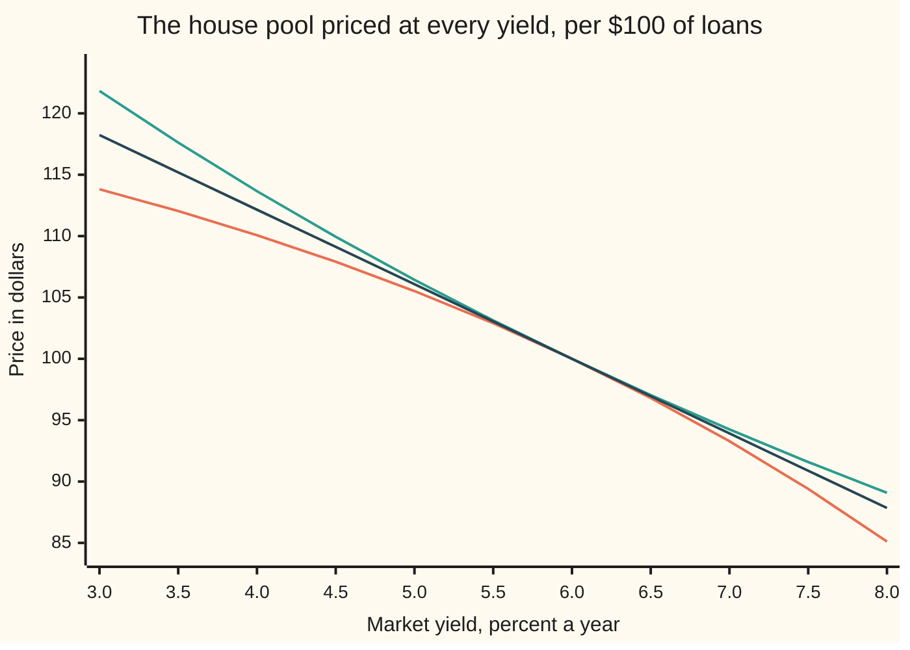

# Negative convexity: why a mortgage bond falls faster than it rises

[Syllabus](../../../SYLLABUS.md) → [Financial mathematics](../../../SYLLABUS.md#w12) → [Mortgages, Callables and Prepayment](../../../SYLLABUS.md#w12-s35) → Negative convexity

---

## General Overview

The house pool is $100 of 30-year home loans. Every loan charges 6 percent a year, paid monthly, and the pool passes every payment straight to its investor. At today's market yield of 6 percent the pool is worth exactly $100: its **par**, the face amount it still owes. Borrowers also pay loans off early, when they move house or refinance. At today's rates the pool loses 8 percent of its remaining loans a year that way.

Now let rates fall one percentage point, to 5 percent. The same pool with its prepayment speed held fixed would be worth $106.43. The real pool reaches only $105.52, a gain of $5.52, because cheaper loans elsewhere tempt borrowers to refinance, and they hand back 6 percent money just when 6 percent has become a good return. Let rates rise one point instead, to 7 percent. Refinancing slows, the 6 percent loans stay outstanding longer at a rate that now looks poor, and the pool loses $6.71. The same one-point move costs more going up than it pays going down.

That lopsidedness has a name. The price curve of an ordinary bond bends upward: **positive convexity**. The mortgage pool's curve bends downward: **negative convexity**. The textbook formula for convexity cannot see it, because that formula assumes the payments are fixed. The fix is a measurement, not a formula: move the yield up and down, rerun the borrowers' behaviour at each new yield, reprice, and read the slope and the bend off the three prices. Done that way, the pool's convexity at par comes out at −119 in years squared, or **−1.2** in the per-hundred units mortgage screens print.

**A mortgage pool's payments shrink when rates fall and stretch when rates rise, so its price curve bends down, and the only honest way to measure that bend is to reprice the pool, prepayment model and all, at a bumped yield on each side.**

**What kind of fact this is:** a method, resting on a model. The two bump formulas are definitions. That this pool's convexity is negative is proved for its prepayment model in Why it works, by an exact sum; real borrowers only approximately follow any such model.

### The picture: three price curves through the same point



Orange: the real pool, whose borrowers prepay faster as rates fall. Green: the same pool with prepayment frozen at 8 percent a year whatever rates do, which is how a fixed-payment bond behaves. Dark blue: the straight line through par with the pool's slope there, which is what duration alone predicts. All three touch at 6 percent. The green curve sits above the straight line on both sides: positive convexity. The orange curve sits below it on both sides: negative convexity. On the left it flattens because refinancing caps the gain; on the right it steepens because the loans stretch out.

---

## The formula

Four pieces of notation first, in words. A **basis point** is a hundredth of a percentage point, so 100 basis points is one point. The **bump** $\delta$ (small delta) is how far the yield is moved each way; the house bump is 100 basis points, $\delta = 0.01$. $V_0$ is the pool's price at today's yield, and $V_-$ and $V_+$ are its prices after the yield is bumped down and up. Each of the three is a full repricing: rerun the borrowers, rebuild 360 months of payments, discount them.

$$D_{\text{eff}} \;=\; \frac{V_- - V_+}{2\,V_0\,\delta}, \qquad C_{\text{eff}} \;=\; \frac{V_- + V_+ - 2V_0}{V_0\,\delta^2}$$

**Read it aloud:** effective duration is the price swing across the two bumps, per unit of price and per unit of yield; effective convexity is how far the two bumped prices together miss twice today's price, per unit of price and per unit of yield squared.

The word **effective** means the payments were allowed to change with the yield. When they cannot change, these two numbers are the modified duration and convexity of [Duration and convexity](../01-Money%2C%20Dates%20and%20Discounting/06-duration-and-convexity.md), measured by bumping instead of by formula.

What makes the payments change is a **prepayment model**: a rule that says how fast borrowers pay off early at each market yield. Speed is quoted as a **CPR**, the conditional prepayment rate: the fraction of remaining loans paid off early over a year. The house rule is a straight line with a floor, where $y$ is the market yield:

$$c(y) \;=\; \max\bigl(2\%,\; 8\% + b\,(6\% - y)\bigr), \qquad b = 2.55$$

**Read it aloud:** at 6 percent borrowers prepay 8 percent a year; every point rates fall adds 2.55 points of prepayment, every point they rise takes 2.55 away, and people who move house keep the speed from ever dropping below 2 percent. The slope 2.55 is an assumption, chosen so the pool lands on the shelf's example of −1.2; the checks show what doubling it does.

| Symbol | Plain meaning | In our example | Push it up and the answer… |
| --- | --- | --- | --- |
| $y$ | the market yield, one rate for every month, compounded monthly | 6% | price falls |
| $\delta$ | the bump: how far the yield is moved each way | 0.01, one point | convexity drifts: −119.00 at 100 bp, −118.59 at 25 bp |
| $V$ | the pool's price, per $100 of loans, at a given yield | $100.00 at 6% | — |
| $V_0$, $V_-$, $V_+$ | the price today, after a bump down, after a bump up | $100.00, $105.52, $93.29 | — |
| $D_{\text{eff}}$ | effective duration: fraction of price lost per unit of yield | 6.117454 | — |
| $C_{\text{eff}}$ | effective convexity, in years squared; divide by 100 for the screen figure | −119.003615, shown as −1.19 | — |
| $L$ | the face: principal still owed | $100 | price scales with it |
| $c$ | CPR: fraction of remaining loans prepaid in a year | 8% at 6%, 10.55% at 5%, 5.45% at 7% | the pool shortens |
| $b$ | refinancing slope: points of CPR added per point of rate fall | 2.55 | convexity turns more negative: −315.34 at 5.10 |
| $i$, $j$ | coupon per month, market yield per month | 0.5%, $y/12$ | — |
| $B_m$, $m$ | loans still outstanding at the start of month $m$ | $100 in month 1 | — |
| $F$ | every month's opening balance, discounted to today and added | the whole card's hinge | duration grows in step |

The monthly prepayment fraction is $1-(1-c)^{1/12}$: 0.6924 percent at 6 percent. Compounding it twelve times reproduces the annual CPR. Each month the pool collects interest at $i$ on its balance, a level payment re-set over the months left, and the prepayments on top ([Mortgage pools](02-mortgage-cash-flows-and-prepayment.md)).

### When it holds

- **The prepayment model is right.** It never is exactly. The slope $b$ is a guess about human behaviour; double it and convexity nearly triples, from −119 to −315. The number is only as good as the model inside it.
- **The curve moves in parallel.** The bump shifts one flat yield. Real curves twist, and a mortgage is exposed at every point of the curve; separate bumps at separate maturities, called key-rate durations, handle that.
- **The bump is small enough to stay on one branch of the model.** A 3-point bump up pushes the speed onto the 2 percent floor and the measured convexity jumps to −93.16. Finite bumps are scenario numbers, not derivatives.
- **The investor receives the full 6 percent.** Real pools pass through less than the borrowers' rate, after servicing and guarantee fees, and then the pool is at par at a different yield. Default and payment delays are left out.
- **Conventions verified 28 September 2026:** this card uses a flat, monthly-compounded yield, prices per $100 of face, and convexity in years squared, with the per-hundred figure shown alongside. Screens differ on the scaling, so a convexity figure needs its units stated.

---

## Why it works

### Step 0: the payments are not fixed, so the formula has to be replaced by a measurement

The fixed-payment convexity formula differentiates each payment's discount factor and leaves the payment alone. For a mortgage pool that is wrong: every payment depends on the yield, through the borrowers. The price is still one number that depends on one yield, so it still has a slope and a bend. Nothing gives those in closed form for a general prepayment model. So measure them: price the pool at three yields, each time letting the model decide the payments, and read the slope and bend off the three prices.

### Step 1: three prices give a slope and a bend

Write the price near today's yield as today's price, plus slope times the move, plus half the bend times the move squared, plus smaller terms ([Duration and convexity](../01-Money%2C%20Dates%20and%20Discounting/06-duration-and-convexity.md) uses the same expansion). Bump down by $\delta$ and up by $\delta$:

$$V_\pm \;=\; V_0 \;\pm\; V'\,\delta \;+\; \tfrac12\,V''\,\delta^2 \;\pm\; \tfrac16\,V'''\,\delta^3 \;+\;\dots$$

Here $V'$, $V''$ and $V'''$ are the first, second and third derivatives of price with respect to yield at today's yield. Subtract the two lines: the even terms cancel, leaving $V_- - V_+ = -2V'\delta$ plus a $\delta^3$ term. Add them: the odd terms cancel, leaving $V_- + V_+ - 2V_0 = V''\delta^2$ plus a $\delta^4$ term. Divide by the price and the bump, and the two formulas measure $-V'/V_0$ and $V''/V_0$, each with an error that shrinks like $\delta^2$.

The checks confirm the shrinking. At a 1-basis-point bump the pool's convexity is −118.557465; the exact bend, computed below without any bump, is −118.557419. At 100 basis points it is −119.003615. The house bump is a scenario number, close to the local bend but not equal to it.

### Step 2: at par, the price hides a simple identity

Each month the pool's receipt is the interest on the opening balance plus every dollar of principal returned, scheduled or early. That is the opening balance grown by the coupon, minus the closing balance: $(1+i)B_m - B_{m+1}$. Discount every receipt at the market's monthly rate $j$ and add. The sum telescopes (each balance appears once with a plus and once with a minus) to

$$V(y) \;=\; L \;+\; (i - j)\,F(y), \qquad F(y) \;=\; \sum_{m=1}^{360} \frac{B_m(y)}{(1+j)^{m}}$$

**Read it aloud:** the pool is worth its face, plus the coupon's excess over the market rate earned on every dollar outstanding, discounted.

At 6 percent the coupon and the market rate are equal, the second term is zero, and the pool is worth exactly $100 whatever the borrowers do. That is why the example is set at par.

<details>
<summary>Detailed proof: the telescoping sum</summary>

Write $d_m = (1+j)^{-m}$ for the discount factor of month $m$, so $(1+j)\,d_m = d_{m-1}$ and $d_0 = 1$. The receipt in month $m$ is $X_m = (1+i)B_m - B_{m+1}$, where $B_m$ is the opening balance of month $m$ and $B_{361} = 0$. Split $1+i = (1+j) + (i-j)$:
$$\sum_{m=1}^{360} d_m X_m = \sum_{m=1}^{360} d_{m-1} B_m - \sum_{m=1}^{360} d_m B_{m+1} + (i-j)\sum_{m=1}^{360} d_m B_m.$$
The first sum is $B_1 + d_1B_2 + \dots + d_{359}B_{360}$. The second is $d_1B_2 + \dots + d_{359}B_{360} + d_{360}B_{361}$, and the last term is zero. Every term but $B_1 = L$ cancels. What remains is $L + (i-j)F$. The argument never used the prepayment rule, so the identity holds for any speed, including early payoff (later balances are zero).

</details>

### Step 3: differentiate at par, and the slope and bend fall out

The coupon is fixed at $i = 0.5\%$ a month and $j = y/12$, so $i - j = (6\% - y)/12$. Differentiate $V = L + \tfrac{1}{12}(6\% - y)F$ once and twice, then set $y = 6\%$, where the factor $(6\% - y)$ is zero. The exact duration $D = -V'/V$ and convexity $C = V''/V$ come out as

$$D \;=\; \frac{F}{12\,L}, \qquad C \;=\; -\,\frac{F'}{6\,L}$$

Here $F'$ is the rate at which $F$ changes as the yield rises. Two facts follow at once. Duration at par depends only on today's balances, not on how the borrowers would react: the frozen pool and the real pool share the slope 6.077 there, which is why the three curves in the picture touch with one tangent. And the bend's sign is the opposite of the sign of $F'$.

<details>
<summary>The algebra behind this</summary>

$V' = -\tfrac{1}{12}F + \tfrac{1}{12}(6\% - y)F'$ and $V'' = -\tfrac{2}{12}F' + \tfrac{1}{12}(6\% - y)F''$. At $y = 6\%$ the bracket is zero and $V = L$, so $D = -V'/V = F/(12L)$ and $C = V''/V = -F'/(6L)$.

</details>

### Step 4: two forces pull the bend in opposite directions

When the yield rises, $F$ changes for two reasons.

- **Heavier discounting.** Every future balance is divided by a larger $(1+j)^m$. This pushes $F$ down, so it contributes positive convexity. Alone, it is the whole story for a fixed-payment bond: **+67.968696**.
- **Slower paydown.** The speed $c$ falls by $b$ for each unit of yield, so every balance after month 1 stays larger. This pushes $F$ up, and contributes negative convexity: **−186.526115**.

For this pool the second force wins. Exact convexity at par is their sum, **−118.557419**. That is the proof that the house pool is negatively convex: not a picture, a sign. A pool whose borrowers ignored rates ($b = 0$) would keep only the first force; a pool whose borrowers refinance hard would go further negative.

<details>
<summary>The two parts, written out</summary>

Each opening balance has the closed form $B_m = L \cdot \dfrac{(1+i)^{360} - (1+i)^{m-1}}{(1+i)^{360} - 1} \cdot (1-c)^{(m-1)/12}$: the scheduled balance of a level-payment loan, times the chance of surviving $m-1$ months of prepayment. Differentiating $F = \sum B_m(1+j)^{-m}$ with respect to $y$ gives
$$F' = \underbrace{-\sum \tfrac{m}{12}\,\frac{B_m}{(1+j)^{m+1}}}_{\text{discounting}} \;+\; \underbrace{\sum \frac{B_m}{(1+j)^m}\cdot\frac{m-1}{12}\cdot\frac{b}{1-c}}_{\text{slower paydown}},$$
since $dc/dy = -b$ away from the floor. Multiply each part by $-1/(6L)$ to get the two contributions above.

</details>

### Step 5: what "falls faster than it rises" means in numbers

Split the central duration into its two halves. Bumped down, the pool gains $5.52 per $100: a **down-side duration** of 5.522436. Bumped up, it loses $6.71: an **up-side duration** of 6.712472. Negative convexity is exactly this gap; the convexity formula is the up-side duration subtracted from the down-side one, divided by the bump.

The mechanism shows up in the **average life**: the average time, weighted by dollars, until principal comes back. It shortens when rates fall (**contraction**) and lengthens when rates rise (**extension**):

```
average life, years (one block = 0.5 year)
  yield 5%   ███████████████           7.38
  yield 6%   ██████████████████        8.96
  yield 7%   ██████████████████████    11.13
```

A pool whose life stretches from 8.96 years to 11.13 on a rise, and shrinks to 7.38 on a fall, is longer exactly when longer hurts.

The alternative route replaces the single flat yield by thousands of random rate paths and the straight-line speed rule by a fitted one; the price and the bumps are then averages over paths, and the spread over the curve that makes them match the market is [Option-adjusted spread](04-option-adjusted-spread.md).

---

## Worked numbers, by hand

The three prices are three full runs of the 360-month ledger, taken from the checks. Everything after them is arithmetic.

| Step | Arithmetic | Value |
| --- | --- | --- |
| CPR at 5%, 6%, 7% | $8\% \pm 2.55 \times 1\%$ | 10.55%, 8%, 5.45% |
| monthly prepay fraction at 6% | $1 - 0.92^{1/12}$ | 0.006924 |
| price bumped down, $V_-$ | ledger at 5%, speed 10.55% | $105.522436 |
| price today, $V_0$ | ledger at 6%, speed 8% | $100.000000 |
| price bumped up, $V_+$ | ledger at 7%, speed 5.45% | $93.287528 |
| price swing | $105.522436 - 93.287528$ | 12.234908 |
| $D_{\text{eff}}$ | $12.234908 / (2 \times 100 \times 0.01)$ | 6.117454 |
| the miss | $105.522436 + 93.287528 - 200$ | −1.190036 |
| $C_{\text{eff}}$ | $-1.190036 / (100 \times 0.0001)$ | −119.003615 |
| **as the screen shows it** | $-119.003615 / 100$ | **−1.19, the shelf's −1.2** |

The per-hundred figure is the one that reads straight into percent. Half of it is −0.595018. A one-point rise moves the price by −6.117454 − 0.595018 = −6.712472 percent; a one-point fall by 6.117454 − 0.595018 = 5.522436 percent. At a price of $100 those are the dollar moves the pool actually makes, exactly, because the two numbers were measured from those moves.

### What breaks if you drop a piece

| Mistake | Comes out at | What went wrong |
| --- | --- | --- |
| Freeze the speed at 8% when bumping | convexity +68.126164; price at 7% $94.25, not $93.29 | the payments were treated as fixed, so the pool looked like a bond |
| Bump only one side | duration 6.712472 up, 5.522436 down, against 6.117454 | a one-sided bump mixes the slope with half the bend |
| Put −1.19 into the decimal formula | price at 7% $93.88, not $93.29 | −1.19 is per hundred; in decimal yields convexity is −119 |
| Bump 3 points instead of 1 | convexity −93.164366 | the up-bump hits the 2% floor; the model changed shape inside the bump |

---

## Code, from first principles, and it actually runs

The code prices the pool three independent ways. Road 1 runs the pool month by month, re-setting the payment, taking the prepayments, and discounting each receipt. Road 2 never runs a ledger: it writes each balance in closed form and prices with the par identity from Step 2. Road 3 never bumps: it computes the exact slope and bend at par from $D = F/(12L)$ and $C = -F'/(6L)$, with $F'$ split into its two forces. Roads 1 and 2 must agree on every bumped price; road 1 at a 1-basis-point bump must land on road 3's derivatives. The asserts were tested by breaking the maths: flip the sign of the paydown force, shift the closed-form survival by a month, or discount one month short, and an assert fails each time.

### Python

```python
# Negative convexity -- the check behind the card.  Standard library only.
# The house pool: $100 of 30-year mortgages, 6% coupon, paid monthly, prepaying at
# 8% a year when the market yield is 6%.  Borrowers refinance faster when rates fall:
# every point the yield drops adds 2.55 points to the yearly prepayment rate.
L, N, I = 100.0, 360, 0.06 / 12            # face, months, coupon per month
BASE_CPR, SLOPE, FLOOR = 0.08, 2.55, 0.02  # speed at 6%, refinancing slope, movers' floor

def cpr(y, slope=SLOPE):                   # yearly prepayment rate at market yield y
    return max(FLOOR, BASE_CPR + slope * (0.06 - y))

def smm(c):                                # the same speed as a fraction per month
    return 1.0 - (1.0 - c) ** (1.0 / 12.0)

def ledger(y, slope=SLOPE):
    # Road 1: run the pool month by month.  Re-amortise, pay, prepay, discount.
    s, j, bal, pv, wal = smm(cpr(y, slope)), y / 12, L, 0.0, 0.0
    for m in range(1, N + 1):
        pay = bal * I / (1.0 - (1.0 + I) ** -(N - m + 1))   # level payment on what is left
        sched = pay - bal * I                               # its principal part
        extra = s * (bal - sched)                           # prepaid on top
        pv += (pay + extra) / (1.0 + j) ** m
        wal += m / 12 * (sched + extra)
        bal -= sched + extra
    return pv, wal / L

def closed(y, slope=SLOPE):
    # Road 2: no ledger.  Balance in closed form, price from the par identity
    # V = L + (i - j) * F, F = sum of discounted opening balances.
    c, j, g = cpr(y, slope), y / 12, (1.0 + I) ** N
    F = sum((1.0 + j) ** -m * L * (g - (1.0 + I) ** (m - 1)) / (g - 1.0)
            * (1.0 - c) ** ((m - 1) / 12) for m in range(1, N + 1))
    return L + (I - j) * F

def exact_at_par(slope=SLOPE):
    # Road 3: no bumps.  D = F/(12L) and C = -F'/(6L), F' split into its two causes.
    c, j, g = cpr(0.06, slope), 0.005, (1.0 + I) ** N
    F = Fdisc = Fspeed = 0.0
    for m in range(1, N + 1):
        B = L * (g - (1.0 + I) ** (m - 1)) / (g - 1.0) * (1.0 - c) ** ((m - 1) / 12)
        F += B / (1.0 + j) ** m
        Fdisc += -(m / 12) * B / (1.0 + j) ** (m + 1)            # heavier discounting
        Fspeed += B / (1.0 + j) ** m * ((m - 1) / 12) * slope / (1.0 - c)  # slower paydown
    return F / (12 * L), -Fdisc / (6 * L), -Fspeed / (6 * L)

def bumped(price, y0, d):                  # three full repricings -> slope and bend
    dn, v0, up = price(y0 - d), price(y0), price(y0 + d)
    return dn, v0, up, (dn - up) / (2 * v0 * d), (dn + up - 2 * v0) / (v0 * d * d)

p1 = lambda y: ledger(y)[0]
dn, v0, up, D1, C1 = bumped(p1, 0.06, 0.01)                  # the job: 100 bp bumps
_, _, _, D2, C2 = bumped(closed, 0.06, 0.01)
_, _, _, Dbp, Cbp = bumped(p1, 0.06, 0.0001)                 # 1 bp bumps
D3, Cdisc, Cspeed = exact_at_par()
C3 = Cdisc + Cspeed
fdn, f0, fup, Df, Cf = bumped(lambda y: ledger(y, 0.0)[0], 0.06, 0.01)  # speed frozen at 8%
d_down, d_up = (dn - v0) / (v0 * 0.01), (v0 - up) / (v0 * 0.01)
pred_dn = L * (1 + D3 * 0.01 + 0.5 * C3 * 0.0001)            # Taylor from road 3
pred_up = L * (1 - D3 * 0.01 + 0.5 * C3 * 0.0001)
wrong_units = L * (1 - D1 * 0.01 + 0.5 * (C1 / 100) * 0.0001)  # -1.2 put in as years^2
right_units = L * (1 - D1 * 0.01 + 0.5 * C1 * 0.0001)
_, _, _, _, C_25 = bumped(p1, 0.06, 0.0025)
_, _, _, _, C_300 = bumped(p1, 0.06, 0.03)
_, _, _, D_dbl, C_dbl = bumped(lambda y: ledger(y, 2 * SLOPE)[0], 0.06, 0.01)

rows = [
    ("month-1 payment per $100", L * I / (1.0 - (1.0 + I) ** -N)),
    ("monthly prepay fraction at 6%", smm(cpr(0.06))),
    ("CPR at 5%", cpr(0.05)), ("CPR at 6%", cpr(0.06)), ("CPR at 7%", cpr(0.07)),
    ("1 ledger  V at 5%", dn), ("1 ledger  V at 6%", v0), ("1 ledger  V at 7%", up),
    ("2 closed  V at 5%", closed(0.05)), ("2 closed  V at 6%", closed(0.06)),
    ("2 closed  V at 7%", closed(0.07)),
    ("gain on a 1-point fall", dn - v0), ("loss on a 1-point rise", v0 - up),
    ("price swing, V- minus V+", dn - up), ("the miss, V- + V+ - 2 V0", dn + up - 2 * v0),
    ("1 ledger  D_eff, 100 bp", D1), ("1 ledger  C_eff, 100 bp", C1),
    ("2 closed  D_eff, 100 bp", D2), ("2 closed  C_eff, 100 bp", C2),
    ("  C_eff / 100, as quoted", C1 / 100), ("  half of that", C1 / 200),
    ("1 ledger  D_eff, 1 bp", Dbp), ("1 ledger  C_eff, 1 bp", Cbp),
    ("3 exact   D at par", D3), ("3 exact   C at par", C3),
    ("  discounting part of C", Cdisc), ("  prepayment part of C", Cspeed),
    ("down-side duration", d_down), ("up-side duration", d_up),
    ("average life at 5%, years", ledger(0.05)[1]), ("average life at 6%, years", ledger(0.06)[1]),
    ("average life at 7%, years", ledger(0.07)[1]),
    ("Taylor V at 5%, exact D and C", pred_dn), ("Taylor V at 7%, exact D and C", pred_up),
    ("wrong: speed frozen, V at 5%", fdn), ("wrong: speed frozen, V at 7%", fup),
    ("wrong: speed frozen, D_eff", Df), ("wrong: speed frozen, C_eff", Cf),
    ("wrong: -1.2 used as years^2, V at 7%", wrong_units),
    ("  right units, V at 7%", right_units),
    ("try: C_eff, 25 bp bumps", C_25), ("try: C_eff, 300 bp bumps", C_300),
    ("try: slope doubled, D_eff", D_dbl), ("try: slope doubled, C_eff", C_dbl),
]
for name, v in rows:
    print(f"{name:<38} {v:>12.6f}")

ys = [0.03 + 0.005 * k for k in range(11)]                    # chart: yields 3% to 8%
print("chart, yield %     " + " ".join(f"{100 * y:6.1f}" for y in ys))
print("chart, prepaying   " + " ".join(f"{ledger(y)[0]:6.2f}" for y in ys))
print("chart, frozen 8%   " + " ".join(f"{ledger(y, 0.0)[0]:6.2f}" for y in ys))
print("chart, tangent     " + " ".join(f"{L * (1 - D3 * (y - 0.06)):6.2f}" for y in ys))

assert abs(v0 - L) < 1e-9,                "ledger at par must equal the par identity's 100"
assert abs(dn - closed(0.05)) < 1e-9 and abs(up - closed(0.07)) < 1e-9, "roads 1 and 2 disagree"
assert abs(Cbp - C3) < 0.01,              "1 bp bumped convexity vs exact derivative"
assert abs(Dbp - D3) < 1e-5,              "1 bp bumped duration vs exact derivative"
assert abs(Cf - Cdisc) < 1.0,             "frozen pool's convexity vs discounting part"
assert C1 < 0 < Cf and abs(C1 / 100 + 1.2) < 0.05, "house pool must show -1.2 per hundred"
print("ALL CHECKS PASS")
```

**Ran 2026-09-28 on macOS, Python 3.14.6, standard library only. All checks passed. Output, pasted from the run:**

```
month-1 payment per $100                   0.599551
monthly prepay fraction at 6%              0.006924
CPR at 5%                                  0.105500
CPR at 6%                                  0.080000
CPR at 7%                                  0.054500
1 ledger  V at 5%                        105.522436
1 ledger  V at 6%                        100.000000
1 ledger  V at 7%                         93.287528
2 closed  V at 5%                        105.522436
2 closed  V at 6%                        100.000000
2 closed  V at 7%                         93.287528
gain on a 1-point fall                     5.522436
loss on a 1-point rise                     6.712472
price swing, V- minus V+                  12.234908
the miss, V- + V+ - 2 V0                  -1.190036
1 ledger  D_eff, 100 bp                    6.117454
1 ledger  C_eff, 100 bp                 -119.003615
2 closed  D_eff, 100 bp                    6.117454
2 closed  C_eff, 100 bp                 -119.003615
  C_eff / 100, as quoted                  -1.190036
  half of that                            -0.595018
1 ledger  D_eff, 1 bp                      6.077062
1 ledger  C_eff, 1 bp                   -118.557465
3 exact   D at par                         6.077058
3 exact   C at par                      -118.557419
  discounting part of C                   67.968696
  prepayment part of C                  -186.526115
down-side duration                         5.522436
up-side duration                           6.712472
average life at 5%, years                  7.381021
average life at 6%, years                  8.959513
average life at 7%, years                 11.127872
Taylor V at 5%, exact D and C            105.484271
Taylor V at 7%, exact D and C             93.330155
wrong: speed frozen, V at 5%             106.434946
wrong: speed frozen, V at 7%              94.246315
wrong: speed frozen, D_eff                 6.094316
wrong: speed frozen, C_eff                68.126164
wrong: -1.2 used as years^2, V at 7%      93.876596
  right units, V at 7%                    93.287528
try: C_eff, 25 bp bumps                 -118.585271
try: C_eff, 300 bp bumps                 -93.164366
try: slope doubled, D_eff                  6.382701
try: slope doubled, C_eff               -315.339395
chart, yield %        3.0    3.5    4.0    4.5    5.0    5.5    6.0    6.5    7.0    7.5    8.0
chart, prepaying   113.82 112.04 110.07 107.91 105.52 102.90 100.00  96.81  93.29  89.40  85.11
chart, frozen 8%   121.83 117.62 113.66 109.94 106.43 103.13 100.00  97.04  94.25  91.59  89.08
chart, tangent     118.23 115.19 112.15 109.12 106.08 103.04 100.00  96.96  93.92  90.88  87.85
ALL CHECKS PASS
```

Three roads, one pool. The ledger and the closed form agree on every bumped price to six decimals. The 1-basis-point bump and the exact convexity agree to six significant figures. The frozen pool's convexity, +68.126164 at 100 basis points, sits beside the discounting force alone, +67.968696: the gap is the bump's own $\delta^2$ error.

### Rust

Same roads, same inputs, same labels. No crates.

```rust
// Negative convexity -- the same check as negative_convexity_check.py, in Rust.
// Standard library only, no crates.  The house pool: $100 of 30-year mortgages,
// 6% coupon paid monthly, prepaying at 8% a year when the market yield is 6%;
// every point the yield drops adds 2.55 points to the yearly prepayment rate.
const L: f64 = 100.0;
const N: usize = 360;
const I: f64 = 0.06 / 12.0;
const BASE_CPR: f64 = 0.08;
const SLOPE: f64 = 2.55;
const FLOOR: f64 = 0.02;

fn cpr(y: f64, slope: f64) -> f64 { (BASE_CPR + slope * (0.06 - y)).max(FLOOR) }
fn smm(c: f64) -> f64 { 1.0 - (1.0 - c).powf(1.0 / 12.0) }

// Road 1: run the pool month by month.  Re-amortise, pay, prepay, discount.
fn ledger(y: f64, slope: f64) -> (f64, f64) {
    let (s, j) = (smm(cpr(y, slope)), y / 12.0);
    let (mut bal, mut pv, mut wal) = (L, 0.0, 0.0);
    for m in 1..=N {
        let pay = bal * I / (1.0 - (1.0 + I).powi(-((N - m + 1) as i32)));
        let sched = pay - bal * I;
        let extra = s * (bal - sched);
        pv += (pay + extra) / (1.0 + j).powi(m as i32);
        wal += m as f64 / 12.0 * (sched + extra);
        bal -= sched + extra;
    }
    (pv, wal / L)
}

fn balance(m: usize, c: f64) -> f64 {             // opening balance of month m, closed form
    let g = (1.0 + I).powi(N as i32);
    L * (g - (1.0 + I).powi(m as i32 - 1)) / (g - 1.0) * (1.0 - c).powf((m as f64 - 1.0) / 12.0)
}

// Road 2: no ledger.  V = L + (i - j) * F, F = sum of discounted opening balances.
fn closed(y: f64) -> f64 {
    let (c, j) = (cpr(y, SLOPE), y / 12.0);
    let f: f64 = (1..=N).map(|m| balance(m, c) / (1.0 + j).powi(m as i32)).sum();
    L + (I - j) * f
}

// Road 3: no bumps.  D = F/(12L), C = -F'/(6L), F' split into its two causes.
fn exact_at_par() -> (f64, f64, f64) {
    let (c, j) = (cpr(0.06, SLOPE), 0.005_f64);
    let (mut f, mut f_disc, mut f_speed) = (0.0, 0.0, 0.0);
    for m in 1..=N {
        let (b, mf) = (balance(m, c), m as f64);
        f += b / (1.0 + j).powi(m as i32);
        f_disc += -(mf / 12.0) * b / (1.0 + j).powi(m as i32 + 1);
        f_speed += b / (1.0 + j).powi(m as i32) * ((mf - 1.0) / 12.0) * SLOPE / (1.0 - c);
    }
    (f / (12.0 * L), -f_disc / (6.0 * L), -f_speed / (6.0 * L))
}

fn bumped<P: Fn(f64) -> f64>(price: P, y0: f64, d: f64) -> (f64, f64, f64, f64, f64) {
    let (dn, v0, up) = (price(y0 - d), price(y0), price(y0 + d));
    (dn, v0, up, (dn - up) / (2.0 * v0 * d), (dn + up - 2.0 * v0) / (v0 * d * d))
}

fn main() {
    let p1 = |y: f64| ledger(y, SLOPE).0;
    let (dn, v0, up, d1, c1) = bumped(p1, 0.06, 0.01);
    let (_, _, _, d2, c2) = bumped(closed, 0.06, 0.01);
    let (_, _, _, dbp, cbp) = bumped(p1, 0.06, 0.0001);
    let (d3, c_disc, c_speed) = exact_at_par();
    let c3 = c_disc + c_speed;
    let (fdn, _, fup, df, cf) = bumped(|y: f64| ledger(y, 0.0).0, 0.06, 0.01);
    let (d_down, d_up) = ((dn - v0) / (v0 * 0.01), (v0 - up) / (v0 * 0.01));
    let pred_dn = L * (1.0 + d3 * 0.01 + 0.5 * c3 * 0.0001);
    let pred_up = L * (1.0 - d3 * 0.01 + 0.5 * c3 * 0.0001);
    let wrong_units = L * (1.0 - d1 * 0.01 + 0.5 * (c1 / 100.0) * 0.0001);
    let right_units = L * (1.0 - d1 * 0.01 + 0.5 * c1 * 0.0001);
    let c_25 = bumped(p1, 0.06, 0.0025).4;
    let c_300 = bumped(p1, 0.06, 0.03).4;
    let (_, _, _, d_dbl, c_dbl) = bumped(|y: f64| ledger(y, 2.0 * SLOPE).0, 0.06, 0.01);

    let rows: Vec<(&str, f64)> = vec![
        ("month-1 payment per $100", L * I / (1.0 - (1.0 + I).powi(-(N as i32)))),
        ("monthly prepay fraction at 6%", smm(cpr(0.06, SLOPE))),
        ("CPR at 5%", cpr(0.05, SLOPE)), ("CPR at 6%", cpr(0.06, SLOPE)), ("CPR at 7%", cpr(0.07, SLOPE)),
        ("1 ledger  V at 5%", dn), ("1 ledger  V at 6%", v0), ("1 ledger  V at 7%", up),
        ("2 closed  V at 5%", closed(0.05)), ("2 closed  V at 6%", closed(0.06)),
        ("2 closed  V at 7%", closed(0.07)),
        ("gain on a 1-point fall", dn - v0), ("loss on a 1-point rise", v0 - up),
        ("price swing, V- minus V+", dn - up), ("the miss, V- + V+ - 2 V0", dn + up - 2.0 * v0),
        ("1 ledger  D_eff, 100 bp", d1), ("1 ledger  C_eff, 100 bp", c1),
        ("2 closed  D_eff, 100 bp", d2), ("2 closed  C_eff, 100 bp", c2),
        ("  C_eff / 100, as quoted", c1 / 100.0), ("  half of that", c1 / 200.0),
        ("1 ledger  D_eff, 1 bp", dbp), ("1 ledger  C_eff, 1 bp", cbp),
        ("3 exact   D at par", d3), ("3 exact   C at par", c3),
        ("  discounting part of C", c_disc), ("  prepayment part of C", c_speed),
        ("down-side duration", d_down), ("up-side duration", d_up),
        ("average life at 5%, years", ledger(0.05, SLOPE).1), ("average life at 6%, years", ledger(0.06, SLOPE).1),
        ("average life at 7%, years", ledger(0.07, SLOPE).1),
        ("Taylor V at 5%, exact D and C", pred_dn), ("Taylor V at 7%, exact D and C", pred_up),
        ("wrong: speed frozen, V at 5%", fdn), ("wrong: speed frozen, V at 7%", fup),
        ("wrong: speed frozen, D_eff", df), ("wrong: speed frozen, C_eff", cf),
        ("wrong: -1.2 used as years^2, V at 7%", wrong_units),
        ("  right units, V at 7%", right_units),
        ("try: C_eff, 25 bp bumps", c_25), ("try: C_eff, 300 bp bumps", c_300),
        ("try: slope doubled, D_eff", d_dbl), ("try: slope doubled, C_eff", c_dbl),
    ];
    for (name, v) in &rows { println!("{:<38} {:>12.6}", name, v); }

    let ys: Vec<f64> = (0..11).map(|k| 0.03 + 0.005 * k as f64).collect();   // chart: 3% to 8%
    let line = |f: &dyn Fn(f64) -> f64, fmt1: bool| -> String {
        ys.iter().map(|&y| if fmt1 { format!("{:6.1}", f(y)) } else { format!("{:6.2}", f(y)) })
            .collect::<Vec<_>>().join(" ")
    };
    println!("chart, yield %     {}", line(&|y| 100.0 * y, true));
    println!("chart, prepaying   {}", line(&|y| ledger(y, SLOPE).0, false));
    println!("chart, frozen 8%   {}", line(&|y| ledger(y, 0.0).0, false));
    println!("chart, tangent     {}", line(&|y| L * (1.0 - d3 * (y - 0.06)), false));

    assert!((v0 - L).abs() < 1e-9, "ledger at par must equal the par identity's 100");
    assert!((dn - closed(0.05)).abs() < 1e-9 && (up - closed(0.07)).abs() < 1e-9, "roads 1 and 2 disagree");
    assert!((cbp - c3).abs() < 0.01, "1 bp bumped convexity vs exact derivative");
    assert!((dbp - d3).abs() < 1e-5, "1 bp bumped duration vs exact derivative");
    assert!((cf - c_disc).abs() < 1.0, "frozen pool's convexity vs discounting part");
    assert!(c1 < 0.0 && 0.0 < cf && (c1 / 100.0 + 1.2).abs() < 0.05, "house pool must show -1.2 per hundred");
    println!("ALL CHECKS PASS");
}
```

**Ran 2026-09-28 on macOS, rustc 1.98.1, no crates. All checks passed. Output, pasted from the run:**

```
month-1 payment per $100                   0.599551
monthly prepay fraction at 6%              0.006924
CPR at 5%                                  0.105500
CPR at 6%                                  0.080000
CPR at 7%                                  0.054500
1 ledger  V at 5%                        105.522436
1 ledger  V at 6%                        100.000000
1 ledger  V at 7%                         93.287528
2 closed  V at 5%                        105.522436
2 closed  V at 6%                        100.000000
2 closed  V at 7%                         93.287528
gain on a 1-point fall                     5.522436
loss on a 1-point rise                     6.712472
price swing, V- minus V+                  12.234908
the miss, V- + V+ - 2 V0                  -1.190036
1 ledger  D_eff, 100 bp                    6.117454
1 ledger  C_eff, 100 bp                 -119.003615
2 closed  D_eff, 100 bp                    6.117454
2 closed  C_eff, 100 bp                 -119.003615
  C_eff / 100, as quoted                  -1.190036
  half of that                            -0.595018
1 ledger  D_eff, 1 bp                      6.077062
1 ledger  C_eff, 1 bp                   -118.557465
3 exact   D at par                         6.077058
3 exact   C at par                      -118.557419
  discounting part of C                   67.968696
  prepayment part of C                  -186.526115
down-side duration                         5.522436
up-side duration                           6.712472
average life at 5%, years                  7.381021
average life at 6%, years                  8.959513
average life at 7%, years                 11.127872
Taylor V at 5%, exact D and C            105.484271
Taylor V at 7%, exact D and C             93.330155
wrong: speed frozen, V at 5%             106.434946
wrong: speed frozen, V at 7%              94.246315
wrong: speed frozen, D_eff                 6.094316
wrong: speed frozen, C_eff                68.126164
wrong: -1.2 used as years^2, V at 7%      93.876596
  right units, V at 7%                    93.287528
try: C_eff, 25 bp bumps                 -118.585271
try: C_eff, 300 bp bumps                 -93.164366
try: slope doubled, D_eff                  6.382701
try: slope doubled, C_eff               -315.339395
chart, yield %        3.0    3.5    4.0    4.5    5.0    5.5    6.0    6.5    7.0    7.5    8.0
chart, prepaying   113.82 112.04 110.07 107.91 105.52 102.90 100.00  96.81  93.29  89.40  85.11
chart, frozen 8%   121.83 117.62 113.66 109.94 106.43 103.13 100.00  97.04  94.25  91.59  89.08
chart, tangent     118.23 115.19 112.15 109.12 106.08 103.04 100.00  96.96  93.92  90.88  87.85
ALL CHECKS PASS
```

The two outputs agree line for line at the printed precision.

> [!TIP]
> **Try changing**
> Guess the direction first. Then run it.
> - **Double the refinancing slope.** Set `SLOPE = 5.1`. Convexity goes from −119.00 to **−315.34**, and duration rises from 6.117 to **6.383**: the bump now crosses more behaviour change.
> - **Switch refinancing off.** Set `SLOPE = 0.0`. The pool behaves like a bond: duration **6.094316**, convexity **+68.126164**.
> - **Shrink the bump to 25 basis points.** Convexity is **−118.585271**, closer to the exact −118.557419. Smaller bumps converge on the derivative.

---

## The usual mistake

> [!warning]
> **Measuring a mortgage's rate risk with its payments held still.** Project today's cash flows at 8 percent CPR, then compute duration and convexity as for any bond, and the pool shows convexity of +68: it seems to gain more on a fall than it loses on a rise. The truth is −119. The error is not in the arithmetic; it is in freezing the one thing that makes a mortgage a mortgage. Every bump must rerun the prepayment model.
>
> Smaller traps:
> - **Trusting duration at par to reveal the problem.** The frozen pool and the real pool have nearly the same duration at par, 6.09 against 6.12 on 100-basis-point bumps. A hedge sized by duration alone looks right on the day and loses on both sides as rates move.
> - **Losing the scaling.** −1.2 per hundred and −119 in years squared are the same bend. Put −1.19 into the decimal formula and it predicts $93.88 after a one-point rise, where the pool is worth $93.29.
> - **Reporting a convexity without its bump.** −119.00 at 100 basis points, −118.59 at 25, −93.16 at 300. The bump size belongs next to the number.
> - **Forgetting the model is inside the number.** Change the refinancing slope and the convexity moves by hundreds. Two desks with two prepayment models can quote different convexities for the same pool, and neither is wrong about its own model.

---

## Where you meet it in real life

- **Mortgage-backed securities desks.** Effective duration and convexity are the standard risk figures for pass-through pools, and every one is computed by bumping through a prepayment model as here. [Mortgage-backed securities in outline](05-mortgage-backed-securities-in-outline.md) shows how pools are packaged.
- **Hedging a mortgage portfolio.** A negatively convex position must be re-hedged as rates move: sell duration after a rise, buy it back after a fall. Holders who hedge this way trade in the same direction as the move.
- **Callable bonds.** A company's right to repay its bonds early caps their price the same way refinancing caps the pool's: [Callable bonds](01-callable-bonds-and-yield-to-worst.md).
- **Homeowners.** Every fixed-rate borrower with a free right to prepay holds an option against the lender. Negative convexity is the lender's side of that option.
- **Pricing against the market.** The bump method here uses one flat yield and one speed rule. Market prices come from random rate paths and a spread fitted to them: [Option-adjusted spread](04-option-adjusted-spread.md).

> **Say it back**
> A mortgage pool's payments depend on rates, because borrowers refinance when rates fall and hold on when rates rise. So its price curve bends down: a one-point fall gains $5.52 and a one-point rise loses $6.71 on the $100 house pool. Effective duration and convexity measure this by repricing the pool, prepayment model included, one bump down and one bump up. At par, the price identity splits the bend into a discounting force that makes it positive and a paydown force that makes it negative. For the house pool the paydown force wins, and the convexity is −119 in years squared, −1.2 per hundred.

---

## What this builds on

- [Mortgage pools](02-mortgage-cash-flows-and-prepayment.md): the monthly ledger of a pool, CPR and its monthly form, and the level payment re-set after each prepayment. Road 1 of the code is that ledger.
- [Duration and convexity](../01-Money%2C%20Dates%20and%20Discounting/06-duration-and-convexity.md): slope and bend of a price curve with fixed payments, and the second-order price estimate. This card keeps the definitions and lets the payments move.

## Where this goes next

- [Option-adjusted spread](04-option-adjusted-spread.md): prices the pool over many random rate paths instead of one flat yield, and fits the spread that matches a market price; its effective duration and convexity are bumped the same way.

A real pool trades at some spread over the rate curve. Part of that spread pays the investor for the refinancing option sold to borrowers; the option-adjusted spread is what is left once that part is taken out.

---

## Sources

Verified 28 Sep 2026: every link below resolves to the publisher's page.

- Schwartz, Eduardo S., and Walter N. Torous. "Prepayment and the Valuation of Mortgage-Backed Securities." *The Journal of Finance* 44, no. 2 (1989): 375–392. [doi:10.1111/j.1540-6261.1989.tb05062.x](https://doi.org/10.1111/j.1540-6261.1989.tb05062.x). Prepayment modelled as a function of rates inside the pricing of a pool.
- Tuckman, Bruce, and Angel Serrat. *Fixed Income Securities: Tools for Today's Markets*, 4th ed. Wiley, 2022. [Publisher page](https://www.wiley.com/en-us/Fixed+Income+Securities%3A+Tools+for+Today%27s+Markets%2C+4th+Edition-p-9781119835554). Chapter 15, "Mortgages and Mortgage-Backed Securities": the textbook treatment of prepayment and pass-through pools.
- CFA Institute. "Curve-Based and Empirical Fixed-Income Risk Measures." Refresher reading, 2026. [Publisher page](https://www.cfainstitute.org/insights/professional-learning/refresher-readings/2026/curve-based-and-empirical-fixed-income-risk-measures). Effective duration and convexity as the measures for bonds whose cash flows are uncertain.
- CFA Institute. "Valuation and Analysis of Bonds with Embedded Options." Refresher reading, 2026. [Publisher page](https://www.cfainstitute.org/insights/professional-learning/refresher-readings/2026/valuation-analysis-bonds-embedded-options). One-sided durations and effective convexity for bonds with an early-repayment option.
