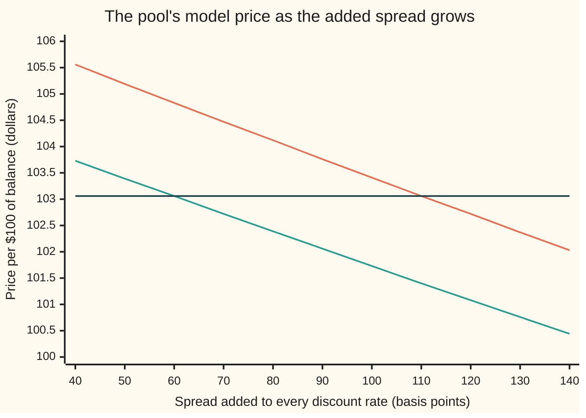
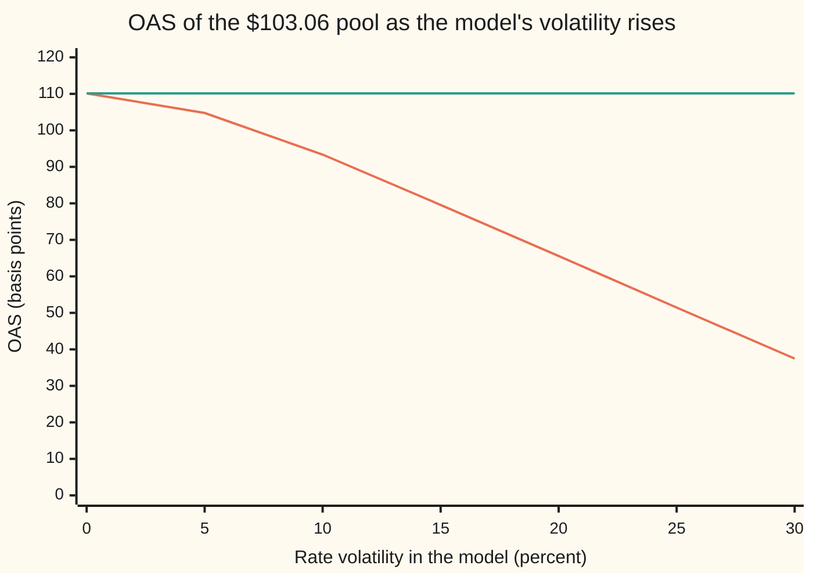

# Option-adjusted spread: the spread over the curve after the embedded option is priced out

Financial mathematics → Mortgages, Callables and Prepayment → Pricing out the prepayment option → Option-adjusted spread

---

## General Overview

A pool of 30-year home loans pays its holder 6% a year on the balance still owed. It starts at $100 of balance. Every year the homeowners repay part of it on schedule, and some of them repay the whole loan early. In a quiet year 8% of the remaining balance leaves early. When rates fall, many more leave, because a homeowner paying 6% can refinance at less.

The pool trades at **$103.06** per $100 of balance. Project its payments along today's forward rates, discount them on today's curve with a constant extra rate added, the way [z-spread-and-asset-swap-spread](../02-Curves/06-z-spread-and-asset-swap-spread.md) does for a plain bond, and the extra rate that hits $103.06 is **110 basis points** (one basis point is 0.01%, so 110 of them are 1.10% a year). That looks generous.

It is not all reward. Part of the 110 pays for something the investor has sold: every homeowner's right to hand the money back at par when rates fall, exactly when a 6% loan is worth most to keep. Price that right with a model of how rates can move, take its cost out, and the spread left over is about **60 basis points**. That leftover is the **option-adjusted spread**, OAS for short. The 50 basis points between the two numbers is the price of the homeowners' option, charged to the investor as a rate.

**The option-adjusted spread is the one constant rate which, added to every discount rate along every path of a model of future interest rates, makes the average discounted cash flow equal the market price; the gap between it and the z-spread is what the embedded option costs.**

**What kind of fact this is:** a method — a spread defined through a model of interest rates, which is an assumption, not a law. That exactly one spread fits a given price is proved on this card in Why it works.

**Conventions verified 28 Sep 2026:** OAS is quoted in basis points a year over a named curve, usually the swap curve or the government curve, and a quote means nothing without its curve and its model's volatility. This card steps once a year, compounds continuously and has the pool pay once a year. Real pools pay monthly and quote prepayment as a yearly rate converted to a monthly one; those choices move a quoted spread, so this card's numbers belong to its yearly model only.

### The picture: two prices, one market quote, two crossings



The top line (orange) prices the pool on one path, rates sitting on today's forward rates: the z-spread's view. The middle line (green) averages over many rate paths, with prepayment reacting on each. The flat line (dark) is the market's $103.06. The top line crosses the quote at 110 basis points, the z-spread; the middle line at 60, the OAS. The vertical gap between the sloping lines, $1.77 at 60 basis points, is the value of the homeowners' option.

---

## The formula

Two definitions sit side by side. First the z-spread, on one path. The **forward rate** $f_t$ is the one-year rate that today's curve locks in for year $t+1$; along that single path the pool's payments are $\bar C_t$, fixed numbers once the path is fixed.

$$P = \sum_{t=1}^{30} \bar C_t \, D(t)\, e^{-z t}$$

**Read it aloud:** the market price equals every payment along the forward path, discounted on the curve and then shrunk once more at the constant extra rate $z$.

Then the OAS, over many paths. A **short rate** $r$ is the one-year interest rate that will hold in a given future year; the model lets it wander, and on each path the pool's payments $C_t$ follow the homeowners' reaction to it.

$$P = \mathbb{E}\left[\,\sum_{t=1}^{30} C_t \; e^{-(r_0 + s) - (r_1 + s) - \cdots - (r_{t-1} + s)}\right]$$

**Read it aloud:** the market price equals the average, over all the rate paths the model allows, of every payment discounted along its own path at that path's short rates plus one constant extra rate $s$.

The difference is the option's cost as a rate:

$$\text{option cost} = z - s$$

| Symbol | Plain meaning | In our example | Push it up and the OAS… |
| --- | --- | --- | --- |
| $P$ | the pool's market price per $100 of balance | $103.06 | falls: a dearer pool pays less over the curve |
| $s$ | the option-adjusted spread, added to every short rate on every path | 59.94 bp | — |
| $z$ | the z-spread, added to every zero rate on one path | 110.12 bp | — (it does not move with the OAS; both come from $P$) |
| $C_t$, $\bar C_t$, $t$ | the pool's cash at the end of year $t$ (1 to 30) on one rate path: interest, scheduled principal, early repayment; $\bar C_t$ is the same on the single forward path | $35.21 in year 1 | — |
| $a_i$, $i$, $j$ | the tree's centre rate in year $i+1$, fitted to the curve; $i$ counts steps taken, $j$ how many of them went up | 3.55% in year 1 | — |
| $g$, $c$, $n$ | the scheduled principal per $1 of balance, set by the coupon $c$ = 6% and the $n$ years left | 0.012649 in year 1 | — |
| $r$ | the short rate: the one-year rate holding in a given year, on a given path | 3.55% today; 4.44% or 2.86% next year | — |
| $D(t)$ | today's discount factor for $t$ years, $e^{-(\text{zero rate})\,t}$ | 0.965123 for one year | — |
| $f_t$ | the forward rate for year $t+1$, locked in by today's curve | 5.05% for year 16 | — |
| $p(r)$ | the share of the remaining balance repaid early in a year when the short rate is $r$ | 28.30% at 3.55% | falls: fast repayment at par hurts a pool bought above par |
| $\sigma$ | the model's rate volatility: how widely the short rate can spread, as a proportion | 22% | falls: a wider spread of rates makes the option dearer |
| $\mathbb{E}$, $w_t$ | the average over the model's rate paths, each path weighted by its chance; $w_t$ is that average for year $t$ alone | 20,000 paths, or the whole tree | — |

The prepayment rule is the one piece of behaviour the model assumes:

$$p(r) = 8\% + 14 \times \max(0,\; 5\% - r)$$

In words: 8% of the balance leaves every year whatever happens, and each percentage point the short rate sits below 5% sends another 14 points of the balance away. At 5% or above, only the 8% leaves. The kink at 5%, one point below the 6% coupon, is where refinancing starts to pay.

### When it holds

- **The rate model is right about volatility.** The OAS depends on $\sigma$: at 22% it is 59.94 basis points, at 30% it is 37.47. Two desks with different volatilities quote different OAS for the same pool at the same price. An OAS is a statement about the pool *and* the model.
- **The prepayment rule is right.** Homeowners are not option traders. The rule is a fitted description of how they behave, and when behaviour shifts (tighter lending, a housing boom) the cash flows shift and the OAS with them. A callable bond, where the issuer calls when it pays to, avoids this problem: its rule comes from the tree itself ([callable-bonds-and-yield-to-worst](01-callable-bonds-and-yield-to-worst.md)).
- **The tree reprices today's curve.** If the model's rates do not reprice plain zero-coupon bonds exactly, curve error leaks into the spread. Here an unfitted tree moves the OAS from 59.94 to 73.07 basis points.
- **The spread is only a discount.** $s$ shifts the discounting, never the rates homeowners react to. Let it move prepayment too and the answer drifts to 74.59 basis points: a different, unintended definition.
- **One constant spread.** The OAS is flat across years and paths. Whatever the market charges for liquidity, credit or model doubt gets squeezed into that one number.

---

## Why it works

### Step 0: a spread measured on one path cannot see an option

The z-spread discounts one set of cash flows: the ones that happen if rates follow today's forward rates exactly. On that path nobody's option is tested against a rate that jumped or fell. The option's value lives in the *spread* of possible rates, not their centre, so a one-path measure counts none of it. The z-spread therefore lumps two things together: the reward for owning the pool, and the cost of the option sold with it.

The fix is to let rates move, let the cash flows respond, average, and only then ask what constant spread fits the price. What is left over has had the option priced out.

### Step 1: prepayment reacts to falling rates and ignores rising ones

Look at year 16. Today's curve says the one-year rate then will be 5.05%. At that rate the rule gives 8.00% prepayment, the quiet-year level. But rates in year 16 will not sit at 5.05%. On the fitted tree they spread far below it and far above it. Where they land low, prepayment surges; where they land high, it cannot fall below 8%. Averaged over the tree, year-16 prepayment is 24.92%, three times the one-path figure.

That lopsidedness is an option. The homeowner repays at par — exactly $1 for every $1 owed — when the pool is worth more than par to the investor, and keeps paying 6% when the pool is worth less. The investor holds the loans and has sold that right. [negative-convexity](03-negative-convexity.md) shows the price side of the same fact: the pool's price stops rising when rates fall.

### Step 2: build rate paths that reprice today's curve

The model here is a **binomial tree** of short rates: each year the rate steps up or down, each with chance one half, and the up and down moves recombine so that after $i$ years there are $i+1$ possible rates. The rate in year $i+1$ after $j$ up-steps is

$$r_{i,j} = a_i \, e^{\sigma (2j - i)}$$

where $a_i$ is the tree's centre in that year. This shape, with rates spread proportionally around a moving centre, is the Black–Derman–Toy model; it keeps rates positive.

The centres are not guessed. Each $a_i$ is solved, one year at a time, so that the tree prices a zero-coupon bond maturing in year $i+1$ at exactly today's $D(i+1)$. The tool is a running table of **state prices**: the price today of $1 paid only if the path reaches a given node. Each year every node's state price is discounted at that node's rate and split half to each child. A year's state prices add up to the tree's price of a zero-coupon bond, and one search per year makes that sum hit the curve.

A tree fitted this way reprices every plain bond on today's curve, so any spread it later finds belongs to the pool, not to the curve. Set $\sigma = 0$ and the fitted tree collapses to one path whose rates are exactly the forward rates $f_t$ — the checks confirm it to 12 decimals.

### Step 3: price the pool backwards, per dollar of balance

The pool's balance depends on its whole history: how much prepaid in every earlier year. That looks like it needs every path separately. It does not, because every cash flow is proportional to the balance. A node's value per $1 of balance still owed depends only on that node's rate and what can happen afterwards. So one number per node is enough.

At a node in year $i+1$ with short rate $r$, let $g$ be the scheduled principal per $1$ of balance and $p = p(r)$. One dollar of balance pays, at the year's end, interest $c = 0.06$, scheduled principal $g$, and early repayment $p(1-g)$. What is left, $(1-g)(1-p)$, carries on and is worth the average of the two children's values per dollar. Discount the lot at $r + s$:

$$V = e^{-(r+s)}\Big[\,c + g + p(1-g) + (1-g)(1-p)\,\tfrac12\big(V_{\text{up}} + V_{\text{down}}\big)\Big]$$

Start from zero after year 30 and walk back to today. The pool's price is 100 times the value at today's single node.

<details>
<summary>Where the scheduled principal comes from</summary>

A 30-year loan with fixed yearly payments pays the same total each year. With coupon $c$ and $n$ years left, the part of that payment which repays principal, per $1 of balance, is $g = c / ((1+c)^n - 1)$. With 30 years left that is $0.06/(1.06^{30} - 1) = 0.012649$: $1.26 on $100. It grows every year as the interest part shrinks. It depends only on the loan's age, never on the rate path, which is why it can sit inside the per-dollar value.

</details>

### Step 4: exactly one spread fits the price

The spread enters only the discounting, never the cash flows. So the model price is a sum over years of a positive weight times $e^{-st}$:

$$\text{price}(s) = \sum_{t=1}^{30} w_t\, e^{-st}, \qquad w_t > 0$$

Each term shrinks as $s$ rises, so the price falls strictly, from infinity down to zero: every positive market price is met exactly once. The boundary cases: a price above the model price at $s = 0$ gives a negative OAS, which happens for pools of the safest loans or with a model that overstates the option; a price of zero or less has no spread at all.

<details>
<summary>Detailed proof: one and only one OAS for each positive price</summary>

**The weights.** Collect the average over paths year by year: $w_t$ is the average of $C_t\,e^{-(r_0 + \cdots + r_{t-1})}$ across paths. Every $C_t > 0$, because a live loan always pays at least its interest, and every exponential is positive, so $w_t > 0$. The weights do not depend on $s$, because prepayment reacts to $r$ alone. The simulation road in the code computes exactly these weights, once, and then solves.

**Continuity and strict fall.** $\text{price}(s)$ is a finite sum of continuous functions, so it is continuous. Its slope is $-\sum_t t\,w_t\,e^{-st} < 0$, so no two spreads give the same price.

**Full range.** As $s \to +\infty$ every term goes to zero. As $s \to -\infty$ every term grows without bound. By the intermediate value theorem the continuous, strictly falling function takes every value in $(0, \infty)$ exactly once.

**Where it fails.** If the spread fed into prepayment (the mistake in Worked numbers), the weights would depend on $s$. The price usually still falls with $s$ but is no longer a clean sum of exponentials, and uniqueness has to be checked case by case. With a cash flow of the wrong sign, a fee paid out, uniqueness can fail outright.

</details>

The search itself is bisection: bracket the spread between −5% and +30%, halve the bracket a hundred times, keep the half where the price crosses. It cannot fail when the price at −5% sits above the market price and the price at +30% below it; here they are far apart.

### Step 5: the z-spread is the OAS at zero volatility

Set $\sigma = 0$. The tree becomes the single forward path, prepayment follows $p(f_t)$, and the OAS formula turns into the z-spread formula term for term. The checks confirm it: at $\sigma = 0$ the tree's spread is 110.1237 basis points, the one-path sum's is 110.1237.

Now turn volatility up. Rates spread out, prepayment surges on the low paths and cannot fall below 8% on the high ones, and the pool — sold at a premium, so every early dollar returned at par is a loss — is worth less at any given spread. A lower price curve crosses the market price further left: the OAS falls.



The falling line (orange) is the OAS at each volatility. The flat line (green) is the z-spread, which no volatility touches. They meet at zero volatility. At 22%, this card's setting, the gap is 50.19 basis points. Strip the rate reaction out of the rule — prepayment a flat 8% everywhere — and there is no option: the OAS and the z-spread coincide at 130.92 basis points, because a fitted tree reprices fixed cash flows exactly at any volatility.

### Step 6: the second road, by simulation

The tree walks backwards. A simulation walks forwards. Draw a path: flip a coin each year for up or down, read the rate off the same tree, and follow the actual balance — $100 at the start, shrinking by scheduled principal and prepayment year after year. Record each year's cash flow times the path's discount $e^{-(r_0 + \cdots + r_{t-1})}$. Average over 20,000 paths (10,000 drawn, each paired with its mirror image, which flips every coin and cuts the noise). That gives the weights $w_t$ of Step 4 directly, and the OAS comes from the same bisection.

The simulation never uses the per-dollar trick. It lands at 59.94 basis points, within a hundredth of a basis point of the tree. Real mortgage desks simulate, because real prepayment depends on the path's history (a pool that has refinanced once is slower to do it again), which a recombining tree cannot hold.

---

## Worked numbers, by hand

The curve's zero rates run in a straight line from 3.55% at one year through 4.00% at ten years to 5.00% at thirty. Year 1 is the same on every path, so it can be done by hand:

| Step | Arithmetic | Value |
| --- | --- | --- |
| short rate this year | today's one-year zero rate | 3.55% |
| prepayment rate | $8\% + 14 \times (5\% - 3.55\%)$ | 28.30% |
| interest on $100 | $100 \times 6\%$ | $6.00 |
| scheduled principal | $100 \times 0.06 / (1.06^{30} - 1)$ | $1.2649 |
| early repayment | $28.30\% \times (100 - 1.2649)$ | $27.9420 |
| year-1 cash flow | $6 + 1.2649 + 27.9420$ | $35.2069 |
| discounted on the curve, then at the z-spread | $35.2069 \times 0.965123 \times 0.989048$ | $33.6069 |
| next year's short rate, up or down | $a_1 e^{\pm 0.22}$ from the fitted tree | 4.44% or 2.86% |
| next year's prepayment, up or down | $p(4.44\%)$, $p(2.86\%)$ | 15.78% or 37.93% |
| all 30 years on the forward path, spread 0 | code | $107.03 |
| all 30 years on the tree, spread 0 | code | $105.11 |
| z-spread that brings the forward path to $103.06 | bisection | 110.12 bp |
| **OAS that brings the tree to $103.06** | bisection | **59.94 bp** |
| option cost as a spread | $110.12 - 59.94$ | 50.19 bp |
| option cost as a price | forward path at 59.94 bp, minus $103.06 | $1.77 |

The pool pays 60 basis points over the curve for its credit, liquidity and model risk; the other 50 of the headline 110 are rent the investor collects for the refinancing option sold to homeowners, and the model prices that option at $1.77 per $100.

### What breaks if you drop a piece

The true OAS is 59.94 basis points. Each row keeps the market price at $103.06 and gets one piece wrong:

| Mistake | Comes out at | What went wrong |
| --- | --- | --- |
| Reading the z-spread as the OAS | 110.12 bp | 50 basis points of option cost counted as reward: the pool looks 1.77 dollars cheaper than it is |
| Letting the spread move prepayment too | 74.59 bp | homeowners were made to refinance off $r + s$, a rate nobody offers them; fewer prepay, the model values the pool higher, the spread overshoots |
| Tree not fitted to the curve (centre held at 3.55%) | 73.07 bp | the tree's rates sit below the forwards, so it misprices even a plain bond; the error lands in the spread |
| Only 20 simulated paths | 49.94 bp | ten basis points of noise; other seeds give anything from 40 to 72. Twenty paths cannot average the low-rate tails where the option lives |

Every number in that table is reproduced by the code below.

---

## Code, from first principles, and it actually runs

The code fits the rate tree, then reaches the OAS by **two independent roads**: backward induction per dollar of balance, and forward simulation of 20,000 paths tracking the real balance with its own random-number generator. The z-spread also comes two ways: a one-path sum on the forward rates, and the tree at zero volatility. Every number on the card is printed. The asserts pin the zero-volatility tree to the forwards, the two z-spreads to each other, the OAS to the z-spread when prepayment ignores rates, the simulation to the tree within 2 basis points, and the scheduled principal to a level 30-year annuity payment.

### Python

```python
# Option-adjusted spread -- the check behind the card.  Standard library only; the tree, root finder
# and random numbers are written out.  30-year pool, 6% coupon, 8% a year prepaid plus more when rates fall.
from math import exp, log

N, C, BASE, SLOPE, KNEE = 30, 0.06, 0.08, 14.0, 0.05    # years, coupon, prepayment rule
SIG, PRICE = 0.22, 103.06                               # rate volatility, market price per $100

def zero(t): return 0.035 + 0.0005 * t                  # the curve: zero rate for t years, continuous
D = [exp(-zero(t) * t) for t in range(N + 1)]           # discount factors D(t)
FWD = [log(D[i] / D[i + 1]) for i in range(N)]          # one-year forward rates
def sched(i): return C / ((1 + C) ** (N - i) - 1)       # scheduled principal per $1 of balance, year i+1
def prepay(r): return BASE + SLOPE * max(0.0, KNEE - r) # share of the rest repaid early this year

def bisect(f, target, lo=-0.05, hi=0.30):               # f falls as its input rises
    for _ in range(100):
        mid = 0.5 * (lo + hi)
        if f(mid) > target: lo = mid
        else: hi = mid
    return 0.5 * (lo + hi)

def calibrate(sig, fitted=True):
    # Tree of one-year rates r(i,j) = a_i e^{sig(2j-i)}; each a_i found so the tree reprices D(i+1).
    rates, q = [], [1.0]                                 # q[j]: today's price of $1 paid only at node (i,j)
    for i in range(N):
        zc = lambda a: sum(q[j] * exp(-a * exp(sig * (2 * j - i))) for j in range(i + 1))
        a = bisect(zc, D[i + 1]) if fitted else zero(1)
        row = [a * exp(sig * (2 * j - i)) for j in range(i + 1)]
        nq = [0.0] * (i + 2)
        for j in range(i + 1):
            nq[j] += 0.5 * q[j] * exp(-row[j]); nq[j + 1] += 0.5 * q[j] * exp(-row[j])
        rates.append(row); q = nq
    return rates

def tree_price(rates, s, spread_moves_prepay=False, slope=SLOPE):
    # Road 1: walk back through the tree.  Value per $1 of balance still outstanding at each node.
    v = [0.0] * (N + 1)
    for i in range(N - 1, -1, -1):
        g, nv = sched(i), []
        for j in range(i + 1):
            r = rates[i][j]
            p = BASE + slope * max(0.0, KNEE - (r + s if spread_moves_prepay else r))
            nv.append(exp(-(r + s)) * (C + g + p * (1 - g) + (1 - g) * (1 - p) * 0.5 * (v[j] + v[j + 1])))
        v = nv
    return 100 * v[0]

def static_flows(slope=SLOPE):
    # The z-spread's cash flows: one path, rates sitting on the forwards.
    bal, flows = 100.0, []
    for i in range(N):
        g, p = sched(i), BASE + slope * max(0.0, KNEE - FWD[i])
        flows.append(bal * (C + g + p * (1 - g))); bal *= (1 - g) * (1 - p)
    return flows
def static_price(flows, z): return sum(f * D[t + 1] * exp(-z * (t + 1)) for t, f in enumerate(flows))

def mc_weights(rates, paths, seed=20260928):
    # Road 2: simulate paths through the same rates, forward in time, tracking the balance.
    # Returns w[t] = average over paths of (cash flow at t+1) x (path discount to t+1).
    x, w, M = seed, [0.0] * N, (1 << 64) - 1
    for _ in range(paths // 2):
        coins = []
        for i in range(N):
            x = (x * 6364136223846793005 + 1442695040888963407) & M
            coins.append(x >> 63)                        # top bit: 1 = rates step up
        for flip in (0, 1):                              # each path and its mirror image
            j, bal, disc = 0, 100.0, 1.0
            for i in range(N):
                r, g = rates[i][j], sched(i)
                p = prepay(r)
                disc *= exp(-r)
                w[i] += bal * (C + g + p * (1 - g)) * disc
                bal *= (1 - g) * (1 - p)
                j += coins[i] ^ flip
    return [wi / paths for wi in w]
def mc_price(w, s): return sum(wi * exp(-s * (t + 1)) for t, wi in enumerate(w))

flat, tree = calibrate(0.0), calibrate(SIG)
flows = static_flows()
z_static = bisect(lambda z: static_price(flows, z), PRICE)
z_tree0 = bisect(lambda s: tree_price(flat, s), PRICE)
oas = bisect(lambda s: tree_price(tree, s), PRICE)
w, w_few = mc_weights(tree, 20000), mc_weights(tree, 20)
oas_mc = bisect(lambda s: mc_price(w, s), PRICE)
oas_few = bisect(lambda s: mc_price(w_few, s), PRICE)
opt_dollars = static_price(flows, oas) - PRICE
flows0 = static_flows(0.0)
z_noopt = bisect(lambda z: static_price(flows0, z), PRICE)
oas_noopt = bisect(lambda s: tree_price(tree, s, slope=0.0), PRICE)
oas_wrong_prepay = bisect(lambda s: tree_price(tree, s, True), PRICE)
oas_unfitted = bisect(lambda s: tree_price(calibrate(SIG, False), s), PRICE)

r0, g0, p0 = tree[0][0], sched(0), prepay(tree[0][0])
flow1 = 100 * (C + g0 + p0 * (1 - g0))
pw = [1.0]                                              # chance of each year-16 node: coin flips
for _ in range(15): pw = [0.5 * ((pw[j] if j < len(pw) else 0.0) + (pw[j - 1] if j > 0 else 0.0)) for j in range(len(pw) + 1)]
rows = [
    ("zero rate 1y / 10y / 30y (%)", f"{100*zero(1):.2f} {100*zero(10):.2f} {100*zero(30):.2f}"),
    ("year 1: short rate r0 (%)", f"{100*r0:.4f}"),
    ("year 1: prepayment rate (%)", f"{100*p0:.4f}"),
    ("year 1: scheduled principal ($)", f"{100*g0:.4f}"),
    ("year 1: prepaid ($)", f"{100*p0*(1-g0):.4f}"),
    ("year 1: cash flow ($)", f"{flow1:.4f}"),
    ("year 1: D(1), e^-z, flow x both ($)", f"{D[1]:.6f} {exp(-z_static):.6f} {flow1*D[1]*exp(-z_static):.4f}"),
    ("year 2 up / down rate (%)", f"{100*tree[1][1]:.4f} {100*tree[1][0]:.4f}"),
    ("year 2 up / down prepay (%)", f"{100*prepay(tree[1][1]):.4f} {100*prepay(tree[1][0]):.4f}"),
    ("year 16 forward rate (%)", f"{100*FWD[15]:.4f}"),
    ("year 16 prepay at the forward (%)", f"{100*prepay(FWD[15]):.4f}"),
    ("year 16 prepay, tree average (%)", f"{100*sum(pw[j]*prepay(tree[15][j]) for j in range(16)):.4f}"),
    ("static price at spread 0 ($)", f"{static_price(flows, 0.0):.4f}"),
    ("tree price at spread 0 ($)", f"{tree_price(tree, 0.0):.4f}"),
    ("z-spread, static flows (bp)", f"{1e4*z_static:.4f}"),
    ("z-spread, tree at vol 0 (bp)", f"{1e4*z_tree0:.4f}"),
    ("OAS, tree (bp)", f"{1e4*oas:.4f}"),
    ("OAS, 20000 simulated paths (bp)", f"{1e4*oas_mc:.4f}"),
    ("option cost z - OAS (bp)", f"{1e4*(z_static-oas):.4f}"),
    ("option cost in price ($)", f"{opt_dollars:.4f}"),
    ("no option: z-spread (bp)", f"{1e4*z_noopt:.4f}"),
    ("no option: OAS on tree (bp)", f"{1e4*oas_noopt:.4f}"),
    ("wrong: spread moves prepayment (bp)", f"{1e4*oas_wrong_prepay:.4f}"),
    ("wrong: tree not fitted to curve (bp)", f"{1e4*oas_unfitted:.4f}"),
    ("wrong: only 20 paths (bp)", f"{1e4*oas_few:.4f}"),
]
for name, v in rows: print(f"{name:<37} {v}")
print()
spreads = [40 + 10 * k for k in range(11)]
print("chart, spread (bp)  " + " ".join(f"{b:6d}" for b in spreads))
print("chart, static ($)   " + " ".join(f"{static_price(flows, b/1e4):6.2f}" for b in spreads))
print("chart, tree ($)     " + " ".join(f"{tree_price(tree, b/1e4):6.2f}" for b in spreads))
vols = [0.05 * k for k in range(7)]
print("chart, vol (%)      " + " ".join(f"{100*v:6.0f}" for v in vols))
print("chart, OAS (bp)     " + " ".join(f"{1e4*bisect(lambda s: tree_price(calibrate(v), s), PRICE):6.2f}" for v in vols))

assert max(abs(FWD[i] - flat[i][0]) for i in range(N)) < 1e-12, "vol-0 tree must sit on the forwards"
assert abs(z_tree0 - z_static) < 1e-10, "z-spread two ways: tree at vol 0 vs static sum"
assert abs(oas_noopt - z_noopt) < 1e-10, "no option: OAS on the tree must equal the z-spread"
assert abs(oas_mc - oas) < 2e-4, "simulated OAS within 2 bp of the tree"
assert 0.0 < oas < z_static, "the borrower's option must cost the investor spread"
bal, level = 100.0, 100 * C / (1 - (1 + C) ** -N)          # no prepayment: a level annuity payment
for i in range(N): assert abs(bal * (C + sched(i)) - level) < 1e-9, "scheduled payment must be level"; bal *= 1 - sched(i)
assert abs(bal) < 1e-9, "no prepayment: the balance must be paid off in exactly 30 years"
print("ALL CHECKS PASS")
```

**Ran 2026-09-28 on macOS, Python 3.14.6, standard library only. All checks passed. Output, pasted from the run:**

```
zero rate 1y / 10y / 30y (%)          3.55 4.00 5.00
year 1: short rate r0 (%)             3.5500
year 1: prepayment rate (%)           28.3000
year 1: scheduled principal ($)       1.2649
year 1: prepaid ($)                   27.9420
year 1: cash flow ($)                 35.2069
year 1: D(1), e^-z, flow x both ($)   0.965123 0.989048 33.6069
year 2 up / down rate (%)             4.4441 2.8622
year 2 up / down prepay (%)           15.7827 37.9298
year 16 forward rate (%)              5.0500
year 16 prepay at the forward (%)     8.0000
year 16 prepay, tree average (%)      24.9234
static price at spread 0 ($)          107.0323
tree price at spread 0 ($)            105.1085
z-spread, static flows (bp)           110.1237
z-spread, tree at vol 0 (bp)          110.1237
OAS, tree (bp)                        59.9366
OAS, 20000 simulated paths (bp)       59.9421
option cost z - OAS (bp)              50.1871
option cost in price ($)              1.7740
no option: z-spread (bp)              130.9192
no option: OAS on tree (bp)           130.9192
wrong: spread moves prepayment (bp)   74.5855
wrong: tree not fitted to curve (bp)  73.0677
wrong: only 20 paths (bp)             49.9444

chart, spread (bp)      40     50     60     70     80     90    100    110    120    130    140
chart, static ($)   105.56 105.19 104.83 104.47 104.12 103.76 103.41 103.06 102.72 102.37 102.03
chart, tree ($)     103.73 103.39 103.06 102.72 102.39 102.06 101.73 101.40 101.08 100.76 100.44
chart, vol (%)           0      5     10     15     20     25     30
chart, OAS (bp)     110.12 104.76  93.36  79.57  65.58  51.46  37.47
ALL CHECKS PASS
```

Tree and simulation agree within a hundredth of a basis point; the two z-spreads agree to every printed digit.

### Rust

Same model, same inputs, same random-number generator (a 64-bit linear congruential generator written out in both languages, so both simulations draw the same coins). No crates.

```rust
// Option-adjusted spread -- option_adjusted_spread_check.py in Rust.  Std only; tree, root finder, random numbers written out.
// Compile: rustc --edition 2021 -O option_adjusted_spread_check.rs -o /tmp/oas_check
const N: usize = 30; const C: f64 = 0.06;                      // years, coupon
const BASE: f64 = 0.08; const SLOPE: f64 = 14.0; const KNEE: f64 = 0.05;   // prepayment rule
const SIG: f64 = 0.22; const PRICE: f64 = 103.06;              // rate volatility, market price per $100

fn zero(t: f64) -> f64 { 0.035 + 0.0005 * t }                 // zero rate for t years, continuous
fn sched(i: usize) -> f64 { C / ((1.0 + C).powi((N - i) as i32) - 1.0) }
fn prepay_with(r: f64, slope: f64) -> f64 { BASE + slope * (KNEE - r).max(0.0) }
fn prepay(r: f64) -> f64 { prepay_with(r, SLOPE) }
fn bisect<F: Fn(f64) -> f64>(f: F, target: f64) -> f64 {       // f falls as its input rises
    let (mut lo, mut hi) = (-0.05_f64, 0.30_f64);
    for _ in 0..100 {
        let mid = 0.5 * (lo + hi);
        if f(mid) > target { lo = mid } else { hi = mid }
    }
    0.5 * (lo + hi)
}
struct Curve { d: Vec<f64>, fwd: Vec<f64> }
fn calibrate(cv: &Curve, sig: f64, fitted: bool) -> Vec<Vec<f64>> {
    // Tree of one-year rates r(i,j) = a_i e^{sig(2j-i)}; each a_i found so the tree reprices D(i+1).
    let mut rates: Vec<Vec<f64>> = Vec::new();
    let mut q = vec![1.0_f64];
    for i in 0..N {
        let a = if fitted {
            bisect(|a| (0..=i).map(|j| q[j] * (-a * (sig * (2.0 * j as f64 - i as f64)).exp()).exp()).sum(), cv.d[i + 1])
        } else { zero(1.0) };
        let row: Vec<f64> = (0..=i).map(|j| a * (sig * (2.0 * j as f64 - i as f64)).exp()).collect();
        let mut nq = vec![0.0; i + 2];
        for j in 0..=i {
            nq[j] += 0.5 * q[j] * (-row[j]).exp();
            nq[j + 1] += 0.5 * q[j] * (-row[j]).exp();
        }
        rates.push(row);
        q = nq;
    }
    rates
}
fn tree_price(rates: &[Vec<f64>], s: f64, spread_moves_prepay: bool, slope: f64) -> f64 {
    // Road 1: walk back through the tree.  Value per $1 of balance still outstanding at each node.
    let mut v = vec![0.0_f64; N + 1];
    for i in (0..N).rev() {
        let g = sched(i);
        v = (0..=i).map(|j| {
            let r = rates[i][j];
            let p = prepay_with(if spread_moves_prepay { r + s } else { r }, slope);
            (-(r + s)).exp() * (C + g + p * (1.0 - g) + (1.0 - g) * (1.0 - p) * 0.5 * (v[j] + v[j + 1]))
        }).collect();
    }
    100.0 * v[0]
}
fn static_flows(cv: &Curve, slope: f64) -> Vec<f64> {
    // The z-spread's cash flows: one path, rates sitting on the forwards.
    let mut bal = 100.0_f64;
    let mut flows = Vec::new();
    for i in 0..N {
        let (g, p) = (sched(i), prepay_with(cv.fwd[i], slope));
        flows.push(bal * (C + g + p * (1.0 - g)));
        bal *= (1.0 - g) * (1.0 - p);
    }
    flows
}
fn static_price(cv: &Curve, flows: &[f64], z: f64) -> f64 {
    flows.iter().enumerate().map(|(t, f)| f * cv.d[t + 1] * (-z * (t + 1) as f64).exp()).sum()
}
fn mc_weights(rates: &[Vec<f64>], paths: usize, seed: u64) -> Vec<f64> {
    // Road 2: simulate paths through the same rates, forward in time, tracking the balance.
    let mut x = seed;
    let mut w = vec![0.0_f64; N];
    for _ in 0..paths / 2 {
        let mut coins = [0usize; N];
        for c in coins.iter_mut() {
            x = x.wrapping_mul(6364136223846793005).wrapping_add(1442695040888963407);
            *c = (x >> 63) as usize;                             // top bit: 1 = rates step up
        }
        for flip in 0..2usize {                                  // each path and its mirror image
            let (mut j, mut bal, mut disc) = (0usize, 100.0_f64, 1.0_f64);
            for i in 0..N {
                let (r, g) = (rates[i][j], sched(i));
                let p = prepay(r);
                disc *= (-r).exp();
                w[i] += bal * (C + g + p * (1.0 - g)) * disc;
                bal *= (1.0 - g) * (1.0 - p);
                j += coins[i] ^ flip;
            }
        }
    }
    w.iter().map(|wi| wi / paths as f64).collect()
}
fn mc_price(w: &[f64], s: f64) -> f64 { w.iter().enumerate().map(|(t, wi)| wi * (-s * (t + 1) as f64).exp()).sum() }

fn main() {
    let d: Vec<f64> = (0..=N).map(|t| (-zero(t as f64) * t as f64).exp()).collect();
    let fwd: Vec<f64> = (0..N).map(|i| (d[i] / d[i + 1]).ln()).collect();
    let cv = Curve { d, fwd };
    let (flat, tree) = (calibrate(&cv, 0.0, true), calibrate(&cv, SIG, true));
    let flows = static_flows(&cv, SLOPE);
    let z_static = bisect(|z| static_price(&cv, &flows, z), PRICE);
    let z_tree0 = bisect(|s| tree_price(&flat, s, false, SLOPE), PRICE);
    let oas = bisect(|s| tree_price(&tree, s, false, SLOPE), PRICE);
    let (w, w_few) = (mc_weights(&tree, 20000, 20260928), mc_weights(&tree, 20, 20260928));
    let oas_mc = bisect(|s| mc_price(&w, s), PRICE);
    let oas_few = bisect(|s| mc_price(&w_few, s), PRICE);
    let opt_dollars = static_price(&cv, &flows, oas) - PRICE;
    let flows0 = static_flows(&cv, 0.0);
    let z_noopt = bisect(|z| static_price(&cv, &flows0, z), PRICE);
    let oas_noopt = bisect(|s| tree_price(&tree, s, false, 0.0), PRICE);
    let oas_wrong_prepay = bisect(|s| tree_price(&tree, s, true, SLOPE), PRICE);
    let unfitted = calibrate(&cv, SIG, false);
    let oas_unfitted = bisect(|s| tree_price(&unfitted, s, false, SLOPE), PRICE);

    let (r0, g0, p0) = (tree[0][0], sched(0), prepay(tree[0][0]));
    let flow1 = 100.0 * (C + g0 + p0 * (1.0 - g0));
    let mut pw = vec![1.0_f64];                                  // chance of each year-16 node: coin flips
    for _ in 0..15 {
        pw = (0..=pw.len()).map(|j| 0.5 * (if j < pw.len() { pw[j] } else { 0.0 } + if j > 0 { pw[j - 1] } else { 0.0 })).collect();
    }
    let avg16: f64 = (0..16).map(|j| pw[j] * prepay(tree[15][j])).sum();
    let rows: Vec<(&str, String)> = vec![
        ("zero rate 1y / 10y / 30y (%)", format!("{:.2} {:.2} {:.2}", 100.0 * zero(1.0), 100.0 * zero(10.0), 100.0 * zero(30.0))),
        ("year 1: short rate r0 (%)", format!("{:.4}", 100.0 * r0)),
        ("year 1: prepayment rate (%)", format!("{:.4}", 100.0 * p0)),
        ("year 1: scheduled principal ($)", format!("{:.4}", 100.0 * g0)),
        ("year 1: prepaid ($)", format!("{:.4}", 100.0 * p0 * (1.0 - g0))),
        ("year 1: cash flow ($)", format!("{:.4}", flow1)),
        ("year 1: D(1), e^-z, flow x both ($)", format!("{:.6} {:.6} {:.4}", cv.d[1], (-z_static).exp(), flow1 * cv.d[1] * (-z_static).exp())),
        ("year 2 up / down rate (%)", format!("{:.4} {:.4}", 100.0 * tree[1][1], 100.0 * tree[1][0])),
        ("year 2 up / down prepay (%)", format!("{:.4} {:.4}", 100.0 * prepay(tree[1][1]), 100.0 * prepay(tree[1][0]))),
        ("year 16 forward rate (%)", format!("{:.4}", 100.0 * cv.fwd[15])),
        ("year 16 prepay at the forward (%)", format!("{:.4}", 100.0 * prepay(cv.fwd[15]))),
        ("year 16 prepay, tree average (%)", format!("{:.4}", 100.0 * avg16)),
        ("static price at spread 0 ($)", format!("{:.4}", static_price(&cv, &flows, 0.0))),
        ("tree price at spread 0 ($)", format!("{:.4}", tree_price(&tree, 0.0, false, SLOPE))),
        ("z-spread, static flows (bp)", format!("{:.4}", 1e4 * z_static)),
        ("z-spread, tree at vol 0 (bp)", format!("{:.4}", 1e4 * z_tree0)),
        ("OAS, tree (bp)", format!("{:.4}", 1e4 * oas)),
        ("OAS, 20000 simulated paths (bp)", format!("{:.4}", 1e4 * oas_mc)),
        ("option cost z - OAS (bp)", format!("{:.4}", 1e4 * (z_static - oas))),
        ("option cost in price ($)", format!("{:.4}", opt_dollars)),
        ("no option: z-spread (bp)", format!("{:.4}", 1e4 * z_noopt)),
        ("no option: OAS on tree (bp)", format!("{:.4}", 1e4 * oas_noopt)),
        ("wrong: spread moves prepayment (bp)", format!("{:.4}", 1e4 * oas_wrong_prepay)),
        ("wrong: tree not fitted to curve (bp)", format!("{:.4}", 1e4 * oas_unfitted)),
        ("wrong: only 20 paths (bp)", format!("{:.4}", 1e4 * oas_few)),
    ];
    for (name, v) in &rows { println!("{:<37} {}", name, v); }
    println!();
    let spreads: Vec<i32> = (0..11).map(|k| 40 + 10 * k).collect();
    let join = |v: Vec<String>| v.join(" ");
    println!("chart, spread (bp)  {}", join(spreads.iter().map(|b| format!("{:6}", b)).collect()));
    println!("chart, static ($)   {}", join(spreads.iter().map(|b| format!("{:6.2}", static_price(&cv, &flows, *b as f64 / 1e4))).collect()));
    println!("chart, tree ($)     {}", join(spreads.iter().map(|b| format!("{:6.2}", tree_price(&tree, *b as f64 / 1e4, false, SLOPE))).collect()));
    let vols: Vec<f64> = (0..7).map(|k| 0.05 * k as f64).collect();
    println!("chart, vol (%)      {}", join(vols.iter().map(|v| format!("{:6.0}", 100.0 * v)).collect()));
    println!("chart, OAS (bp)     {}", join(vols.iter().map(|v| {
        let t = calibrate(&cv, *v, true);
        format!("{:6.2}", 1e4 * bisect(|s| tree_price(&t, s, false, SLOPE), PRICE))
    }).collect()));

    assert!((0..N).map(|i| (cv.fwd[i] - flat[i][0]).abs()).fold(0.0, f64::max) < 1e-12, "vol-0 tree must sit on the forwards");
    assert!((z_tree0 - z_static).abs() < 1e-10, "z-spread two ways: tree at vol 0 vs static sum");
    assert!((oas_noopt - z_noopt).abs() < 1e-10, "no option: OAS on the tree must equal the z-spread");
    assert!((oas_mc - oas).abs() < 2e-4, "simulated OAS within 2 bp of the tree");
    assert!(0.0 < oas && oas < z_static, "the borrower's option must cost the investor spread");
    let (mut bal, level) = (100.0_f64, 100.0 * C / (1.0 - (1.0 + C).powi(-(N as i32))));   // no prepayment: level annuity
    for i in 0..N { assert!((bal * (C + sched(i)) - level).abs() < 1e-9, "scheduled payment must be level"); bal *= 1.0 - sched(i); }
    assert!(bal.abs() < 1e-9, "no prepayment: the balance must be paid off in exactly 30 years");
    println!("ALL CHECKS PASS");
}
```

**Ran 2026-09-28 on macOS, rustc 1.98.1, no crates. All checks passed. Output, pasted from the run:**

```
zero rate 1y / 10y / 30y (%)          3.55 4.00 5.00
year 1: short rate r0 (%)             3.5500
year 1: prepayment rate (%)           28.3000
year 1: scheduled principal ($)       1.2649
year 1: prepaid ($)                   27.9420
year 1: cash flow ($)                 35.2069
year 1: D(1), e^-z, flow x both ($)   0.965123 0.989048 33.6069
year 2 up / down rate (%)             4.4441 2.8622
year 2 up / down prepay (%)           15.7827 37.9298
year 16 forward rate (%)              5.0500
year 16 prepay at the forward (%)     8.0000
year 16 prepay, tree average (%)      24.9234
static price at spread 0 ($)          107.0323
tree price at spread 0 ($)            105.1085
z-spread, static flows (bp)           110.1237
z-spread, tree at vol 0 (bp)          110.1237
OAS, tree (bp)                        59.9366
OAS, 20000 simulated paths (bp)       59.9421
option cost z - OAS (bp)              50.1871
option cost in price ($)              1.7740
no option: z-spread (bp)              130.9192
no option: OAS on tree (bp)           130.9192
wrong: spread moves prepayment (bp)   74.5855
wrong: tree not fitted to curve (bp)  73.0677
wrong: only 20 paths (bp)             49.9444

chart, spread (bp)      40     50     60     70     80     90    100    110    120    130    140
chart, static ($)   105.56 105.19 104.83 104.47 104.12 103.76 103.41 103.06 102.72 102.37 102.03
chart, tree ($)     103.73 103.39 103.06 102.72 102.39 102.06 101.73 101.40 101.08 100.76 100.44
chart, vol (%)           0      5     10     15     20     25     30
chart, OAS (bp)     110.12 104.76  93.36  79.57  65.58  51.46  37.47
ALL CHECKS PASS
```

The two outputs agree line for line.

> [!TIP]
> **Try changing**
> Guess the direction first. Then run it.
> - **Turn the volatility up.** Set `SIG = 0.30`. The OAS falls from 59.94 to **37.47** basis points: a wider spread of rates makes the option dearer, so less of the 110 is left as reward. The z-spread stays at 110.12.
> - **Turn the volatility off.** Set `SIG = 0.0`. The OAS becomes **110.12**: the z-spread. One path, no option value.
> - **Take the option away.** Set `SLOPE = 0.0`, so 8% prepays every year regardless of rates. Both spreads become **130.92**: with nothing to price out, there is no gap.
> - **Starve the simulation.** Change `20000` to `20` in `mc_weights(tree, 20000)`. The simulated OAS lands at **49.94**, ten basis points off; change the seed and it lands anywhere from 40 to 72. The option's value sits in a few low-rate paths, and twenty draws cannot average them.

---

## The usual mistake

> [!warning]
> **Treating the OAS as a fact about the pool.** It is a fact about the pool, the curve, the volatility and the prepayment rule together. This pool's OAS is 110.12 basis points at zero volatility and 37.47 at 30%. Comparing one desk's 60 with another desk's lower figure says nothing until both models match.
>
> Smaller traps:
> - **Buying the higher z-spread.** Next to a plain bond whose spread sits anywhere between 60 and 110 basis points, this pool looks better on z-spread. Option-adjusted, it pays 60 and the plain bond wins.
> - **Adding the spread to the rates that drive behaviour.** Homeowners react to market rates, not to the investor's spread. Doing it anyway gives 74.59 basis points here.
> - **Skipping the calibration.** A tree that does not reprice today's curve turns curve error into spread: 73.07 basis points instead of 59.94.
> - **Trusting a short simulation.** At 20 paths the answer is 49.94; at 20,000 it matches the tree. Always ask how many paths, and whether the answer moved when the count doubled.

---

## Where you meet it in real life

- **Mortgage-backed securities desks.** Every pool of home loans is quoted with an OAS next to its price, from a prepayment model and a rate model the desk has fitted. [mortgage-cash-flows-and-prepayment](02-mortgage-cash-flows-and-prepayment.md) builds the cash flows the spread is fitted to.
- **Callable bonds.** A company that may repay its bond early has the same option as a homeowner, used on purpose. Its OAS comes from the same tree with the call decision made at each node. See [callable-bonds-and-yield-to-worst](01-callable-bonds-and-yield-to-worst.md).
- **Relative value.** A portfolio manager choosing between a corporate bond, a callable agency bond and a mortgage pool lines them up by OAS, not z-spread, so that option cost does not pass for reward.
- **Risk.** Hold the OAS fixed, move the curve up and down a little, reprice on the tree: the change in price is the pool's rate sensitivity with prepayment included, called effective duration. Its bend is [negative-convexity](03-negative-convexity.md).

> **Say it back**
> The z-spread discounts one path of cash flows and so cannot see an option. The OAS lets rates move on a tree fitted to today's curve, lets homeowners prepay on each path, averages, and then finds the one constant spread that reprices the pool. Because the spread only discounts, the price falls strictly as it rises, so exactly one spread fits. At zero volatility the OAS is the z-spread; with volatility it falls, and the gap is the option's cost. Here the pool's 110 basis points split into 60 of reward and 50 of option.

---

## What this builds on

- [negative-convexity](03-negative-convexity.md): why a pool whose borrowers can prepay gains less when rates fall than it loses when they rise. The OAS turns that shape into a rate.
- [z-spread-and-asset-swap-spread](../02-Curves/06-z-spread-and-asset-swap-spread.md): the one-path spread, its search and its uniqueness proof. The OAS is the same search run over many paths.

## Where this goes next

- [mortgage-backed-securities-in-outline](05-mortgage-backed-securities-in-outline.md): how pools like this one are packaged, split into slices and traded, with the OAS as the common yardstick.

This card leaves open how a pool's cash is divided among investors who bear the prepayment option unequally, and the outline of mortgage-backed securities answers it.

---

## Sources

Verified 28 Sep 2026: every link below resolves to the publisher's page.

- Black, Fischer, Emanuel Derman, and William Toy. "A One-Factor Model of Interest Rates and Its Application to Treasury Bond Options." *Financial Analysts Journal* 46, no. 1 (1990): 33–39. [doi:10.2469/faj.v46.n1.33](https://doi.org/10.2469/faj.v46.n1.33). The rate tree of Step 2 and its fitting to today's curve.
- Kalotay, Andrew J., George O. Williams, and Frank J. Fabozzi. "A Model for Valuing Bonds and Embedded Options." *Financial Analysts Journal* 49, no. 3 (1993): 35–46. [doi:10.2469/faj.v49.n3.35](https://doi.org/10.2469/faj.v49.n3.35). Backward induction on a tree fitted to the curve, for bonds with embedded options.
- Tuckman, Bruce, and Angel Serrat. *Fixed Income Securities: Tools for Today's Markets*, 3rd ed. Wiley, 2011. [Publisher page](https://www.wiley.com/en-us/Fixed+Income+Securities%3A+Tools+for+Today%27s+Markets%2C+3rd+Edition-p-9781118133965). Option-adjusted spreads, mortgage prepayment and the simulation approach, in textbook form.
- Hull, John C. *Options, Futures, and Other Derivatives*, 11th ed. Pearson. [Publisher page](https://www.pearson.com/en-us/subject-catalog/p/options-futures-and-other-derivatives/P200000005938). Interest-rate trees, their calibration to the curve, and Monte Carlo pricing.
