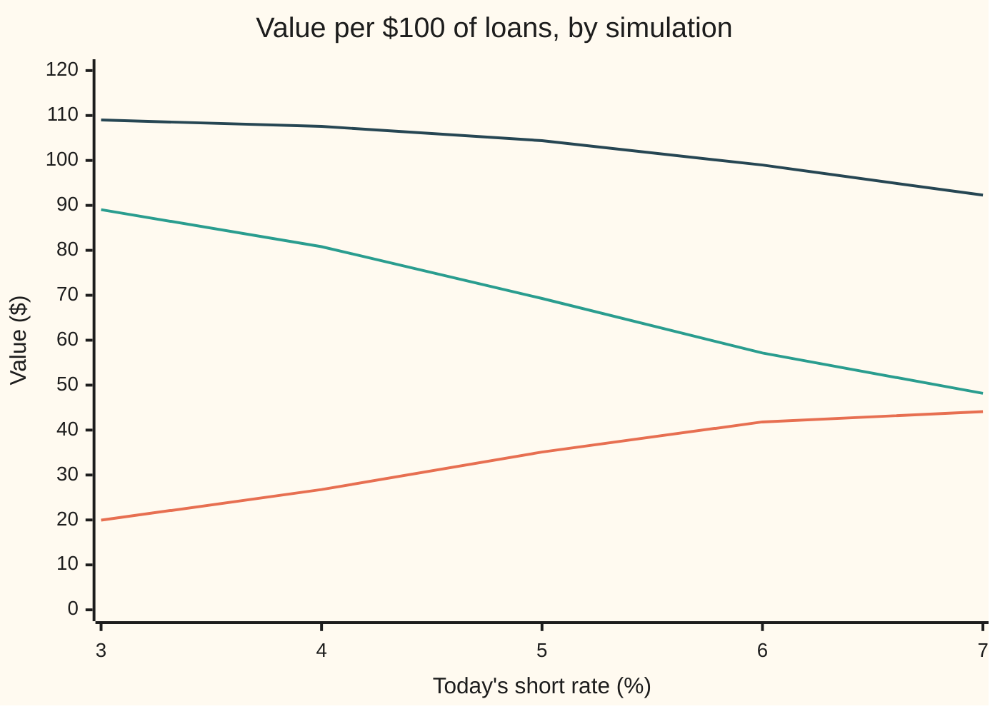
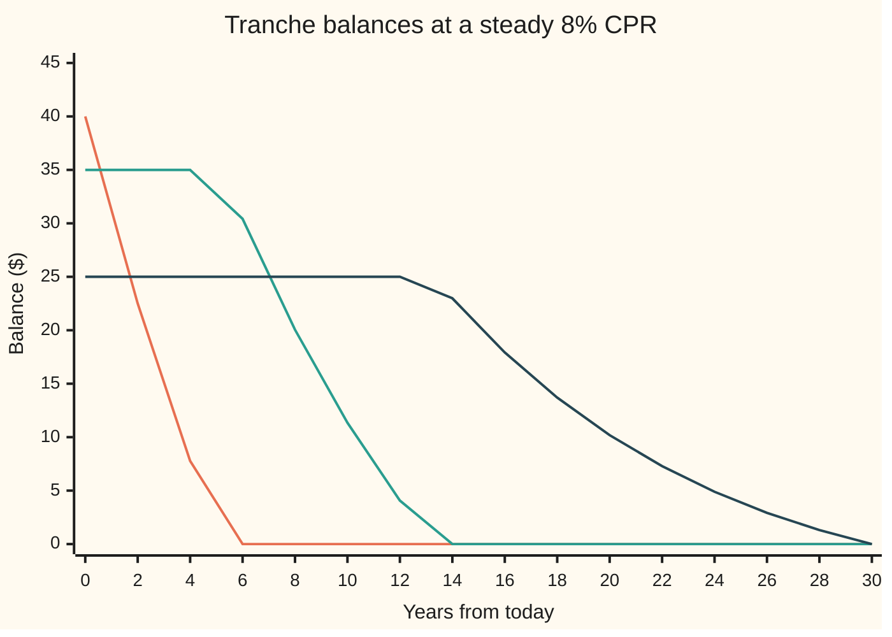

# Mortgage-backed securities in outline: pass-throughs, tranches and interest-only strips

Financial mathematics → Mortgages, Callables and Prepayment → Slicing a pool → Mortgage-backed securities in outline

---

## General Overview

A bank has lent to a thousand households, each on a 30-year home loan at 6 percent a year, repaid monthly. It sells the bundle, the **pool**, to investors. Every month the households pay interest and some principal (the amount borrowed). Some repay early: they move, or they refinance, taking a new loan at a lower rate to repay the old one. Early repayment is called **prepayment**, and the speed of it is quoted as a yearly percentage, the **CPR** (conditional prepayment rate). This shelf's pool prepays at 8 percent a year while rates stay where they are.

Every figure below is per $100 of loans. The simplest security on the pool is the **pass-through**: every dollar paid goes straight through to the holders. Split the same cash two ways and two stranger securities appear. The **interest-only strip**, or IO, receives every interest payment and no principal. The **principal-only strip**, or PO, receives every dollar of principal and no interest.

The IO is a bond that gains when interest rates rise, the opposite of every ordinary bond. Here it is worth $35.11 with rates as they are today. Move the whole rate picture up one percentage point and it is worth $41.82. Down one point, $26.77. The PO does the reverse, harder: $69.29 today, $57.16 one point up, $80.81 one point down.

The reason is prepayment. Interest is paid only on loans still alive. When rates fall, households refinance, loans vanish, and the interest the IO was counting on never arrives. When rates rise, nobody refinances, the loans live longer, and the IO collects for longer. The PO gets its $100 of principal back whatever happens; prepayment only changes when, and sooner is worth more.

**Slice the pool's monthly cash by a fixed rule, simulate many paths of interest rates, let prepayment respond to each path, discount each slice's cash along the path, and average: the slices always add up to the pool, but they respond to rates in opposite directions.**

**What kind of fact this is:** a method. The slicing rules are definitions, and the fact that the slices add up to the pool is an identity proved on this card in Why it works; the prices rest on a prepayment rule and a model of rates, which are assumptions, not laws.

### The picture: one pool, two strips, opposite bets

Today's short rate (the overnight rate the model moves) runs left to right; 5 percent is today. Each point moves the whole rate picture, today's rate and the level it is pulled toward, by the same amount.



Orange: the IO, climbing as rates climb. Green: the PO, falling steeply. Dark: the pass-through, their sum. The IO's climb flattens at the right because prepayment cannot fall below the slowest speed the model allows.

---

## The formula

Every slice is priced the same way: the average, over simulated paths of interest rates, of its monthly cash discounted along each path.

$$V_X = \mathbb{E}\Big[\sum_{k=1}^{n} D_k\,X_k\Big], \qquad D_k = \exp\Big(-\sum_{j=1}^{k}\tfrac12\,(r_{j-1}+r_j)\,\Delta t\Big)$$

**Read it aloud:** the value of a slice is the average, over many possible futures for interest rates, of the sum of every monthly payment it receives, each shrunk by the discount built up along that future.

The pool's month $k$ produces the cash every slice shares:

$$I_k = i\,B_{k-1}, \qquad P_k = \frac{i\,B_{k-1}}{1-(1+i)^{-(n-k+1)}} - I_k, \qquad Q_k = P_k + s_k\,(B_{k-1} - P_k), \qquad B_k = B_{k-1} - Q_k$$

**Read it aloud:** interest is one month's rate on the balance; scheduled principal is the level loan payment minus that interest; prepayment takes a fraction of what is left; the balance falls by all the principal paid.

Prepayment responds to rates through the mortgage rate $m_k$ on offer that month:

$$s_k = 1 - (1 - \text{CPR}_k)^{1/12}, \qquad \text{CPR}_k = \min\big(50\%,\ \max(3\%,\ 8\% + 8\,(6\% - m_k))\big), \qquad m_k = r_{k-1} + 1\%$$

**Read it aloud:** the yearly prepayment speed starts at 8 percent, climbs 8 points of speed for every point new loans are cheaper than the old 6 percent, and is held between 3 and 50 percent; the monthly rate is the one that, survived twelve times, leaves the same fraction a year.

Each slice is one rule for its $X_k$:

| Slice | Its monthly cash $X_k$ |
| --- | --- |
| Pass-through | $I_k + Q_k$ |
| IO | $I_k$ |
| PO | $Q_k$ |
| Sequential tranche A (first $40) | $i\,A_{k-1} + \min(A_{k-1}, Q_k)$ |
| Tranche B (next $35), tranche C (last $25) | interest on its own balance, plus principal only once every earlier tranche is paid off |

A **tranche** (French for slice) is a bond cut from the pool with its own place in the queue for principal. **Sequential** means strictly in turn: A takes all principal until it is repaid, then B, then C.

| Symbol | Plain meaning | In our example | Push it up and the answer… |
| --- | --- | --- | --- |
| $V_X$ | value today of slice $X$ | IO $35.11, PO $69.29, pool $104.40 | — |
| $\mathbb{E}$ | the average over simulated rate paths | 1,000 paths, in 500 mirrored pairs | — |
| $k$, $n$, $\Delta t$ | the month; the loan's length in months; one month in years | 1 to 360; 360; 1/12 | — |
| $i$ | the loans' interest rate per month, the note rate | 6% ÷ 12 = 0.005 | every slice with interest gains |
| $B_k$, $S_k$ | pool balance after month $k$; the fraction still owed with no prepayment | $100 at the start; $S_0 = 1$ | — |
| $I_k$, $P_k$, $Q_k$ | interest; scheduled principal; all principal, scheduled plus prepaid | first month 0.50, 0.099551, and 0.099551 + 0.691749 | — |
| $s_k$, $s$, $\text{CPR}_k$ | monthly prepayment rate (fixed: $s$) and yearly | 0.006924 and 8% | IO falls, PO rises |
| $m_k$ | mortgage rate on offer for new loans | 6% today | prepayment slows: IO gains |
| $r_k$ | the short rate at the end of month $k$ | 5% today | discounting heavier, prepayment slower |
| $\kappa$, $\theta$, $\sigma$ | the rate model's pull speed, pull level, and shock size, per year | 0.15, 5%, 1% | $\sigma$ up: more paths trigger refinancing |
| $D_k$, $v$ | discount factor along a path to month $k$; one month's factor on a flat rate | $v = e^{-0.05/12}$ on the flat path | — |
| $A_k$, $X$, $X_k$ | tranche A's balance; a slice; its cash in month $k$ | $40 at the start | — |

The rate model is the Vasicek model ([vasicek-model](../30-Short-Rate%20Models/02-vasicek-model.md)): the short rate is pulled toward the level $\theta$ at speed $\kappa$ and knocked about by normal shocks of size $\sigma$. The simulation steps it one month at a time with its exact one-month distribution.

### When it holds

- **Prepayment follows the rule.** Real borrowers refinance with a lag, some never do, and a pool that has already lived through low rates has lost its keenest refinancers (called burnout). A wrong rule moves the IO most, because the IO is almost all prepayment risk.
- **One rate drives everything.** Here the mortgage rate is the short rate plus one point. Real mortgage rates follow ten-year yields, which move less than the short rate; a one-factor model misses a curve that twists.
- **No defaults.** The pool is taken to be guaranteed, as agency pools are. Without a guarantee, losses hit the slices in a set order and the pricing needs a model of joint default.
- **No fees, no delay.** Real pass-throughs pay investors less than the loan rate, the gap going to servicer and guarantor, and pay some days late. Both shift every price slightly. Conventions verified 28 Sep 2026: speeds are quoted as CPR, a yearly rate, and turned into a monthly rate (the single monthly mortality, SMM) by $1-(1-\text{CPR})^{1/12}$.
- **Enough paths.** With 1,000 paths the simulated 10-year discount factor is 0.610070 against the formula's 0.610329. Prices carry sampling error of that order.

---

## Why it works

### Step 0: slicing creates nothing, so the slices add up to the pool

Each month the pool pays out some cash. Every slicing rule on this card hands each of those dollars to exactly one slice. So in every month and on every path, the slices' cash adds up to the pool's cash. Discounting multiplies each month's cash by the same factor for every slice, and averaging over paths respects sums. The values therefore add up too:

$$V_A + V_B + V_C = V_{IO} + V_{PO} = V_{\text{pool}}$$

In the simulation that is $104.40 three ways. What changes from slice to slice is *when* the cash arrives and in *which* futures. That is the entire content of the slicing.

### Step 1: one month of the pool

A level-payment loan pays the same amount each month; the annuity formula fixes it ([annuities-and-loans](../01-Money%2C%20Dates%20and%20Discounting/03-annuities-and-loans.md)). On $100 at 0.005 a month for 360 months it is $0.599551. Of that, $0.50 is interest and $0.099551 is scheduled principal.

Prepayment then takes a fraction $s$ of what remains after scheduled principal. At 8 percent a year, $s = 1 - 0.92^{1/12} = 0.006924$ a month, so that surviving twelve months leaves 0.92 of the balance. Dividing 8 percent by 12 instead is a common slip, priced in What breaks.

After prepayment the remaining loans recompute a level payment over the months left, so the same formula runs again next month on a smaller balance. The full schedule is the sibling card [mortgage-cash-flows-and-prepayment](02-mortgage-cash-flows-and-prepayment.md).

### Step 2: the IO shrinks when prepayment speeds up, and gains when rates rise

Take one fixed prepayment rate $s$ and one flat discount factor $v$ per month. Each month the balance is multiplied by the loan's scheduled fraction and then by $1 - s$. After $k$ months the balance is

$$B_k = 100\,(1-s)^k\,S_k, \qquad S_k = \frac{1-(1+i)^{-(n-k)}}{1-(1+i)^{-n}}$$

where $S_k$ is the fraction a loan with no prepayment would still owe. The IO is paid $i\,B_{k-1}$ in month $k$, so its value is

$$V_{IO} = \sum_{k=1}^{n} i\,B_{k-1}\,v^k .$$

Every term carries $(1-s)^{k-1}$, so raising $s$ shrinks every term. Faster prepayment means less interest, forever, and the IO has nothing else.

Now let rates rise. Two things happen to the IO. The discount is heavier, which lowers its value like any bond's. And the mortgage rate on offer rises, $s$ falls to the slowest speed, and every future interest payment grows. On this pool the second effect wins by a wide margin: the IO goes from $35.11 to $41.82 on a one-point rise.

The PO's $Q_k$ add up to $100 on every path: the loans are repaid in full, only the timing varies. Falling rates help it twice: lighter discounting, and earlier cash.

The sum over months is two geometric series, so the IO has a closed form on a flat path. The check uses it as its second road.

<details>
<summary>The algebra behind this: the IO as two geometric sums</summary>

Write $g = 1 + i$ and $q = (1-s)v$. Substituting $B_{k-1} = 100(1-s)^{k-1}S_{k-1}$,

$$V_{IO} = \frac{100\,i}{1-g^{-n}}\sum_{k=1}^{n}(1-s)^{k-1}v^k\big(1 - g^{-(n-k+1)}\big).$$

The first part is $\sum_{k=1}^{n}(1-s)^{k-1}v^k = v\,\dfrac{1-q^n}{1-q}$.

The second is $\sum_{k=1}^{n}(1-s)^{k-1}v^k g^{-(n-k+1)} = g^{-n}\,v\sum_{k=1}^{n}(qg)^{k-1} = g^{-n}\,v\,\dfrac{1-(qg)^n}{1-qg}$.

Subtract and multiply by the front factor. At 8 percent CPR and a flat 5 percent, this gives 38.586109, the same as the month-by-month loop to every printed digit. Neither sum needs a loop; the loop never uses the geometric-series formula. That is why they count as two roads.

</details>

### Step 3: sequential tranches reshape time, not money

Tranche A takes every dollar of principal until its $40 is repaid. B waits, earning only interest on its $35, then takes principal. C waits longest. At a steady 8 percent CPR the balances run down like this:



Orange: tranche A, gone before year six. Green: tranche B, untouched for four years, then paid down. Dark: tranche C, flat for twelve years, then the long tail.

The usual summary is the **average life**: the average time until a dollar of principal comes back, each repayment weighted by its size. A's is 2.45 years, B's 8.82, C's 19.56. From one 30-year pool the tranching makes a short bond, a medium one and a long one.

The queue also sorts prepayment risk. When prepayment speeds up, A is repaid sooner, but it was short anyway. C's wait shortens the most in years, since every early dollar ahead of it clears the queue. Rates falling one point lifts A only from 40.59 to 40.93, and C from 27.30 to 29.03: see How the slices move.

### Step 4: why simulate, and not use one path

Prepayment depends on every month's rate so far, so a slice's cash in year ten depends on the whole path of rates to year ten. No formula averages that; the method draws paths. A tree or a grid would have to remember each path's history, which is why simulation is the market's first tool here, not its fallback.

Each path is one possible future for the short rate, drawn from the Vasicek model in the **risk-neutral** world, where every asset is expected to earn the riskless rate, so discounting along each path and averaging gives a price ([monte-carlo-pricing](../06-Numerical%20Methods%20for%20Pricing/01-monte-carlo-pricing.md)). The draws come in mirrored pairs, each path with its reflection, which cancels much of the sampling noise ([variance-reduction-for-pricing](../06-Numerical%20Methods%20for%20Pricing/02-variance-reduction-for-pricing.md)).

Why not use the single path where rates stay at 5 percent? Because prepayment is lopsided. When rates fall, speed can rise to 50 percent; when they rise, it can fall only to 3. Averaging over paths, prepayment is faster than on the flat path, which is the households' option to refinance being exercised in the futures where it pays them. On the flat path the pass-through is worth $106.36; simulated, $104.40. The $1.96 gap is not the whole option. Simulate with prepayment frozen at 8 percent and the pool is worth $106.81, above the flat path, because the average of discount factors over paths exceeds the discount factor of the average path. Against that, the households' option costs investors $2.41. The option-adjusted spread ([option-adjusted-spread](04-option-adjusted-spread.md)) is what turns such a gap into a spread over the curve.

### Step 5: an identity that checks the machinery

Discount a pass-through at its own note rate, one month at a time at $1 + i$, and it is worth exactly par, $100, at any prepayment speed.

The reason: every month, what the pool pays out is the interest on the old balance plus the drop in balance. So the old balance equals this month's payment, discounted one month, plus the new balance, discounted one month. Apply that month after month and the sum telescopes to the starting $100, whatever the principal schedule.

<details>
<summary>Detailed proof: a pass-through at its own rate is worth par</summary>

Month $k$ pays $I_k + Q_k = i\,B_{k-1} + (B_{k-1} - B_k)$. Hence $B_{k-1} = \dfrac{(I_k + Q_k) + B_k}{1+i}$.

Substitute the same identity for $B_k$, then $B_{k+1}$, and so on: $B_0 = \sum_{k=1}^{n}\dfrac{I_k + Q_k}{(1+i)^k} + \dfrac{B_n}{(1+i)^n}$. The loan is fully repaid, $B_n = 0$, so the pass-through discounted at $1+i$ a month is worth $B_0 = 100$. No step used the size of $Q_k$, so any prepayment rule gives the same answer.

</details>

The check runs this at 8 and 30 percent CPR and gets 100.000000 both times; a bookkeeping bug would break it. It is also why the pool here, paying 6 percent while rates are 5, trades above par.

---

## Worked numbers, by hand

On the flat path: short rate fixed at 5 percent, prepayment steady at 8 percent CPR.

| Step | Arithmetic | Value |
| --- | --- | --- |
| Monthly prepayment rate | $1 - 0.92^{1/12}$ | 0.006924 |
| Level payment, month 1 | $100 \times 0.005 / (1 - 1.005^{-360})$ | $0.599551 |
| Interest, month 1: the IO's cash | $100 \times 0.005$ | $0.500000 |
| Scheduled principal, month 1 | 0.599551 − 0.500000 | $0.099551 |
| Prepaid, month 1 | 0.006924 × (100 − 0.099551) | $0.691749 |
| IO over 360 months, month by month | $\sum i\,B_{k-1}\,v^k$ | 38.586109 |
| IO by the geometric sums | Step 2 | 38.586109 |
| PO | $\sum Q_k\,v^k$ | 67.777826 |
| Pass-through | IO + PO | **106.363935** |

In the first month the PO's cash is the scheduled and the prepaid principal together; prepayment already outweighs scheduled repayment several times over, which is why prepayment, not amortisation, drives these securities.

On the flat path the IO is worth $38.59. Simulated, with rates free to move, it is worth $35.11: the paths where rates fall and loans vanish cost it more than the paths where rates rise pay it back.

### What breaks if you drop a piece

| Mistake | Comes out at | What went wrong |
| --- | --- | --- |
| One flat path, no volatility | pool 106.36, PO 67.78, against 104.40 and 69.29 | ignores the refinancing option ($2.41 against the frozen-prepayment pool, 106.81); overprices the pool by $1.96 |
| CPR divided by 12 for the monthly rate | IO 39.29, against 38.59 | the monthly rate that compounds to 8% a year is 0.006924, a little above 0.08 ÷ 12; the gap compounds over 30 years |
| Prepayment frozen at 8% whatever rates do | IO falls from 38.72 to 36.55 when rates rise one point | the sign is wrong: with prepayment responding, the IO rises to 41.82 |
| Principal shared pro rata, not in sequence | A's average life 8.96 years, not 2.45 | pro rata makes every tranche a copy of the pool |

The code prints every one of these.

---

## How the slices move when rates move

The mystery: rising rates discount the IO's interest more heavily, yet the IO rises. The discounting is still there; prepayment overwhelms it.

One story: the whole rate picture moves, today's short rate and the level it is pulled toward together, and each slice is repriced by the same 1,000 simulated paths.

| Today's short rate | Pool | IO | PO | Tranche A | Tranche C |
| --- | --- | --- | --- | --- | --- |
| 3% | 109.00 | 19.95 | 89.05 | 41.00 | 30.00 |
| 4% | 107.58 | 26.77 | 80.81 | 40.93 | 29.03 |
| 5% (today) | 104.40 | 35.11 | 69.29 | 40.59 | 27.30 |
| 6% | 98.98 | 41.82 | 57.16 | 39.66 | 24.87 |
| 7% | 92.28 | 44.10 | 48.18 | 38.32 | 22.21 |

### The IO: rising with rates

```
IO value by today's short rate, one block = $2
3%  ██████████             $19.95
4%  █████████████          $26.77
5%  ██████████████████     $35.11
6%  █████████████████████  $41.82
7%  ██████████████████████ $44.10
```

The steps shrink to the right: at 6 percent prepayment is already near its 3 percent floor, and further rises can only discount.

### The PO: falling with rates, harder than any ordinary bond of its life

```
PO value by today's short rate, one block = $2
3%  █████████████████████████████████████████████ $89.05
4%  █████████████████████████████████████████     $80.81
5%  ███████████████████████████████████           $69.29
6%  █████████████████████████████                 $57.16
7%  ████████████████████████                      $48.18
```

### The whole picture as sensitivities

The **effective duration** is the percentage change in value for a one-point fall in rates, measured by repricing up and down one point through the prepayment rule: $(V_{\text{down}} - V_{\text{up}})/(2 \times 0.01 \times V_{\text{today}})$. Negative means the slice gains when rates rise. The full treatment, and the curvature that goes with it, is [negative-convexity](03-negative-convexity.md).

| Slice | Value today | Effective duration, years | Rates up one point |
| --- | --- | --- | --- |
| Pool | 104.40 | 4.12 | falls to 98.98 |
| IO | 35.11 | −21.44 | rises to 41.82 |
| PO | 69.29 | 17.07 | falls to 57.16 |
| Tranche A | 40.59 | 1.56 | falls to 39.66 |
| Tranche C | 27.30 | 7.62 | falls to 24.87 |

The IO's duration is large and negative. A holder of ordinary bonds who fears rising rates can buy IOs as a hedge; a mortgage servicer, whose fee income resembles an IO, loses when rates fall. The PO's 17.07 years dwarfs the pool's 4.12: the IO and PO split the pool's rate risk into two large, opposite bets.

---

## Code, from first principles, and it actually runs

The code builds the pool month by month, cuts it into a pass-through, an IO/PO pair and three sequential tranches, and prices each. It takes three roads. Road one runs a single fixed path in a month loop. Road two prices the IO on that path by the two geometric sums of Step 2, with no loop. Road three simulates 1,000 Vasicek rate paths with its own random numbers (splitmix64 and the Box-Muller transform, written out), lets prepayment respond on each, and averages. The checks tie them together: the loop against the sums; the simulation with volatility set to zero against the sums; the monthly prepayment rate against its yearly speed; the pass-through at its note rate against par; the simulated 10-year discount factor against the Vasicek bond formula; the tranches against the pool; the queue, with B untouched while A is owed; and the IO's rise when rates rise.

### Python

```python
# Mortgage-backed securities in outline -- the check behind the card.  Standard
# library only: the random numbers, the rate model and the waterfall are written
# here.  Pool: $100 of 30-year loans at 6%, monthly.  Slices: sequential A, B, C
# and an interest-only / principal-only pair.  Prices by simulating rate paths.
from math import exp, log, sqrt, cos, pi

FACE, N, DT = 100.0, 360, 1.0 / 12.0
I = 0.06 / 12.0                                   # the note rate, per month
SIZES = (40.0, 35.0, 25.0)                        # tranches A, B, C, paid in this order
KAPPA, THETA, SIG, R0, SPREAD = 0.15, 0.05, 0.01, 0.05, 0.01
PAIRS, M64 = 500, (1 << 64) - 1

def smm(cpr):                                     # yearly prepayment rate -> monthly
    return 1.0 - (1.0 - cpr) ** (1.0 / 12.0)

def cpr_of(m):                                    # cheaper new loans -> faster prepayment
    return min(0.50, max(0.03, 0.08 + 8.0 * (0.06 - m)))

def month(bal, k, s):                             # one month: interest and all principal
    sched = bal * I / (1.0 - (1.0 + I) ** -(N - k + 1)) - I * bal
    return I * bal, sched + s * (bal - sched)

def split(tb, prin):                              # principal to A until retired, then B, then C
    out = []
    for j in range(3):
        x = min(tb[j], prin)
        tb[j] -= x
        prin -= x
        out.append(x)
    return out

def det(s, vm):          # road 1: one fixed path, monthly prepayment s, monthly discount vm
    bal, tb, d, pool, io, wal, bals = FACE, list(SIZES), 1.0, 0.0, 0.0, [0.0] * 3, []
    for k in range(1, N + 1):
        if (k - 1) % 24 == 0:
            bals.append(list(tb))
        d *= vm
        interest, prin = month(bal, k, s)
        for j, x in enumerate(split(tb, prin)):
            wal[j] += k / 12.0 * x / SIZES[j]
        pool, io, bal = pool + d * (interest + prin), io + d * interest, bal - prin
    bals.append(list(tb))
    return pool, io, pool - io, bals, wal

def io_closed(s, v):     # road 2: the IO as two geometric sums, no month loop
    g, q = 1.0 + I, (1.0 - s) * v
    first = v * (1.0 - q ** N) / (1.0 - q)
    second = g ** -N * v * (1.0 - (q * g) ** N) / (1.0 - q * g)
    return I * FACE / (1.0 - g ** -N) * (first - second)

class Rng:                                        # splitmix64, then Box-Muller
    def __init__(self, seed): self.s = seed
    def u(self):
        self.s = (self.s + 0x9E3779B97F4A7C15) & M64
        z = self.s
        z = ((z ^ (z >> 30)) * 0xBF58476D1CE4E5B9) & M64
        z = ((z ^ (z >> 27)) * 0x94D049BB133111EB) & M64
        return (((z ^ (z >> 31)) >> 11) + 0.5) / 2.0 ** 53
    def normal(self):
        return sqrt(-2.0 * log(self.u())) * cos(2.0 * pi * self.u())

def path(zs, shift, sig, fixed):  # road 3: one simulated rate path, every slice priced on it
    a = exp(-KAPPA * DT)
    sd = sig * sqrt((1.0 - a * a) / (2.0 * KAPPA))
    r, d, bal, tb, v = R0 + shift, 1.0, FACE, list(SIZES), [0.0] * 7
    for k in range(1, N + 1):
        rn = THETA + shift + (r - THETA - shift) * a + sd * zs[k - 1]
        d *= exp(-0.5 * (r + rn) * DT)            # trapezoid rule along the month
        s = smm(fixed if fixed else cpr_of(r + SPREAD))
        interest, prin = month(bal, k, s)
        coupons = [I * b for b in tb]
        for j, x in enumerate(split(tb, prin)):
            v[1 + j] += d * (coupons[j] + x)
        v[0] += d * (interest + prin)
        v[4] += d * interest
        v[5] += d * prin
        if k == 120:
            v[6] = d
        bal, r = bal - prin, rn
    return v

def price(shift, sig=SIG, fixed=None):            # antithetic pairs, same seed every time
    g, tot = Rng(2026), [0.0] * 7
    for _ in range(PAIRS):
        zs = [g.normal() for _ in range(N)]
        for sign in (1.0, -1.0):
            for j, x in enumerate(path([sign * z for z in zs], shift, sig, fixed)):
                tot[j] += x / (2 * PAIRS)
    return tot

def vasicek_zero(t):                              # the bond formula for the same rate model
    b = (1.0 - exp(-KAPPA * t)) / KAPPA
    return exp((THETA - SIG ** 2 / (2 * KAPPA ** 2)) * (b - t) - SIG ** 2 * b * b / (4 * KAPPA) - b * R0)

def row(label, x):
    print(f"{label:<44} {x:>12.6f}")

s8, v5, vn = smm(0.08), exp(-0.05 * DT), 1.0 / (1.0 + I)
pool5, io5, po5, bals, wal = det(s8, v5)
row("monthly prepayment rate at 8% CPR", s8)
it, pr = month(FACE, 1, 0.0)
print(f"first month per $100: payment {it + pr:.6f} = interest {it:.6f} + principal {pr:.6f}; prepaid {month(FACE, 1, s8)[1] - pr:.6f}")
row("flat 5%, 8% CPR: pass-through (loop)", pool5)
row("flat 5%, 8% CPR: IO (loop)", io5)
row("flat 5%, 8% CPR: IO (geometric sums)", io_closed(s8, v5))
row("flat 5%, 8% CPR: PO (loop)", po5)
print("at the 6% note rate: pass-through {:.6f} at 8% CPR, {:.6f} at 30%".format(det(s8, vn)[0], det(smm(0.3), vn)[0]))
print("chart, years      " + " ".join(f"{2 * i:6d}" for i in range(16)))
for j, name in enumerate("ABC"):
    print(f"chart, balance {name}  " + " ".join(f"{b[j]:6.2f}" for b in bals))
print("average life, years: A {:.2f}  B {:.2f}  C {:.2f}".format(*wal))
base = price(0.0)
for label, x in zip(("pool", "tranche A", "tranche B", "tranche C", "IO", "PO"), base):
    row("simulated, rates as today: " + label, x)
row("  A + B + C", base[1] + base[2] + base[3])
row("  IO + PO", base[4] + base[5])
row("10-year zero, simulated", base[6])
row("10-year zero, Vasicek formula", vasicek_zero(10.0))
shifts = {sh: base if sh == 0.0 else price(sh) for sh in (-0.02, -0.01, 0.0, 0.01, 0.02)}
for sh, p in shifts.items():
    print(f"shift {100 * sh:+.0f}%: pool {p[0]:7.2f}  IO {p[4]:6.2f}  PO {p[5]:6.2f}  A {p[1]:6.2f}  C {p[3]:6.2f}")
for label, j in (("pool", 0), ("IO", 4), ("PO", 5), ("tranche A", 1), ("tranche C", 3)):
    row("effective duration, years: " + label, (shifts[-0.01][j] - shifts[0.01][j]) / (0.02 * base[j]))
flat, fz0, fz1 = price(0.0, sig=0.0), price(0.0, fixed=0.08), price(0.01, fixed=0.08)
row("wrong: one flat path, no volatility: pool", flat[0])
row("wrong: one flat path, no volatility: PO", flat[5])
row("  flat-path pool minus simulated pool", flat[0] - base[0])
row("wrong: CPR / 12 as the monthly rate: IO", det(0.08 / 12.0, v5)[1])
print(f"wrong: prepayment frozen at 8%: pool {fz0[0]:.6f}, IO today {fz0[4]:.6f}")
row("wrong: prepayment frozen at 8%: IO at +1%", fz1[4])
row("wrong: pro rata, A's average life", sum(w * z for w, z in zip(wal, SIZES)) / FACE)
assert abs((1.0 - s8) ** 12 - 0.92) < 1e-12, "twelve months at the monthly rate must leave 92%"
assert abs(io5 - io_closed(s8, v5)) < 1e-9, "loop IO must equal the geometric-sum IO"
assert abs(det(smm(0.3), vn)[0] - FACE) < 1e-9, "at the note rate a pass-through is par"
assert abs(base[6] - vasicek_zero(10.0)) < 1e-3, "simulated zero must match the rate model's formula"
assert abs(flat[4] - io_closed(s8, v5)) < 1e-9, "zero volatility must collapse to the fixed path"
assert abs(base[1] + base[2] + base[3] - base[0]) < 1e-9, "tranches share out the pool, no more, no less"
assert shifts[0.01][4] > base[4] > shifts[-0.01][4], "the IO gains when rates rise"
assert bals[1][0] < SIZES[0] and all(b[1] == SIZES[1] for b in bals if b[0] > 0), "A is paid first; B waits"
print("ALL CHECKS PASS")
```

**Ran 2026-09-28 on macOS, Python 3.14.6, standard library only. All checks passed. Output, pasted from the run:**

```
monthly prepayment rate at 8% CPR                0.006924
first month per $100: payment 0.599551 = interest 0.500000 + principal 0.099551; prepaid 0.691749
flat 5%, 8% CPR: pass-through (loop)           106.363935
flat 5%, 8% CPR: IO (loop)                      38.586109
flat 5%, 8% CPR: IO (geometric sums)            38.586109
flat 5%, 8% CPR: PO (loop)                      67.777826
at the 6% note rate: pass-through 100.000000 at 8% CPR, 100.000000 at 30%
chart, years           0      2      4      6      8     10     12     14     16     18     20     22     24     26     28     30
chart, balance A   40.00  22.50   7.78   0.00   0.00   0.00   0.00   0.00   0.00   0.00   0.00   0.00   0.00   0.00   0.00   0.00
chart, balance B   35.00  35.00  35.00  30.42  20.05  11.35   4.07   0.00   0.00   0.00   0.00   0.00   0.00   0.00   0.00   0.00
chart, balance C   25.00  25.00  25.00  25.00  25.00  25.00  25.00  22.99  17.92  13.70  10.19   7.29   4.89   2.92   1.31   0.00
average life, years: A 2.45  B 8.82  C 19.56
simulated, rates as today: pool                104.403936
simulated, rates as today: tranche A            40.587918
simulated, rates as today: tranche B            36.514862
simulated, rates as today: tranche C            27.301156
simulated, rates as today: IO                   35.112722
simulated, rates as today: PO                   69.291213
  A + B + C                                    104.403936
  IO + PO                                      104.403936
10-year zero, simulated                          0.610070
10-year zero, Vasicek formula                    0.610329
shift -2%: pool  109.00  IO  19.95  PO  89.05  A  41.00  C  30.00
shift -1%: pool  107.58  IO  26.77  PO  80.81  A  40.93  C  29.03
shift +0%: pool  104.40  IO  35.11  PO  69.29  A  40.59  C  27.30
shift +1%: pool   98.98  IO  41.82  PO  57.16  A  39.66  C  24.87
shift +2%: pool   92.28  IO  44.10  PO  48.18  A  38.32  C  22.21
effective duration, years: pool                  4.117192
effective duration, years: IO                  -21.437601
effective duration, years: PO                   17.066862
effective duration, years: tranche A             1.563896
effective duration, years: tranche C             7.624811
wrong: one flat path, no volatility: pool      106.363935
wrong: one flat path, no volatility: PO         67.777826
  flat-path pool minus simulated pool            1.960000
wrong: CPR / 12 as the monthly rate: IO         39.293678
wrong: prepayment frozen at 8%: pool 106.811566, IO today 38.720778
wrong: prepayment frozen at 8%: IO at +1%       36.548787
wrong: pro rata, A's average life                8.959513
ALL CHECKS PASS
```

### Rust

Same numbers, same labels, same random draws, built with `rustc --edition 2021 -O`.

```rust
// Mortgage-backed securities in outline -- the same check as the Python, in
// Rust.  No crates: the random numbers, the rate model and the waterfall are
// written here.  Pool: $100 of 30-year loans at 6%, monthly.  Slices: sequential
// A, B, C and an interest-only / principal-only pair, priced by simulation.
const FACE: f64 = 100.0;
const N: usize = 360;
const DT: f64 = 1.0 / 12.0;
const I: f64 = 0.06 / 12.0;                           // the note rate, per month
const SIZES: [f64; 3] = [40.0, 35.0, 25.0];           // tranches A, B, C, paid in this order
const KAPPA: f64 = 0.15;
const THETA: f64 = 0.05;
const SIG: f64 = 0.01;
const R0: f64 = 0.05;
const SPREAD: f64 = 0.01;
const PAIRS: usize = 500;

fn smm(cpr: f64) -> f64 { 1.0 - (1.0 - cpr).powf(1.0 / 12.0) }  // yearly prepayment rate -> monthly

fn cpr_of(m: f64) -> f64 { (0.08 + 8.0 * (0.06 - m)).max(0.03).min(0.50) }  // cheaper loans, faster

fn month(bal: f64, k: usize, s: f64) -> (f64, f64) {  // one month: interest and all principal
    let sched = bal * I / (1.0 - (1.0 + I).powf(-((N - k + 1) as f64))) - I * bal;
    (I * bal, sched + s * (bal - sched))
}

fn split(tb: &mut [f64; 3], mut prin: f64) -> [f64; 3] {  // principal to A, then B, then C
    let mut out = [0.0; 3];
    for j in 0..3 {
        let x = tb[j].min(prin);
        tb[j] -= x;
        prin -= x;
        out[j] = x;
    }
    out
}

// road 1: one fixed path, monthly prepayment s, monthly discount vm
fn det(s: f64, vm: f64) -> (f64, f64, f64, Vec<[f64; 3]>, [f64; 3]) {
    let (mut bal, mut tb, mut d, mut pool, mut io) = (FACE, SIZES, 1.0, 0.0, 0.0);
    let (mut wal, mut bals) = ([0.0; 3], Vec::new());
    for k in 1..=N {
        if (k - 1) % 24 == 0 { bals.push(tb) }
        d *= vm;
        let (interest, prin) = month(bal, k, s);
        let paid = split(&mut tb, prin);
        for j in 0..3 { wal[j] += k as f64 / 12.0 * paid[j] / SIZES[j] }
        pool += d * (interest + prin);
        io += d * interest;
        bal -= prin;
    }
    bals.push(tb);
    (pool, io, pool - io, bals, wal)
}

fn io_closed(s: f64, v: f64) -> f64 {                 // road 2: two geometric sums, no month loop
    let (g, q, n) = (1.0 + I, (1.0 - s) * v, N as f64);
    let first = v * (1.0 - q.powf(n)) / (1.0 - q);
    let second = g.powf(-n) * v * (1.0 - (q * g).powf(n)) / (1.0 - q * g);
    I * FACE / (1.0 - g.powf(-n)) * (first - second)
}

struct Rng { s: u64 }                                 // splitmix64, then Box-Muller
impl Rng {
    fn u(&mut self) -> f64 {
        self.s = self.s.wrapping_add(0x9E3779B97F4A7C15);
        let mut z = self.s;
        z = (z ^ (z >> 30)).wrapping_mul(0xBF58476D1CE4E5B9);
        z = (z ^ (z >> 27)).wrapping_mul(0x94D049BB133111EB);
        (((z ^ (z >> 31)) >> 11) as f64 + 0.5) / 2f64.powi(53)
    }
    fn normal(&mut self) -> f64 {
        let u1 = self.u();
        (-2.0 * u1.ln()).sqrt() * (2.0 * std::f64::consts::PI * self.u()).cos()
    }
}

// road 3: one simulated rate path, every slice priced on it
fn path(zs: &[f64], shift: f64, sig: f64, fixed: Option<f64>) -> [f64; 7] {
    let a = (-KAPPA * DT).exp();
    let sd = sig * ((1.0 - a * a) / (2.0 * KAPPA)).sqrt();
    let (mut r, mut d, mut bal, mut tb, mut v) = (R0 + shift, 1.0, FACE, SIZES, [0.0; 7]);
    for k in 1..=N {
        let rn = THETA + shift + (r - THETA - shift) * a + sd * zs[k - 1];
        d *= (-0.5 * (r + rn) * DT).exp();            // trapezoid rule along the month
        let s = smm(fixed.unwrap_or_else(|| cpr_of(r + SPREAD)));
        let (interest, prin) = month(bal, k, s);
        let coupons = [I * tb[0], I * tb[1], I * tb[2]];
        let paid = split(&mut tb, prin);
        for j in 0..3 { v[1 + j] += d * (coupons[j] + paid[j]) }
        v[0] += d * (interest + prin);
        v[4] += d * interest;
        v[5] += d * prin;
        if k == 120 { v[6] = d }
        bal -= prin;
        r = rn;
    }
    v
}

fn price(shift: f64, sig: f64, fixed: Option<f64>) -> [f64; 7] {  // antithetic pairs, same seed
    let (mut g, mut tot) = (Rng { s: 2026 }, [0.0; 7]);
    for _ in 0..PAIRS {
        let zs: Vec<f64> = (0..N).map(|_| g.normal()).collect();
        for sign in [1.0, -1.0] {
            let zz: Vec<f64> = zs.iter().map(|z| sign * z).collect();
            for (j, x) in path(&zz, shift, sig, fixed).iter().enumerate() { tot[j] += x / (2 * PAIRS) as f64 }
        }
    }
    tot
}

fn vasicek_zero(t: f64) -> f64 {                      // the bond formula for the same rate model
    let b = (1.0 - (-KAPPA * t).exp()) / KAPPA;
    ((THETA - SIG * SIG / (2.0 * KAPPA * KAPPA)) * (b - t) - SIG * SIG * b * b / (4.0 * KAPPA) - b * R0).exp()
}

fn row(label: &str, x: f64) { println!("{:<44} {:>12.6}", label, x) }

fn main() {
    let (s8, v5, vn) = (smm(0.08), (-0.05 * DT).exp(), 1.0 / (1.0 + I));
    let (pool5, io5, po5, bals, wal) = det(s8, v5);
    let (it, pr) = month(FACE, 1, 0.0);
    row("monthly prepayment rate at 8% CPR", s8);
    println!("first month per $100: payment {:.6} = interest {:.6} + principal {:.6}; prepaid {:.6}", it + pr, it, pr, month(FACE, 1, s8).1 - pr);
    row("flat 5%, 8% CPR: pass-through (loop)", pool5);
    row("flat 5%, 8% CPR: IO (loop)", io5);
    row("flat 5%, 8% CPR: IO (geometric sums)", io_closed(s8, v5));
    row("flat 5%, 8% CPR: PO (loop)", po5);
    let par30 = det(smm(0.3), vn).0;
    println!("at the 6% note rate: pass-through {:.6} at 8% CPR, {:.6} at 30%", det(s8, vn).0, par30);
    println!("chart, years      {}", (0..16).map(|i| format!("{:6}", 2 * i)).collect::<Vec<_>>().join(" "));
    for (j, name) in ["A", "B", "C"].iter().enumerate() {
        println!("chart, balance {}  {}", name, bals.iter().map(|b| format!("{:6.2}", b[j])).collect::<Vec<_>>().join(" "));
    }
    println!("average life, years: A {:.2}  B {:.2}  C {:.2}", wal[0], wal[1], wal[2]);
    let base = price(0.0, SIG, None);
    for (j, label) in ["pool", "tranche A", "tranche B", "tranche C", "IO", "PO"].iter().enumerate() {
        row(&format!("simulated, rates as today: {}", label), base[j]);
    }
    row("  A + B + C", base[1] + base[2] + base[3]);
    row("  IO + PO", base[4] + base[5]);
    row("10-year zero, simulated", base[6]);
    row("10-year zero, Vasicek formula", vasicek_zero(10.0));
    let shifts: Vec<(f64, [f64; 7])> = [-0.02, -0.01, 0.0, 0.01, 0.02].iter()
        .map(|&sh| (sh, if sh == 0.0 { base } else { price(sh, SIG, None) })).collect();
    for (sh, p) in &shifts {
        println!("shift {:+.0}%: pool {:7.2}  IO {:6.2}  PO {:6.2}  A {:6.2}  C {:6.2}", 100.0 * sh, p[0], p[4], p[5], p[1], p[3]);
    }
    let (down, up) = (shifts[1].1, shifts[3].1);
    for (label, j) in [("pool", 0), ("IO", 4), ("PO", 5), ("tranche A", 1), ("tranche C", 3)] {
        row(&format!("effective duration, years: {}", label), (down[j] - up[j]) / (0.02 * base[j]));
    }
    let (flat, fz0, fz1) = (price(0.0, 0.0, None), price(0.0, SIG, Some(0.08)), price(0.01, SIG, Some(0.08)));
    row("wrong: one flat path, no volatility: pool", flat[0]);
    row("wrong: one flat path, no volatility: PO", flat[5]);
    row("  flat-path pool minus simulated pool", flat[0] - base[0]);
    row("wrong: CPR / 12 as the monthly rate: IO", det(0.08 / 12.0, v5).1);
    println!("wrong: prepayment frozen at 8%: pool {:.6}, IO today {:.6}", fz0[0], fz0[4]);
    row("wrong: prepayment frozen at 8%: IO at +1%", fz1[4]);
    row("wrong: pro rata, A's average life", (0..3).map(|j| wal[j] * SIZES[j]).sum::<f64>() / FACE);
    assert!(((1.0 - s8).powi(12) - 0.92).abs() < 1e-12, "twelve months at the monthly rate must leave 92%");
    assert!((io5 - io_closed(s8, v5)).abs() < 1e-9, "loop IO must equal the geometric-sum IO");
    assert!((par30 - FACE).abs() < 1e-9, "at the note rate a pass-through is par");
    assert!((base[6] - vasicek_zero(10.0)).abs() < 1e-3, "simulated zero must match the rate model's formula");
    assert!((flat[4] - io_closed(s8, v5)).abs() < 1e-9, "zero volatility must collapse to the fixed path");
    assert!((base[1] + base[2] + base[3] - base[0]).abs() < 1e-9, "tranches share out the pool");
    assert!(up[4] > base[4] && base[4] > down[4], "the IO gains when rates rise");
    assert!(bals[1][0] < SIZES[0] && bals.iter().all(|b| b[0] == 0.0 || b[1] == SIZES[1]), "A is paid first; B waits");
    println!("ALL CHECKS PASS");
}
```

**Ran 2026-09-28 on macOS, rustc 1.98.1, no crates. All checks passed. Output, pasted from the run:**

```
monthly prepayment rate at 8% CPR                0.006924
first month per $100: payment 0.599551 = interest 0.500000 + principal 0.099551; prepaid 0.691749
flat 5%, 8% CPR: pass-through (loop)           106.363935
flat 5%, 8% CPR: IO (loop)                      38.586109
flat 5%, 8% CPR: IO (geometric sums)            38.586109
flat 5%, 8% CPR: PO (loop)                      67.777826
at the 6% note rate: pass-through 100.000000 at 8% CPR, 100.000000 at 30%
chart, years           0      2      4      6      8     10     12     14     16     18     20     22     24     26     28     30
chart, balance A   40.00  22.50   7.78   0.00   0.00   0.00   0.00   0.00   0.00   0.00   0.00   0.00   0.00   0.00   0.00   0.00
chart, balance B   35.00  35.00  35.00  30.42  20.05  11.35   4.07   0.00   0.00   0.00   0.00   0.00   0.00   0.00   0.00   0.00
chart, balance C   25.00  25.00  25.00  25.00  25.00  25.00  25.00  22.99  17.92  13.70  10.19   7.29   4.89   2.92   1.31   0.00
average life, years: A 2.45  B 8.82  C 19.56
simulated, rates as today: pool                104.403936
simulated, rates as today: tranche A            40.587918
simulated, rates as today: tranche B            36.514862
simulated, rates as today: tranche C            27.301156
simulated, rates as today: IO                   35.112722
simulated, rates as today: PO                   69.291213
  A + B + C                                    104.403936
  IO + PO                                      104.403936
10-year zero, simulated                          0.610070
10-year zero, Vasicek formula                    0.610329
shift -2%: pool  109.00  IO  19.95  PO  89.05  A  41.00  C  30.00
shift -1%: pool  107.58  IO  26.77  PO  80.81  A  40.93  C  29.03
shift +0%: pool  104.40  IO  35.11  PO  69.29  A  40.59  C  27.30
shift +1%: pool   98.98  IO  41.82  PO  57.16  A  39.66  C  24.87
shift +2%: pool   92.28  IO  44.10  PO  48.18  A  38.32  C  22.21
effective duration, years: pool                  4.117192
effective duration, years: IO                  -21.437601
effective duration, years: PO                   17.066862
effective duration, years: tranche A             1.563896
effective duration, years: tranche C             7.624811
wrong: one flat path, no volatility: pool      106.363935
wrong: one flat path, no volatility: PO         67.777826
  flat-path pool minus simulated pool            1.960000
wrong: CPR / 12 as the monthly rate: IO         39.293678
wrong: prepayment frozen at 8%: pool 106.811566, IO today 38.720778
wrong: prepayment frozen at 8%: IO at +1%       36.548787
wrong: pro rata, A's average life                8.959513
ALL CHECKS PASS
```

The two outputs match line for line.

> [!TIP]
> **Try changing**
> Guess first, then run it.
> - **Switch off volatility.** Set `SIG` to `0.0`. Guess the pool's simulated price. Every path is now the flat path, so the simulated pool reads 106.36 and the IO 38.59, the flat-path numbers, and every check passes.
> - **Make prepayment deaf to rates.** In `cpr_of`, change `8.0 * (0.06 - m)` to `0.0 * (0.06 - m)`. Guess the IO's direction. It now reads 38.72 today and 36.55 one point up, the frozen rows of the output, and the last assert stops the run: without refinancing the IO is an ordinary bond.
> - **Double the volatility.** Set `SIG` to `0.02`. Guess whether the pool gains or loses. It loses, because more paths reach refinancing territory; the IO loses too. The third assert stops the run, since the sampling error on the 10-year discount factor now exceeds its 0.001 tolerance: more volatile rates need more paths.

---

## The usual mistake

> [!warning]
> **Pricing a mortgage security on one expected path of rates.** The prepayment rule is lopsided: falling rates speed prepayment far more than rising rates slow it. The average of the cash over many paths is not the cash on the average path. On the flat path the pool is worth 106.36; averaged over paths, 104.40. The single path overprices it by $1.96 and ignores the refinancing option the households hold, worth $2.41 here.
>
> - **Reading an IO as a bond.** It has no principal and no maturity value. Its duration here is −21.44 years: it rises with rates. Hedging it like a bond doubles the risk instead of removing it.
> - **Freezing prepayment.** At a fixed 8 percent CPR the IO falls from 38.72 to 36.55 when rates rise a point. With prepayment responding it rises to 41.82. The frozen model gets the sign wrong.
> - **CPR ÷ 12.** The monthly rate is $1 - 0.92^{1/12}$ = 0.006924, not 0.08 ÷ 12. The IO moves from 38.59 to 39.29.

---

## Where you meet it in real life

- **Agency pass-throughs.** Most US home loans are pooled and sold as pass-throughs guaranteed by government-sponsored agencies, one of the largest bond markets in the world.
- **Collateralised mortgage obligations.** A CMO is this card's tranching done for real, with variants that shield some tranches from prepayment surprises by pushing them onto others. Credit markets reuse the queue with losses in place of principal: [cdo-tranches-in-outline](../45-Portfolio%20Credit%20-%20Correlation%2C%20Copulas%2C%20Indices%20and%20Tranches/05-cdo-tranches-in-outline.md).
- **Mortgage servicing rights.** A servicer collects the payments for a fee proportional to the balance still outstanding. That income is an IO in all but name, and servicers lose money when rates fall and refinancing sweeps their loans away.
- **Portfolio hedging.** IOs are bought to offset holdings that lose when rates rise; if borrowers refinance faster than modelled, the hedge fails.
- **Bank risk reports.** A bank holding mortgage securities reports effective duration computed as here, by bumping rates through a prepayment model. The sibling card [negative-convexity](03-negative-convexity.md) follows that number, and [callable-bonds-and-yield-to-worst](01-callable-bonds-and-yield-to-worst.md) is the same borrower's option seen in a corporate bond.

> **Say it back**
> A mortgage pool pays interest, scheduled principal and prepayments every month, and prepayment speeds up when rates fall. Slices share that cash by fixed rules, so their values always add up to the pool. The IO takes the interest, so it lives only as long as the loans do and gains when rates rise; the PO takes the principal, gets it all back eventually, and gains when it comes early. Sequential tranches queue for principal and turn one long pool into short, medium and long bonds. Because prepayment depends on the whole path of rates, each slice is priced by simulating many rate paths and averaging the discounted cash.

---

## What this builds on

- [option-adjusted-spread](04-option-adjusted-spread.md): the spread left after the refinancing option is priced out, and the simulation it runs; this card reuses that engine with zero spread and cuts the cash into slices.
- [mortgage-cash-flows-and-prepayment](02-mortgage-cash-flows-and-prepayment.md): the pool's month of interest, scheduled principal and prepayment.
- [annuities-and-loans](../01-Money%2C%20Dates%20and%20Discounting/03-annuities-and-loans.md): the level payment of a loan.
- [vasicek-model](../30-Short-Rate%20Models/02-vasicek-model.md): the rate model the simulation draws from, and its bond formula used as a check.
- [monte-carlo-pricing](../06-Numerical%20Methods%20for%20Pricing/01-monte-carlo-pricing.md): pricing as an average of discounted cash over simulated paths.

## Where this goes next

- [cdo-tranches-in-outline](../45-Portfolio%20Credit%20-%20Correlation%2C%20Copulas%2C%20Indices%20and%20Tranches/05-cdo-tranches-in-outline.md): the same queue, with defaults instead of prepayments deciding who is paid.
- [hull-white-model](../30-Short-Rate%20Models/04-hull-white-model.md): a rate model that fits today's whole curve exactly, which a desk would use in place of Vasicek here.
- [variance-reduction-for-pricing](../06-Numerical%20Methods%20for%20Pricing/02-variance-reduction-for-pricing.md): making 1,000 paths do the work of many more.

---

## Sources

Verified 28 Sep 2026: every DOI below resolves and its Crossref record names the paper; the Hull link is the publisher's page for the book.

- Schwartz, Eduardo S., and Walter N. Torous. "Prepayment and the Valuation of Mortgage-Backed Securities." *Journal of Finance* 44, no. 2 (1989): 375–392. [doi:10.1111/j.1540-6261.1989.tb05062.x](https://doi.org/10.1111/j.1540-6261.1989.tb05062.x). Prepayment driven by rates, and mortgage securities priced by simulation.
- McConnell, John J., and Manoj Singh. "Rational Prepayments and the Valuation of Collateralized Mortgage Obligations." *Journal of Finance* 49, no. 3 (1994): 891–921. [doi:10.1111/j.1540-6261.1994.tb00082.x](https://doi.org/10.1111/j.1540-6261.1994.tb00082.x). Sequential tranches priced path by path.
- Vasicek, Oldrich. "An Equilibrium Characterization of the Term Structure." *Journal of Financial Economics* 5, no. 2 (1977): 177–188. [doi:10.1016/0304-405X(77)90016-2](https://doi.org/10.1016/0304-405X(77)90016-2). The rate model, and the bond formula the check compares against.
- Hull, John C. *Options, Futures, and Other Derivatives*, 11th ed. Pearson. [Publisher page](https://www.pearson.com/en-us/subject-catalog/p/options-futures-and-other-derivatives/P200000005938). Agency mortgage-backed securities, IOs and POs, and the option-adjusted spread, in the interest-rate chapters.
