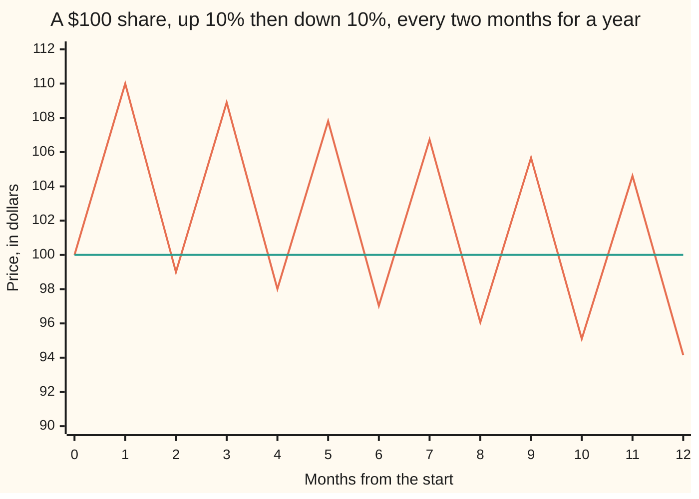
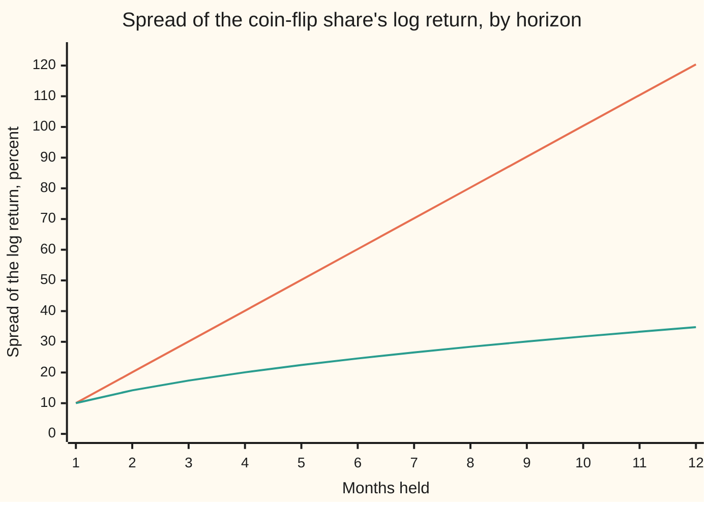

# Returns: simple, log, and annualised, and when they differ

Financial mathematics → Returns and Utility → Measuring growth → Returns

---

## General Overview

A share costs $100 on the first of the month. During the month it rises 10%, to $110. The next month it falls 10%, to $99.

Up 10, down 10, and a dollar is gone. The two percentages look as if they cancel. They do not, because the fall is 10% of $110, a bigger base than the rise was taken on.

That dollar is what this card is about. A **return** is the growth of an investment over one period, written as a fraction of where it started. There are two standard ways to write it. The **simple return** is the change divided by the starting price: +10%, then −10%. It is the number on a bank statement. The **log return** is the natural logarithm (the logarithm to base e, about 2.718) of the end price over the start price: +9.53%, then −10.54%. Log returns are the ones that add up over time. The two logs sum to −1.01%, which is exactly the two-month loss, written as a log.

The card does three jobs. It converts one kind of return into the other. It scales a month's figures up to a year's: the average grows with the number of months, the **spread** (the standard deviation: the typical size of a swing around the average) with its square root. And it names the missing dollar. It is the **volatility drag**: the growth that bouncing up and down costs, even when the average move is zero.

**Returns multiply over time, so they are added in logs; averages then scale with time and spreads with the square root of time, and a spread costs about half its square in growth.**

**What kind of fact this is:** two definitions, the simple and the log return, and two results built on them. The square-root-of-time rule is a theorem when the months are independent with one common spread, proved on this card in Why it works. The volatility drag is exact on this card's example and an approximation in general, with its error stated.

### The picture: a year of alternating months

Keep the pattern going for a year: up 10% in odd months, down 10% in even ones. The average simple return is zero. The price is not.



The zigzag is the price. The flat line at $100 is what an average return of zero seems to promise. Each up-and-down pair keeps 99% of the money, so the year ends at $94.15.

---

## The formula

Notation first, in words. $P_0$ is the price at the start of a period and $P_1$ the price at its end. $\ln$ is the natural logarithm ([natural-log-and-doubling-time](../../01-Foundations/04-Compound%20Growth%20and%20Discounting/05-natural-log-and-doubling-time.md)), and $e$ is its base, so that $\ln e^{x} = x$.

$$R = \frac{P_1 - P_0}{P_0}, \qquad r = \ln\frac{P_1}{P_0} = \ln(1 + R), \qquad R = e^{r} - 1$$

**Read it aloud:** the simple return is the change over the start; the log return is the log of end over start; the growth factor, one plus the simple return, carries each into the other.

Over several periods the growth factors multiply and the log returns add. Numbered subscripts count the months, first to $n$-th:

$$1 + R_{\text{total}} = (1 + R_1)(1 + R_2)\cdots(1 + R_n), \qquad r_{\text{total}} = r_1 + r_2 + \cdots + r_n$$

**Read it aloud:** to chain months, multiply their growth factors, or add their log returns.

Scaling to a year, when the months are independent (one month's outcome says nothing about another's) and share one spread, with $g$ the average monthly log return and $\sigma$ its monthly spread:

$$\text{average of the } n\text{-month log return} = n\,g, \qquad \text{its spread} = \sigma\sqrt{n}$$

**Read it aloud:** the average grows in proportion to time; the spread grows with the square root of time.

A return earned over $T$ years is **annualised** as the steady yearly rate that ends at the same place:

$$R_{\text{annual}} = (1 + R_{\text{total}})^{1/T} - 1, \qquad r_{\text{annual}} = r_{\text{total}} / T$$

**Read it aloud:** take the $T$-th root of the growth factor, or divide the log return by the years.

The drag links the two averages, with $\mu$ the average simple return and $\sigma$, here, the spread of the simple return:

$$g \approx \mu - \tfrac12\sigma^2, \qquad \text{exactly, for up } a \text{ then down } a: \quad (1 + a)(1 - a) = 1 - a^2$$

**Read it aloud:** the growth rate is the average return less half the square of the spread; up and down by the same fraction always loses that fraction squared.

| Symbol | Plain meaning | In our example | Push it up and the answer… |
| --- | --- | --- | --- |
| $P_0$ | price at the start of a period | $100 | every dollar figure scales with it; returns do not change |
| $P_1$ | price at the end of the period | $110 after the up month | both returns rise |
| $R$ | simple return: change over start | +10%, then −10% | $r$ rises: slower than $R$ above zero, faster below |
| $r$ | log return: $\ln(P_1/P_0)$ | +9.53%, then −10.54% | $R$ rises: faster than $r$ above zero, slower below |
| $e$ | base of the natural log, about 2.718 | $e^{r} - 1$ turns $r$ back into $R$ | — |
| $n$ | number of periods chained together | 12 months | average grows as $n$, spread as $\sqrt{n}$ |
| $T$ | years a return was earned over | 1 year | the annualised return moves toward zero |
| $a$ | size of each monthly move | 0.10 | the drag grows as its square |
| $\mu$ | average simple return per month | 0 | growth rises one for one |
| $\sigma$ | spread (standard deviation: root of the average squared distance from the mean) of one month's return | 10% simple, 10.03% log | growth falls by about $\sigma$ times the rise |
| $g$ | growth rate: average log return per month | −0.5025% | the typical path climbs |

### When it holds

- **The conversion always holds;** it is a definition. It needs both prices positive, and prices that include any dividends paid. A share that goes to zero has a simple return of −100% and no log return at all: the log of zero runs off to minus infinity.
- **Adding across time is for logs; adding across holdings is for simple returns.** Put $50 in a share that rises 10% and $50 in one that falls 10%: averaging their log returns gives −0.50% where the truth is 0%.
- **The square root of time needs independent months with the same spread.** If the months alternate, up always follows down, and the rule predicts a 34.64% spread for a year that always ends at $94.15, a spread of 0.
- **The square root of time is exact for log returns only.** Simple returns multiply, so the rule is off: it says 34.64% where the exact figure is 35.61%.
- **The drag formula is for small moves.** At 10% moves it says −0.50% a month against an exact −0.5025%. At 50% moves it says −12.5% against an exact −14.38%.

---

## Why it works

### Step 0: prices multiply, and logs turn multiplying into adding

A month's return acts on whatever the price is at the start of that month. So the second month's 10% fall acts on $110, not $100. Chaining months means multiplying growth factors: 1.10 × 0.90 = 0.99.

Averages and spreads are built for sums. The logarithm turns a product into a sum: $\ln(ab) = \ln a + \ln b$. Every result on this card is that one move.

### Step 1: the conversion, and where the two kinds part

From the definitions, $r = \ln(1 + R)$. The series for the log near 1 ([natural-log-and-doubling-time](../../01-Foundations/04-Compound%20Growth%20and%20Discounting/05-natural-log-and-doubling-time.md)) gives

$$r = R - \tfrac12 R^2 + \tfrac13 R^3 - \cdots$$

For small moves the first two terms are enough. The two kinds of return agree to the first order and part by about half the square:

| Simple return $R$ | Log return $r$ | First two terms, $R - \tfrac12 R^2$ |
| --- | --- | --- |
| +50% | +40.55% | +37.50% |
| +10% | +9.53% | +9.50% |
| +1% | +0.995% | +0.995% |
| −1% | −1.005% | −1.005% |
| −10% | −10.54% | −10.50% |
| −50% | −69.31% | −62.50% |

The log return is always the smaller of the two, and the gap is lopsided. A 50% rise is a log return of 40.55%. A 50% fall is −69.31%. In logs a fall weighs more than a rise of the same size, which is the missing dollar seen one month at a time.

### Step 2: logs add across time, simple returns add across holdings

**Across time.** Take logs of the chained growth factors: $\ln\big((1 + R_1)(1 + R_2)\big) = \ln(1 + R_1) + \ln(1 + R_2)$. For the share, 0.0953 − 0.1054 = −0.0101, and $e^{-0.0101} - 1 = -1.00\%$: the two-month loss. Simple returns do not add across time: +10% and −10% add to 0%, and the share lost 1%.

**Across holdings.** Put $50 in a share that rises 10% and $50 in one that falls 10%. The portfolio ends at $100.00. Its simple return is 0%, the weighted average of +10% and −10%. That works because the portfolio's value is a sum of holdings. Average the log returns instead and the answer is −0.50%, a loss that did not happen. The log of a sum is not a sum of logs.

So each kind has its job. Logs chain time. Simple returns combine holdings. Crossing the two gives wrong numbers that look right.

### Step 3: the square root of time

Now make the months random. Each month, independently, the share rises 10% or falls 10%, each with chance one half. Call it the coin-flip share.

Each month's log return is ln 1.10 = 0.0953 or ln 0.90 = −0.1054. Its average is $g$ = −0.5025%. Its spread is half the gap between the two values, 10.03%.

A year's log return is the sum of twelve monthly ones. The **variance** (the square of the spread) of a sum of independent pieces is the sum of their variances. Twelve months give twelve times the monthly variance, so the spread is the monthly spread times √12: 10.03% × √12 = 34.76%.

The reason, in words: square the year's deviation from its average and it breaks into twelve squared monthly deviations plus many cross terms, each the product of two different months' deviations. Independence makes every cross term average to zero, because one month's surprise tells nothing about another's.

<details>
<summary>Detailed proof</summary>

Let the monthly log returns $r_1, \dots, r_n$ be independent, each with average $g$ and variance $\sigma^2$. The year's total $r_1 + \cdots + r_n$ has average $n g$. Its deviation from that average is $(r_1 - g) + \cdots + (r_n - g)$.

Square the deviation: $\sum_i (r_i - g)^2 + \sum_{i \neq j} (r_i - g)(r_j - g)$. Take the average of each term. Each square averages to $\sigma^2$, and there are $n$ of them. Independence means the average of a product is the product of the averages, so each cross term averages to $0 \times 0$. The variance of the total is $n\sigma^2$, and its spread is $\sigma\sqrt{n}$.

For simple returns the year's growth factor is a product, not a sum. Each month's squared factor averages to $\tfrac12(1.1^2 + 0.9^2) = 1 + a^2 = 1.01$ and each factor averages to 1, so the year's variance is $1.01^{12} - 1$ and its spread is $\sqrt{1.01^{12} - 1} = 35.61\%$. The square-root rule gives $0.10\sqrt{12} = 34.64\%$. It is the linear shadow of the exact answer, and it drifts further off as the spread or the horizon grows.

</details>

Two independent roads confirm 34.76% in the code: the rule, and a brute-force list of all 4,096 possible years (two outcomes a month, twelve months), which never uses the rule.

### Step 4: the volatility drag

The growth rate $g$ is the average log return. Put the series from Step 1 inside the average: the average of $R - \tfrac12 R^2$ is $\mu - \tfrac12(\sigma^2 + \mu^2)$, since the average square is the variance plus the squared average. For monthly returns $\mu^2$ is tiny next to $\sigma^2$, which leaves

$$g \approx \mu - \tfrac12\sigma^2.$$

For the coin-flip share $\mu = 0$ and $\sigma = 0.10$, so the estimate is −0.50% a month. The exact value is the average of the two logs, $\tfrac12\ln(1.1 \times 0.9) = \tfrac12\ln(1 - a^2) = -0.5025\%$. The series of that log is $-\tfrac12 a^2 - \tfrac14 a^4 - \cdots$, so the approximation's error is about $\tfrac14 a^4$: −0.5025% against −0.50%, a gap of 0.0025 percentage points.

Up by $a$ and down by $a$ multiplies money by $(1 + a)(1 - a) = 1 - a^2$, in either order. Up 10, down 10 keeps 99%. Up 50, down 50 keeps 75%. The average move is zero and the loss is the square of the move.

Compounded, the growth rate is $e^{g} - 1 = \sqrt{0.99} - 1 = -0.5013\%$ a month, the geometric mean return (the steady monthly rate that ends at the same place). Compounded over twelve months it gives $0.99^6 - 1 = -5.85\%$, the annualised return of the median year. The −0.5025% log figure and the −0.5013% compound figure differ for the same reason the +9.53% and +10% did in Step 1.

<details>
<summary>The same drag in continuous time</summary>

A price that wiggles continuously, with average simple growth $\mu$ a year and spread $\sigma$, is modelled as geometric Brownian motion ([geometric-brownian-motion-for-prices](../05-Black-Scholes%20from%20the%20Ground%20Up/01-geometric-brownian-motion-for-prices.md)). Its log grows at $\mu - \tfrac12\sigma^2$, exactly, with no approximation left. That is the drag of Step 4 with the months shrunk to nothing, and it is the $-\tfrac12\sigma^2$ inside the Black–Scholes formula ([black-scholes-call](../08-The%20Black-Scholes%20call%20and%20put/01-black-scholes-call.md)).

</details>

---

## Worked numbers, by hand

The share: $100, up 10% then down 10%; then the coin-flip share for a year.

| Step | Arithmetic | Value |
| --- | --- | --- |
| price after the up month | 100 × 1.10 | $110.00 |
| price after the down month | 110 × 0.90 | $99.00 |
| average simple return | (+10% − 10%) ÷ 2 | 0% |
| two-month simple return | 1.10 × 0.90 − 1 | −1.00% |
| log returns | ln 1.10 and ln 0.90 | +9.53% and −10.54% |
| two-month log return | 0.09531 − 0.10536 | −1.005% |
| back to simple | e^(−0.01005) − 1 | −1.00% |
| growth rate $g$ | −1.005% ÷ 2 | −0.5025% a month |
| drag estimate | 0 − 0.10^2 ÷ 2 | −0.50% a month |
| a year's log drift | 12 × −0.5025% | −6.03% |
| median year-end (the middle of all 4,096 years) | 100 × 0.99^6 | $94.15 |
| monthly log spread | (0.0953 + 0.1054) ÷ 2 | 10.03% |
| **a year's log spread** | **10.03% × √12** | **34.76%** |

A year of coin-flip months centres on a 6.03% log loss, with a spread of 34.76% around it. The average return of zero never appears in the typical year.

### What breaks if you drop a piece

| Mistake | Comes out at | What went wrong |
| --- | --- | --- |
| Averaging simple returns across time | 0% for the year | Returns chain by multiplying; the median year loses 5.85% |
| Spread scaled by 12, not √12 | 120% a year | Variances add, not spreads; the truth is 34.76% |
| √12 applied to simple returns | 34.64% | Simple returns multiply; the exact spread is 35.61% |
| √12 when months alternate | 34.64% | The months are not independent; every such year ends at $94.15, spread 0 |
| Averaging log returns across a portfolio | −0.50% | Holdings add in dollars; the half-and-half portfolio kept its $100.00 |

The code prints every figure in this table.

---

## How it moves with the horizon

A puzzle first. For the coin-flip share, the average of each month's growth factor is ½(1.10 + 0.90) = 1. So the average year-end wealth, across all 4,096 equally likely years, is exactly $100.00. Yet the median year (the middle one when all are ranked) ends at $94.15, and 61.28% of years end below $100. The average stays put. The typical path sinks.

| Horizon | Median wealth | Chance below $100 | Log drift, $n g$ | Log spread, $\sigma\sqrt{n}$ |
| --- | --- | --- | --- | --- |
| 1 year | $94.15 | 61.28% | −0.0603 | 0.3476 |
| 5 years | $73.97 | 65.06% | −0.3015 | 0.7772 |
| 10 years | $54.72 | 73.85% | −0.6030 | 1.0991 |
| 20 years | $29.94 | 79.93% | −1.2060 | 1.5544 |

Average wealth is $100 on every row. Two forces move the other columns.

### Force one: the spread grows with the square root of time



The straight line is the spread scaled by the number of months, the mistake in the table above. The bending line is the spread scaled by the square root, and every point on it is also found by listing all the paths of that length. Four months double the one-month spread, not quadruple it: 20.07% against 10.03%. A year lands at 34.76%.

### Force two: the drift grows in proportion to time

Median wealth, in dollars, against the $100 average, by horizon:

```
horizon   median wealth, one mark per $2 (the average stays at $100.00)
1 year    ███████████████████████████████████████████████  $94.15
5 years   █████████████████████████████████████            $73.97
10 years  ███████████████████████████                      $54.72
20 years  ███████████████                                  $29.94
```

Each year of the median path costs 6.03% in logs, the same slice every year. So the median's log falls in a straight line, and in dollars the median shrinks by the same fraction, 0.99^6, every year.

### The race

The drift grows as $n$. The spread grows as $\sqrt{n}$. Whatever their sizes, the one that grows as $n$ wins in the end. The drift catches the spread when $n |g| = \sigma\sqrt{n}$, that is at $n = (\sigma/g)^2$ = 398.7 months, about 33.2 years. Before that, luck can easily outweigh the drag. After it, a typical piece of luck no longer covers it, and the chance of ending below $100 keeps climbing toward certainty.

The average holds at $100 throughout because a thinning set of lucky paths ends enormously rich. Few holders ever live on one of them. That split between the average and the typical is what the growth-optimal staking rule in [kelly-criterion-and-growth](05-kelly-criterion-and-growth.md) is built on.

---

## Code, from first principles, and it actually runs

The code works the $100 share and the coin-flip share, and prints every number on this card. It takes independent roads to each answer. Logs come from the library and from their own series. A year's spread comes from the square-root rule, from listing all 4,096 up-and-down years, and from 200,000 simulated years drawn by a home-made random number generator (a 64-bit linear congruential generator, whose top bit is the coin). The chance of a loss comes from counting paths and from the binomial count (the number of ways to choose which months go up). Nothing imported contains an answer.

### Python

```python
# Returns: simple, log, and annualised -- the check behind the card.  Standard
# library only.  One stock, $100, that moves up or down 10% a month.  Roads: logs
# by math.log and by their own series; a year's spread by the square-root rule,
# by listing all 4096 up/down paths, and by 200,000 simulated years from a
# home-made random number generator; a loss's chance by path count and binomial.
from math import log, exp, sqrt

A, P0, MONTHS = 0.10, 100.0, 12

def ln_series(x):                 # ln x = 2(y + y^3/3 + y^5/5 + ...), y = (x-1)/(x+1)
    y = (x - 1.0) / (x + 1.0)
    term, total, k = y, 0.0, 1
    while abs(term) > 1e-18:
        total += term / k
        term *= y * y
        k += 2
    return 2.0 * total

def sd(xs):                       # spread: root of the average squared distance from the mean
    m = sum(xs) / len(xs)
    return sqrt(sum((x - m) ** 2 for x in xs) / len(xs))

def median(xs):                   # the lists here always have an even length
    s = sorted(xs)
    return 0.5 * (s[len(s) // 2 - 1] + s[len(s) // 2])

def all_paths(n, a):              # year-end wealth factor of every up/down sequence of n months
    out = []
    for mask in range(2 ** n):
        w = 1.0
        for i in range(n):
            w *= (1.0 + a) if (mask >> i) & 1 else (1.0 - a)
        out.append(w)
    return out

def chance_below_start(n, a):     # binomial count: k ups out of n, every sequence equally likely
    p, total = 0.5 ** n, 0.0
    for k in range(n + 1):
        if k * log(1.0 + a) + (n - k) * log(1.0 - a) < 0.0:
            total += p
        p = p * (n - k) / (k + 1)
    return total

def simulate(years, a, seed=2026):  # home-made 64-bit LCG; its top bit is the coin
    x, logs, simple = seed, [], []
    for _ in range(years):
        w = 1.0
        for _ in range(MONTHS):
            x = (x * 6364136223846793005 + 1442695040888963407) & 0xFFFFFFFFFFFFFFFF
            w *= (1.0 + a) if x >> 63 else (1.0 - a)
        logs.append(log(w))
        simple.append(w - 1.0)
    return sd(logs), sd(simple)

def row(label, *vals):
    print(f"{label:<40}" + "".join(f"{v:>12.6f}" for v in vals))

def chart(label, vals):
    print(f"{label:<28}" + " ".join(f"{v:.2f}" for v in vals))

up, down = 1.0 + A, 1.0 - A
r_up, r_dn = log(up), log(down)
g = (r_up + r_dn) / 2.0                 # mean log return a month: the growth rate
sig_log = (r_up - r_dn) / 2.0           # spread of the monthly log return
row("up 10% then down 10%, dollars", P0 * up * down)
row("average of the two simple returns", (A + (-A)) / 2.0)
row("two-month simple return", up * down - 1.0)
row("log returns, up month and down month", r_up, r_dn)
row("sum of the two log returns", r_up + r_dn)
row("ln 0.99 by its own series", ln_series(0.99))
row("exp(sum) - 1, back to simple", exp(r_up + r_dn) - 1.0)
row("geometric mean a month, simple", sqrt(up * down) - 1.0)
row("growth rate g a month, exact", g)
row("mu - sigma^2/2, approximate", 0.0 - A * A / 2.0)
for R in (0.50, 0.10, 0.01, -0.01, -0.10, -0.50):
    row(f"convert R = {R:+.2f}: log, R - R^2/2", log(1.0 + R), R - R * R / 2.0)
row("portfolio half each: value, dollars", 50.0 * up + 50.0 * down)
row("wrong: average of the two log returns", (r_up + r_dn) / 2.0)

paths = all_paths(MONTHS, A)
sd_log_enum = sd([log(w) for w in paths])
sd_simple_enum = sd([w - 1.0 for w in paths])
closed_simple = sqrt((1.0 + A * A) ** MONTHS - 1.0)   # E[w^2] = (1 + a^2)^12 and E[w] = 1
mc_log, mc_simple = simulate(200000, A)
mean_w, med_w = P0 * sum(paths) / len(paths), P0 * median(paths)
below_enum = sum(1 for w in paths if w < 1.0) / len(paths)
below_binom = chance_below_start(MONTHS, A)
alt = [P0]
for i in range(MONTHS):
    alt.append(alt[-1] * (up if i % 2 == 0 else down))
alt_down_first = P0 * (down * up) ** 6
row("monthly spread of the log return", sig_log)
row("rule: 0.10 x sqrt 12, simple", A * sqrt(MONTHS))
row("rule: log spread x sqrt 12", sig_log * sqrt(MONTHS))
row("all 4096 paths: spread, log", sd_log_enum)
row("all 4096 paths: spread, simple", sd_simple_enum)
row("closed form sqrt(1.01^12 - 1)", closed_simple)
row("200000 simulated years: log, simple", mc_log, mc_simple)
row("all paths: mean year-end, dollars", mean_w)
row("all paths: median year-end, dollars", med_w)
row("100 x 0.99^6, dollars", P0 * (up * down) ** 6)
row("chance of ending below $100: paths", below_enum)
row("chance of ending below $100: binomial", below_binom)
row("alternating year: end, dollars", alt[-1])
row("alternating years: spread of the end", sd([alt[-1], alt_down_first]))
row("annual log drift, 12 x g", MONTHS * g)
row("median year; monthly geo mean ^ 12", med_w / P0 - 1.0, sqrt(up * down) ** MONTHS - 1.0)
row("wrong: spread scaled by 12, not sqrt 12", A * MONTHS)

for n in (12, 60, 120, 240):
    print(f"horizon {n:>3} months: median {P0 * (up * down) ** (n / 2):7.2f}  below $100 "
          f"{chance_below_start(n, A):.4f}  drift {n * g:+.4f}  spread {sig_log * sqrt(n):.4f}")
cross = (sig_log / g) ** 2
row("drift overtakes spread: months, years", cross, cross / 12.0)

enum_by_n = [sd([log(w) for w in all_paths(n, A)]) for n in range(1, MONTHS + 1)]
chart("chart, alternating path", alt)
chart("chart, spread %, sqrt rule", [100 * sig_log * sqrt(n) for n in range(1, MONTHS + 1)])
chart("chart, spread %, all paths", [100 * s for s in enum_by_n])
chart("chart, spread %, if linear", [100 * sig_log * n for n in range(1, MONTHS + 1)])

row("house fund: 8% - 0.15^2/2", 0.08 - 0.15 * 0.15 / 2.0)
row("house fund: spread monthly, daily", 0.15 / sqrt(12.0), 0.15 / sqrt(252.0))
wk = sum(1 for d in range(365) if (3 + d) % 7 < 5)   # 1 Jan 2026 is a Thursday; Monday = 0
row("2026: weekdays, less 10 NYSE holidays", wk, wk - 10)
row("try a = 0.20: two months, median year", P0 * 1.2 * 0.8, P0 * (1.2 * 0.8) ** 6)
row("try a = 0.50: two months, dollars", P0 * 1.5 * 0.5)
row("try a = 0.50: g exact, approximate", (log(1.5) + log(0.5)) / 2.0, -0.5 * 0.5 / 2.0)
row("try daily 1%: x sqrt 252", 0.01 * sqrt(252.0))

assert abs(ln_series(0.99) - (r_up + r_dn)) < 1e-12, "series log of the product vs sum of logs"
assert abs(sd_log_enum - sig_log * sqrt(MONTHS)) < 1e-12, "square-root rule vs every path, log"
assert abs(sd_simple_enum - closed_simple) < 1e-12, "every path vs closed form, simple"
assert sd_simple_enum - A * sqrt(MONTHS) > 0.005, "the rule is only approximate for simple returns"
assert abs(mc_log - sd_log_enum) < 0.003, "simulation vs every path"
assert abs(med_w - alt[-1]) < 1e-9, "median of all paths vs the alternating path"
assert abs(below_enum - below_binom) < 1e-12, "counting paths vs the binomial count"
assert abs(sqrt(up * down) ** MONTHS - med_w / P0) < 1e-12, "monthly geometric mean, compounded, vs median year"
assert all(abs(e - sig_log * sqrt(n + 1)) < 1e-12 for n, e in enumerate(enum_by_n)), "rule at every horizon"
print("ALL CHECKS PASS")
```

**Ran 2026-09-28 on macOS, Python 3.14.6, standard library only. All checks passed. Output, pasted from the run:**

```
up 10% then down 10%, dollars              99.000000
average of the two simple returns           0.000000
two-month simple return                    -0.010000
log returns, up month and down month        0.095310   -0.105361
sum of the two log returns                 -0.010050
ln 0.99 by its own series                  -0.010050
exp(sum) - 1, back to simple               -0.010000
geometric mean a month, simple             -0.005013
growth rate g a month, exact               -0.005025
mu - sigma^2/2, approximate                -0.005000
convert R = +0.50: log, R - R^2/2           0.405465    0.375000
convert R = +0.10: log, R - R^2/2           0.095310    0.095000
convert R = +0.01: log, R - R^2/2           0.009950    0.009950
convert R = -0.01: log, R - R^2/2          -0.010050   -0.010050
convert R = -0.10: log, R - R^2/2          -0.105361   -0.105000
convert R = -0.50: log, R - R^2/2          -0.693147   -0.625000
portfolio half each: value, dollars       100.000000
wrong: average of the two log returns      -0.005025
monthly spread of the log return            0.100335
rule: 0.10 x sqrt 12, simple                0.346410
rule: log spread x sqrt 12                  0.347572
all 4096 paths: spread, log                 0.347572
all 4096 paths: spread, simple              0.356125
closed form sqrt(1.01^12 - 1)               0.356125
200000 simulated years: log, simple         0.347489    0.355917
all paths: mean year-end, dollars         100.000000
all paths: median year-end, dollars        94.148015
100 x 0.99^6, dollars                      94.148015
chance of ending below $100: paths          0.612793
chance of ending below $100: binomial       0.612793
alternating year: end, dollars             94.148015
alternating years: spread of the end        0.000000
annual log drift, 12 x g                   -0.060302
median year; monthly geo mean ^ 12         -0.058520   -0.058520
wrong: spread scaled by 12, not sqrt 12     1.200000
horizon  12 months: median   94.15  below $100 0.6128  drift -0.0603  spread 0.3476
horizon  60 months: median   73.97  below $100 0.6506  drift -0.3015  spread 0.7772
horizon 120 months: median   54.72  below $100 0.7385  drift -0.6030  spread 1.0991
horizon 240 months: median   29.94  below $100 0.7993  drift -1.2060  spread 1.5544
drift overtakes spread: months, years     398.663763   33.221980
chart, alternating path     100.00 110.00 99.00 108.90 98.01 107.81 97.03 106.73 96.06 105.67 95.10 104.61 94.15
chart, spread %, sqrt rule  10.03 14.19 17.38 20.07 22.44 24.58 26.55 28.38 30.10 31.73 33.28 34.76
chart, spread %, all paths  10.03 14.19 17.38 20.07 22.44 24.58 26.55 28.38 30.10 31.73 33.28 34.76
chart, spread %, if linear  10.03 20.07 30.10 40.13 50.17 60.20 70.23 80.27 90.30 100.34 110.37 120.40
house fund: 8% - 0.15^2/2                   0.068750
house fund: spread monthly, daily           0.043301    0.009449
2026: weekdays, less 10 NYSE holidays     261.000000  251.000000
try a = 0.20: two months, median year      96.000000   78.275779
try a = 0.50: two months, dollars          75.000000
try a = 0.50: g exact, approximate         -0.143841   -0.125000
try daily 1%: x sqrt 252                    0.158745
ALL CHECKS PASS
```

The rule and the list of all paths agree to every printed digit for log returns, at every horizon from one to twelve months. For simple returns they part: 34.64% by the rule, 35.61% by the list and by the closed form. The simulation lands within a tenth of a percentage point of both exact figures.

### Rust

Same roads, same labels, built with `rustc --edition 2021 -O`. The generator is the same algorithm in both languages, so the simulated years match too.

```rust
// Returns: simple, log, and annualised -- the same check as the Python, in Rust.
// Standard library only, no crates.  One stock, $100, that moves up or down 10%
// a month.  Roads: logs by f64::ln and by their own series; a year's spread by
// the square-root rule, by listing all 4096 up/down paths, and by 200,000
// simulated years from a home-made random number generator; the chance of a
// loss by counting paths and by the binomial count.
// Compile: rustc --edition 2021 -O returns_simple_log_and_annualised_check.rs
const A: f64 = 0.10;
const P0: f64 = 100.0;
const MONTHS: usize = 12;

fn ln_series(x: f64) -> f64 {     // ln x = 2(y + y^3/3 + y^5/5 + ...), y = (x-1)/(x+1)
    let y = (x - 1.0) / (x + 1.0);
    let (mut term, mut total, mut k) = (y, 0.0, 1.0);
    while term.abs() > 1e-18 {
        total += term / k;
        term *= y * y;
        k += 2.0;
    }
    2.0 * total
}

fn sd(xs: &[f64]) -> f64 {        // spread: root of the average squared distance from the mean
    let m = xs.iter().sum::<f64>() / xs.len() as f64;
    (xs.iter().map(|x| (x - m) * (x - m)).sum::<f64>() / xs.len() as f64).sqrt()
}

fn median(xs: &[f64]) -> f64 {    // the lists here always have an even length
    let mut s = xs.to_vec();
    s.sort_by(|a, b| a.partial_cmp(b).unwrap());
    0.5 * (s[s.len() / 2 - 1] + s[s.len() / 2])
}

fn all_paths(n: usize, a: f64) -> Vec<f64> {   // year-end wealth factor of every up/down sequence
    (0..(1usize << n))
        .map(|mask| {
            let mut w = 1.0;
            for i in 0..n { w *= if (mask >> i) & 1 == 1 { 1.0 + a } else { 1.0 - a }; }
            w
        })
        .collect()
}

fn chance_below_start(n: usize, a: f64) -> f64 {   // binomial count: k ups out of n
    let (mut p, mut total) = (0.5f64.powi(n as i32), 0.0);
    for k in 0..=n {
        if k as f64 * (1.0 + a).ln() + (n - k) as f64 * (1.0 - a).ln() < 0.0 { total += p; }
        p = p * (n - k) as f64 / (k + 1) as f64;
    }
    total
}

fn simulate(years: usize, a: f64) -> (f64, f64) {   // home-made 64-bit LCG; its top bit is the coin
    let mut x: u64 = 2026;
    let (mut logs, mut simple) = (Vec::with_capacity(years), Vec::with_capacity(years));
    for _ in 0..years {
        let mut w = 1.0;
        for _ in 0..MONTHS {
            x = x.wrapping_mul(6364136223846793005).wrapping_add(1442695040888963407);
            w *= if x >> 63 == 1 { 1.0 + a } else { 1.0 - a };
        }
        logs.push(w.ln());
        simple.push(w - 1.0);
    }
    (sd(&logs), sd(&simple))
}

fn row(label: &str, vals: &[f64]) {
    let mut s = format!("{:<40}", label);
    for v in vals { s.push_str(&format!("{:>12.6}", v)); }
    println!("{}", s);
}

fn chart(label: &str, vals: &[f64]) {
    let v: Vec<String> = vals.iter().map(|x| format!("{:.2}", x)).collect();
    println!("{:<28}{}", label, v.join(" "));
}

fn main() {
    let (up, down) = (1.0 + A, 1.0 - A);
    let (r_up, r_dn) = (up.ln(), down.ln());
    let g = (r_up + r_dn) / 2.0;             // mean log return a month: the growth rate
    let sig_log = (r_up - r_dn) / 2.0;       // spread of the monthly log return
    let m = MONTHS as f64;
    row("up 10% then down 10%, dollars", &[P0 * up * down]);
    row("average of the two simple returns", &[(A + (-A)) / 2.0]);
    row("two-month simple return", &[up * down - 1.0]);
    row("log returns, up month and down month", &[r_up, r_dn]);
    row("sum of the two log returns", &[r_up + r_dn]);
    row("ln 0.99 by its own series", &[ln_series(0.99)]);
    row("exp(sum) - 1, back to simple", &[(r_up + r_dn).exp() - 1.0]);
    row("geometric mean a month, simple", &[(up * down).sqrt() - 1.0]);
    row("growth rate g a month, exact", &[g]);
    row("mu - sigma^2/2, approximate", &[0.0 - A * A / 2.0]);
    for r in [0.50f64, 0.10, 0.01, -0.01, -0.10, -0.50] {
        row(&format!("convert R = {:+.2}: log, R - R^2/2", r), &[(1.0 + r).ln(), r - r * r / 2.0]);
    }
    row("portfolio half each: value, dollars", &[50.0 * up + 50.0 * down]);
    row("wrong: average of the two log returns", &[(r_up + r_dn) / 2.0]);

    let paths = all_paths(MONTHS, A);
    let sd_log_enum = sd(&paths.iter().map(|w| w.ln()).collect::<Vec<_>>());
    let sd_simple_enum = sd(&paths.iter().map(|w| w - 1.0).collect::<Vec<_>>());
    let closed_simple = ((1.0 + A * A).powi(MONTHS as i32) - 1.0).sqrt();   // E[w^2] = (1 + a^2)^12
    let (mc_log, mc_simple) = simulate(200000, A);
    let mean_w = P0 * paths.iter().sum::<f64>() / paths.len() as f64;
    let med_w = P0 * median(&paths);
    let below_enum = paths.iter().filter(|&&w| w < 1.0).count() as f64 / paths.len() as f64;
    let below_binom = chance_below_start(MONTHS, A);
    let mut alt = vec![P0];
    for i in 0..MONTHS { let last = *alt.last().unwrap(); alt.push(last * if i % 2 == 0 { up } else { down }); }
    let alt_down_first = P0 * (down * up).powi(6);
    let alt_end = *alt.last().unwrap();
    row("monthly spread of the log return", &[sig_log]);
    row("rule: 0.10 x sqrt 12, simple", &[A * m.sqrt()]);
    row("rule: log spread x sqrt 12", &[sig_log * m.sqrt()]);
    row("all 4096 paths: spread, log", &[sd_log_enum]);
    row("all 4096 paths: spread, simple", &[sd_simple_enum]);
    row("closed form sqrt(1.01^12 - 1)", &[closed_simple]);
    row("200000 simulated years: log, simple", &[mc_log, mc_simple]);
    row("all paths: mean year-end, dollars", &[mean_w]);
    row("all paths: median year-end, dollars", &[med_w]);
    row("100 x 0.99^6, dollars", &[P0 * (up * down).powi(6)]);
    row("chance of ending below $100: paths", &[below_enum]);
    row("chance of ending below $100: binomial", &[below_binom]);
    row("alternating year: end, dollars", &[alt_end]);
    row("alternating years: spread of the end", &[sd(&[alt_end, alt_down_first])]);
    row("annual log drift, 12 x g", &[m * g]);
    row("median year; monthly geo mean ^ 12", &[med_w / P0 - 1.0, (up * down).sqrt().powi(MONTHS as i32) - 1.0]);
    row("wrong: spread scaled by 12, not sqrt 12", &[A * m]);

    for n in [12usize, 60, 120, 240] {
        let nf = n as f64;
        println!("horizon {:>3} months: median {:7.2}  below $100 {:.4}  drift {:+.4}  spread {:.4}",
                 n, P0 * (up * down).powf(nf / 2.0), chance_below_start(n, A), nf * g, sig_log * nf.sqrt());
    }
    let cross = (sig_log / g) * (sig_log / g);
    row("drift overtakes spread: months, years", &[cross, cross / 12.0]);

    let enum_by_n: Vec<f64> = (1..=MONTHS)
        .map(|n| sd(&all_paths(n, A).iter().map(|w| w.ln()).collect::<Vec<_>>()))
        .collect();
    chart("chart, alternating path", &alt);
    chart("chart, spread %, sqrt rule", &(1..=MONTHS).map(|n| 100.0 * sig_log * (n as f64).sqrt()).collect::<Vec<_>>());
    chart("chart, spread %, all paths", &enum_by_n.iter().map(|s| 100.0 * s).collect::<Vec<_>>());
    chart("chart, spread %, if linear", &(1..=MONTHS).map(|n| 100.0 * sig_log * n as f64).collect::<Vec<_>>());

    row("house fund: 8% - 0.15^2/2", &[0.08 - 0.15 * 0.15 / 2.0]);
    row("house fund: spread monthly, daily", &[0.15 / 12.0f64.sqrt(), 0.15 / 252.0f64.sqrt()]);
    let wk = (0..365).filter(|d| (3 + d) % 7 < 5).count() as f64;   // 1 Jan 2026 is a Thursday; Monday = 0
    row("2026: weekdays, less 10 NYSE holidays", &[wk, wk - 10.0]);
    row("try a = 0.20: two months, median year", &[P0 * 1.2 * 0.8, P0 * (1.2f64 * 0.8).powi(6)]);
    row("try a = 0.50: two months, dollars", &[P0 * 1.5 * 0.5]);
    row("try a = 0.50: g exact, approximate", &[(1.5f64.ln() + 0.5f64.ln()) / 2.0, -0.5 * 0.5 / 2.0]);
    row("try daily 1%: x sqrt 252", &[0.01 * 252.0f64.sqrt()]);

    assert!((ln_series(0.99) - (r_up + r_dn)).abs() < 1e-12, "series log of the product vs sum of logs");
    assert!((sd_log_enum - sig_log * m.sqrt()).abs() < 1e-12, "square-root rule vs every path, log");
    assert!((sd_simple_enum - closed_simple).abs() < 1e-12, "every path vs closed form, simple");
    assert!(sd_simple_enum - A * m.sqrt() > 0.005, "the rule is only approximate for simple returns");
    assert!((mc_log - sd_log_enum).abs() < 0.003, "simulation vs every path");
    assert!((med_w - alt_end).abs() < 1e-9, "median of all paths vs the alternating path");
    assert!((below_enum - below_binom).abs() < 1e-12, "counting paths vs the binomial count");
    assert!(((up * down).sqrt().powi(MONTHS as i32) - med_w / P0).abs() < 1e-12, "monthly geometric mean, compounded, vs median year");
    for (i, e) in enum_by_n.iter().enumerate() {
        assert!((e - sig_log * ((i + 1) as f64).sqrt()).abs() < 1e-12, "rule at every horizon");
    }
    println!("ALL CHECKS PASS");
}
```

**Ran 2026-09-28 on macOS, rustc 1.98.1, no crates. All checks passed. Output, pasted from the run:**

```
up 10% then down 10%, dollars              99.000000
average of the two simple returns           0.000000
two-month simple return                    -0.010000
log returns, up month and down month        0.095310   -0.105361
sum of the two log returns                 -0.010050
ln 0.99 by its own series                  -0.010050
exp(sum) - 1, back to simple               -0.010000
geometric mean a month, simple             -0.005013
growth rate g a month, exact               -0.005025
mu - sigma^2/2, approximate                -0.005000
convert R = +0.50: log, R - R^2/2           0.405465    0.375000
convert R = +0.10: log, R - R^2/2           0.095310    0.095000
convert R = +0.01: log, R - R^2/2           0.009950    0.009950
convert R = -0.01: log, R - R^2/2          -0.010050   -0.010050
convert R = -0.10: log, R - R^2/2          -0.105361   -0.105000
convert R = -0.50: log, R - R^2/2          -0.693147   -0.625000
portfolio half each: value, dollars       100.000000
wrong: average of the two log returns      -0.005025
monthly spread of the log return            0.100335
rule: 0.10 x sqrt 12, simple                0.346410
rule: log spread x sqrt 12                  0.347572
all 4096 paths: spread, log                 0.347572
all 4096 paths: spread, simple              0.356125
closed form sqrt(1.01^12 - 1)               0.356125
200000 simulated years: log, simple         0.347489    0.355917
all paths: mean year-end, dollars         100.000000
all paths: median year-end, dollars        94.148015
100 x 0.99^6, dollars                      94.148015
chance of ending below $100: paths          0.612793
chance of ending below $100: binomial       0.612793
alternating year: end, dollars             94.148015
alternating years: spread of the end        0.000000
annual log drift, 12 x g                   -0.060302
median year; monthly geo mean ^ 12         -0.058520   -0.058520
wrong: spread scaled by 12, not sqrt 12     1.200000
horizon  12 months: median   94.15  below $100 0.6128  drift -0.0603  spread 0.3476
horizon  60 months: median   73.97  below $100 0.6506  drift -0.3015  spread 0.7772
horizon 120 months: median   54.72  below $100 0.7385  drift -0.6030  spread 1.0991
horizon 240 months: median   29.94  below $100 0.7993  drift -1.2060  spread 1.5544
drift overtakes spread: months, years     398.663763   33.221980
chart, alternating path     100.00 110.00 99.00 108.90 98.01 107.81 97.03 106.73 96.06 105.67 95.10 104.61 94.15
chart, spread %, sqrt rule  10.03 14.19 17.38 20.07 22.44 24.58 26.55 28.38 30.10 31.73 33.28 34.76
chart, spread %, all paths  10.03 14.19 17.38 20.07 22.44 24.58 26.55 28.38 30.10 31.73 33.28 34.76
chart, spread %, if linear  10.03 20.07 30.10 40.13 50.17 60.20 70.23 80.27 90.30 100.34 110.37 120.40
house fund: 8% - 0.15^2/2                   0.068750
house fund: spread monthly, daily           0.043301    0.009449
2026: weekdays, less 10 NYSE holidays     261.000000  251.000000
try a = 0.20: two months, median year      96.000000   78.275779
try a = 0.50: two months, dollars          75.000000
try a = 0.50: g exact, approximate         -0.143841   -0.125000
try daily 1%: x sqrt 252                    0.158745
ALL CHECKS PASS
```

The two outputs match line for line.

> [!TIP]
> **Try changing**
> Guess first, then run it.
> - **Bigger moves.** Set `A = 0.20`. Up 20 then down 20 leaves **$96.00**, and the median year ends at **$78.28**. Double the move, four times the drag.
> - **Huge moves.** At `A = 0.50`, up 50 then down 50 leaves **$75.00**. The exact growth rate is **−14.38%** a month; the half-square estimate says **−12.5%**. The approximation fails where the moves are big.
> - **Daily figures.** A share with a daily spread of 1%, scaled by √252 trading days, has an annual spread of **15.87%**.
> - **Break the coin.** In the Python simulator, replace `x >> 63` with `0`, so every month falls. Every simulated year ends in the same place, the simulated spread collapses, and the simulation assert stops the run.

---

## The usual mistake

> [!warning]
> **Averaging simple returns across time.** A share that went +10% and −10% did not break even; it lost 1%. The arithmetic average of returns describes a single month picked at random. It does not describe where the money ends up. For that, chain the growth factors, or average the log returns and convert back.
>
> - **Scaling a spread by time instead of its square root.** A 10% monthly spread is 34.64% a year by the rule, not 120%.
> - **Trusting √12 when the months are linked.** The rule needs independent months. Alternating months make the rule predict a 34.64% spread for a year that always ends at $94.15.
> - **Averaging log returns across holdings.** A half-and-half portfolio of +10% and −10% returned 0%, not −0.50%.
> - **Mixing the two kinds in one sum.** A +50% simple return and a −50% simple return are +40.55% and −69.31% in logs. Adding a simple return to a log return gives a number that is neither.

---

## Where you meet it in real life

- **Fund reports.** A fund's annualised return over several years is the compound rate $(1 + R_{\text{total}})^{1/T} - 1$. It sits below the average of the yearly returns, and the gap is the drag.
- **Risk reports.** Desks measure spread on daily returns and multiply by √252 to quote it per year. A house fund with a 15% annual spread moves about 4.33% in a typical month and 0.945% on a typical day. Conventions verified 28 Sep 2026: 252 is the usual count of trading days; NYSE's published 2026 calendar gives 261 weekdays less 10 holidays, 251 trading days.
- **Choosing between a deposit and a fund.** A saver weighs a 4% deposit against a fund with an 8% average return and a 15% spread. The fund's growth rate is about 8% − ½ × 0.15^2 = 6.875% a year, not 8%. How to weigh that against the risk is the work of [expected-utility-and-risk-aversion](02-expected-utility-and-risk-aversion.md) and [certainty-equivalent-and-risk-premium](03-certainty-equivalent-and-risk-premium.md).
- **Leveraged funds that reset daily.** A fund that doubles each day's move turns a 10% bounce into a 20% one, and the drag grows with the square of the move: in the try-changing run, up 20 then down 20 left $96.00.
- **Option pricing.** The log of a share's price is what the Black–Scholes model treats as a bell curve, and its drift carries the $-\tfrac12\sigma^2$ of Step 4 ([black-scholes-call](../08-The%20Black-Scholes%20call%20and%20put/01-black-scholes-call.md)).

> **Say it back**
> A simple return is the change over the start; a log return is the log of end over start, and one converts to the other through the growth factor. Growth factors multiply over time, so log returns add over time, while simple returns add across the holdings of a portfolio. With independent months, the average scales with the number of months and the spread with its square root. Bouncing costs growth: up and down by the same fraction loses its square, and in general the growth rate is about the average return less half the squared spread. So a share that goes up 10 and down 10 ends at $99.

---

## What this builds on

- [percentages](../../01-Foundations/01-Everyday%20Arithmetic/10-percentages.md): a simple return is a percentage change, and a percentage of a bigger base is a bigger amount.
- [natural-log-and-doubling-time](../../01-Foundations/04-Compound%20Growth%20and%20Discounting/05-natural-log-and-doubling-time.md): the natural log, which turns growth factors into amounts that add.

## Where this goes next

- [expected-utility-and-risk-aversion](02-expected-utility-and-risk-aversion.md): how to rank uncertain outcomes when the average and the typical disagree.
- [kelly-criterion-and-growth](05-kelly-criterion-and-growth.md): the drag turned into a rule for how much to stake.
- [two-asset-portfolio-risk-and-return](../37-Portfolio%20Theory/01-two-asset-portfolio-risk-and-return.md): simple returns combined across holdings, and how two spreads combine.
- [sharpe-information-and-drawdown](../38-Performance%20and%20Multi-Period/01-sharpe-information-and-drawdown.md): return per unit of spread, annualised with the square root of time.

This card measures growth and spread but does not say which a person should prefer when they pull against each other, a 4% deposit or a fund growing at 6.875% with a 15% spread; [expected-utility-and-risk-aversion](02-expected-utility-and-risk-aversion.md) answers that.

---

## Sources

Verified 28 Sep 2026: every link below resolves to the publisher's page.

- Campbell, John Y., Andrew W. Lo, and A. Craig MacKinlay. *The Econometrics of Financial Markets*. Princeton University Press, 1997. [Publisher page](https://press.princeton.edu/books/hardcover/9780691043012/the-econometrics-of-financial-markets). Chapter 1 defines simple and continuously compounded returns and how each aggregates over time and across assets.
- Lo, Andrew W. "The Statistics of Sharpe Ratios." *Financial Analysts Journal* 58, no. 4 (2002): 36–52. [doi:10.2469/faj.v58.n4.2453](https://doi.org/10.2469/faj.v58.n4.2453). Shows that square-root-of-time annualisation is right only for independent returns, and how far it misleads when they are correlated.
- Kelly, J. L. "A New Interpretation of Information Rate." *Bell System Technical Journal* 35, no. 4 (1956): 917–926. [doi:10.1002/j.1538-7305.1956.tb03809.x](https://doi.org/10.1002/j.1538-7305.1956.tb03809.x). Growth as the average log of the growth factor, the root of the volatility drag.
- Hull, John C. *Options, Futures, and Other Derivatives*, 11th ed. Pearson. [Publisher page](https://www.pearson.com/en-us/subject-catalog/p/options-futures-and-other-derivatives/P200000005938). Estimating volatility from daily log returns and scaling it to a year by trading days.
- NYSE. "Holidays & Trading Hours." [NYSE page](https://www.nyse.com/trade/hours-calendars). The 2026 holiday calendar behind the count of 251 trading days.
