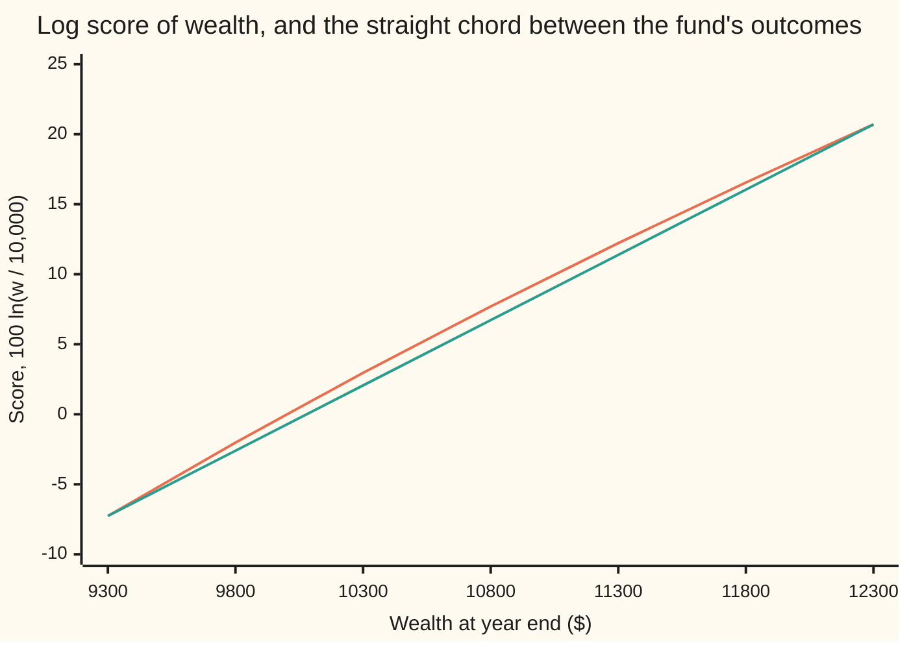
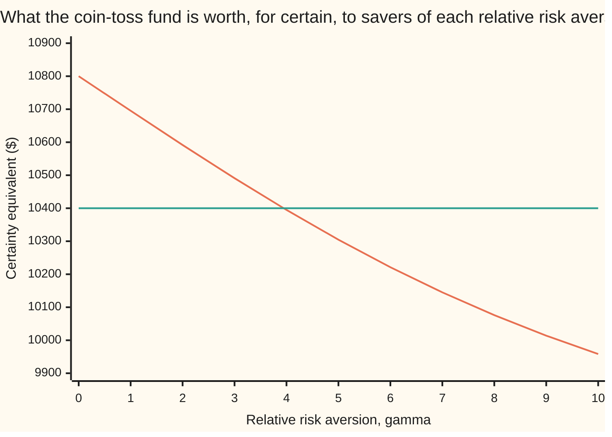

# Expected utility: why a sure 4 percent can beat a risky 8, and the number that says how much you mind risk

[Syllabus](../../../SYLLABUS.md) → [Financial mathematics](../README.md) → [Returns and Utility](../README.md#s36) → Expected utility

---

## General Overview

A saver has $10,000 and one year. Two homes for it.

- **The deposit.** It pays 4 percent, for certain. In a year the saver holds **$10,400**.
- **The fund.** It returns 8 percent on average, with a spread (standard deviation: the typical distance from the average) of 15 percent. On this card the fund is a coin toss: up 23 percent or down 7 percent, equally likely. The year ends at **$12,300** or **$9,300**. The average is $10,800 and the spread is $1,500.

On average the fund wins by $400. Careful people still take the deposit, and not from bad arithmetic: a $1,500 shortfall hurts them more than a $1,500 windfall pleases them. Averaging dollars cannot see that.

Daniel Bernoulli's fix, in 1738, was to average something else. Give every final amount of wealth a score, called its **utility**: what that amount is worth to this saver. Weight each outcome's score by its probability and add; the higher average wins. That average is the **expected utility**. In 1947 John von Neumann and Oskar Morgenstern proved that anyone whose choices obey four consistency rules behaves as if doing this.

If each extra dollar adds less score than the one before, the score curve bends down, and a gamble is worth less than its average. Kenneth Arrow and John Pratt turned that bend into one number, the **coefficient of risk aversion**. With the logarithm as the score, the saver takes the fund. With a bend about four times steeper, the deposit wins.

**Rank risky choices by the probability-weighted average of a score for final wealth; a score that bends down makes a sure thing worth more than a gamble with the same average, and the size of the bend, measured against the slope, says by how much.**

**What kind of fact this is:** a model of how a consistent person chooses, not a law of how people do choose; inside it, three results derived in Why it works (the representation, the concavity test and Pratt's approximation, the last with its error measured on this bet).

### The picture: the score bends, the gamble falls short

Log utility, rescaled so that $10,000 scores 0 and one point is a hundredth of a log unit: the score of wealth $w$ is 100 ln(w / 10,000). The chord joins the fund's two outcomes.



Upper line: the log score. Lower line: the chord. The fund's average score is the chord's midpoint, 6.72 points, above $10,800. The score of a sure $10,800 is the curve there, 7.70 points. The gap is the price of risk in score units. The sure amount scoring 6.72 is **$10,695.33**: that is what the fund is worth to this saver, still more than the deposit's $10,400.

---

## The formula

Notation first, in words. A capital $W$ is the wealth at year end, a random amount. A small $w$ is one particular amount. $E[\,\cdot\,]$ means expectation: weight each outcome by its probability and add. A dash marks a derivative: $u'(w)$ is the slope of the score curve at $w$, and $u''(w)$ is how fast that slope changes, the bend.

$$\text{choose the option with the larger } E[u(W)] = \sum_i \text{prob}_i \, u(w_i)$$

**Read it aloud:** score every possible final wealth, weight each score by its chance, add them up, and pick the larger total.

The sure amount with the same score is the **certainty equivalent** $c$:

$$u(c) = E[u(W)], \qquad \pi = E[W] - c$$

**Read it aloud:** find the sure wealth the saver would swap the gamble for; the shortfall from the average, $\pi$, is the **risk premium**, the dollars the risk costs this saver.

The bend, measured against the slope, is the **Arrow-Pratt coefficient of absolute risk aversion**, and its proportional version is **relative risk aversion**:

$$A(w) = -\frac{u''(w)}{u'(w)}, \qquad \rho(w) = w\,A(w)$$

**Read it aloud:** risk aversion is how fast the score's slope falls, as a fraction of the slope itself; multiply by wealth to measure it per percent instead of per dollar.

For small risks the two meet in Pratt's rule, where $\sigma^2$ is the variance of $W$ (the average squared distance from $E[W]$) and $\sigma$ is the spread:

$$\pi \approx \tfrac12\, A(E[W])\; \sigma^2$$

**Read it aloud:** the risk premium is about half the risk aversion times the variance.

The card's family of scores is **power utility**, one bend setting $\gamma$ for each saver:

$$u(w) = \frac{w^{1-\gamma}}{1-\gamma} \ \ (\gamma \ne 1), \qquad u(w) = \ln w \ \ (\gamma = 1), \qquad \rho(w) = \gamma$$

| Symbol | Plain meaning | In our example | Push it up and the answer… |
| --- | --- | --- | --- |
| $W$ | wealth at year end, not yet known | $12,300 or $9,300 in the fund | — |
| $w$, $w_i$ | one particular amount of wealth; $w_i$ is outcome number i | $10,400, $10,800 | score rises |
| $u(w)$ | the score, or utility, of wealth $w$; only its ranking and shape matter | ln w for the log saver | — |
| $E[\,\cdot\,]$ | expectation: probability-weighted average | $E[W]$ = $10,800 | — |
| $u'(w)$ | slope of the score: extra score per extra dollar | 1/10,800 for ln at $10,800 | — |
| $u''(w)$ | bend of the score: change in slope per dollar | −8.5734 × 10^−9 for ln at $10,800 | changes with any rescaling of $u$, so it cannot measure aversion alone |
| $c$ | certainty equivalent: the sure wealth scoring the same as the gamble | $10,695.33 (log), $10,304.75 ($\gamma$ = 5) | — |
| $\pi$ | risk premium, $E[W] - c$ | $104.67 (log) | the saver likes the fund less |
| $\sigma^2$ | variance of $W$: average squared distance from $E[W]$ | 1,500^2 = 2,250,000 dollars squared | premium rises in proportion |
| $A(w)$ | absolute risk aversion, per dollar | 0.000092593 = 1/10,800 (log) | premium rises in proportion |
| $\rho(w)$, $\gamma$ | relative risk aversion; constant $\gamma$ in the power family | 1 (log), 5 (the cautious saver) | the deposit starts winning above 3.9454 |
| $p$, $p_i$ | the von Neumann-Morgenstern chance: the odds of $12,300 (else $9,300) the saver rates equal to a sure amount | 0.3998 for $10,400 (log) | the sure amount is worth more |

### When it holds

- **Consistent choices.** The representation needs four rules, listed in Why it works. People break the fourth, independence, in the Allais experiments; then no single score fits their choices, and [Prospect theory in outline](06-prospect-theory-in-outline.md) takes over.
- **Known probabilities.** The coin is fair and everyone agrees. If the odds themselves are unknown, the average needs a belief about them first, and the answer moves with that belief.
- **Scores for final wealth, not for gains and losses.** Here $9,300 is scored as a level of wealth. People often score it as "lost $700" from where they stood; that reference point is outside this model.
- **One decision, one period.** The saver chooses once and waits a year. Repeated bets with reinvestment bring in growth rates: [Kelly](05-kelly-criterion-and-growth.md).
- **Averages that exist.** Log and power scores need wealth above zero. A fund that can wipe the saver out scores minus infinity for log utility, and the ranking says never, at any mean.

---

## Why it works

### Step 0: a gamble is worth what it does to a person, not what it pays on average

The fund's $10,800 average is a fact about the fund. Whether $10,800 on average beats $10,400 for sure is a fact about the saver. So the ranking must use something personal, and consistency alone forces its shape: an average of scores.

### Step 1: consistent choices force an average of scores

Von Neumann and Morgenstern asked for four rules about how a person ranks gambles (probability mixtures of outcomes):

1. **Complete:** any two gambles can be compared.
2. **Transitive:** preferring A to B and B to C means preferring A to C.
3. **Continuous:** a sure amount between the worst and best outcome is matched by some chance of the best, else the worst.
4. **Independent:** if A is preferred to B, then mixing each with the same third gamble C, in the same proportions, keeps A ahead.

The proof is a calibration, and the saver's own numbers show it. Take the best outcome, $12,300, and the worst, $9,300. By rule 3, for every sure amount $w$ there is a chance $p$ such that the saver is indifferent between $w$ for certain and a gamble paying $12,300 with chance $p$, else $9,300. Call that chance the score of $w$.

For the log saver the deposit's $10,400 scores $p$ = 0.3998. The fund is already a best-or-worst gamble, with $p$ = 0.5. Higher chance of the best outcome wins, so the fund wins. For a saver with $\gamma$ = 5 the deposit scores 0.5356, above 0.5, so the deposit wins.

Rule 4 does the rest. Any gamble can have each outcome swapped for its matching best-or-worst gamble without changing its worth. The result is one big best-or-worst gamble whose chance of the best is the probability-weighted average of the scores. Ranking gambles is then ranking averages of $p$: expected utility with $u = p$.

<details>
<summary>Detailed proof: the representation for gambles on finitely many outcomes</summary>

Let every outcome lie between a worst amount, Worst, and a best amount, Best, with Best strictly preferred. For each outcome $w_i$, rule 3 gives a chance $p_i$ with $w_i$ indifferent to the gamble "Best with chance $p_i$, else Worst". Rules 1 and 2 make the ranking an ordering. Rule 4, applied once per outcome, lets each $w_i$ inside a gamble be replaced by its matching best-or-worst gamble without changing the ranking of the whole. After all replacements the gamble "$w_i$ with chance $\text{prob}_i$" has become "Best with chance $\sum_i \text{prob}_i\, p_i$, else Worst". Between two gambles of that form, the one with the larger chance of Best is preferred: split the larger chance into the smaller one plus the extra, and rule 4 gives the order. So gamble 1 is preferred to gamble 2 exactly when $\sum_i \text{prob}_i\,p_i$ is larger for gamble 1: expected utility with $u(w_i) = p_i$. The chance $p$ is unique once Best and Worst are fixed, so any other valid score is $a\,p + b$ with $a > 0$ and b any number: scores are fixed up to a positive rescaling and a shift, and nothing else.

</details>

That last line matters for Step 4. A score can be doubled or shifted and every choice stays the same. The log score and the chart's 100 ln(w / 10,000) are the same saver.

### Step 2: minding risk means the score bends down

Call a saver **risk averse** when a sure $E[W]$ is never worse than the gamble $W$. For a score curve that bends down (concave: every chord lies below the curve), [Jensen's inequality](../../09-Probability%20and%20statistics/02-Random%20Variables/06-jensens-inequality.md) gives exactly that:

$$E[u(W)] \le u(E[W])$$

The opening chart shows it: the chord's midpoint, 6.72 points, is the fund's average score; the curve at $10,800 is 7.70 points. The converse holds too: if a saver prefers the sure average to every fifty-fifty gamble between two amounts, the curve lies above every chord at its midpoint, which, for a continuous curve, is concavity. So risk aversion and a downward bend are the same statement.

A straight score, $u(w) = w$, has no bend. Its saver ranks by average wealth alone and takes the fund at $10,800, whatever the spread.

### Step 3: the certainty equivalent turns scores back into dollars

Scores cannot be spent. Undo the score: find the sure wealth $c$ with $u(c) = E[u(W)]$. The score rises with wealth, so exactly one such $c$ exists between $9,300 and $12,300.

For the log saver, $\ln c = \tfrac12 \ln 12{,}300 + \tfrac12 \ln 9{,}300$, so $c$ is the geometric mean, $\sqrt{12{,}300 \times 9{,}300}$ = $10,695.33. For $\gamma$ = 2, $u(w) = -1/w$ and $c$ is the harmonic mean, $10,591.67. Each is a different average of the same two outcomes, and a steeper bend picks a smaller one. The risk premium for the log saver is $10,800 − $10,695.33 = **$104.67**. It is below the fund's $400 edge, so the fund wins.

### Step 4: measure the bend against the slope, and the scale drops out

The bend $u''$ looks like the measure of risk aversion. It is not. Rescale the log score to 100 ln(w / 10,000) + 7: same saver, same choices (Step 1). The bend at $10,800 goes from −8.5734 × 10^−9 to −857.3388 × 10^−9, a hundred times larger. A measure that changes when nothing about the person changes measures nothing.

Divide by the slope and the rescaling cancels, because both $u''$ and $u'$ carry the same factor of 100:

$$A(w) = -\frac{u''(w)}{u'(w)}$$

For ln w, $u' = 1/w$ and $u'' = -1/w^2$, so $A(w) = 1/w$. At $10,800 that is 0.000092593 per dollar. The check computes it by finite differences on both scores and gets 0.000092593 each time.

### Step 5: Pratt's rule says what the number means in dollars

Why this ratio and not another? Because it is the ratio a small risk sees. Write the certainty equivalent as $E[W] - \pi$ and expand both sides of $u(E[W] - \pi) = E[u(W)]$ around $E[W]$, a straight-line approximation on the left and a bend on the right:

$$u(E[W]) - \pi\, u'(E[W]) \approx u(E[W]) + \tfrac12\, u''(E[W])\, \sigma^2$$

The right side has no first-order term, because $W - E[W]$ averages to zero. Solve for $\pi$:

$$\pi \approx \tfrac12\, A(E[W])\, \sigma^2$$

For the log saver: ½ × (1 / 10,800) × 2,250,000 = **$104.17**, against the exact $104.67. The rule is $0.51 short on a $1,500 spread.

<details>
<summary>The error in Pratt's rule, measured</summary>

The approximation drops the third-order term of the expansion on the right and the squared-premium term on the left. Both shrink faster than the variance as the spread shrinks next to wealth, which is why the rule is exact in the limit of small risks. Here the spread is 0.1389 of mean wealth, and the error is $0.51 on a premium of $104.67. Pratt's 1964 paper states the rule with an error of smaller order than the variance. The check asserts only what it computes: the rule lands within $1 of the exact premium on this bet.

</details>

### Step 6: absolute or relative, and why the log saver keeps the same attitude at every wealth

$A(w)$ answers "how much is a fixed dollar risk minded?". For log utility $A = 1/w$ falls as wealth grows. The same bet, $2,300 up or $700 down around a base of $100,000, costs the log saver only **$11.16** in premium, against $104.67 on a base of $10,000. The richer saver barely notices a $1,500 wobble.

Multiply by wealth and the dollar scale goes too: $\rho(w) = w\,A(w)$ answers "how much is a fixed percentage risk minded?". For power utility $u' = w^{-\gamma}$ and $u'' = -\gamma\, w^{-\gamma - 1}$, so $A = \gamma / w$ and $\rho = \gamma$ at every wealth. A power-utility saver's choice between the deposit and the fund does not depend on the $10,000 at all: every outcome scales with it.

That makes $\gamma$ the number to argue about. The saver takes the fund exactly when $c$, as a function of $\gamma$, is above $10,400. The check finds the crossing by bisection (halving an interval that brackets the root, eighty times): **$\gamma$ = 3.9454**. Pratt's rule, $\pi \approx \gamma \times 104.17$ set equal to the $400 edge, gives 3.8400.



Falling line: the fund's certainty equivalent. Flat line: the deposit, $10,400. They cross just below $\gamma$ = 4. At $\gamma$ = 0 the saver is risk neutral and values the fund at its $10,800 average. By $\gamma$ = 10 the fund is worth less than the $10,000 put in.

<details>
<summary>The same fund with a bell-curve log return instead of a coin</summary>

A smoother fund with the same 8 percent mean and 15 percent spread has a log return with variance ln(1 + (0.15/1.08)^2) = 0.0191 and mean ln 1.08 − 0.0191/2 = 0.0674. Power utility then has a closed form, $c = 10{,}000\, e^{\,0.0674 + (1-\gamma)\, 0.0191/2}$, which gives $10,697.32 for the log saver and a break-even $\gamma$ of 3.9505. The check reaches both numbers a second way, by integrating the score over the bell curve with Simpson's rule and bisecting. Coin or bell curve, the crossing sits near 3.95: with the same mean and spread, the shape of the fund barely moves the answer at this size of risk.

</details>

The other road to a risk measure is the whole distribution rather than one number: [Stochastic dominance](04-stochastic-dominance.md) asks when every risk-averse saver agrees, whatever the score.

---

## Worked numbers, by hand

The saver: $10,000, deposit $10,400 for sure, fund $12,300 or $9,300 on a fair coin.

| Step | Arithmetic | Value |
| --- | --- | --- |
| fund, average wealth | ½ × 12,300 + ½ × 9,300 | $10,800.00 |
| fund, spread | each outcome is $1,500 from the average | $1,500.00 |
| log saver, fund's average score | ½ ln 12,300 + ½ ln 9,300 | 9.277562 |
| log saver, deposit's score | ln 10,400 | 9.249561 |
| log saver, certainty equivalent | e^9.277562 = √(12,300 × 9,300) | $10,695.33 |
| log saver, risk premium | 10,800 − 10,695.33 | $104.67 |
| Pratt's rule | ½ × (1/10,800) × 1,500^2 | $104.17 |
| **log saver's choice** | 10,695.33 > 10,400 | **the fund** |
| $\gamma$ = 5, certainty equivalent | (½ × 12,300^−4 + ½ × 9,300^−4)^(−1/4) | $10,304.75 |
| **cautious saver's choice** | 10,304.75 < 10,400 | **the deposit** |
| break-even $\gamma$ | bisection on $c(\gamma)$ = 10,400 | 3.9454 |

The log saver would swap the fund for a sure $10,695.33 and no less. The deposit offers $10,400, so the fund wins by $295.33 of certain money. A saver with $\gamma$ = 5 values the same fund at $10,304.75 and banks the 4 percent.

### What breaks if you drop a piece

| Mistake | Comes out at | What went wrong |
| --- | --- | --- |
| Rank by expected wealth | fund worth $10,800.00 to everyone | No score, so no bend: every saver takes the fund, however cautious. |
| Score the average, $u(E[W])$, instead of averaging the scores | $10,800.00 again | The order matters: scoring after averaging throws the spread away. That swap is Jensen's gap. |
| Pratt's rule with the spread where the variance belongs | log premium $750.00 | ½ × 0.1389 × 10,800 in place of ½ × 0.1389^2 × 10,800; the log saver wrongly switches to the deposit. |
| Read $\gamma$ = 1 as the absolute measure $A$ | log premium $1,125,000.00 | Relative risk aversion is per percent, absolute is per dollar: $A = \gamma / w$, not $\gamma$. |

---

## Code, from first principles, and it actually runs

The script prices the fund for two savers four ways. Road 1 is the exact average of scores for the coin. Road 2 simulates 200,000 years with a home-made random number generator (xorshift: bit shifts and exclusive-ors on a 64-bit integer). Road 3 is the von Neumann-Morgenstern calibration chance. Road 4 is Pratt's rule. For the bell-curve fund, a closed form is checked against Simpson's rule, and the break-even $\gamma$ is found twice, by formula and by bisection on the integral. The risk-aversion coefficient is computed by finite differences on two rescaled scores. Every number on the card is printed.

### Python

```python
# Expected utility and risk aversion -- the check behind the card.  Standard library only.
# Every number quoted on the card is printed here.  The normal density, Simpson's rule,
# the bisection root finder and the random numbers are all written out below.
from math import log, exp, sqrt, pi

W0, DEP, UP, DN = 10000.0, 10400.0, 12300.0, 9300.0   # savings, deposit, the fund's two outcomes
MEAN = 0.5 * UP + 0.5 * DN                            # expected wealth in the fund
VAR = 0.5 * (UP - MEAN) ** 2 + 0.5 * (DN - MEAN) ** 2 # its variance, dollars squared

def u(w, g):                      # power utility with relative risk aversion g; log at g = 1
    return log(w) if g == 1 else w ** (1 - g) / (1 - g)
def u_inv(y, g):
    return exp(y) if g == 1 else (y * (1 - g)) ** (1 / (1 - g))
def ce_coin(g):                   # road 1: exact expected utility of the coin-toss fund, then invert
    return u_inv(0.5 * u(UP, g) + 0.5 * u(DN, g), g)
def vnm_p(w, g):                  # the chance of 12,300 (else 9,300) the saver rates equal to a sure w
    return (u(w, g) - u(DN, g)) / (u(UP, g) - u(DN, g))

def ce_monte_carlo(g, n=200000):  # road 2: simulate n years with a home-made xorshift generator
    s, total = 88172645463325252, 0.0
    for _ in range(n):
        s ^= (s << 13) & 0xFFFFFFFFFFFFFFFF; s ^= s >> 7; s ^= (s << 17) & 0xFFFFFFFFFFFFFFFF
        total += u(UP if (s >> 11) / 2.0 ** 53 < 0.5 else DN, g)
    return u_inv(total / n, g)

def bisect(f, lo, hi):            # root of f between lo and hi, f changing sign
    for _ in range(80):
        mid = 0.5 * (lo + hi)
        if (f(lo) > 0) == (f(mid) > 0): lo = mid
        else: hi = mid
    return 0.5 * (lo + hi)

# ---- a smoother fund: lognormal, same 8% mean and 15% spread ----
S2 = log(1.0 + (0.15 / 1.08) ** 2)          # variance of the log return
M = log(1.08) - 0.5 * S2                    # mean of the log return
def ce_lognormal_formula(g): return W0 * exp(M + 0.5 * (1 - g) * S2)
def ce_lognormal_simpson(g, n=2000):        # second road: integrate u over the bell curve
    a, b = -10.0, 10.0; h = (b - a) / n; tot = 0.0
    for i in range(n + 1):
        z = a + i * h
        wgt = 1 if i in (0, n) else (4 if i % 2 else 2)
        tot += wgt * u(W0 * exp(M + sqrt(S2) * z), g) * exp(-0.5 * z * z) / sqrt(2 * pi)
    return u_inv(tot * h / 3, g)

# ---- the headline comparison ----
print(f"{'deposit, sure wealth':<40}{DEP:>14.2f}")
print(f"{'fund, expected wealth':<40}{MEAN:>14.2f}")
print(f"{'fund, spread of wealth (dollars)':<40}{sqrt(VAR):>14.2f}")
print(f"{'fund, variance (dollars squared)':<40}{VAR:>14.2f}")
print(f"{'spread / expected wealth':<40}{sqrt(VAR) / MEAN:>14.4f}")
print(f"{'E[ln W], fund':<40}{0.5 * log(UP) + 0.5 * log(DN):>14.6f}")
print(f"{'ln W, deposit':<40}{log(DEP):>14.6f}")
for g in (1, 5):
    print(f"gamma = {g}")
    print(f"{'  certainty equivalent, exact':<40}{ce_coin(g):>14.2f}")
    print(f"{'  certainty equivalent, simulated':<40}{ce_monte_carlo(g):>14.2f}")
    print(f"{'  vNM chance matching the deposit':<40}{vnm_p(DEP, g):>14.4f}")
    print(f"{'  takes':<40}{'fund' if ce_coin(g) > DEP else 'deposit':>14}")
print(f"{'log saver, CE minus deposit':<40}{ce_coin(1) - DEP:>14.2f}")

# ---- Arrow-Pratt: -u''/u' by finite differences, two differently scaled utilities ----
w, h = MEAN, 1.0
def ap_numeric(f):
    d1 = (f(w + h) - f(w - h)) / (2 * h); d2 = (f(w + h) - 2 * f(w) + f(w - h)) / h ** 2
    return -d2 / d1, d2
A_log, d2_log = ap_numeric(log)
A_pts, d2_pts = ap_numeric(lambda x: 100 * log(x / 10000) + 7)
print(f"{'A(10800), log, by differences':<40}{A_log:>14.9f}")
print(f"{'A(10800), 100 ln(w/10000)+7':<40}{A_pts:>14.9f}")
print(f"{'A(10800) = 1/w':<40}{1 / w:>14.9f}")
print(f"{'second derivative x 1e9, log':<40}{d2_log * 1e9:>14.4f}")
print(f"{'same, 100 ln(w/10000)+7':<40}{d2_pts * 1e9:>14.4f}")

# ---- Pratt's small-risk rule against the exact premium ----
pratt = 0.5 * (1 / MEAN) * VAR
print(f"{'premium, log, exact':<40}{MEAN - ce_coin(1):>14.2f}")
print(f"{'premium, log, Pratt 0.5 A var':<40}{pratt:>14.2f}")
print(f"{'Pratt error, log':<40}{MEAN - ce_coin(1) - pratt:>14.2f}")
rich = 100000.0                               # same +-1,500 bet on 100,000 of wealth
ce_rich = exp(0.5 * log(rich + 2300) + 0.5 * log(rich - 700))
print(f"{'premium, same bet on 100,000, exact':<40}{rich + 800 - ce_rich:>14.2f}")
g_star = bisect(lambda g: ce_coin(g) - DEP, 1.5, 10.0)
print(f"{'break-even gamma, coin fund, exact':<40}{g_star:>14.4f}")
print(f"{'break-even gamma, Pratt rule':<40}{(MEAN - DEP) / pratt:>14.4f}")

# ---- the lognormal fund, formula and brute force ----
gl_formula = 1 + 2 * (M - log(1.04)) / S2
gl_simpson = bisect(lambda g: ce_lognormal_simpson(g) - DEP, 1.5, 10.0)
print(f"{'lognormal, log-return mean, variance':<26}{M:>14.4f}{S2:>14.4f}")
print(f"{'lognormal CE, log, formula':<40}{ce_lognormal_formula(1):>14.2f}")
print(f"{'lognormal CE, log, Simpson':<40}{ce_lognormal_simpson(1):>14.2f}")
print(f"{'lognormal break-even gamma, formula':<40}{gl_formula:>14.4f}")
print(f"{'lognormal break-even gamma, Simpson':<40}{gl_simpson:>14.4f}")

# ---- what breaks ----
print(f"{'wrong: rank by expected wealth':<40}{MEAN:>14.2f}")
print(f"{'wrong: u(E W) in place of E u(W)':<40}{u_inv(u(MEAN, 1), 1):>14.2f}")
print(f"{'wrong: spread not squared, premium':<40}{0.5 * (0.15 / 1.08) * MEAN:>14.2f}")
print(f"{'wrong: gamma used as A, premium':<40}{0.5 * 1.0 * VAR:>14.2f}")

# ---- chart points ----
print("chart, certainty equivalent for gamma 0 to 5, then 6 to 10")
print("".join(f"{ce_coin(g):>10.2f}" for g in range(0, 6)))
print("".join(f"{ce_coin(g):>10.2f}" for g in range(6, 11)))
xs = [DN + 500.0 * i for i in range(7)]
chord = [100 * log(DN / W0) + (x - DN) / (UP - DN) * 100 * (log(UP / W0) - log(DN / W0)) for x in xs]
print(f"{'chart, wealth':<14}" + "".join(f"{x:>8.0f}" for x in xs))
print(f"{'  100 ln(w/1e4)':<14}" + "".join(f"{100 * log(x / W0):>8.2f}" for x in xs))
print(f"{'  chord':<14}" + "".join(f"{c:>8.2f}" for c in chord))

assert abs(ce_coin(1) - sqrt(UP * DN)) < 1e-6, "log CE must be the geometric mean"
assert abs(ce_coin(2) - 2 / (1 / UP + 1 / DN)) < 1e-6, "gamma 2 CE must be the harmonic mean"
assert abs(ce_monte_carlo(1) - ce_coin(1)) < 10.0, "simulation within $10 of the exact CE"
assert abs(A_log - 1 / w) < 1e-9, "-u''/u' by differences vs 1/w"
assert abs(A_pts - 1 / w) < 1e-9, "-u''/u' ignores rescaling and shifting"
assert abs(pratt - (MEAN - ce_coin(1))) < 1.0, "Pratt's rule within $1 on this bet"
assert abs(ce_lognormal_simpson(1) - ce_lognormal_formula(1)) < 1e-6, "lognormal CE two roads"
assert abs(gl_simpson - gl_formula) < 1e-6, "break-even gamma two roads"
assert abs(ce_lognormal_simpson(0) - MEAN) < 1e-6, "lognormal fund really has mean 10,800"
assert (vnm_p(DEP, 1) < 0.5) == (ce_coin(1) > DEP), "calibration and CE agree, log saver"
assert (vnm_p(DEP, 5) < 0.5) == (ce_coin(5) > DEP), "calibration and CE agree, gamma 5"
assert ce_coin(1) > DEP > ce_coin(5) and vnm_p(DEP, 1) < 0.5 < vnm_p(DEP, 5), "log: fund; gamma 5: deposit"
assert ce_coin(3.9) > DEP > ce_coin(4.0) and abs(g_star - 3.9454) < 5e-5, "crossing between 3.9 and 4"
assert abs(ap_numeric(lambda x: u(x, 5))[0] * w - 5) < 1e-5, "power utility: w A(w) = gamma"
```

**Ran 2026-09-28 on macOS, Python 3.14.6, standard library only. All checks passed. Output, pasted from the run:**

```
deposit, sure wealth                          10400.00
fund, expected wealth                         10800.00
fund, spread of wealth (dollars)               1500.00
fund, variance (dollars squared)            2250000.00
spread / expected wealth                        0.1389
E[ln W], fund                                 9.277562
ln W, deposit                                 9.249561
gamma = 1
  certainty equivalent, exact                 10695.33
  certainty equivalent, simulated             10693.53
  vNM chance matching the deposit               0.3998
  takes                                           fund
gamma = 5
  certainty equivalent, exact                 10304.75
  certainty equivalent, simulated             10303.18
  vNM chance matching the deposit               0.5356
  takes                                        deposit
log saver, CE minus deposit                     295.33
A(10800), log, by differences              0.000092593
A(10800), 100 ln(w/10000)+7                0.000092593
A(10800) = 1/w                             0.000092593
second derivative x 1e9, log                   -8.5734
same, 100 ln(w/10000)+7                      -857.3388
premium, log, exact                             104.67
premium, log, Pratt 0.5 A var                   104.17
Pratt error, log                                  0.51
premium, same bet on 100,000, exact              11.16
break-even gamma, coin fund, exact              3.9454
break-even gamma, Pratt rule                    3.8400
lognormal, log-return mean, variance        0.0674        0.0191
lognormal CE, log, formula                    10697.32
lognormal CE, log, Simpson                    10697.32
lognormal break-even gamma, formula             3.9505
lognormal break-even gamma, Simpson             3.9505
wrong: rank by expected wealth                10800.00
wrong: u(E W) in place of E u(W)              10800.00
wrong: spread not squared, premium              750.00
wrong: gamma used as A, premium             1125000.00
chart, certainty equivalent for gamma 0 to 5, then 6 to 10
  10800.00  10695.33  10591.67  10490.96  10394.90  10304.75
  10221.34  10145.09  10076.02  10013.88   9958.25
chart, wealth     9300    9800   10300   10800   11300   11800   12300
  100 ln(w/1e4)   -7.26   -2.02    2.96    7.70   12.22   16.55   20.70
  chord          -7.26   -2.60    2.06    6.72   11.38   16.04   20.70
```

### Rust

```rust
// Expected utility and risk aversion -- the check behind the card.  Rust std only.
// The same rows as the Python check.  Normal density, Simpson's rule, bisection and
// the random numbers are written out here; nothing is imported that knows the answer.
use std::f64::consts::PI;

const W0: f64 = 10000.0;
const DEP: f64 = 10400.0;
const UP: f64 = 12300.0;
const DN: f64 = 9300.0;

fn u(w: f64, g: f64) -> f64 { if g == 1.0 { w.ln() } else { w.powf(1.0 - g) / (1.0 - g) } }
fn u_inv(y: f64, g: f64) -> f64 { if g == 1.0 { y.exp() } else { (y * (1.0 - g)).powf(1.0 / (1.0 - g)) } }
fn ce_coin(g: f64) -> f64 { u_inv(0.5 * u(UP, g) + 0.5 * u(DN, g), g) }
fn vnm_p(w: f64, g: f64) -> f64 { (u(w, g) - u(DN, g)) / (u(UP, g) - u(DN, g)) }

fn ce_monte_carlo(g: f64, n: usize) -> f64 {
    let mut s: u64 = 88172645463325252;
    let mut total = 0.0;
    for _ in 0..n {
        s ^= s << 13; s ^= s >> 7; s ^= s << 17;
        let x = (s >> 11) as f64 / 2f64.powi(53);
        total += u(if x < 0.5 { UP } else { DN }, g);
    }
    u_inv(total / n as f64, g)
}

fn bisect<F: Fn(f64) -> f64>(f: F, mut lo: f64, mut hi: f64) -> f64 {
    for _ in 0..80 {
        let mid = 0.5 * (lo + hi);
        if (f(lo) > 0.0) == (f(mid) > 0.0) { lo = mid } else { hi = mid }
    }
    0.5 * (lo + hi)
}

fn s2() -> f64 { (1.0 + (0.15f64 / 1.08).powi(2)).ln() }
fn m() -> f64 { 1.08f64.ln() - 0.5 * s2() }
fn ce_lognormal_formula(g: f64) -> f64 { W0 * (m() + 0.5 * (1.0 - g) * s2()).exp() }
fn ce_lognormal_simpson(g: f64) -> f64 {
    let n = 2000;
    let (a, b) = (-10.0, 10.0);
    let h = (b - a) / n as f64;
    let mut tot = 0.0;
    for i in 0..=n {
        let z = a + i as f64 * h;
        let wgt = if i == 0 || i == n { 1.0 } else if i % 2 == 1 { 4.0 } else { 2.0 };
        tot += wgt * u(W0 * (m() + s2().sqrt() * z).exp(), g) * (-0.5 * z * z).exp() / (2.0 * PI).sqrt();
    }
    u_inv(tot * h / 3.0, g)
}

fn row(label: &str, v: f64, d: usize) { println!("{:<40}{:>14.*}", label, d, v); }

fn main() {
    let mean = 0.5 * UP + 0.5 * DN;
    let var = 0.5 * (UP - mean).powi(2) + 0.5 * (DN - mean).powi(2);
    row("deposit, sure wealth", DEP, 2);
    row("fund, expected wealth", mean, 2);
    row("fund, spread of wealth (dollars)", var.sqrt(), 2);
    row("fund, variance (dollars squared)", var, 2);
    row("spread / expected wealth", var.sqrt() / mean, 4);
    row("E[ln W], fund", 0.5 * UP.ln() + 0.5 * DN.ln(), 6);
    row("ln W, deposit", DEP.ln(), 6);
    for g in [1.0, 5.0] {
        println!("gamma = {}", g);
        row("  certainty equivalent, exact", ce_coin(g), 2);
        row("  certainty equivalent, simulated", ce_monte_carlo(g, 200000), 2);
        row("  vNM chance matching the deposit", vnm_p(DEP, g), 4);
        println!("{:<40}{:>14}", "  takes", if ce_coin(g) > DEP { "fund" } else { "deposit" });
    }
    row("log saver, CE minus deposit", ce_coin(1.0) - DEP, 2);

    // Arrow-Pratt by finite differences, on two differently scaled utilities
    let (w, h) = (mean, 1.0);
    let ap = |f: &dyn Fn(f64) -> f64| {
        let d1 = (f(w + h) - f(w - h)) / (2.0 * h);
        let d2 = (f(w + h) - 2.0 * f(w) + f(w - h)) / (h * h);
        (-d2 / d1, d2)
    };
    let (a_log, d2_log) = ap(&|x: f64| x.ln());
    let (a_pts, d2_pts) = ap(&|x: f64| 100.0 * (x / 10000.0).ln() + 7.0);
    row("A(10800), log, by differences", a_log, 9);
    row("A(10800), 100 ln(w/10000)+7", a_pts, 9);
    row("A(10800) = 1/w", 1.0 / w, 9);
    row("second derivative x 1e9, log", d2_log * 1e9, 4);
    row("same, 100 ln(w/10000)+7", d2_pts * 1e9, 4);

    // Pratt's rule against exact premiums
    let pratt = 0.5 * (1.0 / mean) * var;
    row("premium, log, exact", mean - ce_coin(1.0), 2);
    row("premium, log, Pratt 0.5 A var", pratt, 2);
    row("Pratt error, log", mean - ce_coin(1.0) - pratt, 2);
    let rich = 100000.0;
    let ce_rich = (0.5 * (rich + 2300.0f64).ln() + 0.5 * (rich - 700.0f64).ln()).exp();
    row("premium, same bet on 100,000, exact", rich + 800.0 - ce_rich, 2);
    let g_star = bisect(|g| ce_coin(g) - DEP, 1.5, 10.0);
    row("break-even gamma, coin fund, exact", g_star, 4);
    row("break-even gamma, Pratt rule", (mean - DEP) / pratt, 4);

    // the lognormal fund, formula and brute force
    let gl_formula = 1.0 + 2.0 * (m() - 1.04f64.ln()) / s2();
    let gl_simpson = bisect(|g| ce_lognormal_simpson(g) - DEP, 1.5, 10.0);
    println!("{:<26}{:>14.4}{:>14.4}", "lognormal, log-return mean, variance", m(), s2());
    row("lognormal CE, log, formula", ce_lognormal_formula(1.0), 2);
    row("lognormal CE, log, Simpson", ce_lognormal_simpson(1.0), 2);
    row("lognormal break-even gamma, formula", gl_formula, 4);
    row("lognormal break-even gamma, Simpson", gl_simpson, 4);

    // what breaks
    row("wrong: rank by expected wealth", mean, 2);
    row("wrong: u(E W) in place of E u(W)", u_inv(u(mean, 1.0), 1.0), 2);
    row("wrong: spread not squared, premium", 0.5 * (0.15 / 1.08) * mean, 2);
    row("wrong: gamma used as A, premium", 0.5 * 1.0 * var, 2);

    println!("chart, certainty equivalent for gamma 0 to 5, then 6 to 10");
    println!("{}", (0..6).map(|g| format!("{:>10.2}", ce_coin(g as f64))).collect::<String>());
    println!("{}", (6..11).map(|g| format!("{:>10.2}", ce_coin(g as f64))).collect::<String>());
    let xs: Vec<f64> = (0..7).map(|i| DN + 500.0 * i as f64).collect();
    let chord = |x: f64| 100.0 * (DN / W0).ln() + (x - DN) / (UP - DN) * 100.0 * ((UP / W0).ln() - (DN / W0).ln());
    println!("{:<14}{}", "chart, wealth", xs.iter().map(|x| format!("{:>8.0}", x)).collect::<String>());
    println!("{:<14}{}", "  100 ln(w/1e4)", xs.iter().map(|x| format!("{:>8.2}", 100.0 * (x / W0).ln())).collect::<String>());
    println!("{:<14}{}", "  chord", xs.iter().map(|x| format!("{:>8.2}", chord(*x))).collect::<String>());

    assert!((ce_coin(1.0) - (UP * DN).sqrt()).abs() < 1e-6, "log CE must be the geometric mean");
    assert!((ce_coin(2.0) - 2.0 / (1.0 / UP + 1.0 / DN)).abs() < 1e-6, "gamma 2 CE: harmonic mean");
    assert!((ce_monte_carlo(1.0, 200000) - ce_coin(1.0)).abs() < 10.0, "simulation within $10");
    assert!((a_log - 1.0 / w).abs() < 1e-9, "-u''/u' by differences vs 1/w");
    assert!((a_pts - 1.0 / w).abs() < 1e-9, "-u''/u' ignores rescaling and shifting");
    assert!((pratt - (mean - ce_coin(1.0))).abs() < 1.0, "Pratt's rule within $1 on this bet");
    assert!((ce_lognormal_simpson(1.0) - ce_lognormal_formula(1.0)).abs() < 1e-6, "lognormal CE two roads");
    assert!((gl_simpson - gl_formula).abs() < 1e-6, "break-even gamma two roads");
    assert!((ce_lognormal_simpson(0.0) - mean).abs() < 1e-6, "lognormal fund really has mean 10,800");
    assert!((vnm_p(DEP, 1.0) < 0.5) == (ce_coin(1.0) > DEP), "calibration and CE agree, log saver");
    assert!((vnm_p(DEP, 5.0) < 0.5) == (ce_coin(5.0) > DEP), "calibration and CE agree, gamma 5");
    assert!(ce_coin(1.0) > DEP && DEP > ce_coin(5.0), "log: fund; gamma 5: deposit");
    assert!(vnm_p(DEP, 1.0) < 0.5 && 0.5 < vnm_p(DEP, 5.0), "vNM chances either side of one half");
    assert!(ce_coin(3.9) > DEP && DEP > ce_coin(4.0) && (g_star - 3.9454).abs() < 5e-5, "crossing between 3.9 and 4");
    assert!((ap(&|x: f64| u(x, 5.0)).0 * w - 5.0).abs() < 1e-5, "power utility: w A(w) = gamma");
}
```

**Ran 2026-09-28 on macOS, rustc 1.98.1, no crates. All checks passed. Output, pasted from the run:**

```
deposit, sure wealth                          10400.00
fund, expected wealth                         10800.00
fund, spread of wealth (dollars)               1500.00
fund, variance (dollars squared)            2250000.00
spread / expected wealth                        0.1389
E[ln W], fund                                 9.277562
ln W, deposit                                 9.249561
gamma = 1
  certainty equivalent, exact                 10695.33
  certainty equivalent, simulated             10693.53
  vNM chance matching the deposit               0.3998
  takes                                           fund
gamma = 5
  certainty equivalent, exact                 10304.75
  certainty equivalent, simulated             10303.18
  vNM chance matching the deposit               0.5356
  takes                                        deposit
log saver, CE minus deposit                     295.33
A(10800), log, by differences              0.000092593
A(10800), 100 ln(w/10000)+7                0.000092593
A(10800) = 1/w                             0.000092593
second derivative x 1e9, log                   -8.5734
same, 100 ln(w/10000)+7                      -857.3388
premium, log, exact                             104.67
premium, log, Pratt 0.5 A var                   104.17
Pratt error, log                                  0.51
premium, same bet on 100,000, exact              11.16
break-even gamma, coin fund, exact              3.9454
break-even gamma, Pratt rule                    3.8400
lognormal, log-return mean, variance        0.0674        0.0191
lognormal CE, log, formula                    10697.32
lognormal CE, log, Simpson                    10697.32
lognormal break-even gamma, formula             3.9505
lognormal break-even gamma, Simpson             3.9505
wrong: rank by expected wealth                10800.00
wrong: u(E W) in place of E u(W)              10800.00
wrong: spread not squared, premium              750.00
wrong: gamma used as A, premium             1125000.00
chart, certainty equivalent for gamma 0 to 5, then 6 to 10
  10800.00  10695.33  10591.67  10490.96  10394.90  10304.75
  10221.34  10145.09  10076.02  10013.88   9958.25
chart, wealth     9300    9800   10300   10800   11300   11800   12300
  100 ln(w/1e4)   -7.26   -2.02    2.96    7.70   12.22   16.55   20.70
  chord          -7.26   -2.60    2.06    6.72   11.38   16.04   20.70
```

The outputs agree line for line, the simulated rows included: both programs run the same generator from the same seed.

> [!TIP]
> **Try changing**
> Guess the direction first. Then run it.
> - **Set $\gamma$ to 4** in the loop `for g in (1, 5)`. The certainty equivalent is $10,394.90, a whisker under the deposit: a saver at 4 is just past the crossing at 3.9454.
> - **Keep the $1,500 bet, raise the base.** The `rich` rows already do it: on $100,000 the log saver's premium falls from $104.67 to $11.16. Absolute risk aversion falls as wealth rises.
> - **Starve the simulation.** Pass `n=200` to `ce_monte_carlo`. The simulated value strays well away from $10,695.33 and the $10 assert fails: 200 coin tosses cannot pin an average to a few dollars.
> - **Swap the coin for the bell curve.** The lognormal rows give a break-even of 3.9505 against 3.9454: matching mean and spread fixes almost everything.

---

## The usual mistake

> [!warning]
> **Treating utility as a measure of happiness that can be added across people or read off as a number.** It is neither. The score is fixed only up to doubling and shifting (Step 1), so "the log saver's fund scores 9.277562" says nothing, and comparing one saver's units with another's is meaningless. What survives rescaling is the ranking, the certainty equivalent in dollars, and the ratio $A(w)$. Those are the outputs; the scores are scaffolding.
>
> Smaller traps:
> - **Taking $u''$ as the risk measure.** It changes a hundredfold under a harmless rescaling (−8.5734 against −857.3388, in units of 10^−9). Divide by $u'$.
> - **Mixing absolute and relative.** $\gamma$ is per percent of wealth; $A$ is per dollar. Using $\gamma$ = 1 as $A$ gives a premium of $1,125,000.00 on a $1,500 spread.
> - **Trusting Pratt's rule on big risks.** It is a small-risk expansion. Here it lands at 3.8400 for the break-even against the exact 3.9454; on a fund that can halve, the gap grows.

---

## Where you meet it in real life

- **Robo-adviser questionnaires.** The "how would you feel if the portfolio fell by a fifth" questions are estimating a relative risk aversion. The answer sets the split between a deposit-like asset and a fund.
- **Portfolio choice.** With power utility, the best share of wealth in the risky asset is about the excess return divided by $\gamma$ times the return's variance.
- **Insurance.** A household pays more than the expected loss to insure a house because its score bends: the premium above the expected loss is a risk premium, $\pi$. Why both sides can gain from the trade is the business of [Risk premium](03-certainty-equivalent-and-risk-premium.md).
- **The equity premium puzzle.** Stocks have historically beaten safe bonds by several percent a year. Fitting that gap with power utility needs a $\gamma$ far above what most economists find believable: a famous misfit of this model.
- **Growth-optimal betting.** Log utility is also the score that maximises long-run growth when a bet is repeated: [Kelly](05-kelly-criterion-and-growth.md).

> **Say it back**
> A saver ranks risky choices by averaging a personal score for final wealth, and von Neumann and Morgenstern proved that any consistent chooser acts this way. If the score bends down, a gamble is worth less than its average, and the sure amount it is worth is the certainty equivalent. The bend matters only relative to the slope, which gives the Arrow-Pratt number $A = -u''/u'$, and its per-percent version $\rho = w A$. For small risks the risk premium is about half of $A$ times the variance. The saver with $10,000 and log utility values the coin-toss fund at $10,695.33 and takes it over a sure $10,400; above a relative risk aversion of about 3.95, the deposit wins.

---

## What this builds on

- [Returns](01-returns-simple-log-and-annualised.md): the 8 percent, the 15 percent spread and the log of a growth factor; the log saver's score is the log return plus a constant.
- [Jensen's inequality](../../09-Probability%20and%20statistics/02-Random%20Variables/06-jensens-inequality.md): the average of a concave function lies below the function of the average, which is Step 2 in one line.

## Where this goes next

- [Risk premium](03-certainty-equivalent-and-risk-premium.md): the certainty equivalent and risk premium studied on their own, for insurance, pricing and comparisons between people.
- [Stochastic dominance](04-stochastic-dominance.md): when every risk-averse saver agrees on a ranking, without choosing a score.
- Deciding under uncertainty: expected utility as a general decision rule, and what a better forecast is worth before it is bought.

This card ranks two choices for one saver with a known score; the open question is how much of the fund a saver should give up to avoid its risk, and how that sure-money price compares across savers, which [Risk premium](03-certainty-equivalent-and-risk-premium.md) answers.

---

## Sources

Verified 2026-09-28: every link below resolves to the publisher's page.

- Bernoulli, Daniel. "Exposition of a New Theory on the Measurement of Risk." Translated by Louise Sommer. *Econometrica* 22, no. 1 (1954): 23–36, from the Latin of 1738. [doi:10.2307/1909829](https://doi.org/10.2307/1909829). The first expected-utility argument, with the logarithm as the score.
- von Neumann, John, and Oskar Morgenstern. *Theory of Games and Economic Behavior*. Princeton University Press. [Publisher page](https://press.princeton.edu/books/paperback/9780691130613/theory-of-games-and-economic-behavior). The axioms and the representation theorem of Step 1.
- Allais, Maurice. "Le Comportement de l'Homme Rationnel devant le Risque: Critique des Postulats et Axiomes de l'Ecole Americaine." *Econometrica* 21, no. 4 (1953): 503–546. [doi:10.2307/1907921](https://doi.org/10.2307/1907921). The experiments in which people break the independence rule.
- Pratt, John W. "Risk Aversion in the Small and in the Large." *Econometrica* 32, no. 1/2 (1964): 122–136. [doi:10.2307/1913738](https://doi.org/10.2307/1913738). The coefficient $-u''/u'$, the small-risk rule of Step 5, and comparisons of risk aversion in the large.
- Wolitzky, Alexander. *Lecture 9: Attitudes toward Risk*, lecture slides, MIT 14.121 Microeconomic Theory I, Fall 2015. [MIT OpenCourseWare PDF](https://ocw.mit.edu/courses/14-121-microeconomic-theory-i-fall-2015/07a559609869398fc6f98e550a9d2d80_MIT14_121F15_6S.pdf). Certainty equivalents, absolute and relative risk aversion, and the standard utility families, in a compact modern treatment.
