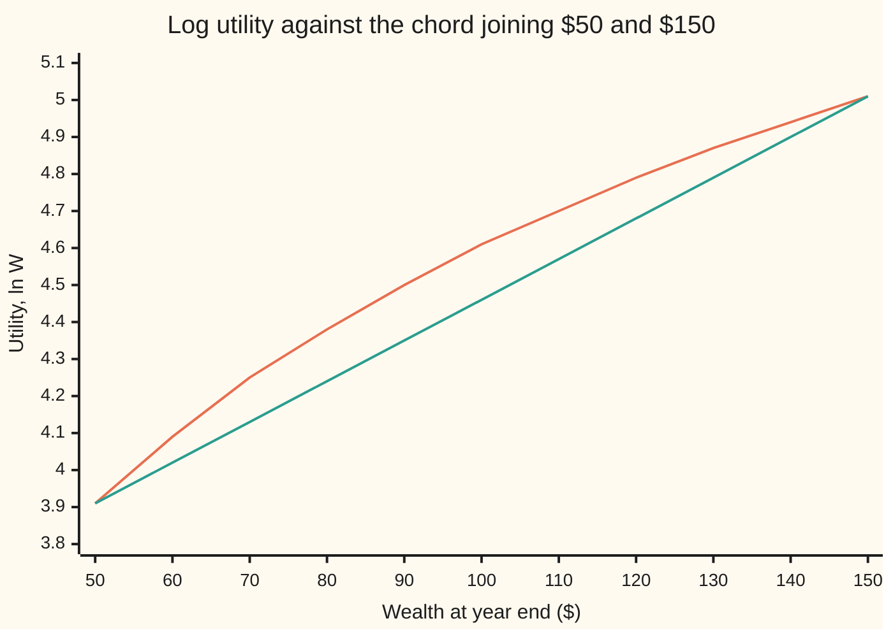
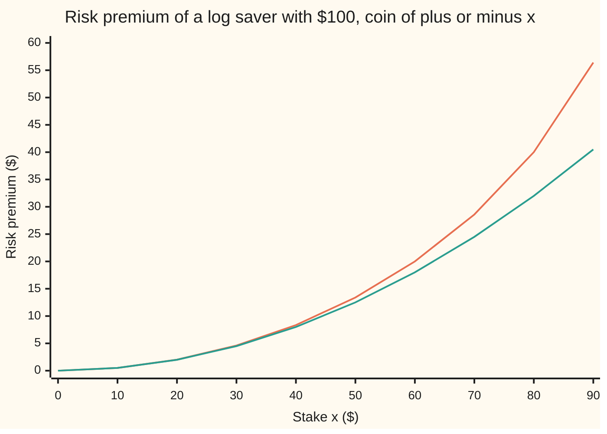

# Risk premium: what a gamble is worth to you, and the discount you demand for it

[Syllabus](../../../SYLLABUS.md) → [Financial mathematics](../README.md) → [Returns and Utility](../README.md#s36) → Risk premium

---

## General Overview

A saver holds $100, all of it in one position. In a year a coin is tossed. Heads, the position is worth $150. Tails, $50. On average it is worth $100: the gain and the loss are the same size.

Now offer the saver a swap: give up the position and take a fixed sum today instead. $100 would be a fair swap on paper. Would $90 do? $85? A saver who measures satisfaction by the logarithm of wealth, a **log investor**, is exactly indifferent at **$86.60**. Any sure sum above that, the saver swaps. Below it, the saver keeps the coin.

That $86.60 has a name: the **certainty equivalent**, the sure amount that feels as good as the gamble. The gap between the gamble's average and its certainty equivalent, $100 − $86.60 = $13.40, is the **risk premium**: the discount demanded for carrying the risk. The same number seen from the other side is the most the saver would pay an insurer to take the coin away.

Utility itself is in units nobody can spend. Expected utility says which gamble is preferred ([Expected utility](02-expected-utility-and-risk-aversion.md)) but not by how many dollars. The certainty equivalent translates the verdict back into dollars. That translation is why the idea exists.

**The certainty equivalent is the sure sum whose utility equals the gamble's expected utility; the risk premium is the gamble's average minus that sum.**

**What kind of fact this is:** a definition. Inside it sit one theorem, that the premium is never negative for a risk-averse saver, proved in Why it works, and one approximation, the Arrow–Pratt formula, with its error stated.

### The picture: the curve and the chord

The log curve, $\ln W$, bends downward. The straight chord joins the two outcomes of the coin. Halfway along the chord sits the gamble's expected utility: 4.46. The curve reaches that height not at \$100 but at \$86.60.



Upper line (orange): the log utility curve. Lower line (green): the chord from $50 to $150, whose midpoint is the coin's expected utility, 4.46, at wealth $100. The curve crosses height 4.46 between $80 (4.38) and $90 (4.50), at $86.60. The horizontal distance from there to $100 is the risk premium. The more the curve bends, the further left the crossing, and the larger the premium.

---

## The formula

Notation first, in words. $W$ is wealth at the end of the year, a random quantity. $\mathbb{E}[\,\cdot\,]$ is the average of whatever sits inside, each outcome weighted by its probability. $u$ is the utility function, turning dollars into satisfaction; $u^{-1}$ runs it backwards, from satisfaction to dollars.

$$u(\mathrm{CE}) = \mathbb{E}[u(W)], \qquad \mathrm{CE} = u^{-1}\big(\mathbb{E}[u(W)]\big), \qquad \pi = \mathbb{E}[W] - \mathrm{CE}$$

**Read it aloud:** average the satisfaction over the outcomes, find the sure sum with that same satisfaction, and call the shortfall from the average wealth the risk premium.

For the coin: $\mathbb{E}[\ln W] = \tfrac12\ln 150 + \tfrac12\ln 50 = 4.4613$, so $\mathrm{CE} = e^{4.4613} = \$86.60$ and $\pi = \$13.40$.

| Symbol | Plain meaning | In our example | Push it up and the answer… |
| --- | --- | --- | --- |
| $W$, $m$ | wealth at year end, not yet known; $m$ is its average | \$150 or \$50, even odds; m = \$100 | a better gamble: higher CE |
| $\mathbb{E}$ | probability-weighted average | E[W] = \$100 | — |
| $u$, $u^{-1}$ | utility: dollars turned into satisfaction; and the same read backwards | ln W, and e to the power y | — |
| $u'$, $u''$, $u'''$ | slope of $u$, how fast the slope changes, and how fast that changes | 1/W, −1/W squared, 2/W cubed | a more negative $u''$: more bend, larger premium |
| $\mathrm{CE}$, $c$, $t$ | certainty equivalent; a candidate sure sum; the target height, the expected utility | \$86.60; t = 4.4613 | — |
| $\pi$ | risk premium: average minus CE | \$13.40 | — |
| $\gamma$ | relative risk aversion (say "gamma"): the bend measured relative to wealth, $\gamma = W \times A$ | 1 for the log | CE falls: \$75.00 at 2 |
| $a$ | absolute risk aversion for the exponential utility | 0.01 per dollar | CE falls |
| $A$ | local risk aversion, $A(W) = -u''(W)/u'(W)$ | 1/100 at \$100 | premium rises in proportion |
| $\sigma^2$, $\varepsilon$, $\xi$, $\eta$ | variance, the average squared swing; the swing itself, W − m; in-between points in Taylor's remainder | 2500 dollars squared; ±\$50 | premium rises in proportion, for small risks |
| $x$, $k$ | the stake (the coin is \$100 plus or minus x); a scale or shift applied to every outcome | 50; 10 and 100 | premium rises faster than the stake |
| $R$, $\mu$, $s^2$ | the fund's gross return per dollar; centre and variance of ln R | 1.08 average; 0.067408; 0.019106 | a higher $\mu$: higher CE |

The three standard utilities give three closed forms, each an average of a different kind:

| Utility | Formula | Certainty equivalent | The coin |
| --- | --- | --- | --- |
| log | $\ln W$ | geometric mean, $e^{\mathbb{E}[\ln W]}$ | \$86.60 |
| power (CRRA) | $W^{1-\gamma}/(1-\gamma)$ | power mean, $\big(\mathbb{E}[W^{1-\gamma}]\big)^{1/(1-\gamma)}$ | \$75.00 at $\gamma = 2$ |
| exponential (CARA) | $-e^{-aW}$ | $-\tfrac1a \ln \mathbb{E}[e^{-aW}]$ | \$87.99 at $a = 0.01$ |

CRRA stands for constant relative risk aversion; CARA for constant absolute risk aversion. The log is the power utility at $\gamma = 1$. At $\gamma = 2$ the power mean is the harmonic mean: two divided by $1/150 + 1/50$, which is \$75.00.

For small risks, one approximation covers every utility, the **Arrow–Pratt formula**:

$$\pi \approx \tfrac12\, A(\mathbb{E}[W])\,\sigma^2$$

**Read it aloud:** the premium is about half the local risk aversion times the variance. For the coin, $\tfrac12 \times \tfrac1{100} \times 2500 = \$12.50$, against the exact \$13.40.

### When it holds

The certainty equivalent is an inverse: it solves $u(c) = t$ for a given height $t$. So existence, uniqueness and the edge cases come first.

- **Existence: $u$ continuous on the range of outcomes.** The target $\mathbb{E}[u(W)]$ lies between $u$ of the worst outcome and $u$ of the best, so the curve passes that height somewhere between them (the intermediate value theorem). With no worst or best outcome, as for the fund below, $\mathbb{E}[u(W)]$ must be finite; it then still lies inside the range of $u$. If $u$ jumps, there may be no sure sum with exactly that satisfaction.
- **Uniqueness: $u$ strictly increasing.** More money is always better, so only one wealth level has any given satisfaction. A flat stretch in $u$ would leave a range of certainty equivalents.
- **Edge cases.** A sure thing is its own certainty equivalent. A straight-line $u$ gives CE equal to the average and a premium of zero. An outcome of \$0 under the log or any $\gamma \ge 1$ has utility of minus infinity, so the CE is \$0: the saver would give up the whole average to escape it. As $\gamma$ grows without limit, the CE falls to the worst outcome, \$50.
- **The approximation needs a small risk.** Arrow–Pratt drops terms in the third and higher powers of the stake. At a $10 stake it is exact to the cent; at $90 it says $40.50 where the truth is $56.41. Lopsided risks, like an insurance loss, miss by more.

---

## Why it works

### Step 0: satisfaction bends, so the average is not enough

A dollar gained at $150 adds less satisfaction than a dollar lost at $50 takes away. So a fair coin on wealth is, in satisfaction, an unfair coin: the loss side weighs more. The certainty equivalent is the dollar amount that carries the gamble's true weight, and the premium measures how much the bend costs.

### Step 1: the certainty equivalent exists and is unique

Take the target height $t = \mathbb{E}[u(W)]$. It is an average of values between $u(\$50)$ and $u(\$150)$, so it lies between them. A continuous $u$ passes through every height between its endpoint values, so some $c$ between \$50 and \$150 has $u(c) = t$. A strictly increasing $u$ reaches each height once, so that $c$ is the only one. The code finds it this way: it halves the interval \$50 to \$150 two hundred times, keeping the half where $u(c) - t$ changes sign. That road never uses a formula for the answer.

### Step 2: a bending curve makes the premium positive

A curve that bends downward, a **concave** curve, lies above every chord drawn between two of its points. The chord's midpoint is $\tfrac12 u(150) + \tfrac12 u(50)$, which is $\mathbb{E}[u(W)]$. The curve's height above the same wealth, \$100, is $u(\mathbb{E}[W])$. So

$$\mathbb{E}[u(W)] \le u(\mathbb{E}[W]).$$

For any number of outcomes the same inequality holds; it is Jensen's inequality. Both sides are satisfactions. Read them back through the increasing $u^{-1}$: $\mathrm{CE} \le \mathbb{E}[W]$, so $\pi \ge 0$. The premium is zero only when $u$ is a straight line across the outcomes, or the risk is not really there.

### Step 3: each utility gives its own average

Apply $u^{-1}$ to $\mathbb{E}[u(W)]$ and see what comes out.

- **Log.** $u^{-1}$ is $e^y$, so $\mathrm{CE} = e^{\mathbb{E}[\ln W]}$. For two equally likely outcomes that is $\sqrt{150 \times 50} = \$86.60$: the geometric mean.
- **Power.** $u^{-1}(y) = \big((1-\gamma)y\big)^{1/(1-\gamma)}$, and the $1-\gamma$ factors cancel: $\mathrm{CE} = \big(\mathbb{E}[W^{1-\gamma}]\big)^{1/(1-\gamma)}$. That is a power mean.
- **Exponential.** $u^{-1}(y) = -\tfrac1a\ln(-y)$, giving $-\tfrac1a\ln\mathbb{E}[e^{-aW}] = \$87.99$ at $a = 0.01$.

Power means fall as the power falls: the power-mean inequality, which is Jensen again, applied to a power curve. So raising $\gamma$ lowers the certainty equivalent, one step at a time:

```
gamma  certainty equivalent of the coin, $ (average is $100)
   0   ████████████████████████████████████████  $100.00
 0.5   █████████████████████████████████████     $93.30
   1   ███████████████████████████████████       $86.60
   2   ██████████████████████████████            $75.00
   4   █████████████████████████                 $62.24
  10   ██████████████████████                    $54.00
```

At $\gamma = 0$ the saver cares only about the average. At $\gamma = 10$ the coin is worth barely more than its worst outcome.

### Step 4: small risks, and where the half-variance comes from

Expand both sides of $u(\mathrm{CE}) = \mathbb{E}[u(W)]$ around the average wealth $m = \mathbb{E}[W]$. The left side moves by the premium times the slope: $u(m) - \pi\,u'(m)$. On the right, the up and down swings cancel at first order, and what survives is half the bend times the average squared swing: $u(m) + \tfrac12 u''(m)\sigma^2$. Set them equal and $\pi \approx \tfrac12\big(-u''(m)/u'(m)\big)\sigma^2$.

That ratio $-u''/u'$ is the local risk aversion $A$ from [Expected utility](02-expected-utility-and-risk-aversion.md). Dividing by the slope makes it a property of preferences, not of the units: doubling $u$, or adding a constant to it, changes neither $A$ nor the certainty equivalent. For the log, $A = 1/W$, and $\gamma = W \times A = 1$.

<details>
<summary>Detailed proof: the Arrow–Pratt formula and its error</summary>

Write $W = m + \varepsilon$, where the swing $\varepsilon$ has average 0 and variance $\sigma^2$. Taylor's theorem to second order, with remainder, on the right side:
$$\mathbb{E}[u(m+\varepsilon)] = u(m) + u'(m)\,\mathbb{E}[\varepsilon] + \tfrac12 u''(m)\,\sigma^2 + \tfrac16\,\mathbb{E}\big[u'''(\xi)\,\varepsilon^3\big],$$
with $\xi$ between $m$ and $m+\varepsilon$, and $\mathbb{E}[\varepsilon] = 0$. On the left, to first order with remainder, $u(m-\pi) = u(m) - \pi\,u'(m) + \tfrac12 u''(\eta)\pi^2$. Equate and divide by $u'(m)$:
$$\pi = \tfrac12 A(m)\,\sigma^2 \;+\; \frac{\tfrac12 u''(\eta)\pi^2 - \tfrac16\mathbb{E}[u'''(\xi)\varepsilon^3]}{u'(m)}.$$
The leftover terms are of third order in the stake: $\pi^2$ is of order $\sigma^4$, and $\varepsilon^3$ is of order $\sigma^3$. So the error shrinks faster than the main term as the stake shrinks. For the log with stake $x$, the exact premium is $100 - \sqrt{100^2 - x^2}$ and the approximation is $x^2/200$; their ratio tends to 1 as $x$ shrinks. At $x = 5$: exact 0.1251, approximation 0.1250. A lopsided swing has a nonzero third moment, which enters at order $\sigma^3$; a symmetric one, like the coin, has the error pushed to fourth order.

</details>

The chart runs the stake from $0 to $90 on the $100 saver:



Upper line (orange): the exact premium, $100 - \sqrt{100^2 - x^2}$. Lower line (green): Arrow–Pratt, $x^2/200$. They agree to the cent at a \$10 stake, part at \$50 (\$13.40 against \$12.50), and split wide as the loss side nears zero wealth.

### Step 5: how the premium scales with wealth

The two families answer "does a richer saver mind this coin less?" differently, and the algebra shows why.

- **Power utility scales.** Multiply every outcome by $k$: $W^{1-\gamma}$ picks up $k^{1-\gamma}$, which the outer power undoes to $k$. So CE and premium scale by $k$. Ten times the coin, \$1,500 or \$500, has CE \$866.03: ten times \$86.60. Premium in proportion to wealth is what "constant *relative*" means.
- **Exponential utility shifts.** Add $k$ to every outcome: $e^{-a(W+k)} = e^{-ak}e^{-aW}$, and the log turns the factor $e^{-ak}$ into $-k$ after dividing by $-a$. So CE shifts by $k$ and the premium stays put: \$12.01 on the coin at wealth \$100, and \$12.01 on the same coin at wealth \$200.
- **The log in between.** The same ±$50 coin on $200 of wealth has CE $193.65 and premium $6.35, about half: the stake halved relative to wealth, and the premium follows the stake squared over wealth.

### Step 6: the premium is the room for insurance

Now a homeowner, same \$100 of wealth, faces a 10% chance of a \$60 loss. The average loss is \$6.00. With log utility, the uninsured position has $\mathrm{CE} = 100^{0.9}\times 40^{0.1} = 100 \times 0.4^{0.1} = \$91.24$.

Full cover at a given price leaves $100 minus that price, for sure. The homeowner buys whenever that sure sum beats the CE, so the most worth paying is $100 − $91.24 = $8.76. That splits into the average loss, $6.00, plus the risk premium, $2.76.

The insurer holds many such policies whose losses do not move together, so its average cost per policy settles near $6.00 and it can behave almost as if risk-neutral. Any price between $6.00 and $8.76 leaves both sides better off. At $8.00 the insured homeowner's expected log wealth is 4.5218, above 4.5135 uninsured. The risk premium is the gap in which the insurance trade lives.

Arrow–Pratt here says $1.72, well short of $2.76. The loss is lopsided: small chance, large size. Step 4's third-order term is doing the work.

The same premium, read in rates instead of dollars, is the extra return investors demand for holding a risky fund over a deposit. [Stochastic dominance](04-stochastic-dominance.md) asks when every risk-averse saver agrees on a ranking without choosing a $u$ at all.

---

## Worked numbers, by hand

The coin, log utility, $100 staked:

| Step | Arithmetic | Value |
| --- | --- | --- |
| average wealth | $\tfrac12 \times 150 + \tfrac12 \times 50$ | \$100.00 |
| variance | $\tfrac12 \times 50^2 + \tfrac12 \times 50^2$ | 2500 |
| utilities of the two outcomes | $\ln 150$, $\ln 50$ | 5.01, 3.91 |
| expected utility | average of the two | 4.4613 |
| utility of the average | $\ln 100$ | 4.6052 |
| certainty equivalent | $e^{4.4613} = \sqrt{150 \times 50}$ | **\$86.60** |
| risk premium | 100 − 86.60 | **$13.40** |
| Arrow–Pratt | $\tfrac12 \times \tfrac1{100} \times 2500$ | \$12.50 |

The saver would trade the coin for any sure sum above $86.60, and so would accept up to $13.40 less than its average to be rid of it.

**The house fund.** The shelf's saver chooses between a 4% deposit and a fund whose gross return $R$ (end value per dollar) averages 1.08 with spread 0.15. Take $R$ lognormal: $\ln R$ follows a bell curve with centre $\mu$ and variance $s^2$ ([Returns](01-returns-simple-log-and-annualised.md) sets out log returns). Matching the mean and spread gives $s^2 = \ln(1 + (0.15/1.08)^2) = 0.019106$ and $\mu = \ln 1.08 - s^2/2 = 0.067408$. Then for power utility

$$\mathrm{CE} = \exp\!\big(\mu + (1-\gamma)\,s^2/2\big).$$

| Step | Arithmetic | Value |
| --- | --- | --- |
| log saver, $\gamma = 1$ | $e^{0.067408}$ | 1.0697: a sure 6.97% |
| premium, in points | 8 − 6.97 | 1.03 |
| Arrow–Pratt, in points | $\tfrac12 \times 0.15^2 / 1.08 \times 100$ | 1.04 |
| $\gamma = 2$ | $e^{\mu - s^2/2}$ | a sure 5.96% |
| $\gamma = 6$ | $e^{\mu - 5 s^2/2}$ | a sure 1.98% |
| where fund equals deposit | $-2(\ln 1.04 - \mu)/s^2 + 1$ | **$\gamma$ = 3.95** |

The log saver values the fund like a sure 6.97% and takes it over the 4% deposit. A saver with $\gamma$ above 3.95 keeps the deposit.

### What breaks if you drop a piece

Same coin, correct CE $86.60 and premium $13.40:

| Mistake | Comes out at | What went wrong |
| --- | --- | --- |
| Report $\mathbb{E}[\ln W]$ as the value | 4.46 | That is satisfaction, not dollars. It must go back through $u^{-1}$. |
| Take utility of the average, $u(\mathbb{E}[W])$ | CE \$100.00, premium \$0.00 | The order matters: average the utilities, not the wealth. This is the risk-neutral answer. |
| Arrow–Pratt on a large stake | $12.50 | A small-risk formula used on a coin that halves wealth. |
| Arrow–Pratt on the insurance loss | $1.72 (right: $2.76) | A lopsided loss; the third-order term is large. |

---

## Code, from first principles, and it actually runs

Both programs compute every certainty equivalent on this card by two roads: the closed form (geometric, power or exponential mean) and a bisection that finds the sure sum using only the utility function itself. The fund takes a third road, a Monte Carlo average over 200,000 simulated returns with a home-made random number generator; its expectation under power utility comes from Simpson's rule on the bell curve, and the $\gamma$ at which fund and deposit tie is found by bisection on top of that. Asserts check closed form against bisection, the harmonic mean at $\gamma = 2$, the falling ladder, scaling and shifting, the Arrow–Pratt limit, the $8.00 insurance purchase, the fund's mean and spread, and its three roads.

### Python

```python
# Certainty equivalent and risk premium -- the check behind the card.  Standard library only.
# Every number quoted on the card is printed here.  Road 1 is each closed form.  Road 2 solves
# u(c) = E[u(W)] by bisection, using only the utility itself.  Road 3 (the fund) is a Monte Carlo
# with its own random numbers.  The normal average is Simpson's rule written out.
from math import log, exp, sqrt, cos, sin, pi

def u_crra(g):                          # constant relative risk aversion; g = 1 is the logarithm
    return (lambda w: log(w)) if g == 1 else (lambda w: w ** (1 - g) / (1 - g))

def u_cara(a):                          # constant absolute risk aversion, the exponential
    return lambda w: -exp(-a * w)

def eu(u, outs):                        # expected utility of a list of (probability, wealth)
    return sum(p * u(w) for p, w in outs)

def bisect(f, lo, hi, n=200):           # a root of an increasing f between lo and hi
    for _ in range(n):
        mid = 0.5 * (lo + hi)
        if f(mid) < 0: lo = mid
        else: hi = mid
    return 0.5 * (lo + hi)

def ce_bisect(u, outs):                 # road 2: find the sure amount with the same utility
    t = eu(u, outs)
    return bisect(lambda c: u(c) - t, min(w for _, w in outs), max(w for _, w in outs))

def ce_crra(g, outs):                   # road 1: the power mean (the geometric mean at g = 1)
    if g == 1: return exp(sum(p * log(w) for p, w in outs))
    return sum(p * w ** (1 - g) for p, w in outs) ** (1 / (1 - g))

def ce_cara(a, outs):                   # road 1 for the exponential: -(1/a) ln E[e^(-aW)]
    return -log(sum(p * exp(-a * w) for p, w in outs)) / a

def arrow_pratt(outs, A=lambda w: 1 / w):   # half of -u''/u' at the mean (1/w for the log), times the variance
    mn = sum(p * w for p, w in outs)
    return 0.5 * A(mn) * sum(p * (w - mn) ** 2 for p, w in outs)

row = lambda name, v, f=".4f": print(f"{name:<40} {v:>12{f}}")

# ---- the coin flip: all of $100 staked, ends at $150 or $50 ----
coin = [(0.5, 150.0), (0.5, 50.0)]
mean = sum(p * w for p, w in coin)
var = sum(p * (w - mean) ** 2 for p, w in coin)
ce1, ce2 = sqrt(150.0 * 50.0), ce_bisect(u_crra(1), coin)
row("mean wealth", mean); row("variance", var, ".2f")
row("E[ln W]", eu(u_crra(1), coin)); row("ln of the mean", log(mean))
row("CE log, geometric mean", ce1); row("CE log, bisection", ce2)
row("risk premium, log", mean - ce1)
row("Arrow-Pratt premium, log", arrow_pratt(coin), ".2f")
assert abs(ce1 - ce2) < 1e-9
print("\nladder: g, CE power mean, CE bisection, premium")
ladder = []
for g in (0, 0.5, 1, 2, 4, 10):
    a_, b_ = ce_crra(g, coin), ce_bisect(u_crra(g), coin)
    ladder.append(a_)
    print(f"  g = {g:<5} {a_:>12.2f} {b_:>12.2f} {mean - a_:>10.2f}")
    assert abs(a_ - b_) < 1e-8
assert all(x > y for x, y in zip(ladder, ladder[1:]))         # more curvature, lower CE: Jensen
assert abs(ladder[3] - 2 / (1 / 150 + 1 / 50)) < 1e-9          # g = 2 is the harmonic mean, 75
row("CE cara a = 0.01", ce_cara(0.01, coin)); row("CE cara, bisection", ce_bisect(u_cara(0.01), coin))
row("premium cara, wealth 100", mean - ce_cara(0.01, coin))
assert abs(ce_cara(0.01, coin) - ce_bisect(u_cara(0.01), coin)) < 1e-9
row("premium cara, wealth 200", 200 - ce_cara(0.01, [(0.5, 250.0), (0.5, 150.0)]))
row("CE log, wealth 200", sqrt(250.0 * 150.0)); row("premium log, wealth 200", 200 - sqrt(250.0 * 150.0))
row("CE log, 10x scale", sqrt(1500.0 * 500.0), ".2f")
assert abs(ce_bisect(u_crra(1), [(0.5, 1500.0), (0.5, 500.0)]) - 10 * ce1) < 1e-9          # power utility scales
assert abs(ce_bisect(u_cara(0.01), [(0.5, 250.0), (0.5, 150.0)]) - 100 - ce_cara(0.01, coin)) < 1e-9  # CARA shifts

# ---- the premium against the stake: exact 100 - sqrt(100^2 - x^2), Arrow-Pratt x^2/200 ----
xs = range(0, 100, 10)
exact = [100 - ce_bisect(u_crra(1), [(0.5, 100.0 + x), (0.5, 100.0 - x)]) if x else 0.0 for x in xs]
print("\nstake x   " + "".join(f"{x:>7}" for x in xs))
print("exact     " + "".join(f"{v:>7.2f}" for v in exact))
print("A-P x^2/200" + "".join(f"{arrow_pratt([(0.5, 100.0 + x), (0.5, 100.0 - x)]):>7.2f}" for x in xs)[1:])
small, ap5 = 100 - ce_bisect(u_crra(1), [(0.5, 105.0), (0.5, 95.0)]), arrow_pratt([(0.5, 105.0), (0.5, 95.0)])
row("stake 5: exact", small); row("stake 5: Arrow-Pratt", ap5)
assert abs(small / ap5 - 1) < 0.01                      # the approximation is exact in the limit

ws = range(50, 160, 10)
print("\nchart W   " + "".join(f"{w:>6}" for w in ws))
print("ln W      " + "".join(f"{log(w):>6.2f}" for w in ws))
print("chord     " + "".join(f"{log(50) + (w - 50) / 100 * (log(150) - log(50)):>6.2f}" for w in ws))

# ---- insurance: wealth $100, a 10% chance of losing $60 ----
risk = [(0.9, 100.0), (0.1, 40.0)]
ce_i, ce_ib = 100 * 0.4 ** 0.1, ce_bisect(u_crra(1), risk)
el = 0.1 * 60
row("insurance CE, closed form", ce_i); row("insurance CE, bisection", ce_ib)
row("most the owner pays, 100 - CE", 100 - ce_i); row("expected loss", el, ".2f")
row("risk premium, insurance", 100 - ce_i - el)
row("Arrow-Pratt, insurance", arrow_pratt(risk))
assert abs(ce_i - ce_ib) < 1e-9
assert log(100 - 8.0) > eu(u_crra(1), risk)                      # insuring at $8.00 beats keeping the risk
row("buy at 8.00: E[ln], insured", log(92.0)); row("E[ln], uninsured", eu(u_crra(1), risk))

# ---- the house fund: gross return lognormal, mean 1.08, spread 0.15; deposit 1.04 ----
m, sd, dep = 1.08, 0.15, 1.04
s2 = log(1 + (sd / m) ** 2); mu = log(m) - s2 / 2
def simpson(f, a=-10.0, b=10.0, n=4000):
    h = (b - a) / n
    tot = f(a) + f(b) + sum((4 if i % 2 else 2) * f(a + i * h) for i in range(1, n))
    return tot * h / 3
dens = lambda z: exp(-z * z / 2) / sqrt(2 * pi)
R = lambda z: exp(mu + sqrt(s2) * z)
assert abs(simpson(lambda z: R(z) * dens(z)) - m) < 1e-9                  # the fund's mean is 1.08
assert abs(sqrt(simpson(lambda z: (R(z) - m) ** 2 * dens(z))) - sd) < 1e-9 # and its spread 0.15
def ce_fund(g):                          # road 2: Simpson for E[u(R)], then bisection
    t = simpson(lambda z: u_crra(g)(R(z)) * dens(z))
    return bisect(lambda c: u_crra(g)(c) - t, 0.5, 2.0)
row("fund s^2", s2, ".6f"); row("fund mu", mu, ".6f")
ce_f1, ce_f2 = exp(mu), ce_fund(1)
row("fund CE log, closed form", ce_f1); row("fund CE log, Simpson", ce_f2)
seed = 20260928
def rnd():                               # 64-bit linear congruential generator, top 53 bits
    global seed
    seed = (6364136223846793005 * seed + 1442695040888963407) % 2 ** 64
    return ((seed >> 11) + 0.5) / 2 ** 53
acc, n_mc = 0.0, 200000
for _ in range(n_mc // 2):
    r_, t_ = sqrt(-2 * log(rnd())), 2 * pi * rnd()
    acc += log(R(r_ * cos(t_))) + log(R(r_ * sin(t_)))
row("fund CE log, Monte Carlo", exp(acc / n_mc))
assert abs(ce_f1 - ce_f2) < 1e-9
assert abs(ce_f1 - exp(acc / n_mc)) < 1e-3
row("fund premium log, in points", 100 * (m - ce_f1))
row("Arrow-Pratt, fund, in points", 100 * 0.5 * sd ** 2 / m)
g_star = 1 - 2 * (log(dep) - mu) / s2
g_bis = bisect(lambda g: dep - ce_fund(g), 1.5, 8.0, 60)
row("gamma where fund = deposit, closed", g_star); row("gamma where fund = deposit, bisection", g_bis)
assert abs(g_star - g_bis) < 1e-6
row("fund CE g = 2, in percent", 100 * (ce_fund(2) - 1)); row("fund CE g = 6, in percent", 100 * (ce_fund(6) - 1))
```

**Ran 2026-09-28 on macOS, Python 3.14.6, standard library only. All checks passed. Output, pasted from the run:**

```
mean wealth                                  100.0000
variance                                      2500.00
E[ln W]                                        4.4613
ln of the mean                                 4.6052
CE log, geometric mean                        86.6025
CE log, bisection                             86.6025
risk premium, log                             13.3975
Arrow-Pratt premium, log                        12.50

ladder: g, CE power mean, CE bisection, premium
  g = 0           100.00       100.00       0.00
  g = 0.5          93.30        93.30       6.70
  g = 1            86.60        86.60      13.40
  g = 2            75.00        75.00      25.00
  g = 4            62.24        62.24      37.76
  g = 10           54.00        54.00      46.00
CE cara a = 0.01                              87.9885
CE cara, bisection                            87.9885
premium cara, wealth 100                      12.0115
premium cara, wealth 200                      12.0115
CE log, wealth 200                           193.6492
premium log, wealth 200                        6.3508
CE log, 10x scale                              866.03

stake x         0     10     20     30     40     50     60     70     80     90
exact        0.00   0.50   2.02   4.61   8.35  13.40  20.00  28.59  40.00  56.41
A-P x^2/200  0.00   0.50   2.00   4.50   8.00  12.50  18.00  24.50  32.00  40.50
stake 5: exact                                 0.1251
stake 5: Arrow-Pratt                           0.1250

chart W       50    60    70    80    90   100   110   120   130   140   150
ln W        3.91  4.09  4.25  4.38  4.50  4.61  4.70  4.79  4.87  4.94  5.01
chord       3.91  4.02  4.13  4.24  4.35  4.46  4.57  4.68  4.79  4.90  5.01
insurance CE, closed form                     91.2444
insurance CE, bisection                       91.2444
most the owner pays, 100 - CE                  8.7556
expected loss                                    6.00
risk premium, insurance                        2.7556
Arrow-Pratt, insurance                         1.7234
buy at 8.00: E[ln], insured                    4.5218
E[ln], uninsured                               4.5135
fund s^2                                     0.019106
fund mu                                      0.067408
fund CE log, closed form                       1.0697
fund CE log, Simpson                           1.0697
fund CE log, Monte Carlo                       1.0694
fund premium log, in points                    1.0268
Arrow-Pratt, fund, in points                   1.0417
gamma where fund = deposit, closed             3.9505
gamma where fund = deposit, bisection          3.9505
fund CE g = 2, in percent                      5.9561
fund CE g = 6, in percent                      1.9836
```

### Rust

```rust
// Certainty equivalent and risk premium -- the check behind the card.  Rust std only.
// Every number quoted on the card is printed here.  Road 1 is each closed form.  Road 2 solves
// u(c) = E[u(W)] by bisection, using only the utility itself.  Road 3 (the fund) is a Monte Carlo
// with its own random numbers.  The normal average is Simpson's rule written out.
use std::f64::consts::PI;

fn u_crra(g: f64, w: f64) -> f64 { if g == 1.0 { w.ln() } else { w.powf(1.0 - g) / (1.0 - g) } }
fn u_cara(a: f64, w: f64) -> f64 { -(-a * w).exp() }
fn eu(u: &dyn Fn(f64) -> f64, outs: &[(f64, f64)]) -> f64 {
    let mut s = 0.0;
    for &(p, w) in outs { s += p * u(w); }
    s
}
fn bisect(f: &dyn Fn(f64) -> f64, mut lo: f64, mut hi: f64, n: usize) -> f64 {
    for _ in 0..n {
        let mid = 0.5 * (lo + hi);
        if f(mid) < 0.0 { lo = mid; } else { hi = mid; }
    }
    0.5 * (lo + hi)
}
fn ce_bisect(u: &dyn Fn(f64) -> f64, outs: &[(f64, f64)]) -> f64 {
    let t = eu(u, outs);
    let lo = outs.iter().map(|o| o.1).fold(f64::INFINITY, f64::min);
    let hi = outs.iter().map(|o| o.1).fold(f64::NEG_INFINITY, f64::max);
    bisect(&|c| u(c) - t, lo, hi, 200)
}
fn ce_crra(g: f64, outs: &[(f64, f64)]) -> f64 {
    if g == 1.0 { return eu(&|w: f64| w.ln(), outs).exp(); }
    eu(&|w: f64| w.powf(1.0 - g), outs).powf(1.0 / (1.0 - g))
}
fn ce_cara(a: f64, outs: &[(f64, f64)]) -> f64 { -eu(&|w: f64| (-a * w).exp(), outs).ln() / a }
fn arrow_pratt(outs: &[(f64, f64)]) -> f64 {   // half of -u''/u' at the mean (1/w for the log), times the variance
    let mn = eu(&|w| w, outs);
    0.5 * (1.0 / mn) * eu(&|w| (w - mn) * (w - mn), outs)
}
fn row(name: &str, v: f64, d: usize) { println!("{:<40} {:>12.*}", name, d, v); }
fn simpson(f: &dyn Fn(f64) -> f64) -> f64 {
    let (a, b, n) = (-10.0, 10.0, 4000);
    let h = (b - a) / n as f64;
    let mut s = 0.0;
    for i in 1..n { s += (if i % 2 == 1 { 4.0 } else { 2.0 }) * f(a + i as f64 * h); }
    (f(a) + f(b) + s) * h / 3.0
}

fn main() {
    // ---- the coin flip: all of $100 staked, ends at $150 or $50 ----
    let coin = [(0.5, 150.0), (0.5, 50.0)];
    let mean = eu(&|w| w, &coin);
    let var = eu(&|w| (w - mean) * (w - mean), &coin);
    let (ce1, ce2) = ((150.0f64 * 50.0).sqrt(), ce_bisect(&|w| u_crra(1.0, w), &coin));
    row("mean wealth", mean, 4); row("variance", var, 2);
    row("E[ln W]", eu(&|w| w.ln(), &coin), 4); row("ln of the mean", mean.ln(), 4);
    row("CE log, geometric mean", ce1, 4); row("CE log, bisection", ce2, 4);
    row("risk premium, log", mean - ce1, 4);
    row("Arrow-Pratt premium, log", arrow_pratt(&coin), 2);
    assert!((ce1 - ce2).abs() < 1e-9);
    println!("\nladder: g, CE power mean, CE bisection, premium");
    let mut ladder = vec![];
    for (g, lab) in [(0.0, "0"), (0.5, "0.5"), (1.0, "1"), (2.0, "2"), (4.0, "4"), (10.0, "10")] {
        let a_ = ce_crra(g, &coin);
        let b_ = ce_bisect(&|w| u_crra(g, w), &coin);
        ladder.push(a_);
        println!("  g = {:<5} {:>12.2} {:>12.2} {:>10.2}", lab, a_, b_, mean - a_);
        assert!((a_ - b_).abs() < 1e-8);
    }
    assert!(ladder.windows(2).all(|p| p[0] > p[1]));             // more curvature, lower CE: Jensen
    assert!((ladder[3] - 2.0 / (1.0 / 150.0 + 1.0 / 50.0)).abs() < 1e-9); // g = 2: harmonic mean
    row("CE cara a = 0.01", ce_cara(0.01, &coin), 4);
    row("CE cara, bisection", ce_bisect(&|w| u_cara(0.01, w), &coin), 4);
    row("premium cara, wealth 100", mean - ce_cara(0.01, &coin), 4);
    assert!((ce_cara(0.01, &coin) - ce_bisect(&|w| u_cara(0.01, w), &coin)).abs() < 1e-9);
    row("premium cara, wealth 200", 200.0 - ce_cara(0.01, &[(0.5, 250.0), (0.5, 150.0)]), 4);
    row("CE log, wealth 200", (250.0f64 * 150.0).sqrt(), 4);
    row("premium log, wealth 200", 200.0 - (250.0f64 * 150.0).sqrt(), 4);
    row("CE log, 10x scale", (1500.0f64 * 500.0).sqrt(), 2);
    assert!((ce_bisect(&|w| w.ln(), &[(0.5, 1500.0), (0.5, 500.0)]) - 10.0 * ce1).abs() < 1e-9); // power scales
    assert!((ce_bisect(&|w| u_cara(0.01, w), &[(0.5, 250.0), (0.5, 150.0)]) - 100.0 - ce_cara(0.01, &coin)).abs() < 1e-9); // CARA shifts

    // ---- the premium against the stake: exact 100 - sqrt(100^2 - x^2), Arrow-Pratt x^2/200 ----
    let (mut l1, mut l2, mut l3) = (String::from("stake x   "), String::from("exact     "), String::from("A-P x^2/200"));
    for i in 0..10 {
        let x = 10.0 * i as f64;
        let ex = if i > 0 { 100.0 - ce_bisect(&|w| w.ln(), &[(0.5, 100.0 + x), (0.5, 100.0 - x)]) } else { 0.0 };
        l1 += &format!("{:>7}", 10 * i);
        l2 += &format!("{:>7.2}", ex);
        let ap = format!("{:>7.2}", arrow_pratt(&[(0.5, 100.0 + x), (0.5, 100.0 - x)]));
        l3 += if i == 0 { &ap[1..] } else { &ap };
    }
    println!("\n{}\n{}\n{}", l1, l2, l3);
    let small = 100.0 - ce_bisect(&|w| w.ln(), &[(0.5, 105.0), (0.5, 95.0)]);
    let ap5 = arrow_pratt(&[(0.5, 105.0), (0.5, 95.0)]);
    row("stake 5: exact", small, 4); row("stake 5: Arrow-Pratt", ap5, 4);
    assert!((small / ap5 - 1.0).abs() < 0.01);      // the approximation is exact in the limit

    let (mut c1, mut c2, mut c3) = (String::from("chart W   "), String::from("ln W      "), String::from("chord     "));
    for w in (50..160).step_by(10) {
        let wf = w as f64;
        c1 += &format!("{:>6}", w);
        c2 += &format!("{:>6.2}", wf.ln());
        c3 += &format!("{:>6.2}", 50f64.ln() + (wf - 50.0) / 100.0 * (150f64.ln() - 50f64.ln()));
    }
    println!("\n{}\n{}\n{}", c1, c2, c3);

    // ---- insurance: wealth $100, a 10% chance of losing $60 ----
    let risk = [(0.9, 100.0), (0.1, 40.0)];
    let (ce_i, ce_ib) = (100.0 * 0.4f64.powf(0.1), ce_bisect(&|w| w.ln(), &risk));
    let el = 0.1 * 60.0;
    row("insurance CE, closed form", ce_i, 4); row("insurance CE, bisection", ce_ib, 4);
    row("most the owner pays, 100 - CE", 100.0 - ce_i, 4); row("expected loss", el, 2);
    row("risk premium, insurance", 100.0 - ce_i - el, 4);
    row("Arrow-Pratt, insurance", arrow_pratt(&risk), 4);
    assert!((ce_i - ce_ib).abs() < 1e-9);
    assert!((100.0f64 - 8.0).ln() > eu(&|w| w.ln(), &risk));   // insuring at $8.00 beats keeping the risk
    row("buy at 8.00: E[ln], insured", 92f64.ln(), 4); row("E[ln], uninsured", eu(&|w| w.ln(), &risk), 4);

    // ---- the house fund: gross return lognormal, mean 1.08, spread 0.15; deposit 1.04 ----
    let (m, sd, dep) = (1.08f64, 0.15f64, 1.04f64);
    let s2 = (1.0 + (sd / m) * (sd / m)).ln();
    let mu = m.ln() - s2 / 2.0;
    let rr = |z: f64| (mu + s2.sqrt() * z).exp();
    let dens = |z: f64| (-z * z / 2.0).exp() / (2.0 * PI).sqrt();
    assert!((simpson(&|z| rr(z) * dens(z)) - m).abs() < 1e-9);                    // the fund's mean is 1.08
    assert!((simpson(&|z| (rr(z) - m).powi(2) * dens(z)).sqrt() - sd).abs() < 1e-9); // and its spread 0.15
    let ce_fund = |g: f64| {
        let t = simpson(&|z| u_crra(g, rr(z)) * dens(z));
        bisect(&|c| u_crra(g, c) - t, 0.5, 2.0, 200)
    };
    row("fund s^2", s2, 6); row("fund mu", mu, 6);
    let (ce_f1, ce_f2) = (mu.exp(), ce_fund(1.0));
    row("fund CE log, closed form", ce_f1, 4); row("fund CE log, Simpson", ce_f2, 4);
    let mut seed: u64 = 20260928;
    let mut rnd = || {                  // 64-bit linear congruential generator, top 53 bits
        seed = seed.wrapping_mul(6364136223846793005).wrapping_add(1442695040888963407);
        ((seed >> 11) as f64 + 0.5) / 9007199254740992.0
    };
    let (mut acc, n_mc) = (0.0, 200000);
    for _ in 0..n_mc / 2 {
        let r_ = (-2.0 * rnd().ln()).sqrt();
        let t_ = 2.0 * PI * rnd();
        acc += rr(r_ * t_.cos()).ln() + rr(r_ * t_.sin()).ln();
    }
    let ce_mc = (acc / n_mc as f64).exp();
    row("fund CE log, Monte Carlo", ce_mc, 4);
    assert!((ce_f1 - ce_f2).abs() < 1e-9);
    assert!((ce_f1 - ce_mc).abs() < 1e-3);
    row("fund premium log, in points", 100.0 * (m - ce_f1), 4);
    row("Arrow-Pratt, fund, in points", 100.0 * 0.5 * sd * sd / m, 4);
    let g_star = 1.0 - 2.0 * (dep.ln() - mu) / s2;
    let g_bis = bisect(&|g| dep - ce_fund(g), 1.5, 8.0, 60);
    row("gamma where fund = deposit, closed", g_star, 4);
    row("gamma where fund = deposit, bisection", g_bis, 4);
    assert!((g_star - g_bis).abs() < 1e-6);
    row("fund CE g = 2, in percent", 100.0 * (ce_fund(2.0) - 1.0), 4);
    row("fund CE g = 6, in percent", 100.0 * (ce_fund(6.0) - 1.0), 4);
}
```

**Ran 2026-09-28 on macOS, rustc 1.98.1, no crates. All checks passed. Output, pasted from the run:**

```
mean wealth                                  100.0000
variance                                      2500.00
E[ln W]                                        4.4613
ln of the mean                                 4.6052
CE log, geometric mean                        86.6025
CE log, bisection                             86.6025
risk premium, log                             13.3975
Arrow-Pratt premium, log                        12.50

ladder: g, CE power mean, CE bisection, premium
  g = 0           100.00       100.00       0.00
  g = 0.5          93.30        93.30       6.70
  g = 1            86.60        86.60      13.40
  g = 2            75.00        75.00      25.00
  g = 4            62.24        62.24      37.76
  g = 10           54.00        54.00      46.00
CE cara a = 0.01                              87.9885
CE cara, bisection                            87.9885
premium cara, wealth 100                      12.0115
premium cara, wealth 200                      12.0115
CE log, wealth 200                           193.6492
premium log, wealth 200                        6.3508
CE log, 10x scale                              866.03

stake x         0     10     20     30     40     50     60     70     80     90
exact        0.00   0.50   2.02   4.61   8.35  13.40  20.00  28.59  40.00  56.41
A-P x^2/200  0.00   0.50   2.00   4.50   8.00  12.50  18.00  24.50  32.00  40.50
stake 5: exact                                 0.1251
stake 5: Arrow-Pratt                           0.1250

chart W       50    60    70    80    90   100   110   120   130   140   150
ln W        3.91  4.09  4.25  4.38  4.50  4.61  4.70  4.79  4.87  4.94  5.01
chord       3.91  4.02  4.13  4.24  4.35  4.46  4.57  4.68  4.79  4.90  5.01
insurance CE, closed form                     91.2444
insurance CE, bisection                       91.2444
most the owner pays, 100 - CE                  8.7556
expected loss                                    6.00
risk premium, insurance                        2.7556
Arrow-Pratt, insurance                         1.7234
buy at 8.00: E[ln], insured                    4.5218
E[ln], uninsured                               4.5135
fund s^2                                     0.019106
fund mu                                      0.067408
fund CE log, closed form                       1.0697
fund CE log, Simpson                           1.0697
fund CE log, Monte Carlo                       1.0694
fund premium log, in points                    1.0268
Arrow-Pratt, fund, in points                   1.0417
gamma where fund = deposit, closed             3.9505
gamma where fund = deposit, bisection          3.9505
fund CE g = 2, in percent                      5.9561
fund CE g = 6, in percent                      1.9836
```

The two outputs agree line for line. The Monte Carlo road lands at 1.0694 against the exact 1.0697, inside its sampling error.

> [!TIP]
> **Try changing**
> - **Give the saver $200 and keep the ±$50 coin.** Guess first: does the premium halve, or quarter? Log utility: CE $193.65, premium $6.35, about half. Exponential utility: $12.01, unchanged.
> - **Scale the whole coin by ten**, $1,500 or $500. Guess the CE before running. It is $866.03: power utilities scale.
> - **Set $\gamma = 6$ in the fund.** Guess whether the fund still beats the 4% deposit. It does not: a sure 1.98%.
> - **Shrink the stake to $10.** Guess how close Arrow–Pratt comes. Exact and approximate both print 0.50.

---

## The usual mistake

> [!warning]
> **Averaging the wealth instead of the satisfaction.** $\ln$ of the average wealth is 4.6052; the average of $\ln$ wealth is 4.4613. The first treats the coin as worth \$100.00 and finds no premium at all. The certainty equivalent comes from averaging utilities first and only then converting back to dollars. The order of those two operations is the whole idea.
>
> Smaller traps:
> - **Reading expected utility as money.** 4.46 is not a price. Only $u^{-1}$ turns it into one, \$86.60.
> - **Using Arrow–Pratt where the risk is large or lopsided.** It gives $12.50 for the coin and $1.72 for the insurance, against $13.40 and $2.76. It is a small-risk formula.
> - **Forgetting that the premium depends on wealth.** The same coin costs a log saver $13.40 at $100 and $6.35 at $200. A premium quoted without the wealth behind it is incomplete, except under exponential utility.
> - **Confusing the risk premium with the insurance price.** The most worth paying is the average loss plus the premium, $6.00 + $2.76 = $8.76, not the premium alone.

---

## Where you meet it in real life

- **Insurance.** Every policy is sold inside the gap Step 6 describes: above the average loss, below the average loss plus the buyer's risk premium. Insurers profit because pooling makes them close to risk-neutral while buyers are not.
- **The equity premium.** Shares have long returned more than bank deposits. The house fund pays 4 points over the deposit. A log saver would give up only 1.03 of them for certainty; a saver with $\gamma = 3.95$ would give up all 4.
- **Selling a lottery-like asset.** A private business owner or an employee holding company stock often values it below its average payoff: the certainty equivalent. That gap explains why concentrated holders sell to diversified buyers at a discount.
- **Kelly betting.** The log saver maximises the average of $\ln W$, which is the long-run growth rate of wealth: [Kelly](05-kelly-criterion-and-growth.md).
- **Mean-variance portfolio rules.** "Expected return minus half of risk aversion times variance", the objective of mean-variance portfolio choice, is the Arrow–Pratt formula written as a target.

> **Say it back**
> A gamble's certainty equivalent is the sure sum that gives the same expected utility. The risk premium is the gamble's average minus that sum: $13.40 on a ±$50 coin for a log saver with $100. A concave utility makes the premium positive, by Jensen's inequality, and more bend makes it larger. For small risks it is about half the local risk aversion times the variance. The same number is the most above the average loss that anyone would pay to insure.

---

## What this builds on

- [Expected utility](02-expected-utility-and-risk-aversion.md): the utility function, choosing by expected utility, and the risk-aversion measures $A$ and $\gamma$. This card turns those verdicts into dollars.

## Where this goes next

- [Prospect theory in outline](06-prospect-theory-in-outline.md): what real people do instead, measuring gains and losses from a reference point and weighting small probabilities too heavily.
- [Stochastic dominance](04-stochastic-dominance.md): rankings every risk-averse saver agrees on, with no utility chosen.
- [Kelly](05-kelly-criterion-and-growth.md): the log saver's choice, repeated, as a rule for sizing bets.

Expected utility with one concave $u$ predicts that the same person never both insures and buys a lottery ticket, yet many do; prospect theory is the account of choice built to explain that.

---

## Sources

Verified 2026-09-28: every link below resolves to the publisher's page or a registered DOI.

- Bernoulli, Daniel. "Exposition of a New Theory on the Measurement of Risk." Translated by Louise Sommer. *Econometrica* 22, no. 1 (1954): 23–36. [doi:10.2307/1909829](https://doi.org/10.2307/1909829). The 1738 paper that proposed log utility and priced a gamble by its certainty equivalent.
- Pratt, John W. "Risk Aversion in the Small and in the Large." *Econometrica* 32, no. 1/2 (1964): 122–136. [doi:10.2307/1913738](https://doi.org/10.2307/1913738). Defines the risk premium, the measure $-u''/u'$, and the half-variance approximation.
- Mossin, Jan. "Aspects of Rational Insurance Purchasing." *Journal of Political Economy* 76, no. 4 (1968): 553–568. [doi:10.1086/259427](https://doi.org/10.1086/259427). The insurance side: full cover is the best choice at a fair price, partial cover once the price exceeds the average loss.
- Eeckhoudt, Louis, Christian Gollier, and Harris Schlesinger. *Economic and Financial Decisions under Risk*. Princeton University Press, 2005. [Publisher page](https://press.princeton.edu/books/paperback/9780691122151/economic-and-financial-decisions-under-risk). A textbook treatment of certainty equivalents, risk premia and insurance demand.
