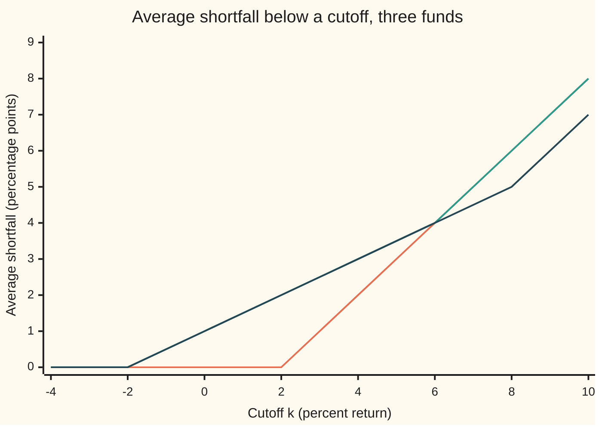

# Stochastic dominance: when one gamble beats another for every sensible investor

Financial mathematics → Returns and Utility → Ranking gambles without choosing a utility → Stochastic dominance

---

## General Overview

Three funds each take $100 for one year. Steady pays back $102 for certain. Swing pays back $98 or $106, each with probability one half. Upside pays back $98 or $108, each with probability one half. On $100, a return of 2 percent is exactly $2, so returns and dollars read the same on this card.

Which fund is better? Expected utility answers that question one investor at a time: pick a utility (a score for each outcome, higher for outcomes the investor likes more), average the scores, take the higher average ([expected-utility-and-risk-aversion](02-expected-utility-and-risk-aversion.md)). But nobody knows anyone's utility exactly. Stochastic dominance asks a stronger question: does one fund win for every investor in a whole class at once?

Two classes matter. The first is every investor who prefers more money to less. The second is every investor who prefers more money to less and also dislikes risk. A fund that wins for the whole first class **first-order dominates**; one that wins for the whole second class **second-order dominates**. The surprise is that neither needs a utility at all. Each reduces to a test on the funds' probabilities alone, and the three funds give all three possible verdicts:

- Upside beats Swing for everyone who likes money. Same bad outcome, better good one.
- Steady beats Swing for everyone who likes money and dislikes risk. Same average, less spread. Some risk-lovers disagree.
- Steady and Upside are not ranked by either class. Some risk-averse investors pick one, some the other.

**One fund dominates another when its chance of ending at or below every threshold is never higher (first order), or when its average shortfall below every cutoff is never higher (second order); each test is equivalent to winning for a whole class of investors at once.**

**What kind of fact this is:** two definitions (the orders) and a theorem (each order equals a test on the probabilities alone), proved on this card in Why it works.

### The picture: Upside is never more likely to end low

The chance of ending at or below a threshold, for Swing and Upside, at the four returns either fund can produce. One █ is 0.05.

```
threshold   fund     chance of ending at or below it
t = -2      Swing    ██████████            0.50
            Upside   ██████████            0.50
t =  2      Swing    ██████████            0.50
            Upside   ██████████            0.50
t =  6      Swing    ████████████████████  1.00
            Upside   ██████████            0.50
t =  8      Swing    ████████████████████  1.00
            Upside   ████████████████████  1.00
```

Upside's bar is never longer than Swing's. At 6 percent it is shorter: Swing has certainly finished by then, Upside has a half chance of going further. That picture is first-order dominance.

---

## The formula

Notation first, in words. $A$ and $B$ are the one-year returns of two funds, in percent, before they are known. $F_A(t)$ is the **cumulative distribution function** (CDF) of $A$: the chance that $A$ ends at or below the threshold $t$ ([densities-and-cdfs](../../09-Probability%20and%20statistics/04-Continuous%20Distributions/01-densities-and-cdfs.md)). $E[\cdot]$ is the average, weighted by probability. $u$ is a utility. $A \succeq_1 B$ reads "A first-order dominates B"; $A \succeq_2 B$ reads "A second-order dominates B".

**First order.** For every increasing utility $u$, meaning more return never scores less:

$$A \succeq_1 B \iff E[u(A)] \ge E[u(B)] \text{ for every increasing } u \iff F_A(t) \le F_B(t) \text{ for every } t$$

**Read it aloud:** A wins for every investor who prefers more to less exactly when, at every threshold, A is no more likely than B to end at or below it.

**Second order.** Write $(x)^+$ for $\max(x, 0)$: $x$ when positive, zero otherwise. The **shortfall** of $A$ below a cutoff $k$ is the average amount by which $A$ falls short of $k$, counting zero when it does not:

$$P_A(k) = E\big[(k - A)^+\big] = \int_{-\infty}^{k} F_A(t)\,dt$$

The second equality, proved in Step 2, says the shortfall is the area under the CDF up to $k$. Then, for every utility $u$ that is increasing and **concave** (its slope never rises, which is what risk aversion means in the expected-utility model):

$$A \succeq_2 B \iff E[u(A)] \ge E[u(B)] \text{ for every increasing concave } u \iff P_A(k) \le P_B(k) \text{ for every } k$$

**Read it aloud:** A wins for every risk-averse investor who prefers more to less exactly when, at every cutoff, A's average shortfall is no larger than B's.

| Symbol | Plain meaning | In our example | Push it up and the answer… |
| --- | --- | --- | --- |
| $A$, $B$ | the two funds' one-year returns, in percent | Upside and Swing | — |
| $t$, $k$ | a threshold return (t for the CDF, k for the shortfall cutoff) | −2, 2, 6, 8 | tests a higher slice of outcomes |
| $F_A(t)$, $F_B(t)$ | chance of ending at or below $t$ | Swing at 6: 1.00; Upside at 6: 0.50 | a higher CDF is the worse fund |
| $P_A(k)$, $P_B(k)$ | average shortfall below $k$: area under the CDF up to $k$ | Steady at 8: 6.00; Upside at 8: 5.00 | a higher shortfall is the worse fund |
| $(x)^+$ | $x$ if positive, else zero | $(2 - (-2))^+ = 4$ | — |
| $E[\cdot]$ | average weighted by probability | $E[\text{Upside}] = 3$ | — |
| $u$, $u'$, $u''$ | a utility; its slope; the change in its slope | $u(r) = \ln(100 + r)$ | — |
| $\succeq_1$, $\succeq_2$ | first- and second-order dominance | Upside $\succeq_1$ Swing; Steady $\succeq_2$ Swing | — |
| $a$, $b$ | lowest and highest return either fund can produce | −2 and 8 | — |
| $\mu$, $\sigma$ | mean and spread (standard deviation) of a normally distributed fund | 8% and 15% | more mean helps; more spread hurts risk-averse investors |
| $N(x)$, $\varphi(x)$ | the normal curve's area to the left of $x$, and its height at $x$ | $N(-0.2667) = 0.3949$ | — |
| $z$ | distance from the mean in spreads, $(k - \mu)/\sigma$ | $(4 - 8)/15 = -0.2667$ | — |

### When it holds

- **Same horizon, same money, fees included.** A one-year return against a two-year return, or a gross return against a net one, compares different things; convert first.
- **Known probabilities.** The tests are theorems about the stated distributions. Estimated from a short history, a cutoff where two shortfalls nearly touch can flip with a few more years of data.
- **Investors judge only the final outcome, by expected utility.** Someone who scores gains and losses from a reference point, or bends probabilities, as in [prospect-theory-in-outline](06-prospect-theory-in-outline.md), sits outside both classes and can choose a dominated fund.
- **Risk aversion, for second order only.** A lottery buyer has a utility that bends upward somewhere and sits outside the class; Steady $\succeq_2$ Swing says nothing about that buyer.
- **Finite averages.** The utility side compares averages, so it covers only utilities whose averages exist. With returns heavy enough that some are infinite, the tests rank the funds for the utilities that remain.

---

## Why it works

### Step 0: every investor is built from simple pieces

The class "every increasing utility" is too big to test member by member. But every member is a weighted sum of very simple members, so testing the simple ones tests every sum of them. For first order the pieces are **threshold bets**: score 1 if the return beats $t$, else 0. For second order the pieces are **capped investors**: score the return, but never more than $k$. Each piece's average is a value of the CDF or of the shortfall. That is why the tests contain no utility.

### Step 1: first order is the CDF test

A threshold bet $u(r) = 1$ if $r > t$, else 0, is increasing. Its average for fund $A$ is the chance $A$ beats $t$, which is $1 - F_A(t)$. So if A is to win for every increasing utility, it must win for this one: $F_A(t) \le F_B(t)$. That is one direction.

For the other, write a smooth increasing utility as its lowest value plus a stack of threshold bets, one for each thin slice of thresholds between $a$ and $b$, weighted by the slope $u'(t)$:

$$u(x) = u(a) + \int_a^b u'(t)\,[x > t]\,dt$$

The bracket $[x > t]$ is 1 when true, 0 when false. Average both sides, and the bracket averages to $1 - F(t)$:

$$E[u(A)] - E[u(B)] = \int_a^b u'(t)\,\big(F_B(t) - F_A(t)\big)\,dt$$

Every factor is at least zero when the CDF test holds, so the difference is at least zero. A kinked or stepped utility is the same stack with some steps concentrated at points. The test is exact in both directions.

On the funds: the threshold bet at $t = 2$ scores Steady 0.00, Swing 0.50, Upside 0.50. A money-lover who only cares about beating 2 percent prefers Swing, so Steady does not first-order dominate Swing.

### Step 2: the shortfall is the area under the CDF

For one outcome $x$, the shortfall below $k$ is $(k - x)^+$: the length of the stretch of thresholds from $x$ up to $k$. As a sum of thresholds:

$$(k - x)^+ = \int_{-\infty}^{k} [x \le t]\,dt$$

Average over the fund's outcomes: the bracket averages to $F(t)$, so $P(k) = \int_{-\infty}^{k} F(t)\,dt$. On Swing at $k = 4$: the CDF is 0 up to −2 and 0.50 from −2 to 4, an area of $0.50 \times 6 = 3$; directly, Swing falls short of 4 by 6 half the time, an average of 3.

The chart traces the three shortfall curves. Between the returns a fund can produce, each curve is a straight line, so the knots at −2, 2, 6 and 8 are the only places a comparison can change.



Orange: Steady. Green: Swing. Dark blue: Upside. Steady never lies above Swing: second-order dominance. Upside never lies above Swing: implied by its first-order win. Steady and Upside cross at 6, so neither ranks the other.

### Step 3: second order is the shortfall test

A capped investor $u(r) = \min(r, k)$ is increasing and concave. Its average is $k - P(k)$, because capping a return at $k$ removes exactly its shortfall below $k$ from $k$: $\min(r, k) = k - (k - r)^+$. So a fund that wins for every risk-averse investor must win for each capped one, and $P_A(k) \le P_B(k)$ follows. That is one direction.

For the other, take a smooth increasing concave $u$ on $[a, b]$. Taylor's theorem with its remainder written as an integral rewrites it as a line plus a stack of capped pieces, weighted by $-u''(k)$: minus the rate at which the slope changes, which concavity makes non-negative. Averaging gives the identity the code checks:

$$E[u(A)] - E[u(B)] = u'(b)\,\big(E[A] - E[B]\big) + \int_a^b \big(-u''(k)\big)\,\big(P_B(k) - P_A(k)\big)\,dk$$

At the top cutoff $b$ every outcome falls short, so $P(b) = b - E[\cdot]$ and $E[A] - E[B] = P_B(b) - P_A(b)$. When the shortfall test holds, every term is a product of non-negative numbers. The difference is at least zero.

For log utility on wealth, $u(r) = \ln(100 + r)$, Steady against Swing: the direct average difference is 0.000769527, and the identity gives 0.000769527.

<details>
<summary>Detailed proof: the identity, kinked utilities, and why four cutoffs suffice</summary>

**The identity.** For $x$ in $[a, b]$, $u(x) = u(b) - \int_x^b u'(s)\,ds$ and $u'(s) = u'(b) - \int_s^b u''(k)\,dk$. Substituting and swapping the order of integration gives $\int_x^b u'(s)\,ds = u'(b)(b - x) - \int_x^b u''(k)(k - x)\,dk$. So $u(x) = u(b) + u'(b)(x - b) + \int_a^b u''(k)\,(k - x)^+\,dk$. Averaging over $A$, then over $B$, and subtracting gives the identity in Step 3, with $E[(k - A)^+] = P_A(k)$.

**Kinked utilities.** A concave increasing $u$ need not have a second derivative. On a fund with finitely many outcomes $s_1 < \dots < s_m$, only $u$'s values there matter. The slopes between neighbouring outcomes, $d_1, \dots, d_{m-1}$, are non-negative and fall. Then $u$ agrees on the outcomes with $u(s_1) + d_{m-1}(r - s_1) + \sum_{j=2}^{m-1} (d_{j-1} - d_j)\,(\min(r, s_j) - s_1)$: a rising line plus non-negative multiples of capped investors. Each capped piece is ranked by the shortfall test; the line is ranked by the mean, which is the shortfall at the top cutoff. So the sum is ranked.

**Four cutoffs suffice.** Below every outcome both shortfalls are zero. Between neighbouring outcomes each shortfall is a straight line in $k$, so their difference is too, and a straight line that is non-negative at both ends is non-negative between. Above every outcome the difference is the constant $E[A] - E[B]$. So checking the outcomes themselves checks every real $k$. The same holds for CDFs, which are constant between outcomes.

</details>

### Step 4: first order implies second order

If $F_A(t) \le F_B(t)$ at every $t$, the areas under the two CDFs up to any $k$ are ordered the same way, so $P_A(k) \le P_B(k)$. In utility terms: every increasing concave utility is an increasing utility, so winning for the bigger class includes winning for the smaller. Upside against Swing shows it on the chart: Upside's shortfall is never above Swing's.

### Step 5: equal means, and what second order then says

Steady and Swing have the same mean, 2 percent. Swing is Steady plus a coin flip of ±4 points that averages zero: a **mean-preserving spread**. Rothschild and Stiglitz proved that with equal means, $A \succeq_2 B$ holds exactly when $B$ is $A$ plus noise that averages zero given $A$. This card states that equivalence and does not prove it; the construction of the noise is in their paper, listed under Sources. Without equal means the reading fails: Upside has more spread than Steady and a higher mean, and neither dominates.

An alternative route to first order runs through quantiles: sort each fund's outcomes from worst to best, and first-order dominance says A's outcome at every rank is at least B's. The code takes that route as a second test for first order.

---

## Worked numbers, by hand

The funds, per $100 for one year, even odds where there are two outcomes.

| Step | Arithmetic | Value |
| --- | --- | --- |
| means | Steady 2; Swing $(-2 + 6)/2$; Upside $(-2 + 8)/2$ | 2.00, 2.00, 3.00 |
| spreads | Steady 0; Swing half of 8; Upside half of 10 | 0.00, 4.00, 5.00 |
| Upside vs Swing, CDFs at −2, 2, 6, 8 | Upside 0.50, 0.50, 0.50, 1.00 against Swing 0.50, 0.50, 1.00, 1.00 | never higher: **Upside $\succeq_1$ Swing** |
| Steady vs Swing, CDF at 2 | Steady 1.00 against Swing 0.50 | first order fails |
| Steady vs Swing, shortfalls at −2, 2, 6, 8 | Steady 0, 0, 4, 6 against Swing 0, 2, 4, 6 | never higher: **Steady $\succeq_2$ Swing** |
| Steady vs Upside, shortfall at 2 | Steady 0.00 against Upside 2.00 | Upside cannot dominate |
| Steady vs Upside, shortfall at 8 | Steady 6.00 against Upside 5.00 | Steady cannot dominate: **neither** |
| a witness for each side | capped at 2: Steady 2.00, Upside 0.00; linear: Steady 2.00, Upside 3.00 | two risk-averse investors disagree |

Two risk-averse investors disagreeing is what "not ranked" means.

### The shelf's house example

A saver chooses between a 4 percent deposit and a fund whose return is normally distributed with mean $\mu$ = 8 percent and spread $\sigma$ = 15 percent. For a normal fund, the shortfall has a closed form: with $z = (k - \mu)/\sigma$,

$$P(k) = \sigma\,\varphi(z) + (k - \mu)\,N(z)$$

where $N$ is the normal curve's area to the left and $\varphi$ its height.

| Step | Arithmetic | Value |
| --- | --- | --- |
| chance the fund ends below 4% | $N((4 - 8)/15) = N(-0.2667)$ | 0.3949 |
| deposit's shortfall at 4 | $(4 - 4)^+$ | 0.0000 |
| fund's shortfall at 4 | $15\,\varphi(-0.2667) - 4\,N(-0.2667)$ | 4.1957 |
| deposit's shortfall at 30 | $30 - 4$ | 26.0000 |
| fund's shortfall at 30 | same formula | 22.4741 |
| verdict | the curves cross | **neither dominates** |

The fund's higher mean wins for a linear investor, 8 against 4. An investor capped at 4 percent scores the fund at $4 - 4.1957 = -0.1957$ and the deposit at 4. A normal fund always has some chance of ending below any sure rate, so it never dominates a deposit, whatever its mean.

### What breaks if you drop a piece

| Mistake | Comes out at | What went wrong |
| --- | --- | --- |
| Judge by the mean alone | Steady minus Swing: 0.00, "a tie" | Every risk-averse investor prefers Steady; the mean cannot see spread |
| Judge by the spread alone | Upside riskier by 5.00 points, "Steady wins" | The linear investor prefers Upside, 3.00 to 2.00; nothing dominates |
| Check one shortfall cutoff, k = 8 | Upside lower by 1.00, "Upside wins at second order" | At k = 2 Upside is higher by 2.00; the test is every cutoff |
| Check one CDF threshold, t = −2 | Steady lower by 0.50, "Steady wins at first order" | At t = 2 Steady is higher by 0.50 |

---

## Code, from first principles, and it actually runs

The code tests every ordered pair of funds four ways. For first order: the CDF test, the quantile test, and a search over 2,000 random increasing utilities that counts how many rank the pair the wrong way. For second order: the shortfall test and the same search over 2,000 random increasing concave utilities. The random numbers come from a hand-written generator, identical in both languages, so the counts match. Each shortfall is computed twice, as an average and as an area under the CDF. The Step 3 identity is checked against the direct average. On the house example, the normal curve's area is built two ways (Simpson's rule and a power series), and the fund's shortfall two ways (the closed form and a brute-force integral). Every number on this card is printed.

### Python

```python
# Stochastic dominance -- the check behind the card.  Standard library only.
# Three funds, one year, returns in percent, even odds.  Every number quoted on
# the card is printed here.  The normal CDF, the integrator and the random
# numbers are written out below; nothing imported knows the answer.
from math import exp, log, sqrt, pi

FUNDS = {"Steady": [(2.0, 1.0)], "Swing": [(-2.0, 0.5), (6.0, 0.5)],
         "Upside": [(-2.0, 0.5), (8.0, 0.5)]}
KNOTS = [-2.0, 2.0, 6.0, 8.0]
PAIRS = [("Upside", "Swing"), ("Swing", "Upside"), ("Steady", "Swing"),
         ("Swing", "Steady"), ("Steady", "Upside"), ("Upside", "Steady")]

def mean(f):        return sum(p * x for x, p in f)
def spread(f):      return sqrt(sum(p * (x - mean(f)) ** 2 for x, p in f))
def cdf(f, t):      return sum(p for x, p in f if x <= t)
def shortfall(f, k): return sum(p * max(k - x, 0.0) for x, p in f)    # road 1: E[(k - X)+]
def area(f, k, lo=-10.0, h=0.01):                                     # road 2: area under the CDF
    n = round((k - lo) / h)
    return sum(cdf(f, lo + (i + 0.5) * h) for i in range(n)) * h
def quantile(f, q):  return min(x for x, p in f if cdf(f, x) >= q)

def rng(seed):                               # 64-bit LCG, top 53 bits -> [0, 1)
    s = seed
    while True:
        s = (s * 6364136223846793005 + 1442695040888963407) % 2 ** 64
        yield (s >> 11) / 2.0 ** 53

def search(a, b, concave, draws=2000, seed=7):
    # Road 3: random utilities on the knots.  Count those ranking a below b.
    r, bad = rng(seed), 0
    for _ in range(draws):
        s = [next(r), next(r), next(r)]      # slopes on -2..2, 2..6, 6..8
        if concave: s.sort(reverse=True)     # slopes that only fall: concave
        u = [0.0, 4 * s[0], 4 * s[0] + 4 * s[1], 4 * s[0] + 4 * s[1] + 2 * s[2]]
        score = lambda f: sum(p * u[KNOTS.index(x)] for x, p in f)
        bad += score(FUNDS[a]) < score(FUNDS[b]) - 1e-12
    return bad

def yn(c): return "yes" if c else "no "

print("fund     outcomes        mean  spread")
for n, f in FUNDS.items():
    print(f"{n:<8} {' or '.join(f'{x:+.0f}' for x, _ in f):<14}{mean(f):6.2f}{spread(f):8.2f}")
print("CDF F(t) at t =          " + "".join(f"{t:7.0f}" for t in KNOTS))
for n, f in FUNDS.items():
    print(f"  {n:<22}" + "".join(f"{cdf(f, t):7.2f}" for t in KNOTS))
CH = [-4.0 + 2 * i for i in range(8)]
print("shortfall P(k) at k =    " + "".join(f"{k:7.0f}" for k in CH))
worst = 0.0
for n, f in FUNDS.items():
    print(f"  {n:<22}" + "".join(f"{shortfall(f, k):7.2f}" for k in CH))
    worst = max(worst, max(abs(shortfall(f, k) - area(f, k)) for k in CH))
print(f"largest gap, E[(k-X)+] vs area under CDF   {worst:.12f}")
assert worst < 1e-9, "shortfall must equal the area under the CDF"

print("pair               | 1st: CDF  quantile  increasing u bad | 2nd: shortfall  concave u bad")
verdicts = []
for a, b in PAIRS:
    fa, fb = FUNDS[a], FUNDS[b]
    c1 = all(cdf(fa, t) <= cdf(fb, t) for t in KNOTS)
    q1 = all(quantile(fa, (i + 0.5) / 100) >= quantile(fb, (i + 0.5) / 100) for i in range(100))
    s1 = search(a, b, False)
    c2 = all(shortfall(fa, k) <= shortfall(fb, k) + 1e-12 for k in KNOTS)
    s2 = search(a, b, True)
    verdicts.append((c1, c2))
    print(f"{a + ' over ' + b:<19}|      {yn(c1)}  {yn(q1)}       {s1:5d} of 2000 |"
          f"           {yn(c2)}  {s2:5d} of 2000")
    assert c1 == q1 == (s1 == 0), "three first-order roads must agree"
    assert c2 == (s2 == 0), "shortfall test and concave search must agree"

WIT = [("linear, u(r) = r", lambda r: r), ("capped, u(r) = min(r, 2)", lambda r: min(r, 2.0)),
       ("log wealth, ln(100 + r)", lambda r: log(100 + r)), ("bet, 1 if r > 2", lambda r: float(r > 2))]
beat = sum(p * q for x, p in FUNDS["Swing"] for y, q in FUNDS["Upside"] if x > y)
print(f"independent draws: chance Swing ends above Upside {beat:.2f}")
print("witness utility            Steady    Swing   Upside")
for n, u in WIT:
    print(f"{n:<25}" + "".join(f"{sum(p * u(x) for x, p in f):9.4f}" for f in FUNDS.values()))

def simpson(g, a, b, n=2000):
    h = (b - a) / n
    return (g(a) + g(b) + sum((4 if i % 2 else 2) * g(a + i * h) for i in range(1, n))) * h / 3
# Road 4, the identity of Why it works, Step 3, with u = ln(100 + r) on [a, b] = [-2, 8]
for a, b in (("Steady", "Swing"), ("Upside", "Steady")):
    fa, fb = FUNDS[a], FUNDS[b]
    direct = sum(p * log(100 + x) for x, p in fa) - sum(p * log(100 + x) for x, p in fb)
    ident = (mean(fa) - mean(fb)) / 108 + simpson(
        lambda k: (shortfall(fb, k) - shortfall(fa, k)) / (100 + k) ** 2, -2.0, 8.0)
    print(f"Eu({a}) - Eu({b}): direct {direct:.9f}  identity {ident:.9f}")
    assert abs(direct - ident) < 1e-9, "the Step 3 identity must match the direct average"

phi = lambda x: exp(-0.5 * x * x) / sqrt(2 * pi)
def N_simpson(x): return 0.5 + simpson(phi, 0.0, x)
def N_series(x):                                        # 1/2 + phi(x)(x + x^3/3 + x^5/15 + ...)
    term, total, j = x, x, 1
    while abs(term) > 1e-17:
        term *= x * x / (2 * j + 1); total += term; j += 1
    return 0.5 + phi(x) * total
MU, SIG, DEP = 8.0, 15.0, 4.0                          # house fund and deposit, percent
def fund_short(k, mu=MU, sig=SIG):                     # closed form: sigma phi(z) + (k - mu) N(z)
    z = (k - mu) / sig
    return sig * phi(z) + (k - mu) * N_series(z)
def fund_short_int(k):                                 # the same by brute force over the bell curve
    return simpson(lambda x: (k - x) * phi((x - MU) / SIG) / SIG, MU - 12 * SIG, k, 20000)
z4 = (DEP - MU) / SIG
print(f"house: z = (4 - 8) / 15 = {z4:.4f}")
print(f"house: chance fund ends below 4%: Simpson {N_simpson(z4):.6f}  series {N_series(z4):.6f}")
for k in (4.0, 30.0):
    print(f"house: shortfall at {k:4.0f}  deposit {max(k - DEP, 0):7.4f}  fund {fund_short(k):7.4f}"
          f"  by integral {fund_short_int(k):7.4f}")
    assert abs(fund_short(k) - fund_short_int(k)) < 1e-8, "closed form vs integral"
assert abs(N_simpson(z4) - N_series(z4)) < 1e-12, "two roads to N(z)"
print(f"house: capped at 4, E min(fund, 4) = {DEP - fund_short(DEP):.4f} vs deposit 4.0000")

MIS = [("means only: Steady vs Swing", mean(FUNDS["Steady"]) - mean(FUNDS["Swing"])),
       ("spreads only: Upside minus Steady", spread(FUNDS["Upside"]) - spread(FUNDS["Steady"])),
       ("one cutoff, k = 8: P_Upside - P_Steady", shortfall(FUNDS["Upside"], 8) - shortfall(FUNDS["Steady"], 8)),
       ("same, k = 2: P_Upside - P_Steady", shortfall(FUNDS["Upside"], 2) - shortfall(FUNDS["Steady"], 2)),
       ("one threshold, t = -2: F_Steady - F_Swing", cdf(FUNDS["Steady"], -2) - cdf(FUNDS["Swing"], -2)),
       ("same, t = 2: F_Steady - F_Swing", cdf(FUNDS["Steady"], 2) - cdf(FUNDS["Swing"], 2))]
for n, v in MIS: print(f"wrong: {n:<42}{v:7.2f}")
sw7 = [(-2.0, 0.5), (7.0, 0.5)]
up3 = [(-3.0, 0.5), (8.0, 0.5)]
print(f"try: Swing -2 or +7, shortfall at 8: Steady {shortfall(FUNDS['Steady'], 8):.2f}, Swing {shortfall(sw7, 8):.2f}")
print(f"try: Upside -3 or +8, CDF at -3: Upside {cdf(up3, -3):.2f}, Swing {cdf(FUNDS['Swing'], -3):.2f};"
      f" shortfall at -2: Upside {shortfall(up3, -2):.2f}, Swing {shortfall(FUNDS['Swing'], -2):.2f}")
print(f"try: fund spread 1%, chance below 4% per million {1e6 * N_series(-4.0):.3f},"
      f" shortfall at 4 per million {1e6 * fund_short(4.0, 8.0, 1.0):.3f}")
assert verdicts == [(True, True), (False, False), (False, True), (False, False), (False, False), (False, False)]
print("ALL CHECKS PASS")
```

**Ran 2026-09-28 on macOS, Python 3.14.6, standard library only. All checks passed. Output, pasted from the run:**

```
fund     outcomes        mean  spread
Steady   +2              2.00    0.00
Swing    -2 or +6        2.00    4.00
Upside   -2 or +8        3.00    5.00
CDF F(t) at t =               -2      2      6      8
  Steady                   0.00   1.00   1.00   1.00
  Swing                    0.50   0.50   1.00   1.00
  Upside                   0.50   0.50   0.50   1.00
shortfall P(k) at k =         -4     -2      0      2      4      6      8     10
  Steady                   0.00   0.00   0.00   0.00   2.00   4.00   6.00   8.00
  Swing                    0.00   0.00   1.00   2.00   3.00   4.00   6.00   8.00
  Upside                   0.00   0.00   1.00   2.00   3.00   4.00   5.00   7.00
largest gap, E[(k-X)+] vs area under CDF   0.000000000000
pair               | 1st: CDF  quantile  increasing u bad | 2nd: shortfall  concave u bad
Upside over Swing  |      yes  yes           0 of 2000 |           yes      0 of 2000
Swing over Upside  |      no   no         2000 of 2000 |           no    2000 of 2000
Steady over Swing  |      no   no          975 of 2000 |           yes      0 of 2000
Swing over Steady  |      no   no         1025 of 2000 |           no    2000 of 2000
Steady over Upside |      no   no         1399 of 2000 |           no     639 of 2000
Upside over Steady |      no   no          601 of 2000 |           no    1361 of 2000
independent draws: chance Swing ends above Upside 0.25
witness utility            Steady    Swing   Upside
linear, u(r) = r            2.0000   2.0000   3.0000
capped, u(r) = min(r, 2)    2.0000   0.0000   0.0000
log wealth, ln(100 + r)     4.6250   4.6242   4.6335
bet, 1 if r > 2             0.0000   0.5000   0.5000
Eu(Steady) - Eu(Swing): direct 0.000769527  identity 0.000769527
Eu(Upside) - Eu(Steady): direct 0.008576540  identity 0.008576540
house: z = (4 - 8) / 15 = -0.2667
house: chance fund ends below 4%: Simpson 0.394863  series 0.394863
house: shortfall at    4  deposit  0.0000  fund  4.1957  by integral  4.1957
house: shortfall at   30  deposit 26.0000  fund 22.4741  by integral 22.4741
house: capped at 4, E min(fund, 4) = -0.1957 vs deposit 4.0000
wrong: means only: Steady vs Swing                  0.00
wrong: spreads only: Upside minus Steady            5.00
wrong: one cutoff, k = 8: P_Upside - P_Steady      -1.00
wrong: same, k = 2: P_Upside - P_Steady             2.00
wrong: one threshold, t = -2: F_Steady - F_Swing   -0.50
wrong: same, t = 2: F_Steady - F_Swing              0.50
try: Swing -2 or +7, shortfall at 8: Steady 6.00, Swing 5.50
try: Upside -3 or +8, CDF at -3: Upside 0.50, Swing 0.00; shortfall at -2: Upside 0.50, Swing 0.00
try: fund spread 1%, chance below 4% per million 31.671, shortfall at 4 per million 7.145
ALL CHECKS PASS
```

A zero in the "bad" column means no random utility in that class ranked the pair the wrong way, and every such zero lines up with a "yes" from the probability test. Where a test says "no", the search found hundreds of investors on the other side. Steady over Upside at second order: 639 of 2,000 risk-averse utilities rank Steady lower, and 1,361 rank Upside lower.

### Rust

Same checks, same labels, built with `rustc --edition 2021 -O`.

```rust
// Stochastic dominance -- the same check as the Python, in Rust.  No crates.
// Three funds, one year, returns in percent, even odds.  The normal CDF, the
// integrator and the random numbers are written out below.
use std::f64::consts::PI;

type Fund = Vec<(f64, f64)>; // (return in percent, probability)
const KNOTS: [f64; 4] = [-2.0, 2.0, 6.0, 8.0];

fn mean(f: &Fund) -> f64 { f.iter().map(|&(x, p)| p * x).sum() }
fn spread(f: &Fund) -> f64 { let m = mean(f); f.iter().map(|&(x, p)| p * (x - m).powi(2)).sum::<f64>().sqrt() }
fn cdf(f: &Fund, t: f64) -> f64 { f.iter().filter(|&&(x, _)| x <= t).map(|&(_, p)| p).fold(0.0, |s, p| s + p) }
fn shortfall(f: &Fund, k: f64) -> f64 { f.iter().map(|&(x, p)| p * (k - x).max(0.0)).sum() } // road 1
fn area(f: &Fund, k: f64) -> f64 {                                   // road 2: area under the CDF
    let (lo, h) = (-10.0, 0.01);
    let n = ((k - lo) / h).round() as usize;
    (0..n).map(|i| cdf(f, lo + (i as f64 + 0.5) * h)).sum::<f64>() * h
}
fn quantile(f: &Fund, q: f64) -> f64 {
    f.iter().filter(|&&(x, _)| cdf(f, x) >= q).map(|&(x, _)| x).fold(f64::INFINITY, f64::min)
}
struct Lcg(u64);                                                     // 64-bit LCG, top 53 bits -> [0, 1)
impl Lcg {
    fn next(&mut self) -> f64 {
        self.0 = self.0.wrapping_mul(6364136223846793005).wrapping_add(1442695040888963407);
        (self.0 >> 11) as f64 / 9007199254740992.0
    }
}
fn search(a: &Fund, b: &Fund, concave: bool) -> usize {             // road 3: random utilities
    let mut r = Lcg(7);
    let mut bad = 0;
    for _ in 0..2000 {
        let mut s = [r.next(), r.next(), r.next()];                  // slopes on -2..2, 2..6, 6..8
        if concave { s.sort_by(|x, y| y.partial_cmp(x).unwrap()); }  // slopes that only fall
        let u = [0.0, 4.0 * s[0], 4.0 * s[0] + 4.0 * s[1], 4.0 * s[0] + 4.0 * s[1] + 2.0 * s[2]];
        let score = |f: &Fund| -> f64 {
            f.iter().map(|&(x, p)| p * u[KNOTS.iter().position(|&k| k == x).unwrap()]).sum()
        };
        if score(a) < score(b) - 1e-12 { bad += 1; }
    }
    bad
}
fn yn(c: bool) -> &'static str { if c { "yes" } else { "no " } }
fn simpson<G: Fn(f64) -> f64>(g: G, a: f64, b: f64, n: usize) -> f64 {
    let h = (b - a) / n as f64;
    let inner: f64 = (1..n).map(|i| (if i % 2 == 1 { 4.0 } else { 2.0 }) * g(a + i as f64 * h)).sum();
    (g(a) + g(b) + inner) * h / 3.0
}
fn phi(x: f64) -> f64 { (-0.5 * x * x).exp() / (2.0 * PI).sqrt() }
fn n_simpson(x: f64) -> f64 { 0.5 + simpson(phi, 0.0, x, 2000) }
fn n_series(x: f64) -> f64 {                                         // 1/2 + phi(x)(x + x^3/3 + x^5/15 + ...)
    let (mut term, mut total, mut j) = (x, x, 1.0);
    while term.abs() > 1e-17 { term *= x * x / (2.0 * j + 1.0); total += term; j += 1.0; }
    0.5 + phi(x) * total
}
const MU: f64 = 8.0;
const SIG: f64 = 15.0;
const DEP: f64 = 4.0;
fn fund_short(k: f64, mu: f64, sig: f64) -> f64 { let z = (k - mu) / sig; sig * phi(z) + (k - mu) * n_series(z) }
fn fund_short_int(k: f64) -> f64 { simpson(|x| (k - x) * phi((x - MU) / SIG) / SIG, MU - 12.0 * SIG, k, 20000) }

fn main() {
    let names = ["Steady", "Swing", "Upside"];
    let funds: Vec<Fund> = vec![vec![(2.0, 1.0)], vec![(-2.0, 0.5), (6.0, 0.5)], vec![(-2.0, 0.5), (8.0, 0.5)]];
    let pairs = [(2, 1), (1, 2), (0, 1), (1, 0), (0, 2), (2, 0)];
    println!("fund     outcomes        mean  spread");
    for (n, f) in names.iter().zip(&funds) {
        let outs: Vec<String> = f.iter().map(|&(x, _)| format!("{:+.0}", x)).collect();
        println!("{:<8} {:<14}{:6.2}{:8.2}", n, outs.join(" or "), mean(f), spread(f));
    }
    let row = |xs: &[f64]| -> String { xs.iter().map(|v| format!("{:7.2}", v)).collect() };
    println!("CDF F(t) at t =          {}", KNOTS.iter().map(|t| format!("{:7.0}", t)).collect::<String>());
    for (n, f) in names.iter().zip(&funds) {
        println!("  {:<22}{}", n, row(&KNOTS.iter().map(|&t| cdf(f, t)).collect::<Vec<_>>()));
    }
    let ch: Vec<f64> = (0..8).map(|i| -4.0 + 2.0 * i as f64).collect();
    println!("shortfall P(k) at k =    {}", ch.iter().map(|k| format!("{:7.0}", k)).collect::<String>());
    let mut worst: f64 = 0.0;
    for (n, f) in names.iter().zip(&funds) {
        println!("  {:<22}{}", n, row(&ch.iter().map(|&k| shortfall(f, k)).collect::<Vec<_>>()));
        for &k in &ch { worst = worst.max((shortfall(f, k) - area(f, k)).abs()); }
    }
    println!("largest gap, E[(k-X)+] vs area under CDF   {:.12}", worst);
    assert!(worst < 1e-9, "shortfall must equal the area under the CDF");

    println!("pair               | 1st: CDF  quantile  increasing u bad | 2nd: shortfall  concave u bad");
    let mut verdicts = Vec::new();
    for &(a, b) in &pairs {
        let (fa, fb) = (&funds[a], &funds[b]);
        let c1 = KNOTS.iter().all(|&t| cdf(fa, t) <= cdf(fb, t));
        let q1 = (0..100).all(|i| { let q = (i as f64 + 0.5) / 100.0; quantile(fa, q) >= quantile(fb, q) });
        let s1 = search(fa, fb, false);
        let c2 = KNOTS.iter().all(|&k| shortfall(fa, k) <= shortfall(fb, k) + 1e-12);
        let s2 = search(fa, fb, true);
        verdicts.push((c1, c2));
        println!("{:<19}|      {}  {}       {:5} of 2000 |           {}  {:5} of 2000",
                 format!("{} over {}", names[a], names[b]), yn(c1), yn(q1), s1, yn(c2), s2);
        assert!(c1 == q1 && q1 == (s1 == 0), "three first-order roads must agree");
        assert!(c2 == (s2 == 0), "shortfall test and concave search must agree");
    }

    let beat: f64 = funds[1].iter().map(|&(x, p)| funds[2].iter().filter(|&&(y, _)| x > y).map(|&(_, q)| p * q).sum::<f64>()).sum();
    println!("independent draws: chance Swing ends above Upside {:.2}", beat);

    let wit: [(&str, fn(f64) -> f64); 4] = [
        ("linear, u(r) = r", |r| r), ("capped, u(r) = min(r, 2)", |r| r.min(2.0)),
        ("log wealth, ln(100 + r)", |r| (100.0 + r).ln()), ("bet, 1 if r > 2", |r| if r > 2.0 { 1.0 } else { 0.0 })];
    println!("witness utility            Steady    Swing   Upside");
    for (n, u) in wit.iter() {
        let vals: String = funds.iter().map(|f| format!("{:9.4}", f.iter().map(|&(x, p)| p * u(x)).sum::<f64>())).collect();
        println!("{:<25}{}", n, vals);
    }
    // Road 4, the identity of Why it works, Step 3, with u = ln(100 + r) on [a, b] = [-2, 8]
    for &(a, b) in &[(0usize, 1usize), (2, 0)] {
        let (fa, fb) = (&funds[a], &funds[b]);
        let lu = |f: &Fund| -> f64 { f.iter().map(|&(x, p)| p * (100.0 + x).ln()).sum() };
        let direct = lu(fa) - lu(fb);
        let ident = (mean(fa) - mean(fb)) / 108.0
            + simpson(|k| (shortfall(fb, k) - shortfall(fa, k)) / (100.0 + k).powi(2), -2.0, 8.0, 2000);
        println!("Eu({}) - Eu({}): direct {:.9}  identity {:.9}", names[a], names[b], direct, ident);
        assert!((direct - ident).abs() < 1e-9, "the Step 3 identity must match the direct average");
    }

    let z4 = (DEP - MU) / SIG;
    println!("house: z = (4 - 8) / 15 = {:.4}", z4);
    println!("house: chance fund ends below 4%: Simpson {:.6}  series {:.6}", n_simpson(z4), n_series(z4));
    for &k in &[4.0f64, 30.0] {
        println!("house: shortfall at {:4.0}  deposit {:7.4}  fund {:7.4}  by integral {:7.4}",
                 k, (k - DEP).max(0.0), fund_short(k, MU, SIG), fund_short_int(k));
        assert!((fund_short(k, MU, SIG) - fund_short_int(k)).abs() < 1e-8, "closed form vs integral");
    }
    assert!((n_simpson(z4) - n_series(z4)).abs() < 1e-12, "two roads to N(z)");
    println!("house: capped at 4, E min(fund, 4) = {:.4} vs deposit 4.0000", DEP - fund_short(DEP, MU, SIG));

    let (st, sw, up) = (&funds[0], &funds[1], &funds[2]);
    let mis = [("means only: Steady vs Swing", mean(st) - mean(sw)),
        ("spreads only: Upside minus Steady", spread(up) - spread(st)),
        ("one cutoff, k = 8: P_Upside - P_Steady", shortfall(up, 8.0) - shortfall(st, 8.0)),
        ("same, k = 2: P_Upside - P_Steady", shortfall(up, 2.0) - shortfall(st, 2.0)),
        ("one threshold, t = -2: F_Steady - F_Swing", cdf(st, -2.0) - cdf(sw, -2.0)),
        ("same, t = 2: F_Steady - F_Swing", cdf(st, 2.0) - cdf(sw, 2.0))];
    for (n, v) in mis.iter() { println!("wrong: {:<42}{:7.2}", n, v); }
    let sw7: Fund = vec![(-2.0, 0.5), (7.0, 0.5)];
    let up3: Fund = vec![(-3.0, 0.5), (8.0, 0.5)];
    println!("try: Swing -2 or +7, shortfall at 8: Steady {:.2}, Swing {:.2}", shortfall(st, 8.0), shortfall(&sw7, 8.0));
    println!("try: Upside -3 or +8, CDF at -3: Upside {:.2}, Swing {:.2}; shortfall at -2: Upside {:.2}, Swing {:.2}",
             cdf(&up3, -3.0), cdf(sw, -3.0), shortfall(&up3, -2.0), shortfall(sw, -2.0));
    println!("try: fund spread 1%, chance below 4% per million {:.3}, shortfall at 4 per million {:.3}",
             1e6 * n_series(-4.0), 1e6 * fund_short(4.0, 8.0, 1.0));
    assert!(verdicts == vec![(true, true), (false, false), (false, true), (false, false), (false, false), (false, false)]);
    println!("ALL CHECKS PASS");
}
```

**Ran 2026-09-28 on macOS, rustc 1.98.1, no crates. All checks passed. Output, pasted from the run:**

```
fund     outcomes        mean  spread
Steady   +2              2.00    0.00
Swing    -2 or +6        2.00    4.00
Upside   -2 or +8        3.00    5.00
CDF F(t) at t =               -2      2      6      8
  Steady                   0.00   1.00   1.00   1.00
  Swing                    0.50   0.50   1.00   1.00
  Upside                   0.50   0.50   0.50   1.00
shortfall P(k) at k =         -4     -2      0      2      4      6      8     10
  Steady                   0.00   0.00   0.00   0.00   2.00   4.00   6.00   8.00
  Swing                    0.00   0.00   1.00   2.00   3.00   4.00   6.00   8.00
  Upside                   0.00   0.00   1.00   2.00   3.00   4.00   5.00   7.00
largest gap, E[(k-X)+] vs area under CDF   0.000000000000
pair               | 1st: CDF  quantile  increasing u bad | 2nd: shortfall  concave u bad
Upside over Swing  |      yes  yes           0 of 2000 |           yes      0 of 2000
Swing over Upside  |      no   no         2000 of 2000 |           no    2000 of 2000
Steady over Swing  |      no   no          975 of 2000 |           yes      0 of 2000
Swing over Steady  |      no   no         1025 of 2000 |           no    2000 of 2000
Steady over Upside |      no   no         1399 of 2000 |           no     639 of 2000
Upside over Steady |      no   no          601 of 2000 |           no    1361 of 2000
independent draws: chance Swing ends above Upside 0.25
witness utility            Steady    Swing   Upside
linear, u(r) = r            2.0000   2.0000   3.0000
capped, u(r) = min(r, 2)    2.0000   0.0000   0.0000
log wealth, ln(100 + r)     4.6250   4.6242   4.6335
bet, 1 if r > 2             0.0000   0.5000   0.5000
Eu(Steady) - Eu(Swing): direct 0.000769527  identity 0.000769527
Eu(Upside) - Eu(Steady): direct 0.008576540  identity 0.008576540
house: z = (4 - 8) / 15 = -0.2667
house: chance fund ends below 4%: Simpson 0.394863  series 0.394863
house: shortfall at    4  deposit  0.0000  fund  4.1957  by integral  4.1957
house: shortfall at   30  deposit 26.0000  fund 22.4741  by integral 22.4741
house: capped at 4, E min(fund, 4) = -0.1957 vs deposit 4.0000
wrong: means only: Steady vs Swing                  0.00
wrong: spreads only: Upside minus Steady            5.00
wrong: one cutoff, k = 8: P_Upside - P_Steady      -1.00
wrong: same, k = 2: P_Upside - P_Steady             2.00
wrong: one threshold, t = -2: F_Steady - F_Swing   -0.50
wrong: same, t = 2: F_Steady - F_Swing              0.50
try: Swing -2 or +7, shortfall at 8: Steady 6.00, Swing 5.50
try: Upside -3 or +8, CDF at -3: Upside 0.50, Swing 0.00; shortfall at -2: Upside 0.50, Swing 0.00
try: fund spread 1%, chance below 4% per million 31.671, shortfall at 4 per million 7.145
ALL CHECKS PASS
```

The two outputs agree line for line.

> [!TIP]
> **Try changing**
> Guess first, then run.
> - **Swing's good outcome from 6 to 7.** Does Steady still dominate Swing at second order? No. At cutoff 8 its shortfall is 5.50 against Steady's 6.00. The pair becomes unranked.
> - **Upside's bad outcome from −2 to −3.** Does Upside still dominate Swing? Not at either order. At −3 Upside's CDF is 0.50 and Swing's 0.00; at cutoff −2 Upside's shortfall is 0.50 and Swing's 0.00.
> - **The house fund's spread from 15% to 1%.** Its chance of ending below 4% falls to 31.671 per million, and its shortfall at 4 to 7.145 per million. Tiny, not zero: still no dominance over the deposit.

---

## The usual mistake

> [!warning]
> **Reading first-order dominance as "wins in every outcome".** It is a statement about two distributions, not about how the funds move together. Upside first-order dominates Swing, yet if the two are drawn independently, Swing ends above Upside with probability 0.25: Swing lands on +6 while Upside lands on −2. Outcome-by-outcome dominance is a stronger condition, and it needs a statement about how the funds are linked.
>
> Smaller traps:
> - **Mean and spread as a verdict.** Steady and Swing tie on the mean (difference 0.00); Upside has 5.00 more spread than Steady yet a linear investor prefers it. Dominance uses the whole distribution.
> - **Unranked read as equal.** Steady and Upside are not equally good; they are unranked. 639 of 2,000 random risk-averse investors prefer Upside, the rest prefer Steady.
> - **Second order without the mean.** A linear utility is increasing and concave, so a second-order winner never has the lower mean. Steady, at 2, cannot second-order dominate Upside, at 3.
> - **Fewer cutoffs than outcomes.** One cutoff proves nothing: Upside's shortfall is 1.00 lower at 8 and 2.00 higher at 2.

---

## Where you meet it in real life

- **Choosing among funds.** A fund that is first-order dominated by another with the same fees is a choice no money-lover should make; academic tests of whether a market index is second-order efficient ask the same question of a whole portfolio.
- **Insurance.** Insuring at a fair premium swaps a gamble for its average: the insured position second-order dominates the uninsured one, as Steady dominates Swing. Every risk-averse buyer gains; the insurer's loading is what makes the choice depend on the utility.
- **Income distributions.** At equal average income, one distribution second-order dominates another exactly when its Lorenz curve (the share of income held by the poorest fraction) is never below the other's. Welfare economists rank countries this way without choosing a welfare function.
- **Risk aversion measured in cash.** When dominance leaves two funds unranked, a single investor's ranking comes from comparing sure amounts: [certainty-equivalent-and-risk-premium](03-certainty-equivalent-and-risk-premium.md).
- **Returns measured properly.** The tests need both funds' returns on one horizon and one convention: [returns-simple-log-and-annualised](01-returns-simple-log-and-annualised.md).

> **Say it back**
> First-order dominance means a fund wins for every investor who prefers more money to less. It holds exactly when the fund's chance of ending at or below every threshold is never higher. Second-order dominance means a fund wins for every such investor who is also risk-averse, and it holds exactly when the fund's average shortfall below every cutoff is never higher. Each test works because every utility in the class is a sum of simple bets whose averages are the CDF or the shortfall. Many pairs of funds, such as a sure deposit and a normal fund, are ranked by neither test.

---

## What this builds on

- [expected-utility-and-risk-aversion](02-expected-utility-and-risk-aversion.md): the utility, its average as the investor's score, and concavity as risk aversion. This card ranks funds for all such investors at once.
- [densities-and-cdfs](../../09-Probability%20and%20statistics/04-Continuous%20Distributions/01-densities-and-cdfs.md): the CDF, the whole content of the first-order test, and the area under it, which is the shortfall.

## Where this goes next

- [kelly-criterion-and-growth](05-kelly-criterion-and-growth.md): one utility, the logarithm of wealth, chosen for a reason: it maximises long-run growth. It ranks the unranked pair Steady and Upside, in Upside's favour: 4.6335 against 4.6250.
- [prospect-theory-in-outline](06-prospect-theory-in-outline.md): how real people rank gambles, including the ways they violate first-order dominance.

When dominance leaves two funds unranked, a decision needs one utility, and the question becomes which one to choose.

---

## Sources

Verified 2026-09-28: every link below resolves to the publisher's page.

- Hanoch, Giora, and Haim Levy. "The Efficiency Analysis of Choices Involving Risk." *Review of Economic Studies* 36, no. 3 (1969): 335–346. [doi:10.2307/2296431](https://doi.org/10.2307/2296431). First- and second-order tests and their equivalence with increasing and increasing concave utilities.
- Rothschild, Michael, and Joseph E. Stiglitz. "Increasing Risk: I. A Definition." *Journal of Economic Theory* 2, no. 3 (1970): 225–243. [doi:10.1016/0022-0531(70)90038-4](https://doi.org/10.1016/0022-0531(70)90038-4). The mean-preserving spread and the equal-mean equivalence stated in Step 5.
- Levy, Haim. *Stochastic Dominance: Investment Decision Making under Uncertainty*. Springer, 2016. [Publisher page](https://doi.org/10.1007/978-3-319-21708-6). The book-length treatment, with finance applications and the finite-outcome algorithms.
- MIT OpenCourseWare, 14.123 Microeconomic Theory III (Spring 2015), *Stochastic Dominance* lecture notes. [PDF](https://ocw.mit.edu/courses/14-123-microeconomic-theory-iii-spring-2015/875150f8deb05a910756a02a4f9f78a5_MIT14_123S15_Chap4.pdf). The CDF and integrated-CDF forms, proved by integration by parts.
