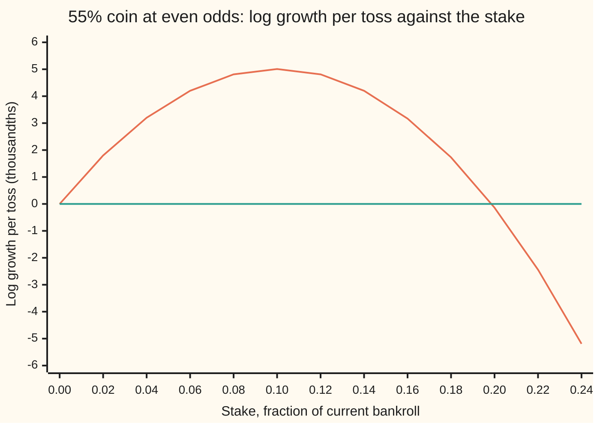

# Kelly: the bet size that grows wealth fastest, and why half of it is safer

Financial mathematics → Returns and Utility → Bet sizing → Kelly

---

## General Overview

A coin lands heads 55 times in 100 on average. A bet on heads pays even odds: a win returns the stake plus the same again as profit, and a loss takes the stake. The edge is real. Every dollar staked earns ten cents on average.

The open question is size. The **bankroll** is the pot the bets come from. Stake all of it and the average result of each toss is as large as it can be, but the first tails leaves nothing to bet with. Stake a cent and nothing goes wrong, but nothing grows either. Between the two sits one stake that makes the bankroll grow fastest over a long run of tosses. For this coin it is **10 percent of the current bankroll, recomputed before every toss**. Half of that, 5 percent, keeps about three quarters of the growth and cuts the chance of ever losing half the money from about one in two to about one in eight.

John Kelly, an engineer at Bell Labs, found the rule in 1956 while studying how fast a signal can be sent down a noisy line. The growth-maximising stake is called the **Kelly fraction**. Staking a set share of it, such as half, is called **fractional Kelly**.

**Wealth multiplies from bet to bet, so the long run is ruled by the average logarithm of each bet's multiplier; the Kelly fraction is the stake that makes that average largest, and at even odds it is the win chance minus the loss chance.**

**What kind of fact this is:** a theorem inside a model (bets repeat independently, the win chance is known, and the stake is a fixed share of current wealth), proved on this card in Why it works. The stronger claim, that no other strategy beats it in the long run, is Leo Breiman's 1961 theorem, stated here and not proved.

### The picture: growth per toss against the stake

Stake size runs left to right, as a fraction of the bankroll. Growth per toss runs up and down: the average rise in the natural log of wealth per toss, times 1,000. A rise of 0.01 in the log is one **log point**, close to a 1 percent gain, so the peak of 5.01 is about half a percent per toss.



The curve is the growth per toss; the flat line is zero growth. The curve is a hump. It peaks at a stake of 0.10, the Kelly fraction. It falls back through zero just short of 0.20, twice Kelly, and past that the bankroll shrinks while every single bet still has a positive average payoff. The hump is nearly symmetric: stakes of 0.05 and 0.15 grow at almost the same rate, but the larger carries far more risk.

---

## The formula

Notation first, in words. The letter $f$ stands for the share of the current bankroll staked on each bet, a number between 0 and 1. The natural log, written $\ln$, turns multiplying into adding ([returns-simple-log-and-annualised](01-returns-simple-log-and-annualised.md)). A star marks the best value: $f^\star$ is the best stake.

$$g(f) = p\,\ln(1 + b f) + q\,\ln(1 - f)$$

**Read it aloud:** growth per bet is the win chance times the log of the winning multiplier, plus the loss chance times the log of the losing multiplier.

$$f^\star = \frac{bp - q}{b} = p - \frac{q}{b}$$

**Read it aloud:** the Kelly fraction is the average profit per dollar staked, divided by the profit per dollar on a win.

The top line, $bp - q$, is the **edge**: the average profit on one dollar staked. For the coin it is 0.55 − 0.45 = 0.10, and with $b = 1$ the fraction equals the edge.

Fractional Kelly stakes $c$ times the Kelly fraction. Its growth, close to the peak, is

$$g(c\,f^\star) \approx c\,(2 - c)\; g(f^\star)$$

**Read it aloud:** staking a multiple c of Kelly keeps c times (2 minus c) of the best growth, so half keeps three quarters and double keeps none.

| Symbol | Plain meaning | In our example | Push it up and the answer… |
| --- | --- | --- | --- |
| $f$ | share of the current bankroll staked on each bet | 0.10 at Kelly | growth rises to the peak at 0.10, then falls, and turns negative just short of 0.20 |
| $p$ | chance of winning a bet | 0.55 | the Kelly fraction rises |
| $q$ | chance of losing a bet, 1 − p | 0.45 | the Kelly fraction falls |
| $b$ | net odds: profit per dollar staked, on a win | 1 (even odds) | the Kelly fraction rises towards p |
| $f^\star$ | the Kelly fraction, the stake with the most growth | 0.10 | — |
| $g(f)$ | expected log growth per bet, in natural-log units | 0.005008 at 0.10, half a log point | — |
| $W_0$, $W_n$ | bankroll at the start, and after n bets | $100, then about $100 times 149.66 on the typical path after 1,000 bets | — |
| $n$, $K$ | number of bets, and how many of them are won | 1,000 bets; 550 wins on the median path | wealth on the typical path grows like the exponential of n times g |
| $c$ | multiple of the Kelly fraction actually staked | 0.5 for half Kelly | growth c(2 − c) of the best, risk rises with c |
| $r$ | the saver's riskless deposit rate, per year | 4% | the edge μ − r shrinks, so the saver's Kelly fraction falls |
| $\mu$ | the fund's mean return per year, "mu" | 8% | the saver's Kelly fraction rises |
| $\sigma$ | the fund's spread (volatility) per year, "sigma" | 15% | the saver's Kelly fraction falls with its square |

For an investment rather than a coin, the same idea in continuous time gives a companion pair, derived at the end of Why it works:

$$f^\star = \frac{\mu - r}{\sigma^2}, \qquad g(f) = r + f(\mu - r) - \tfrac12 f^2\sigma^2$$

### When it holds

- **The win chance is known.** An estimate that is 5 points too high, 60 percent for a 55 percent coin, doubles the stake to 0.20. Growth then falls from 0.005008 to −0.000138 per bet: the bankroll shrinks.
- **Bets repeat, independently.** The whole argument is a long-run average. One bet placed once has no growth rate, and Kelly says nothing useful about it.
- **The stake is a share of current wealth, recomputed every bet.** A fixed dollar stake is a different strategy; after a run of losses it becomes a larger share of what is left, and it can go broke.
- **Losses stop at the stake, with no fees and no borrowing costs.** A fee lowers the true odds b, and the edge can vanish.
- **The run is long.** Over two bets, half Kelly can finish ahead: from $100, a win then a loss leaves $99.00 at full Kelly and $99.75 at half Kelly.

---

## Why it works

### Step 0: wealth multiplies, so the log is the score that adds up

Every bet multiplies the bankroll: by 1.1 on a win and 0.9 on a loss at a 10 percent stake. After many bets the bankroll is a product of such numbers. The logarithm turns the product into a sum, and the law of large numbers ([law-of-large-numbers](../../09-Probability%20and%20statistics/06-Limit%20Theorems%20in%20Practice/01-law-of-large-numbers.md)) says an average of many independent draws settles on its expected value. So the average log multiplier per bet decides where almost every long run ends. Maximise that, and the bankroll grows fastest.

### Step 1: one bet's multiplier

Stake the share $f$ of the bankroll. A win adds $b f$ of the bankroll; a loss removes $f$. So one bet multiplies wealth by

$$1 + b f \text{ with chance } p, \qquad 1 - f \text{ with chance } q.$$

### Step 2: many bets, and the growth rate appears

After $n$ bets with $K$ wins, where $K$ counts the wins,

$$W_n = W_0\,(1 + b f)^{K}\,(1 - f)^{\,n - K}.$$

Take logs and divide by $n$:

$$\frac{1}{n}\ln\frac{W_n}{W_0} = \frac{K}{n}\ln(1 + b f) + \frac{n - K}{n}\ln(1 - f).$$

The share of wins, K divided by n, settles on $p$ as $n$ grows. So the left side settles on $g(f) = p\ln(1+bf) + q\ln(1-f)$, and on almost every long run

$$W_n \approx W_0\, e^{\,n\,g(f)}.$$

The growth rate is not a matter of taste. It is where the typical bankroll goes.

### Step 3: find the peak

Set the slope of $g$ to zero. The slope of $\ln(1 + bf)$ is $b/(1+bf)$, and the slope of $\ln(1-f)$ is $-1/(1-f)$:

$$g'(f) = \frac{pb}{1 + bf} - \frac{q}{1 - f} = 0.$$

Cross-multiply: $pb(1 - f) = q(1 + bf)$, so $pb - q = bf(p + q) = bf$, because $p + q = 1$. Hence $f^\star = (bp - q)/b$. For the coin, $0.10/1 = 0.10$.

### Step 4: it is the only peak, and the edges behave

The slope of the slope is

$$g''(f) = -\frac{pb^2}{(1+bf)^2} - \frac{q}{(1-f)^2},$$

negative everywhere: the curve bends down all the way (it is **concave**). A curve that bends down all the way has at most one peak, and the point where its slope is zero is it. Three boundary cases close the argument. With no edge, $bp \le q$, the slope at zero is zero or negative, and the best stake is zero: do not bet. As $f$ approaches 1, the term $\ln(1 - f)$ runs to minus infinity, so staking everything is never best while a loss is possible. And $f^\star = p - q/b$ is below $p$, so below 1, whenever the chance of losing is above zero.

### Step 5: why the hump makes half Kelly cheap

Near zero, $\ln(1 + u)$ is close to $u - u^2/2$. Apply it to one bet's gain, $f$ times a return of $+b$ or $-1$:

$$g(f) \approx f\,(bp - q) - \tfrac12 f^2\,(b^2 p + q).$$

That is a downward parabola: the edge pays linearly, and the bounce costs with the square of the stake. The cost of bouncing is often called **volatility drag**. For the coin it reads $0.10f - \tfrac12 f^2$, which peaks at 0.10 with height about 0.005; the exact height is 0.005008. Put $f = c\,f^\star$ into the parabola and the growth is $c(2-c)$ times the peak. Half Kelly keeps 0.7500 of the peak by this rule; the exact figure for the coin is 0.7493. Twice Kelly keeps 0.0000 by the rule; exactly, −0.0275.

### Step 6: what half Kelly buys

The spread of the log change on one bet grows roughly in step with the stake. It is 0.0998 at full Kelly and 0.0498 at half: halved. A smaller spread means shallower falls. Treat log wealth as a steady drift plus random noise and a classical result gives the chance of ever falling to a share $x$ of the starting bankroll when staking $c$ times Kelly:

$$\text{chance of ever falling to } x = x^{\,2/c \,-\, 1}.$$

For a fall to half, $x = 0.5$. Full Kelly gives 0.500. Half Kelly gives 0.125. So **half Kelly trades a quarter of the growth for half the spread and a quarter of the chance of losing half the money.** The exact figures for the coin, summed path by path over 4,000 bets, are 0.476 and 0.116.

<details>
<summary>Detailed proof</summary>

**The peak.** Steps 3 and 4 are complete for $0 < p < 1$ and $b > 0$. If $p = 1$ there is no loss; $g(f) = \ln(1 + bf)$ rises all the way to $f = 1$, and the formula is not needed.

**The long run.** Each bet's log multiplier is $\ln(1+bf)$ on a win and $\ln(1-f)$ on a loss. For a fixed stake below 1 these are independent, identically distributed and bounded, so the strong law of large numbers gives $\frac1n\ln(W_n/W_0) \to g(f)$ with probability 1. Now run two fixed stakes on the same tosses and apply the same law to the difference of their log multipliers. If the first stake has the larger growth rate, the log of the ratio of the two bankrolls grows without bound, so the first ends up ahead by any factor at all, on almost every run. Breiman proved the stronger version: no strategy, even one that changes its stake as it goes, ends up ahead of the Kelly bettor by an unbounded factor, and the Kelly bettor reaches a distant target fastest on average.

**Expected wealth disagrees.** Each bet multiplies expected wealth by $p(1+bf) + q(1-f) = 1 + f(bp - q)$, which rises in $f$ all the way to $f = 1$. At $f = 1$ one loss ends the game, and the chance of $n$ straight wins, $p^n$, goes to zero. The expected value is carried by paths that almost never happen.

**The parabola rule.** With edge $e = bp - q$ and second moment $v = b^2 p + q$, the parabola $g \approx fe - \tfrac12 f^2 v$ peaks at $f = e/v$ with height $e^2/(2v)$. At $f = c\,e/v$ it equals $(e^2/v)(c - c^2/2) = c(2-c)\,e^2/(2v)$. Near-exact for small stakes; for the coin $e/v = 0.10$ matches the exact Kelly fraction because $v = 1$.

**The falling chance.** Say log wealth drifts up by m per bet, with variance s squared per bet (variance: the average squared distance from the mean). A Brownian motion with those two numbers ever falls a distance d below its start with chance $e^{-2md/s^2}$, the gambler's-ruin result for Brownian motion. With the parabola, staking $c$ times Kelly gives drift $m = c(1 - c/2)\,e^2/v$ and variance $s^2 = c^2 e^2/v$, so $2m/s^2 = 2/c - 1$. A fall to the share $x$ is a distance $d = \ln(1/x)$, and $e^{-(2/c - 1)\ln(1/x)} = x^{2/c-1}$. The coin's own drift and variance give 0.498 at full Kelly and 0.123 at half. The exact sums are lower, 0.476 and 0.116, because the coin's bankroll is only looked at after each toss, so it cannot dip below the line between tosses the way a continuous path can; the 4,000-toss horizon trims a little more.

</details>

### The other door: continuous time

Replace the coin by a fund whose price follows geometric Brownian motion, a steady drift plus random kicks in log space ([geometric-brownian-motion](../../11-Stochastic%20processes%20and%20calculus/05-Brownian%20Motion/07-geometric-brownian-motion.md)). Hold the share $f$ in the fund and the rest on deposit, rebalanced continuously. Wealth then drifts at $r + f(\mu - r)$ and wiggles with spread $f\sigma$. Itô's lemma on the log subtracts half the squared spread, and the growth rate is $g(f) = r + f(\mu - r) - \tfrac12 f^2\sigma^2$: the Step 5 parabola, now exact. Its peak is at $f^\star = (\mu - r)/\sigma^2$. The check finds the same peak by searching one day's growth, averaged over the bell curve.

---

## Worked numbers, by hand

The coin: $p = 0.55$, $q = 0.45$, $b = 1$.

| Step | Arithmetic | Value |
| --- | --- | --- |
| edge, $bp - q$ | 0.55 − 0.45 | 0.10 |
| Kelly fraction, $f^\star$ | 0.10 / 1 | **0.10** |
| log of a win, $\ln(1 + bf^\star)$ | ln 1.1 | 0.0953102 |
| log of a loss, $\ln(1 - f^\star)$ | ln 0.9 | −0.1053605 |
| win share, $p\ln(1 + bf^\star)$ | 0.55 × 0.0953102 | 0.0524206 |
| loss share, $q\ln(1 - f^\star)$ | 0.45 × −0.1053605 | −0.0474122 |
| growth per bet, $g(f^\star)$ | 0.0524206 − 0.0474122 | **0.0050084** |
| bets to double | ln 2 / 0.0050084 | 138.4 |
| half Kelly stake | 0.10 / 2 | 0.05 |
| growth at half Kelly | 0.55 ln 1.05 + 0.45 ln 0.95 | 0.003753 |
| share of the best kept | 0.003753 / 0.005008 | **0.7493** |

A 10 percent edge buys half a log point per toss, about 0.5 percent. It takes about 138 tosses to double the bankroll, and no stake does it faster. Half Kelly takes the same coin to the same place at 0.7493 of the speed, with half the swing on every toss.

### What breaks if you drop a piece

| Mistake | Comes out at | What went wrong |
| --- | --- | --- |
| Stake everything, since that maximises the average result | expected wealth ×6.73 after 20 bets; chance of surviving those 20 bets 0.0000064 | The average is carried by the one path with 20 straight wins. Every other path is at zero. |
| Believe the coin is 60%, stake its Kelly fraction 0.20 | growth −0.000138 per bet; chance of halving within 4,000 bets 0.953 | Twice the true Kelly fraction sits at the far root of the hump |
| Read the average return, 0.01 per bet, as the growth rate | predicts ×20,959 after 1,000 bets; the typical path reaches ×149.66 | The average of multipliers is not the average of logs. The gap is volatility drag, compounded. |
| Stake 1.5 times Kelly for extra growth | 0.7459 of the best growth, no more than half Kelly's 0.7493; chance of halving 0.774 | Past the peak, more stake means less growth and more risk |

---

## Code, from first principles, and it actually runs

The Kelly fraction is found three independent ways: the formula; a golden-section search, which climbs the hump by comparing heights and uses no calculus; and the stake that makes the median path of 1,000 tosses richest. The growth rate is found three ways: the library log, a hand-written log series, and a simulation of 2,000 runs of 1,000 tosses on a home-made random number generator. The chance of ever halving comes from summing surviving paths toss by toss and from the Brownian formula. The saver's growth comes from the continuous formula and from averaging one day's log change over the bell curve by Simpson's rule; a golden-section search on that daily average finds the saver's Kelly fraction a second way. Every "what breaks" number is reproduced.

### Python

```python
# Kelly criterion -- the check behind the card.  Standard library only.
# Nothing imported knows the answer: the search, the log series, the random
# numbers, the ruin sums and the integral are all written out below.
from math import log, exp, sqrt, pi

p, q, b = 0.55, 0.45, 1.0                      # a 55% coin paying even odds

def g(f):                                      # expected log growth per bet
    return p * log(1 + b * f) + q * log(1 - f)

def ln_series(x):                              # ln x = 2(z + z^3/3 + ...), z = (x-1)/(x+1)
    z = (x - 1) / (x + 1)
    return 2 * sum(z ** (2 * k + 1) / (2 * k + 1) for k in range(40))

def golden_max(fn, lo, hi):                    # road 2: search the hill, no calculus
    r = (sqrt(5) - 1) / 2
    for _ in range(200):
        a, c = hi - r * (hi - lo), lo + r * (hi - lo)
        if fn(a) < fn(c): lo = a
        else: hi = c
    return (lo + hi) / 2

def median_wins(n):                            # exact binomial median, summed in logs
    lp, best = [0.0], 0.0
    for k in range(n):
        lp.append(lp[-1] + log((n - k) / (k + 1)) + log(p / q))
    top = max(lp); w = [exp(v - top) for v in lp]; tot = sum(w); run = 0.0
    for k in range(n + 1):
        run += w[k] / tot
        if run >= 0.5: return k

def splitmix(state):                           # road 3's random numbers, same in Rust
    state = (state + 0x9E3779B97F4A7C15) & 0xFFFFFFFFFFFFFFFF
    z = state
    z = ((z ^ (z >> 30)) * 0xBF58476D1CE4E5B9) & 0xFFFFFFFFFFFFFFFF
    z = ((z ^ (z >> 27)) * 0x94D049BB133111EB) & 0xFFFFFFFFFFFFFFFF
    return state, ((z ^ (z >> 31)) >> 11) / 9007199254740992.0

def chance_ever_below(f, x=0.5, horizon=4000):  # exact: sum the surviving paths bet by bet
    up, dn, bar, alive, hit = log(1 + b * f), log(1 - f), log(x), [1.0], 0.0
    for n in range(1, horizon + 1):
        new = [0.0] * (n + 1)
        for k, m in enumerate(alive):
            new[k + 1] += p * m; new[k] += q * m
        for k in range(n + 1):
            if new[k] > 0 and k * up + (n - k) * dn <= bar: hit += new[k]; new[k] = 0.0
        alive = new
    return hit

def brownian_ever_below(f, x=0.5):            # approximation: log wealth as drift plus noise
    s2 = p * q * log((1 + b * f) / (1 - f)) ** 2
    return min(1.0, exp(-2 * g(f) * log(1 / x) / s2))

# ---- the coin ----
f_star = p - q / b
f_gold = golden_max(g, 0.0, 0.99)
n = 1000; k_med = median_wins(n)
grid = [i / 1000 for i in range(300)]
f_med = max(grid, key=lambda f: k_med * log(1 + b * f) + (n - k_med) * log(1 - f))
g_log, g_ser = g(f_star), p * ln_series(1 + b * f_star) + q * ln_series(1 - f_star)
state, paths, wins = 20260928, 2000, []
for _ in range(paths):
    k = 0
    for _ in range(n):
        state, u = splitmix(state)
        k += u < p
    wins.append(k)
g_sim = sum(k * log(1.1) + (n - k) * log(0.9) for k in wins) / (paths * n)
se = sqrt(p * q) * log(1.1 / 0.9) / sqrt(paths * n)
rows = [("f* road 1, formula p - q/b", f_star), ("f* road 2, golden-section search", f_gold),
        ("f* road 3, best median, 1000 bets", f_med), ("median wins in 1000 bets", k_med),
        ("ln(1 + b f*), a win", log(1 + b * f_star)), ("ln(1 - f*), a loss", log(1 - f_star)),
        ("p ln(1 + b f*)", p * log(1 + b * f_star)), ("q ln(1 - f*)", q * log(1 - f_star)),
        ("g(f*) per bet, library log", g_log), ("g(f*) per bet, own log series", g_ser),
        ("g(f*) simulated, 2000 x 1000 bets", g_sim), ("  its standard error", se),
        ("bets to double at f*, ln 2 / g", log(2) / g_log),
        ("simple mean return per bet at f*", f_star * (b * p - q)),
        ("mean wealth x after 1000 bets", exp(n * log(1 + f_star * (b * p - q)))),
        ("median wealth x after 1000 bets", exp(k_med * log(1 + b * f_star) + (n - k_med) * log(1 - f_star))),
        ("$100, win then loss, full Kelly", 100 * (1 + b * f_star) * (1 - f_star)),
        ("$100, win then loss, half Kelly", 100 * (1 + b * f_star / 2) * (1 - f_star / 2))]
for name, v in rows: print(f"{name:<36} {v:>16.12f}")

# ---- fractional Kelly: c times the Kelly stake ----
print()
print(f"{'c':>5} {'stake':>6} {'g x1000':>9} {'of best':>8} {'c(2-c)':>7} {'spread':>7} {'halve,exact':>11} {'approx':>7} {'0.5^(2/c-1)':>11}")
frac = {}
for c in (0.25, 0.5, 1.0, 1.5, 2.0):
    f = c * f_star
    frac[c] = (g(f), chance_ever_below(f), brownian_ever_below(f))
    spread = sqrt(p * q) * log((1 + b * f) / (1 - f))
    print(f"{c:>5.2f} {f:>6.3f} {1000 * g(f):>9.4f} {g(f) / g_log:>8.4f} {c * (2 - c):>7.4f} {spread:>7.4f} {frac[c][1]:>11.3f} {frac[c][2]:>7.3f} {min(1.0, 0.5 ** (2 / c - 1)):>11.3f}")

# ---- what breaks ----
print()
print(f"{'wrong: bet it all, survive 20 bets':<36} {p ** 20:>16.12f}")
print(f"{'wrong: believe 60%, stake 0.20, g':<36} {g(0.20):>16.12f}")
print(f"{'wrong: mean wealth, 20 bets all in':<36} {(1 + (b * p - q)) ** 20:>16.12f}")
print("chart f      " + " ".join(f"{i * 0.02:5.2f}" for i in range(13)))
print("chart g x1000" + " ".join(f"{1000 * g(i * 0.02):5.2f}" for i in range(13)))

# ---- the saver: deposit 4%, fund mean 8%, spread 15%, rebalanced daily ----
r, mu, sig = 0.04, 0.08, 0.15
F = (mu - r) / sig ** 2
G = lambda f: r + f * (mu - r) - 0.5 * f * f * sig * sig
def G_quad(f, dt=1 / 252, m=4000):               # road 2: average ln(new/old) over one day
    h, tot = 20.0 / m, 0.0
    for i in range(m + 1):
        z = -10.0 + i * h
        R = exp((mu - 0.5 * sig * sig) * dt + sig * sqrt(dt) * z) - 1
        wgt = (1 if i in (0, m) else 4 if i % 2 else 2) * exp(-z * z / 2) / sqrt(2 * pi)
        tot += wgt * log(1 + f * R + (1 - f) * r * dt)
    return tot * h / 3 / dt
F_gold = golden_max(G_quad, 0.0, 4.0)
print()
for name, v in (("saver f* = (mu - r)/sigma^2", F), ("saver f*, search on daily quadrature", F_gold), ("saver g at f*, formula", G(F)),
                ("saver g at f*, daily quadrature", G_quad(F)), ("saver half Kelly stake", F / 2), ("saver g at half Kelly", G(F / 2)),
                ("saver g all in the fund", G(1.0)), ("saver twice Kelly stake", 2 * F),
                ("saver g at twice Kelly", G(2 * F))):
    print(f"{name:<36} {v:>16.12f}")

assert abs(f_gold - f_star) < 1e-6,                  "search lands on p - q/b"
assert abs(f_med - f_star) < 5e-4,                   "median path peaks at p - q/b"
assert abs(g_ser - g_log) < 1e-13,                   "log series agrees with library log"
assert abs(g_sim - g_log) < 4 * se,                  "simulation agrees with g(f*)"
assert abs(frac[0.5][0] / g_log - 0.75) < 0.01,      "half Kelly keeps about 3/4 of the growth"
assert abs(frac[1.0][1] - frac[1.0][2]) < 0.03,      "exact halving chance near the Brownian one"
assert abs(G_quad(F) - G(F)) < 1e-5,                 "daily rebalancing near the continuous formula"
assert abs(F_gold - F) < 1e-3,                       "daily search lands on (mu - r)/sigma^2"
print("ALL CHECKS PASS")
```

**Ran 2026-09-28 on macOS, Python 3.14.6, standard library only. All checks passed. Output, pasted from the run:**

```
f* road 1, formula p - q/b             0.100000000000
f* road 2, golden-section search       0.100000001135
f* road 3, best median, 1000 bets      0.100000000000
median wins in 1000 bets             550.000000000000
ln(1 + b f*), a win                    0.095310179804
ln(1 - f*), a loss                    -0.105360515658
p ln(1 + b f*)                         0.052420598892
q ln(1 - f*)                          -0.047412232046
g(f*) per bet, library log             0.005008366846
g(f*) per bet, own log series          0.005008366846
g(f*) simulated, 2000 x 1000 bets      0.005091344179
  its standard error                   0.000070592174
bets to double at f*, ln 2 / g       138.397845410256
simple mean return per bet at f*       0.010000000000
mean wealth x after 1000 bets        20959.155637813848
median wealth x after 1000 bets      149.660118486560
$100, win then loss, full Kelly       99.000000000000
$100, win then loss, half Kelly       99.750000000000

    c  stake   g x1000  of best  c(2-c)  spread halve,exact  approx 0.5^(2/c-1)
 0.25  0.025    2.1879   0.4369  0.4375  0.0249       0.007   0.007       0.008
 0.50  0.050    3.7526   0.7493  0.7500  0.0498       0.116   0.123       0.125
 1.00  0.100    5.0084   1.0000  1.0000  0.0998       0.476   0.498       0.500
 1.50  0.150    3.7356   0.7459  0.7500  0.1504       0.774   0.795       0.794
 2.00  0.200   -0.1377  -0.0275  0.0000  0.2017       0.953   1.000       1.000

wrong: bet it all, survive 20 bets     0.000006415844
wrong: believe 60%, stake 0.20, g     -0.000137741855
wrong: mean wealth, 20 bets all in     6.727499949326
chart f       0.00  0.02  0.04  0.06  0.08  0.10  0.12  0.14  0.16  0.18  0.20  0.22  0.24
chart g x1000 0.00  1.80  3.20  4.20  4.81  5.01  4.81  4.20  3.17  1.73 -0.14 -2.44 -5.19

saver f* = (mu - r)/sigma^2            1.777777777778
saver f*, search on daily quadrature   1.777760631299
saver g at f*, formula                 0.075555555556
saver g at f*, daily quadrature        0.075557063866
saver half Kelly stake                 0.888888888889
saver g at half Kelly                  0.066666666667
saver g all in the fund                0.068750000000
saver twice Kelly stake                3.555555555556
saver g at twice Kelly                 0.040000000000
ALL CHECKS PASS
```

Three roads, one stake: the formula, the search (off by about one part in a hundred million, the flatness of the hump's top) and the median path all give 0.10. The hand-made log series matches the library to twelve decimals. The simulation lands within two standard errors of the formula. The exact halving chances sit just under the Brownian ones, as the proof callout explains. Daily rebalancing agrees with the continuous formula to five decimals, and its best stake, 1.77776, sits within 0.00002 of 1.77778; the small gaps come from the one-day step.

### Rust

The same checks, the same inputs and the same random numbers, in Rust, std only.

```rust
// Kelly criterion -- the same check as kelly_criterion_and_growth_check.py, in Rust.
// Standard library only, no crates.  The search, the log series, the random
// numbers, the ruin sums and the integral are all written out below.
use std::f64::consts::PI;

const P: f64 = 0.55;
const Q: f64 = 0.45;
const B: f64 = 1.0;

fn g(f: f64) -> f64 { P * (1.0 + B * f).ln() + Q * (1.0 - f).ln() }   // expected log growth per bet

fn ln_series(x: f64) -> f64 {                     // ln x = 2(z + z^3/3 + ...), z = (x-1)/(x+1)
    let z = (x - 1.0) / (x + 1.0);
    2.0 * (0..40).map(|k| z.powi(2 * k + 1) / (2 * k + 1) as f64).sum::<f64>()
}

fn golden_max<F: Fn(f64) -> f64>(func: F, mut lo: f64, mut hi: f64) -> f64 {   // road 2: no calculus
    let r = (5.0_f64.sqrt() - 1.0) / 2.0;
    for _ in 0..200 {
        let (a, c) = (hi - r * (hi - lo), lo + r * (hi - lo));
        if func(a) < func(c) { lo = a } else { hi = c }
    }
    (lo + hi) / 2.0
}

fn median_wins(n: usize) -> usize {               // exact binomial median, summed in logs
    let mut lp = vec![0.0_f64];
    for k in 0..n {
        let last = lp[k];
        lp.push(last + ((n - k) as f64 / (k + 1) as f64).ln() + (P / Q).ln());
    }
    let top = lp.iter().cloned().fold(f64::MIN, f64::max);
    let w: Vec<f64> = lp.iter().map(|v| (v - top).exp()).collect();
    let tot: f64 = w.iter().sum();
    let mut run = 0.0;
    for k in 0..=n {
        run += w[k] / tot;
        if run >= 0.5 { return k; }
    }
    n
}

fn splitmix(state: &mut u64) -> f64 {             // road 3's random numbers, same as Python
    *state = state.wrapping_add(0x9E3779B97F4A7C15);
    let mut z = *state;
    z = (z ^ (z >> 30)).wrapping_mul(0xBF58476D1CE4E5B9);
    z = (z ^ (z >> 27)).wrapping_mul(0x94D049BB133111EB);
    ((z ^ (z >> 31)) >> 11) as f64 / 9007199254740992.0
}

fn chance_ever_below(f: f64, x: f64, horizon: usize) -> f64 {   // exact: sum surviving paths
    let (up, dn, bar) = ((1.0 + B * f).ln(), (1.0 - f).ln(), x.ln());
    let (mut alive, mut hit) = (vec![1.0_f64], 0.0_f64);
    for n in 1..=horizon {
        let mut new = vec![0.0_f64; n + 1];
        for (k, m) in alive.iter().enumerate() { new[k + 1] += P * m; new[k] += Q * m; }
        for k in 0..=n {
            if new[k] > 0.0 && k as f64 * up + (n - k) as f64 * dn <= bar { hit += new[k]; new[k] = 0.0; }
        }
        alive = new;
    }
    hit
}

fn brownian_ever_below(f: f64, x: f64) -> f64 {  // approximation: log wealth as drift plus noise
    let s2 = P * Q * ((1.0 + B * f) / (1.0 - f)).ln().powi(2);
    (-2.0 * g(f) * (1.0 / x).ln() / s2).exp().min(1.0)
}

fn main() {
    let f_star = P - Q / B;
    let f_gold = golden_max(g, 0.0, 0.99);
    let n = 1000_usize;
    let k_med = median_wins(n);
    let kf = k_med as f64;
    let score = |f: f64| kf * (1.0 + B * f).ln() + (n as f64 - kf) * (1.0 - f).ln();
    let mut f_med = 0.0;
    for i in 0..300 { let f = i as f64 / 1000.0; if score(f) > score(f_med) { f_med = f; } }
    let (g_log, g_ser) = (g(f_star), P * ln_series(1.0 + B * f_star) + Q * ln_series(1.0 - f_star));
    let (mut state, paths) = (20260928_u64, 2000_usize);
    let mut wins = Vec::new();
    for _ in 0..paths {
        let mut k = 0_u32;
        for _ in 0..n { if splitmix(&mut state) < P { k += 1; } }
        wins.push(k as f64);
    }
    let g_sim = wins.iter().map(|k| k * 1.1_f64.ln() + (n as f64 - k) * 0.9_f64.ln()).sum::<f64>() / (paths * n) as f64;
    let se = (P * Q).sqrt() * (1.1_f64 / 0.9).ln() / ((paths * n) as f64).sqrt();
    let rows: Vec<(&str, f64)> = vec![
        ("f* road 1, formula p - q/b", f_star), ("f* road 2, golden-section search", f_gold),
        ("f* road 3, best median, 1000 bets", f_med), ("median wins in 1000 bets", kf),
        ("ln(1 + b f*), a win", (1.0 + B * f_star).ln()), ("ln(1 - f*), a loss", (1.0 - f_star).ln()),
        ("p ln(1 + b f*)", P * (1.0 + B * f_star).ln()), ("q ln(1 - f*)", Q * (1.0 - f_star).ln()),
        ("g(f*) per bet, library log", g_log), ("g(f*) per bet, own log series", g_ser),
        ("g(f*) simulated, 2000 x 1000 bets", g_sim), ("  its standard error", se),
        ("bets to double at f*, ln 2 / g", 2.0_f64.ln() / g_log),
        ("simple mean return per bet at f*", f_star * (B * P - Q)),
        ("mean wealth x after 1000 bets", (n as f64 * (1.0 + f_star * (B * P - Q)).ln()).exp()),
        ("median wealth x after 1000 bets", (kf * (1.0 + B * f_star).ln() + (n as f64 - kf) * (1.0 - f_star).ln()).exp()),
        ("$100, win then loss, full Kelly", 100.0 * (1.0 + B * f_star) * (1.0 - f_star)),
        ("$100, win then loss, half Kelly", 100.0 * (1.0 + B * f_star / 2.0) * (1.0 - f_star / 2.0)),
    ];
    for (name, v) in &rows { println!("{:<36} {:>16.12}", name, v); }

    // ---- fractional Kelly: c times the Kelly stake ----
    println!();
    println!("{:>5} {:>6} {:>9} {:>8} {:>7} {:>7} {:>11} {:>7} {:>11}", "c", "stake", "g x1000", "of best", "c(2-c)", "spread", "halve,exact", "approx", "0.5^(2/c-1)");
    let mut frac = Vec::new();
    for c in [0.25_f64, 0.5, 1.0, 1.5, 2.0] {
        let f = c * f_star;
        let (gf, ex, ap) = (g(f), chance_ever_below(f, 0.5, 4000), brownian_ever_below(f, 0.5));
        frac.push((c, gf, ex, ap));
        let spread = (P * Q).sqrt() * ((1.0 + B * f) / (1.0 - f)).ln();
        println!("{:>5.2} {:>6.3} {:>9.4} {:>8.4} {:>7.4} {:>7.4} {:>11.3} {:>7.3} {:>11.3}",
                 c, f, 1000.0 * gf, gf / g_log, c * (2.0 - c), spread, ex, ap, 0.5_f64.powf(2.0 / c - 1.0).min(1.0));
    }

    // ---- what breaks ----
    println!();
    println!("{:<36} {:>16.12}", "wrong: bet it all, survive 20 bets", P.powi(20));
    println!("{:<36} {:>16.12}", "wrong: believe 60%, stake 0.20, g", g(0.20));
    println!("{:<36} {:>16.12}", "wrong: mean wealth, 20 bets all in", (1.0 + (B * P - Q)).powi(20));
    let xs: Vec<String> = (0..13).map(|i| format!("{:5.2}", i as f64 * 0.02)).collect();
    println!("chart f      {}", xs.join(" "));
    let ys: Vec<String> = (0..13).map(|i| format!("{:5.2}", 1000.0 * g(i as f64 * 0.02))).collect();
    println!("chart g x1000{}", ys.join(" "));

    // ---- the saver: deposit 4%, fund mean 8%, spread 15%, rebalanced daily ----
    let (r, mu, sig) = (0.04_f64, 0.08_f64, 0.15_f64);
    let big_f = (mu - r) / (sig * sig);
    let gc = |f: f64| r + f * (mu - r) - 0.5 * f * f * sig * sig;
    let g_quad = |f: f64| {                       // road 2: average ln(new/old) over one day
        let (dt, m) = (1.0 / 252.0, 4000_usize);
        let (h, mut tot) = (20.0 / m as f64, 0.0);
        for i in 0..=m {
            let z = -10.0 + i as f64 * h;
            let rr = ((mu - 0.5 * sig * sig) * dt + sig * dt.sqrt() * z).exp() - 1.0;
            let wt = if i == 0 || i == m { 1.0 } else if i % 2 == 1 { 4.0 } else { 2.0 };
            tot += wt * (-z * z / 2.0).exp() / (2.0 * PI).sqrt() * (1.0 + f * rr + (1.0 - f) * r * dt).ln();
        }
        tot * h / 3.0 / dt
    };
    let big_f_gold = golden_max(&g_quad, 0.0, 4.0);
    println!();
    for (name, v) in [("saver f* = (mu - r)/sigma^2", big_f), ("saver f*, search on daily quadrature", big_f_gold), ("saver g at f*, formula", gc(big_f)),
                      ("saver g at f*, daily quadrature", g_quad(big_f)), ("saver half Kelly stake", big_f / 2.0), ("saver g at half Kelly", gc(big_f / 2.0)),
                      ("saver g all in the fund", gc(1.0)), ("saver twice Kelly stake", 2.0 * big_f),
                      ("saver g at twice Kelly", gc(2.0 * big_f))] {
        println!("{:<36} {:>16.12}", name, v);
    }

    assert!((f_gold - f_star).abs() < 1e-6, "search lands on p - q/b");
    assert!((f_med - f_star).abs() < 5e-4, "median path peaks at p - q/b");
    assert!((g_ser - g_log).abs() < 1e-13, "log series agrees with ln");
    assert!((g_sim - g_log).abs() < 4.0 * se, "simulation agrees with g(f*)");
    assert!((frac[1].1 / g_log - 0.75).abs() < 0.01, "half Kelly keeps about 3/4 of the growth");
    assert!((frac[2].2 - frac[2].3).abs() < 0.03, "exact halving chance near the Brownian one");
    assert!((g_quad(big_f) - gc(big_f)).abs() < 1e-5, "daily rebalancing near the continuous formula");
    assert!((big_f_gold - big_f).abs() < 1e-3, "daily search lands on (mu - r)/sigma^2");
    println!("ALL CHECKS PASS");
}
```

**Ran 2026-09-28 on macOS, rustc 1.98.1, no crates. All checks passed. Output, pasted from the run:**

```
f* road 1, formula p - q/b             0.100000000000
f* road 2, golden-section search       0.100000001135
f* road 3, best median, 1000 bets      0.100000000000
median wins in 1000 bets             550.000000000000
ln(1 + b f*), a win                    0.095310179804
ln(1 - f*), a loss                    -0.105360515658
p ln(1 + b f*)                         0.052420598892
q ln(1 - f*)                          -0.047412232046
g(f*) per bet, library log             0.005008366846
g(f*) per bet, own log series          0.005008366846
g(f*) simulated, 2000 x 1000 bets      0.005091344179
  its standard error                   0.000070592174
bets to double at f*, ln 2 / g       138.397845410256
simple mean return per bet at f*       0.010000000000
mean wealth x after 1000 bets        20959.155637813848
median wealth x after 1000 bets      149.660118486560
$100, win then loss, full Kelly       99.000000000000
$100, win then loss, half Kelly       99.750000000000

    c  stake   g x1000  of best  c(2-c)  spread halve,exact  approx 0.5^(2/c-1)
 0.25  0.025    2.1879   0.4369  0.4375  0.0249       0.007   0.007       0.008
 0.50  0.050    3.7526   0.7493  0.7500  0.0498       0.116   0.123       0.125
 1.00  0.100    5.0084   1.0000  1.0000  0.0998       0.476   0.498       0.500
 1.50  0.150    3.7356   0.7459  0.7500  0.1504       0.774   0.795       0.794
 2.00  0.200   -0.1377  -0.0275  0.0000  0.2017       0.953   1.000       1.000

wrong: bet it all, survive 20 bets     0.000006415844
wrong: believe 60%, stake 0.20, g     -0.000137741855
wrong: mean wealth, 20 bets all in     6.727499949326
chart f       0.00  0.02  0.04  0.06  0.08  0.10  0.12  0.14  0.16  0.18  0.20  0.22  0.24
chart g x1000 0.00  1.80  3.20  4.20  4.81  5.01  4.81  4.20  3.17  1.73 -0.14 -2.44 -5.19

saver f* = (mu - r)/sigma^2            1.777777777778
saver f*, search on daily quadrature   1.777760631299
saver g at f*, formula                 0.075555555556
saver g at f*, daily quadrature        0.075557063866
saver half Kelly stake                 0.888888888889
saver g at half Kelly                  0.066666666667
saver g all in the fund                0.068750000000
saver twice Kelly stake                3.555555555556
saver g at twice Kelly                 0.040000000000
ALL CHECKS PASS
```

The two outputs agree line for line; the same splitmix generator feeds both simulations.

> [!TIP]
> **Try changing**
> Guess the direction first. Then run it.
> - **Overbet by half.** Read the row `c = 1.50`. Growth is 0.7459 of the best, almost exactly half Kelly's 0.7493, but the chance of ever halving is 0.774 against 0.116. Same speed, far more danger.
> - **Double the stake.** Row `c = 2.00`: growth −0.0275 of the best, and 0.953 of runs have halved within 4,000 tosses. Given more tosses that figure keeps climbing towards 1.
> - **Change the seed.** Set `state` to any other number. The simulated growth moves, by about one standard error, 0.00007, around 0.005008.
> - **Put the saver all in the fund.** A stake of 1 sits between half Kelly (0.89) and full Kelly (1.78), closer to the peak, so it grows at 6.875 percent a year against half Kelly's 6.667 percent.

---

## The usual mistake

> [!warning]
> **Taking a good bet as a reason to bet big.** A positive edge makes every single bet worth taking, but it does not make a big stake good. Expected wealth rises with the stake all the way to betting everything; typical wealth peaks at the Kelly fraction and falls to nothing just short of double it. Past twice Kelly the bankroll shrinks on almost every path while the spreadsheet average climbs.
>
> - **Plugging in an estimated win chance as if it were known.** Kelly is steep on the far side: overestimating a 55 percent coin as 60 percent doubles the stake and turns growth of 0.005008 into −0.000138 per bet. Staking half the estimated Kelly lands exactly on the true Kelly fraction in that case, which is the plainest argument for half.
> - **Using the edge as the fraction at any odds.** The fraction is the edge divided by the net odds, $(bp - q)/b$. The two agree only at even odds.
> - **Sizing against the wrong bankroll.** The fraction is of the whole wealth being compounded, not of one account. Size against a tenth of the real bankroll and the stake is a tenth of Kelly; the other way round, ten times Kelly.
> - **Fixed dollar stakes.** Kelly assumes the stake shrinks after losses. A fixed stake does not, and a run of losses can take it to zero.

---

## Where you meet it in real life

- **Card counting.** Edward Thorp used Kelly to size blackjack bets in the early 1960s, betting more when the count gave an edge and nothing when it did not.
- **Betting and prediction markets.** Bettors who size by Kelly often stake a half or a quarter of it, because their win chances are estimates.
- **Leverage in a portfolio.** The saver choosing between a 4 percent deposit and a fund with mean 8 percent and spread 15 percent has $f^\star = 0.04/0.0225 = 1.78$: Kelly says borrow 78 cents at the deposit rate for every dollar owned and put it all in the fund, for growth of 7.56 percent a year. Half Kelly, 0.89 in the fund, grows at 6.67 percent: three quarters of the growth above the deposit rate. Twice Kelly, 3.56 times leveraged, grows at exactly the 4 percent deposit rate: the most risk, for the riskless return.
- **Log utility.** Maximising expected log wealth is the same as having log utility ([expected-utility-and-risk-aversion](02-expected-utility-and-risk-aversion.md)). Kelly gives a reason for that score that needs no taste: it is what the typical long run rewards. Fractional Kelly behaves like a more risk-averse utility.
- **Information theory.** In Kelly's paper the gambler has a noisy private tip; the best growth rate equals the rate at which the tip carries information.

> **Say it back**
> A bankroll grows by multiplying, so the long run is decided by the average log of each bet's multiplier, and the law of large numbers makes that average the growth rate. The stake that maximises it is the Kelly fraction, the edge divided by the odds: 10 percent for a 55 percent coin at even odds. Growth is a hump in the stake, peaking at Kelly and back to zero near twice Kelly. Half Kelly keeps three quarters of the growth, halves the swing, and cuts the chance of losing half the money from about a half to about an eighth. Because real win chances are estimates, half is the safer stake.

---

## What this builds on

- [returns-simple-log-and-annualised](01-returns-simple-log-and-annualised.md): log returns, which add where growth factors multiply. Step 0 rests on them.
- [law-of-large-numbers](../../09-Probability%20and%20statistics/06-Limit%20Theorems%20in%20Practice/01-law-of-large-numbers.md): why the share of wins settles on 0.55, which turns the average log into a growth rate.

## Where this goes next

- [stochastic-dominance](04-stochastic-dominance.md): when one bet beats another on every ranking, and why Kelly does not beat half Kelly path by path (the $99.00 against $99.75).

Kelly says what a bettor who scores by log wealth should do; what real people do when losses feel worse than equal gains feel good is the subject of [prospect-theory-in-outline](06-prospect-theory-in-outline.md).

---

## Sources

Verified 2026-09-28: every link below resolves to the publisher's page.

- Kelly, J. L., Jr. "A New Interpretation of Information Rate." *Bell System Technical Journal* 35, no. 4 (1956): 917–926. [doi:10.1002/j.1538-7305.1956.tb03809.x](https://doi.org/10.1002/j.1538-7305.1956.tb03809.x). The original: log growth of a repeated bet, and the fraction that maximises it.
- Thorp, Edward O. "Optimal Gambling Systems for Favorable Games." *Review of the International Statistical Institute* 37, no. 3 (1969): 273–293. [doi:10.2307/1402118](https://doi.org/10.2307/1402118). Kelly for general bets, with Breiman's long-run optimality results set out.
- Rotando, Louis M., and Edward O. Thorp. "The Kelly Criterion and the Stock Market." *American Mathematical Monthly* 99, no. 10 (1992): 922–931. [doi:10.1080/00029890.1992.11995955](https://doi.org/10.1080/00029890.1992.11995955). The continuous case, the saver's formula, on index data.
- MacLean, Leonard C., Edward O. Thorp, and William T. Ziemba. "Long-Term Capital Growth: The Good and Bad Properties of the Kelly and Fractional Kelly Capital Growth Criteria." *Quantitative Finance* 10, no. 7 (2010): 681–687. [doi:10.1080/14697688.2010.506108](https://doi.org/10.1080/14697688.2010.506108). Fractional Kelly: what it gives up and what it buys.
- Samuelson, Paul A. "Why We Should Not Make Mean Log of Wealth Big Though Years to Act Are Long." *Journal of Banking and Finance* 3, no. 4 (1979): 305–307. [doi:10.1016/0378-4266(79)90023-2](https://doi.org/10.1016/0378-4266(79)90023-2). The classic objection: long-run growth is not the same as the best choice for every taste.
