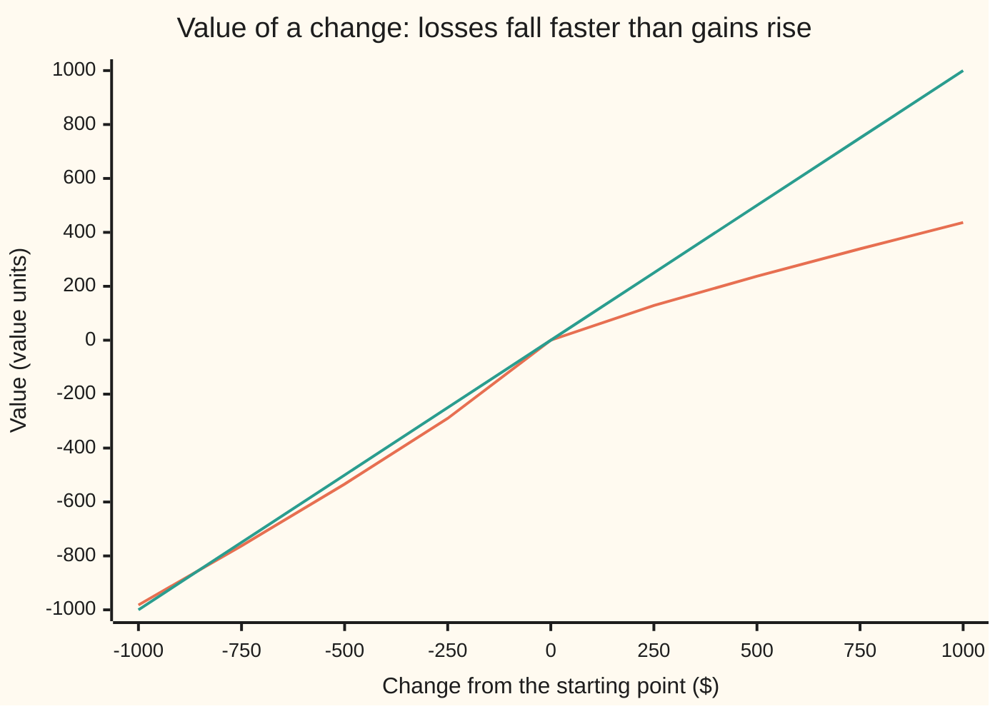
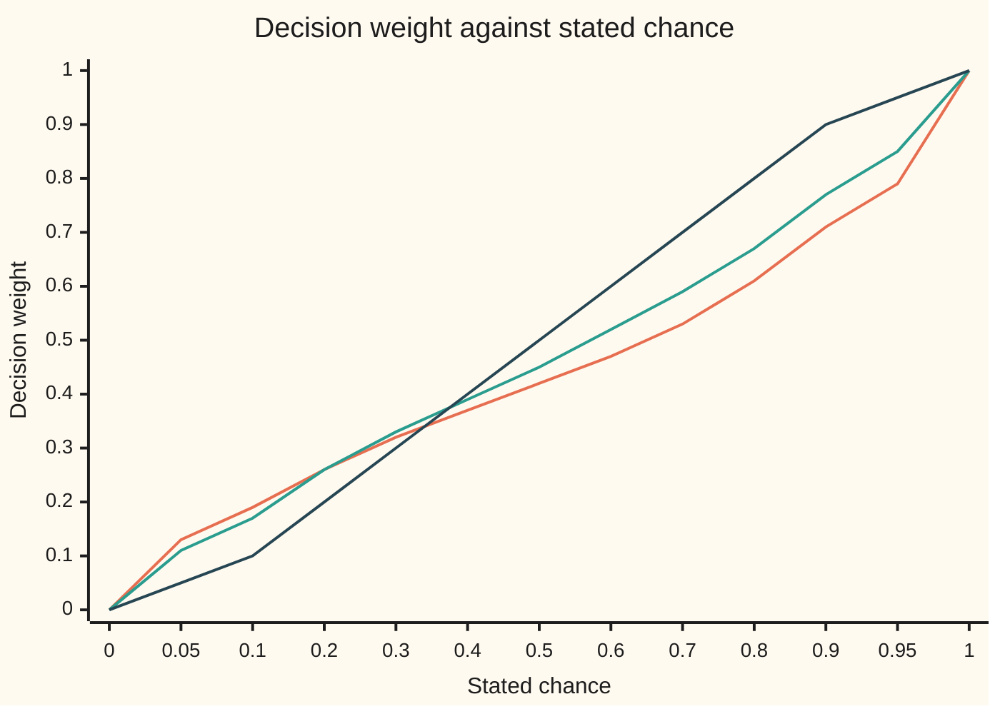

# Prospect theory in outline: how people actually weigh gains, losses and small chances

Financial mathematics → Returns and Utility → Reference-dependent choice → Prospect theory in outline

---

## General Overview

A coin is tossed. Tails, the player pays $100. Heads, the player wins some amount. How big must the win be before a person takes the bet? A fair-minded accountant says anything over $100. Most people ask for far more. In their 1992 experiments, Amos Tversky and Daniel Kahneman found that losses weighed about 2.25 times as heavily as equal gains. Losses hurt roughly twice as much as gains please.

That is one of three habits that expected utility, the model on the earlier cards of this shelf, leaves out. People judge **changes** against a starting point, not totals of wealth. They feel a loss more than an equal gain. And they treat chances unevenly: a sure thing counts for more than its odds suggest, and a long shot counts for more too.

In 1979 Kahneman and Tversky turned those habits into a model and called it **prospect theory**. A **prospect** is their word for a gamble: a list of outcomes with their chances. The model gives each prospect a score, and the person picks the higher score. It reproduces choices that expected utility cannot, including two famous reversals on this card: the **certainty effect** and the **reflection effect**.

**Prospect theory scores a gamble by passing each gain or loss through a value curve that is steeper for losses, and each chance through a weighting curve that inflates small chances and shrinks large ones.**

**What kind of fact this is:** a model: a description of how people choose, fitted to experiments, not a law and not a rule for how anyone should choose.

### The picture: the value curve

Dollar change runs left to right, from a $1,000 loss to a $1,000 gain. Up and down is the value the model gives that change.



The orange line is the value curve. The green straight line is the dollar change itself, for comparison. A $1,000 gain is worth 436.52; a $1,000 loss is worth −982.16, about 2.25 times as much in size. The curve bends at zero, the starting point. On the gain side it flattens: each extra dollar adds a little less. On the loss side it also flattens as losses grow: the tenth hundred dollars lost stings less than the first.

---

## The formula

Two curves, then a rule for combining them.

$$v(x)=\begin{cases} x^{\alpha} & x \ge 0 \\ -\lambda\,(-x)^{\alpha} & x < 0 \end{cases} \qquad\qquad w(p)=\frac{p^{\gamma}}{\left(p^{\gamma}+(1-p)^{\gamma}\right)^{1/\gamma}}$$

**Read it aloud:** a gain of $x$ dollars is worth $x$ to a power a little below one; a loss is worth the same, turned negative and multiplied by the loss multiplier; a chance $p$ is replaced by a decision weight that bends it. Gains use $w^{+}$ with bend $\gamma$; losses use $w^{-}$, the same formula with $\delta$ in place of $\gamma$.

For a prospect that pays $x$ with chance $p$ and nothing otherwise, the score is one product:

$$V = w(p)\,v(x)$$

For a prospect with many outcomes, rank the outcomes first. Then

$$V=\sum_i \pi_i\, v(x_i)$$

where each gain's **decision weight** $\pi_i$ is the weight of the chance of doing at least this well, minus the weight of the chance of doing strictly better. Each loss is handled the same way from the bottom: the weight of the chance of doing at most this badly, minus the weight of doing strictly worse. This ranked version is **cumulative prospect theory**, from 1992.

| Symbol | Plain meaning | In our example | Push it up and the answer… |
| --- | --- | --- | --- |
| $x$ | the change in dollars from the starting point (the **reference point**) | +$3,000, −$4,000 | the value rises, ever more slowly |
| $v(x)$, $u$ | the **value** of that change: a score in value units, not dollars; $u$ is expected utility's curve, for contrast | $v(3000)$ = 1,147.80 | — |
| $\alpha$ | **curvature**: how fast extra dollars stop mattering. Say "alpha". | 0.88 | nearer 1, closer to plain dollars |
| $\lambda$ | the **loss multiplier** (loss aversion). Say "lambda". | 2.25 | losses loom larger; mixed bets need a bigger win |
| $p$ | the stated chance of an outcome | 0.80 | — |
| $w(p)$ | the **decision weight** a chance gets; written $w^{+}$ for gains, $w^{-}$ for losses | $w^{+}(0.80)$ = 0.6074 | — |
| $\gamma$, $\delta$ | bend of the gain and the loss weighting curves. Say "gamma", "delta". | 0.61 and 0.69 | nearer 1, weights nearer the true chances |
| $V$ | the prospect's **score**; higher is chosen | 898.08 for 80% of +$4,000 | — |
| $x_i$, $p_i$, $i$ | the $i$-th outcome after ranking, and its chance; $i$ counts from the best gain | +$4,000 and 0.80 | — |
| $\pi_i$, $G_i$ | its decision weight, from the ranked chances; $G_i$ is the chance of doing at least as well as $x_i$ | 0.6074; 0.80 | — |
| $X$ | the coin toss's winning amount | $274.07 needed | the bet becomes worth taking |
| $y$, $a$, $b$ | a value level, run over from zero upward in the integral form; $a$ and $b$ are two chances that split one ticket in the detailed proof | — | — |

The four numbers 0.88, 2.25, 0.61 and 0.69 are the **median estimates** from Tversky and Kahneman's 1992 experiments: the middle value across their subjects. They are not constants of nature.

### When it holds

- **A clear reference point.** Gains and losses are measured from somewhere, usually the status quo. Move the reference and the same outcome can switch from gain to loss, and the choice can flip; the Try-changing box shows the saver's fund falling from a certainty equivalent of $69.57 to −$125.45 just by being judged against the deposit.
- **Stated chances.** The model was built for gambles with announced odds. When odds must be guessed, weights also absorb doubt about the odds, and the fitted curves differ.
- **Median people.** The parameters describe a middle subject. Individuals vary widely, and one person's fitted loss multiplier can sit well away from 2.25.
- **One decision, seen as framed.** The model scores the prospect as the person sees it. Present the same money as two separate bets or as one combined bet, and the scores can differ.

---

## Why it works

"Why it works" here means why these two curves reproduce the choices people make, and why no single utility curve can.

### Step 0: two bent rulers

Expected utility, on [expected-utility-and-risk-aversion](02-expected-utility-and-risk-aversion.md), measures outcomes with one bent ruler (a utility curve) and chances with a straight one (the probabilities themselves). Prospect theory bends both rulers. The value curve bends outcomes, differently for gains and losses. The weighting curve bends chances. Every reversal below comes from one of those two bends.

### Step 1: expected utility cannot produce the certainty reversal

The 1979 paper put two questions to 95 people. The amounts were in Israeli pounds, about a month's family income; the card uses dollars, which changes nothing because the power curve ranks prospects the same in any currency.

- **Problem 3.** A: 80% chance of $4,000, else nothing. B: $3,000 for sure. 80% chose B.
- **Problem 4.** C: 20% chance of $4,000. D: 25% chance of $3,000. 65% chose C.

Problem 4 is Problem 3 with every chance divided by four. Under expected utility, with $u$ a utility curve and $u(0)=0$, choosing B means $u(3000) > 0.8\,u(4000)$. Divide both sides by four: $0.25\,u(3000) > 0.2\,u(4000)$, which means choosing D. So expected utility forces B-with-D or A-with-C. The majority chose B-with-C. No utility curve, however bent, fits that pair, because straight chances scale both sides by the same factor.

### Step 2: the weighting curve breaks the proportion

Prospect theory scores B as $v(3000)$ and A as $w^{+}(0.8)\,v(4000)$. So B wins exactly when

$$\frac{v(3000)}{v(4000)} = \left(\tfrac34\right)^{\alpha} > w^{+}(0.8).$$

And C beats D exactly when $w^{+}(0.2)\,v(4000) > w^{+}(0.25)\,v(3000)$, that is when

$$\left(\tfrac34\right)^{\alpha} < \frac{w^{+}(0.2)}{w^{+}(0.25)}.$$

Both choices hold together when the value ratio sits between the two weight numbers. With the 1992 parameters: 0.6074 < 0.7763 < 0.8969. It does.

Why does the weighting curve allow this? Under straight chances the two outer numbers are 0.8 and 0.2/0.25 = 0.8: the same, so nothing fits between them. The weighting curve pulls 0.8 down to 0.6074, because a near-certainty feels less certain than it is. It keeps the ratio of two small chances close to 1, 0.8969, because 20% and 25% feel much alike. The gap between them is what Kahneman and Tversky called the **certainty effect**: cutting a chance from 100% to 80% hurts far more than cutting it from 25% to 20%.

### Step 3: losses mirror gains, and the choices flip

Put a minus sign on every amount. **Problem 3′**: an 80% chance of losing $4,000, or a sure loss of $3,000. **Problem 4′**: a 20% chance of losing $4,000, or a 25% chance of losing $3,000. In 1979, 92% took the gamble in 3′, and 58% took the 25% chance in 4′. Each majority is the mirror of its gain problem. This is the **reflection effect**: cautious with gains, gambling with losses.

The value curve explains the mirror. For a loss of size $x > 0$, $v(-x) = -\lambda\,v(x)$: the gain curve flipped and stretched. Multiplying an inequality by a negative number reverses it, so every all-loss comparison runs the other way. The multiplier $\lambda$ scales both sides and cancels. The gamble in 3′ wins exactly when $w^{-}(0.8) < (3/4)^{\alpha}$: 0.6690 < 0.7763. The 25% chance in 4′ wins exactly when $(3/4)^{\alpha} < w^{-}(0.2)/w^{-}(0.25)$: 0.7763 < 0.8757. The model reproduces all four majorities.

### Step 4: the loss multiplier acts only when gains and losses meet

In an all-gain or all-loss menu, $\lambda$ cancels. It matters in a **mixed** prospect, such as the coin toss. Heads pays $X$ with chance one half; tails costs $100. The score is

$$V = w^{+}(0.5)\,X^{\alpha} - \lambda\, w^{-}(0.5)\,100^{\alpha}.$$

Set it to zero and solve: the win must be at least

$$X = 100\left(\frac{\lambda\, w^{-}(0.5)}{w^{+}(0.5)}\right)^{1/\alpha}.$$

With the parameters, $w^{+}(0.5)$ = 0.4206 and $w^{-}(0.5)$ = 0.4540, so X = $274.07. Three pieces stack up. Loss aversion alone, on straight lines, asks for $225. Adding the curvature raises it to $251.31. Adding the weights, which make the losing half feel likelier than the winning half, raises it to $274.07.

### Step 5: many outcomes need ranked weights

The 1979 version weighted each outcome's chance on its own. That breaks when an outcome is split in two. Take the 80% chance of $4,000 and write it as sixteen tickets, each a 5% chance of $4,000. Weighting each ticket separately gives sixteen times $w^{+}(0.05)$ = 0.13, a total weight of 2.11. The split gamble would then outscore a sure $4,000, though it can never pay more than $4,000. That is a violation of **first-order stochastic dominance**: preferring a prospect that is worse or equal in every outcome.

The 1992 fix weights **cumulative** chances. Rank the gains from best down. The best outcome gets the weight of its own chance. The next gets the weight of "this or better" minus the weight of "strictly better", and so on. The weights then telescope: they add up to the weight of the total chance of a gain. Splitting a ticket leaves every "this or better" chance unchanged, so it leaves the score unchanged.

<details>
<summary>Detailed proof: ranked weights are split-proof and respect dominance</summary>

Rank the distinct gains $x_1 > x_2 > \dots > x_n > 0$ with chances $p_i$, and let $G_i = p_1 + \dots + p_i$ be the chance of doing at least as well as $x_i$, with $G_0 = 0$. The gain weights are $\pi_i = w^{+}(G_i) - w^{+}(G_{i-1})$.

**Non-negative.** $w^{+}$ increases and $G_i \ge G_{i-1}$, so each $\pi_i \ge 0$.

**They telescope.** $\pi_1 + \dots + \pi_n = w^{+}(G_n) - w^{+}(G_0) = w^{+}(\text{chance of any gain})$, never more than 1.

**Split-proof.** Splitting $x_i$ into two tickets of chances $a$ and $b$ with $a + b = p_i$ inserts one extra cumulative point between $G_{i-1}$ and $G_i$. The two new weights are $w^{+}(G_{i-1}+a) - w^{+}(G_{i-1})$ and $w^{+}(G_i) - w^{+}(G_{i-1}+a)$. Both multiply the same $v(x_i)$, and they add to the old $\pi_i$.

**Dominance.** Regroup the sum by the steps between neighbouring outcomes (summation by parts, with $x_{n+1} = 0$): $\sum_i \pi_i v(x_i) = \sum_i w^{+}(G_i)\,[v(x_i) - v(x_{i+1})]$. Each bracket is non-negative because $v$ increases. Put prospects X and Y on one common list of outcome levels, giving a level a prospect lacks chance zero. If X dominates Y, then at every level X's chance of doing at least that well is no smaller, so each $w^{+}(G_i)$ is no smaller, and X's gain score is no smaller. Losses run the same argument from the bottom with $w^{-}$. The sum of the two sides gives $V(X) \ge V(Y)$.

</details>

For a continuous prospect, such as a fund whose return follows a bell curve, the sum becomes an integral over value levels:

$$V=\int_0^\infty w^{+}\!\big(\text{chance that } v(\text{outcome}) > y\big)\,dy \;-\; \int_0^\infty w^{-}\!\big(\text{chance that } v(\text{outcome}) < -y\big)\,dy.$$

This is road 1 in the code. The dominance argument itself, without weights, is on [stochastic-dominance](04-stochastic-dominance.md).

---

## Worked numbers, by hand

Problems 3 and 4, then their mirrors, with $\alpha$ = 0.88, $\lambda$ = 2.25, $\gamma$ = 0.61, $\delta$ = 0.69.

| Step | Arithmetic | Value |
| --- | --- | --- |
| $v(3000)$ | 3000 to the power 0.88 | 1,147.80 |
| $v(4000)$ | 4000 to the power 0.88 | 1,478.47 |
| $w^{+}(0.8)$ | 0.8^0.61 / (0.8^0.61 + 0.2^0.61)^(1/0.61) | 0.6074 |
| A: 80% of +$4,000 | 0.6074 × 1,478.47 | 898.08 |
| B: sure +$3,000 | 1 × 1,147.80 | **1,147.80: B chosen** |
| C: 20% of +$4,000 | 0.2608 × 1,478.47 | **385.53: C chosen** |
| D: 25% of +$3,000 | 0.2907 × 1,147.80 | 333.72 |
| sure −$3,000 | −2.25 × 1,147.80 | −2,582.55 |
| 80% of −$4,000 | −2.25 × 0.6690 × 1,478.47 | **−2,225.32: gamble chosen** |
| 20% of −$4,000 | −2.25 × 0.2570 × 1,478.47 | −855.01 |
| 25% of −$3,000 | −2.25 × 0.2935 × 1,147.80 | **−758.03: chosen** |

All four majorities from 1979 come out of one set of four numbers. In Problem 3 the model takes the sure $3,000 even though the gamble's expected payout is $3,200.

### A second case: the saver

The shelf's saver has $10,000 and a choice. A deposit pays 4%: a sure gain of $400. A fund returns 8% on average with a spread (standard deviation) of 15%: a gain of $800 on average, spread $1,500, following a bell curve. The fund loses money in 29.7% of years.

The deposit scores $v(400)$ = 194.90. The fund's score needs the integral from Step 5, done numerically: 41.81. The sure-dollar amount with that same value, the prospect-theory **certainty equivalent** (see [certainty-equivalent-and-risk-premium](03-certainty-equivalent-and-risk-premium.md)), is $69.57. The model's saver prefers the $400 deposit to a fund that pays $800 on average. Loss aversion does most of the work: set $\lambda$ to 1 and the fund's certainty equivalent jumps to $584.08, above the deposit.

### What breaks if you drop a piece

| Mistake | Comes out at | What went wrong |
| --- | --- | --- |
| Straight chances, no weighting curve | A scores 1,182.78 against B's 1,147.80; C 295.69 against D 286.95 | A and C both win: no reversal. Curvature alone cannot produce the certainty effect. |
| Weight each ticket separately (1979 style, split into 16 tickets of 5%) | 3,113.68 | More than a sure $4,000 scores (1,478.47): a gamble beats something that dominates it |
| Drop the loss multiplier in the coin toss | heads needed: $109.06 | The weights alone ask for a little over $100; the rest of the $274.07 is loss aversion |

---

## Code, from first principles, and it actually runs

The code scores the four 1979 menus two ways: by the one-line formula $w(p)\,v(x)$, and by cutting each prospect into twenty equal tickets and running the ranked cumulative sum. It solves the coin toss by bisection and checks the answer against the closed form from Step 4. It values the saver's fund two independent ways: road 1 integrates the weighted tail chances with Simpson's rule; road 2 cuts the bell curve into 20,000 equally likely tickets, finds each ticket's return by inverting a hand-built normal CDF, and runs the ranked sum. It reprints every "what breaks" and "try changing" number and every chart point. The normal CDF is Marsaglia's series, the root finder is bisection, the integrator is Simpson's rule: all written out.

### Python

```python
# Prospect theory in outline -- the check behind the card.  Standard library only.
# Parameters are Tversky and Kahneman's 1992 median estimates.  The normal CDF, its
# inverse, Simpson's rule and the root finder are written out; nothing imported knows the answer.
from math import exp, sqrt, pi

A, LAM, GP, GM = 0.88, 2.25, 0.61, 0.69     # curvature, loss multiplier, gain and loss weighting

def v(x, lam=LAM):                           # value of a change of x dollars
    return x ** A if x >= 0 else -lam * (-x) ** A

def w(p, g):                                 # decision weight of a chance p
    if p <= 0.0: return 0.0
    if p >= 1.0: return 1.0
    return p ** g / (p ** g + (1 - p) ** g) ** (1 / g)

def cpt(tickets, lam=LAM, gp=GP, gm=GM):     # road 2: rank the tickets, weight cumulative chances
    gains = sorted((t for t in tickets if t[0] > 0), key=lambda t: -t[0])
    losses = sorted((t for t in tickets if t[0] < 0), key=lambda t: t[0])
    total = 0.0
    for side, g in ((gains, gp), (losses, gm)):
        cum = 0.0                            # chance of doing at least this well (gains) or this badly
        for x, p in side:
            total += (w(cum + p, g) - w(cum, g)) * v(x, lam)
            cum += p
    return total

def tickets(x, p, n=20):                     # the prospect "x with chance p, else 0" as n equal tickets
    k = round(p * n)
    return [(x, 1 / n)] * k + [(0.0, 1 / n)] * (n - k)

def phi(z): return exp(-0.5 * z * z) / sqrt(2 * pi)
def Phi(z):                                  # normal CDF by Marsaglia's all-positive series
    if z < -9: return 0.0
    if z > 9: return 1.0
    s, term, n = z, z, 1
    while abs(term) > 1e-17 * abs(s) + 1e-300:
        term *= z * z / (2 * n + 1); s += term; n += 1
    return 0.5 + phi(z) * s
def bisect(f, lo, hi, it=100):               # root of an increasing f between lo and hi
    for _ in range(it):
        mid = 0.5 * (lo + hi)
        if f(mid) < 0: lo = mid
        else: hi = mid
    return 0.5 * (lo + hi)
def simpson(f, a, b, n=4000):
    h = (b - a) / n
    return (f(a) + f(b) + sum((4 if i % 2 else 2) * f(a + i * h) for i in range(1, n))) * h / 3

# ---- the four classic menus (Kahneman and Tversky 1979, problems 3, 4, 3', 4') ----
menus = [("sure +3000", 3000, 1.0), ("80% of +4000", 4000, 0.8), ("20% of +4000", 4000, 0.2),
         ("25% of +3000", 3000, 0.25), ("sure -3000", -3000, 1.0), ("80% of -4000", -4000, 0.8),
         ("20% of -4000", -4000, 0.2), ("25% of -3000", -3000, 0.25)]
road1, road2 = {}, {}
for name, x, p in menus:
    road1[name] = w(p, GP if x > 0 else GM) * v(x)          # road 1: the binary formula
    road2[name] = cpt(tickets(x, p))                         # road 2: twenty ranked tickets
print("inputs: A 0.88, lambda 2.25, gamma 0.61, delta 0.69; fund $10000, mean 8% (+$800), spread 15% ($1500); deposit 4% (+$400)")
print("1979 majorities (percent, N = 95): problem 3 80, problem 4 65, problem 3' 92, problem 4' 58")
print(f"{'menu':<22}{'formula':>14}{'20 tickets':>14}")
for name, _, _ in menus:
    print(f"{name:<22}{road1[name]:>14.6f}{road2[name]:>14.6f}")
ratio = 0.75 ** A                                            # v(3000)/v(4000) = (3/4)^A
brk = [("expected dollars, 80% of +4000", .8 * 4000), ("v(3000)", v(3000)), ("v(4000)", v(4000)), ("(3/4)^0.88", ratio),
       ("w+(0.20)", w(.2, GP)), ("w+(0.25)", w(.25, GP)), ("w-(0.20)", w(.2, GM)), ("w-(0.25)", w(.25, GM)),
       ("w+(0.80)", w(.8, GP)), ("w+(0.20)/w+(0.25)", w(.2, GP) / w(.25, GP)),
       ("w-(0.80)", w(.8, GM)), ("w-(0.20)/w-(0.25)", w(.2, GM) / w(.25, GM)),
       ("w+(0.50)", w(.5, GP)), ("w-(0.50)", w(.5, GM))]
# ---- coin flip: lose $100 on tails; what must heads pay? ----
coin = bisect(lambda X: cpt([(X, .5), (-100.0, .5)]), 100.0, 1000.0)
coin_closed = 100 * (LAM * w(.5, GM) / w(.5, GP)) ** (1 / A)
# ---- the saver: $10,000 in a fund, mean +8%, spread 15%, against a sure +$400 deposit ----
def fund_simpson(M, S, lam=LAM, gp=GP, gm=GM):               # road 1: weighted tails, integrated
    top = v(M + 10 * S)
    gain = simpson(lambda y: w(1 - Phi((y ** (1 / A) - M) / S), gp), 0.0, top)
    loss = simpson(lambda y: w(Phi((-y ** (1 / A) - M) / S), gm), 0.0, top)
    return gain - lam * loss
def fund_tickets(M, S, N=20000):                             # road 2: N equally likely quantiles
    return cpt([(M + S * bisect(lambda z: Phi(z) - (k - .5) / N, -10.0, 10.0, 60), 1 / N)
                for k in range(1, N + 1)])
def ce(V): return V ** (1 / A) if V >= 0 else -(-V / LAM) ** (1 / A)   # sure dollars with value V
F1, F2 = fund_simpson(800.0, 1500.0), fund_tickets(800.0, 1500.0)
brk += [("coin: heads needed, bisection", coin), ("coin: heads needed, closed form", coin_closed),
        ("coin: no weighting", 100 * LAM ** (1 / A)), ("coin: straight lines", 100 * LAM),
        ("fund: Simpson on tails", F1), ("fund: 20000 tickets", F2),
        ("fund: chance of a loss", Phi(-800 / 1500)), ("fund: sure-dollar equal", ce(F1)),
        ("deposit: v(400)", v(400)),
        ("wrong: no weights, 80% of +4000", .8 * v(4000)), ("wrong: no weights, 20% of +4000", .2 * v(4000)),
        ("wrong: no weights, 25% of +3000", .25 * v(3000)),
        ("wrong: 16 ticket weights, total", 16 * w(.05, GP)), ("wrong: 16 tickets weighted apart", 16 * w(.05, GP) * v(4000)),
        ("wrong: coin with no loss multiplier", 100 * (w(.5, GM) / w(.5, GP)) ** (1 / A)),
        ("try: fund, multiplier 1", fund_simpson(800.0, 1500.0, lam=1.0) ** (1 / A)),
        ("try: fund against the deposit", ce(fund_simpson(400.0, 1500.0))),
        ("try: fund, spread 10%", ce(fund_simpson(800.0, 1000.0))),
        ("try: fund, no weighting", ce(fund_simpson(800.0, 1500.0, gp=1.0, gm=1.0)))]
for name, val in brk:
    print(f"{name:<36}{val:>14.6f}")
# ---- chart points ----
xs = [-1000 + 250 * i for i in range(9)]
ps = [0, .05, .1, .2, .3, .4, .5, .6, .7, .8, .9, .95, 1]
print("chart x ($)   " + " ".join(f"{x:>8d}" for x in xs))
print("chart v(x)    " + " ".join(f"{v(x):>8.2f}" for x in xs))
print("chart p       " + " ".join(f"{p:>5.2f}" for p in ps))
print("chart w+(p)   " + " ".join(f"{w(p, GP):>5.2f}" for p in ps))
print("chart w-(p)   " + " ".join(f"{w(p, GM):>5.2f}" for p in ps))

R = road1
assert R["sure +3000"] > R["80% of +4000"] and R["20% of +4000"] > R["25% of +3000"], "gain reversal"
assert R["80% of -4000"] > R["sure -3000"] and R["25% of -3000"] > R["20% of -4000"], "loss reflection"
assert all(abs(road1[k] - road2[k]) < 1e-9 for k in road1), "formula vs ranked tickets"
assert w(.8, GP) < ratio < w(.2, GP) / w(.25, GP), "the reversal's bracket condition"
assert abs(coin - coin_closed) < 1e-6, "bisection vs closed-form break-even"
assert abs(F1 - F2) < 0.05, "fund: integral vs quantile tickets"
assert F1 < v(400), "the deposit outscores the fund"
assert .8 * v(4000) > v(3000), "without weights the certainty effect vanishes"
print("ALL CHECKS PASS")
```

**Ran 2026-09-28 on macOS, Python 3.14.6, standard library only. All checks passed. Output, pasted from the run:**

```
inputs: A 0.88, lambda 2.25, gamma 0.61, delta 0.69; fund $10000, mean 8% (+$800), spread 15% ($1500); deposit 4% (+$400)
1979 majorities (percent, N = 95): problem 3 80, problem 4 65, problem 3' 92, problem 4' 58
menu                         formula    20 tickets
sure +3000               1147.801278   1147.801278
80% of +4000              898.081314    898.081314
20% of +4000              385.530788    385.530788
25% of +3000              333.715112    333.715112
sure -3000              -2582.552877  -2582.552877
80% of -4000            -2225.321998  -2225.321998
20% of -4000             -855.010537   -855.010537
25% of -3000             -758.027176   -758.027176
expected dollars, 80% of +4000         3200.000000
v(3000)                                1147.801278
v(4000)                                1478.470939
(3/4)^0.88                                0.776343
w+(0.20)                                  0.260763
w+(0.25)                                  0.290743
w-(0.20)                                  0.257025
w-(0.25)                                  0.293519
w+(0.80)                                  0.607439
w+(0.20)/w+(0.25)                         0.896886
w-(0.80)                                  0.668956
w-(0.20)/w-(0.25)                         0.875670
w+(0.50)                                  0.420639
w-(0.50)                                  0.453988
coin: heads needed, bisection           274.068880
coin: heads needed, closed form         274.068880
coin: no weighting                      251.308632
coin: straight lines                    225.000000
fund: Simpson on tails                   41.812775
fund: 20000 tickets                      41.779600
fund: chance of a loss                    0.296901
fund: sure-dollar equal                  69.565928
deposit: v(400)                         194.900428
wrong: no weights, 80% of +4000        1182.776751
wrong: no weights, 20% of +4000         295.694188
wrong: no weights, 25% of +3000         286.950320
wrong: 16 ticket weights, total           2.106011
wrong: 16 tickets weighted apart       3113.676383
wrong: coin with no loss multiplier     109.056692
try: fund, multiplier 1                 584.084434
try: fund against the deposit          -125.453867
try: fund, spread 10%                   321.771683
try: fund, no weighting                 337.461500
chart x ($)      -1000     -750     -500     -250        0      250      500      750     1000
chart v(x)     -982.16  -762.49  -533.67  -289.98     0.00   128.88   237.19   338.89   436.52
chart p        0.00  0.05  0.10  0.20  0.30  0.40  0.50  0.60  0.70  0.80  0.90  0.95  1.00
chart w+(p)    0.00  0.13  0.19  0.26  0.32  0.37  0.42  0.47  0.53  0.61  0.71  0.79  1.00
chart w-(p)    0.00  0.11  0.17  0.26  0.33  0.39  0.45  0.52  0.59  0.67  0.77  0.85  1.00
ALL CHECKS PASS
```

### Rust

```rust
// Prospect theory in outline -- the check behind the card.  Rust std only.
// Parameters are Tversky and Kahneman's 1992 median estimates.  The normal CDF, its
// inverse, Simpson's rule and the root finder are written out; nothing imported knows the answer.
const A: f64 = 0.88; const LAM: f64 = 2.25; const GP: f64 = 0.61; const GM: f64 = 0.69;

fn v(x: f64, lam: f64) -> f64 { if x >= 0.0 { x.powf(A) } else { -lam * (-x).powf(A) } }

fn w(p: f64, g: f64) -> f64 {
    if p <= 0.0 { return 0.0; }
    if p >= 1.0 { return 1.0; }
    p.powf(g) / (p.powf(g) + (1.0 - p).powf(g)).powf(1.0 / g)
}

// road 2: rank the tickets, weight cumulative chances
fn cpt(t: &[(f64, f64)], lam: f64, gp: f64, gm: f64) -> f64 {
    let mut gains: Vec<(f64, f64)> = t.iter().cloned().filter(|a| a.0 > 0.0).collect();
    let mut losses: Vec<(f64, f64)> = t.iter().cloned().filter(|a| a.0 < 0.0).collect();
    gains.sort_by(|a, b| b.0.partial_cmp(&a.0).unwrap());
    losses.sort_by(|a, b| a.0.partial_cmp(&b.0).unwrap());
    let mut total = 0.0;
    for (side, g) in [(&gains, gp), (&losses, gm)] {
        let mut cum = 0.0; // chance of doing at least this well (gains) or this badly
        for &(x, p) in side.iter() {
            total += (w(cum + p, g) - w(cum, g)) * v(x, lam);
            cum += p;
        }
    }
    total
}
fn cpt0(t: &[(f64, f64)]) -> f64 { cpt(t, LAM, GP, GM) }

// the prospect "x with chance p, else 0" as n equal tickets
fn tickets(x: f64, p: f64, n: usize) -> Vec<(f64, f64)> {
    let k = (p * n as f64).round() as usize;
    let mut t = vec![(x, 1.0 / n as f64); k];
    t.extend(vec![(0.0, 1.0 / n as f64); n - k]);
    t
}

fn phi(z: f64) -> f64 { (-0.5 * z * z).exp() / (2.0 * std::f64::consts::PI).sqrt() }
// normal CDF by Marsaglia's all-positive series
fn big_phi(z: f64) -> f64 {
    if z < -9.0 { return 0.0; }
    if z > 9.0 { return 1.0; }
    let (mut s, mut term, mut n) = (z, z, 1.0);
    while term.abs() > 1e-17 * s.abs() + 1e-300 {
        term *= z * z / (2.0 * n + 1.0); s += term; n += 1.0;
    }
    0.5 + phi(z) * s
}
// root of an increasing f between lo and hi
fn bisect<F: Fn(f64) -> f64>(f: F, mut lo: f64, mut hi: f64, it: usize) -> f64 {
    for _ in 0..it {
        let mid = 0.5 * (lo + hi);
        if f(mid) < 0.0 { lo = mid; } else { hi = mid; }
    }
    0.5 * (lo + hi)
}
fn simpson<F: Fn(f64) -> f64>(f: F, a: f64, b: f64, n: usize) -> f64 {
    let h = (b - a) / n as f64;
    let mut s = f(a) + f(b);
    for i in 1..n { s += (if i % 2 == 1 { 4.0 } else { 2.0 }) * f(a + i as f64 * h); }
    s * h / 3.0
}
// road 1: weighted tails, integrated
fn fund_simpson(m: f64, s: f64, lam: f64, gp: f64, gm: f64) -> f64 {
    let top = v(m + 10.0 * s, LAM);
    let gain = simpson(|y| w(1.0 - big_phi((y.powf(1.0 / A) - m) / s), gp), 0.0, top, 4000);
    let loss = simpson(|y| w(big_phi((-y.powf(1.0 / A) - m) / s), gm), 0.0, top, 4000);
    gain - lam * loss
}
// road 2: n equally likely quantiles
fn fund_tickets(m: f64, s: f64, n: usize) -> f64 {
    let t: Vec<(f64, f64)> = (1..=n).map(|k| {
        let u = (k as f64 - 0.5) / n as f64;
        (m + s * bisect(|z| big_phi(z) - u, -10.0, 10.0, 60), 1.0 / n as f64)
    }).collect();
    cpt0(&t)
}
// sure dollars with value V
fn ce(val: f64) -> f64 { if val >= 0.0 { val.powf(1.0 / A) } else { -(-val / LAM).powf(1.0 / A) } }

fn main() {
    // ---- the four classic menus (Kahneman and Tversky 1979, problems 3, 4, 3', 4') ----
    let menus = [("sure +3000", 3000.0, 1.0), ("80% of +4000", 4000.0, 0.8), ("20% of +4000", 4000.0, 0.2),
        ("25% of +3000", 3000.0, 0.25), ("sure -3000", -3000.0, 1.0), ("80% of -4000", -4000.0, 0.8),
        ("20% of -4000", -4000.0, 0.2), ("25% of -3000", -3000.0, 0.25)];
    let mut r1 = Vec::new(); let mut r2 = Vec::new();
    println!("inputs: A 0.88, lambda 2.25, gamma 0.61, delta 0.69; fund $10000, mean 8% (+$800), spread 15% ($1500); deposit 4% (+$400)");
    println!("1979 majorities (percent, N = 95): problem 3 80, problem 4 65, problem 3' 92, problem 4' 58");
    println!("{:<22}{:>14}{:>14}", "menu", "formula", "20 tickets");
    for &(name, x, p) in menus.iter() {
        let a = w(p, if x > 0.0 { GP } else { GM }) * v(x, LAM); // road 1: the binary formula
        let b = cpt0(&tickets(x, p, 20));                        // road 2: twenty ranked tickets
        println!("{:<22}{:>14.6}{:>14.6}", name, a, b);
        r1.push(a); r2.push(b);
    }
    let ratio = 0.75f64.powf(A); // v(3000)/v(4000) = (3/4)^A
    let coin = bisect(|x| cpt0(&[(x, 0.5), (-100.0, 0.5)]), 100.0, 1000.0, 100);
    let coin_closed = 100.0 * (LAM * w(0.5, GM) / w(0.5, GP)).powf(1.0 / A);
    let f1 = fund_simpson(800.0, 1500.0, LAM, GP, GM);
    let f2 = fund_tickets(800.0, 1500.0, 20000);
    let rows: Vec<(&str, f64)> = vec![
        ("expected dollars, 80% of +4000", 0.8 * 4000.0), ("v(3000)", v(3000.0, LAM)), ("v(4000)", v(4000.0, LAM)), ("(3/4)^0.88", ratio),
        ("w+(0.20)", w(0.2, GP)), ("w+(0.25)", w(0.25, GP)), ("w-(0.20)", w(0.2, GM)), ("w-(0.25)", w(0.25, GM)),
        ("w+(0.80)", w(0.8, GP)), ("w+(0.20)/w+(0.25)", w(0.2, GP) / w(0.25, GP)),
        ("w-(0.80)", w(0.8, GM)), ("w-(0.20)/w-(0.25)", w(0.2, GM) / w(0.25, GM)),
        ("w+(0.50)", w(0.5, GP)), ("w-(0.50)", w(0.5, GM)),
        ("coin: heads needed, bisection", coin), ("coin: heads needed, closed form", coin_closed),
        ("coin: no weighting", 100.0 * LAM.powf(1.0 / A)), ("coin: straight lines", 100.0 * LAM),
        ("fund: Simpson on tails", f1), ("fund: 20000 tickets", f2),
        ("fund: chance of a loss", big_phi(-800.0 / 1500.0)), ("fund: sure-dollar equal", ce(f1)),
        ("deposit: v(400)", v(400.0, LAM)),
        ("wrong: no weights, 80% of +4000", 0.8 * v(4000.0, LAM)),
        ("wrong: no weights, 20% of +4000", 0.2 * v(4000.0, LAM)),
        ("wrong: no weights, 25% of +3000", 0.25 * v(3000.0, LAM)),
        ("wrong: 16 ticket weights, total", 16.0 * w(0.05, GP)),
        ("wrong: 16 tickets weighted apart", 16.0 * w(0.05, GP) * v(4000.0, LAM)),
        ("wrong: coin with no loss multiplier", 100.0 * (w(0.5, GM) / w(0.5, GP)).powf(1.0 / A)),
        ("try: fund, multiplier 1", fund_simpson(800.0, 1500.0, 1.0, GP, GM).powf(1.0 / A)),
        ("try: fund against the deposit", ce(fund_simpson(400.0, 1500.0, LAM, GP, GM))),
        ("try: fund, spread 10%", ce(fund_simpson(800.0, 1000.0, LAM, GP, GM))),
        ("try: fund, no weighting", ce(fund_simpson(800.0, 1500.0, LAM, 1.0, 1.0))),
    ];
    for (name, val) in rows.iter() { println!("{:<36}{:>14.6}", name, val); }
    // ---- chart points ----
    let xs: Vec<f64> = (0..9).map(|i| -1000.0 + 250.0 * i as f64).collect();
    let ps = [0.0, 0.05, 0.1, 0.2, 0.3, 0.4, 0.5, 0.6, 0.7, 0.8, 0.9, 0.95, 1.0];
    let join = |v: Vec<String>| v.join(" ");
    println!("chart x ($)   {}", join(xs.iter().map(|x| format!("{:>8}", *x as i64)).collect()));
    println!("chart v(x)    {}", join(xs.iter().map(|x| format!("{:>8.2}", v(*x, LAM))).collect()));
    println!("chart p       {}", join(ps.iter().map(|p| format!("{:>5.2}", p)).collect()));
    println!("chart w+(p)   {}", join(ps.iter().map(|p| format!("{:>5.2}", w(*p, GP))).collect()));
    println!("chart w-(p)   {}", join(ps.iter().map(|p| format!("{:>5.2}", w(*p, GM))).collect()));

    assert!(r1[0] > r1[1] && r1[2] > r1[3], "gain reversal");
    assert!(r1[5] > r1[4] && r1[7] > r1[6], "loss reflection");
    assert!(r1.iter().zip(r2.iter()).all(|(a, b)| (a - b).abs() < 1e-9), "formula vs ranked tickets");
    assert!(w(0.8, GP) < ratio && ratio < w(0.2, GP) / w(0.25, GP), "the reversal's bracket condition");
    assert!((coin - coin_closed).abs() < 1e-6, "bisection vs closed-form break-even");
    assert!((f1 - f2).abs() < 0.05, "fund: integral vs quantile tickets");
    assert!(f1 < v(400.0, LAM), "the deposit outscores the fund");
    assert!(0.8 * v(4000.0, LAM) > v(3000.0, LAM), "without weights the certainty effect vanishes");
    println!("ALL CHECKS PASS");
}
```

**Ran 2026-09-28 on macOS, rustc 1.98.1, no crates. All checks passed. Output, pasted from the run:**

```
inputs: A 0.88, lambda 2.25, gamma 0.61, delta 0.69; fund $10000, mean 8% (+$800), spread 15% ($1500); deposit 4% (+$400)
1979 majorities (percent, N = 95): problem 3 80, problem 4 65, problem 3' 92, problem 4' 58
menu                         formula    20 tickets
sure +3000               1147.801278   1147.801278
80% of +4000              898.081314    898.081314
20% of +4000              385.530788    385.530788
25% of +3000              333.715112    333.715112
sure -3000              -2582.552877  -2582.552877
80% of -4000            -2225.321998  -2225.321998
20% of -4000             -855.010537   -855.010537
25% of -3000             -758.027176   -758.027176
expected dollars, 80% of +4000         3200.000000
v(3000)                                1147.801278
v(4000)                                1478.470939
(3/4)^0.88                                0.776343
w+(0.20)                                  0.260763
w+(0.25)                                  0.290743
w-(0.20)                                  0.257025
w-(0.25)                                  0.293519
w+(0.80)                                  0.607439
w+(0.20)/w+(0.25)                         0.896886
w-(0.80)                                  0.668956
w-(0.20)/w-(0.25)                         0.875670
w+(0.50)                                  0.420639
w-(0.50)                                  0.453988
coin: heads needed, bisection           274.068880
coin: heads needed, closed form         274.068880
coin: no weighting                      251.308632
coin: straight lines                    225.000000
fund: Simpson on tails                   41.812775
fund: 20000 tickets                      41.779600
fund: chance of a loss                    0.296901
fund: sure-dollar equal                  69.565928
deposit: v(400)                         194.900428
wrong: no weights, 80% of +4000        1182.776751
wrong: no weights, 20% of +4000         295.694188
wrong: no weights, 25% of +3000         286.950320
wrong: 16 ticket weights, total           2.106011
wrong: 16 tickets weighted apart       3113.676383
wrong: coin with no loss multiplier     109.056692
try: fund, multiplier 1                 584.084434
try: fund against the deposit          -125.453867
try: fund, spread 10%                   321.771683
try: fund, no weighting                 337.461500
chart x ($)      -1000     -750     -500     -250        0      250      500      750     1000
chart v(x)     -982.16  -762.49  -533.67  -289.98     0.00   128.88   237.19   338.89   436.52
chart p        0.00  0.05  0.10  0.20  0.30  0.40  0.50  0.60  0.70  0.80  0.90  0.95  1.00
chart w+(p)    0.00  0.13  0.19  0.26  0.32  0.37  0.42  0.47  0.53  0.61  0.71  0.79  1.00
chart w-(p)    0.00  0.11  0.17  0.26  0.33  0.39  0.45  0.52  0.59  0.67  0.77  0.85  1.00
ALL CHECKS PASS
```

The two outputs agree byte for byte. The fund's two roads differ by 0.03 value units, 41.81 against 41.78: the weighting curve is steepest at the far tails, and 20,000 tickets still slightly under-count them. The Simpson road is converged to five decimals.

### The weighting curves

The chart plots the weights the code prints, with the straight line of true chances for comparison.



Orange is the gain weight $w^{+}$, green the loss weight $w^{-}$, dark blue the true chance. Both curves sit above the true chance up to 0.3 and below it from 0.4 upward. On the gain side a 5% chance weighs as 13% and a 95% chance as 79%. The jumps at each end are the certainty effect and the long-shot effect.

> [!TIP]
> **Try changing**
> Guess first, then run it.
> - **Judge the fund against the deposit.** Set the fund's mean to 400 in `fund_simpson(400.0, 1500.0)`, so the reference is the $400 the deposit would have paid. Guess: worse. The fund's certainty equivalent falls to **−$125.45**: measured against the deposit, it feels like a sure loss.
> - **Remove loss aversion.** Pass `lam=1.0`. The fund's certainty equivalent rises to **$584.08**, and the fund now beats the $400 deposit.
> - **Calm the fund.** Cut the spread to 10% (`S = 1000.0`). Fewer losing years: **$321.77**, still short of $400.
> - **Straighten the weights.** Pass `gp=1.0, gm=1.0`. The fund reaches **$337.46**. The weights matter, but the loss multiplier matters more.

---

## The usual mistake

> [!warning]
> **Treating prospect theory as advice.** The model describes what people do; it does not say they are right to do it. The saver who takes a sure $400 over a fund worth $800 on average, because 29.7% of years show a loss, is described by the model, not endorsed by it. For choosing well, the normative tools are on [expected-utility-and-risk-aversion](02-expected-utility-and-risk-aversion.md) and [kelly-criterion-and-growth](05-kelly-criterion-and-growth.md).
>
> Smaller traps:
> - **Reading weights as beliefs.** $w^{+}(0.05)$ = 0.13 does not mean the person thinks the chance is 13%. It is how heavily a known 5% chance counts in the choice.
> - **Weighting outcomes one at a time.** With three or more outcomes, weight the ranked cumulative chances. Weighting each ticket alone scores a split $4,000 gamble at 3,113.68, above a sure $4,000.
> - **Forgetting where the reference is.** The same fund scores a certainty equivalent of $69.57 against zero and −$125.45 against the deposit. State the reference before scoring anything.
> - **Quoting 2.25 as a law.** It is a median of one set of experiments. The slogan "losses hurt twice as much" is a rounding of it, and individual values spread widely.

---

## Where you meet it in real life

- **Selling winners, holding losers.** Investors tend to sell shares that have risen and keep shares that have fallen, the disposition effect. Below the purchase price the value curve bends the other way, and gambling on a recovery looks better than locking in the loss.
- **Stocks and the equity premium.** Shares have paid far more than bonds for a century. Benartzi and Thaler argued that loss aversion plus checking a portfolio about once a year explains why investors demand that much; the saver above is the one-year version of their argument.
- **Lottery tickets and insurance.** The weighting curve inflates small chances on both sides. People pay more than fair value for a tiny chance at a jackpot, and more than fair value to insure against a small chance of a large loss.
- **Long shots at the racetrack.** Bets on unlikely horses return less on average than bets on favourites, a pattern consistent with overweighted small chances.
- **Framing of fees and discounts.** A surcharge for paying by card feels like a loss; the same gap offered as a cash discount feels like a gain forgone, and customers react less.

> **Say it back**
> Prospect theory describes choices, not wealth. Outcomes are scored as gains or losses from a reference point, through a curve that is steeper for losses, about 2.25 times. Chances are replaced by decision weights that inflate small chances and shrink near-certainties. Those two bends reproduce the certainty effect and the reflection effect, which no expected-utility curve can. With many outcomes the weights go on ranked cumulative chances, which keeps the model from preferring a dominated gamble.

---

## What this builds on

- [certainty-equivalent-and-risk-premium](03-certainty-equivalent-and-risk-premium.md): the sure amount with the same score as a gamble. This card computes one for the saver's fund under prospect theory, $69.57, where that card computes it under expected utility.

## Where this goes next

- [stochastic-dominance](04-stochastic-dominance.md): the comparison every sensible chooser agrees on; the detailed proof above shows cumulative prospect theory respects it and the 1979 version does not.
- [kelly-criterion-and-growth](05-kelly-criterion-and-growth.md): the normative answer to the saver's question when the same bet repeats, set against the one-year view that makes the fund look bad here.

The question this card leaves open is what to do about it: once a choice is known to be bent by loss aversion and weighting, the normative tools of this shelf say what an unbent chooser would pick instead.

---

## Sources

Verified 2026-09-28: every link below resolves to the publisher's page.

- Kahneman, Daniel, and Amos Tversky. "Prospect Theory: An Analysis of Decision under Risk." *Econometrica* 47, no. 2 (1979): 263–291. [doi:10.2307/1914185](https://doi.org/10.2307/1914185). The model, the value curve, and Problems 3, 4, 3′ and 4′ with their majorities.
- Tversky, Amos, and Daniel Kahneman. "Advances in Prospect Theory: Cumulative Representation of Uncertainty." *Journal of Risk and Uncertainty* 5, no. 4 (1992): 297–323. [doi:10.1007/BF00122574](https://doi.org/10.1007/BF00122574). The ranked cumulative weights, the weighting curve and the parameters 0.88, 2.25, 0.61 and 0.69.
- Benartzi, Shlomo, and Richard H. Thaler. "Myopic Loss Aversion and the Equity Premium Puzzle." *Quarterly Journal of Economics* 110, no. 1 (1995): 73–92. [doi:10.2307/2118511](https://doi.org/10.2307/2118511). Loss aversion and yearly evaluation applied to stocks against bonds.
