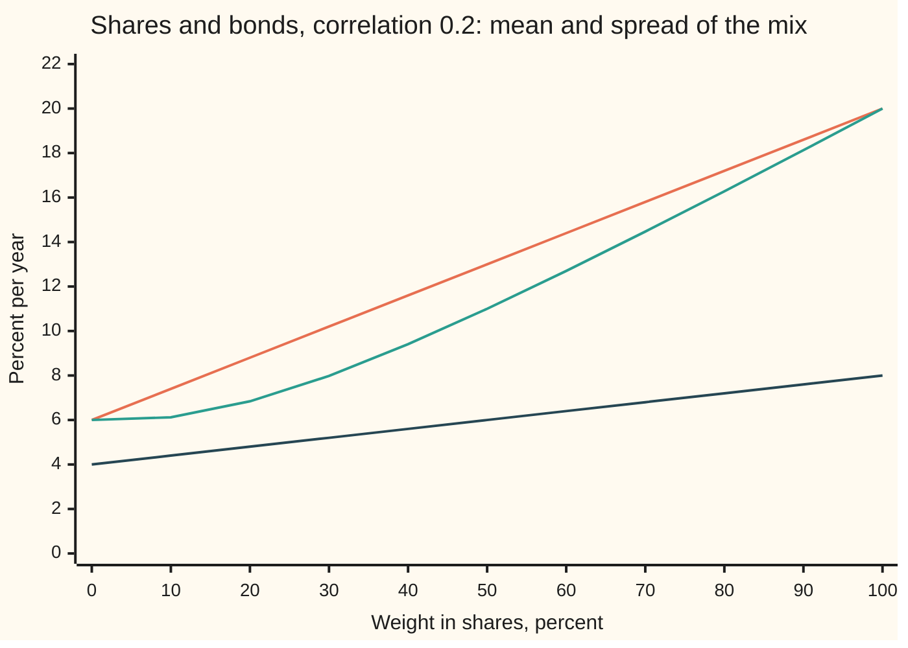
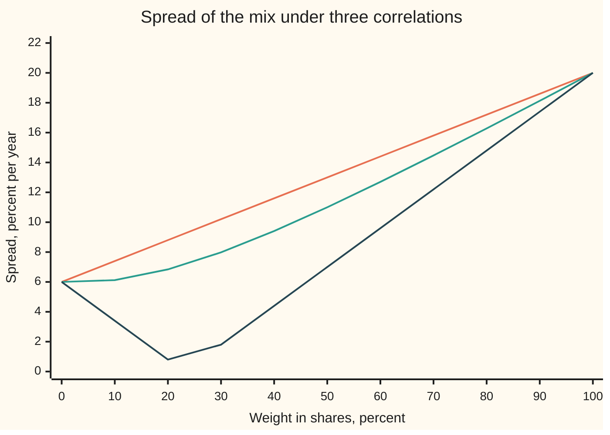

# Two assets: mean adds, variance does not, and correlation does the work

[Syllabus](../../../SYLLABUS.md) → [Financial mathematics](../README.md) → [Portfolio Theory](../README.md#s37) → Two assets

---

## General Overview

A fund holds $1,000. It puts $600 into shares and $400 into bonds: the classic 60-40 mix. Over a year the shares are expected to return 8%, with a typical swing of 20% either side. The bonds are expected to return 4%, with a typical swing of 6%. The two tend to move together a little, not much.

Two questions follow. What return should the mix expect? And how far does it typically swing?

The first answer is what intuition says. Sixty percent of 8% plus forty percent of 4% is 6.40%. Expected returns mix like ingredients in a recipe.

The second answer is not. Sixty percent of 20% plus forty percent of 6% is 14.40%. The true swing of the mix is 12.70%. The mix is 1.70 percentage points calmer than its parts suggest, for free: the expected return did not drop to pay for it. That gap is **diversification** (holding things that do not all fall at once), and this card derives exactly how big it is.

The typical swing has a proper name: the **spread**, or standard deviation. It is the square root of the **variance**, the average squared distance of the outcome from its mean. How much two returns move together is measured by their **correlation**, a number from −1 (always opposite) to +1 (always together). For shares and bonds here it is 0.2.

**The mean of a mix is the weighted average of the means; the variance is not, because a cross term counts how the two move together, and the less they move together the more the mix's spread falls below the weighted average of the spreads.**

**What kind of fact this is:** a theorem, proved on this card in Why it works. The inputs (the means, spreads and correlation) are a model of the future, not facts about it.

### The picture: slide the weight from all bonds to all shares



Top line (orange): the weighted average of the two spreads, a straight line from 6% to 20%. Middle line (green): the true spread of the mix, which sags below the straight line. Bottom line (dark): the mean return, a straight line from 4% to 8%. At 60% shares the mean is 6.40%, the true spread 12.70%, the straight line 14.40%. The sag is diversification.

---

## The formula

Notation first, in words. Call shares asset A and bonds asset B. $R_A$ and $R_B$ are their returns over the year: simple returns, the change in value divided by the starting value ([Returns](../36-Returns%20and%20Utility/01-returns-simple-log-and-annualised.md)). They are random: nobody knows them in advance. $E[\,\cdot\,]$ is the expectation, the probability-weighted average of a random quantity; $\operatorname{Var}$ is its variance and $\operatorname{Cov}$ the covariance of two, the average product of their deviations from their means ([Two variables at once](../../09-Probability%20and%20statistics/02-Random%20Variables/04-joint-distributions-and-covariance.md)). Shares have expected return $\mu_A$ (the Greek letter mu), spread $\sigma_A$ (sigma) and variance $\sigma_A^2$; bonds have $\mu_B$, $\sigma_B$, $\sigma_B^2$. $\rho$ (rho) is their correlation. A fraction $w$ of the money goes into shares and the rest, $1-w$, into bonds. $\mu_p$ and $\sigma_p$ are the mix's expected return and spread.

The portfolio's return is

$$R_p = w\,R_A + (1-w)\,R_B$$

and its mean and variance are

$$\mu_p = w\,\mu_A + (1-w)\,\mu_B$$

$$\sigma_p^2 = w^2\sigma_A^2 + (1-w)^2\sigma_B^2 + 2\,w(1-w)\,\rho\,\sigma_A\sigma_B$$

**Read it aloud:** the mix expects the weighted average of the two expected returns; its variance is each asset's variance scaled by its weight squared, plus twice the product of the weights times the covariance.

The last term is the **cross term**. It is the whole story. The covariance is written $c = \rho\,\sigma_A\sigma_B$: correlation times the two spreads. The spread of the mix is $\sigma_p = \sqrt{\sigma_p^2}$.

| Symbol | Plain meaning | In our example | Push it up and the answer… |
| --- | --- | --- | --- |
| $w$ | fraction of the money in shares; $1-w$ goes into bonds | 0.6 | mean rises; spread first dips, then rises |
| $R_A$, $R_B$ | one year's simple return on shares, on bonds: random | unknown in advance | — |
| $R_p$ | one year's return on the mix | unknown in advance | — |
| $\mu_A$, $\mu_B$ | expected return of shares, of bonds | 8%, 4% | $\mu_p$ rises by the weight times the push |
| $\sigma_A$, $\sigma_B$ | spread (standard deviation) of shares, of bonds | 20%, 6% | $\sigma_p$ rises |
| $\rho$ | correlation of the two returns, from −1 to +1 | 0.2 | $\sigma_p$ rises: less cancelling |
| $c$ | covariance, $\rho\,\sigma_A\sigma_B$ | 0.0024 | $\sigma_p$ rises |
| $\mu_p$ | expected return of the mix | 6.40% | — |
| $\sigma_p$ | spread of the mix; its square is the variance | 12.70% (variance 0.016128) | — |
| $w^*$ | the weight in shares that makes the spread smallest | 0.030928 | — |
| $d$ | variance of the gap between the two returns, $\sigma_A^2 + \sigma_B^2 - 2c$ | 0.0388 | the bowl in Step 5 gets steeper |
| $E$, $\operatorname{Var}$, $\operatorname{Cov}$ | expectation, variance, covariance | — | — |

The least-risk weight, derived in Step 5:

$$w^* = \frac{\sigma_B^2 - c}{\sigma_A^2 + \sigma_B^2 - 2c}$$

In words: the bond variance, less the covariance, over the variance of the gap between the two returns.

### When it holds

- **One period, weights fixed at the start.** Over several years the weights drift as prices move; unless the mix is rebalanced, next year's weights are not 60-40 and the formula needs the new ones.
- **The inputs are known.** In practice the means, spreads and correlation are estimates from past data. The formula is exact for the numbers put in, and those numbers are uncertain; the mean estimates are the worst ([Estimation error](07-estimation-error-and-shrinkage.md)).
- **Simple returns, not log returns.** A mix's simple return is the weighted average of the simple returns. Its log return is not the weighted average of the log returns, so the formula applied to log returns is slightly off.
- **Spread stands in for risk.** That is fair for returns that swing roughly symmetrically. For lopsided returns (options, crash-prone assets) the spread understates the pain of the bad side.
- **Correlation stays put.** If correlation rises from 0.2 to 0.5 in a crisis, the 60-40 spread rises from 12.70% to 13.36%, precisely when calm was wanted.

---

## Why it works

### Step 0: the mix's return is a weighted average, in every outcome

Whatever the year brings, the $600 in shares becomes $600 × (1 + R_A)$ dollars and the $400 in bonds becomes $400 × (1 + R_B)$. Add them, subtract the $1,000, divide by $1,000:

$$R_p = 0.6\,R_A + 0.4\,R_B.$$

This holds outcome by outcome, before any averaging. Everything below is what averaging does to a weighted sum.

### Step 1: the mean passes straight through

Expectation is linear: the average of a weighted sum is the weighted sum of the averages. So $\mu_p = w\,\mu_A + (1-w)\,\mu_B$. For 60-40: $0.6 × 8\% + 0.4 × 4\% = 6.40\%$. No assumption about how the two move together was needed.

### Step 2: the variance picks up a cross term

Variance is the average of a squared deviation. The mix's deviation from its mean is the weighted sum of the two deviations:

$$R_p - \mu_p = w\,(R_A - \mu_A) + (1-w)\,(R_B - \mu_B).$$

Square it. A sum squared is not the sum of the squares: for any two numbers, the square of their sum is the two squares plus twice their product. So

$$(R_p - \mu_p)^2 = w^2 (R_A - \mu_A)^2 + (1-w)^2 (R_B - \mu_B)^2 + 2w(1-w)(R_A - \mu_A)(R_B - \mu_B).$$

Average each piece. The first averages to $w^2\sigma_A^2$, the second to $(1-w)^2\sigma_B^2$. The third averages to $2w(1-w)$ times the covariance: the average product of the two deviations. That is the formula.

The cross term is what averaging a product does. When shares are above their mean, are bonds usually above theirs too? Then the products are mostly positive and the cross term adds variance. Usually below? Then the products are mostly negative and the cross term takes variance away. No pattern? It averages to zero.

### Step 3: correlation puts the cross term on a fixed scale

Covariance mixes two things: how strongly the returns move together, and how big they are. Dividing by both spreads leaves only the first: $\rho = c / (\sigma_A\sigma_B)$. The Cauchy–Schwarz inequality (the average of a product is at most the square root of the product of the average squares) keeps $\rho$ between −1 and +1. So the cross term is never bigger than $2w(1-w)\sigma_A\sigma_B$.

### Step 4: the spread never exceeds the weighted average of spreads

Put $\rho = 1$, the largest it can be. The variance becomes

$$w^2\sigma_A^2 + (1-w)^2\sigma_B^2 + 2w(1-w)\sigma_A\sigma_B = \big(w\,\sigma_A + (1-w)\,\sigma_B\big)^2,$$

a perfect square. The spread is then exactly the weighted average, 14.40% for 60-40. Any smaller correlation shrinks the cross term, so for weights between 0 and 1:

$$\sigma_p \le w\,\sigma_A + (1-w)\,\sigma_B,$$

with strict inequality whenever $\rho < 1$ and both weights are positive. This is the theorem behind diversification. Mixing never makes the spread worse than the average, and makes it better whenever the two are not in lockstep.

Put $\rho = -1$, the smallest. The variance becomes $\big(w\,\sigma_A - (1-w)\,\sigma_B\big)^2$, and the spread is the gap between the two weighted spreads. At $w = \sigma_B / (\sigma_A + \sigma_B) = 6/26 = 0.230769$ the gap is zero. The mix has no risk at all and still expects 4.92%. Every share loss is exactly cancelled by a bond gain.



Top line (orange): correlation +1, the straight line. Middle line (green): correlation 0.2, this card's market. Bottom line (dark): correlation −1, which touches zero between 20% and 30% shares, at 23.08%. Every real pair of assets draws a curve somewhere between the top and bottom lines.

### Step 5: the least-risk mix, by completing the square

The variance is a quadratic in $w$ (a formula with a $w^2$ term, a $w$ term and a constant). Collect the terms:

$$\sigma_p^2 = d\,w^2 - 2(\sigma_B^2 - c)\,w + \sigma_B^2, \qquad d = \sigma_A^2 + \sigma_B^2 - 2c.$$

Here $d$ is the variance of the gap $R_A - R_B$, so it is never negative. When $d > 0$ the quadratic is a bowl, and its lowest point sits at $w^* = (\sigma_B^2 - c)/d$. For this market: $(0.0036 - 0.0024)/0.0388 = 0.030928$. About 3.09% in shares gives the calmest mix: mean 4.12%, spread 5.97%. That is calmer than bonds alone, at 6%.

This is the surprise of the card. Adding a little of the riskier asset to the safer one lowers risk. At a small weight $w$, the shares' own piece is $w^2\sigma_A^2$: tiny, because $w^2$ is tiny. The bond piece shrinks by about $2w\sigma_B^2$, and the cross term grows by about $2wc$. Here $c = 0.0024$ is below $\sigma_B^2 = 0.0036$, so the shrink wins. That holds whenever $\rho < \sigma_B/\sigma_A$.

<details>
<summary>Detailed proof: completing the square, and when $w^*$ lies between 0 and 1</summary>

Start from $\sigma_p^2(w) = w^2\sigma_A^2 + (1-w)^2\sigma_B^2 + 2w(1-w)c$. Expand $(1-w)^2 = 1 - 2w + w^2$ and $w(1-w) = w - w^2$:
$$\sigma_p^2 = w^2(\sigma_A^2 + \sigma_B^2 - 2c) - 2w(\sigma_B^2 - c) + \sigma_B^2.$$
With $d = \sigma_A^2 + \sigma_B^2 - 2c = \operatorname{Var}(R_A - R_B) \ge 0$ and $d > 0$, complete the square:
$$\sigma_p^2 = d\,(w - w^*)^2 + \sigma_B^2 - \frac{(\sigma_B^2 - c)^2}{d}, \qquad w^* = \frac{\sigma_B^2 - c}{d}.$$
The first term is zero at $w^*$ and positive elsewhere, so $w^*$ is the unique minimum over all real weights. The minimum variance simplifies to $\sigma_A^2\sigma_B^2(1 - \rho^2)/d$.

$w^* > 0$ exactly when $c < \sigma_B^2$, that is when $\rho < \sigma_B/\sigma_A$ (0.3 here). With $\rho = 0.5$, $w^* = -0.075949$: the calmest mix would sell shares short. A fund that cannot sell short takes the nearest allowed weight, 0, and holds only bonds. By the same argument $w^* < 1$ exactly when $c < \sigma_A^2$.

If $d = 0$ the gap $R_A - R_B$ is a constant: the two assets move in lockstep up to a fixed offset. Every weight then has the same variance, and no weight is least-risk.

</details>

### Another road

The same variance comes out of a small grid. Stack the weights into a list, `w = [0.6, 0.4]`, and the variances and covariances into a 2 × 2 grid, the **covariance matrix**. Then the variance is the weights times the grid times the weights. With two assets that is the formula above, term for term. With many assets it is the only sensible way to write it, and it is where [The efficient frontier](02-efficient-frontier-and-minimum-variance.md) begins.

---

## Worked numbers, by hand

Shares: mean 8%, spread 20%. Bonds: mean 4%, spread 6%. Correlation 0.2. Weight in shares 0.6.

| Step | Arithmetic | Value |
| --- | --- | --- |
| mean of the mix | $0.6 × 0.08 + 0.4 × 0.04$ | 6.40% |
| share variance $\sigma_A^2$ | $0.20^2$ | 0.04 |
| bond variance $\sigma_B^2$ | $0.06^2$ | 0.0036 |
| covariance $c$ | $0.2 × 0.20 × 0.06$ | 0.0024 |
| share piece | $0.6^2 × 0.04$ | 0.0144 |
| bond piece | $0.4^2 × 0.0036$ | 0.000576 |
| cross term | $2 × 0.6 × 0.4 × 0.0024$ | 0.001152 |
| variance of the mix | $0.0144 + 0.000576 + 0.001152$ | 0.016128 |
| **spread of the mix** | $\sqrt{0.016128}$ | **12.70%** |
| weighted average of spreads | $0.6 × 20\% + 0.4 × 6\%$ | 14.40% |
| diversification saving | $14.40 - 12.70$ | 1.70 points |

One spread either side of the mean runs from −6.30% to 19.10%. If returns are roughly bell-shaped, about two years in three land in that range.

### The same numbers from a four-outcome ledger

The formula can be checked without it. Build a toy year with four outcomes. Shares land one spread up (+28%) or one spread down (−12%). Bonds land one spread up (+10%) or down (−2%). Give "both up" and "both down" probability (1 + 0.2)/4 = 0.30 each, and the two mixed outcomes 0.20 each. That toy has exactly the means, spreads and correlation of the market above. Now follow the $1,000:

| Probability | Shares | Bonds | $600 becomes | $400 becomes | Total | Mix return |
| --- | --- | --- | --- | --- | --- | --- |
| 0.30 | +28.00% | +10.00% | $768.00 | $440.00 | $1,208.00 | +20.80% |
| 0.20 | +28.00% | −2.00% | $768.00 | $392.00 | $1,160.00 | +16.00% |
| 0.20 | −12.00% | +10.00% | $528.00 | $440.00 | $968.00 | −3.20% |
| 0.30 | −12.00% | −2.00% | $528.00 | $392.00 | $920.00 | −8.00% |

The probability-weighted average of the last column is 6.40%. The probability-weighted squared distance from 6.40% is 0.016128. The spread is 12.70%. Same answer, reached by counting dollars rather than by the formula.

### The curve as the weight moves

| Shares | Mean | Spread, correlation 0.2 |
| --- | --- | --- |
| 0% | 4.00% | 6.00% |
| 3.09% (least risk) | 4.12% | 5.97% |
| 20% | 4.80% | 6.84% |
| 40% | 5.60% | 9.41% |
| 60% | 6.40% | 12.70% |
| 80% | 7.20% | 16.28% |
| 100% | 8.00% | 20.00% |

Plot each row as a point, spread across and mean up, and the points trace a curve bent like the nose of a bullet, pointing left. The nose is the least-risk mix. Everything below the nose is wasteful: 0% shares has more spread and less mean than 3.09% shares.

### What breaks if you drop a piece

Correct 60-40 spread: 12.70%.

| Mistake | Comes out at | What went wrong |
| --- | --- | --- |
| Average the spreads | 14.40% | Treats the correlation as +1: no diversification at all |
| Drop the cross term | 12.24% | Treats the correlation as 0: too optimistic |
| Cross term without the 2 | 12.47% | A squared sum carries twice the product of its parts, not once |
| Weights not squared | 16.31% | A weight scales the return, so it scales the variance by its square |

---

## Code, from first principles, and it actually runs

The scripts reach the 60-40 spread by three independent roads. The formula. The four-outcome ledger, which follows dollars and never uses the formula. A simulation of 200,000 years with correlated returns, built from home-made random numbers (a shift-and-xor generator) turned into bell-curve draws by the Box–Muller method. The least-risk weight is found twice: by the closed form, and by a ternary search (repeatedly cutting the interval in three and discarding the higher side) on the ledger's variance. The zero-risk hedge at correlation −1 is checked on the ledger. Every number on this card, including every charted point, is printed.

### Python

```python
# Two-asset portfolio: mean and spread of a 60-40 mix of shares and bonds.
# Standard library only.  Three roads to the 60-40 spread: the variance
# formula, a four-state ledger in dollars, and a simulation with home-made
# random numbers.  The least-risk weight is found by formula and by search.
from math import sqrt, log, cos, pi

MA, SA = 0.08, 0.20            # shares: mean return, spread (standard deviation)
MB, SB = 0.04, 0.06            # bonds: mean return, spread
RHO, W = 0.2, 0.6              # correlation, weight in shares

def formula_var(w, rho):       # road 1: w^2 vA + (1-w)^2 vB + 2 w (1-w) rho sA sB
    return w * w * SA * SA + (1 - w) ** 2 * SB * SB + 2 * w * (1 - w) * rho * SA * SB

def ledger(w, rho, money=1000.0):   # road 2: four states, each asset one spread up or down
    states = []                     # P(both up) = P(both down) = (1+rho)/4, mixed = (1-rho)/4
    for sa, sb in ((1, 1), (1, -1), (-1, 1), (-1, -1)):
        p = (1 + rho * sa * sb) / 4
        ra, rb = MA + sa * SA, MB + sb * SB
        shares, bonds = w * money * (1 + ra), (1 - w) * money * (1 + rb)
        states.append((p, ra, rb, shares, bonds, (shares + bonds) / money - 1))
    mean = sum(s[0] * s[5] for s in states)
    var = sum(s[0] * (s[5] - mean) ** 2 for s in states)
    return states, mean, var

def simulate(w, rho, n=200000, seed=20260928):   # road 3: correlated normal draws
    x = seed
    def uniform():
        nonlocal x                    # xorshift64: shift-and-xor random bits
        x ^= (x << 13) & 0xFFFFFFFFFFFFFFFF
        x ^= x >> 7
        x ^= (x << 17) & 0xFFFFFFFFFFFFFFFF
        return ((x >> 11) + 0.5) / 9007199254740992.0
    s = s2 = 0.0
    for _ in range(n):
        u1, u2, u3, u4 = uniform(), uniform(), uniform(), uniform()
        z1 = sqrt(-2 * log(u1)) * cos(2 * pi * u2)         # Box-Muller: uniform -> normal
        z2 = sqrt(-2 * log(u3)) * cos(2 * pi * u4)
        za, zb = z1, rho * z1 + sqrt(1 - rho * rho) * z2  # give the pair correlation rho
        rp = w * (MA + SA * za) + (1 - w) * (MB + SB * zb)
        s += rp; s2 += rp * rp
    m = s / n
    return m, sqrt(s2 / n - m * m)

pct = lambda v: f"{100 * v:.2f}%"
cov = RHO * SA * SB
mean60 = W * MA + (1 - W) * MB
v_f = formula_var(W, RHO)
states, mean_l, v_l = ledger(W, RHO)
m_sim, sd_sim = simulate(W, RHO)
avg_sd = W * SA + (1 - W) * SB
print("inputs: shares 8.00% mean, 20.00% spread; bonds 4.00%, 6.00%; correlation 0.2")
print(f"covariance rho*sA*sB            {cov:.6f}")
print(f"variances vA, vB; d = vA+vB-2c   {SA*SA:.6f} {SB*SB:.6f} {SA*SA + SB*SB - 2*cov:.6f}")
print(f"60-40 pieces w^2vA, (1-w)^2vB, 2w(1-w)c  {W*W*SA*SA:.6f} {(1-W)**2*SB*SB:.6f} {2*W*(1-W)*cov:.6f}")
print(f"60-40 mean, weighted average    {pct(mean60)}")
print(f"60-40 variance, formula         {v_f:.6f}")
print(f"60-40 variance, ledger          {v_l:.6f}")
print(f"60-40 spread, formula           {pct(sqrt(v_f))}")
print(f"60-40 spread, ledger            {pct(sqrt(v_l))}")
print(f"60-40 mean and spread, simulated {pct(m_sim)} {pct(sd_sim)} (200000 draws)")
print(f"simulation gap in mean, std error {100 * abs(m_sim - mean60):.2f} {100 * sqrt(v_f / 200000):.2f} points")
print(f"weighted average of spreads     {pct(avg_sd)}")
print(f"diversification saves           {100 * (avg_sd - sqrt(v_f)):.2f} points")
print(f"one-spread range for the year   {pct(mean60 - sqrt(v_f))} to {pct(mean60 + sqrt(v_f))}")
print("ledger on $1,000: prob, shares ret, bonds ret, shares $, bonds $, total $, portfolio ret")
for p, ra, rb, sh, bo, rp in states:
    print(f"  {p:.2f}  {pct(ra):>7} {pct(rb):>7}  {sh:7.2f} {bo:7.2f} {sh + bo:8.2f}  {pct(rp):>7}")
assert abs(v_l - v_f) < 1e-12 and abs(mean_l - mean60) < 1e-12
assert abs(sd_sim - sqrt(v_f)) < 0.002 and abs(m_sim - mean60) < 0.003

# least-risk weight: completing the square, then a search on the ledger
d = SA * SA + SB * SB - 2 * cov
w_star = (SB * SB - cov) / d
lo, hi = 0.0, 1.0
for _ in range(200):                  # ternary search: keep the lower third
    a, b = lo + (hi - lo) / 3, hi - (hi - lo) / 3
    if ledger(a, RHO)[2] < ledger(b, RHO)[2]: hi = b
    else: lo = a
w_search = (lo + hi) / 2
assert abs(w_search - w_star) < 1e-7
v_star = formula_var(w_star, RHO)
print(f"least-risk weight, formula      {w_star:.6f} ({pct(w_star)})")
print(f"w* > 0 needs rho below sB/sA    {SB / SA:.6f}")
print(f"least-risk weight, search       {w_search:.6f}")
print(f"least-risk mix mean, spread     {pct(w_star * MA + (1 - w_star) * MB)} {pct(sqrt(v_star))}")
print(f"variance check V(w*)+d(0.6-w*)^2 {v_star + d * (W - w_star) ** 2:.6f}")
w_hedge = SB / (SA + SB)              # perfect negative correlation: spreads cancel
v_hedge = ledger(w_hedge, -1.0)[2]
assert v_hedge < 1e-15
print(f"rho=-1 zero-risk weight         {w_hedge:.6f} ({pct(w_hedge)}), mean {pct(w_hedge * MA + (1 - w_hedge) * MB)}, ledger variance {v_hedge:.6f}")

print("curve: shares %, mean, spread at rho=1, rho=0.2, rho=-1")
for k in range(11):
    w = k / 10
    row = [sqrt(ledger(w, r)[2]) for r in (1.0, 0.2, -1.0)]
    assert abs(row[1] ** 2 - formula_var(w, 0.2)) < 1e-12 and row[1] <= row[0] + 1e-12
    print(f"  {10 * k:3d}  {pct(w * MA + (1 - w) * MB)}  " + "  ".join(pct(v) for v in row))
print("60-40 spread by correlation")
for r in (-1.0, -0.5, 0.0, 0.2, 0.5, 1.0):
    print(f"  rho {r:+.1f}  {pct(sqrt(formula_var(W, r)))}")

print("what breaks, 60-40:")
print(f"  average the spreads            {pct(avg_sd)}")
print(f"  drop the cross term            {pct(sqrt(W*W*SA*SA + (1-W)**2*SB*SB))}")
print(f"  cross term without the 2       {pct(sqrt(W*W*SA*SA + (1-W)**2*SB*SB + W*(1-W)*cov))}")
print(f"  weights not squared            {pct(sqrt(W*SA*SA + (1-W)*SB*SB + 2*W*(1-W)*cov))}")
print("try changing:")
print(f"  50-50 mix                      {pct(0.5*MA + 0.5*MB)} {pct(sqrt(formula_var(0.5, RHO)))}")
print(f"  80-20 mix                      {pct(0.8*MA + 0.2*MB)} {pct(sqrt(formula_var(0.8, RHO)))}")
print(f"  least-risk weight at rho=0.5   {(SB*SB - 0.5*SA*SB) / (SA*SA + SB*SB - SA*SB):.6f}")
print("All checks passed.")
```

**Ran 2026-09-28 on macOS, Python 3.14.6, standard library only. All checks passed. Output, pasted from the run:**

```
inputs: shares 8.00% mean, 20.00% spread; bonds 4.00%, 6.00%; correlation 0.2
covariance rho*sA*sB            0.002400
variances vA, vB; d = vA+vB-2c   0.040000 0.003600 0.038800
60-40 pieces w^2vA, (1-w)^2vB, 2w(1-w)c  0.014400 0.000576 0.001152
60-40 mean, weighted average    6.40%
60-40 variance, formula         0.016128
60-40 variance, ledger          0.016128
60-40 spread, formula           12.70%
60-40 spread, ledger            12.70%
60-40 mean and spread, simulated 6.37% 12.70% (200000 draws)
simulation gap in mean, std error 0.03 0.03 points
weighted average of spreads     14.40%
diversification saves           1.70 points
one-spread range for the year   -6.30% to 19.10%
ledger on $1,000: prob, shares ret, bonds ret, shares $, bonds $, total $, portfolio ret
  0.30   28.00%  10.00%   768.00  440.00  1208.00   20.80%
  0.20   28.00%  -2.00%   768.00  392.00  1160.00   16.00%
  0.20  -12.00%  10.00%   528.00  440.00   968.00   -3.20%
  0.30  -12.00%  -2.00%   528.00  392.00   920.00   -8.00%
least-risk weight, formula      0.030928 (3.09%)
w* > 0 needs rho below sB/sA    0.300000
least-risk weight, search       0.030928
least-risk mix mean, spread     4.12% 5.97%
variance check V(w*)+d(0.6-w*)^2 0.016128
rho=-1 zero-risk weight         0.230769 (23.08%), mean 4.92%, ledger variance 0.000000
curve: shares %, mean, spread at rho=1, rho=0.2, rho=-1
    0  4.00%  6.00%  6.00%  6.00%
   10  4.40%  7.40%  6.12%  3.40%
   20  4.80%  8.80%  6.84%  0.80%
   30  5.20%  10.20%  7.98%  1.80%
   40  5.60%  11.60%  9.41%  4.40%
   50  6.00%  13.00%  11.00%  7.00%
   60  6.40%  14.40%  12.70%  9.60%
   70  6.80%  15.80%  14.47%  12.20%
   80  7.20%  17.20%  16.28%  14.80%
   90  7.60%  18.60%  18.13%  17.40%
  100  8.00%  20.00%  20.00%  20.00%
60-40 spread by correlation
  rho -1.0  9.60%
  rho -0.5  11.00%
  rho +0.0  12.24%
  rho +0.2  12.70%
  rho +0.5  13.36%
  rho +1.0  14.40%
what breaks, 60-40:
  average the spreads            14.40%
  drop the cross term            12.24%
  cross term without the 2       12.47%
  weights not squared            16.31%
try changing:
  50-50 mix                      6.00% 11.00%
  80-20 mix                      7.20% 16.28%
  least-risk weight at rho=0.5   -0.075949
All checks passed.
```

### Rust

```rust
// Two-asset portfolio: mean and spread of a 60-40 mix of shares and bonds.
// Rust std only.  Three roads to the 60-40 spread: the variance formula,
// a four-state ledger in dollars, and a simulation with home-made random
// numbers.  The least-risk weight is found by formula and by search.
const MA: f64 = 0.08; const SA: f64 = 0.20; // shares: mean return, spread
const MB: f64 = 0.04; const SB: f64 = 0.06; // bonds: mean return, spread
const RHO: f64 = 0.2; const W: f64 = 0.6;   // correlation, weight in shares

fn formula_var(w: f64, rho: f64) -> f64 {   // road 1
    w * w * SA * SA + (1.0 - w).powi(2) * SB * SB + 2.0 * w * (1.0 - w) * rho * SA * SB
}

// road 2: four states, each asset one spread up or down;
// P(both up) = P(both down) = (1+rho)/4, the mixed states (1-rho)/4
fn ledger(w: f64, rho: f64) -> (Vec<[f64; 6]>, f64, f64) {
    let money = 1000.0;
    let mut states = Vec::new();
    for &(sa, sb) in &[(1.0, 1.0), (1.0, -1.0), (-1.0, 1.0), (-1.0, -1.0)] {
        let p: f64 = (1.0 + rho * sa * sb) / 4.0;
        let (ra, rb) = (MA + sa * SA, MB + sb * SB);
        let (shares, bonds) = (w * money * (1.0 + ra), (1.0 - w) * money * (1.0 + rb));
        states.push([p, ra, rb, shares, bonds, (shares + bonds) / money - 1.0]);
    }
    let mean: f64 = states.iter().map(|s| s[0] * s[5]).sum();
    let var: f64 = states.iter().map(|s| s[0] * (s[5] - mean).powi(2)).sum();
    (states, mean, var)
}

fn simulate(w: f64, rho: f64, n: usize, seed: u64) -> (f64, f64) { // road 3
    let mut x = seed;
    let mut uniform = || {                  // xorshift64: shift-and-xor random bits
        x ^= x << 13; x ^= x >> 7; x ^= x << 17;
        ((x >> 11) as f64 + 0.5) / 9007199254740992.0
    };
    let (mut s, mut s2) = (0.0, 0.0);
    let two_pi = 2.0 * std::f64::consts::PI;
    for _ in 0..n {
        let (u1, u2, u3, u4) = (uniform(), uniform(), uniform(), uniform());
        let z1 = (-2.0 * u1.ln()).sqrt() * (two_pi * u2).cos(); // Box-Muller
        let z2 = (-2.0 * u3.ln()).sqrt() * (two_pi * u4).cos();
        let (za, zb) = (z1, rho * z1 + (1.0 - rho * rho).sqrt() * z2);
        let rp = w * (MA + SA * za) + (1.0 - w) * (MB + SB * zb);
        s += rp; s2 += rp * rp;
    }
    let m = s / n as f64;
    (m, (s2 / n as f64 - m * m).sqrt())
}

fn pct(v: f64) -> String { format!("{:.2}%", 100.0 * v) }

fn main() {
    let cov = RHO * SA * SB;
    let mean60 = W * MA + (1.0 - W) * MB;
    let v_f = formula_var(W, RHO);
    let (states, mean_l, v_l) = ledger(W, RHO);
    let (m_sim, sd_sim) = simulate(W, RHO, 200000, 20260928);
    let avg_sd = W * SA + (1.0 - W) * SB;
    println!("inputs: shares 8.00% mean, 20.00% spread; bonds 4.00%, 6.00%; correlation 0.2");
    println!("covariance rho*sA*sB            {:.6}", cov);
    println!("variances vA, vB; d = vA+vB-2c   {:.6} {:.6} {:.6}", SA * SA, SB * SB, SA * SA + SB * SB - 2.0 * cov);
    println!("60-40 pieces w^2vA, (1-w)^2vB, 2w(1-w)c  {:.6} {:.6} {:.6}",
             W * W * SA * SA, (1.0 - W).powi(2) * SB * SB, 2.0 * W * (1.0 - W) * cov);
    println!("60-40 mean, weighted average    {}", pct(mean60));
    println!("60-40 variance, formula         {:.6}", v_f);
    println!("60-40 variance, ledger          {:.6}", v_l);
    println!("60-40 spread, formula           {}", pct(v_f.sqrt()));
    println!("60-40 spread, ledger            {}", pct(v_l.sqrt()));
    println!("60-40 mean and spread, simulated {} {} (200000 draws)", pct(m_sim), pct(sd_sim));
    println!("simulation gap in mean, std error {:.2} {:.2} points",
             100.0 * (m_sim - mean60).abs(), 100.0 * (v_f / 200000.0).sqrt());
    println!("weighted average of spreads     {}", pct(avg_sd));
    println!("diversification saves           {:.2} points", 100.0 * (avg_sd - v_f.sqrt()));
    println!("one-spread range for the year   {} to {}", pct(mean60 - v_f.sqrt()), pct(mean60 + v_f.sqrt()));
    println!("ledger on $1,000: prob, shares ret, bonds ret, shares $, bonds $, total $, portfolio ret");
    for s in &states {
        println!("  {:.2}  {:>7} {:>7}  {:7.2} {:7.2} {:8.2}  {:>7}", s[0], pct(s[1]), pct(s[2]), s[3], s[4], s[3] + s[4], pct(s[5]));
    }
    assert!((v_l - v_f).abs() < 1e-12 && (mean_l - mean60).abs() < 1e-12);
    assert!((sd_sim - v_f.sqrt()).abs() < 0.002 && (m_sim - mean60).abs() < 0.003);

    // least-risk weight: completing the square, then a search on the ledger
    let d = SA * SA + SB * SB - 2.0 * cov;
    let w_star = (SB * SB - cov) / d;
    let (mut lo, mut hi) = (0.0f64, 1.0f64);
    for _ in 0..200 {                       // ternary search: keep the lower third
        let (a, b) = (lo + (hi - lo) / 3.0, hi - (hi - lo) / 3.0);
        if ledger(a, RHO).2 < ledger(b, RHO).2 { hi = b; } else { lo = a; }
    }
    let w_search = (lo + hi) / 2.0;
    assert!((w_search - w_star).abs() < 1e-7);
    let v_star = formula_var(w_star, RHO);
    println!("least-risk weight, formula      {:.6} ({})", w_star, pct(w_star));
    println!("w* > 0 needs rho below sB/sA    {:.6}", SB / SA);
    println!("least-risk weight, search       {:.6}", w_search);
    println!("least-risk mix mean, spread     {} {}", pct(w_star * MA + (1.0 - w_star) * MB), pct(v_star.sqrt()));
    println!("variance check V(w*)+d(0.6-w*)^2 {:.6}", v_star + d * (W - w_star).powi(2));
    let w_hedge = SB / (SA + SB);           // perfect negative correlation: spreads cancel
    let v_hedge = ledger(w_hedge, -1.0).2;
    assert!(v_hedge < 1e-15);
    println!("rho=-1 zero-risk weight         {:.6} ({}), mean {}, ledger variance {:.6}",
             w_hedge, pct(w_hedge), pct(w_hedge * MA + (1.0 - w_hedge) * MB), v_hedge);

    println!("curve: shares %, mean, spread at rho=1, rho=0.2, rho=-1");
    for k in 0..11 {
        let w = k as f64 / 10.0;
        let row: Vec<f64> = [1.0, 0.2, -1.0].iter().map(|&r| ledger(w, r).2.sqrt()).collect();
        assert!((row[1].powi(2) - formula_var(w, 0.2)).abs() < 1e-12 && row[1] <= row[0] + 1e-12);
        println!("  {:3}  {}  {}  {}  {}", 10 * k, pct(w * MA + (1.0 - w) * MB), pct(row[0]), pct(row[1]), pct(row[2]));
    }
    println!("60-40 spread by correlation");
    for &r in &[-1.0, -0.5, 0.0, 0.2, 0.5, 1.0] {
        println!("  rho {:+.1}  {}", r, pct(formula_var(W, r).sqrt()));
    }

    let (va, vb) = (SA * SA, SB * SB);
    println!("what breaks, 60-40:");
    println!("  average the spreads            {}", pct(avg_sd));
    println!("  drop the cross term            {}", pct((W * W * va + (1.0 - W).powi(2) * vb).sqrt()));
    println!("  cross term without the 2       {}", pct((W * W * va + (1.0 - W).powi(2) * vb + W * (1.0 - W) * cov).sqrt()));
    println!("  weights not squared            {}", pct((W * va + (1.0 - W) * vb + 2.0 * W * (1.0 - W) * cov).sqrt()));
    println!("try changing:");
    println!("  50-50 mix                      {} {}", pct(0.5 * MA + 0.5 * MB), pct(formula_var(0.5, RHO).sqrt()));
    println!("  80-20 mix                      {} {}", pct(0.8 * MA + 0.2 * MB), pct(formula_var(0.8, RHO).sqrt()));
    println!("  least-risk weight at rho=0.5   {:.6}", (vb - 0.5 * SA * SB) / (va + vb - SA * SB));
    println!("All checks passed.");
}
```

**Ran 2026-09-28 on macOS, rustc 1.98.1, no crates. All checks passed. Output, pasted from the run:**

```
inputs: shares 8.00% mean, 20.00% spread; bonds 4.00%, 6.00%; correlation 0.2
covariance rho*sA*sB            0.002400
variances vA, vB; d = vA+vB-2c   0.040000 0.003600 0.038800
60-40 pieces w^2vA, (1-w)^2vB, 2w(1-w)c  0.014400 0.000576 0.001152
60-40 mean, weighted average    6.40%
60-40 variance, formula         0.016128
60-40 variance, ledger          0.016128
60-40 spread, formula           12.70%
60-40 spread, ledger            12.70%
60-40 mean and spread, simulated 6.37% 12.70% (200000 draws)
simulation gap in mean, std error 0.03 0.03 points
weighted average of spreads     14.40%
diversification saves           1.70 points
one-spread range for the year   -6.30% to 19.10%
ledger on $1,000: prob, shares ret, bonds ret, shares $, bonds $, total $, portfolio ret
  0.30   28.00%  10.00%   768.00  440.00  1208.00   20.80%
  0.20   28.00%  -2.00%   768.00  392.00  1160.00   16.00%
  0.20  -12.00%  10.00%   528.00  440.00   968.00   -3.20%
  0.30  -12.00%  -2.00%   528.00  392.00   920.00   -8.00%
least-risk weight, formula      0.030928 (3.09%)
w* > 0 needs rho below sB/sA    0.300000
least-risk weight, search       0.030928
least-risk mix mean, spread     4.12% 5.97%
variance check V(w*)+d(0.6-w*)^2 0.016128
rho=-1 zero-risk weight         0.230769 (23.08%), mean 4.92%, ledger variance 0.000000
curve: shares %, mean, spread at rho=1, rho=0.2, rho=-1
    0  4.00%  6.00%  6.00%  6.00%
   10  4.40%  7.40%  6.12%  3.40%
   20  4.80%  8.80%  6.84%  0.80%
   30  5.20%  10.20%  7.98%  1.80%
   40  5.60%  11.60%  9.41%  4.40%
   50  6.00%  13.00%  11.00%  7.00%
   60  6.40%  14.40%  12.70%  9.60%
   70  6.80%  15.80%  14.47%  12.20%
   80  7.20%  17.20%  16.28%  14.80%
   90  7.60%  18.60%  18.13%  17.40%
  100  8.00%  20.00%  20.00%  20.00%
60-40 spread by correlation
  rho -1.0  9.60%
  rho -0.5  11.00%
  rho +0.0  12.24%
  rho +0.2  12.70%
  rho +0.5  13.36%
  rho +1.0  14.40%
what breaks, 60-40:
  average the spreads            14.40%
  drop the cross term            12.24%
  cross term without the 2       12.47%
  weights not squared            16.31%
try changing:
  50-50 mix                      6.00% 11.00%
  80-20 mix                      7.20% 16.28%
  least-risk weight at rho=0.5   -0.075949
All checks passed.
```

The two outputs are identical, including the simulation, since both use the same generator and seed. The simulated mean, 6.37%, is 0.03 points from 6.40%: one standard error for 200,000 draws, which is also 0.03 points.

> [!TIP]
> **Try changing**
> - **Guess first: does 50-50 have half the spread of all shares?** Set `W = 0.5`. The mean is 6.00% and the spread 11.00%, well over half of 20%, because bonds add their own swing.
> - **Guess first: more shares, how much more risk?** Set `W = 0.8`. The mean rises to 7.20%; the spread jumps to 16.28%. The last 20 points of shares cost more spread than the first 20.
> - **Guess first: what happens to the calmest mix if correlation rises to 0.5?** Set `RHO = 0.5`. The least-risk weight becomes −0.075949: a short position in shares. With no short selling allowed, all bonds is the calmest mix.
> - **Guess first: can two risky assets make a riskless one?** Set `RHO = -1.0`. The spread at 23.08% shares is zero, as the ledger line shows.

---

## The usual mistake

> [!warning]
> **Adding the spreads by weight.** The spread of a mix is not 60% of one spread plus 40% of the other. That shortcut gives 14.40% for this market and is right only when the two assets move in perfect lockstep. Spreads do not add; variances add, plus a cross term. Any correlation below +1 pulls the true spread below the weighted average.
>
> - **Dropping the cross term.** Treating shares and bonds as unrelated gives 12.24%, too calm by half a point. The cross term is where the correlation lives.
> - **Forgetting the 2.** The cross term is $2w(1-w)c$. Missing the 2 gives 12.47%.
> - **Weights not squared.** A weight of 0.6 scales the variance by 0.6 squared, not by 0.6. Getting this wrong gives 16.31%.
> - **Reading "less correlated" as "safer than the safer asset".** Diversification lowers the spread below the weighted average, not below the safer asset. The 60-40 mix, at 12.70%, is still twice as volatile as bonds alone.

---

## Where you meet it in real life

- **The 60-40 fund.** Balanced funds and many pension default options hold roughly 60% shares and 40% bonds. The case for the mix is this card: bonds dilute the spread by more than their share of the money, because the two do not move in lockstep.
- **When correlation turned.** The benefit rests on correlation staying low. In 2022 shares and bonds fell together as interest rates rose, and 60-40 funds lost heavily on both sides. A correlation that rises in a crisis shrinks the cross-term saving when it is needed.
- **Currency hedging.** A foreign share held unhedged is a two-asset position: the share and the currency. Whether hedging the currency lowers the spread depends on the correlation between the two, by the same formula.
- **The calmest mix is not all-bonds.** Whenever $\rho < \sigma_B/\sigma_A$, a sliver of the riskier asset lowers the spread; here the least-risk weight is 3.09% shares. A low-risk mandate that holds only bonds leaves that on the table.
- **Pricing risk.** How much a single asset adds to a portfolio's variance is its covariance with the portfolio, not its own variance. That is the idea behind [CAPM](04-capm-and-beta.md). Weighting assets so each contributes the same variance is [Risk parity](08-risk-parity-and-alternative-weightings.md).

> **Say it back**
> A two-asset portfolio's return is the weighted average of the two returns, in every outcome. So its expected return is the weighted average of the expected returns. Its variance is each variance times its weight squared, plus twice the product of the weights times the covariance. Because correlation is at most +1, the spread of the mix never exceeds the weighted average of the spreads, and falls below it whenever the two are not in lockstep. For 60-40 shares and bonds at correlation 0.2: mean 6.40%, spread 12.70%, against 14.40% for the naive average.

---

## What this builds on

- [Returns](../36-Returns%20and%20Utility/01-returns-simple-log-and-annualised.md): simple returns, the kind that mix by weight, and spread as the measure of swing.
- [Two variables at once](../../09-Probability%20and%20statistics/02-Random%20Variables/04-joint-distributions-and-covariance.md): expectation, variance, covariance and correlation, and the variance of a sum.

---

## Where this goes next

- [The efficient frontier](02-efficient-frontier-and-minimum-variance.md): many assets at once, the covariance matrix, and the set of mixes with the least spread for each mean.

With two assets there is one weight to choose and one curve to walk along; with many there are countless mixes for each mean, and the open question is which one has the least spread.

---

## Sources

Verified 2026-09-28: every link below resolves to the publisher's page.

- Harry Markowitz, "Portfolio Selection", *The Journal of Finance* 7(1), 1952, pp. 77–91, [doi:10.1111/j.1540-6261.1952.tb01525.x](https://doi.org/10.1111/j.1540-6261.1952.tb01525.x). The paper that put the covariance term at the centre of portfolio choice.
- Harry Markowitz, *Portfolio Selection: Efficient Diversification of Investments*, Cowles Foundation Monograph 16, 1959, [Cowles Foundation page](https://cowles.yale.edu/research/cfm-16-portfolio-selection-efficient-diversification-investments). The book-length treatment, with the two- and three-asset geometry worked slowly.
- Harry Markowitz, "Foundations of Portfolio Theory", Nobel Prize lecture, 1990, [NobelPrize.org](https://www.nobelprize.org/prizes/economic-sciences/1990/markowitz/lecture/). A short retrospective on why mean and variance, and what the approach leaves out.
- John H. Cochrane, *Asset Pricing*, revised edition, Princeton University Press, 2005, [publisher page](https://press.princeton.edu/books/hardcover/9780691121376/asset-pricing). The mean-variance frontier placed inside modern asset-pricing theory.
