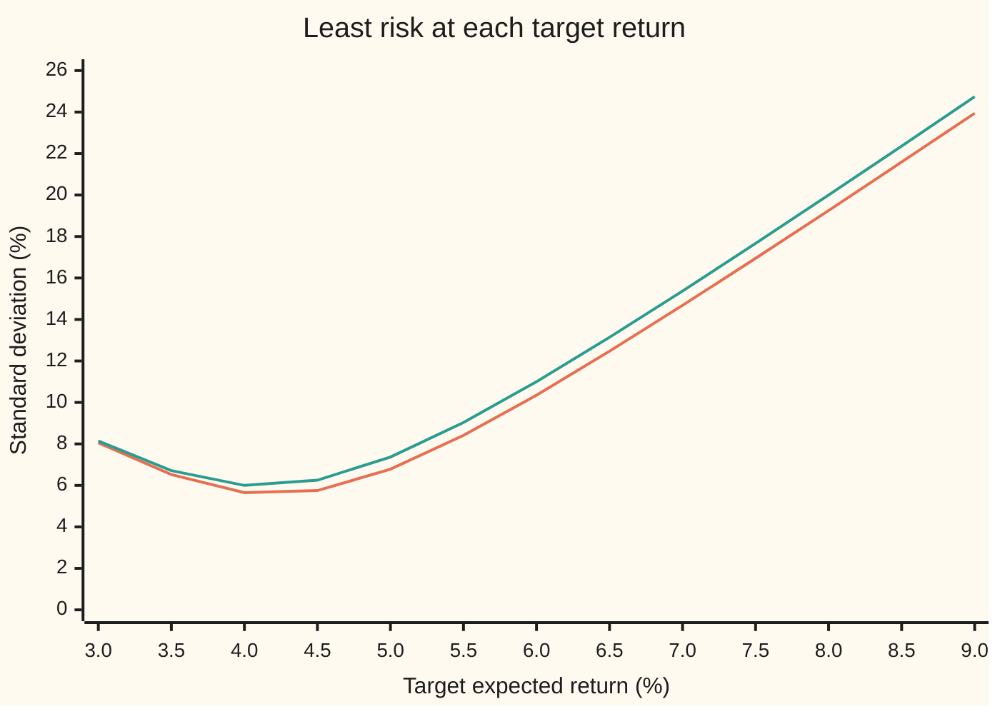
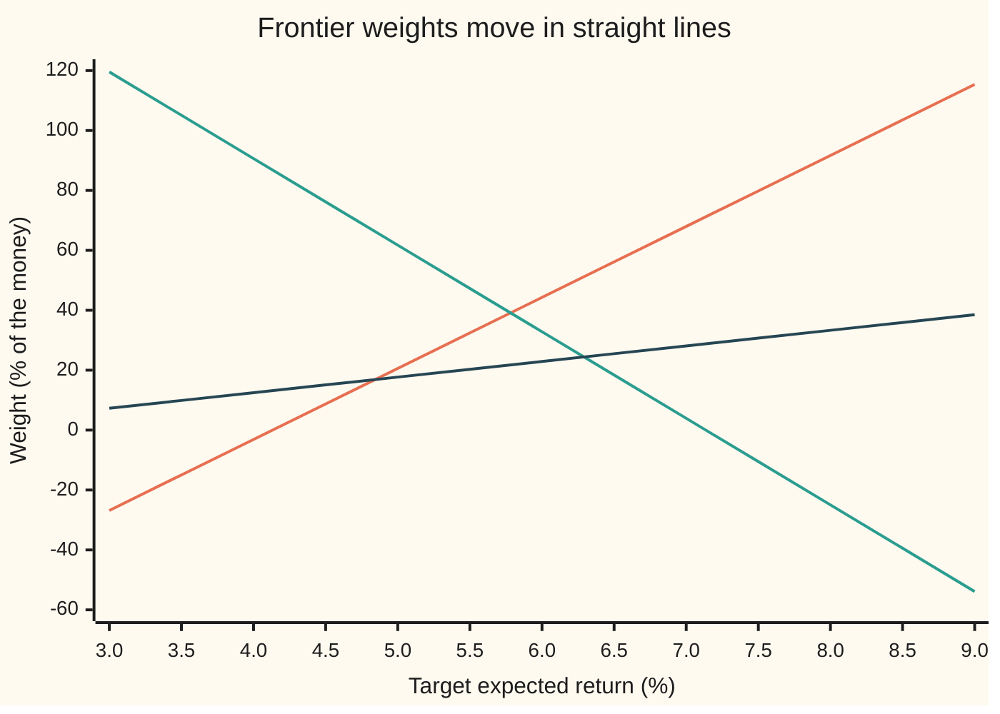

# The efficient frontier: the least risk for each return, and the portfolio with the least risk of all

[Syllabus](../../../SYLLABUS.md) → [Financial mathematics](../README.md) → [Portfolio Theory](../README.md#s37) → The efficient frontier

---

## General Overview

A fund holds three things: shares, bonds and gold. Over a year, shares are expected to return 8 percent, bonds 4 percent, gold 5 percent. Their risk, measured as standard deviation (the typical size of a year's surprise above or below the expected return), is 20 percent for shares, 6 percent for bonds, 15 percent for gold. They move together a little: shares and bonds with correlation 0.2, shares and gold 0.1, bonds and gold not at all (correlation is a number from −1 to 1 saying how much two returns rise and fall together).

The fund wants 6 percent a year. Endless splits of the money deliver an expected 6 percent. Half shares and half bonds does it, with a standard deviation of 11.00 percent. A different split, 44.28 percent shares, 32.83 percent bonds and 22.89 percent gold, also expects 6 percent, but its standard deviation is only 10.35 percent. Variance is the standard deviation squared, so the split with the least standard deviation also has the least variance. Same expected return, less risk. No other split that expects 6 percent does better. That split is the **minimum-variance portfolio for a 6 percent target**.

Ask the same question for every target return and the answers trace a curve: the least risk available at each level of return. The part of that curve above the lowest-risk point's return is the **efficient frontier**. Its lowest-risk point is the **global minimum-variance portfolio**: 1.63 percent shares, 84.84 percent bonds, 13.53 percent gold, expecting 4.20 percent with a standard deviation of 5.56 percent. That is less risky than bonds alone, the calmest asset on offer. On $10,000 it means $162.81 in shares, $8,484.08 in bonds and $1,353.11 in gold.

**The least-risk portfolio for any target return solves one small system of linear equations, every such portfolio is a straight-line blend of two fixed portfolios, and the risk traces a curve whose lowest point is the global minimum-variance portfolio.**

**What kind of fact this is:** a theorem, proved on this card in Why it works, about a model: the expected returns and the covariances are taken as known inputs, which in practice they are not.

### The picture: the least risk at each target return



Lower line (orange): the minimum-variance curve with all three assets. Upper line (green): the best that shares and bonds can do without gold. The chart lies on its side compared with the usual textbook drawing, which puts risk across and return up; the curve is the same. Both lines bottom out near 4.2 percent. Right of the bottom is the efficient frontier: more return costs more risk. Left of the bottom, risk rises while return falls, so nobody should stand there. Gold lowers the curve everywhere, even though gold on its own is riskier than bonds and earns less than shares.

---

## The formula

Notation first, in words. A list of numbers, one per asset, is written as a single letter and called a vector; here each vector has three entries, in the order shares, bonds, gold. A square table of numbers is a matrix. Three lists and one matrix carry the inputs: $w$ holds the weights, $\mu$ the expected returns, $\mathbf{1}$ three ones, and $\Sigma$ (the covariance matrix) every variance and pairwise covariance, detailed in the table below. The raised $\top$ turns a column into a row, so $w^\top \mu$ means "multiply the two lists entry by entry and add", which is the portfolio's expected return; likewise $w^\top\Sigma\,w$ is its variance. $\Sigma^{-1}$ is the inverse matrix of $\Sigma$, the matrix that undoes it ([The inverse matrix](../../03-Algebra/05-Solving%20Systems/03-inverse-matrix.md)).

The problem, for a target return $m$:

$$\text{minimise } w^\top \Sigma\, w \quad \text{subject to} \quad \mathbf{1}^\top w = 1, \quad \mu^\top w = m.$$

**Read it aloud:** among all splits of the money that invest all of it and expect the target return, find the one with the smallest variance.

The answer uses three numbers built from the inputs, $A = \mathbf{1}^\top\Sigma^{-1}\mathbf{1}$, $B = \mathbf{1}^\top\Sigma^{-1}\mu$, $C = \mu^\top\Sigma^{-1}\mu$, and $\Delta = AC - B^2$. The best weights $w(m)$ and their variance $V(m)$ are:

$$w(m) = \lambda\,\Sigma^{-1}\mathbf{1} + \eta\,\Sigma^{-1}\mu, \qquad \lambda = \frac{C - Bm}{\Delta}, \quad \eta = \frac{Am - B}{\Delta},$$

$$V(m) = \frac{A m^2 - 2Bm + C}{\Delta} = \frac{1}{A} + \frac{A}{\Delta}\Big(m - \frac{B}{A}\Big)^2.$$

**Read it aloud:** the best weights are a blend of two fixed lists, $\Sigma^{-1}\mathbf{1}$ and $\Sigma^{-1}\mu$, in proportions set by the target; the least variance is a parabola in the target, lowest at $B/A$.

| Symbol | Plain meaning | In our example | Push it up and the answer… |
| --- | --- | --- | --- |
| $w$ | the weights: fraction of the money in each asset, summing to 1; negative means sold short (borrowed and sold) | 6% target: 44.28%, 32.83%, 22.89% | |
| $\mu$ | expected yearly return of each asset | 8%, 4%, 5% | the frontier weights change; the global minimum-variance portfolio does not, since it never uses $\mu$ |
| $\sigma$, $\rho$ | each asset's standard deviation, and each pair's correlation | 20%, 6%, 15%; 0.2, 0.1, 0 | higher: the curve usually rises, though not always where that asset is sold short |
| $\Sigma$ | the covariance matrix: the entry for assets i and j is their correlation times both standard deviations, and the diagonal holds each variance $\sigma^2$ | `[[400, 24, 30], [24, 36, 0], [30, 0, 225]]` in percent squared | |
| $\mathbf{1}$, $\top$ | the list of ones, so $\mathbf{1}^\top w$ is the sum of the weights; the raised $\top$ turns a column into a row | 1, 1, 1 | |
| $m$ | the target expected return | 6% | the variance climbs along the parabola above 4.20% |
| $V$ | the least variance at target $m$; its square root is the standard deviation | 107.1485 percent squared, so 10.35% | |
| $A$, $B$, $C$ | three numbers made from the inputs: $A = \mathbf{1}^\top\Sigma^{-1}\mathbf{1}$, $B = \mathbf{1}^\top\Sigma^{-1}\mu$, $C = \mu^\top\Sigma^{-1}\mu$ | 0.03232749, 0.13578947, 0.61286550 (percent units) | |
| $\Delta$ | $AC - B^2$, always positive when the means are not all equal | 0.00137362 | smaller: the parabola gets steeper |
| $\lambda$, $\eta$ | the Lagrange multipliers: how much half the variance changes as each constraint is loosened by one unit | −146.9631, 42.3519 at 6% | |
| $w_g$, $m_g$, $V_g$ | the global minimum-variance weights, return and variance: $\Sigma^{-1}\mathbf{1}/A$, $B/A$, $1/A$ | 1.63%, 84.84%, 13.53%; 4.2004%; 30.9334 percent squared | |
| $s$ | the shift: how the frontier weights change per extra percentage point of target | +23.70, −28.90, +5.20 points | |

Two helper facts. The weights move in a straight line as the target moves: $w(m) = w_g + (m - m_g)\,s$, with $s = (A\,\Sigma^{-1}\mu - B\,\Sigma^{-1}\mathbf{1})/\Delta$. And the standard deviation $\sqrt{V(m)}$ against $m$ is a hyperbola (a curve with two straight-line asymptotes), which is the shape in the picture.

### When it holds

- **The inputs are known.** The formula treats $\mu$ and $\Sigma$ as exact. They are estimated from history, and small errors in $\mu$ swing the weights hard, because the weights run through $\Sigma^{-1}$. [Estimation error](07-estimation-error-and-shrinkage.md) is the repair.
- **$\Sigma$ is positive definite:** every non-zero mix has positive variance, so no asset is an exact copy or blend of the others. If one is, $\Sigma$ has no inverse and the formula fails: either some mix is riskless or many weight lists tie for the minimum.
- **The expected returns are not all equal.** If they are, $\Delta = 0$, every portfolio expects the same return, and only the global minimum-variance portfolio has meaning.
- **Short selling is free and unlimited.** The formula happily returns negative weights (bonds at −24.98% for an 8% target). If shorts are banned, the formula's answer is infeasible and the problem needs a quadratic program: Quadratic programs.
- **One period, and variance is the risk that matters.** Variance punishes gains and losses alike and ignores fat tails; for skewed payoffs such as options, the "least-variance" portfolio can hide a crash.

---

## Why it works

### Step 0: a bowl cut by a flat slice

Variance, as a function of the weights, is a bowl: it curves upward in every direction, because $\Sigma$ is positive definite. The two constraints, "invest everything" and "expect $m$", are flat. With three assets, they cut the space of weights down to a single straight line. A bowl sliced along a line is a parabola, and a parabola has exactly one lowest point. At that point the bowl's steepest-uphill direction is at right angles to the line: moving along the line does not change the variance to first order. That right-angle condition is what Lagrange multipliers write down ([Lagrange multipliers](../../06-Calculus%20and%20analysis/07-Several%20Variables/08-lagrange-multipliers.md)).

### Step 1: write the problem with multipliers

Minimise half the variance, $\tfrac12 w^\top\Sigma w$ (the half only tidies the algebra). Attach one multiplier to each constraint:

$$L = \tfrac12 w^\top \Sigma w - \lambda(\mathbf{1}^\top w - 1) - \eta(\mu^\top w - m).$$

The slope of $\tfrac12 w^\top\Sigma w$ with respect to the weights is $\Sigma w$: for three assets, the first entry is $\Sigma_{11}w_1 + \Sigma_{12}w_2 + \Sigma_{13}w_3$, the rate at which half the variance changes as the shares' weight grows. Setting the slope of this whole expression to zero gives

$$\Sigma w = \lambda\,\mathbf{1} + \eta\,\mu.$$

In words: at the optimum, the variance's slope is a combination of the two constraint directions, so no move that keeps both constraints can lower it.

### Step 2: undo the matrix, and a two-fund blend falls out

Multiply both sides by $\Sigma^{-1}$:

$$w = \lambda\,\Sigma^{-1}\mathbf{1} + \eta\,\Sigma^{-1}\mu.$$

The two lists $\Sigma^{-1}\mathbf{1}$ and $\Sigma^{-1}\mu$ do not depend on the target. Only the two numbers $\lambda$ and $\eta$ do. So every frontier portfolio is a blend of two fixed portfolios. This is **two-fund separation**: a fund family needs to offer only two funds, and every investor on the frontier holds some mix of them. As the target moves, the weights move in straight lines:



Rising line (orange): shares. Falling line (green): bonds. Gentle line (dark blue): gold. Each extra percentage point of target moves 23.70 points of the money into shares and 5.20 into gold, paid for by 28.90 points out of bonds. At low targets the shares go short (negative weight); at high targets the bonds do.

### Step 3: the two constraints fix the two multipliers

Put the blend into the constraints. "Invest everything" is $\mathbf{1}^\top w = 1$; "expect $m$" is $\mu^\top w = m$. Using the names $A$, $B$, $C$:

$$A\lambda + B\eta = 1, \qquad B\lambda + C\eta = m.$$

Two equations, two unknowns. The determinant (the number that decides whether a 2-by-2 system has one answer) is $AC - B^2 = \Delta$. Solving gives $\lambda = (C - Bm)/\Delta$ and $\eta = (Am - B)/\Delta$, the formula.

### Step 4: the variance comes almost free

Multiply $\Sigma w = \lambda\mathbf{1} + \eta\mu$ on the left by $w^\top$:

$$V = w^\top\Sigma w = \lambda\,\mathbf{1}^\top w + \eta\,\mu^\top w = \lambda + \eta m = \frac{Am^2 - 2Bm + C}{\Delta}.$$

The last step substitutes $\lambda$ and $\eta$. So the least variance is a parabola in the target.

### Step 5: complete the square to find the bottom

Rewrite the parabola:

$$V(m) = \frac{1}{A} + \frac{A}{\Delta}\Big(m - \frac{B}{A}\Big)^2.$$

The squared bracket is never negative and $A/\Delta$ is positive, so the smallest variance is $1/A$, reached at $m_g = B/A$. At that target $\eta = 0$ and $\lambda = 1/A$, so the weights are $w_g = \Sigma^{-1}\mathbf{1}/A$: the inverse matrix's row sums, rescaled to add to 1. The expected return plays no part in finding it. Every target above $m_g$ is efficient: no portfolio beats it on both return and risk. Every target below is beaten by $w_g$ itself, which expects more and risks less.

<details>
<summary>Detailed proof</summary>

**$\Delta > 0$.** Write $\langle x, y\rangle = x^\top\Sigma^{-1}y$. Because $\Sigma$ is positive definite, so is $\Sigma^{-1}$, and this is an inner product (a way to measure lengths and angles). Cauchy–Schwarz says $\langle \mathbf{1}, \mu\rangle^2 \le \langle \mathbf{1}, \mathbf{1}\rangle\langle \mu, \mu\rangle$, that is $B^2 \le AC$, with equality only when $\mu$ is a multiple of $\mathbf{1}$, meaning all means are equal. So distinct means give $\Delta > 0$ and the 2-by-2 system has exactly one solution.

**The stationary point is the global minimum, and the only one.** Let $u$ be any other fully invested portfolio with mean $m$, and $z = u - w(m)$. Then $\mathbf{1}^\top z = 0$ and $\mu^\top z = 0$. Expand: $u^\top\Sigma u = w^\top\Sigma w + 2z^\top\Sigma w + z^\top\Sigma z$. The middle term is $2z^\top(\lambda\mathbf{1} + \eta\mu) = 0$. The last term is positive unless $z = 0$, by positive definiteness. So every other feasible portfolio has strictly larger variance.

**The efficient branch.** For $m > m_g$, suppose some portfolio has mean $m' \ge m$ and variance at most $V(m)$. Its variance is at least $V(m')$ by the paragraph above, and $V$ is strictly increasing to the right of $m_g$, so $m' = m$, and uniqueness makes it $w(m)$. For $m < m_g$, $w_g$ has higher mean and lower variance, so $w(m)$ is dominated.

</details>

### The other door: a quadratic program

The same problem, with extra rules such as "no short sales" or "no more than 40% in one asset", has no closed form. A quadratic-programming solver walks the bowl numerically: Quadratic programs. Road 3 in the code below is a small version of that: it walks the line of feasible weights and finds the bottom with no calculus at all.

---

## Worked numbers, by hand

Work in percent: returns in percent, variances in percent squared, so a 20% standard deviation becomes a variance of 400. Means $\mu$ = 8, 4, 5.

| Step | Arithmetic | Value |
| --- | --- | --- |
| diagonal of $\Sigma$ | $20^2$, $6^2$, $15^2$ | 400, 36, 225 |
| off-diagonal of $\Sigma$ | $0.2 \times 20 \times 6$, $0.1 \times 20 \times 15$, $0 \times 6 \times 15$ | 24, 30, 0 |
| determinant of $\Sigma$ | $400(36 \cdot 225) - 24(24 \cdot 225) + 30(0 - 36 \cdot 30)$ | 3,078,000 |
| adjugate (determinant times $\Sigma^{-1}$) | the nine 2-by-2 cofactors | `[[8100, -5400, -1080], [-5400, 89100, 720], [-1080, 720, 13824]]` |
| determinant times $\Sigma^{-1}\mathbf{1}$ | row sums of the adjugate | 1,620; 84,420; 13,464 |
| determinant times $A$ | $1620 + 84420 + 13464$ | 99,504 |
| $w_g$ | each row sum over 99,504 | 1.6281%, 84.8408%, 13.5311% |
| $V_g = 1/A$ | $3{,}078{,}000 / 99{,}504$ | 30.9334, so standard deviation **5.5618%** |
| determinant times $\Sigma^{-1}\mu$ | adjugate times (8, 4, 5) | 37,800; 316,800; 63,360 |
| determinant times $B$ | $37800 + 316800 + 63360$ | 417,960 |
| $m_g = B/A$ | $417{,}960 / 99{,}504$ | **4.2004%** |
| determinant times $C$ | $8 \cdot 37800 + 4 \cdot 316800 + 5 \cdot 63360$ | 1,886,400 |
| $A$, $B$, $C$ | each over 3,078,000 | 0.03232749, 0.13578947, 0.61286550 |
| $\Delta$ | $AC - B^2$ | 0.00137362 |
| $\lambda$ at 6% | $(C - 6B)/\Delta$ | −146.9631 |
| $\eta$ at 6% | $(6A - B)/\Delta$ | 42.3519 |
| weights at 6% | $\lambda \times$ (row sums) $+\ \eta \times$ (adjugate times $\mu$), over 3,078,000 | 44.2763%, 32.8288%, 22.8950% |
| $V(6) = \lambda + 6\eta$ | $-146.9631 + 6 \times 42.3519$ | 107.1485, so standard deviation **10.3513%** |

So a fund that wants 6 percent a year from these three assets carries at least 10.35 percent of yearly risk; any other 6-percent mix carries more.

### What breaks if you drop a piece

Correct answers for comparison: the global minimum-variance portfolio has standard deviation 5.5618%; the 6% frontier portfolio 10.3513%.

| Mistake | Comes out at | What went wrong |
| --- | --- | --- |
| Ignore the correlations (use only the diagonal of $\Sigma$) | weights 7.20%, 80.00%, 12.80%; true standard deviation 5.6673% | The shares–bonds correlation of 0.2 makes shares a worse hedge for bonds than they look; the optimiser was told otherwise. |
| Rescale $\Sigma^{-1}\mu$ instead of $\Sigma^{-1}\mathbf{1}$ | mean 4.5134%, standard deviation 5.7652% | That is a different portfolio (the best reward-to-risk ratio when cash pays zero), not the least-risk one. |
| Ban shorts by clipping the 8% answer at zero and rescaling | mean 7.2006%, not 8%; standard deviation 15.5863% | Clipping moves the portfolio off the target. Long-only needs a real constrained solve. |
| Pick the lower branch: target 3.5% | standard deviation 6.5176% | The global minimum-variance portfolio expects 4.2004% at only 5.5618%. The lower half is never worth holding. |
| Leave gold out, 6% target | 50% shares, 50% bonds; standard deviation 11.0000% | Gold's weak correlation with the rest cuts the risk from 11.00% to 10.35% at no cost in return. |

---

## Code, from first principles, and it actually runs

The code builds the covariance matrix from the standard deviations and correlations, then finds the global minimum-variance portfolio and the 6% frontier portfolio by **three independent roads**: road 1 is the closed form through $\Sigma^{-1}$ and $A$, $B$, $C$; road 2 solves the five Lagrange equations (three slope conditions and two constraints) directly, with no inverse and no $A$, $B$, $C$; road 3 uses no calculus and no matrix algebra, only the fact that for a fixed target the feasible weights lie on a line, and searches that line for the lowest variance. For the global minimum, road 3 searches twice: along the line for each target, then over targets. Python inverts $\Sigma$ by elimination and searches by golden section (repeatedly shrinking a bracket around the lowest point); Rust inverts by cofactors and finds the bottom by fitting a parabola through three points. Then every number in the frontier chart, the weights chart and the what-breaks table is printed.

### Python

```python
# Efficient frontier and minimum variance -- the check behind the card.  Standard library only.
# Three roads to every frontier portfolio: the closed form (inverse matrix and A, B, C),
# the five Lagrange equations solved directly, and a search that never uses calculus.
from math import sqrt

NAMES = ("shares", "bonds", "gold")
MU = [0.08, 0.04, 0.05]                                   # expected yearly returns
SD = [0.20, 0.06, 0.15]                                   # yearly standard deviations
RHO = {(0, 1): 0.2, (0, 2): 0.1, (1, 2): 0.0}             # shares-bonds, shares-gold, bonds-gold

def cov(sd, rho):
    return [[sd[i] * sd[j] * (1.0 if i == j else rho[(min(i, j), max(i, j))]) for j in range(3)] for i in range(3)]

def solve(M, rhs):                                        # Gauss-Jordan elimination with row swaps
    n = len(rhs)
    a = [list(M[i]) + [rhs[i]] for i in range(n)]
    for c in range(n):
        p = max(range(c, n), key=lambda r: abs(a[r][c]))
        a[c], a[p] = a[p], a[c]
        a[c] = [x / a[c][c] for x in a[c]]
        for r in range(n):
            if r != c:
                a[r] = [x - a[r][c] * y for x, y in zip(a[r], a[c])]
    return [a[i][n] for i in range(n)]

def inverse(M):
    cols = [solve(M, [1.0 if i == j else 0.0 for i in range(3)]) for j in range(3)]
    return [[cols[j][i] for j in range(3)] for i in range(3)]

dot = lambda u, v: sum(x * y for x, y in zip(u, v))
mv = lambda M, v: [dot(row, v) for row in M]
var = lambda S, w: dot(w, mv(S, w))

def closed_form(mu, S):                                   # road 1: A, B, C and the frontier formula
    Si = inverse(S)
    u, v = mv(Si, [1.0] * 3), mv(Si, mu)
    A, B, C = sum(u), sum(v), dot(mu, v)
    D = A * C - B * B
    def w(m):
        lam, eta = (C - B * m) / D, (A * m - B) / D
        return [lam * x + eta * y for x, y in zip(u, v)], lam, eta
    return A, B, C, D, [x / A for x in u], w

def kkt(mu, S, m):                                        # road 2: the five Lagrange equations, no inverse
    M = [S[i] + [-1.0, -mu[i]] for i in range(3)] + [[1.0, 1.0, 1.0, 0.0, 0.0], mu + [0.0, 0.0]]
    return solve(M, [0.0, 0.0, 0.0, 1.0, m])[:3]

def golden(f, lo, hi, iters=200):                         # minimise a one-dimensional bowl
    g = (sqrt(5.0) - 1.0) / 2.0
    for _ in range(iters):
        x1, x2 = hi - g * (hi - lo), lo + g * (hi - lo)
        if f(x1) < f(x2): hi = x2
        else: lo = x1
    return (lo + hi) / 2.0

def search(mu, S, m):                                     # road 3: walk the line of weights that hit m
    h = [mu[2] - mu[1], mu[0] - mu[2], mu[1] - mu[0]]     # moves weight without changing total or mean
    ws = (m - mu[1]) / (mu[0] - mu[1])                    # a starting mix: shares and bonds only
    base = [ws, 1.0 - ws, 0.0]
    line = lambda t: [b + t * x for b, x in zip(base, h)]
    return line(golden(lambda t: var(S, line(t)), -1000.0, 1000.0))

S = cov(SD, RHO)
A, B, C, D, wg, wf = closed_form(MU, S)
mg, vg = B / A, 1.0 / A
wg_kkt = kkt(MU, S, mg)
mg_search = golden(lambda m: var(S, search(MU, S, m)), 0.0, 0.2)
wg_search = search(MU, S, mg_search)
w6, lam6, eta6 = wf(0.06)
w6_kkt, w6_search = kkt(MU, S, 0.06), search(MU, S, 0.06)
shift = [a - b for a, b in zip(wf(0.07)[0], wf(0.06)[0])]
V6 = (A * 0.06 ** 2 - 2 * B * 0.06 + C) / D
two_asset = lambda m: sqrt(var(S, [(m - 0.04) / 0.04, 1 - (m - 0.04) / 0.04, 0.0]))

pct = lambda ws: "  ".join(f"{100 * x:8.4f}" for x in ws)
print("inputs: mean% " + " ".join(f"{100 * x:.2f}" for x in MU) + "  sd% " + " ".join(f"{100 * x:.2f}" for x in SD)
      + "  rho " + " ".join(f"{RHO[k]:.2f}" for k in ((0, 1), (0, 2), (1, 2))))
print("covariance matrix, units of percent squared")
for i in range(3): print(f"  {NAMES[i]:<7}" + "".join(f"{1e4 * S[i][j]:10.4f}" for j in range(3)))
(a, b, c), (d, e, f), (g, h, k) = S
det = a * (e * k - f * h) - b * (d * k - f * g) + c * (d * h - e * g)   # expand along the top row
Si = inverse(S)
for i in range(3): print(f"  adjugate {NAMES[i]:<7}" + "".join(f"{det * 1e8 * Si[i][j]:12.4f}" for j in range(3)))
print(f"det {det * 1e12:.4f}  det*inv(S)1 " + "  ".join(f"{det * 1e8 * x:.4f}" for x in mv(Si, [1.0] * 3))
      + "  det*inv(S)mu " + "  ".join(f"{det * 1e10 * x:.4f}" for x in mv(Si, MU)) + "   (percent units)")
print(f"det*A {det * 1e8 * A:.4f}  det*B {det * 1e10 * B:.4f}  det*C {det * 1e12 * C:.4f}")
print(f"A {A * 1e-4:.8f}  B {B * 1e-2:.8f}  C {C:.8f}  Delta {D * 1e-4:.8f}   (percent units)")
print(f"{'GMV road 1 closed form':<30}" + pct(wg))
print(f"{'GMV road 2 Lagrange solve':<30}" + pct(wg_kkt))
print(f"{'GMV road 3 search':<30}" + pct(wg_search))
print(f"GMV mean {100 * mg:.4f}%  variance {1e4 * vg:.4f} pp^2  sd {100 * sqrt(vg):.4f}%  search mean {100 * mg_search:.4f}%")
print("GMV on $10,000 " + "  ".join(f"{NAMES[i]} {1e4 * wg[i]:.2f}" for i in range(3)))
print(f"{'6% road 1 closed form':<30}" + pct(w6))
print(f"{'6% road 2 Lagrange solve':<30}" + pct(w6_kkt))
print(f"{'6% road 3 search':<30}" + pct(w6_search))
print(f"6% lambda {1e4 * lam6:.4f}  eta {100 * eta6:.4f}  variance {1e4 * V6:.4f} pp^2  sd direct {100 * sqrt(var(S, w6)):.4f}%  sd formula {100 * sqrt(V6):.4f}%")
print(f"{'shift per +1 point of target':<30}" + pct(shift))
print("frontier: target%  shares%   bonds%    gold%     sd%   shares+bonds sd%")
for k in range(13):
    m = 0.03 + 0.005 * k
    w = wf(m)[0]
    print(f"  {100 * m:6.2f}  " + "".join(f"{100 * x:9.2f}" for x in w) + f"  {100 * sqrt(var(S, w)):7.2f}  {100 * two_asset(m):7.2f}")

def report(label, w, S=S): print(f"{label:<30}" + pct(w) + f"  mean {100 * dot(MU, w):.4f}%  sd {100 * sqrt(var(S, w)):.4f}%")
Sd = [[S[i][j] if i == j else 0.0 for j in range(3)] for i in range(3)]
report("wrong: ignore correlations", closed_form(MU, Sd)[4])
ts = mv(inverse(S), MU)
report("wrong: normalise inv(S) mu", [x / sum(ts) for x in ts])
w8 = wf(0.08)[0]
clamp = [max(x, 0.0) for x in w8]
wc = [x / sum(clamp) for x in clamp]
report("8% target, true frontier", w8)
report("wrong: clamp shorts at 8%", wc)
report("  frontier at clamped mean", wf(dot(MU, wc))[0])
report("wrong: lower branch 3.5%", wf(0.035)[0])
report("wrong: leave gold out, 6%", [0.5, 0.5, 0.0])
S_neg, S_g30 = cov(SD, {(0, 1): -0.2, (0, 2): 0.1, (1, 2): 0.0}), cov([0.20, 0.06, 0.30], RHO)
report("try: shares-bonds rho -0.2", closed_form(MU, S_neg)[4], S_neg)
report("try: gold sd 30%", closed_form(MU, S_g30)[4], S_g30)
report("try: target 10%", wf(0.10)[0])

assert max(abs(a - b) for a, b in zip(w6, w6_kkt)) < 1e-12,    "closed form vs direct Lagrange solve"
assert max(abs(a - b) for a, b in zip(w6, w6_search)) < 1e-8,  "closed form vs search with no calculus"
assert max(abs(a - b) for a, b in zip(wg, wg_search)) < 1e-6,  "GMV closed form vs two-level search"
assert abs(mg_search - mg) < 1e-7,                             "searched GMV mean vs B/A"
assert abs(var(S, w6_kkt) - V6) < 1e-14,                       "direct variance vs (Am^2-2Bm+C)/Delta"
assert sqrt(vg) < min(SD),                                     "the mix beats the least risky asset"
assert abs(1e4 * vg - 3078000 / 99504) < 1e-9,                "GMV variance vs the hand table, det / (det*A)"
print("ALL CHECKS PASS")
```

**Ran 2026-09-28 on macOS, Python 3.14.6, standard library only. All checks passed. Output, pasted from the run:**

```
inputs: mean% 8.00 4.00 5.00  sd% 20.00 6.00 15.00  rho 0.20 0.10 0.00
covariance matrix, units of percent squared
  shares   400.0000   24.0000   30.0000
  bonds     24.0000   36.0000    0.0000
  gold      30.0000    0.0000  225.0000
  adjugate shares    8100.0000  -5400.0000  -1080.0000
  adjugate bonds    -5400.0000  89100.0000    720.0000
  adjugate gold     -1080.0000    720.0000  13824.0000
det 3078000.0000  det*inv(S)1 1620.0000  84420.0000  13464.0000  det*inv(S)mu 37800.0000  316800.0000  63360.0000   (percent units)
det*A 99504.0000  det*B 417960.0000  det*C 1886400.0000
A 0.03232749  B 0.13578947  C 0.61286550  Delta 0.00137362   (percent units)
GMV road 1 closed form          1.6281   84.8408   13.5311
GMV road 2 Lagrange solve       1.6281   84.8408   13.5311
GMV road 3 search               1.6281   84.8408   13.5311
GMV mean 4.2004%  variance 30.9334 pp^2  sd 5.5618%  search mean 4.2004%
GMV on $10,000 shares 162.81  bonds 8484.08  gold 1353.11
6% road 1 closed form          44.2763   32.8288   22.8950
6% road 2 Lagrange solve       44.2763   32.8288   22.8950
6% road 3 search               44.2763   32.8288   22.8950
6% lambda -146.9631  eta 42.3519  variance 107.1485 pp^2  sd direct 10.3513%  sd formula 10.3513%
shift per +1 point of target   23.6991  -28.9026    5.2034
frontier: target%  shares%   bonds%    gold%     sd%   shares+bonds sd%
    3.00     -26.82   119.54     7.28     8.05     8.14
    3.50     -14.97   105.09     9.89     6.52     6.71
    4.00      -3.12    90.63    12.49     5.65     6.00
    4.50       8.73    76.18    15.09     5.75     6.25
    5.00      20.58    61.73    17.69     6.78     7.37
    5.50      32.43    47.28    20.29     8.41     9.03
    6.00      44.28    32.83    22.89    10.35    11.00
    6.50      56.13    18.38    25.50    12.47    13.14
    7.00      67.98     3.93    28.10    14.68    15.37
    7.50      79.82   -10.53    30.70    16.95    17.67
    8.00      91.67   -24.98    33.30    19.25    20.00
    8.50     103.52   -39.43    35.90    21.59    22.36
    9.00     115.37   -53.88    38.51    23.94    24.74
wrong: ignore correlations      7.2000   80.0000   12.8000  mean 4.4160%  sd 5.6673%
wrong: normalise inv(S) mu      9.0439   75.7967   15.1593  mean 4.5134%  sd 5.7652%
8% target, true frontier       91.6746  -24.9763   33.3018  mean 8.0000%  sd 19.2534%
wrong: clamp shorts at 8%      73.3535    0.0000   26.6465  mean 7.2006%  sd 15.5863%
  frontier at clamped mean     72.7296   -1.8718   29.1422  mean 7.2006%  sd 15.5810%
wrong: lower branch 3.5%      -14.9716  105.0851    9.8865  mean 3.5000%  sd 6.5176%
wrong: leave gold out, 6%      50.0000   50.0000    0.0000  mean 6.0000%  sd 11.0000%
try: shares-bonds rho -0.2     10.5055   79.3240   10.1705  mean 4.5219%  sd 5.1025%
try: gold sd 30%                2.4135   93.9260    3.6605  mean 4.1331%  sd 5.8645%
try: target 10%               139.0728  -82.7815   43.7086  mean 10.0000%  sd 28.6795%
ALL CHECKS PASS
```

The three roads agree to four decimals on every weight. The variance measured directly from the weights, $w^\top\Sigma w$, matches the parabola formula. The global minimum-variance portfolio's 5.5618% sits below bonds' 6%, which the last assert requires.

### Rust

Same inputs and labels, different machinery: cofactor inverse, parabola-vertex search. No crates.

```rust
// Efficient frontier and minimum variance -- the same check as the Python, in Rust.  Std only, no crates.
// Different routes on purpose: the inverse comes from cofactors (not elimination), and the
// no-calculus road fits a parabola through three points instead of a golden-section search.
// Compile: rustc --edition 2021 -O efficient_frontier_and_minimum_variance_check.rs -o /tmp/ef_check
type M3 = [[f64; 3]; 3];
const NAMES: [&str; 3] = ["shares", "bonds", "gold"];
const MU: [f64; 3] = [0.08, 0.04, 0.05];
const SD: [f64; 3] = [0.20, 0.06, 0.15];

fn cov(sd: [f64; 3], r01: f64, r02: f64, r12: f64) -> M3 {
    let rho = [[1.0, r01, r02], [r01, 1.0, r12], [r02, r12, 1.0]];
    let mut s = [[0.0; 3]; 3];
    for i in 0..3 { for j in 0..3 { s[i][j] = sd[i] * sd[j] * rho[i][j]; } }
    s
}
fn det(s: &M3) -> f64 {
    s[0][0] * (s[1][1] * s[2][2] - s[1][2] * s[2][1]) - s[0][1] * (s[1][0] * s[2][2] - s[1][2] * s[2][0])
        + s[0][2] * (s[1][0] * s[2][1] - s[1][1] * s[2][0])
}
fn inverse(s: &M3) -> M3 {                                     // cofactors over the determinant
    let d = det(s);
    let mut inv = [[0.0; 3]; 3];
    for i in 0..3 { for j in 0..3 {
        let (r1, r2, c1, c2) = ((j + 1) % 3, (j + 2) % 3, (i + 1) % 3, (i + 2) % 3);
        inv[i][j] = (s[r1][c1] * s[r2][c2] - s[r1][c2] * s[r2][c1]) / d;
    } }
    inv
}
fn dot(u: &[f64; 3], v: &[f64; 3]) -> f64 { u[0] * v[0] + u[1] * v[1] + u[2] * v[2] }
fn mv(m: &M3, v: &[f64; 3]) -> [f64; 3] { [dot(&m[0], v), dot(&m[1], v), dot(&m[2], v)] }
fn var(s: &M3, w: &[f64; 3]) -> f64 { dot(w, &mv(s, w)) }

struct Front { a: f64, b: f64, c: f64, d: f64, u: [f64; 3], v: [f64; 3] }
impl Front {                                                   // road 1: A, B, C and the frontier formula
    fn new(mu: &[f64; 3], s: &M3) -> Front {
        let si = inverse(s);
        let (u, v) = (mv(&si, &[1.0; 3]), mv(&si, mu));
        let (a, b, c) = (u[0] + u[1] + u[2], v[0] + v[1] + v[2], dot(mu, &v));
        Front { a, b, c, d: a * c - b * b, u, v }
    }
    fn gmv(&self) -> [f64; 3] { [self.u[0] / self.a, self.u[1] / self.a, self.u[2] / self.a] }
    fn mults(&self, m: f64) -> (f64, f64) { ((self.c - self.b * m) / self.d, (self.a * m - self.b) / self.d) }
    fn w(&self, m: f64) -> [f64; 3] {
        let (l, e) = self.mults(m);
        [l * self.u[0] + e * self.v[0], l * self.u[1] + e * self.v[1], l * self.u[2] + e * self.v[2]]
    }
}
fn kkt(mu: &[f64; 3], s: &M3, m: f64) -> [f64; 3] {           // road 2: the five Lagrange equations
    let mut a = [[0.0; 6]; 5];
    for i in 0..3 { for j in 0..3 { a[i][j] = s[i][j]; } a[i][3] = -1.0; a[i][4] = -mu[i]; }
    for j in 0..3 { a[3][j] = 1.0; a[4][j] = mu[j]; }
    a[3][5] = 1.0; a[4][5] = m;
    for c in 0..5 {
        let p = (c..5).max_by(|&x, &y| a[x][c].abs().partial_cmp(&a[y][c].abs()).unwrap()).unwrap();
        a.swap(c, p);
        let piv = a[c][c];
        for k in 0..6 { a[c][k] /= piv; }
        for r in 0..5 { if r != c { let f = a[r][c]; for k in 0..6 { a[r][k] -= f * a[c][k]; } } }
    }
    [a[0][5], a[1][5], a[2][5]]
}
fn vertex(f: &dyn Fn(f64) -> f64, x0: f64, step: f64) -> f64 {   // lowest point of a parabola through 3 points
    let (fl, f0, fr) = (f(x0 - step), f(x0), f(x0 + step));
    x0 + step * (fl - fr) / (2.0 * (fl - 2.0 * f0 + fr))
}
fn search(mu: &[f64; 3], s: &M3, m: f64) -> [f64; 3] {       // road 3: walk the line of weights that hit m
    let h = [mu[2] - mu[1], mu[0] - mu[2], mu[1] - mu[0]];
    let ws = (m - mu[1]) / (mu[0] - mu[1]);
    let line = move |t: f64| [ws + t * h[0], 1.0 - ws + t * h[1], t * h[2]];
    line(vertex(&|t| var(s, &line(t)), 0.0, 1.0))
}
fn pct(w: &[f64; 3]) -> String { w.iter().map(|x| format!("{:8.4}", 100.0 * x)).collect::<Vec<_>>().join("  ") }
fn report(label: &str, w: &[f64; 3], s: &M3) {
    println!("{:<30}{}  mean {:.4}%  sd {:.4}%", label, pct(w), 100.0 * dot(&MU, w), 100.0 * var(s, w).sqrt());
}

fn main() {
    let s = cov(SD, 0.2, 0.1, 0.0);
    let f = Front::new(&MU, &s);
    let (wg, mg, vg) = (f.gmv(), f.b / f.a, 1.0 / f.a);
    let wg_kkt = kkt(&MU, &s, mg);
    let mg_search = vertex(&|m| var(&s, &search(&MU, &s, m)), 0.05, 0.05);
    let wg_search = search(&MU, &s, mg_search);
    let (w6, (lam6, eta6)) = (f.w(0.06), f.mults(0.06));
    let (w6_kkt, w6_search) = (kkt(&MU, &s, 0.06), search(&MU, &s, 0.06));
    let w7 = f.w(0.07);
    let shift = [w7[0] - w6[0], w7[1] - w6[1], w7[2] - w6[2]];
    let v6 = (f.a * 0.06 * 0.06 - 2.0 * f.b * 0.06 + f.c) / f.d;
    let two_asset = |m: f64| { let ws = (m - 0.04) / 0.04; var(&s, &[ws, 1.0 - ws, 0.0]).sqrt() };
    let (d, si) = (det(&s), inverse(&s));
    let (u, v) = (mv(&si, &[1.0; 3]), mv(&si, &MU));

    println!("inputs: mean% {:.2} {:.2} {:.2}  sd% {:.2} {:.2} {:.2}  rho {:.2} {:.2} {:.2}",
        100.0 * MU[0], 100.0 * MU[1], 100.0 * MU[2], 100.0 * SD[0], 100.0 * SD[1], 100.0 * SD[2], 0.2, 0.1, 0.0);
    println!("covariance matrix, units of percent squared");
    for i in 0..3 { println!("  {:<7}{:10.4}{:10.4}{:10.4}", NAMES[i], 1e4 * s[i][0], 1e4 * s[i][1], 1e4 * s[i][2]); }
    for i in 0..3 { println!("  adjugate {:<7}{:12.4}{:12.4}{:12.4}", NAMES[i], d * 1e8 * si[i][0], d * 1e8 * si[i][1], d * 1e8 * si[i][2]); }
    println!("det {:.4}  det*inv(S)1 {:.4}  {:.4}  {:.4}  det*inv(S)mu {:.4}  {:.4}  {:.4}   (percent units)",
        d * 1e12, d * 1e8 * u[0], d * 1e8 * u[1], d * 1e8 * u[2], d * 1e10 * v[0], d * 1e10 * v[1], d * 1e10 * v[2]);
    println!("det*A {:.4}  det*B {:.4}  det*C {:.4}", d * 1e8 * f.a, d * 1e10 * f.b, d * 1e12 * f.c);
    println!("A {:.8}  B {:.8}  C {:.8}  Delta {:.8}   (percent units)", f.a * 1e-4, f.b * 1e-2, f.c, f.d * 1e-4);
    println!("{:<30}{}", "GMV road 1 closed form", pct(&wg));
    println!("{:<30}{}", "GMV road 2 Lagrange solve", pct(&wg_kkt));
    println!("{:<30}{}", "GMV road 3 search", pct(&wg_search));
    println!("GMV mean {:.4}%  variance {:.4} pp^2  sd {:.4}%  search mean {:.4}%", 100.0 * mg, 1e4 * vg, 100.0 * vg.sqrt(), 100.0 * mg_search);
    println!("GMV on $10,000 {}", (0..3).map(|i| format!("{} {:.2}", NAMES[i], 1e4 * wg[i])).collect::<Vec<_>>().join("  "));
    println!("{:<30}{}", "6% road 1 closed form", pct(&w6));
    println!("{:<30}{}", "6% road 2 Lagrange solve", pct(&w6_kkt));
    println!("{:<30}{}", "6% road 3 search", pct(&w6_search));
    println!("6% lambda {:.4}  eta {:.4}  variance {:.4} pp^2  sd direct {:.4}%  sd formula {:.4}%", 1e4 * lam6, 100.0 * eta6, 1e4 * v6, 100.0 * var(&s, &w6).sqrt(), 100.0 * v6.sqrt());
    println!("{:<30}{}", "shift per +1 point of target", pct(&shift));
    println!("frontier: target%  shares%   bonds%    gold%     sd%   shares+bonds sd%");
    for k in 0..13 {
        let m = 0.03 + 0.005 * k as f64;
        let w = f.w(m);
        println!("  {:6.2}  {:9.2}{:9.2}{:9.2}  {:7.2}  {:7.2}", 100.0 * m, 100.0 * w[0], 100.0 * w[1], 100.0 * w[2],
            100.0 * var(&s, &w).sqrt(), 100.0 * two_asset(m));
    }
    let mut sd_only = [[0.0; 3]; 3];
    for i in 0..3 { sd_only[i][i] = s[i][i]; }
    report("wrong: ignore correlations", &Front::new(&MU, &sd_only).gmv(), &s);
    let vs = v[0] + v[1] + v[2];
    report("wrong: normalise inv(S) mu", &[v[0] / vs, v[1] / vs, v[2] / vs], &s);
    let w8 = f.w(0.08);
    let cl = [w8[0].max(0.0), w8[1].max(0.0), w8[2].max(0.0)];
    let cs = cl[0] + cl[1] + cl[2];
    let wc = [cl[0] / cs, cl[1] / cs, cl[2] / cs];
    report("8% target, true frontier", &w8, &s);
    report("wrong: clamp shorts at 8%", &wc, &s);
    report("  frontier at clamped mean", &f.w(dot(&MU, &wc)), &s);
    report("wrong: lower branch 3.5%", &f.w(0.035), &s);
    report("wrong: leave gold out, 6%", &[0.5, 0.5, 0.0], &s);
    let (s_neg, s_g30) = (cov(SD, -0.2, 0.1, 0.0), cov([0.20, 0.06, 0.30], 0.2, 0.1, 0.0));
    report("try: shares-bonds rho -0.2", &Front::new(&MU, &s_neg).gmv(), &s_neg);
    report("try: gold sd 30%", &Front::new(&MU, &s_g30).gmv(), &s_g30);
    report("try: target 10%", &f.w(0.10), &s);

    let gap = |a: &[f64; 3], b: &[f64; 3]| (0..3).map(|i| (a[i] - b[i]).abs()).fold(0.0, f64::max);
    assert!(gap(&w6, &w6_kkt) < 1e-12, "closed form vs direct Lagrange solve");
    assert!(gap(&w6, &w6_search) < 1e-8, "closed form vs parabola search with no calculus");
    assert!(gap(&wg, &wg_search) < 1e-6, "GMV closed form vs two-level parabola search");
    assert!((mg_search - mg).abs() < 1e-7, "searched GMV mean vs B/A");
    assert!((var(&s, &w6_kkt) - v6).abs() < 1e-14, "direct variance vs (Am^2-2Bm+C)/Delta");
    assert!(vg.sqrt() < SD[1], "the mix beats the least risky asset");
    assert!((1e4 * vg - 3078000.0 / 99504.0).abs() < 1e-9, "GMV variance vs the hand table, det / (det*A)");
    println!("ALL CHECKS PASS");
}
```

**Ran 2026-09-28 on macOS, rustc 1.98.1, no crates. All checks passed. Output, pasted from the run:**

```
inputs: mean% 8.00 4.00 5.00  sd% 20.00 6.00 15.00  rho 0.20 0.10 0.00
covariance matrix, units of percent squared
  shares   400.0000   24.0000   30.0000
  bonds     24.0000   36.0000    0.0000
  gold      30.0000    0.0000  225.0000
  adjugate shares    8100.0000  -5400.0000  -1080.0000
  adjugate bonds    -5400.0000  89100.0000    720.0000
  adjugate gold     -1080.0000    720.0000  13824.0000
det 3078000.0000  det*inv(S)1 1620.0000  84420.0000  13464.0000  det*inv(S)mu 37800.0000  316800.0000  63360.0000   (percent units)
det*A 99504.0000  det*B 417960.0000  det*C 1886400.0000
A 0.03232749  B 0.13578947  C 0.61286550  Delta 0.00137362   (percent units)
GMV road 1 closed form          1.6281   84.8408   13.5311
GMV road 2 Lagrange solve       1.6281   84.8408   13.5311
GMV road 3 search               1.6281   84.8408   13.5311
GMV mean 4.2004%  variance 30.9334 pp^2  sd 5.5618%  search mean 4.2004%
GMV on $10,000 shares 162.81  bonds 8484.08  gold 1353.11
6% road 1 closed form          44.2763   32.8288   22.8950
6% road 2 Lagrange solve       44.2763   32.8288   22.8950
6% road 3 search               44.2763   32.8288   22.8950
6% lambda -146.9631  eta 42.3519  variance 107.1485 pp^2  sd direct 10.3513%  sd formula 10.3513%
shift per +1 point of target   23.6991  -28.9026    5.2034
frontier: target%  shares%   bonds%    gold%     sd%   shares+bonds sd%
    3.00     -26.82   119.54     7.28     8.05     8.14
    3.50     -14.97   105.09     9.89     6.52     6.71
    4.00      -3.12    90.63    12.49     5.65     6.00
    4.50       8.73    76.18    15.09     5.75     6.25
    5.00      20.58    61.73    17.69     6.78     7.37
    5.50      32.43    47.28    20.29     8.41     9.03
    6.00      44.28    32.83    22.89    10.35    11.00
    6.50      56.13    18.38    25.50    12.47    13.14
    7.00      67.98     3.93    28.10    14.68    15.37
    7.50      79.82   -10.53    30.70    16.95    17.67
    8.00      91.67   -24.98    33.30    19.25    20.00
    8.50     103.52   -39.43    35.90    21.59    22.36
    9.00     115.37   -53.88    38.51    23.94    24.74
wrong: ignore correlations      7.2000   80.0000   12.8000  mean 4.4160%  sd 5.6673%
wrong: normalise inv(S) mu      9.0439   75.7967   15.1593  mean 4.5134%  sd 5.7652%
8% target, true frontier       91.6746  -24.9763   33.3018  mean 8.0000%  sd 19.2534%
wrong: clamp shorts at 8%      73.3535    0.0000   26.6465  mean 7.2006%  sd 15.5863%
  frontier at clamped mean     72.7296   -1.8718   29.1422  mean 7.2006%  sd 15.5810%
wrong: lower branch 3.5%      -14.9716  105.0851    9.8865  mean 3.5000%  sd 6.5176%
wrong: leave gold out, 6%      50.0000   50.0000    0.0000  mean 6.0000%  sd 11.0000%
try: shares-bonds rho -0.2     10.5055   79.3240   10.1705  mean 4.5219%  sd 5.1025%
try: gold sd 30%                2.4135   93.9260    3.6605  mean 4.1331%  sd 5.8645%
try: target 10%               139.0728  -82.7815   43.7086  mean 10.0000%  sd 28.6795%
ALL CHECKS PASS
```

The two outputs are identical line for line. They reach the inverse and the search minimum by different routes, so agreement is evidence, not an echo.

> [!TIP]
> **Try changing**
> Guess the direction first. Then run it.
> - **Make shares and bonds move against each other.** Set the shares–bonds correlation to −0.2. The global minimum-variance portfolio's standard deviation falls from 5.56% to **5.10%**, and shares rise from 1.63% to **10.51%** of it: an asset that zigs when bonds zag earns a place for its hedging alone.
> - **Double gold's risk.** Set gold's standard deviation to 30%. Gold's share of the global minimum-variance portfolio drops from 13.53% to **3.66%**, and its standard deviation rises to **5.86%**.
> - **Reach for 10%.** Set the target above every asset's own return. The formula still answers: **139.07%** shares, **−82.78%** bonds, **43.71%** gold, standard deviation **28.68%**. Borrowing through a short bond position pays for more than all the money in shares.

---

## The usual mistake

> [!warning]
> **Treating the frontier's weights as reliable.** The formula is exact for the inputs it is given, and the inputs are guesses. Because the weights run through $\Sigma^{-1}$, small changes in expected returns produce large changes in weights. An optimiser fed noisy estimates tends to load up on the assets whose returns were overestimated. The global minimum-variance portfolio suffers least, because it does not use $\mu$ at all; that is one reason minimum-volatility funds exist.
>
> Smaller traps:
> - **Dropping the correlations.** Standard deviations alone give weights 7.20%, 80.00%, 12.80% and a true risk of 5.6673% instead of 5.5618%. On other inputs the gap is much larger.
> - **Confusing the minimum-variance portfolio with the best reward-to-risk portfolio.** Rescaling $\Sigma^{-1}\mu$ gives the second one (mean 4.5134%, standard deviation 5.7652%). That portfolio belongs to [Adding a riskless asset](03-tangency-portfolio-and-the-capital-market-line.md).
> - **Clipping negative weights.** The 8% answer shorts bonds. Clipping and rescaling gives a portfolio expecting 7.2006%, which is not the target. Under a long-only rule, 8% is reachable only by holding shares alone, at 20% risk.
> - **Mixing units.** Standard deviations enter $\Sigma$ squared: 20% becomes 400 in percent squared, or 0.04 in decimals. Putting 20 or 0.20 on the diagonal builds the wrong bowl.

---

## Where you meet it in real life

- **Target-risk and robo-advice portfolios.** A questionnaire picks a point on a frontier; the platform holds the weights that point prescribes, usually with long-only and position limits added.
- **Minimum-volatility index funds.** Funds tracking "minimum volatility" indices hold an approximation of the global minimum-variance portfolio, under limits, because it needs only covariances.
- **Pension and endowment allocation.** Asset-liability studies run this calculation across equities, bonds, property and alternatives to choose a policy mix, then argue about the inputs.
- **Adding a riskless asset.** Once cash pays a fixed rate, the frontier collapses to one straight line through one special portfolio: [Adding a riskless asset](03-tangency-portfolio-and-the-capital-market-line.md).
- **Better inputs.** [Black-Litterman](06-black-litterman.md) replaces raw historical means with views blended into equilibrium returns; [Risk parity](08-risk-parity-and-alternative-weightings.md) drops expected returns altogether.

> **Say it back**
> For a chosen target return, many portfolios hit it; the one with the least variance solves a small linear system found by Lagrange multipliers. Its weights are a blend of two fixed portfolios, so they move in straight lines as the target changes. The least variance is a parabola in the target, lowest at the global minimum-variance portfolio, whose weights are the rescaled row sums of the inverse covariance matrix. Above that point is the efficient frontier; below it, nothing is worth holding. The answers are exact for the inputs and only as good as them.

---

## What this builds on

- [Two assets](01-two-asset-portfolio-risk-and-return.md): how two assets' weights, standard deviations and correlation combine into a portfolio's risk. This card does the same for three and asks which mix is best.
- [Lagrange multipliers](../../06-Calculus%20and%20analysis/07-Several%20Variables/08-lagrange-multipliers.md): the rule that at a constrained minimum the slope is a combination of the constraint directions. Step 1 is that rule.
- [The inverse matrix](../../03-Algebra/05-Solving%20Systems/03-inverse-matrix.md): undoing $\Sigma$, and the adjugate-over-determinant recipe used by hand.

## Where this goes next

- [Adding a riskless asset](03-tangency-portfolio-and-the-capital-market-line.md): add cash at a fixed rate, and the curve gives way to a straight line touching it at one portfolio.
- [Estimation error](07-estimation-error-and-shrinkage.md): what happens to these weights when $\mu$ and $\Sigma$ are estimated from a few years of data, and how to calm them.
- Quadratic programs: the same bowl with inequality constraints, solved numerically.
- Two goals at once: the frontier as one case of a general idea, the set of choices where one goal cannot improve without the other getting worse.

The frontier offers a menu of portfolios but no way to choose among them; a riskless asset turns the menu into a single best risky portfolio, and that is the question the tangency card answers.

---

## Sources

Verified 2026-09-28: every link below resolves to the publisher's page.

- Markowitz, Harry. "Portfolio Selection." *The Journal of Finance* 7, no. 1 (1952): 77–91. [doi:10.1111/j.1540-6261.1952.tb01525.x](https://doi.org/10.1111/j.1540-6261.1952.tb01525.x). The original mean-variance problem and the idea of an efficient set.
- Merton, Robert C. "An Analytic Derivation of the Efficient Portfolio Frontier." *Journal of Financial and Quantitative Analysis* 7, no. 4 (1972): 1851–1872. [doi:10.2307/2329621](https://doi.org/10.2307/2329621); [publisher page](https://www.cambridge.org/core/journals/journal-of-financial-and-quantitative-analysis/article/abs/an-analytic-derivation-of-the-efficient-portfolio-frontier/E6442B2D13FAAB134C33022936996ADC). The closed form with $A$, $B$, $C$ and the parabola, as derived on this card.
