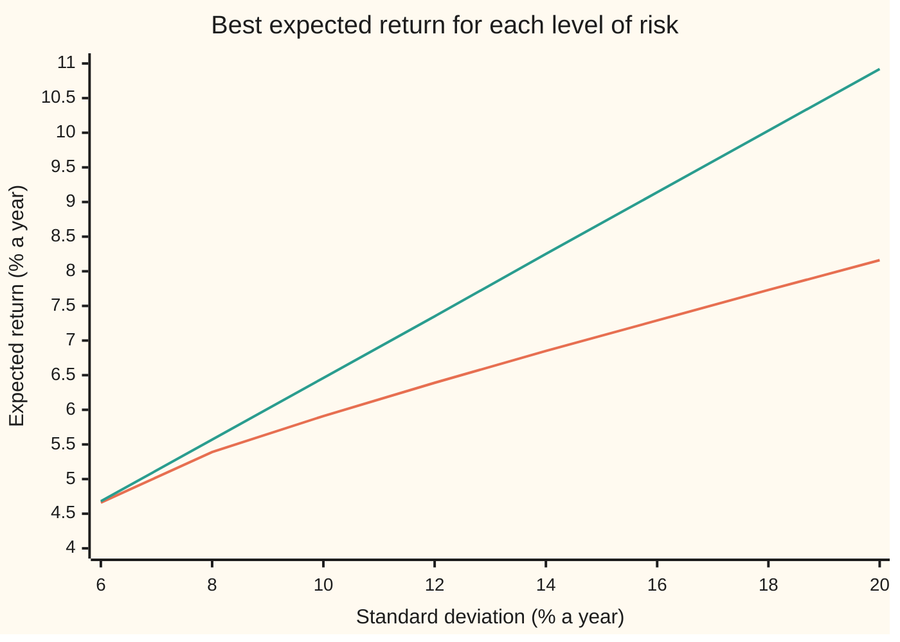

# Adding a riskless asset: the tangency portfolio and the line every investor sits on

[Syllabus](../../../SYLLABUS.md) → [Financial mathematics](../../../SYLLABUS.md#w12) → [Portfolio Theory](../../../SYLLABUS.md#w12-s37) → Adding a riskless asset

---

## General Overview

Three assets make up the market on this shelf. Shares are expected to return 8 percent a year, with a standard deviation of 20 percent: the typical size of a year's surprise. Bonds: 4 percent expected, 6 percent standard deviation. Gold: 5 percent expected, 15 percent standard deviation. Shares and bonds have correlation 0.2, shares and gold 0.1, bonds and gold 0. The previous card drew the efficient frontier of these three: the least risk for every expected return.

Now add a bank account that pays a sure 2 percent a year, and lets anyone borrow at the same 2 percent. Money in the bank carries no risk at all. Mixing it with any risky portfolio moves a saver in a straight line, from the bank's point towards that portfolio and beyond it.

One risky mix gives the steepest such line: 15.8 percent shares, 67.6 percent bonds, 16.6 percent gold. It earns 0.446 percentage points of expected return above the bank rate for every point of standard deviation. No other mix of the three does better. A cautious saver holds a little of it and keeps the rest in the bank. A bold one borrows to hold more. Neither changes the mix.

That mix is the **tangency portfolio**, the name used from here on, because its line just touches the frontier. The line itself is the **capital market line**. Its slope, extra return per unit of risk, is the **Sharpe ratio**, after William Sharpe.

**With a riskless asset, every investor who cares only about expected return and risk holds the same risky mix, the tangency portfolio, and chooses only how much of it to hold; every such choice sits on one straight line.**

**What kind of fact this is:** a theorem inside the mean-variance model (investors rank portfolios by expected return and standard deviation alone), proved on this card in Why it works; the model itself is an assumption, not a law.

### The picture: the line above the frontier



Orange, the lower curve: the efficient frontier of shares, bonds and gold alone. Green, the straight line: the capital market line, which starts at the bank's 2 percent with no risk (off the left of the chart) and rises 0.446 points for every point of standard deviation. The two meet at the tangency portfolio, at 6.27 percent standard deviation and 4.80 percent expected return; everywhere else the line sits above the curve. At 20 percent risk, the risk of holding only shares, the line offers 10.92 percent against the frontier's 8.16 percent and the shares' own 8 percent.

---

## The formula

Notation first, in words. A list of numbers is a vector: $\mu$ lists the three expected returns. The covariance matrix $\Sigma$ ("capital sigma") is the three-by-three table whose entry in row i, column j is the correlation of assets i and j times their two standard deviations; its diagonal holds each asset's variance. $\Sigma^{-1}$ is its inverse: $z = \Sigma^{-1} d$ means the list $z$ that solves $\Sigma z = d$, three linear equations in three unknowns. A dot between two lists, $d \cdot z$, means multiply matching entries and add. $r_f$ is the bank rate, 2 percent. $\mathbf{1}$ is the list of three ones, so $\mathbf{1}\cdot z$ is the sum of the entries of $z$. The tangency weights are $w_T$:

$$w_T = \frac{\Sigma^{-1}(\mu - r_f \mathbf{1})}{\mathbf{1}\cdot\Sigma^{-1}(\mu - r_f \mathbf{1})}$$

**Read it aloud:** solve the covariance equations with each asset's excess return on the right-hand side, then rescale the answer so its entries add to one.

For a portfolio p with expected return $\mu_p$ and standard deviation $\sigma_p$, the line every efficient investor sits on is

$$\mu_p = r_f + \sqrt{H}\,\sigma_p, \qquad H = d \cdot \Sigma^{-1} d, \qquad d = \mu - r_f\mathbf{1}.$$

**Read it aloud:** expected return equals the bank rate plus the best Sharpe ratio times the risk taken.

And the theorem that ties them, **two-fund separation**: every portfolio on the line is a fraction $y$ of wealth in the tangency portfolio and $1 - y$ in the bank.

| Symbol | Plain meaning | In our example | Push it up and the answer… |
| --- | --- | --- | --- |
| $\mu_i$, $\mu$ | expected one-year return of asset i; $\mu$ lists all three | 8%, 4%, 5% | that asset's weight in $w_T$ rises |
| $\sigma_i$, $\rho_{ij}$ | standard deviation of asset i; correlation of i and j | 20%, 6%, 15%; 0.2, 0.1, 0 | a riskier or more correlated asset gets less weight |
| $\Sigma$ | covariance matrix: entry $\rho_{ij}\sigma_i\sigma_j$ | diagonal 0.04, 0.0036, 0.0225 | the line flattens |
| $r_f$ | the riskless one-year return, lend or borrow | 2% | the tangency mix tilts to shares and the Sharpe ratio falls |
| $d$ | excess returns, $\mu - r_f\mathbf{1}$: what each asset pays above the bank | 6%, 2%, 3% | — |
| $z$ | the solution of $\Sigma z = d$: the best direction, before rescaling | 1.12, 4.81, 1.18 | — |
| $D$ | the sum of the entries of $z$; must be positive for a tangency portfolio to exist | 7.11 | — |
| $w_T$, $\mu_T$, $\sigma_T$ | tangency weights, $z/D$, adding to one; the tangency portfolio's expected return and standard deviation | 15.8%, 67.6%, 16.6%; 4.80%, 6.27% | — |
| $H$ | $d \cdot z$; its square root is the best Sharpe ratio | 0.199; root 0.446 | — |
| $y$, $\mu_p$, $\sigma_p$ | fraction of wealth in the tangency portfolio (above one means borrowing); the whole portfolio's expected return and standard deviation | cautious investor: 0.357, 3%, 2.24% | risk and expected excess return both rise in proportion to $y$ |
| $a$, $b$, $c$ | the frontier's constants, defined below the table | 323.27, 13.58, 0.6129 | — |
| $q$, $h$ | in the proofs: a target excess return; a position adding no excess return | 1% for the cautious investor | — |

The frontier's own constants appear once, in Step 5: $a = \mathbf{1}\cdot\Sigma^{-1}\mathbf{1}$, $b = \mathbf{1}\cdot\Sigma^{-1}\mu$, $c = \mu\cdot\Sigma^{-1}\mu$, the three numbers the previous card used to draw the frontier. Here $a$ = 323.27, $b$ = 13.58, $c$ = 0.6129, and the minimum-variance portfolio has expected return $b/a$ = 4.20 percent.

### When it holds

- **Borrowing and lending at one riskless rate.** If borrowing costs more, the line breaks at the tangency point and the best choices beyond it follow the curve. At 13.45 percent risk, levering the tangency mix at 4 percent expects 5.71 percent; the curve itself offers 6.72 percent; the line promised 8 percent.
- **One period, fixed weights, one horizon for every asset and the bank.** Over many periods, with rebalancing and changing rates, the problem changes shape.
- **Investors care only about expected return and standard deviation.** If they also care about crashes or lopsided outcomes, the best mix can differ between them.
- **No limits on positions.** Here every tangency weight is positive, so a ban on short selling (selling what one does not own) changes nothing; with other inputs it can.
- **The inputs are known.** In practice $\mu$ and $\Sigma$ are estimates, and small errors in $\mu$ move the weights a lot; see [Estimation error](07-estimation-error-and-shrinkage.md).
- **Existence:** $\Sigma$ has an inverse (no mix of the risky assets is riskless), and the bank rate sits below the minimum-variance portfolio's expected return, 4.20 percent here. Step 3 shows what happens otherwise.

---

## Why it works

### Step 0: the bank turns every portfolio into a straight line

Put a fraction $y$ of wealth in some risky portfolio P and the rest, $1 - y$, in the bank. The bank's return is certain, so it adds expected return but no risk:

$$\mu_p = r_f + y(\mu_P - r_f), \qquad \sigma_p = y\,\sigma_P \quad (y \ge 0).$$

Both grow in proportion to $y$. So the pairs (risk, expected return) reachable from P lie on a straight line starting at the bank, $(0, r_f)$, and passing through P. Below $y = 1$ the saver lends; above it the saver borrows.

The line's slope is $(\mu_P - r_f)/\sigma_P$: the Sharpe ratio of P. It does not depend on $y$. So choosing a risky portfolio and choosing how much of it to hold are separate decisions. The first is settled by one rule: pick the risky portfolio whose line is steepest. Every other line lies below it at every level of risk.

### Step 1: the steepest line comes from solving the covariance equations

Write a risky position as a list $x$ of amounts in each asset, as fractions of wealth. Its excess expected return is $d \cdot x$ and its variance is $x \cdot \Sigma x$. Its Sharpe ratio is

$$\frac{d \cdot x}{\sqrt{x \cdot \Sigma x}}.$$

Double every entry of $x$ and the top and bottom both double: the ratio is unchanged. So the requirement that weights add to one can be dropped while hunting for the best direction and restored afterwards.

The best direction is $z = \Sigma^{-1} d$, and the best ratio is $\sqrt{H} = \sqrt{d \cdot z}$. The reason, in words: split any position into a part along $z$ and a part that adds no excess return. The two parts are uncorrelated, because $\Sigma z = d$ turns their covariance into the second part's excess return, which is zero. So the second part adds variance and nothing else. Removing it can only raise the ratio.

<details>
<summary>Detailed proof: no direction beats z</summary>

Fix a target excess return $q > 0$. Any $x$ with $d \cdot x = q$ can be written $x = (q/H) z + h$, where $d \cdot h = 0$, because $d \cdot z = H$. Then
$$x \cdot \Sigma x = \frac{q^2}{H^2}\, z \cdot \Sigma z + \frac{2q}{H}\, z \cdot \Sigma h + h \cdot \Sigma h.$$
Since $\Sigma z = d$: the first term is $q^2 H / H^2 = q^2/H$, and the middle term is $(2q/H)(d \cdot h) = 0$. The covariance matrix gives every nonzero position a positive variance, so $h \cdot \Sigma h \ge 0$, with equality only when $h$ is zero. Hence $x \cdot \Sigma x \ge q^2/H$, which says the Sharpe ratio $q/\sqrt{x \cdot \Sigma x}$ is at most $\sqrt{H}$. Equality holds exactly when $x$ is a positive multiple of $z$. This is the Cauchy–Schwarz inequality, measured in the geometry the covariance matrix sets up.

</details>

### Step 2: rescale to a portfolio

A portfolio's weights add to one. Divide $z$ by the sum of its entries, $D$: $w_T = z/D$. For the house market $z$ is 1.12, 4.81, 1.18, their sum is 7.11, and the tangency weights are 15.8, 67.6 and 16.6 percent. Rescaling by a positive number keeps the Sharpe ratio at 0.446.

### Step 3: when a tangency portfolio exists

The division needs $D > 0$. The sum of the entries of $\Sigma^{-1}(\mu - r_f\mathbf{1})$ is $b - r_f a$, with $a$ and $b$ the frontier constants above. So $D > 0$ exactly when $r_f < b/a$: the bank rate is below the minimum-variance portfolio's expected return, 4.20 percent.

- **$r_f$ below 4.20 percent:** a unique tangency portfolio, with positive Sharpe ratio. This is the normal case.
- **$r_f$ equal to 4.20 percent:** $D = 0$. The best direction is a long-short position whose amounts add to zero; no fully invested portfolio lies on the line. The line is the frontier's asymptote: the upper branch approaches it and never touches it.
- **$r_f$ above 4.20 percent:** $D < 0$. Dividing by it flips the direction, and the "tangency" point lands on the frontier's lower branch, with a negative excess return. At 5 percent the checks give $D$ = −2.58 and an excess return of −2.44 percent. The best line then means going short that portfolio, which the formula alone does not say.

### Step 4: two-fund separation

Take any target expected return $\mu_p$ above the bank rate and ask for the least variance that reaches it, bank allowed. Step 1's proof already answered: the position is $x = (q/H)z$ with $q = \mu_p - r_f$. That is a multiple of $z$, so its risky part is in the proportions of $w_T$. The fraction held is $y = qD/H$ and the risk is $\sigma_p = q/\sqrt{H}$, exactly the capital market line.

So every efficient portfolio is made of two funds: the tangency portfolio and the bank. Investors differ only in $y$. James Tobin proved this in 1958; it is called **two-fund separation**, or Tobin separation.

### Step 5: why "tangency"

The tangency portfolio is fully invested in the three risky assets, so it lies in the region the previous card drew. It lies on the frontier: a fully invested mix with the same expected return and less variance would have a higher Sharpe ratio, which Step 1 rules out. And the line touches the frontier there without crossing it, because no risky portfolio lies above the steepest line.

On the frontier, variance at expected return $\mu_p$ is $(a \mu_p^2 - 2 b \mu_p + c)/(ac - b^2)$. The tangency point is at $\mu_p = (c - b\,r_f)/(b - a\,r_f)$, which gives 4.80 percent, and the frontier's slope there equals 0.446, the line's slope. The checks compute both from $a$, $b$ and $c$ alone, with no weights.

One step further: if every investor holds $w_T$ and the market must clear, $w_T$ must be the market portfolio itself. That turns this card into a statement about prices, which is [CAPM](04-capm-and-beta.md).

---

## Worked numbers, by hand

House market, bank rate $r_f$ = 2 percent.

| Step | Arithmetic | Value |
| --- | --- | --- |
| covariance of shares and bonds | 0.2 × 0.20 × 0.06 | 0.0024 |
| covariance of shares and gold | 0.1 × 0.20 × 0.15 | 0.0030 |
| excess returns $d$ | 8 − 2, 4 − 2, 5 − 2 | 6%, 2%, 3% |
| solve $\Sigma z = d$ | three equations, three unknowns | $z$ = 1.122807, 4.807018, 1.183626 |
| $D$ | 1.122807 + 4.807018 + 1.183626 | 7.113450 |
| tangency weights | each entry of $z$ divided by 7.113450 | **15.8%, 67.6%, 16.6%** |
| expected return $\mu_T$ | 0.157843 × 8 + 0.675765 × 4 + 0.166393 × 5 = 1.2627 + 2.7031 + 0.8320 | 4.80% |
| standard deviation $\sigma_T$ | square root of $w_T \cdot \Sigma w_T$ = 0.003933 | 6.27% |
| Sharpe ratio | (4.80 − 2) / 6.27 | **0.446** |
| second road: $H = d \cdot z$ | 0.067368 + 0.096140 + 0.035509 | 0.199018 |
| $\sqrt{H}$ | square root of 0.199018 | **0.446** |

The two roads never share a step after $z$: one goes through the weights, the other never forms them.

**Two investors, $10,000 each.** The cautious one wants 3 percent expected return: $y = (3 - 2)/(4.80 - 2)$ = 0.357. That is $564.17 in shares, $2,415.37 in bonds, $594.73 in gold and $6,425.72 in the bank, at 2.24 percent risk. The bold one wants 8 percent, the shares' own expected return: $y$ = 2.14. That is $3,385.05 in shares, $14,492.24 in bonds, $3,568.41 in gold, paid for by borrowing $11,445.70. The risk is 13.45 percent, against 20 percent for holding shares alone at the same expected return. Both hold shares, bonds and gold in the proportions 15.8 : 67.6 : 16.6.

What it means: in this market, the way to aim for 8 percent is not to buy shares; it is to borrow and buy the tangency mix, which gets there with about a third less risk.

Every portfolio's line, by Sharpe ratio:

```
Sharpe ratio: expected return above 2% per point of standard deviation (one block = 0.02)
shares        ███████████████         0.3000
bonds         █████████████████       0.3333
gold          ██████████              0.2000
equal thirds  ████████████████████    0.3967
min-variance  ████████████████████    0.3956
tangency      ██████████████████████  0.4461
```

Bonds have the best line of the three single assets, yet the tangency mix still holds shares and gold: their low correlation with bonds buys more return than it costs in risk.

### What breaks if you drop a piece

Each mistake builds a different risky fund, then levers it to the bold investor's 13.45 percent risk. The right answer is 8 percent.

| Mistake | Comes out at | What went wrong |
| --- | --- | --- |
| Solve $\Sigma z = \mu$, forgetting to subtract the bank rate | weights 9.0 / 75.8 / 15.2; Sharpe 0.4360; 7.86% | that is the tangency for a bank paying 0 percent, the wrong line's starting point |
| Use only the variances, ignoring correlations | weights 17.9 / 66.2 / 15.9; Sharpe 0.4454; 7.99% | small here because the correlations are small; the method is still wrong |
| Lever the minimum-variance portfolio instead | Sharpe 0.3956; 7.32% | least risk is not the best reward per unit of risk |
| Borrow at 4 percent, not 2 | 5.71% (the curve gives 6.72%) | the line is straight only if borrowing costs the lending rate |

---

## Code, from first principles, and it actually runs

The scripts build the covariance matrix, then reach the tangency portfolio and its Sharpe ratio by five roads: (1) solve $\Sigma z = d$ by elimination and rescale; (2) $\sqrt{d \cdot z}$, with no weights formed; (3) a zooming grid search that tries weights directly and keeps the best Sharpe ratio, with no linear algebra; (4) the frontier's constants $a$, $b$, $c$, giving the touching point and the frontier's slope there; (5) for two target returns, the least-variance position with the bank allowed, solved as a four-equation system, whose risky part must come out in the tangency proportions. Then the what-breaks funds, the try-changing rates, and every chart point. Both scripts write their own linear solver.

### Python

```python
# Tangency portfolio and capital market line: house market (shares, bonds, gold), riskless rate 2%.
# Roads: (1) solve Sigma z = d; (2) sqrt(d.z); (3) grid search on the Sharpe ratio;
# (4) frontier geometry from a, b, c; (5) least variance for a target return, bank allowed.
from math import sqrt

mu = [0.08, 0.04, 0.05]                      # expected one-year returns
sd = [0.20, 0.06, 0.15]                      # standard deviations
rho = [[1.0, 0.2, 0.1], [0.2, 1.0, 0.0], [0.1, 0.0, 1.0]]
rf = 0.02                                    # riskless one-year return
n = 3
S = [[rho[i][j] * sd[i] * sd[j] for j in range(n)] for i in range(n)]

def solve(A, b):                             # Gaussian elimination, partial pivoting
    m = len(b)
    M = [list(A[i]) + [b[i]] for i in range(m)]
    for c in range(m):
        p = max(range(c, m), key=lambda r: abs(M[r][c]))
        M[c], M[p] = M[p], M[c]
        for r in range(m):
            if r != c:
                f = M[r][c] / M[c][c]
                M[r] = [x - f * y for x, y in zip(M[r], M[c])]
    return [M[i][m] / M[i][i] for i in range(m)]

def dot(x, y):
    return sum(a * b for a, b in zip(x, y))

def stats(w, cov=S):                         # mean and standard deviation of a mix
    v = sum(w[i] * cov[i][j] * w[j] for i in range(n) for j in range(n))
    return dot(w, mu), sqrt(v)

def sharpe(w, r=rf):
    m, s = stats(w)
    return (m - r) / s

def tangency(r, cov=S, means=mu):            # w_T = Sigma^-1 d / (1' Sigma^-1 d)
    z = solve(cov, [x - r for x in means])
    t = sum(z)
    return [x / t for x in z], t, z

def row(label, vals, p=6):
    print(f"{label:<38}" + "".join(f"{v:>11.{p}f}" for v in vals))

# road 1: the formula
d = [x - rf for x in mu]
wT, D, z = tangency(rf)
mT, sT = stats(wT)
shT = (mT - rf) / sT
for i in range(n):
    row(f"covariance Sigma, row {i + 1}", S[i])
row("excess returns d = mu - rf", d)
row("road 1  z solving Sigma z = d", z)
row("        D = sum of z", [D])
row("        tangency weights w_T", wT)
row("        terms w_i mu_i", [w * m for w, m in zip(wT, mu)])
row("        mean, sd of w_T", [mT, sT])
row("        Sharpe (mu_T - rf)/sigma_T", [shT])
# road 2: Sharpe as a quadratic form, no weights
H = dot(d, z)
row("road 2  terms d_i z_i", [p * q for p, q in zip(d, z)])
row("        H = d . z, sqrt(H)", [H, sqrt(H)])
# road 3: zooming grid search over w1, w2 (w3 = 1 - w1 - w2)
c1, c2, half = 1.0 / 3.0, 1.0 / 3.0, 1.0
for _ in range(60):
    best = (-1e9, c1, c2)
    for i in range(-10, 11):
        for j in range(-10, 11):
            w1, w2 = c1 + half * i / 10.0, c2 + half * j / 10.0
            s = sharpe([w1, w2, 1.0 - w1 - w2])
            if s > best[0]:
                best = (s, w1, w2)
    _, c1, c2 = best
    half *= 0.5
wG = [c1, c2, 1.0 - c1 - c2]
row("road 3  grid-search weights", wG)
row("        grid-search Sharpe", [sharpe(wG)])
# road 4: the risky-only frontier, sigma^2 = (a m^2 - 2 b m + c) / (a c - b^2)
za, zb = solve(S, [1.0] * n), solve(S, mu)
a, b, c = sum(za), sum(zb), dot(mu, zb)
Dl = a * c - b * b
mF = (c - b * rf) / (b - a * rf)
sF = sqrt((a * mF * mF - 2 * b * mF + c) / Dl)
slope = Dl * sF / (a * mF - b)
row("road 4  a, b, c", [a, b, c])
row("        min-variance mean, sd", [b / a, 1.0 / sqrt(a)])
row("        mean where CML meets frontier", [mF])
row("        frontier slope at that point", [slope])
# road 5: least variance for a target return with the bank; two-fund separation
def kkt(target):                             # Sigma x = lam d, d.x = target - rf
    A = [S[i] + [-d[i]] for i in range(n)] + [d + [0.0]]
    x = solve(A, [0.0] * n + [target - rf])[:n]
    y = sum(x)
    return x, y, sqrt(sum(x[i] * S[i][j] * x[j] for i in range(n) for j in range(n)))
out = {}
for label, target in (("cautious 3%", 0.03), ("bold 8%", 0.08)):
    x, y, s = kkt(target)
    out[label] = (x, y, s, target)
    row(f"road 5  {label}: risky y, bank", [y, 1.0 - y])
    row(f"        {label}: mix x / y", [v / y for v in x])
    row(f"        {label}: sd, CML sd", [s, (target - rf) / sqrt(H)])
    row(f"        {label}: dollars of 10,000", [10000 * v for v in x] + [10000 * (1 - y)], 2)
# single assets and other mixes, by Sharpe
gmv = [v / a for v in za]
for name, w in (("shares", [1, 0, 0]), ("bonds", [0, 1, 0]), ("gold", [0, 0, 1]),
                ("equal thirds", [1 / 3] * 3), ("min-variance", gmv), ("tangency", wT)):
    row(f"Sharpe: {name}", [sharpe(w)], 4)
# what breaks: each wrong fund, levered to the bold investor's sd
w0 = tangency(0.0)[0]
wd = tangency(rf, [[S[i][j] if i == j else 0.0 for j in range(n)] for i in range(n)])[0]
yb, sb = out["bold 8%"][1], out["bold 8%"][2]
row("wrong: forgot rf, weights", w0)
row("wrong: no correlations, weights", wd)
for name, w in (("forgot rf", w0), ("no correlations", wd), ("min-variance fund", gmv)):
    row(f"wrong: {name}, Sharpe, mean", [sharpe(w), rf + sharpe(w) * sb])
row("wrong: borrow at 4%, bold mean", [yb * mT - (yb - 1) * 0.04])
fr4 = (b + sqrt(Dl * (a * sb * sb - 1))) / a    # borrowing dear: the curve itself is best at sd sb
row("borrow at 4%: frontier mean at bold sd", [fr4])
# try changing the riskless rate
for r in (0.01, 0.03):
    w, t, _ = tangency(r)
    row(f"try: rf = {r:.2f}, weights, Sharpe", w + [sharpe(w, r)], 4)
row("try: rf = 0.05, D, excess mean", [tangency(0.05)[1], dot(tangency(0.05)[0], mu) - 0.05])
# chart: upper frontier and CML, sd 6..20 percent
xs = [0.06, 0.08, 0.10, 0.12, 0.14, 0.16, 0.18, 0.20]
row("chart, sd %", [100 * s for s in xs], 2)
row("chart, frontier mean %", [100 * (b + sqrt(Dl * (a * s * s - 1))) / a for s in xs], 2)
row("chart, CML mean %", [100 * (rf + sqrt(H) * s) for s in xs], 2)

assert max(abs(p - q) for p, q in zip(wG, wT)) < 1e-6, "grid search must find the formula's weights"
assert abs(shT - sqrt(H)) < 1e-12, "Sharpe from weights vs quadratic form"
assert abs(mF - mT) < 1e-12 and abs(slope - shT) < 1e-9, "frontier touches the CML at w_T"
for x, y, s, tg in out.values():
    assert max(abs(v / y - t) for v, t in zip(x, wT)) < 1e-10, "every efficient mix holds w_T"
    assert abs(s - y * sT) < 1e-12 and abs(s - (tg - rf) / sqrt(H)) < 1e-12, "on the CML"
assert abs(D - (b - rf * a)) < 1e-12, "D from Sigma^-1 d vs b - rf a"
assert rf + sqrt(H) * sb > fr4 > yb * mT - (yb - 1) * 0.04, "CML above curve above levering at 4%"
assert tangency(0.05)[1] < 0 and dot(tangency(0.05)[0], mu) < 0.05, "rf above b/a: D < 0, lower branch"
assert [round(100 * v, 1) for v in wT] == [15.8, 67.6, 16.6] and round(sqrt(H), 3) == 0.446, "prose figures"
print("ALL CHECKS PASS")
```

**Ran 2026-09-28 on macOS, Python 3.14.6, standard library only. All checks passed. Output, pasted from the run:**

```
covariance Sigma, row 1                  0.040000   0.002400   0.003000
covariance Sigma, row 2                  0.002400   0.003600   0.000000
covariance Sigma, row 3                  0.003000   0.000000   0.022500
excess returns d = mu - rf               0.060000   0.020000   0.030000
road 1  z solving Sigma z = d            1.122807   4.807018   1.183626
        D = sum of z                     7.113450
        tangency weights w_T             0.157843   0.675765   0.166393
        terms w_i mu_i                   0.012627   0.027031   0.008320
        mean, sd of w_T                  0.047978   0.062714
        Sharpe (mu_T - rf)/sigma_T       0.446114
road 2  terms d_i z_i                    0.067368   0.096140   0.035509
        H = d . z, sqrt(H)               0.199018   0.446114
road 3  grid-search weights              0.157843   0.675765   0.166393
        grid-search Sharpe               0.446114
road 4  a, b, c                        323.274854  13.578947   0.612865
        min-variance mean, sd            0.042004   0.055618
        mean where CML meets frontier    0.047978
        frontier slope at that point     0.446114
road 5  cautious 3%: risky y, bank       0.357428   0.642572
        cautious 3%: mix x / y           0.157843   0.675765   0.166393
        cautious 3%: sd, CML sd          0.022416   0.022416
        cautious 3%: dollars of 10,000     564.17    2415.37     594.73    6425.72
road 5  bold 8%: risky y, bank           2.144570  -1.144570
        bold 8%: mix x / y               0.157843   0.675765   0.166393
        bold 8%: sd, CML sd              0.134495   0.134495
        bold 8%: dollars of 10,000        3385.05   14492.24    3568.41  -11445.70
Sharpe: shares                             0.3000
Sharpe: bonds                              0.3333
Sharpe: gold                               0.2000
Sharpe: equal thirds                       0.3967
Sharpe: min-variance                       0.3956
Sharpe: tangency                           0.4461
wrong: forgot rf, weights                0.090439   0.757967   0.151593
wrong: no correlations, weights          0.178808   0.662252   0.158940
wrong: forgot rf, Sharpe, mean           0.435950   0.078633
wrong: no correlations, Sharpe, mean     0.445350   0.079897
wrong: min-variance fund, Sharpe, mean   0.395635   0.073211
wrong: borrow at 4%, bold mean           0.057109
borrow at 4%: frontier mean at bold sd   0.067247
try: rf = 0.01, weights, Sharpe            0.1136     0.7297     0.1567     0.6112
try: rf = 0.03, weights, Sharpe            0.2758     0.5319     0.1923     0.2985
try: rf = 0.05, D, excess mean          -2.584795  -0.024434
chart, sd %                                  6.00       8.00      10.00      12.00      14.00      16.00      18.00      20.00
chart, frontier mean %                       4.66       5.39       5.91       6.39       6.85       7.29       7.73       8.16
chart, CML mean %                            4.68       5.57       6.46       7.35       8.25       9.14      10.03      10.92
ALL CHECKS PASS
```

### Rust

```rust
// Tangency portfolio and capital market line: house market (shares, bonds, gold), riskless rate 2%.
// Roads: (1) solve Sigma z = d; (2) sqrt(d.z); (3) grid search on the Sharpe ratio;
// (4) frontier geometry from a, b, c; (5) least variance for a target return, bank allowed.
const N: usize = 3;
const MU: [f64; N] = [0.08, 0.04, 0.05]; // expected one-year returns
const SD: [f64; N] = [0.20, 0.06, 0.15]; // standard deviations
const RHO: [[f64; N]; N] = [[1.0, 0.2, 0.1], [0.2, 1.0, 0.0], [0.1, 0.0, 1.0]];
const RF: f64 = 0.02; // riskless one-year return

// Gaussian elimination with partial pivoting
fn solve(a: &Vec<Vec<f64>>, b: &[f64]) -> Vec<f64> {
    let m = b.len();
    let mut mm: Vec<Vec<f64>> = (0..m).map(|i| { let mut r = a[i].clone(); r.push(b[i]); r }).collect();
    for c in 0..m {
        let mut p = c;
        for r in c + 1..m { if mm[r][c].abs() > mm[p][c].abs() { p = r; } }
        mm.swap(c, p);
        for r in 0..m {
            if r != c {
                let f = mm[r][c] / mm[c][c];
                let pivot = mm[c].clone();
                for k in 0..=m { mm[r][k] -= f * pivot[k]; }
            }
        }
    }
    (0..m).map(|i| mm[i][m] / mm[i][i]).collect()
}
fn dot(x: &[f64], y: &[f64]) -> f64 { x.iter().zip(y).fold(0.0, |s, (a, b)| s + a * b) }
fn quad(w: &[f64], cov: &Vec<Vec<f64>>) -> f64 {
    let mut v = 0.0;
    for i in 0..N { for j in 0..N { v += w[i] * cov[i][j] * w[j]; } }
    v
}
fn sharpe(w: &[f64], r: f64, s: &Vec<Vec<f64>>) -> f64 { (dot(w, &MU) - r) / quad(w, s).sqrt() }
// w_T = Sigma^-1 d / (1' Sigma^-1 d)
fn tangency(r: f64, cov: &Vec<Vec<f64>>) -> (Vec<f64>, f64, Vec<f64>) {
    let d: Vec<f64> = MU.iter().map(|x| x - r).collect();
    let z = solve(cov, &d);
    let t = z.iter().fold(0.0, |s, x| s + x);
    (z.iter().map(|x| x / t).collect(), t, z)
}
fn row(label: &str, vals: &[f64], p: usize) {
    let mut s = format!("{:<38}", label);
    for v in vals { s += &format!("{:>11.*}", p, v); }
    println!("{}", s);
}

fn main() {
    let s: Vec<Vec<f64>> = (0..N).map(|i| (0..N).map(|j| RHO[i][j] * SD[i] * SD[j]).collect()).collect();
    // road 1: the formula
    let d: Vec<f64> = MU.iter().map(|x| x - RF).collect();
    let (wt, dd, z) = tangency(RF, &s);
    let (mt, st) = (dot(&wt, &MU), quad(&wt, &s).sqrt());
    let sht = (mt - RF) / st;
    for i in 0..N { row(&format!("covariance Sigma, row {}", i + 1), &s[i], 6); }
    row("excess returns d = mu - rf", &d, 6);
    row("road 1  z solving Sigma z = d", &z, 6);
    row("        D = sum of z", &[dd], 6);
    row("        tangency weights w_T", &wt, 6);
    row("        terms w_i mu_i", &wt.iter().zip(&MU).map(|(w, m)| w * m).collect::<Vec<_>>(), 6);
    row("        mean, sd of w_T", &[mt, st], 6);
    row("        Sharpe (mu_T - rf)/sigma_T", &[sht], 6);
    // road 2: Sharpe as a quadratic form, no weights
    let h = dot(&d, &z);
    row("road 2  terms d_i z_i", &d.iter().zip(&z).map(|(p, q)| p * q).collect::<Vec<_>>(), 6);
    row("        H = d . z, sqrt(H)", &[h, h.sqrt()], 6);
    // road 3: zooming grid search over w1, w2 (w3 = 1 - w1 - w2)
    let (mut c1, mut c2, mut half) = (1.0 / 3.0, 1.0 / 3.0, 1.0);
    for _ in 0..60 {
        let mut best = (-1e9, c1, c2);
        for i in -10..=10 {
            for j in -10..=10 {
                let w1 = c1 + half * (i as f64) / 10.0;
                let w2 = c2 + half * (j as f64) / 10.0;
                let sh = sharpe(&[w1, w2, 1.0 - w1 - w2], RF, &s);
                if sh > best.0 { best = (sh, w1, w2); }
            }
        }
        c1 = best.1; c2 = best.2;
        half *= 0.5;
    }
    let wg = [c1, c2, 1.0 - c1 - c2];
    row("road 3  grid-search weights", &wg, 6);
    row("        grid-search Sharpe", &[sharpe(&wg, RF, &s)], 6);
    // road 4: the risky-only frontier, sigma^2 = (a m^2 - 2 b m + c) / (a c - b^2)
    let (za, zb) = (solve(&s, &[1.0; N]), solve(&s, &MU));
    let (a, b, c) = (za.iter().sum::<f64>(), zb.iter().sum::<f64>(), dot(&MU, &zb));
    let dl = a * c - b * b;
    let mf = (c - b * RF) / (b - a * RF);
    let sf = ((a * mf * mf - 2.0 * b * mf + c) / dl).sqrt();
    let slope = dl * sf / (a * mf - b);
    row("road 4  a, b, c", &[a, b, c], 6);
    row("        min-variance mean, sd", &[b / a, 1.0 / a.sqrt()], 6);
    row("        mean where CML meets frontier", &[mf], 6);
    row("        frontier slope at that point", &[slope], 6);
    // road 5: least variance for a target return with the bank; two-fund separation
    let mut outs: Vec<(Vec<f64>, f64, f64, f64)> = Vec::new();
    for (label, target) in [("cautious 3%", 0.03), ("bold 8%", 0.08)] {
        let mut a4: Vec<Vec<f64>> = (0..N).map(|i| { let mut r = s[i].clone(); r.push(-d[i]); r }).collect();
        let mut last = d.clone(); last.push(0.0); a4.push(last);
        let x: Vec<f64> = solve(&a4, &[0.0, 0.0, 0.0, target - RF])[..N].to_vec();
        let y: f64 = x.iter().sum();
        let sx = quad(&x, &s).sqrt();
        row(&format!("road 5  {}: risky y, bank", label), &[y, 1.0 - y], 6);
        row(&format!("        {}: mix x / y", label), &x.iter().map(|v| v / y).collect::<Vec<_>>(), 6);
        row(&format!("        {}: sd, CML sd", label), &[sx, (target - RF) / h.sqrt()], 6);
        let mut dol: Vec<f64> = x.iter().map(|v| 10000.0 * v).collect(); dol.push(10000.0 * (1.0 - y));
        row(&format!("        {}: dollars of 10,000", label), &dol, 2);
        outs.push((x, y, sx, target));
    }
    // single assets and other mixes, by Sharpe
    let gmv: Vec<f64> = za.iter().map(|v| v / a).collect();
    let third = 1.0 / 3.0;
    let mixes: [(&str, Vec<f64>); 6] = [("shares", vec![1.0, 0.0, 0.0]), ("bonds", vec![0.0, 1.0, 0.0]),
        ("gold", vec![0.0, 0.0, 1.0]), ("equal thirds", vec![third; 3]), ("min-variance", gmv.clone()), ("tangency", wt.clone())];
    for (name, w) in mixes.iter() { row(&format!("Sharpe: {}", name), &[sharpe(w, RF, &s)], 4); }
    // what breaks: each wrong fund, levered to the bold investor's sd
    let w0 = tangency(0.0, &s).0;
    let diag: Vec<Vec<f64>> = (0..N).map(|i| (0..N).map(|j| if i == j { s[i][j] } else { 0.0 }).collect()).collect();
    let wd = tangency(RF, &diag).0;
    let (yb, sb) = (outs[1].1, outs[1].2);
    row("wrong: forgot rf, weights", &w0, 6);
    row("wrong: no correlations, weights", &wd, 6);
    for (name, w) in [("forgot rf", &w0), ("no correlations", &wd), ("min-variance fund", &gmv)] {
        let sh = sharpe(w, RF, &s);
        row(&format!("wrong: {}, Sharpe, mean", name), &[sh, RF + sh * sb], 6);
    }
    row("wrong: borrow at 4%, bold mean", &[yb * mt - (yb - 1.0) * 0.04], 6);
    let fr4 = (b + (dl * (a * sb * sb - 1.0)).sqrt()) / a; // borrowing dear: the curve itself is best at sd sb
    row("borrow at 4%: frontier mean at bold sd", &[fr4], 6);
    // try changing the riskless rate
    for r in [0.01, 0.03] {
        let (mut w, _, _) = tangency(r, &s);
        let sh = sharpe(&w, r, &s);
        w.push(sh);
        row(&format!("try: rf = {:.2}, weights, Sharpe", r), &w, 4);
    }
    let (w5, d5, _) = tangency(0.05, &s);
    row("try: rf = 0.05, D, excess mean", &[d5, dot(&w5, &MU) - 0.05], 6);
    // chart: upper frontier and CML, sd 6..20 percent
    let xs = [0.06, 0.08, 0.10, 0.12, 0.14, 0.16, 0.18, 0.20];
    row("chart, sd %", &xs.iter().map(|x| 100.0 * x).collect::<Vec<_>>(), 2);
    row("chart, frontier mean %", &xs.iter().map(|x| 100.0 * (b + (dl * (a * x * x - 1.0)).sqrt()) / a).collect::<Vec<_>>(), 2);
    row("chart, CML mean %", &xs.iter().map(|x| 100.0 * (RF + h.sqrt() * x)).collect::<Vec<_>>(), 2);

    assert!(wg.iter().zip(&wt).all(|(p, q)| (p - q).abs() < 1e-6), "grid search must find the formula's weights");
    assert!((sht - h.sqrt()).abs() < 1e-12, "Sharpe from weights vs quadratic form");
    assert!((mf - mt).abs() < 1e-12 && (slope - sht).abs() < 1e-9, "frontier touches the CML at w_T");
    for (x, y, sx, tg) in &outs {
        assert!(x.iter().zip(&wt).all(|(v, t)| (v / y - t).abs() < 1e-10), "every efficient mix holds w_T");
        assert!((sx - y * st).abs() < 1e-12 && (sx - (tg - RF) / h.sqrt()).abs() < 1e-12, "on the CML");
    }
    assert!((dd - (b - RF * a)).abs() < 1e-12, "D from Sigma^-1 d vs b - rf a");
    let levered4 = yb * mt - (yb - 1.0) * 0.04;
    assert!(RF + h.sqrt() * sb > fr4 && fr4 > levered4, "CML above curve above levering at 4%");
    assert!(d5 < 0.0 && dot(&w5, &MU) < 0.05, "rf above b/a: D < 0, lower branch");
    let pct: Vec<f64> = wt.iter().map(|v| (1000.0 * v).round() / 10.0).collect();
    assert!(pct == vec![15.8, 67.6, 16.6] && (1000.0 * h.sqrt()).round() / 1000.0 == 0.446, "prose figures");
    println!("ALL CHECKS PASS");
}
```

**Ran 2026-09-28 on macOS, rustc 1.98.1, no crates. All checks passed. Output, pasted from the run:**

```
covariance Sigma, row 1                  0.040000   0.002400   0.003000
covariance Sigma, row 2                  0.002400   0.003600   0.000000
covariance Sigma, row 3                  0.003000   0.000000   0.022500
excess returns d = mu - rf               0.060000   0.020000   0.030000
road 1  z solving Sigma z = d            1.122807   4.807018   1.183626
        D = sum of z                     7.113450
        tangency weights w_T             0.157843   0.675765   0.166393
        terms w_i mu_i                   0.012627   0.027031   0.008320
        mean, sd of w_T                  0.047978   0.062714
        Sharpe (mu_T - rf)/sigma_T       0.446114
road 2  terms d_i z_i                    0.067368   0.096140   0.035509
        H = d . z, sqrt(H)               0.199018   0.446114
road 3  grid-search weights              0.157843   0.675765   0.166393
        grid-search Sharpe               0.446114
road 4  a, b, c                        323.274854  13.578947   0.612865
        min-variance mean, sd            0.042004   0.055618
        mean where CML meets frontier    0.047978
        frontier slope at that point     0.446114
road 5  cautious 3%: risky y, bank       0.357428   0.642572
        cautious 3%: mix x / y           0.157843   0.675765   0.166393
        cautious 3%: sd, CML sd          0.022416   0.022416
        cautious 3%: dollars of 10,000     564.17    2415.37     594.73    6425.72
road 5  bold 8%: risky y, bank           2.144570  -1.144570
        bold 8%: mix x / y               0.157843   0.675765   0.166393
        bold 8%: sd, CML sd              0.134495   0.134495
        bold 8%: dollars of 10,000        3385.05   14492.24    3568.41  -11445.70
Sharpe: shares                             0.3000
Sharpe: bonds                              0.3333
Sharpe: gold                               0.2000
Sharpe: equal thirds                       0.3967
Sharpe: min-variance                       0.3956
Sharpe: tangency                           0.4461
wrong: forgot rf, weights                0.090439   0.757967   0.151593
wrong: no correlations, weights          0.178808   0.662252   0.158940
wrong: forgot rf, Sharpe, mean           0.435950   0.078633
wrong: no correlations, Sharpe, mean     0.445350   0.079897
wrong: min-variance fund, Sharpe, mean   0.395635   0.073211
wrong: borrow at 4%, bold mean           0.057109
borrow at 4%: frontier mean at bold sd   0.067247
try: rf = 0.01, weights, Sharpe            0.1136     0.7297     0.1567     0.6112
try: rf = 0.03, weights, Sharpe            0.2758     0.5319     0.1923     0.2985
try: rf = 0.05, D, excess mean          -2.584795  -0.024434
chart, sd %                                  6.00       8.00      10.00      12.00      14.00      16.00      18.00      20.00
chart, frontier mean %                       4.66       5.39       5.91       6.39       6.85       7.29       7.73       8.16
chart, CML mean %                            4.68       5.57       6.46       7.35       8.25       9.14      10.03      10.92
ALL CHECKS PASS
```

The two outputs agree line for line.

> [!TIP]
> **Try changing**
> - **Lower the bank rate to 1 percent.** Guess first: more shares or fewer? The line starts lower, so the steepest one leans on the safest asset: weights 11.36 / 72.97 / 15.67, Sharpe 0.6112.
> - **Raise the bank rate to 3 percent.** The start point climbs towards the minimum-variance portfolio, and the touching point slides up the frontier: weights 27.58 / 53.19 / 19.23, Sharpe 0.2985.
> - **Raise it to 5 percent,** above the minimum-variance return of 4.20 percent. Guess first: what does the formula return? $D$ = −2.58, and the rescaled "tangency" has excess return −2.44 percent: a point on the frontier's lower branch, Step 3's third case.

---

## The usual mistake

> [!warning]
> **A bolder investor does not need a riskier mix.** The instinct is to hold more shares for more return. In this model the bold investor holds the same 15.8 / 67.6 / 16.6 mix as the cautious one and borrows to hold more of it. Tilting toward shares instead lands below the line: the shares alone give 8 percent at 20 percent risk, where the line gives 8 percent at 13.45 percent.
>
> - **Forgetting to subtract the bank rate.** $\Sigma^{-1}\mu$ rescaled is the tangency for a zero bank rate: weights 9.0 / 75.8 / 15.2, and 7.86 percent where 8 percent was on offer.
> - **Levering the minimum-variance portfolio.** The least-risk portfolio has Sharpe ratio 0.3956, not 0.4461; at 13.45 percent risk it expects 7.32 percent.
> - **Extending the line when borrowing costs more than lending.** Levering the tangency mix at 4 percent gives 5.71 percent, not 8; past the tangency point the best choices lie on the curve, 6.72 percent at that risk.
> - **Dividing by a negative $D$.** With the bank rate above 4.20 percent the formula still returns weights adding to one, but on the lower branch, with excess return −2.44 percent at a 5 percent bank rate.

---

## Where you meet it in real life

- **The Sharpe ratio.** Fund reports and manager rankings quote excess return per unit of standard deviation, the slope of this card's lines. Sharpe proposed it in 1966 as a measure of fund performance.
- **"How much in cash" advice.** Advice that fixes one diversified risky portfolio and varies only the cash or bond share by risk appetite is two-fund separation in plain form.
- **Leverage on a low-risk mix.** The tangency mix here is mostly bonds; reaching share-like returns means borrowing, the logic behind levered balanced funds: [Risk parity](08-risk-parity-and-alternative-weightings.md).
- **Index investing.** If everyone holds the tangency mix, it is the market portfolio, the argument behind [CAPM](04-capm-and-beta.md).
- **Portfolio construction desks.** The formula is fed estimated returns, so desks blend views with market-implied returns ([Black-Litterman](06-black-litterman.md)) or shrink the estimates ([Estimation error](07-estimation-error-and-shrinkage.md)).

> **Say it back**
> Mixing a risky portfolio with a riskless bank account moves along a straight line from the bank rate through that portfolio. The steepest such line is the best, and its slope is the Sharpe ratio. The portfolio that gives it, the tangency portfolio, solves the covariance equations with excess returns on the right, rescaled to add to one: 15.8 percent shares, 67.6 percent bonds, 16.6 percent gold here, with Sharpe ratio 0.446. Every efficient investor holds that one mix plus the bank, lending or borrowing to set the risk. It exists only while the bank rate is below the minimum-variance portfolio's expected return.

---

## What this builds on

- [The efficient frontier](02-efficient-frontier-and-minimum-variance.md): the frontier curve, the minimum-variance portfolio and the constants $a$, $b$, $c$ that the tangency line touches and uses. Behind it, [Two assets](01-two-asset-portfolio-risk-and-return.md) shows why correlation, not only each asset's risk, sets a mix's risk.

---

## Where this goes next

- [CAPM](04-capm-and-beta.md): if every investor holds the tangency mix, it is the market portfolio, and each asset's expected return is fixed by how it moves with the market.
- Later on this shelf, [Factor models](05-factor-models-and-apt.md) replaces the one market line with several sources of reward.

This card finds the best risky mix for given expected returns; the question it leaves open is what those expected returns must be, once everyone holds that mix, and [CAPM](04-capm-and-beta.md) answers it.

---

## Sources

Verified 2026-09-28: every link below resolves to the publisher's page.

- Harry Markowitz, "Portfolio Selection", *The Journal of Finance* 7(1), 77–91, 1952. [doi:10.1111/j.1540-6261.1952.tb01525.x](https://doi.org/10.1111/j.1540-6261.1952.tb01525.x). The mean-variance model and the frontier this card's line touches.
- James Tobin, "Liquidity Preference as Behavior Towards Risk", *The Review of Economic Studies* 25(2), 65–86, 1958. [doi:10.2307/2296205](https://doi.org/10.2307/2296205). Adds the riskless asset and proves the separation theorem.
- William F. Sharpe, "Capital Asset Prices: A Theory of Market Equilibrium under Conditions of Risk", *The Journal of Finance* 19(3), 425–442, 1964. [doi:10.1111/j.1540-6261.1964.tb02865.x](https://doi.org/10.1111/j.1540-6261.1964.tb02865.x). The capital market line and its step to market equilibrium.
- William F. Sharpe, "Mutual Fund Performance", *The Journal of Business* 39(1), part 2, 119–138, 1966. [doi:10.1086/294846](https://doi.org/10.1086/294846). The reward-to-variability ratio, now the Sharpe ratio.
- Robert C. Merton, "An Analytic Derivation of the Efficient Portfolio Frontier", *Journal of Financial and Quantitative Analysis* 7(4), 1851–1872, 1972. [doi:10.2307/2329621](https://doi.org/10.2307/2329621). The closed forms in $a$, $b$, $c$ used in Steps 3 and 5.
