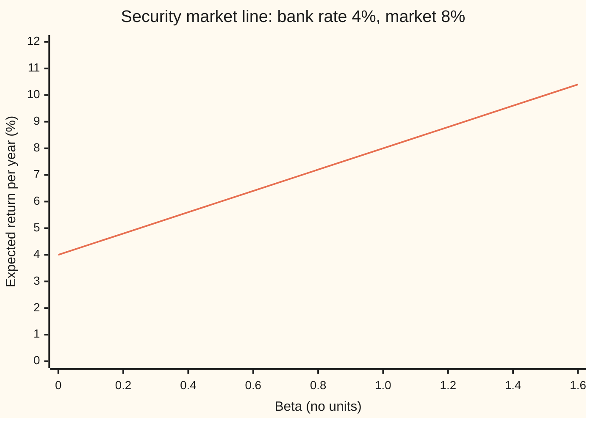
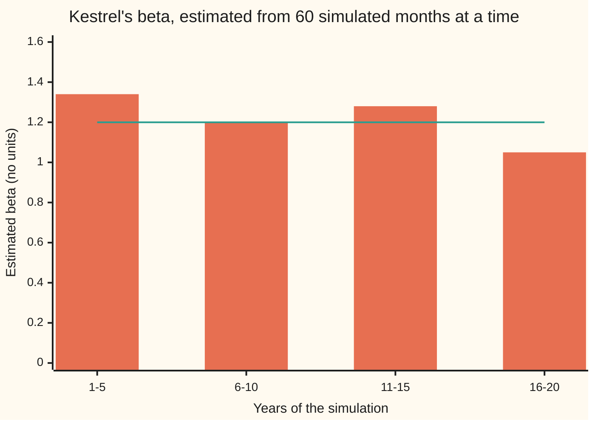

# CAPM: expected return as a reward for beta only

Financial mathematics → Portfolio Theory → Pricing market risk → CAPM

---

## General Overview

Kestrel Airlines is a share. When the whole stock market has a good year, Kestrel tends to have a better one: people fly more, fuel is cheap, planes are full. When the market has a bad year, Kestrel tends to have a worse one. Over many years, each one-point move in the market has come with roughly a 1.2-point move in Kestrel in the same direction.

A bank account pays 4 percent a year with no risk. Investors expect the market as a whole to return 8 percent. What return should they demand from Kestrel before they are willing to hold it?

The capital asset pricing model, CAPM from here on, gives a single number: **8.8 percent**. It takes the market's extra return over the bank, 4 points, and scales it by Kestrel's 1.2. The 1.2 is Kestrel's **beta**: how strongly its return moves with the market's. The 4 plus 4.8 is the answer.

The surprise is what the answer leaves out. Kestrel's total jumpiness does not appear. Two shares with the same beta must offer the same expected return, even if one is far more volatile than the other. The reason: the part of Kestrel's risk that has nothing to do with the market disappears when Kestrel sits inside a large portfolio. Nobody is paid for carrying risk that costs them nothing to shed.

This card derives that line from the tangency portfolio of the previous card, shows how to measure a beta from past returns by fitting a straight line, and reads the line's intercept, **alpha**: the return a share earned beyond what its beta explains.

**In equilibrium (prices settled so that every share is willingly held), every asset's expected return above the bank rate equals its beta times the market's expected return above the bank rate; risk that does not move with the market earns nothing.**

**What kind of fact this is:** a model: an equilibrium built on strong assumptions about investors, which fits real markets only roughly. Inside the model, the security market line is a theorem, proved on this card in Why it works. Beta is a definition; alpha is a measurement.

### The picture: the security market line

The line runs from the bank rate at beta 0 to the market's 8 percent at beta 1, and keeps going.



One line: the security market line. Beta 0 is the bank at 4.00 percent. Beta 0.8 is Oakridge Foods at 7.20. Beta 1.0 is the market at 8.00. Beta 1.2 is Kestrel at 8.80. Pinecrest Mining, beta 1.1, sits between the last two at 8.40.

---

## The formula

Notation first, in words. A **return** is the fractional gain over a period, dividends included. The letter $E$ before a bracket means **expected value**: the probability-weighted average. **Covariance**, written Cov, measures how two returns move together; **variance**, written Var, is a return's covariance with itself, its spread around its average. Subscript $i$ names one share; subscript $M$ names the market.

$$E[R_i] = r_f + \beta_i\,\big(E[R_M] - r_f\big), \qquad \beta_i = \frac{\operatorname{Cov}(R_i, R_M)}{\operatorname{Var}(R_M)}$$

**Read it aloud:** a share's expected return is the bank rate plus its beta times the market's expected return above the bank rate; its beta is how much it moves with the market, divided by how much the market moves on its own.

| Symbol | Plain meaning | In our example | Push it up and the answer… |
| --- | --- | --- | --- |
| $r_f$ | the **risk-free rate**: what a bank deposit pays over the period | 4% | with the market's return held fixed: rises if beta is below 1, falls if above |
| $R_i$, $E[R_i]$, $\mu$, $i$, $j$ | share $i$'s return, and its expected value; $\mu$ lists every share's; $i$, $j$ name shares | Kestrel, 8.8% | — |
| $R_M$, $E[R_M]$, $M$, $T$ | the market portfolio's return, and its expected value; $T$ marks the tangency mix, which equilibrium makes equal to $M$ | 8% | rises for every share with positive beta |
| $E[R_M] - r_f$ | the **market premium**: the market's reward over the bank | 4 points | rises in proportion to beta |
| $\beta_i$, $\beta$ | **beta**: the share's movement with the market, per unit of market movement | Kestrel 1.2 | rises 4 points per unit of beta |
| $\operatorname{Cov}(R_i, R_M)$, $\Sigma$ | covariance of the share with the market; $\Sigma$ is the table of all covariances between shares | 480 (squared percent) | raises beta |
| $\operatorname{Var}(R_M)$, $\sigma_M$ | the market's variance, and its **volatility** (the square root) | 400 (squared percent), 20% | lowers every beta |
| $\sigma_i$ | a share's own volatility | Kestrel 30% | nothing, while beta is held fixed |
| $w_i$, $w$, $w_T$, $W_k$, $k$ | the market's weight in share $i$: its fraction of all money invested; $w$ any mix, $w_T$ the tangency mix; $W_k$ investor $k$'s wealth | 20, 40, 40% | — |
| $\lambda$, $h$ | reward per unit of covariance with the market; $h$ a small sum moved into one share | 1 in decimals | — |
| $\alpha_i$, $\varepsilon_i$ | **alpha**: return beyond what beta explains; $\varepsilon_i$ is the leftover wobble | CAPM says alpha is 0 | — |
| $x_t$, $y_t$, $n$, $t$ | market and share returns above the bank rate in period $t$; $n$ periods | four quarters | more periods, tighter beta |

Two helper facts follow from the definitions. The market's own beta is 1, since its covariance with itself is its variance. And a bank deposit has beta 0, since a fixed return does not move with anything.

### When it holds

- **Everyone sees the same means, volatilities and correlations for the same single period.** If investors disagree, each holds a different tangency portfolio, none of them need be the market, and the line can tilt or blur.
- **Everyone can borrow and lend without limit at one bank rate.** If borrowing costs more than lending, the line starts above the bank rate and is flatter than the model says, which is close to what data show.
- **Investors care only about mean and variance of one period's return.** If they also fear crashes, or care about their jobs or future rates, other risks earn a premium and the one-factor line misses them.
- **The market means everything that can be owned.** A stock index leaves out property, private firms and people's earnings; a beta against an index is a beta against a stand-in.
- **No taxes, fees or short-selling limits.** With frictions, a share can sit off the line by less than the cost of trading it back.

---

## Why it works

### Step 0: diversified investors only feel the part of a risk that moves with their portfolio

An investor who holds a broad portfolio and adds a sliver of Kestrel does not take on Kestrel's full 30 percent volatility. Most of Kestrel's private wobble (a strike, a grounded fleet) cancels against the private wobbles of hundreds of other shares. What remains is the part that moves with the portfolio already held. So the price of a share should depend on its covariance with that portfolio, not on its own variance. The rest of the derivation makes that exact, in three moves: the tangency condition, market clearing, and one substitution.

### Step 1: at the tangency portfolio, every share pays the same reward per unit of covariance

The previous card ([tangency-portfolio-and-the-capital-market-line](03-tangency-portfolio-and-the-capital-market-line.md)) finds the risky mix $T$ with the highest **Sharpe ratio**: expected return above the bank rate, divided by volatility. Every investor holds that mix plus a bank account.

Take a tiny amount $h$ of money out of the bank and put it into share $i$, on top of the tangency mix. The portfolio's expected return rises by $h$ times share $i$'s excess return, $E[R_i] - r_f$. Its variance rises by $2h$ times $\operatorname{Cov}(R_i, R_T)$, to first order in $h$.

So each share offers a rate of exchange: extra expected return per extra variance. Suppose share A offered a better rate than share B. Add a sliver of A, remove enough B to leave the variance unchanged, and settle the difference with the bank. Expected return rises, and so does the Sharpe ratio. The tangency mix has the highest Sharpe ratio, so no such move can help. Every share must offer the same rate:

$$E[R_i] - r_f = \lambda\,\operatorname{Cov}(R_i, R_T) \quad \text{for every share } i,$$

with one constant $\lambda$ shared by all.

### Step 2: the constant is fixed by the tangency mix itself

The tangency mix is a weighted sum of shares, so the condition holds for it too, with its covariance with itself being its variance: $E[R_T] - r_f = \lambda \operatorname{Var}(R_T)$. Divide:

$$\lambda = \frac{E[R_T] - r_f}{\operatorname{Var}(R_T)}.$$

Put that back into Step 1:

$$E[R_i] - r_f = \frac{\operatorname{Cov}(R_i, R_T)}{\operatorname{Var}(R_T)}\,\big(E[R_T] - r_f\big).$$

The fraction is a beta against the tangency mix. Nothing so far used equilibrium: this is true of any single investor's best mix.

### Step 3: market clearing makes the tangency mix the market

If every investor holds the same risky mix, only in different amounts, then adding up all their holdings gives that mix again, scaled up. But the sum of all holdings is everything there is to own: the market. So the tangency mix has the market's weights, $T = M$, and the formula becomes the security market line.

For the economy on this card: the market holds 20 percent Kestrel, 40 percent Oakridge, 40 percent Pinecrest. With the returns the line assigns, 8.8, 7.2 and 8.4 percent, the tangency mix solved from scratch comes out at exactly 20, 40 and 40. The market is the best mix, as the argument requires.

<details>
<summary>Detailed proof: the tangency condition with covariance matrices</summary>

Write $\mu$ for the list of expected returns, $\Sigma$ for the covariance matrix (row $i$, column $j$ holds $\operatorname{Cov}(R_i, R_j)$), assumed invertible, and $\mathbf 1$ for a list of ones. A mix $w$ with weights summing to 1 has excess return $w^\top(\mu - r_f \mathbf 1)$ and variance $w^\top \Sigma w$. Maximising the Sharpe ratio, the gradient of $\ln$ of the ratio is $(\mu - r_f\mathbf 1)/(w^\top(\mu - r_f\mathbf 1)) - \Sigma w/(w^\top\Sigma w)$, and setting it to zero gives $\mu - r_f\mathbf 1 = \lambda\,\Sigma w_T$ with $\lambda = w_T^\top(\mu - r_f\mathbf 1)/(w_T^\top \Sigma w_T)$. Row $i$ of $\Sigma w_T$ is $\operatorname{Cov}(R_i, R_T)$, which is Step 1; multiplying on the left by $w_T^\top$ is Step 2. The ratio is unchanged when $w$ is scaled, so the solution is $w_T = \Sigma^{-1}(\mu - r_f\mathbf 1)$ divided by the sum of its entries, which needs that sum to be positive.

For market clearing, investor $k$ with wealth $W_k$ puts a fraction $c_k \ge 0$ of it into $w_T$. Total money in each share is $(\sum_k c_k W_k)\,w_T$. Setting this equal to the total value of each share outstanding, and dividing by the total, gives $w_T = w_M$. The step needs every investor to see the same $\mu$ and $\Sigma$ and the same $r_f$; it does not show that such prices exist, only what they must satisfy if they do.

</details>

### Step 4: only beta is paid, and here is where the rest of the risk went

Split Kestrel's return into a piece that moves with the market and a leftover:

$$R_i - r_f = \alpha_i + \beta_i\,(R_M - r_f) + \varepsilon_i,$$

where the leftover $\varepsilon_i$ averages zero and has zero covariance with the market. Variances then add:

$$\sigma_i^2 = \beta_i^2\,\sigma_M^2 + \operatorname{Var}(\varepsilon_i).$$

For Kestrel: 900 = 1.44 × 400 + 324, so 30 percent total volatility is 24 percent from the market and 18 percent private, combined as squares. The line pays for the first part only, and says $\alpha_i = 0$.

Pinecrest has less total volatility than Kestrel, 25 percent against 30, and less beta, 1.1 against 1.2. Oakridge has the lowest total volatility, 20 percent, and the lowest beta. Their private volatilities are 18, 12 and 11.87 percent. None of that private part changes the expected return.

<details>
<summary>Why the private part cannot earn a premium</summary>

Suppose Kestrel's private wobble did earn extra return. An investor could hold Kestrel and short-sell (borrow and sell) the market in the ratio 1.2 to 1: the market-driven part cancels, leaving 18 percent private volatility and the extra return. Hold a hundred such positions on different shares and their private wobbles, being unrelated, shrink the portfolio's volatility by a factor of ten, while the extra return stays. That is close to free money. Its pursuit bids the shares up until the extra return is gone. Stephen Ross turned this argument into a pricing theory of its own: [factor-models-and-apt](05-factor-models-and-apt.md).

</details>

### Step 5: estimating beta is fitting a straight line

Nobody observes a covariance directly. From $n$ past periods, record the market's return above the bank rate, $x_t$, and the share's, $y_t$. Fit the line $y = a + b\,x$ that makes the sum of squared misses smallest ([least-squares-regression](../../09-Probability%20and%20statistics/09-Regression/01-least-squares-regression.md)). With $\bar x$ and $\bar y$ the averages:

$$\hat\beta = \frac{\sum_t (x_t - \bar x)(y_t - \bar y)}{\sum_t (x_t - \bar x)^2}, \qquad \hat\alpha = \bar y - \hat\beta\,\bar x.$$

The hats mean "estimated from data". The slope is the sample covariance over the sample variance: the definition of beta, applied to the data. The intercept is the estimated alpha. The fit is on returns *above the bank rate* for both series; otherwise the intercept mixes in a piece of the bank rate. The market's returns must vary: if every $x_t$ is equal, the bottom sum is 0 and no slope exists.

An alpha is only as good as the data behind it. Its standard error (the typical size of its estimation error) depends on the leftover volatility and on how many periods there are, and for a single share it is large: several percentage points a year from twenty years of monthly data, as the code shows.

---

## Worked numbers, by hand

The economy: Kestrel, Oakridge and Pinecrest with volatilities 30, 20 and 25 percent; correlations 0.5 between Kestrel and Oakridge, 0.6 between Kestrel and Pinecrest, 0.5 between Oakridge and Pinecrest; market weights 20, 40, 40 percent; bank rate 4 percent; market premium 4 points. Covariances in squared percent: a correlation times two volatilities, so Kestrel with Oakridge is 0.5 × 30 × 20 = 300.

| Step | Arithmetic | Value |
| --- | --- | --- |
| Kestrel's covariance with the market | 0.2 × 900 + 0.4 × 300 + 0.4 × 450 | 480 (squared percent) |
| Oakridge's | 0.2 × 300 + 0.4 × 400 + 0.4 × 250 | 320 |
| Pinecrest's | 0.2 × 450 + 0.4 × 250 + 0.4 × 625 | 440 |
| market variance | 0.2 × 480 + 0.4 × 320 + 0.4 × 440 | 400, so volatility 20% |
| Kestrel's beta | 480 / 400 | 1.2 |
| Kestrel's premium | 1.2 × (8 − 4) | 4.8 points |
| **Kestrel's expected return** | 4 + 4.8 | **8.8%** |
| Oakridge, Pinecrest | 4 + 0.8 × 4, 4 + 1.1 × 4 | 7.2%, 8.4% |
| the market, weighted | 0.2 × 8.8 + 0.4 × 7.2 + 0.4 × 8.4 | 8.0% |
| reward per unit covariance, Kestrel | 0.048 / 0.048 (decimals) | 1, the same for all three |

So Kestrel's investors should expect 8.8 percent a year: 4 for waiting, 4.8 for carrying 1.2 units of market risk. The weighted average of the three shares lands back on the market's 8 percent, as it must.

### Reading beta and alpha from four quarters

Four quarters of returns above the bank rate, in percent: the market, $x_t$ = −2, −1, 1, 2; Kestrel, $y_t$ = −0.9, −2.7, 3.7, 1.9.

| Step | Arithmetic | Value |
| --- | --- | --- |
| averages | $\bar x$ = 0, $\bar y$ = 2 / 4 | 0 and 0.5 |
| spread of the market | 4 + 1 + 1 + 4 | 10 |
| joint spread | (−2)(−1.4) + (−1)(−3.2) + (1)(3.2) + (2)(1.4) | 12 |
| **fitted beta** | 12 / 10 | **1.2** |
| **fitted alpha** | 0.5 − 1.2 × 0 | **0.5 points a quarter** |

Kestrel beat its beta by half a point a quarter in this sample. Four points cannot tell skill from luck: the misses around the line are 1, −2, 2 and −1 points, far larger than 0.5.

### What breaks if you drop a piece

Same Kestrel, correct answer 8.8 percent, beta 1.2, alpha 0.5.

| Mistake | Comes out at | What went wrong |
| --- | --- | --- |
| Use total volatility: 4 + (30 / 20) × 4 | 10.0% | That is the capital market line, for efficient portfolios only; it charges Kestrel for 18 points of private risk nobody needs to hold |
| Use the correlation with the market, 0.8, as beta | 7.2% | Correlation ignores that Kestrel is 1.5 times as volatile as the market; beta is correlation times that ratio |
| Beta times the market's whole return, 1.2 × 8 | 9.6% | Beta scales the premium only; the bank rate is paid once, not multiplied |
| Covariance divided by n − 1, variance by n | beta 1.6 | The two halves of beta must use the same divisor; 1.2 × 4 / 3 |
| Regress raw returns, bank rate 1% a quarter | alpha 0.30 | The slope survives, the intercept absorbs 1 × (1 − 1.2) and is wrong by 0.2 points |

---

## Code, from first principles, and it actually runs

The scripts build the economy from volatilities, correlations and market weights, and reach the card's claims four ways. Road 1: beta as covariance over variance, then the security market line. Road 2: hand those expected returns to a portfolio optimiser, which solves the tangency condition by Gaussian elimination and must return the market's weights. Road 3: no algebra at all; try every mix of the three shares in 1 percent steps and keep the highest Sharpe ratio. Road 4: simulate twenty years of monthly returns from the same economy, with home-made random numbers, and estimate Kestrel's beta by least squares. The four quarters are fitted twice, by the formula and by searching directly for the slope with the smallest squared error. Every what-breaks number is reproduced.

### Python

```python
# CAPM and beta -- the check behind the card.  Standard library only.
# Nothing imported knows the answer: the linear solver, the random numbers,
# the bell-curve draws and the least-squares fits are all written out here.
from math import sqrt, log, cos, pi

vol = [0.30, 0.20, 0.25]                          # Kestrel, Oakridge, Pinecrest: yearly volatility
rho = [[1.0, 0.5, 0.6], [0.5, 1.0, 0.5], [0.6, 0.5, 1.0]]   # correlations between them
w_mkt = [0.2, 0.4, 0.4]                           # the market: share of all money in each
rf, prem = 0.04, 0.04                             # bank rate, and market premium E[R_M] - rf
C = [[rho[i][j] * vol[i] * vol[j] for j in range(3)] for i in range(3)]

def dot(a, b): return sum(x * y for x, y in zip(a, b))
def matvec(A, v): return [dot(row, v) for row in A]
def pct(x): return f"{100 * x:10.4f}"

# ---- road 1: beta = covariance with the market / variance of the market, then the SML ----
cov_iM = matvec(C, w_mkt)
var_M = dot(w_mkt, cov_iM)
beta = [c / var_M for c in cov_iM]
mu = [rf + b * prem for b in beta]                # the security market line
def left_over(i):                                 # variance of (share minus beta x market)
    a = [(1.0 if j == i else 0.0) - beta[i] * w_mkt[j] for j in range(3)]
    return sqrt(dot(a, matvec(C, a)))
resid = [left_over(i) for i in range(3)]

# ---- road 2: hand those returns to an optimiser; the best mix must be the market itself ----
def solve(A, b):                                  # Gaussian elimination with row swaps
    n = len(b); M = [A[i][:] + [b[i]] for i in range(n)]
    for k in range(n):
        p = max(range(k, n), key=lambda r: abs(M[r][k])); M[k], M[p] = M[p], M[k]
        for r in range(k + 1, n):
            f = M[r][k] / M[k][k]
            M[r] = [x - f * y for x, y in zip(M[r], M[k])]
    x = [0.0] * n
    for k in range(n - 1, -1, -1):
        x[k] = (M[k][n] - dot(M[k][k + 1:n], x[k + 1:])) / M[k][k]
    return x
def tangency(m):
    u = solve(C, [x - rf for x in m]); s = sum(u)
    return [x / s for x in u]
def sharpe(w, m): return (dot(w, m) - rf) / sqrt(dot(w, matvec(C, w)))
w_tan = tangency(mu)
# ---- road 3: no algebra at all, try every mix in 1% steps and keep the best Sharpe ratio ----
grid = [(a / 100, b / 100, (100 - a - b) / 100) for a in range(101) for b in range(101 - a)]
w_grid = max(grid, key=lambda w: sharpe(w, mu))
mu_bad = [0.10, mu[1], mu[2]]                     # Kestrel priced to earn 10%, not 8.8%
w_bad = tangency(mu_bad)
lam = [(mu[i] - rf) / cov_iM[i] for i in range(3)]   # tangency condition: equal for every share

# ---- least squares on excess returns: slope = beta, intercept = alpha ----
def fit(x, y):
    n = len(x); xb = sum(x) / n; yb = sum(y) / n
    sxx = sum((a - xb) ** 2 for a in x); sxy = sum((a - xb) * (b - yb) for a, b in zip(x, y))
    b = sxy / sxx; a = yb - b * xb
    s2 = sum((v - a - b * u) ** 2 for u, v in zip(x, y)) / (n - 2)
    return a, b, sqrt(s2 / sxx), sqrt(s2 * (1 / n + xb * xb / sxx)), sxx, sxy
qx = [-2.0, -1.0, 1.0, 2.0]                       # four quarters, market excess return, %
qy = [-0.9, -2.7, 3.7, 1.9]                       # Kestrel excess return, same quarters, %
qa, qb, _, _, sxx, sxy = fit(qx, qy)
def sse(b):                                       # second road: search the slope directly
    a = sum(qy) / 4 - b * sum(qx) / 4
    return sum((v - a - b * u) ** 2 for u, v in zip(qx, qy))
lo, hi = -5.0, 5.0
for _ in range(200):
    m1, m2 = lo + (hi - lo) / 3, hi - (hi - lo) / 3
    if sse(m1) < sse(m2): hi = m2
    else: lo = m1
qb_search = (lo + hi) / 2
mixed = (sxy / 3) / (sxx / 4)                     # covariance over n-1, variance over n
ra, rb, _, _, _, _ = fit([v + 1 for v in qx], [v + 1 for v in qy])   # forgot the 1% bank rate

# ---- road 4: simulate 20 years of months from this market, estimate beta by regression ----
MASK = (1 << 64) - 1; state = 0x9E3779B97F4A7C15
def uniform():                                    # xorshift64*, top 53 bits
    global state
    state ^= state >> 12; state ^= (state << 25) & MASK; state ^= state >> 27
    return (((state * 0x2545F4914F6CDD1D) & MASK) >> 11) / 2.0 ** 53
def normal(): return sqrt(-2.0 * log(1.0 - uniform())) * cos(2.0 * pi * uniform())
Cm = [[c / 12 for c in row] for row in C]         # one month's covariance
L = [[0.0] * 3 for _ in range(3)]                 # Cholesky: L times L-transpose = Cm
for i in range(3):
    for j in range(i + 1):
        s = Cm[i][j] - sum(L[i][k] * L[j][k] for k in range(j))
        L[i][j] = sqrt(s) if i == j else s / L[j][j]
xs, ys = [], []
for t in range(240):
    z = [normal() for _ in range(3)]
    R = [mu[i] / 12 + dot(L[i], z) for i in range(3)]
    xs.append(dot(w_mkt, R) - rf / 12); ys.append(R[0] - rf / 12)
sa, sb, sb_se, sa_se, _, _ = fit(xs, ys)
windows = [fit(xs[k:k + 60], ys[k:k + 60])[1] for k in range(0, 240, 60)]

K3 = " (K, O, P)"
rows = [("covariances K-K, K-O, K-P, %^2", [1e4 * C[0][j] for j in range(3)]),
        ("covariances O-O, O-P, P-P, %^2", [1e4 * C[1][1], 1e4 * C[1][2], 1e4 * C[2][2]]),
        ("cov with market, %^2" + K3, [1e4 * c for c in cov_iM]),
        ("market variance %^2, volatility %", [1e4 * var_M, 100 * sqrt(var_M)]),
        ("beta" + K3, beta), ("SML expected return, %" + K3, [100 * m for m in mu]),
        ("Kestrel premium, market return, %", [100 * beta[0] * prem, 100 * dot(w_mkt, mu)]),
        ("Kestrel var split: market, private", [1e4 * beta[0] ** 2 * var_M, 1e4 * resid[0] ** 2]),
        ("Kestrel market-part vol, corr", [100 * beta[0] * sqrt(var_M), cov_iM[0] / (vol[0] * sqrt(var_M))]),
        ("private volatility, %" + K3, [100 * r for r in resid]),
        ("excess per unit vol" + K3, [(mu[i] - rf) / vol[i] for i in range(3)]),
        ("excess / cov with market" + K3, lam),
        ("tangency by solve, %" + K3, [100 * x for x in w_tan]),
        ("tangency by grid, %" + K3, [100 * x for x in w_grid]),
        ("market Sharpe ratio", [sharpe(w_mkt, mu)]),
        ("if Kestrel paid 10%, %" + K3, [100 * x for x in w_bad]),
        ("quarters: mean x, mean y", [sum(qx) / 4, sum(qy) / 4]), ("quarters: Sxx, Sxy", [sxx, sxy]),
        ("quarters: beta, formula and search", [qb, qb_search]), ("quarters: alpha per quarter, %", [qa]),
        ("wrong: CML, total vol for Kestrel, %", [100 * (rf + vol[0] / sqrt(var_M) * prem)]),
        ("wrong: correlation for beta, %", [100 * (rf + cov_iM[0] / (vol[0] * sqrt(var_M)) * prem)]),
        ("wrong: beta x market return, %", [100 * beta[0] * (rf + prem)]),
        ("wrong: cov over n-1, var over n", [mixed]), ("wrong: raw returns, alpha % and beta", [ra, rb]),
        ("sim 240 months: beta, std error", [sb, sb_se]),
        ("sim: alpha per year %, std error", [1200 * sa, 1200 * sa_se]),
        ("sim: beta by 5-year window", windows),
        ("try: premium 6%, Kestrel %", [100 * (rf + beta[0] * 0.06)]),
        ("try: rf 2%, market 8%, Kestrel %", [100 * (0.02 + beta[0] * 0.06)]),
        ("try: beta -0.5, %", [100 * (rf - 0.5 * prem)])]
for name, v in rows:
    print(f"{name:<40}" + "".join(f"{x:10.4f}" for x in v))
print("chart, SML at beta 0.0 to 1.6:" + "".join(f"{100 * (rf + b / 5 * prem):6.2f}" for b in range(9)))

assert abs(mu[0] - 0.088) < 1e-12, "Kestrel on the SML: 8.8%"
assert max(abs(a - b) for a, b in zip(w_tan, w_mkt)) < 1e-12, "solved tangency = market"
assert max(abs(a - b) for a, b in zip(w_grid, w_mkt)) < 1e-9, "grid search finds the market"
assert abs(qb - qb_search) < 1e-6, "two roads to the fitted slope"
assert max(lam) - min(lam) < 1e-12, "same reward per unit covariance for every share"
assert abs(ra - (qa + 1.0 * (1 - rb))) < 1e-12, "raw returns: intercept absorbs rf x (1 - beta)"
assert abs(sb - beta[0]) < 2 * sb_se, "simulated regression within 2 standard errors"
assert abs(C[0][0] - (beta[0] ** 2 * var_M + resid[0] ** 2)) < 1e-12, "variance split 900 = 576 + 324"
print("ALL CHECKS PASS")
```

**Ran 2026-09-28 on macOS, Python 3.14.6, standard library only. All checks passed. Output, pasted from the run:**

```
covariances K-K, K-O, K-P, %^2            900.0000  300.0000  450.0000
covariances O-O, O-P, P-P, %^2            400.0000  250.0000  625.0000
cov with market, %^2 (K, O, P)            480.0000  320.0000  440.0000
market variance %^2, volatility %         400.0000   20.0000
beta (K, O, P)                              1.2000    0.8000    1.1000
SML expected return, % (K, O, P)            8.8000    7.2000    8.4000
Kestrel premium, market return, %           4.8000    8.0000
Kestrel var split: market, private        576.0000  324.0000
Kestrel market-part vol, corr              24.0000    0.8000
private volatility, % (K, O, P)            18.0000   12.0000   11.8743
excess per unit vol (K, O, P)               0.1600    0.1600    0.1760
excess / cov with market (K, O, P)          1.0000    1.0000    1.0000
tangency by solve, % (K, O, P)             20.0000   40.0000   40.0000
tangency by grid, % (K, O, P)              20.0000   40.0000   40.0000
market Sharpe ratio                         0.2000
if Kestrel paid 10%, % (K, O, P)           42.3423   30.6306   27.0270
quarters: mean x, mean y                    0.0000    0.5000
quarters: Sxx, Sxy                         10.0000   12.0000
quarters: beta, formula and search          1.2000    1.2000
quarters: alpha per quarter, %              0.5000
wrong: CML, total vol for Kestrel, %       10.0000
wrong: correlation for beta, %              7.2000
wrong: beta x market return, %              9.6000
wrong: cov over n-1, var over n             1.6000
wrong: raw returns, alpha % and beta        0.3000    1.2000
sim 240 months: beta, std error             1.2090    0.0568
sim: alpha per year %, std error            0.1388    4.0032
sim: beta by 5-year window                  1.3433    1.2049    1.2808    1.0450
try: premium 6%, Kestrel %                 11.2000
try: rf 2%, market 8%, Kestrel %            9.2000
try: beta -0.5, %                           2.0000
chart, SML at beta 0.0 to 1.6:  4.00  4.80  5.60  6.40  7.20  8.00  8.80  9.60 10.40
ALL CHECKS PASS
```

Road 1 and road 2 agree exactly: returns set by beta make the market the best mix. The grid search, which knows nothing of covariances as a formula, lands on 20, 40, 40. The simulated regression finds 1.209 with a standard error of 0.057, within one standard error of the true 1.2; the check demands two. Its alpha is 0.14 points a year with a standard error of 4.00: twenty years of data cannot tell a zero alpha from one of several points.

### Rust

Same economy, same roads, same random numbers. No crates.

```rust
// CAPM and beta -- the same check as capm_and_beta_check.py, in Rust.  Std only, no crates.
// Same roads: covariance beta and the SML, solved tangency, a grid of mixes, least squares.
fn dot(a: &[f64], b: &[f64]) -> f64 { a.iter().zip(b).fold(0.0, |s, (x, y)| s + x * y) }
fn matvec(a: &[[f64; 3]; 3], v: &[f64]) -> Vec<f64> { a.iter().map(|r| dot(r, v)).collect() }

fn solve(a: &[[f64; 3]; 3], b: &[f64]) -> Vec<f64> {
    // Gaussian elimination with row swaps
    let n = b.len();
    let mut m: Vec<Vec<f64>> = (0..n).map(|i| { let mut r = a[i].to_vec(); r.push(b[i]); r }).collect();
    for k in 0..n {
        let mut p = k;
        for r in k..n { if m[r][k].abs() > m[p][k].abs() { p = r; } }
        m.swap(k, p);
        for r in k + 1..n {
            let f = m[r][k] / m[k][k];
            let pivot = m[k].clone();
            for c in 0..=n { m[r][c] -= f * pivot[c]; }
        }
    }
    let mut x = vec![0.0; n];
    for k in (0..n).rev() { x[k] = (m[k][n] - dot(&m[k][k + 1..n], &x[k + 1..])) / m[k][k]; }
    x
}

// intercept, slope, slope standard error, intercept standard error, Sxx, Sxy
fn fit(x: &[f64], y: &[f64]) -> (f64, f64, f64, f64, f64, f64) {
    let n = x.len() as f64;
    let xb = x.iter().fold(0.0, |s, v| s + v) / n;
    let yb = y.iter().fold(0.0, |s, v| s + v) / n;
    let sxx = x.iter().fold(0.0, |s, a| s + (a - xb).powi(2));
    let sxy = x.iter().zip(y).fold(0.0, |s, (a, b)| s + (a - xb) * (b - yb));
    let b = sxy / sxx;
    let a = yb - b * xb;
    let s2 = x.iter().zip(y).fold(0.0, |s, (u, v)| s + (v - a - b * u).powi(2)) / (n - 2.0);
    (a, b, (s2 / sxx).sqrt(), (s2 * (1.0 / n + xb * xb / sxx)).sqrt(), sxx, sxy)
}

struct Rng(u64);
impl Rng {
    fn uniform(&mut self) -> f64 {
        // xorshift64*, top 53 bits
        self.0 ^= self.0 >> 12; self.0 ^= self.0 << 25; self.0 ^= self.0 >> 27;
        (self.0.wrapping_mul(0x2545F4914F6CDD1D) >> 11) as f64 / 2f64.powi(53)
    }
    fn normal(&mut self) -> f64 {
        let (u1, u2) = (self.uniform(), self.uniform());
        (-2.0 * (1.0 - u1).ln()).sqrt() * (2.0 * std::f64::consts::PI * u2).cos()
    }
}

fn main() {
    let vol = [0.30, 0.20, 0.25];
    let rho = [[1.0, 0.5, 0.6], [0.5, 1.0, 0.5], [0.6, 0.5, 1.0]];
    let w_mkt = [0.2, 0.4, 0.4];
    let (rf, prem) = (0.04, 0.04);
    let mut c = [[0.0; 3]; 3];
    for i in 0..3 { for j in 0..3 { c[i][j] = rho[i][j] * vol[i] * vol[j]; } }

    // road 1: covariance beta and the security market line
    let cov_im = matvec(&c, &w_mkt);
    let var_m = dot(&w_mkt, &cov_im);
    let beta: Vec<f64> = cov_im.iter().map(|x| x / var_m).collect();
    let mu: Vec<f64> = beta.iter().map(|b| rf + b * prem).collect();
    let resid: Vec<f64> = (0..3).map(|i| {
        let a: Vec<f64> = (0..3).map(|j| (if j == i { 1.0 } else { 0.0 }) - beta[i] * w_mkt[j]).collect();
        dot(&a, &matvec(&c, &a)).sqrt()
    }).collect();

    // road 2: solved tangency; road 3: grid of mixes in 1% steps
    let tangency = |m: &[f64]| -> Vec<f64> {
        let u = solve(&c, &m.iter().map(|x| x - rf).collect::<Vec<f64>>());
        let s = u.iter().fold(0.0, |s, v| s + v);
        u.iter().map(|x| x / s).collect()
    };
    let sharpe = |w: &[f64], m: &[f64]| (dot(w, m) - rf) / dot(w, &matvec(&c, w)).sqrt();
    let w_tan = tangency(&mu);
    let mut w_grid = [0.0, 0.0, 1.0];
    let mut best = f64::NEG_INFINITY;
    for a in 0..=100 {
        for b in 0..=(100 - a) {
            let w = [a as f64 / 100.0, b as f64 / 100.0, (100 - a - b) as f64 / 100.0];
            let s = sharpe(&w, &mu);
            if s > best { best = s; w_grid = w; }
        }
    }
    let w_bad = tangency(&[0.10, mu[1], mu[2]]);
    let lam: Vec<f64> = (0..3).map(|i| (mu[i] - rf) / cov_im[i]).collect();

    // four quarters: formula, and a direct search on the slope
    let (qx, qy) = ([-2.0, -1.0, 1.0, 2.0], [-0.9, -2.7, 3.7, 1.9]);
    let (qa, qb, _, _, sxx, sxy) = fit(&qx, &qy);
    let sse = |b: f64| {
        let a = qy.iter().fold(0.0, |s, v| s + v) / 4.0 - b * qx.iter().fold(0.0, |s, v| s + v) / 4.0;
        qx.iter().zip(&qy).fold(0.0, |s, (u, v)| s + (v - a - b * u).powi(2))
    };
    let (mut lo, mut hi) = (-5.0, 5.0);
    for _ in 0..200 {
        let (m1, m2) = (lo + (hi - lo) / 3.0, hi - (hi - lo) / 3.0);
        if sse(m1) < sse(m2) { hi = m2; } else { lo = m1; }
    }
    let qb_search = (lo + hi) / 2.0;
    let mixed = (sxy / 3.0) / (sxx / 4.0);
    let (ra, rb, _, _, _, _) = fit(&qx.map(|v| v + 1.0), &qy.map(|v| v + 1.0));

    // road 4: 240 simulated months
    let mut rng = Rng(0x9E3779B97F4A7C15);
    let mut l = [[0.0; 3]; 3];
    for i in 0..3 {
        for j in 0..=i {
            let s = c[i][j] / 12.0 - (0..j).fold(0.0, |s, k| s + l[i][k] * l[j][k]);
            l[i][j] = if i == j { s.sqrt() } else { s / l[j][j] };
        }
    }
    let (mut xs, mut ys) = (Vec::new(), Vec::new());
    for _ in 0..240 {
        let z = [rng.normal(), rng.normal(), rng.normal()];
        let r: Vec<f64> = (0..3).map(|i| mu[i] / 12.0 + dot(&l[i], &z)).collect();
        xs.push(dot(&w_mkt, &r) - rf / 12.0);
        ys.push(r[0] - rf / 12.0);
    }
    let (sa, sb, sb_se, sa_se, _, _) = fit(&xs, &ys);
    let windows: Vec<f64> = (0..4).map(|k| fit(&xs[60 * k..60 * k + 60], &ys[60 * k..60 * k + 60]).1).collect();

    let k3 = " (K, O, P)";
    let pc = |v: &[f64], k: f64| -> Vec<f64> { v.iter().map(|x| k * x).collect() };
    let rows: Vec<(String, Vec<f64>)> = vec![
        ("covariances K-K, K-O, K-P, %^2".into(), pc(&c[0], 1e4)),
        ("covariances O-O, O-P, P-P, %^2".into(), vec![1e4 * c[1][1], 1e4 * c[1][2], 1e4 * c[2][2]]),
        (format!("cov with market, %^2{}", k3), pc(&cov_im, 1e4)),
        ("market variance %^2, volatility %".into(), vec![1e4 * var_m, 100.0 * var_m.sqrt()]),
        (format!("beta{}", k3), beta.clone()), (format!("SML expected return, %{}", k3), pc(&mu, 100.0)),
        ("Kestrel premium, market return, %".into(), vec![100.0 * beta[0] * prem, 100.0 * dot(&w_mkt, &mu)]),
        ("Kestrel var split: market, private".into(), vec![1e4 * beta[0].powi(2) * var_m, 1e4 * resid[0].powi(2)]),
        ("Kestrel market-part vol, corr".into(), vec![100.0 * beta[0] * var_m.sqrt(), cov_im[0] / (vol[0] * var_m.sqrt())]),
        (format!("private volatility, %{}", k3), pc(&resid, 100.0)),
        (format!("excess per unit vol{}", k3), (0..3).map(|i| (mu[i] - rf) / vol[i]).collect()),
        (format!("excess / cov with market{}", k3), lam.clone()),
        (format!("tangency by solve, %{}", k3), pc(&w_tan, 100.0)),
        (format!("tangency by grid, %{}", k3), pc(&w_grid, 100.0)),
        ("market Sharpe ratio".into(), vec![sharpe(&w_mkt, &mu)]),
        (format!("if Kestrel paid 10%, %{}", k3), pc(&w_bad, 100.0)),
        ("quarters: mean x, mean y".into(), vec![qx.iter().fold(0.0, |s, v| s + v) / 4.0, qy.iter().fold(0.0, |s, v| s + v) / 4.0]),
        ("quarters: Sxx, Sxy".into(), vec![sxx, sxy]),
        ("quarters: beta, formula and search".into(), vec![qb, qb_search]),
        ("quarters: alpha per quarter, %".into(), vec![qa]),
        ("wrong: CML, total vol for Kestrel, %".into(), vec![100.0 * (rf + vol[0] / var_m.sqrt() * prem)]),
        ("wrong: correlation for beta, %".into(), vec![100.0 * (rf + cov_im[0] / (vol[0] * var_m.sqrt()) * prem)]),
        ("wrong: beta x market return, %".into(), vec![100.0 * beta[0] * (rf + prem)]),
        ("wrong: cov over n-1, var over n".into(), vec![mixed]),
        ("wrong: raw returns, alpha % and beta".into(), vec![ra, rb]),
        ("sim 240 months: beta, std error".into(), vec![sb, sb_se]),
        ("sim: alpha per year %, std error".into(), vec![1200.0 * sa, 1200.0 * sa_se]),
        ("sim: beta by 5-year window".into(), windows),
        ("try: premium 6%, Kestrel %".into(), vec![100.0 * (rf + beta[0] * 0.06)]),
        ("try: rf 2%, market 8%, Kestrel %".into(), vec![100.0 * (0.02 + beta[0] * 0.06)]),
        ("try: beta -0.5, %".into(), vec![100.0 * (rf - 0.5 * prem)])];
    for (n, v) in &rows { println!("{:<40}{}", n, v.iter().map(|x| format!("{:10.4}", x)).collect::<String>()); }
    let chart: String = (0..9).map(|b| format!("{:6.2}", 100.0 * (rf + b as f64 / 5.0 * prem))).collect();
    println!("chart, SML at beta 0.0 to 1.6:{}", chart);

    assert!((mu[0] - 0.088).abs() < 1e-12, "Kestrel on the SML: 8.8%");
    assert!((0..3).all(|i| (w_tan[i] - w_mkt[i]).abs() < 1e-12), "solved tangency = market");
    assert!((0..3).all(|i| (w_grid[i] - w_mkt[i]).abs() < 1e-9), "grid search finds the market");
    assert!((qb - qb_search).abs() < 1e-6, "two roads to the fitted slope");
    assert!(lam.iter().fold(f64::MIN, |m, &v| m.max(v)) - lam.iter().fold(f64::MAX, |m, &v| m.min(v)) < 1e-12, "same reward per unit covariance for every share");
    assert!((ra - (qa + 1.0 * (1.0 - rb))).abs() < 1e-12, "raw returns: intercept absorbs rf x (1 - beta)");
    assert!((sb - beta[0]).abs() < 2.0 * sb_se, "simulated regression within 2 standard errors");
    assert!((c[0][0] - (beta[0].powi(2) * var_m + resid[0].powi(2))).abs() < 1e-12, "variance split 900 = 576 + 324");
    println!("ALL CHECKS PASS");
}
```

**Ran 2026-09-28 on macOS, rustc 1.98.1, no crates. All checks passed. Output, pasted from the run:**

```
covariances K-K, K-O, K-P, %^2            900.0000  300.0000  450.0000
covariances O-O, O-P, P-P, %^2            400.0000  250.0000  625.0000
cov with market, %^2 (K, O, P)            480.0000  320.0000  440.0000
market variance %^2, volatility %         400.0000   20.0000
beta (K, O, P)                              1.2000    0.8000    1.1000
SML expected return, % (K, O, P)            8.8000    7.2000    8.4000
Kestrel premium, market return, %           4.8000    8.0000
Kestrel var split: market, private        576.0000  324.0000
Kestrel market-part vol, corr              24.0000    0.8000
private volatility, % (K, O, P)            18.0000   12.0000   11.8743
excess per unit vol (K, O, P)               0.1600    0.1600    0.1760
excess / cov with market (K, O, P)          1.0000    1.0000    1.0000
tangency by solve, % (K, O, P)             20.0000   40.0000   40.0000
tangency by grid, % (K, O, P)              20.0000   40.0000   40.0000
market Sharpe ratio                         0.2000
if Kestrel paid 10%, % (K, O, P)           42.3423   30.6306   27.0270
quarters: mean x, mean y                    0.0000    0.5000
quarters: Sxx, Sxy                         10.0000   12.0000
quarters: beta, formula and search          1.2000    1.2000
quarters: alpha per quarter, %              0.5000
wrong: CML, total vol for Kestrel, %       10.0000
wrong: correlation for beta, %              7.2000
wrong: beta x market return, %              9.6000
wrong: cov over n-1, var over n             1.6000
wrong: raw returns, alpha % and beta        0.3000    1.2000
sim 240 months: beta, std error             1.2090    0.0568
sim: alpha per year %, std error            0.1388    4.0032
sim: beta by 5-year window                  1.3433    1.2049    1.2808    1.0450
try: premium 6%, Kestrel %                 11.2000
try: rf 2%, market 8%, Kestrel %            9.2000
try: beta -0.5, %                           2.0000
chart, SML at beta 0.0 to 1.6:  4.00  4.80  5.60  6.40  7.20  8.00  8.80  9.60 10.40
ALL CHECKS PASS
```

The two outputs agree line for line at four decimals, including the simulation, since both use the same generator and the same order of operations.

### Three views of the same three shares

Total volatility, in percent:

```
Kestrel    ██████████████████████████████  30.00%
Pinecrest  █████████████████████████       25.00%
Oakridge   ████████████████████            20.00%
```

Beta, one block per 0.05:

```
Kestrel    ████████████████████████  1.20
Pinecrest  ██████████████████████    1.10
Oakridge   ████████████████          0.80
```

Private (leftover) volatility, in percent:

```
Kestrel    ██████████████████  18.00%
Oakridge   ████████████        12.00%
Pinecrest  ████████████        11.87%
```

Expected return follows the middle chart, not the first or the last. Excess return per unit of total volatility is 0.160 for Kestrel and Oakridge but 0.176 for Pinecrest: total volatility does not set the price.

### Beta moves between windows

Kestrel's true beta in the simulation never changes. Estimated over four separate five-year windows, it reads:



Bars: the beta estimated in each window, 1.34, 1.20, 1.28 and 1.05. Line: the true beta, 1.20. The spread comes from sampling alone; real betas also drift as firms change.

> [!TIP]
> **Try changing**
> Guess first, then run.
> - **A bigger market premium.** Set `prem = 0.06`. Guess Kestrel's return. It is **11.2%**: every point of premium is worth 1.2 points to Kestrel.
> - **A lower bank rate, same 8% market.** Set `rf = 0.02` and `prem = 0.06`. Kestrel rises to **9.2%**. A beta above 1 gains when the bank rate falls with the market's return held fixed.
> - **A negative beta.** A share with beta −0.5 should earn **2.0%**, less than the bank. It pays off when the market falls, which is insurance, and insurance costs money.
> - **Misprice Kestrel.** `mu_bad` gives Kestrel an expected return of 10%. Guess the optimiser's response. The optimiser now wants **42.34%** in Kestrel against the 20% on offer. Excess demand bids its price up until its expected return falls back to 8.8%.

---

## The usual mistake

> [!warning]
> **Treating a volatile share as one that must pay more.** CAPM prices beta, not volatility. Kestrel's 30 percent volatility earns nothing beyond what its 1.2 beta earns; the 18 percent private part is free to shed by holding other shares. Charging for total volatility gives 10.0 percent, 1.2 points too high.
>
> Four smaller traps:
> - **Confusing the two lines.** The capital market line plots return against volatility and holds only for mixes of the bank and the market. The security market line plots return against beta and holds for every asset. A single share sits on the second and below the first.
> - **Reading beta as correlation.** Kestrel's correlation with the market is 0.8; its beta is 1.2. Using 0.8 gives 7.2 percent.
> - **Reading a fitted alpha as skill.** Half a point a quarter from four quarters, or 0.14 points a year from twenty years with a standard error of 4.00, are measurements of noise. An alpha needs its standard error beside it.
> - **Mismatched periods and divisors.** Monthly returns need the monthly bank rate subtracted; the covariance and the variance need the same divisor. A mismatched divisor on four quarters turns 1.2 into 1.6.

---

## Where you meet it in real life

- **Cost of equity.** Company finance teams set the return shareholders require, and so the rate for discounting a project's cash, as bank rate plus beta times a market premium.
- **Fund performance.** Jensen's alpha, the intercept of a fund's excess returns regressed on the market's, is the oldest test of whether a manager earned more than the risk taken. Most funds' alphas are within noise of zero, or below it after fees.
- **Published betas.** Data services commonly quote betas from five years of monthly returns against a stock index. The windows in the chart above show why two services can disagree.
- **Regulated prices.** Utility and pipeline regulators set allowed returns with a CAPM calculation, so beta estimates end up in household bills.
- **Starting portfolios.** Black-Litterman runs this card backwards: it takes the market's weights and asks what expected returns would make them the tangency mix ([black-litterman](06-black-litterman.md)).
- **Estimation noise.** How much the optimiser's weights swing when the inputs are estimated is the subject of [estimation-error-and-shrinkage](07-estimation-error-and-shrinkage.md).

> **Say it back**
> Every investor holds the same best risky mix, so that mix is the market. At the best mix, every share must pay the same extra return per unit of covariance with it, or money could be moved to improve it. Dividing by the market's own variance turns that covariance into beta, and the market's premium sets the price of one unit. Kestrel, with beta 1.2, should earn 4 percent plus 1.2 times 4, or 8.8 percent. Risk that does not move with the market can be diversified away, so it earns nothing, and a fitted alpha is a measurement that needs its error bar.

---

## What this builds on

- [tangency-portfolio-and-the-capital-market-line](03-tangency-portfolio-and-the-capital-market-line.md): the best risky mix when a bank account is available, and the fact that every investor holds it. Steps 1 to 3 start there.
- [least-squares-regression](../../09-Probability%20and%20statistics/09-Regression/01-least-squares-regression.md): the straight-line fit whose slope estimates beta and whose intercept estimates alpha.

## Where this goes next

- [factor-models-and-apt](05-factor-models-and-apt.md): several common factors instead of one market, and a pricing rule that needs no equilibrium, only the absence of free money.
- [mertons-portfolio-problem](../38-Performance%20and%20Multi-Period/03-mertons-portfolio-problem.md): the same trade-off over many periods, where investors also hedge changes in future opportunities.

CAPM leaves open why data show flat lines and rewards for size and value that beta does not explain; factor models are the answer the field built next.

---

## Sources

Verified 2026-09-28: every DOI below resolves to the publisher's page, and Crossref confirms its title and first author.

- Sharpe, William F. "Capital Asset Prices: A Theory of Market Equilibrium under Conditions of Risk." *Journal of Finance* 19, no. 3 (1964): 425–442. [doi:10.1111/j.1540-6261.1964.tb02865.x](https://doi.org/10.1111/j.1540-6261.1964.tb02865.x). The original equilibrium argument: common borrowing rate, shared beliefs, reward for co-movement only.
- Lintner, John. "The Valuation of Risk Assets and the Selection of Risky Investments in Stock Portfolios and Capital Budgets." *Review of Economics and Statistics* 47, no. 1 (1965): 13–37. [doi:10.2307/1924119](https://doi.org/10.2307/1924119). The same line reached independently, from the tangency condition.
- Jensen, Michael C. "The Performance of Mutual Funds in the Period 1945–1964." *Journal of Finance* 23, no. 2 (1968): 389–416. [doi:10.1111/j.1540-6261.1968.tb00815.x](https://doi.org/10.1111/j.1540-6261.1968.tb00815.x). Alpha as the intercept of excess returns regressed on the market's.
- Roll, Richard. "A Critique of the Asset Pricing Theory's Tests Part I: On Past and Potential Testability of the Theory." *Journal of Financial Economics* 4, no. 2 (1977): 129–176. [doi:10.1016/0304-405X(77)90009-5](https://doi.org/10.1016/0304-405X(77)90009-5). Why a stock index is a stand-in for the market, and what that does to tests.
- Fama, Eugene F., and Kenneth R. French. "The Capital Asset Pricing Model: Theory and Evidence." *Journal of Economic Perspectives* 18, no. 3 (2004): 25–46. [doi:10.1257/0895330042162430](https://doi.org/10.1257/0895330042162430). A plain survey of the derivation and of the evidence that the real line is flatter.
