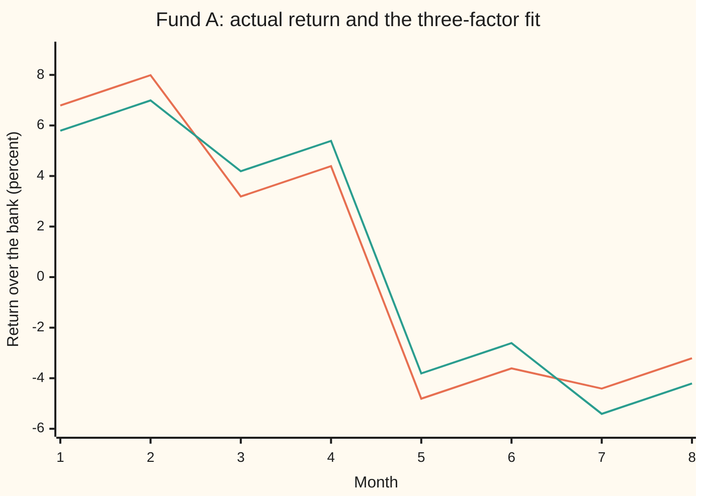
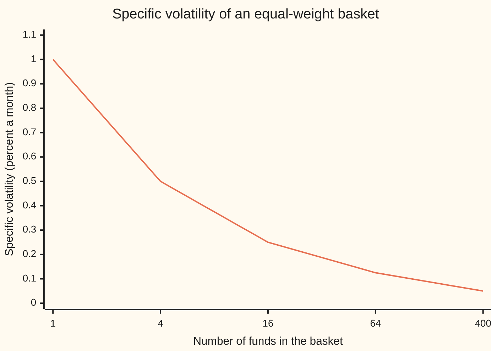

# Factor models: returns explained by a few common factors, and the pricing they imply

[Syllabus](../../../SYLLABUS.md) → [Financial mathematics](../README.md) → [Portfolio Theory](../README.md#s37) → Factor models

---

## General Overview

A small-company growth fund, called Fund A here, had a good eight months. It beat the bank by 0.79 percent a month on average. Its manager calls that skill.

Look at what the market did in the same months. In the four months the stock market rose, Fund A averaged a gain of 5.59 percent. In the four months it fell, Fund A averaged a loss of 4.01 percent. Most of the fund's life is the market's life. Two further tides matter: small companies beating big ones, and cheap "value" companies beating expensive "growth" ones. Once all three tides are taken out, what is left of the 0.79 percent is 0.20 percent a month. That is the part a manager can claim.

A **factor model** does that separation. A **factor** is a return shared by many assets at once, a tide rather than a ripple. The model writes each month's fund return as a few exposures to factors, plus a part the fund owns alone. The same split answers two more questions. How much do two funds move together? Only through the factors they share, if their own parts are unrelated. And what return should a fund earn? Only pay for the factors: the fund-specific part can be diversified away, so no one is paid to carry it. That last claim is **arbitrage pricing theory**, APT for short.

The record here is invented and built on purpose: eight months, each factor either up or down by a fixed step, every up/down combination once. That keeps every sum small enough to do by hand. Real records are longer and messier; the code also runs a random 600-month record.

**A fund's return is a few exposures to shared factors plus a fund-specific part; covariance then splits into a factor part and a specific part, and if specific risk can be diversified away, expected returns must be linear in the exposures.**

**What kind of fact this is:** a model — that three factors capture the shared movement is an assumption that fits stock markets well, not a law; inside it, the covariance split is a theorem and the pricing line is a theorem under no-arbitrage, both proved on this card in Why it works.

### The picture: Fund A, month by month

The three factors alone, with Fund A's exposures, track almost every move.



Orange: Fund A's actual return over the bank. Green: the factor fit, the intercept plus each exposure times that month's factor return. The gap each month is exactly 1 percent, up or down: the fund's own part.

---

## The formula

Notation first, in words. A subscript $i$ names the fund, a subscript $t$ the month. "Over the bank" means the fund's return minus what cash in the bank earned that month; the model is written in those **excess returns**. The three factors have short names from Eugene Fama and Kenneth French, who proposed them in 1993. MKT is the whole stock market's return over the bank. SMB, "small minus big", is the return of a basket of small companies minus a basket of big ones. HML, "high minus low", is cheap companies (high book value per dollar of price) minus expensive ones. Each costs nothing to hold: SMB and HML are long one basket and short another, and MKT is the market bought with money borrowed from the bank.

$$y_{i,t} = \alpha_i + b_{iM}\,\text{MKT}_t + b_{iS}\,\text{SMB}_t + b_{iH}\,\text{HML}_t + \varepsilon_{i,t}$$

**Read it aloud:** a fund's return over the bank this month is a fixed intercept, plus its exposure to each factor times what that factor did, plus a part that is the fund's alone.

Stack the exposures of several funds as the rows of a table $B$ (a **matrix**: a grid of numbers, one row per fund, one column per factor). Write $\Sigma$ for the funds' covariance matrix (how their returns move together), $\Omega$ for the factors' covariance matrix and $D$ for the specific parts'. Then:

$$\Sigma = B\,\Omega\,B^{\mathsf T} + D$$

**Read it aloud:** how funds move together equals how their shared factors move together, seen through each fund's exposures, plus how their own parts move together.

$B^{\mathsf T}$ is $B$ turned on its side, rows swapped for columns. And the pricing line of APT, with $E[\,\cdot\,]$ the expected value (the long-run average) and $\lambda_M$, $\lambda_S$, $\lambda_H$ the reward each factor pays per unit of loading:

$$E[y_i] = b_{iM}\lambda_M + b_{iS}\lambda_S + b_{iH}\lambda_H$$

**Read it aloud:** a fund's expected return over the bank is its exposure to each factor times the reward that factor pays, and nothing else.

| Symbol | Plain meaning | In our example | Push it up and the answer… |
| --- | --- | --- | --- |
| $y_i$, $i$, $j$, $t$ | fund $i$'s return over the bank in month $t$, in percent; $j$ names a second fund | Fund A, month 1: 6.79 | — |
| $X$, $\theta$ | the regression's table of ones and factor columns; its four unknowns | 8 rows, 4 columns; 0.20, 1.2, 0.4, −0.3 | — |
| $\alpha_i$ | the intercept: return with every factor at zero | Fund A 0.20, Fund B −0.10 | more return not paid for by factors |
| $b_{iM}$, $b_{iS}$, $b_{iH}$, $b_i$ | the fund's **loadings**: its exposure to market, size, value | Fund A 1.2, 0.4, −0.3 | the fund swings harder with that factor |
| $f$, $g$ | the three factor returns as a column; $g$ is each minus its mean, the surprise | month 1: $f$ = 4.5, 2.2, 2.3; $g$ = 4, 2, 2 | — |
| $\varepsilon_i$, $\varepsilon$ | the fund's specific return, left after the factors | Fund A: +1 or −1 each month | more risk only diversification removes |
| $\Sigma$ | the funds' covariance matrix, in squared percent | Fund A 25.04, A with B 14.44 | the funds swing more, or more together |
| $B$ | loadings of all funds, one row each | rows 1.2, 0.4, −0.3 and 0.8, −0.2, 0.5 | more shared risk |
| $\Omega$ | the factors' covariance matrix | 16, 4, 4 down the diagonal, 0 elsewhere | every fund with that exposure swings more |
| $D$, $D_{ij}$ | covariance of the specific parts, $D_{ij}$ for funds $i$ and $j$; diagonal if they are unrelated | 1.00 and 0.25, 0 between | more specific risk |
| $\lambda_M$, $\lambda_S$, $\lambda_H$, $\lambda$, $\mu$ | the **risk premium**: expected factor return, the reward per unit loading; $\mu$ lists expected excess returns | 0.50, 0.20, 0.30 a month | higher expected return for every exposed fund |
| $w$, $N$, $n$ | portfolio weights, one per fund; the number of funds in a basket, or of portfolios in a proof | half in A, half in B; 1 to 400 funds | more funds: specific risk shrinks as $1/\sqrt{N}$ |

"Squared percent" is the unit of a variance when returns are in percent; its square root, the **volatility**, is back in percent.

### When it holds

- **The chosen factors carry all the shared movement.** If two funds share a driver the model omits, say both hold the same industry, their specific parts correlate and the factor part understates their covariance: 14.44 against a true 14.94 below.
- **Loadings are steady over the record.** A manager who shifts from small to big companies mid-year has two size loadings; one regression averages them and fits neither.
- **Specific parts are uncorrelated with the factors.** Least squares forces this inside the sample. It is an assumption about the future.
- **For pricing, many assets and no free lunch.** The exact APT line holds for portfolios whose specific risk has been diversified away. For one asset it holds only approximately, and Ross's theorem bounds how far the whole cross-section can stray, not any single asset.

---

## Why it works

### Step 0: most of a fund's month is shared

A fund is a basket of companies, and companies share tides: the economy, interest rates, the mood for small or cheap firms. Model each tide once, and each fund needs only its exposure to it. Everything else is the fund's own. If those own parts are unrelated across funds, the whole web of co-movement runs through a handful of factors.

That is a large saving. For 500 funds, every pair's covariance is 125250 numbers to estimate. A three-factor model needs three loadings per fund, the factors' own covariances and one specific variance per fund: 2006 numbers.

### Step 1: fit the loadings by least squares

The loadings are the regression coefficients of the fund's returns on the three factor returns. Least squares picks the intercept and loadings that make the sum of squared leftovers smallest; the conditions for that minimum are the **normal equations**, $X^{\mathsf T} X \theta = X^{\mathsf T} y$, where $X$ holds a column of ones and the three factor columns and $\theta$ lists the four unknowns ([Multiple regression](../../09-Probability%20and%20statistics/09-Regression/03-multiple-regression-and-gauss-markov.md)).

In this record each factor sits a fixed step above or below its average: market 4 points, size and value 2 points each. Every combination appears once, so the three factor columns are uncorrelated. Then each loading can be read off alone: the fund's average in that factor's up months, minus its average in the down months, divided by the factor's own up-minus-down gap. For the market that is 5.59 minus −4.01, over a gap of 8 points: 1.2. The intercept is what the fund averaged beyond the factor averages times the loadings.

A consequence of the minimum: the leftover $\varepsilon$ is uncorrelated with every factor inside the record. Otherwise some multiple of that factor could be moved into the fit and shrink the squares further.

### Step 2: covariance splits into factor and specific parts

Write two funds as factor part plus specific part. Covariance is **bilinear**: it spreads over sums on both sides, like multiplying out brackets. Four products appear. The two mixing one fund's factor part with the other's specific part are zero, by Step 1's consequence. What survives is the covariance of the factor parts, $b_i^{\mathsf T}\Omega\, b_j$ with $b_i$ fund $i$'s row of loadings, plus the covariance of the specific parts. Across all pairs at once that is $\Sigma = B\Omega B^{\mathsf T} + D$.

For Fund A alone, with the factors uncorrelated, the variance is each loading squared times its factor's variance, plus the specific variance.

```
Fund A's variance by source, squared percent (each █ = 1)
market    ███████████████████████  23.04
size      ▌                         0.64
value     ▍                         0.36
specific  █                         1.00
```

The factors explain 24.04 of 25.04, the **R-squared** of 0.9601. For Fund B it is 0.9785.

<details>
<summary>Detailed proof: the covariance split</summary>

Let $f$ be the column of the three factor returns and $b_i$ fund $i$'s column of loadings, so $y_i = \alpha_i + b_i^{\mathsf T} f + \varepsilon_i$. Constants do not move, so they drop out of every covariance. Bilinearity gives
$\operatorname{Cov}(y_i, y_j) = \operatorname{Cov}(b_i^{\mathsf T} f, b_j^{\mathsf T} f) + \operatorname{Cov}(b_i^{\mathsf T} f, \varepsilon_j) + \operatorname{Cov}(\varepsilon_i, b_j^{\mathsf T} f) + \operatorname{Cov}(\varepsilon_i, \varepsilon_j)$.
The first term is $\sum_{k}\sum_{l} b_{ik} b_{jl} \operatorname{Cov}(f_k, f_l) = b_i^{\mathsf T}\Omega b_j$. The middle two are sums of loadings times $\operatorname{Cov}(f_k, \varepsilon_j)$, each zero by assumption (and exactly zero in a least-squares sample, since the residual is orthogonal to every centred factor column). The last is $D_{ij}$. Collecting $i$ and $j$ over all funds gives $\Sigma = B\Omega B^{\mathsf T} + D$. Nothing here needs normal distributions or independence; zero covariance between factors and specific parts is the whole requirement. That $D$ is diagonal is a separate assumption, about specific parts across funds.

</details>

### Step 3: a portfolio's risk from three exposures

A portfolio's loadings are the weighted average of its funds' loadings. Half in A, half in B has loadings 1.0, 0.1 and 0.1. Its variance is the factor part through those three numbers, plus the specific part $w^{\mathsf T} D\, w$: 16.3925 squared percent. Computing the variance straight from the portfolio's eight monthly returns gives 16.3925 again. Risk systems run on this shortcut: a thousand-stock portfolio is summarised by a few exposures and one specific number.

### Step 4: specific risk diversifies, factor risk does not

Spread money equally over $N$ funds whose specific parts are unrelated, each with specific volatility 1 percent. The basket's specific variance is $N$ copies of $1/N^2$, so its specific volatility is $1/\sqrt{N}$.



Orange: $1/\sqrt{N}$. The code draws 2000 random baskets at each size and lands within about two percent of this line: 0.987, 0.501, 0.251, 0.124, 0.051. Factor risk does not shrink this way: every fund in the basket feels the same market month.

### Step 5: no arbitrage forces the pricing line

Suppose a well-diversified portfolio Q has Fund A's loadings, 1.2, 0.4 and −0.3, no specific part left, and is priced so that it is expected to earn 0.80 percent a month over the bank. Build a copy from the factors themselves: 1.2 units of MKT, 0.4 of SMB, minus 0.3 of HML, financed at the bank. Each factor costs nothing to hold, so the copy costs nothing and earns $1.2\lambda_M + 0.4\lambda_S - 0.3\lambda_H$ = 0.59 on average.

Buy Q, sell the copy. Net cost: zero. Net factor exposure: zero. Each month the factor surprises cancel, and what is left is 0.80 minus 0.59: 0.2100, in every one of the eight months. A sure profit for nothing is an **arbitrage**. Traders would buy Q until its price rose and its expected return fell to 0.59. So in a market without arbitrage, a diversified portfolio's expected excess return is its loadings times the premia: the APT line.

<details>
<summary>Detailed proof: exact pricing when specific risk is gone</summary>

Take $n$ tradable portfolios whose excess returns are $y = \mu + B g$ exactly, with $\mu$ the column of expected excess returns and $g$ the factor surprises (factor returns minus their means). A zero-cost position puts weights $w$ in the portfolios and $-\sum w$ in the bank; its payoff per unit of notional is $w^{\mathsf T} y = w^{\mathsf T}\mu + (B^{\mathsf T} w)^{\mathsf T} g$. If $B^{\mathsf T} w = 0$ the payoff is the constant $w^{\mathsf T}\mu$; no arbitrage forces it to be zero, or $w$ or $-w$ would be free money. So $\mu$ is perpendicular to every $w$ with $B^{\mathsf T} w = 0$. In linear algebra, the vectors perpendicular to all such $w$ are exactly the combinations of $B$'s columns. Hence $\mu = B\lambda$ for some column $\lambda$ of premia, unique when $B$'s columns are independent. When the factors are themselves tradable returns, as MKT, SMB and HML are, each factor's own loading row is a single 1, so its premium $\lambda$ is its expected return.

With specific risk left in, a factor-neutral portfolio still carries $w^{\mathsf T}\varepsilon$, and no arbitrage alone does not force its mean to zero. Ross (1976) argued, and later work made precise, that if specific parts are uncorrelated with bounded variance, the pricing errors $\mu_i - b_i^{\mathsf T}\lambda$ have a bounded sum of squares however many assets there are, so most assets lie close to the line. Chamberlain and Rothschild (1983) extended this to specific parts with limited correlation.

</details>

The **capital asset pricing model**, CAPM, is the one-factor special case: one loading, beta, and one premium, the market's ([CAPM](04-capm-and-beta.md)). CAPM gets its line from investors' preferences and market equilibrium; APT gets its line from no arbitrage and says nothing about which factors, or how big their premia.

---

## Worked numbers, by hand

Fund A over the eight months, returns in percent over the bank.

| Step | Arithmetic | Value |
| --- | --- | --- |
| average in market-up months | (6.79 + 7.99 + 3.19 + 4.39) / 4 | 5.59 |
| average in market-down months | (−4.81 − 3.61 − 4.41 − 3.21) / 4 | −4.01 |
| market loading | (5.59 − (−4.01)) / (4.5 − (−3.5)) | **1.2** |
| size loading | (1.59 − (−0.01)) / (2.2 − (−1.8)) | **0.4** |
| value loading | (0.19 − 1.39) / (2.3 − (−1.7)) | **−0.3** |
| premia-implied return | 1.2 × 0.50 + 0.4 × 0.20 − 0.3 × 0.30 | 0.59 |
| intercept | fund average minus that: 0.79 − 0.59 | **0.20** |
| factor variance | 1.2^2 × 16 + 0.4^2 × 4 + 0.3^2 × 4 = 23.04 + 0.64 + 0.36 | 24.04 |
| specific variance | the leftover is ±1 every month | 1.00 |
| total variance | 24.04 + 1.00 | **25.04** |
| covariance with Fund B | 1.2 × 0.8 × 16 + 0.4 × (−0.2) × 4 − 0.3 × 0.5 × 4 | **14.44** |

Of Fund A's 0.79 percent a month over the bank, 0.59 is the going rate for its market, size and value exposures; 0.20 is left for the manager. Fund B, which averaged 0.41, owes 0.51 to its exposures, so its intercept is −0.10.

### What breaks if you drop a piece

| Mistake | Comes out at | What went wrong |
| --- | --- | --- |
| Market-only regression, leftover called specific | specific variance 2.00, not 1.00; intercept 0.190 | size and value moves are counted as the fund's own |
| Market-only covariance of A and B | 14.44 becomes 15.36 | A's small-growth tilt and B's big-value tilt partly offset; one factor misses it |
| Specific parts assumed unrelated when both funds hold the same industry | model 14.44, true 14.94 | the shared industry is an omitted factor hiding in $D$ |
| Intercept read as the average return | 0.79 instead of 0.20 | factor premia counted as skill |

---

## Code, from first principles, and it actually runs

The script builds the eight-month record, fits both funds by two roads that share no arithmetic: solving the normal equations by Gaussian elimination, and the up-minus-down averages from the hand table. The covariance is computed twice: through $B\Omega B^{\mathsf T} + D$, and straight from the funds' monthly returns. A third road checks the arbitrage month by month. A random-number generator written in the script checks the $1/\sqrt{N}$ law by simulation and runs a second case: 600 random months with the same true loadings, where the fit lands near 1.2, 0.4, −0.3 but not on them (the intercept comes out 0.274, not 0.20). That gap is estimation error, the subject of [Estimation error](07-estimation-error-and-shrinkage.md).

### Python

```python
# Factor models and APT -- the check behind the card.  Standard library only.
# An invented eight-month record: each factor is up or down by a fixed step and
# every up/down combination appears once.  Returns: percent per month, over the bank.
from math import sqrt, log, cos, pi

LAM = (0.5, 0.2, 0.3)                 # average market, size, value returns in the record
STEP = (4.0, 2.0, 2.0)                # each factor sits this far above or below its average
TRUE = {"A": (0.2, 1.2, 0.4, -0.3), "B": (-0.1, 0.8, -0.2, 0.5)}   # alpha, bM, bS, bH
signs = [(m, s, h) for m in (1, -1) for s in (1, -1) for h in (1, -1)]
F = [[LAM[j] + STEP[j] * sg[j] for j in range(3)] for sg in signs]

def fund(key, t, shared=0.0):         # the funds' months: factor part plus a specific part
    a, bm, bs, bh = TRUE[key]
    m, s, h = signs[t]
    own = 1.0 * m * s if key == "A" else 0.5 * m * h + shared * m * s
    return a + bm * F[t][0] + bs * F[t][1] + bh * F[t][2] + own

def solve(A, b):                      # Gaussian elimination with partial pivoting
    n = len(b); M = [row[:] + [b[i]] for i, row in enumerate(A)]
    for c in range(n):
        p = max(range(c, n), key=lambda r: abs(M[r][c]))
        if abs(M[p][c]) < 1e-12: raise ValueError("factor columns not independent")
        M[c], M[p] = M[p], M[c]
        for r in range(n):
            if r != c:
                k = M[r][c] / M[c][c]
                M[r] = [x - k * z for x, z in zip(M[r], M[c])]
    return [M[i][n] / M[i][i] for i in range(n)]

def ols(X, y):                        # road 1: normal equations  X'X theta = X'y
    k = len(X[0])
    XtX = [[sum(r[i] * r[j] for r in X) for j in range(k)] for i in range(k)]
    return solve(XtX, [sum(r[i] * v for r, v in zip(X, y)) for i in range(k)])

def mean(u): return sum(u) / len(u)
def z(x): return 0.0 if abs(x) < 5e-10 else x      # print a rounding-level -0.00 as 0.00
def cov(u, v):                        # divisor n: the eight months are the whole record
    mu, mv = mean(u), mean(v)
    return sum((a - mu) * (b - mv) for a, b in zip(u, v)) / len(u)

def halfdiff(y):                      # road 2: up-month average minus down-month average
    b = []
    for j in range(3):
        up = [t for t in range(8) if signs[t][j] > 0]; dn = [t for t in range(8) if signs[t][j] < 0]
        gap = mean([F[t][j] for t in up]) - mean([F[t][j] for t in dn])
        b.append((mean([y[t] for t in up]) - mean([y[t] for t in dn])) / gap)
    return [mean(y) - sum(b[j] * mean([F[t][j] for t in range(8)]) for j in range(3))] + b

yA, yB = [fund("A", t) for t in range(8)], [fund("B", t) for t in range(8)]
X = [[1.0] + F[t] for t in range(8)]
print("month   MKT    SMB    HML   fund A  fund B")
for t in range(8):
    print(f"{t + 1:>5} {F[t][0]:6.1f} {F[t][1]:6.1f} {F[t][2]:6.1f} {yA[t]:8.2f} {yB[t]:7.2f}")
cols = [[F[t][j] for t in range(8)] for j in range(3)]
fbar = [mean(c) for c in cols]
print(f"average   {fbar[0]:.2f}   {fbar[1]:.2f}   {fbar[2]:.2f} {mean(yA):8.2f} {mean(yB):7.2f}")
fit, res = {}, {}
for key, y in (("A", yA), ("B", yB)):
    r1, r2 = ols(X, y), halfdiff(y)
    fit[key] = r1
    res[key] = [y[t] - sum(r1[i] * X[t][i] for i in range(4)) for t in range(8)]
    print(f"fund {key} road 1 normal equations  alpha {r1[0]:6.3f}  bM {r1[1]:6.3f}  bS {r1[2]:6.3f}  bH {r1[3]:6.3f}")
    print(f"fund {key} road 2 up minus down     alpha {r2[0]:6.3f}  bM {r2[1]:6.3f}  bS {r2[2]:6.3f}  bH {r2[3]:6.3f}")
    assert all(abs(a - b) < 1e-9 for a, b in zip(r1, r2)), "two fitting roads disagree"
    assert all(abs(a - b) < 1e-9 for a, b in zip(r1, TRUE[key])), "fit misses the loadings that built the record"
    print(f"fund {key} month-1 residual {res[key][0]:6.3f}; each month's residual times each factor sums to "
          f"{max(abs(sum(res[key][t] * F[t][j] for t in range(8))) for j in range(3)):.3f}")

ud = [mean([yA[t] for t in range(8) if signs[t][j] * g > 0]) for j in range(3) for g in (1, -1)]
print("fund A up / down month averages: market {:.2f} / {:.2f}  size {:.2f} / {:.2f}  value {:.2f} / {:.2f}".format(*ud))
print("chart, fund A factor fit " + " ".join(f"{yA[t] - res['A'][t]:.2f}" for t in range(8)))
Om = [[cov(cols[i], cols[j]) for j in range(3)] for i in range(3)]
Bm = [fit["A"][1:], fit["B"][1:]]
def quad(u, M, v): return sum(u[i] * M[i][j] * v[j] for i in range(len(u)) for j in range(len(v)))
fac = [[quad(Bm[a], Om, Bm[b]) for b in range(2)] for a in range(2)]
D = [[cov(res[p], res[q]) for q in "AB"] for p in "AB"]
direct = [[cov(u, v) for v in (yA, yB)] for u in (yA, yB)]
print(f"factor covariance Omega diagonal {Om[0][0]:.2f} {Om[1][1]:.2f} {Om[2][2]:.2f}; off-diagonal {z(Om[0][1]):.2f}")
for lab, M in (("factor part B Omega B'", fac), ("specific part D", D), ("sum", [[fac[i][j] + D[i][j] for j in range(2)] for i in range(2)]), ("direct from the months", direct)):
    print(f"{lab:<24} {M[0][0]:7.2f} {z(M[0][1]):7.2f} {M[1][1]:7.2f}")
assert all(abs(fac[i][j] + D[i][j] - direct[i][j]) < 1e-9 for i in range(2) for j in range(2)), "decomposition fails"
assert abs(direct[0][0] - sum(TRUE["A"][1 + j] ** 2 * STEP[j] ** 2 for j in range(3)) - 1.0) < 1e-9, "A variance: loading^2 x step^2 + 1"
bA = fit["A"][1:]
print("fund A variance by source: market {:.2f}  size {:.2f}  value {:.2f}  specific {:.2f}".format(
    *[bA[j] ** 2 * Om[j][j] for j in range(3)], D[0][0]))
print(f"fund A R-squared {fac[0][0] / direct[0][0]:.4f}; fund B {fac[1][1] / direct[1][1]:.4f}; "
      f"correlation {direct[0][1] / sqrt(direct[0][0] * direct[1][1]):.4f}")
print(f"numbers to estimate for 500 funds: every covariance {500 * 501 // 2}; three-factor model {500 * 3 + 6 + 500}")
w = (0.5, 0.5); bP = [w[0] * Bm[0][j] + w[1] * Bm[1][j] for j in range(3)]
pv_fac = quad(bP, Om, bP) + quad(w, D, w); pv_dir = cov(*[[w[0] * a + w[1] * b for a, b in zip(yA, yB)]] * 2)
print(f"half-and-half portfolio loadings {bP[0]:.2f} {bP[1]:.2f} {bP[2]:.2f}; variance from 3 exposures {pv_fac:.4f}; from its own months {pv_dir:.4f}")
assert abs(pv_fac - pv_dir) < 1e-9, "portfolio variance by exposures disagrees with the direct series"

capm = ols([[1.0, F[t][0]] for t in range(8)], yA)
capm_res = cov(*[[yA[t] - capm[0] - capm[1] * F[t][0] for t in range(8)]] * 2)
print(f"wrong: market only  beta {capm[1]:.3f}  alpha {capm[0]:.3f}  'specific' variance {capm_res:.2f}  "
      f"A-B covariance {capm[1] * ols([[1.0, F[t][0]] for t in range(8)], yB)[1] * Om[0][0]:.2f}")
yB2 = [fund("B", t, shared=0.5) for t in range(8)]
fB2 = ols(X, yB2)
print(f"wrong: residuals assumed unrelated  model covariance {quad(bA, Om, fB2[1:]):.2f}  true {cov(yA, yB2):.2f}")
print(f"wrong: alpha read as average excess return  {mean(yA):.2f} instead of {fit['A'][0]:.2f}")

impl = {k: sum(fit[k][1 + j] * fbar[j] for j in range(3)) for k in "AB"}
for k, y in (("A", yA), ("B", yB)):
    print(f"APT fund {k}: premia-implied excess {impl[k]:.2f}; average excess {mean(y):.2f}; gap {mean(y) - impl[k]:.2f}")
    assert abs((mean(y) - impl[k]) - TRUE[k][0]) < 1e-9, "gap to APT line should equal the alpha that built the record"
Q = 0.80
pay = [(Q + sum(bA[j] * (F[t][j] - fbar[j]) for j in range(3))) - sum(bA[j] * F[t][j] for j in range(3)) for t in range(8)]
print(f"arbitrage: portfolio Q at {Q:.2f} long, factor copy short; monthly payoff min {min(pay):.4f} max {max(pay):.4f}; "
      f"price gap {Q - impl['A']:.4f}")
assert max(pay) - min(pay) < 1e-9, "a factor-neutral payoff must not move with the months"
assert abs(mean(pay) - (Q - sum(TRUE["A"][1 + j] * LAM[j] for j in range(3)))) < 1e-9, "payoff must be the price gap"

state = 0x9E3779B97F4A7C15
def uniform():                        # xorshift64: same bits in Python and Rust
    global state
    state ^= (state << 13) & 0xFFFFFFFFFFFFFFFF; state ^= state >> 7; state ^= (state << 17) & 0xFFFFFFFFFFFFFFFF
    return ((state >> 11) + 0.5) / 9007199254740992.0
def normal(): return sqrt(-2.0 * log(uniform())) * cos(2.0 * pi * uniform())
print("specific volatility of an equal-weight basket of N funds, each 1.00 on its own")
for n in (1, 4, 16, 64, 400):
    draws = [mean([normal() for _ in range(n)]) for _ in range(2000)]
    sim = sqrt(sum(d * d for d in draws) / len(draws))
    print(f"  N = {n:>3}   formula 1/sqrt(N) {1 / sqrt(n):.3f}   simulated {sim:.3f}")
    assert abs(sim * sqrt(n) - 1.0) < 0.06, "diversification simulation off the 1/sqrt(N) law"
T = 600
Fl = [[LAM[j] + STEP[j] * normal() for j in range(3)] for _ in range(T)]
yl = [0.2 + 1.2 * f[0] + 0.4 * f[1] - 0.3 * f[2] + normal() for f in Fl]
el = ols([[1.0] + f for f in Fl], yl)
print(f"second case, 600 random months: alpha {el[0]:.3f}  bM {el[1]:.3f}  bS {el[2]:.3f}  bH {el[3]:.3f}")
assert all(abs(a - b) < 0.15 for a, b in zip(el, TRUE["A"])), "long random record should land near the true loadings"
print(f"try: fund A specific 2.00, R-squared {fac[0][0] / (fac[0][0] + 4.0):.4f}")
print(f"try: fund A value loading +0.3, A-B covariance {quad([1.2, 0.4, 0.3], Om, Bm[1]):.2f}")
print(f"try: fund A market loading 1.0, variance {quad([1.0, 0.4, -0.3], Om, [1.0, 0.4, -0.3]) + D[0][0]:.2f}")
print("ALL CHECKS PASS")
```

**Ran 2026-09-28 on macOS, Python 3.14.6, standard library only. All checks passed. Output, pasted from the run:**

```
month   MKT    SMB    HML   fund A  fund B
    1    4.5    2.2    2.3     6.79    4.71
    2    4.5    2.2   -1.7     7.99    1.71
    3    4.5   -1.8    2.3     3.19    5.51
    4    4.5   -1.8   -1.7     4.39    2.51
    5   -3.5    2.2    2.3    -4.81   -2.69
    6   -3.5    2.2   -1.7    -3.61   -3.69
    7   -3.5   -1.8    2.3    -4.41   -1.89
    8   -3.5   -1.8   -1.7    -3.21   -2.89
average   0.50   0.20   0.30     0.79    0.41
fund A road 1 normal equations  alpha  0.200  bM  1.200  bS  0.400  bH -0.300
fund A road 2 up minus down     alpha  0.200  bM  1.200  bS  0.400  bH -0.300
fund A month-1 residual  1.000; each month's residual times each factor sums to 0.000
fund B road 1 normal equations  alpha -0.100  bM  0.800  bS -0.200  bH  0.500
fund B road 2 up minus down     alpha -0.100  bM  0.800  bS -0.200  bH  0.500
fund B month-1 residual  0.500; each month's residual times each factor sums to 0.000
fund A up / down month averages: market 5.59 / -4.01  size 1.59 / -0.01  value 0.19 / 1.39
chart, fund A factor fit 5.79 6.99 4.19 5.39 -3.81 -2.61 -5.41 -4.21
factor covariance Omega diagonal 16.00 4.00 4.00; off-diagonal 0.00
factor part B Omega B'     24.04   14.44   11.40
specific part D             1.00    0.00    0.25
sum                        25.04   14.44   11.65
direct from the months     25.04   14.44   11.65
fund A variance by source: market 23.04  size 0.64  value 0.36  specific 1.00
fund A R-squared 0.9601; fund B 0.9785; correlation 0.8454
numbers to estimate for 500 funds: every covariance 125250; three-factor model 2006
half-and-half portfolio loadings 1.00 0.10 0.10; variance from 3 exposures 16.3925; from its own months 16.3925
wrong: market only  beta 1.200  alpha 0.190  'specific' variance 2.00  A-B covariance 15.36
wrong: residuals assumed unrelated  model covariance 14.44  true 14.94
wrong: alpha read as average excess return  0.79 instead of 0.20
APT fund A: premia-implied excess 0.59; average excess 0.79; gap 0.20
APT fund B: premia-implied excess 0.51; average excess 0.41; gap -0.10
arbitrage: portfolio Q at 0.80 long, factor copy short; monthly payoff min 0.2100 max 0.2100; price gap 0.2100
specific volatility of an equal-weight basket of N funds, each 1.00 on its own
  N =   1   formula 1/sqrt(N) 1.000   simulated 0.987
  N =   4   formula 1/sqrt(N) 0.500   simulated 0.501
  N =  16   formula 1/sqrt(N) 0.250   simulated 0.251
  N =  64   formula 1/sqrt(N) 0.125   simulated 0.124
  N = 400   formula 1/sqrt(N) 0.050   simulated 0.051
second case, 600 random months: alpha 0.274  bM 1.186  bS 0.375  bH -0.296
try: fund A specific 2.00, R-squared 0.8573
try: fund A value loading +0.3, A-B covariance 15.64
try: fund A market loading 1.0, variance 18.00
ALL CHECKS PASS
```

### Rust

```rust
// Factor models and APT -- the check behind the card.  Rust std only.
// An invented eight-month record: each factor is up or down by a fixed step and
// every up/down combination appears once.  Returns: percent per month, over the bank.
const LAM: [f64; 3] = [0.5, 0.2, 0.3]; // average market, size, value returns in the record
const STEP: [f64; 3] = [4.0, 2.0, 2.0]; // each factor sits this far above or below its average
const TA: [f64; 4] = [0.2, 1.2, 0.4, -0.3]; // fund A: alpha, bM, bS, bH
const TB: [f64; 4] = [-0.1, 0.8, -0.2, 0.5]; // fund B

fn solve(a: &Vec<Vec<f64>>, b: &Vec<f64>) -> Vec<f64> {
    // Gaussian elimination with partial pivoting
    let n = b.len();
    let mut m: Vec<Vec<f64>> = (0..n).map(|i| { let mut r = a[i].clone(); r.push(b[i]); r }).collect();
    for c in 0..n {
        let p = (c..n).max_by(|&x, &y| m[x][c].abs().partial_cmp(&m[y][c].abs()).unwrap()).unwrap();
        assert!(m[p][c].abs() > 1e-12, "factor columns not independent");
        m.swap(c, p);
        for r in 0..n {
            if r != c {
                let k = m[r][c] / m[c][c];
                let pivot = m[c].clone();
                for (x, z) in m[r].iter_mut().zip(pivot.iter()) { *x -= k * z; }
            }
        }
    }
    (0..n).map(|i| m[i][n] / m[i][i]).collect()
}
fn ols(x: &Vec<Vec<f64>>, y: &[f64]) -> Vec<f64> {
    // road 1: normal equations  X'X theta = X'y
    let k = x[0].len();
    let xtx = (0..k).map(|i| (0..k).map(|j| x.iter().map(|r| r[i] * r[j]).sum()).collect()).collect();
    let xty = (0..k).map(|i| x.iter().zip(y).map(|(r, v)| r[i] * v).sum()).collect();
    solve(&xtx, &xty)
}
fn mean(u: &[f64]) -> f64 { u.iter().sum::<f64>() / u.len() as f64 }
fn z(x: f64) -> f64 { if x.abs() < 5e-10 { 0.0 } else { x } }
fn cov(u: &[f64], v: &[f64]) -> f64 {
    let (mu, mv) = (mean(u), mean(v));
    u.iter().zip(v).map(|(a, b)| (a - mu) * (b - mv)).sum::<f64>() / u.len() as f64
}
fn quad(u: &[f64], m: &Vec<Vec<f64>>, v: &[f64]) -> f64 {
    let mut s = 0.0;
    for i in 0..u.len() { for j in 0..v.len() { s += u[i] * m[i][j] * v[j]; } }
    s
}
struct Rng(u64);
impl Rng {
    fn uniform(&mut self) -> f64 { // xorshift64: same bits in Python and Rust
        self.0 ^= self.0 << 13; self.0 ^= self.0 >> 7; self.0 ^= self.0 << 17;
        ((self.0 >> 11) as f64 + 0.5) / 9007199254740992.0
    }
    fn normal(&mut self) -> f64 {
        let u1 = self.uniform(); let u2 = self.uniform();
        (-2.0 * u1.ln()).sqrt() * (2.0 * std::f64::consts::PI * u2).cos()
    }
}

fn main() {
    let mut signs = vec![];
    for m in [1.0, -1.0] { for s in [1.0, -1.0] { for h in [1.0, -1.0] { signs.push([m, s, h]); } } }
    let f: Vec<[f64; 3]> = signs.iter().map(|sg| [0, 1, 2].map(|j| LAM[j] + STEP[j] * sg[j])).collect();
    let fund = |t: &[f64; 4], i: usize, own: f64| t[0] + t[1] * f[i][0] + t[2] * f[i][1] + t[3] * f[i][2] + own;
    let ya: Vec<f64> = (0..8).map(|i| fund(&TA, i, 1.0 * signs[i][0] * signs[i][1])).collect();
    let yb: Vec<f64> = (0..8).map(|i| fund(&TB, i, 0.5 * signs[i][0] * signs[i][2])).collect();
    let x: Vec<Vec<f64>> = (0..8).map(|t| vec![1.0, f[t][0], f[t][1], f[t][2]]).collect();
    println!("month   MKT    SMB    HML   fund A  fund B");
    for t in 0..8 {
        println!("{:>5} {:6.1} {:6.1} {:6.1} {:8.2} {:7.2}", t + 1, f[t][0], f[t][1], f[t][2], ya[t], yb[t]);
    }
    let cols: Vec<Vec<f64>> = (0..3).map(|j| (0..8).map(|t| f[t][j]).collect()).collect();
    let fbar: Vec<f64> = cols.iter().map(|c| mean(c)).collect();
    println!("average   {:.2}   {:.2}   {:.2} {:8.2} {:7.2}", fbar[0], fbar[1], fbar[2], mean(&ya), mean(&yb));
    let mut fit = vec![]; let mut res = vec![];
    for (key, y, tr) in [("A", &ya, TA), ("B", &yb, TB)] {
        let r1 = ols(&x, y);
        // road 2: up-month average minus down-month average, over the gap in the factor
        let mut r2 = vec![0.0; 4];
        for j in 0..3 {
            let (up, dn): (Vec<usize>, Vec<usize>) = (0..8).partition(|&t| signs[t][j] > 0.0);
            let avg = |ix: &Vec<usize>, v: &dyn Fn(usize) -> f64| ix.iter().map(|&t| v(t)).sum::<f64>() / ix.len() as f64;
            let gap = avg(&up, &|t| f[t][j]) - avg(&dn, &|t| f[t][j]);
            r2[j + 1] = (avg(&up, &|t| y[t]) - avg(&dn, &|t| y[t])) / gap;
        }
        r2[0] = mean(y) - (0..3).map(|j| r2[j + 1] * mean(&cols[j])).sum::<f64>();
        println!("fund {} road 1 normal equations  alpha {:6.3}  bM {:6.3}  bS {:6.3}  bH {:6.3}", key, r1[0], r1[1], r1[2], r1[3]);
        println!("fund {} road 2 up minus down     alpha {:6.3}  bM {:6.3}  bS {:6.3}  bH {:6.3}", key, r2[0], r2[1], r2[2], r2[3]);
        assert!((0..4).all(|i| (r1[i] - r2[i]).abs() < 1e-9), "two fitting roads disagree");
        assert!((0..4).all(|i| (r1[i] - tr[i]).abs() < 1e-9), "fit misses the loadings that built the record");
        let e: Vec<f64> = (0..8).map(|t| y[t] - (0..4).map(|i| r1[i] * x[t][i]).sum::<f64>()).collect();
        let worst = (0..3).map(|j| (0..8).map(|t| e[t] * f[t][j]).sum::<f64>().abs()).fold(0.0, f64::max);
        println!("fund {} month-1 residual {:6.3}; each month's residual times each factor sums to {:.3}", key, e[0], worst);
        fit.push(r1); res.push(e);
    }
    let ud: Vec<f64> = (0..6).map(|k| { let g = if k % 2 == 0 { 1.0 } else { -1.0 };
        let v: Vec<f64> = (0..8).filter(|&t| signs[t][k / 2] * g > 0.0).map(|t| ya[t]).collect(); mean(&v) }).collect();
    println!("fund A up / down month averages: market {:.2} / {:.2}  size {:.2} / {:.2}  value {:.2} / {:.2}", ud[0], ud[1], ud[2], ud[3], ud[4], ud[5]);
    let fitted: Vec<String> = (0..8).map(|t| format!("{:.2}", ya[t] - res[0][t])).collect();
    println!("chart, fund A factor fit {}", fitted.join(" "));
    let om: Vec<Vec<f64>> = (0..3).map(|i| (0..3).map(|j| cov(&cols[i], &cols[j])).collect()).collect();
    let bm: Vec<Vec<f64>> = vec![fit[0][1..].to_vec(), fit[1][1..].to_vec()];
    let fac: Vec<Vec<f64>> = (0..2).map(|a| (0..2).map(|b| quad(&bm[a], &om, &bm[b])).collect()).collect();
    let d: Vec<Vec<f64>> = (0..2).map(|p| (0..2).map(|q| cov(&res[p], &res[q])).collect()).collect();
    let ys = [&ya, &yb];
    let direct: Vec<Vec<f64>> = (0..2).map(|p| (0..2).map(|q| cov(ys[p], ys[q])).collect()).collect();
    let sum: Vec<Vec<f64>> = (0..2).map(|i| (0..2).map(|j| fac[i][j] + d[i][j]).collect()).collect();
    println!("factor covariance Omega diagonal {:.2} {:.2} {:.2}; off-diagonal {:.2}", om[0][0], om[1][1], om[2][2], z(om[0][1]));
    for (lab, m) in [("factor part B Omega B'", &fac), ("specific part D", &d), ("sum", &sum), ("direct from the months", &direct)] {
        println!("{:<24} {:7.2} {:7.2} {:7.2}", lab, m[0][0], z(m[0][1]), m[1][1]);
    }
    assert!((0..4).all(|k| (sum[k / 2][k % 2] - direct[k / 2][k % 2]).abs() < 1e-9), "decomposition fails");
    assert!((direct[0][0] - (0..3).map(|j| TA[1 + j] * TA[1 + j] * STEP[j] * STEP[j]).sum::<f64>() - 1.0).abs() < 1e-9, "A variance: loading^2 x step^2 + 1");
    let ba = bm[0].clone();
    println!("fund A variance by source: market {:.2}  size {:.2}  value {:.2}  specific {:.2}",
        ba[0] * ba[0] * om[0][0], ba[1] * ba[1] * om[1][1], ba[2] * ba[2] * om[2][2], d[0][0]);
    println!("fund A R-squared {:.4}; fund B {:.4}; correlation {:.4}", fac[0][0] / direct[0][0], fac[1][1] / direct[1][1],
        direct[0][1] / (direct[0][0] * direct[1][1]).sqrt());
    println!("numbers to estimate for 500 funds: every covariance {}; three-factor model {}", 500 * 501 / 2, 500 * 3 + 6 + 500);
    let w = [0.5, 0.5];
    let bp: Vec<f64> = (0..3).map(|j| w[0] * bm[0][j] + w[1] * bm[1][j]).collect();
    let pv_fac = quad(&bp, &om, &bp) + quad(&w, &d, &w);
    let port: Vec<f64> = (0..8).map(|t| w[0] * ya[t] + w[1] * yb[t]).collect();
    let pv_dir = cov(&port, &port);
    println!("half-and-half portfolio loadings {:.2} {:.2} {:.2}; variance from 3 exposures {:.4}; from its own months {:.4}", bp[0], bp[1], bp[2], pv_fac, pv_dir);
    assert!((pv_fac - pv_dir).abs() < 1e-9, "portfolio variance by exposures disagrees with the direct series");

    let xm: Vec<Vec<f64>> = (0..8).map(|t| vec![1.0, f[t][0]]).collect();
    let capm = ols(&xm, &ya);
    let cr: Vec<f64> = (0..8).map(|t| ya[t] - capm[0] - capm[1] * f[t][0]).collect();
    println!("wrong: market only  beta {:.3}  alpha {:.3}  'specific' variance {:.2}  A-B covariance {:.2}",
        capm[1], capm[0], cov(&cr, &cr), capm[1] * ols(&xm, &yb)[1] * om[0][0]);
    let yb2: Vec<f64> = (0..8).map(|i| fund(&TB, i, 0.5 * signs[i][0] * signs[i][2] + 0.5 * signs[i][0] * signs[i][1])).collect();
    let fb2 = ols(&x, &yb2);
    println!("wrong: residuals assumed unrelated  model covariance {:.2}  true {:.2}", quad(&ba, &om, &fb2[1..]), cov(&ya, &yb2));
    println!("wrong: alpha read as average excess return  {:.2} instead of {:.2}", mean(&ya), fit[0][0]);

    let imp: Vec<f64> = (0..2).map(|k| (0..3).map(|j| fit[k][1 + j] * fbar[j]).sum()).collect();
    for (k, key, tr) in [(0, "A", TA), (1, "B", TB)] {
        let avg = mean(ys[k]);
        println!("APT fund {}: premia-implied excess {:.2}; average excess {:.2}; gap {:.2}", key, imp[k], avg, avg - imp[k]);
        assert!(((avg - imp[k]) - tr[0]).abs() < 1e-9, "gap to APT line should equal the alpha that built the record");
    }
    let q = 0.80;
    let pay: Vec<f64> = (0..8).map(|t| (q + (0..3).map(|j| ba[j] * (f[t][j] - fbar[j])).sum::<f64>())
        - (0..3).map(|j| ba[j] * f[t][j]).sum::<f64>()).collect();
    let (lo, hi) = (pay.iter().cloned().fold(f64::MAX, f64::min), pay.iter().cloned().fold(f64::MIN, f64::max));
    println!("arbitrage: portfolio Q at {:.2} long, factor copy short; monthly payoff min {:.4} max {:.4}; price gap {:.4}", q, lo, hi, q - imp[0]);
    assert!(hi - lo < 1e-9, "a factor-neutral payoff must not move with the months");
    assert!((mean(&pay) - (q - (0..3).map(|j| TA[1 + j] * LAM[j]).sum::<f64>())).abs() < 1e-9, "payoff must be the price gap");

    let mut rng = Rng(0x9E3779B97F4A7C15);
    println!("specific volatility of an equal-weight basket of N funds, each 1.00 on its own");
    for n in [1usize, 4, 16, 64, 400] {
        let draws: Vec<f64> = (0..2000).map(|_| { let v: Vec<f64> = (0..n).map(|_| rng.normal()).collect(); mean(&v) }).collect();
        let sim = (draws.iter().map(|x| x * x).sum::<f64>() / draws.len() as f64).sqrt();
        println!("  N = {:>3}   formula 1/sqrt(N) {:.3}   simulated {:.3}", n, 1.0 / (n as f64).sqrt(), sim);
        assert!((sim * (n as f64).sqrt() - 1.0).abs() < 0.06, "diversification simulation off the 1/sqrt(N) law");
    }
    let fl: Vec<Vec<f64>> = (0..600).map(|_| (0..3).map(|j| LAM[j] + STEP[j] * rng.normal()).collect()).collect();
    let yl: Vec<f64> = fl.iter().map(|g| 0.2 + 1.2 * g[0] + 0.4 * g[1] - 0.3 * g[2] + rng.normal()).collect();
    let xl: Vec<Vec<f64>> = fl.iter().map(|g| vec![1.0, g[0], g[1], g[2]]).collect();
    let el = ols(&xl, &yl);
    println!("second case, 600 random months: alpha {:.3}  bM {:.3}  bS {:.3}  bH {:.3}", el[0], el[1], el[2], el[3]);
    assert!((0..4).all(|i| (el[i] - TA[i]).abs() < 0.15), "long random record should land near the true loadings");
    println!("try: fund A specific 2.00, R-squared {:.4}", fac[0][0] / (fac[0][0] + 4.0));
    println!("try: fund A value loading +0.3, A-B covariance {:.2}", quad(&[1.2, 0.4, 0.3], &om, &bm[1]));
    let b1 = [1.0, 0.4, -0.3];
    println!("try: fund A market loading 1.0, variance {:.2}", quad(&b1, &om, &b1) + d[0][0]);
    println!("ALL CHECKS PASS");
}
```

**Ran 2026-09-28 on macOS, rustc 1.98.1, no crates. All checks passed. Output, pasted from the run:**

```
month   MKT    SMB    HML   fund A  fund B
    1    4.5    2.2    2.3     6.79    4.71
    2    4.5    2.2   -1.7     7.99    1.71
    3    4.5   -1.8    2.3     3.19    5.51
    4    4.5   -1.8   -1.7     4.39    2.51
    5   -3.5    2.2    2.3    -4.81   -2.69
    6   -3.5    2.2   -1.7    -3.61   -3.69
    7   -3.5   -1.8    2.3    -4.41   -1.89
    8   -3.5   -1.8   -1.7    -3.21   -2.89
average   0.50   0.20   0.30     0.79    0.41
fund A road 1 normal equations  alpha  0.200  bM  1.200  bS  0.400  bH -0.300
fund A road 2 up minus down     alpha  0.200  bM  1.200  bS  0.400  bH -0.300
fund A month-1 residual  1.000; each month's residual times each factor sums to 0.000
fund B road 1 normal equations  alpha -0.100  bM  0.800  bS -0.200  bH  0.500
fund B road 2 up minus down     alpha -0.100  bM  0.800  bS -0.200  bH  0.500
fund B month-1 residual  0.500; each month's residual times each factor sums to 0.000
fund A up / down month averages: market 5.59 / -4.01  size 1.59 / -0.01  value 0.19 / 1.39
chart, fund A factor fit 5.79 6.99 4.19 5.39 -3.81 -2.61 -5.41 -4.21
factor covariance Omega diagonal 16.00 4.00 4.00; off-diagonal 0.00
factor part B Omega B'     24.04   14.44   11.40
specific part D             1.00    0.00    0.25
sum                        25.04   14.44   11.65
direct from the months     25.04   14.44   11.65
fund A variance by source: market 23.04  size 0.64  value 0.36  specific 1.00
fund A R-squared 0.9601; fund B 0.9785; correlation 0.8454
numbers to estimate for 500 funds: every covariance 125250; three-factor model 2006
half-and-half portfolio loadings 1.00 0.10 0.10; variance from 3 exposures 16.3925; from its own months 16.3925
wrong: market only  beta 1.200  alpha 0.190  'specific' variance 2.00  A-B covariance 15.36
wrong: residuals assumed unrelated  model covariance 14.44  true 14.94
wrong: alpha read as average excess return  0.79 instead of 0.20
APT fund A: premia-implied excess 0.59; average excess 0.79; gap 0.20
APT fund B: premia-implied excess 0.51; average excess 0.41; gap -0.10
arbitrage: portfolio Q at 0.80 long, factor copy short; monthly payoff min 0.2100 max 0.2100; price gap 0.2100
specific volatility of an equal-weight basket of N funds, each 1.00 on its own
  N =   1   formula 1/sqrt(N) 1.000   simulated 0.987
  N =   4   formula 1/sqrt(N) 0.500   simulated 0.501
  N =  16   formula 1/sqrt(N) 0.250   simulated 0.251
  N =  64   formula 1/sqrt(N) 0.125   simulated 0.124
  N = 400   formula 1/sqrt(N) 0.050   simulated 0.051
second case, 600 random months: alpha 0.274  bM 1.186  bS 0.375  bH -0.296
try: fund A specific 2.00, R-squared 0.8573
try: fund A value loading +0.3, A-B covariance 15.64
try: fund A market loading 1.0, variance 18.00
ALL CHECKS PASS
```

The two outputs agree line for line, including the simulated rows: both scripts use the same generator and draw in the same order.

> [!TIP]
> **Try changing**
> - **Double Fund A's specific part to 2 percent.** Guess the R-squared first. The factor part stays 24.04 and the specific variance becomes 4, so R-squared falls from 0.9601 to 0.8573.
> - **Flip Fund A's value loading to +0.3.** Guess whether A and B move more together. They do: both now lean to value, and the covariance rises from 14.44 to 15.64.
> - **Cut Fund A's market loading to 1.0.** Guess the new variance. The market part falls from 23.04 to 16.00, and the total from 25.04 to 18.00.

---

## The usual mistake

> [!warning]
> **Reading a fitted intercept as skill, or a good fit as proof the factors are priced.** The regression fits any record; R-squared of 0.96 says the factors explain the swings, not the average. The intercept is skill only if the premia are the right ones and the record is long enough to tell. Fund A's 0.20 would be 0.190 against the market alone, and the 600-month case shows how far an estimate drifts from the truth even with a long record.
>
> - **Treating the market-only leftover as specific risk.** Fund A's specific variance comes out at 2.00 instead of 1.00, and a diversified book of such funds keeps a size and value risk the manager thinks is gone.
> - **Assuming $D$ is diagonal by default.** Two funds in the same industry share a driver the three factors miss: the model says 14.44, the truth is 14.94.
> - **Treating SMB and HML as properties of the fund.** They are returns of long-short baskets. A loading of 0.4 on SMB says how the fund moves with that basket, not the size of the companies it holds.
> - **Applying the APT line to one stock exactly.** The line is exact only for diversified portfolios; single assets can sit off it by their specific risk.

---

## Where you meet it in real life

- **Fund performance review.** Analysts regress a fund's monthly returns on the Fama–French factors from Kenneth French's public data library and report the intercept, net of factor exposure, as the fund's alpha.
- **Risk systems at asset managers.** Commercial equity risk models are factor models with dozens of factors (industries, countries, styles). A portfolio's risk report is $B\Omega B^{\mathsf T} + D$ evaluated at its exposures.
- **Factor funds.** "Value" and "small-cap" index funds sell the factor exposures themselves, so an investor can buy the premium without paying for a stock picker.
- **Hedging.** A manager who wants stock-specific bets only sells the market, size and value exposures, leaving specific risk: a factor-neutral book, the portfolio Q argument in reverse.
- **Covariance estimation.** A factor structure is a standard target for shrinking a noisy sample covariance ([Estimation error](07-estimation-error-and-shrinkage.md)), and the same exposures feed the risk budgets of [Risk parity](08-risk-parity-and-alternative-weightings.md).

> **Say it back**
> A factor model writes each month's fund return as an intercept, plus loadings times a few shared factor returns, plus a specific part. The loadings come from a least-squares regression. Because the specific part is uncorrelated with the factors, covariance splits into the factors' covariance seen through the loadings plus the specific covariance. Specific risk shrinks like one over the square root of the number of holdings; factor risk does not. So no one is paid for specific risk, and in a market without arbitrage expected excess returns are loadings times factor premia: the APT line.

---

## What this builds on

- [CAPM](04-capm-and-beta.md): one factor, one beta, one premium; this card adds factors and swaps equilibrium for no arbitrage.
- [Multiple regression](../../09-Probability%20and%20statistics/09-Regression/03-multiple-regression-and-gauss-markov.md): least squares with several regressors, the normal equations, and why the leftover is uncorrelated with the regressors.

---

## Where this goes next

- [Black-Litterman](06-black-litterman.md): blends market-implied expected returns with an investor's views, using a covariance matrix like the one built here.
- [Momentum and factor signals](../50-Signals%2C%20Mean%20Reversion%20and%20Backtesting/03-momentum-and-factor-signals.md): builds factors like SMB and HML from data, adds momentum, and tests whether their premia survive a backtest.

APT says expected returns are loadings times premia but not what the premia are; the next question is how to form expected returns an optimiser can trust.

---

## Sources

Verified 2026-09-28: every link below resolves to the publisher's page.

- Eugene F. Fama and Kenneth R. French, "Common risk factors in the returns on stocks and bonds", *Journal of Financial Economics* 33 (1993): [doi.org/10.1016/0304-405X(93)90023-5](https://doi.org/10.1016/0304-405X(93)90023-5). Defines the market, SMB and HML factors and the time-series regressions this card runs.
- Stephen A. Ross, "The arbitrage theory of capital asset pricing", *Journal of Economic Theory* 13 (1976): [doi.org/10.1016/0022-0531(76)90046-6](https://doi.org/10.1016/0022-0531(76)90046-6). The original APT: pricing from no arbitrage and diversification, and its approximate nature for single assets.
- Gary Chamberlain and Michael Rothschild, "Arbitrage, factor structure, and mean-variance analysis on large asset markets", *Econometrica* 51 (1983): [doi.org/10.2307/1912275](https://doi.org/10.2307/1912275). Extends APT to specific parts with limited correlation.
- Kenneth R. French, "Description of Fama/French Factors", Tuck School of Business data library: [mba.tuck.dartmouth.edu](https://mba.tuck.dartmouth.edu/pages/faculty/ken.french/Data_Library/f-f_factors.html). How SMB and HML are built today, with the monthly data analysts regress on.
