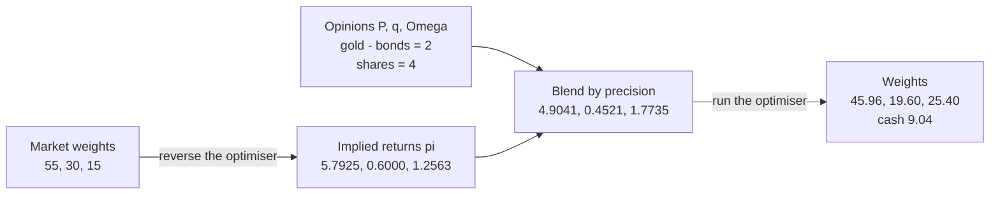
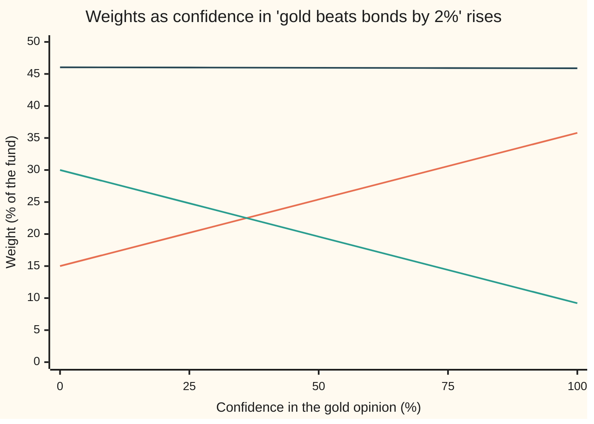

# Black-Litterman: starting from the market and tilting toward your views

[Syllabus](../../../SYLLABUS.md) → [Financial mathematics](../../../SYLLABUS.md#w12) → [Portfolio Theory](../../../SYLLABUS.md#w12-s37) → Black-Litterman

---

## General Overview

A fund holds three things: shares, bonds and gold. Suppose all investors together hold those three in the split 55 percent shares, 30 percent bonds, 15 percent gold, and the fund starts from the same split. Its manager has one opinion: over the next year, gold will beat bonds by 2 percent. She has a second: shares will beat cash by 4 percent. She is half sure of each.

The obvious move is to write down a full list of expected returns and hand it to an optimiser, the machine that picks the best mix of risk and return. That goes badly. The optimiser believes every digit, so small guesses become huge bets: the [Estimation error](07-estimation-error-and-shrinkage.md) card shows its weights swinging wildly. And the manager has no opinion at all about most returns; she has two.

Fischer Black and Robert Litterman, at Goldman Sachs around 1990, fixed both problems. Start from the returns that would make the market's own 55-30-15 split the best portfolio. Treat those as a best guess, held with some doubt. Treat each opinion as a second, noisy measurement. Blend the two the way any two noisy measurements are blended, by how precise each is. Then hand the blend to the optimiser. Here the fund ends at 45.96 percent shares, 19.60 percent bonds, 25.40 percent gold and 9.04 percent cash.

**Black-Litterman reads the returns the market's weights imply, blends them with stated opinions in proportion to their precision, and turns the blend back into weights that tilt away from the market only along the opinions.**

**What kind of fact this is:** a model: treating expected returns as uncertain, normally distributed quantities centred on the market's implied returns is an assumption, not a law. Inside the model, the blend is a theorem, proved on this card in Why it works.

### The picture: the market's weights and the tilted weights

```
Weights, percent of the fund (one █ = 2.5 percent)
shares  market          ██████████████████████  55.00
        Black-Litterman ██████████████████      45.96
bonds   market          ████████████            30.00
        Black-Litterman ████████                19.60
gold    market          ██████                  15.00
        Black-Litterman ██████████              25.40
cash    market                                   0.00
        Black-Litterman ████                     9.04
```

Gold gains exactly what bonds lose: 10.40 points each. That is the first opinion, bought as a unit. Shares lose 9.04 points to cash: that is the second. Nothing else moves.

---

## The formula

Notation first. A list of three numbers, one per asset, is a **vector**. A table of numbers is a **matrix**; multiplying a matrix by a vector gives weighted sums, row by row. A raised ⊤, as in $P^\top$, turns rows into columns (the **transpose**). A raised $-1$ undoes multiplication by a matrix (the **inverse**), the way dividing undoes multiplying. The [The efficient frontier](02-efficient-frontier-and-minimum-variance.md) card uses the same notation.

Three lines, one per stage:

$$\pi = \delta\,\Sigma\,w_m$$

$$\mu_{BL} = \pi + \tau\Sigma P^\top\left(P\,\tau\Sigma\,P^\top + \Omega\right)^{-1}\left(q - P\pi\right)$$

$$w_{BL} = (\delta\Sigma)^{-1}\mu_{BL} = w_m + P^\top\lambda, \qquad \lambda = \frac{\tau}{\delta}\left(P\,\tau\Sigma\,P^\top + \Omega\right)^{-1}\left(q - P\pi\right)$$

**Read it aloud:** the market's weights, pushed through the risk table, give the returns the market must expect; move those returns toward each opinion by the opinion's surprise, scaled by how precise it is; buy the market plus a slice of each opinion's own portfolio.

| Symbol | Plain meaning | In our example | Push it up and the answer… |
| --- | --- | --- | --- |
| $w_m$ | the market's weights: each asset's share of all the money invested in the three | 55, 30, 15 percent | the implied returns follow the weights |
| $\Sigma$ | the covariance matrix: each asset's variance on the diagonal, how pairs move together off it. Say "sigma". | shares 0.04, bonds 0.0036, gold 0.0225 on the diagonal | implied returns rise in proportion |
| $\delta$ | risk aversion: how much expected return one unit of variance must pay. Say "delta". | 2.5 | implied returns rise in proportion |
| $\pi$ | implied returns: the expected returns above cash that make $w_m$ the best portfolio. Say "pi". | 5.7925, 0.6000, 1.2563 percent | |
| $\tau$ | how uncertain $\pi$ is, as a fraction of $\Sigma$. Say "tau". | 0.05 | opinions count for more |
| $P$, $p$ | the pick matrix: one row per opinion, saying which portfolio the opinion is about; $p$ is one row | rows `(0, -1, 1)` and `(1, 0, 0)` | |
| $q$ | the opinions: the return above cash each row's portfolio will earn | 2 and 4 percent | the tilt toward that opinion grows |
| $\Omega$, $\omega$ | the opinions' uncertainty: their variances on a diagonal; $\omega$ is one opinion's variance. Say "omega". | 0.001305 and 0.002 | opinions count for less |
| $S$, $z$ | the bracket $P\,\tau\Sigma\,P^\top + \Omega$, total doubt about each opinion; $z$ solves $S z = q - P\pi$ | diagonal 0.00261, 0.004; $z$ = 5.2004, −4.5203 | |
| $\mu$, $\mu_{BL}$ | the true expected returns above cash, unknown; and the blend, the best guess at them after the opinions. Say "mu". | blend 4.9041, 0.4521, 1.7735 percent | |
| $w$, $w_{BL}$ | any portfolio's weights; the Black-Litterman weights, what the optimiser buys with the blend | 45.96, 19.60, 25.40 percent | |
| $\lambda$ | how much of each opinion's portfolio is added to the market. Say "lambda". | 10.40 and -9.04 percent | |
| $c$ | confidence in one opinion: the fraction of its surprise the blend accepts, between 0 and 1 | 0.5 | the blend moves nearer the opinion |
| $A$, $I$, $m$ | used only in the folded proof: $A = C^{-1} + P^\top\Omega^{-1}P$ with $C = \tau\Sigma$; $I$ the identity matrix; $m$ the blend written as on this card | — | |

The surprise is $q - P\pi$: each opinion minus what the market already implies for the same portfolio. The bracket $P\,\tau\Sigma\,P^\top + \Omega$ is the total uncertainty about each opinion: the prior's doubt about that portfolio plus the opinion's own doubt. Confidence sets each opinion's variance by one rule, used throughout this card: the opinion's variance equals the prior's variance for that portfolio times $(1 - c)/c$.

### When it holds

- **The market's weights are an optimum.** Reverse optimisation assumes some investor with risk aversion $\delta$ and covariance $\Sigma$ would choose $w_m$, which is what [CAPM](04-capm-and-beta.md) argues. If the market is not such an optimum, $\pi$ is only a sensible centre, not an equilibrium.
- **The covariance is known.** Any error in $\Sigma$ passes straight into $\pi$, since $\pi$ is $\Sigma$ times a fixed vector.
- **Normal doubt.** The prior and the opinions' errors are taken as normal. Otherwise the blend is still the best straight-line combination of the two, but no longer the full posterior.
- **No weight limits.** The optimiser may short and borrow at the cash rate. With a no-shorting rule the flipped opinion below, which asks for minus 5.25 percent gold, would be cut off, and the neat market-plus-slices shape breaks.
- **Two dials, one ratio.** Only $\tau$ against $\Omega$ matters for the blend. Scaling both together changes nothing; raising $\tau$ alone gives the opinions more weight.

---

## Why it works

### Step 0: two noisy measurements of one unknown

The true expected returns are unknown. The market offers one noisy reading of them. The manager offers another, of certain combinations. The [Normal-normal](../../09-Probability%20and%20statistics/10-Bayesian%20Inference/03-normal-normal.md) card shows how two normal readings of one quantity combine: add their precisions (one over the variance), and average the readings weighted by precision. Black-Litterman is that rule with vectors and matrices in place of single numbers.



The chart runs left to right: weights to returns, returns and opinions to a blend, blend back to weights. All figures are percent.

### Step 1: reverse the optimiser

A mean-variance investor with weights $w$ earns expected return above cash $w^\top\mu$ (each weight times its asset's return, summed) and suffers variance $w^\top\Sigma w$. She maximises

$$w^\top\mu - \frac{\delta}{2}\,w^\top\Sigma w.$$

This is a bowl turned upside down, so its top is where the slope is zero. The slope in $w$ is $\mu - \delta\Sigma w$. Setting it to zero gives $\mu = \delta\Sigma w$.

The usual problem goes from returns to weights. Run it backwards. The weights are known: $w_m$. So the returns that make them optimal are $\pi = \delta\Sigma w_m$. For shares that is 2.5 times the covariance of shares with the market portfolio, which gives 5.7925 percent.

**Existence, uniqueness, boundaries.** $\pi$ always exists: it is a multiplication. It is unique for a given $\delta$ and $\Sigma$. Going back from $\pi$ to weights needs $\Sigma$ invertible, which holds when no portfolio has zero variance (the house $\Sigma$ qualifies). If one asset were an exact copy of a mix of others, $\pi$ would still exist, but many weight vectors would share it. The check feeds $\pi$ to the optimiser and gets 55, 30, 15 back.

The scale comes from $\delta$. Multiplying $\pi = \delta\Sigma w_m$ by $w_m$ gives the market's premium over cash: $\delta$ times the market's variance. With the market's volatility at 11.9236 percent, $\delta = 2.5$ gives a premium of 3.5543 percent. Choosing $\delta$ is choosing that premium.

### Step 2: the market reading, with doubt

The model says the true $\mu$ is normal, centred on $\pi$, with covariance $\tau\Sigma$. The shape of the doubt copies $\Sigma$: assets that move together have means that are uncertain together. The size is small: $\tau = 0.05$ says the doubt about a year's average return is a twentieth of the spread of a single year's return, roughly what twenty years of data would give.

### Step 3: opinions as readings of portfolios

Each opinion is about a portfolio. "Gold beats bonds by 2 percent" is about the portfolio long one unit of gold and short one unit of bonds: the row `(0, -1, 1)` of $P$. "Shares beat cash by 4 percent" is the row `(1, 0, 0)`. A row that sums to zero is relative; a row that sums to one is absolute.

The model says each opinion is the truth plus a normal error: $q = P\mu + \varepsilon$, where the errors have covariance $\Omega$. Independent opinions give a diagonal $\Omega$.

Before any opinion, the market already implies a value for each portfolio: $P\pi$. For gold minus bonds that is 1.2563 minus 0.6000, which is 0.6563 percent. The opinion says 2. The surprise is the gap.

### Step 4: blend by precision

Add the two readings' precisions and weight their centres. That gives the precision form:

$$\mu_{BL} = \left[(\tau\Sigma)^{-1} + P^\top\Omega^{-1}P\right]^{-1}\left[(\tau\Sigma)^{-1}\pi + P^\top\Omega^{-1}q\right].$$

The first bracket is total precision; the second is each reading's centre times its precision. The formula on this card is the same thing rearranged: start at $\pi$ and add a correction proportional to the surprise. The rearranged form needs one small inverse per opinion instead of one per asset, and it still works when an opinion is certain ($\Omega$ has a zero), where the precision form would divide by zero.

<details>
<summary>Detailed proof</summary>

Write $C = \tau\Sigma$. The prior density is proportional to $\exp[-\tfrac12(\mu-\pi)^\top C^{-1}(\mu-\pi)]$. Given $\mu$, the opinions have density proportional to $\exp[-\tfrac12(q-P\mu)^\top\Omega^{-1}(q-P\mu)]$. By Bayes' rule the posterior is proportional to their product.

Expand the two exponents and keep the terms in $\mu$: $-\tfrac12\mu^\top A\mu + \mu^\top b$, with $A = C^{-1} + P^\top\Omega^{-1}P$ and $b = C^{-1}\pi + P^\top\Omega^{-1}q$. Completing the square turns this into $-\tfrac12(\mu - A^{-1}b)^\top A(\mu - A^{-1}b)$ plus a constant. So the posterior is normal with mean $A^{-1}b$ and covariance $A^{-1}$. That is the precision form.

Now show the card's form gives the same mean. Let $S = PCP^\top + \Omega$ and $m = \pi + CP^\top S^{-1}(q - P\pi)$. Multiply $m$ by $A$:

$Am = C^{-1}\pi + P^\top\Omega^{-1}P\pi + (C^{-1} + P^\top\Omega^{-1}P)CP^\top S^{-1}(q - P\pi)$.

The last term is $P^\top(I + \Omega^{-1}PCP^\top)S^{-1}(q-P\pi)$, where $I$ is the identity matrix. The bracket equals $\Omega^{-1}(\Omega + PCP^\top) = \Omega^{-1}S$, so the term collapses to $P^\top\Omega^{-1}(q - P\pi)$. Adding up, $Am = C^{-1}\pi + P^\top\Omega^{-1}q = b$. So $m = A^{-1}b$: the two forms agree. The code checks it to twelve decimal places.

</details>

### Step 5: one opinion alone moves a fixed fraction of the way

Take one opinion, row $p$, with variance $\omega$. Multiply the card's formula by $p$. The blended value of that portfolio is the market's value plus the fraction $p\tau\Sigma p^\top / (p\tau\Sigma p^\top + \omega)$ of the surprise: the prior's doubt over total doubt. Setting $\omega$ to the prior's doubt times $(1-c)/c$ makes that fraction exactly $c$. So $c$ is a confidence dial with a meaning: the share of the surprise accepted. At $c = 1$ the opinion is certain and holds exactly. At $c = 0$ it is ignored.

With two opinions the fractions interact slightly, because each opinion's portfolio moves with the other's. Here the interaction is small: the two portfolios share no asset.

### Step 6: back to weights, and why only the opinions move

Feed $\mu_{BL}$ to the optimiser: $w_{BL} = (\delta\Sigma)^{-1}\mu_{BL}$. Split $\mu_{BL}$ into $\pi$ plus the correction. The $\pi$ part returns $w_m$, by Step 1. In the correction, $(\delta\Sigma)^{-1}$ meets $\tau\Sigma$, and the two $\Sigma$'s cancel, leaving $P^\top\lambda$ with $\lambda = (\tau/\delta)(P\tau\Sigma P^\top + \Omega)^{-1}(q - P\pi)$.

So the new portfolio is the market plus $\lambda$ units of each opinion's portfolio. No other direction can appear. An opinion about gold and bonds never touches shares directly. An asset nobody has an opinion about keeps its market weight, unless an opinion's portfolio contains it.

The same blend can be reached as a regression: stack the market reading and the opinions as data, and solve by weighted least squares. That is Theil's mixed estimation, and it pulls the estimate toward $\pi$ the way [Estimation error](07-estimation-error-and-shrinkage.md) pulls a noisy covariance toward a target.

---

## Worked numbers, by hand

Covariances from the shelf's house market: volatility 20 percent for shares, 6 for bonds, 15 for gold; correlation 0.2 between shares and bonds, 0.1 between shares and gold, 0 between bonds and gold. Opinions at confidence $c = 0.5$.

| Step | Arithmetic | Value |
| --- | --- | --- |
| covariance, shares with bonds | 0.2 × 0.20 × 0.06 | 0.0024 |
| covariance, shares with gold | 0.1 × 0.20 × 0.15 | 0.003 |
| implied, shares | 2.5 × (0.04 × 0.55 + 0.0024 × 0.30 + 0.003 × 0.15) | 5.7925 % |
| implied, bonds | 2.5 × (0.0024 × 0.55 + 0.0036 × 0.30) | 0.6000 % |
| implied, gold | 2.5 × (0.003 × 0.55 + 0.0225 × 0.15) | 1.2563 % |
| market's gold minus bonds | 1.2563 − 0.6000 | 0.6563 % |
| prior doubt on gold minus bonds | 0.05 × (0.0036 + 0.0225 − 2 × 0) | 0.001305 |
| opinion 1 variance at c = 0.5 | 0.001305 × (1 − 0.5) / 0.5 | 0.001305 |
| opinion 2 variance at c = 0.5 | 0.05 × 0.04 × 1 | 0.002 |
| surprises | 2 − 0.6563 and 4 − 5.7925 | 1.3437 %, −1.7925 % |
| prior doubt shared by the two opinions | 0.05 × (0.003 − 0.0024) | 0.00003 |
| total doubt $S$, each opinion | 0.001305 + 0.001305 and 0.002 + 0.002 | 0.00261, 0.004 |
| solve $S z$ = surprises | 0.00261 z₁ + 0.00003 z₂ = 0.013437; 0.00003 z₁ + 0.004 z₂ = −0.017925 | z = 5.2004, −4.5203 |
| blend, shares | 0.057925 + 0.05 × (0.0006 × 5.2004 + 0.04 × (−4.5203)) | 4.9041 % |
| blend, all three | $\pi + \tau\Sigma P^\top z$ | 4.9041, 0.4521, 1.7735 % |
| blended gold minus bonds | 1.7735 − 0.4521 | 1.3213 % |
| slices of each opinion's portfolio | $\lambda$ = (0.05 / 2.5) × z | 10.4008 %, −9.0405 % |
| weights | 55 − 9.0405, 30 − 10.4008, 15 + 10.4008 | **45.96, 19.60, 25.40 %** |
| cash | 100 − 45.96 − 19.60 − 25.40 | **9.04 %** |

The fund moves about a tenth of its money from bonds into gold and about a tenth from shares into cash. The gold-over-bonds return it now expects is 1.3213 percent: roughly halfway from the market's 0.6563 to the opinion's 2, as a 50 percent confidence should give.

### Turning the confidence dial

Hold the shares opinion at 50 percent and turn the gold opinion's confidence from 0 to 100 percent.



Orange: gold. Green: bonds. Dark blue: shares. Gold and bonds move as mirror images, because the opinion is bought as one portfolio. Shares barely move: the only link is the small covariance between the two opinions' portfolios. At 0 percent gold and bonds sit at their market weights, 15 and 30. At 100 percent the blended gold-over-bonds return is exactly 2.00 percent, and gold reaches 35.80 percent of the fund.

### What breaks if you drop a piece

| Mistake | Comes out at (shares, bonds, gold) | What went wrong |
| --- | --- | --- |
| $\tau = 1$, opinions' variances unchanged | 37.64, 10.01, 34.99 % | the market reading is treated as twenty times less certain, so the opinions take over |
| Row written bonds minus gold, $q$ still 2 | 46.19, 50.25, −5.25 % | the opinion now says bonds beat gold: the fund shorts gold |
| "Gold beats bonds" read as "gold beats cash by 2" | 45.77, 30.00, 22.23 % | an absolute opinion on gold alone: bonds are never sold |
| Both opinions certain, $\Omega = 0$ | 36.76, 8.99, 36.01 % | the blend obeys both opinions exactly; nothing is left of the doubt |

---

## Code, from first principles, and it actually runs

The code builds $\Sigma$ from the house volatilities and correlations, reverses the optimiser, and checks that feeding $\pi$ forward returns 55, 30, 15. It then reaches the blend by three independent roads. The view-space formula solves a two-by-two system. The precision form solves a three-by-three system and never forms the surprise. A Monte Carlo road draws 400,000 candidate return vectors from the prior (with its own random numbers and its own Cholesky factor, the matrix square root that shapes the draws), weights each by how well it fits the opinions, and averages. The weights are reached twice: by the optimiser, and as market plus slices. It also runs the confidence sweep and the four mistakes. Seven asserts: reverse optimisation round trip; formula against precision form; Monte Carlo within four standard errors; optimiser against market-plus-slices; a certain opinion holds exactly; no surprise means no move; one opinion alone at $c = 0.25$ moves a quarter of the way.

### Python

```python
# Black-Litterman -- the check behind the card.  Python standard library only.
# Assets in the order shares, bonds, gold.  Reverse optimisation gives the
# returns the market's weights imply; the posterior is then reached three
# ways: the view-space formula, the precision (Bayes) formula, and a Monte
# Carlo draw from the prior, each draw weighted by how well it fits the views.
import math

VOL = [0.20, 0.06, 0.15]
CORR = [[1.0, 0.2, 0.1], [0.2, 1.0, 0.0], [0.1, 0.0, 1.0]]
SIG = [[CORR[i][j] * VOL[i] * VOL[j] for j in range(3)] for i in range(3)]
W_MKT = [0.55, 0.30, 0.15]                 # the market's weights
DELTA, TAU = 2.5, 0.05                     # risk aversion, prior scale
P = [[0.0, -1.0, 1.0], [1.0, 0.0, 0.0]]    # view 1: gold minus bonds; view 2: shares
Q = [0.02, 0.04]                           # the views, as returns above cash


def matvec(a, x):
    return [sum(r[j] * x[j] for j in range(len(x))) for r in a]


def solve(a, b):                           # Gaussian elimination, partial pivoting
    n = len(b)
    m = [list(a[i]) + [b[i]] for i in range(n)]
    for j in range(n):
        p = max(range(j, n), key=lambda i: abs(m[i][j]))
        m[j], m[p] = m[p], m[j]
        for i in range(n):
            if i != j:
                f = m[i][j] / m[j][j]
                m[i] = [u - f * v for u, v in zip(m[i], m[j])]
    return [m[i][n] / m[i][i] for i in range(n)]


PI = [DELTA * v for v in matvec(SIG, W_MKT)]   # reverse optimisation


def omega_for(p, conf):                    # confidence c -> view variance
    pcp = sum(p[i] * TAU * SIG[i][j] * p[j] for i in range(3) for j in range(3))
    return pcp * (1.0 - conf) / conf


def posterior(rows, q, om, tau=TAU):       # view-space form: a k x k solve
    k = len(rows)
    cp = [[tau * sum(SIG[i][j] * rows[a][j] for j in range(3)) for a in range(k)] for i in range(3)]
    s = [[sum(rows[a][i] * cp[i][b] for i in range(3)) + (om[a] if a == b else 0.0)
          for b in range(k)] for a in range(k)]
    z = solve(s, [q[a] - sum(rows[a][i] * PI[i] for i in range(3)) for a in range(k)])
    return [PI[i] + sum(cp[i][a] * z[a] for a in range(k)) for i in range(3)], z


def precision_form(om, q=Q):               # Bayes form: a 3 x 3 solve
    cols = [solve([[TAU * v for v in r] for r in SIG], [float(i == j) for i in range(3)])
            for j in range(3)]             # columns of the prior precision
    a = [[cols[j][i] + sum(P[k][i] * P[k][j] / om[k] for k in range(2)) for j in range(3)]
         for i in range(3)]
    b = [sum(cols[j][i] * PI[j] for j in range(3)) + sum(P[k][i] * q[k] / om[k] for k in range(2))
         for i in range(3)]
    return solve(a, b)


def weights(mu):
    return solve(SIG, [v / DELTA for v in mu])


state = 20260928
def uniform():                             # splitmix64, written out
    global state
    M = (1 << 64) - 1
    state = (state + 0x9E3779B97F4A7C15) & M
    z = ((state ^ (state >> 30)) * 0xBF58476D1CE4E5B9) & M
    z = ((z ^ (z >> 27)) * 0x94D049BB133111EB) & M
    return (((z ^ (z >> 31)) >> 11) + 0.5) / 9007199254740992.0


def monte_carlo(om, n):                    # prior draws, weighted by the views
    l = [[0.0] * 3 for _ in range(3)]      # Cholesky factor of tau * Sigma
    for i in range(3):
        for j in range(i + 1):
            r = TAU * SIG[i][j] - sum(l[i][k] * l[j][k] for k in range(j))
            l[i][j] = math.sqrt(r) if i == j else r / l[j][j]
    draws = []
    for _ in range(n):
        e = [math.sqrt(-2.0 * math.log(uniform())) * math.cos(2.0 * math.pi * uniform())
             for _ in range(3)]
        th = [PI[i] + sum(l[i][k] * e[k] for k in range(i + 1)) for i in range(3)]
        g = sum((Q[a] - sum(P[a][i] * th[i] for i in range(3))) ** 2 / om[a] for a in range(2))
        draws.append((math.exp(-0.5 * g), th))
    sw = sum(w for w, _ in draws)
    mean = [sum(w * th[i] for w, th in draws) / sw for i in range(3)]
    se = [math.sqrt(sum((w * (th[i] - mean[i])) ** 2 for w, th in draws)) / sw for i in range(3)]
    return mean, se


def pct(xs, d=4):
    return "  ".join(f"{100 * x:.{d}f}" for x in xs)


for name, row in zip(("shares", "bonds ", "gold  "), SIG):
    print("covariance row", name, pct(row))
var_m = sum(W_MKT[i] * SIG[i][j] * W_MKT[j] for i in range(3) for j in range(3))
print("market volatility", f"{100 * math.sqrt(var_m):.4f}", " premium", f"{100 * DELTA * var_m:.4f}")
print("implied returns pi       ", pct(PI))
print("optimiser fed pi returns ", pct(back := weights(PI)))
om = [omega_for(p, 0.5) for p in P]
print("view variances x 10000   ", pct([100 * v for v in om]))
print("prior view values        ", pct(matvec(P, PI)))
mu, z = posterior(P, Q, om)
mc, se = monte_carlo(om, 400000)
print("posterior, view-space    ", pct(mu))
print("posterior, precision     ", pct(mu_b := precision_form(om)))
print("posterior, Monte Carlo   ", pct(mc))
print("Monte Carlo std error    ", pct(se))
print("posterior view values    ", pct(matvec(P, mu)))
w_bl = weights(mu)
lam = [TAU / DELTA * v for v in z]
tilt = [W_MKT[i] + sum(P[a][i] * lam[a] for a in range(2)) for i in range(3)]
print("weights, optimiser       ", pct(w_bl), " cash", f"{100 * (1 - sum(w_bl)):.4f}")
print("weights, market + tilts  ", pct(tilt), " lambda", pct(lam))
print("confidence in view 1: spread, then weights shares bonds gold")
for c in (0.0, 0.25, 0.5, 0.75, 1.0):
    m = posterior(P[1:], Q[1:], om[1:])[0] if c == 0 else posterior(P, Q, [omega_for(P[0], c), om[1]])[0]
    print(f"  c = {100 * c:3.0f}", pct([m[2] - m[1]] + weights(m), 2))
certain = posterior(P, Q, [0.0, om[1]])[0]
still = precision_form(om, matvec(P, PI))
print("mistakes, weights shares bonds gold:")
print("  tau = 1, views unchanged     ", pct(weights(posterior(P, Q, om, 1.0)[0]), 2))
print("  view row flipped (bonds-gold)", pct(weights(posterior([[0.0, 1.0, -1.0], P[1]], Q, om)[0]), 2))
gold = [0.0, 0.0, 1.0]
print("  gold view read as absolute   ", pct(weights(posterior([gold, P[1]], Q, [omega_for(gold, 0.5), om[1]])[0]), 2))
print("  both views certain (omega 0) ", pct(weights(posterior(P, Q, [0.0, 0.0])[0]), 2))
assert max(abs(back[i] - W_MKT[i]) for i in range(3)) < 1e-12
assert max(abs(mu[i] - mu_b[i]) for i in range(3)) < 1e-12
assert all(abs(mc[i] - mu[i]) < 4 * se[i] for i in range(3))
assert max(abs(w_bl[i] - tilt[i]) for i in range(3)) < 1e-12
assert abs(certain[2] - certain[1] - Q[0]) < 1e-12
assert max(abs(still[i] - PI[i]) for i in range(3)) < 1e-12
one = posterior(P[:1], Q[:1], [omega_for(P[0], 0.25)])[0]    # one view alone moves a quarter of the way
assert abs(one[2] - one[1] - (PI[2] - PI[1] + 0.25 * (Q[0] - PI[2] + PI[1]))) < 1e-12
print("all checks passed")
```

**Ran 2026-09-28 on macOS, Python 3.14.6, standard library only. All checks passed. Output, pasted from the run:**

```
covariance row shares 4.0000  0.2400  0.3000
covariance row bonds  0.2400  0.3600  0.0000
covariance row gold   0.3000  0.0000  2.2500
market volatility 11.9236  premium 3.5543
implied returns pi        5.7925  0.6000  1.2563
optimiser fed pi returns  55.0000  30.0000  15.0000
view variances x 10000    13.0500  20.0000
prior view values         0.6563  5.7925
posterior, view-space     4.9041  0.4521  1.7735
posterior, precision      4.9041  0.4521  1.7735
posterior, Monte Carlo    4.9026  0.4504  1.7750
Monte Carlo std error     0.0049  0.0024  0.0041
posterior view values     1.3213  4.9041
weights, optimiser        45.9595  19.5992  25.4008  cash 9.0405
weights, market + tilts   45.9595  19.5992  25.4008  lambda 10.4008  -9.0405
confidence in view 1: spread, then weights shares bonds gold
  c =   0 0.64  46.04  30.00  15.00
  c =  25 0.98  46.00  24.80  20.20
  c =  50 1.32  45.96  19.60  25.40
  c =  75 1.66  45.92  14.40  30.60
  c = 100 2.00  45.88  9.20  35.80
mistakes, weights shares bonds gold:
  tau = 1, views unchanged      37.64  10.01  34.99
  view row flipped (bonds-gold) 46.19  50.25  -5.25
  gold view read as absolute    45.77  30.00  22.23
  both views certain (omega 0)  36.76  8.99  36.01
all checks passed
```

### Rust

```rust
// Black-Litterman -- the check behind the card.  Rust std only, no crates.
// Assets in the order shares, bonds, gold.  Reverse optimisation gives the
// returns the market's weights imply; the posterior is then reached three
// ways: the view-space formula, the precision (Bayes) formula, and a Monte
// Carlo draw from the prior, each draw weighted by how well it fits the views.
const VOL: [f64; 3] = [0.20, 0.06, 0.15];
const CORR: [[f64; 3]; 3] = [[1.0, 0.2, 0.1], [0.2, 1.0, 0.0], [0.1, 0.0, 1.0]];
const W_MKT: [f64; 3] = [0.55, 0.30, 0.15]; // the market's weights
const DELTA: f64 = 2.5; // risk aversion
const TAU: f64 = 0.05; // prior scale
const Q: [f64; 2] = [0.02, 0.04]; // the views, as returns above cash

type V = Vec<f64>;
type M = Vec<V>;

fn sig() -> M {
    (0..3).map(|i| (0..3).map(|j| CORR[i][j] * VOL[i] * VOL[j]).collect()).collect()
}

fn matvec(a: &M, x: &[f64]) -> V {
    a.iter().map(|r| (0..x.len()).map(|j| r[j] * x[j]).sum()).collect()
}

fn solve(a: &M, b: &[f64]) -> V {
    // Gaussian elimination, partial pivoting
    let n = b.len();
    let mut m: M = (0..n).map(|i| { let mut r = a[i].clone(); r.push(b[i]); r }).collect();
    for j in 0..n {
        let mut p = j;
        for i in j..n { if m[i][j].abs() > m[p][j].abs() { p = i; } }
        m.swap(j, p);
        for i in 0..n {
            if i != j {
                let f = m[i][j] / m[j][j];
                let row_j = m[j].clone();
                for (u, v) in m[i].iter_mut().zip(row_j.iter()) { *u -= f * v; }
            }
        }
    }
    (0..n).map(|i| m[i][n] / m[i][i]).collect()
}

struct Bl { s: M, pi: V }

impl Bl {
    fn omega_for(&self, p: &[f64], conf: f64) -> f64 {
        let mut pcp = 0.0;
        for i in 0..3 { for j in 0..3 { pcp += p[i] * TAU * self.s[i][j] * p[j]; } }
        pcp * (1.0 - conf) / conf
    }
    fn posterior(&self, rows: &M, q: &[f64], om: &[f64], tau: f64) -> (V, V) {
        // view-space form: a k x k solve
        let k = rows.len();
        let cp: M = (0..3).map(|i| (0..k).map(|a| tau * (0..3).map(|j| self.s[i][j] * rows[a][j]).sum::<f64>()).collect()).collect();
        let s: M = (0..k).map(|a| (0..k).map(|b| (0..3).map(|i| rows[a][i] * cp[i][b]).sum::<f64>() + if a == b { om[a] } else { 0.0 }).collect()).collect();
        let surprise: V = (0..k).map(|a| q[a] - (0..3).map(|i| rows[a][i] * self.pi[i]).sum::<f64>()).collect();
        let z = solve(&s, &surprise);
        ((0..3).map(|i| self.pi[i] + (0..k).map(|a| cp[i][a] * z[a]).sum::<f64>()).collect(), z)
    }
    fn precision_form(&self, p: &M, q: &[f64], om: &[f64]) -> V {
        // Bayes form: a 3 x 3 solve
        let c: M = self.s.iter().map(|r| r.iter().map(|v| TAU * v).collect()).collect();
        let cols: M = (0..3).map(|j| solve(&c, &(0..3).map(|i| if i == j { 1.0 } else { 0.0 }).collect::<V>())).collect();
        let a: M = (0..3).map(|i| (0..3).map(|j| cols[j][i] + (0..2).map(|k| p[k][i] * p[k][j] / om[k]).sum::<f64>()).collect()).collect();
        let b: V = (0..3).map(|i| (0..3).map(|j| cols[j][i] * self.pi[j]).sum::<f64>() + (0..2).map(|k| p[k][i] * q[k] / om[k]).sum::<f64>()).collect();
        solve(&a, &b)
    }
    fn weights(&self, mu: &[f64]) -> V {
        solve(&self.s, &mu.iter().map(|v| v / DELTA).collect::<V>())
    }
}

struct Rng(u64);
impl Rng {
    fn uniform(&mut self) -> f64 {
        // splitmix64, written out
        self.0 = self.0.wrapping_add(0x9E3779B97F4A7C15);
        let mut z = (self.0 ^ (self.0 >> 30)).wrapping_mul(0xBF58476D1CE4E5B9);
        z = (z ^ (z >> 27)).wrapping_mul(0x94D049BB133111EB);
        (((z ^ (z >> 31)) >> 11) as f64 + 0.5) / 9007199254740992.0
    }
}

fn monte_carlo(bl: &Bl, p: &M, om: &[f64], n: usize) -> (V, V) {
    // prior draws, weighted by the views
    let mut l = vec![vec![0.0; 3]; 3]; // Cholesky factor of tau * Sigma
    for i in 0..3 {
        for j in 0..=i {
            let r = TAU * bl.s[i][j] - (0..j).map(|k| l[i][k] * l[j][k]).sum::<f64>();
            l[i][j] = if i == j { r.sqrt() } else { r / l[j][j] };
        }
    }
    let mut rng = Rng(20260928);
    let mut draws: Vec<(f64, V)> = Vec::with_capacity(n);
    for _ in 0..n {
        let e: V = (0..3).map(|_| { let u1 = rng.uniform(); let u2 = rng.uniform();
            (-2.0 * u1.ln()).sqrt() * (2.0 * std::f64::consts::PI * u2).cos() }).collect();
        let th: V = (0..3).map(|i| bl.pi[i] + (0..=i).map(|k| l[i][k] * e[k]).sum::<f64>()).collect();
        let g: f64 = (0..2).map(|a| (Q[a] - (0..3).map(|i| p[a][i] * th[i]).sum::<f64>()).powi(2) / om[a]).sum();
        draws.push(((-0.5 * g).exp(), th));
    }
    let sw: f64 = draws.iter().map(|d| d.0).sum();
    let mean: V = (0..3).map(|i| draws.iter().map(|d| d.0 * d.1[i]).sum::<f64>() / sw).collect();
    let se: V = (0..3).map(|i| draws.iter().map(|d| (d.0 * (d.1[i] - mean[i])).powi(2)).sum::<f64>().sqrt() / sw).collect();
    (mean, se)
}

fn pct(xs: &[f64]) -> String {
    xs.iter().map(|x| format!("{:.4}", 100.0 * x)).collect::<Vec<_>>().join("  ")
}

fn pct2(xs: &[f64]) -> String { xs.iter().map(|x| format!("{:.2}", 100.0 * x)).collect::<Vec<_>>().join("  ") }

fn main() {
    let s = sig();
    let pi: V = matvec(&s, &W_MKT).iter().map(|v| DELTA * v).collect(); // reverse optimisation
    let bl = Bl { s: s.clone(), pi: pi.clone() };
    let p: M = vec![vec![0.0, -1.0, 1.0], vec![1.0, 0.0, 0.0]]; // gold minus bonds; shares
    for (name, row) in ["shares", "bonds ", "gold  "].iter().zip(s.iter()) {
        println!("covariance row {} {}", name, pct(row));
    }
    let var_m: f64 = (0..3).map(|i| (0..3).map(|j| W_MKT[i] * s[i][j] * W_MKT[j]).sum::<f64>()).sum();
    println!("market volatility {:.4}  premium {:.4}", 100.0 * var_m.sqrt(), 100.0 * DELTA * var_m);
    println!("implied returns pi        {}", pct(&pi));
    let back = bl.weights(&pi);
    println!("optimiser fed pi returns  {}", pct(&back));
    let om: V = p.iter().map(|r| bl.omega_for(r, 0.5)).collect();
    println!("view variances x 10000    {}", pct(&om.iter().map(|v| 100.0 * v).collect::<V>()));
    println!("prior view values         {}", pct(&matvec(&p, &pi)));
    let (mu, z) = bl.posterior(&p, &Q, &om, TAU);
    let mu_b = bl.precision_form(&p, &Q, &om);
    let (mc, se) = monte_carlo(&bl, &p, &om, 400000);
    println!("posterior, view-space     {}", pct(&mu));
    println!("posterior, precision      {}", pct(&mu_b));
    println!("posterior, Monte Carlo    {}", pct(&mc));
    println!("Monte Carlo std error     {}", pct(&se));
    println!("posterior view values     {}", pct(&matvec(&p, &mu)));
    let w_bl = bl.weights(&mu);
    let lam: V = z.iter().map(|v| TAU / DELTA * v).collect();
    let tilt: V = (0..3).map(|i| W_MKT[i] + (0..2).map(|a| p[a][i] * lam[a]).sum::<f64>()).collect();
    println!("weights, optimiser        {}  cash {:.4}", pct(&w_bl), 100.0 * (1.0 - w_bl.iter().sum::<f64>()));
    println!("weights, market + tilts   {}  lambda {}", pct(&tilt), pct(&lam));
    println!("confidence in view 1: spread, then weights shares bonds gold");
    for c in [0.0, 0.25, 0.5, 0.75, 1.0] {
        let m = if c == 0.0 { bl.posterior(&p[1..].to_vec(), &Q[1..], &om[1..], TAU).0 }
                else { bl.posterior(&p, &Q, &[bl.omega_for(&p[0], c), om[1]], TAU).0 };
        let mut row = vec![m[2] - m[1]];
        row.extend(bl.weights(&m));
        println!("  c = {:3.0} {}", 100.0 * c, pct2(&row));
    }
    let certain = bl.posterior(&p, &Q, &[0.0, om[1]], TAU).0;
    let still = bl.precision_form(&p, &matvec(&p, &pi), &om);
    println!("mistakes, weights shares bonds gold:");
    println!("  tau = 1, views unchanged      {}", pct2(&bl.weights(&bl.posterior(&p, &Q, &om, 1.0).0)));
    let flip: M = vec![vec![0.0, 1.0, -1.0], p[1].clone()];
    println!("  view row flipped (bonds-gold) {}", pct2(&bl.weights(&bl.posterior(&flip, &Q, &om, TAU).0)));
    let gold: M = vec![vec![0.0, 0.0, 1.0], p[1].clone()];
    let om_g = [bl.omega_for(&gold[0], 0.5), om[1]];
    println!("  gold view read as absolute    {}", pct2(&bl.weights(&bl.posterior(&gold, &Q, &om_g, TAU).0)));
    println!("  both views certain (omega 0)  {}", pct2(&bl.weights(&bl.posterior(&p, &Q, &[0.0, 0.0], TAU).0)));
    assert!((0..3).all(|i| (back[i] - W_MKT[i]).abs() < 1e-12));
    assert!((0..3).all(|i| (mu[i] - mu_b[i]).abs() < 1e-12));
    assert!((0..3).all(|i| (mc[i] - mu[i]).abs() < 4.0 * se[i]));
    assert!((0..3).all(|i| (w_bl[i] - tilt[i]).abs() < 1e-12));
    assert!((certain[2] - certain[1] - Q[0]).abs() < 1e-12);
    assert!((0..3).all(|i| (still[i] - pi[i]).abs() < 1e-12));
    let one = bl.posterior(&p[..1].to_vec(), &Q[..1], &[bl.omega_for(&p[0], 0.25)], TAU).0; // one view alone: a quarter of the way
    assert!((one[2] - one[1] - (pi[2] - pi[1] + 0.25 * (Q[0] - pi[2] + pi[1]))).abs() < 1e-12);
    println!("all checks passed");
}
```

**Ran 2026-09-28 on macOS, rustc 1.98.1, no crates. All checks passed. Output, pasted from the run:**

```
covariance row shares 4.0000  0.2400  0.3000
covariance row bonds  0.2400  0.3600  0.0000
covariance row gold   0.3000  0.0000  2.2500
market volatility 11.9236  premium 3.5543
implied returns pi        5.7925  0.6000  1.2563
optimiser fed pi returns  55.0000  30.0000  15.0000
view variances x 10000    13.0500  20.0000
prior view values         0.6563  5.7925
posterior, view-space     4.9041  0.4521  1.7735
posterior, precision      4.9041  0.4521  1.7735
posterior, Monte Carlo    4.9026  0.4504  1.7750
Monte Carlo std error     0.0049  0.0024  0.0041
posterior view values     1.3213  4.9041
weights, optimiser        45.9595  19.5992  25.4008  cash 9.0405
weights, market + tilts   45.9595  19.5992  25.4008  lambda 10.4008  -9.0405
confidence in view 1: spread, then weights shares bonds gold
  c =   0 0.64  46.04  30.00  15.00
  c =  25 0.98  46.00  24.80  20.20
  c =  50 1.32  45.96  19.60  25.40
  c =  75 1.66  45.92  14.40  30.60
  c = 100 2.00  45.88  9.20  35.80
mistakes, weights shares bonds gold:
  tau = 1, views unchanged      37.64  10.01  34.99
  view row flipped (bonds-gold) 46.19  50.25  -5.25
  gold view read as absolute    45.77  30.00  22.23
  both views certain (omega 0)  36.76  8.99  36.01
all checks passed
```

The two outputs are identical to the last digit, Monte Carlo included: both programs run the same random-number generator from the same seed. The Monte Carlo blend differs from the formula by less than one standard error in each asset: 4.9026 against 4.9041 for shares, with a standard error of 0.0049.

> [!TIP]
> **Try changing**
> - **Set the gold opinion's confidence to 100 percent.** Guess first: does gold go to 2 percent, or does its weight double? Answer: the blended gold-over-bonds return becomes exactly 2.00 percent, and gold's weight rises to 35.80 percent. The check's sweep prints it.
> - **Set both opinions equal to what the market implies** (`q = P pi`). Guess first. Answer: no surprise, no move. The blend equals $\pi$ and the weights are 55, 30, 15; the sixth assert checks it.
> - **Set `tau` to 1 and leave the opinions' variances alone.** Guess first: more or less tilt? Answer: more. Weights 37.64, 10.01, 34.99 percent: the market reading is now looser than the opinions.
> - **Drop the gold opinion (confidence 0).** Guess first: do bonds and gold move? Answer: no. They stay at 30 and 15, because the shares opinion's portfolio holds only shares.

---

## The usual mistake

> [!warning]
> **Thinking Black-Litterman finds better returns.** It finds returns consistent with the market's weights plus the stated opinions, nothing more. With no opinions it hands back the market portfolio exactly. Every departure from the market is an opinion someone typed in. If the opinions are wrong, the tilt is wrong, just smaller and better behaved than a raw optimiser's.
>
> - **Relative read as absolute.** "Gold beats bonds by 2" is a row summing to zero. Written as gold alone at 2 percent, bonds never move and gold lands at 22.23 percent instead of 25.40.
> - **Sign of the row.** `(0, 1, -1)` with $q$ = 2 says bonds beat gold. The fund shorts gold: −5.25 percent.
> - **Changing $\tau$ without $\Omega$.** Only their ratio matters. Raising $\tau$ to 1 while keeping the opinions' variances gives 37.64 percent shares instead of 45.96.
> - **Expecting the weights to add to 100 percent.** The shares opinion is a view about shares against cash, so 9.04 percent of the fund goes to cash. A relative opinion alone would leave the total unchanged.

---

## Where you meet it in real life

- **Asset allocation committees.** Pension funds and multi-asset managers start from market weights and write each house view as a row of $P$ with a confidence. The output is a tilt they can explain line by line.
- **Global bond and currency allocation.** The model's first setting: Black and Litterman built it for global bond, equity and currency portfolios at Goldman Sachs, where raw optimisers gave extreme weights.
- **Combining analysts.** Several analysts' forecasts become several rows; conflicting opinions pull against each other in proportion to their confidence instead of the last one winning.
- **Covariance from factors.** The $\Sigma$ that drives everything is often built from a factor model, as in [Factor models](05-factor-models-and-apt.md).
- **Risk budgeting.** Some desks feed the blended returns to a risk-budget optimiser instead of plain mean-variance; [Risk parity](08-risk-parity-and-alternative-weightings.md) gives that other way of weighting.

> **Say it back**
> Reverse the optimiser: the market's weights imply a set of expected returns. Treat those as a noisy reading, and each opinion as another noisy reading of one portfolio. Blend them by precision, so a confident opinion moves the estimate further. Run the optimiser on the blend. The result is the market plus a slice of each opinion's portfolio, and nothing else.

---

## What this builds on

- [Factor models](05-factor-models-and-apt.md): the covariance matrix and how it is estimated from a few common factors; here it sets both the implied returns and the shape of the doubt.
- [Normal-normal](../../09-Probability%20and%20statistics/10-Bayesian%20Inference/03-normal-normal.md): two normal readings of one quantity combine by adding precisions; this card is the same rule with matrices.

---

## Where this goes next

- [Estimation error](07-estimation-error-and-shrinkage.md): why an optimiser fed raw estimates chases noise, and how shrinking the covariance toward a target calms it, as Black-Litterman shrinks the returns toward $\pi$.
- [Risk parity](08-risk-parity-and-alternative-weightings.md): a way to weight assets that needs no expected returns at all.

Black-Litterman calms the expected returns but trusts the covariance completely; the open question is what to do when the covariance itself is a noisy estimate.

---

## Sources

Verified 2026-09-28: every link below resolves to the publisher's page, each checked against its Crossref record.

- Fischer Black and Robert Litterman, "Global Portfolio Optimization", *Financial Analysts Journal* 48 (1992), 28–43. [doi:10.2469/faj.v48.n5.28](https://doi.org/10.2469/faj.v48.n5.28). The model's main paper: equilibrium returns as the centre, investor views blended in.
- Fischer Black and Robert Litterman, "Asset Allocation", *The Journal of Fixed Income* 1 (1991), 7–18. [doi:10.3905/jfi.1991.408013](https://doi.org/10.3905/jfi.1991.408013). The first published version, in a fixed-income setting.
- Stephen Satchell and Alan Scowcroft, "A demystification of the Black–Litterman model: Managing quantitative and traditional portfolio construction", *Journal of Asset Management* 1 (2000), 138–150. [doi:10.1057/palgrave.jam.2240011](https://doi.org/10.1057/palgrave.jam.2240011). The Bayesian derivation of the blend.
- Attilio Meucci, *Risk and Asset Allocation* (Springer, 2005). [doi:10.1007/978-3-540-27904-4](https://doi.org/10.1007/978-3-540-27904-4). A textbook treatment of estimation, Bayesian allocation and Black-Litterman.
