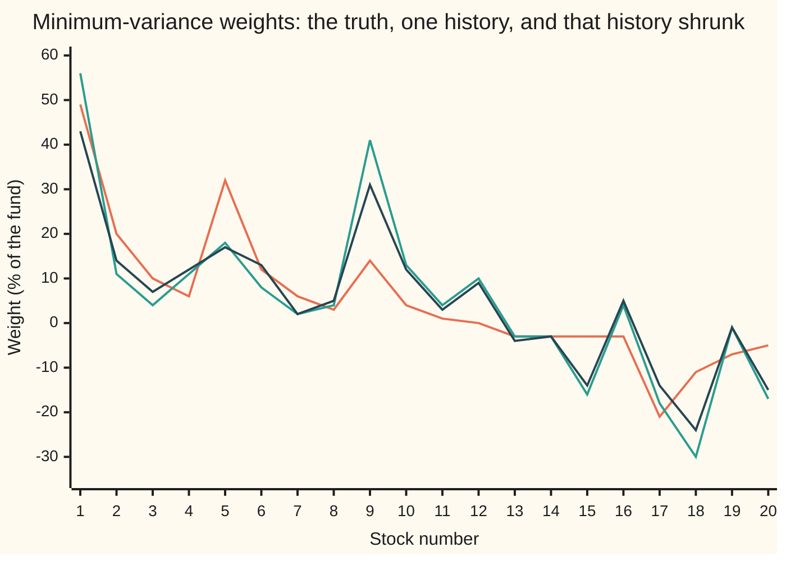
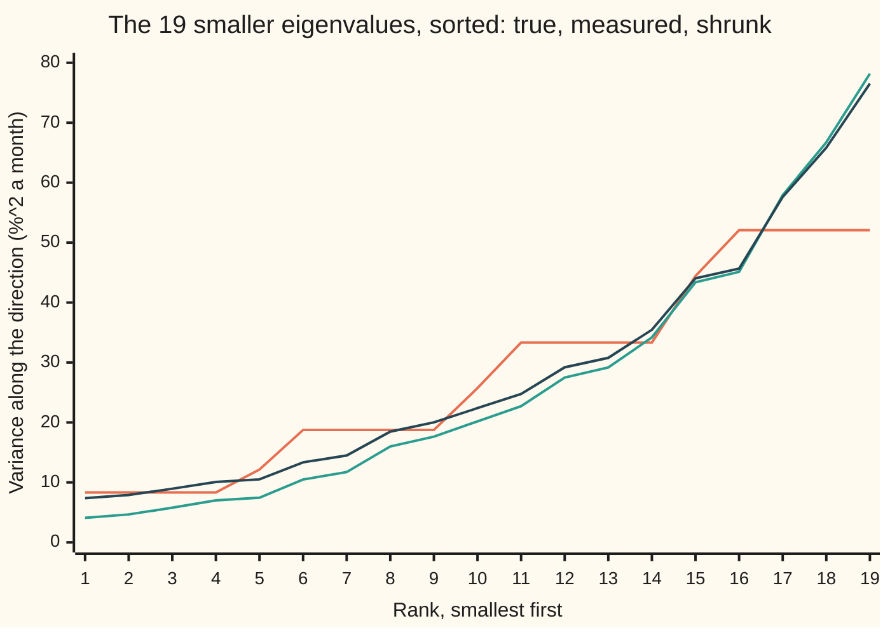
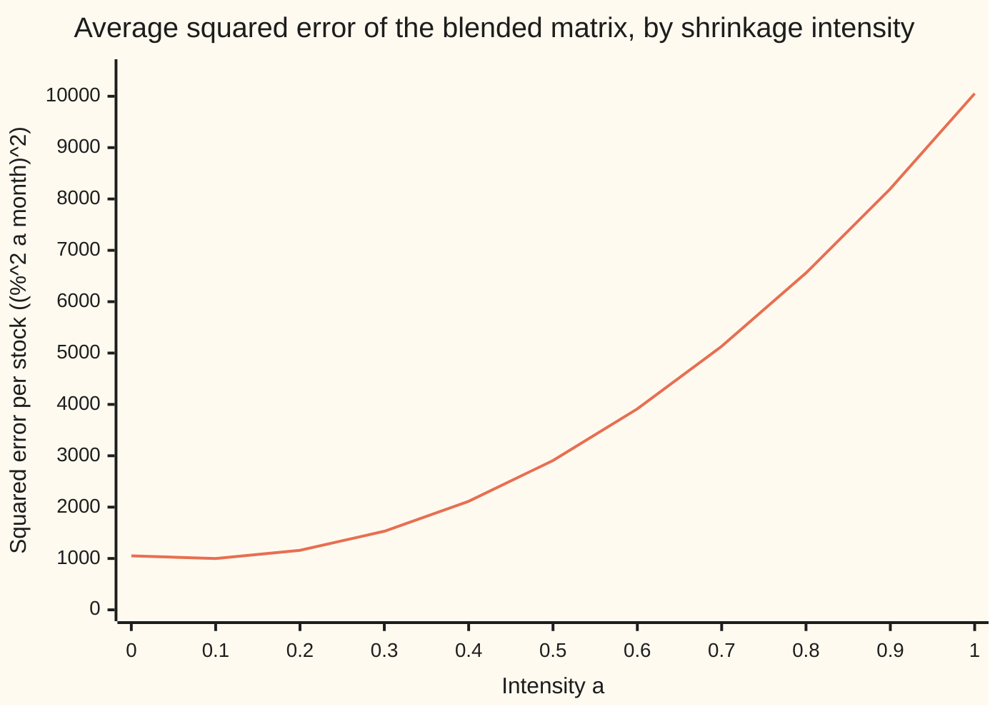

# Estimation error: why optimised portfolios chase noise, and shrinkage that calms them

[Syllabus](../../../SYLLABUS.md) → [Financial mathematics](../README.md) → [Portfolio Theory](../README.md#s37) → Estimation error

---

## General Overview

A fund holds twenty stocks and wants the mix with the least risk. It has five years of monthly returns: 60 months, twenty numbers a month. It measures how much each stock wobbles and how each pair moves together, feeds those measurements to the minimum-variance optimiser from [The efficient frontier](02-efficient-frontier-and-minimum-variance.md), and gets a portfolio.

This card runs that fund in a laboratory, where the true behaviour of every stock was chosen in advance. The best possible mix has 10.56% risk a year (risk here means standard deviation of the yearly return), and it puts 49% in stock 1, the calmest stock. Draw one five-year history from the true market and optimise on it, and the optimiser reports 9.19% risk. The same portfolio, held in the true market, carries 12.82%. It promised less risk than is possible and delivered more than the best.

Draw 300 five-year histories from the same unchanging market and re-optimise each time. Stock 1's weight ranges from 7.3% to 97.7%. Nothing about the stocks changed. Only the sixty months of luck did. The optimiser does its job perfectly on the numbers it is given. It cannot tell a real pattern from a lucky one, and it hunts hardest for the patterns that look best, which are mostly the lucky ones. Richard Michaud called this **error maximisation** in 1989.

The repair on this card is **shrinkage**: blend the measured table of risks with a plain, deliberately dull one, by an amount the data itself chooses. Olivier Ledoit and Michael Wolf gave the rule for choosing that amount in 2004. On the same 300 histories it cuts stock 1's swings nearly in half and lowers the true risk of the chosen portfolio from 12.80% to 12.05% on average.

**An optimiser trusts every digit of its inputs, so it leans on the measurements that noise made look best; blending the measured risks toward a simple target, by an amount estimated from the data, gives up a little accuracy in exchange for much less noise.**

**What kind of fact this is:** a method, a rule for estimating risk from a short history; it rests on a theorem proved on this card in Why it works (the optimiser's own risk figure is too low on average and its true risk too high). Ledoit and Wolf's claim that their amount is the best one is an asymptotic theorem proved in their paper, not here.

### The picture: one market, three sets of weights



Orange: the true best weights, known only in the laboratory. Green: the weights the optimiser picks from history 1, the first five-year draw. Dark blue: the same history after shrinkage. Negative weights are short sales (borrowing a stock and selling it). The green line puts 41% in stock 9, where the truth says 14%, and shorts 30% of stock 18, where the truth says 11%. The blue line keeps the green line's shape but pulls every extreme part of the way back.

---

## The formula

Notation first. A **matrix** is a table of numbers; the **covariance matrix** has one row and one column per stock, each stock's variance (squared wobble) on the diagonal and each pair's covariance (how the two move together) off it. $S^{-1}$ is the inverse of $S$: the matrix that undoes it. $\mathbf 1$ is a column of twenty 1s. A raised T turns a column into a row, so $\mathbf 1^{\top}$ times a column adds up its entries. Returns are in percent per month, so variances are in squared percent per month.

The minimum-variance weights, from the covariance matrix the fund measured:

$$w = \frac{S^{-1}\mathbf 1}{\mathbf 1^{\top} S^{-1}\mathbf 1}$$

The shrunk covariance matrix, and the Ledoit-Wolf amount:

$$S^{*} = (1-a)\,S + a\,\tau I, \qquad a = \frac{\min(\bar b^{2},\, d^{2})}{d^{2}}$$

**Read it aloud:** keep the fraction one minus a of every measured risk, take the fraction a from a plain target in which every stock has the average variance and no two stocks move together, and choose a as the measured noise divided by the measured distance from the target.

| Symbol | Plain meaning | In our example | Push it up and the answer… |
| --- | --- | --- | --- |
| $\Sigma$ | the true covariance matrix, unknown outside the laboratory. Say "sigma". | a one-market-factor model, below | — |
| $S$ | the measured covariance matrix: each stock's returns minus its average, multiplied in pairs, averaged over the months | history 1 | — |
| $n$, $p$ | months of history; number of stocks | 60; 20 | more months: less noise, smaller a |
| $x_k$ | month k's twenty returns, each minus that stock's average | one month of history 1 | — |
| $w$ | the weights, one per stock, adding to 1 | stock 1: 56% from history 1 | — |
| $\tau$, $I$ | the average of the twenty measured variances; the identity matrix (1s on the diagonal, 0s elsewhere) | $\tau$ = 53.2185 | a bigger $\tau$ lifts every shrunk eigenvalue more |
| $a$ | the shrinkage intensity: how far to move toward the target, between 0 and 1 | 0.0668 | calmer weights, more bias toward equal treatment |
| $d^2$ | how far the measured matrix sits from the target: squared entries of their difference, summed, divided by $p$ | 13664.5252 | smaller a |
| $\bar b^2$ | the estimated noise in the measured matrix: how much single months disagree with the average, divided by $n$ twice | 912.8780 | larger a |
| $v_j$ | direction j, an eigenvector: a fixed mix of the stocks | the market mix, for the largest | — |
| $\lambda$ | an eigenvalue: the variance along one direction the matrix treats as independent (explained in Step 2) | smallest: 4.09 measured, 8.33 true | — |
| $S^{*}$ | the shrunk covariance matrix, fed to the same optimiser | history 1 shrunk | — |

The two helper quantities in full, where the double bars mean "square every entry of the matrix and add them up":

$$d^{2} = \frac1p\,\lVert S - \tau I\rVert^{2}, \qquad \bar b^{2} = \frac1{n^{2}}\sum_{k=1}^{n}\frac1p\,\lVert x_k x_k^{\top} - S\rVert^{2}$$

In words: $d^2$ is how different the measured matrix is from the dull target. $\bar b^2$ is how much of that difference could be luck: $S$ is an average of $n$ monthly pieces $x_k x_k^{\top}$, and an average of $n$ pieces wobbles by the pieces' own spread divided by $n$.

The laboratory market: each stock's monthly return is 0.8%, plus a shared market shock (16% yearly risk) times a sensitivity rising from 0.6 for stock 1 to 1.4 for stock 20, plus the stock's own shock of 10%, 15%, 20% or 25% yearly risk in turn. That fixes the true $\Sigma$ exactly. The code numbers the stocks from 0.

### When it holds

- **The months are independent draws from one unchanging market.** If the market shifts, old months describe a market that is gone, and shrinkage cannot fix that.
- **Means are estimated.** The paper assumes returns with a known mean of zero. Here, as in common software, each stock is first centred on its own average; the paper's theorem does not cover that small change.
- **Returns have finite fourth moments.** The noise estimate $\bar b^2$ squares squared returns; with very heavy tails it turns erratic, and the intensity with it.
- **The target is a sensible guess.** Equal variances and no co-movement is blunt for stocks, which share a market. Here it still lowers portfolio risk, but not the matrix's average entry-by-entry error (1054.18 shrunk against 1052.03 raw).
- **The optimality is asymptotic.** Ledoit and Wolf prove the rule best among such blends as months and stocks grow together. From one 60-month history it is an estimate with its own noise: here it averages 0.101 against a laboratory best of 0.075.

---

## Why it works

### Step 0: the optimiser cannot see noise, so it buys it

The optimiser searches every mix of twenty stocks for the lowest measured risk. Measured risk is true risk plus an error. The mix with the lowest measured risk is very likely one whose error happened to be large and negative: a pair that looked like a perfect hedge over these sixty months, or a stock whose five years happened to be calm. Searching for the minimum is searching for the most flattering error. That is error maximisation, and it needs no mistake by anyone.

### Step 1: the reported risk is too low, the true risk too high

Write $w^{\top} S w$ for the variance the measured matrix reports for weights $w$, and $w^{\top} \Sigma w$ for their true variance. The true best weights minimise the second; the fund's weights minimise the first.

- The fund's reported variance is no higher than what $S$ says about the true best weights, since $w$ is the minimiser under $S$.
- For fixed weights, $S$ is right on average up to a factor: centring by the sample mean and dividing by $n$ makes the average of $S$ equal to $(n-1)/n$ times $\Sigma$. So on average $S$ rates the true best weights at slightly less than the true minimum.
- Chain the two: **on average the reported risk sits at or below the true minimum.**
- The fund's weights, held in the true market, carry at least the true minimum, since nothing beats the true best weights under $\Sigma$.

So reported ≤ possible ≤ delivered. The checks see it: 8.52% reported, 10.56% possible, 12.80% delivered, averaged over 300 histories.

### Step 2: where the noise hides, the smallest eigenvalues

Any covariance matrix splits into independent directions, its **eigenvectors**; each is a fixed mix of the stocks, and its **eigenvalue** $\lambda$ is the variance of that mix. In this market the largest direction is close to the market mix, eigenvalue 482.00; the smallest are mixes that cancel the market out, eigenvalue 8.33.

Inverting a matrix keeps the directions and replaces every eigenvalue by one over it. So the minimum-variance weights are a sum over directions, each divided by its eigenvalue:

$$S^{-1}\mathbf 1 = \sum_{j=1}^{p} \frac{(v_j^{\top}\mathbf 1)}{\lambda_j}\, v_j$$

where $v_j$ is direction j and $v_j^{\top}\mathbf 1$ is how much of the all-ones column lies along it. The smallest eigenvalues get the largest multipliers. That is where noise does the most harm.

Noise spreads the measured eigenvalues apart. Their sum is the total variance, right on average up to the $(n-1)/n$ factor. The sum of their squares is the matrix's squared size, which on average is the true squared size plus the noise's. Same centre, wider spread: the smallest come out too small, the largest too large. History 1's smallest is 4.09 against a true 8.33; its largest 554.44 against 482.00. The ratio of largest to smallest, which measures how hard the matrix is to invert reliably, grows from 57.8 to 135.7.



Orange: the true eigenvalues, in steps because five stocks share each level of own risk. Green: history 1's measured eigenvalues, a smooth ramp that starts too low and ends too high. Dark blue: after shrinkage, the bottom lifted most. The twentieth eigenvalue, the market direction, is off the chart: 482.00 true, 554.44 measured, 520.96 shrunk.

### Step 3: blending moves every eigenvalue toward the average

The target $\tau I$ treats every direction alike: its eigenvalue is $\tau$ in every direction. Blending $S$ with it keeps $S$'s directions and moves each eigenvalue in a straight line toward $\tau$:

$$\lambda^{*} = (1-a)\,\lambda + a\,\tau$$

For history 1: $(1 - 0.0668) \times 4.09 + 0.0668 \times 53.2185$ gives 7.37, close to the true 8.33. The top falls from 554.44 to 520.96. The ratio of largest to smallest drops from 135.7 to 70.7. Any positive $a$ lifts the smallest eigenvalue above zero, so $S^{*}$ can always be inverted, even with fewer months than stocks, when $S$ itself cannot.

Scaling alone does nothing. Halving $S$ doubles $S^{-1}\mathbf 1$, and the division in the weight formula cancels it. The blend works because it adds the same amount to every direction, which lifts the small ones proportionally more.

### Step 4: choosing the amount, noise over total distance

Score a blend by its squared distance from the truth, entry by entry. That score is a parabola in $a$: at $a = 0$ it is the pure noise in $S$; as $a$ grows the noise shrinks but a bias toward the target grows. The bottom of the parabola is at

$$a_{\text{best}} = \frac{\text{average of } \langle S-\Sigma,\ S-\tau I\rangle}{\text{average of } \lVert S-\tau I\rVert^{2}}$$

where the angle brackets multiply two matrices entry by entry and add the products. With a fixed target, the top is the noise in $S$ and the bottom is noise plus the distance from truth to target. So the best amount is **the share of the observed distance that is noise**. This is the bias-variance trade from [Bias and variance](../../09-Probability%20and%20statistics/07-Sampling%20and%20Estimation/06-bias-variance-and-mean-squared-error.md), applied to a whole matrix at once.

Both averages need the unknown truth. Ledoit and Wolf estimate each from the one history: $d^2$ stands in for the bottom, since it is the observed distance from the target, and $\bar b^2$ stands in for the top, since it measures how much $S$ would wobble from one history to the next. Capping $\bar b^2$ at $d^2$ keeps the intensity at most 1. If $d^2 = 0$, $S$ already equals the target and there is nothing to shrink.

The laboratory finds the best amount two more ways. The formula above, averaged over 300 histories against the known truth, gives 0.075. Trying every amount from 0.00 to 1.00 in steps of 0.01 gives 0.07. The Ledoit-Wolf estimate, from each history alone, averages 0.101.



One line: the entry-by-entry score averaged over 300 histories. It dips below the unshrunk 1052.03 near 0.1, then climbs steeply, because the dull target ignores the market factor that dominates this matrix. The dip is shallow; the portfolio gains more, because it depends on the small eigenvalues while the score is dominated by the big one.

<details>
<summary>Detailed proof: the parabola and the eigenvalue spread</summary>

**The parabola.** Call the sample error $S - \Sigma$ the noise and $S - \tau I$ the gap. The blend's error is $(1-a)S + a\tau I - \Sigma$, which is the noise minus $a$ times the gap. Its squared size is $\lVert S-\Sigma\rVert^2 - 2a\langle S-\Sigma,\ S-\tau I\rangle + a^2\lVert S-\tau I\rVert^2$. Averaged over histories this is a parabola in $a$ that opens upward whenever the gap is not always zero. Its slope is zero at the ratio in Step 4; clipping to the range 0 to 1 gives the best blend. If the target were fixed rather than built from $S$, the gap would be the noise plus the fixed distance $\Sigma - \tau I$; the noise averages to zero (ignoring the $(n-1)/n$ factor), so the top becomes the average squared noise and the bottom that plus the squared distance: noise over noise plus distance.

**The spread.** For a symmetric matrix, the sum of its eigenvalues is its trace (the sum of its diagonal) and the sum of their squares is the matrix's squared size, the double-bar sum. If $S$ averages to $\Sigma$, then $\text{avg}\lVert S\rVert^2 = \lVert\Sigma\rVert^2 + \text{avg}\lVert S - \Sigma\rVert^2$, because the cross term averages to zero. So the measured eigenvalues keep the true mean (trace over $p$) but their average sum of squares exceeds the truth's by exactly the noise. Same mean, larger sum of squares: a wider spread.

**Why $\bar b^2$ estimates the noise.** $S = \frac1n\sum_k x_k x_k^{\top}$. For independent months, the squared error of an average of $n$ pieces is the pieces' average squared deviation divided by $n$. Estimating that average squared deviation by $\frac1n\sum_k\lVert x_k x_k^{\top} - S\rVert^2$ and dividing by $n$ gives $\bar b^2$ (with the $1/p$ scaling shared by $d^2$, which cancels in the ratio). The paper proves that this estimate and $d^2$ converge to their targets as $n$ and $p$ grow together; its Section 3 states the conditions.

</details>

Other roads exist. Michaud's later remedy resamples: draw many histories from the fitted numbers, optimise each, average the weights. A target with the market factor in it, such as the constant-correlation target of Ledoit and Wolf's second 2004 paper, fits stocks better than $\tau I$; factor structure is [Factor models](05-factor-models-and-apt.md). Shrinking the expected returns rather than the covariance is [Black-Litterman](06-black-litterman.md).

---

## Worked numbers, by hand

History 1, the first five-year draw. All figures in squared percent per month unless stated.

| Step | Arithmetic | Value |
| --- | --- | --- |
| target level $\tau$ | average of the twenty measured variances | 53.2185 |
| distance from target $d^2$ | squared entries of $S - \tau I$, summed, over 20 | 13664.5252 |
| noise estimate $\bar b^2$ | month-by-month disagreement, over 20, over 60 twice | 912.8780 |
| capped noise $b^2$ | smaller of 912.8780 and 13664.5252 | 912.8780 |
| intensity $a$ | 912.8780 / 13664.5252 | **0.0668** |
| smallest eigenvalue, measured | from history 1 | 4.09 |
| smallest eigenvalue, shrunk | (1 − 0.0668) × 4.09 + 0.0668 × 53.2185 | **7.37** |
| true smallest eigenvalue | from the true matrix | 8.33 |
| true best risk | √(12 × 9.2928), yearly | 10.56% |
| history 1, sample weights | reported / true yearly risk | 9.19% / 12.82% |
| history 1, shrunk weights | reported / true yearly risk | 10.26% / **12.16%** |

A blend of under 7% narrowed the gap between promise and delivery and cut the delivered risk by two thirds of a percentage point a year.

Averaged over 300 histories, the same pattern holds:

| Portfolio built from | Reported risk | True risk | Stock 1's weight: mean, spread (sd), range |
| --- | --- | --- | --- |
| the true matrix | — | 10.56% | 49.2% |
| measured matrix | 8.52% | 12.80% | 49.2, 14.7, 7.3 to 97.7 |
| shrunk matrix | 9.79% | 12.05% | 35.2, 8.3, 12.9 to 57.7 |

The measured weights are right on average for stock 1, 49.2% against 49.2%, and wildly scattered around it. The shrunk weights are biased, 35.2%, because the target treats all stocks as equally risky, and much steadier. The total size of the positions, long plus short, falls from 2.69 times the fund to 2.10, against 2.15 for the truth. Resampling the 60 months of history 1 itself (a bootstrap: drawing 60 months with replacement, 300 times) gives stock 1 a spread of 18.5 points: the scatter is visible from one history, without the laboratory.

### What breaks if you drop a piece

| Mistake | Comes out at | What went wrong |
| --- | --- | --- |
| Trust the optimiser's own risk figure | 8.52% reported, 12.80% true | The minimum over noisy numbers finds the most flattering noise (Step 1) |
| "Shrink" by scaling the matrix toward zero, here halving it | weights change by 0.0000 | Scaling cancels in the weight formula; only adding to every direction helps |
| Shrink all the way, a = 1 | equal weights, 16.52% true | The target throws away real differences in risk |
| Fewer months than stocks, 15 months | smallest measured eigenvalue 0.0000, no inverse | 15 centred months span at most 14 directions; a = 0.494 rescues it |

---

## Code, from first principles, and it actually runs

Nothing is imported except square root, logarithm, cosine and pi. The random numbers come from a 64-bit generator written out in the script (splitmix64), turned into bell-curve draws by the Box-Muller formula. The scripts build the true matrix, draw 300 five-year histories, and take independent roads: the weights by elimination and again by summing over eigenvectors found with Jacobi rotations; the intensity from each history alone, from the laboratory formula, and by brute-force search over 101 values; the reported-below-possible-below-delivered chain by simulation; the eigenvalue shift of Step 3 by recomputing the shrunk matrix's eigenvalues from scratch.

### Python

```python
# Estimation error and Ledoit-Wolf shrinkage -- the check behind the card.  Standard
# library only.  A made-up market of 20 stocks whose true covariance is known; five-year
# (60-month) histories are drawn from it with a home-made random generator, and the
# minimum-variance portfolio is rebuilt from each.  Returns are in percent per month.
from math import sqrt, log, cos, pi
P, N, H, B = 20, 60, 300, 300                 # stocks, months, fresh histories, bootstrap draws
BETA = [0.6 + 0.8 * i / 19 for i in range(P)]              # market sensitivity of each stock
IDIO = [10.0 + 5.0 * (i % 4) for i in range(P)]            # own risk, % a year
MKT, MU = 16.0, 0.8                                         # market risk % a year; mean % a month
SIG = [[MKT**2 / 12 * BETA[i] * BETA[j] + (IDIO[i]**2 / 12 if i == j else 0.0)
        for j in range(P)] for i in range(P)]
state = 20260928
def rand():                                   # splitmix64, then a uniform in (0, 1)
    global state
    state = z = (state + 0x9E3779B97F4A7C15) & 0xFFFFFFFFFFFFFFFF
    z = ((z ^ (z >> 30)) * 0xBF58476D1CE4E5B9) & 0xFFFFFFFFFFFFFFFF
    z = ((z ^ (z >> 27)) * 0x94D049BB133111EB) & 0xFFFFFFFFFFFFFFFF
    return ((z ^ (z >> 31)) >> 11) / 2.0**53 + 2.0**-54
def normal():                                 # Box-Muller, one draw per pair of uniforms
    u1, u2 = rand(), rand(); return sqrt(-2.0 * log(u1)) * cos(2.0 * pi * u2)
def history(n):                               # n months: one market shock, then 20 own shocks
    rows = []                                 # r = mean + beta * market shock + own shock
    for _ in range(n):
        f = MKT / sqrt(12) * normal()
        rows.append([MU + BETA[i] * f + IDIO[i] / sqrt(12) * normal() for i in range(P)])
    return rows
def cov(X):                                   # centre each stock, divide by n (as Ledoit-Wolf)
    n = len(X); m = [sum(r[i] for r in X) / n for i in range(P)]
    Xc = [[r[i] - m[i] for i in range(P)] for r in X]
    return [[sum(r[i] * r[j] for r in Xc) / n for j in range(P)] for i in range(P)], Xc
def ledoit_wolf(S, Xc):                       # target tau*I; intensity b2/d2, capped at 1
    n, tau = len(Xc), sum(S[i][i] for i in range(P)) / P
    d2 = sum((S[i][j] - (tau if i == j else 0.0))**2 for i in range(P) for j in range(P)) / P
    b2bar = sum((x[i] * x[j] - S[i][j])**2 for x in Xc for i in range(P) for j in range(P)) / P / n**2
    b2 = min(b2bar, d2); a = b2 / d2
    return [[(1 - a) * S[i][j] + (a * tau if i == j else 0.0) for j in range(P)] for i in range(P)], a, tau, d2, b2bar, b2
def gmv(M):                                   # road 1: solve M w = 1 by elimination, rescale
    A = [row[:] + [1.0] for row in M]
    for c in range(P):
        p = max(range(c, P), key=lambda r: abs(A[r][c]))
        A[c], A[p] = A[p], A[c]
        for r in range(c + 1, P):
            f = A[r][c] / A[c][c]; A[r] = [A[r][k] - f * A[c][k] for k in range(P + 1)]
    x = [0.0] * P
    for c in reversed(range(P)):
        x[c] = (A[c][P] - sum(A[c][k] * x[k] for k in range(c + 1, P))) / A[c][c]
    return [v / sum(x) for v in x]
def jacobi(M):                                # eigenvalues and eigenvectors by Jacobi rotations
    A = [row[:] for row in M]
    V = [[1.0 if i == j else 0.0 for j in range(P)] for i in range(P)]
    for _ in range(100):
        if sum(A[i][j]**2 for i in range(P) for j in range(P) if i != j) < 1e-22: break
        for p in range(P):
            for q in range(p + 1, P):
                if abs(A[p][q]) < 1e-300: continue
                th = 0.5 * (A[q][q] - A[p][p]) / A[p][q]
                t = (1.0 if th >= 0 else -1.0) / (abs(th) + sqrt(th * th + 1.0))
                c = 1.0 / sqrt(t * t + 1.0); s = t * c
                for M in (A, V):                          # rotate columns p, q
                    for k in range(P): M[k][p], M[k][q] = c * M[k][p] - s * M[k][q], s * M[k][p] + c * M[k][q]
                for k in range(P): A[p][k], A[q][k] = c * A[p][k] - s * A[q][k], s * A[p][k] + c * A[q][k]
    return [A[i][i] for i in range(P)], V
def gmv_eigen(M):                             # road 2: w ~ sum over directions of (v.1) v / lambda
    lam, V = jacobi(M); x = [sum(V[i][k] * sum(V[j][k] for j in range(P)) / lam[k] for k in range(P)) for i in range(P)]
    return [v / sum(x) for v in x]
def quad(w, M): return sum(w[i] * M[i][j] * w[j] for i in range(P) for j in range(P))
def vol(v): return sqrt(12.0 * v)             # monthly variance in %^2 -> % a year
def stats(v):
    m = sum(v) / len(v); return m, sqrt(sum((x - m)**2 for x in v) / len(v)), min(v), max(v)
def row(label, vals, fmt): print(f"{label:<30}" + " ".join(format(v, fmt) for v in vals))
w_true = gmv(SIG); true_min = quad(w_true, SIG)
X1 = history(N); S1, Xc1 = cov(X1); L1, a1, tau1, d21, bb1, b21 = ledoit_wolf(S1, Xc1)
ws1, wl1 = gmv(S1), gmv(L1)
e_true, e_s, e_l = (sorted(jacobi(M)[0]) for M in (SIG, S1, L1))
road2 = max(abs(x - y) for x, y in zip(ws1 + wl1, gmv_eigen(S1) + gmv_eigen(L1)))
half = gmv([[0.5 * v for v in r] for r in S1])
GRID = [k / 100 for k in range(101)]
loss = [0.0] * 101; num = den = 0.0
keep = {k: [] for k in ("w1s", "w1l", "gs", "gl", "rs", "ts", "rl", "tl", "a", "fs", "fl")}
for h in range(H):
    S, Xc = (S1, Xc1) if h == 0 else cov(history(N))
    L, a, tau = ledoit_wolf(S, Xc)[:3]; ws, wl = gmv(S), gmv(L)
    for k, v in (("w1s", ws[0]), ("w1l", wl[0]), ("gs", sum(map(abs, ws))), ("gl", sum(map(abs, wl))),
                 ("rs", quad(ws, S)), ("ts", quad(ws, SIG)), ("rl", quad(wl, L)), ("tl", quad(wl, SIG)), ("a", a)):
        keep[k].append(v)
    E = [[S[i][j] - SIG[i][j] for j in range(P)] for i in range(P)]      # sample error
    D = [[S[i][j] - (tau if i == j else 0.0) for j in range(P)] for i in range(P)]  # sample minus target
    num += sum(E[i][j] * D[i][j] for i in range(P) for j in range(P))
    den += sum(D[i][j]**2 for i in range(P) for j in range(P))
    for k, g in enumerate(GRID):                                       # brute force: every intensity
        loss[k] += sum((E[i][j] - g * D[i][j])**2 for i in range(P) for j in range(P)) / P / H
    keep["fs"].append(sum(E[i][j]**2 for i in range(P) for j in range(P)) / P)
    keep["fl"].append(sum((L[i][j] - SIG[i][j])**2 for i in range(P) for j in range(P)) / P)
boot = []
for _ in range(B):                                                      # resample history 1's months
    boot.append(gmv(cov([X1[int(rand() * N)] for _ in range(N)])[0])[0])
mean = {k: sum(v) / H for k, v in keep.items()}
a_grid = GRID[min(range(101), key=lambda k: loss[k])]
X240 = history(240); S240, Xc240 = cov(X240); L240, a240 = ledoit_wolf(S240, Xc240)[:2]
X15 = history(15); S15, Xc15 = cov(X15); L15, a15 = ledoit_wolf(S15, Xc15)[:2]
print(f"market: {P} stocks, {N} months, {H} fresh histories, {B} bootstrap resamples")
row("weights %, true", [100 * v for v in w_true], "5.0f")
row("weights %, history 1 sample", [100 * v for v in ws1], "5.0f")
row("weights %, history 1 shrunk", [100 * v for v in wl1], "5.0f")
print(f"road 2, eigen expansion vs elimination, agree to 1e-9: {'yes' if road2 < 1e-9 else 'no'}")
row("eigenvalues, true", e_true, "7.2f")
row("eigenvalues, history 1 sample", e_s, "7.2f")
row("eigenvalues, history 1 shrunk", e_l, "7.2f")
print(f"history 1: tau {tau1:.4f}  d2 {d21:.4f}  b2bar {bb1:.4f}  b2 {b21:.4f}  intensity a {a1:.4f}")
print(f"smallest eigenvalue: true {e_true[0]:.2f}  sample {e_s[0]:.2f}  shrunk {e_l[0]:.2f}"
      f"  check (1-a)*{e_s[0]:.2f}+a*tau = {(1 - a1) * e_s[0] + a1 * tau1:.2f}")
print(f"largest over smallest: true {e_true[-1] / e_true[0]:.1f}  sample {e_s[-1] / e_s[0]:.1f}  shrunk {e_l[-1] / e_l[0]:.1f}")
print(f"true minimum variance {true_min:.4f} %^2 a month = {vol(true_min):.2f}% a year")
print(f"history 1 sample portfolio: reported {vol(quad(ws1, S1)):.2f}%  true {vol(quad(ws1, SIG)):.2f}%")
print(f"history 1 shrunk portfolio: reported {vol(quad(wl1, L1)):.2f}%  true {vol(quad(wl1, SIG)):.2f}%")
print(f"average over {H}: sample reported {vol(mean['rs']):.2f}%  sample true {vol(mean['ts']):.2f}%")
print(f"average over {H}: shrunk reported {vol(mean['rl']):.2f}%  shrunk true {vol(mean['tl']):.2f}%")
print(f"equal weights (intensity 1): true {vol(quad([1.0 / P] * P, SIG)):.2f}%")
for lab, v in (("stock 1 weight %, sample", keep["w1s"]), ("stock 1 weight %, shrunk", keep["w1l"])):
    m, s, lo, hi = stats([100 * x for x in v])
    print(f"{lab}: mean {m:.1f}  sd {s:.1f}  min {lo:.1f}  max {hi:.1f}  (true {100 * w_true[0]:.1f})")
print(f"stock 1 weight %, sd over bootstrap of history 1: {100 * stats(boot)[1]:.1f}")
print(f"gross exposure sum|w|: true {sum(map(abs, w_true)):.2f}  sample {mean['gs']:.2f}  shrunk {mean['gl']:.2f}")
print(f"intensity: Ledoit-Wolf average {mean['a']:.3f}  oracle from the truth {num / den:.3f}  grid best {a_grid:.2f}")
print(f"covariance loss per stock: sample {mean['fs']:.2f}  shrunk {mean['fl']:.2f}")
row("loss curve a=0,0.1..1", [loss[10 * k] for k in range(11)], "7.2f")
print(f"mistake, shrink toward zero (S/2): largest weight change {max(abs(x - y) for x, y in zip(ws1, half)):.4f}")
print(f"try 240 months: intensity {a240:.3f}  stock 1 sample {100 * gmv(S240)[0]:.1f}%  shrunk {100 * gmv(L240)[0]:.1f}%")
print(f"try 15 months: smallest sample eigenvalue {abs(sorted(jacobi(S15)[0])[0]):.4f}  intensity {a15:.3f}"
      f"  shrunk stock 1 {100 * gmv(L15)[0]:.1f}%")
assert road2 < 1e-9, "eigen expansion must reproduce elimination"
assert abs(sum(e_s) - sum(S1[i][i] for i in range(P))) < 1e-8, "eigenvalues must add to the trace"
assert abs(e_l[0] - ((1 - a1) * e_s[0] + a1 * tau1)) < 1e-8, "shrinkage moves each eigenvalue toward tau"
assert mean["rs"] < true_min, "reported risk of the sample optimum sits below the true minimum"
assert mean["ts"] > true_min, "its true risk sits above the true minimum"
assert abs(mean["a"] - num / den) < 0.05, "one-history estimate vs the oracle built from the truth"
assert abs(a_grid - num / den) < 0.02, "brute-force grid vs the oracle formula"
assert mean["tl"] < mean["ts"], "shrinkage must lower the true risk on average"
print("ALL CHECKS PASS")
```

**Ran 2026-09-28 on macOS, Python 3.14.6, standard library only. All checks passed. Output, pasted from the run:**

```
market: 20 stocks, 60 months, 300 fresh histories, 300 bootstrap resamples
weights %, true                  49    20    10     6    32    12     6     3    14     4     1     0    -3    -3    -3    -3   -21   -11    -7    -5
weights %, history 1 sample      56    11     4    11    18     8     2     4    41    13     4    10    -3    -3   -16     4   -18   -30    -1   -17
weights %, history 1 shrunk      43    14     7    12    17    13     2     5    31    12     3     9    -4    -3   -14     5   -14   -24    -1   -15
road 2, eigen expansion vs elimination, agree to 1e-9: yes
eigenvalues, true                8.33    8.33    8.33    8.33   12.15   18.75   18.75   18.75   18.75   25.73   33.33   33.33   33.33   33.33   44.43   52.08   52.08   52.08   52.08  482.00
eigenvalues, history 1 sample    4.09    4.66    5.78    7.00    7.45   10.49   11.73   15.99   17.64   20.18   22.72   27.48   29.17   34.19   43.39   45.13   57.92   66.73   78.19  554.44
eigenvalues, history 1 shrunk    7.37    7.90    8.95   10.08   10.51   13.35   14.50   18.47   20.02   22.39   24.76   29.20   30.78   35.46   44.05   45.67   57.61   65.83   76.52  520.96
history 1: tau 53.2185  d2 13664.5252  b2bar 912.8780  b2 912.8780  intensity a 0.0668
smallest eigenvalue: true 8.33  sample 4.09  shrunk 7.37  check (1-a)*4.09+a*tau = 7.37
largest over smallest: true 57.8  sample 135.7  shrunk 70.7
true minimum variance 9.2928 %^2 a month = 10.56% a year
history 1 sample portfolio: reported 9.19%  true 12.82%
history 1 shrunk portfolio: reported 10.26%  true 12.16%
average over 300: sample reported 8.52%  sample true 12.80%
average over 300: shrunk reported 9.79%  shrunk true 12.05%
equal weights (intensity 1): true 16.52%
stock 1 weight %, sample: mean 49.2  sd 14.7  min 7.3  max 97.7  (true 49.2)
stock 1 weight %, shrunk: mean 35.2  sd 8.3  min 12.9  max 57.7  (true 49.2)
stock 1 weight %, sd over bootstrap of history 1: 18.5
gross exposure sum|w|: true 2.15  sample 2.69  shrunk 2.10
intensity: Ledoit-Wolf average 0.101  oracle from the truth 0.075  grid best 0.07
covariance loss per stock: sample 1052.03  shrunk 1054.18
loss curve a=0,0.1..1         1052.03  999.93 1159.41 1530.48 2113.14 2907.39 3913.22 5130.65 6559.67 8200.27 10052.47
mistake, shrink toward zero (S/2): largest weight change 0.0000
try 240 months: intensity 0.024  stock 1 sample 53.0%  shrunk 49.2%
try 15 months: smallest sample eigenvalue 0.0000  intensity 0.494  shrunk stock 1 14.7%
ALL CHECKS PASS
```

### Rust

Same draws, same labels, built with `rustc --edition 2021 -O`. The generator is integer arithmetic, so both languages draw identical histories; the two outputs agree line for line.

```rust
// Estimation error and Ledoit-Wolf shrinkage -- the same check as the Python, in Rust.
// No crates.  A made-up market of 20 stocks whose true covariance is known; 60-month
// histories are drawn from it with the same home-made generator, and the minimum-variance
// portfolio is rebuilt from each.  Returns are in percent per month.
const P: usize = 20; const N: usize = 60; const H: usize = 300; const B: usize = 300;
const MKT: f64 = 16.0; const MU: f64 = 0.8;               // market risk % a year; mean % a month
type Mat = Vec<Vec<f64>>;
struct Rng(u64);
impl Rng {
    fn rand(&mut self) -> f64 {                   // splitmix64, then a uniform in (0, 1)
        self.0 = self.0.wrapping_add(0x9E3779B97F4A7C15); let mut z = self.0;
        z = (z ^ (z >> 30)).wrapping_mul(0xBF58476D1CE4E5B9);
        z = (z ^ (z >> 27)).wrapping_mul(0x94D049BB133111EB);
        ((z ^ (z >> 31)) >> 11) as f64 / 2f64.powi(53) + 2f64.powi(-54)
    }
    fn normal(&mut self) -> f64 {                 // Box-Muller, one draw per pair of uniforms
        let (u1, u2) = (self.rand(), self.rand());
        (-2.0 * u1.ln()).sqrt() * (2.0 * std::f64::consts::PI * u2).cos()
    }
}
fn beta(i: usize) -> f64 { 0.6 + 0.8 * i as f64 / 19.0 }
fn idio(i: usize) -> f64 { 10.0 + 5.0 * (i % 4) as f64 }
fn history(rng: &mut Rng, n: usize) -> Mat {      // r = mean + beta * market shock + own shock
    (0..n).map(|_| { let f = MKT / 12f64.sqrt() * rng.normal();
        (0..P).map(|i| MU + beta(i) * f + idio(i) / 12f64.sqrt() * rng.normal()).collect() }).collect()
}
fn cov(x: &Mat) -> (Mat, Mat) {                   // centre each stock, divide by n (as Ledoit-Wolf)
    let n = x.len() as f64;
    let m: Vec<f64> = (0..P).map(|i| x.iter().map(|r| r[i]).sum::<f64>() / n).collect();
    let xc: Mat = x.iter().map(|r| (0..P).map(|i| r[i] - m[i]).collect()).collect();
    let s = (0..P).map(|i| (0..P).map(|j| xc.iter().map(|r| r[i] * r[j]).sum::<f64>() / n).collect()).collect();
    (s, xc)
}
fn eye(i: usize, j: usize) -> f64 { if i == j { 1.0 } else { 0.0 } }
fn ledoit_wolf(s: &Mat, xc: &Mat) -> (Mat, f64, f64, f64, f64, f64) {  // target tau*I, intensity b2/d2
    let (n, tau) = (xc.len() as f64, (0..P).map(|i| s[i][i]).sum::<f64>() / P as f64);
    let (mut d2, mut b2bar) = (0.0, 0.0);
    for i in 0..P { for j in 0..P {
        d2 += (s[i][j] - tau * eye(i, j)).powi(2);
        for x in xc { b2bar += (x[i] * x[j] - s[i][j]).powi(2); }
    } }
    d2 /= P as f64; b2bar = b2bar / P as f64 / (n * n);
    let b2 = b2bar.min(d2); let a = b2 / d2;
    let l = (0..P).map(|i| (0..P).map(|j| (1.0 - a) * s[i][j] + a * tau * eye(i, j)).collect()).collect();
    (l, a, tau, d2, b2bar, b2)
}
fn gmv(m: &Mat) -> Vec<f64> {                     // road 1: solve M w = 1 by elimination, rescale
    let mut a: Mat = m.iter().map(|r| { let mut v = r.clone(); v.push(1.0); v }).collect();
    for c in 0..P {
        let p = (c..P).max_by(|&x, &y| a[x][c].abs().partial_cmp(&a[y][c].abs()).unwrap()).unwrap();
        a.swap(c, p);
        for r in c + 1..P { let f = a[r][c] / a[c][c]; for k in 0..=P { a[r][k] -= f * a[c][k]; } }
    }
    let mut x = vec![0.0; P];
    for c in (0..P).rev() { x[c] = (a[c][P] - (c + 1..P).map(|k| a[c][k] * x[k]).sum::<f64>()) / a[c][c]; }
    unit(x)
}
fn unit(x: Vec<f64>) -> Vec<f64> { let tot: f64 = x.iter().sum(); x.iter().map(|v| v / tot).collect() }
fn jacobi(m: &Mat) -> (Vec<f64>, Mat) {           // eigenvalues and eigenvectors by Jacobi rotations
    let mut a = m.clone();
    let mut v: Mat = (0..P).map(|i| (0..P).map(|j| eye(i, j)).collect()).collect();
    for _ in 0..100 {
        let off: f64 = (0..P).flat_map(|i| (0..P).map(move |j| (i, j))).filter(|(i, j)| i != j)
            .map(|(i, j)| a[i][j] * a[i][j]).sum();
        if off < 1e-22 { break; }
        for p in 0..P { for q in p + 1..P {
            if a[p][q].abs() < 1e-300 { continue; }
            let th = 0.5 * (a[q][q] - a[p][p]) / a[p][q];
            let t = (if th >= 0.0 { 1.0 } else { -1.0 }) / (th.abs() + (th * th + 1.0).sqrt());
            let c = 1.0 / (t * t + 1.0).sqrt(); let s = t * c;
            for mm in [&mut a, &mut v] {           // rotate columns p, q
                for k in 0..P { let (x, y) = (mm[k][p], mm[k][q]); mm[k][p] = c * x - s * y; mm[k][q] = s * x + c * y; }
            }
            for k in 0..P { let (x, y) = (a[p][k], a[q][k]); a[p][k] = c * x - s * y; a[q][k] = s * x + c * y; }
        } }
    }
    ((0..P).map(|i| a[i][i]).collect(), v)
}
fn gmv_eigen(m: &Mat) -> Vec<f64> {               // road 2: w ~ sum over directions of (v.1) v / lambda
    let (lam, v) = jacobi(m);
    unit((0..P).map(|i| (0..P).map(|k| v[i][k] * (0..P).map(|j| v[j][k]).sum::<f64>() / lam[k]).sum()).collect())
}
fn quad(w: &[f64], m: &Mat) -> f64 { (0..P).map(|i| (0..P).map(|j| w[i] * m[i][j] * w[j]).sum::<f64>()).sum() }
fn vol(v: f64) -> f64 { (12.0 * v).sqrt() }       // monthly variance in %^2 -> % a year
fn sorted_eig(m: &Mat) -> Vec<f64> { let mut e = jacobi(m).0; e.sort_by(|a, b| a.partial_cmp(b).unwrap()); e }
fn stats(v: &[f64]) -> (f64, f64, f64, f64) {
    let m = v.iter().sum::<f64>() / v.len() as f64; let sd = (v.iter().map(|x| (x - m).powi(2)).sum::<f64>() / v.len() as f64).sqrt();
    (m, sd, v.iter().cloned().fold(f64::MAX, f64::min), v.iter().cloned().fold(f64::MIN, f64::max))
}
fn row(label: &str, vals: &[f64], w: usize, d: usize) {
    println!("{:<30}{}", label, vals.iter().map(|v| format!("{:w$.d$}", v, w = w, d = d)).collect::<Vec<_>>().join(" "));
}
fn main() {
    let sig: Mat = (0..P).map(|i| (0..P).map(|j| MKT * MKT / 12.0 * beta(i) * beta(j) + eye(i, j) * idio(i).powi(2) / 12.0).collect()).collect();
    let mut rng = Rng(20260928);
    let w_true = gmv(&sig); let true_min = quad(&w_true, &sig);
    let x1 = history(&mut rng, N); let (s1, xc1) = cov(&x1);
    let (l1, a1, tau1, d21, bb1, b21) = ledoit_wolf(&s1, &xc1);
    let (ws1, wl1) = (gmv(&s1), gmv(&l1));
    let (e_true, e_s, e_l) = (sorted_eig(&sig), sorted_eig(&s1), sorted_eig(&l1));
    let r2: Vec<f64> = gmv_eigen(&s1).into_iter().chain(gmv_eigen(&l1)).collect();
    let road2 = ws1.iter().chain(wl1.iter()).zip(r2.iter()).map(|(x, y)| (x - y).abs()).fold(0.0, f64::max);
    let half = gmv(&s1.iter().map(|r| r.iter().map(|v| 0.5 * v).collect()).collect());
    let (mut loss, mut num, mut den) = (vec![0.0; 101], 0.0, 0.0);
    let mut keep: Vec<Vec<f64>> = vec![Vec::new(); 11];   // w1s w1l gs gl rs ts rl tl a fs fl
    for h in 0..H {
        let (s, xc) = if h == 0 { (s1.clone(), xc1.clone()) } else { cov(&history(&mut rng, N)) };
        let (l, a, tau, ..) = ledoit_wolf(&s, &xc); let (ws, wl) = (gmv(&s), gmv(&l));
        let (mut fs, mut fl, mut lh) = (0.0, 0.0, vec![0.0; 101]);
        for i in 0..P { for j in 0..P {
            let e = s[i][j] - sig[i][j];                // sample error
            let d = s[i][j] - tau * eye(i, j);          // sample minus target
            num += e * d; den += d * d; fs += e * e; fl += (l[i][j] - sig[i][j]).powi(2);
            for k in 0..101 { lh[k] += (e - k as f64 / 100.0 * d).powi(2); }   // brute force: every intensity
        } }
        for k in 0..101 { loss[k] += lh[k] / P as f64 / H as f64; }
        let vals = [ws[0], wl[0], ws.iter().map(|v| v.abs()).sum(), wl.iter().map(|v| v.abs()).sum(),
                    quad(&ws, &s), quad(&ws, &sig), quad(&wl, &l), quad(&wl, &sig), a, fs / P as f64, fl / P as f64];
        for (k, v) in vals.iter().enumerate() { keep[k].push(*v); }
    }
    let boot: Vec<f64> = (0..B).map(|_| {                // resample history 1's months
        let xb: Mat = (0..N).map(|_| x1[(rng.rand() * N as f64) as usize].clone()).collect();
        gmv(&cov(&xb).0)[0]
    }).collect();
    let mean: Vec<f64> = keep.iter().map(|v| v.iter().sum::<f64>() / H as f64).collect();
    let a_grid = (0..101).min_by(|&x, &y| loss[x].partial_cmp(&loss[y]).unwrap()).unwrap() as f64 / 100.0;
    let (s240, xc240) = cov(&history(&mut rng, 240)); let (l240, a240, ..) = ledoit_wolf(&s240, &xc240);
    let (s15, xc15) = cov(&history(&mut rng, 15)); let (l15, a15, ..) = ledoit_wolf(&s15, &xc15);
    let pct = |w: &[f64]| -> Vec<f64> { w.iter().map(|v| 100.0 * v).collect() };
    println!("market: {} stocks, {} months, {} fresh histories, {} bootstrap resamples", P, N, H, B);
    row("weights %, true", &pct(&w_true), 5, 0);
    row("weights %, history 1 sample", &pct(&ws1), 5, 0);
    row("weights %, history 1 shrunk", &pct(&wl1), 5, 0);
    println!("road 2, eigen expansion vs elimination, agree to 1e-9: {}", if road2 < 1e-9 { "yes" } else { "no" });
    row("eigenvalues, true", &e_true, 7, 2);
    row("eigenvalues, history 1 sample", &e_s, 7, 2);
    row("eigenvalues, history 1 shrunk", &e_l, 7, 2);
    println!("history 1: tau {:.4}  d2 {:.4}  b2bar {:.4}  b2 {:.4}  intensity a {:.4}", tau1, d21, bb1, b21, a1);
    println!("smallest eigenvalue: true {:.2}  sample {:.2}  shrunk {:.2}  check (1-a)*{:.2}+a*tau = {:.2}",
             e_true[0], e_s[0], e_l[0], e_s[0], (1.0 - a1) * e_s[0] + a1 * tau1);
    println!("largest over smallest: true {:.1}  sample {:.1}  shrunk {:.1}", e_true[P - 1] / e_true[0], e_s[P - 1] / e_s[0], e_l[P - 1] / e_l[0]);
    println!("true minimum variance {:.4} %^2 a month = {:.2}% a year", true_min, vol(true_min));
    println!("history 1 sample portfolio: reported {:.2}%  true {:.2}%", vol(quad(&ws1, &s1)), vol(quad(&ws1, &sig)));
    println!("history 1 shrunk portfolio: reported {:.2}%  true {:.2}%", vol(quad(&wl1, &l1)), vol(quad(&wl1, &sig)));
    println!("average over {}: sample reported {:.2}%  sample true {:.2}%", H, vol(mean[4]), vol(mean[5]));
    println!("average over {}: shrunk reported {:.2}%  shrunk true {:.2}%", H, vol(mean[6]), vol(mean[7]));
    println!("equal weights (intensity 1): true {:.2}%", vol(quad(&vec![1.0 / P as f64; P], &sig)));
    for (lab, k) in [("stock 1 weight %, sample", 0), ("stock 1 weight %, shrunk", 1)] {
        let (m, s, lo, hi) = stats(&pct(&keep[k]));
        println!("{}: mean {:.1}  sd {:.1}  min {:.1}  max {:.1}  (true {:.1})", lab, m, s, lo, hi, 100.0 * w_true[0]);
    }
    println!("stock 1 weight %, sd over bootstrap of history 1: {:.1}", 100.0 * stats(&boot).1);
    println!("gross exposure sum|w|: true {:.2}  sample {:.2}  shrunk {:.2}", w_true.iter().map(|v| v.abs()).sum::<f64>(), mean[2], mean[3]);
    println!("intensity: Ledoit-Wolf average {:.3}  oracle from the truth {:.3}  grid best {:.2}", mean[8], num / den, a_grid);
    println!("covariance loss per stock: sample {:.2}  shrunk {:.2}", mean[9], mean[10]);
    row("loss curve a=0,0.1..1", &(0..11).map(|k| loss[10 * k]).collect::<Vec<f64>>(), 7, 2);
    println!("mistake, shrink toward zero (S/2): largest weight change {:.4}", ws1.iter().zip(half.iter()).map(|(x, y)| (x - y).abs()).fold(0.0, f64::max));
    println!("try 240 months: intensity {:.3}  stock 1 sample {:.1}%  shrunk {:.1}%", a240, 100.0 * gmv(&s240)[0], 100.0 * gmv(&l240)[0]);
    println!("try 15 months: smallest sample eigenvalue {:.4}  intensity {:.3}  shrunk stock 1 {:.1}%", sorted_eig(&s15)[0].abs(), a15, 100.0 * gmv(&l15)[0]);
    assert!(road2 < 1e-9, "eigen expansion must reproduce elimination");
    assert!((e_s.iter().sum::<f64>() - (0..P).map(|i| s1[i][i]).sum::<f64>()).abs() < 1e-8, "eigenvalues must add to the trace");
    assert!((e_l[0] - ((1.0 - a1) * e_s[0] + a1 * tau1)).abs() < 1e-8, "shrinkage moves each eigenvalue toward tau");
    assert!(mean[4] < true_min, "reported risk of the sample optimum sits below the true minimum");
    assert!(mean[5] > true_min, "its true risk sits above the true minimum");
    assert!((mean[8] - num / den).abs() < 0.05, "one-history estimate vs the oracle built from the truth");
    assert!((a_grid - num / den).abs() < 0.02, "brute-force grid vs the oracle formula");
    assert!(mean[7] < mean[5], "shrinkage must lower the true risk on average");
    println!("ALL CHECKS PASS");
}
```

**Ran 2026-09-28 on macOS, rustc 1.98.1, no crates. All checks passed. Output, pasted from the run:**

```
market: 20 stocks, 60 months, 300 fresh histories, 300 bootstrap resamples
weights %, true                  49    20    10     6    32    12     6     3    14     4     1     0    -3    -3    -3    -3   -21   -11    -7    -5
weights %, history 1 sample      56    11     4    11    18     8     2     4    41    13     4    10    -3    -3   -16     4   -18   -30    -1   -17
weights %, history 1 shrunk      43    14     7    12    17    13     2     5    31    12     3     9    -4    -3   -14     5   -14   -24    -1   -15
road 2, eigen expansion vs elimination, agree to 1e-9: yes
eigenvalues, true                8.33    8.33    8.33    8.33   12.15   18.75   18.75   18.75   18.75   25.73   33.33   33.33   33.33   33.33   44.43   52.08   52.08   52.08   52.08  482.00
eigenvalues, history 1 sample    4.09    4.66    5.78    7.00    7.45   10.49   11.73   15.99   17.64   20.18   22.72   27.48   29.17   34.19   43.39   45.13   57.92   66.73   78.19  554.44
eigenvalues, history 1 shrunk    7.37    7.90    8.95   10.08   10.51   13.35   14.50   18.47   20.02   22.39   24.76   29.20   30.78   35.46   44.05   45.67   57.61   65.83   76.52  520.96
history 1: tau 53.2185  d2 13664.5252  b2bar 912.8780  b2 912.8780  intensity a 0.0668
smallest eigenvalue: true 8.33  sample 4.09  shrunk 7.37  check (1-a)*4.09+a*tau = 7.37
largest over smallest: true 57.8  sample 135.7  shrunk 70.7
true minimum variance 9.2928 %^2 a month = 10.56% a year
history 1 sample portfolio: reported 9.19%  true 12.82%
history 1 shrunk portfolio: reported 10.26%  true 12.16%
average over 300: sample reported 8.52%  sample true 12.80%
average over 300: shrunk reported 9.79%  shrunk true 12.05%
equal weights (intensity 1): true 16.52%
stock 1 weight %, sample: mean 49.2  sd 14.7  min 7.3  max 97.7  (true 49.2)
stock 1 weight %, shrunk: mean 35.2  sd 8.3  min 12.9  max 57.7  (true 49.2)
stock 1 weight %, sd over bootstrap of history 1: 18.5
gross exposure sum|w|: true 2.15  sample 2.69  shrunk 2.10
intensity: Ledoit-Wolf average 0.101  oracle from the truth 0.075  grid best 0.07
covariance loss per stock: sample 1052.03  shrunk 1054.18
loss curve a=0,0.1..1         1052.03  999.93 1159.41 1530.48 2113.14 2907.39 3913.22 5130.65 6559.67 8200.27 10052.47
mistake, shrink toward zero (S/2): largest weight change 0.0000
try 240 months: intensity 0.024  stock 1 sample 53.0%  shrunk 49.2%
try 15 months: smallest sample eigenvalue 0.0000  intensity 0.494  shrunk stock 1 14.7%
ALL CHECKS PASS
```

> [!TIP]
> **Try changing**
> Guess first, then read the answer.
> - **Twenty years instead of five.** Guess: does the intensity rise or fall with 240 months? The `try 240 months` line answers: it falls to 0.024. That one history gives stock 1 a sample weight of 53.0% and a shrunk weight of 49.2%, which happens to land on the truth. More data, less noise, less shrinkage.
> - **Fifteen months, fewer than stocks.** Guess: can the optimiser run at all? The `try 15 months` line: the smallest measured eigenvalue is 0.0000, so the measured matrix has no inverse; Ledoit-Wolf picks a = 0.494 and the shrunk weights exist, 14.7% on stock 1.
> - **Force full shrinkage.** In `ledoit_wolf`, replace `a = b2 / d2` with `a = 1.0`. Guess the true risk. Every shrunk weight becomes 5%, true risk 16.52% a year (the `equal weights` line), and the intensity assert stops the run.
> - **Change the seed.** Set `state` to any other number. Guess whether the order reported, possible, delivered can flip. Every figure moves a little. Delivered stays above possible in every history; reported stays below possible on average, which is the theorem of Step 1, so a flip over 300 histories would need extreme luck.

---

## The usual mistake

> [!warning]
> **Reading the optimiser's output as a discovery about the stocks.** A weight of 41% on stock 9 from history 1 says that stock 9 looked like a good hedge over those sixty months. The truth is 14%. The optimiser's weights are a function of the noise as much as of the market, and the more precise they look, the more of the noise they contain. The risk figure the optimiser reports is the most optimistic number in the whole process: 8.52% on average, when 10.56% is the best possible and 12.80% is what arrives.
>
> - **Shrinking toward zero.** Halving every entry leaves the weights unchanged, largest change 0.0000. The target must add equally to every direction.
> - **Judging shrinkage by one weight.** Stock 1's average weight moves from the right 49.2% to a biased 35.2%. The test is the portfolio's true risk, 12.80% down to 12.05%, not whether any single weight is unbiased.

---

## Where you meet it in real life

- **Minimum-variance funds.** Funds holding the least risky mix of an index rebuild their weights from a few years of data, so their risk estimates need taming before any optimiser sees them.
- **Risk models at asset managers.** A covariance matrix for thousands of stocks from a few hundred observations cannot be inverted at all; blends like Ledoit-Wolf, or factor structure as in [Factor models](05-factor-models-and-apt.md), make it usable.
- **Choosing a portfolio with expected returns.** Mean estimates are noisier still, and the tangency portfolio of [Adding a riskless asset](03-tangency-portfolio-and-the-capital-market-line.md) maximises their errors the same way; [Black-Litterman](06-black-litterman.md) shrinks them toward market-implied returns.
- **Statistics beyond finance.** Ledoit and Wolf's first paper is written for any large covariance matrix estimated from few samples, a problem shared by genomics and signal processing.

> **Say it back**
> An optimiser minimises measured risk, and measured risk is true risk plus noise, so the minimum it finds is partly the most flattering noise. On average it reports less risk than is possible and delivers more than the best. The noise hides in the smallest eigenvalues, which come out too small and which the inverse weights most. Shrinkage blends the measured matrix with a plain target, lifting the small eigenvalues toward the average. Ledoit and Wolf choose the blend as the share of the measured distance from the target that is noise.

---

## What this builds on

- [The efficient frontier](02-efficient-frontier-and-minimum-variance.md): the minimum-variance weights $S^{-1}\mathbf 1$ scaled to add to 1, used here on noisy inputs.
- [Bias and variance](../../09-Probability%20and%20statistics/07-Sampling%20and%20Estimation/06-bias-variance-and-mean-squared-error.md): accepting some bias to remove more variance, the trade shrinkage makes.

## Where this goes next

- [Risk parity](08-risk-parity-and-alternative-weightings.md): weightings that avoid inverting the covariance matrix at all.

Shrinkage calms the optimiser but keeps it; whether a portfolio can be built from risks without the inverse that amplifies the noise is what risk parity answers.

---

## Sources

Verified 2026-09-28: every DOI below resolves to the publisher's page, and Crossref's record for it names the paper.

- Ledoit, Olivier, and Michael Wolf. "A well-conditioned estimator for large-dimensional covariance matrices." *Journal of Multivariate Analysis* 88 (2004), 365–411. [doi:10.1016/S0047-259X(03)00096-4](https://doi.org/10.1016/S0047-259X(03)00096-4). The scaled-identity target, the noise estimate, the capped intensity and the asymptotic optimality theorem.
- Ledoit, Olivier, and Michael Wolf. "Honey, I shrunk the sample covariance matrix." *The Journal of Portfolio Management* 30, no. 4 (2004), 110–119. [doi:10.3905/jpm.2004.110](https://doi.org/10.3905/jpm.2004.110). The same idea for stock portfolios, with a constant-correlation target.
- Michaud, Richard O. "The Markowitz optimization enigma: is 'optimized' optimal?" *Financial Analysts Journal* 45, no. 1 (1989), 31–42. [doi:10.2469/faj.v45.n1.31](https://doi.org/10.2469/faj.v45.n1.31). Describes optimisers as maximisers of estimation error, the source of the term.
- Markowitz, Harry. "Portfolio selection." *The Journal of Finance* 7, no. 1 (1952), 77–91. [doi:10.1111/j.1540-6261.1952.tb01525.x](https://doi.org/10.1111/j.1540-6261.1952.tb01525.x). The optimiser whose inputs this card questions.
