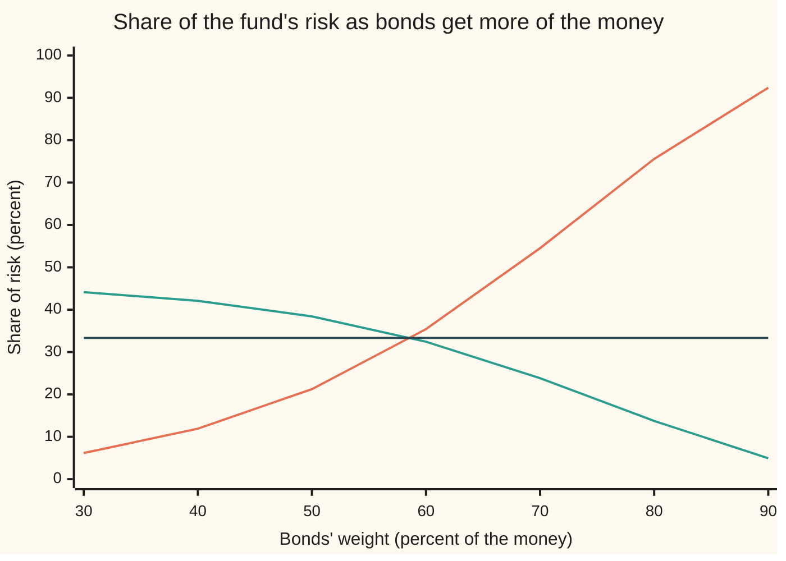

# Risk parity: equalising risk contributions instead of weights

[Syllabus](../../../SYLLABUS.md) → [Financial mathematics](../../../SYLLABUS.md#w12) → [Portfolio Theory](../../../SYLLABUS.md#w12-s37) → Risk parity

---

## General Overview

A fund holds three things: shares, bonds and gold. Shares are expected to earn 8 percent a year and swing with a volatility of 20 percent (volatility: the typical size of a year's surprise, one standard deviation of the return). Bonds earn 4 percent and swing 6 percent. Gold earns 5 percent and swings 15 percent. Shares and bonds move together a little (correlation 0.2), shares and gold a little less (0.1), bonds and gold not at all (0).

Split the money equally, a third in each, and the split looks fair. It is not. Shares carry 59.04 percent of the fund's risk, gold 33.16 percent, bonds 7.80 percent. The classic 60/40 fund, 60 percent shares and 40 percent bonds, is worse: shares carry 92.86 percent of its risk. Whatever the labels say, such a fund is a bet on shares.

Risk parity turns the question round. It fixes how the *risk* is shared, a third each, and solves for the money. The answer: 16.73 percent in shares, 58.74 percent in bonds, 24.54 percent in gold. Bonds get nearly 60 percent of the money to carry a third of the risk.

Two tools make that possible. The first splits a portfolio's volatility into one piece per asset, pieces that add up exactly; it rests on a theorem of Euler about functions that double when their inputs double. The second finds the weights that make the pieces equal, which is a system of equations with exactly one sensible answer.

**Measure each asset's share of the portfolio's volatility as its weight times the rate at which volatility rises when that weight grows; those shares add up to the whole, and risk parity picks the weights that make them equal.**

**What kind of fact this is:** a method, a rule for choosing weights, not a law of markets. It stands on two theorems proved on this card in Why it works: Euler's split of volatility into contributions, and the existence of exactly one long-only equal-risk portfolio.

### The picture: where the risk sits

Each block is 2 percent of the fund's risk.

```
Share of the fund's risk, percent (each █ = 2 percent)
equal money   shares  ██████████████████████████████  59.04
              bonds   ████                             7.80
              gold    █████████████████               33.16
equal risk    shares  █████████████████               33.33
              bonds   █████████████████               33.33
              gold    █████████████████               33.33
```

Moving money into bonds raises their share of risk slowly at first, then fast. The chart holds shares and gold at their equal-risk ratio, 41 to 59, and slides the bond weight from 30 to 90 percent.



The steep line is bonds' share of risk. The falling line is shares' share. The flat line is one third. Bonds cross it just below 60 percent of the money: at 58.74 percent all three shares are equal.

---

## The formula

Notation first, in words. The fund's weights are $w_i$: the fraction of the money in asset number $i$, with $i$ running over shares, bonds, gold. The list of all of them is $w$. The covariance table $\Sigma$ holds, in row $i$ and column $j$, the number $\Sigma_{ij} = \rho_{ij}\sigma_i\sigma_j$: correlation times the two volatilities ([Two assets](01-two-asset-portfolio-risk-and-return.md) builds it for two assets). Here it reads, row by row, `0.0400 0.0024 0.0030 | 0.0024 0.0036 0.0000 | 0.0030 0.0000 0.0225`.

The fund's volatility is

$$\sigma(w) = \sqrt{\sum_i \sum_j w_i \Sigma_{ij} w_j}$$

and each asset's **marginal risk** and **risk contribution** are

$$\mathrm{MRC}_i = \frac{\partial \sigma}{\partial w_i} = \frac{(\Sigma w)_i}{\sigma(w)}, \qquad \mathrm{RC}_i = w_i\,\mathrm{MRC}_i = \frac{w_i (\Sigma w)_i}{\sigma(w)}, \qquad \sum_i \mathrm{RC}_i = \sigma(w).$$

**Read it aloud:** an asset's marginal risk is how fast the fund's volatility rises per extra unit of that asset; its contribution is its weight times that rate; the contributions add up to the fund's volatility exactly.

Risk parity, also called the equal-risk-contribution portfolio, asks for

$$\mathrm{RC}_1 = \mathrm{RC}_2 = \dots = \mathrm{RC}_n = \frac{\sigma(w)}{n}, \qquad \text{equivalently} \qquad w_i (\Sigma w)_i \text{ the same for every } i,$$

with every weight positive and the weights adding to 1.

**Read it aloud:** choose the weights so that every asset's weight times its covariance with the fund comes out the same.

| Symbol | Plain meaning | In our example | Push it up and the answer… |
| --- | --- | --- | --- |
| $w_i$, $w$ | fraction of the money in asset $i$; the whole list | bonds 0.587375 at equal risk | that asset's contribution rises faster than its weight |
| $n$, $i$, $j$ | how many assets; asset numbers running from 1 to $n$ | 3; shares, bonds, gold | each target share, one $n$-th, shrinks |
| $\sigma_i$ | asset $i$'s own volatility | 0.20, 0.06, 0.15 | the asset gets less money |
| $\rho_{ij}$ | correlation of assets $i$ and $j$ | 0.2, 0.1, 0 | both get less money |
| $\Sigma$, $\Sigma_{ij}$ | covariance table and one entry, $\rho_{ij}\sigma_i\sigma_j$ | shares with bonds 0.0024 | more fund risk |
| $(\Sigma w)_i$ | covariance of asset $i$ with the whole fund | shares 0.008836 | larger contribution |
| $\sigma(w)$ | the fund's volatility | 0.066584 | — |
| $\mathrm{MRC}_i$ | marginal risk: volatility added per unit of asset $i$ | shares 0.132703, bonds 0.037786 | each extra dollar adds more risk |
| $\mathrm{RC}_i$ | risk contribution: weight times marginal risk | 0.022195 each | larger slice of the fund's risk |
| $t$ | a scaling factor applied to every weight at once | 2 doubles the fund | volatility scales by the same factor |
| $y_i$, $y_j$, $y$, $f$ | unscaled weights the solver works with; the score it minimises | normalised to $w$ at the end | — |
| $b_i$ | covariance of asset $i$ with the other assets' $y$ | recomputed each step | smaller $y_i$ |

Two helper readings. $(\Sigma w)_i = \sum_j \Sigma_{ij} w_j$ is the covariance between asset $i$'s return and the fund's return, so $\mathrm{RC}_i / \sigma(w)$ is asset $i$'s share of the fund's variance. A risk *budget* replaces the equal thirds with any chosen shares; equal thirds is the special case.

### When it holds

- **The covariance table is right and stable.** It is estimated from past returns ([Estimation error](07-estimation-error-and-shrinkage.md)). If correlations jump in a crash, the thirds become unequal. Risk parity uses no expected returns, the hardest numbers to estimate, which is its main defence.
- **Volatility is the risk that matters.** It treats gains and losses alike. The Euler split works for any risk measure that doubles when positions double, such as value at risk (the loss exceeded only in the worst few percent of outcomes), so the method carries over; the weights change.
- **No mix of the assets is riskless, and weights stay positive.** Then exactly one answer exists. A riskless asset, or a riskless mix, would soak up all the money. Allow short positions and several answers appear.
- **The weights are kept there.** Prices move the weights every day. Without rebalancing (trading back to target) the thirds drift apart.

---

## Why it works

### Step 0: doubling every position doubles the risk

Hold twice as much of everything and every return doubles, so volatility doubles. A function with that property, $\sigma(tw) = t\,\sigma(w)$ for every positive $t$, is called homogeneous of degree one. Euler noticed that such a function is always the sum of its inputs times its slopes. That is the whole reason risk can be split into pieces that add up.

### Step 1: the slope of volatility in one weight

Variance is $\sigma(w)^2 = \sum_i\sum_j w_i \Sigma_{ij} w_j$. The weight $w_i$ appears in row $i$ and in column $i$; the table is symmetric, so both give $(\Sigma w)_i$, and the slope of variance is $2(\Sigma w)_i$. Volatility is the square root of variance; the chain rule divides by $2\sigma(w)$:

$$\frac{\partial \sigma}{\partial w_i} = \frac{2(\Sigma w)_i}{2\sigma(w)} = \frac{(\Sigma w)_i}{\sigma(w)}.$$

For shares at the equal-risk weights: 0.008836 divided by 0.066584 is 0.132703. Nudging each weight up and down by a millionth and measuring the change gives the same three numbers to six places.

### Step 2: the slopes, weighted, rebuild the whole

Differentiate $\sigma(tw) = t\,\sigma(w)$ with respect to $t$. The right side gives $\sigma(w)$. The left side, by the chain rule, gives $\sum_i w_i \, \partial\sigma/\partial w_i$ evaluated at the scaled weights. Set $t = 1$:

$$\sum_i w_i \frac{\partial \sigma}{\partial w_i} = \sigma(w).$$

That is Euler's theorem for this function. Here it can also be checked directly: $\sum_i w_i (\Sigma w)_i / \sigma(w)$ is variance over volatility, which is volatility. The pieces $\mathrm{RC}_i$ add to the whole with nothing left over and nothing counted twice. That is what makes "a third of the risk" a meaningful phrase.

A second reading: $(\Sigma w)_i$ is the covariance of asset $i$ with the fund, so $\mathrm{RC}_i/\sigma(w)$ is $w_i$ times that covariance over the fund's variance. It is the part of the fund's variance that asset $i$ is responsible for, cross terms included. A simulation of 200,000 years of returns in the code splits the variance this way and lands within half a percent of a third each.

### Step 3: exactly one equal-risk portfolio exists

Equal contributions means $w_i(\Sigma w)_i$ is the same number for every asset: $n$ equations, curved, with the weights on both sides. That such a system has one positive answer is not obvious. The proof trades the equations for a valley with one lowest point. Take unscaled weights $y_i > 0$ and the score

$$f(y) = \tfrac12 \sum_i\sum_j y_i \Sigma_{ij} y_j - \sum_i \ln y_i.$$

The first term is half the variance. The second pushes back hard as any $y_i$ approaches zero. Its lowest point has zero slope in every direction: $(\Sigma y)_i - 1/y_i = 0$, which is $y_i(\Sigma y)_i = 1$ for every $i$. Equal contributions. Dividing $y$ by its total gives weights $w$ that add to 1, and the contributions stay equal, since $w_i(\Sigma w)_i$ just scales by one common factor.

<details>
<summary>Detailed proof: one lowest point, and every equal-risk portfolio is it</summary>

**Existence.** Assume $\Sigma$ is positive definite: no mix of the assets has zero volatility. Then the variance term grows like the square of the size of $y$ while $-\sum \ln y_i$ falls only like a logarithm, so $f$ rises without bound far out. Near any face where some $y_i \to 0$, $-\ln y_i \to +\infty$, while on any bounded region the other terms are bounded below, so $f$ rises there too. A continuous function that rises at every edge of its region has a lowest point inside it.

**Uniqueness of the lowest point.** The variance term is convex (a bowl), and each $-\ln y_i$ is strictly convex. Their sum is strictly convex, and a strictly convex function has at most one lowest point.

**Every equal-risk portfolio comes from it.** Let $w > 0$ satisfy $w_i(\Sigma w)_i = k$ for all $i$, with $k > 0$. Put $y = w/\sqrt{k}$. Then $y_i(\Sigma y)_i = w_i(\Sigma w)_i / k = 1$, so $y$ is a point of zero slope of $f$, which for a strictly convex function is the lowest point. So $w$ is the lowest point rescaled, and two equal-risk portfolios with weights adding to 1 are the same one.

**Boundary cases.** Two assets: $w_1^2\Sigma_{11} + w_1w_2\Sigma_{12} = w_2^2\Sigma_{22} + w_1w_2\Sigma_{12}$, the cross terms cancel, and $w_1\sigma_1 = w_2\sigma_2$: weights in inverse proportion to volatility, whatever the correlation. All correlations equal: the same inverse-volatility answer, by symmetry of the row sums in Step 5. Shorts allowed: the logarithm term no longer fences off the faces, and flipping signs yields further solutions, so the long-only answer is the one meant.

</details>

### Step 4: finding it, one asset at a time

Hold every $y_j$ but one fixed. The slope of $f$ in $y_i$ is $\Sigma_{ii}y_i + b_i - 1/y_i$, where $b_i = \sum_{j \ne i}\Sigma_{ij}y_j$ is asset $i$'s covariance with the rest. Setting it to zero gives a quadratic, $\Sigma_{ii}y_i^2 + b_i y_i - 1 = 0$, with one positive root:

$$y_i = \frac{-b_i + \sqrt{b_i^2 + 4\Sigma_{ii}}}{2\Sigma_{ii}}.$$

Each such step lowers $f$. Cycling through the assets a few hundred times reaches the lowest point to machine precision. This is the coordinate-descent method of Griveau-Billion, Richard and Roncalli, and it is road 1 in the code. Road 2 is Newton's method on the same slope equations, road 3 a brute-force search over every weight in steps of 0.1 percent.

### Step 5: the alternatives, read through the same lens

The contributions give a common ruler for other weighting rules.

- **Equal money** gives $w_i = 1/n$. Contributions follow volatility and correlation, so shares dominate: 59.04 percent.
- **Inverse volatility** gives $w_i \propto 1/\sigma_i$: 17.65, 58.82, 23.53 percent. Then $w_i\sigma_i$ is one common number, and $\mathrm{RC}_i$ is proportional to $\sum_j \rho_{ij}$, the row sum of the correlation table. Those sums are 1.30, 1.20, 1.10 out of 3.60, so the risk shares are 36.11, 33.33, 30.56 percent. Close to parity, not equal: shares correlate most with the rest, so they carry extra.
- **Minimum variance** makes the *marginal* risks equal, 0.055618 each; that is the first-order condition for the lowest volatility ([The efficient frontier](02-efficient-frontier-and-minimum-variance.md)). Equal marginals make each risk share equal the weight: bonds hold 84.84 percent of the money and 84.84 percent of the risk.
- **Equal risk** sits between them. Its volatility, 6.66 percent, lies above minimum variance's 5.56 and below equal money's 9.24. Maillard, Roncalli and Teiletche prove that order holds for every covariance table.

Another route to the same weights solves the $n$ curved equations directly with any root finder; the valley in Step 3 is the reason that route has one answer to find.

---

## Worked numbers, by hand

The check: take the equal-risk weights and confirm the three contributions come out equal.

| Step | Arithmetic | Value |
| --- | --- | --- |
| weights | shares, bonds, gold | 0.167251, 0.587375, 0.245374 |
| shares' covariance with the fund | 0.0400 × 0.167251 + 0.0024 × 0.587375 + 0.0030 × 0.245374 | 0.008836 |
| bonds' and gold's, the same way | rows 2 and 3 of the table | 0.002516, 0.006023 |
| weight times covariance | 0.167251 × 0.008836, and likewise | 0.001478 each |
| fund variance | sum of the three | 0.004433 |
| fund volatility | square root | 0.066584 |
| marginal risks | 0.008836 / 0.066584, and likewise | 0.132703, 0.037786, 0.090452 |
| contributions | weight × marginal risk | **0.022195 each, a third of 0.066584** |

Bonds add the least volatility per dollar, so they take the most dollars; each asset ends up adding the same 0.022195 to the fund's volatility of 6.66 percent.

### What breaks if you drop a piece

| Mistake | Comes out at | What went wrong |
| --- | --- | --- |
| Equal money read as equal risk | shares 59.04, bonds 7.80, gold 33.16 percent of risk | weight is not risk |
| Own variance only, $w_i^2\Sigma_{ii}$ over the fund's variance | 25.24, 28.02, 30.56, summing to 83.81 percent | the cross terms are dropped, so the pieces miss the whole |
| Equal marginal risk instead of equal contribution | bonds 84.84 percent of the money and of the risk | that condition is minimum variance |
| Levering the equal-risk mix to 60/40's volatility, borrowing ignored | 9.37 percent a year, but 4.84 percent after borrowing at 5 percent | leverage costs the cash rate on every borrowed dollar |

---

## Code, from first principles, and it actually runs

The code finds the equal-risk weights by three roads that share no arithmetic: coordinate steps on the valley of Step 3, Newton's method with its own linear solver, and a brute-force grid in steps of 0.1 percent. It checks Euler's split by nudging each weight and measuring the change in volatility, and it checks the meaning of a risk share a fourth way, by simulating 200,000 years of correlated returns with its own random numbers and splitting their variance. It then prints every comparison and chart point on this card. Seven asserts.

### Python

```python
# Risk parity -- the check behind the card.  Standard library only.
# Three assets: shares (8%, 20%), bonds (4%, 6%), gold (5%, 15%), correlations
# shares-bonds 0.2, shares-gold 0.1, bonds-gold 0.  Equal-risk weights by three
# roads (coordinate steps, Newton's method, a brute-force grid), Euler's sum by
# bumping weights, and risk shares a fourth way, by simulating returns.
from math import sqrt, log, cos, pi

VOL, MU = (0.20, 0.06, 0.15), (0.08, 0.04, 0.05)
RHO = ((1.0, 0.2, 0.1), (0.2, 1.0, 0.0), (0.1, 0.0, 1.0))
S = [[RHO[i][j] * VOL[i] * VOL[j] for j in range(3)] for i in range(3)]

def Sw(S, w): return [sum(S[i][j] * w[j] for j in range(len(w))) for i in range(len(w))]
def vol(S, w): return sqrt(sum(a * b for a, b in zip(w, Sw(S, w))))
def euler(S, w):                         # marginal risk (S w)_i / vol, contribution w_i times it
    s = vol(S, w)
    mrc = [x / s for x in Sw(S, w)]
    return mrc, [a * b for a, b in zip(w, mrc)]
def share(S, w): return [x / vol(S, w) for x in euler(S, w)[1]]
def norm(y): return [x / sum(y) for x in y]

def erc_steps(S, sweeps=300):            # road 1: each y_i solves S_ii y^2 + b y - 1 = 0 in turn
    y = [1.0] * len(S)
    for _ in range(sweeps):
        for i in range(len(S)):
            b = sum(S[i][j] * y[j] for j in range(len(S)) if j != i)
            y[i] = (-b + sqrt(b * b + 4.0 * S[i][i])) / (2.0 * S[i][i])
    return norm(y)

def solve(A, b):                         # Gaussian elimination with row swaps
    n = len(b)
    M = [A[i][:] + [b[i]] for i in range(n)]
    for k in range(n):
        p = max(range(k, n), key=lambda r: abs(M[r][k]))
        M[k], M[p] = M[p], M[k]
        for r in range(k + 1, n):
            f = M[r][k] / M[k][k]
            M[r] = [M[r][c] - f * M[k][c] for c in range(n + 1)]
    x = [0.0] * n
    for k in reversed(range(n)):
        x[k] = (M[k][n] - sum(M[k][c] * x[c] for c in range(k + 1, n))) / M[k][k]
    return x

def erc_newton(S):                       # road 2: Newton on S y - 1/y = 0, kept positive
    n = len(S)
    y = [1.0] * n
    for _ in range(60):
        g = [a - 1.0 / y[i] for i, a in enumerate(Sw(S, y))]
        H = [[S[i][j] + (1.0 / y[i] ** 2 if i == j else 0.0) for j in range(n)] for i in range(n)]
        d, t = solve(H, g), 1.0
        while any(y[i] - t * d[i] <= 0.0 for i in range(n)):
            t /= 2.0
        y = [y[i] - t * d[i] for i in range(n)]
    return norm(y)

def erc_grid(S, steps=1000):             # road 3: every weight in 0.1% steps, smallest spread
    grid = ((a / steps, b / steps, (steps - a - b) / steps)
            for a in range(1, steps) for b in range(1, steps - a))
    return list(min(grid, key=lambda w: max(euler(S, w)[1]) - min(euler(S, w)[1])))

w1, w2, w3 = erc_steps(S), erc_newton(S), erc_grid(S)
ew, sixty, iv = [1 / 3] * 3, [0.6, 0.4, 0.0], norm([1 / v for v in VOL])
mv = norm(solve(S, [1.0, 1.0, 1.0]))
def ret(w): return sum(a * b for a, b in zip(w, MU))

print("equal-risk weights      shares     bonds      gold")
for lab, w in (("road 1, coordinate steps", w1), ("road 2, Newton", w2), ("road 3, grid of 0.1%", w3)):
    print(f"{lab:<24}" + "".join(f"{x:10.6f}" for x in w))
mrc, rc = euler(S, w1)
h, s1 = 1e-6, vol(S, w1)
fd = [(vol(S, [w1[j] + (h if j == i else 0) for j in range(3)])
       - vol(S, [w1[j] - (h if j == i else 0) for j in range(3)])) / (2 * h) for i in range(3)]
print("covariance S, row by row: " + " | ".join(" ".join(f"{a:.4f}" for a in r) for r in S))
print(f"{'covariance times w, S w':<24}" + "".join(f"{x:10.6f}" for x in Sw(S, w1)))
print(f"{'marginal risk, formula':<24}" + "".join(f"{x:10.6f}" for x in mrc))
print(f"{'marginal risk, bumped':<24}" + "".join(f"{x:10.6f}" for x in fd))
print(f"{'risk contribution':<24}" + "".join(f"{x:10.6f}" for x in rc))
print(f"{'w times S w':<24}" + "".join(f"{a * b:10.6f}" for a, b in zip(w1, Sw(S, w1))) + f", total {s1 * s1:.6f}")
print(f"{'portfolio volatility':<24}{s1:10.6f}")
print(f"{'sum of contributions':<24}{sum(a * b for a, b in zip(w1, fd)):10.6f}")

x = [0x2545F4914F6CDD1D]                 # road 4: simulate returns, split the variance
def unif():
    x[0] = (x[0] + 0x9E3779B97F4A7C15) & 0xFFFFFFFFFFFFFFFF
    z = x[0]
    z = ((z ^ (z >> 30)) * 0xBF58476D1CE4E5B9) & 0xFFFFFFFFFFFFFFFF
    z = ((z ^ (z >> 27)) * 0x94D049BB133111EB) & 0xFFFFFFFFFFFFFFFF
    return ((z ^ (z >> 31)) >> 11) / 9007199254740992.0 + 1e-18
L = [[0.0] * 3 for _ in range(3)]        # Cholesky: S = L L^T
for i in range(3):
    for j in range(i + 1):
        t = S[i][j] - sum(L[i][k] * L[j][k] for k in range(j))
        L[i][j] = sqrt(t) if i == j else t / L[j][j]
N, acc, accp = 200000, [0.0] * 3, 0.0
for _ in range(N):
    e = [sqrt(-2 * log(unif())) * cos(2 * pi * unif()) for _ in range(3)]
    r = [sum(L[i][k] * e[k] for k in range(3)) for i in range(3)]
    parts = [w1[i] * r[i] for i in range(3)]
    p = sum(parts)
    acc = [acc[i] + parts[i] * p for i in range(3)]
    accp += p * p
sim = [a / accp for a in acc]
print(f"{'risk share, formula':<24}" + "".join(f"{x:10.6f}" for x in share(S, w1)))
print(f"{'risk share, simulated':<24}" + "".join(f"{x:10.6f}" for x in sim))

print()
print("portfolio              shares   bonds    gold    vol  return  | risk share: shares bonds gold")
for lab, w in (("equal money", ew), ("60/40 shares/bonds", sixty), ("inverse volatility", iv),
               ("minimum variance", mv), ("equal risk", w1)):
    print(f"{lab:<20}" + "".join(f"{100 * a:8.2f}" for a in w) + f"{100 * vol(S, w):7.2f}{100 * ret(w):7.2f}"
          + "  |" + "".join(f"{100 * a:7.2f}" for a in share(S, w)))
rs = [sum(row) for row in RHO]
print("inverse volatility, correlation row sums " + " ".join(f"{a:.2f}" for a in rs) + f" of {sum(rs):.2f}: "
      + " ".join(f"{100 * a / sum(rs):.2f}" for a in rs))
print(f"minimum variance, marginal risk each: " + " ".join(f"{a:.6f}" for a in euler(S, mv)[0]))
lev = vol(S, sixty) / s1
print(f"return per unit of risk: 60/40 {ret(sixty) / vol(S, sixty):.4f}, equal risk {ret(w1) / s1:.4f}; levered "
      f"{lev:.4f}x to 60/40's vol: {100 * lev * ret(w1):.2f}% before, {100 * (lev * ret(w1) - (lev - 1) * 0.05):.2f}% after borrowing at 5%")
print(f"wrong: own-variance shares at equal risk: "
      + " ".join(f"{100 * w1[i] ** 2 * S[i][i] / s1 ** 2:.2f}" for i in range(3))
      + f", summing to {sum(100 * w1[i] ** 2 * S[i][i] / s1 ** 2 for i in range(3)):.2f}")
S2 = [[0.04, 0.2 * 0.2 * 0.06], [0.2 * 0.2 * 0.06, 0.0036]]
S2n = [[0.04, -0.5 * 0.2 * 0.06], [-0.5 * 0.2 * 0.06, 0.0036]]
print(f"two assets, correlation 0.2: bonds {erc_steps(S2)[1]:.6f}; correlation -0.5: bonds "
      f"{erc_steps(S2n)[1]:.6f}; 0.20/(0.20+0.06) = {0.20 / 0.26:.6f}")
print()
g = w1[0] / (w1[0] + w1[2])
print(f"chart: shares and gold kept {100 * g:.0f}:{100 - 100 * g:.0f} as in the equal-risk mix; bonds' weight across")
print("bonds' weight, %     " + "".join(f"{100 * b:7.0f}" for b in (0.3, 0.4, 0.5, 0.6, 0.7, 0.8, 0.9)))
for lab, k in (("bonds' risk share, %", 1), ("shares' risk share, %", 0)):
    vals = [100 * share(S, [(1 - b) * g, b, (1 - b) * (1 - g)])[k] for b in (0.3, 0.4, 0.5, 0.6, 0.7, 0.8, 0.9)]
    print(f"{lab:<21}" + "".join(f"{v:7.2f}" for v in vals))
assert max(abs(a - b) for a, b in zip(w1, w2)) < 1e-10, "coordinate steps and Newton disagree"
assert max(abs(a - b) for a, b in zip(w1, w3)) < 2e-3, "grid lands away from the equal-risk mix"
assert max(abs(a - b) for a, b in zip(mrc, fd)) < 1e-8, "marginal risk formula disagrees with the bump"
assert abs(sum(a * b for a, b in zip(w1, fd)) - s1) < 1e-9, "Euler: bumped contributions must sum to vol"
assert max(abs(a - 1 / 3) for a in sim) < 0.01, "simulated risk shares are not a third each"
assert abs(erc_steps(S2n)[1] - 0.20 / 0.26) < 1e-10, "two assets: equal risk is inverse volatility"
assert vol(S, mv) < vol(S, w1) < vol(S, ew), "volatility order min-variance < equal-risk < equal-money"
print("ALL CHECKS PASS")
```

**Ran 2026-09-28 on macOS, Python 3.14.6, standard library only. All checks passed. Output, pasted from the run:**

```
equal-risk weights      shares     bonds      gold
road 1, coordinate steps  0.167251  0.587375  0.245374
road 2, Newton            0.167251  0.587375  0.245374
road 3, grid of 0.1%      0.167000  0.588000  0.245000
covariance S, row by row: 0.0400 0.0024 0.0030 | 0.0024 0.0036 0.0000 | 0.0030 0.0000 0.0225
covariance times w, S w   0.008836  0.002516  0.006023
marginal risk, formula    0.132703  0.037786  0.090452
marginal risk, bumped     0.132703  0.037786  0.090452
risk contribution         0.022195  0.022195  0.022195
w times S w               0.001478  0.001478  0.001478, total 0.004433
portfolio volatility      0.066584
sum of contributions      0.066584
risk share, formula       0.333333  0.333333  0.333333
risk share, simulated     0.334329  0.334636  0.331035

portfolio              shares   bonds    gold    vol  return  | risk share: shares bonds gold
equal money            33.33   33.33   33.33   9.24   5.67  |  59.04   7.80  33.16
60/40 shares/bonds     60.00   40.00    0.00  12.70   6.40  |  92.86   7.14   0.00
inverse volatility     17.65   58.82   23.53   6.70   4.94  |  36.11  33.33  30.56
minimum variance        1.63   84.84   13.53   5.56   4.20  |   1.63  84.84  13.53
equal risk             16.73   58.74   24.54   6.66   4.91  |  33.33  33.33  33.33
inverse volatility, correlation row sums 1.30 1.20 1.10 of 3.60: 36.11 33.33 30.56
minimum variance, marginal risk each: 0.055618 0.055618 0.055618
return per unit of risk: 60/40 0.5040, equal risk 0.7381; levered 1.9073x to 60/40's vol: 9.37% before, 4.84% after borrowing at 5%
wrong: own-variance shares at equal risk: 25.24 28.02 30.56, summing to 83.81
two assets, correlation 0.2: bonds 0.769231; correlation -0.5: bonds 0.769231; 0.20/(0.20+0.06) = 0.769231

chart: shares and gold kept 41:59 as in the equal-risk mix; bonds' weight across
bonds' weight, %          30     40     50     60     70     80     90
bonds' risk share, %    6.17  11.91  21.25  35.41  54.52  75.58  92.39
shares' risk share, %  44.14  42.09  38.42  32.43  23.84  13.75   4.94
ALL CHECKS PASS
```

### Rust

Same numbers, same labels, built with `rustc --edition 2021 -O`.

```rust
// Risk parity -- the same check as the Python, in Rust.  No crates.
// Three assets: shares (8%, 20%), bonds (4%, 6%), gold (5%, 15%), correlations
// shares-bonds 0.2, shares-gold 0.1, bonds-gold 0.  Equal-risk weights by three
// roads (coordinate steps, Newton's method, a brute-force grid), Euler's sum by
// bumping weights, and risk shares a fourth way, by simulating returns.
type M = Vec<Vec<f64>>;
const VOL: [f64; 3] = [0.20, 0.06, 0.15];
const MU: [f64; 3] = [0.08, 0.04, 0.05];
const RHO: [[f64; 3]; 3] = [[1.0, 0.2, 0.1], [0.2, 1.0, 0.0], [0.1, 0.0, 1.0]];

fn sw(s: &M, w: &[f64]) -> Vec<f64> {
    (0..w.len()).map(|i| (0..w.len()).fold(0.0, |a, j| a + s[i][j] * w[j])).collect()
}
fn dot(a: &[f64], b: &[f64]) -> f64 { a.iter().zip(b).fold(0.0, |t, (x, y)| t + x * y) }
fn vol(s: &M, w: &[f64]) -> f64 { dot(w, &sw(s, w)).sqrt() }
fn euler(s: &M, w: &[f64]) -> (Vec<f64>, Vec<f64>) {   // marginal risk (S w)_i / vol, contribution w_i times it
    let v = vol(s, w);
    let mrc: Vec<f64> = sw(s, w).iter().map(|x| x / v).collect();
    let rc = w.iter().zip(&mrc).map(|(a, b)| a * b).collect();
    (mrc, rc)
}
fn share(s: &M, w: &[f64]) -> Vec<f64> { euler(s, w).1.iter().map(|x| x / vol(s, w)).collect() }
fn norm(y: &[f64]) -> Vec<f64> { let t = y.iter().fold(0.0, |a, b| a + b); y.iter().map(|x| x / t).collect() }
fn ret(w: &[f64]) -> f64 { dot(w, &MU) }
fn row(lab: &str, v: &[f64]) { println!("{:<24}{}", lab, v.iter().map(|x| format!("{:10.6}", x)).collect::<String>()) }
fn erc_steps(s: &M) -> Vec<f64> {                 // road 1: each y_i solves S_ii y^2 + b y - 1 = 0 in turn
    let n = s.len();
    let mut y = vec![1.0; n];
    for _ in 0..300 {
        for i in 0..n {
            let b = (0..n).filter(|&j| j != i).fold(0.0, |a, j| a + s[i][j] * y[j]);
            y[i] = (-b + (b * b + 4.0 * s[i][i]).sqrt()) / (2.0 * s[i][i]);
        }
    }
    norm(&y)
}
fn solve(a: &M, b: &[f64]) -> Vec<f64> {          // Gaussian elimination with row swaps
    let n = b.len();
    let mut m: M = (0..n).map(|i| { let mut r = a[i].clone(); r.push(b[i]); r }).collect();
    for k in 0..n {
        let mut p = k;
        for r in k..n { if m[r][k].abs() > m[p][k].abs() { p = r } }
        m.swap(k, p);
        for r in k + 1..n {
            let f = m[r][k] / m[k][k];
            for c in 0..=n { m[r][c] -= f * m[k][c] }
        }
    }
    let mut x = vec![0.0; n];
    for k in (0..n).rev() {
        x[k] = (m[k][n] - (k + 1..n).fold(0.0, |t, c| t + m[k][c] * x[c])) / m[k][k];
    }
    x
}
fn erc_newton(s: &M) -> Vec<f64> {                // road 2: Newton on S y - 1/y = 0, kept positive
    let n = s.len();
    let mut y = vec![1.0; n];
    for _ in 0..60 {
        let g: Vec<f64> = sw(s, &y).iter().enumerate().map(|(i, a)| a - 1.0 / y[i]).collect();
        let h: M = (0..n).map(|i| (0..n).map(|j| s[i][j] + if i == j { 1.0 / (y[i] * y[i]) } else { 0.0 }).collect()).collect();
        let d = solve(&h, &g);
        let mut t = 1.0;
        while (0..n).any(|i| y[i] - t * d[i] <= 0.0) { t /= 2.0 }
        y = (0..n).map(|i| y[i] - t * d[i]).collect();
    }
    norm(&y)
}
fn erc_grid(s: &M, steps: usize) -> Vec<f64> {    // road 3: every weight in 0.1% steps, smallest spread
    let (mut best, mut bw) = (9.0, vec![]);
    for a in 1..steps {
        for b in 1..steps - a {
            let w = [a as f64 / steps as f64, b as f64 / steps as f64, (steps - a - b) as f64 / steps as f64];
            let rc = euler(s, &w).1;
            let spread = rc.iter().cloned().fold(f64::MIN, f64::max) - rc.iter().cloned().fold(f64::MAX, f64::min);
            if spread < best { best = spread; bw = w.to_vec() }
        }
    }
    bw
}
struct Rng(u64);                                  // splitmix64, the same stream as the Python
impl Rng {
    fn unif(&mut self) -> f64 {
        self.0 = self.0.wrapping_add(0x9E3779B97F4A7C15);
        let mut z = self.0;
        z = (z ^ (z >> 30)).wrapping_mul(0xBF58476D1CE4E5B9);
        z = (z ^ (z >> 27)).wrapping_mul(0x94D049BB133111EB);
        ((z ^ (z >> 31)) >> 11) as f64 / 9007199254740992.0 + 1e-18
    }
}
fn main() {
    let s: M = (0..3).map(|i| (0..3).map(|j| RHO[i][j] * VOL[i] * VOL[j]).collect()).collect();
    let (w1, w2, w3) = (erc_steps(&s), erc_newton(&s), erc_grid(&s, 1000));
    let (ew, sixty, iv) = (vec![1.0 / 3.0; 3], vec![0.6, 0.4, 0.0], norm(&VOL.iter().map(|v| 1.0 / v).collect::<Vec<f64>>()));
    let mv = norm(&solve(&s, &[1.0, 1.0, 1.0]));
    println!("equal-risk weights      shares     bonds      gold");
    row("road 1, coordinate steps", &w1); row("road 2, Newton", &w2); row("road 3, grid of 0.1%", &w3);
    let ((mrc, rc), h, s1) = (euler(&s, &w1), 1e-6, vol(&s, &w1));
    let fd: Vec<f64> = (0..3).map(|i| {
        let up: Vec<f64> = (0..3).map(|j| w1[j] + if j == i { h } else { 0.0 }).collect();
        let dn: Vec<f64> = (0..3).map(|j| w1[j] - if j == i { h } else { 0.0 }).collect();
        (vol(&s, &up) - vol(&s, &dn)) / (2.0 * h)
    }).collect();
    println!("covariance S, row by row: {}", s.iter().map(|r| r.iter().map(|a| format!("{:.4}", a)).collect::<Vec<_>>().join(" ")).collect::<Vec<_>>().join(" | "));
    row("covariance times w, S w", &sw(&s, &w1)); row("marginal risk, formula", &mrc);
    row("marginal risk, bumped", &fd); row("risk contribution", &rc);
    println!("{:<24}{}, total {:.6}", "w times S w", sw(&s, &w1).iter().zip(&w1).map(|(a, b)| format!("{:10.6}", b * a)).collect::<String>(), s1 * s1);
    println!("{:<24}{:10.6}", "portfolio volatility", s1); println!("{:<24}{:10.6}", "sum of contributions", dot(&w1, &fd));

    let mut rng = Rng(0x2545F4914F6CDD1D);         // road 4: simulate returns, split the variance
    let mut l = vec![vec![0.0; 3]; 3];            // Cholesky: S = L L^T
    for i in 0..3 {
        for j in 0..=i {
            let t = s[i][j] - (0..j).fold(0.0, |a, k| a + l[i][k] * l[j][k]);
            l[i][j] = if i == j { t.sqrt() } else { t / l[j][j] };
        }
    }
    let (mut acc, mut accp) = (vec![0.0; 3], 0.0);
    for _ in 0..200000 {
        let e: Vec<f64> = (0..3).map(|_| {
            let r = (-2.0 * rng.unif().ln()).sqrt();
            r * (2.0 * std::f64::consts::PI * rng.unif()).cos()
        }).collect();
        let r: Vec<f64> = (0..3).map(|i| (0..3).fold(0.0, |a, k| a + l[i][k] * e[k])).collect();
        let parts: Vec<f64> = (0..3).map(|i| w1[i] * r[i]).collect();
        let p = parts.iter().fold(0.0, |a, b| a + b);
        for i in 0..3 { acc[i] += parts[i] * p }
        accp += p * p;
    }
    let sim: Vec<f64> = acc.iter().map(|a| a / accp).collect();
    row("risk share, formula", &share(&s, &w1)); row("risk share, simulated", &sim);

    println!();
    println!("portfolio              shares   bonds    gold    vol  return  | risk share: shares bonds gold");
    for (lab, w) in [("equal money", &ew), ("60/40 shares/bonds", &sixty), ("inverse volatility", &iv),
                     ("minimum variance", &mv), ("equal risk", &w1)] {
        let a: String = w.iter().map(|x| format!("{:8.2}", 100.0 * x)).collect();
        let b: String = share(&s, w).iter().map(|x| format!("{:7.2}", 100.0 * x)).collect();
        println!("{:<20}{}{:7.2}{:7.2}  |{}", lab, a, 100.0 * vol(&s, w), 100.0 * ret(w), b);
    }
    let rs: Vec<f64> = RHO.iter().map(|r| r.iter().fold(0.0, |a, b| a + b)).collect(); let rst = rs.iter().fold(0.0, |a, b| a + b);
    let j = |v: Vec<String>| v.join(" ");
    println!("inverse volatility, correlation row sums {} of {:.2}: {}", j(rs.iter().map(|a| format!("{:.2}", a)).collect()), rst, j(rs.iter().map(|a| format!("{:.2}", 100.0 * a / rst)).collect()));
    println!("minimum variance, marginal risk each: {}", j(euler(&s, &mv).0.iter().map(|a| format!("{:.6}", a)).collect()));
    let lev = vol(&s, &sixty) / s1;
    println!("return per unit of risk: 60/40 {:.4}, equal risk {:.4}; levered {:.4}x to 60/40's vol: {:.2}% before, {:.2}% after borrowing at 5%",
             ret(&sixty) / vol(&s, &sixty), ret(&w1) / s1, lev, 100.0 * lev * ret(&w1), 100.0 * (lev * ret(&w1) - (lev - 1.0) * 0.05));
    let own: Vec<f64> = (0..3).map(|i| 100.0 * w1[i] * w1[i] * s[i][i] / (s1 * s1)).collect();
    println!("wrong: own-variance shares at equal risk: {}, summing to {:.2}",
             j(own.iter().map(|a| format!("{:.2}", a)).collect()), own.iter().fold(0.0, |a, b| a + b));
    let (c, cn) = (0.2 * 0.2 * 0.06, -0.5 * 0.2 * 0.06);
    let (s2, s2n): (M, M) = (vec![vec![0.04, c], vec![c, 0.0036]], vec![vec![0.04, cn], vec![cn, 0.0036]]);
    let (b2, b2n) = (erc_steps(&s2)[1], erc_steps(&s2n)[1]);
    println!("two assets, correlation 0.2: bonds {:.6}; correlation -0.5: bonds {:.6}; 0.20/(0.20+0.06) = {:.6}", b2, b2n, 0.20 / 0.26);
    println!();
    let (g, bs) = (w1[0] / (w1[0] + w1[2]), [0.3, 0.4, 0.5, 0.6, 0.7, 0.8, 0.9]);
    println!("chart: shares and gold kept {:.0}:{:.0} as in the equal-risk mix; bonds' weight across", 100.0 * g, 100.0 - 100.0 * g);
    println!("bonds' weight, %     {}", bs.iter().map(|b| format!("{:7.0}", 100.0 * b)).collect::<String>());
    for (lab, k) in [("bonds' risk share, %", 1), ("shares' risk share, %", 0)] {
        let v: String = bs.iter().map(|b| format!("{:7.2}", 100.0 * share(&s, &[(1.0 - b) * g, *b, (1.0 - b) * (1.0 - g)])[k])).collect();
        println!("{:<21}{}", lab, v);
    }
    assert!((0..3).all(|i| (w1[i] - w2[i]).abs() < 1e-10), "coordinate steps and Newton disagree");
    assert!((0..3).all(|i| (w1[i] - w3[i]).abs() < 2e-3), "grid lands away from the equal-risk mix");
    assert!((0..3).all(|i| (mrc[i] - fd[i]).abs() < 1e-8), "marginal risk formula disagrees with the bump");
    assert!((dot(&w1, &fd) - s1).abs() < 1e-9, "Euler: bumped contributions must sum to vol");
    assert!(sim.iter().all(|a| (a - 1.0 / 3.0).abs() < 0.01), "simulated risk shares are not a third each");
    assert!((b2n - 0.20 / 0.26).abs() < 1e-10, "two assets: equal risk is inverse volatility");
    assert!(vol(&s, &mv) < s1 && s1 < vol(&s, &ew), "volatility order min-variance < equal-risk < equal-money");
    println!("ALL CHECKS PASS");
}
```

**Ran 2026-09-28 on macOS, rustc 1.98.1, no crates. All checks passed. Output, pasted from the run:**

```
equal-risk weights      shares     bonds      gold
road 1, coordinate steps  0.167251  0.587375  0.245374
road 2, Newton            0.167251  0.587375  0.245374
road 3, grid of 0.1%      0.167000  0.588000  0.245000
covariance S, row by row: 0.0400 0.0024 0.0030 | 0.0024 0.0036 0.0000 | 0.0030 0.0000 0.0225
covariance times w, S w   0.008836  0.002516  0.006023
marginal risk, formula    0.132703  0.037786  0.090452
marginal risk, bumped     0.132703  0.037786  0.090452
risk contribution         0.022195  0.022195  0.022195
w times S w               0.001478  0.001478  0.001478, total 0.004433
portfolio volatility      0.066584
sum of contributions      0.066584
risk share, formula       0.333333  0.333333  0.333333
risk share, simulated     0.334329  0.334636  0.331035

portfolio              shares   bonds    gold    vol  return  | risk share: shares bonds gold
equal money            33.33   33.33   33.33   9.24   5.67  |  59.04   7.80  33.16
60/40 shares/bonds     60.00   40.00    0.00  12.70   6.40  |  92.86   7.14   0.00
inverse volatility     17.65   58.82   23.53   6.70   4.94  |  36.11  33.33  30.56
minimum variance        1.63   84.84   13.53   5.56   4.20  |   1.63  84.84  13.53
equal risk             16.73   58.74   24.54   6.66   4.91  |  33.33  33.33  33.33
inverse volatility, correlation row sums 1.30 1.20 1.10 of 3.60: 36.11 33.33 30.56
minimum variance, marginal risk each: 0.055618 0.055618 0.055618
return per unit of risk: 60/40 0.5040, equal risk 0.7381; levered 1.9073x to 60/40's vol: 9.37% before, 4.84% after borrowing at 5%
wrong: own-variance shares at equal risk: 25.24 28.02 30.56, summing to 83.81
two assets, correlation 0.2: bonds 0.769231; correlation -0.5: bonds 0.769231; 0.20/(0.20+0.06) = 0.769231

chart: shares and gold kept 41:59 as in the equal-risk mix; bonds' weight across
bonds' weight, %          30     40     50     60     70     80     90
bonds' risk share, %    6.17  11.91  21.25  35.41  54.52  75.58  92.39
shares' risk share, %  44.14  42.09  38.42  32.43  23.84  13.75   4.94
ALL CHECKS PASS
```

The two outputs match line for line, the simulated shares included, since both programs draw the same random stream.

> [!TIP]
> **Try changing**
> Guess first, then run it.
> - **Coarser grid.** Change `steps=1000` to `steps=100` in the grid road. The grid now lands on whole percents, farther from the true weights than the assert allows, and the run stops at the grid assert.
> - **Riskier bonds.** Change bonds' volatility from 0.06 to 0.12. Bonds lose their majority of the money; they still carry exactly a third of the risk.
> - **Bonds and gold move together.** Set their correlation to 0.5 in both places in the table. Both give up money to shares, since each now adds to the other's risk.
> - **Negative correlation in the two-asset case.** Already in the output: at correlation 0.2 and at −0.5 bonds get 0.769231, which is 0.20/(0.20+0.06). With two assets, correlation never moves the equal-risk weights.

---

## The usual mistake

> [!warning]
> **Reading weights as risk.** A fund a third in each asset is not diversified in risk: shares carry 59.04 percent of it. A 60/40 fund's risk is 92.86 percent shares. Diversification is judged by the contributions, never by the money.
>
> - **Adding up own variances.** Each asset's $w_i^2\Sigma_{ii}$ over the fund's variance ignores the covariance terms; at the equal-risk weights these shares come to 25.24, 28.02 and 30.56 percent and add to only 83.81 percent.
> - **Taking inverse volatility for risk parity.** It ignores correlation; here the shares come out 36.11, 33.33 and 30.56 percent. It is exact only for two assets or equal correlations.
> - **Equalising marginal risks.** That produces the minimum-variance portfolio, with 84.84 percent in bonds, not the equal-risk one.
> - **Forgetting the cost of leverage.** The equal-risk mix has a better return per unit of risk, 0.7381 against 60/40's 0.5040, but reaching 60/40's volatility means levering it 1.9073 times; borrowing at 5 percent turns 9.37 percent into 4.84. The mix earns 4.91 percent, below the 5 percent borrowing rate, so every borrowed dollar loses money.

---

## Where you meet it in real life

- **Risk-parity funds.** They hold roughly this kind of mix, heavy in bonds, and borrow to lift volatility to a target. The borrowing cost decides whether that beats a 60/40 fund; the riskless-asset card, [Adding a riskless asset](03-tangency-portfolio-and-the-capital-market-line.md), is the frame for that trade.
- **Risk budgets at pension funds.** Unequal targets, say half the risk to shares, use the same contributions and the same solver with a different right-hand side.
- **Risk reports and bank capital.** Euler's split allocates a bank's value at risk or capital to desks and business lines so the pieces add to the total (Tasche's paper below).
- **Factor risk parity.** Equalising risk across factors, such as growth and inflation, rather than across assets: [Factor models](05-factor-models-and-apt.md).
- **A contrast with views-based weights.** [Black-Litterman](06-black-litterman.md) starts from expected returns; risk parity refuses to use them at all.

> **Say it back**
> Volatility doubles when every position doubles, so Euler's theorem splits it into one contribution per asset: weight times marginal risk, adding exactly to the whole. Marginal risk is the asset's covariance with the fund divided by the fund's volatility. Risk parity chooses the weights that make the contributions equal; one such long-only portfolio always exists, found by minimising half the variance minus the sum of log weights. For shares, bonds and gold it puts 58.74 percent in bonds, because bonds add the least risk per dollar. It uses no expected returns, sits between minimum variance and equal money in volatility, and needs leverage to reach a share-like return.

---

## What this builds on

- [Estimation error](07-estimation-error-and-shrinkage.md): why expected returns are too noisy to optimise on, the problem risk parity sidesteps, and how the covariance table it does use is estimated.

## Where this goes next

- [Adding a riskless asset](03-tangency-portfolio-and-the-capital-market-line.md): borrowing at the riskless rate, which sets the price of levering a risk-parity mix.
- [Factor models](05-factor-models-and-apt.md): the factors across which risk can be budgeted instead of assets.

Risk parity says how to share risk, not how much to take; how much risk a portfolio should carry, and at what borrowing cost, is the question the capital market line answers.

---

## Sources

Verified 2026-09-28: every link below opens a page naming the cited work; the DOI's title and first author were confirmed at Crossref.

- Maillard, Sébastien, Thierry Roncalli and Jérôme Teïletche. "The Properties of Equally Weighted Risk Contribution Portfolios." *The Journal of Portfolio Management* 36(4), 2010, 60–70. [DOI](https://doi.org/10.3905/jpm.2010.36.4.060). Defines the equal-risk portfolio, proves existence and uniqueness by the log-barrier valley, and the volatility order against minimum variance and equal money.
- Griveau-Billion, Théophile, Jean-Charles Richard and Thierry Roncalli. "A Fast Algorithm for Computing High-dimensional Risk Parity Portfolios." 2013. [arXiv](https://arxiv.org/abs/1311.4057). The coordinate-step solver of Step 4.
- Tasche, Dirk. "Capital Allocation to Business Units and Sub-Portfolios: the Euler Principle." 2007. [arXiv](https://arxiv.org/abs/0708.2542). Euler's theorem as the rule for splitting any risk measure that scales with position size.
- Roncalli, Thierry. *Introduction to Risk Parity and Budgeting*. Chapman and Hall/CRC, 2013. [Publisher page](https://www.routledge.com/Introduction-to-Risk-Parity-and-Budgeting/Roncalli/p/book/9781482207156). Risk budgets, their solvers and their use in asset allocation, at book length.
