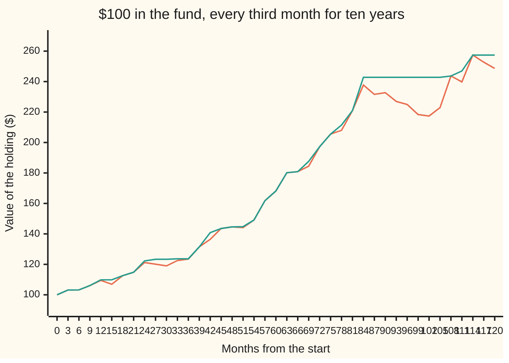

# Performance measures: Sharpe, information ratio, maximum drawdown, and their error bars

Financial mathematics → Performance and Multi-Period → Scoring a track record → Performance measures

---

## General Overview

A fund has run for ten years. Each month it reports one number: its return, the percentage its assets gained or lost that month. That makes 120 numbers. The fund here is simulated, so every number can be rerun. Invested at the start, $100 became $248.65. Over the same years, cash in the bank paid 0.20% a month, and the fund's chosen **benchmark** (the index it promises to beat, here a stock index) had its own 120 returns.

Is that a good record? The final $248.65 does not say. It ignores how much risk was taken to get there, how much of the gain came from the market rather than from the manager, and how painful the ride was. Three standard scores answer those three questions.

The **Sharpe ratio** divides the fund's average return above cash by the typical size of its monthly swings. This fund scores 0.90 a year. The **information ratio** does the same against the benchmark instead of cash: 0.57. The **maximum drawdown** is the worst fall from a previous high: 12.22%, from month 83 to month 103.

Each score is computed from one ten-year sample. A different ten years from the same manager would give different numbers. So a score needs an **error bar**: its **standard error**, the typical distance between a score measured from one sample and the true value the manager would show over a very long run. For this Sharpe ratio it is 0.32. The honest summary of the record is **Sharpe 0.9 plus or minus 0.3 over ten years**, and the card's main job is to show where the 0.3 comes from.

**The Sharpe ratio is reward over risk, measured above cash; the information ratio is the same measured above a benchmark; the maximum drawdown is the deepest fall from a high; and a ten-year Sharpe ratio is uncertain by about one divided by the square root of ten.**

**What kind of fact this is:** three definitions, plus an approximation: the error bar is a large-sample theorem, proved on this card in Why it works, and on ten years of data it is 0.3215 against 0.3299 from 5,000 simulated histories.

### The picture: ten years of wealth, and the high-water mark above it



The lower line is the value of the $100. The upper line is its **high-water mark**: the best value reached so far, which never falls. Where the two lines part, the fund is in a drawdown. The long gap on the right is the worst one: a high of $242.81 in month 83, a low of $213.15 in month 103, and a new high only in month 108. The chart samples every third month, so its lowest point, $217.39 at month 102, sits just above the true trough.

---

## The formula

Three kinds of monthly return feed the scores. The fund's return in month t is $r_t$; the benchmark's is $b_t$; cash pays $f$ each month. Subtracting gives the two series the ratios are built from: the **excess return** $x_t = r_t - f$, what the fund earned above cash, and the **active return** $a_t = r_t - b_t$, what it earned above its benchmark. A bar over a letter means the average over all $n$ months; an s with a letter below it means the **sample spread**, the standard deviation computed with $n - 1$ in the divisor.

$$S = \frac{\bar{x}}{s_x}, \qquad S_A = \sqrt{12}\,S, \qquad IR = \sqrt{12}\,\frac{\bar{a}}{s_a}$$

**Read it aloud:** the Sharpe ratio is the average monthly return above cash divided by the spread of those same monthly returns, scaled to a year by the square root of twelve; the information ratio is the same thing with the benchmark in place of cash.

$$\mathrm{MDD} = \max_{t}\left(1 - \frac{W_t}{H_t}\right), \qquad H_t = \max_{j \le t} W_j$$

**Read it aloud:** at each month, compare the holding's value with its best value so far; the maximum drawdown is the largest percentage gap ever seen.

$$\mathrm{SE}(S) \approx \sqrt{\frac{1 + S^2/2}{n}}, \qquad \mathrm{SE}(S_A) = \sqrt{12}\,\mathrm{SE}(S)$$

**Read it aloud:** the error bar on a monthly Sharpe ratio is the square root of one plus half its square, over the number of months; a year's error bar is the square root of twelve times that.

| Symbol | Plain meaning | In our example | Push it up and the answer… |
| --- | --- | --- | --- |
| $n$ | number of monthly returns in the record | 120 | error bars shrink, as one over its square root |
| $r_t$, $b_t$, $f$ | the fund's and the benchmark's simple return in month t; cash return per month | 120 of each; 0.20% | a higher $f$ lowers the Sharpe ratio: less is left above cash |
| $x_t$, $a_t$ | excess return over cash; active return over the benchmark | built month by month | — |
| $\bar{x}$, $s_x$ | average and sample spread of the excess returns | 0.5872% and 2.2622% a month | a higher average raises $S$; a wider spread lowers it |
| $\bar{a}$, $s_a$ | average active return, and its spread, the **tracking error** | 0.1806% and 1.1001% a month | same pattern for $IR$ |
| $S$, $S_A$ | Sharpe ratio per month, and scaled to a year | 0.2596 and 0.8991 | — |
| $IR$ | information ratio, scaled to a year | 0.5688 | — |
| $W_t$, $H_t$ | value of $100 invested, after month t; its best value so far | $248.65 at the end; $242.81 at month 83 | — |
| $\mathrm{MDD}$ | maximum drawdown: worst fall from a high, as a fraction of that high | 12.2160% | — |
| $\mathrm{SE}$ | standard error: the typical miss of a score measured from one sample | 0.3215 on $S_A$ | a bigger Sharpe ratio carries a slightly bigger error bar |
| $\mu$, $\sigma$ | the true mean and spread of monthly excess returns, which the record only estimates | unknown; estimated by 0.5872% and 2.2622% | a higher $\mu$ raises the true Sharpe ratio |
| $\gamma_3$, $\gamma_4$ | **skew** (lopsidedness) and **kurtosis** (tail weight; 3 for a bell curve) of the excess returns | −0.0571 and 3.0001 | negative skew and heavy tails widen the error bar |

The ratios have no units: the percent on top cancels the percent below. The drawdown is a fraction of the earlier high, not of the first $100.

### When it holds

- **The Sharpe and information ratios are definitions** and hold for any record with a non-zero spread. What can fail is what they are taken to mean.
- **Independent months.** The square root of twelve and the error bar both assume one month says nothing about the next. If reported prices are smoothed, returns lean on the previous month; on this fund, averaging each month with the one before sends the Sharpe ratio from 0.90 to 1.33 with no change in the manager.
- **A bell-shaped spread.** The error bar formula assumes the monthly returns follow a bell curve. Heavy tails and negative skew widen it; the correction for them is in Why it works.
- **A stable manager.** A single true Sharpe ratio behind all 120 months is assumed. A strategy that changed halfway is two records, not one.
- **Drawdown has no such formula.** It depends on the order of the months, so its uncertainty needs a model of the whole path; this card measures it by simulation.

---

## Why it works

### Step 0: a score that does not change with the size of the bet

Take the fund and double it: borrow at the cash rate, invest twice the money. Every monthly excess return doubles. The average above cash doubles; so does the spread. The ratio does not move. The code runs exactly this: twice the bet gives a Sharpe ratio of 0.8991, the same as the original.

That is the reason to divide. Anyone can double a return by borrowing, so a raw return rewards risk-taking. A ratio of reward to risk measures the quality of the bet; its size is a separate choice.

Drawdown is not scale-free. Twice the bet turns a 12.22% maximum drawdown into 26.51%, more than double. Drawdown follows the compounded path, and doubling every swing reshapes that path, not just its scale.

### Step 1: why the average is taken above cash

The leverage argument works only if borrowing costs the cash rate and the ratio counts what is earned above it. Cash pays its rate with no risk at all. So the numerator is what the risk was paid, and the denominator is the risk.

Forgetting to subtract cash does not merely shift the answer: it counts the bank's 0.20% a month as the manager's reward. On this fund the Sharpe ratio would read 1.21 instead of 0.90.

### Step 2: from a month to a year

Returns over twelve independent months add up, to a first approximation, in log terms ([returns-simple-log-and-annualised](../36-Returns%20and%20Utility/01-returns-simple-log-and-annualised.md)). A sum of twelve independent months has twelve times the average and twelve times the **variance** (the square of the spread). So the spread grows only by the square root of twelve, 3.4641.

A year's ratio is then twelve times the monthly average over 3.4641 times the monthly spread: the monthly ratio times 3.4641. For this fund, 0.2596 × 3.4641 = 0.8991.

### Step 3: the information ratio is the same idea with a different yardstick

A manager paid to beat a stock index should not be praised for the index's gains. Subtract the index month by month and what remains is the active return $a_t$: the manager's own bets. Its spread, the tracking error, is the risk of straying from the index.

The information ratio is the average active return over the tracking error. This fund beat its index by 0.1806% a month with a tracking error of 1.1001%, a monthly ratio of 0.1642 and a yearly one of 0.5688. The fund's Sharpe ratio is higher than its information ratio because most of its excess over cash came from the index, which anyone could have bought.

### Step 4: maximum drawdown, found two ways

Follow $100 through the 120 months, multiplying by one plus each month's return. Keep a running record of the best value seen so far, the high-water mark. At each month, the drawdown is the fall from that mark as a fraction of it. The maximum drawdown is the largest of those.

A second road needs no running record: try every pair of months, an earlier one and a later one, and compute the fall from the first to the second. The largest fall over all pairs is the same number, because the best earlier month for any given low is exactly the high-water mark. The code does both and gets 12.2160% twice.

Drawdown answers what the ratios cannot: how bad did it get along the way? The same simulation with a different seed gives a Sharpe ratio of 0.8966, almost identical, and a maximum drawdown of 19.3375%.

### Step 5: the error bar on the Sharpe ratio

The idea is that the Sharpe ratio is built from two estimates, and each one wobbles.

The average $\bar{x}$ is uncertain by $s_x/\sqrt{n}$: the standard error of a mean ([sample-mean-and-standard-error](../../09-Probability%20and%20statistics/07-Sampling%20and%20Estimation/02-sample-mean-and-standard-error.md)). Divided by the spread, that alone contributes one over $n$ to the ratio's variance. That is the "1" in the formula.

The spread $s_x$ is also estimated, and it wobbles too. When returns follow a bell curve, the sample variance has variance twice the true variance squared over $n$. A small change in the spread moves the ratio in proportion to the ratio itself, so this wobble contributes $S^2/2$ over $n$. That is the second term.

For bell-curve returns the average and the spread of a sample are independent, so the two contributions add. The ratio's variance is $(1 + S^2/2)/n$, and its standard error is the square root.

<details>
<summary>Detailed proof: the error bar by the delta method</summary>

Let the monthly excess returns be independent, each from a bell curve with true mean $\mu$ and true spread $\sigma$, so the true monthly Sharpe ratio is $\mu/\sigma$.

Two facts about bell-curve samples do the work. The sample mean has variance $\sigma^2/n$. The quantity $(n-1)s_x^2/\sigma^2$ is a sum of $n - 1$ squared independent standard bell-curve draws; each square has variance 2, so the sample variance $s_x^2$ has variance $2\sigma^4/(n-1)$. And for a bell-curve sample, the mean and the variance are independent, so their covariance is zero.

The ratio is the sample mean divided by the square root of the sample variance. Near the true values, a small change in each input moves the ratio by the input's change times the slope in that direction (the **delta method**: a first-order Taylor expansion). The slopes at $(\mu, \sigma^2)$ are $1/\sigma$ for the mean and $-\mu/(2\sigma^3)$ for the variance. With zero covariance, the variance of the ratio is the sum of each slope squared times each input's variance:
$$\frac{1}{\sigma^2}\cdot\frac{\sigma^2}{n} + \frac{\mu^2}{4\sigma^6}\cdot\frac{2\sigma^4}{n-1} = \frac{1}{n} + \frac{(\mu/\sigma)^2}{2(n-1)}.$$
Replacing $n - 1$ by $n$ changes only a smaller-order term and gives $(1 + S^2/2)/n$. The central limit theorem makes the ratio's error bell-shaped as $n$ grows, which is what licenses reading one standard error as a band holding about two samples in three. Plugging the measured $S$ in for the true one gives the working formula.

The annual version is a rescaling. Multiplying an estimate by a constant multiplies its standard error by the same constant, so $\mathrm{SE}(S_A) = \sqrt{12}\,\mathrm{SE}(S)$, which equals $\sqrt{(12 + S_A^2/2)/n}$.

Without the bell curve, the covariance between mean and variance is no longer zero and the variance of $s_x^2$ picks up the tail weight. The same expansion gives $(1 + S^2/2 - \gamma_3 S + (\gamma_4 - 3)S^2/4)/n$: negative skew and fat tails both widen the bar.

</details>

For this fund: the monthly ratio is 0.2596; one plus half its square is 1.0337; divided by 120 and square-rooted it gives 0.0928 a month, and 0.3215 a year. The skew and kurtosis here are those of a bell curve, −0.0571 and 3.0001, so the corrected bar is almost the same: 0.3238.

### Step 6: what 0.3 means, and why only years shrink it

Imagine the same manager, with a true Sharpe ratio of 0.8991, running 5,000 separate ten-year histories. Each produces its own measured Sharpe ratio. The code does this, drawing fresh random months each time:

```
measured Sharpe over ten years   number of simulated histories, one block per 40
 -0.2 to  0.0                                     9
  0.0 to  0.2  ██                                62
  0.2 to  0.4  ██████                           226
  0.4 to  0.6  ███████████████                  605
  0.6 to  0.8  █████████████████████████       1001
  0.8 to  1.0  █████████████████████████████   1174
  1.0 to  1.2  █████████████████████████        999
  1.2 to  1.4  ██████████████                   577
  1.4 to  1.6  ██████                           242
  1.6 to  1.8  ██                                80
  1.8 to  2.0                                    19
```

The spread of those 5,000 measurements is 0.3299, close to the formula's 0.3215. The $S^2/2$ term barely shows at this Sharpe ratio, so the code repeats the test at a monthly Sharpe ratio of 1.0: 4,000 histories give 0.1138 against the formula's 0.1118. A share of 0.6698 land within one standard error of the truth: about two in three, as a bell curve predicts. Nine land between −0.2 and zero: a genuinely skilled manager can look worse than cash for a decade.

The formula has a striking consequence. The yearly error bar is $\sqrt{(12 + S_A^2/2)/n}$, and $n$ is twelve times the number of years. The twelves nearly cancel. What is left is close to one over the square root of the number of years:

```
years of monthly data   standard error of an annual Sharpe near 0.9, one block per 0.02
  1 years  ███████████████████████████████████████████████████  1.02
  2 years  ████████████████████████████████████                 0.72
  5 years  ██████████████████████                               0.45
 10 years  ████████████████                                     0.32
 20 years  ████████████                                         0.23
 40 years  ████████                                             0.16
```

Measuring more often barely helps. Ten years of yearly returns, only 10 numbers, give an error bar of 0.3747; the 120 months give 0.3215. Precision in the average comes from time, not from how finely time is sliced.

So how long before a record means anything? A measured Sharpe ratio two standard errors above zero is the usual bar. For a Sharpe ratio of 0.9 that takes 5.1049 years. For 0.5, a respectable long-run figure, it takes 16.1667 years.

Two other roads reach the same error bar without the formula. The **bootstrap** resamples the fund's own 120 months with replacement, 5,000 times, and measures the spread of the resulting Sharpe ratios: 0.3250. It uses no bell-curve assumption at all. The simulation above assumes the bell curve but no algebra. All three agree closely.

---

## Worked numbers, by hand

The fund's 120 monthly returns, summarised; every value below is printed by both checks.

| Step | Arithmetic | Value |
| --- | --- | --- |
| average excess return, $\bar{x}$ | mean of fund return minus 0.20%, over 120 months | 0.5872% a month |
| spread of excess return, $s_x$ | sample standard deviation, divisor 119 | 2.2622% a month |
| monthly Sharpe ratio, $S$ | 0.5872 / 2.2622 | 0.2596 |
| annual Sharpe ratio, $S_A$ | 0.2596 × 3.4641 | **0.8991** |
| average active return, $\bar{a}$ | mean of fund minus benchmark | 0.1806% a month |
| tracking error, $s_a$ | its sample standard deviation | 1.1001% a month |
| information ratio, $IR$ | 0.1806 / 1.1001 = 0.1642, × 3.4641 | **0.5688** |
| high-water mark and low | month 83, then month 103 | $242.81, then $213.15 |
| maximum drawdown | 1 − 213.1491 / 242.8109 | **12.2160%** |
| error-bar core | 1 + 0.2596^2 / 2 | 1.0337 |
| monthly standard error | square root of 1.0337 / 120 | 0.0928 |
| annual standard error | 0.0928 × 3.4641 | **0.3215** |

The record reads: Sharpe 0.90 ± 0.32, information ratio 0.57 ± 0.32, worst fall 12.22%. The Sharpe ratio sits 2.8 error bars above zero, so luck alone is an unlikely explanation. The ± is one standard error: the true value lies inside it about two times in three. A 95% band is about twice as wide, roughly 0.3 to 1.5.

### What breaks if you drop a piece

Correct values: Sharpe 0.8991 with error bar 0.3215, information ratio 0.5688, maximum drawdown 12.2160%.

| Mistake | Comes out at | What went wrong |
| --- | --- | --- |
| Annualise by 12 instead of the square root of 12 | Sharpe 3.1146 | The spread grows with the square root of time, not with time |
| Leave cash in the returns | Sharpe 1.2054 | The bank's 0.20% a month is scored as the manager's reward |
| Quote the monthly error bar beside the annual Sharpe | 0.90 ± 0.0928 | Both numbers must be on the same clock; the true bar is 0.3215 |
| Divide active return by the fund's own spread | information ratio 0.2766 | The yardstick for beating a benchmark is the tracking error |
| Measure drawdown from the first $100 | 0.2048% | Falls count from the previous high, not from the start |
| Use smoothed monthly prices | Sharpe 1.3329, next-month correlation 0.4563 | Smoothing hides swings; the months are no longer independent |

Every number in that table is printed by both checks.

---

## Code, from first principles, and it actually runs

The code simulates the fund once from a fixed seed, with its own random number generator (splitmix64) and its own bell-curve draws (Box-Muller: two uniform numbers turned into one bell-curve number). It then reaches each answer by independent roads. The Sharpe ratio: two passes over the data, and a single pass using only the sum and the sum of squares. The final wealth: month-by-month compounding, and the exponential of the summed log returns. The maximum drawdown: a running high-water mark, and a search over every pair of months. The error bar: the formula, a bootstrap of the fund's own months, and 5,000 simulated ten-year histories, repeated at a monthly Sharpe ratio of 1.0. It also prints every wrong number, both pictures and the experiments below.

### Python

```python
# Sharpe ratio, information ratio, maximum drawdown and the Sharpe error bar -- the check
# behind the card.  Standard library only: the random numbers (splitmix64), the bell-curve
# draws (Box-Muller), the bootstrap and the simulation are all written out here.
from math import sqrt, log, cos, pi, exp

MASK = (1 << 64) - 1
class Rng:                                          # splitmix64: a known, portable generator
    def __init__(self, seed): self.x = seed
    def u(self):                                    # a uniform number strictly inside (0, 1)
        self.x = (self.x + 0x9E3779B97F4A7C15) & MASK
        z = self.x
        z = ((z ^ (z >> 30)) * 0xBF58476D1CE4E5B9) & MASK
        z = ((z ^ (z >> 27)) * 0x94D049BB133111EB) & MASK
        return (((z ^ (z >> 31)) >> 11) + 0.5) / 2.0 ** 53
    def normal(self):                               # Box-Muller: two uniforms -> one bell-curve draw
        u1, u2 = self.u(), self.u()
        return sqrt(-2.0 * log(u1)) * cos(2.0 * pi * u2)

def mean(xs): return sum(xs) / len(xs)
def sd(xs):                                         # road 1: two passes, n - 1 in the divisor
    m = mean(xs)
    return sqrt(sum((x - m) ** 2 for x in xs) / (len(xs) - 1))
def ratio(xs): return mean(xs) / sd(xs)             # monthly Sharpe or information ratio
def ratio_from_sums(xs):                            # road 2: one pass, from the sum and the sum of squares
    n, s1, s2 = len(xs), 0.0, 0.0
    for x in xs: s1 += x; s2 += x * x
    return (s1 / n) / sqrt((s2 - s1 * s1 / n) / (n - 1))
def wealth(rs):                                     # $100 compounded month by month
    w = [100.0]
    for r in rs: w.append(w[-1] * (1.0 + r))
    return w
def drawdown_running(w):                            # road 1: track the best level so far
    pk, best, at = 0, 0.0, (0, 0)
    for t, v in enumerate(w):
        if v > w[pk]: pk = t
        if 1.0 - v / w[pk] > best: best, at = 1.0 - v / w[pk], (pk, t)
    return best, at
def drawdown_pairs(w):                              # road 2: every earlier-high, later-low pair
    return max(1.0 - w[j] / w[i] for i in range(len(w)) for j in range(i, len(w)))
def se_month(s, n): return sqrt((1.0 + s * s / 2.0) / n)   # the error-bar formula, one period
def skew_kurt(xs):
    m, n = mean(xs), len(xs)
    v = sum((x - m) ** 2 for x in xs) / n
    return (sum((x - m) ** 3 for x in xs) / n / v ** 1.5, sum((x - m) ** 4 for x in xs) / n / v ** 2)

# ---- the fund: ten years of monthly returns, simulated once from a fixed seed ----
N, CASH, A = 120, 0.002, sqrt(12.0)
def make_fund(seed):                                # benchmark: cash + 0.45% +- 2.2%; fund adds 0.2% +- 1.0%
    g, bench, fund = Rng(seed), [], []
    for t in range(N):
        b_ex, act = 0.0045 + 0.022 * g.normal(), 0.002 + 0.010 * g.normal()
        bench.append(CASH + b_ex); fund.append(CASH + b_ex + act)
    return bench, fund
bench, fund = make_fund(239)
x = [r - CASH for r in fund]                        # excess over cash
a = [r - b for r, b in zip(fund, bench)]            # active: over the benchmark
S_m, S_sums = ratio(x), ratio_from_sums(x)
S_A, IR_A = S_m * A, ratio(a) * A
w = wealth(fund)
mdd, (pk, tr) = drawdown_running(w)
mdd_pairs = drawdown_pairs(w)
rec = next((t for t in range(tr, N + 1) if w[t] >= w[pk]), None)

# ---- the error bar: three roads ----
se_formula = se_month(S_m, N) * A
gb, boot = Rng(7), []
for _ in range(5000):                               # road 2: resample the 120 months with replacement
    boot.append(ratio([x[int(gb.u() * N)] for _ in range(N)]) * A)
se_boot = sd(boot)
gm, sims, dds = Rng(11), [], []
mu_r, sd_r = mean(fund), sd(fund)
for _ in range(5000):                               # road 3: 5,000 fresh ten-year histories, true Sharpe = S_A
    xs = [S_m * 0.01 + 0.01 * gm.normal() for _ in range(N)]
    sims.append(ratio(xs) * A)
    dds.append(drawdown_running(wealth([mu_r + sd_r * gm.normal() for _ in range(N)]))[0])
se_sim = sd(sims)
gh = Rng(13)                                        # road 3 again at a monthly Sharpe of 1.0, where S^2/2 matters
se_hi = sd([ratio([1.0 + gh.normal() for _ in range(N)]) for _ in range(4000)])
inside = sum(1 for s in sims if abs(s - S_A) < se_formula) / len(sims)
sk, ku = skew_kurt(x)
se_tails = sqrt((1.0 + S_m ** 2 / 2.0 - sk * S_m + (ku - 3.0) / 4.0 * S_m ** 2) / N) * A
dds.sort()
smooth = [0.5 * (x[t] + x[t - 1]) for t in range(1, N)]
m_s = mean(smooth)
rho1 = sum((smooth[t] - m_s) * (smooth[t - 1] - m_s) for t in range(1, len(smooth))) / sum((v - m_s) ** 2 for v in smooth)

def f(label, v): print(f"{label:<44}{v:>12.4f}")
f("mean excess return, monthly (%)", mean(x) * 100); f("sd of excess return, monthly (%)", sd(x) * 100)
f("Sharpe, monthly, two passes", S_m); f("Sharpe, monthly, from the sums", S_sums)
f("sqrt 12, months to a year", A); f("Sharpe, annualised (x sqrt 12)", S_A)
f("mean active return, monthly (%)", mean(a) * 100); f("tracking error, monthly (%)", sd(a) * 100)
f("information ratio, monthly", ratio(a)); f("information ratio, annualised", IR_A)
f("max drawdown, running peak (%)", mdd * 100); f("max drawdown, every pair (%)", mdd_pairs * 100)
print(f"drawdown: peak month {pk}, trough month {tr}, back to peak month {rec}")
f("  wealth at peak ($)", w[pk]); f("  wealth at trough ($)", w[tr]); f("  wealth at month 120 ($)", w[N])
f("1 + S^2/2, monthly", 1.0 + S_m ** 2 / 2.0); f("SE of Sharpe, formula", se_formula); f("SE of Sharpe, bootstrap 5000", se_boot)
f("SE of Sharpe, simulation 5000", se_sim); f("share of simulations within 1 SE", inside)
f("monthly Sharpe 1.0: SE, simulation 4000", se_hi); f("monthly Sharpe 1.0: SE, formula", se_month(1.0, N))
f("sample skew", sk); f("sample kurtosis", ku); f("SE of Sharpe, with skew and kurtosis", se_tails)
f("SE of information ratio, formula", sqrt((1.0 + (IR_A / A) ** 2 / 2.0) / N) * A)
f("simulated drawdown, 5th percentile (%)", dds[249] * 100)
f("simulated drawdown, median (%)", dds[2499] * 100); f("simulated drawdown, 95th percentile (%)", dds[4749] * 100)
f("wrong: annualise with x12", S_m * 12); f("wrong: forget the cash", ratio(fund) * A)
f("wrong: monthly SE beside annual Sharpe", se_formula / A)
f("wrong: IR over the fund's own spread", mean(a) / sd(x) * A)
f("wrong: drawdown from the start only (%)", max(0.0, 1.0 - min(w) / w[0]) * 100)
f("wrong: smoothed prices, Sharpe", ratio(smooth) * A); f("  lag-one autocorrelation", rho1)
lev = [CASH + 2.0 * v for v in x]                  # twice the bet, the extra borrowed at cash
f("try: twice the bet, Sharpe", ratio([r - CASH for r in lev]) * A)
f("try: twice the bet, max drawdown (%)", drawdown_running(wealth(lev))[0] * 100)
b2, f2 = make_fund(185)
print(f"try: seed 185, Sharpe {ratio([r - CASH for r in f2]) * A:.4f}, information ratio "
      f"{ratio([r - b for r, b in zip(f2, b2)]) * A:.4f}, max drawdown {drawdown_running(wealth(f2))[0] * 100:.4f}%")
f("try: SE from 10 yearly observations", sqrt((1.0 + S_A ** 2 / 2.0) / 10))
for s in (0.9, 0.5): f(f"years for Sharpe {s} to reach 2 SE", 4.0 * (1.0 + s * s / 24.0) / (s * s))
print("SE by years:", " ".join(f"{y}y {sqrt((12.0 + S_A ** 2 / 2.0) / (12 * y)):.2f}" for y in (1, 2, 5, 10, 20, 40)))
edges = [-0.2 + 0.2 * k for k in range(12)]
print("hist, Sharpe from", " ".join(f"{e:.1f}" for e in edges[:-1]))
print("hist, histories  ", " ".join(str(sum(1 for s in sims if lo <= s < lo + 0.2)) for lo in edges[:-1]))
for lab, row in (("chart, wealth ($)", w), ("chart, peak ($)", [max(w[:t + 1]) for t in range(N + 1)])):
    q = [row[t] for t in range(0, N + 1, 3)]
    for k in range(0, 41, 14): print(f"{lab:<18}" + " ".join(f"{v:.2f}" for v in q[k:k + 14]))

assert abs(S_m - S_sums) < 1e-12, "two roads to the Sharpe ratio"
assert abs(w[N] / (100.0 * exp(sum(log(1.0 + r) for r in fund))) - 1.0) < 1e-12, "compounding vs summed logs"
assert abs(mdd - mdd_pairs) < 1e-12, "running peak vs every pair"
assert abs(se_boot / se_formula - 1.0) < 0.10, "bootstrap error bar vs the formula"
assert abs(se_sim / se_formula - 1.0) < 0.05, "simulated error bar vs the formula"
assert abs(se_hi / se_month(1.0, N) - 1.0) < 0.05, "the S^2/2 term, where it is large"
assert abs(inside - 0.6827) < 0.03, "about two histories in three land within one SE"
print("ALL CHECKS PASS")
```

**Ran 2026-09-28 on macOS, Python 3.14.6, standard library only. All checks passed. Output, pasted from the run:**

```
mean excess return, monthly (%)                   0.5872
sd of excess return, monthly (%)                  2.2622
Sharpe, monthly, two passes                       0.2596
Sharpe, monthly, from the sums                    0.2596
sqrt 12, months to a year                         3.4641
Sharpe, annualised (x sqrt 12)                    0.8991
mean active return, monthly (%)                   0.1806
tracking error, monthly (%)                       1.1001
information ratio, monthly                        0.1642
information ratio, annualised                     0.5688
max drawdown, running peak (%)                   12.2160
max drawdown, every pair (%)                     12.2160
drawdown: peak month 83, trough month 103, back to peak month 108
  wealth at peak ($)                            242.8109
  wealth at trough ($)                          213.1491
  wealth at month 120 ($)                       248.6474
1 + S^2/2, monthly                                1.0337
SE of Sharpe, formula                             0.3215
SE of Sharpe, bootstrap 5000                      0.3250
SE of Sharpe, simulation 5000                     0.3299
share of simulations within 1 SE                  0.6698
monthly Sharpe 1.0: SE, simulation 4000           0.1138
monthly Sharpe 1.0: SE, formula                   0.1118
sample skew                                      -0.0571
sample kurtosis                                   3.0001
SE of Sharpe, with skew and kurtosis              0.3238
SE of information ratio, formula                  0.3184
simulated drawdown, 5th percentile (%)            5.8190
simulated drawdown, median (%)                    9.6056
simulated drawdown, 95th percentile (%)          16.8570
wrong: annualise with x12                         3.1146
wrong: forget the cash                            1.2054
wrong: monthly SE beside annual Sharpe            0.0928
wrong: IR over the fund's own spread              0.2766
wrong: drawdown from the start only (%)           0.2048
wrong: smoothed prices, Sharpe                    1.3329
  lag-one autocorrelation                         0.4563
try: twice the bet, Sharpe                        0.8991
try: twice the bet, max drawdown (%)             26.5072
try: seed 185, Sharpe 0.8966, information ratio 0.3478, max drawdown 19.3375%
try: SE from 10 yearly observations               0.3747
years for Sharpe 0.9 to reach 2 SE                5.1049
years for Sharpe 0.5 to reach 2 SE               16.1667
SE by years: 1y 1.02 2y 0.72 5y 0.45 10y 0.32 20y 0.23 40y 0.16
hist, Sharpe from -0.2 0.0 0.2 0.4 0.6 0.8 1.0 1.2 1.4 1.6 1.8
hist, histories   9 62 226 605 1001 1174 999 577 242 80 19
chart, wealth ($) 100.00 103.13 103.23 106.08 109.45 106.92 112.57 114.83 121.19 120.12 118.98 122.49 123.48 131.47
chart, wealth ($) 136.42 143.54 144.59 144.12 149.12 161.79 168.17 180.16 180.86 184.47 197.23 205.50 208.00 220.97
chart, wealth ($) 237.72 231.62 232.71 226.98 224.95 218.35 217.39 222.86 243.66 239.79 257.38 252.73 248.65
chart, peak ($)   100.00 103.13 103.23 106.08 109.84 109.84 112.57 114.83 122.24 123.34 123.34 123.65 123.65 131.47
chart, peak ($)   140.83 143.54 144.59 144.74 149.12 161.79 168.17 180.16 180.86 187.65 197.23 205.50 211.46 220.97
chart, peak ($)   242.81 242.81 242.81 242.81 242.81 242.81 242.81 242.81 243.66 246.96 257.38 257.38 257.38
ALL CHECKS PASS
```

### Rust

Same simulation, same seeds, same labels. Rust reaches the same random numbers because splitmix64 is defined on 64-bit integers, and both languages do the same floating-point steps from there.

```rust
// Sharpe ratio, information ratio, maximum drawdown and the Sharpe error bar -- the same
// check as the Python, in Rust.  No crates: the random numbers (splitmix64), the bell-curve
// draws (Box-Muller), the bootstrap and the simulation are all written out here.
use std::f64::consts::PI;

struct Rng { x: u64 }
impl Rng {                                          // splitmix64: a known, portable generator
    fn u(&mut self) -> f64 {                        // a uniform number strictly inside (0, 1)
        self.x = self.x.wrapping_add(0x9E3779B97F4A7C15);
        let mut z = self.x;
        z = (z ^ (z >> 30)).wrapping_mul(0xBF58476D1CE4E5B9);
        z = (z ^ (z >> 27)).wrapping_mul(0x94D049BB133111EB);
        (((z ^ (z >> 31)) >> 11) as f64 + 0.5) / 2f64.powi(53)
    }
    fn normal(&mut self) -> f64 {                   // Box-Muller: two uniforms -> one bell-curve draw
        let (u1, u2) = (self.u(), self.u());
        (-2.0 * u1.ln()).sqrt() * (2.0 * PI * u2).cos()
    }
}

fn mean(xs: &[f64]) -> f64 { xs.iter().sum::<f64>() / xs.len() as f64 }
fn sd(xs: &[f64]) -> f64 {                          // road 1: two passes, n - 1 in the divisor
    let m = mean(xs);
    (xs.iter().map(|x| (x - m).powi(2)).sum::<f64>() / (xs.len() as f64 - 1.0)).sqrt()
}
fn ratio(xs: &[f64]) -> f64 { mean(xs) / sd(xs) }  // monthly Sharpe or information ratio
fn ratio_from_sums(xs: &[f64]) -> f64 {             // road 2: one pass, from the sum and the sum of squares
    let (n, mut s1, mut s2) = (xs.len() as f64, 0.0, 0.0);
    for x in xs { s1 += x; s2 += x * x; }
    (s1 / n) / ((s2 - s1 * s1 / n) / (n - 1.0)).sqrt()
}
fn wealth(rs: &[f64]) -> Vec<f64> {                 // $100 compounded month by month
    let mut w = vec![100.0];
    for r in rs { let last = *w.last().unwrap(); w.push(last * (1.0 + r)); }
    w
}
fn drawdown_running(w: &[f64]) -> (f64, usize, usize) {   // road 1: track the best level so far
    let (mut pk, mut best, mut at) = (0usize, 0.0f64, (0usize, 0usize));
    for (t, &v) in w.iter().enumerate() {
        if v > w[pk] { pk = t; }
        if 1.0 - v / w[pk] > best { best = 1.0 - v / w[pk]; at = (pk, t); }
    }
    (best, at.0, at.1)
}
fn drawdown_pairs(w: &[f64]) -> f64 {               // road 2: every earlier-high, later-low pair
    let mut best = f64::MIN;
    for i in 0..w.len() { for j in i..w.len() { best = best.max(1.0 - w[j] / w[i]); } }
    best
}
fn se_month(s: f64, n: f64) -> f64 { ((1.0 + s * s / 2.0) / n).sqrt() }  // the error-bar formula, one period
fn skew_kurt(xs: &[f64]) -> (f64, f64) {
    let (m, n) = (mean(xs), xs.len() as f64);
    let v = xs.iter().map(|x| (x - m).powi(2)).sum::<f64>() / n;
    (xs.iter().map(|x| (x - m).powi(3)).sum::<f64>() / n / v.powf(1.5),
     xs.iter().map(|x| (x - m).powi(4)).sum::<f64>() / n / (v * v))
}
fn make_fund(seed: u64, n: usize, cash: f64) -> (Vec<f64>, Vec<f64>) {  // benchmark: cash + 0.45% +- 2.2%; fund adds 0.2% +- 1.0%
    let mut g = Rng { x: seed };
    let (mut bench, mut fund) = (Vec::new(), Vec::new());
    for _ in 0..n {
        let b_ex = 0.0045 + 0.022 * g.normal();
        let act = 0.002 + 0.010 * g.normal();
        bench.push(cash + b_ex); fund.push(cash + b_ex + act);
    }
    (bench, fund)
}
fn f(label: &str, v: f64) { println!("{:<44}{:>12.4}", label, v); }

fn main() {
    // ---- the fund: ten years of monthly returns, simulated once from a fixed seed ----
    let (n, cash, a_k) = (120usize, 0.002f64, 12f64.sqrt());
    let (bench, fund) = make_fund(239, n, cash);
    let x: Vec<f64> = fund.iter().map(|r| r - cash).collect();              // excess over cash
    let a: Vec<f64> = fund.iter().zip(&bench).map(|(r, b)| r - b).collect(); // active: over the benchmark
    let (s_m, s_sums) = (ratio(&x), ratio_from_sums(&x));
    let (s_a, ir_a) = (s_m * a_k, ratio(&a) * a_k);
    let w = wealth(&fund);
    let (mdd, pk, tr) = drawdown_running(&w);
    let mdd_pairs = drawdown_pairs(&w);
    let rec = (tr..=n).find(|&t| w[t] >= w[pk]).unwrap();

    // ---- the error bar: three roads ----
    let se_formula = se_month(s_m, n as f64) * a_k;
    let mut gb = Rng { x: 7 };
    let boot: Vec<f64> = (0..5000).map(|_| {             // road 2: resample the 120 months with replacement
        let xs: Vec<f64> = (0..n).map(|_| x[(gb.u() * n as f64) as usize]).collect();
        ratio(&xs) * a_k }).collect();
    let se_boot = sd(&boot);
    let mut gm = Rng { x: 11 };
    let (mu_r, sd_r) = (mean(&fund), sd(&fund));
    let (mut sims, mut dds) = (Vec::new(), Vec::new());
    for _ in 0..5000 {                                   // road 3: 5,000 fresh ten-year histories, true Sharpe = S_A
        let xs: Vec<f64> = (0..n).map(|_| s_m * 0.01 + 0.01 * gm.normal()).collect();
        sims.push(ratio(&xs) * a_k);
        let rs: Vec<f64> = (0..n).map(|_| mu_r + sd_r * gm.normal()).collect();
        dds.push(drawdown_running(&wealth(&rs)).0);
    }
    let se_sim = sd(&sims);
    let mut gh = Rng { x: 13 };                          // road 3 again at a monthly Sharpe of 1.0, where S^2/2 matters
    let hi: Vec<f64> = (0..4000).map(|_| ratio(&(0..n).map(|_| 1.0 + gh.normal()).collect::<Vec<f64>>())).collect();
    let (se_hi, se_hi_f) = (sd(&hi), se_month(1.0, n as f64));
    let inside = sims.iter().filter(|s| (*s - s_a).abs() < se_formula).count() as f64 / sims.len() as f64;
    let (sk, ku) = skew_kurt(&x);
    let se_tails = ((1.0 + s_m * s_m / 2.0 - sk * s_m + (ku - 3.0) / 4.0 * s_m * s_m) / n as f64).sqrt() * a_k;
    dds.sort_by(|p, q| p.partial_cmp(q).unwrap());
    let smooth: Vec<f64> = (1..n).map(|t| 0.5 * (x[t] + x[t - 1])).collect();
    let m_s = mean(&smooth);
    let rho1 = (1..smooth.len()).map(|t| (smooth[t] - m_s) * (smooth[t - 1] - m_s)).sum::<f64>()
        / smooth.iter().map(|v| (v - m_s).powi(2)).sum::<f64>();

    f("mean excess return, monthly (%)", mean(&x) * 100.0); f("sd of excess return, monthly (%)", sd(&x) * 100.0);
    f("Sharpe, monthly, two passes", s_m); f("Sharpe, monthly, from the sums", s_sums);
    f("sqrt 12, months to a year", a_k); f("Sharpe, annualised (x sqrt 12)", s_a);
    f("mean active return, monthly (%)", mean(&a) * 100.0); f("tracking error, monthly (%)", sd(&a) * 100.0);
    f("information ratio, monthly", ratio(&a)); f("information ratio, annualised", ir_a);
    f("max drawdown, running peak (%)", mdd * 100.0); f("max drawdown, every pair (%)", mdd_pairs * 100.0);
    println!("drawdown: peak month {}, trough month {}, back to peak month {}", pk, tr, rec);
    f("  wealth at peak ($)", w[pk]); f("  wealth at trough ($)", w[tr]); f("  wealth at month 120 ($)", w[n]);
    f("1 + S^2/2, monthly", 1.0 + s_m * s_m / 2.0); f("SE of Sharpe, formula", se_formula); f("SE of Sharpe, bootstrap 5000", se_boot);
    f("SE of Sharpe, simulation 5000", se_sim); f("share of simulations within 1 SE", inside);
    f("monthly Sharpe 1.0: SE, simulation 4000", se_hi); f("monthly Sharpe 1.0: SE, formula", se_hi_f);
    f("sample skew", sk); f("sample kurtosis", ku); f("SE of Sharpe, with skew and kurtosis", se_tails);
    f("SE of information ratio, formula", ((1.0 + (ir_a / a_k).powi(2) / 2.0) / n as f64).sqrt() * a_k);
    f("simulated drawdown, 5th percentile (%)", dds[249] * 100.0);
    f("simulated drawdown, median (%)", dds[2499] * 100.0); f("simulated drawdown, 95th percentile (%)", dds[4749] * 100.0);
    f("wrong: annualise with x12", s_m * 12.0); f("wrong: forget the cash", ratio(&fund) * a_k);
    f("wrong: monthly SE beside annual Sharpe", se_formula / a_k);
    f("wrong: IR over the fund's own spread", mean(&a) / sd(&x) * a_k);
    let w_min = w.iter().cloned().fold(f64::MAX, f64::min);
    f("wrong: drawdown from the start only (%)", (1.0 - w_min / w[0]).max(0.0) * 100.0);
    f("wrong: smoothed prices, Sharpe", ratio(&smooth) * a_k); f("  lag-one autocorrelation", rho1);
    let lev: Vec<f64> = x.iter().map(|v| cash + 2.0 * v).collect();   // twice the bet, the extra borrowed at cash
    f("try: twice the bet, Sharpe", ratio(&lev.iter().map(|r| r - cash).collect::<Vec<f64>>()) * a_k);
    f("try: twice the bet, max drawdown (%)", drawdown_running(&wealth(&lev)).0 * 100.0);
    let (b2, f2) = make_fund(185, n, cash);
    let x2: Vec<f64> = f2.iter().map(|r| r - cash).collect();
    let a2: Vec<f64> = f2.iter().zip(&b2).map(|(r, b)| r - b).collect();
    println!("try: seed 185, Sharpe {:.4}, information ratio {:.4}, max drawdown {:.4}%",
             ratio(&x2) * a_k, ratio(&a2) * a_k, drawdown_running(&wealth(&f2)).0 * 100.0);
    f("try: SE from 10 yearly observations", ((1.0 + s_a * s_a / 2.0) / 10.0).sqrt());
    for s in [0.9f64, 0.5] { f(&format!("years for Sharpe {} to reach 2 SE", s), 4.0 * (1.0 + s * s / 24.0) / (s * s)); }
    let by_years: Vec<String> = [1, 2, 5, 10, 20, 40].iter()
        .map(|&y| format!("{}y {:.2}", y, ((12.0 + s_a * s_a / 2.0) / (12.0 * y as f64)).sqrt())).collect();
    println!("SE by years: {}", by_years.join(" "));
    let edges: Vec<f64> = (0..12).map(|k| -0.2 + 0.2 * k as f64).collect();
    let heads: Vec<String> = edges[..11].iter().map(|e| format!("{:.1}", e)).collect();
    println!("hist, Sharpe from {}", heads.join(" "));
    let counts: Vec<String> = edges[..11].iter()
        .map(|&lo| sims.iter().filter(|&&s| lo <= s && s < lo + 0.2).count().to_string()).collect();
    println!("hist, histories   {}", counts.join(" "));
    let peaks: Vec<f64> = (0..=n).map(|t| w[..=t].iter().cloned().fold(f64::MIN, f64::max)).collect();
    for (lab, row) in [("chart, wealth ($)", &w), ("chart, peak ($)", &peaks)] {
        let q: Vec<f64> = (0..=n).step_by(3).map(|t| row[t]).collect();
        for k in (0..41).step_by(14) {
            let vals: Vec<String> = q[k..(k + 14).min(41)].iter().map(|v| format!("{:.2}", v)).collect();
            println!("{:<18}{}", lab, vals.join(" "));
        }
    }

    assert!((s_m - s_sums).abs() < 1e-12, "two roads to the Sharpe ratio");
    assert!((w[n] / (100.0 * fund.iter().map(|r| (1.0 + r).ln()).sum::<f64>().exp()) - 1.0).abs() < 1e-12, "compounding vs summed logs");
    assert!((mdd - mdd_pairs).abs() < 1e-12, "running peak vs every pair");
    assert!((se_boot / se_formula - 1.0).abs() < 0.10, "bootstrap error bar vs the formula");
    assert!((se_sim / se_formula - 1.0).abs() < 0.05, "simulated error bar vs the formula");
    assert!((se_hi / se_hi_f - 1.0).abs() < 0.05, "the S^2/2 term, where it is large");
    assert!((inside - 0.6827).abs() < 0.03, "about two histories in three land within one SE");
    println!("ALL CHECKS PASS");
}
```

**Ran 2026-09-28 on macOS, rustc 1.98.1, no crates. All checks passed. Output, pasted from the run:**

```
mean excess return, monthly (%)                   0.5872
sd of excess return, monthly (%)                  2.2622
Sharpe, monthly, two passes                       0.2596
Sharpe, monthly, from the sums                    0.2596
sqrt 12, months to a year                         3.4641
Sharpe, annualised (x sqrt 12)                    0.8991
mean active return, monthly (%)                   0.1806
tracking error, monthly (%)                       1.1001
information ratio, monthly                        0.1642
information ratio, annualised                     0.5688
max drawdown, running peak (%)                   12.2160
max drawdown, every pair (%)                     12.2160
drawdown: peak month 83, trough month 103, back to peak month 108
  wealth at peak ($)                            242.8109
  wealth at trough ($)                          213.1491
  wealth at month 120 ($)                       248.6474
1 + S^2/2, monthly                                1.0337
SE of Sharpe, formula                             0.3215
SE of Sharpe, bootstrap 5000                      0.3250
SE of Sharpe, simulation 5000                     0.3299
share of simulations within 1 SE                  0.6698
monthly Sharpe 1.0: SE, simulation 4000           0.1138
monthly Sharpe 1.0: SE, formula                   0.1118
sample skew                                      -0.0571
sample kurtosis                                   3.0001
SE of Sharpe, with skew and kurtosis              0.3238
SE of information ratio, formula                  0.3184
simulated drawdown, 5th percentile (%)            5.8190
simulated drawdown, median (%)                    9.6056
simulated drawdown, 95th percentile (%)          16.8570
wrong: annualise with x12                         3.1146
wrong: forget the cash                            1.2054
wrong: monthly SE beside annual Sharpe            0.0928
wrong: IR over the fund's own spread              0.2766
wrong: drawdown from the start only (%)           0.2048
wrong: smoothed prices, Sharpe                    1.3329
  lag-one autocorrelation                         0.4563
try: twice the bet, Sharpe                        0.8991
try: twice the bet, max drawdown (%)             26.5072
try: seed 185, Sharpe 0.8966, information ratio 0.3478, max drawdown 19.3375%
try: SE from 10 yearly observations               0.3747
years for Sharpe 0.9 to reach 2 SE                5.1049
years for Sharpe 0.5 to reach 2 SE               16.1667
SE by years: 1y 1.02 2y 0.72 5y 0.45 10y 0.32 20y 0.23 40y 0.16
hist, Sharpe from -0.2 0.0 0.2 0.4 0.6 0.8 1.0 1.2 1.4 1.6 1.8
hist, histories   9 62 226 605 1001 1174 999 577 242 80 19
chart, wealth ($) 100.00 103.13 103.23 106.08 109.45 106.92 112.57 114.83 121.19 120.12 118.98 122.49 123.48 131.47
chart, wealth ($) 136.42 143.54 144.59 144.12 149.12 161.79 168.17 180.16 180.86 184.47 197.23 205.50 208.00 220.97
chart, wealth ($) 237.72 231.62 232.71 226.98 224.95 218.35 217.39 222.86 243.66 239.79 257.38 252.73 248.65
chart, peak ($)   100.00 103.13 103.23 106.08 109.84 109.84 112.57 114.83 122.24 123.34 123.34 123.65 123.65 131.47
chart, peak ($)   140.83 143.54 144.59 144.74 149.12 161.79 168.17 180.16 180.86 187.65 197.23 205.50 211.46 220.97
chart, peak ($)   242.81 242.81 242.81 242.81 242.81 242.81 242.81 242.81 243.66 246.96 257.38 257.38 257.38
ALL CHECKS PASS
```

The two outputs match line for line.

> [!TIP]
> **Try changing**
> Guess first, then look for the row in the output.
> - **Double the bet.** The `lev` line borrows at cash and doubles every excess return. Guess the Sharpe ratio and the drawdown. Answer: the Sharpe ratio stays 0.8991; the drawdown goes from 12.2160% to 26.5072%.
> - **Another decade from the same recipe.** `make_fund(185)` draws a second fund with the same true settings. Answer: Sharpe 0.8966, nearly the same, but information ratio 0.3478 and maximum drawdown 19.3375%. Drawdown varies far more from sample to sample than the ratio does.
> - **Yearly data instead of monthly.** Guess whether 10 yearly returns give a much wider error bar than 120 monthly ones. Answer: 0.3747 against 0.3215. Not much wider.
> - **Break a road.** Change `(n - 1)` to `n` in `ratio_from_sums`. The first assert stops the program: the two roads to the Sharpe ratio no longer agree.

---

## The usual mistake

> [!warning]
> **Reading a Sharpe ratio as a fact rather than an estimate.** A ten-year Sharpe ratio of 0.9 is 0.9 ± 0.3. Two funds at 0.9 and 0.7 cannot be told apart on ten years of data; the difference is less than one error bar. A table ranking funds by their Sharpe ratios mostly ranks their luck.
>
> - **The square root of 12 on dependent months.** Smoothed or stale prices make months lean on each other, and the scaled-up ratio is too high: 1.3329 instead of 0.8991 on this fund.
> - **Error bars on mismatched clocks.** An annual Sharpe of 0.90 beside a monthly error bar of 0.0928 looks three times more certain than it is.
> - **Picking the best of many.** A strategy chosen because it had the highest backtested Sharpe ratio out of many tries has its luck selected in; its error bar is wider than the formula says.
> - **Drawdown treated as a fixed property.** Drawing new decades from the fund's measured monthly mean and spread, simulated ten-year drawdowns range from 5.8190% at the 5th percentile to 16.8570% at the 95th, with a median of 9.6056%. The 12.22% observed is one draw from that range.

---

## Where you meet it in real life

- **Fund fact sheets.** Mutual funds and hedge funds report a Sharpe ratio, usually over three or five years. By the table above, a five-year figure carries an error bar near 0.45.
- **Active managers and their benchmarks.** Pension funds hire managers to beat an index and judge them by information ratio and tracking error. A tracking-error budget is a limit on $s_a$.
- **Hedge fund fees.** Performance fees are usually paid only on gains above the previous high: the drawdown chart's high-water mark.
- **Risk limits.** Trading desks and lenders to leveraged funds set drawdown limits; breaching one can force the fund to sell.
- **Performance attribution.** Once the information ratio says the manager added value, [performance-attribution](02-performance-attribution.md) splits the active return into where it came from.
- **Sizing the bet.** The Sharpe ratio measures a bet's quality regardless of size; how much to hold over time is [mertons-portfolio-problem](03-mertons-portfolio-problem.md).

> **Say it back**
> The Sharpe ratio is the average return above cash divided by the spread of that return; it does not change with leverage, so it scores the quality of a bet. The information ratio is the same with a benchmark in place of cash. The maximum drawdown is the deepest fall from a previous high, and it depends on the order of the months. The Sharpe ratio's standard error is the square root of one plus half its square over the number of months, which on an annual scale is close to one over the square root of the years. Ten years of a 0.9 Sharpe ratio means 0.9 ± 0.3.

---

## What this builds on

- [returns-simple-log-and-annualised](../36-Returns%20and%20Utility/01-returns-simple-log-and-annualised.md): monthly returns, compounding them into wealth, and why averages scale with time and spreads with its square root.
- [sample-mean-and-standard-error](../../09-Probability%20and%20statistics/07-Sampling%20and%20Estimation/02-sample-mean-and-standard-error.md): the sample spread with $n - 1$, and the standard error of a mean, the first term of the Sharpe error bar.

## Where this goes next

- [performance-attribution](02-performance-attribution.md): takes the active return that the information ratio scores and splits it into choosing the right sectors and choosing the right holdings within them.

The information ratio says whether a manager beat the benchmark and how reliably; it does not say how, and that question is what attribution answers.

---

## Sources

Verified 28 Sep 2026: each link opens the cited work; each DOI's title and first author checked against Crossref.

- Sharpe, William F. "The Sharpe Ratio." *Journal of Portfolio Management* 21, no. 1 (1994): 49–58. [Author's reprint](https://web.stanford.edu/~wfsharpe/art/sr/sr.htm). The ratio defined on differential returns, and the warning about scaling it across time.
- Lo, Andrew W. "The Statistics of Sharpe Ratios." *Financial Analysts Journal* 58, no. 4 (2002): 36–52. [doi:10.2469/faj.v58.n4.2453](https://doi.org/10.2469/faj.v58.n4.2453). The standard error $\sqrt{(1 + S^2/2)/n}$, and how serial correlation distorts the annual figure.
- Opdyke, J. D. "Comparing Sharpe Ratios: So Where Are the p-Values?" *Journal of Asset Management* 8, no. 5 (2007): 308–336. [doi:10.1057/palgrave.jam.2250084](https://doi.org/10.1057/palgrave.jam.2250084). The error bar with skew and kurtosis, without assuming a bell curve.
- Goodwin, Thomas H. "The Information Ratio." *Financial Analysts Journal* 54, no. 4 (1998): 34–43. [doi:10.2469/faj.v54.n4.2196](https://doi.org/10.2469/faj.v54.n4.2196). Definitions and practical conventions for the information ratio and tracking error.
- Magdon-Ismail, Malik, Amir F. Atiya, Amrit Pratap, and Yaser S. Abu-Mostafa. "On the Maximum Drawdown of a Brownian Motion." *Journal of Applied Probability* 41, no. 1 (2004): 147–161. [doi:10.1239/jap/1077134674](https://doi.org/10.1239/jap/1077134674). The distribution of maximum drawdown for a continuously wandering price, and how it grows with the horizon.
