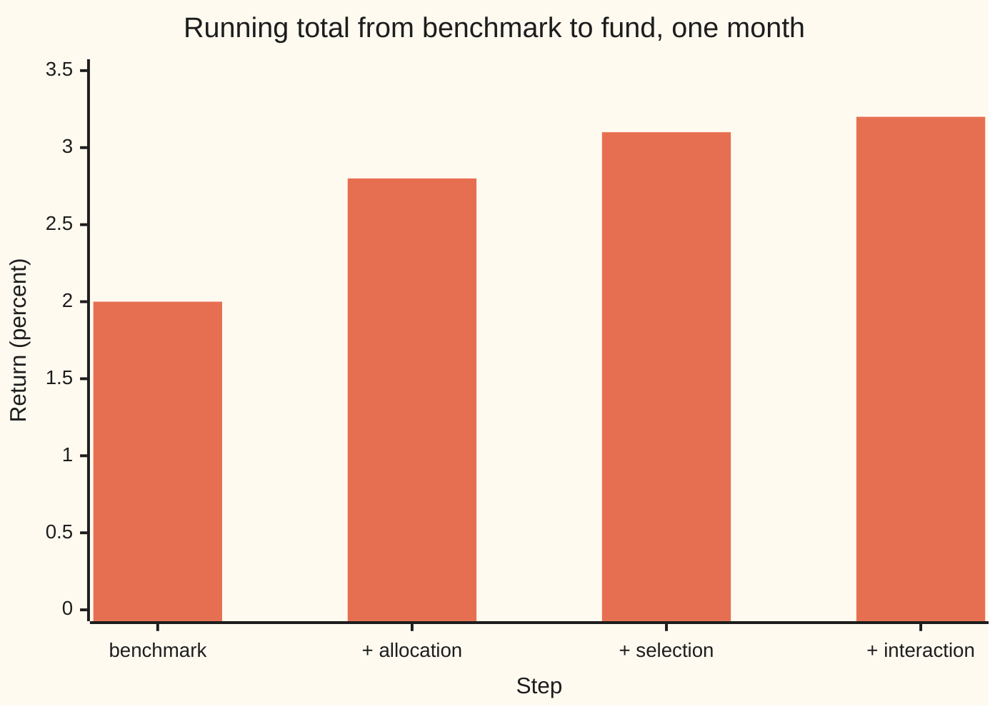
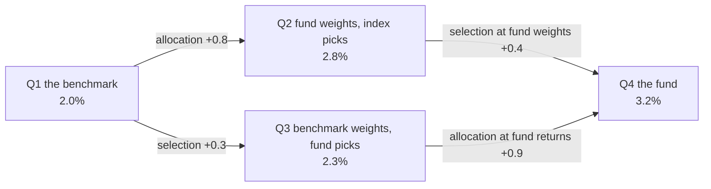

# Attribution: splitting a return into allocation, selection and interaction

[Syllabus](../../../SYLLABUS.md) → [Financial mathematics](../README.md) → [Performance and Multi-Period](../README.md#s38) → Attribution

---

## General Overview

A balanced fund holds two things: shares and bonds. Its benchmark, the index it is paid to beat, holds them half and half. Last month the benchmark returned 2.0 percent. The fund returned 3.2 percent. The fund beat its benchmark by 1.2 percentage points.

The trustees ask one question: where did the 1.2 come from? The manager made two kinds of decision. The first was how much to put in each asset class: 60 percent in shares instead of 50. The second was which shares and which bonds to buy: the fund's shares returned 6.8 percent against the benchmark's 6.0. Each decision earned part of the lead. The question is how much each.

The answer on this card: **0.8 points from allocation, 0.3 from selection, and 0.1 from interaction**, the part that needed both decisions at once. Many reports fold the interaction into selection and print 0.8 and 0.4. Both reports add back to 1.2 exactly. The method is Brinson attribution, named after Gary Brinson, whose papers of 1985 and 1986 set it out.

Two words, used from here on. **Active return** is the fund's return minus the benchmark's. A **percentage point** is the unit for a difference of two percentages: 3.2 percent minus 2.0 percent is 1.2 points, not 1.2 percent of anything.

**Set the benchmark and the fund beside two imaginary portfolios, each making only one of the fund's two decisions; the differences between the four split the active return into allocation, selection and interaction, and the pieces add back to the total exactly.**

**What kind of fact this is:** a method. Its core is an exact accounting identity, proved on this card in Why it works; where the cross-term is reported is a convention.

### The picture: from the benchmark to the fund in three steps



Each bar is the return after adding one more effect. The first bar is the benchmark, 2.0 percent. Allocation lifts it to 2.8, selection to 3.1, interaction to 3.2: the fund's actual return.

---

## The formula

Notation first, in words. The fund is cut into **sectors**, here shares and bonds, and the letter $i$ names one sector. Lower-case $w_i$ is the fund's weight in sector $i$: its share of the fund's money at the start of the month. Capital $W_i$ is the benchmark's weight. Lower-case $r_i$ is the fund's return inside the sector; $b_i$ is the benchmark's return inside the same sector. A capital sigma, $\sum_i$, means "add this up over every sector".

The two totals come first. Each is a weighted average of sector returns ([Two assets](../37-Portfolio%20Theory/01-two-asset-portfolio-risk-and-return.md)):

$$R = \sum_i w_i\, r_i, \qquad B = \sum_i W_i\, b_i$$

Then the split of their difference:

$$R - B \;=\; \sum_i \underbrace{(w_i - W_i)(b_i - B)}_{A_i} \;+\; \sum_i \underbrace{W_i\,(r_i - b_i)}_{S_i} \;+\; \sum_i \underbrace{(w_i - W_i)(r_i - b_i)}_{I_i}$$

**Read it aloud:** the fund's lead equals the extra weight times how much that sector beat the whole benchmark, plus the benchmark's weight times how much the fund's picks beat the sector, plus the extra weight times the picks' extra return.

| Symbol | Plain meaning | In our example | Push it up and the answer… |
| --- | --- | --- | --- |
| $i$, $\sum_i$ | which sector; add over every sector | shares, then bonds | — |
| $w_i$ | the fund's weight in sector $i$ at the start | 60% shares, 40% bonds | allocation and interaction grow in that sector |
| $W_i$ | the benchmark's weight in sector $i$ | 50%, 50% | the fund looks underweight: allocation shrinks |
| $r_i$ | the fund's return inside sector $i$ | 6.8%, −2.2% | selection and interaction grow |
| $b_i$ | the benchmark's return inside sector $i$ | 6.0%, −2.0% | allocation grows where the fund is overweight; selection shrinks |
| $R$ | the fund's total return | 3.2% | active return grows |
| $B$ | the benchmark's total return | 2.0% | active return shrinks |
| $A_i$ | **allocation** in sector $i$: the reward for the weight bet | 0.4 and 0.4 points | — |
| $S_i$ | **selection** in sector $i$: the reward for the picks, at benchmark weight | 0.4 and −0.1 points | — |
| $I_i$ | **interaction** in sector $i$: weight bet times picks | 0.08 and 0.02 points | — |
| $A$, $S$, $I$ | the three effects added over sectors | 0.8, 0.3, 0.1 points | — |
| $R_t$, $B_t$, $t$ | fund and benchmark return in month $t$ (Across months) | 3.2% then −1.0%; 2.0% then 1.0% | — |

Two helper readings. The bracket $(w_i - W_i)$ is the **weight bet**: positive for an overweight, negative for an underweight. The bracket $(r_i - b_i)$ is the **selection gap**: how much the fund's holdings beat the benchmark's inside one sector.

### When it holds

- **One period, weights fixed at its start.** The identity is exact for one period in which nothing is bought or sold. If the fund trades mid-month, the start weights no longer produce its return, and a residual appears. Daily or transaction-level data fixes this.
- **The same sectors on both sides.** Each fund sector needs a benchmark return to compare against. A fund-only holding, such as cash when the benchmark holds none, needs a return assigned by rule, or selection in that sector means nothing.
- **Weights that each add to 1.** The proof below uses $\sum_i w_i = \sum_i W_i = 1$. Leave cash out of the fund's weights and allocation stops summing correctly: the centering by $B$ no longer cancels.
- **Simple returns, not log returns.** Weighted averages of sector returns give the portfolio return only for simple returns ([Returns](../36-Returns%20and%20Utility/01-returns-simple-log-and-annualised.md)).
- **Accounting, not cause.** The identity says where the lead arose in this ledger. It does not say the manager was skilful, or that the result will repeat.

---

## Why it works

### Step 0: build the portfolios that were never held

The fund made two changes to the benchmark: new weights and new holdings. To price each change on its own, imagine the portfolios that make only one of them. There are four in all, one for each mix of weights and returns:

| | Benchmark returns $b_i$ | Fund returns $r_i$ |
| --- | --- | --- |
| **Benchmark weights** $W_i$ | Q1 = the benchmark = 2.0% | Q3 = benchmark weights, fund picks = 2.3% |
| **Fund weights** $w_i$ | Q2 = fund weights, index picks = 2.8% | Q4 = the fund = 3.2% |

Q1 and Q4 are real. Q2 and Q3 are **notional portfolios**: each is a sum anyone can compute from the sector data, though no one held it. Moving from Q1 to Q2 changes only the weights. Moving from Q1 to Q3 changes only the holdings.



The two paths from Q1 to Q4 both climb 1.2 points. They disagree on how to split it: the top path says 0.8 then 0.4, the bottom path 0.3 then 0.9. The 0.1 difference is the interaction.

### Step 1: allocation is the weight change alone

From Q1 to Q2 only the weights move, so

$$\text{Q2} - \text{Q1} = \sum_i w_i b_i - \sum_i W_i b_i = \sum_i (w_i - W_i)\, b_i .$$

For the fund: 0.10 × 6.0 − 0.10 × (−2.0) = 0.6 + 0.2 = 0.8 points.

### Step 2: centre it, so each sector's allocation is fair

Sector by sector, that raw version says the shares overweight earned 0.6 points and the bonds underweight 0.2. But the extra 10 percent in shares came out of bonds. Moving money from a sector that returned −2.0 percent into one that returned 6.0 percent is worth the gap between the two, not the 6.0 alone.

The fix subtracts the benchmark's total return from every sector's return. Since the weight bets add to zero, $\sum_i (w_i - W_i) = 1 - 1 = 0$, subtracting the same $B$ from each sector changes no total:

$$\sum_i (w_i - W_i)(b_i - B) = \sum_i (w_i - W_i)\, b_i - B \cdot 0 .$$

Now an overweight scores only when its sector beat the benchmark as a whole. Shares returned 6.0 against a benchmark of 2.0: 0.10 × 4.0 = 0.4 points. Bonds returned −2.0, four points under: the underweight earns −0.10 × (−4.0) = 0.4 points. Same total, 0.8, fairer labels. This centred version is the Brinson–Fachler rule of 1985.

### Step 3: selection is the holdings change alone

From Q1 to Q3 only the returns inside each sector move, at benchmark weights:

$$\text{Q3} - \text{Q1} = \sum_i W_i\,(r_i - b_i) = 0.5 \times 0.8 + 0.5 \times (-0.2) = 0.3 .$$

Fund shares beat index shares by 0.8 points; fund bonds lagged index bonds by 0.2. At half weight each, the picks were worth 0.3 points.

### Step 4: interaction is what neither change explains alone

Add allocation and selection and 0.1 points are missing. They sit in the corner of the table that needs both changes at once: extra weight in a sector where the picks also differ. Four portfolios, alternating signs, isolate it:

$$\text{Q4} - \text{Q3} - \text{Q2} + \text{Q1} = \sum_i (w_i - W_i)(r_i - b_i) = 0.10 \times 0.8 + (-0.10) \times (-0.2) = 0.1 .$$

The fund put extra money where its picks were good, shares, and less where they were poor, bonds. Both halves help.

### Step 5: the three pieces add back exactly

Q2 − Q1, Q3 − Q1 and Q4 − Q3 − Q2 + Q1 add to Q4 − Q1, since every other term cancels. Q4 is the fund, Q1 the benchmark. So allocation plus selection plus interaction is the active return, with no approximation and no residual.

<details>
<summary>Detailed proof: the identity for any number of sectors</summary>

Write each fund weight as the benchmark weight plus the bet, $w_i = W_i + (w_i - W_i)$, and each fund return as the benchmark return plus the gap, $r_i = b_i + (r_i - b_i)$. Multiply out one sector's fund contribution:
$$w_i r_i = W_i b_i + (w_i - W_i)\, b_i + W_i\,(r_i - b_i) + (w_i - W_i)(r_i - b_i).$$
Subtract $W_i b_i$ and add over sectors:
$$R - B = \sum_i (w_i - W_i)\, b_i + \sum_i W_i\,(r_i - b_i) + \sum_i (w_i - W_i)(r_i - b_i).$$
Both weight lists add to 1, so $\sum_i (w_i - W_i) = 0$ and $\sum_i (w_i - W_i) B = 0$. Subtracting that zero from the first sum gives $\sum_i (w_i - W_i)(b_i - B) = A$. The other two sums are $S$ and $I$. Hence $R - B = A + S + I$. Nothing was assumed about probability, markets or the size of the returns; only finite sums and weights that add to 1. The centring holds for the total, not sector by sector: in one sector the three effects miss the sector's raw contribution $w_i r_i - W_i b_i$ by $(w_i - W_i) B$, and those misses cancel across sectors.

</details>

<details>
<summary>Why the interaction has no natural owner</summary>

The interaction is a product of two bets: the weight bet times the selection gap. A product of two changes belongs to neither one. The two paths in the Step 0 chart show it: allocate first and the interaction joins selection (0.4); select first and it joins allocation (0.9). Reports that show two effects pick one path, usually allocation first, because many funds decide the split between asset classes before they pick securities. Reports that show three effects refuse to pick.

</details>

A second road reaches the same split without sectors at all: compute Q1 to Q4 as whole-portfolio returns and take differences, as in Step 0. The code below does both and checks they agree.

---

## Worked numbers, by hand

| Step | Arithmetic | Value |
| --- | --- | --- |
| benchmark return $B$ | 0.5 × 6.0 + 0.5 × (−2.0) | 2.0% |
| fund return $R$ | 0.6 × 6.8 + 0.4 × (−2.2) | 3.2% |
| active return | 3.2 − 2.0 | 1.2 points |
| shares allocation | (0.6 − 0.5) × (6.0 − 2.0) | 0.4 |
| bonds allocation | (0.4 − 0.5) × (−2.0 − 2.0) | 0.4 |
| shares selection | 0.5 × (6.8 − 6.0) | 0.4 |
| bonds selection | 0.5 × (−2.2 − (−2.0)) | −0.1 |
| shares interaction | 0.1 × 0.8 | 0.08 |
| bonds interaction | −0.1 × (−0.2) | 0.02 |
| allocation $A$ | 0.4 + 0.4 | **0.8** |
| selection $S$ | 0.4 − 0.1 | **0.3** |
| interaction $I$ | 0.08 + 0.02 | **0.1** |
| check | 0.8 + 0.3 + 0.1 | **1.2 points** |
| two-effect selection | 0.3 + 0.1, or 0.6 × 0.8 + 0.4 × (−0.2) | **0.4** |

Most of the lead came from the asset-class call: more shares in a month when shares beat bonds. The rest came from the picks, mostly the choice of shares.

Sector by sector, in percentage points, one block = 0.02 points:

```
sector   effect        one block = 0.02 points
shares   allocation    ████████████████████  +0.40
shares   selection     ████████████████████  +0.40
shares   interaction   ████                  +0.08
bonds    allocation    ████████████████████  +0.40
bonds    selection     ░░░░░                 −0.10
bonds    interaction   █                     +0.02
```

Solid blocks add to the lead; hollow blocks subtract. The bonds picks lost a little; the decision to hold fewer bonds more than paid for it.

### What breaks if you drop a piece

| Mistake | Comes out at | What went wrong |
| --- | --- | --- |
| Report allocation and selection, drop interaction | 1.1 points | 0.1 of the lead is left unexplained, and looks like an error in the data |
| Selection at fund weights, then also add interaction | 1.3 points | The interaction is counted twice: fund-weight selection already contains it |
| Allocation without centring, sector by sector | shares 0.6, bonds 0.2 | Total still 0.8, but the shares overweight is credited with the whole 6.0 return, though the money came from bonds |
| Add monthly active returns to get a two-month figure | −0.8 points | The funds compound; the true two-month gap is −0.852 (Across months below) |

---

## Across months: the effects stop adding

### The mystery: two good sums, one wrong total

Take a second month. The weights start again at 60/40 against 50/50. Benchmark shares return 3.0 percent and bonds −1.0, so the benchmark makes 1.0 percent. The fund's shares return 0.0 and its bonds −2.5, so the fund makes −1.0 percent. Month 2 splits as allocation 0.4, selection −2.25, interaction −0.15: a total of −2.0 points.

Add the two months' active returns: 1.2 − 2.0 = −0.8 points. Now compound. The fund grew by 1.032 × 0.99, a gain of 2.168 percent. The benchmark grew by 1.02 × 1.01, a gain of 3.02 percent. The real two-month gap is −0.852 points. The monthly effects add to a number that no one's account shows.

| | Month 1 | Month 2 | Added | Compounded |
| --- | --- | --- | --- | --- |
| fund | 3.2% | −1.0% | | 2.168% |
| benchmark | 2.0% | 1.0% | | 3.02% |
| active | 1.2 | −2.0 | −0.8 | **−0.852** |

### Why: returns multiply

Money earned in month 1 is itself invested in month 2. The fund's 1.2-point lead in month 1 was then exposed to month 2's returns. Algebra shows where the extra loss comes from. Add and subtract $(1 + R_1)(1 + B_2)$:

$$(1+R_1)(1+R_2) - (1+B_1)(1+B_2) = (R_1 - B_1)(1 + B_2) + (1 + R_1)(R_2 - B_2).$$

Check it by expanding: the cross-terms cancel and both sides equal $R_1 + R_2 + R_1 R_2 - B_1 - B_2 - B_1 B_2$.

### The fix: scale each month, then add

The right-hand side says what to do. Month 1's active return is scaled by $(1 + B_2)$: the benchmark's growth afterwards. Month 2's is scaled by $(1 + R_1)$: the fund's growth before. Each month's allocation, selection and interaction carry the same scale as that month's total, so they still add up:

| Effect | Month 1 × 1.01 | Month 2 × 1.032 | Linked |
| --- | --- | --- | --- |
| allocation | 0.8 | 0.4 | **1.2208** |
| selection | 0.3 | −2.25 | **−2.0190** |
| interaction | 0.1 | −0.15 | **−0.0538** |
| total | 1.2 | −2.0 | **−0.852** |

The linked effects add to the compounded gap exactly. With more months, the same telescoping works: month $t$ is scaled by the fund's growth over the months before it and the benchmark's growth over the months after it. Month $t$ uses $R_t$ and $B_t$ from its own ledger.

The scaling is not unique. Telescope the other way, benchmark before and fund after, and the labels change while the total does not. This is the interaction's problem again, in time instead of across sectors. Industry uses several named linking schemes; Bacon's review compares them. A report should name the one it uses.

---

## Code, from first principles, and it actually runs

The code reaches the one-month split by three roads and checks them against each other: direct totals, the sector formula, and the four notional portfolios. A per-sector check pins the centring. A fourth road changes one decision at a time in both orders, which measures the interaction as the gap between them. A fifth road builds 1,000 random five-sector ledgers from a home-made random number generator and checks that the identity reconciles in every one. The two-month section compounds the returns directly and compares with the linked effects. Three broken versions of the formula are run; each must fail to reconcile. Every number on the card is printed below.

### Python

```python
# Brinson attribution -- the check behind the card.  Standard library only.
# Every number quoted on the card is printed here, in percentage points (pp).
# Roads: direct totals, the per-sector formula, four notional portfolios,
# two one-decision-at-a-time paths, and 1,000 random ledgers.

def total(weights, returns):                      # a portfolio's return: weights times returns, added
    return sum(w * x for w, x in zip(weights, returns))

def effects(w, W, r, b):                          # Brinson-Fachler, one row per sector
    B = total(W, b)
    A = [(w[i] - W[i]) * (b[i] - B) for i in range(len(w))]
    S = [W[i] * (r[i] - b[i]) for i in range(len(w))]
    I = [(w[i] - W[i]) * (r[i] - b[i]) for i in range(len(w))]
    return A, S, I

def pp(x):                                        # decimal return -> percentage points
    return f"{100 * x + 0.0:+.4f}"

def show(label, x):
    print(f"{label:<44} {pp(x)}")

# ---- the example: shares and bonds, one month ----
w = [0.60, 0.40]        # fund's weights at the start
W = [0.50, 0.50]        # benchmark's weights
r = [0.068, -0.022]     # fund's return inside each sector
b = [0.060, -0.020]     # benchmark's return inside each sector
R, B = total(w, r), total(W, b)
A, S, I = effects(w, W, r, b)
show("fund return R", R)
show("benchmark return B", B)
show("road 1  active return R - B", R - B)
for k, name in enumerate(["shares", "bonds"]):
    show(f"{name}: allocation", A[k])
    show(f"{name}: selection", S[k])
    show(f"{name}: interaction", I[k])
show("allocation A", sum(A))
show("selection S", sum(S))
show("interaction I", sum(I))
show("road 2  A + S + I", sum(A) + sum(S) + sum(I))

# ---- road 3: four notional portfolios, whole-portfolio returns only ----
Q1, Q2, Q3, Q4 = total(W, b), total(w, b), total(W, r), total(w, r)
show("Q1 benchmark weights, benchmark returns", Q1)
show("Q2 fund weights, benchmark returns", Q2)
show("Q3 benchmark weights, fund returns", Q3)
show("Q4 fund weights, fund returns", Q4)
show("road 3  allocation Q2 - Q1", Q2 - Q1)
show("road 3  selection Q3 - Q1", Q3 - Q1)
show("road 3  interaction Q4 - Q3 - Q2 + Q1", Q4 - Q3 - Q2 + Q1)

# ---- road 4: change one decision at a time, in both orders ----
sel_at_fund_w = sum(w[k] * (r[k] - b[k]) for k in range(2))
alloc_at_fund_r = sum((w[k] - W[k]) * r[k] for k in range(2))
show("allocation first: then selection", sel_at_fund_w)
show("selection first: then allocation", alloc_at_fund_r)
show("staircase: benchmark", B)
show("staircase: + allocation", B + sum(A))
show("staircase: + selection", B + sum(A) + sum(S))
show("staircase: + interaction = fund", B + sum(A) + sum(S) + sum(I))

# ---- what breaks ----
uncentred = [(w[k] - W[k]) * b[k] for k in range(2)]
show("wrong: drop interaction", sum(A) + sum(S))
show("wrong: fund-weight selection + interaction", sum(A) + sel_at_fund_w + sum(I))
show("uncentred allocation, shares", uncentred[0])
show("uncentred allocation, bonds", uncentred[1])

# ---- try changing ----
show("try: copy benchmark weights, active", sum(sum(e) for e in effects(W, W, r, b)))
show("try: copy benchmark returns, active", sum(sum(e) for e in effects(w, W, b, b)))
show("try: flip to 40/60, allocation", sum(effects([0.4, 0.6], W, r, b)[0]))
show("try: flip to 40/60, active", total([0.4, 0.6], r) - B)

# ---- two months: link before adding ----
r2, b2 = [0.000, -0.025], [0.030, -0.010]      # month 2, same starting weights
R2, B2 = total(w, r2), total(W, b2)
A2, S2, I2 = effects(w, W, r2, b2)
show("month 2: fund", R2)
show("month 2: benchmark", B2)
show("month 2: allocation", sum(A2))
show("month 2: selection", sum(S2))
show("month 2: interaction", sum(I2))
naive = (R - B) + (R2 - B2)
compound = (1 + R) * (1 + R2) - (1 + B) * (1 + B2)
f1, f2 = 1 + B2, 1 + R                          # month 1 scaled by later benchmark growth, month 2 by earlier fund growth
linked = [sum(A) * f1 + sum(A2) * f2, sum(S) * f1 + sum(S2) * f2, sum(I) * f1 + sum(I2) * f2]
show("two months: sum of monthly active", naive)
show("two months: compounded fund", (1 + R) * (1 + R2) - 1)
show("two months: compounded benchmark", (1 + B) * (1 + B2) - 1)
show("two months: compounded active", compound)
show("linked allocation", linked[0])
show("linked selection", linked[1])
show("linked interaction", linked[2])
show("linked total", sum(linked))

# ---- road 5: 1,000 random ledgers, five sectors, home-made random numbers ----
state = 20260928
def rnd():
    global state
    state = (6364136223846793005 * state + 1442695040888963407) % 2**64
    return (state >> 11) / 2**53
worst = 0.0
for trial in range(1000):
    raw_w = [rnd() for _ in range(5)]; raw_W = [rnd() for _ in range(5)]
    tw = [x / sum(raw_w) for x in raw_w]; tW = [x / sum(raw_W) for x in raw_W]
    tr = [0.4 * rnd() - 0.2 for _ in range(5)]; tb = [0.4 * rnd() - 0.2 for _ in range(5)]
    a, s, i = effects(tw, tW, tr, tb)
    worst = max(worst, abs(sum(a) + sum(s) + sum(i) - (total(tw, tr) - total(tW, tb))))
print(f"{'1000 random ledgers reconcile to 1e-12':<44} {'yes' if worst < 1e-12 else 'no'}")

# ---- mutants: break the formula three ways; each must fail to reconcile ----
mutants = {
    "interaction dropped": lambda k: (w[k] - W[k]) * (b[k] - B) + W[k] * (r[k] - b[k]),
    "selection at fund weights": lambda k: (w[k] - W[k]) * (b[k] - B) + w[k] * (r[k] - b[k]) + (w[k] - W[k]) * (r[k] - b[k]),
    "allocation at fund returns": lambda k: (w[k] - W[k]) * (r[k] - B) + W[k] * (r[k] - b[k]) + (w[k] - W[k]) * (r[k] - b[k]),
}
caught = 0
for name, f in mutants.items():
    caught += abs(sum(f(k) for k in range(2)) - (R - B)) > 1e-9
print(f"{'mutants caught (of 3)':<44} {caught}")

# ---- asserts: each side computed a different way ----
assert abs((R - B) - 0.012) < 1e-12                                 # the headline, from the example's statement
assert abs(sum(A) + sum(S) + sum(I) - (R - B)) < 1e-12              # formula vs direct totals
assert abs(sum(A) - (Q2 - Q1)) < 1e-12                              # centred sector formula vs notional portfolios
assert abs(sum(I) - (Q4 - Q3 - Q2 + Q1)) < 1e-12
for k in range(2):                                                  # per sector: effects miss the raw contribution by (w - W) B
    assert abs(A[k] + S[k] + I[k] + (w[k] - W[k]) * B - (w[k] * r[k] - W[k] * b[k])) < 1e-12
assert abs(sum(I) - (alloc_at_fund_r - sum(A))) < 1e-12              # interaction = how much the order matters
assert abs(sum(linked) - compound) < 1e-12                          # linking vs compounding
assert worst < 1e-12                                                # 1,000 ledgers nobody chose
assert caught == 3                                                  # every broken formula fails to reconcile
print("all checks passed")
```

**Ran 2026-09-28 on macOS, Python 3.14.6, standard library only. All checks passed. Output, pasted from the run:**

```
fund return R                                +3.2000
benchmark return B                           +2.0000
road 1  active return R - B                  +1.2000
shares: allocation                           +0.4000
shares: selection                            +0.4000
shares: interaction                          +0.0800
bonds: allocation                            +0.4000
bonds: selection                             -0.1000
bonds: interaction                           +0.0200
allocation A                                 +0.8000
selection S                                  +0.3000
interaction I                                +0.1000
road 2  A + S + I                            +1.2000
Q1 benchmark weights, benchmark returns      +2.0000
Q2 fund weights, benchmark returns           +2.8000
Q3 benchmark weights, fund returns           +2.3000
Q4 fund weights, fund returns                +3.2000
road 3  allocation Q2 - Q1                   +0.8000
road 3  selection Q3 - Q1                    +0.3000
road 3  interaction Q4 - Q3 - Q2 + Q1        +0.1000
allocation first: then selection             +0.4000
selection first: then allocation             +0.9000
staircase: benchmark                         +2.0000
staircase: + allocation                      +2.8000
staircase: + selection                       +3.1000
staircase: + interaction = fund              +3.2000
wrong: drop interaction                      +1.1000
wrong: fund-weight selection + interaction   +1.3000
uncentred allocation, shares                 +0.6000
uncentred allocation, bonds                  +0.2000
try: copy benchmark weights, active          +0.3000
try: copy benchmark returns, active          +0.8000
try: flip to 40/60, allocation               -0.8000
try: flip to 40/60, active                   -0.6000
month 2: fund                                -1.0000
month 2: benchmark                           +1.0000
month 2: allocation                          +0.4000
month 2: selection                           -2.2500
month 2: interaction                         -0.1500
two months: sum of monthly active            -0.8000
two months: compounded fund                  +2.1680
two months: compounded benchmark             +3.0200
two months: compounded active                -0.8520
linked allocation                            +1.2208
linked selection                             -2.0190
linked interaction                           -0.0538
linked total                                 -0.8520
1000 random ledgers reconcile to 1e-12       yes
mutants caught (of 3)                        3
all checks passed
```

### Rust

```rust
// Brinson attribution -- the check behind the card.  Rust std only, no crates.
// Every number quoted on the card is printed here, in percentage points (pp).
// Roads: direct totals, the per-sector formula, four notional portfolios,
// two one-decision-at-a-time paths, and 1,000 random ledgers.

fn total(weights: &[f64], returns: &[f64]) -> f64 {
    weights.iter().zip(returns).map(|(w, x)| w * x).sum()
}

// Brinson-Fachler, one entry per sector: (allocation, selection, interaction)
fn effects(w: &[f64], wb: &[f64], r: &[f64], b: &[f64]) -> (Vec<f64>, Vec<f64>, Vec<f64>) {
    let bt = total(wb, b);
    let n = w.len();
    let a = (0..n).map(|i| (w[i] - wb[i]) * (b[i] - bt)).collect();
    let s = (0..n).map(|i| wb[i] * (r[i] - b[i])).collect();
    let x = (0..n).map(|i| (w[i] - wb[i]) * (r[i] - b[i])).collect();
    (a, s, x)
}

fn sum(v: &[f64]) -> f64 {
    v.iter().sum()
}

fn show(label: &str, x: f64) {
    println!("{:<44} {:+.4}", label, 100.0 * x + 0.0);
}

struct Lcg(u64);
impl Lcg {
    fn next(&mut self) -> f64 {
        self.0 = self.0.wrapping_mul(6364136223846793005).wrapping_add(1442695040888963407);
        (self.0 >> 11) as f64 / (1u64 << 53) as f64
    }
}

fn main() {
    // ---- the example: shares and bonds, one month ----
    let w = [0.60, 0.40]; // fund's weights at the start
    let wb = [0.50, 0.50]; // benchmark's weights
    let r = [0.068, -0.022]; // fund's return inside each sector
    let b = [0.060, -0.020]; // benchmark's return inside each sector
    let (rt, bt) = (total(&w, &r), total(&wb, &b));
    let (a, s, x) = effects(&w, &wb, &r, &b);
    show("fund return R", rt);
    show("benchmark return B", bt);
    show("road 1  active return R - B", rt - bt);
    for (k, name) in ["shares", "bonds"].iter().enumerate() {
        show(&format!("{}: allocation", name), a[k]);
        show(&format!("{}: selection", name), s[k]);
        show(&format!("{}: interaction", name), x[k]);
    }
    let (sa, ss, si) = (sum(&a), sum(&s), sum(&x));
    show("allocation A", sa);
    show("selection S", ss);
    show("interaction I", si);
    show("road 2  A + S + I", sa + ss + si);

    // ---- road 3: four notional portfolios, whole-portfolio returns only ----
    let (q1, q2, q3, q4) = (total(&wb, &b), total(&w, &b), total(&wb, &r), total(&w, &r));
    show("Q1 benchmark weights, benchmark returns", q1);
    show("Q2 fund weights, benchmark returns", q2);
    show("Q3 benchmark weights, fund returns", q3);
    show("Q4 fund weights, fund returns", q4);
    show("road 3  allocation Q2 - Q1", q2 - q1);
    show("road 3  selection Q3 - Q1", q3 - q1);
    show("road 3  interaction Q4 - Q3 - Q2 + Q1", q4 - q3 - q2 + q1);

    // ---- road 4: change one decision at a time, in both orders ----
    let sel_at_fund_w: f64 = (0..2).map(|k| w[k] * (r[k] - b[k])).sum();
    let alloc_at_fund_r: f64 = (0..2).map(|k| (w[k] - wb[k]) * r[k]).sum();
    show("allocation first: then selection", sel_at_fund_w);
    show("selection first: then allocation", alloc_at_fund_r);
    show("staircase: benchmark", bt);
    show("staircase: + allocation", bt + sa);
    show("staircase: + selection", bt + sa + ss);
    show("staircase: + interaction = fund", bt + sa + ss + si);

    // ---- what breaks ----
    show("wrong: drop interaction", sa + ss);
    show("wrong: fund-weight selection + interaction", sa + sel_at_fund_w + si);
    show("uncentred allocation, shares", (w[0] - wb[0]) * b[0]);
    show("uncentred allocation, bonds", (w[1] - wb[1]) * b[1]);

    // ---- try changing ----
    let act = |e: (Vec<f64>, Vec<f64>, Vec<f64>)| sum(&e.0) + sum(&e.1) + sum(&e.2);
    show("try: copy benchmark weights, active", act(effects(&wb, &wb, &r, &b)));
    show("try: copy benchmark returns, active", act(effects(&w, &wb, &b, &b)));
    show("try: flip to 40/60, allocation", sum(&effects(&[0.4, 0.6], &wb, &r, &b).0));
    show("try: flip to 40/60, active", total(&[0.4, 0.6], &r) - bt);

    // ---- two months: link before adding ----
    let (r2, b2) = ([0.000, -0.025], [0.030, -0.010]); // month 2, same starting weights
    let (rt2, bt2) = (total(&w, &r2), total(&wb, &b2));
    let (a2, s2, x2) = effects(&w, &wb, &r2, &b2);
    show("month 2: fund", rt2);
    show("month 2: benchmark", bt2);
    show("month 2: allocation", sum(&a2));
    show("month 2: selection", sum(&s2));
    show("month 2: interaction", sum(&x2));
    let naive = (rt - bt) + (rt2 - bt2);
    let compound = (1.0 + rt) * (1.0 + rt2) - (1.0 + bt) * (1.0 + bt2);
    let (f1, f2) = (1.0 + bt2, 1.0 + rt); // month 1 scaled by later benchmark growth, month 2 by earlier fund growth
    let linked = [sa * f1 + sum(&a2) * f2, ss * f1 + sum(&s2) * f2, si * f1 + sum(&x2) * f2];
    show("two months: sum of monthly active", naive);
    show("two months: compounded fund", (1.0 + rt) * (1.0 + rt2) - 1.0);
    show("two months: compounded benchmark", (1.0 + bt) * (1.0 + bt2) - 1.0);
    show("two months: compounded active", compound);
    show("linked allocation", linked[0]);
    show("linked selection", linked[1]);
    show("linked interaction", linked[2]);
    show("linked total", sum(&linked));

    // ---- road 5: 1,000 random ledgers, five sectors, home-made random numbers ----
    let mut g = Lcg(20260928);
    let mut worst: f64 = 0.0;
    for _ in 0..1000 {
        let raw_w: Vec<f64> = (0..5).map(|_| g.next()).collect();
        let raw_wb: Vec<f64> = (0..5).map(|_| g.next()).collect();
        let tw: Vec<f64> = raw_w.iter().map(|x| x / sum(&raw_w)).collect();
        let twb: Vec<f64> = raw_wb.iter().map(|x| x / sum(&raw_wb)).collect();
        let tr: Vec<f64> = (0..5).map(|_| 0.4 * g.next() - 0.2).collect();
        let tb: Vec<f64> = (0..5).map(|_| 0.4 * g.next() - 0.2).collect();
        let (ta, ts, ti) = effects(&tw, &twb, &tr, &tb);
        let gap = sum(&ta) + sum(&ts) + sum(&ti) - (total(&tw, &tr) - total(&twb, &tb));
        worst = worst.max(gap.abs());
    }
    println!("{:<44} {}", "1000 random ledgers reconcile to 1e-12", if worst < 1e-12 { "yes" } else { "no" });

    // ---- mutants: break the formula three ways; each must fail to reconcile ----
    let mutants: [&dyn Fn(usize) -> f64; 3] = [
        &|k| (w[k] - wb[k]) * (b[k] - bt) + wb[k] * (r[k] - b[k]),
        &|k| (w[k] - wb[k]) * (b[k] - bt) + w[k] * (r[k] - b[k]) + (w[k] - wb[k]) * (r[k] - b[k]),
        &|k| (w[k] - wb[k]) * (r[k] - bt) + wb[k] * (r[k] - b[k]) + (w[k] - wb[k]) * (r[k] - b[k]),
    ];
    let caught = mutants.iter().filter(|f| ((0..2).map(|k| f(k)).sum::<f64>() - (rt - bt)).abs() > 1e-9).count();
    println!("{:<44} {}", "mutants caught (of 3)", caught);

    // ---- asserts: each side computed a different way ----
    assert!(((rt - bt) - 0.012).abs() < 1e-12); // the headline, from the example's statement
    assert!((sa + ss + si - (rt - bt)).abs() < 1e-12); // formula vs direct totals
    assert!((sa - (q2 - q1)).abs() < 1e-12); // centred sector formula vs notional portfolios
    assert!((si - (q4 - q3 - q2 + q1)).abs() < 1e-12);
    for k in 0..2 {
        // per sector: effects miss the raw contribution by (w - W) B
        assert!((a[k] + s[k] + x[k] + (w[k] - wb[k]) * bt - (w[k] * r[k] - wb[k] * b[k])).abs() < 1e-12);
    }
    assert!((si - (alloc_at_fund_r - sa)).abs() < 1e-12); // interaction = how much the order matters
    assert!((sum(&linked) - compound).abs() < 1e-12); // linking vs compounding
    assert!(worst < 1e-12); // 1,000 ledgers nobody chose
    assert_eq!(caught, 3); // every broken formula fails to reconcile
    println!("all checks passed");
}
```

**Ran 2026-09-28 on macOS, rustc 1.98.1, no crates. All checks passed. Output, pasted from the run:**

```
fund return R                                +3.2000
benchmark return B                           +2.0000
road 1  active return R - B                  +1.2000
shares: allocation                           +0.4000
shares: selection                            +0.4000
shares: interaction                          +0.0800
bonds: allocation                            +0.4000
bonds: selection                             -0.1000
bonds: interaction                           +0.0200
allocation A                                 +0.8000
selection S                                  +0.3000
interaction I                                +0.1000
road 2  A + S + I                            +1.2000
Q1 benchmark weights, benchmark returns      +2.0000
Q2 fund weights, benchmark returns           +2.8000
Q3 benchmark weights, fund returns           +2.3000
Q4 fund weights, fund returns                +3.2000
road 3  allocation Q2 - Q1                   +0.8000
road 3  selection Q3 - Q1                    +0.3000
road 3  interaction Q4 - Q3 - Q2 + Q1        +0.1000
allocation first: then selection             +0.4000
selection first: then allocation             +0.9000
staircase: benchmark                         +2.0000
staircase: + allocation                      +2.8000
staircase: + selection                       +3.1000
staircase: + interaction = fund              +3.2000
wrong: drop interaction                      +1.1000
wrong: fund-weight selection + interaction   +1.3000
uncentred allocation, shares                 +0.6000
uncentred allocation, bonds                  +0.2000
try: copy benchmark weights, active          +0.3000
try: copy benchmark returns, active          +0.8000
try: flip to 40/60, allocation               -0.8000
try: flip to 40/60, active                   -0.6000
month 2: fund                                -1.0000
month 2: benchmark                           +1.0000
month 2: allocation                          +0.4000
month 2: selection                           -2.2500
month 2: interaction                         -0.1500
two months: sum of monthly active            -0.8000
two months: compounded fund                  +2.1680
two months: compounded benchmark             +3.0200
two months: compounded active                -0.8520
linked allocation                            +1.2208
linked selection                             -2.0190
linked interaction                           -0.0538
linked total                                 -0.8520
1000 random ledgers reconcile to 1e-12       yes
mutants caught (of 3)                        3
all checks passed
```

The two outputs are identical line for line.

> [!TIP]
> **Try changing**
> Guess the answer first. Then run it.
> - **Copy the benchmark's weights.** Pass `W` as the fund's weights. Allocation and interaction vanish; the whole lead is selection, **0.3 points**.
> - **Copy the benchmark's holdings.** Pass `b` as the fund's returns. Selection and interaction vanish; the lead is pure allocation, **0.8 points**.
> - **Flip the bet.** Fund weights 40/60, overweight bonds. Allocation turns to **−0.8 points** and the fund trails the benchmark by **0.6 points**, though its picks are unchanged.
> - **Drop the centring.** Replace `(b[i] - B)` with `b[i]` in the allocation line. Allocation still totals 0.8 and every total assert passes; only the per-sector assert fails, as shares now claim 0.6 and bonds 0.2. The labels move, the total does not: Step 2's point, tested.

---

## The usual mistake

> [!warning]
> **Reading allocation and selection as proof of skill.** They are accounting. A 0.3-point selection effect says the fund's holdings beat the benchmark's inside each sector this month. It does not say the picks were clever rather than lucky, or that they carried no extra risk. One month of a two-sector fund proves nothing; separating skill from luck needs many periods and a risk measure ([Performance measures](01-sharpe-information-and-drawdown.md)).
>
> Smaller traps:
> - **Comparing a two-effect report with a three-effect one.** One manager shows selection 0.4, another 0.3, on identical numbers. The difference is the interaction, 0.1, and where the report put it.
> - **Adding months.** Monthly effects summed over two months give −0.8 points; the funds actually differ by −0.852. Link, then add.
> - **Moving the sector lines.** Reclassify one stock from one sector to another and allocation and selection change, while the fund and benchmark totals do not. The split depends on the sectors chosen.
> - **Weights at the wrong time.** Start-of-period weights produce the period's return. End-of-period weights already contain the returns being explained, and the ledger stops balancing.

---

## Where you meet it in real life

- **Quarterly reports to pension trustees.** Almost every institutional fund report carries an attribution table, sector by sector, with allocation and selection columns. The Brinson papers are the reason the columns have those names.
- **Deciding who is paid.** Large funds split the job: an asset-allocation committee sets the weights, specialist managers pick the securities. Allocation measures the committee; selection measures the specialists.
- **Performance standards.** The Global Investment Performance Standards (GIPS) govern how returns are calculated and presented to clients. Attribution is built on returns calculated that way.
- **Factor attribution.** Instead of sectors, split the fund's exposures by factors such as size, value or momentum ([Factor models](../37-Portfolio%20Theory/05-factor-models-and-apt.md)). The bookkeeping is the same: exposure bet times factor return, plus what is left over.
- **Rebalancing reviews.** Trading mid-period moves weights away from their starting values. The residual it leaves in a monthly attribution is one measure of what trading cost ([Rebalancing](04-rebalancing-and-transaction-costs.md)).

> **Say it back**
> A fund's lead over its benchmark comes from two kinds of decision: how much to put in each sector, and what to hold inside it. Four portfolios, the benchmark, the fund and two mixtures, price each decision alone. Allocation is extra weight times how much the sector beat the whole benchmark; selection is benchmark weight times how much the picks beat the sector; interaction is extra weight times the picks' gap. The three add back to the active return exactly, in one period. Over several periods returns compound, so each period's effects are scaled before they are added.

---

## What this builds on

- [Performance measures](01-sharpe-information-and-drawdown.md): active return and the information ratio, the single number this card takes apart.
- [Two assets](../37-Portfolio%20Theory/01-two-asset-portfolio-risk-and-return.md): a portfolio's return is the weighted average of its parts' returns. Every Q on this card is one.
- [Returns](../36-Returns%20and%20Utility/01-returns-simple-log-and-annualised.md): simple returns average across holdings, and compound across time. Across months uses both facts.

## Where this goes next

- [Merton's problem](03-mertons-portfolio-problem.md): this card measured an allocation after the fact; Merton's problem asks what the allocation between shares and cash should be in advance.
- [Rebalancing](04-rebalancing-and-transaction-costs.md): weights drift within a period and trading them back costs money, the source of the residual this card assumed away.
- [Investing over a lifetime](05-life-cycle-and-glide-paths.md): an allocation that changes on purpose over decades, the long version of the weight bet.

Attribution says where last month's lead came from; it does not say what the weights should have been, which is the question Merton's problem answers.

---

## Sources

Verified 2026-09-28: every link below resolves to the publisher's page.

- Brinson, Gary P., and Nimrod Fachler. "Measuring Non-U.S. Equity Portfolio Performance." *Journal of Portfolio Management* 11, no. 3 (1985): 73–76. [doi:10.3905/jpm.1985.409005](https://doi.org/10.3905/jpm.1985.409005). The centred allocation of Step 2.
- Brinson, Gary P., L. Randolph Hood, and Gilbert L. Beebower. "Determinants of Portfolio Performance." *Financial Analysts Journal* 42, no. 4 (1986): 39–44. [doi:10.2469/faj.v42.n4.39](https://doi.org/10.2469/faj.v42.n4.39). The four notional portfolios and the interaction term.
- Bacon, Carl R. *Performance Attribution: History and Progress*. CFA Institute Research Foundation, 2019. [Publisher page](https://rpc.cfainstitute.org/research/foundation/2019/performance-attribution). A review of the Brinson models, their conventions and the multi-period linking schemes.
- Bacon, Carl R. *Practical Portfolio Performance Measurement and Attribution*, 3rd ed. Wiley, 2023. [Publisher page](https://www.wiley.com/en-us/Practical+Portfolio+Performance+Measurement+and+Attribution%2C+3rd+Edition-p-9781119831969). The practitioner's textbook: attribution tables, cash, trading residuals and linking.
